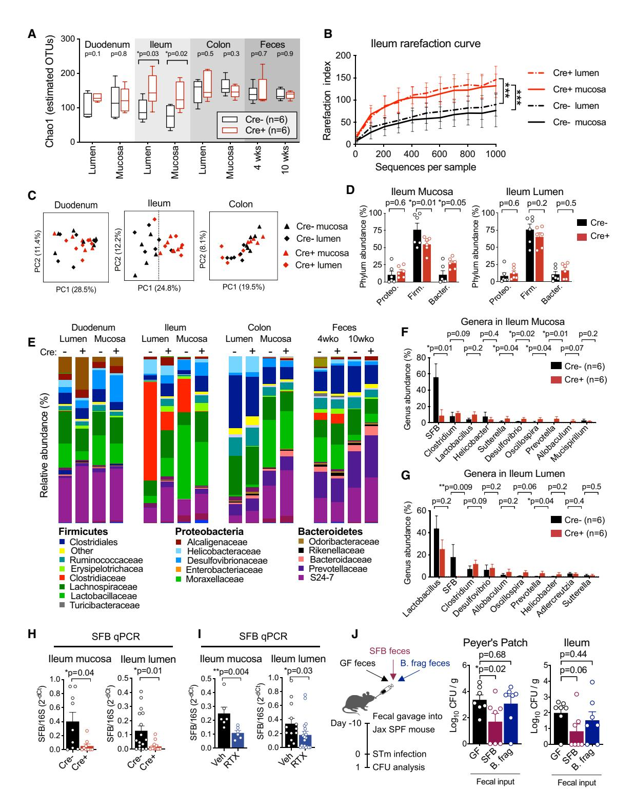

Cell

Article

# **Gut-Innervating Nociceptor Neurons Regulate Peyer's Patch Microfold Cells and SFB Levels to** Mediate Salmonella Host Defense

## **Graphical Abstract**

## Highlights

- Nociceptors mediate enteric defense against Salmonella colonization and PP invasion
- Nociceptors shape the gut microbiota and SFB levels to resist Salmonella infection
- Nociceptors suppress M cell density to regulate SFB and limit bacterial invasion
- Nociceptors directly sense Salmonella to release CGRP to promote host defense

## Authors

Nicole Y. Lai, Melissa A. Musser, Felipe A. Pinho-Ribeiro, ..., Jun R. Huh, Meenakshi Rao, Isaac M. Chiu

## Correspondence

isaac\_chiu@hms.harvard.edu

## In Brief

Extrinsic nociceptor neurons mediate protection from Salmonella infection by direct sensing and release of CGRP, which leads to suppression of M cell density and maintenance of SFB colonization of the ileum.

Lai et al., 2020, Cell 180, 33-49

January 9, 2020 © 2019 Elsevier Inc.

https://doi.org/10.1016/j.cell.2019.11.014

CellPress

Article

Cell

# **Gut-Innervating Nociceptor Neurons Regulate** Peyer's Patch Microfold Cells and SFB Levels to Mediate Salmonella Host Defense

Nicole Y. Lai,1 Melissa A. Musser,1,2,11 Felipe A. Pinho-Ribeiro,1,11 Pankaj Baral,1,11 Amanda Jacobson,1,11 Pingchuan Ma,1 David E. Potts,1 Zuojia Chen,3,4 Donggi Paik,1 Salima Soualhi,2 Yiqing Yan,1 Aditya Misra,1 Kaitlin Goldstein,1 Valentina N. Lagomarsino,1 Anja Nordstrom,5 Kisha N. Sivanathan,3 Antonia Wallrapp,3 Vijay K. Kuchroo,3 Roni Nowarski,3 Michael N. Starnbach,6 Hailian Shi,1,7 Neeraj K. Surana,1,8,9,10 Dingding An,2 Chuan Wu,3,4 Jun R. Huh,1 Meenakshi Rao,2 and Isaac M. Chiu1,12,\*

1Department of Immunology, Harvard Medical School, Boston, MA 02115, USA

2Department of Pediatrics, Boston Children's Hospital, Boston, MA 02115, USA

3Evergrande Center for Immunologic Diseases, Harvard Medical School and Brigham and Women's Hospital, Boston, MA 02115, USA

4Experimental Immunology Branch, National Cancer Institute, National Institutes of Health, Bethesda, MD 20892, USA

5Department of Cell Biology, Harvard Medical School, Boston, MA 02115, USA

6Department of Microbiology, Harvard Medical School, Boston, MA 02115, USA

7Institute of Chinese Materia Medica, Shanghai University of Traditional Chinese Medicine, Shanghai 201203, China

8Department of Pediatrics, Duke University, Durham, NC 27710, USA

9Department of Molecular Genetics and Microbiology, Duke University, Durham, NC 27710, USA

10Department of Immunology, Duke University, Durham, NC 27710, USA

11These authors contributed equally

12Lead Contact

\*Correspondence: isaac chiu@hms.harvard.edu https://doi.org/10.1016/j.cell.2019.11.014

# SUMMARY

Gut-innervating nociceptor sensory neurons respond to noxious stimuli by initiating protective responses including pain and inflammation; however, their role in enteric infections is unclear. Here, we find that nociceptor neurons critically mediate host defense against the bacterial pathogen Salmonella enterica serovar Typhimurium (STm). Dorsal root ganglia nociceptors protect against STm colonization, invasion, and dissemination from the gut. Nociceptors regulate the density of microfold (M) cells in ileum Peyer's patch (PP) follicle-associated epithelia (FAE) to limit entry points for STm invasion. Downstream of M cells, nociceptors maintain levels of segmentous filamentous bacteria (SFB), a gut microbe residing on ileum villi and PP FAE that mediates resistance to STm infection. TRPV1+ nociceptors directly respond to STm by releasing calcitonin gene-related peptide (CGRP), a neuropeptide that modulates M cells and SFB levels to protect against Salmonella infection. These findings reveal a major role for nociceptor neurons in sensing and defending against enteric pathogens.

# INTRODUCTION

The gastrointestinal (GI) tract is one of the most heavily innervated organs in the body (Furness et al., 2009). Nociceptors 

are specialized sensory neurons that detect harmful stimuli, including heat, noxious chemicals, and inflammatory mediators (Basbaum et al., 2009; Woolf and Ma, 2007). Gut-innervating nociceptors are major sensors of disturbances in the GI tract and initiate protective sensations and neural reflexes, including visceral pain and diarrhea (Blackshaw and Gebhart, 2002; Di Giovangiulio et al., 2015; Grundy et al., 2019). However, whether nociceptors crosstalk with microbes and intestinal cells to regulate mucosal host defenses is poorly defined.

Invading enteric pathogens pose a major threat to gut homeostasis. Salmonella enterica serovars are responsible for 94 million cases of human gastroenteritis, 22 million cases of typhoid fever, and significant mortality yearly (Crump et al., 2004; Majowicz et al., 2010). Given the rise of antibiotic-resistant Salmonella strains (Andrews et al., 2018), there is a need to increase our understanding of host-pathogen interactions and explore host-directed treatments.

Here, we examined the role of nociceptor neurons in defending against the bacterial pathogen Salmonella enterica serovar Typhimurium (STm). During oral infections of mice, STm travels through the GI tract to transiently colonize the distal small intestine. Gut-resident commensal microbes limit colonization of pathogens, including STm, by competing for nutrients, secreting metabolites or toxins that counteract pathogens (Bäumler and Sperandio, 2016; Kamada et al., 2013; Stecher and Hardt, 2011), or stimulating anti-bacterial host responses that impact pathogen survival (Blander et al., 2017; Littman and Pamer, 2011). Following colonization, STm invades intestinal tissues and then disseminates to systemic sites (Monack et al., 2000). STm invasion occurs mainly through microfold (M) cells in Peyer's patches (PPs) (Jepson and Clark, 2001; Jones et al.,

Cell 180, 33-49, January 9, 2020 © 2019 Elsevier Inc. 33

Cell

Figure 1. Nociceptor Neurons Mediate Protection against Salmonella Infection

(A) Vagal ganglia and DRG neurons transduce sensory signals from gut to brainstem and spinal cord, respectively. Intrinsic primary afferent neurons reside within myenteric and submucosal plexi. We targeted Nav1.8 and TRPV1 neurons within gut-extrinsic ganglia.

(B) qRT-PCR of Scn10a from vagal ganglia, DRG, and myenteric plexi of Nav1.8-Cre/DTA and control mice.

(C, E, and F) STm load and weight loss at 1 and 5 dpi in (C) Nav1.8-Cre/DTA and control mice (n = 15–28/group), (E) vehicle- and RTX subcutaneously (s.c.)-treated

mice (n =  $14-23$ /group), and (F) vehicle- and DTX-treated *Trpv1-DTR* mice (n =  $7-12$ /group).

(legend continued on next page)

34 Cell 180, 33–49, January 9, 2020

Cell

1994). M cells are specialized antigen-sampling cells in PP follicle-associated epithelia (FAE) that transcytose luminal antigens to underlying phagocytes to initiate mucosal immunity (Mabbott et al., 2013; Williams and Owen, 2015). Enteric microbial pathogens including STm, poliovirus, and prions, utilize M cells as entry points to invade and cause disease (Miller et al., 2007; Sansonetti and Phalipon, 1999).

We demonstrate that nociceptor neurons protect against STm invasion by regulating gut microbial homeostasis and M cell abundance. Nociceptors suppressed the density of M cells in PPs to limit STm entry points. Nociceptors also maintained levels of segmentous filamentous bacteria (SFB), which were necessary and sufficient to protect against STm infection. Targeted ablation of TRPV1+ or Nav1.8+ nociceptors worsened STm infections and anatomical experiments pinpoint TRPV1+ dorsal root ganglia (DRG) nociceptors as the key neural subset mediating host protection. Nociceptors regulated M cells and SFB via the neuropeptide calcitonin gene-related peptide (CGRP), which was released by TRPV1+ neurons during STm infection. These findings show that neuronal crosstalk with M cells and microbes mediate mucosal protection and could be a future target to treat infectious and inflammatory diseases.

# RESULTS

## **Nociceptor Neurons Mediate Host Protection against** Salmonella Infection

The gut receives sensory innervation by extrinsic neurons residing within the DRG and vagal ganglia, as well as intrinsic primary afferent neurons residing within myenteric and submucosal plexi (Figure 1A) (Furness et al., 2009). To study the role of nociceptors in enteric host defense, we mined single-cell transcriptome data of the mouse nervous system (Zeisel et al., 2018). Scn10a (encoding Nav1.8, a voltage-gated sodium channel marking nociceptors) and *Trpv1* (encoding TRPV1, a nociceptive ion channel that detects heat and capsaicin) are highly expressed by DRG neurons but absent in enteric neurons (Figure S1A). We also analyzed single-cell data from labeled gut-innervating DRG neurons (Hockley et al., 2019) and found overlap of neural populations expressing Scn10a and Trpv1 (Figure S1B). We reasoned that experimental strategies aimed at Nav1.8 or TRPV1 may target gut-extrinsic nociceptors without affecting gut-intrinsic enteric neurons (Figure 1A).

We bred *Nav1.8-Cre/Diphtheria toxin A* (DTA) mice to specifically ablate Nav1.8-lineage nociceptors (Abrahamsen et al., 2008). Scn10a transcripts were lost in DRG and vagal ganglia of Nav1.8-Cre/DTA mice compared to control littermates and absent in myenteric plexi (Figure 1B). Nav1.8-Cre/DTA mice showed significant reduction in TRPV1+ and CGRP+ neurons in DRG and vagal ganglia, and NF200+ A-fibers were proportionately increased (Figures S1C and S1D). We orally infected mice with STm and found significantly higher STm load in the ileum

and PP of Nav1.8-Cre/DTA mice compared to control mice at 1 day post-infection (dpi) (Figure 1C). STm load was significantly higher in the cecum and trended toward an increase in mesenteric lymph nodes (MLNs) of *Nav1.8-Cre/DTA* mice (Figure S1G). We analyzed STm dissemination to systemic sites at 5 dpi. Nav1.8-Cre/DTA mice had significantly higher STm load in the spleen and liver and greater weight loss compared to control mice (Figure 1C). Thus, Nav1.8+ neurons play a critical role in STm host defense.

Given that Nav1.8 overlaps with TRPV1 in gut-innervating neurons, we next used complementary, non-developmental strategies to target TRPV1 neurons. Subcutaneous injections of resiniferatoxin (RTX), a potent TRPV1 agonist, denervates TRPV1 neurons (Szolcsanyi et al., 1991). Mice treated with RTX showed significantly decreased Trpv1 transcripts (Figure 1D) and decreased proportions of TRPV1+ and CGRP+ neurons in DRG and vagal ganglia compared to vehicle-treated mice (Figures S1E and S1F). Following oral infection, RTX-treated mice had significantly higher STm load in the ileum, PP, and MLNs at 1 dpi (Figures 1E and S1H) and greater STm dissemination to spleen and liver and weight loss at 5 dpi compared to vehicle-treated mice (Figure 1E). We also infected mice intraperitoneally (i.p.) to bypass the gut barrier to examine whether nociceptors modulated systemic replication of STm. By contrast with oral infections, STm loads in spleens and livers did not differ between i.p. infected RTX- and vehicle-treated mice (Figure S2A).

We next utilized a genetic strategy to ablate TRPV1+ neurons in adult mice. Trpv1-DTR mice were injected with diphtheria toxin (DTX) to ablate TRPV1+ neurons in DRG and vagal ganglia (Baral et al., 2018; Pogorzala et al., 2013). Orally infected DTXtreated Trpv1-DTR mice had significantly higher STm load in the ileum, PP, and MLNs at 1 dpi, as well as increased STm dissemination to spleen and liver and weight loss at 5 dpi (Figures 1F and S1I). Therefore, using three different targeting approaches, we found that nociceptors are necessary to protect against STm infection, invasion of PPs, and peripheral dissemination.

## TRPV1+ DRG Nociceptors Are Key Cells Protecting against Salmonella Infection

We next aimed to define the key neural subsets mediating STm protection. We analyzed whether our targeting strategies were specific to extrinsic nociceptors or if enteric neurons were impacted. RTX treatment led to loss of thick CGRP+ nerve tracts carrying extrinsic fibers within the mesentery and into the myenteric plexus, and intrinsic CGRP+ enteric neurons remained intact (Figures 2A and 2B). RTX treatment also eliminated tdTomato+ fibers in the myenteric plexus of *Nav1.8-Cre/tdTomato* mice, highlighting the overlap between TRPV1 and Nav1.8 neural subsets (Figure 2C). Transcripts for Hand2, a transcription factor necessary for enteric neuron differentiation (D'Autréaux et al., 2007), did not differ between nociceptor-ablated and control

(D) qRT-PCR of Trpv1 from vagal ganglia, DRG, and myenteric plexi of vehicle- and RTX-treated mice.

Statistics: (B and D) Two-way ANOVA and Sidak post-test. (C, E, and F) Mann-Whitney test, STm load. Unpaired t test, weight loss. Mean  $\pm$  SEM. \*p <  $0.01, **p < 0.001.$ 

See also Figure S1.

Cell 180, 33–49, January 9, 2020 35

Cell

Figure 2. TRPV1+ DRG Neurons, but Not Vagal Neurons, Mediate Protection against Salmonella

(A) CGRP immunostaining in mesentery of RTX- and vehicle-treated mice.

(B) CGRP and NF200 immunostaining in myenteric plexus of RTX- or vehicle-treated mice.

(C) Nav1.8-Cre/tdTomato+ nerves in myenteric plexus after vehicle or RTX treatment.

(legend continued on next page)

36 Cell 180, 33–49, January 9, 2020

Cell

mice (Figures S2B and S2C). The number of enteric neurons expressing HuD+ (pan-neuronal marker) and the proportions of calretinin+, neuronal nitric oxide synthase (nNOS+), CGRP+ enteric neurons were unchanged in myenteric plexi of nociceptor-ablated versus control mice (Figures S2D-S2G). Thus, these nociceptor-targeting strategies preserved the architecture of enteric neurons

We next determined whether DRG or vagal nociceptors contributed to STm host defense. To address the role of TRPV1+ DRG neurons, we injected mice intrathecally (i.t.) with RTX or vehicle (Mishra and Hoon, 2010). Intrathecal RTX injections reduced TRPV1+ neurons in the DRG without impacting vagal TRPV1+ neurons (Figure 2D). During STm infection, mice ablated of TRPV1+ DRG neurons had significantly higher STm load in the ileum and PP at 1 dpi and spleen and liver at 5 dpi and greater weight loss (Figure 2E). We tested the contribution of vagal neurons by injecting DTX or vehicle into vagal ganglia of Trpv1-DTR mice (Baral et al., 2018; Tränkner et al., 2014), which resulted in specific loss of vagal TRPV1+ neurons without affecting TRPV1+ DRG neurons (Figure 2F). Upon infection, there were no differences in STm tissue loads at 1 or 5 dpi (Figure 2G).

Together, these data demonstrated that extrinsic TRPV1+ DRG neurons, but not vagal neurons, are the key neuronal subset mediating STm host defense. This finding fits with tracing studies showing that vagal neurons mainly innervate the stomach and duodenum (Wang and Powley, 2000), while DRG neurons innervate throughout the GI tract including the ileum, jejunum, and colon (Tan et al., 2008).

## **Nociceptors Regulate the Ileal Microbiota and Segmented Filamentous Bacteria**

Gut commensals play an essential role in resisting enteric bacterial infections and shaping immune responses (Blander et al., 2017; Littman and Pamer, 2011). Given that nociceptor-ablated mice had higher STm levels in the ileum, we hypothesized that nociceptors may regulate gut bacterial composition to mediate resistance against STm.

We analyzed bacterial communities by 16S rRNA sequencing in single-housed Nav1.8-Cre/DTA and control littermates. We collected feces at 4 and 10 weeks of age, as well as luminal contents and mucosal scrapings from the duodenum, ileum, and colon. Bacterial diversity, as measured by Chao1 index and rarefaction curves, was significantly increased in ileums of Nav1.8-Cre/DTA compared to control mice (Figures 3A and 3B). By contrast, bacterial richness was similar in duodenum, colon, and feces among these mice. Principal component analysis showed separation between *Nav1.8-Cre/DTA* and control ileum samples but not at other sites (Figure 3C). Major phyla differences in Nav1.8-Cre/DTA compared to control mice corresponded to decreased Firmicutes and increased Bacteroidetes

(Figure 3D). Within Firmicutes, Clostridiaceae family members were substantially reduced in Nav1.8-Cre/DTA mice (red bar, Figure 3E). This was largely accounted for at the genus level by reduced levels of SFB in the ileum lumen and mucosa (Figures 3F and 3G).

SFB was the most abundant genus in ileum mucosa of control mice (56% of OTUs) and was significantly decreased in Nav1.8-Cre/DTA mice (9% of OTUs) (Figure 3F). In the ileum lumen, SFB was also greatly decreased in *Nav1.8-Cre/DTA* compared to control mice (0.2% versus 18% of OTUs) (Figure 3G). Nav1.8-Cre/DTA mice concurrently displayed increased Sutterella, Desulfovibrio, Oscillospira, and Prevotella levels in the ileum, though their abundance was minor compared to SFB (Figures 3F and 3G).

We next analyzed SFB in Nav1.8-Cre/DTA mice using SFBspecific qPCR primers to confirm the 16S analysis. Across 7 different litters, SFB levels were significantly lower in ileum mucosa and lumen samples from Nav1.8-Cre/DTA compared to control mice (Figure 3H). We next determined whether TRPV1+ neurons also regulated SFB. SFB levels were significantly lower in both the ileum mucosa and lumen of RTX-treated compared to vehicle-treated mice (Figure 31). These data indicate that nociceptors shape microbial homeostasis in the small intestine ileum and notably maintain levels of SFB.

## Nociceptor Regulation of SFB Mediates Resistance against Salmonella Infection

SFB has been shown to protect against enteric bacterial pathogens including Salmonella enteriditis, Citrobacter rodentium, and Escherichia coli (Garland et al., 1982; Heczko et al., 2000; Ivanov et al., 2009). To determine whether nociceptor regulation of SFB could mediate host resistance to STm. we examined whether SFB was sufficient to protect against STm. Mice from the Jackson Laboratory (Jax) are reported to lack SFB, while mice from Taconic Biosciences have high SFB levels (Ivanov et al., 2009). We confirmed using qPCR and scanning electron microscopy (SEM) that Jax mice lacked SFB, whereas Taconic mice harbored SFB (Figure S3A). We next gavaged SFB-monocolonized feces or germ-free feces into Jax mice (Figure 3J). A parallel cohort of Jax mice were gavaged with Bacteroides fragilis-monocolonized feces, an unrelated gut microbe as a control. After 10 days, microbial colonization was confirmed by fecal qPCR (Figure S3B), and then mice were orally infected with STm. Jax mice gavaged with SFB feces had reduced STm in the ileum and PP at 1 dpi compared to Jax mice gavaged with germ-free or *B. fragilis* feces (Figure 3J). These data show that SFB can protect against STm infection.

By SEM analysis, we observed a dense population of SFB attached to the FAE on the dome of ileal PP (Figure S3A). Given that STm invades the host mainly through ileal PP FAE, we hypothesized that PP-associated SFB may be a defense mechanism against invasion. We examined SFB levels in

(D and F) TRPV1+ cell quantification in DRG and vagal ganglia of (D) vehicle or RTX intrathecal (i.t.) treated mice (n = 3/group) and (F) vehicle or DTX vagal-injected  $Trpv1$ -DTR mice (n = 3/group).

(E and G) STm load and weight loss at 1 and 5 dpi in (E) vehicle or RTX i.t. treated mice (n = 14–16/group) and (G) vehicle or DTX vagal-injected Trpv1-DTR mice  $(n = 8-10/aroup)$ .

Statistics: (D and F) Unpaired t test. (E and G) Mann-Whitney test, STm load. Unpaired t test, weight loss. Mean  $\pm$  SEM. \*p < 0.001.

See also Figure S2.

Cell 180, 33–49, January 9, 2020 37

Cell

Figure 3. Nociceptors Regulate Microbial Homeostasis and SFB Levels in the Small Intestine Ileum

(A-G) Nav1.8-Cre/DTA and control littermates compared for (A) estimated bacterial diversity in gut segments and feces by Chao1 index, (B) rarefaction curve of ileum mucosa and lumen samples, (C) principal component analysis of gut mucosa and lumen, (D) phyla abundance in ileum, (E) family abundance of gut mucosa, lumen, and feces, and (F and G) top 10 abundant genera in (F) ileum mucosa and (G) lumen.

(H and I) SFB qPCR of ileum mucosa and lumen samples from (H) Nav1.8-Cre/DTA and control mice (n = 9-16/group) and (I) vehicle and RTX s.c. treated mice  $(n = 6-19\text{/group}).$ 

(legend continued on next page)

38 Cell 180, 33–49, January 9, 2020

Cell

nociceptor-ablated mice by focusing on PP versus villi locations. SEM revealed that ileal PP FAE of Nav1.8-Cre/DTA mice had more exposed regions not covered by SFB compared to control mice (Figure 4A). RTX-treated mice showed similar loss of SFB attachment to ileal PP FAE compared to vehicle-treated mice (Figure 4B). We next performed SFB qPCR on mucosa scraped from villi and PP segments. Nav1.8-Cre/DTA had significantly less SFB in villi mucosa and a trend toward a decrease in PP mucosa compared to control mice (Figure 4C). RTX subcutaneously injected mice had significantly less SFB in both ileum villi and PP mucosa compared to vehicle-treated mice (Figure 4D). Using intrathecal injections of RTX versus vehicle, we found that ablating TRPV1+ DRG neurons significantly reduced SFB levels in the ileum PP mucosa, villi mucosa, and lumen (Figure S3C).

To understand how SFB and STm may be interacting at the PP, we inoculated a ligated ileum loop with STm. SEM imaging revealed SFB embedded in the PP FAE, whereas smaller rodshaped bacteria (which may be STm or other bacilli) were found adhering to mucus nearby (Figure 4E). The bacterial size differences and density of SFB attached to FAE suggest that SFB may hinder STm invasion of PPs.

To test whether SFB is required for nociceptor-mediated host defense against STm, we performed RTX-mediated TRPV1 neuron ablation in Jax mice (without SFB) and in Taconic mice (with SFB) and then orally infected them with STm. Between vehicle- and RTX-treated Jax mice, we found no differences in STm infection (Figure 4F). By contrast, RTX-treated Taconic mice had significant defects in STm host defense compared to vehicle-treated Taconic mice (Figure 4G). Thus, SFB is required for nociceptor regulation of STm infection.

We tested whether transplanting SFB can restore STm host defense in nociceptor-ablated mice. We gavaged Nav1.8-Cre/DTA mice with SFB-monocolonized feces and confirmed that SFB levels increased in ileum mucosa of Nav1.8-Cre/DTA mice (Figure S3D). SFB gavage into control mice, which have higher baseline levels of SFB, did not further enhance SFB levels. Upon STm infection, we found that SFB-gavaged Nav1.8-Cre/DTA mice had decreased STm load in the ileum at 1 dpi compared to self-feces gavaged Nav1.8-Cre/DTA mice (Figure 4H). At 5 dpi, SFB transplantation into Nav1.8-Cre/DTA mice decreased STm dissemination to liver (Figure S3E). We next tested whether SFB could restore STm defenses in TRPV1 neuron-ablated mice, which also had defects in maintaining SFB. Vehicle-treated or RTXtreated mice were gavaged with vehicle or SFB-monocolonized feces, infected with STm, and analyzed at 1 dpi. Transplanting SFB into RTX-treated mice significantly reduced STm load in the ileum, PP, and MLNs (Figure 4I). Together, these data indicate that nociceptors regulate homeostatic levels of SFB, which sets a threshold for STm colonization and invasion.

## **Nociceptors Regulate Peyer's Patch Microfold Cells**

Several enteric pathogens, including STm, invade ileal Peyer's patches by exploiting Microfold (M) cells as cellular entry points

(Jepson and Clark, 2001; Jones et al., 1994). Sensory nerves have also been shown to innervate the dome of the PP (Vulchanova et al., 2007). We hypothesized that neurons may interact with M cells to regulate STm invasion. Glycoprotein 2 (GP2) is a glycosylphosphatidylinositol (GPI)-anchored protein that marks mature M cells (Mabbott et al., 2013). By whole-mount staining, we found Tuj1+ nerve fibers juxtaposed to GP2+ M cells in the dome of the PP (Figure 5A and Video S1). STm uses the FimH adhesin protein to bind to GP2 and invade M cells (Hase et al., 2009). We infected *Nav1.8-Cre/DTA* mice with wild-type (WT) or mutant STm lacking FimH (*△FimH*). By contrast to WT STm, *△FimH* STm were unable to invade the PP of either nociceptor-ablated or control mice (Figure 5B). These data suggest that nerves may interact with M cells and regulate bacterial invasion of PPs.

We analyzed the abundance of GP2+ M cells in ileal PP FAE of nociceptor-ablated compared to control mice. We found significantly increased GP2+ M cell density at homeostasis in Nav1.8-Cre/DTA compared to control mice, RTX-treated compared to vehicle-treated mice, and DTX-treated compared to vehicletreated *Trpv1-DTR* mice (Figures 5C-5E). The increased GP2 density in nociceptor-ablated mice was anatomically restricted to ileal PPs since GP2 levels in PP from the duodenum and jejunum did not differ between Nav1.8-Cre/DTA mice or RTX-treated mice compared to controls (Figures S4A and S4B). During infection, STm rapidly induces M cells in the PP FAE (Tahoun et al., 2012). At 5 dpi, STm infection upregulated and equalized ileal GP2 cells between Nav1.8-Cre/DTA and control mice and also increased M cells in RTX- and vehicle-treated mice (Figures 5C and 5D). We analyzed a second M cell marker, SpiB, which is a transcription factor involved in early differentiating M cells (Kanaya et al., 2012). SpiB density was significantly greater in RTX-treated compared to vehicle-treated mice at homeostasis (Figure S4C). Thus, nociceptors suppress homeostatic levels of M cells in ileal PP FAE, which could be a mechanism of host defense.

## Microfold Cells Regulate SFB Levels

We next examined the relationship between M cells and SFB. To test whether SFB affects M cells, we gavaged Jax mice with SFB-monocolonized feces or their own feces lacking SFB. After confirming SFB colonization (Figure S4D), we found that SFB gavages did not affect ileal GP2 density in these mice (Figure 5F). We next transplanted SFB into nociceptor-ablated mice. SFB gavages into Nav1.8-Cre/DTA or control mice did not affect GP2 density compared to mice gavaged with self-feces (Figure S4E). Furthermore, TRPV1 neuron ablation by RTX treatment resulted in elevated GP2 density in both Jax and Taconic mice (Figures 5G and 5H). Therefore, nociceptor ablation leads to elevated M cell numbers independent of SFB levels.

We asked the reciprocal question of whether M cells affect SFB levels. M cell differentiation requires RANKL signaling via its receptor RANK (Knoop et al., 2009; Nagashima et al., 2017). We utilized injections of  $\alpha$ RANKL antibody to transiently deplete M cells (Knoop et al., 2009). αRANKL treatment, but not IgG

(J) STm load at 1 dpi in WT mice gavaged with germ-free, SFB-monocolonized, or Bacteroides fragilis-monocolonized feces (n = 7/group).

Statistics: (A) Multiple t test. (B) One-way ANOVA and Sidak post-test. (D) Two-way ANOVA and Fisher's post-test. (F-I) Mann-Whitney test. (J) One-way ANOVA and Dunn's post-test. Mean  $\pm$  SEM. \*p < 0.001.

See also Figure S3.

Cell 180, 33–49, January 9, 2020 39

Cell

Figure 4. Nociceptor Regulation of SFB Protects against Salmonella Infection

(A and B) SEM images of ileum villi and PP FAE of (A) Nav1.8-Cre/DTA and control mice and (B) vehicle and RTX s.c. treated mice.

(C and D) SFB qPCR of ileum villi and PP mucosa of (C) Nav1.8-Cre/DTA and control mice (n = 12/group) and (D) vehicle and RTX s.c. treated mice  $(n = 11-12\text{/group}).$ 

(E) SEM images of PP FAE 30 min after STm inoculation of a ligated ileal loop.

(F and G) STm load and weight loss at 5 dpi in vehicle- and RTX-treated WT mice from (F) Jax (n =  $17-18$ /group) or (G) Taconic (n =  $8-10$ /group).

(H) STm load and weight loss at 1 dpi in Nav1.8-Cre/DTA and control mice gavaged with SFB-monocolonized feces or their own feces (n = 12-13/group).

(legend continued on next page)

40 Cell 180, 33–49, January 9, 2020

Cell

control, significantly reduced GP2+ M cells in ileal PPs (Figure 6A). Using qPCR of ileum mucosal scrapings, we found that M cell depletion led to a 7.0-fold increase in SFB levels in PP mucosa compared to IgG-treated mice (Figure 6A). Thus, depleting M cells leads to higher SFB levels.

## Nociceptor Suppression of M Cells Protects against Salmonella Infection

Nociceptor suppression of M cells could be a key defense mechanism given that ileal M cells serve as STm invasion points, and M cells regulated SFB levels. To test whether M cells are involved in nociceptor-mediated host defense, we depleted M cells in nociceptor-ablated mice by aRANKL treatment. Compared to IgG control, aRANKL eliminated ileal GP2 cells in vehicle and RTXtreated mice before and after STm infection (Figures 6B and S4F). Upon infection, IgG-treated, M-cell-sufficient RTX mice had higher STm loads in the ileum and PP at 1 dpi and spleen and liver at 5 dpi compared to IgG-treated vehicle mice (Figures 6C and S4G). By contrast,  $\alpha$ RANKL treatment led to a drastic reduction of STm loads in RTX- and vehicle-treated mice in PP at 1 dpi and spleen and liver at 5 dpi (Figures 6C and S4G). We used a second M cell depletion strategy to examine their role in neural-mediated host defense. Villin-Cre mice bred with  $RANK^{fl/fl}$  mice generate  $RANK^{Δ/IEC}$  mice that lack RANK signaling in gut epithelial cells, resulting in loss of M cells (Rios et al., 2016). We treated RANKΔIEC and control mice (RANKfl/fl) with vehicle or RTX to ablate TRPV1+ neurons. We confirmed by immunostaining that GP2 cells were absent in vehicle and RTX-treated RANKΔIEC mice (Figure 6D). Upon infection, STm loads in spleen and liver were significantly diminished in  $\mathit{RANK}^{\varDelta IEC}$  mice that lacked M cells (Figure 6E). Thus, nociceptor regulation of M cells is required to protect against STm, and M cell depletion restores host defense in nociceptor-ablated mice.

## **Nociceptors Do Not Regulate Specific Immune or Epithelial Parameters**

We examined whether nociceptor neurons regulated other intestinal cell types in STm host defense. Transcriptional analysis of ileal epithelial cells from Nav1.8-Cre/DTA and control mice revealed few differentially expressed genes ( $>4$ -fold, p < 0.01) at homeostasis or after STm infection (Figure S5A). Antimicrobial peptides and tight junction transcripts also did not differ between mice (Figure S5B). We did not detect differences in intestinal permeability (Figure S5C) or epithelial proliferation (Epcam+Ki67+) between Nav1.8-Cre/DTA and control mice (Figure S5D).

We next determined if specific gut immune cells were regulated by nociceptors. Total CD45+ cells did not differ in ileum lamina propria between RTX- and vehicle-treated mice before or after infection (Figure S5E). Th17 cells (IL17A+CD4+TCR $\beta$ +) and Th1 cells (IFN $\gamma$ +CD4+TCR $\beta$ +) did not differ between *Nav1.8-Cre/DTA* and control mice (Figure S5F). Nor did we find differences in T regulatory cells (Foxp3+CD4+TCR $\beta$ +) in vehicle-

and RTX-treated mice (Figure S5G). We did not detect differences in ILC3 populations (NKp46+, CD4+ROR $\gamma$ t+, CD4- $ROR_{\gamma}t+$  out of Lin-Thy1+) in *Nav1.8-Cre/DTA* and control mice (Figure S5H). Myeloid populations (CD103+MHCII+CD11c+,  $CD11b^{+}F4/80^{lo}$ , and  $CD11b^{+}F/480^{hi}$ ) did not differ between vehicle- and RTX-treated mice (Figure S5I).

The number of PPs, follicle number per PP, and follicle area did not differ between nociceptor-ablated and control mice (Figures S6A and S6B). Proliferative PP epithelial cells did not differ between vehicle- and RTX-treated mice (Figure S6C). RANKL expressed by PP stromal cells mediates M cell differentiation (Nagashima et al., 2017). We analyzed PP stromal cells and found no difference in proportions of fibroblast reticular, blood endothelial, or lymphatic endothelial cells in vehicle- and RTX-treated mice (Figure S6D). We analyzed RANKL and OPG (osteoprotegerin, a negative regulator of RANKL signaling) transcripts in ileal PPs but did not detect differences between vehicle- and RTXtreated mice (Figure S6E). We also analyzed select PP immune populations. We did not detect differences in F4/80+ macrophages, CD11b- dendritic cells (DCs), but we did see increased CD11b+CD11c+MHC-II+ DCs in RTX-treated mice (Figure S6F). There were no differences in PP CD3+ T cells, B220+ B cells, IgA+ B cells, GL7+ B cells, nor fecal IgA levels (Figures S6G-S6l). Lastly, we found no difference in ileal intraepithelial TCR $\gamma\delta$ + cell numbers between Nav1.8-Cre/DTA and control mice, including subsets of  $V\gamma 1+$ ,  $V\gamma 2+$ ,  $V\gamma 7+$ , or  $V\delta 4+$  cells (Figure S6J).

## Nociceptors Detect Salmonella and Release the **Neuropeptide CGRP**

Nociceptors can directly sense microbial products and release neuropeptides locally to modulate inflammatory processes (Pinho-Ribeiro et al., 2017; Talbot et al., 2016). We hypothesized that nociceptors could detect STm invasion and release neuropeptides that play a role in STm host defense. Using DRG neuron cultures, we found that STm robustly induced calcium influx in a subset of capsaicin-responsive TRPV1+ DRG neurons (Figure 7A). Calcium influx in nociceptors leads to vesicular release of neuropeptides including CGRP. We found that STm induced DRG neurons to release CGRP in a dose-dependent manner (Figure 7B). Both heat-inactivated STm and supernatant from STm cultures induced CGRP release, which was blocked by botulinum neurotoxin A, an inhibitor of SNARE-dependent vesicle fusion.

We next determined if nociceptors release CGRP during STm infection in vivo. We performed a time-course analysis of CGRP release from ileum explants of orally infected WT mice (Figure 7C). STm induced CGRP release that peaked at 6 hours post-infection (hpi) and was still present at 24 hpi. We analyzed CGRP release from orally infected vehicle- and RTX-treated mice. STm induced significant CGRP release from ileal explants of vehicle-treated mice, but not RTX-treated mice (Figure 7D). Together, these data show that TRPV1+ DRG neurons directly

(I) STm load and weight loss at 1 dpi in vehicle and RTX s.c. treated mice gavaged with SFB-monocolonized feces or vehicle (n = 5-6/group).

Statistics: (C and D) Mann-Whitney test. (F and G) Mann-Whitney test, STm load. Unpaired t test, weight loss. (H and I) Non-parametric one-way ANOVA and Dunn's post-test. Mean  $\pm$  SEM. \*p < 0.01.

See also Figure S3.

Cell 180, 33–49, January 9, 2020 41

Cell

Figure 5. Nociceptors Suppress M Cells within Ileal Peyer's Patches

(A) PP FAE whole-mount stained for Tuj1+ nerves and GP2+ M cells.

(B) STm load at 1 dpi in *Nav1.8-Cre/DTA* and control mice infected with WT or △*FimH* STm (n = 5–9/group).

(C-H) GP2+ M cells in ileal PP FAE. Data quantified as GP2 cell density per follicle (left, dot plots) or GP2 density of 3–6 follicles averaged per mouse (right, bar graphs) from (C) uninfected and STm 5 dpi Nav1.8-Cre/DTA or control mice (n =  $4-7$ /group), (D) uninfected and STm 5 dpi vehicle or RTX s.c. treated mice (n =  $3-8$ /group), (E) uninfected vehicle- or DTX-treated  $Trpv1$ -DTR mice (n = 4/group), (F) Jax mice gavaged 10 days prior with SFB-monocolonized or self-feces (n = 4-5/group), (G) uninfected vehicle or RTX s.c. treated Jax mice (n =  $3-4$ /group), and (H) uninfected vehicle or RTX s.c. treated Taconic mice (n =  $5-6$ /group).

Statistics: (B) Non-parametric one-way ANOVA and Dunn's post-test. (C–H) Unpaired t test. Mean  $\pm$  SEM. \*p < 0.001.

See also Figure S4.

42 Cell 180, 33–49, January 9, 2020

Cell

Figure 6. M Cells Modulate SFB Levels and Are Required for Salmonella Infection in Nociceptor-Ablated Mice

(A) Left, GP2 density in WT mice treated with  $\alpha$ RANKL or IgG (n = 4/group). Right, SFB qPCR of ileum PP and villi mucosa of mice treated with  $\alpha$ RANKL or IgG  $(n = 9-10\text{/group}).$ 

(B) GP2 density in vehicle and RTX s.c. treated mice injected with  $\alpha$ RANKL or IgG (n = 5–6/group).

(C) STm load and weight loss at 5 dpi in vehicle- and RTX-treated mice injected with  $\alpha$ RANKL or IgG (n = 10–12/group).

(legend continued on next page)

Cell 180, 33–49, January 9, 2020 43

Cell

respond to STm by calcium influx and CGRP release and that TRPV1+ neurons are a major contributing source of CGRP release during STm infection.

## CGRPa Modulates M cells and Salmonella Host Defense

We next determined the functional role of CGRP in STm host de-fense. Using anti-CGRP staining and Calca-GFP reporter mice (McCoy et al., 2013), we found CGRP+ nerve fibers are adjacent to GP2+ M cells within ileal PP FAE (Figures 7E and S7A; Video S2). CGRP is expressed as 2 isoforms, Calca (CGRP $\alpha$ ) and Calcb (CGRP $\beta$ ), which have similar functional activity (Russell et al., 2014). Both isoforms are expressed by gut-innervating DRG neurons (Figure S7B) and are significantly reduced in DRGs of Nav1.8-Cre/DTA mice (Figure S7C). To examine whether the Calca isoform plays a role in STm host defense, we analyzed ileal GP2+ M cell density in *Calca*-/- and *Calca*+/+ littermates. *Calca*-/- mice had significantly higher GP2 density at homeostasis and after STm infection (Figure 7F). We also analyzed GP2 density in *Calcb*-/- mice. By contrast with *Calca*-/- mice, GP2 density did not differ between *Calcb*+/+ and *Calcb*-/- mice at homeostasis (Figure S7D). We tested the possibility that CGRP could directly inhibit M cell differentiation using epithelial organoids cultured from small intestinal crypts. Treatment of organoids with RANKL led to upregulation of Gp2 and Spib M cell transcripts, which were not affected by the addition of CGRP (Figure S7E). We next examined whether CGRP $\alpha$  could regulate SFB levels. *Calca*-/- mice showed significantly reduced SFB levels in the PP and villi mucosa compared to *Calca*+/+ mice (Figure 7G). Finally, to examine whether CGRP $\alpha$  contributes to host defense during STm infection, we orally infected *Calca*-/- mice with STm. *Calca*-/- mice had significantly increased STm loads in the ileum and PP at 1 dpi and the spleen and liver at 5 dpi compared to *Calca*+/+ mice (Figure 7H). Therefore, we identified CGRP as a key neuropeptide released by nociceptors that regulates ileal M cell homeostasis and SFB levels to impact host susceptibility to STm infection.

# DISCUSSION

A fundamental role of nociceptor neurons is to protect mammals from danger by initiating protective reflexes. Here, we find that nociceptors play a crucial role in limiting enteric pathogen invasion of the GI tract. We show that nociceptors protect against Salmonella infection by regulating M cell density to limit pathogen entry points of invasion. Nociceptors and M cells also maintained ileal microbial homeostasis and SFB levels to facilitate host resistance to STm. These two defensive mechanisms are linked by neuronal release of CGRP, which regulated both M cells and SFB levels to impact STm infection. Thus, nociceptor neurons crosstalk with epithelial cells and gut microbes to regulate intestinal barrier defenses.

Nociceptors can directly sense bacterial and fungal products to elicit pain and regulate inflammation (Chiu et al., 2013; Ka-

shem et al., 2015; Maruyama et al., 2017; Talbot et al., 2015). Here, we found that STm stimulation of DRG neurons induces calcium influx and CGRP release. Nociceptors have been found to sense bacterial molecules including lipopolysaccharides, flagellin, N-formyl peptides, and pore-forming toxins ( $\alpha$ -hemolysin, phenol soluble modulins, streptolysin S) (Blake et al., 2018; Meseguer et al., 2014; Pinho-Ribeiro et al., 2018; Xu et al., 2015). Nociceptor activation may be a mechanism of anticipatory host defense, a concept recently demonstrated in skin. Optogenetic activation of cutaneous TRPV1+ nociceptors induced dendritic and T cell responses that protected against C. albicans and S. aureus challenge (Cohen et al., 2019). Our study shows that TRPV1+ nociceptors set the threshold for host defense in the small intestine by neural suppression of M cells and maintenance of SFB. Nociceptor detection of noxious stimuli in the gut, including pathogens, diet-derived irritants, mechanical injury, or inflammatory mediators, could lead to suppression of M cell numbers to protect the gut from future exposure to toxins or pathogens.

The gut microbiota is shaped by the host microenvironment, including immune and epithelial derived anti-microbial factors (Bevins and Salzman, 2011; Garrett et al., 2010). We found that nociceptors shaped the small intestine microbiota by maintaining levels of SFB attached to PP and villi. SFB uses holdfasts to attach to epithelial cells (Ladinsky et al., 2019). It is plausible that nociceptor regulation of M cells changes the FAE composition to create more space for SFB attachment. It was proposed that SFB preferentially adheres to PP FAE enterocytes rather than M cells (Jepson et al., 1993). Fitting with this mechanism, our data and a recent study found that M cell ablation leads to increased SFB levels (Nagashima et al., 2017). PP-associated SFB covering the FAE may protect from bacterial invasion. The size difference between SFB (up to 80 µm length) (Ericsson et al., 2014) and Salmonella (1-2 µm length) (Garland et al., 1982) suggests that the dense lawn of SFB covering the FAE may physically hinder or create a microenvironment that prevents STm binding to M cells. SFB plays a major role in inducing T helper 17 (Th17) cells (Atarashi et al., 2015; Gaboriau-Routhiau et al., 2009; Ivanov et al., 2009). We did not detect changes in Th17 cells following nociceptor ablation, but it is possible that other non-SFB microbes may compensate to induce Th17 cells (Tan et al., 2016). Future work will determine whether Th17 responses are regulated by nociceptors.

We found that nociceptors released CGRP upon Salmonella infection and that this neuropeptide modulated M cell density and STm host defense. CGRP has pleiotropic effects on host physiology including regulation of vascular flow, immune cell function, and inflammation in mouse models of colitis (Engel et al., 2012; Russell et al., 2014). The mechanism by which CGRP regulates M cell density remains to be defined. One possibility is that CGRP regulates RANKL signaling, which is critical for M cell differentiation (Knoop et al., 2009). CGRP

(D) GP2 density at STm 5 dpi in RANKfl/fl and RANK $\Delta$ IEC mice treated with vehicle or RTX (n = 3–4/group).

(E) STm load and weight loss at 5 dpi in RANKfl/fl and RANK $\Delta$ IEC mice treated with vehicle or RTX (n = 3–4/group).

Statistics: (A) Unpaired t test, GP2 density. Mann-Whitney test, SFB qPCR. (B and D) One-way ANOVA and Sidak post-test. (C and E) Non-parametric one-way ANOVA and Dunn's post-test, STm load. One-way ANOVA and Fisher's post-test, weight loss. Mean  $\pm$  SEM. \*p < 0.001.

See also Figures S4, S5, and S6.

44 Cell 180, 33–49, January 9, 2020

Cell

Figure 7. CGRP Is Released by Nociceptors during Infection and Regulates M Cells to Mediate Host Protection

(A) STm ( $10^9$  CFU/mL) induced calcium influx in capsaicin ( $1 \mu$ M) and KCl ( $40 \text{ mM}$ ) responsive DRG neurons.

(B) Live STm, heat killed STm, and supernatant from STm cultures induced CGRP release from DRG neurons.

(C and D) CGRP release from ileum explants from (C) WT mice at different time points after STm infection (n = 4/group) and (D) uninfected and STm 6 hpi vehicle and RTX s.c. treated mice ( $n = 3-8$ /group).

(E) Whole-mount image of ileal PP FAE stained for GP2 in Calca-GFP mice.

(legend continued on next page)

Cell 180, 33–49, January 9, 2020 45

Cell

suppresses RANKL signaling in osteoclastogenesis and bone resorption (Wang et al., 2010). Given that CGRP and its receptors are being targeted in chronic migraine treatment, it would be important to ascertain the long-term consequences on host defense.

Our finding that nociceptors regulate M cells has wider implications beyond Salmonella host defense. M cells are vital sentinel cells that initiate mucosal immunity by trafficking luminal antigens to PP antigen-presenting cells (Miller et al., 2007; Williams and Owen, 2015). It would be interesting to determine if nociceptors regulate M cell-dependent processes including germinal center formation, oral tolerance induction, and antibody production. Nociceptor regulation of M cells may protect against other M cell-invading pathogens including Shigella, E. coli, and Yersinia (Sansonetti and Phalipon, 1999). Prions invade M cells and may subsequently spread via PPinnervating nerves from gut to brain (Chiocchetti et al., 2008). Thus, the relationship of nociceptors and M cells in host-pathogen interactions and mucosal immunity is a rich area for future research.

Neuro-immune regulation of gut inflammation is an active area of research. Different branches of the peripheral nervous system crosstalk with gut epithelial and immune cells to regulate tissue homeostasis and immunity. Enteric neurons modulate innate lymphoid cells via neuromedin U to impact type 2 immunity and helminth infections (Cardoso et al., 2017; Klose et al., 2017). Cholinergic neurons signal to gut epithelial cells to drive antimicrobial gene expression during *S. aureus* infections of C. elegans (Labed et al., 2018). Sympathetic neurons polarize muscularis macrophages toward a tissue-protective phenotype at homeostasis and during STm infection (Gabanyi et al., 2016).

Our study expands the role of the nervous system in host defense by showing that gut-innervating nociceptor neurons modulate several layers of GI physiology including regulation of PP M cells, small intestine microbial communities, and defense against the enteric pathogen STm. Manipulation of neurons and their mediators could be a target for therapies to treat inflammatory and infectious diseases.

# **STAR METHODS**

Detailed methods are provided in the online version of this paper and include the following:

- KEY RESOURCES TABLE
- LEAD CONTACT AND MATERIALS AVAILABILITY
- EXPERIMENTAL MODEL AND SUBJECT DETAILS
  - Mice
  - Bacterial strains and culture conditions
- METHOD DETAILS
  - Bacterial infections and CFU determination

  - Systemic and targeted ablation of TRPV1 nociceptor neurons
  - Immunostaining of extrinsic ganglia
  - Immunostaining of myenteric plexus and mesentery
  - Quantitative RT-PCR
  - 16S rRNA gene sequencing and data analysis
  - Fecal microbiota transplantation
  - Quantification of SFB and Bacteroides
  - Scanning electron microscopy and intestinal ligatedloop assay
  - Immunostaining of Peyer's patch nerve innervation
  - Immunostaining of Microfold cells
  - Microfold cell depletion
  - Preparation of Peyer's patch cells
  - Preparation of ileum epithelial cells and intraepithelial leukocytes
  - Preparation of ileum lamina propria cells
  - Flow cytometry
  - RNA-Seq analysis of ileum epithelial cells
  - Intestinal permeability assay
  - Fecal IgA ELISA
  - Calcium imaging of DRG neuronal cultures
  - CGRP release of DRG neuronal cultures and ileum explants
  - Epithelial organoid cultures
  - Analysis of published single-cell DRG and enteric neuron expression data
- QUANTIFICATION AND STATISTICAL ANALYSIS
  - Statistical analysis
  - Experimental cohorts and sample size details
- DATA AND CODE AVAILABILITY

# SUPPLEMENTAL INFORMATION

Supplemental Information can be found online at https://doi.org/10.1016/j. cell.2019.11.014.

# ACKNOWLEDGMENTS

We thank Neil Mabbott, Kathryn Knoop, Christophe Benoist, Nissan Yissachar, Michael Carroll, Muriel Larauche, Wendy Garrett, Gerald Pier, and Steve Liberles for helpful advice and Sebastien Sannajust, Wanyin Tao, Fabian Chavez Rivera, Jonathan Chang, Nicole Lee, Joseph Borrell, Chad Araneo, Alos Diallo, and Paula Montero Llopis for technical support. We thank Pablo Pereira for anti-V $\gamma$ 7: Evegeni Sokurenko for  $\Delta$ FimH STm: Andreas Baumler, Sebastian Winter, and Claire Bryant for Salmonella strains; Mark Hoon for Trpv1-DTR mice; and Mark Zylka for *Calca-GFP-DTR* mice. We thank Matthew Gudgeon and Tammy Hshieh. This work was supported by NIH (DP2AT009499 to I.M.C.), NIAID (R01AI130019 to I.M.C.), NIH (R01DK110559 to J.R.H.), Chan-Zuckerberg Initiative (I.M.C.), Harvard Digestive Disease Center (NIDDK K08 DK110532 to M.R.), National Multiple Sclerosis Society Career Transition (award TA3059-A-2 to C.W.), NIH (K08 AI108690 to N.K.S.), Whitehead Scholar, and Translating Duke Health Scholar (N.K.S.).

(F) GP2 density in ileal PP FAE of uninfected and STm 5 dpi  $\text{Calc}^{+/+}$  and  $\text{Calc}^{--}$  mice (n = 7–9/group).

(G) SFB qPCR of ileum PP mucosa, villi mucosa, and lumen of  $\text{Calc}^{+/+}$  and  $\text{Calc}^{-/-}$  mice (n = 4–6/group).

(H) STm load and weight loss at 1 and 5 dpi in  $\text{Calc}^{+/+}$  and  $\text{Calc}^{-/-}$  mice (n = 11–15/group).

Statistics: (A and F) Unpaired t test. (B-D) One-way ANOVA and Benjamini post-test. (G) Mann-Whitney test. (H) Mann-Whitney test, STm load. Unpaired t test, weight loss. Mean  $\pm$  SEM. \*p < 0.001.

See also Figure S7.

46 Cell 180, 33–49, January 9, 2020

Cell

# AUTHOR CONTRIBUTIONS

Planning and Conceptualization, N.Y.L. and I.M.C.; Experimentation and Data Analysis, N.Y.L., M.A.M., F.A.P.-R., P.B., A.J., P.M., H.S., D.E.P., Z.C., D.P., S.S., Y.Y., A.M., K.G., V.N.L., A.N., and K.N.S.; Provision of Key Resources, M.R., J.R.H., M.N.S., V.K.K., C.W., A.W., D.A., N.K.S., and R.N.; Writing Manuscript, N.Y.L. and I.M.C.; Editing Manuscript, N.Y.L., A.J., and I.M.C.

# DECLARATION OF INTERESTS

The authors declare no competing interests.

Received: February 16, 2019

Revised: September 8, 2019

Accepted: November 12, 2019

Published: December 5, 2019

# REFERENCES

Abrahamsen, B., Zhao, J., Asante, C.O., Cendan, C.M., Marsh, S., Martinez-Barbera, J.P., Nassar, M.A., Dickenson, A.H., and Wood, J.N. (2008). The cell and molecular basis of mechanical, cold, and inflammatory pain. Science 321. 702-705.

Andrews, J.R., Qamar, F.N., Charles, R.C., and Ryan, E.T. (2018). Extensively Drug-Resistant Typhoid - Are Conjugate Vaccines Arriving Just in Time? N. Engl. J. Med. 379, 1493-1495.

Atarashi, K., Tanoue, T., Ando, M., Kamada, N., Nagano, Y., Narushima, S., Suda, W., Imaoka, A., Setoyama, H., Nagamori, T., et al. (2015). Th17 Cell Induction by Adhesion of Microbes to Intestinal Epithelial Cells. Cell 163, 367-380.

Baral, P., Umans, B.D., Li, L., Wallrapp, A., Bist, M., Kirschbaum, T., Wei, Y., Zhou, Y., Kuchroo, V.K., Burkett, P.R., et al. (2018). Nociceptor sensory neurons suppress neutrophil and  $\gamma \delta$  T cell responses in bacterial lung infections and lethal pneumonia. Nat. Med. 24, 417-426.

Barman, M., Unold, D., Shifley, K., Amir, E., Hung, K., Bos, N., and Salzman, N. (2008). Enteric salmonellosis disrupts the microbial ecology of the murine gastrointestinal tract. Infect. Immun. 76, 907-915.

Basbaum, A.I., Bautista, D.M., Scherrer, G., and Julius, D. (2009). Cellular and molecular mechanisms of pain. Cell 139, 267-284.

Bäumler, A.J., and Sperandio, V. (2016). Interactions between the microbiota and pathogenic bacteria in the gut. Nature 535, 85-93.

Bevins, C.L., and Salzman, N.H. (2011). Paneth cells, antimicrobial peptides and maintenance of intestinal homeostasis. Nat. Rev. Microbiol. 9, 356–368.

Blackshaw, L.A., and Gebhart, G.F. (2002). The pharmacology of gastrointestinal nociceptive pathways. Curr. Opin. Pharmacol. 2, 642-649.

Blake, K.J., Baral, P., Voisin, T., Lubkin, A., Pinho-Ribeiro, F.A., Adams, K.L., Roberson, D.P., Ma, Y.C., Otto, M., Woolf, C.J., et al. (2018). Staphylococcus aureus produces pain through pore-forming toxins and neuronal TRPV1 that is silenced by QX-314. Nat. Commun. 9, 37.

Blander, J.M., Longman, R.S., Iliev, I.D., Sonnenberg, G.F., and Artis, D. (2017). Regulation of inflammation by microbiota interactions with the host. Nat. Immunol. 18, 851-860.

Caporaso, J.G., Lauber, C.L., Walters, W.A., Berg-Lyons, D., Huntley, J., Fierer, N., Owens, S.M., Betley, J., Fraser, L., Bauer, M., et al. (2012). Ultrahigh-throughput microbial community analysis on the Illumina HiSeq and MiSeq platforms. ISME J. 6, 1621–1624.

Cardoso, V., Chesné, J., Ribeiro, H., García-Cassani, B., Carvalho, T., Bouchery, T., Shah, K., Barbosa-Morais, N.L., Harris, N., and Veiga-Fernandes, H. (2017). Neuronal regulation of type 2 innate lymphoid cells via neuromedin U. Nature 549. 277-281.

Chiocchetti, R., Mazzuoli, G., Albanese, V., Mazzoni, M., Clavenzani, P., Lalatta-Costerbosa, G., Lucchi, M.L., Di Guardo, G., Marruchella, G., and Furness, J.B. (2008). Anatomical evidence for ileal Peyer's patches innervation

by enteric nervous system: a potential route for prion neuroinvasion? Cell Tissue Res. 332. 185-194.

Chiu, I.M., Heesters, B.A., Ghasemlou, N., Von Hehn, C.A., Zhao, F., Tran, J., Wainger, B., Strominger, A., Muralidharan, S., Horswill, A.R., et al. (2013). Bacteria activate sensory neurons that modulate pain and inflammation. Nature 501. 52-57.

Cohen, J.A., Edwards, T.N., Liu, A.W., Hirai, T., Jones, M.R., Wu, J., Li, Y., Zhang, S., Ho, J., Davis, B.M., et al. (2019). Cutaneous TRPV1(+) Neurons Trigger Protective Innate Type 17 Anticipatory Immunity. Cell 178, 919-932.e14.

Cole, J.R., Wang, Q., Fish, J.A., Chai, B., McGarrell, D.M., Sun, Y., Brown, C.T., Porras-Alfaro, A., Kuske, C.R., and Tiedje, J.M. (2014). Ribosomal Database Project: data and tools for high throughput rRNA analysis. Nucleic Acids Res. 42. D633-D642.

Crump, J.A., Luby, S.P., and Mintz, E.D. (2004). The global burden of typhoid fever. Bull. World Health Organ. 82, 346-353.

D'Autréaux, F., Morikawa, Y., Cserjesi, P., and Gershon, M.D. (2007). Hand2 is necessary for terminal differentiation of enteric neurons from crest-derived precursors but not for their migration into the gut or for formation of glia. Development 134, 2237-2249.

de Lau, W., Kujala, P., Schneeberger, K., Middendorp, S., Li, V.S., Barker, N., Martens, A., Hofhuis, F., DeKoter, R.P., Peters, P.J., et al. (2012). Peyer's patch M cells derived from Lgr5(+) stem cells require SpiB and are induced by RankL in cultured "miniguts". Mol. Cell. Biol. 32, 3639-3647.

Di Giovangiulio, M., Verheijden, S., Bosmans, G., Stakenborg, N., Boeckxstaens, G.E., and Matteoli, G. (2015). The Neuromodulation of the Intestinal Immune System and Its Relevance in Inflammatory Bowel Disease. Front. Immunol. 6, 590.

Elekes, K., Helyes, Z., Németh, J., Sándor, K., Pozsgai, G., Kereskai, L., Börzsei, R., Pintér, E., Szabó, A., and Szolcsányi, J. (2007). Role of capsaicin-sensitive afferents and sensory neuropeptides in endotoxin-induced airway inflammation and consequent bronchial hyperreactivity in the mouse. Regul. Pept. 141, 44-54.

Engel, M.A., Khalil, M., Siklosi, N., Mueller-Tribbensee, S.M., Neuhuber, W.L., Neurath, M.F., Becker, C., and Reeh, P.W. (2012). Opposite effects of substance P and calcitonin gene-related peptide in oxazolone colitis. Dig. Liver Dis. 44 24-29

Ericsson, A.C., Hagan, C.E., Davis, D.J., and Franklin, C.L. (2014). Segmented filamentous bacteria: commensal microbes with potential effects on research. Comp. Med. 64, 90-98.

Farkas, A.M., Panea, C., Goto, Y., Nakato, G., Galan-Diez, M., Narushima, S., Honda, K., and Ivanov, I.I. (2015). Induction of Th17 cells by segmented filamentous bacteria in the murine intestine. J. Immunol. Methods 421, 104-111.

Furness, J.B., Nguyen, T.V., Nurgali, K., and Shimizu, Y. (2009). The Enteric Nervous System and Its Extrinsic Connections. In Textbook of Gastroenterology, T. Yamada, ed. (Blackwell Publishing), pp. 15-39.

Gabanyi, I., Muller, P.A., Feighery, L., Oliveira, T.Y., Costa-Pinto, F.A., and Mucida, D. (2016). Neuro-immune Interactions Drive Tissue Programming in Intestinal Macrophages. Cell 164, 378-391.

Gaboriau-Routhiau, V., Rakotobe, S., Lécuyer, E., Mulder, I., Lan, A., Bridonneau, C., Rochet, V., Pisi, A., De Paepe, M., Brandi, G., et al. (2009). The key role of segmented filamentous bacteria in the coordinated maturation of gut helper T cell responses. Immunity 31, 677–689.

Garland, C.D., Lee, A., and Dickson, M.R. (1982). Segmented filamentous bacteria in the rodent small intestine: Their colonization of arowing animals and possible role in host resistance to Salmonella. Microb. Ecol. 8, 181-190.

Garrett, W.S., Gordon, J.I., and Glimcher, L.H. (2010). Homeostasis and inflammation in the intestine. Cell 140, 859-870.

Grundy, L., Erickson, A., and Brierley, S.M. (2019). Visceral Pain. Annu. Rev. Physiol. 81, 261–284.

Guptill, V., Cui, X., Khaibullina, A., Keller, J.M., Spornick, N., Mannes, A., ladarola, M., and Quezado, Z.M. (2011). Disruption of the transient receptor potential vanilloid 1 can affect survival, bacterial clearance, and cytokine gene expression during murine sepsis. Anesthesiology 114, 1190–1199.

Cell 180, 33–49, January 9, 2020 47

Cell

Hase, K., Kawano, K., Nochi, T., Pontes, G.S., Fukuda, S., Ebisawa, M., Kadokura, K., Tobe, T., Fujimura, Y., Kawano, S., et al. (2009). Uptake through glycoprotein 2 of FimH(+) bacteria by M cells initiates mucosal immune response. Nature 462, 226-230.

Heczko, U., Abe, A., and Finlay, B.B. (2000). Segmented filamentous bacteria prevent colonization of enteropathogenic Escherichia coli O103 in rabbits. J. Infect. Dis. 181, 1027-1033.

Hockley, J.R.F., Taylor, T.S., Callejo, G., Wilbrey, A.L., Gutteridge, A., Bach, K., Winchester, W.J., Bulmer, D.C., McMurray, G., and Smith, E.S.J. (2019). Single-cell RNAseq reveals seven classes of colonic sensory neuron. Gut 68, 633-644

Ivanov, I.I., Atarashi, K., Manel, N., Brodie, E.L., Shima, T., Karaoz, U., Wei, D., Goldfarb, K.C., Santee, C.A., Lynch, S.V., et al. (2009). Induction of intestinal Th17 cells by segmented filamentous bacteria. Cell 139, 485-498.

Jepson, M.A., and Clark, M.A. (2001). The role of M cells in Salmonella infection. Microbes Infect. 3, 1183-1190.

Jepson, M.A., Clark, M.A., Simmons, N.L., and Hirst, B.H. (1993). Actin accumulation at sites of attachment of indigenous apathogenic segmented filamentous bacteria to mouse ileal epithelial cells. Infect. Immun. 61, 4001–4004.

Jones, B.D., Ghori, N., and Falkow, S. (1994). Salmonella typhimurium initiates murine infection by penetrating and destroying the specialized epithelial M cells of the Peyer's patches. J. Exp. Med. 180, 15-23.

Kamada, N., Seo, S.U., Chen, G.Y., and Núñez, G. (2013). Role of the gut microbiota in immunity and inflammatory disease. Nat. Rev. Immunol. 13, 321-335.

Kanava, T., Hase, K., Takahashi, D., Fukuda, S., Hoshino, K., Sasaki, I., Hemmi, H., Knoop, K.A., Kumar, N., Sato, M., et al. (2012). The Ets transcription factor Spi-B is essential for the differentiation of intestinal microfold cells. Nat. Immunol. 13. 729-736.

Kashem, S.W., Riedl, M.S., Yao, C., Honda, C.N., Vulchanova, L., and Kaplan, D.H. (2015). Nociceptive Sensory Fibers Drive Interleukin-23 Production from CD301b+ Dermal Dendritic Cells and Drive Protective Cutaneous Immunity. Immunity 43, 515-526.

Kisiela, D.I., Kramer, J.J., Tchesnokova, V., Aprikian, P., Yarov-Yarovoy, V., Clegg, S., and Sokurenko, E.V. (2011). Allosteric catch bond properties of the FimH adhesin from Salmonella enterica serovar Typhimurium. J. Biol. Chem. 286. 38136-38147.

Klose, C.S.N., Mahlakõiv, T., Moeller, J.B., Rankin, L.C., Flamar, A.L., Kabata, H., Monticelli, L.A., Moriyama, S., Putzel, G.G., Rakhilin, N., et al. (2017). The neuropeptide neuromedin U stimulates innate lymphoid cells and type 2 inflammation. Nature 549, 282-286.

Knoop, K.A., Kumar, N., Butler, B.R., Sakthivel, S.K., Taylor, R.T., Nochi, T., Akiba, H., Yagita, H., Kiyono, H., and Williams, I.R. (2009). RANKL is necessary and sufficient to initiate development of antigen-sampling M cells in the intestinal epithelium. J. Immunol. 183, 5738-5747.

Kobayashi, A., Donaldson, D.S., Erridge, C., Kanaya, T., Williams, I.R., Ohno, H., Mahajan, A., and Mabbott, N.A. (2013). The functional maturation of M cells is dramatically reduced in the Peyer's patches of aged mice. Mucosal Immunol 6 1027–1037

Kuczynski, J., Stombaugh, J., Walters, W.A., Gonzalez, A., Caporaso, J.G., and Knight, R. (2011). Using QIIME to analyze 16S rRNA gene sequences from microbial communities. Curr. Protoc. Bioinformatics 36, 10.7.1-10.7.20.

Labed, S.A., Wani, K.A., Jagadeesan, S., Hakkim, A., Najibi, M., and Irazogui, J.E. (2018). Intestinal Epithelial Wnt Signaling Mediates Acetylcholine-Triggered Host Defense against Infection. Immunity 48, 963–978.e3.

Ladinsky, M.S., Araujo, L.P., Zhang, X., Veltri, J., Galan-Diez, M., Soualhi, S., Lee, C., Irie, K., Pinker, E.Y., Narushima, S., et al. (2019). Endocytosis of commensal antigens by intestinal epithelial cells regulates mucosal T cell homeostasis. Science 363, 6431.

Littman, D.R., and Pamer, E.G. (2011). Role of the commensal microbiota in normal and pathogenic host immune responses. Cell Host Microbe 10, 311-323.

Liu, C., Song, Y., McTeague, M., Vu, A.W., Wexler, H., and Finegold, S.M. (2003). Rapid identification of the species of the Bacteroides fragilis group by multiplex PCR assays using group- and species-specific primers. FEMS Microbiol. Lett. 222, 9-16.

Mabbott, N.A., Donaldson, D.S., Ohno, H., Williams, I.R., and Mahajan, A. (2013). Microfold (M) cells: important immunosurveillance posts in the intestinal epithelium. Mucosal Immunol. 6, 666-677.

Madisen, L., Zwingman, T.A., Sunkin, S.M., Oh, S.W., Zariwala, H.A., Gu, H., Ng, L.L., Palmiter, R.D., Hawrylycz, M.J., Jones, A.R., et al. (2010). A robust and high-throughput Cre reporting and characterization system for the whole mouse brain. Nat. Neurosci. 13, 133-140.

Madison, B.B., Dunbar, L., Qiao, X.T., Braunstein, K., Braunstein, E., and Gumucio, D.L. (2002). Cis elements of the villin gene control expression in restricted domains of the vertical (crypt) and horizontal (duodenum, cecum) axes of the intestine. J. Biol. Chem. 277, 33275-33283.

Majowicz, S.E., Musto, J., Scallan, E., Angulo, F.J., Kirk, M., O'Brien, S.J., Jones, T.F., Fazil, A., and Hoekstra, R.M.; International Collaboration on Enteric Disease 'Burden of Illness' Studies (2010). The global burden of nontyphoidal Salmonella gastroenteritis. Clin. Infect. Dis. 50, 882-889.

Maruyama, K., Takayama, Y., Kondo, T., Ishibashi, K.I., Sahoo, B.R., Kanemaru, H., Kumagai, Y., Martino, M.M., Tanaka, H., Ohno, N., et al. (2017). Nociceptors Boost the Resolution of Fungal Osteoinflammation via the TRP Channel-CGRP-Jdp2 Axis. Cell Rep. 19, 2730-2742.

McCoy, E.S., Taylor-Blake, B., Street, S.E., Pribisko, A.L., Zheng, J., and Zylka, M.J. (2013). Peptidergic CGRPα primary sensory neurons encode heat and itch and tonically suppress sensitivity to cold. Neuron 78, 138–151.

Meseguer, V., Alpizar, Y.A., Luis, E., Taiada, S., Denlinger, B., Faiardo, O., Manenschijn, J.A., Fernández-Peña, C., Talavera, A., Kichko, T., et al. (2014). TRPA1 channels mediate acute neurogenic inflammation and pain produced by bacterial endotoxins. Nat. Commun. 5, 3125.

Miller, H., Zhang, J., Kuolee, R., Patel, G.B., and Chen, W. (2007). Intestinal M cells: the fallible sentinels? World J. Gastroenterol. 13, 1477–1486.

Mishra, S.K., and Hoon, M.A. (2010). Ablation of TrpV1 neurons reveals their selective role in thermal pain sensation. Mol. Cell. Neurosci. 43, 157-163.

Mishra, S.K., Tisel, S.M., Orestes, P., Bhangoo, S.K., and Hoon, M.A. (2011). TRPV1-lineage neurons are required for thermal sensation. EMBO J. 30, 582-593

Monack, D.M., Hersh, D., Ghori, N., Bouley, D., Zychlinsky, A., and Falkow, S. (2000). Salmonella exploits caspase-1 to colonize Peyer's patches in a murine typhoid model. J. Exp. Med. 192, 249-258.

Nagashima, K., Sawa, S., Nitta, T., Tsutsumi, M., Okamura, T., Penninger, J.M., Nakashima, T., and Takayanagi, H. (2017). Identification of subepithelial mesenchymal cells that induce IgA and diversify gut microbiota. Nat. Immunol. 18. 675-682.

Oh-hashi, Y., Shindo, T., Kurihara, Y., Imai, T., Wang, Y., Morita, H., Imai, Y., Kayaba, Y., Nishimatsu, H., Suematsu, Y., et al. (2001). Elevated sympathetic nervous activity in mice deficient in alphaCGRP. Circ. Res. 89, 983–990.

Pinho-Ribeiro, F.A., Verri, W.A., Jr., and Chiu, I.M. (2017). Nociceptor Sensory Neuron-Immune Interactions in Pain and Inflammation. Trends Immunol. 38. 5-19.

Pinho-Ribeiro, F.A., Baddal, B., Haarsma, R., O'Seaghdha, M., Yang, N.J., Blake, K.J., Portley, M., Verri, W.A., Dale, J.B., Wessels, M.R., and Chiu, I.M. (2018). Blocking neuronal signaling to immune cells treats streptococcal invasive infection. Cell 173, 1083-1097.e22.

Pogorzala, L.A., Mishra, S.K., and Hoon, M.A. (2013). The cellular code for mammalian thermosensation. J. Neurosci. 33, 5533-5541.

Rao, M., Nelms, B.D., Dong, L., Salinas-Rios, V., Rutlin, M., Gershon, M.D., and Corfas, G. (2015). Enteric glia express proteolipid protein 1 and are a transcriptionally unique population of glia in the mammalian nervous system. Glia 63. 2040-2057.

Rao, M., Rastelli, D., Dong, L., Chiu, S., Setlik, W., Gershon, M.D., and Corfas, G. (2017). Enteric Glia Regulate Gastrointestinal Motility but Are Not Required

48 Cell 180, 33–49, January 9, 2020

Cell

for Maintenance of the Epithelium in Mice. Gastroenterology 153, 1068-1081 e7

Rios, D., Wood, M.B., Li, J., Chassaing, B., Gewirtz, A.T., and Williams, I.R. (2016). Antigen sampling by intestinal M cells is the principal pathway initiating mucosal IgA production to commensal enteric bacteria. Mucosal Immunol. 9. 907-916

Russell, F.A., King, R., Smillie, S.J., Kodji, X., and Brain, S.D. (2014). Calcitonin gene-related peptide: physiology and pathophysiology. Physiol. Rev. 94, 1099-1142.

Sansonetti, P.J., and Phalipon, A. (1999). M cells as ports of entry for enteroinvasive pathogens: mechanisms of interaction, consequences for the disease process. Semin. Immunol. 11, 193-203.

Sato, T., Vries, R.G., Snippert, H.J., van de Wetering, M., Barker, N., Stange, D.E., van Es, J.H., Abo, A., Kujala, P., Peters, P.J., and Clevers, H. (2009). Single Lgr5 stem cells build crypt-villus structures in vitro without a mesenchymal niche. Nature 459, 262-265.

Stecher, B., and Hardt, W.D. (2011). Mechanisms controlling pathogen colonization of the gut. Curr. Opin. Microbiol. 14, 82-91.

Szolcsanyi, J., Szallasi, A., Szallasi, Z., Joo, F., and Blumberg, P.M. (1990). Resiniferatoxin: an ultrapotent selective modulator of capsaicin-sensitive primary afferent neurons. J. Pharmacol. Exp. Ther. 255, 923-928.

Szolcsanyi, J., Szallasi, A., Szallasi, Z., Joo, F., and Blumberg, P.M. (1991). Resiniferatoxin. An ultrapotent neurotoxin of capsaicin-sensitive primary afferent neurons. Ann. N Y Acad. Sci. 632, 473-475.

Tahoun, A., Mahajan, S., Paxton, E., Malterer, G., Donaldson, D.S., Wang, D., Tan. A., Gillespie, T.L., O'Shea, M., Roe, A.J., et al. (2012). Salmonella transforms follicle-associated epithelial cells into M cells to promote intestinal invasion. Cell Host Microbe 12, 645-656.

Talbot, S., Abdulnour, R.E., Burkett, P.R., Lee, S., Cronin, S.J., Pascal, M.A., Laedermann, C., Foster, S.L., Tran, J.V., Lai, N., et al. (2015). Silencing Nociceptor Neurons Reduces Allergic Airway Inflammation. Neuron 87, 341-354.

Talbot, S., Foster, S.L., and Woolf, C.J. (2016). Neuroimmunity: Physiology and Pathology. Annu. Rev. Immunol. 34, 421-447.

Tan, L.L., Bornstein, J.C., and Anderson, C.R. (2008). Distinct chemical classes of medium-sized transient receptor potential channel vanilloid 1-immunoreactive dorsal root ganglion neurons innervate the adult mouse jejunum and colon, Neuroscience 156, 334–343

Tan, T.G., Sefik, E., Geva-Zatorsky, N., Kua, L., Naskar, D., Teng, F., Pasman, L., Ortiz-Lopez, A., Jupp, R., Wu, H.J., et al. (2016). Identifying species of symbiont bacteria from the human gut that, alone, can induce intestinal Th17 cells in mice. Proc. Natl. Acad. Sci. USA 113, E8141-E8150.

Thompson, B.J., Washington, M.K., Kurre, U., Singh, M., Rula, E.Y., and Emeson, R.B. (2008). Protective roles of alpha-calcitonin and beta-calcitonin gene-related peptide in spontaneous and experimentally induced colitis. Dig. Dis. Sci. 53, 229-241.

Tränkner, D., Hahne, N., Sugino, K., Hoon, M.A., and Zuker, C. (2014). Population of sensory neurons essential for asthmatic hyperreactivity of inflamed airways. Proc. Natl. Acad. Sci. USA 111, 11515-11520.

Voehringer, D., Liang, H.E., and Locksley, R.M. (2008). Homeostasis and effector function of lymphopenia-induced "memory-like" T cells in constitutively T cell-depleted mice. J. Immunol. 180, 4742-4753.

Vulchanova, L., Casey, M.A., Crabb, G.W., Kennedy, W.R., and Brown, D.R. (2007) Anatomical evidence for enteric neuroimmune interactions in Pever's patches. J. Neuroimmunol. 185, 64-74.

Wang, F.B., and Powley, T.L. (2000). Topographic inventories of vagal afferents in gastrointestinal muscle. J. Comp. Neurol. 421, 302-324.

Wang, L., Shi, X., Zhao, R., Halloran, B.P., Clark, D.J., Jacobs, C.R., and Kingery, W.S. (2010). Calcitonin-gene-related peptide stimulates stromal cell osteogenic differentiation and inhibits RANKL induced NF-kappaB activation, osteoclastogenesis and bone resorption. Bone 46, 1369-1379.

Wansleeben, C., Bowie, E., Hotten, D.F., Yu, Y.R., and Hogan, B.L. (2014). Age-related changes in the cellular composition and epithelial organization of the mouse trachea. PLoS ONE 9. e93496.

Williams, I.R., and Owen, R.L. (2015). M Cells Specialized Antigen Sampling Cells in the Follicle-Associated Epithelium. In Mucosal Immunology, Fourth Edition, J. Mestecky, M.W. Russell, H. Cheroutre, W. Strober, B.L. Kelsall, and B.N. Lambrecht, eds. (Academic Press), pp. 211-229.

Woolf, C.J., and Ma, Q. (2007). Nociceptors-noxious stimulus detectors. Neuron 55, 353-364.

Xu, Z.-Z., Kim, Y.H., Bang, S., Zhang, Y., Berta, T., Wang, F., Oh, S.B., and Ji, R.-R. (2015). Inhibition of mechanical allodynia in neuropathic pain by TLR5mediated A-fiber blockade. Nat. Med. 21, 1326-1331.

Zeisel, A., Hochgerner, H., Lonnerberg, P., Johnsson, A., Memic, F., van der Zwan, J., Haring, M., Braun, E., Borm, L.E., La Manno, G., et al. (2018). Molecular Architecture of the Mouse Nervous System. Cell 174, 999-1014.e22.

Cell 180, 33–49, January 9, 2020 49

Cell

# **STAR METHODS**

## **KEY RESOURCES TABLE**

| REAGENT or RESOURCE                                                      | SOURCE                                          | IDENTIFIER                                |
| Antibodies                                                               |                                                 |                                           |
| Anti-Beta-III Tubulin (Tuj1, rabbit)                                     | Abcam                                           | Cat# ab18207                              |
| Anti-Calcitonin Gene Related Peptide (CGRP, rabbit)                      | Millipore                                       | Cat# PC205L                               |
| Anti-Calretinin (goat)                                                   | Swant                                           | Cat# CG1                                  |
| Anti-HuC/D (rabbit)                                                      | Abcam                                           | Cat# ab184267                             |
| Anti-Glycoprotein 2 (GP2, rat)                                           | MBL International                               | Cat# D278-3                               |
| Anti-Neurofilament 200 (NF200, chicken)                                  | Millipore                                       | Cat# AB5539                               |
| Anti-Neuronal Nitric Oxide Synthase (nNOS, goat)                         | Abcam                                           | Cat# ab1376                               |
| Anti-SpiB (sheep)                                                        | R&D Systems                                     | Cat# AF7204                               |
| Anti-Transient Receptor Potential Vanilloid 1 (TRPV1, guinea pig)     | Millipore                                       | Cat# AB5566                               |
| Donkey anti-goat Alexa 488                                               | Abcam                                           | Cat# ab150129                             |
| Donkey anti-rabbit DyLight 488                                           | Abcam                                           | Cat# ab98488                              |
| Donkey anti-rabbit Alexa 594                                             | Abcam                                           | Cat# ab150076                             |
| Donkey anti-rat Alexa 594                                                | Jackson ImmunoResearch                          | Cat# 712-585-153                          |
| Donkey anti-sheep Alexa 488                                              | Abcam                                           | Cat# ab150177                             |
| Goat anti-chicken Alexa 488                                              | Abcam                                           | Cat# ab150173                             |
| Goat anti-guinea pig Alexa 488                                           | Sigma-Aldrich                                   | Cat# SAB4600040                           |
| Goat anti-rat Alexa 488                                                  | Abcam                                           | Cat# ab150157                             |
| Goat anti-mouse IgA Biotin                                               | Southern Biotech                                | Cat# 1040-08                              |
| Goat anti-mouse IgA HRP                                                  | Southern Biotech                                | Cat# 1040-05                              |
| Mouse IgA unlabelled                                                     | Southern Biotech                                | Cat# 0106-01                              |
| InVivoMAb rat anti-mouse RANKL                                           | BioXcell                                        | Cat# BE0191                               |
| InVivoMAb rat anti-mouse IgG2a isotype control                           | BioXcell                                        | Cat# BE0089                               |
| Mouse anti-CD45 APC-Cy7                                                  | Biolegend                                       | Cat# 103116                               |
| Mouse anti-CD4 BV421 or PE-Cy7 or BE610                                  | Biolegend or ThermoFisher                       | Cat# 100544; 100528; 61-0042-82           |
| Mouse anti-TCRβ FITC                                                     | Biolegend                                       | Cat# 109206                               |
| Mouse anti-Foxp3 APC                                                     | eBioscience                                     | Cat# 17-4776-42                           |
| Mouse anti-IL17A PE                                                      | Biolegend                                       | Cat# 506904                               |
| Mouse anti-IFNγ APC                                                      | eBioscience                                     | Cat# 17-7311-81                           |
| Mouse anti-CD3 FITC or PerCP                                             | Biolegend                                       | Cat# 100306; 100217                       |
| Mouse anti-TCRδ FITC or BV421                                            | Biolegend                                       | Cat# 118106; 118120                       |
| Mouse anti-CD11b FITC or BV605                                           | Biolegend                                       | Cat# 101206; 101237                       |
| Mouse anti-CD11c FITC or PE or APC                                       | Biolegend                                       | Cat# 117305; 117307; 117309               |
| Mouse anti-CD19 FITC                                                     | Biolegend                                       | Cat# 115506                               |
| Mouse anti-Gr1 FITC                                                      | Biolegend                                       | Cat# 108405                               |
| Mouse anti-CD90.2 PerCP                                                  | Biolegend                                       | Cat# 105321                               |
| Mouse anti-NKp46 BV421                                                   | Biolegend                                       | Cat# 137611                               |
| Mouse anti-RORγt APC or PE                                               | eBioscience                                     | Cat# 17-6981-80; 12-6988-82               |
| Mouse anti-CD103 PE                                                      | Biolegend                                       | Cat# 121406                               |
| Mouse anti-F4/80 FITC or PerCP                                           | Biolegend                                       | Cat# 123107; 123125                       |
| Mouse anti-CD64 BV421                                                    | Biolegend                                       | Cat# 139309                               |
| Mouse anti-CX3CR1 PE-Cy7                                                 | Biolegend                                       | Cat# 149015                               |
| Mouse anti-Epcam APC                                                     | Biolegend                                       | Cat# 118214                               |
| Mouse anti-CD8α PerCP or PE-Cy7                                          | Biolegend                                       | Cat# 100714; 100722                       |
(Continued on next page)

e1 Cell 180, 33–49.e1–e10, January 9, 2020

Cell

|Continued
| REAGENT or RESOURCE                                                      | SOURCE                                          | IDENTIFIER                                |
| Mouse anti-CD8β PE                                                       | Biolegend                                       | Cat# 126607                               |
| Mouse anti-Vγ1 APC                                                       | Biolegend                                       | Cat# 141107                               |
| Mouse anti-Vδ4 PE134905                                                  | Biolegend                                       | Cat# 134905                               |
| Mouse anti-Vγ2 PE-Cy7                                                    | eBioscience                                     | Cat# 25-5828-80                           |
| Ulex Europaeus Agglutinin 1 (UEA1) Fluorescein                           | Vector Laboratories                             | Cat# FL-1601                              |
| Mouse anti-NKM 16-2-4 PE                                                 | Miltenyi Biotec                                 | Cat# 130-102-150                          |
| Mouse anti-Vgamma7                                                       | Provided by P. Pereira                          | N/A                                       |
| Mouse anti-Ki67 PE-Cy7                                                   | eBioscience                                     | Cat# 25-5698-80                           |
| Mouse anti-Podoplanin PE-Cy7                                             | Biolegend                                       | Cat# 127411                               |
| Mouse anti-CD31 PacBlue                                                  | Biolegend                                       | Cat# 102421                               |
| Mouse anti-MHC-II PerCP or PacBlue                                       | Biolegend                                       | Cat# 107625; 107619                       |
| Mouse anti-B220 APC                                                      | Biolegend                                       | Cat# 103212                               |
| Mouse anti-GL7 A488                                                      | Biolegend                                       | Cat# 144603                               |
| Mouse anti-IgA PE                                                        | eBioscience                                     | Cat# 12-4204-82                           |
| Bacterial Strains                                                        |                                                 |                                           |
| Salmonella typhimurium SL1344                                            | Provided by M. Starnbach                        | (Monack et al., 2000)                     |
| Salmonella typhimurium SL1344 ΔFimH, KanR                                | Provided by E. Sokurenko                        | (Kisiela et al., 2011)                    |
| Chemicals, Peptides, and Recombinant Proteins                            |                                                 |                                           |
| Botulinum neurotoxin A, Clostridium botulinum                            | List Biological Labs                            | Cat# 130B                                 |
| Calcitonin Gene Related Peptide, rat recombinant protein                 | GenScript                                       | Cat# RP11095                              |
| Capsaicin                                                                | Tocris                                          | Cat# 0462                                 |
| Diphtheria toxin (DTX), Corynebacterium diphtheriae                      | Sigma-Aldrich                                   | Cat# D0564                                |
| Epidermal Growth Factor (EGF), mouse recombinant protein              | PeproTech                                       | Cat# 315-09                               |
| Fluorescein Sulfonic Acid, 478 Daltons                                   | Thermo Fisher Scientific                        | Cat# F1130                                |
| Fura-2 AM                                                                | Thermo Fisher Scientific                        | Cat# F1221                                |
| Luria Broth Agar, Miller                                                 | BD Biosciences                                  | Cat# 244520                               |
| MacConkey Agar                                                           | BD Biosciences                                  | Cat# 281810                               |
| Matrigel Matrix                                                          | Corning                                         | Cat# 356231                               |
| Methylcellulose Solution, 0.5% w/v                                       | Wako                                            | Cat# 133-17815                            |
| Miralax (Polyethylene glycol 3350)                                       | Bayer                                           | N/A                                       |
| Nerve Growth Factor (NGF), mouse recombinant protein                     | Thermo Fisher Scientific                        | Cat# 50385MNAC50                          |
| Noggin, mouse recombinant protein                                        | PeproTech                                       | Cat# 250-38                               |
| Receptor Activator of NK-κB Ligand (RANKL), mouse recombinant protein | Biolegend                                       | Cat# 577102                               |
| Resiniferatoxin (RTX), <i>Euphorbia poisonii</i>                         | Sigma-Aldrich                                   | Cat# R8756                                |
| R-Spondin-1 Conditioned Media                                            | Provided by Harvard Digestive Disease Center | N/A                                       |
| Critical Commercial Assays                                               |                                                 |                                           |
| 5PRIME HotMaster Mix                                                     | QuantaBio                                       | Cat# 2200400                              |
| CGRP rat Enzyme Linked Immunosorbent Kit                                 | Cayman Chemical                                 | Cat# 589001                               |
| QIAamp DNA Stool Mini Kit                                                | QIAGEN                                          | Cat# 51504                                |
| QIAquick PCR Purification Kit                                            | QIAGEN                                          | Cat# 28106                                |
| RNeasy Mini Kit                                                          | QIAGEN                                          | Cat# 74104                                |
| SYBR Green Master Mix                                                    | Life Technologies                               | Cat# 4368706                              |
| Deposited Data                                                           |                                                 |                                           |
| 16S sequencing raw data of Nav-Cre/DTA microbiota                        | This paper                                      | NCBI SRA: PRJNA528505                     |
| RNA-Seq raw data of Nav-Cre/DTA gut epithelial cells                     | This paper                                      | NCBI SRA: PRJNA528513                     |
(Continued on next page)

Cell 180, 33–49.e1–e10, January 9, 2020 e2

Cell

| Continued                                                                |                                                 |                                           |
| REAGENT or RESOURCE                                                      | SOURCE                                          | IDENTIFIER                                |
| Experimental Models: Organisms/Strains                                   |                                                 |                                           |
| Mouse: C57BL/6                                                           | In-house colony                                 | N/A                                       |
| Mouse: C57BL/6                                                           | Jackson Laboratory                              | Jax stock 000664                          |
| Mouse: C57BL/6                                                           | Taconic Biosciences                             | Tac stock B6                              |
| Mouse: B6.Rosa26-stop(flox)-DTA                                          | Jackson Laboratory                              | Jax stock 009669                          |
| Mouse: B6.Rosa26-stop(flox)-tdTomato                                     | Jackson Laboratory                              | Jax stock 007914                          |
| Mouse: Nav1.8-Cre                                                        | Provided by J. Wood                             | (Abrahamsen et al., 2008)                 |
| Mouse: Trpv1-DTR                                                         | Provided by M. Hoon                             | (Pogorzala et al., 2013)                  |
| Mouse: Calca-GFP-DTR                                                     | Provided by M. Zylka                            | (McCoy et al., 2013)                      |
| Mouse: Calca-/-                                                          | Provided by V. Kuchroo                          | (Oh-hashi et al., 2001)                   |
| Mouse: Calcb-/-                                                          | Provided by M. Rao                              | (Thompson et al., 2008)                   |
| Mouse: Villin-Cre x RANKfl/fl                                            | Provided by N. Surana                           | (Madison et al., 2002; Rios et al., 2016) |
| Oligonucleotides                                                         |                                                 |                                           |
| See Table S1 for Primer Sequences.                                       | N/A                                             | N/A                                       |
| Software and Algorithms                                                  |                                                 |                                           |
| FlowJo version 10.2                                                      | Treestar                                        | www.flowjo.com                            |
| FIJI Is Just ImageJ version 2.0                                          | ImageJ                                          | https://fiji.sc                           |
| NIS Elements AR 5.02                                                     | Nikon                                           | N/A                                       |
| Olympus Fluoview version 3.1                                             | Olympus                                         | N/A                                       |
| QIIME version 1.9.1                                                      | (Kuczynski et al., 2011)                        | qiime.org                                 |
| Ribosomal Database Project version 11.5                                  | (Cole et al., 2014)                             | rdp.cme.msu.edu                           |
| Other                                                                    |                                                 |                                           |
| LSR-II flow cytometer                                                    | BD Biosciences                                  | N/A                                       |
| Eclipse Ti-S/L100 inverted microscope                                    | Nikon                                           | N/A                                       |
| FV1000 laser-scanning confocal microscope                                | Olympus                                         | N/A                                       |
| Hitachi S-4700 scanning electron microscope                              | Hitachi                                         | N/A                                       |
| Ti inverted spinning disk confocal microscope                            | Nikon                                           | N/A                                       |
| Glass bead, 0.5 mm, acid-washed                                          | Sigma-Aldrich                                   | Cat# G8772                                |
| Glass bead, 3 mm                                                         | Sigma-Aldrich                                   | Cat# 1040150500                           |
| Synergy HTX microplate reader                                            | BioTek                                          | N/A                                       |
| TissueLyser II                                                           | QIAGEN                                          | Cat# 85300                                |
| Zyla sCMOS camera                                                        | Andor                                           | N/A                                       |

## LEAD CONTACT AND MATERIALS AVAILABILITY

Please direct requests for resources and reagents to Lead Contact, Isaac Chiu (Isaac\_chiu@hms.harvard.edu). This study did not generate new unique reagents.

## EXPERIMENTAL MODEL AND SUBJECT DETAILS

### Mice

C57BL/6 mice were purchased from Jackson (Jax) Laboratories (Bar Harbor, ME) or Taconic Biosciences (Rensselaer, NY). B6.Rosa26-stop(flox)-DTA (Voehringer et al., 2008) and Ai14 strain B6.Rosa26-stop(flox)-tdTomato (Madisen et al., 2010) mice were purchased from Jackson Laboratories. Nav1.8-Cre (Abrahamsen et al., 2008) mice were provided by J. Wood (University College London). Trpv1-DTR (Pogorzala et al., 2013) mice were provided by M. Hoon (NIH). Calca-GFP-DTR (McCoy et al., 2013) were provided by M. Zylka and E. McCoy (U of North Carolina). Calca-/- (Oh-hashi et al., 2001) mice were provided by V. Kuchroo (Harvard Medical School). *Calcb*-/- (Thompson et al., 2008) mice were provided by M. Rao (Boston Children's Hospital). *Villin-Cre* (Madison et al., 2002) and RANKfl/fl (Rios et al., 2016) mice were provided by N. Surana (Duke University). For Nav1.8-lineage neuron depletion experiments, Nav1.8-Cre+/- mice were bred with Rosa26-stop(flox)-DTA+/+ mice to generate Nav1.8-lineage neuron-depleted mice

e3 Cell 180, 33–49.e1–e10, January 9, 2020

Cell

(Nav1.8-Cre/DTA or Cre+) mice and control (Cre-) littermates. For M cell depletion experiments, Villin-Cre+/-;RANKfl/fl were bred to RANKfl/fl mice to generate mice with epithelial-specific depletion of RANK in Villin-Cre+/-;RANKfl/fl (RANKΔIEC) or control (RANKfl/fl) littermates. Nav1.8-Cre+/+ mice were bred with B6.Rosa26-stop(flox)-TdTomato+/+ mice to generate Nav1.8-Cre/TdTomato mice. For *Calca* and *Calcb* experiments, heterozygous mice were bred together to produce wild-type and knockout littermates. Mice were bred and housed in a specific pathogen-free animal facility at Harvard Medical School (HMS). Age-matched 7 to 14 week old littermate mice of both genders were used for experiments. All animal experiments were approved by the HMS Institutional Animal Use and Care Committee.

### **Bacterial strains and culture conditions**

The wild-type Salmonella enterica serovar Typhimurium (STm) strain SL1344 (streptomycin-resistant) was provided by M. Starnbach (HMS). SL1344 ⊿FimH was provided by E. Sokurenko (University of Washington). SL1344 wild-type strain was grown in LB broth and *∆FimH* mutant strain was grown in LB broth with 25 ug/mL kanamycin. For infection studies, bacteria were grown overnight for 16-18 hr at 37°C on a shaker, 250 rpm in LB broth supplemented with antibiotics when appropriate. Bacteria were centrifuged at 5,000 rpm for 5 min, washed twice, and resuspended in sterile PBS. The OD600 was measured to estimate bacterial density, and serial plating was performed on LB agar plates to quantify the infection dose by counting colony forming units (CFU) after an overnight incubation at 37°C.

## METHOD DETAILS

### Bacterial infections and CFU determination

In murine typhoid-like infection models, mice were fasted overnight in clean cages with unlimited access to water. On the morning of infection, mice were gavaged with 100 ul of 3% sodium bicarbonate, followed 30 min later by 200 ul of STm resuspended in PBS at indicated doses (see *Experimental cohorts and sample size details*). In some experiments, mice received an intraperitoneal injection of 200 ul of STm in PBS for systemic infections. To evaluate STm load, mice were euthanized with CO2 and tissues were rapidly dissected. Tissues were transferred into 2 mL eppendorf tubes containing ice-cold PBS and a 5 mm steel bead. Tissues were weighed, homogenized in a TissueLyzer (QIAGEN) for 2-4 min at 30 Hz, then serially diluted in PBS for plating. Mesenteric lymph nodes, Peyer's patches, spleens and livers were plated on LB agar. Ileum (distal 5 cm without Peyer's patches) and cecum were plated on LB agar with 50 ug/mL streptomycin. Additionally, Peyer's patches were treated with 100 uM gentamicin for 1 hr at 37°C to remove extracellular bacteria, washed twice with PBS before homogenizing and plating. STm CFU were counted after an overnight incubation at 37°C.

### Systemic and targeted ablation of TRPV1 nociceptor neurons

For systemic and vagal-targeted ablation of TRPV1 neurons, Trpv1-DTR mice were treated with diphtheria toxin (DTX) as previously described (Baral et al., 2018; Pogorzala et al., 2013; Tränkner et al., 2014). For systemic ablation, Trpv1-DTR mice were injected intraperitoneally with DTX (200 ng DTX from Sigma dissolved in 100 ul PBS) or vehicle (PBS) daily for 21 days. For vagal-targeted ablation, the nodose/jugular/petrosal vagal ganglia were exposed in  $Trpv1$ - $DTR$  mice by a midline incision in the neck (1.5 cm in length) while mice were anesthetized with isoflurane. Bilateral intraganglionic injections of DTX (20 ng in 120 nL PBS containing 0.05% Fast Green) or vehicle (PBS with 0.05% Fast Green) were performed using a nanoinjector (Drummond Scientific Company). Control mice were treated with vehicle alone. Mice were allowed to rest for at least 2 weeks before being used for experiments. For systemic ablation of TRPV1 neurons using Resiniferatoxin (RTX, Sigma), 4-week-old C57BL/6 mice were injected subcutaneously in the flank with escalating doses of RTX (30, 70, 100 ug/kg on consecutive days) or vehicle (2% DMSO / 0.15% Tween-80 / PBS) while under isoflurane anesthesia as previously described (Elekes et al., 2007; Szolcsanyi et al., 1990). For targeted ablation of DRG TRPV1 neurons, 4-week-old C57BL/6 mice were injected intrathecally with RTX (25 ng/mouse) or vehicle (10ul of 0.25% DMSO / 0.02% Tween-80 / 0.05% ascorbic acid / PBS) in the L5-L6 region using a 30G needle and Gastight syringe (Hamilton) while under isoflurane on two consecutive days (Guptill et al., 2011; Mishra et al., 2011). Control mice were treated with vehicle alone. Mice were allowed to rest for 4 weeks before being used for experiments. Loss of TRPV1+ neurons in the DRG and vagal ganglia was confirmed by immunostaining, or by reduced thermal responses to noxious heat during hot plate tests (55°C).

### Immunostaining of extrinsic ganglia

For immunostaining of extrinsic ganglia, mice were perfused with PBS followed by 4% PFA / PBS. Lumbar DRG (L1-L6) and vagal ganglia were dissected, post-fixed for 2 hr in 4% PFA / PBS at 4°C, incubated overnight at 4°C in 30% sucrose / PBS, and embedded in OCT. Sections (14 um) were cut, blocked with 10% normal donkey serum (NDS) / 0.3% Triton X-100 / PBS (PBST) for 2 hr at RT, and stained with primary antibodies (guinea-pig anti-TRPV1, Millipore AB5566, 1:500; rabbit anti-CGRP, Millipore PC205L, 1:500; chicken anti-Neurofilament 200, Millipore AB5539, 1:500; rabbit anti-Tuj1, Abcam ab18207, 1:1,000) diluted in 2% NDS / PBST overnight at 4°C. Sections were washed in PBST, then stained with secondary antibodies (goat anti-guinea pig Alexa488, Sigma SAB4600040, 1:500; donkey anti-rabbit DyLight488, Abcam ab98488, 1:500; goat anti-chicken Alexa488, Invitrogen A-11039, 1:1000; donkey anti-rabbit Alexa594, Abcam ab150076, 1:500) diluted in 2% NDS / PBST for 2 hr at RT. After washing with PBS, sections were mounted in VectaShield (Vector Labs), and imaged by an Olympus Fluoview 1000 confocal microscope with 10X

Cell 180, 33–49.e1–e10, January 9, 2020 e4

Cell

magnification at HMS Microscopy Resources on the North Quad (MicRoN) Core. Maximum projection images obtained for each channel were exported for analysis. For quantification of extrinsic ganglia neurons, the % of TRPV1+, CGRP+, or NF200+ neurons out of the total Tuj1+ neurons was determined for each sample as an average of 3 fields per mouse. Investigators were blinded to genotypes and treatment groups.

### Immunostaining of myenteric plexus and mesentery

Immunostaining was performed as previously described (Rao et al., 2015). Ileums, excised of mesentery, were immersed in 1 uM nicardipine hydrochloride on ice for 20 min to maximize smooth muscle relaxation. Then intestines were flushed with PBS, opened longitudinally, stretched out, and fixed flat in 4% PFA / PBS for 2 hr on ice. In some instances, longitudinal muscle layers and associated myenteric plexus were separated from the mucosa/submucosa. Tissues were washed in PBS, permeabilized in 1% Triton X-100 / PBS for 2 hr at RT, blocked in 10% normal donkey serum / 0.1% Triton X-100 / PBS for 2 hr at RT, then incubated in primary antibodies (rabbit anti-HuD, Abcam ab184267, 1:2000; goat anti-Calretinin, Swant CG1, 1:100; goat anti-nNOS, Abcam ab1376, 1:100; rabbit anti-CGRP, Millipore PC205L, 1:500) diluted in blocking buffer overnight at 4°C with gentle shaking. Following PBS rinses, samples were incubated in succession in secondary antibody (donkey anti-rabbit Alexa594, Abcam ab150076; donkey anti-goat Alexa488, Abcam ab150129; donkey anti-rabbit DyLight488, Abcam ab98488) diluted in blocking buffer for 2 hr at RT or overnight at 4°C. Tissues were washed in 0.1% Triton X-100 / PBS, then in PBS, and mounted in Aqua-Poly/Mount (Polysciences, 18606-20; all at 1:500). Z stacks (0.9um intervals) were acquired on a Nikon Ti inverted spinning disk confocal microscope with a 20X magnification using NIS Elements Acquisition Software AR 5.02 at HMS MicRoN Core. For quantification of myenteric plexus neuron populations, >800 neurons over >5 images were counted per mouse. The total HuD+ neurons, % of calretinin+, nNOS+, CGRP+ neurons out of HuD+ neurons were calculated per mouse. Investigators were blinded to genotypes and treatment groups.

### **Quantitative RT-PCR**

Whole DRG, vagal ganglia, myenteric plexus/longitudinal muscle from ileum and colon, PPs, and epithelial organoids were homogenized in Trizol reagent and stored at  $-80^{\circ}\text{C}$  until RNA extraction. Total RNA was isolated by addition of chloroform to homogenates and centrifuged at 12,000 g for 15 min at 4°C. The agueous phase was combined with equal parts of 70% ethanol and RNA was purified using a RNeasy Mini Kit (QIAGEN). Equal amounts of RNA were reverse-transcribed into cDNA using iScript cDNA Synthesis Kit (Biorad). Relative gene expression was determined using gene-specific primers (see Table S1) (Nagashima et al., 2017; Wansleeben et al., 2014; Kanaya et al., 2012; D'Autréaux et al., 2007) and SYBR Green Master Mix (Life Technologies) on a StepOne RT-PCR System (Applied Biosystems). Expression levels were normalized to Gapdh or 18S using the  $\Delta$ Ct method or  $\Delta\Delta$ Ct relative to control groups.

### 16S rRNA gene sequencing and data analysis

To analyze bacterial community structure, genomic DNA was extracted from luminal contents, mucosal scrapings, or feces. To obtain luminal contents, 5 cm of proximal duodenums, 5 cm of distal ileums, or entire colons were flushed with PBS (0.5 mL PBS/cm segment) and contents were frozen at  $-20^{\circ}$ C until use. To obtain mucosal scrapings, flushed tissue segments were opened longitudinally on a sterile Petri dish, and the mucosa and associated bacteria were scraped and frozen at  $-20^{\circ}$ C in 0.5 mL PBS. Freshly collected fecal pellets were frozen at  $-20^{\circ}$ C until use. Upon thawing, genomic DNA was extracted using QIAamp DNA Stool Mini Kit (QIAGEN). Samples were normalized to the same concentration (8 ng/ul), amplified (40 ng per reaction, 35 cycles), and barcoded in triplicate PCR reactions using 5Prime HotMaster Mix (QuantaBio). The published 515F/806R Golay-barcoded primer pair with Illumina adapters were used to amplify the V4 region of 16S rRNA gene (Caporaso et al., 2012). Barcoded triplicate reactions were combined and a 300-350 bp amplicon for each sample was confirmed by running on a DNA agarose gel. Then, 300 ng of each sample was pooled, purified using QIAquick DNA purification column, and sequenced using 250 bp paired-end sequencing on an Illumina MiSeq (Illumina). A mean sequence depth of 10,635 counts/sample was obtained. Paired-reads were merged, quality trimmed, and clustered into operational taxonomic units (OTUs) at 97% sequence similarity. Taxonomy was assigned using the RDP database version 11.5 (Cole et al., 2014). To estimate within-sample richness, alpha-diversity was determined using Chao1 estimates. To evaluate differences in diversity across samples, beta-diversity was determined using unweighted UniFrac distances. The relatedness of community diversity between pairs of samples was represented through principal coordinates analysis using QIIME software package (Kuczynski et al., 2011). Differences in relative abundance at different taxonomic levels were determined using ANOVA with a false discovery rate of 5% or Mann-Whitney tests.

### **Fecal microbiota transplantation**

For microbiota transplantation by oral gavage, fecal pellets were collected from SFB-monocolonized or Bacteroides fragilis-monocolonized germ-free mice (provided by J. Huh) and frozen at  $-80^{\circ}\text{C}$  until use. Alternatively, freshly collected feces were homogenized as described below and used immediately for gavage. Fresh or frozen feces were homogenized in sterile water (vehicle) and passed through a 70 um strainer to remove solid debris. Mice were gavaged with 200-300 ul of cleared fecal supernatants, which corresponded to 1-2 fecal pellets per recipient mouse, twice in one day separated by 8 hr. Mice were rested for 5-10 days to allow transplanted fecal microbiota to colonize before being used for infection experiments (Farkas et al., 2015). In certain experiments,

e5 Cell 180, 33–49.e1–e10, January 9, 2020

Cell

mice were gavaged with their own feces, Bacteroides fragilis-monocolonized feces, germ-free feces, or vehicle (water) as non-SFB controls for fecal transplantation. Transplantation was confirmed by qPCR of ileum mucosa or feces samples.

### **Quantification of SFB and Bacteroides**

To quantify relative levels of specific bacteria by qPCR, genomic DNA was extracted from mucosal scrapings, flushed lumenal contents, or feces using the QIAamp Fast DNA Stool Mini Kit. To obtain ileum lumen samples, the distal 10 cm of the ileum was flushed with 3 mL sterile PBS into an eppendorf, centrifuged at 20,000 g for 15 min, 4°C. Supernatant was discarded and pellets were resuspended in 1.0 mL InhibitEX Buffer (QIAGEN) and frozen at  $-20^{\circ}$ C until use. To obtain ileum mucosal scrapings, flushed ileum segments were opened longitudinally on a sterile Petri dish, then mucosa and associated bacteria were scraped and frozen in 1.0 mL InhibitEX Buffer. To separate PP and villi-associated mucosa, 0.5 cm segments of PPs and surrounding tissues were excised from flushed ileum tissues, opened longitudinally on a sterile Petri dish, and the mucosa from the tops of PP domes were scraped and frozen in 1.0 mL of InhibitEX Buffer. The remaining villi segments of flushed ileums were opened longitudinally, and villi-associated mucosa were scraped and frozen in 1.0 mL of InhibitEX Buffer. For feces, 1-2 freshly collected fecal pellets were frozen at  $-20^{\circ}\text{C}$ until use. Upon thawing, mucosal scrapings, luminal contents, and feces were homogenized in a 2 mL eppendorf containing 400 ul of 0.5 mm glass acid-washed beads (Sigma) and up to 1.4 mL of InhibitEX buffer. Samples were heated at 90°C for 1 hour with vigorous vortexing, then centrifuged at 20,000 g for 3 min. After spinning, 600 ul of supernatant was combined with 600 ul Buffer AL (QIAGEN) and 25 ul Proteinase K (QIAGEN), then heated for 70°C for 20 min. After heating, 600 ul ethanol was added to each sample, then samples were applied to columns, washed with 600 ul Buffer AW1 and 600 ul Buffer AW2 (QIAGEN) in sequential steps, and eluted in 100 ul Buffer ATE (QIAGEN). qPCR was conducted on samples to determine the relative amount of SFB, Bacteroides fragilis, and total Eubacteria using published bacteria-specific primer sequences (Barman et al., 2008; Liu et al., 2003) for SYBR Green reagent on a LightCycler-96 RT-PCR System (Weber Scientific). Expression levels were normalized to 16S using the  $\Delta$ Ct method.

### Scanning electron microscopy and intestinal ligated-loop assay

1 cm segments of ileum tissues containing PPs were dissected from mice, then gently washed twice in 5% FBS / 10 mM DTT / 0.05% Tween-20/1 uM nicardipine / HBSS to remove mucus and maximize smooth muscle relaxation. Tissues were opened longitudinally, stretched out, and fixed overnight in cold 2.5% glutaraldehyde / 2.5% formaldehyde (Electron Microscopy Sciences, Inc). The fixed tissues were washed with 0.1 M sodium cacodylate buffer and post-fixed with 1% osmium tetroxide in 0.1 M sodium cacodylate buffer for 2 hr. Tissues were then rinsed in ddH20 and dehydrated through an ethanol series (30%, 50%, 70%, 95%, 100% twice) for 15 min per solution. Dehydrated tissues were dried in an Autosamdri-815 (Tousimis) critical point dryer and mounted on aluminum stages with silver paint and coated with 10 nm platinum. The dried tissues were observed in a Hitachi S-4700 Field Emission Scanning Electron Microscope at an accelerating voltage of 5 kV at HMS Electron Microscopy Facility. For ligated-loop infections, mice were fasted overnight, anesthetized during surgery, and kept on a heating pad during the experiment. A lateral incision (3 cm) in the abdominal wall exposed the ileum and associated mesentery. Silk ligatures were tied around a single ileal PP and 1.5 cm surrounding tissue on either side of the PP. STm grown overnight was prepared as described in Bacterial strains and culture conditions, resuspended at  $1 \times 10^9$  CFU/mL in PBS, and injected into ligated ileum loops (100-150 ul/cm intestine). After 30 min, mice were euthanized, then ligated-loops were excised and processed for SEM.

##### Immunostaining of Peyer's patch nerve innervation

For whole-mount staining of PP innervation, 1 cm segments of ileum tissues containing PPs were dissected, opened longitudinally, stretched out, and fixed for 1-2 hr on ice in Cytofix/Cytoperm Buffer (BD Biosciences). Tissues were washed in PBS for 10 min x 5 times, blocked in 10% normal donkey serum / 0.25% Triton X-100 / PBS for 2-4 hr at  $4^{\circ}$ C, then incubated overnight at  $4^{\circ}$ C in primary antibodies (rat anti-GP2, MBL D278-3, 1:500; rabbit anti-Tuj1, Abcam ab18207, 1:1000; rabbit anti-CGRP, Millipore PC205L, 1:500) diluted in 0.1% Triton X-100 / PBS in 24-well plates with gentle shaking. Tissues were washed in PBS for 20 min x 5 times, then incubated overnight at 4°C in secondary antibodies (donkey anti-rat Alexa594, Jackson ImmunoResearch 712-585-153, 1:500; donkey anti-rabbit Alexa488, Abcam ab98488, 1:500; Hoechst 33342, Thermo 66249, 1:10,000, final 2 ug/mL) diluted in 0.1% Triton X-100/ PBS. Tissues were washed in PBS for 20 min x 5 times, then mounted in VectaShield (Vector Labs). Images of PP innervation were acquired as Z stacks (0.5 um interval) on an Olympus Fluoview 1000 confocal microscope with a 20X magnification at HMS MicRoN Core. For Calca-GFP-DTR mice, endogenous GFP was imaged. ImageJ was used to generate maximum projection and 3D images.

### **Immunostaining of Microfold cells**

Immunostaining was performed as previously described (Kanaya et al., 2012; Kobayashi et al., 2013). For whole-mount staining, 1 cm segments of duodenum, jejunum, or ileum tissues containing PPs were washed 5 times by pulse-vortexing in 5% FBS / 10 mM DTT / 0.05% Tween-20 / 1 uM nicardipine / HBSS to remove mucus and maximize smooth muscle relaxation. Tissues were opened longitudinally, stretched out, and fixed for 1-2 hr on ice in Cytofix/Cytoperm Buffer (BD Biosciences). Tissues were blocked in 10% normal goat serum or donkey serum / 0.25% Triton X-100 / PBS for 2-4 hr at  $4^{\circ}$ C, then incubated overnight at  $4^{\circ}$ C in primary antibodies (rat anti-GP2, MBL D278-3, 1:500; sheep anti-SpiB, R&D Systems AF7204, 1:50) diluted in 0.1% Triton X-100 / PBS in 96-well plates with gentle shaking. Tissues were washed for 20 min x 5 times in PBS, then incubated in secondary antibodies (goat anti-rat Alexa488, Abcam ab150157, 1:500; donkey anti-rat Alexa594, Jackson ImmunoResearch 712-585-153, 1:500; donkey anti-sheep Alexa488,

Cell 180, 33–49.e1–e10, January 9, 2020 e6

Cell

Abcam ab150177, 1:500; Hoechst 33342, Thermo 66249, 1:10,000, final 2 ug/mL) diluted in 0.1% Triton X-100 / PBS for 2 hr at 4°C. Tissues were washed again, then mounted in VectaShield (Vector Labs). Images of PP FAE were acquired as Z stacks (3 um interval) on an Olympus Fluoview 1000 confocal microscope with a 10X magnification at HMS MicRoN Core. To calculate M cell density, maximum projection images were compiled in ImageJ. The follicle area encircled by surrounding villi was traced using the lasso tool in Adobe Photoshop after setting a threshold for nuclei stained by Hoechst. The follicle area region of interests (ROI) were imported into ImageJ, and an automated Otsu threshold for GP2 and SpiB channels was applied. The follicle area (um2) and % of follicle area stained by GP2+ or SpiB+ cells were quantified in ImageJ. Data are plotted as GP2 density per individual follicle, or GP2 density of 3-6 follicles averaged per mouse. Investigators were blinded to genotypes and treatment groups during imaging and analysis.

### Microfold cell depletion

For microfold cell depletion, we followed an established protocol (Knoop et al., 2009). Mice were injected i.p. with 250 ug of anti-RANKL (clone IL22/5, BioXcell) diluted in saline every 2 days. Control mice received 250 ug of IgG2a isotype control (clone 2A3, BioXcell) diluted in saline. Depletion of microfold cells was confirmed by immunostaining of ileal PP FAE.

### **Preparation of Peyer's patch cells**

Ileum PPs were excised and washed with 5 mM DTT / 0.05% Tween-20 / HBSS to remove mucus. To isolate PP-associated epithelia, PPs were incubated in 1 mM DTT / 2 mM EDTA / HBSS with shaking at 250 rpm for 20 min at  $37^{\circ}$ C. Supernatant containing epithelial cells were collected through a 70 um strainer, centrifuged and washed. PPs were then digested by shaking at 250 rpm for 45-60 min at 37°C in 1 mg/mL Collagenase D (Roche) / 2 mg/mL Dispase II (Roche) / 100 U/mL DNase I (Life Technologies) / 5% FBS / RPMI. Every 15 min, tissues were pipetted to facilitate dissociation, supernatant was removed, and tissues were re-incubated with fresh pre-warmed digestion media. Pooled cells were passed through a 70 um strainer to collect single cell suspensions, centrifuged, and washed in 5% FBS / RPMI.

### Preparation of ileum epithelial cells and intraepithelial leukocytes

To clean ileum tissues (distal 10 cm), the PPs, mesentery, and fat were excised, then ileums were flushed, opened longitudinally, and cut into 1" segments. Tissues were shaken at 250 rpm for 20 min at 37°C in 2 mM EDTA / 1 mM DTT / 5% FBS / RPMI to isolate epithelial cells and intraepithelial leukocytes. Tissues were vortexed and passed through a 70 um strainer to collect single cell suspensions of epithelial cells and intraepithelial leukocytes. The isolation step was repeated, and pooled cells were centrifuged and washed in 5% FBS / RPMI.

### Preparation of ileum lamina propria cells

After removal of epithelial cells, ileum lamina propria were rinsed in 5% FBS / RPMI and minced before further digestion. Minced ileum tissues were digested by shaking at 250-500 rpm for 40-60 min at 37°C in 1 mg/mL Collagenase D (Roche) / 2 mg/mL Dispase II (Roche) / 100 U/mL DNase I (Life Technologies) / 5% FBS / RPMI. For myeloid cell analysis from ileum lamina propria, tissues were digested by shaking at 250-500 rpm for 15 min at 37°C in 1.5 mg/mL Collagenase VIII (Sigma) / 2 mg/mL Dispase I (Life Technologies) / 40 ug/mL DNase I (Life Technologies) / 5% FBS / RPMI. Samples were passed through a 100 um strainer to collect single cell suspensions, centrifuged, and washed twice in 5% FBS / RPMI. In some cases, leukocytes were enriched using a Percoll gradient and collected at the 44:67% interphase.

### Flow cytometry

For surface staining, single cell suspensions were stained for 20 min on ice with surface antibodies at 1:100 in Flow Buffer (2% BSA/ 1 mM EDTA / HBSS), then washed twice. For ileum epithelial cell and intraepithelial leukocyte analysis, surface antibodies included Epcam-APC (G8.8), CD45-APC-Cy7 (30-F11), CD4-BV421 (RM4-5), CD8α-PerCP or PE-Cy-7 (53-6.7), CD8β-PE (YTS156.7.7), TCR $\delta$ -FITC or BV421 (GL3), TCR $\beta$ -FITC (H57-597), V $\gamma$ 1-APC (2.11), V $\delta$ 4-PE (GL2) from Biolegend, V $\gamma$ 2-PE-Cy7 (UC3-10A6) from eBioscience,  $V_{\gamma}7$ -FITC (kindly provided by P. Pereira, Institut Pasteur, France), and intracellular antibody against Ki67-PE-Cy7 (SoIA15) from eBioscience. For Th17 and Th1 cell analysis, surface antibodies included CD45-APC-Cy7 (30-F11), CD4-BV421 (RM4-5), TCR $\beta$ -FITC (H57-597) from Biolegend, and intracellular antibodies included IL-17A-PE (TC11-18H10.1) and IFN $\gamma$ -APC (XMG1.2) from Biolegend. For Treg cell analysis, surface antibodies included CD45-APC-Cy7 (30-F11), CD4-PE610 (RM4-5) and TCRβ-FITC (H57-597) from Biolegend, and intracellular antibodies included Foxp3-APC (PCH101) and ROR $\gamma$ t-PE (AFKJS-9) from eBioscience. For innate lymphoid cell analysis, lineage cocktail included surface antibodies against CD3 (145-2C11), TCRδ (GL3), TCRβ (H57-597), CD11b (M1/70), CD11c (N418), CD19 (6D5), and Gr1 (RB6-8C5) in FITC channel from Biolegend, as well as CD90.1/Thy1-PerCP (OX-7), NKp46-BV421 (29A1.4), CD4-PE-Cy7 (RM4-5) from Biolegend, and RORγt-APC (BD2) from eBioscience. For myeloid cell analysis, surface antibodies included CD45-APC-Cy7 (30-F11), CD103-PE (2E7), CD11b-BV605 (M1/70), CD11c-APC (N418), MHC-II-PacBlue (M5/114.15.2), F4/80-PerCP (BM8) from Biolegend. For PP stromal cell analysis, surface antibodies included Epcam-APC (G8.8), CD45-APC-Cy7 (30-F11), PDPN-PE-Cy7 (8.1.1), and CD31-BV421 (390) from Biolegend. For PP immune cell analysis, surface antibodies included CD11c-PE (N418), MHC-II-PacBlue (M5/114.15.2), CD11b-BV605 (M1/70), F4/80-FITC (BM8), CX3CR1-PE-Cy7 (SA011F11), B220-APC (RA3-6B2), CD3-PerCP (145-2C11), CD4-BV421 (RM4-5), GL7-A488 (GL7) from Biolegend, and IgA-PE (mA-6E1) from eBioscience. Non-specific binding was blocked with mouse

e7 Cell 180, 33–49.e1–e10, January 9, 2020

Cell

FcR Blocking Reagent (Miltenyi Biotec) for 20 min on ice. Dead cells were excluded using Zombie Aqua Fixable Dye (Biolegend) or Fixable Viability Dye eFlour (eBioscience). For intracellular staining of nuclear markers (ROR $\gamma$ t, Foxp3, and Ki67 from eBioscience), cells were stained for surface markers described above, fixed in Foxp3 Transcription Factor kit (eBioscience) for 30 min on ice or overnight at 4°C, followed by incubation with intracellular antibodies at 1:100 in Permeabilization Buffer for 30-40 min. For intracellular staining of cytokines (IL-17A and IFNγ from Biolegend), cells were cultured for 4 hr at 37°C in 50 ng/mL PMA, 1 ug/mL ionomycin, and GolgiStop (BD Biosciences), stained for surface markers, fixed with Cytoperm/Cytofix Buffer (BD Biosciences) for 30 min, followed by incubation with intracellular antibodies at 1:100 in Permeabilization Buffer for 30 min. Flow cytometry was performed on a BD LSR-II flow cytometer, and data was analyzed using FlowJo software (Treestar).

### RNA-Seq analysis of ileum epithelial cells

Ileum epithelial cells were isolated from uninfected and STm 2 dpi infected mice as described in Preparation of epithelial cells and intraepithelial leukocytes. Cells were transferred to eppendorfs, washed twice, resuspended in 1 mL Trizol, and frozen at -80°C until RNA extraction. Total RNA was extracted by chloroform as described in Quantitative RT-PCR and using a PureLink RNA Mini Kit (Life Technologies). RNA-Seq library preparation and sequencing by Illumina NextSeq was conducted by the HMS Biopolymers Genomic Facility.

### Intestinal permeability assay

In the morning without fasting, mice were gavaged with 200 mg/kg of fluorescein sulfonic acid (478 Da, Thermo Fisher Scientific) dissolved in PBS as previously described (Rao et al., 2017). After 4 hr, blood was obtained by cardiac puncture, centrifuged at 2,500 g for 15 min, and serum fluorescence was measured in a Synergy microplate reader (BioTek) at ex/em 490/520 nm.

### **Fecal IgA ELISA**

Fecal pellets were collected into a 2 mL eppendorf, diluted 1:10 w/v with 1 mM EDTA / PBS, homogenized with a single 5 mm steel bead in a TissueLyzer (QIAGEN) at 30 Hz for 3 min. Homogenates were centrifuged twice at 12,000 g for 10 min at 4°C and supernatants collected for ELISA. NUNC Maxisorp 96-well plates (Electron Microscopy Sciences) were coated with goat anti-mouse IgA-Biotin (Biolegend) and washed with 0.05% Tween / PBS. Plates were blocked with 5% milk powder / PBS and washed. Experimental samples and standards of mouse IgA were added for 1 hr at RT. All samples were run in duplicate and were serially diluted. Plates were washed and incubated with goat IgG anti-mouse IgA-HRP (Biolegend). Plates were washed and developed in the dark using TMB substrate, then 0.18 M sulfuric acid was used to stop the reaction. Plates were read using a Synergy microplate reader (BioTek) at 450 nm. Fecal IqA values were quantified by comparing to standards fit to a linear regression model.

### **Calcium imaging of DRG neuronal cultures**

Mice were euthanized by CO2 inhalation, and DRGs were dissected and dissociated as previously described (Pinho-Ribeiro et al., 2018). DRG neurons were plated on laminin pre-coated 35 mm culture dishes (2,000 cells per dish) in 50 ng/mL nerve growth factor / neurobasal media (Thermo Fisher), and used for calcium imaging 12-24 hr after plating. For calcium imaging, cells were loaded with 5 mM Fura-2-AM / neurobasal media (Thermo Fisher) at 37°C for 30 min, washed twice, and imaged in 2 mL Krebs-Ringer solution (Boston Bioproducts). STm was cultured overnight as described in Bacterial strains and culture conditions, washed twice, resuspended in Krebs-Ringer solution (vehicle), and bath-applied at  $1 \times 10^9$  CFU/mL. After 200 ul of STm or vehicle stimulation, 1 uM capsaicin (Tocris) and 40 mM KCI (Sigma) was applied sequentially to identify TRPV1 and live neurons respectively. Images were acquired with alternating 340/380 nm excitation wavelengths, and fluorescence emission was captured using a Nikon Eclipse Ti inverted microscope and Zyla sCMOS camera. Ratiometric analysis of 340/380 signal intensities were processed, background corrected, and analyzed with NIS-elements software (Nikon) by drawing regions of interest (ROI) around individual cells. The percentage of STm-responsive cells with an increase in 340/380 ratio greater than 10% from 3 separate fields per condition was quantified and plotted as a proportion of TRPV1+ (capsaicin-responsive) or total (KCI-responsive) neurons.

### CGRP release of DRG neuronal cultures and ileum explants

For CGRP release from DRG neuronal cultures, DRG neurons were dissected and cultured in 96-wells (5,000 cells per well) as previously described (Pinho-Ribeiro et al., 2018), and used in CGRP release assays 1 week after plating. One group of neurons was treated with 25 pg of Botulinum neurotoxin A (BTx) for 24 hr prior to neuronal stimulation. The neuronal culture medium was removed from all wells, and 200 ul of fresh neurobasal media was added to the wells. DRG neurons were stimulated with 50 ul of live, heat-killed, filtered supernatant from STm cultures, media control (neurobasal media), or 1uM capsaicin. Live STm and filtered supernatants were prepared on the day of the experiment. STm were heat-killed by exposure to 90°C heat for 10 min. DRG neurons were stimulated for 1 hr at 37°C with 5% CO2, then 50 ul of supernatant were collected to determine CGRP concentration using an Enzyme Linked Immunosorbent kit (Cayman Chemical) according to the manufacturer's instructions. For CGRP release from ileum explants, mice were infected with STm and euthanized at the indicated time points after infection. Distal portions of the ileum (5 cm) were dissected and transferred to 24-well plates containing 500 ul DMEM. Explants were incubated at 32°C with gentle shaking at 150 rpm for 60 min. Organ bath solution was collected and stored at  $-20^{\circ}$ C. CGRP concentration was determined using a CGRP EIA Kit (Cayman Chemical).

Cell 180, 33–49.e1–e10, January 9, 2020 e8

Cell

### Epithelial organoid cultures

Murine small intestinal crypts were isolated and cultured as previously described (de Lau et al., 2012; Sato et al., 2009). Briefly, ileums were flushed, opened longitudinally and cut into 2-4 mm segments. Tissues were incubated in 2 mM EDTA / PBS for 30 min on ice, pipetted, then washed to release crypts into the supernatant. Supernatant was passed through a 70 um strainer and centrifuged at 300 g for 5 min. Crypts were grown in Matrigel (Corning) in 24-well plates with Advanced DMEM / F12 cell culture media (Life Technologies) supplemented with growth factors including EGF (50 ng/mL, Life Technologies), Noggin (100 ng/mL, PeproTech), and R-spondin-1 conditioned media (supplied by Harvard Digestive Diseases Center Gastrointestinal Organoid Culture Core). For stimulation of organoids, RANKL (200 ng/mL, Biolegend) was added to wells either alone or with CGRP (1, 10, 100 nM, GenScript) and incubated for 72 hr. Fresh media, RANKL, and CGRP was replaced at 48 hr. To harvest cells, organoids were placed in Cell Recovery Solution (Corning) for 30 min prior to washing and resuspending in Trizol, then stored at  $-80^{\circ}$ C prior to RNA extraction.

### Analysis of published single-cell DRG and enteric neuron expression data

For heat-map gene expression profiles of single-cell RNA-seq data of the mouse nervous system, we analyzed published data by Zeisel et al. Cell 2018 and available at http://mousebrain.org/genesearch.html. DRG neuron clusters were originally designated as PSPEP1-8, PSNF1-3, PSNP1-6; and enteric neuron subsets as ENT1-9 by Zeisel et al. Average transcript levels of Scn10a, Trpv1, Ntrk1, Calca, Calcb, Calb2, Hand2, and Phox2b across these neuronal datasets were hierarchically clustered by Pearson correlation, average linkage, and plotted as a relative heat-map using Morpheus (https://software.broadinstitute.org/morpheus/). For violin plot gene expression profiles of single-cell RNA-seq data of colonic DRG neurons identified by tracing (published by Hockley et al., 2018), we plotted transcript levels of Trpv1, Scn10a, Calca, and Calcb using their analysis software (https://hockley.shinyapps. io/ColonicRNAseq). DRG neuron clusters were designated as mNP, mNFa-b, mPEPa-b, pNK, and pNEP by Hockley et al.

## QUANTIFICATION AND STATISTICAL ANALYSIS

### **Statistical analysis**

Sample sizes for all experiments were chosen according to standard practice in the field. Statistical parameters including numbers, averages, deviation, and statistical tests are reported in the figures and corresponding legends. Data are represented as mean  $\pm$ standard error (SEM) throughout the figures. Statistical analyses were performed in Microsoft Excel and GraphPad Prism.

### **Experimental cohorts and sample size details**

Here, we supply details about infection doses and numbers of biological and experimental replicates for each experiment.

For Figure 1: (C) At 1 dpi, data are pooled from 3 experiments with Cre- (n = 15) and Cre+ (n = 15) mice infected with 0.8-1.1  $\times$  107 colony forming units (CFU) STm. At 5 dpi, data are pooled from 5 experiments with Cre- (n = 25) and Cre+ (n = 28) mice infected with 1.1-1.6  $\times$  107 CFU STm. (E) At 1 dpi, data are pooled from 4 experiments from vehicle (n = 15-20) and RTX (n = 14-18) treated mice infected with 0.7-1.8  $\times$  107 CFU STm. At 5 dpi, data are pooled from 4 experiments from vehicle (n = 23) and RTX (n = 19) treated mice infected with 1.2-1.8  $\times$  107 CFU STm. (F) At 1 dpi, data are pooled from 2 experiments from vehicle (n = 8) and DTX (n = 7) treated mice infected with 0.8-1.8  $\times$  107 CFU STm. At 5 dpi, data are pooled from 2 experiments from vehicle (n = 11) and DTX (n = 12) treated mice infected with 0.9-1.2  $\times$  107 CFU STm.

For Figure 2: (E) At 1 dpi, data are pooled from 2 experiments of vehicle ( $n = 16$ ) and RTX ( $n = 15$ ) i.t. treated mice infected with 1.1- $1.3 \times 10^7$  CFU STm. At 5 dpi, data are pooled from 3 experiments of vehicle (n = 14) and RTX (n = 14) i.t. treated mice infected with 1.2-1.8  $\times$  107 CFU. (G) At 1 dpi, data are from vehicle (n = 8) and DTX (n = 9) vagally injected mice infected with 1.3  $\times$  107 CFU. At 5 dpi, data are from vehicle (n = 9) and DTX (n = 10) vagally injected mice infected with  $1.3 \times 10^7$  CFU.

For Figure 3: (A-G) Data are from Nav1.8-Cre/DTA ( $n = 6$ ) and control ( $n = 6$ ) mice from 2 different litters. (H) Data are pooled across 7 litters for ileum mucosa (n = 9 Cre- and n = 9 Cre+) and ileum lumen (n = 16 Cre- and n = 15 Cre+) samples. (I) Data are pooled for ileum mucosa (n = 6 Veh and n = 6 RTX) and ileum lumen (n = 13 Veh and n = 19 RTX) samples. (J) Data are from wild-type Jax mice gavaged with germ-free feces, SFB-monocolonized feces, or Bacteroides fragilis-monocolonized feces (n = 7 mice/group) and infected with 1.1  $\times$  107 CFU STm.

For Figure 4: (F) For Jax mice, data are pooled from 3 experiments with vehicle (n = 18) and RTX (n = 17) mice infected with  $1.1-1.7 \times 10^7$  CFU STm. (G) For Taconic mice, data are pooled from 2 experiments with vehicle (n = 8) and RTX (n = 10) mice infected with  $0.8-0.9 \times 10^7$  CFU STm. (H) Data are pooled from Cre- mice gavaged with self-feces (n = 13), Cre+ mice gavaged with self-feces (n = 12), and Cre+ mice gavaged with SFB feces (n = 12) infected with  $0.76-1.08 \times 10^7$  CFU STm. (I) Data are from vehicle-treated mice gavaged with vehicle (n = 6), RTX-treated mice gavaged with vehicle (n = 5), and RTX-treated mice gavaged with SFB feces (n = 6) infected with  $0.59 \times 10^7$  CFU STm.

For Figure 5: (B) Data are pooled from 3 experiments with Cre- mice infected with WT STm (n = 9), Cre- infected with  $\Delta$ FimH STm (n = 5), Cre+ mice infected with WT STm (n = 9), and Cre+ infected with  $\Delta$ FimH STm (n = 7). (C) Data are pooled for uninfected (n = 6 Cre- and n = 7 Cre+) and STm 5 dpi infected (n = 4 Cre- and n = 5 Cre+) mice. (D) Data are pooled for uninfected (n = 8 vehicle and n = 7 RTX) and STM 5 dpi infected (n = 4 vehicle and n = 3 RTX) mice.

For Figure 6: (A) qPCR of SFB levels in PP-associated and villi-associated mucosa from  $\alpha$ RANKL (n = 9) and IgG control (n = 10) i.p. injected mice pooled across 2 experiments. (B) Quantification of ileal GP2 M cell density in 3-6 follicles averaged per mouse from

e9 Cell 180, 33–49.e1–e10, January 9, 2020

Cell

uninfected vehicle+IgG (n = 6), RTX+IgG (n = 6), vehicle+ $\alpha$ RANKL (n = 5), and RTX+ $\alpha$ RANKL (n = 5) treated mice pooled across 2 experiments. (C) Data are pooled from 3 experiments with vehicle+IgG (n = 12), RTX+IgG (n = 11), vehicle+ $\alpha$ RANKL (n = 12), and RTX+ $\alpha$ RANKL (n = 10) treated mice infected with 0.7-1.9  $\times$  107 CFU STm. (D-E) Data are from RANKfl/fl+Veh (n = 3), RANKfl/fl+RTX (n = 4), RANKΔIEC+Veh (n = 4), and RANKΔIEC+RTX (n = 3) mice infected with 0.8  $\times$  107 CFU STm.

For Figure 7: (F) Data are pooled from 2 experiments with uninfected Calca+/+ (n = 9) and Calca-/- (n = 9) mice, and 2 experiments with Calca+/+ (n = 8) and Calca-/- (n = 7) mice infected at STm 5 dpi. (H) At 1 dpi, data are pooled from 3 experiments from Calca+/+ (n = 11) and Calca-/- (n = 14) infected with 1.0-1.6  $\times$  107 CFU STm. At 5 dpi, data are pooled are from 2 experiments from Calca+/+ (n = 15) and Calca-/- (n = 14) mice infected with 1.9-2.2  $\times$  107 CFU STm.

## DATA AND CODE AVAILABILITY

Raw 16S rRNA gene sequencing data and RNA-sequencing data files have been deposited to the NCBI Sequence Read Archive (SRA). The accession number for the 16S sequencing data reported in this paper is NCBI SRA: PRJNA528505. The accession number for the RNA-sequencing data of intestinal epithelial cells reported in this paper is NCBI SRA: PRJNA528513.

Cell 180, 33–49.e1–e10, January 9, 2020 e10

Cell

# **Supplemental Figures**

(legend on next page)

Cell

Figure S1. Nav1.8-Cre/DTA and RTX Treatment Target Extrinsic Nociceptor Neurons and Protect against Salmonella Infection, Related to Figure 1

(A) Heat-map showing expression of neural transcripts (Scn10a, Trpv1, Ntrk1, Calca, Calcb, Calb2, Hand2, Phox2b) from DRG and enteric neurons populations from single-cell RNA-Seq data of the mouse nervous system (Zeisel et al., 2018).

(B) Violin plots of single-cell RNA-seq data showing Scn10a (Nav1.8) and Trpv1 (TRPV1) expression in populations of gut-innervating DRG neurons (Hockley et al., 2019).

(C and D) Quantification of TRPV1+, CGRP+, and NF200+ neurons out of total Tuj1+ neurons from lumbar DRGs and vagal ganglia of Nav1.8-Cre/DTA and control mice. Data are pooled from Cre-  $(n = 3)$  and Cre+  $(n = 3)$  mice with 2-3 fields per mouse.

(E and F) Quantification of TRPV1+, CGRP+, and NF200+ neurons out of total Tuj1+ neurons from lumbar DRG and vagal ganglia of vehicle and RTX s.c. treated mice. Data are pooled from vehicle  $(n = 4)$  and RTX  $(n = 4)$  treated mice with 2-6 fields per mouse.

(G-I) Nav1.8-Cre/DTA mice (G), Trpv1-DTR mice (H), and RTX-treated mice (I) were orally infected with STm and sacrificed at 1 dpi to examine STm load in the cecum and mesenteric lymph nodes (LN). For Nav1.8-Cre/DTA mice, data are pooled from 3 experiments with Cre- (n = 15) and Cre+ (n = 15) mice infected with  $0.8-1.1 \times 10^7$  colony forming units (CFU) STm. For RTX-treated mice, data are pooled from 4 experiments from vehicle (n = 15-17) and RTX (n = 14-15) treated mice infected with 0.7-1.8  $\times$  107 CFU STm. For *Trpv1-DTR* mice, data are pooled from 2 experiments from vehicle (n = 8) and DTX (n = 7) treated mice infected with 0.8-1.8  $\times$  107 CFU STm.

Statistics: (C-F) Unpaired t tests, DRG and vagal ganglia immunostaining. (G-I) Mann-Whitney tests, STm load. Mean  $\pm$  SEM. \*p < 0.001.

Figure S2. Nav1.8-Cre/DTA and RTX-Treatment Strategies Do Not Impact Gut-Intrinsic Enteric Neurons within the Myenteric Plexus, Related to Figure 2

(A) Vehicle and RTX s.c. treated mice were infected intraperitoneally with 1.8 × 102 CFU STm and sacrificed at 4 dpi to examine STm tissue load and weight loss. Data are from vehicle  $(n = 8)$  and RTX  $(n = 8)$  treated mice.

(B and C) qRT-PCR of Hand2 from DRG, vagal ganglia, and myenteric plexi of Nav1.8-Cre/DTA and control mice (n = 9 mice/group) (B), and vehicle and RTXtreated mice ( $n = 5$  mice/group) (C).

(D and E) Representative images (D) and quantification (E) of HuD+, calretinin+, CGRP+ and neuronal nitric oxide synthase (nNOS+) neurons from myenteric plexus of *Nav1.8-Cre/DTA* and control mice ( $n = 6-12$  mice/group).

(legend continued on next page)

Cell

(F and G) Representative images (F) and quantification (G) of HuD+, calretinin+, CGRP+, and nNOS+ neurons from myenteric plexus of vehicle or RTX treated mice (n =  $6-8$  mice/group).

Statistics: (A) Mann-Whitney tests, STm load. Unpaired t test, weight loss. (B-C) Two-way ANOVA and Sidak test, qRT-PCR. (E, G) Unpaired t tests, myenteric plexus immunostaining. Mean  $\pm$  SEM.

Cell

Figure S3. Nociceptor Neurons Regulate SFB Levels and Salmonella Host Defense, Related to Figures 3 and 4

(A) SFB qPCR of ileum mucosa from Jax and Taconic wild-type mice. On right, scanning electron microscopy (SEM) images of ileum villi and PP FAE from Jax and Taconic mice.

(B) Wild-type mice from Jax were gavaged with germ-free feces, SFB-monocolonized feces, or *Bacteroides fragilis*-monocolonized feces. After 10 days, feces were collected and analyzed by qPCR for levels of SFB and Bacteroides species.

(C) SFB  $qPCR$  of ileal villi mucosa, PP mucosa, and lumen in vehicle (n = 14) and RTX (n = 15) intrathecally injected mice.

(D) Nav1.8-Cre/DTA and control mice were untreated or gavaged with SFB-monocolonized feces. After 10 days to allow colonization, SFB levels were analyzed in the ileum mucosa by qPCR. Data are 2 experiments with Nav1.8-Cre/DTA ( $n = 5$  untreated and 5 SFB-gavaged) and control mice ( $n = 7$  untreated and 6 SFBgavaged).

(E) After transplantation with self-feces or SFB-monocolonized feces, Nav1.8-Cre/DTA mice were orally infected with 0.3-0.9 × 107 CFU STm and sacrificed at 5 dpi to analyze STm tissue load. Data are pooled from 2 experiments with Nav1.8-Cre/DTA mice gavaged with self-feces (n = 13) and SFB feces (n = 12). Statistics: (A, C) Mann-Whitney test, SFB qPCR. (B, D) One-way ANOVA and Welch's post-test, feces and ileum mucosa qPCR. (E) Mann-Whitney test, STm load. Mean  $\pm$  SEM. \*p < 0.01.

Cell

(legend on next page)

Cell

Figure S4. Analysis of Peyer's Patch M Cell Density in Nociceptor-Ablated Mice and Effect of M Cell Ablation on STm Infection, Related to Figures 5 and 6

For A-C, data are quantified as GP2 density per follicle (left, dot plots), or GP2 density of 3-6 follicles averaged per mouse (right, bar graphs). For E-F, data are quantified as GP2 density of 3-6 follicles averaged per mouse.

(A) Quantification of GP2 M cell density in duodenal and jejunal PP from uninfected Nav1.8-Cre/DTA (n = 3) and control mice (n = 3).

(B) Quantification of GP2 M cell density in duodenal, jejunal, and ileal PP from uninfected vehicle ( $n = 5$ -8) and RTX ( $n = 6$ -9) s.c. treated mice.

(C) Quantification of SpiB M cell density in ileal PP FAE from uninfected vehicle ( $n = 4$ ) and RTX ( $n = 4$ ) s.c. treated mice.

(D) SFB qPCR of ileum mucosa from wild-type Jax mice gavaged with self-feces ( $n = 5$ ) or SFB-monocolonized feces ( $n = 4$ ) at 10 days post-gavage.

(E) Nav1.8-Cre/DTA and control mice were gavaged with feces from SFB-monocolonized mice or their own (self) feces, and GP2+ cell density in ileal PP FAE were analyzed at 10 days post-gavage. Data are pooled from 2 experiments of Nav1.8-Cre/DTA (n = 7 self-feces and 8 SFB-gavaged) and control mice (n = 5 self-feces and 6 SFB-gavaged).

(F) Following 5 days of pre-treatment with αRANKL or IgG control, vehicle and RTX-treated mice were orally infected with STm and analyzed at 5 dpi for ileal GP2 density. Data are pooled from 2 experiments of vehicle+IgG (n = 7), RTX+IgG (n = 6), vehicle+ $\alpha$ RANKL (n = 8), and RTX+ $\alpha$ RANKL (n = 6) treated mice.

(G) Following 5 days of pre-treatment with αRANKL or IgG control, vehicle and RTX-treated mice were orally infected with STm and analyzed at 1 dpi to examine STm tissue load. Data are from vehicle+lgG (n = 8), RTX+lgG (n = 7), vehicle+ $\alpha$ RANKL (n = 7), and RTX+ $\alpha$ RANKL (n = 7) treated mice infected with 1.2 × 107 CFU STm.

Statistics: (A-C) Unpaired t tests, GP2 and SpiB density. (D) Mann-Whitney test, SFB qPCR. (E-F) One-way ANOVA and Holm-Sidak post-test, GP2 density. (G) One-way ANOVA and Fisher's post-test, STm load. Mean  $\pm$  SEM. \*p < 0.001.

Cell

(legend on next page)

Cell

Figure S5. Nociceptor Neurons Do Not Regulate Intestinal Epithelial Barrier or Specific Gut Immune Populations, Related to Figure 6

(A) RNA-seq analysis of ileum intestinal epithelial cells (IEC) of uninfected and STm 2 dpi infected Nav1.8-Cre/DTA and control mice (n = 4 Cre- and 4 Cre+). Data are plotted as a volcano plot showing differentially expressed genes of Nav1.8-Cre/DTA versus control ileal IEC transcriptomes with specific genes labeled  $(> 4 \text{ fold-change}, p < 0.01).$ 

(B) Relative expression of anti-microbial genes and tight junction genes (as RPKM) in ileal IEC from uninfected and STm 2 dpi infected Nav1.8-Cre/DTA and control mice ( $n = 4$  mice/group).

(C) Intestinal permeability was assessed 4 hours after gavage of fluorescent dye in Nav1.8-Cre/DTA and control mice. Data are pooled from 2 experiments with uninfected (n = 6 Cre- and 7 Cre+) and STm 2 dpi infected (n = 8 Cre- and 9 Cre+) mice.

(D) Proportions of proliferative Ki67+Epcam+ cells in ileum IEC from Nav1.8-Cre/DTA and control mice. Data are pooled from 2 experiments with uninfected (n = 6 Cre- and 6 Cre+) and STm 5 dpi infected ( $n = 6$  Cre- and 6 Cre+) mice.

(E) Total number of CD45+ cells in ileum lamina propria of uninfected vehicle and RTX-treated mice (n = 6/group) and in STm 2 dpi infected vehicle and RTXtreated mice ( $n = 6$ /group).

(F) Proportions of Th17 (IL-17A+) and Th1 (IFN $\gamma$ +) cells out of CD4+TCR $\beta$ + T cells in ileum lamina propria (LP) of uninfected and STm 2 dpi infected *Nav1.8-Cre/* DTA and control mice. For Th17 analysis, data are pooled from 2 experiments with uninfected ( $n = 5$  Cre- and 6 Cre+) and STm 2 dpi infected ( $n = 7$  Cre- and 9 Cre+) mice. For Th1 analysis, data are pooled from 3 experiments with uninfected ( $n = 8$  Cre- and 9 Cre+) and STm 2 dpi infected ( $n = 7$  Cre- and 9 Cre+) mice.

(G) Proportions of Foxp3+ Treg cells out of CD4+TCR $\beta$ + T cells in ileum LP of uninfected vehicle (n = 5) and RTX (n = 4) mice.

(H) Proportions of innate lymphoid cells (ILC) characterized by Nkp46+, CD4+ROR $\gamma$ t+ and CD4-ROR $\gamma$ t+ cells out of Lin-Thy1+ cells in ileum LP from uninfected  $Nav1.8-Cre/DTA$  (n = 4) and control mice (n = 3).

(I) Proportions of myeloid cells (CD103+CD11c+MHC-II+ cells, CD11b+CD103-F4/80lo cells, and CD11b+CD103-F4/80hi cells) in the ileum LP of uninfected and  $\text{STm 2}$  dpi infected vehicle and RTX s.c. treated mice. Data are pooled from 2 experiments with uninfected (n = 6 Veh and 6 RTX) and STm 2 dpi infected (n = 6 Veh and 6 RTX) mice.

Statistics: (B) Two-way ANOVA and Sidak post-test, antimicrobial and tight junction transcripts. (C-D, F) One-way ANOVA and Tukey post-test, intestinal permeability, IEC proliferation, Th17 and Th1 cells. (E, G-I) Multiple t tests, total CD45+ cells, Treg cells, ILC and myeloid cells. Mean ± SEM.

Cell

(legend on next page)

Cell

Figure S6. Analysis of Peyer's Patch Numbers, Immune Cells, and Epithelial Cells, Related to Figure 6

(A) Left, number of Peyer's patches in the duodenum, jejunum, and ileum of the small intestine of Nav1.8-Cre/DTA ( $n = 20$ ) and control mice ( $n = 23$ ). Middle, number of follicles per PP from Nav1.8-Cre/DTA ( $n = 33$ ) and control mice ( $n = 32$ ). Right, follicle area in ileal PPs of Nav1.8-Cre/DTA ( $n = 24$ ) and control mice  $(n = 30).$ 

(B) Left, number of Peyer's patches in the duodenum, jejunum, and ileum of the small intestine of vehicle ( $n = 10$ ) and RTX ( $n = 10$ ) treated mice. Middle, number of follicles per PP from vehicle (n = 52) and RTX (n = 50) treated mice. Right, follicle area in ileal PPs of vehicle (n = 28) and RTX (n = 30) treated mice.

(C) Proportions of proliferative Ki67+Epcam+ epithelial cells from ileal PP of vehicle and RTX-treated mice. Data are pooled from 2 experiments with vehicle (n = 6) and RTX ( $n = 6$ ) treated mice.

(D) Proportions of stromal cells in ileal PP of uninfected vehicle and RTX-treated mice (Fibroblast reticular cells (FRC): PDPN+CD31-, Lymphatic endothelial cells (LEC): PDPN+CD31+, and Blood endothelial cells (BEC): CD31+PDPN-). Data are pooled from 3 experiments with vehicle ( $n = 9$ ) and RTX ( $n = 7$ ) treated mice. (E) qRT-PCR of RANKL (*Tnfsfr11a*) and OPG (*Tnfsfr11b*) transcripts in whole ileal PP tissues of uninfected vehicle and RTX-treated mice. Data are from pooled 2 experiments with vehicle  $(n = 6)$  and RTX  $(n = 6)$  treated mice.

(F) Proportions of myeloid cells in ileal PP of uninfected vehicle and RTX-treated mice (CD11b+CD11c+MHC-II+ dendritic cells, CD11b-CD11c+MHC-II+ dendritic cells, and F480+CD11c-MHC-II+ macrophages). Data are pooled from 3 experiments with vehicle ( $n = 11$ ) and RTX ( $n = 11$ ) treated mice.

(G) Proportions of T cell populations in ileal PP of uninfected vehicle and RTX-treated mice (CD3+, CD4+CD3+, CD4-CD3+). Data are pooled from 3 experiments with vehicle ( $n = 11$ ) and RTX ( $n = 11$ ) treated mice.

(H) Proportion of B cell populations in ileal PP of uninfected vehicle and RTX-treated mice: (B220+ total cells, B220+IgA+ plasma and B220+GL7+ B cell subsets). Data are pooled from 2 experiments with vehicle  $(n = 8)$  and RTX  $(n = 8)$  treated mice.

(I) Fecal IgA levels from uninfected vehicle (n = 7) and RTX (n = 7) treated mice, and  $Nav1.8$ - $Cre/DTA$  (n = 7) and control mice (n = 10).

(J) Proportions of intraepithelial T cell leukocytes in ileum villi of uninfected Nav1.8-Cre/DTA and control mice (CD4+TCR $\beta$ +, CD8 $\alpha$ +TCR $\beta$ +, CD8 $\alpha$ +TCR $\delta$ +, and  $TCR\gamma\delta$  subsets). For intraepithelial T cells, data are from Cre- (n = 5) and Cre+ (n = 7) mice. For  $TCR\gamma\delta$  cell subsets, data are from Cre- (n = 5) and Cre+ (n = 7) mice.

Statistics: (A-J) Multiple unpaired t tests, PP number, follicle number, follicle area, PP epithelial proliferation, PP stromal cells, PP qRT-PCR, PP myeloid cells, PP T cells, PP B cells and subsets, Fecal IgA, and Intraepithelial T cells and subsets. Mean  $\pm$  SEM. \*p < 0.05.

Cell

Figure S7. Role of CGRP $\alpha$ and CGRP $\beta$ in Modulating M Cells and Salmonella Infection, Related to Figure 7

(A) Whole-mount of ileum PP FAE immunostained for CGRP+ nerve fibers and nuclei (DAPI).

(B) Violin plots of single-cell RNA-seg data showing Calca and Calcb expression in populations of gut-innervating DRG neurons (Hockley et al., 2018).

(C) qRT-PCR of Calca (n = 6 mice/group) and Calcb transcripts (n = 3 mice/group) from DRG, vagal ganglia, and myenteric plexi of Nav1.8-Cre/DTA and control mice.

(D) Quantification of GP2 density in ileal PP FAE from uninfected  $Calcb^{*/+}$  (n = 3) and  $Calcb^{-/-}$  (n = 5) littermates. Data are quantified as GP2 density per follicle (left, dot plots), or GP2 density of 3-6 follicles averaged per mouse (right, bar graphs).

(E) qRT-PCR of Gp2 and Spib transcripts from small intestine epithelial organoids stimulated with RANKL (10nM) and CGRP (1, 10, 100nM) (n = 3 samples/ condition).

Statistics: (B) Two-way ANOVA and Sidak post-tests, qRT-PCR. (D) Unpaired t tests, GP2 density. (E) One-way ANOVA and Sidak post-test, organoids. Mean  $\pm$  SEM. \*p < 0.01.