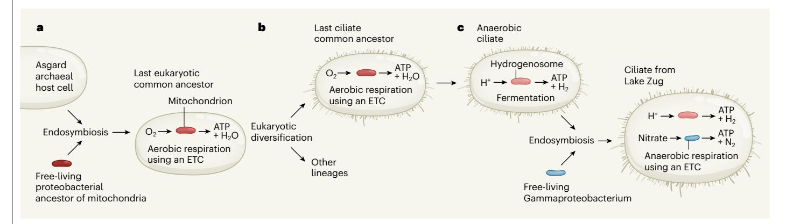

**Evolutionary microbiology**

# A microbial marriage forged in nitrate

William H. Lewis & Thijs J. G. Ettema

Symbiotic interactions between organisms have aided major evolutionary transitions. The interaction between two microorganisms has parallels with the evolution of mitochondria – key organelles in eukaryotic cells. See p.445

In the vast diversity of microbial life, numerous examples exist of symbiosis - a process whereby different organisms maintain a stable relationship with one another. Such interactions generally offer some form of benefit to one or more of the organisms involved. Graf et al.1 report on page 445 the discovery of an intriguing example of symbiosis between microorganisms. This finding might shed light on the types of process that led to the evolution of mitochondria, the energy-producing organelles found in eukaryotic cells (those containing a nucleus).

In some cases, symbiotic partners can become integrated in such a way that one partner is taken up into the cell of the other partner by a process called endosymbiosis (Fig. 1). Endosymbiotic interactions have enabled key transitions during the history of life on Earth. A prime example of this is thought to be the interaction that gave rise to the first eukaryotic cell. This ancestral eukaryote probably formed from

an endosymbiosis in which a host cell belonging to a group of single-celled organisms called Asgard archaea2,3 took up a type of bacterial cell that belonged to the phylum Proteobacteria4. Mitochondria in eukaryotic cells are considered to be the direct descendants of these oncefree-living proteobacterial endosymbionts.

Graf and colleagues describe an intriguing bacterial endosymbiont that they discovered living in a ciliate, a type of eukaryotic, single-celled microbe. Although associations between these types of organism are not uncommon, this particular case has some of the hallmarks of the type of endosymbiosis that gave rise to mitochondria. That includes the production of energy in the form of ATP molecules by the energy-generating process known as respiration. This process is also connected to a mechanism by which ATP might be exported from the endosymbiont to provide the host with energy.

The environmental conditions and

atmospheric composition on Earth today differ markedly from those that existed when life first emerged on this planet more than four billion years ago. During what is known as the Great Oxidation Event, around 2.1 billion years ago5, oxygen accumulated in the atmosphere and oceanic waters, a development that had a major bearing on the course of life on Earth. Oxygen is toxic to most organisms that thrive in environments devoid of it. However, some microorganisms learnt to harness oxygen's chemical properties, using it as an electron acceptor in energy-generating pathways. This type of oxygen-dependent process, called aerobic respiration, is much more energy-efficient than fermentation, a form of non-oxygen-dependent energy metabolism of ancient origin, which enables many anaerobic organisms to survive without oxygen.

Eukaryotic cells probably arose sometime after the Great Oxidation Event6, and their ability to perform aerobic respiration was acquired through the mitochondrial endosymbiont. The capacity for efficient energy production that this provided is thought to have conferred selective advantages during eukaryotic evolution, although the exact contribution to, for example, the emergence of cellular complexity is debate $d^7$ .

Current evidence6 indicates that early eukarvote evolution and diversification occurred under conditions in which oxygen was present. However, some groups of eukaryotes nevertheless thrive in environments devoid of oxygen. These anaerobic eukaryotes are thought to have evolved from aerobic mitochondrion-bearing ancestors.

In the absence of oxygen, the anaerobic eukaryotes use a fermentation-based metabolism, which subjects them to more-stringent

Figure 1 | Organelle evolution. a, Eukaryotic cells, those with a nucleus (nucleus not shown), probably arose when a type of single-celled host called an Asgard archaeal  $cell^{2,3}\, took\, up\, a\, probeobacterial\, cell\, in\, a\, process\, called$ endosymbiosis4. The proteobacterium evolved to form mitochondrial organelles in the last common ancestor of all eukaryotes. Through the process of aerobic respiration, in which oxygen  $(O_2)$  is consumed and water is formed as electrons are transferred along an electron-transport chain (ETC), a mitochondrion produces energy in the form of ATP molecules. **b**, Eukaryotes diversified, and only some lineages, such as the last common ancestor of organisms called ciliates, retained mitochondria.  $\mathbf{c}$ , Some lineages of ciliate

adapted to thrive in environments without oxygen. The mitochondria of these ciliates have evolved into organelles called hydrogenosomes. Anaerobic ciliates carry out fermentation, a process in which ATP is generated and hydrogen ions  $(H^*)$  gain electrons to form hydrogen  $(H_2)$ . Graf *et al.*1 report the discovery of an anaerobic ciliate with a gammaproteobacterial endosymbiont. This bacterium's genome encodes the components needed to generate ATP by converting nitrate to nitrogen  $(N_2)$  using anaerobic respiration, and to export ATP to the host. This finding reveals how anaerobic ciliates can regain the ability to carry out respiration using an ETC. These features are similar to processes associated with mitochondrial evolution.

Nature | Vol 591 | 18 March 2021 | 375

© 2021 Springer Nature Limited. All rights reserved.

# **News & views**

energy regimes than those of aerobic eukarvotes. This kind of metabolism has arisen in various types of anaerobic eukaryote, and is associated with the evolution of mitochondria into organelles called hydrogenosomes8. All hydrogenosomes have, to some degree, lost mitochondrial pathways for aerobic respiration, and generate hydrogen rather than carbon dioxide and water as an end product of their energy-generating pathways. Ciliates are exceptionally effective at adapting to oxygen-depleted environments, and mitochondrion-to-hydrogenosome transitions have occurred independently several times in this group of organisms9.

Graf and colleagues investigated an anaerobic ciliate belonging to the class Plagiopylea, found in the deepest layers of Lake Zug in Switzerland. This environment lacks oxygen and contains relatively high levels of nitrate. An initial assessment using microscopy revealed that, unusually, these ciliates have a bacterial endosymbiont (belonging to the class Gammaproteobacteria), rather than an archaeal endosymbiont that produces methane, which is the more typical type of endosymbiont present in anaerobic ciliates.

DNA-sequencing data for lake-water samples revealed the presence of genes indicating that the ciliate cells have hydrogenosomes. Moreover, the sequencing data indicate that the bacterial endosymbionts have an electron-transport chain - a collection of protein complexes for respiration that enable energy to be produced by a process called oxidative phosphorylation. Graf et al. propose that the electron acceptor in this chain is nitrate, rather than the oxygen used by aerobic organisms. Consistent with this model, the authors report that rates of denitrification (the microbial process that converts nitrate into nitrogen) were higher in lake-water samples in which ciliates were present than in those from which ciliates had been removed.

The genome of the endosymbiont identified by Graf and colleagues is notably smaller than the genomes of most endosymbionts of microbial eukaryotes, containing a mere 310 protein-encoding genes. Among those, the authors identified a gene that encodes a potential transporter protein for ATP, which they suggest is used to export ATP from the endosymbiont into its host, enabling the ciliate to use the endosymbiont for energy production by 'breathing' nitrate. This finding represents a unique example of an endosymbiont that has contributed the capacity for respiration (albeit using nitrate instead of oxygen as an electron acceptor) to a eukaryote that seemingly retains organelles of mitochondrial descent (hydrogenosomes) – the ancestral versions of which once performed respiratory functions.

Intriguingly, several parallels can be drawn between the cellular partnership discovered by Graf and co-workers and the evolution of 

mitochondria in eukaryotes. In both cases, respiratory capacity was acquired by an anaerobic host cell through the metabolic integration of a proteobacterial endosymbiont, and mechanisms can be identified for energy exchange between symbiont and host cell. Furthermore. a substantial reduction of the endosymbiont genome is observed, although mitochondrial genomes are typically either much smaller than the endosymbiont genome observed by Graf and colleagues, or have been lost completely (as is the case for several hydrogenosomes $^{10}$ ).

Despite these fascinating similarities, there are also notable differences. Mitochondrial endosymbiosis was a much more ancient event, enlisting an archaeal host cell rather than a modern eukaryotic cell. Mitochondria, even if now reduced from their original form, or even lost from some present-day eukaryotes11, became an integral part of eukaryotic cells. Genes inherited from the original mitochondrial endosymbiont were often retargeted to the nuclear genome, and some of the proteins these genes encoded adopted various functions throughout the cell. A similar level of integration is unlikely for the bacterial endosymbionts of the ciliate investigated.

Nevertheless, it would be interesting to study whether there has been any relocation or repurposing of genes between the host and endosymbiont, and to what extent a typical mitochondrial function, such as ATP

production, has been replaced or retained in the ciliate's hydrogenosomes. Evidence indicating that the ATP transporter identified by Graf and colleagues can export ATP to the ciliate host would help to confirm the proposed symbiotic interaction. Further discovery and exploration of similarly surprising symbiotic interactions in poorly explored parts of the microbial world is certainly an exciting prospect for the future.

William H. Lewis and Thijs J. G. Ettema are in the Laboratory of Microbiology, Wageningen University and Research, NL-6708 WE 

Wageningen, the Netherlands. **W.H.L.** is also in the Department of Biochemistry, University of Cambridge, Cambridge, UK. 

e-mails: whl30@cam.ac.uk; 

thijs.ettema@wur.nl

1. Graf, J. S. et al. Nature 591, 445-450 (2021).
2. Eme, L., Spang, A., Lombard, J., Stairs, C. W. & Ettema, T. J. G. Nature Rev. Microbiol, 15, 711–723 (2017).
3. Zaremba-Niedzwiedzka, K. et al. Nature **541**, 353–358 3. (2017).
4. Roger, A. J., Muñoz-Gómez, S. A. & Kamikawa, R. Curr. Biol. 27, R1177-R1192 (2017).
5. Lyons, T. W., Reinhard, C. T. & Planavsky, N. J. Nature 506, 307-315 (2014).
6. Betts, H. C. et al. Nature Ecol. Evol. 2, 1556–1562 (2018).
7. Pittis, A. A. & Gabaldón, T. Nature 531, 101–104 (2016).
8. Embley, T. M. Phil. Trans. R. Soc. B 361, 1055-1067 (2006).
9. Embley, T. M. et al. Proc. R. Soc. Lond. B 262, 87-93 (1995).
10. Lewis, W. H. et al. Mol. Biol. Evol. 37, 524-539 (2020).
11. Karnkowska, A. et al. Curr. Biol. 26, 1274–1284 (2016).

This article was published online on 3 March 2021.

Geophysics

# Oceanic fault zones reconstructed

# **Garrett Ito**

Tectonic-plate material is generally thought to be neither created nor destroyed at plate boundaries called oceanic transform faults. An analysis of sea-floor topography suggests that this assumption is incorrect. **See p.402** 

At undersea structures called oceanic spreading centres, two tectonic plates split apart, and molten rock from volcanic activity solidifies to produce the crust of the sea floor. These spreading centres are separated into individual segments that are tens to hundreds of kilometres long. At the ends of the segments, shearing (side-by-side sliding) of the two plates occurs along plate boundaries known as oceanic transform faults. Since their discovery in the mid- $1960s^1$ , these faults have been considered as sites where plate material is neither created nor destroyed. But on page 402, Grevemeyer *et al.*2 report that this description is too simplistic. They show that,

in a several-kilometre-wide region called the transform deformation zone, the crust generated at one spreading segment undergoes episodes of thinning and then regrowth as it drifts towards and past the adjacent segment.

Grevemeyer and colleagues' work was enabled by international collaborations that have supported decades of seagoing expeditions to the world's oceanic spreading centres. The authors analysed sea-floor topography around the intersections between spreading-segment ends and transform faults globally. At these intersections, young crust produced at one spreading segment (the 'proximal' segment) is adjacent to old crust that has been transported

© 2021 Springer Nature Limited. All rights reserved.