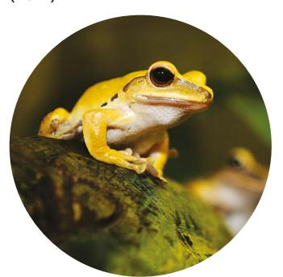
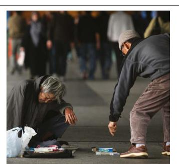

Selections from the scientific literature

# **Research highlights**

# JUMPING SQUIRRELS DO PARKOUR FOR PEANUTS

Acrobatic rodents called fox squirrels learn to leap from branch to branch with a mix of careful calculation and 'parkour', according to experiments that had them bounding through a simulated forest.

Nathaniel Hunt at the University of Nebraska Omaha and his colleagues provided free-ranging fox squirrels (Sciurus niger) with faux branches, each near a landing pad baited with peanuts. The researchers varied the branches' flexibility and the distance between the branch and the pad. Then, they watched as the squirrels adjusted their leaps.

Analysis of more than 100 trials recorded by highspeed cameras showed that choosing a launch location is a trade-off: the farther out on a bendy limb a squirrel goes, the shorter the leap to the next branch, but the bouncier the launch pad. Landing requires instant adjustments if the take-off branch is bendier than expected.

The researchers were surprised to see the squirrels bouncing off a vertical support with a "parkour leaping maneuver", named after a form of urban gymnastics popular among humans. Although the parkour moves look fun, the actual goal is probably to modify horizontal velocity before landing.

Science **373**, 697-700 (2021)

# SURGES WHEN THE SFA SURSIDES

The volcano that created the island of Santorini (pictured), a popular tourist destination in Greece, tends to erupt when the sea level drops substantially, according to data from the past 360,000 years.

The global sea level falls during planetary cold spells, when ice sheets freeze, and rises again when the ice melts, pouring back into the oceans. This pattern can affect the timing of eruptions by island volcanoes

Chris Satow at Oxford Brookes University, UK, and his colleagues compared the history of Santorini's eruptions over the past  $360.000$  years with records of sea-level height during that period. Almost every time sea level dropped by 40 metres below today's level, molten rock began squirting upwards inside the volcano. When sea level dropped by another 30 or 40 metres, that molten rock usually made it to the surface, causing an eruption.

Drops in sea level reduce the weight pressing down on the volcano. This alters stress levels in the rocks. which fracture and provide paths for molten rock to rise towards the surface. Similar changes in stress could affect many other island and coastal volcanoes around the world, influencing their eruptions.

Nature Geosci. **14**, 586–592 (2021)

# POISON FROGS MIGHTMOP UP TOXINS WITH PROTEIN'SPONGE'

Poison dart frogs lace their bodies with deadly toxins to deter predators. But how do they avoid poisoning themselves?

Many species of poison dart frog carry the lethal molecule batrachotoxin. It kills by disabling proteins embedded in nerve-cell membranes that control neural activity. Scientists have long theorized that batrachotoxin-laden animals have mutant membrane proteins to which the toxin cannot bind.

But an analysis by Daniel Minor at the University of California, San Francisco, and his colleagues found no such mutations in batrachotoxinwielding animals such as the golden poison frog (*Phyllobates* terribilis, pictured). The authors also showed that captiveraised golden poison frogs have batrachotoxin-sensitive membrane proteins but do not succumb to the toxin's effects.

The researchers propose that the animals sequester the compound with 'toxin sponge' proteins. No such protein has been identified for batrachotoxin. But the team showed that a sponge protein found in the American bullfrog (*Rana catesbeiana*) soaks up a  $similar\ toxin - and can shield\ the$ membrane proteins of poison frogs from that toxin's effects.

J. Gen. Physiol. **153**, e202112872  $(2021)$ 

# PEOPLE TEND TO ROB FROM THE MANY-AND GIVE TO THE FEW

A research game called Big Robber might help to explain why a banker would steal money from clients but buy a warm meal for a homeless person: individuals tend to be selfish in their dealings with large groups of people, although they can be generous to just one other person.

Carlos Alós-Ferrer at the University of Zurich in Switzerland and his colleagues asked 640 people to play 3 types of game in which each participant decides how much of a small sum of money to transfer to another participant. The researchers found that most participants gave some money awav.

The authors also devised the Big Robber game: a 'robber' decides whether to steal up to half of the earnings of 16 other participants. More than 80% of 320 robbers took at least one-320 robbers took at least oneas much as they could  $-$  half of it, about €100 (US\$118). Only 2% of individuals refused to rob.

The findings suggest that, if given the opportunity, people will harm a large group in exchange for a high reward, but the same individuals can be compassionate one-on-one.

Nature Hum. Behav. https://doi. org/gqbf (2021)

166 | Nature | Vol 596 | 12 August 2021

© 2021 Springer Nature Limited. All rights reserved.