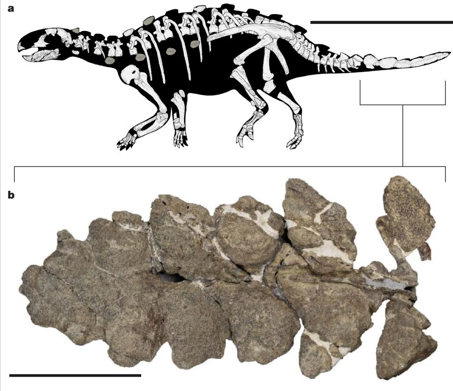

**Research briefing**

# Armoured dinosaurs of the Southern Hemisphere

Armoured dinosaurs are widely recognized for their tail weapons, which include paired spikes in stegosaurs and tail clubs in ankylosaurs. The discovery of *Stegouros* in Chile reveals a new kind of tail weapon, resembling an Aztec war club, and a lineage that split early from northern armoured dinosaurs.

This is a summary of:

Soto-Acuña, S. et al. Bizarre tail weaponry in a transitional ankylosaur from subantarctic Chile. Nature https://doi.org/10.1038/s41586-021-04147-1 (2021).

Cite this as:

*Nature* https://doi.org/10.1038/d41586-021-03572-6 (2021)

# The problem

Ankylosaurs are commonly known for their broad, heavily armoured backs and for their rounded tail clubs. These dinosaurs are well documented in the fossil record of the Northern Hemisphere (the ancient supercontinent of Laurasia), where they became extremely diverse. However, ankylosaur fossils are rarely found in the Southern Hemisphere (the ancient supercontinent of Gondwana); the fossil record includes only two named species – from Antarctica and Australia – as well as isolated bones and teeth from South America and Africa1. This imbalance hinders research into the group's early evolution. because ankylosaurs from Gondwana are thought to include early branches, which might inform our understanding of the origins of these dinosaurs. Moreover, the Antarctic ankylosaur – *Antarctopelta*, the first dinosaur to be discovered there  $-$  is highly enigmatic. It was preserved in a coastal environment and only about 15% of the skeleton is available. However, because some parts are so unusual, it was even proposed to be a mix of an ankylosaur and the remains of marine reptiles $^2$ .

# The discovery

The Magallanes region in Chile comprises the southernmost tip of South America. This region was much closer to Antarctica  $80-66$  million years ago, towards the end of the Cretaceous period, than it is now, and shows evidence of intercontinental biotic exchange3. The Cretaceous is documented in the Magallanes region by the Dorotea Formation in the Las Chinas Valley, Chile, in which abundant fossils of land plants and vertebrates are preserved.

We expected that remains of ankylosaurs could be found here, given the contemporaneous presence of *Antarctopelta* in the nearby Antarctic Peninsula. Our most optimistic expectations were surpassed, however, by the discovery of the nearly complete skeleton (Fig. 1a) of a new species – Stegouros elengassen – that is fully articulated from the waist down. We discovered the skeleton in what might have been a death trap such as quicksand. Notably, this animal had half of its tail (toward the tip) encased in a large, flattened structure of fused dermal bones with laterally directed spikes (Fig. 1b): a unique tail weapon, comparable to a macuahuitl the war club used by the ancient Aztecs. Much of the skeletal anatomy of *Stegouros* is ancestral, with few of the specializations that are normally found in ankylosaurs, indicating that it originated from an

ancient lineage. In light of the information obtained from Stegouros, we re-examined and re-interpreted the remains of the enigmatic *Antarctopelta*. Comparison of Antarctopelta's skeletal elements with those of Stegouros enables us to conclusively reject the notion of a mix with marine reptiles; moreover, we propose that the large, previously unclear dermal bones of *Antarctopelta* probably belonged to a comparable macuahuitl – something that would have been impossible to infer without the fossil of Stegouros.

# The implications

Because of the relatedness of *Stegouros* and *Antarctopelta* – and perhaps also the Australian *Kunbarrasaurus* – we propose the existence of an ancient lineage of southern ankylosaurs, the Parankylosauria (meaning 'at the side of Ankylosauria'). The Parankylosauria would have split early from the lineage that became dominant in the north, which we have named the Euankylosauria ('true' Ankylosauria). Future discoveries should confirm whether most Parankylosauria had a macuahuitl and whether they tended to be more lightly armoured, more slender and smaller than the Euankylosauria (Stegouros and Kunbarrasaurus are only about 2 metres and 2.5 m long, respectively, compared with Antarctopelta's length of roughly 4 m). The fossil record of armoured dinosaurs in the Southern Hemisphere is still limited, but remains are increasingly being reported1,4. Hopefully, it is only a matter of time before other well-preserved specimens provide a more complete picture of the ankylosaurs' diversity.

Alexander O. Vargas and Sergio Soto-Acuña are at the University of Chile, Santiago, Chile.

Nature | Published online 1 December 2021

© 2021 Springer Nature Limited. All rights reserved.

# **EXPERT OPINION**

The specimen is important for several reasons. It clearly represents a new species with an extraordinary frond-like tail club. It is a rare example of an almost complete ankylosaur from Gondwana, and shows close anatomical and biogeographical affinities with ankylosaur species from Antarctica

and Australia. Moreover, its discovery raises the possibility that all Gondwanan ankylosaurs form a distinct clade. This paper is certain to serve as an essential resource for palaeontologists interested in the Mesozoic era, as well as biogeographers and evolutionary biologists. 

A reviewer

# FIGURF

Figure 1 | Stegouros evolved a unique tail weapon. a, Whereas most remains of ankylosaurs from South America are fragmentary, the skeleton of Stegouros is almost complete, and it preserves a bizarre tail weapon. b, A magnified image of the tail weapon, viewed from above. This flattened, frond-like structure evolved independently of the well-known paired spikes of stegosaurs and tail clubs of advanced ankylosaurs, representing a previously unknown, third kind of tail weapon for armoured dinosaurs. Scale bars, 10 cm.

# BEHIND THE PAPER

The discovery of Stegouros was enabled by more than a decade of studies and exploration of the Las Chinas Valley led by Marcelo Leppe. Stegouros was extracted mostly from a block that had a few exposed bones: its surprising anatomy was gradually uncovered as it was prepared in the laboratory. The pelvis was stegosaur-like, as were other traits, and for a while we thought it might be a very unusual stegosaur (which normally have upright armour plates and a tail weapon of

paired spikes). However, when Stegouros was included in phylogenetic analyses, these traits were no longer unequivocally stegosaurian. Stegouros is an ankylosaur, but its lineage probably split off shortly after the last ancestor shared with Stegosauria, which could explain the mix with stegosaurlike traits. The study of Stegouros was led by Chilean scientists with Chilean funding, and is a milestone for vertebrate palaeontology in this country, where the field is new. A.O.V.

# REFERENCES

1. Maidment. S. C. R. et al. Nature Ecol. Evol. https://doi.org/10.1038/s41559-021-01553-6  $(2021).$

2. Lamanna, M. C. et al. Adv. Polar Sci. 30. 228-250 (2019).

3. Reguero, M. A. & Goin, F. J. J. South Am. Earth Sci. 108, 103358 (2021).

4. Rozadilla, S. et al. Cretaceous Res. 125. 104881 (2021).

# FROM THE EDITOR

What struck me most about this paper were the phylogenetic and biogeographical aspects. It reports a hitherto unrecognized offshoot of primitive ankylosaurs native to southern Gondwana. The findings forge previously unsuspected geographical and  $evolutionary links between Antarctopelta - a$ strange ankylosaur from Antarctica - and the Australian form Kunbarrasaurus.

Henry Gee, Senior Editor, Nature

Nature | Published online 1 December 2021

© 2021 Springer Nature Limited. All rights reserved.