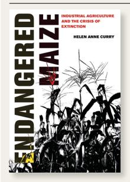
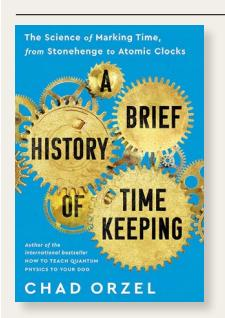
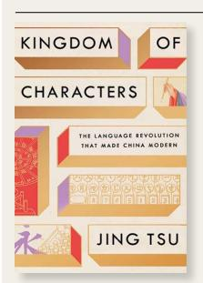

# **Books & arts**

toothless. His greatest ire, however, is directed at businesses that mortgaged a liveable future for today's profits. Researchers proposed integrated tools for reducing carbon emissions, such as the 2000s concept of 'stabilization wedges': multiple strategies across transport, heating and so on, to collectively reduce emissions. Yet even insurance companies – which, more than any other business, should want to eliminate the risk of climate change sooner rather than later – failed to adequately incorporate such strategies.

Throughout the 2000s and 2010s, as global temperatures rose and extreme weather events became more common, insurance companies continued to underwrite policies in the communities most at risk. Here are the fires and the floods of the title, many affecting the most vulnerable communities. Urban heat, exacerbated by climate change, hits hardest along racial and ethnic lines. Sea-level rise drowns not only beach homes of the affluent but also poorer neighbourhoods with little coastal protection. Like so many areas of environmental justice, the impacts of climate change ultimately come down to issues of inequity.

In this, Linden falls well short of other recent histories such as Alice Bell's *Our Biggest Experiment* (2021), which explores the intersection of race, class and climate in a much more sophisticated fashion. Linden's subtitle of a 'people's history' is odd: there are very few in his narrative who are not scientists, politicians and business leaders. He spends little time exploring how to address the outsized climate impacts on, for instance, low-lying island nations that will soon be submerged by sea-level rise or Indigenous peoples living in the fast-warming Arctic.

Linden argues that extreme weather events, such as prolonged droughts in Australia and hurricanes in the Caribbean and North America, are now so pronounced and obvious that they might force political change when previous discussions could not. Yet the path forward is not so clear. The clocks of public awareness and of business interests, especially, continue to lag behind the reality of what's transpiring.

The outlook becomes even more bleak towards the end. Linden concludes that the global response to COVID-19 shows that the world is ill-equipped to deal with any complex, far-reaching problem. Tribalism, autocracy and misinformation are on the rise, and even the promise of jobs in a decarbonized economy is not enough to trump those forces. Will the collapsing Russian economy drive many nations back to a reliance on fossil fuels, or will the fuel shock caused by Russia's invasion of Ukraine accelerate the transition to renewable energies?

That, like so many other things in these uncertain times, remains to be seen.

Alexandra Witze is a correspondent for Nature based in Boulder, Colorado.

# **Books in brief**

 **Endangered Maize**

Helen Anne Curry Univ. California Press (2022)

Maize (corn; Zea mays) originated in Mexico 6,000-10,000 years ago, when the grass teosinte was domesticated. By Christopher Columbus's time, it had more than 200 sub-populations. Now, annual alobal production of the crop exceeds one billion tonnes, providing 20% of human calorie intake. But maize diversity is threatened by many factors, as science historian Helen Curry expertly discusses with specialists. She sees hope in the variety Glass Gem, inspired by Native American cultivation techniques.

**A Brief History of Timekeeping**

Chad Orzel BenBella (2022)

"Timekeeping has always been as much about the future as the past," writes physicist Chad Orzel - whether for ancient societies tracking when to plant crops, medieval astrologers forecasting with the stars or modern astronomers predicting celestial transits. It also involves the quest for a regular, countable tick, such as the transition between the hyperfine levels of the caesium-133 atom's ground state, now used to define the second. Full of history, physics and physicists, this varied book oddly omits Stephen Hawking's 1988 A Brief History of Time.

 **Kingdom of Characters**

Jing Tsu Riverhead (2022)

Chinese characters have always unified China but isolated it from most of the rest of the world, because of their complexity. Yet, notes US-based sinologist Jing Tsu, "Every technology that has ever confronted the Chinese script, or challenged it, also had to bow before it." Her stimulating book discusses the typewriter, telegraph, librarian's catalogue and computer. Human stories include that of physicist Zhi Bingyi, who invented a way to input the characters into computers while imprisoned in a 'cowshed' during the Cultural Revolution.

**The End of Genetics**

David B. Goldstein Yale Univ. Press (2022)

Geneticist David Goldstein thinks that advances in human genomic sequencing and editing signal the end of present-day genetics. But "our technological ability to design the genomes of our children" possible in 10–30 years, he estimates in this intriguing and disturbing book — "is set to far exceed our knowledge of the consequences." His informal survey of geneticists revealed little agreement, even in broad outline, on what a common-variant human, created by removing rare, potentially harmful, variants, would look like.

**The Car That Knew Too Much**

Jean-François Bonnefon MIT Press (2021)

Will a passenger in a self-driving car involved in an accident accept artificially programmed injury or death to save others? Such dilemmas were explored by the Moral Machine, an online platform devised by psychologist Jean-François Bonnefon and others, which collected 40 million decisions in 10 languages from millions of people in 233 countries and territories (E. Awad et al. Nature 563, 59-64; 2018). Participants preferred to save "the most lives possible, and the lives of the youngest", notes this intriguing memoir. Andrew Robinson

240 | Nature | Vol 604 | 14 April 2022

© 2022 Springer Nature Limited. All rights reserved.