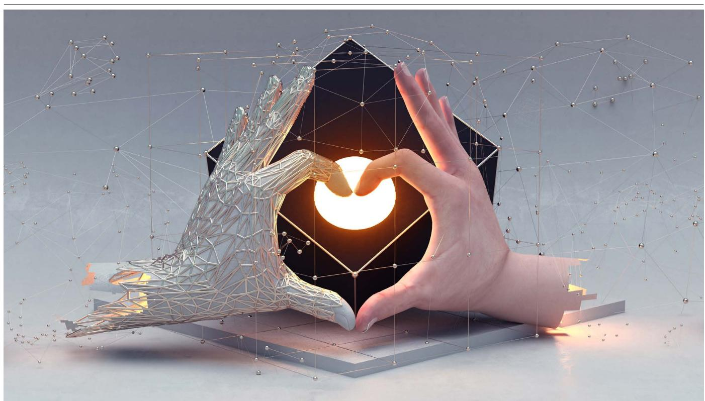
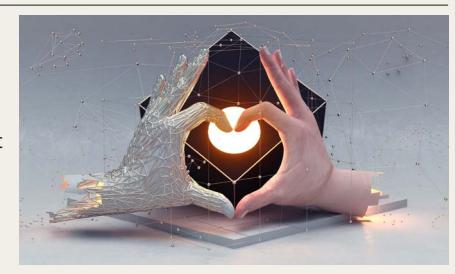

Science fiction

# Futures

# Hello, this is Automatic Antigrief: what problem can I solve for you today?

We are here to help. By Jenna Hanchey

Hi. Yes. Well, it's not a problem, exactly. It's just that I don't even know why I do it sometimes. I'll be at home, watching *Creative Cooking* and trying to design those fancy interactive sims to overlay the protein packs. You know, just like they do on TV? And then, before I even realize what's happened, she's there.

I mean, I know I granted all the permissions for the app when I downloaded it into my mental implant array, but it's just a little surprising how *quickly* it works. I don't even register thinking about her until she's already with me.

Don't get me wrong  $-$  it's great to talk to her. It's like a dream come true, having Mom around all the time whenever I need her. I'm really glad she changed her mind and we got it set up when we did.

Right. A shuttle accident, two months later. 

It's OK. No, I love having her here. I think. 

It all happened so quickly, afterwards, that I almost didn't even realize she was gone. And the sim is perfect! The sensory notes are indistinguishable from reality. When I hug her, I can feel her firm shoulders and soft waist. I can smell the lavender oil she always used in her hair. I can tell the difference between her freeand-easy laugh and her slightly sardonic one. Hah. I appreciate that she's still giving me her subtle brand of advice from beyond the grave.

So ... no, the problem is not with your character map of her, or my own implants that register the sensory details.

Yes, I realize there's an extra fee to change the input now. That's not what I'm calling ahout.

I don't actually know how to describe the problem, OK? It's like, I want to know the reason I summon Mom's sim before she appears. I have this feeling that I'm missing

something when I look up and see her standing by the window, watching the birds like she used to, or sitting in her favourite easy chair reading a book.

No ... yes, I remember that ads are part of the deal. I'm not asking why she has a new release in her hands, I'm just trying to figure out exactly what called her there in the first place.

Yeah, I get that I must have wanted to see her. Maybe the problem is that I don't feel the wanting. She's always just *there*. At the tips of my neuro-linked fingers. Appearing in a synaptic flash. Answering the questions I didn't ask about what I should do on my next date; commiserating about that story from work that I haven't even told her yet. And she retells the memories I apparently want to hear in exactly the same manner.

I've got the explanation of your patented Sensorial Precision System before - it's great

Nature | Published online 20 April 2022 | nature.com/futures

© 2022 Springer Nature Limited. All rights reserved.

Futures

that the sim has 100% factual accuracy. That's really cool. What I'm saying is it doesn't sound like her. She was never 100% factually accurate.

And that's actually good, because it breaks the illusion that it is her long enough for me to remember she's dead and gone and this image of her isn't real. That's it, I guess. Those are the moments I get closest to what it is I'm looking for – the moments when the pit of my stomach drops, and I get this swooshing feeling, like a black hole has opened in my soul and threatens to pull all that's left of me inside it. For one glorious instant, there is a depth to my existence. My whole being is caught between the elation of unfulfilled longing and a horror of having got exactly what I wished for.

But just like that, it's gone again.

You see? Most of the time, I don't feel anything at all. I would, perhaps, but she's already with me. Easing the anxieties and pain and grief that conjured her before I even experience them.

It was just a sigh, sorry. Sure, I guess you

*could* say the problem is that the app 'works too well'

Yes, you have my permission to put that comment on your NeuroSite.

But I think what I really mean is ... I miss what it feels like to miss her. Does that make sense?

Sure, I get that it's the whole point of the program. I just don't feel as happy about it as you seem to think I should. As *everyone* seems to think I should. Because I'm not happy. I'm not *anything*. I just want to feel again. And if you can't help me, maybe I'll just – I don't know – delete the whole thing.

Huh? A pause option? I didn't realize you offered that.

I see. It's how much for every paused month?

Well. That's something. And ... she'd always be there, waiting for me? When the pain gets too much, when the feelings start to overwhelm me, I could just ... turn it back on?

It's not that I don't trust your 100% satisfaction rating. I just ...

No, everything's not alright.

Me! What's wrong is *me*. It's not the sim, or vour program, or your impossibly high satisfaction rate. What I don't trust are my own feelings. My own ideas of what I want and need. And what they make me choose to do.

There she is. Right on time, I suppose.

Sorry, what was that? I got distracted for a moment.

No, uh, I think we're done here. Thank you. I'll be OK.

Fine. Sure. You can put me down as satisfied with your service today.

Can you maybe put a pin in all that for now? I'll call back if I decide to do it.

Right now, I need to go talk with my Mom.

Jenna Hanchey is a critical/cultural communication professor by day and a speculative fiction writer by ... um... earlier in the day. Follow her adventures on Twitter (@jennahanchey) or at www.jennahanchey.com.

# THE STORY BEHIND THE STORY

Jenna Hanchey reveals the inspiration behind Hello, this is Automatic Antigrief: what problem can I solve for you today?

There are many threads of inspiration woven together to create this story. At the simplest level, I received a prompt in a flash-fiction contest: "What will you grieve most?" When rolling this question over in my mind, I thought about how, often, our response to the most difficult losses is to avoid facing them. How what we need to grieve most is often the hardest to let ourselves feel.

In part, this thread of thinking about grief emerges from personal experience. I witnessed the death of a friend from a fall while hiking in 2009. It's taken me more than a decade to figure out how to face it, how to talk about his death, how to make any sort of sense of it in the aftermath.

Another thread comes from my research. As a communication professor, I've also thought about which deaths we can face and which we cannot, and how we can better attend to societal grief. For instance, when I look at tags on my clothing and see 'Made in Bangladesh', am I thinking about the 1,134 people killed in the 2013 Rana Plaza garment factory collapse in Dhaka? Do I see the deaths woven into the fabric? Can I face them? I often think about the social structures put in place to preclude seeing certain deaths.

It's so tempting not to look death in the eye, not to sit with the pain and longing and anger and the gaping hole of absence within us. It wasn't hard to imagine what it might be like to run from grief, to not give ourselves the chance to experience it. I've certainly done it myself, and will probably do so again.

I continue to wonder: what does avoiding our grief cost us?

Nature | Published online 20 April 2022 | nature.com/futures

© 2022 Springer Nature Limited. All rights reserved.