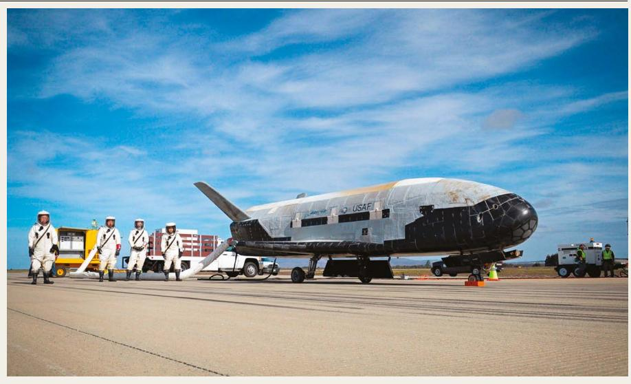

News in focus

News explainer

# China's mysterious spaceplane returns to Earth – what we know

Analysts speculate that it might be similar to a US spaceplane, and it could have research or military applications.

China has landed a mysterious spacecraft that spent nine months in Earth's orbit, making the nation one of just a handful of entities that have successfully operated a reusable spacecraft. Although China has not revealed details about its design and operation, aerospace engineers have pieced together information from fragments, painting a picture of a craft with potential for research and military uses.

"The complete success of this experiment marks a significant breakthrough in our country's research on reusable spacecraft technology," Chinese state media agency Xinhua reported, suggesting that Chinese researchers have developed technology, such as heat shields and landing equipment, specifically for reusable craft.

China, the US companies Boeing and SpaceX, and NASA are the only players to have launched and recovered orbiting reusable craft. Although the upfront costs are high, the costs of running reusable craft are a fraction of those for single-use craft, making reusable spacecraft attractive if a mission requires several flights. The nine-month mission is probably the second test of the reusable vehicle. In September 2020, China returned a reusable experimental spacecraft that had spent two days in orbit.

# Imitating Boeing?

The spacecraft is likely to be similar to a US spaceplane, the Boeing X-37B, according to Kevin Pollpeter, a senior research scientist at the Center for Naval Analyses, a US government-funded research and analysis organization in Arlington, Virginia. The purpose of X-37B is unknown, but he says the Chinese government was concerned about the craft's military capabilities when it was revealed in 2010.

Jonathan McDowell, an astrophysicist at the Center for Astrophysics Harvard & Smithsonian in Boston, Massachusetts, agrees that China's experimental spacecraft could be a nod to Boeing's X-37B spaceplane. McDowell says that satellite sensing shows the spacecraft gliding and performing a runway landing at the Lop Nur military base in China's northwest Xinjiang region,

The Boeing X-37B is thought to have inspired China's mysterious spaceplane.

suggesting that it is a plane. Some other reusable spacecraft, such as SpaceX's Dragon capsule, are modules attached to launch rockets that rely on parachutes to land.

Like the X-37B, the Chinese vehicle seems to be fairly small. Chinese media reported that the spacecraft was launched last August from the Jiuquan Satellite Launch Center in northwestern China on a Long March 2F rocket, which China used to launch its Shenzhou crewed space missions. Given that the maximum payload capacity of the launch vehicle is 8.4 tonnes, the spaceplane probably weighs between 5 and 8 tonnes, says McDowell — much less than NASA's retired space shuttles that performed crewed missions, including Columbia and Challenger.

Although the current model is too small to carry crew, McDowell says he would not be surprised if the country introduces a larger spaceplane for crewed missions in the future.

# Satellite capture?

China might be testing a variety of technologies that could further its space ambitions, says McDowell. Changing orbital trajectories or unfolding solar panels are just two examples of the kinds of mid-orbit manoeuvres that would be useful to perfect.

Releasing and capturing satellites while in orbit might also have been tested. According to a report by the Center for Strategic and International Studies, a think tank in Washington DC, the spaceplane released

an object that was detected last October. The object seemed to disappear from orbit in January before reappearing in March, according to McDowell, who tracks the spacecraft using US Space Force data. One possible explanation, he says, is that the spaceplane captured the object and carried it as cargo before releasing it again. That would suggest the spaceplane has cargo capacity, meaning it could be used to carry instruments and satellites. The manoeuvre, which he says could have been achieved with a robotic arm, might have been practice for satellite maintenance and repair.

"[The Chinese] have been working a lot with robot arms in other contexts, like the Chinese space station and other satellite servicing experiments," McDowell says.

The Xinhua story about the spacecraft's landing highlighted "the peaceful use of space". McDowell notes that, with plenty of spy satellites already in space, China doesn't necessarily need a spaceplane for surveillance. But China's space programme is run largely by the military, and consequently, its space missions tend to be secretive, says Pollpeter. "I think the inclination is to release less information rather than more information, because even if they are using it for something like satellite servicing and repair, it doesn't mean that it couldn't be used for more-offensive or more-military activities."

By Yvaine Ye

664 | Nature | Vol 617 | 25 May 2023

© 2023 Springer Nature Limited. All rights reserved.