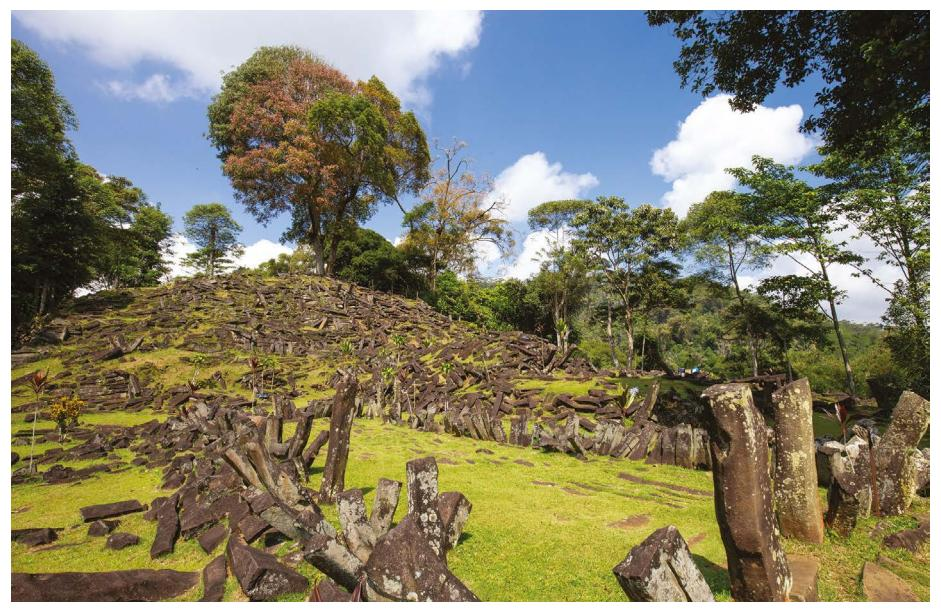

unsuitable for *P. vivax* malaria transmission became suitable. Regions were considered suitable for malaria transmission if they had precipitation, humidity and temperature levels in which malaria could spread for at least one month per year, on average, over a decade.

Warmer conditions are also increasing the rate of spread of viral diseases such as dengue, Zika and chikungunya. Increased drought, rising sea levels, reduced access to clean water and migration also create larger breeding grounds for pathogens, especially in low- and middle-income countries, says Lowe who is also at the Catalan Institution for Research and Advanced Studies, in Barcelona. "A combination of climate change, land-use change and agricultural practices can increase the risk of disease spillover from animals to humans which can, of course, lead to pandemics", they say.

# **Heat and hunger**

As the world heats up, more people are losing access to safe and nutritious food. High temperatures and droughts kill crops and extreme weather events mean that outdoor workers can't work, so they lose their income and struggle to afford enough food. "It's a vicious cycle. Food insecurity makes people more vulnerable to disease, which reduces how much they can work, so then they earn less income to pay for food," says Shouro Dasgupta, an environmental economist at the Euro-Mediterranean Center on Climate Change in Venice, Italy.

Dasgupta and another environmental economist, Elizabeth Robinson at the Grantham Research Institute on Climate Change and the Environment in London built a mathematical model using past data on how more frequent heatwaves and droughts impact food insecurity. Using this model, they estimated that 127 million more people will have experienced moderate-to-severe food insecurity as a result of climate change in 2021 compared with a scenario without global warming. Severe food insecurity means people might run out of food or go an entire day without any meals.

# **Adapt to survive**

If countries can be helped to become more resilient to climate change, health benefits will follow, researchers say.

Dominic Kniveton, a climate scientist at Sussex University in Falmer, UK, found that deaths caused by storms and flooding events decreased from an average of 86 deaths per event during 1990–99, to 16 deaths during 2013-22 in countries that are classed as 'highly developed', according to the Human Development Index, a measure built on a country's profile in education, health and standard of living. This decline could be attributed to adaptation efforts, such as the limiting of construction in high-risk coastal areas and the building of defensive structures that protect against flash flooding, says Kniveton.

Gunung Padang is a "cool site", but whether it is the world's oldest pyramid is contested.

# A 27,000-YEAR-OLD PYRAMID? CONTROVERSY HITS BOLD CLAIM

Gunung Padang would be much older than Egypt's  $\text{great pyramids} - \text{if it is even human-made at all.}$ 

**By Dyani Lewis**

A paper claiming that a structure in Indonesia is the oldest pyramid in the world has raised the eyebrows of  $some$  archaeologists – and has now prompted an investigation by the journal that published it, *Nature* has learnt.

The paper, published in *Archaeological Prospection* on 20 October, garnered headlines around the world. Its central claim is that a pyramid lying beneath the prehistoric site of Gunung Padang in West Java, Indonesia, might have been constructed 27,000 years ago (D. H. Natawidjaja *et al. Archaeol. Prospect.* https://doi.org/k65t; 2023).

That would make it much older than the first colossal Egyptian pyramid, the 4,600-year-old Pyramid of Djoser. It would also mean that it pre-dates the oldest known megalithic site, Göbekli Tepe in Turkey, which was built by stonemasons around 11,000 years ago. And it would completely rewrite what is known about human civilization in the area. "The pyramid has become a symbol of advanced civilization," says paper co-author Danny Hilman Natawidjaja, a geologist at the National Research and Innovation Agency (BRIN) in Bandung, Indonesia. "It's not easy to build pyramids. You need high masonry skills," he says.

It's exactly such claims that have left many fellow researchers cold. Lutfi Yondri, an archaeologist at BRIN, says his work has shown that people in the region inhabited caves between 12,000 and 6,000 years ago, long after the pyramid was supposedly built, and no excavations from this period have revealed evidence of sophisticated stonemasonry.

"I'm surprised [the paper] was published as is," says Flint Dibble, an archaeologist at Cardiff University, UK. Although the paper presents "legitimate data", he says, its conclusions about the site and its age are not justified.

# **Shaky foundations**

Gunung Padang comprises five stepped stone terraces, with retaining walls and connecting staircases, that sit on top of an extinct volcano. Between 2011 and 2014, Natawidjaja and his colleagues investigated the site using several ground-penetrating techniques to determine what lies beneath the terraces.

They identified four layers, which they conclude represent separate phases of construction. The innermost layer is a hardened lava core, which has been "meticulously sculpted", according to the paper.

Subsequent layers of rocks "arranged like bricks" were built over the top of the oldest layer. The layers were carbon-dated, using soil

Nature | Vol 624 | 7 December 2023 | 15

News in focus

lodged between rocks obtained from a core drilled out of the hill. The first stage of construction, according to the paper, occurred between 27,000 and 16,000 years ago. Further additions were made between 8.000 and 7,500 years ago, and the final layer, which includes the visible stepped terraces, was put in place between 4,000 and 3,100 years ago.

Dibble says there is no clear evidence that the buried layers were built by humans and were not the result of natural forces over time. "Material rolling down a hill is going to, on average, orient itself," he says. But Natawidiaja says that the column-shaped stones were too large and orderly to have simply rolled there: "The neatly arranged, shaped and massive nature of these rocks, some weighing up to 300 kilograms, dismisses the likelihood of transportation over significant distances."

The authors also report finding a dagger-shaped stone. "This object's regular geometry and distinct composition, and its materials unrelated to the surrounding rocks, signify its man-made origin," says Natawidjaja. But Dibble says it's unlikely that the rock was shaped by humans. There's no evidence of "working or anything to indicate that it's man-made", he says.

# **Extraordinary claims**

The Gunung Padang site featured in the 2022 Netflix documentary Ancient Apocalypse, hosted by British author Graham Hancock, who promotes an idea that an advanced global civilization was wiped out 12,000 years ago, at the end of the last ice age. The authors of October's publication acknowledge Hancock for proofreading their paper.

Natawidjaja says that because Gunung Padang was constructed before the end of the last ice age, it shows that people from that time were capable of building complex structures, and "this makes it a very interesting monument".

But Bill Farley, an archaeologist at Southern Connecticut State University in New Haven, says the paper has not provided evidence that an advanced civilization existed during the last ice age. The  $27,000$ -year-old soil samples from Gunung Padang, although accurately dated, do not carry hallmarks of human activity, such as charcoal or bone fragments, he says. Archaeological records show that the transition from hunter-gatherer societies to complex societies occupying large settlements occurred after the commencement of the Holocene epoch 11,700 years ago. The oldest known city is the 9,000-year-old site of Çatalhöyük in what is now Turkey (D. Orton et al. Antiquity 92, 620-639; 2018).

Archaeological Prospection and its publisher, Wiley, have since launched an investigation into the paper. Eileen Ernenwein, an archaeological geophysicist at Tennessee State University in Johnson City, who is 

co-editor of the journal, said in an e-mail to *Nature*: "The editors. including me, and Wiley ethics team are currently investigating this paper in accordance with Committee on Publication Ethics guidelines." She declined to elaborate on the nature of the concerns raised.

Farley says that people should celebrate Gunung Padang for what it is  $-$  "an amazing,  $important and cool site" - rather than because$  

it can be written into any particular narrative about the development of human civilization.

Natawidiaia says that he hopes the controversy does not cause animosity in the community. "We are really open to any researchers around the world who would like to come to Indonesia and do some research programme on Gunung Padang," he says. "We know very little about our human history."

# WORLD'S BIGGEST SET OF HUMAN GENOMES OPENS TO SCIENTISTS

UK Biobank's set of 500,000 whole genomes will help researchers to probe human DNA.

By Ewen Callaway

The world's largest collection of full human genomes has gone live.

On 30 November, the UK Biobank - a repository of health, genomic and other biological data - released complete genome sequences for every one of the 500,000 British volunteers in the database. Researchers around the world can apply for access to the data, which lack identifiable details, and use them to probe the genetic basis of health and disease.

"Scientists are looking at this like Google Maps," said Rory Collins, the UK Biobank's chief executive, at a press briefing. "When they 

want to know what are the pathways from lifestyle, environment, genetics to disease, they don't go Google, they go to UK Biobank."

The bonanza releases the complete 3-billion-letter genome sequence for every UK Biobank participant, and follows the 2021 release of whole genomes for 200,000 participants. The  $\pounds 200$ -million (US $\pounds 250$ -million) effort was funded by the biomedical-research funder Wellcome, the UK government and several pharmaceutical companies – which, in return, got early access to the data.

Previously, the UK Biobank's genetic information included entire 'exomes' - the 2% of the genome that codes for proteins – and before that, 850,000 common single-letter DNA

The sources of human variability can be revealed by plumbing our genetic code.

16 | Nature | Vol 624 | 7 December 2023