Cell

Article

# **A Pathogen-Responsive Gene Cluster for Highly Modified Fatty Acids in Tomato**

## **Graphical Abstract**

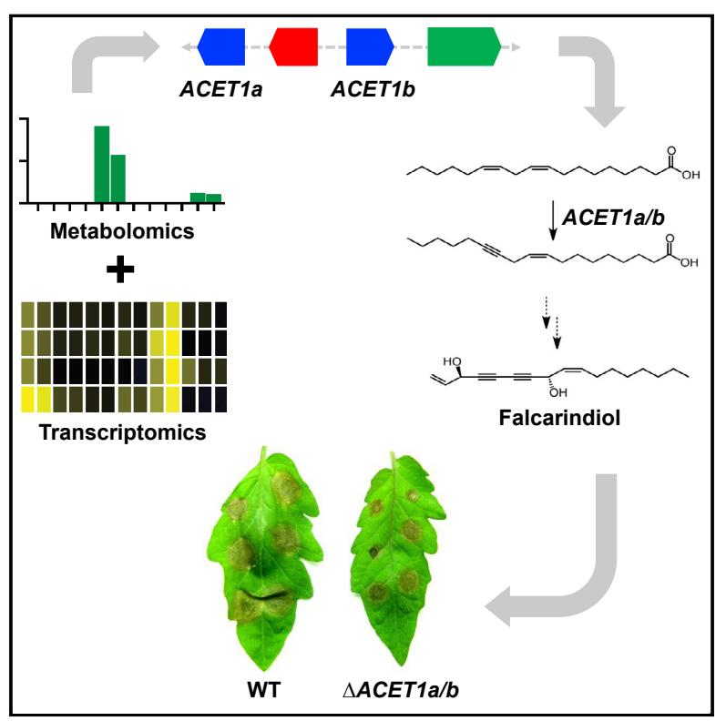

## Highlights

- Falcarindiol is a modified lipid produced in tomato in response to biotic stress
- Metabolomics and RNA-seq identified a gene cluster for falcarindiol biosynthesis
- Mutations in gene cluster affect tomato immunity to bacteria and fungi
- Clustering of biosynthetic genes for modified lipids is conserved in Solanaceae

## Authors

Ju Eun Jeon, Jung-Gun Kim, Curt R. Fischer, ..., Kimberly Wemmer, Mary Beth Mudgett, Elizabeth Sattely

## Correspondence

mudgett@stanford.edu (M.B.M.), sattely@stanford.edu (E.S.)

## In Brief

A biosynthetic gene cluster for the production of falcarindiol, a highly modified antifungal oxylipin, is found in edible plants.

Jeon et al., 2020, Cell 180, 176–18

January 9, 2020  2019 Elsevier Inc.

https://doi.org/10.1016/j.cell.2019.11.037

Cell

Article

# A Pathogen-Responsive Gene Cluster for Highly Modified Fatty Acids in Tomato

Ju Eun Jeon,<sup>1,2,7</sup> Jung-Gun Kim,<sup>2,7</sup> Curt R. Fischer,<sup>3</sup> Niraj Mehta,<sup>4</sup> Cosima Dufour-Schroif,<sup>5</sup> Kimberly Wemmer,<sup>5</sup> Mary Beth Mudgett.<sup>2,\*</sup> and Elizabeth Sattely<sup>1,6,8,\*</sup>

<sup>1</sup>Department of Chemical Engineering, Stanford University, Stanford, CA 94305, USA

<sup>2</sup>Department of Biology, Stanford University, Stanford, CA 94305, USA

<sup>3</sup>Stanford ChEM-H (Chemistry, Engineering, and Medicine for Human Health), Stanford University, Stanford, CA 94305, USA

<sup>4</sup>Department of Chemistry, Stanford University, Stanford, CA 94305, USA

<sup>5</sup>L'Oreal, Paris, France

<sup>6</sup>Howard Hughes Medical Institute, Stanford, CA 94305, USA

<sup>7</sup>These authors contributed equally

<sup>8</sup>Lead Contact

\*Correspondence: mudgett@stanford.edu (M.B.M.), sattely@stanford.edu (E.S.)

https://doi.org/10.1016/j.cell.2019.11.037

# SUMMARY

In response to biotic stress, plants produce suites of highly modified fatty acids that bear unusual chemical functionalities. Despite their chemical complexity and proposed roles in pathogen defense, little is known about the biosynthesis of decorated fatty acids in plants. Falcarindiol is a prototypical acetylenic lipid present in carrot, tomato, and celery that inhibits growth of fungi and human cancer cell lines. Using a combination of untargeted metabolomics and RNA sequencing, we discovered a biosynthetic gene cluster in tomato (Solanum lycopersicum) required for falcarindiol production. By reconstituting initial biosynthetic steps in a heterologous host and generating transgenic pathway mutants in tomato, we demonstrate a direct role of the cluster in falcarindiol biosynthesis and resistance to fungal and bacterial pathogens in tomato leaves. This work reveals a mechanism by which plants sculpt their lipid pool in response to pathogens and provides critical insight into the complex biochemistry of alkynyl lipid production.

# INTRODUCTION

Modified lipids play a central role in plant defense (Li-Beisson et al., 2013; Somerville and Browse, 1991). Although structural lipids drawn from primary metabolism limit pathogen entry (e.g., extracellular cuticle), plants also reshape their complement of lipids in response to biotic stress to produce metabolites that function as signals or antimicrobial agents (Lim et al., 2017). A notable example is jasmonic acid, a ubiquitous plant hormone and oxylipin biosynthesized inducibly from membrane-derived linolenic acid that undergoes enzymatic tailoring (Blée, 2002; Wasternack, 2007). Acetylenic fatty acids are a related family of oxylipins present in seed oils or biosynthesized in response to pest and pathogen stress (Konovalov, 2014; Minto and Black-

lock, 2008). These compounds are highly modified lipids widely distributed throughout the plant kingdom, many of which include unique sets of desaturation, acetylenic functionality, and oxidation (Figure 1; Buist, 2007).

Compared to other broad families of plant metabolites (e.g., alkaloids and terpenes; Wurtzel and Kutchan, 2016), relatively little is known about the biosynthesis of highly modified fatty acids (Napier, 2007), limiting our ability to take advantage of the biosynthetic capacity of plants to make valuable lipids through metabolic engineering (Qi et al., 2004). As part of an effort to unravel the biosynthetic logic that governs the production of modified lipids, we chose to investigate the biosynthesis of falcarindiol, a representative oxylipin and odd-chain alkane found in edible plants that bears conjugated acetylenic functionality, oxidation, and an unusual terminal vinyl group (Bentley et al., 1969; Christensen and Brandt, 2006). In addition to its chemical novelty, falcarindiol is a dietary metabolite with potent antifungal activity and cytotoxicity against several cancer cell lines (Zidorn et al., 2005). Despite the demonstrated biological activity of falcarindiol and its presence in edible crops - it is abundant in carrot (6-60 mg/kg fresh weight in root tissue; Pferschy-Wenzig et al., 2009) and ginseng root and induced by fungal pathogens in the leaves and fruit of tomato (de Wit and Kodde, 1981) - no genes have been associated with the biosynthetic pathway. We predicted that the chemical modifications to the fatty acid backbone of falcarindiol likely involve a series of atypical transformations catalyzed by classical Fe-S desaturases and/or heme-containing oxidases that have evolved novel function (Buist, 2004a). Intriguingly, one such enzyme has been described in Crepis alpina; Crep1 is a novel acetylenase that installs an alkyne in linoleic acid to generate crepenynic acid, which accumulates in the seed oil of this plant (Lee et al., 1998). However, no homolog in other plants has been associated with the biosynthesis of more highly modified lipids.

# **RESULTS**

## Tomato Responds to Biotic Stress by Expressing of a **Suite of Distinct Biosynthetic Genes and Metabolites**

In order to uncover candidate genes in tomato for the biosynthesis of falcarindiol, we leveraged the observation that

176 Cell 180, 176–187, January 9, 2020 © 2019 Elsevier Inc.

Cell

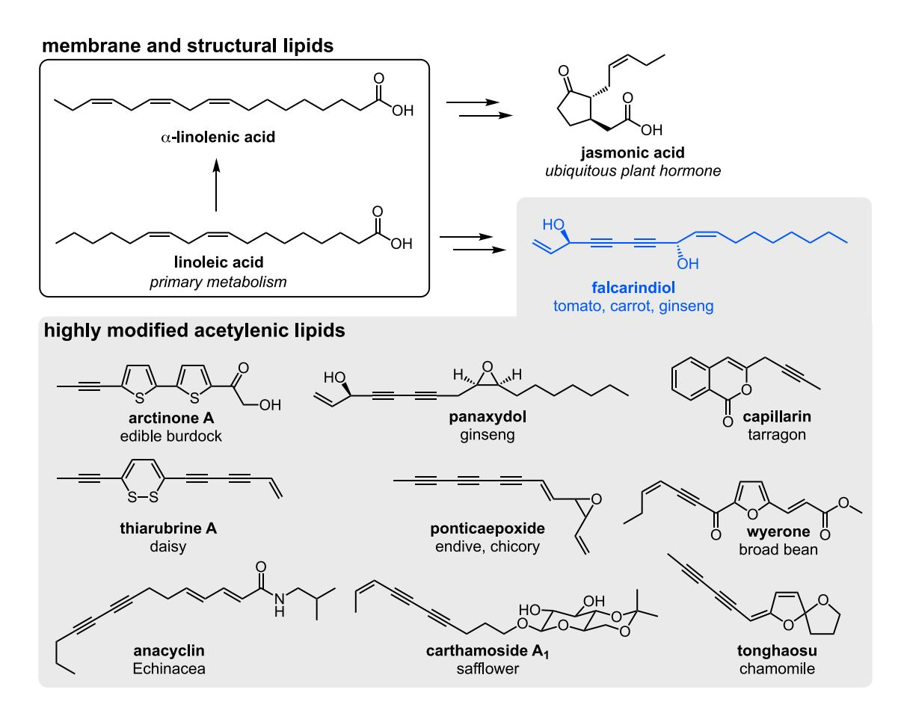

Figure 1. Representative Acetylenic Natural Products Found in Edible Plants

Linoleic acid produced in primary metabolism is released from plant membranes and is used in secondary metabolism to produce the hormone jasmonic acid. Linoleic acid is also a possible precursor for the synthesis of highly modified acetylenic lipids. Falcarindiol is a representative acetylenic lipid found in tomato, carrot, and ginseng, for which no biosynthetic genes have been described.

falcarindiol accumulation can be induced in tomato plants by biotic elicitors. Reasoning that temporal changes in metabolite levels would likely correlate with transcript levels of biosynthetic enzymes, we used a combination of untargeted metabolomics and RNA sequencing on paired samples of tomato leaf tissue challenged with biotic stress. To capture a wide range of pathway expression levels, we challenged tomato leaves with a diverse panel of microbial elicitors over a time course of 48 h (see Table S1 for the experimental design). We chose a set of elicitors that would likely invoke varied effects on pathway expression, including two microbe-associated molecular patterns (MAMPs; fungal chitin and bacterial flagellin [i.e., Flg22]; Boutrot and Zipfel, 2017), two plant-associated pathogens (Cladosporium fulvum and Xanthomonas euvesicatoria), and three human-associated microbes (Malassezia restricta, Staphylococcus epidermidis, and Propionibacterium acnes), for a total of 7 treatments and two mock controls (for fungal and bacterial elicitors). We reasoned that adapted plant-associated microbes (microbes that have evolved with their natural hosts) and non-adapted microbes may elicit distinct and shared responses by the plant and would allow us to capture

changes in the expression of a broad set of genes that contribute generally to defense and specifically to falcarindiol biosynthesis.

Quantitative metabolomic profiling using liquid chromatography-mass spectrometry (LC-MS) analysis revealed significant and selective changes in metabolite levels, including falcarindiol, in response to elicitor type (Figure S1A), suggesting the utility of our dataset for pathway discovery. For example, falcarindiol production is reproducibly induced only by a subset of elicitation conditions (Figure 2A); C. fulvum, M. restricta, and S. epidermidis elicited tomato leaves 12, 24, and 48 h post-infiltration. In contrast, mass signatures corresponding to hydroxy cinnamic amides (Facchini et al., 2002) and compounds related to the sterol alkaloid tomatidine (Itkin et al., 2013) varied in abundance across the sample panel (Figure S1B) and are notably different from the patterns of falcarindiol accumulation. This suggested to us that metabolite-transcript correlation analysis for falcarindiol could help pinpoint candidate pathway genes that install the acetylenic functionality and provide a starting point for elucidating the genetic basis of the biosynthetic pathway.

Cell 180, 176–187, January 9, 2020 177

Cell

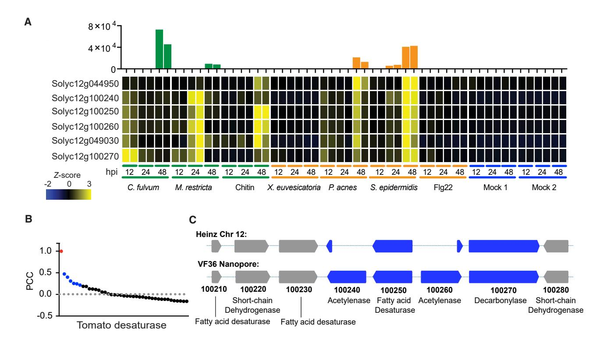

Figure 2. Identification of Putative Non-heme Di-iron Enzymes, Including Desaturases and Decarbonylases, to Discover Biosynthetic Genes **Involved in Falcarindiol Production**

(A) Correlation of falcarindiol levels (the bar graph shows extracted ion chromatogram [EIC] peak integration [m/z 283.16, [M+Na]<sup>+</sup>] using LC-MS) to transcript abundance of six candidate acetylenase genes (the heatmap illustrates the Z score determined using counts per million (CPM) base pairs values obtained using RNA-seq) in tomato leaves under various elicitation conditions. Enumeration of transcripts was performed by mapping reads to the SL3.0 version of the Heinz tomato genome. Transcripts are sorted by their Pearson's correlation coefficient (PCC) values against falcarindiol production (Table S2). Colors represent elicitor types (green, fungal elicitor; orange, bacterial elicitor; blue, mock, water). Experiments were conducted in two separate batches: mock 1 for MAMPs and humanassociated microbes and mock 2 for plant-associated microbes.

(B) PCC values for 40 candidate tomato desaturase transcript abundances (CPM) against falcarindiol levels (red, falcarindiol; blue, the six candidate genes in (A); black, the remaining 34 desaturases detected in the RNA-seg analysis).

(C) Genomic organization of the candidate metabolic gene cluster on chromosome 12 in the Heinz SL3.0 genome compared with the VF36 genome sequence obtained by Nanopore and Sanger DNA sequencing. Genes related to the falcarindiol pathway are highlighted. Genes are denoted without "Solyc" and chromosome number. See also Figures S1 and S2 and Tables S1, S2, and S3.

## **Biosynthetic Logic of a Proposed Falcarindiol Biosynthetic Pathway**

Based on previous examples of plant fatty acid metabolic pathways and characterized acetylenases (Cahoon et al., 2003; Buist, 2004b; Li-Beisson et al., 2013), we formulated a hypothesis for falcarindiol biosynthesis that involves many steps carried out by desaturases (for the proposed pathway, see Figure 3). We proposed that an early step in the pathway might involve conversion of linoleic acid to crepenynic acid via a Crep1-like acetylenase (Lee et al., 1998). Crep1 is one of the few enzymes known to be involved in modified fatty acid biosynthesis; therefore, we hypothesized that a related acetylenase in tomato is likely required for shunting fatty acids from primary metabolism into secondary metabolic pathways. Given that only a few amino acid changes distinguish acetylenases from other desaturases (Buist, 2004a), we could not identify a clear ortholog of Crep1 in tomato. Instead, we used a more general search for desaturases to generate a list of candidate acetylenases.

## Untargeted Metabolite-Transcript Correlation Reveals a **Candidate Gene Cluster Encoding Fatty Acid Tailoring** Enzymes

Of 59 unique desaturases predicted in the Heinz tomato genome (The Tomato Genome Consortium, 2012; Heinz-SL2.50 version, Phytozome database), we detected 40 of the corresponding transcripts in our RNA sequencing (RNA-seq) dataset using a combination of BLAST and Pfam annotation based on the Arabidopsis thaliana proteome (Table S2A). We correlated the expression level of these transcripts with our LC-MS-based measurements of falcarindiol accumulation (Figures 2A and 2B) to prioritize the putative desaturases likely involved in the installation of the falcarindiol alkynes. Unexpectedly, we noted that, of the six genes whose expression levels correlated best with falcarindiol accumulation (based on the R value from the linear regression analysis, cutoff value > 0.2; Table S2B), four were located sequentially on chromosome 12 in the same 20-kb region of the genome (Figure 2C, Solyc12g100240-Solyc12g100270) and were highly

178 Cell 180, 176–187, January 9, 2020

Cell

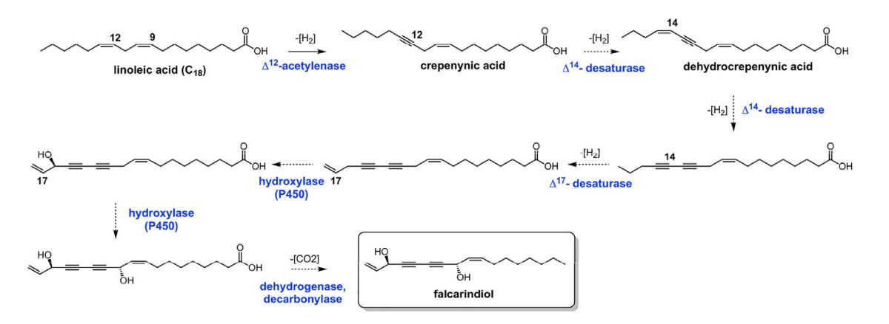

Figure 3. Proposed Falcarindiol Biosynthetic Pathway and Candidate Enzyme Classes for Each Step

Dotted arrows represent proposed reactions, and the solid arrow represents a transformation characterized previously in plants.

co-expressed (Table S2C). Three of the genes are annotated as desaturases and the fourth as a decarbonylase, suggesting that this locus encodes a cluster of enzymes associated with fatty acid metabolism. The presence of a decarbonylase was notable, given that falcarindiol lacks the carboxylic acid typical of a fatty acid. Biosynthetic gene clusters have been reported for production of many classes of plant metabolites (Nützmann et al., 2016), but only one has been reported previously for production of a polyketide (Hen-Avivi et al., 2016; Schneider et al., 2016).

Two of the candidate genes in the cluster, Solyc12g100240 and Solyc12g100260, have overlapping identical sequences (Figure S2), and each appears to encode a partial desaturase ( $\sim$ 150 nt). Further inspection of the Heinz genome in this region revealed that the assembly is incomplete and is missing the DNA sequence surrounding the predicted Solyc12g100240 and Solyc12g100260 genes. Our VF36 RNA-seq data mapped to this region and the short reads for Solyc12g100240 and Solyc12g100260 were nearly identical, with only 2 nt differences. To obtain full-length sequences for the putative desaturases, we performed de novo assembly of our VF36 data to determine whether there was a complete transcript(s) that contained Solyc12g100240- and Solyc12g100260-like sequences. This analysis resulted in a single, full-length desaturase transcript consisting of 1 exon (1,140 nt, referred to as 240/260 cDNA) that contains both the Solyc12g100240 and Solyc12g100260 sequences (Figure S2). The 240/260 transcript is predicted to encode a 43.9-kDa fulllength protein characteristic of a typical desaturase. An identical transcript was detected in a Heinz cDNA library, corroborating the gene sequence assignment; notably, the short RNA-seq reads used to enumerate expression of Solyc12g100240 and Solyc12g100260 mapped to the 3' end of the larger 240/260 transcript. Given the nearly identical sequence of the Solyc12g100240 and Solyc12g100260 partial genes, it was unclear whether the 240/260 assembled transcript represented a single gene or two separate genes in the tomato genome.

To better resolve whether there are one or two desaturases within the gene cluster, we performed Nanopore DNA sequencing of VF36 tomato DNA to generate long reads spanning the proposed Solyc12g100230-Solyc12g10070 locus. These sequencing data confirm the existence of a gene cluster

comprised of four genes (Figure 2C; Figure S2A), which includes separate full-length sequences for Solyc12q100240 and Solyc12g100260. Sanger sequencing of PCR products using primers sets flanking Solyc12g100240 and Solyc12g100260 were used to differentiate the two gene sequences and definitively map them in the gene cluster (Figure S2A). Notably, the two genes differ by two nucleotides (Figure S2B) but encode an identical protein. Collectively, our analysis indicates that the gene cluster encodes three putative desaturases and one putative decarbonylase.

## Solyc12g100240 and Solyc12g100260 Are Tomato Acetylenases

In order to determine whether Solyc12g100240 and Solyc12g100260 possess acetylenase activity, we overexpressed the 240/260 cDNA in Nicotiana benthamiana using Agrobacterium-mediated transient expression. Three days post-infiltration. N. benthamiana leaves were collected, and saponified methanol extracts were analyzed by LC-MS for accumulation of crepenynic acid. The  $m/z$  value for the crepenynic acid proton adduct was only detected in N. benthamiana tissue expressing the 240/260 cDNA (Figure 4; Figure S2B). The adduct exhibited the same retention time as the control product from *Crep1* expression (Figure S3A), and the presence of an alkyne was supported by chemical derivatization of the alkyne using ruthenium-catalyzed azide-alkyne cycloaddition click chemistry (Figures S3C, S3D, and S4; Boren et al., 2008). These data indicate that Solyc12q100240 and Solyc12q100260 (renamed ACETYLENASE1 or ACET1; ACET1a and ACET1b, respectively) encode an identical acetylenase that converts linoleic acid to crepenynic acid, suggesting that it catalyzes the first step in the falcarindiol pathway in tomato. Remarkably, reverse correlation analysis using ACET1a gene expression as bait against the collection of all metabolites detected in tomato leaf extracts after elicitation revealed falcarindiol among the metabolites whose production are most correlated with *ACET1a* expression (Table S3). This analysis highlights the power of untargeted correlation of gene expression to metabolite production for pathway discovery and corroborates the proposed role of *ACET1a* and *ACET1b* in falcarindiol biosynthesis.

Cell 180, 176–187, January 9, 2020 179

Cell

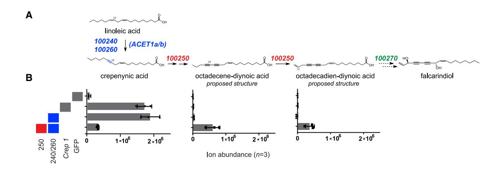

Figure 4. Reconstitution of Tomato Biosynthetic Genes for Highly Modified Fatty Acid in Nicotiana benthamiana

(A) Proposed pathway from linoleic acid to falcarindiol and a role for candidate genes from the identified gene cluster. Genes are denoted without "Solyc" and chromosome number. Shown are proposed chemical structures of octadecene-diynoic acid and octadecadien-diynoic acid based on LC-MS data and acetylene derivatization using click chemistry.

(B) Metabolite accumulation in N. benthamiana leaves, determined by integration of EIC for the indicated compound (ion abundance is plotted as mean ± SD (n = 3). Boxes represent transiently expressed enzymes (red, 250 cDNA for 100250; blue, 240/260 cDNA for 100240 and 100260; gray, Crep1 from Crepis alpina or green fluorescent protein [GFP] as a negative control).

See also Figures S3, S4, and S5 and Table S4.

## **Biochemical Analysis of Candidate Genes Supports a Role in Production of Highly Modified Fatty Acids**

Further inspection of the gene cluster suggested that, in addition to ACET1a and ACET1b, Solyc12g100250 and Solyc12g100270 might be involved in falcarindiol biosynthesis. Not only are their annotated enzymatic activities consistent with the proposed biosynthetic pathway (e.g., further desaturation and decarbonylation), but Solyc12g100250 and Solyc12g100270 are the genes whose expression levels correlate best with ACET1a and ACET1b expression (Table S2C). To test a role for these genes in falcarindiol biosynthesis, we transiently co-expressed each with the 240/260 cDNA using Agrobacterium-mediated expression in N. benthamiana to identify potential modified fatty acid metabolites representing downstream intermediates in the pathway. Untargeted metabolite analysis in leaves expressing both Solyc12g100250 and 240/260 cDNA revealed depletion of crepenynic acid and accumulation of two new mass signatures whose formulae correspond to octadecene-diynoic acid and a compound with an additional desaturation, octadecadiene-diynoic acid (Figure 4; Figure S4A). Although we have not been able to confirm the proposed structures illustrated in Figure 4 using authentic standards, MS/MS analysis and derivatization of the alkyne using the aforementioned click chemistry (Figures S3C, S3D, and S4) suggest that they are modified fatty acids that contain acetylenic functionality. These data provide biochemical evidence that Solyc12g100250 encodes a desaturase that can use crepenynic acid as a substrate. We also examined the predicted protein sequence of Solyc12g100250, ACET1a, and ACET1b in light of recent identification of key residues in the plant FAD2-like desaturase family that correlate (Busta et al., 2018) with divergent (e.g., acetylenase) function and found that, although ACET1a and ACET1b harbored residues in common with known acetylenases at these key positions, Solyc12g100250 exhibited an unusual hybrid pattern, with some key residues in this protein similar to traditional desa-

turases and others similar to known acetylenases (Figure S5), a result consistent with our tentative attribution of both activities to this protein. It is unclear whether Solyc12q100250 is responsible for multiple steps or functions with ACET1a and ACET1b to produce the detected molecules.

Solyc12g100270 is one of five tomato homologs of CER1, a fatty acid decarbonylase in A. thaliana that functions with its partner enzyme CER3 to catalyze very long-chain fatty acid decarboxylation to produce an alkane in wax biosynthesis (Bernard et al., 2012). Notably, the CER1/CER3 pair provides a precedent for a biosynthetic route to modified plant lipids with odd chain lengths. Given that Solyc12g100270 is homologous to CER1, we hypothesized that this enzyme might convert the carboxylic acid of a falcarindiol precursor to the alkane terminus, which is a signature of this modified fatty acid (Figure 3). However, transient expression of Solyc12g100270 with or without Solyc12g100250, 240/260 cDNA, and A. thaliana CER3 in *N. benthamiana* did not lead to production of a new metabolite. It is possible that Solyc12g100270 is not expressed in an active form in *N. benthamiana*, is missing a partner protein, or acts further downstream in the pathway.

## CRISPR/Cas9-Induced Mutations in a Native Tomato Host Indicate that the Gene Cluster Is Required for **Falcarindiol Biosynthesis**

As an alternative approach to study the role of Solyc12g100270, we tested directly whether this gene is required for falcarindiol production using CRISPR/Cas9 genome editing in tomato (Liu et al., 2017). In addition, we targeted ACET1a and ACET1b to validate the first step in the pathway. Multiple knockout mutants (designated  $\triangle$ ACET1 and  $\triangle$ 270) were generated in the tomato VF36 background (Figure 5A; Figure S6). We were able to generate a mutant line that has both ACET1a and ACET1b loci mutated and refer to it as  $\Delta ACET1$  (Figure S6B). Untargeted metabolite analysis of tomato leaf extracts from WT and multiple

180 Cell 180, 176–187, January 9, 2020

Cell

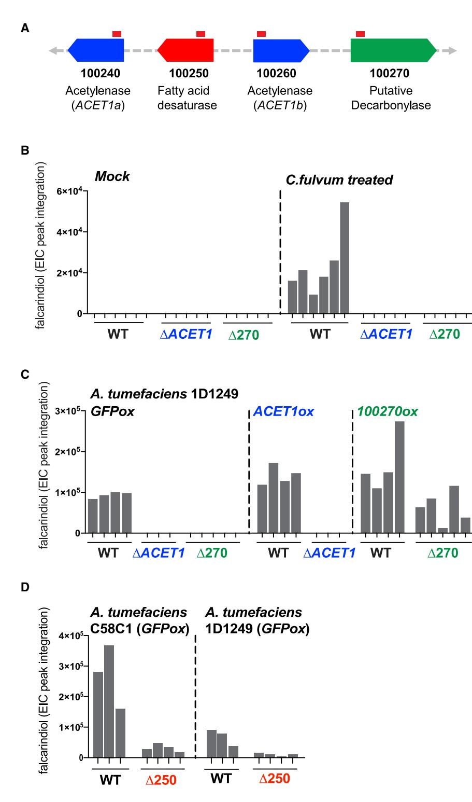

Figure 5. CRISPR/Cas9-Induced Targeted Mutagenesis and Gene Complementation in Tomato

(A) Two CRISPR/Cas9-targeted regions in ACET1a and ACET1b (ΔACET1), one in 100250 (Δ250), and one in 100270 (Δ270) are marked with red boxes.

(B) Falcarindiol production in wild-type (WT, n = 6) and independent T1 generation CRISPR knockout mutants of tomato ( $\triangle$ ACET1, n = 5;  $\triangle$ 270, n = 5) after mock or Cladosporium fulvum treatment. The genotype of each mutant plant can be found in Figure S6, and the plant IDs are 33, 39, 42, 50, and  $53 \,(\Delta ACET1)$  and 1, 3, 4, 13, and 20 ( $\Delta$ 270), respectively.

(legend continued on next page)

Cell 180, 176–187, January 9, 2020 181

Cell

independent *△ACET1* and △270 mutant lines treated with C. fulvum revealed that falcarindiol is among three major metabolites present in the wild type (WT) but absent in both biosynthetic mutants (Figure 5B; Figure S6). The proposed formulae for the other two mass signatures are consistent with modified fatty acid scaffolds, although we have not yet been able to confirm their chemical structures (Figure S6F). These data corroborate the biochemical activity observed for ACET1 in N. benthamiana and indicate that ACET1a, ACET1b, and Solyc12g100270 are required for production of falcarindiol in tomato.

Next we performed transient genetic complementation tests for the tomato *△ACET1* and △270 mutants to provide additional evidence that these genes are involved in falcarindiol biosynthesis. We had observed that elicitation of tomato leaves with A. tumefaciens strain 1D1249 is sufficient to induce the falcarindiol biosynthetic pathway (Figure 5C); therefore, we reasoned that Agrobacterium-mediated transient overexpression of cDNAs for ACET1 and Solyc12g100270 could induce the pathway and also provide an enzyme to complement the protein defect present in biosynthetic mutants. We observed that transient expression of Solyc12g100270 cDNA in A270 mutant leaves restores falcarindiol production (Figure 5C), supporting a direct role of this putative decarbonylase in the biosynthetic pathway. In contrast, overexpression of ACET1 cDNA did not complement falcarindiol production in the  $\triangle ACET1$  mutants. Considering that ACET1a and ACET1b catalyze an early step in the pathway and are co-localized in the gene cluster, it is possible that expression of downstream genes may be disrupted or that coordinated regulation of pathway genes may be lost in the *∆ACET1* mutant.

Taken together, our analysis of  $\triangle$ ACET1 and  $\triangle$ 270 mutants provides direct support for involvement of these genes in the synthesis of falcarindiol. Encouraged by these results and the utility of these mutant lines in the pathogen analysis described below, we subsequently generated tomato lines mutated in Solyc12g100250 to further explore the function of this unusual desaturase in planta. Metabolite analysis of tomato leaf extracts from the WT and  $\Delta 250$  mutants elicited with A. tumefaciens strain 1D1249 revealed that falcarindiol is present in the WT and significantly reduced but not eliminated in A250 mutants (Figure 5D). We also tested elicitation with a different strain, A. tumefaciens strain C58C1, which induces higher production of falcarindiol in WT leaves. With this heightened elicitation condition, we observed that production of falcarindiol in C58C1-elicited  $\Delta$ 250 leaves is reduced, on average, 88% compared with similarly elicited WT leaves (Figure 5D). These studies demonstrate that Solyc12g100250 has a direct role in the synthesis of falcarindiol after microbial elicitation. The observation that low levels of falcarindiol are still produced in the  $\Delta$ 250

mutants suggests that another enzyme with similar activity exists in the tomato genome. Collectively, our analysis of *ACET1* and  $\Delta$ 270 mutants, combined with the metabolite profiling of  $\Delta$ 250, further supports a coordinated role of this co-localized set of enzymes in the biosynthesis of modified fatty acids.

## Gene Cluster Tomato Mutants Exhibit Altered **Resistance during Microbial Infection**

To assess the contribution of the gene cluster to basal tomato immune responses, we measured the ability of virulent tomato pathogens (a fungus and two bacterial strains) to infect and replicate in WT and mutant leaves. First, we examined the  $\triangle$ ACET1 and  $\Delta$ 270 mutant lines deficient in falcarindiol production for their resistance against the necrotrophic fungus Botrytis cinerea strain B05.10. We chose this pathogen based on prior work in carrots, which showed that falcarindiol inhibits Botrytis cinerea growth (Harding and Heale, 1980). Spores of the B. cinerea strain were applied to the surface of tomato leaves, and then infection was evaluated 3 days later by measuring lesion size and fungal biomass. Unexpectedly, lesion size and fungal biomass were significantly reduced in  $\triangle ACET1$  and  $\triangle 270$  mutant leaves compared with WT leaves (Figures 6A-6C, S6A, and S6B). These results indicate that disruption of modified fatty acid biosynthesis associated with falcarindiol production in these mutants leads to enhanced resistance to B. cinerea rather than enhanced susceptibility.

To further explore whether this increased resistance phenotype observed for our tomato mutants is specific to Botrytis infection or extends to other pathogens, we next examined the susceptibility of the tomato gene cluster mutants to adapted bacterial pathogens of tomato. We chose two virulent bacterial strains, Xanthomonas euvesicatoria strain 85-10 and Pseudomonas syringae pathovar tomato strain DC3000 (Pst DC3000), the causal agents of bacterial spot and speck disease, respectively, and examined their growth in the leaves of WT plants and the  $\triangle ACET1$ ,  $\triangle 250$ , and  $\triangle 270$  mutant lines. Bacterial titers were not significantly different in infected leaves of  $\Delta ACET1$ ,  $\Delta 250$ , or  $\Delta 270$  compared with those of the WT (Figures S7A and S7B). In addition, bacterial strains lacking the type III secretion system (Xe 85-10  $\Delta hrcV$  and Pst *AhrcU*), which are attenuated in virulence, grew similarly in WT and mutant tomato leaves (Figures S7C and S7D), indicating that mutation of  $\triangle ACET1$ ,  $\triangle 250$ , or  $\triangle 270$  does not affect basal tomato immune responses that inhibit bacterial growth.

Given that pathogens deploy virulence factors to interfere with antimicrobial defenses, we investigated the possibility that effector proteins delivered by these bacterial pathogens into tomato cells by the type III secretion system may modulate the expression of the gene cluster to increase

(C) Falcarindiol production in WT (n = 4) and mutant lines ( $\Delta A \text{CET1}$ , n = 3;  $\Delta 270$ , n = 5) after transient overexpression (ox) of genes via Agrobacterium-mediated infiltration (GFPox, ACET1ox, or 10027ox), as assessed by LC-qTOF-MS. The y axis represents falcarindiol content as determined by integration of EICs from LC-MS data.

(D) Falcarindiol production in WT (n = 3) and independent T1 generation CRISPR knockout mutants of tomato ( $\Delta$ 250, n = 4) after transient ox of GFP (GFPox) via Agrobacterium (C58C1 or 1D1249)-mediated infiltration. The genotype of each mutant plant can be found in Figure S6, and the four ∆250 plant IDs are 9, 16, 23, and 41.

See also Figure S6 and Table S4.

182 Cell 180, 176–187, January 9, 2020

Cell

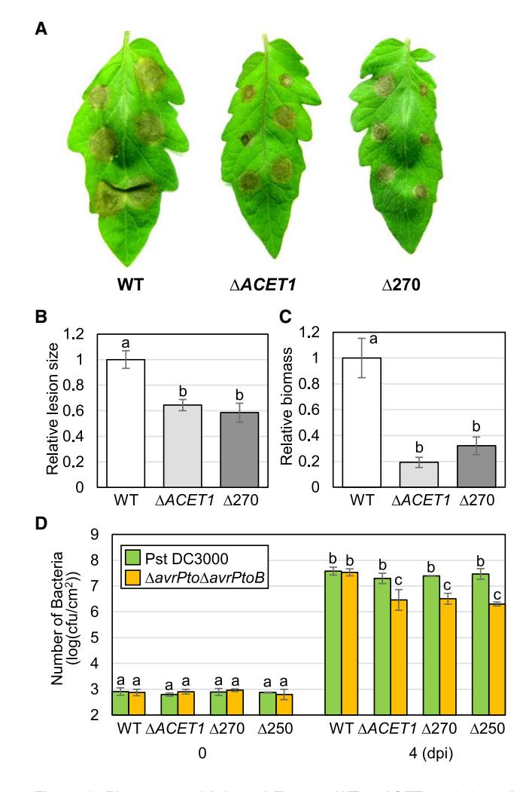

Figure 6. Phenotype of Infected Tomato WT, *ΔACET1*, Δ270, and Δ250 leaves

(A) Disease symptoms of *Botrytis cinerea*-infected WT and mutant (ΔACET1 and  $\Delta$ 270) leaves 3 days post-infection (dpi). Plant lines (T2 generation) used for analysis:  $\triangle ACET1$  plant 50 (-1 bp, Cas9-) and  $\triangle 270$  plant 20 (-4 bp, Cas9+) (see Figure S6). Representative photos are shown. The experiment was performed 3 times.

(B) Relative lesion size for *B. cinerea*-infected leaves  $(n = 12)$  using ImageJ. Error bars represent SE.

(C) Relative fungal biomass in *B. cinerea*-infected leaves ( $n = 12$ ), measured by qPCR. Error bars represent SE.

(D) Number of bacteria (log[CFU/cm<sup>2</sup>]) in infected leaves 0 and 4 dpi; Pseudomonas syringae pathovar tomato strain DC3000 (Pst DC3000) and  $\Delta avrPto\Delta avrPtoB$  mutant ( $\Delta avrPto\Delta avrPtoB$ ), n = 3 plants. Plant lines used for analysis: Δ*ACET1* plant 50 (-1 bp, Cas9-, T2), Δ270 plant 20 (-4 bp, Cas9+, T2), and  $\Delta$ 250 plant 9 (-77 bp, Cas9-, T1) (see Figure S6). Error bars indicate SD. The experiment was performed 3 times. Different letters indicate the statistically significant (one-way analysis of variance and Tukey's HSD test,  $p < 0.05$ ) differences between the samples.

See also Figure S7 and Table S4.

pathogenesis. We found RNA-seq evidence in the literature that two effectors from Pst DC3000, AvrPto and AvrPtoB, known to suppress basal defense responses (Abramovitch and Martin, 2005; de Torres et al., 2006) affect the transcrip-

tion of this gene cluster in elicited tomato leaves (Rosli et al., 2013). By performing qPCR, we confirmed that the abundance of mRNAs for ACET1a/ACET1b, Solyc12g100250, and Solyc12g100270 was significantly higher in WT tomato leaves infected with a Pst DC3000 strain lacking AvrPto and AvrPtoB (∆*avrPto ∆avrPtoB*) compared with WT tomato leaves infected with Pst D3000 (Figure S7E). Therefore, we tested whether growth of the ∆avrPto∆avrPtoB strain was different than WT Pst DC3000 in any of the tomato gene cluster mutants. We found that the titer of ∆avrPto∆avrPtoB was significantly lower in infected tomato leaves from all three gene cluster mutants 4 days post-infection (dpi) compared with similarly infected WT leaves (Figure 6D). These data reveal that the gene cluster mutant lines are more resistant to Pst DC3000 lacking AvrPto and AvrPtoB, suggesting that these virulence factors directly or indirectly interfere with modified fatty acid biosynthesis during Pst DC3000 infection. Together, these data show that the tomato gene cluster associated with the production of unusual fatty acids, including falcarindiol, is generally involved in both bacterial and fungal interactions in tomato.

# DISCUSSION

## **Discovery of a Gene Cluster for Highly Modified Fatty Acids**

Computational identification of gene clusters in bacteria have drastically accelerated pathway discovery  $(>1,000$  complete pathways are known to date; Cimermancic et al., 2014). In plants, the phenomenon of gene clustering is just beginning to be understood, with  $\sim$ 30 gene clusters described to date for several types of plant-specialized metabolites (Nützmann et al., 2016). Our discovery of co-localized genes required for falcarindiol biosynthesis indicates that the phenomenon of gene clustering may also extend to the biosynthesis of highly modified fatty acids. In our approach to pathway discovery, we highlight the power of untargeted correlation of gene expression to metabolite production to accelerate the discovery of biosynthetic enzymes even when no genes from the pathway are known and no large-scale genetic resources in the native producing plant are available. Notably, we observed that the falcarindiol pathway is only activated in tomato in the presence of specific pathogens, reminiscent of the "microbial dark matter" of the bacterial world (Marcy et al., 2007; Rutledge and Challis, 2015), an observation that indicates that transcriptome and metabolite analyses under a wide variety of stresses are critical to capture the vast potential of plant biosynthesis.

The role of desaturation in decoration of fatty acids has been associated with changes in membrane fluidity because of alternative structural conformation as well as melting temperature differences imparted by this functionality (Upchurch, 2008), and the presence of multiple acetylenes adds yet another layer of lipid structural tuning that could modify the chemical properties these metabolites. Although the biological role of the various chemical modifications on these unusual lipids remains elusive, our work provides new biochemical insights into the metabolic pathways that modify lipids and greatly expands our knowledge

Cell 180, 176–187, January 9, 2020 183

Cell

A
| Query  | S. pennellii          | S. tuberosum           | C. annuum              | D. carota               |
|--------|-----------------------|------------------------|------------------------|-------------------------|
| **100250** | LOC107005224 (99.2%) | LOC102597941 (96.3%)   | LOC107849596 (90.5%)   | LOC108202677 (64.2%)    |
| **100260** | LOC107005223 (99.7%)<br>LOC107005832 (99.1%) | LOC102597622 (98.3%)<br>LOC102596973 (98.3%) | LOC107851256 (93.7%)<br>LOC107851215 (93.6%)<br>LOC107851294 (93.6%)<br>LOC107851251 (93.5%) | LOC108218482 (69.9%)    |
| **100270** | LOC107005221 (99.2%) | LOC102595750 (97%)     | LOC107851087 (91.8%)<br>LOC107851578 (92.1%) | LOC108193835 (66.0%)    |

B

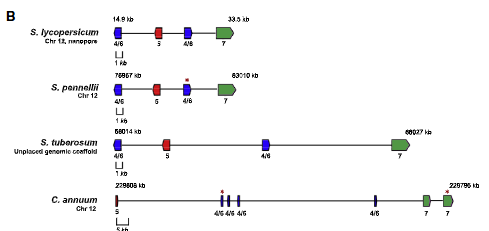

S. tuberost

Figure 7. Comparative Genomics Study with Other Plants in the Solanaceae Family and Carrot

(A) Blastp top hit for each enzyme in the cluster in other plants (three Solanaceae family plants and D. carota [carrot]). Percentages in parentheses indicate the percent homology with the query.

(B) Genomic organization of the metabolic gene clusters in Solanaceae family plants (S. lycopersicum [tomato], S. pennellii [wild tomato], S. tuberosum [potato], and C. annuum [pepper]). The genes are indicated by arrows. The numbers on the arrows represent the query gene names in a shortened form (e.g., Solyc12g100250 = 5). If multiple homologs are present, then the one with the highest sequence identity is marked with an asterisk

of the unusual enzymology that governs their biosynthesis. ACET1a/b, Solyc12q100250, and Solyc12q100270 are predicted to be part of a larger family of non-heme di-iron enzymes that include typical desaturases that catalyze selective removal of an equivalent of hydrogen from a fatty acid backbone. Similar to the previously characterized acetylenase Crep1, these enzymes appear to have evolved non-canonical function for fatty acid modification.

## **Falcarindiol Production in Tomato Leaves**

Falcarindiol was initially shown to be present in healthy tissue of plants in the Apiaceae family, including Falcaria vulgaris (sickleweed), Daucus carota (wild carrot), and Aegopodium podagraria (ground elder) (Minto and Blacklock, 2008; Bentley et al., 1969). Subsequent work showed that solanaceous plants do not normally produce acetylenes like falcarindiol. Production in tomato leaves and fruits, however, could be stimulated by infection with the leaf mold Cladosporium fulvum (de Wit and Kodde, 1981). Our metabolite profiling, using a panel of microbial elicitors, further demonstrates that biosynthesis of falcarindiol must be induced in tomato and reveals that both fungal and bacterial strains can induce falcarindiol production, although the levels vary (Figure 2A). C. fulvum (race 5), a tomato-associated fungal strain that induces a very strong immune response in VF36 tomato leaves, elicited the highest falcarindiol levels in our study (Figure 2A). Interestingly, falcarindiol was detected in tomato leaves elicited with humanassociated fungal (M. restricta) and bacterial strains (P. acnes and S. epidermidis) (Figure 2A). We surmise that production of falcarindiol in response to these microbes may be a nonhost defense response, given that they do not colonize tomato plants. In contrast, the bacterial strain X. euvesicatoria 85-10 did not trigger falcarindiol accumulation. Given that this bacterium is highly virulent on VF36 tomato leaves, we speculate that it may have evolved mechanisms to modulate the activity of the

gene cluster. Although we have not yet obtained evidence of X. euvesicatoria manipulation of falcarindiol production. we have discovered that the action of two Pst DC3000 effectors, AvrPto and AvrPtoB, in tomato leaf cells reduces the mRNA abundance for genes in the cluster (Figure S7E).

## **Bioactivity of Gene Cluster Mutants**

Falcarindiol's role in defense emerged following reports that falcarindiol levels increase in B. cinerea-infected carrots and that ethanol extracts from the infected tissue inhibit germination of B. cinerea spores (Harding and Heale, 1980). Bioassays with falcarindiol obtained from C. fulvum-infected tomato leaves also inhibited mycelial growth (de Wit and Kodde, 1981), confirming its reported antifungal bioactivity. Whether falcarindiol is required to restrict fungal growth during plant infection has remained elusive. Intriguingly, analysis of the  $\triangle ACET1$  and  $\triangle 270$ mutant tomato lines, which do not produce falcarindiol (Figure 5), showed that they are more resistant to *B. cinerea* (Figure 6). One interpretation of these findings is that other metabolites also produced by ACET1a/b and Solyc12g100270 may play a role in fungal infection. Along these lines, we found that the levels of metabolites putatively related to falcarindiol also change in these gene mutants (Figure S6F). Alternatively, mutation of these enzymes may lead to accumulation of stalled intermediates with potent antifungal activity.

Although our results point to the importance of highly modified fatty acids in tomato-pathogen interactions, the precise role of these compounds is unclear. There is compelling evidence that plant oxylipins produced by the lipoxygenase (LOX) pathway function in both defense and fungal development. For example, disruption of oxylipin produced by the 9-LOX pathway in maize increased resistance to Fusarium verticillioides (Gao et al., 2007). Fungal conidiation and toxin production were reduced on *lox* mutant kernels. This study provided compelling evidence that host oxylipid metabolism is required for successful colonization by certain fungal pathogens. It also supported the idea of lipid-mediated cross-kingdom communication between plant hosts and pathogens (Christensen and Kolomiets, 2011). Our

184 Cell 180, 176–187, January 9, 2020

Cell

studies investigating *B. cinerea* pathogenesis in tomato highlight the functional importance of this highly modified fatty acid pathway in the outcome of plant-fungal interactions. Whether acetylenic derivatives produced by genes in this cluster are involved in plant-fungal communication is an exciting avenue for future research. Furthermore, the similar phenotypes observed in tomato gene cluster mutants with PstDC3000 ∆avrPto∆avrPtoB attenuated in virulence could be explained by a common mechanism of action for gene cluster products.

Analysis of the  $\Delta$ 250 tomato mutants revealed that Solyc12g100250 is a major, but not the sole, desaturase producing modified fatty acids used in falcarindiol biosynthesis (Figure 5D). A putative desaturase (Solyc12g049030) sharing the highest similarity ( $\sim$ 70%) with Solyc12g100250 is predicted to reside on the same chromosome at a distance from the gene cluster. Interestingly, the co-expression profile of Solyc12g049030 in elicitor-treated leaves mirrors that of Solyc12g100250 as well as those of the other genes in the cluster (Table S2B), suggesting that Solyc12g04930 may coordinatively act in the synthesis of highly modified fatty acids.

## **Bioinformatics Analysis Suggests that the Falcarindiol Gene Cluster Is Conserved in Solanaceae**

Many of the  $>1,400$  different acetylenic lipids found in plants are confined to approximately 24 families of higher plants from the Solanales and Apiales orders (Minto and Blacklock, 2008). Using the three genes we connected with falcarindiol biosynthesis in tomato, we investigated whether this gene cluster is conserved among other falcarindiol producers (Figure 7). Sequence homology indicates high sequence similarity for similar collections of colocalized genes (>80%-90% sequence ID at the protein level) in several species of Solanaceae, including S. pennellii (wild tomato), S. tuberosum (cultivated potato), and Capsicum annuum (bell pepper). Notably, none of these plants have been reported to accumulate falcarindiol. Given that falcarindiol accumulates in tomato leaves only under pathogen elicitation, it is possible that other species, such as potato, have the capacity to also produce acetylenic lipids but only under specific elicitation conditions. Few genomes from the best-known acetylenic fatty acid producers of the Apiales order, including parsley, ginseng, and celery, have been sequenced, with the exception of carrot (lorizzo et al., 2016). In Daucus carota, there are distant orthologs of ACET1 and Solyc12g100250; however, the relatively low sequence identity (<60%-70%) at the protein level and lack of gene clustering make it difficult to predict whether these genes are likely involved in falcarindiol biosynthesis or whether the pathway has arisen in carrot through convergent evolution.

Our work provides direct biochemical and genetic evidence of the involvement of three core enzymes encoded in a novel cluster of metabolic genes that coordinately act in the biosynthesis of falcarindiol and opens the door for mapping the rich chemistry and biology of highly functionalized oxylipins in plants produced in response to microbial elicitation.

# **STAR**★**METHODS**

Detailed methods are provided in the online version of this paper and include the following:

- KEY RESOURCES TABLE
- LEAD CONTACT AND MATERIALS AVAILABILITY
- EXPERIMENTAL MODEL AND SUBJECT DETAILS
  - Plant lines and growth conditions
  - Fungi and bacteria strains and growth conditions
- METHOD DETAILS
  - Treatment of tomato leaves with biotic elicitors
  - Tomato cDNA library preparation
  - Next-generation sequencing and co-expression analysis
  - De novo assembly
  - Cloning of tomato genes
  - $\circ$  Heterologous expression of candidate proteins in *N*. benthamiana
  - $\circ$  Metabolite extraction from wild-type tomato and *N*. benthamiana leaves
  - LC-MS analysis
  - Metabolomics and MS data analysis
  - Chemicals
  - Click chemistry reactions
  - DNA sequencing of Solyc12g100240 and Solyc12g100260 region
  - Metabolite analysis of tomato mutant lines
  - Transient gene complementation in tomato mutant lines
  - Fungal and bacterial pathogen assay
  - Quantitative RT-PCR
- QUANTIFICATION AND STATISTICAL ANALYSIS
  - Statistics and reproducibility
- DATA AND CODE AVAILABILITY

# SUPPLEMENTAL INFORMATION

Supplemental Information can be found online at https://doi.org/10.1016/j. cell.2019.11.037.

# ACKNOWLEDGMENTS

We are grateful to Hailing Jin and Ioannis Stergiopoulos for fungal strains, Gregory Martin and Richard Michelmore for bacterial strains, and Kevin Smith for assistance with chemical analysis of metabolites. This work was supported by NIH Genomes to Natural Products U01 GM110699 (to E.S.S.), USDA NIFA postdoctoral fellowship 2016-67012-25102 (to J.E.J.), National Science Foundation IOS-1555957 (to M.B.M.), and generous funding from L'Oreal.

# AUTHOR CONTRIBUTIONS

J.E.J., J.-G.K., C.R.F., N.M., C.D.-S., K.W., M.B.M., and E.S. contributed to the study design. J.E.J., J.-G.K., C.R.F., and N.M. performed the research. J.E.J., J.-G.K., C.R.F., N.M., M.B.M., and E.S. analyzed data. J.E.J., M.B.M., and E.S. wrote the manuscript with input from the other authors.

# DECLARATION OF INTERESTS

The authors declare no competing interests.

Received: September 18, 2018

Revised: June 11, 2019

Accepted: November 27, 2019

Published: January 9, 2020

Cell 180, 176–187, January 9, 2020 185

Cell

# REFERENCES

Abramovitch, R.B., and Martin, G.B. (2005). AvrPtoB: a bacterial type III effector that both elicits and suppresses programmed cell death associated with plant immunity. FEMS Microbiol. Lett. 245, 1-8.

Anders, S., Pyl, P.T., and Huber, W. (2015). HTSeq-a Python framework to work with high-throughput sequencing data. Bioinformatics 31, 166-169.

Audenaert, K., De Meyer, G.B., and Höfte, M.M. (2002). Abscisic acid determines basal susceptibility of tomato to Botrytis cinerea and suppresses salicylic acid-dependent signaling mechanisms. Plant Physiol. 128, 491–501.

Bentley, R.K., Bhattacharjee, D., Jones, E.R.H., and Thaller, V. (1969). Natural acetylenes. Part XXVIII. C17-polyacetylenic alcohols from the Umbellifer Daucus carota L. (carrot): alkylation of benzene by acetylenyl(vinyl)carbinols in the presence of toluene-p-sulphonic acid. J. Chem. Soc. C 4, 685-688.

Bernard, A., Domergue, F., Pascal, S., Jetter, R., Renne, C., Faure, J.D., Haslam, R.P., Napier, J.A., Lessire, R., and Joubès, J. (2012). Reconstitution of plant alkane biosynthesis in yeast demonstrates that Arabidopsis ECERIFE-RUM1 and ECERIFERUM3 are core components of a very-long-chain alkane synthesis complex. Plant Cell 24, 3106-3118.

Blée, E. (2002). Impact of phyto-oxylipins in plant defense. Trends Plant Sci. 7, 315-322

Boren, B.C., Narayan, S., Rasmussen, L.K., Zhang, L., Zhao, H., Lin, Z., Jia, G., and Fokin, V.V. (2008). Ruthenium-catalyzed azide-alkyne cycloaddition: scope and mechanism. J. Am. Chem. Soc. 130, 8923-8930.

Boutrot, F., and Zipfel, C. (2017). Function, discovery, and exploitation of plant pattern recognition receptors for broad-spectrum disease resistance. Annu. Rev. Phytopathol. 55, 257-286.

Buist, P.H. (2004a). Fatty acid desaturases: selecting the dehydrogenation channel. Nat. Prod. Rep. 21, 249-262.

Buist, P.H. (2004b). Catalytic diversity of fatty acid desaturases. Tetrahedron Asymmetry 15, 2779-2785.

Buist, P.H. (2007). Exotic biomodification of fatty acids. Nat. Prod. Rep. 24, 1110-1127.

Busta, L., Yim, W.C., LaBrant, E.W., Wang, P., Grimes, L., Malyszka, K., Cushman, J.C., Santos, P., Kosma, D.K., and Cahoon, E.B. (2018). Identification of genes encoding enzymes catalyzing the early steps of carrot polyacetylene biosynthesis. Plant Physiol. 178, 1507-1521.

Cahoon, E.B., Schnurr, J.A., Huffman, E.A., and Minto, R.E. (2003). Fungal responsive fatty acid acetylenases occur widely in evolutionarily distant plant families. Plant J. 34. 671-683.

Camacho, C., Coulouris, G., Avagyan, V., Ma, N., Papadopoulos, J., Bealer, K., and Madden, T.L. (2009). BLAST+: architecture and applications. BMC Bioinformatics 10, 421.

Christensen, L.P., and Brandt, K. (2006). In Plant Secondary Metabolites: Occurrence, Structure and Role in the Human Diet, A. Crozier, M.N. Clifford, and H. Ashihara, eds. (Blackwell Publishing), pp. 137-164.

Christensen, S.A., and Kolomiets, M.V. (2011). The lipid language of plantfungal interactions. Fungal Genet. Biol. 48, 4-14.

Cimermancic, P., Medema, M.H., Claesen, J., Kurita, K., Wieland Brown, L.C., Mavrommatis, K., Pati, A., Godfrey, P.A., Koehrsen, M., Clardy, J., et al. (2014). Insights into secondary metabolism from a global analysis of prokaryotic biosynthetic gene clusters. Cell 158, 412-421.

Curtis, M.D., and Grossniklaus, U. (2003). A gateway cloning vector set for high-throughput functional analysis of genes in planta. Plant Physiol. 133, 462-469

De Coster, W., D'Hert, S., Schultz, D.T., Cruts, M., and Van Broeckhoven, C. (2018). NanoPack: visualizing and processing long-read sequencing data. Bioinformatics 34, 2666-2669.

de Torres, M., Mansfield, J.W., Grabov, N., Brown, I.R., Ammouneh, H., Tsiamis, G., Forsyth, A., Robatzek, S., Grant, M., and Boch, J. (2006). Pseudomonas syringae effector AvrPtoB suppresses basal defence in Arabidopsis. Plant J. 47, 368-382.

de Wit, P.J.G.M., and Kodde, E. (1981). Induction of polyacetylenic phytoalexins in Lycopersicon esculentum after inoculation with Cladosporium fulvum (syn. Fulvia fulva). Physiol. Plant Pathol. 18, 143-148, IN145.

Facchini, P.J., Hagel, J., and Zulak, K.G. (2002). Hydroxycinnamic acid amide metabolism: physiology and biochemistry. Can. J. Bot. 80, 577-589.

Gao, X., Shim, W.B., Göbel, C., Kunze, S., Feussner, I., Meeley, R., Balint-Kurti, P., and Kolomiets, M. (2007). Disruption of a maize 9-lipoxygenase results in increased resistance to fungal pathogens and reduced levels of contamination with mycotoxin fumonisin. Mol. Plant Microbe Interact. 20, 922-933

Gibson, D.G., Young, L., Chuang, R.Y., Venter, J.C., Hutchison, C.A., 3rd, and Smith, H.O. (2009). Enzymatic assembly of DNA molecules up to several hundred kilobases. Nat. Methods 6, 343-345.

Gordon, A., and Hannon, G.J. (2010). Fastx Toolkit: FASTQ/A short-reads preprocessing tools. htttp://hannonlab.cshl.edu/fastx\_toolkit/.

Harding, V., and Heale, J. (1980). Isolation and identification of the antifungal compounds accumulating in the induced resistance response of carrot root slices to Botrytis cinerea. Physiol. Plant Pathol. 17, 277-289.

Hen-Avivi, S., Savin, O., Racovita, R.C., Lee, W.-S., Adamski, N.M., Malitsky, S., Almekias-Siegl, E., Levy, M., Vautrin, S., Bergès, H., et al. (2016). A metabolic gene cluster in the wheat W1 and the barley Cer-cqu loci determines  $\beta$ -diketone biosynthesis and glaucousness. Plant Cell 28, 1440-1460.

Huang, X., and Madan, A. (1999). CAP3: a DNA sequence assembly program. Genome Res. 9, 868-877.

lorizzo, M., Ellison, S., Senalik, D., Zeng, P., Satapoomin, P., Huang, J., Bowman, M., Iovene, M., Sanseverino, W., Cavagnaro, P., et al. (2016). A high-quality carrot genome assembly provides new insights into carotenoid accumulation and asterid genome evolution. Nat. Genet. 48, 657-666.

Itkin, M., Heinig, U., Tzfadia, O., Bhide, A.J., Shinde, B., Cardenas, P.D., Bocobza, S.E., Unger, T., Malitsky, S., Finkers, R., et al. (2013). Biosynthesis of antinutritional alkaloids in solanaceous crops is mediated by clustered genes. Science 341, 175-179.

Kim, D., Pertea, G., Trapnell, C., Pimentel, H., Kelley, R., and Salzberg, S.L. (2013). TopHat2: accurate alignment of transcriptomes in the presence of insertions, deletions and gene fusions. Genome Biol. 14, R36.

Koncz, C., and Schell, J. (1986). The promoter of T<sub>L</sub>-DNA gene 5 controls the tissue-specific expression of chimaeric genes carried by a novel type of Agrobacterium binary vector. Mol. Gen. Genet. 204, 383-396.

Konovalov, D.A. (2014). Polyacetylene compounds of plants of the Asteraceae family. Pharm. Chem. J. 48, 613-631.

Langmead, B., and Salzberg, S.L. (2012). Fast gapped-read alignment with Bowtie 2. Nat. Methods 9, 357-359.

Lee, M., Lenman, M., Banaś, A., Bafor, M., Singh, S., Schweizer, M., Nilsson, R., Liljenberg, C., Dahlqvist, A., Gummeson, P.O., et al. (1998). Identification of non-heme diiron proteins that catalyze triple bond and epoxy group formation. Science 280. 915-918.

Li, H. (2018). Minimap2: pairwise alignment for nucleotide sequences. Bioinformatics 34, 3094–3100.

Li, W., and Godzik, A. (2006). Cd-hit: a fast program for clustering and comparing large sets of protein or nucleotide sequences. Bioinformatics 22, 1658–1659.

Li-Beisson, Y., Shorrosh, B., Beisson, F., Andersson, M.X., Arondel, V., Bates, P.D., Baud, S., Bird, D., Debono, A., Durrett, T.P., et al. (2013). Acyl-lipid metabolism. Arabidopsis Book 11. e0161.

Lim, G.-H., Singhal, R., Kachroo, A., and Kachroo, P. (2017). Fatty acid- and lipid-mediated signaling in plant defense. Annu. Rev. Phytopathol. 55, 505-536

Liu, H., Ding, Y., Zhou, Y., Jin, W., Xie, K., and Chen, L.-L. (2017). CRISPR-P 2.0: an improved CRISPR-Cas9 tool for genome editing in plants. Mol. Plant 10.530-532

Marcy, Y., Ouverney, C., Bik, E.M., Lösekann, T., Ivanova, N., Martin, H.G., Szeto, E., Platt, D., Hugenholtz, P., Relman, D.A., and Quake, S.R. (2007).

186 Cell 180, 176–187, January 9, 2020

Cell

Dissecting biological "dark matter" with single-cell genetic analysis of rare and uncultivated TM7 microbes from the human mouth. Proc. Natl. Acad. Sci. USA 104. 11889–11894.

McCormick, S. (1997). Transformation of tomato with Agrobacterium tumefaciens. In Plant Tissue Culture Manual: Supplement 7. K. Lindsey, ed. (Springer Netherlands), pp. 311-319.

Minto, R.E., and Blacklock, B.J. (2008). Biosynthesis and function of polyacetylenes and allied natural products. Prog. Lipid Res. 47, 233-306.

Napier, J.A. (2007). The production of unusual fatty acids in transgenic plants. Annu. Rev. Plant Biol. 58, 295-319.

Nützmann, H.W., Huang, A., and Osbourn, A. (2016). Plant metabolic clusters from genetics to genomics. New Phytol. 211, 771-789.

Ooms. G., Hoovkaas. P.J.J., Van Veen. R.J.M., Van Beelen. P., Regensburg-Tuïnk, T.J.G., and Schilperoort, R.A. (1982). Octopine Ti-plasmid deletion mutants of Agrobacterium tumefaciens with emphasis on the right side of the Tregion. Plasmid 7, 15-29.

Pfaffl, M.W. (2001). A new mathematical model for relative quantification in real-time RT-PCR. Nucleic Acids Res. 29, e45.

Pferschy-Wenzig, E.-M., Getzinger, V., Kunert, O., Woelkart, K., Zahrl, J., and Bauer, R. (2009). Determination of falcarinol in carrot (Daucus carota L.) genotypes using liquid chromatography/mass spectrometry. Food Chem. 114, 1083-1090

Qi, B., Fraser, T., Mugford, S., Dobson, G., Sayanova, O., Butler, J., Napier, J.A., Stobart, A.K., and Lazarus, C.M. (2004). Production of very long chain polyunsaturated omega-3 and omega-6 fatty acids in plants. Nat. Biotechnol. 22. 739-745.

Robinson, M.D., McCarthy, D.J., and Smyth, G.K. (2010). edgeR: a Bioconductor package for differential expression analysis of digital gene expression data. Bioinformatics 26, 139-140.

Rosli, H.G., Zheng, Y., Pombo, M.A., Zhong, S., Bombarely, A., Fei, Z., Collmer, A., and Martin, G.B. (2013). Transcriptomics-based screen for genes induced by flagellin and repressed by pathogen effectors identifies a cell wallassociated kinase involved in plant immunity. Genome Biol. 14, R139.

Rutledge, P.J., and Challis, G.L. (2015). Discovery of microbial natural products by activation of silent biosynthetic gene clusters. Nat. Rev. Microbiol. 13. 509-523.

Sainsbury, F., Thuenemann, E.C., and Lomonossoff, G.P. (2009). pEAQ: versatile expression vectors for easy and quick transient expression of heterologous proteins in plants. Plant Biotechnol. J. 7, 682-693.

Schneider, L.M., Adamski, N.M., Christensen, C.E., Stuart, D.B., Vautrin, S., Hansson, M., Uauy, C., and von Wettstein-Knowles, P. (2016). The Cer-cqu gene cluster determines three key players in a  $\beta$ -diketone synthase polyketide pathway synthesizing aliphatics in epicuticular waxes. J. Exp. Bot. 67, 2715–2730.

Schulz, M.H., Zerbino, D.R., Vingron, M., and Birney, E. (2012). Oases: robust de novo RNA-seq assembly across the dynamic range of expression levels. Bioinformatics 28, 1086-1092.

Smith, C.A., Want, E.J., O'Maille, G., Abagyan, R., and Siuzdak, G. (2006). XCMS: processing mass spectrometry data for metabolite profiling using nonlinear peak alignment, matching, and identification. Anal. Chem. 78, 779-787.

Somerville, C., and Browse, J. (1991). Plant lipids: metabolism, mutants, and membranes. Science 252. 80-87.

The Tomato Genome Consortium (2012). The tomato genome sequence provides insights into fleshy fruit evolution. Nature 485, 635-641.

Turner, P., Barber, C., and Daniels, M. (1984). Behaviour of the transposons Tn5 and Tn7 in Xanthomonas campestris pv. campestris. Mol. Gen. Genet. 195 101-107

Upchurch, R.G. (2008). Fatty acid unsaturation, mobilization, and regulation in the response of plants to stress. Biotechnol. Lett. 30, 967-977.

Wang, M., Weiberg, A., Lin, F.M., Thomma, B.P., Huang, H.D., and Jin, H. (2016). Bidirectional cross-kingdom RNAi and fungal uptake of external RNAs confer plant protection. Nat. Plants 2, 16151.

Wasternack, C. (2007). Jasmonates: an update on biosynthesis, signal transduction and action in plant stress response, growth and development. Ann. Bot 100 681-697

Wurtzel, E.T., and Kutchan, T.M. (2016). Plant metabolism, the diverse chemistry set of the future. Science 353, 1232-1236.

Zhu, X., Xu, Y., Yu, S., Lu, L., Ding, M., Cheng, J., Song, G., Gao, X., Yao, L., Fan, D., et al. (2014). An efficient genotyping method for genome-modified animals and human cells generated with CRISPR/Cas9 system. Sci. Rep. 4, 6420.

Zidorn, C., Jöhrer, K., Ganzera, M., Schubert, B., Sigmund, E.M., Mader, J., Greil, R., Ellmerer, E.P., and Stuppner, H. (2005). Polyacetylenes from the Apiaceae vegetables carrot, celery, fennel, parsley, and parsnip and their cytotoxic activities. J. Agric. Food Chem. 53, 2518-2523.

Cell 180, 176–187, January 9, 2020 187

Cell

# **STAR** METHODS

## **KEY RESOURCES TABLE**

| REAGENT or RESOURCE                                                                            | SOURCE                                    | IDENTIFIER                                                                                     |
|------------------------------------------------------------------------------------------------|-------------------------------------------|------------------------------------------------------------------------------------------------|
| Bacterial and Virus Strains                                                                    |                                           |                                                                                                |
| <i>Malassezia restricta</i>                                                                    | L'Oreal, Paris (France)                   | N/A                                                                                            |
| <i>Staphylococcus epidermis</i>                                                                | L'Oreal, Paris (France)                   | N/A                                                                                            |
| <i>Propionibacterium acnes</i>                                                                 | L'Oreal, Paris (France)                   | N/A                                                                                            |
| <i>Cladosporium fulvum</i> race 5                                                              | Ioannis Stergiopoulos,<br>UC Davis (USA)  | N/A                                                                                            |
| <i>Agrobacterium tumefaciens</i> strain 1D1249                                                 | Richard W. Michelmore,<br>UC Davis (USA)  | N/A                                                                                            |
| <i>Agrobacterium tumefaciens</i> strain C58C1                                                  | Brian Staskawicz, UC<br>Berkeley (USA)    | N/A                                                                                            |
| <i>Agrobacterium tumefaciens</i> strain GV3101                                                 | Koncz and Schell, 1986                    | N/A                                                                                            |
| <i>Agrobacterium tumefaciens</i> strain LBA4404                                                | Ooms et al., 1982                         | N/A                                                                                            |
| <i>Xanthomonas euvesicatoria</i> strain 85-10                                                  | Brian Staskawicz,<br>UC Berkeley (USA)    | N/A                                                                                            |
| <i>Xanthomonas euvesicatoria</i> strain 85-10 Δ <i>hrcV</i>                                    | Brian Staskawicz,<br>UC Berkeley (USA)    | N/A                                                                                            |
| <i>Pseudomonas syringae</i> pathovar<br>tomato strain DC3000                                   | Gregory B. Martin,<br>Cornell U. (USA)    | N/A                                                                                            |
| <i>Pseudomonas syringae</i> pathovar<br>tomato strain DC3000 Δ <i>hrcU</i>                     | Brian Staskawicz,<br>UC Berkeley (USA)    | N/A                                                                                            |
| <i>Pseudomonas syringae</i> pathovar<br>tomato strain DC3000 Δ <i>avrPto</i> Δ <i>avrPtoB</i>  | Gregory B. Martin,<br>Cornell U. (USA)    | N/A                                                                                            |
| <i>Botrytis cinerea</i> strain B05.10                                                          | Hailing Jin, UC Riverside (USA)           | N/A                                                                                            |
| Chemicals, Peptides, and Recombinant Proteins                                                  |                                           |                                                                                                |
| Falcarindiol                                                                                   | ArboNova                                  | N/A                                                                                            |
| Crepenynic acid                                                                                | INDOFINE Chemical Company                 | 10-1891                                                                                        |
| Chloro(pentamethylcyclopentadienyl)<br>(cyclooctadiene)ruthenium(II)                           | Sigma-Aldrich                             | 667234-250MG                                                                                   |
| Ethyl azidoacetate                                                                             | Sigma-Aldrich                             | 77213-25ML-F                                                                                   |
| 4-azidotoluene                                                                                 | Sigma-Aldrich                             | 27466-10ML                                                                                     |
| RNase A (17,500 U)                                                                             | QIAGEN                                    | 19101                                                                                          |
| Critical Commercial Assays                                                                     |                                           |                                                                                                |
| NEBNext mRNA Library Prep Master<br>Mix Set for Illumina                                       | New England Biolabs                       | E6110                                                                                          |
| NEBNext Multiplex Oligos for Illumina                                                          | New England Biolabs                       | E7335                                                                                          |
| Spectrum Plant Total RNA Kit                                                                   | Sigma-Aldrich                             | STRN50-1KT                                                                                     |
| SuperScript IV First-Strand Synthesis System                                                   | ThermoFisher                              | 18091050                                                                                       |
| Gibson Assembly Master Mix                                                                     | New England Biolabs                       | E2611L                                                                                         |
| Agencourt AMPureXP                                                                             | Beckman Coulter                           | A63881                                                                                         |
| QIAGEN Genomic-tip 500/G                                                                       | QIAGEN                                    | 10262                                                                                          |
| Genomic DNA Buffer Set                                                                         | QIAGEN                                    | 19060                                                                                          |
| Deposited Data                                                                                 |                                           |                                                                                                |
| RNA-sequencing data                                                                            | This Paper                                | GSE123543; NCBI BioProject: PRJNA509154                                                        |
| Nanopore sequencing data                                                                       | This Paper                                | SAMN13065563; NCBI BioProject: PRJNA509154                                                     |
| Raw metabolomics data from transcriptomics/<br>metabolomics combined experiment                | This Paper                                | https://www.ebi.ac.uk/metabolights/<br>securedredirect?url=MTBLS1039                           |

(Continued on next page)

e1 Cell 180, 176–187.e1–e7, January 9, 2020

Cell

| Continued                                                                                      |                                           |                                                                                                |
|------------------------------------------------------------------------------------------------|-------------------------------------------|------------------------------------------------------------------------------------------------|
| REAGENT or RESOURCE                                                                            | SOURCE                                    | IDENTIFIER                                                                                     |
| Metabolomic peak matrix from combined<br>metabolomics / transcriptomics combined<br>experiment | This paper                                | https://github.com/sattely-lab/<br>falcarindiol_pathway_metabolomics                           |
| Falcarindiol MS2 spectrum                                                                      | This paper                                | https://gnps.ucsd.edu/ProteoSAFe/<br>gnpslibraryspectrum.jsp?<br>SpectrumID=CCMSLIB00005435967 |
| Experimental Models: Organisms/Strains                                                         |                                           |                                                                                                |
| <i>Solanum lycopersicum</i> cultivar Heinz 1706                                                | Brian Staskawicz,<br>UC Berkeley (USA)    | N/A                                                                                            |
| <i>Solanum lycopersicum</i> cultivar VF36                                                      | Brian Staskawicz,<br>UC Berkeley (USA)    | N/A                                                                                            |
| <i>Solanum lycopersicum</i> cultivar VF36 ΔACET1                                               | This Paper                                | N/A                                                                                            |
| <i>Solanum lycopersicum</i> cultivar VF36 Δ250                                                 | This Paper                                | N/A                                                                                            |
| <i>Solanum lycopersicum</i> cultivar VF36 Δ270                                                 | This Paper                                | N/A                                                                                            |
| <i>Nicotiana benthamiana</i>                                                                   | Brian Staskawicz,<br>UC Berkeley (USA)    | N/A                                                                                            |
| Oligonucleotides                                                                               |                                           |                                                                                                |
| Primers used in this study                                                                     | See Table S1                              | See Table S1                                                                                   |
| Recombinant DNA                                                                                |                                           |                                                                                                |
| pEAQ-HT                                                                                        | Sainsbury et al., 2009                    | N/A                                                                                            |
| pEAQ-GFP-HT                                                                                    | Sainsbury et al., 2009                    | N/A                                                                                            |
| pEAQ-HT-ACET1                                                                                  | This Paper                                | N/A                                                                                            |
| pEAQ-HT-250                                                                                    | This Paper                                | N/A                                                                                            |
| pEAQ-HT-270                                                                                    | This Paper                                | N/A                                                                                            |
| pEAQ-HT-Crep1                                                                                  | This Paper                                | N/A                                                                                            |
| pMDC83(Cas9-HA-NLS)                                                                            | This Paper                                | N/A                                                                                            |
| pDONR207(AtU6p-sgRNA with attL1 and attL2)                                                     | Jeffrey Dangl, UNC<br>Chapel Hill (USA)   | N/A                                                                                            |
| Software and Algorithms                                                                        |                                           |                                                                                                |
| FASTX-toolkit                                                                                  | Gordon and Hannon, 2010                   | RRID: SCR_005534 (http://hannonlab.cshl.edu/<br>fastx_toolkit/)                                |
| Bowtie2                                                                                        | Langmead and Salzberg, 2012               | http://bowtie-bio.sourceforge.net/bowtie2/<br>index.shtml                                      |
| TopHat2                                                                                        | Kim et al., 2013                          | https://ccb.jhu.edu/software/tophat/index.shtml                                                |
| HTSeq                                                                                          | Anders et al., 2015                       | RRID: SCR_005514 (https://htseq.readthedocs.io/en/<br>release_0.11.1/)                         |
| edgeR                                                                                          | Bioconductor                              | RRID: SCR_012802 (https://bioconductor.org/<br>packages/release/bioc/html/edgeR.html)          |
| blastx                                                                                         | Camacho et al., 2009                      | RRID: SCR_001653 (ftp://ftp.ncbi.nlm.nih.gov/<br>blast/executables/blast+/LATEST)              |
| Velvet                                                                                         | Schulz et al., 2012                       | RRID: SCR_010755 (https://www.ebi.ac.uk/<br>~zerbino/velvet/)                                  |
| Oases                                                                                          | Schulz et al., 2012                       | RRID: SCR_011896 (https://www.ebi.ac.uk/<br>~zerbino/oases/)                                   |
| CD-HIT-EST                                                                                     | Li and Godzik, 2006                       | RRID: SCR_007105 (http://weizhongli-lab.org/cd-hit/)                                           |
| CAP3                                                                                           | Huang and Madan, 1999                     | RRID: SCR_007250 (http://doua.prabi.fr/software/cap3)                                          |
| ImageJ                                                                                         | NIH                                       | https://imagej.nih.gov/ij/                                                                     |
| Guppy                                                                                          | Oxford Nanopore Technologies              | https://nanoporetech.com                                                                       |
| minimap2                                                                                       | Li, 2018                                  | https://github.com/lh3/minimap2                                                                |
| Geneious 11.1.5                                                                                | Geneious                                  | https://www.geneious.com                                                                       |

(Continued on next page)

Cell 180, 176–187.e1–e7, January 9, 2020 e2

Cell

| Continued                                                                                      |                                           |                                                                                                |
| REAGENT or RESOURCE                                                                            | SOURCE                                    | IDENTIFIER                                                                                     |
| NanoPlot                                                                                       | De Coster et al., 2018                    | https://github.com/wdecoster/NanoPlot                                                          |
| XCMS                                                                                           | Smith et al., 2006                        | RRID: SCR_015538 (https://www.rdocumentation.<br>org/packages/xcms/versions/1.46.0)            |
| MassHunter                                                                                     | Agilent Technologies<br>(Santa Clara, CA) | RRID: SCR_015040; B.07.00 SP2                                                                  |

## LEAD CONTACT AND MATERIALS AVAILABILITY

Further information and requests for resources and reagents should be directed to and will be fulfilled by the Lead Contact, Elizabeth Sattely (sattely@stanford.edu). Materials (seeds, strains and plasmids) generated in this study will be made available on request but we may require a payment and/or a completed Materials Transfer Agreement if there is potential for commercial application.

# EXPERIMENTAL MODEL AND SUBJECT DETAILS

## **Plant lines and growth conditions**

Tomato (Solanum lycopersicum) plants cultivars VF36 and Heinz 1706 were grown in a greenhouse (16h light, 25-28°C). Nicotiana benthamiana plants were grown in a growth chamber (16h light, 25°C). For experiments, 4-6 week-old tomato and 6-8 week-old N. benthamiana plants were used.

## Fungi and bacteria strains and growth conditions

Malassezia restricta (obtained from L'Oreal) was grown at 30°C on modified Dixon agar (ATCC medium: 2693). Cladosporium fulvum race 5 (obtained from loannis Stergiopoulos, UC Davis) was grown at  $23^{\circ}\text{C}$  on 0.5X potato dextrose agar (de Wit and Kodde, 1981). Staphylococcus epidermidis (obtained from L'Oreal) was grown at 37°C on CASO (Casein-peptone Soymeal-peptone) agar. Propionibacterium acnes (obtained from L'Oreal) was grown at  $37^{\circ}\text{C}$  on modified reinforced Clostridial agar (ATCC medium: 2107). Xanthomonas euvesicatoria strain 85-10 (WT and ΔhrcV) and Pseudomonas syringae pathovar tomato strain DC3000 (WT, ∆hrcU, ∆avrPto∆avrPtoB (obtained from Gregory Martin, Cornell University)) were grown at 28°C on nutrient yeast glycerol agar (Turner et al., 1984) media containing 100 µg/mL rifampicin. Agrobacterium tumefaciens strains GV3101, LBA4404, and C58C1 were grown at 28°C on Luria agar with antibiotics (50  $\mu$ g/mL gentamicin + 100  $\mu$ g/mL rifampicin, 100  $\mu$ g/mL rifampicin, and 5 μg/mL tetracycline + 100 μg/mL rifampicin, respectively) and strain 1D1249 (obtained from Richard Michelmore, UC Davis) was grown at 28°C on YEP (yeast extract peptone) agar with antibiotics (50 μg/mL kanamycin). For inoculation, water (*M. restricta, C.* fulvum, S. epidermidis, and P. acnes) or 10mM MgCl<sub>2</sub> (X. euvesicatoria) or Agrobacterium induction media (A. tumefaciens) was added to the plates to suspend spores or microbes.

# METHOD DETAILS

## Treatment of tomato leaves with biotic elicitors

Leaflets of tomato VF36 plants were hand-inoculated using a needleless 1 mL syringe with: 1) fungal elicitors: chitin (0.5 mg/mL in water), *M. restricta* ( $OD_{600}$  = 0.5 in water) or *C. fulvum* ( $OD_{600}$  = 1.0 in water); 2) bacterial elicitors: flg22 (1  $\mu$ M in water), *S. epidermidis* ( $OD_{600}$  = 1.0 in water), *P. acnes* ( $OD_{600}$  = 1.0 in water) or *X. euvesicatoria* ( $OD_{600}$  = 0.2 in 10mM MgCl<sub>2</sub>); or 3) mock (water, control) (Figure S1). After treatment, leaves (one leaf from three individual plants per treatment,  $n = 3$ ) were collected at 12, 24, and 48 hours post-inoculation (hpi) using a razor, flash frozen by liquid nitrogen, and stored at -80 °C for later use in metabolomics analysis, gene profiling and RNA-Sequencing (RNA-Seq).

## Tomato cDNA library preparation

A multiplexed RNA-Seq cDNA library was prepared from RNA isolated from the elicited tomato leaves (two biological replicates for each treatment per time point, 54 samples total) using the NEBNext mRNA Library Prep Master Mix Set for Illumina and then PCR amplified using NEBNext Multiplex Oligos for Illumina according to the manufacturer's instructions (New England Biolabs). The quality and average length (insert size was approximately 200 bp) of cDNAs in the library were determined using a High Sensitivity DNA chip on a 2100 Bioanalyzer (Agilent Technologies).

## Next-generation sequencing and co-expression analysis

Libraries were sequenced (paired-end,  $2 \times 101$  bp) on five lanes of HiSeq2000 (Illumina) at the Sequencing Service Center by the Stanford Center for Genomics and Personalized Medicine. The FASTX-toolkit (Gordon and Hannon, 2010) was used for quality assessment and cleaning of reads. Reads were trimmed at the 5' end by 13 bp to remove biases associated with random priming.

e3 Cell 180, 176–187.e1–e7, January 9, 2020

Cell

Reads with Phred quality scores of less than 20 were trimmed from the 3' end; reads were discarded if resulting length was less than 40 bp. Adaptors and low complexity sequences were removed. Before reads were aligned, the reference fasta files (SL2.50, http:// plants.ensembl.org/index.html) were pre-processed into an index that allow the aligner easy access using Bowtie 2 (Langmead and Salzberg, 2012). Quality reads were aligned to the Heinz tomato genome using TopHat2 (Kim et al., 2013). When aligning back to a reference genome, inclusion of intron/exon annotation (GTF file) with the RNA-Seg alignment significantly improves the quality of the alignments. Aligned sequence pairs were counted with HTSeq (Anders et al., 2015) and analyzed using edgeR (Robinson et al., 2010) to identify differentially expressed genes between treatments, resulting in counts per million (CPM) mapped reads. By default, edgeR uses the number of mapped reads and estimates an additional normalization factor (using TMM, Trimmed Mean of M-values) to account for sample-specific effects. Gene annotation analysis was done by blastx (Camacho et al., 2009) using the Arabidopsis thaliana proteome (The *Arabidopsis* Information Resource) as a database and the NCBI non-redundant database, if necessary.

## **De novo assembly**

A pre-processed transcriptome was assembled *de novo* using Velvet and Oases (Schulz et al., 2012) with a k-mer of 71. The clustering tool CD-HIT-EST (Li and Godzik, 2006) was used to identify sequences with greater than 99% identity from the assembly. The set of transcripts was further assembled with CAP3 (Huang and Madan, 1999) to combine contigs with significant overlaps (minimum 95% identity over at least 100 bp).

## **Cloning of tomato genes**

mRNA was isolated from tomato leaves treated with S. epidermidis for 48 hpi using the Spectrum Plant Total RNA Kit (Sigma-Aldrich) according to the manufacturer's instructions. cDNA was synthesized from the mRNA using Super Script IV First Strand Synthesis System (Invitrogen) and then stored at  $-20$  °C. All genes sequences were amplified by PCR using the cDNA, gene specific primers (Integrated DNA Technologies, Table S4), and Phusion High-Fidelity DNA Polymerase (Thermo Scientific). Amplicons were inserted into pEAQ-HT (Sainsbury et al., 2009) linearized with Agel and Xhol (New England Biolabs) using Gibson assembly (Gibson et al., 2009) and then plasmid mixtures were transformed into *E. coli* TOP10 cells (Invitrogen). Gene sequences were confirmed by Sanger DNA sequencing (Elim Biopharm).

## Heterologous expression of candidate proteins in N. benthamiana

pEAQ-HT plasmids (Sainsbury et al., 2009) containing candidate tomato genes or GFP (negative control) were independently transformed into A. tumefaciens (GV3101) and then selected for on LB plates containing 50  $\mu$ g/mL kanamycin, 30  $\mu$ g/mL gentamicin at 30°C for 3 days. Single colonies were then grown on fresh plates. Patches of cells were scraped off each plate with a pipette tip, suspended into 1 mL of 10 mM MgCl<sub>2</sub>, centrifuged at 5,000  $g$  for 5 min, and supernatant discarded. The pellet was resuspended in 1 mL of Agrobacterium induction media (10 mM MES, PH 5.6, 10 mM MgCl<sub>2</sub>, and 150 µM acetosyringone; Acros Organics) and incubated at room temperature for 1-2 hours. A. tumefaciens suspensions ( $OD_{600} = 0.3$  for each strain) were infiltrated into the underside of N. benthamiana leaves with a needleless 1 mL syringe. Leaves from different plants (n = 3) were harvested 3 days post-infiltration (dpi), frozen in liquid nitrogen, and stored at  $-80^{\circ}$ C.

## Metabolite extraction from wild-type tomato and *N. benthamiana* leaves

Frozen leaf tissues were lyophilized to dryness. The samples  $(n = 3, 10 \text{ mg of dried tissue/tube})$  were homogenized on a ball mill (Retsch MM 400) using 5 mm diameter stainless steel beads, shaking at 25 Hz for 2 min.

## Methanol extraction of metabolites from tomato leaves after elicitation

 $60 \mu L$  of an 80:20 MeOH/H<sub>2</sub>O (v/v) solution was added per milligram of dry tissue, and the mixture was heated at 65°C for 10 min and filtered through 0.45 μm PTFE filters before liquid chromatography-mass spectrometry (LC-MS) analysis. Extraction solvent composition was selected to capture the wide range of polarity of compounds in the tissues.

## Methanol extraction of metabolites from N. benthamiana

 $80 \mu L$  of methanol was added per milligram of dry tissue. After incubation at room temperature for 20 min with continuous mixing, samples were filtered through 0.45 µm PTFE filters before liquid chromatography-mass spectrometry (LC-MS) analysis.

## Saponification of metabolites from N. benthamiana and CRISPR tomato mutants

Dried leaf extract from above was mixed with 200  $\mu$ L of 6% KOH. Tubes were incubated for 2 hours at 60 $^{\circ}$ C with continuous shaking. After cooling to room temperature, the reaction mixture was acidified by the addition of 50  $\mu$ L of 29% HCl. Tubes were vortexed thoroughly and spun for 30 s using a table centrifuge. The fatty acids were extracted with 500  $\mu$ L of chloroform/hexane mixture (1:4, v:v). After vortexing and 10 s of centrifugation, the organic phase was collected. Extraction with the chloroform/hexane mixture was repeated twice and the collected fatty acid containing organic phases was combined and dried under N2. The final product was dissolved in 200  $\mu$ L of 100% MeOH for LC-MS analysis.

# **LC-MS** analysis

## Analysis for elicited tomato leaves and N. benthamiana extracts

Samples were analyzed by reversed-phase chromatography on an Agilent 1260 HPLC, using a 5  $\mu$ m, 2  $\times$  100 mm Gemini NX-C<sub>18</sub> column (Phenomenex). Water with 0.1% formic acid (A) and Acetonitirile with 0.1% formic acid (B) were used as the mobile phase

Cell 180, 176–187.e1–e7, January 9, 2020 e4

Cell

components at a flow rate of 0.4 mL/min with the following 55 min gradient; i) for methanol extracts: 0-30 min, 3%–50% B; 30-45 min, 50%-97% B; 45-50 min, 97% B; 50-51 min, 97%-3% B; 51-55 min, 3% B, ii) for saponified extracts: 0-45 min, 40%-97% B; 45-50 min, 97% B; 50-51 min, 97%-40% B; 51-55 min, 40% B. A coupled Agilent 6520 Accurate-Mass Q-TOF ESI mass spectrometer was used to collect MS data in positive ion mode (parameters: mass range: 100-1700  $m/z$ ; drying gas: 300°C, 1 L/min; nebulizer: 25 psig; capillary: 3500 V; fragmentor: 150 V; skimmer: 65 V; OCT 1 RF Vpp: 750 V; 1000 ms per spectrum). The first minute of each run was discarded to avoid salt contamination of the MS apparatus. For tandem mass spectrometry (MS/MS) analysis, 5, 10, 20 and 40 V collision energies were used with an  $m/z$  window of 1.3 centered on the  $m/z$  analyzed.

## qTOF analysis for tomato CRISPR mutants and N. benthamiana extracts

CRISPR mutant tomato leaves and heterologous expression tobacco samples were analyzed by reversed-phase chromatography on an Agilent 1290 HPLC, using a 1.8 μm 2.1 × 50 mm Zorbax RRHD Eclipse C18 column (Agilent). Water with 0.1% formic acid (A) and Acetonitirile with 0.1% formic acid (B) were used as the mobile phase components at a flow rate of 0.6 mL/min with the following 15 min gradient; i) for methanol extracts: 0-12 min, 3%-97% B; 12-13 min, 97% B; 13-14 min, 97%-3% B; 14-15 min, 3% B, ii) for saponified extracts: 0-12 min, 40%–97% B; 12-13 min, 97% B; 13-14 min, 97%–3% B; 14-15 min, 3% B; 1 min for equilibrium to 40% B. A coupled Agilent 6545 quadrupole time-of-flight (qTOF) mass spectrometer with an electrospray ion source (dualinlet Agilent Jet Stream or "dual AJS") was used to collect MS data in positive ion mode (parameters: mass range: 100-1700 m/z; drying gas: 300°C, 3 L/min; nebulizer: 35 psig; capillary: 3500 V; fragmentor: 150 V; skimmer: 65 V; OCT 1 RF Vpp: 750 V; 1000 ms per spectrum). The first half minute of each run was discarded to avoid salt contamination of the MS apparatus.

## **Metabolomics and MS data analysis**

MS data were analyzed using MassHunter Qualitative Analysis software (Agilent) and XCMS (Scripps Center for Metabolomics) (Smith et al., 2006). For untargeted metabolomics, MassHunter (Agilent) data files were converted to mzXML format using trapper (Seattle Proteome Center). Grouped mzXML files were preprocessed and analyzed by XCMS, using the following sample R script:

```
# see https://www.rdocumentation.org/packages/xcms/versions/1.46.0 for default parameter information
library(xcms)
<pre>xset </pre>
\text{\# fwhm} = 30<pre>xset </pre>
\# \text{ minfrac} = 0.5,
\# \text{ minsamp} = 1,# mzwid = 0.25
<pre>xset2 </pre>
xset2 < - group(xset2)<pre>xset3 </pre>
xset3 < - group(xset3)xset4 < - \text{retcor}(xset3, \text{family} = "s, "plottype = "m")xset4 < - group(xset4, bw = 10)xset5 < - \nfill rillPeaks(xset4)
reporttab < - diffreport(xset5,"Cf_12h_1,""Mk_12h_1,""Cf_12h_1 versus Mk_12h_1," 500)
```

The resulting report contains a mass peak list with *m/z* values, peak intensity fold change, statistical significance (*p-value*, two-tailed unequal variance Student's t test), retention times, and extracted peak intensities. The list was filtered using cutoff criteria (generally, *p-value* less than 0.05, *t-value* greater than 0, fold change greater than 5, retention time less than 2700 s, and average peak intensity greater than  $5 \times 10e+4$  in the experimental sample group [in the above case, Cf\_12h\_1]) to yield a narrow list for further analysis. All MS data were aligned and processed together by XCMS to enable direct comparison across all sample types. Each tsv file contains the most significant mass signals (unfiltered for signal abundance, *p-value* etc.) found in a treatment versus (respective) mock pairwise comparison.

The untargeted analysis described in Figure S6F was conducted independently from the untargeted analysis in Figure S1A; aside from analysis of falcarindiol, we did not attempt to match metabolite identities between experiments.

## Chemicals

Falcarindiol (1) was purchased from ArboNova (Finland). Crepenynic acid (2) was purchased from INDOFINE Chemical Company, Inc. (USA). Chloro(pentamethylcyclopentadienyl)(cyclooctadiene)ruthenium(II), ethyl azidoacetate, and 4-azidotoluene were purchased from Sigma-Aldrich (USA).

## **Click chemistry reactions**

Click chemistry was performed on saponified lipids isolated from N. benthamiana expressing the 240/260 cDNA and falcarindiol spiked-in saponified N. benthamiana extract as a positive control. For the reaction, Cp\*RuCl (COD) (1.0 mg, 0.0025 mmol) was added

e5 Cell 180, 176–187.e1–e7, January 9, 2020

Cell

to a 1.5 mL glass vial containing reactants dissolved in 1 mL of acetone followed by 4-azidotoluene (0.50 mmol) or ethylazidoacetate (0.025 mmol) (Boren et al., 2008). The reaction was stirred at room temperature for 16 h and then analyzed by LC-MS.

## DNA sequencing of Solyc12g100240 and Solyc12g100260 region

## Extraction of gDNA from VF36 S. lycopersicum leaves for nanopore sequencing

 $\sim$ 3 g (FW) of leaves were harvested from a 6-week old VF-36 S. *lycopersicum* plant. The harvested leaves were immediately ground in liquid  $N_2$ . The ground leaf tissue was transferred to a 50 mL falcon tube containing 20 mL of warm (65°C) Carlson buffer (100 mM Tris-HCl at pH 9.5, 2% CTAB, 1.4 M NaCl, 1% PEG 8000, 20 mM EDTA, and β-mercaptoethanol, freshly added to 0.25% v/v). 40  $\mu$ L of RNase A (100 mg/mL) was added to the mix. The tube was briefly vortexed and then incubated at 65°C for 1 h. The tube was centrifuged at 5,040  $g$  for 10 min. The supernatant was collected, extracted in 0.7 volumes of isopropanol, and then placed at  $-80^{\circ}$ C for 15 min. The tube was then centrifuged at 5,040 g for 40 min. The pellet was then resuspended in G2 buffer (QIAGEN). The resuspended pellet was purified using a QIAGEN 500-G Genomic Tip gravity column, and then was precipitated in 0.7 volumes of isopropanol. The sample was then centrifuged at 5,040  $g$  for 40 min, and the supernatant was discarded. The pellet was washed in 4 mL of ice-cold 70% ethanol. The sample was centrifuged for 14 min at 5,040 g. The supernatant was decanted and the pellet was resuspended in 80 LL of TE buffer (pH 8.0). The sample had a concentration of 1621 ng/L, 260/280 ratio of 1.82, 260/230 ratio of 2.22 (as measured using Nanodrop). The sample was diluted to 120 ng/ $\mu$ L (dilutions based on concentrations obtained through Qubit dsDNA HS Assay). The DNA was size-selected using AMPure XP SPRI beads (Beckman Coulter) in a custom-made buffer (10 mM Tris-HCl at pH 8.0, 1 mM EDTA, 1.6 M NaCl, and 11% PEG 8000). The read length distribution was analyzed using an Agilient 4200 TapeStation instrument.

## Nanopore library preparation, analysis and read mapping

The Nanopore SQK-LSK109 protocol was used for library prep. The library was sequenced using a R9.4 MinION flow cell (FLO-MIN106). The reads were base-called using Guppy basecaller. Quality control of the basecalled reads was performed using NanoPlot (De Coster et al., 2018). The sequencing run yielded a total yield of 4.01 Gb (read length N50 of 21.02 kb). Reads containing the transcripts of interest were identified using minimap2 and were subsequently assembled using Geneious assembler (Li, 2018). Finally, read mappings to the target contig were manually inspected to verify the correctness of the assembly.

## **Sanger sequencing**

DNA sequences of Solyc12g100240 and Solyc12g100260 region were determined by primer walking using the chain termination method. Briefly, Solyc12g100240 and Solyc12g100260 coding sequence including 0.7~0.9kb upstream and downstream region was PCR amplified using gene specific primers (240 region Fwd/Rev and 260 region Fwd/Rev), respectively (Table S4). Amplified PCR products were directly sequenced (Genewiz) using 240/260 seq primers (Table S4).

## CRISPR/Cas9 mutagenesis and tomato transformation

CRISPR/Cas9 target sites were selected by CRISPR-P 2.0 (http://cbi.hzau.edu.cn/CRISPR2/; Liu et al., 2017). To generate sgRNA constructs for Solyc12g100270, Solyc12g100240/260 and Solyc12g100250, sgRNA with specific target sequences were PCR amplified from pDONR207(AtU6p-sgRNA with attL1 and attL2; from Jeffrey Dangl, UNC Chapel Hill) using primer sets 270 target 1 or 270 target 2 /sgRNArev and 240/260 target 1 or 240/260 target 2/sgRNArev, and 250 target 1 or 250 target 2/sgRNArev, respectively. Each PCR product was self-ligated and the product was recombined into pMDC83 (Curtis and Grossniklaus, 2003) with Cas9-HA-NLS using LR clonase II (ThermoFisher). The final plasmids were transformed into A. tumefaciens strain LBA4404. Strains were then used to transform and regenerate tomato VF36 plants using standard methods (McCormick, 1997). Homozygous mutant T1 plants were selected by using PAGE-based genotyping (Zhu et al., 2014). To confirm the mutations, DNA surrounding CRISPR/ Cas9 target sites were PCR amplified from the genomic DNA of mutant T1 candidates using gene specific primer sets (Table S4) and then sequenced (Genewiz).

## **Metabolite analysis of tomato mutant lines**

## **Methanol extraction for untargeted metabolomics**

Leaves of homozygous T1 tomato mutant lines ( $\triangle ACET1$ , n = 5;  $\triangle 270$ , n = 5) and wild-type VF36 tomato (n = 6) were inoculated with C.  $\textit{fulvum}$  (OD<sub>600</sub> = 1.0 in water) or mock as described in 'Treatment of tomato leaves with biotic elicitors' and collected at 3 days-post inoculation (Figure S6). Frozen leaf tissues were lyophilized to dryness and then extracted with 80:20 MeOH/H<sub>2</sub>O (v/v) solution (60  $\mu$ L per milligram of dry tissue) for LC-MS analysis as described in 'Methanol extraction of metabolites from tomato leaves after elicitation'.

## Methanol extraction for ∆ACET1 and ∆270 CRISPR deletion lines and genetic complementation

Falcarindiol production in WT (n = 4) and mutant lines ( $\triangle ACET1$ , n = 3;  $\triangle 270$ , n = 5) after transient overexpression of genes via Agrobacterium-mediated transient assay was measured by LC-MS. Frozen leaf tissues were lyophilized to dryness and then extracted with 80:20 MeOH/H<sub>2</sub>O (v/v) solution (60 µL per milligram of dry tissue) for LC-MS analysis as described in 'Methanol extraction of metabolites from tomato leaves after elicitation'.

## Methanol extraction for △250 CRISPR deletion lines

For analysis of  $\Delta$ 250 CRISPR lines (n = 4), extractions were performed as for  $\Delta$ *ACET1* and  $\Delta$ 270 CRISPR lines, described above, except that 40  $\mu$ L of 80:20 MeOH/H<sub>2</sub>O (v/v) solution was added per milligram of dry tissue, thus making these extracts for which

Cell 180, 176–187.e1–e7, January 9, 2020 e6

Cell

data is shown in Figure 5D more concentrated than those shown in Figures 5B and 5C. Note, we did not normalize the data to account for the smaller extraction volume used for ∆250 CRISPR lines compared to ∆ACET1 and ∆270 CRISPR lines.

## Transient gene complementation in tomato mutant lines

pEAQ-HT plasmids containing Solyc12g100260 (ACET1), Solyc12g100270, and GFP (negative control) were independently transformed into A. tumefaciens (1D1249) and prepared for inoculation as described in 'Heterologous expression of candidate proteins in *N. benthamiana*'. Agrobacteria suspensions ( $OD_{600} = 0.1$  for each strain) were infiltrated into the underside of tomato leaves with a needleless 1 mL syringe. Each strain was inoculated into separate leaflet in the same leaf and leaves were harvested 3 days post-infiltration (dpi), frozen in liquid nitrogen, and stored at  $-80^{\circ}$ C.

## Fungal and bacterial pathogen assay

Botrytis cinerea strain B05.10 (courtesy of Hailing Jin, University of California, Riverside) was grown on PDA (Potato Dextrose Agar) at  $22^{\circ}$ C for 10 days. Spores were collected in 50 mM glucose and 33 mM KH<sub>2</sub>PO<sub>4</sub> solution (Audenaert et al., 2002) and counted and adjusted to  $10^5$  spores/ml in the same solution. Five-week-old tomato leaves were excised and transferred onto 0.8% water agar in square plates. Four  $\mu$ l of the spore solution were dropped on the surface of the leaves and incubated at 22°C with 16 h light / 8 h dark cycle for 3 days. For disease quantification, lesion size was measured by using ImageJ software (https://imagej.nih. gov/ij/) and fungal biomass was quantified by qPCR (Wang et al., 2016) using Botrytis and tomato specific primers, Bc-ITS F/R and tomato tubulin F/R, respectively (Table S4).

Xanthomonas euvesicatoria (Xe) 85-10 strains and Pseudomonas syringae pv. tomato (Pst) DC3000 strains were grown on nutrient yeast glycerol agar media at 28 $^{\circ}$ C. To monitor Xe and Pst growth in tomato plants, 5-week-old leaves were hand-infiltrated with a 1  $\times$  $10^5$  cfu/ml suspension of bacteria in 10 mM MgCl<sub>2</sub> using a needless syringae. Each time point, four leaf discs (0.5cm<sup>2</sup>) were ground in 10 mM MqCl<sub>2</sub> and diluted and spotted onto NYGA plates.

## Quantitative RT-PCR

Total RNA was isolated from leaves using Trizol reagent (Invitrogen) according to manufacturer's instructions and 5  $\mu$ g RNA was used for cDNA synthesis usiing RevertAid H Minus Reverse Transcriptase (Thermo). Quantitative PCR (qPCR) was performed using the cDNA and gene-specific primers (see Table S4). Each cDNA was amplified using Green Taq DNA polymerase (GenScript) with EvaGreen Dye (Biotium) and the MJ Opticon 2 (Bio-Rad). Tomato Actin expression was used to normalize expression value in each sample, and relative expression values were determined against 10 mM MgCl<sub>2</sub> using the comparative Ct method ( $2-\Delta\Delta$ Ct) (Pfaffl, 2001).

# QUANTIFICATION AND STATISTICAL ANALYSIS

## **Statistics and reproducibility**

Unless otherwise noted, statistical analysis was performed in Microsoft Excel 2016 for two-tailed Student's t test comparisons. The number of times each experiment was repeated is given in the respective sections.

## DATA AND CODE AVAILABILITY

The RNA-seq data and Nanopore sequencing data are available at NCBI under BioProject ID: PRJNA509154. The accession numbers for the RNA-seq data and Nanopore sequencing data reported in this paper are [NCBI]: [GSE123543] and [SAMN13065563], respectively. Raw metabolomics data from transcriptomics/metabolomics combined experiment is available at https://www.ebi.ac.uk/ metabolights/securedredirect?url=MTBLS1039. The feature matrix (1131 features by 81 samples) arising from our original XCMS analysis is provided as part of a GitHub repository at https://github.com/sattely-lab/falcarindiol\_pathway\_metabolomics. This repository also contains the scripts used to process the matrix into the heatmap show in Figure S1A. We deposited an MS<sup>2</sup> fragmentation spectrum (15 V collisionally induced dissociation starting from the [M –  $2H_2O + H$ ]<sup>+</sup> ion) obtained from our commercial falcarindiol sample in the GNPS database (Wang et al., 2016). This spectrum ID is CCMSLIB00005435967.

e7 Cell 180, 176–187.e1–e7, January 9, 2020

Cell

# **Supplemental Figures**

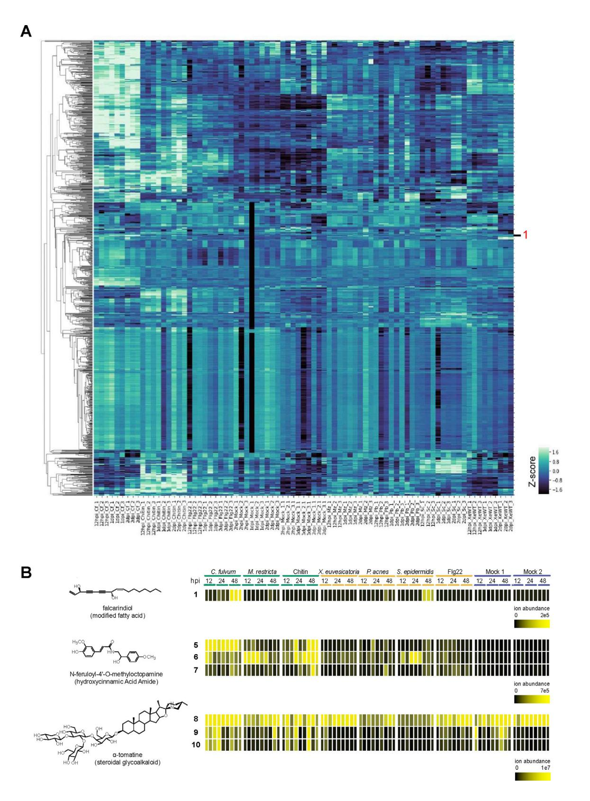

(legend on next page)

Cell

Figure S1. Quantitative Metabolomics Profiling Using LC-MS Analysis, Related to Figure 2

(A) Heatmap of tomato metabolomic features induced by elicitors and levels in each sample. Z-scores are calculated using log (peak\_intensity) value and feature list was filtered in order to have representative induced metabolites after treatments using following criteria (filtered from 11266 features to 1131 features): i)  $max\_intensity$  across all conditions > 1e+5, ii) med\_intensity across all conditions > 1e+4, iii) rt > 3min, rt < 45min (in 45 min gradient method), iv) fold-change of median value under the specific condition compared to control > 3. Complete average method with Euclidean distance measure was used for clustering via python package seaborn. Falcarindiol (1) is highlighted in red. Raw LC-MS data for this figure is available in the Metabolights database at https://www.ebi.ac.uk/ metabolights/securedredirect;jsessionid=EB2A7C6DF35F9BA17D882874ECCF3F5E?url=MTBLS1039. The plotted matrix is available at https://github.com/ sattely-lab/falcarindiol\_pathway\_metabolomics. (B) Examples of metabolites from untargeted metabolomics analysis. Modified fatty acids (1: falcarindiol, *m/z* 283.1660 [M+Na]\*), hydroxycinnamic acid amides (5: p-coumaroyloctopamine, m/z 300.1226 [M+H]\*, 6: N-feruloyl-4'-O-methyloctopamine, m/z 344.1492  $[M+H]^{\dagger}, 7: N\text{-feruloyloctopamine, } m/z \text{ } 330.1325 \text{ } [M+H]^{\dagger}) \text{ and steroidal glycoalkaloids (8: } \alpha\text{-tomatine, } m/z \text{ } 1034.5932 \text{ } [M+H]^{\dagger}, 9 \text{ and } 10: \text{ unidentified saponins } m/z \text{ } 1034.5932 \text{ } [M+H]^{\dagger} \text{ } 1034.5932 \text{ } [M+H]^{\dagger} \text{ } 1034.5932 \text{ } [M+H]^{\dagger} \text{ } 1034.5932$ 1294.76 and m/z 810.58, respectively) were selected as representative metabolites that are responsive to biotic elicitors (compound identification is putative based on literature survey as well as MS and UV spectra). Heatmaps show ion abundance in mass spectrometry.

Cell

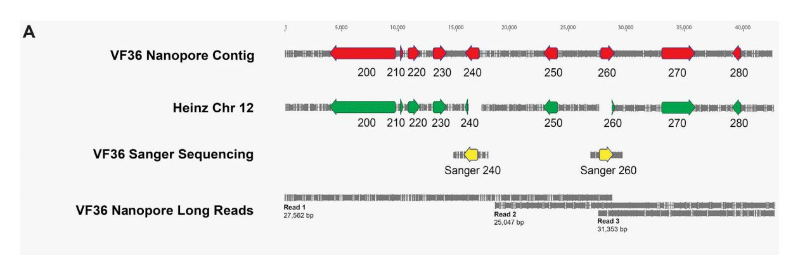

>New Solvc12g100240 genomic sequence

ATGGGAGCTGGTGGAAATATGTCTACTCCAACAACTAAAAAAAGTCATCTCCAAAGAGTTCCATCTTCGAAGCCCCCTTTTACACTTGGCGATG TGAAGAAGGCCATTCCTCATCGCTTCCCAACGTTCTCTTATTCGATCCTTCTCTTATCTTATTCAAGATCTCATACTTGTCTCCGTCTTCTA
TTATATTGCCAACACTTACTTCCATTCCATTACCTTACCTTACCTTGCCTGGCCCGCTTATTGGATCGGCCAGGTTGTGTTTCCACT
GGGATATGGGTCATTGGACACGAATGTGGTCATCATGGCTTCAGTGATTACCAATGGGTAGATGACACTGTTGGTCTCATCCTACATTCTGCAC TTTTAACACCATACTTTGCATGGAAGCATAGTCATCGGCGTCATCATGCCAACACTGGCTCCCTTGAGAATGATGATGAAGTGTACATACCTAGGTT TAAATCCAAACTGAGATGGTACTACAAATACTTGAACAATCCATTAGGACGAGTATTCGTACTTGCCTTCACCCTCACCTTTGCCTGGCCTTTA TACTTGATGTTCAATATCTCAGGCAAAAAATATGAACGTTTTGCATGTCACTATGATCCAAATAGCCCAATCTATTCTAACCGCGAGAAATGC AAATCTACATTTCAGATGCAGGTGTGATTGCAGCTACTTATGTATTATACCGCCTTGCTATGACACAAGGGCTAACTTGGGTTCTGTGTATGTA CGGAGTGCCTCTCCTTATCGTGAATGGATTTATAGTGTTGATCACTCTTATGCACCACACTCATGCTTCATTGCCACATTATGATTCATCGGAG TGGGATTATCTAAGAGGAGCTTTAGCTACCGTAGATAGAGACTATGGTATACTAAACAAGGTGTTCCATAATGTTACTGATACTCATGTCTTGC ATCATATATTCTCATACATATCACATTACCATGCAATGGAGGCGACCAACGCGATTAAGCCATTGCTAGGAGATTATTACCAAGTTGATGATAC CCCAATTTTAAAGGCAATGTGGAGGGATACAAAGGAGTGCATCTATGTAGAGAAGGATGAAGGATCTCAAGGTGAGGGTGTTTATTGGTATAAAGGAATGTGATGAAGGATGAAGGATCTCAAGGTAGAGGGTGTTTATTGGTATAAAGGAATGTGATGAAGGATAAAGGGATGTTTATTGGTATAAAGGGATTGAAGGAAGGAAGGAAGGAAGGATTTTAAGGAAGGATTTTAAGGGATGTTATTGGTAATAAAGGGA AACAAGCTTTGA

>New Solyc12g100260 genomic sequence

ATGGGAGCTGGTGGAAATATGTCTACTCCAACAACTAAAAAAAGTCATCTCCAAAGAGTTCCATCTTCGAAGCCCCCTTTTACACTTGGCGATG TGAAGAAGGCCATTCCTCACTGCTTCCAACGTTCTCTTATTCGATCCTTCTCTTATTCAAGATCTCATACTTGTCTCCGTCTTCTA TTATATTGCCAACACTTACTTCCATCTCCATCTCCATTTAACTTACCTTGCCTGGCCCGCTTATTGGATCGCGCAAGGTTGTGTTTCCACT GGGATATGGGTCATTGGACACGAATGTGGTCATCATGGCTTCAGTGATTACCAATGGGTAGATGACACTGTTGGTCTCATCCTACATTCTGCAC
TTTTAACACCATACTTGGAAGCATAGTCATCGGCGTCATCATGCCAACACTGGCTCCCTTGAGAATGATGATGAGTGTACATACCTAGGTT
TAAATCCAAACTGAGATGGTACTACAAATACTTGAACAATCCATTAGGACGAGTATTCGTACTTGCCTTCACCCTCACCTTTGCCTGGCCTTTA TACTTGATGTTCAATATCTCAGGCAAAAAATATGAACGTTTTGCATGTCACTATGATCCAAATAGCCCCAATCTATTCTAACCGCGAGAAATGC AAATCTACATTTCAGATGCAGGTGTGATTGCAGCTACTTATGTATTATACCGCCTTGCTATGACACAAGGGCTAACTTGGGTTCTGTGTATGTA CGGAGTGCCTCTCCTTATCGTGAATGGATTTATAGTGTTGATCACTCTTATGCACCACACTCATGCTTCATTGCCACATTATGATTCATCGGAG TGGGATTATCTAAGAGGAGCTTTAGCTACCGTAGATAGAGACTATGGTATACTAAACAAGGTGTTCCATAATGTTACTGATACTCATGTCTTGC ATCATATATTCTCATACATATCACATTACCATGCAATGGAGGCGACCAACGCGATTAAGCCATTGCTAGGAGATTATTACCAAGTTGATGATAC CCCAATTTTAAAGGCAATGTGGAGGGATACAAAGGAGTGCATCTATGTAGAGAAGGACGAAGGATCTCAAGGAAGAGGTGTTTATTGGTATAAA AACAAGCTTTGA

>Denovo Assembled sequence 100240/100260

ATGGGAGGTGGTGGTGGTAATATGTCTACACAACTAAAAAAAA TGAAGAAGGCCATTCCTCATCGCTTCCCAACGTTCTCTTATTCGATCCTTCTCTTATCTTATTCAAGATCTCATACTTGTCTCCGTCTTCTA TTATATTGCCAACACTTACTTCCATCTCCATTTAACTTACCTTGCCTGGCCCGCTTATTGGATCGCGCAAGGTTGTGTTTCCACT GGGATATGGGTCATTGGACACGAATGTGGTCATCATGGCTTCAGTGATTACCAATGGGTAGATGACACTGTTGGTCTCATCCTACATTCTGCAC
TTTTAACACCCATACTTGGAAGCATAGTCATCGGCGTCATCATGGCCAACACTGGCTCCCTTGAGAATGATGAAGTGTACATACCTAGGTT
TAAATCCAAACTGAGATGGTACTACAAATACTTGAACAATCCATTAGGACGAGTATTCGTACTTGCCTTCACCCTCACCTTTGCCTTGCCTTTA TACTTGATGTTCAATATCTCAGGCAAAAAATATGAACGTTTTGCATGTCACTATGATCCAAATAGCCCAATCTATTCTAACCGCGAGAGAATGC AAATCTACATTTCAGATGCAGGTGTGATTGCAGCTACTTATGTATTATACCGCCTTGCTATGACACAAGGGCTAACTTGGGTTCTGTGTATGTA CGGAGTGCCTCTCCTTATCGTGAATGGATTTATAGTGTTGATCACTCTTATGCACCACACTCATGCTTCATTGCCACACTTATGATTCATCGGAG TGGGATTATCTAAGAGGAGCTTTAGCTACCGTAGATAGAGACTATGGTATACTAAACAAGGTGTTCCATAATGTTACTGATACTCATGTCTTGC ATCATATATTCTCATACATATCACATTACCATGCAATGGAGGCGACCAACGCGATTAAGCCATTGCTAGGAGATTATTACCAAGTTGATGATAC CCCAATTTTAAAGGCAATGTGGAGGGATACAAAGGAGTGCATCTATGTAGAGAAGGACGAAGGATCTCAAGGAAGAGGTGTTTATTGGTACAAA AACAAGCTTTGA

(legend on next page)

Cell

Figure S2. New Genomic Sequence for Solyc12g100240 and Solyc12g100260 from Tomato Cultivar VF36, Related to Figure 2

(A) Genomic organization of the candidate metabolic gene cluster on chromosome 12 in Heinz SL3.0 genome compared to the VF36 genome sequence obtained by Nanopore and Sanger DNA sequencing. Genes related to the falcarindiol pathway are highlighted. Genes are denoted without 'Solyc' and chromosome number. Nanopore reads and Sanger sequencing of PCR products using primers flanking 100240 and 100260 to differentiate the two loci was used to reannotate the gene cluster. (B) The DNA sequences for Solyc12g100240 and Solyc12g100260 consist of only 1 exon and vary by 2 nucleotides at the 3' end of the gene (shown in red). Both sequences encode an identical protein sequence. The denovo assembled sequence generated from transcript data varies at 5 positions, which results in a conservative change at amino acid position 3 (glycine to alanine; shown in blue).

Cell

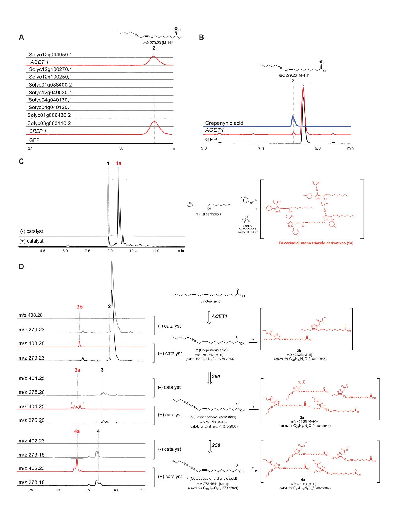

(legend on next page)

Cell

Figure S3. Aligned EICs of Crepenynic Acid and Chemical Derivatization of Acetylenic Bonds in New Metabolites Produced in N. benthamiana Leaves after Transient Expression of ACET1 (240/260 cDNA) and 250 cDNA, Related to Figure 4

(A) HPLC/MS analysis of saponified metabolites extracted from N. benthamiana leaves expressing GFP ((-) control), each of 10 candidate acetylenases identified from analysis shown in Table S2 (including 240/260 cDNA = ACET1), and Crep1 ((+) control). Traces show extracted ion counts of m/z 279.23 ([M+H]<sup>+</sup>, (+) mode).

(B) The ACET1 product was confirmed as crepenynic acid (2) by HPLC/MS and comparison with an authentic standard. The asterisk indicates linolenic acid, an isomer of crepenynic acid and an endogenous metabolite present in *N. benthamiana* extracts.

(C) Click reaction of a purified sample of falcarindiol spiked into N. benthamiana extract. Scheme of click reaction using Cp\*RuCl(cod) to identify internal alkyne functionality in falcarindiol (1) in complex plant extract. Aligned EICs of falcarindiol (1) and its mono-triazole derivatives (1a) produced using the click reaction. The reaction was conducted with and without catalyst conditions to monitor the consumption of reactants as well as appearance of products.

(D) Structural characterization of pathway intermediates using a ruthenium click reaction. Horizontal arrows: scheme of click reaction using Cp\*RuCl(cod) to identify internal alkyne functionality in pathway intermediates (2-4) in extracts from N. benthamiana leaves expressing ACET1 cDNA and 250 cDNA (a, ethylazidoacetate, Cp\*RuCl(cod), acetone, rt, 16 h). Chemical structures of reaction products (2b, 3a, 4a) are putative and di-triazole derivatives were not observed. Vertical arrows: Proposed molecular structures of pathway intermediates for observed MS signal. Aligned EICs of pathway intermediates (2, 3, 4) and corresponding click reaction products (2b, 3a, 4a) observed in extracts from ACET1 cDNA and 250 cDNA expressed in N. benthamiana leaves. Reactions were conducted with and without catalyst conditions to monitor the consumption of reactants as well as appearance of products.

Cell

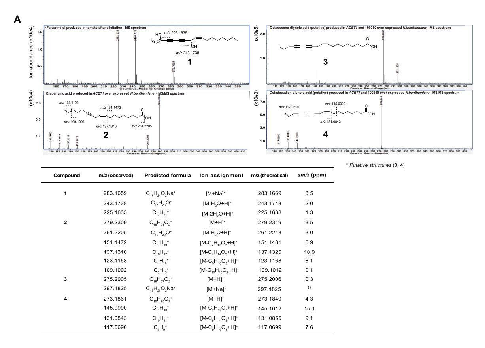

В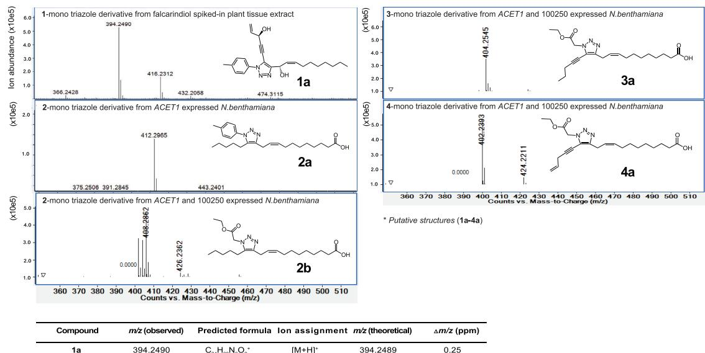

| Compound  | <i>m/z</i> (observed) | Predicted formula | Ion assignment | <i>m/z</i> (theoretical) | Δ <i>m/z</i> (ppm) |
|-----------|-----------------------|-------------------|----------------|--------------------------|--------------------|
| <b>1a</b> | 394.2490              | C24H32N3O2+       | [M+H]+         | 394.2489                 | 0.25               |
| <b>2a</b> | 412.2965              | C25H38N3O2+       | [M+H]+         | 412.2959                 | 1.45               |
| <b>2b</b> | 408.2862              | C22H36N3O4+       | [M+H]+         | 408.2857                 | 1.22               |
| <b>3a</b> | 404.2545              | C22H34N3O4+       | [M+H]+         | 404.2544                 | 0.24               |
| <b>4a</b> | 402.2393              | C22H32N3O4+       | [M+H]+         | 402.2387                 | 1.49               |

(legend on next page)

Cell

Figure S4. MS Spectra and Proposed Molecular Structures with Signal Assignment for Observed Pathway Intermediates and Click Reaction **Products, Related to Figure 4** 

(A) MS and MS/MS (collision energy at 10 V) spectra of the compounds produced in planta (tomato and N. benthamiana) and table of MS and MS/MS peak assignments along with putative structures. MS/MS spectra of compound 1 (falcarindiol) and 3 (putative octadecene-diynoic acid) were not obtained due to low abundance of fragment ions. (B) MS spectra of click reaction products of pathway intermediates present in N. benthamiana saponified tissue extract. MS peaks were assigned based on proposed structures. As shown in Figure S3, click derivatization of 2 using ethylazidoacetate as the click reagent resulted in the production of a new mass peak that included the expected mass for structure 2b. However, the MS spectrum of this peak was complex due to other co-eluting ions and was not indicative of a single compound. In contrast, click derivatization of 2 with 4-azidotoluene produced the expected product 2a with a clean MS spectrum, providing support for the presence of the alkyne in 2.

Cell

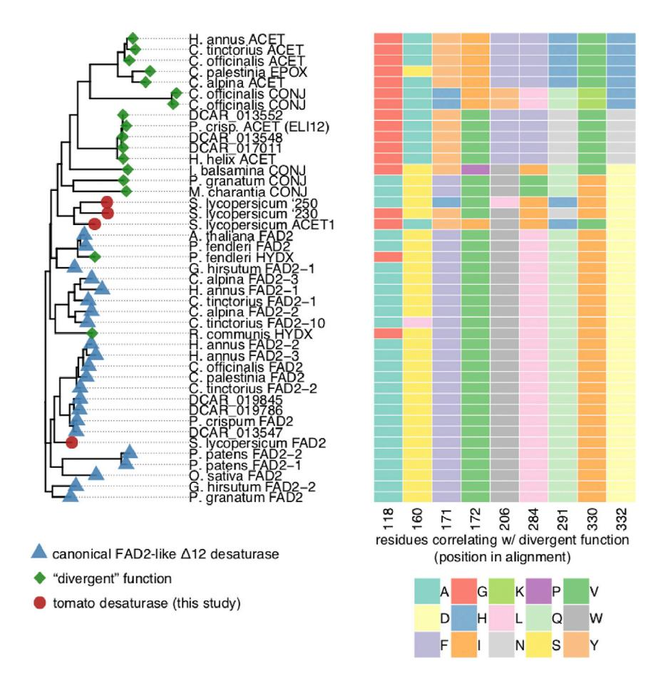

Figure S5. Sequence Analysis of Falcarindiol-Related Desaturases, Including Solyc12g100250, Related to Figure 4

The tree at left (made with FastTree) contains biochemically characterized FAD2-like desaturases, including canonical Δ12 desaturases (blue triangles) and enzymes with "divergent" function, including acetylenases, hydroxylases, and epoxidases (green diamons) [Busta et al., 2018]. The tomato FAD2-like enzymes involved in falcarindiol biosynthesis identified in this study cluster together with other enzymes with divergent function. However, examination of the key residues in this protein family that correlate with divergent activity as described in Busta et al. reveal that the enzyme encoded by Solyc12g100250 harbors the canonical desaturase residue at some key positions (118, 172, 330, 332), and "divergent" residues at other positions (171, 284). We hypothesize that the activities we attribute to the Solyc12g100250 enzyme-both  $\Delta$ 14 desaturase and  $\Delta$ 14 acetylenase activities – stem in part from the unusual amino acid composition of the enzyme at these key activity-determining positions.

Cell

| A | Solyc12g100270                                            | Target1             PAM                              | TGGATATCGTTATCGCGC-CACAGGACTGCTAAGGGTAATAATAGAATTG (wild-type)             WISLSRHRTAKGNNRI          |                                                           |
|---|-----------------------------------------------------------|------------------------------------------------------|------------------------------------------------------------------------------------------------------|-----------------------------------------------------------|
|   | Mutant plant #1,3,4             (Cas9+)                   |                                                      | TGGATATCGTTATCGCGC_CACAGGACTGCTAAGGGTAATAATAGAATTG (1bp insertion)             WISLSRSQDC*           |                                                           |
|   |                                                           | Target2             PAM                              |                                                                                                      |                                                           |
|   | Solyc12g100270                                            |                                                      | TGGATATCGTTATCGCGCCACAGGACTGCTAAGGGTAATAATAGAATTG (wild-type)             WISLSRHRTAKGNNRI           |                                                           |
|   | Mutant plant #13             (Cas9+)                      |                                                      | TGGATATCGTTATCGCGCCACAGGA---CTAAGGGTAATAATAGAATTG (3bp deletion)             WISLSRHRTKGNNRI         |                                                           |
|   | Mutant plant #20             (Cas9+)                      |                                                      | TGGATATCGTTATCGCGCCACAG---GCTAAGGGTAATAATAGAATTG (4bp deletion)             WISLSRHRLRVIIEL          |                                                           |
| B | Solyc12g100240/260(ACET1a/b)                              | PAM             Target1                              | CACTGCTTCCAACGTTCTCTTATTCGATCCTTCTCTTATCTTATTCAAGATC (wild-type)             HCFQRSLIRSFSYLIQD       |                                                           |
|   | Mutant plants #39,42             (Cas9+)                  |                                                      | CACTGCTTCCAACG----CTTATTCGATCCTTCTCTTATTCAAGATC (4bp deletion)             HCFQRLFDPSLILFKI          |                                                           |
|   | Solyc12g100240/260(ACET1a/b)                              | PAM             Target2                              | CTTATTCGATCCTTCTCTTATCTTATTCAAGATCTCATACTTGTCTCCGTCT (wild-type)             LIRSFSYLIQDLILVSV       |                                                           |
|   | Mutant plants #33,50,53             (Cas9-)               |                                                      | CTTATTCGATCCTTCT-TTATCTTATTCAAGATCTCATACTTGTCTCCGTCT (1bp deletion)             LIRSF FILFKISYLSPS   |                                                           |
| C | Solyc12g100250                                            |                                                      | CTCGTTCGCTCCTCTTCCTATCTTATTTACGATCTCATACTTGTCTTCATCTTCTAT             LVRSSSYLIYDLILVFIFY            |                                                           |
|   |                                                           | PAM             Target2                              | TACATCGCCTCTACTTATTTCCACGTCCTTCCAAAACCG (wild-type)             YIASTYFHVLPKP                        |                                                           |
|   | Mutant plants #9, 16             (Cas9-)                  |                                                      | CTCGT----------------------------------             LV                                               |                                                           |
|   |                                                           |                                                      | ---------TCCTTCCAAAACCG (77bp deletion)             PSKT                                             |                                                           |
|   | Solyc12g100250                                            | PAM             Target1                              | TCCTCTTCCTATCTTATTTACGATCTCATACTTGTCTTCATCTTCTATTACATC (wild-type)             SSSYLIYDLILVFIFYYI    |                                                           |
|   | Mutant plants             #23(Cas9+), 41(Cas9-)           |                                                      | TCCTCTTCCTATC-----TACGATCTCATACTTGTCTTCATCTTCTATTACATC (5bp deletion)             SSSYLRSHTCLHLLLH   |                                                           |
| D |                                                           |                                                      |                                                                                                      |                                                           |
|   | 100240             Acetylenase             (ACET1a)       | 100250             Fatty acid             desaturase | 100260             Acetylenase             (ACET1b)                                                  | 100270             Putative             Decarbonylase     |
| Ε |                                                           |                                                      |                                                                                                      |                                                           |
|   | Methanol extract sample             3rd leaf from the top |                                                      |                                                                                                      | Genetic complementation             3rd leaf from the top |
|   |                                                           |                                                      |                                                                                                      |                                                           |
|   |                                                           |                                                      | agro-GFP                                                                                             | Mock                                                      |
|   | Mock                                                      | C. fulvum                                            | agro-240/260                                                                                         | agro-270                                                  |
| F |                                                           |                                                      |                                                                                                      |                                                           |
|   | 9091                                                      |                                                      | # of features ID'd from untargeted metabolites             analysis across all samples WT & KO lines |                                                           |

 $\texttt{\# of features presence in WT}$ 

WT-mock < 2\*10e4

96

3

<pre># of features upregulated in WT by *C. fulvum*<br>Fold change (treated vs. mock) > 5, p-value < 0.1, max\_intensity >10e4,<br>3 min </pre>

but absent in 270, ACET1 mutants with both *C. fulvum*<br>and mock treatment, and WT plants with mock treatment<br>*max\_intensity in ∆270-cf, ∆270-mock, ∆ACET1-cf, ∆ACET1-mock*, and

(legend on next page)

Cell

Figure S6. Generation of ACET1a/b, Soly12100270, and Soly12100250 Null Mutants and Metabolite Analyses, Related to Figure 5

(A) Solyc12g100270 and (B) Solyc12g100240 (ACET1a) Solyc12g100260 (ACET1b), and (C) Solyc12g100250 mutations generated by CRISPR/Cas9 system in tomato cv. VF36 T1 generation plants. Red and blue letters represent CRISPR/Cas9 target and PAM (protospacer adjacent motif) sequences, respectively. Red bold and underlined letter represent insertion. Black dashes represent the deletions. Translated protein sequences are represented under the DNA sequences. (A) Genotype of Solyc12g100270 mutant plants #1, 3, 4, 13, and 20. (B) Genotype of △ACET1 mutant plants #33, 39, 42, 50, and 53. (C) Genotype of Solyc12g100250 mutant plants #9, 16, 23, and 41. (D) Targeted locations of CRISPR guide RNAs on gene cluster are marked with red boxes. (E) Experimental design for CRISPR tomato mutant metabolite analysis. CRISPR tomato mutant plants (VF36) were treated with Cladosporium fulvum (Cf, OD<sub>600</sub> = 1.0) and water (mock) to monitor falcarindiol production in two independent knockout mutant lines (left leaf) and wild-type tomato. Over the course of the study, we learned that Agrobacterium tumefaciens induced falcarindiol production in tomato (See Figure 5C). To evaluate metabolites changes, A. tumefaciens carrying the corresponding genes and GFP were used for both elicitation as well as protein overexpression in tomato (right leaf). (F) Illustration of stepwise filtering of metabolites detected in CRISPR mutant lines and WT tomato after treatment with Cladosporium fulvum or water (negative control) to identify compounds potentially related to ACET1 and Solyc12g100270 (270). Description for the numbers in diagram is on the right panel and the criteria used for filtering at each step is noted below. One of the final 3 candidates is falcarindiol and two remaining molecules are under investigation.

Cell

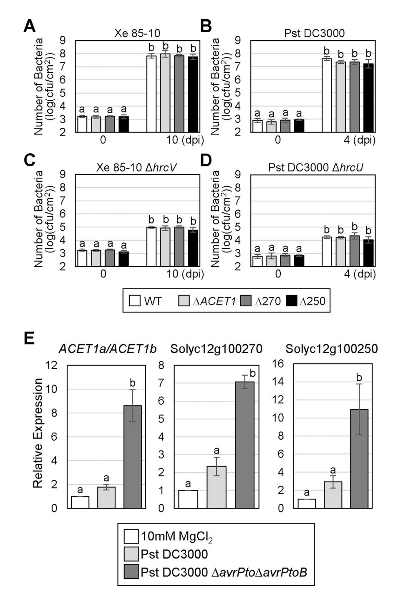

Figure S7. Bacterial Pathogen Growth in Tomato WT, ΔACET1, Δ270, and Δ250 Leaves and Abundance of ACET1a/ACET1b, Solyc12g100270, and Solyc12g100250 mRNAs in WT Tomato during Infection, Related to Figure 6

(A-D) Number of bacteria (log(cfu/cm<sup>2</sup>)) in infected leaves at 0, 4 or 10 dpi. *Xanthomonas euvesicatoria* strain 85-10 wild-type (Xe 85-10) and *ΔhrcV* mutant (Xe 85-10  $\Delta$ hrcV). n = 3 plants. Error bars indicate SD. Experiment was performed 3 times. Different letters indicate the statistically significant (one-way analysis of variance and Tukey's HSD test, p < 0.05) differences between the samples. (E) Wild-type tomato leaves were syringe-infiltrated with 10 mM MgCl<sub>2</sub> (white bars), or a 2x10<sup>8</sup> CFU/ml suspension of wild-type Pst DC3000 (light gray bars) or Pst DC3000 *∆avrPto∆avrPtoB* (dark gray bars). After 6 h, mRNA abundance for ACET1a/ ACET1b, Solyc12g100270, and Solyc12g100250 was determined by qRT-PCR. Relative expression (mean  $\pm$  SD, n = 3) was determined against the mean of 10 mM MgCl<sub>2</sub> samples. Different letters indicate the statistically significant (one-way analysis of variance and Tukey's HSD test,  $p < 0.05$ ) differences between the samples.