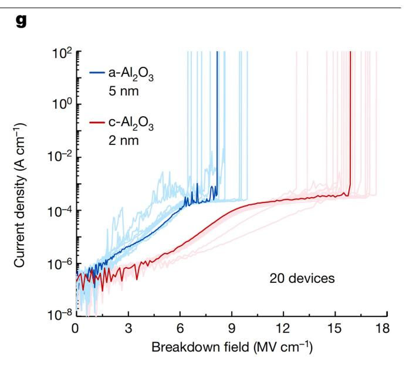

**Corrections & amendments**

# **Publisher Correction: Single-crystalline** metal-oxide dielectrics for top-gate 2D transistors

https://doi.org/10.1038/s41586-024-08001-y

Published online: 6 September 2024

Correction to: Nature https://doi.org/10.1038/s41586-024-07786-2

Published online 7 August 2024

**Open access** 

Check for updates

Daobing Zeng, Ziyang Zhang, Zhongying Xue, Miao Zhang, Paul K. Chu, Yongfeng Mei, Ziao Tian & Zengfeng Di

In the version of the article initially published, in the key to Fig. 1g, the label now reading "c-Al $_2\text{O}_3\,2\,\text{nm}$ " originally read "a-Al $_2\text{O}_3\,2\,\text{nm}$ " and has now been amended in the HTML and PDF versions of the article.

Open Access This article is licensed under a Creative Commons Attribution  $\odot$ (00 4.0 International License, which permits use, sharing, adaptation, distribution and reproduction in any medium or format, as long as you give appropriate credit to the original author(s) and the source, provide a link to the Creative Commons licence, and indicate if changes were made. The images or other third party material in this article are included in the article's Creative Commons licence, unless indicated otherwise in a credit line to the material. If material is not included in the article's Creative Commons licence and your intended use is not permitted by statutory regulation or exceeds the permitted use, you will need to obtain permission directly from the copyright holder. To view a copy of this licence, visit http://creativecommons.org/licenses/by/4.0/.

© The Author(s) 2024

Fig. 1 | Correct figure.

Nature | Vol 633 | 26 September 2024 | E5