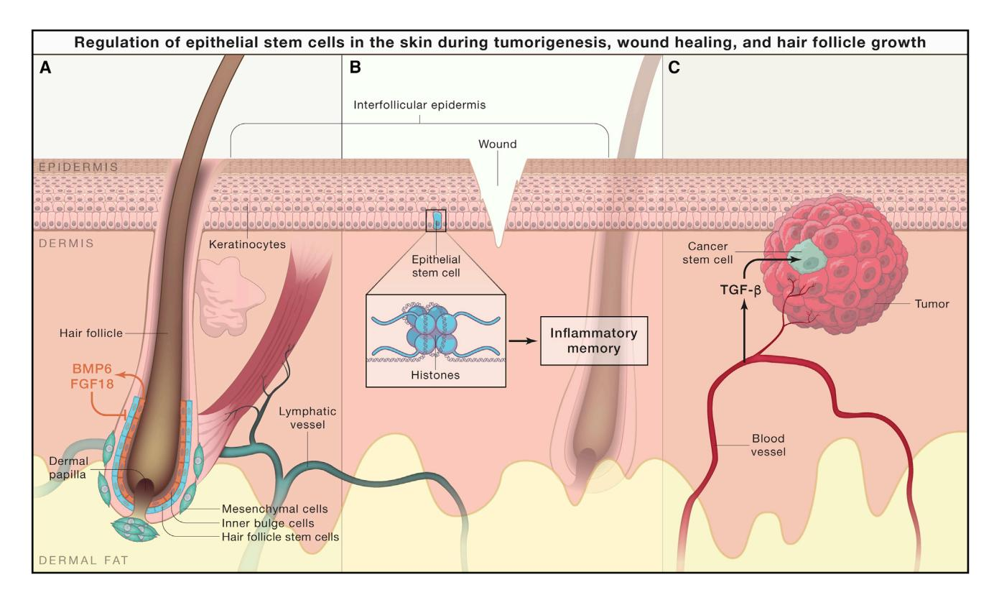

CellPress

Cell

Leading Edge

BenchMarks

# Skin in the Game: Stem Cells in Repair, Cancer, and Homeostasis

Valerie Horslev1,2,\*

1Molecular, Cellular and Developmental Biology, Yale University, New Haven, CT 06511, USA

2Department of Dermatology, Yale University, New Haven, CT 06511, USA

\*Correspondence: valerie.horsley@yale.edu

https://doi.org/10.1016/j.cell.2020.03.019

The 2020 Canada Gairdner International Award has been awarded to Elaine Fuchs for her discovery of the role of adult skin stem cells in homeostasis, wound repair, inflammation, and cancer. These insights have established a foundation for basic knowledge on how adult stem cells form, maintain, and repair tissues and have provided the groundwork for additional exploration and discovery of pathways in other stem cell systems.

The Greek myth of the cyclic destruction and regeneration of Prometheus' liver highlights the ancient fascination with the ability of tissues to regenerate and repair themselves. The cellular basis for tissue regeneration was not identified until centuries later with pioneering work on mouse bone marrow cells in the 1960's by Till and McCullouch, which demonstrated that adult cells in the bone marrow could repopulate irradiated mice (Becker et al., 1963). This work set the stage for the identification of stem cells in other tissues that could maintain and repair damaged tissue.

The ease of manipulation, isolation, and assay of stem cells in the blood system led to a rapid development of key concepts of stem cells in mammalian adult tissues in vivo. However, the study of the mechanisms that controlled the regeneration of other tissues was slow until Howard Green, in his pioneering work in the 1970s, developed the ability to culture human epithelial stem cells, allowing the exploration of mechanisms that control non-hematopoietic stem cells (Rheinwald and Green, 1975).

Elaine Fuchs entered Dr. Green's laboratory as a postdoctoral fellow with an interest in how epithelial stem cells were regulated. There, she focused on the function and transcriptional regulation of the major structural proteins in the skin, keratins. Eventually, she realized that the culture of human keratinocytes was limiting and recognized that transgenic mouse technology had the power to expand our understanding of mechanisms that control keratinocyte biology.

Her laboratory pioneered the use of mouse models for the study of skin beginning with the discovery that newborn mice lacking keratin 14 had blistering skin (Coulombe et al., 1991). This work led to the revelation that skin diseases (including epidermolysis bullosa simplex, in this case) could be caused by mutations in structural proteins in epithelial keratinocytes. The research not only illustrated the advantages of using genetic mouse models to study skin development and homeostasis, but also more broadly established genetic modeling as a critical tool that would play an important role in the expansion of investigative dermatology and stem cell biology.

Armed with the power of mouse genetics, the Fuchs lab identified skin phenotypes that impacted hair follicle development and regeneration (Figure 1A). For example, Elaine and her team found that they could cause excessive hair follicles to form by specifically expressing an activated β-catenin transcription factor in the skin, which turned on the Wnt signaling pathway (Gat et al., 1998). In earlier work, Drs. Lavker, Sun, and Costarelis at the University of Pennsylvania had identified hair follicle stem cells (HFSCs) in the bulge region of hair follicles (Cotsarelis et al., 1990), but it was unclear how these adult stem cells were requlated. Both of the laboratories of Drs. Fuchs and Cotsarelis used distinct methods to isolate bulge stem cells. marking them with fluorescent reporters based on either their slow cycling behavior (Tumbar et al., 2004) or expression of keratin 15 (Morris et al., 2004;

 Tumbar et al., 2004), respectively. The specificity of the fluorescent labeling allowed both laboratories to purify and subsequently profile the transcriptional states of epithelial stem cells for the first time. These advances opened the field by providing a new level understanding of the molecular machinery unique to HFCSs in the bulge.

Over the past 15 years, Elaine Fuchs and the members of her laboratory used the molecular gene expression of HFSCs to elegantly discover and demonstrate the function of several transcription, epigenetic, and niche factors (reviewed in Fuchs, 2018) in the formation and regeneration of HFSCs. They have taught us that two layers of stem cells in the hair follicle communicate through the growth factors BMP6 and FGF18, which are expressed and secreted by "inner bulge cells" (Hsu et al., 2014) and keep HFSCs in a quiescent state by inducing them to express transcription factors like NFATC1 and FOXC1 (Fuchs, 2018). On the other hand, early progeny of HFSCs secrete Shh signals to stimulate self-renewal and generate more progeny (Hsu et al., 2014). Additional transcription factors such as Sox9, Lhx2, and TCF3/4 regulate stem cell behavior in other ways, by silencing super enhancers in HFSCs, whereas Wnt signaling can drive activation of additional super enhancers that initiate hair growth (Fuchs, 2018). These multifaceted alterations in transcriptional and epigenetic control allow the fine tuning of stem cell homeostasis and activation during hair growth. Beyond the intrinsic regulation of HFSC activity, the

492 Cell 181, April 30, 2020 ª 2020 Elsevier Inc.

Cell BenchMarks

CellPress

Figure 1. Regulation of Epithelial Stem Cells in the Skin during Tumorigenesis, Wound Healing, and Hair Follicle Growth

(A) Hair follicle stem cells are regulated intrinsically and extrinsically by their neighbors, progeny, and external environment, including lymphatic vessels.

(B) Inflammatory signals after injury impact epidermal stem cells to retain an inflammatory memory for faster healing through epigenetic mechanisms.

(C) Cancer stem cells are responsive to vascular derived tumor growth factor  $\beta$  (TGF-  $\beta$ ) to promote invasion and chemotherapy resistance.

Fuchs group also provided insight into how mesenchymal niche cells-such as the dermal papilla (Rendl et al., 2008) and, most recently, lymphatic vessels (Gur-Cohen et al., 2019)-regulate HFSC activity. Though many questions remain regarding control of hair follicle regeneration, Dr. Fuchs' work (in concert with others in the field) has elevated our understanding of HFSCs regulation to a level now on par with our knowledge of the hematopoietic stem cell compartment.

Dr. Fuchs' contributions to our understanding of the skin extend beyond hair follicle development and regeneration. Her team has made major inroads into the mysteries of wound healing (Figure 1B). Her work has shown that during skin repair after injury, HFSCs can contribute (in a short-term manner dependent on the transcription factor Sox9) to the migration of epidermal stem cells, a process required so that the injured, open epithelium can be closed (reviewed in Fuchs, 2018). Exploring mechanisms by which epidermal stem cells in the inter-

follicular epidermis contribute to wound repair, the Fuchs lab demonstrated that, like hematopoietic stem cells and progenitors, injury promotes an inflammatory memory in epithelial stem cells to heighten their response to future injuries (Naik et al., 2017). This memory requires inflammatory stimuli that drive epigenetic changes in epidermal stem cells via inflammasome signaling. Given the importance of wound management as a world health problem, these and future insights will be important for designing effective clinical therapies for devastating human problems beyond hair loss.

In a similar vein, another major area of Dr. Fuch's research has been a focus on how the skin contributes to cancer (Figure 1C). Following their discovery that skin tumors were initiated by overactivation of Wnt signaling in the epidermis (Gat et al., 1998), Dr. Fuchs and colleagues sought to integrate their genetic mouse models with new cutting edge technologies to uncover the molecular mechanisms of tumorigenesis in the

skin. For example, they performed RNAi screens in their tumor-suceptible mice to identify oncogenes, tumor suppressors, and microRNAs in skin cancers (Beronia et al., 2013; Fuchs, 2018). In another particularly fruitful study, they used an in vivo biological sensor to trace the lineage of cells that have active levels of the TGF- $\beta$  signaling pathway. Through this approach, they discovered that signals from the vasculature create a permissive niche that stimulates cancer stem cells in a way that allows them to become invasive and resistant to chemotherapy (Oshimori et al., 2015). The methods developed under Dr. Fuchs' leadership have defined new mechanisms that drive skin tumorigenesis and will continue to be powerful tools for the future of stem cell and cancer biology.

In summary, Dr. Fuchs has been a pivotal figure in the research community, directing and redirecting our understanding of how stem cells within tissues communicate during homeostasis, repair, and tumorigenesis. By harnessing strong

Cell 181, April 30, 2020 493

CellPress

Cell BenchMarks

cell biological tools and applying them to tissue biology, Dr. Fuchs has fearlessly moved stem cell biology in profound ways with impact in multiple fields, including immunology, wound repair, investigative dermatology, and cancer biology. Like Prometheus' liver, reinventing itself again and again, I appreciate Elaine's fortitude and the way she has persisted in bringing renewal to skin research and in bringing her insights, inspiration, and science of the highest quality to every field she has touched.

# ACKNOWLEDGMENTS

V.H. is supported by NIAMS (R01AR069550 and R01AR075412) as well as the DiaComp Program  $(32307-40)$ 

# REFERENCES

Becker, A.J., McCulloch, E.A., and Till, J.E. (1963). Cytological demonstration of the clonal nature of spleen colonies derived from transplanted mouse marrow cells. Nature 197, 452-454.

Beronja, S., Janki, P., Heller, E., Lien, W.H., Keyes, B.E., Oshimori, N., and Fuchs, E. (2013). RNAi screens in mice identify physiological regulators of oncogenic growth. Nature 501, 185-190.

Cotsarelis, G., Sun, T.T., and Lavker, R.M. (1990). Label-retaining cells reside in the bulge area of pilosebaceous unit: implications for follicular stem cells, hair cycle, and skin carcinogenesis. Cell 61, 1329-1337.

Coulombe, P.A., Hutton, M.E., Letai, A., Hebert, A., Paller, A.S., and Fuchs, E. (1991). Point mutations in human keratin 14 genes of epidermolysis bullosa simplex patients: genetic and functional analyses. Cell 66, 1301–1311.

Fuchs, E. (2018). Skin Stem Cells in Silence, Action, and Cancer. Stem Cell Reports 10, 1432-1438.

Gat, U., DasGupta, R., Degenstein, L., and Fuchs, E. (1998). De Novo hair follicle morphogenesis and hair tumors in mice expressing a truncated betacatenin in skin. Cell 95, 605-614.

Gur-Cohen, S., Yang, H., Baksh, S.C., Miao, Y., Levorse, J., Kataru, R.P., Liu, X., de la Cruz-Racelis, J., Mehrara, B.J., and Fuchs, E. (2019). Stem cell-driven lymphatic remodeling coordinates tissue regeneration. Science 366, 1218–1225.

Hsu, Y.C., Li, L., and Fuchs, E. (2014). Emerging interactions between skin stem cells and their niches. Nat. Med. 20, 847-856.

Morris, R.J., Liu, Y., Marles, L., Yang, Z., Trempus, C., Li, S., Lin, J.S., Sawicki, J.A., and Cotsarelis, G. (2004). Capturing and profiling adult hair follicle stem cells. Nat. Biotechnol. 22, 411-417.

Naik, S., Larsen, S.B., Gomez, N.C., Alaverdyan, K., Sendoel, A., Yuan, S., Polak, L., Kulukian, A., Chai, S., and Fuchs, E. (2017). Inflammatory memory sensitizes skin epithelial stem cells to tissue damage. Nature 550, 475-480.

Oshimori, N., Oristian, D., and Fuchs, E. (2015). TGF- $\beta$  promotes heterogeneity and drug resistance in sauamous cell carcinoma. Cell 160. 963–976.

Rendl, M., Polak, L., and Fuchs, E. (2008). BMP signaling in dermal papilla cells is required for their hair follicle-inductive properties. Genes Dev. 22, 543-557

Rheinwald, J.G., and Green, H. (1975). Serial cultivation of strains of human epidermal keratinocytes: the formation of keratinizing colonies from single cells. Cell 6, 331-343.

Tumbar, T., Guasch, G., Greco, V., Blanpain, C., Lowry, W.E., Rendl, M., and Fuchs, E. (2004). Defining the epithelial stem cell niche in skin. Science 303, 359-363.

494 Cell 181, April 30, 2020