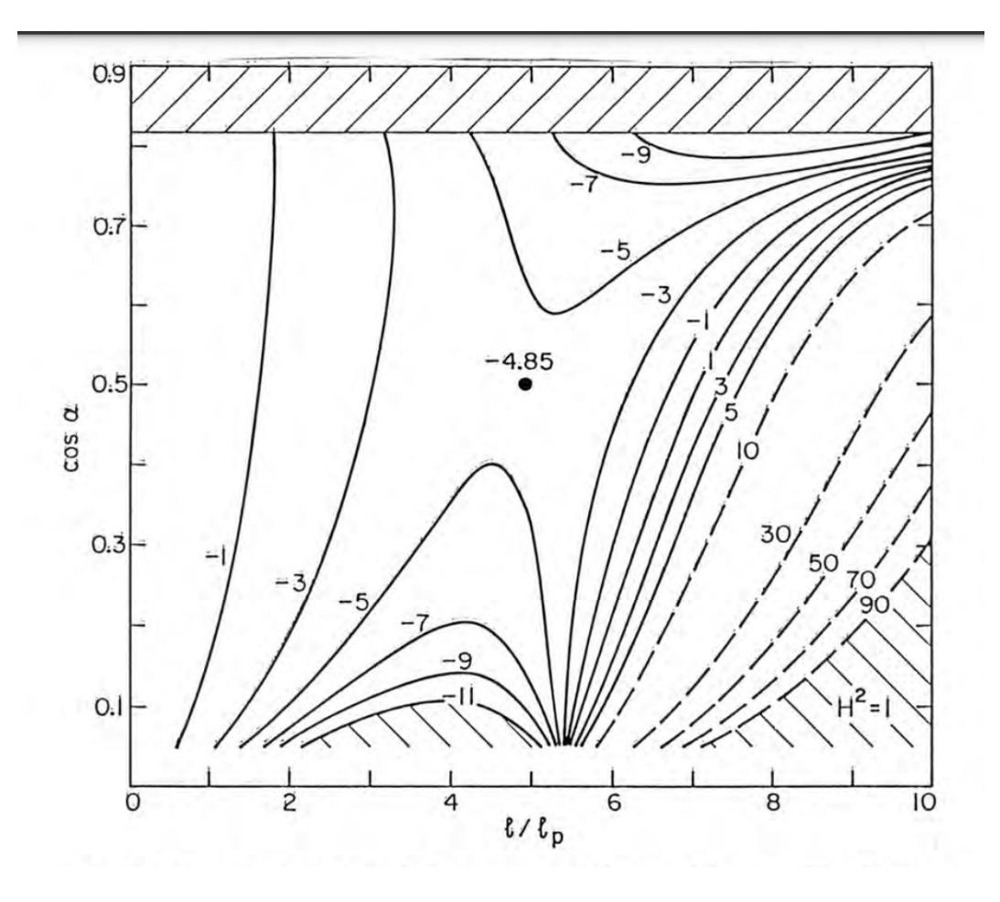

# $\text{Simplicial Quantum Gravity}^*$

 $James B. Hartle$ 

Department of Physics, University of California, Santa Barbara, CA 93106-9530, USA

 $\text{Abstract}$

Simplicial approximation and the ideas associated with the Regge calculus  $\text{Refs}(3,11,12)$  provide a concrete way of implementing a sum-over-histories formulation of quantum gravity. A simplicial geometry is made up of flat simplices joined together in a prescribed way together with an assignment of lengths to their edges. A sum over simplicial geometries is a sum over the different ways the simplices can be joined together with an integral over their edge lengths. The construction of the simplicial Euclidean action for this approach to quantum general relativity is illustrated. The recovery of the diffeomorphism group in the continuum limit is discussed. Some possible classes of simplicial complexes with which to define a sum over topologies are described. In two dimensional quantum gravity it is argued that a reasonable class is the class of pseudomanifolds.

Note Added: Provenance: This paper is essentially a historical document. As mentioned in the footnote, this article started out as a conference talk well before arXiv. It is closely connected to the author's paper Ref(14). It appears in print here for the first time nearly 40 years later for two reasons: First it is a simple, short, but still current, exposition of the use of lattice gravity to sum over topology as discussed for example in the author's "My Time Line in Quantum Mechanics" Ref(9). The second reason is that Figures 2 and 3 show numerical calculations of the action for different simplicial geometries calculated by the author but not otherwise readily available. A third reason is that there seems to be renewed interest in summing over topologies among those working in quantum gravity and quantum cosmology. The article is unchanged from the original text except to update some terminology, to cite some newer more relevant references, and to divide the exposition into two more manageable parts. The first part deals with sums over geometries, the second part with sums over topologies e.g. Ref(14). No attempt had been made to cite later work that bears on the questions raised here e.g. simplicial conifolds Ref(13).

\* Talk delivered at the 3rd Moscow Quantum Gravity Seminar, October 25, 1984.

1

# Ι. SUMMING OVER GEOMETRIES

The sum over histories formulation of quantum mechanics provides a direct and general framework for the construction of a quantum theory of gravity. Quantum amplitudes are specified by sums over geometries in a class appropriate to the particular amplitude of interest. For example, the amplitude for a given three geometry  $^{(3)}\mathcal{G}$  to occur in the state of minimum excitation of a closed cosmology is  $Eq(1)$  and  $Ref(1)$ .

$$
\psi\left[^{(3)}\mathcal{G}\right] = \sum_{\mathcal{G}} \exp\left(-I[\mathcal{G}]\right). 
$$

(1)

Here,  $I$  is the Euclidean gravitational action and the sum is over all connected, compact Euclidean four geometries  $\mathcal{G}$  which have the given three-geometry as a boundary. This is the no-boundary wave function of our Universe.  $\text{Ref}(1)$ .

A four-geometry is a four-dimensional manifold with a metric. A sum over geometries therefore means a sum over four-manifolds and a functional integral over physically distinct four-metrics. To understand what such sums and integrals mean, one should have a practical method of implementing them. Simplicial approximation and the ideas associated with the Regge calculus  $\text{Refs}(3,11,12)$  and  $\text{Ref}(7)$  provide such a method. I would like to illustrate their utility. I shall emphasize the use of simplicial methods as tools for definition, approximation, and calculation in a continuum theory of gravity. It may be, however, that the discrete version is more fundamental and the continuum only an approximation as, for example, in a theory with a fundamental length.

A simplicial geometry is made up of flat simplices joined together. A two dimensional surface can be made out of flat triangles. A three-dimensional manifold can be built out of tetrahedra; in four dimensions one uses 4-simplices and so on. The information about topology is contined in the rules by which the simplices are joined together. A metric is provided by an assignment of edge lengths to the simplices and a flat metric to their interiors. With this information we can, for example, calculate the distance along any curve threading the simplices.

A two-dimensional surface made up of triangles is curved in general as, for example, the surface of the tetrahedron in Figure 1. The curvature is not in the interior of the triangles; they are flat. It is not on the edges; two triangles meeting in a common edge can be flattened without distorting them. Rather, the curvature of a two-dimensional simplicial geometry

2

FIG. 1: The surface of a tetrahedron is a two-dimensional surface whose curvature is concentrated at its vertices. To flatten the three triangles meeting at vertex A one could cut the tetrahedron along edge AC. The angle  $\theta$  by which the edges AC fail to meet when flattened is a measure of the curvature at A called the deficit angle.

is concentrated at its vertices, because one cannot flatten the triangles meeting in a vertex without cutting one of the edges. If one does cut one of the edges and flatten then the angle by which the separated edges fail to meet is a measure of the curvature called the deficit angle. (See Figure 1.) It is the angle by which a vector would be rotated if parallel transported around the vertex. Concretely the deficit angle is  $2\pi$  minus the sum of the interior angles of the triangles meeting at the vertex. It can thus be expressed as a function of their edge lengths.

In four dimensions the situation is similar with all dimensions increased by 2. The geometry is built from flat 4-simplices. Curvature is concentrated on the two-dimensional *triangles* in which they intersect. There is a deficit angle associated with each triangle which is  $2\pi$  minus the sum of the interior angles between the bounding tetrahedra of the 4-simplices which intersect the trangle.

The gravitational action may be expressed as a function of the deficit angles and the volumes of the simplices. For example, the Euclidean Einstein action with comological constant for a connected closed manifold in  $n$ -dimensions is,

$$
g_n \ell_p^{n-2} I_n = -\int d^n x(g)^{1/2} (R - 2\Lambda). 
$$

(2)

Here,  $\ell_p = (16\pi G)^{1/2}$  is the Planck length and  $g_n$  is a dimensionless coupling. On a simplicial geometry eq(2) becomes exactly Ref(3).

$$
g_{n} \ell_{p}^{n-2} I_{n} = -2 \sum_{\sigma \in \Sigma_{n-2}} V_{n-2} \theta_{n-2} + 2\Lambda \sum_{\tau \in \Sigma_{n}} V_{n}. 
$$

(3)

3

Here,  $\sum_k$  is the collection of k-simplices and  $V_k$  is the volume of a k-simplex. The deficit angle  $\theta_k$  is defined by

$$
\theta_k(\sigma) = 2\pi - \sum_{\tau \supset \sigma} \theta_k(\sigma, \tau), Eq(3). 
$$

(4)

where the sum is over all the  $(k + 2)$ -simplices  $\tau$  which meet  $\sigma$  and the  $\theta_k(\sigma,\tau)$  are their interior angles at  $\sigma$ . Both  $V_k$  and  $\theta_k(\sigma,\tau)$  are simply expressible in terms of the edge lengths through standard flat space formulae. By using these expressions in  $Eq(3)$  the action becomes a function of the edge lengths. Other gravitational actions, such as curvature squared Lagrangians, may be similarly expressed—not exactly as here, but in an approximate form which becomes exact in the continuum limit, as in Regge's original paper, [Ref\(3\)](#page-9-1).

Sums over geometries may be given concrete meaning by taking limits of sums of simplicial approximations to them. This is analogous to defining the Riemann integral of a function as the limit of sums of the area under piecewise linear approximations to it. Consider, by way of example, the sum over four geometries which gives the expectation value of a physical quantity  $A[\mathcal{G}]$  in the state of minium excitation for closed cosmologies Ref(1).

$$
\langle A \rangle = \frac{\sum_{\mathcal{G}} A[\mathcal{G}] \exp(-I[\mathcal{G}])}{\sum_{\mathcal{G}} \exp(-I[\mathcal{G}])},
$$

(5)

where the sum is over compact, closed Euclidean four-geometries. We are accustomed to think of a geometry as a manifold with a metric, and one might therefore want to think of the sum in (5) as a sum over closed manifolds and a sum over physically distinct metrics on those manifolds. Simplicial approximation could be used to give a concrete meaning to such a sum as follows: (1) Fix a number of vertices  $n_0$ . (2) Approximate the sum over manifolds  $M$  as the sum over the number of way of putting together 4-simplices so as to make a simplicial manifold with  $n_0$  vertices. (3) Approximate the sum over physically distinct metrics by a multiple integral over the squared edge lengths  $s_i$ . (4) Take the limit of these sums as  $n_0$  goes to infinity. In short, express (A) as

$$
\langle A \rangle = \lim_{n_0 \to \infty} \frac{\sum_{M(n_0)} \int_C d\Sigma_{1} A(s_i, M) \exp[-I(s_i, M)]}{\sum_{M(n_0)} \int_C d\Sigma_{1} \exp[-I(s_i, M)]} 
$$

(6)

There remains the specification of the measure and the contour  $C$  for the integral over edge lengths. Of course, today we understand little about the convergence of such a process but it is at least definite enough to be discussed.

The central ingredient in weighting the sum over geometries is the action. A variety of gravitational actions could be considered which correspond in the continuum limit to 

4

Einstein's action or curvature squared Lagrangians and more complicated actions. The extrema of the action are the solutions of a finite set of algebraic equations

$$
\frac{\partial I}{\partial s_i} = 0.
$$

(7)

For the Regge action  $(3)$  in four dimensions these are the discrete version of the Einstein's equation

$$
\sum_{\sigma \in \Sigma_4} \theta(\sigma) \frac{\partial V_2}{\partial s_i} = \lambda \sum_{\tau \in \Sigma_4} \frac{\partial V_4}{\partial s_i}.
$$

 (8)

These extrema can be used to construct the semiclassical approximation to the quantum theory. (For some later efforts at solving the equations see, e.g.  $\text{Ref}(8)$ ).

Figures 2 and 3 show numerical calculations of Regge's action on the four-sphere. The

FIG. 2: The action for some homogeneous isotropic four geometries as a function of volume. The figure shows the action for the 4-geometries which are the boundary of a 5-simplex denoted by  $(\alpha_5)$ and the 5-dimensional cross polytope ( $\beta_5$ ) (the 5-dimensional generalization of the octohedron) when all of their edges are equal. The "continuum" action for the 4-sphere is also plotted.

simplest triangulations of  $S^4$  are the four dimensional surface of a 5-simplex  $(\alpha_5)$  and the four dimensional surface of the 5-cross polytope  $(\beta_5)$ —the 5 dimensional generalization of the octohedron. These are the only regular solids in five dimensions. The 5 simplex has 6 vertices, 15 edges, 20 triangles, 15 tetrahedra and 6 4-simplices. The cross polytope has 

5

$10$  vertices,  $40$  edges,  $80$  triangles,  $80$  tetrahedra and  $32$  4-simplices. Figure 2 shows the action for these triangulations as a function of four volume when all their edges are equal and the cosmological constant is unity in Planck units. The action is always lower than the "continuum" value corresponding to the round four sphere but becomes closer to it as we move from the coarsest triangulation  $\alpha_5$  to the finer  $\beta_5$ .

FIG. 3: The action for distorted 5-simplices. The figure shows the action (divided by  $100$ ) for a two parameter family of 5-simplices in which all the edge lengths are  $\ell$  except for the edges emerging from one vertex which are  $\ell/(2\cos\alpha)$ .  $\alpha$  near  $\pi/2$  corresponds to long thin 5-simplices.  $\alpha$  near 0 corresponds to nearly flat 5-simplices. There are no 5-simplices with  $\cos \alpha$  greater than .81 because the 4-simplex inqualities would be violated. There is a saddle point corresponding to equal edges of value about 4.9. The edges at the saddle pint are thus solution of the classical Regge equations i.e. the simplicial Einstein equation. The negative gravitational action arising from conformal distortions is evident.

6

The edges in Figure 3 have the value  $\ell$  except those leading to a particular vertex which have the value  $\ell/(2\cos\alpha)$ .  $\cos\alpha$  near 0 thus corresponds to "long and thin" 5-simplices while large  $\cos \alpha$  5-simplices are "short and squat."  $\cos \alpha$  cannot be too large because the analog of the triangle inequality for 4-simplices would not be satisfied. The two parameter family shows the characteristic saddle behavior of Einstein's action. There is an extremum when all the edges are equal to about  $4.84\ell_p$ . This is a solution of the discrete field equations corresponding to Euclidean de Sitter space. At this solution the action is neither a maximum nor a minimum but a saddle point. It is thus a solution of the discrete analog of the Einstein eauation.

One of the central features of geometric theories of gravity is their invariance under the diffeomorphism group. In a simplicial approximation the diffeomorphism group is broken in the sense that each different assignment of edge lengths will, in general, correspond to a physically distinct geometries with distinguishable curvatures. The diffeomorphism group reemerges in the limit of large  $n_0$  because in this limit there are many simplicial geometries which *approximately* correspond to a given continuum geometry and whose actions are *approoximately* equal. The integrals in the numerator and denominator of  $(6)$  thus approximately overcount continuum geometries in the same way that a sum over different continuum metrics could overcount physically distinct geometries.

Let us see in more detail how this comes about. While in general one expects different assignments of edge lengths to be different geometries, there is one special case where this is certainly not true. This is flat space. Imagine distributing vertices about a region of  $n$ -dimensional flat space, connecting them so they form a simplicial manifold and assigning the appropriate flat space distances between the vertices as edge lengths. If the vertices are now moved about in flat space there will result a different assignment of edge lengths, but this new assignment results in the same flat geometry. If there are  $n_0$  vertices in this part of the manifold there will be an  $n_0$  parameter family of transformations of the edge lengths which leave the geometry unchanged.

Consider a curved simplicial geometry with many vertices such that the typical edge length is much smaller than the characteristic curvature scale  $L$ . For example, in the process of solving the Regge equations on an increasingly subdivided simplicial manifold to approach a continuum solution, one would expect to reach such a geometry. (The Regge equation can, however, exhibit solutions which do not correspond to a continuum one. e.g.  $\text{Ref.}(10)$ . In

7

this situation, regions small compared to the curvature scale will contain many vertices and be *approximately* flat. There will therefore be directions in the space of edge lengths in which for each the action is *approximately* constant for changes in the edge lengths smaller than the curvature scale. These are the "approximate diffeomorphisms" of the simplicial geometry. Their number is correct —  $n$  directions for reach spacetime point. In an expression like (6) we therefoere expect each of the sums over edge lengths in the numerator and denominator to diverge as  $n_0$  becomes large. For physical quantities, however, the ratio should remain finite.

8

# II. SUMMING OVER TOPOLOGIES

Summing over metrics is only one of two parts of a sum over geometries even as the metric is only one of two parts in the specification of a geometry. The other part might be loosely called the "topology" and it is therefore of interest to investigate sums over topologies. Simplicial approximation is a natural framework in which to do this because the topological and metrical aspects of a simplicial geometry are very clearly separated. The topological information is contained in the rules by which the simplices are joined together. The metrical information is contained in the assignment of edge lengths. In particular, it is possible to consider geometries with complicated topologies but with relatively few edges.

To sum over the topologies of simplicial geometries with  $n_0$  vertices is to sum over some collection of simplices with a total of  $n_0$  vertices. The widest reasonable framework in which to discuss such collections is provided by the connected simplicial complexes. A connected simplicial complex is a collection of simplices such that if a simplex is in the collection then so are all its faces, and such that any two vertices can be connected by a sequence of edges. What connected complexes should be allowed? A natural restriction is to sum only over complexes which are manifolds—that is, such that each point has a neighborhood which is topologically equivalent (homeomorphic) to an open ball in  $\mathbb{R}^n$ . In classical general relativity, geometries on manifolds are the mathematical implementation of the principle of equivalence. That principle tells us that locally spacetime is indistinguishable from flat space, and this is the defining characteristic of a manifold. It would, therefore, seem reasonable to consider geometries on manifolds in the quantum regime although it is less clear that on the scale of the Planck length the principle of equivalence should be enforced in this strong way.

It is not straightforward to define a sum over manifolds. To do so there must at least be an effective procedure for listing those manifolds which contribute to the sum. We cannot do this by classification i.e. by taking "one of type A", "two of type B", etc. because in four (and higher) dimensions the classification problem for manifolds without additional structure is unsolvable. That is, there does not exist an algorithm for deciding when two-manifolds are topologically equivalent (at least at the time this was written.  $\text{Ref}(5)$ ). This does not mean that one could not list topologies with more structure than manifolds for example conifolds  $\text{Ref}(13)$ . Neither does it mean that one could not construct a list in which every manifold of a given dimension would be guaranteed to occur at least once. One would simply not be 

9

able to tell when two manifolds on the list were the same. Both of these approaches have been suggested as possibilities for constructing the sum over topologies. There is, however, another possibility: that we should sum over a more general class of objects than manifolds.

In the sum over histories formulation of quantum mechanics we are familiar with the idea of "unruly histories." These are histories which contribute significantly to the sums for quantum amplitudes but which are less regular than the classical histories. For example, in particle quantum mechanics the dominant paths are non-differentiable while the classical path is always differentiable. One would perhaps be comfortable with admitting to a sum over topologies a larger class of geometries than those defined on manifolds if one recovered manifolds in the classical limit. The question is then: Is there a class of simplicial complexes such that:

- $1.$  the action for general relativity can be defined,

- 2. there is an algorithm for listing the members of the class,

- 3. manifolds are the dominant contribution to the sum over histories in the classical limit?

I cannot yet answer this question in general. In two-dimensions, however, it is easily addressed. This is because two-dimensional Einstein gravity has no metric degrees of freedom. It is not, however, topologically trivial.

The Regge action extends naturally to any simplicial complex in two dimensions. Recall that  $(Eq.(3) \implies$ 

$$
g_2 I_2 = -2 \sum_{\sigma \in \Sigma_0} \theta(\sigma) + 2\Lambda \sum_{\tau \in \Sigma_2} V_2(\tau) 
$$

(9)

where the first sum is over the vertices and the second is over the triangles. Insert the definition  $Eq(4)$  in this expression, interchange orders in the resulting double sum over vertices and triangles and note that the sum of the interior angles of a triangle is  $\pi$ . One finds

$$
g_2 I_2 = -4\pi (n_0 - n_2/2) + 2\Lambda A,
$$

(10)

where  $n_0$  is the number of vertices,  $n_2$  the number of triangles and A is the total area. The curvature part of the action is independent of the edge lengths and is therefore metrically trivial. The action, however, does depend on how the simplices are joined together, that is, on 

10

the topology. This clean separation of metric and topology makes two-dimensional Einstein gravity less interesting than the higher dimensional cases but it also makes topological questions easier to analyze.

Let us start with simplicial complexes which are two-manifolds and enlarge the class by giving up as little as possible until a larger class is found which satisfies our criteria  $(1), (2),$ and  $(3)$  above. If a complex is going to fail to be a manifold it must fail on some collection of points. We give up least if we allow failure only at some discrete number of vertices of the complex and do not permit failure along the edges. This means we require every edge to be the face of exactly two triangles as in the complex in Figure 4a. We thus exclude complexes like Figure 4b which branch on an edge but permit those like Figure 5 which fail at vertices.

FIG. 4: Branching and non-branching complexes. Non-branching two dimensional complexes like that in (a) have exactly two triangles intersecting at any one edge. The complex in (b) has four triangles intersecting along the more heavily drawn edge and is therefore a branching complex. Branching complexes fail to be manifolds at the edges on which they branch.

For non-branching complexes,  $3n_2 = 2n_1$  and the action is

$$
g_2 I_2 = -4\pi\chi + 2\Lambda A 
$$

(11)

where  $\chi = n_0 - n_1 + n_2$  is the Euler number, a topological invariant.

Were we to stop here we could easily violate our criterion that a manifold have the smallest action. Compare the sphere in Figure 4a which has  $\chi = 2$ , with the complex in Figure 5. It has  $\chi = 3$  and so a smaller action. it consists of almost disconnected pieces. To prevent this we require that the complexes be strongly connected in the sense that any pair of triangles can be joined by a sequence of triangles connected along edges. The resulting

11

FIG. 5: A two dimensional non-branching complex which fails to be a manifold at three vertices. This complex is not strongly connected and is thus not a pseudomanifold.

complexes are called pseudomanifolds as described in Ref. $(6)$ . The complex in Figure 6 is a pseudomanifold whereas the one in Fig  $5$  is not.

In two-dimensions, pseudomanifolds have  $\chi \geq 2$ , and the pseudomanifold with  $\chi = 2$  is the sphere. Thus the pseudomanifold with the smallest action is a manifold and we recover manifolds in the classical limit.

Most importantly for us, however, pseudomanifolds are easily enumerable. Their defining properties in  $n$  dimensions are

- 1. Pure dimension—a simplex of dimension  $k < n$  is contained in some *n*-simplex.

- 2. Nonbranching—an  $(n-1)$ -simplex is the face of exactly two *n*-simplices.

- 3. Strongly connected—any two  $n$ -simplices can be connected by a sequence of *n*-simplices connected along  $(n-1)$ -simplices.

These defining properties are essentially combinatorial. Given  $n_0$  vertices one can imagine listing all the possible collections of  $n$ -simplices and checking to see which are pseudomanifolds and which are not in a finite number of steps.

12

FIG. 6: A pseudomanifold which fails to be a manifold at one vertex. The complex is two dimensional, non-branching and strongly connected. It is thus a pseudomanifold. It may be thought of as a sphere with two points identified. For pictorial clarity some of the edges triangulating quadraterals have been omitted but they should be imagined as in the example at lower right.

In two-dimensions pseudomanifolds satisfy all three criteria for a class of complexes with which to define a sum over topologies. The Regge action is defined for them, there is an algorithm for enumerating them, and the pseudomanifold of least action is a manifold. In higher dimensions, finding a class which meets these criteria is a deeper question. Pseudomanifolds can be defined in higher dimensions as described above. The action can be extended to them and they are enumerable. Finding the configurations of least action, however, is now not only a question of topology but also of metric. The possibilities for pseudomanifolds are so varied in higher dimensions that it seems likely that one must restrict the class of complexes further in order to have manifolds dominate in the classical limit. Then by relaxing the principle of equivalence at the quantum level we will have an attractive class of geometries with which to define a sum over topologies in quantum gravity.

13

# Acknowledgments

Thanks to Debbie Ceder who transformed the original into latex. Preparation of this report was supported in part by the National Science Foundation, under grant PHY 81-07384. The author is indebted to Ruth Williams for conversations on the Regge Calculus over many years and for a critical reading of this paper.

- 1 Hartle, J.B. and Hawking, S.W., Phys. Rev. **D28**, 2960 (1983).
- 2 Hawking, S.W., Nucl. Phys. **B239**, 257 (1984).
- 3 Regge, T., Nuovo Cimento **19**, 558 (1961).
- 4 Friedberg, R. and Lee, T.-D., Nucl. Phys.B **239** , 257(1984).
- 5 For a review of this result of A.A. Markov see Haken, W. in *Word Problems*, ed. by Boone, C.M., Cannonito, F.B. and Lyndon, R.C. (North Holland, Amsterdam, 1973).
- 6 Seifert, H. and Threlfall, W., *Textbook of Topology*, (Academic Press, New York, 1980).
- 7 J.B. Hartle, Simplicial Minisuperspace I. General Discussion *J. Math Phys.*, **26**, 804-814 (1985)
- 8  J.B. Hartle, Simplicial Minisuperspace II: Some Classical Solutions on Simple Triangulations J. Math Phys ,27, 287-295, (1986).
- 9 J.B. Hartle, My Timeline in Quantum Mechanics, forthcoming.
- 10 T. Piran and A. Strominger, *Solutions of the Regge equations*, *Classical and Quantum Gravity* 3, 97 (1986).
- 11 R.M. Williams and P.A. Tuckey, was *Regge Calculius: A Brief Review and Bibliograhy Class.* Quant. Grav., 9 1409, (1992).
- 12 R. M. Williams, *Recent Progress in Regge Calculus*, arXiv/gr-q/9702006. Nucl.Phys.Proc.Suppl. 57 (1997) 73-81
- 13 K. Schleich and D. Witt, *Simplicial Conifolds*, *Nucl. Phys.B*, **402**, 469 (1993). arXiv/grqc9903062.
- 14 J. B. Hartle, *Unruly Topologies in Two-Dimensional Quantum Gravity*, Class. Quantum Grav. , 2, 707 (1985).

14