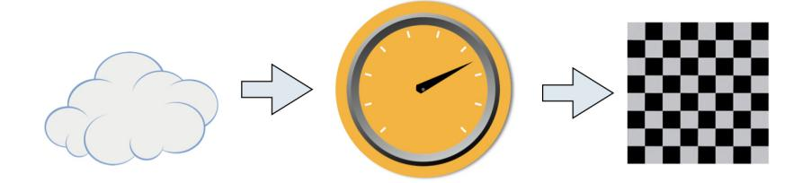
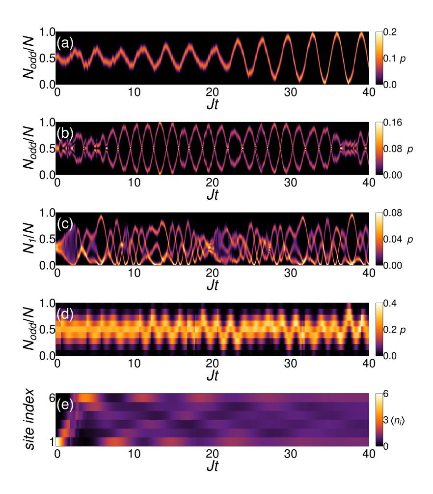
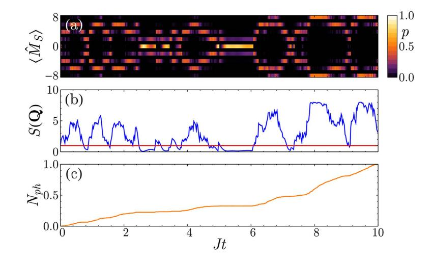
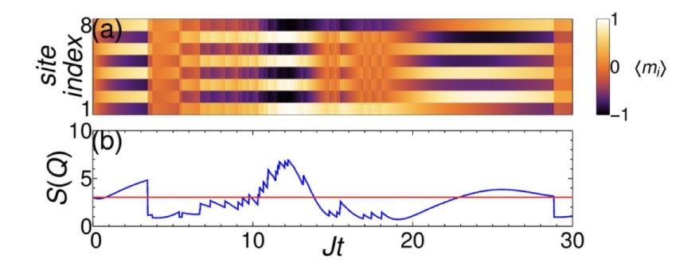
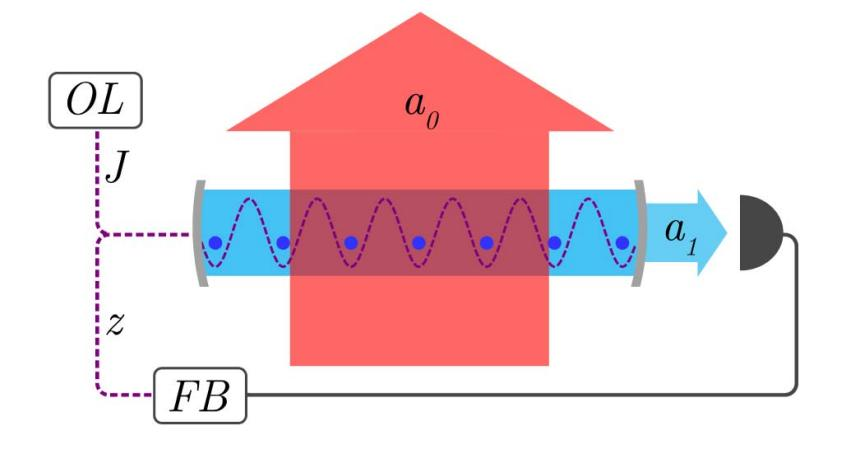
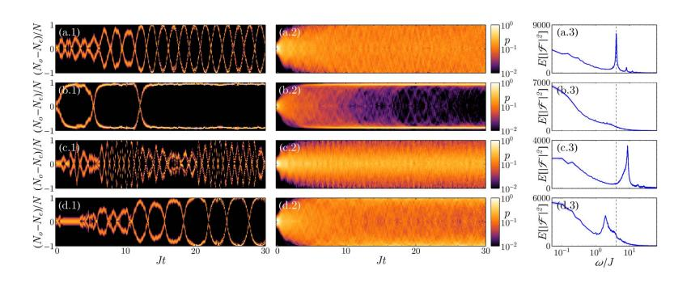

arXiv:2302.00167v1 [cond-mat.quant-gas] 1 Feb 2023

# Materia cuántica y dinámica por mediciones

Santiago F. Caballero-Beníte $z^a$ 

Instituto de Física, LSCSC-LANMAC, Universidad Nacional Autónoma de México,

Apdo. Postal 20-364, México D. F. 01000, México.

(Dated: February 2, 2023)

This article discusses some details of the course on "Quantum matter and measurement induced dynamics" given in the Summer School of Physics XXIX at UNAM in 2022. The notes describe useful concepts to study the dynamics induced by photon losses, the method for simulation (quantum trajectories) is summarized and details of models in optical lattices and high-Q cavities are given. The notes are in Spanish.

En este artículo se discuten algunos detalles del curso sobre "Materia cuántica y dinámica inducida por medición" de la escuela de verano de Física XXIX (2022) en la UNAM. Las notas describen conceptos útiles para estudiar la dinámica emergente por efectos de medición de fotones, se resume el método para simulación (trayectorias cuánticas) y se dan detalles de modelos de materia cuántica y cavidades de alta reflectancia.

Las notas del curso son una introducción sobre el método implementado de trayectorias cuánticas para estudiar la dinámica inducida en sistemas en redes ópticas y cavidades de alta reflectancia. Se estudia la dinámica inducida en el régimen donde la tasa de pérdida de fotones ( $\kappa$ ) es grande con respecto a la desintonía de la cavidad entre el bombeo y la frecuencia de la cavidad ( $\Delta = \omega_c - \omega_p$ ),  $\kappa \gg |\Delta|$ :

- Materia cuántica, modelos de Hubbard y redes ópticas

- Ingeniería de estados cuánticos con correlaciones vía retro-acción de la pérdida de fotones

- Retroalimentación y control de criticalidad

- Conclusiones

# I. MATERIA CU NTICA, MODELOS DE HUBBARD Y REDES PTICAS

Los recientes avances en el control de los sistemas atómicos han permitido generar una nueva generación de simuladores cuánticos  $[1, 2]$ . Los modelos más simples con interacciones de muchos cuerpos típicos de materia cuántica ultrafría en redes ópticas [3, 4] son el modelo de Hubbard de fermiones  $(\mathcal{H}^f)$ :

$$
\mathcal{H}^{f} = -J\sum_{\sigma}\sum_{\langle i,j\rangle} \left(\hat{f}^{\dagger}_{i\sigma}\hat{f}_{i\sigma} + \text{H.c.}\right) + U\sum_{i}\hat{n}_{i\uparrow}\hat{n}_{i,\downarrow} 
$$

(1)

y modelo de Bose-Hubbard ( $\mathcal{H}^b$ ):

$$
\mathcal{H}^{b} = -J\sum_{\langle i,j\rangle} (\hat{b}_{i}^{\dagger}\hat{b}_{j} + \text{H.c.}) + \frac{U}{2}\sum_{i} \hat{n}_{i}(\hat{n}_{i} - 1)
$$

(2)

Los términos de  $J$  representa la energía cinética ( $J \sim \text{kHz}$ ) y los términos con  $U$  la energía de interacción de muchos cuerpos, que puede ir más allá de perturbaciones y puede generar transiciones de fase cuánticas [\[5\]](#page-9-1). Estos modelos representan el comportamiento de los átomos con diferentes propiedades estadísticas (bosones/fermiones) en segunda cuantización que están en el límite donde los procesos de baja energía dominan. Para lograr estos sistemas se emplean varias etapas de enfriamiento [\[6\]](#page-9-1) hasta llegar a temperaturas de  $10^{-9}$  a  $10^{-6}$  K y después son atrapados por láseres que generan una estructura de red (red óptica) que puede ser controlada de manera externa paramétricamente [\[7, 8\]](#page-9-1). Los parámetros del sistema son controlados por las amplitudes de los láseres y las colisiones de baja energía, típicamente de onda-s via la longitud de dispersión  $a$ . Dependiendo de los átomos en el experimento, esta longitud de dispersión

a Corresponding author: scaballero@fisica.unam.mx

2

FIG. 1: Esquema general de la dinámica inducida por medición. Izquierda: sistema sin estructura. Centro: medición débil. Derecha: estructura emergente inducida, i.e. dos modos espaciales en una red cuadrada.

incluso puede ser controlada de manera externa mediante un campo magnético externo constante y la resonancia de Feshbach que se genera [\[9\]](#page-9-1),  $a = a(B)$ . Los parámetros de los modelos se relacionan de la siguiente manera:

$$
J = \int \mathrm{d}\mathbf{x}^D w(\mathbf{x} - \mathbf{x}_i)^* \left(\frac{\nabla^2}{2m} - V_{\mathrm{OL}}(\mathbf{x})\right) w(\mathbf{x} - \mathbf{x}_j) 
$$

(3)

$$
U = \frac{4\pi\hbar a}{m} \int \mathrm{d}\mathbf{x}^D |w(\mathbf{x} - \mathbf{x}_i)|^4 
$$

(4)

donde  $i, j$  son los vecinos más cercanos,  $w(\mathbf{x})$  son las funciones de Wannier localizadas [\[3\]](#page-9-1),  $m$  la masa de los átomos fermiones ( ${}^{6}\text{Li}$  [\[10\]](#page-9-1),  ${}^{40}\text{K}$  [\[11\]](#page-9-1)) o bosones ( ${}^{7}\text{Li}$  [\[12\]](#page-9-1),  ${}^{23}\text{Na}$  [\[13\]](#page-9-1),  ${}^{87}\text{Rb}$  [\[14\]](#page-9-1)) y  $D$  la cantidad de dimensiones espaciales.  
 La longitud de dispersión de onda-s es  $a = a_{s,\uparrow\downarrow}$  para el caso de fermiones donde se se toman en cuenta colisiones entre diferentes estados magnéticos atómicos (debido al bloqueo de Pauli) y en el caso de bosones se consideran átomos con el mismo estado,  $a = a_s$ . Otros detalles relevantes sobre la analogía con sistemas electrónicos en la aproximación de enlace fuerte y detalles sobre redes ópticas se pueden encontrar en [\[3, 15\]](#page-9-1). Típicamente para una red hiper-cúbica de dimensión  $D$  uno tiene para el potencial de la red óptica,

$$
V_{\rm OL}(\mathbf{x}) = \sum_{\eta=1}^{D} V_0 \sin^2(k_\eta x_\eta)  
$$

(5)

donde  $k_{\eta}$  es el vector de onda de la luz laser incidente formando una onda estacionaria en la dirección  $\hat{e}_{\eta}$ ,  $x_{\eta}$  es la coordenada (i. e.  $x, y, z, \ldots$ ). Para cada "dimensión"  $\eta$  tenemos vectores unitarios  $\hat{e}_{\eta}$ .

# II. INGENIER A DE ESTADOS CU NTICOS CON CORRELACIONES V A RETRO-ACCI N DE LA P RDIDA DE FOTONES

## A. Esquema general de dinámica por medición

Recientemente se han logrado experimentos de átomos ultrafríos en redes ópticas clásicas dentro de una cavidad de alta reflectancia [\[16-18\]](#page-9-1). Estos arreglos típicamente se han realizado con cavidades de onda estacionaria pero también se pueden considerar arreglos con cavidades de ondas viajeras [\[19\]](#page-9-1). También existen realizaciones de sistemas sin redes ópticas con múltiples cavidades [\[20, 21\]](#page-9-1) o cavidades multi-modales [\[22\]](#page-9-1). En principio se puede colocar con posiciones arbitrarias los detectores de fotones que escapan la cavidad. Típicamente los detectores se colocan en los ejes de la cavidad, detrás de los espejos de la cavidad donde la amplitud de la señal de salida es máxima. En estos sistemas se puede estudiar el límite donde la pérdida de fotones es alta con respecto a otras escalas de energía en el sistema, concretamente la desintonía  $\Delta$ . En estas condiciones un escenario a estudiar es si la pérdida de fotones que cambia el estado del sistema de manera dinámica puede inducir estados con estructuras útiles. Por una estructura útil nos referimos a un estado que típicamente el sistema no soporta para bajas energías, como puede ser un estado con una simetría rota inducida u otro tipo de orden emergente, ver Fig.1. Para estudiar esta posibilidad se estudia de manera efectiva la evolución temporal condicionada del sistema por la pérdida de fotones utilizando el método de trayectorias cuánticas [\[23\]](#page-9-1). Para esto se construye el siguiente Hamiltoniano no-Hermitiano,

$$
\mathcal{H}_{\rm NH} = \mathcal{H} - i\hat{c}^\dagger \hat{c}  
$$

(6)

3

$\text{donde}$ 

$$
\hat{c} \approx \frac{\sqrt{2\kappa}g\hat{F}}{\Delta + i\kappa} 
$$

(7)

es el operador de salto cuántico de la trayectoria,  $\kappa$  es la tasa de pérdida de fotones de la cavidad,  $g$  es el acoplamiento luz materia,  $\Delta$  la desintonía y  $\hat{F}$  el operador que codifica la proyección espacial inducida por la luz bombeada al sistema en la materia y la cavidad. El operador  $\hat{F}$  esta dado por la proyección del traslape de los modos bombeados y los modos en la cavidad con componentes espaciales [24-30] y considerando adicionalmente grados internos de libertad (i.e. espín) [31-34],

$$
\hat{F} = \sum_{\sigma,p,c} (\hat{D}_{\sigma pc} + \hat{B}_{\sigma pc}) 
$$

(8)

con modos de densidad,

$$
\hat{D}_{\sigma pc} = \sum_{i} J_{ii}^{\sigma pc} \hat{m}_{\sigma i}^{\dagger} \hat{m}_{\sigma i}  
$$

(9)

 $y \mod o$  de enlace,

$$
\hat{B}_{pc\sigma} = \sum_{\langle i,j \rangle} J_{ij}^{\sigma pc} (\hat{m}_{\sigma i}^{\dagger} \hat{m}_{\sigma j} + \text{H.c.}) 
$$

(10)

con las constantes de estructura,

$$
J_{lm}^{\sigma p c} = \int \mathrm{d}\mathbf{x}^{D} w (\mathbf{x} - \mathbf{x}_{l})^{*} u_{\sigma, c}(\mathbf{x})^{*} u_{\sigma, p}(\mathbf{x}) w (\mathbf{x} - \mathbf{x}_{m})  
$$

(11)

La forma particular del operador de salto  $\hat{c}$  esta directamente relacionada con la eliminación adiabática de la luz, de tal forma que, la luz se encuentra esclavizada a la materia  $[35, 36]$ .

Además, se requiere que después de que un salto cuántico ocurra (la medición de un fotón) el estado del sistema sea renormalizado tal que:

$$
|\Psi \langle \to \frac{\hat{c}|\Psi\rangle}{\langle \hat{c}^{\dagger}\hat{c}\rangle}  
$$

(12)

de manera efectiva el Hamiltoniano no Hermitiano se puede escribir como [31]:

$$
\mathcal{H}_{\rm NH} \approx \mathcal{H}^{f/b} - i \frac{\kappa g_{\rm eff}}{\Delta} \left( \hat{F}^{\dagger} \hat{F} + \hat{F} \hat{F}^{\dagger} \right)  
$$

(13)

con  $g_{eff} = \Delta |g|^2/(\Delta^2 + \kappa^2)$  en el límite donde  $\kappa \gg \Delta$ . El número de fotones que escapa de la cavidad es  $N_{ph} = \langle \hat{a}^{\dagger} \hat{a} \rangle \propto \langle \hat{c}^{\dagger} \hat{c} \rangle$ .

Para estudiar los efectos de la dinámica inducida por medición se implementa el siguiente esquema de simulación.

## B. Esquema del método de trayectorias

- 1. Iniciar el sistema en el estado base u otro estado arbitrario.

- 2. Generar un intervalo  $t$  y un número aleatorio  $r$  en el intervalo  $[0,1]$

- 3. Propagar el sistema con el Hamiltoniano no Hermitiano hasta que la norma del estado es igual a  $r$ .

- 4. Aplicar el operador de salto cuántico (pérdida de un fotón) y renormalizar el estado con respecto a repetir 2 a 4 para un nuevo intervalo  $t'$

4

FIG. 2: Oscilaciones gigantes inducidas en la densidad espacial por medición débil. El estado inicial es un estado homogéneo. Sistemas bosónicos (a,b,d), sistema fermiónico (c). (a) Un modo de luz inducido. (b) Dos modos de luz inducidos. (c) Tres modos de luz inducidos. (c) Modo de luz inducido en fermiones.(d) Modo de enlace inducido en bosones. Figura tomada de  $[31]$ .

## С. Galería de algunos resultados por dinámica inducida por mediciones

En general uno de los efectos de la medición débil es inducir el rompimiento de simetría espacial dinámico dependiendo de como los modos de luz inducidos acoplan espacialmente en el sistema ver  $[30, 31]$ . Se puede inducir diferente número de modos espaciales que en principio son detectables via la medición de las poblaciones por sitio [31] e incluso otras estructuras con coherencia más complicadas utilizando modos de enlace [29]. Esto es una consecuencia de la estructura del arreglo geométrico de la luz ver [27]. La medición compite con la dinámica típica del sistema con procesos de tunelaje y dinámica atómica que actúan de manera homogénea típicamente. Con interacciones es posible que el comportamiento de otras fases de la materia cuántica como pueden ser la presencia de aislantes sean modificadas cambiando los valores críticos de la emergencia del superfluido en el sistema de Bose-Hubbard por ejemplo, así como la destrucción o la protección de la existencia de pares en un sistema fermiónico (Hubbard) dependiendo del esquema de medición, ver  $[31]$ . Adicionalmente, es posible estabilizar órdenes en el sistema o incluso inducirlos sin interacciones  $(U = 0)$ , como pueden ser la emergencia de la magnetización escalonada en el tiempo en sistemas fermiónicos con espín, Figuras 2 y 3,  $[32]$ . En  $[30]$ , se encuentra que las oscilaciones gigantes inducidas por la medición débil son equivalentes a una fuerza estocástica cuasiperiódica aplicada al sistema. Otra manera de entender el fenómeno se presenta por medio del análisis de estabilidad de modelos efectivos via los exponentes de Lyapunov del sistema estocástico donde es claro que existe un regimen de competencia que a partir de un umbral crítico da lugar una inestabilidad que da lugar a que las oscilaciones gigantes en la densidad aparezcan de manera consistente estocásticamente en las trayectorias [30]. Cabe recalcar que el comportamiento observado a nivel de trayectorias

5

FIG. 3: Emergencia de orden anti-ferromagnético en trayectorias con  $U=0$  por mediciones débiles en el tiempo. (a) Distribución de la magnetización escalonada por sitio en el sistema fermiónico. (b) Factor de estructura de la magnetización escalonada. (c) Número de fotones acumulados que escapan del sistema. Figura tomada de [32].

FIG. 4: Optimizacion de orden anti-ferromagnético con  $U > 0$  por mediciones débiles en el tiempo. (a) Distribución de la magnetización por sitio en el sistema fermiónico. (b) Factor de estructura de la magnetización escalonada. Figura tomada de  $[32]$ .

individuales arroja información que permite establecer que es posible estabilizar dichas oscilaciones. Es interesante que el promedio de las trayectorias arroja resultados triviales, dado que las oscilaciones son de carácter aleatorio y tiene fases incoherentes, pero no así grupos representativos de trayectorias. Efectos de detección ineficiente no eliminan por completo la dinámica inducida por medición para valores de hasta  $10\%$  no hay cambios significativos e incluso solo con un  $1\%$  de eficiencia se pueden observar lo efectos en las trayectorias para escenarios bosónicos y fermiónicos  $[30, 32]$ . Adicionalmente es posible analizar la estabilidad y controlar la emergencia de estados obscuros por diseño modificando la dinámica no-Hermitiana [28, 29]. Para calcular los observables del sistema uno puede emplear la siguiente ecuación de movimiento efectiva con trayectorias para un operador  $\hat{O}$  [32],

$$
\frac{\mathrm{d}}{\mathrm{d}t}\langle\hat{O}\rangle = -i\langle[\hat{\mathcal{H}}^{f/b},\hat{O}]\rangle - \langle\{\hat{c}^{\dagger}\hat{c},\hat{O}\}\rangle + 2\langle\hat{O}\rangle\langle\hat{c}^{\dagger}\hat{c}\rangle 
$$

(14)

para la evolución no Hermitiana y con saltos dados por,

$$
\frac{\mathrm{d}}{\mathrm{d}t}(\Psi|\Psi) = -\langle\hat{c}^{\dagger}\hat{c}\rangle 
$$

(15)

donde el operador después del salto cambia tal que,

$$
\langle \hat{O} \rangle \to \frac{\langle \hat{c}^{\dagger} \hat{O} \hat{c} \rangle}{\langle \hat{c}^{\dagger} \hat{c} \rangle}  
$$

(16)

6

FIG. 5: Esquema de retroalimentación. Los fotones que escapan la cavidad donde se encuentran átomos en una red óptica son medidos. La señal de los fotones que escapan es procesado por elementos electrónicos y se retro-alimenta el sistema dentro de la cavidad modificando la intensidad de los láseres que atrapan los átomos en la red óptica. Figura tomada de  $|37|$ .

FIG. 6: Control de la frecuencia de oscilación y congelamiento desbalance arbitrario de poblaciones. $(a 1, 2, 3)$ Sistema sin retroalimentación.  $(b,1,2,3)$  Sistema arriba del límite de retroalimentación para congelar el desbalance.  $(c,1,2,3)$  Control de la frecuencia de oscilación arriba de la frecuencia natural de oscilación por la dinámica atómica.  $(d,1,2,3)$  Control de la frecuencia de oscilación abajo de la frecuencia natural de oscilación por la dinámica atómica. Figura tomada de  $[37]$ .

# III. RETROALIMENTACI N Y CONTROL DE CRITICALIDAD

Más allá de solo medir los fotones que escapan el sistema y afectan el estado cuántico al interior del sistema, se puede considerar la retroalimentación clásica del sistema. Esto se logra procesando la información de salida (fotodetecciones) y modificando en tiempo real los parámetros del sistema de acuerdo a la señal medida (i.e. la intensidad de los láseres que atrapan los átomos en la red óptica). Un esquema se ilustra en la Figura 5 [37]. Esto es posible debido a que existe en estos sistemas diferentes rangos de frecuencia de respuesta de cada componente, típicamente la respuesta electronica sucede en el rango de GHz, la respuesta de la cavidad es en MHz y la respuesta de los procesos atómicos es en kHz. De manera efectiva los cambios realizados para los átomos después del procesamiento de información y modificación de parámetros son instantáneos.

Utilizando este tipo de sistema es posible en primera instancia estabilizar el desbalance que emerge en el sistema (oscilaciones gigantes de la sección anterior) y se puede controlar la frecuencia de las oscilaciones en el sistema inducidas por la pérdida de fotones, Figura 6. También es posible estabilizar la emergencia de orden anti-ferromagnético en un sistema fermiónico  $[37]$ .

Adicionalmente, al considerar la estabilización y control de estados es posible formular la pregunta si es posible controlar incluso la criticalidad del sistema, modificando exponentes críticos y la posición de los mismos. Esto genera un nueva escenario donde se tiene un sistema cuántico que va más allá del paradigma disipativo. Recientemente, 

7

estudios teóricos [38–40] han mostrado que es posible. Considerando dos modos en un condensado de Bose-Einstein  $(BEC)$  dentro de una cavidad tal que

$$
\psi(x) \approx \frac{1}{\sqrt{L}}c_0 + \sqrt{\frac{2}{L}}c_1\cos(k_1x)  
$$

(17)

donde  $c_0$  corresponde a  $k = 0$  y  $c_1$  a  $k = k_1$ . Después de manipulaciones algebraicas se llega al siguiente modelo efectivo [\[38, 39\]](#page-3-1),

$$
\mathcal{H}_{\text{eff}} \approx \Delta \hat{a}^{\dagger} \hat{a} + \omega_R \hat{S}_z + \frac{2}{\sqrt{N}} \hat{S}_x [g(\hat{a} + \hat{a}^{\dagger}) + GI(t)]  
$$

(18)

donde se despreciaron por simplicidad las interacciones de corto alcance entre átomos. Este es de manera efectiva un modelo de Dicke no Markoviano, donde la retroalimentación se considera en  $GI(t)$  con

$$
I(t) \sim \int_0^t h(t-z) \mathcal{F}[x_\theta^{\text{out}}(z)] dz 
$$

(19)

$$
= \int h(t-z)(\hat{a}e^{-i\theta} + \hat{a}^{\dagger}e^{i\theta})dz  
$$

(20)

 $I(t)$  es la señal de control con *G* el coeficiente de retroalimentación. El kernel  $h(x) \sim 1/(t_0+x)^{s+1}$  permite modificar dependiendo de su forma funcional además del valor del valor crítico para la transición de fase, la criticalidad del sistema como función de  $s$ . Se tienen exponentes críticos de valor arbitrario para transición de fase que ocurre entre oscilaciones en los valores de expectación de los operadores de materia i.e.  $\hat{S}_x \approx \hat{X}$  y un valor estacionario con el ablandecimiento de los modos temporales [\[38\]](#page-38-1). La criticalidad se extrae a partir de:

$$
\lim_{G \to G_c} \langle \hat{X}^2 \rangle = \frac{A}{\left|1 - G/G_{\text{crit}}\right|^{\alpha}} + B 
$$

(21)

donde  $\alpha = \alpha(s)$ .

Se ha mostrado que es posible emplear un esquema de retroalimentación que modifica los puntos críticos incluso  $\sin$  la necesidad de una cavidad en [39].

Esquemas similares de retroalimentación han sido empleados recientemente experimentalmente [41]. En estos experimentos fue posible estabilizar estados superradiantes supersólidos con tiempos de vida de más de un orden de magnitud con respecto al sistema sin retroalimentación.

# IV. CONCLUSIONES

Mediante la manipulación en como se miden los fotones que escapan el sistema es posible generar estados cuánticos que típicamente no ocurren. Los estado que emergen de manera dinámica presentan propiedades interesantes y rompimientos de simetría. Utilizando esta ingeniería de estados por efectos de medición es posible modificar, estabilizar y generar comportamiento colectivo con posibles propiedades útiles para simulación cuántica. Adicionalmente, el uso de sistemas compuestos con retroalimentación ofrece una flexibilidad aun mayor en términos de la ingeniería de propiedades de estos sistemas de materia cuántica. Es posible, además de preparar estados de manera dinámica, controlar arbitrariamente como es que se llega a una fase de la materia en particular cerca de puntos críticos, modificar su posición y sus leyes de potencia. La combinación de los sistemas de materia cuántica con la óptica cuántica da nuevas herramientas para controlar las propiedades fundamentales de estos sistemas con posibles aplicaciones útiles para la simulación y el control cuántico avanzado.

# AGRADECIMIENTOS $\mathbf{V}$ .

Se agradece a G. Mazzucchi, W. Kozlowski, D. A. Ivanov, T. Ivanova e I. B. Mekhov por contribuciones esenciales en el trabajo descrito en estas notas.

- [1] F. Schäfer, T. Fukuhara, S. Sugawa, et al. Tools for quantum simulation with ultracold atoms in optical lattices. *Nat. Rev. Phys.* **2**,  $411–425$  (2020).

8

- [2] E. Altman, et. al. Quantum Simulators: Architectures and Opportunities. Phys. Rev. X Quantum 2, 017003 (2021)
- [3] M. Lewenstein, A. Sampera, and V. Ahufinger. *Ultracold atoms in optical lattices: Simulating Quantum Many-Body Systems.* Oxford University Press  $(2012)$ .
- [4] Jaksch, D., Bruder, C., Cirac, J. I., Gardiner, C. W. and Zoller, P. Cold Bosonic Atoms in Optical Lattices. Phys. Rev. Lett. 81, 3108 (1998).
- S. Sachdev. *Quantum Phase Transitions*, Second Edition. Cambridge University Press (2011).  $|5|$
- [6] C. Foot. *Atomic Physics*. Oxford University Press (2005).
- [7] F. Schäfer, T. Fukuhara, S. Sugawa, Y. Takasu and Y. Takahashi. Tools for Quantum simulation with ultracold atoms in optical lattices. Nat. Rev. Phys. 2, 411 (2020).
- I. Bloch, J. Dalibard and W. Zwerger, Many-body physics with ultracold gases. Rev. Mod. Phys. 8 885 (2008).
- [9] C. Chin, R. Grimm, P. Julienne, and E. Tiesinga, Feshbach Resonances in Ultracold Gases. *Rev. Mod. Phys.* **82**, 1225-1286  $(2010)$
- [10] A. Omran, M. Boll, T. A. Hilker, K. Kleinlein, G. Salomon, I. Bloch, and C. Groß, Microscopic Observation of Pauli Blocking in Degenerate Fermionic Lattice Gases. *Phys. Rev. Lett.* **115**, 263001 (2015).
- [11] E. Cocchi, L. A. Miller, J. H. Drewes, M. Koschorreck, D. Pertot, F. Brennecke, and M. Köhl, Equation of State of the Two-Dimensional Hubbard Model. Phys. Rev. Lett. 116, 175301 (2016)
- [12] K. Kwon, Kyungtae K. J. Hur, S. J. Huh, and J. Choi, Site-resolved imaging of a bosonic Mott insulator of  $^{7}$ Li atoms. Phys. Rev. A 105, 033323 (2022)
- [13] K. Xu, Y. Liu, J. R. Abo-Shaeer, T. Mukaiyama, J. K. Chin, D. E. Miller, W. Ketterle, Kevin M. Jones, and E. Tiesinga, Sodium Bose-Einstein condensates in an optical lattice. *Phys. Rev. A* **72**, 043604 (2005).
- [14] M. Greiner, O. Mandel, T. Esslinger, T. W. Hänsch and I. Bloch Quantum phase transition from a superfluid to a Mott insulator in a gas of ultracold atoms. *Nature*  $415$ , 39–44 (2002).
- [15] S. F. Caballero-Benitez, Materia cuántica en cavidades de alta reflectancia (Many-body CQED). Memorias de la XXVIII Escuela de Verano en Física 2021; ISSN: 2594-2697, Universidad Nacional Autónoma de México (2022), arXiv:2201.06641  $(2022).$
- [16] J. Klinder, H. Keßler, M. Reza Bakhtiari, M. Thorwart, and A. Hemmerich, Observation of a Superradiant Mott Insulator in the Dicke-Hubbard Model. Phys. Rev. Lett. 115, 230403 (2015).
- [17] R. Landig, et. al. Quantum phases from competing short- and long-range interactions in an optical lattice. *Nature* 532.  $476 (2016)$ .
- [18] L. Hrubya, N. Dogra, M. Landini, T. Donner, and T. Esslinger, Metastability and avalanche dynamics in strongly correlated gases with long-range interaction,  $PNAS$  115 (13) 3279-3284 (2018).
- [19] I. B. Mekhov and H. Ritsch, Quantum Optics with Quantum Gases. *Laser Phys.* **19**, 610 (2009).
- [20] J. Léonard, A. Morales, P. Zupancic, T. Esslinger, and T. Donner. Supersolid formation in a quantum gas breaking a continuous translational symmetry. *Nature* **543**, 87 (2017).
- [21] A. Morales, P. Zupancic, J. Léonard, T. Esslinger, and T. Donner. Coupling two order parameters in a quantum gas. Nat. Mat. 17, 686 (2018).
- [22] A. J. Kollár, A. T. Papageorge, K. Baumann, M. A. Armen, and B. L. Lev, An adjustable-length cavity and Bose-Einstein condensate apparatus for multimode cavity QED. New J. Phys. 17, 043012 (2015).
- [23] H. M. Wiseman and G. J. Milburn, *Quantum Measurement andControl*(Cambridge University Press, Cambridge, 2010).
- [24] S. F. Caballero-Benitez, and I. B. Mekhov, Quantum optical lattices for emergent many-body phases of ultracold atoms. Phys. Rev. Lett. 115, 243604 (2015).
- [25] S. F. Caballero-Benitez, G. Mazzucchi, and I. B. Mekhov, Quantum simulators based on the global collective light-matter interaction. Phys. Rev. A 93, 063632 (2016).
- [26] S. F. Caballero-Benitez, and I. B. Mekhov, Bond order via light-induced synthetic many-body interactions of ultracold atoms in optical lattices. New J. Phys. 18, 113010 (2016).
- [27] W. Kozlowski, S. F. Caballero-Benitez, and I. B. Mekhov, Probing Matter-Field and Atom-Number Correlations in Optical Lattices by Global Nondestructive Addressing. *Phys. Rev. A* **92**, 013613 (2015).
- [28] W. Kozlowski, S. F. Caballero-Benitez and I. B. Mekhov. Non-Hermitian Dynamics in the Quantum Zeno Limit. Phys. Rev. A 94, 012123 (2016)
- [29] W. Kozlowski, S. F. Caballero-Benitez and I. B. Mekhov. Quantum State Reduction by Matter-Phase-Related Measurements in Optical Lattices. Sci. Rep. 7, 42597 (2017).
- [30] G. Mazzucchi, W. Kozlowski, S. F. Caballero-Benitez, I. B. Mekhov. Collective dynamics of multimode bosonic systems induced by weak quantum measurement. New J. Phys. 18, 73017 (2016).
- [31] G. Mazzucchi, W. Kozlowski, S. F. Caballero-Benitez, T. J. Elliott, and I. B. Mekhov, Quantum measurement-induced dynamics of many-body ultracold bosonic and fermionic systems in optical lattices. *Phys. Rev. A*  $93$ , 023632 (2016).
- [32] G. Mazzucchi, S. F. Caballero-Benitez, and I. B. Mekhov, Quantum measurement-induced antiferromagnetic order and density modulations in ultracold Fermi gases in optical lattices. Sci. Rep. 6, 31196 (2016).
- [33] A. Camacho-Guardian, R. Paredes, and S. F. Caballero-Benitez, Quantum Simulation of Competing Orders with Fermions in Quantum Optical Lattices. Phys. Rev. A 96, 051602(R) (2017)
- [34] K. Lozano-Mendez, A. H. Casares and S. F. Caballero-Benitez. Spin Entanglement and Magnetic Competition via Longrange Interactions in Spinor Quantum Optical Lattices. Phys. Rev. Lett. 128, 080601 (2022).
- C. Maschler, I. B. Mekhov, and H. Ritsch, Ultracold atoms in optical lattices generated by quantized light fields. *Eur.* [35] Phys. J. D 46, 545-560 (2008).

9

- [36] S. F. Caballero-Benitez, and I. B. Mekhov, Quantum properties of light scattered from structured many-body phases of ultracold atoms in quantum optical lattices. New J. Phys. 17 123023 (2015).
- [37] G. Mazzucchi, S. F. Caballero-Benitez, D. A. Ivanov and I. B. Mekhov. Quantum optical feedback control for creating strong correlations in many-body systems. *Optica*  $\mathbf{3}(11)$ , 1213 (2016).
- [38] D. A. Ivanov, T. Yu. Ivanova, S. F. Caballero-Benitez, and I. B. Mekhov, Feedback-Induced Quantum Phase Transitions Using Weak Measurements. Phys. Rev. Lett. 124, 010603 (2020)
- [39] D. A. Ivanov, T. Yu. Ivanova, S. F. Caballero-Benitez, and I. B. Mekhov, Cavityless self-organization of ultracold atoms due to the feedback-induced phase transition. Sci. Rep. 10, 10550 (2020).
- [40] D. A. Ivanov, T. Yu. Ivanova, S. F. Caballero-Benitez, and I. B. Mekhov, Tuning the universality class of phase transitions by feedback: open quantum systems beyond dissipation. Phys. Rev. A 104, 033719 (2021).
- [41] K. Kroeger, N. Dogra, R. Rosa-Medina, M. Paluch, F. Ferri, T. Donner and T. Esslinger, Continuous feedback on a quantum gas coupled to an optical cavity. New J. Phys  $22$ , 033020 (2020).