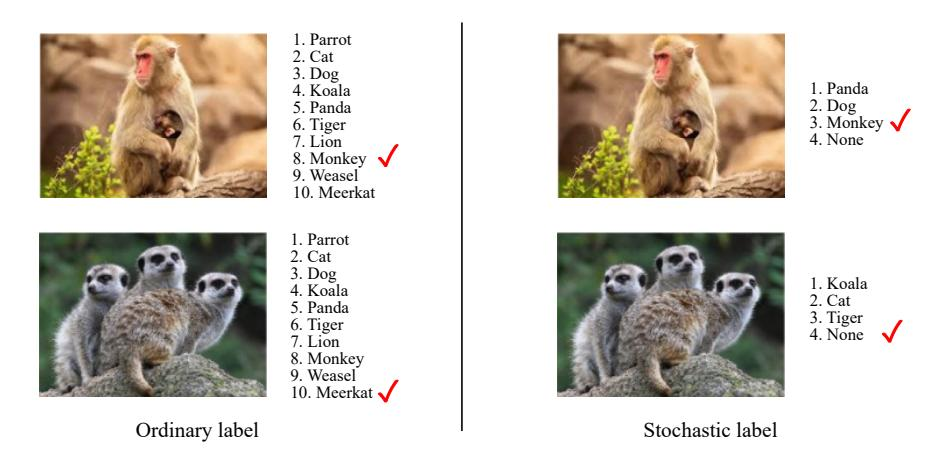
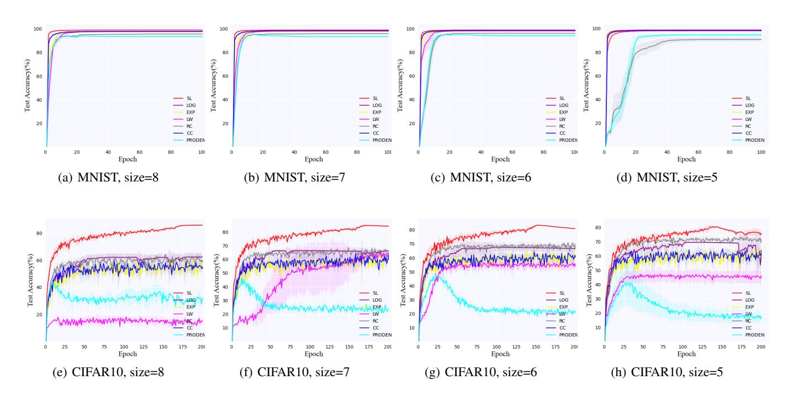

# **Learning from Stochastic Labels**

Meng Wei $^{* \, 1} \;$  Zhongnian Li $^{* \, 1} \;$  Yong Zhou $^{1} \;$  Qiaoyu Guo $^{1} \;$  Xinzheng Xu $^{1} \;$ 

Abstract

Annotating multi-class instances is a crucial task in the field of machine learning. Unfortunately, identifying the correct class label from a long sequence of candidate labels is time-consuming and laborious. To alleviate this problem, we design a novel labeling mechanism called *stochastic* label. In this setting, stochastic label includes two cases: 1) identify a correct class label from a small number of randomly given labels; 2) annotate the instance with None label when given labels do not contain correct class label. In this paper, we propose a novel suitable approach to learn from these stochastic labels. We obtain an unbiased estimator that utilizes less supervised information in stochastic labels to train a multi-class classifier. Additionally, it is theoretically justifiable by deriving the estimation error bound of the proposed method. Finally, we conduct extensive experiments on widely-used benchmark datasets to validate the superiority of our method by comparing it with existing state-of-the-art methods.

# 1. Introduction

Ordinary supervised classification needs to accurately select a ground-truth label for each instance from a long sequence of candidate labels, which is time-consuming and laborious in real-world datasets. To shorten the time and expense of labeling work, in the past decade, a large number of researchers have begun to study weakly supervised learn- $\text{ing(WSL)}$ , hoping to learn an efficient classifier from weakly labels with less information. These WSL approaches include but not limited to, semi-supervised learning (Chapelle et al., 2006; Tarvainen & Valpola, 2017; Miyato et al., 2018; Oliver et al., 2018; Izmailov et al., 2020; Lucas et al., 2022), noisy-label learning (Menon et al., 2015; Ghosh et al., 2017; Ma et al., 2018; Kim et al., 2019; Charoenphakdee et al., 2019; Wang et al., 2019; Han et al., 2020), partial-label learn-

Equal contribution 1China University of Mining and Technology, Xuzhou, China. Correspondence to: Xinzheng Xu <xxzheng@cumt.edu.cn>.

ing (Tang & Zhang, 2017; Xie & Huang, 2018; Wu & Zhang, 2019; Lv et al., 2020a; Zhang et al., 2021; Gong et al., 2022), complementary-label learning (Ishida et al., 2017; Yu et al., 2018; Ishida et al., 2019; Chou et al., 2020; Feng et al., 2020a; Xu et al., 2020; Gao & Zhang, 2021; Wang et al., 2021), unlabeled-unlabeled learning (Du Plessis et al., 2013; Golovnev et al., 2019) and positive-unlabeled learning (Du Plessis et al., 2014; 2015; Sakai et al., 2018; Chapel et al., 2020; Hu et al., 2021; Su et al., 2021; Gerych et al., 2022).

Most existing WSL works achieve satisfactory classification results in multi-class classification task. Nevertheless, these approaches all select one or more weakly labels from the entire candidate labels set, which inevitablely leads to consuming time and bad efficiency. Unfortunately, it is known that a long sequence of candidate labels is common in crowdsourcing Internet labeling jobs(Jamal et al., 2020; Gu et al., 2022). Based on this fact, identifying the correct class label is a huge challenge. However, existing methods have not yet to reduce the size of the candidate labels during annotating instance.

To tackle this problem, stochastic label is proposed as a novel labeling mechanism to help annotators relieve from the heavy labeling tasks. Instead of precisely choosing the correct class label from the entire candidate labels set, stochastic label only needs to identify the ground-truth label from a given small number of labels or annotate None. For example, as shown in the right part of Figure 1, for a monkey instance, crowdsourced workers only need to identify the correct class label from given 3 labels. For a meerkat image. if the provided labels set does not contain the correct class label, the instance will be annotated with None.

Collecting stochastic labels is undoubtedly easier and quicker than collecting ordinary labels. At the same time, this labeling mechanism is also very easy to implement and obtain in reality. As shown in Figure 1, for a monkey instance, crowdsourced workers usually need to browse through the entire candidate labels set, which is extremely time-consuming when the number of class is large. However, in stochastic label, for the same monkey instance, crowdsourced workers only need to find the monkey's label from 3 candidate labels, which takes much less time than choosing the ground-truth label from 10 class labels. Intutively, this

Submission and Formatting Instructions for ICML 2023

Figure 1. A comparison between ordinary label (left) and stochastic label (right). Here, the selected label is ticked. For the same instance, in ordinary label, crowdsourced workers need to identify the correct class label from 10 classes. However, in stochastic label, they only need to select from 3 stochastic labels: Dog, Monkey, Panda, or annotate None.

case implies that accurately selecting the correct class label from stochastic labels set with 3 labels is preferable to that of the whole label set, which saves  $70\%$  of the time.

In this novel setting, we generate a small set of stochastic labels  $\tilde{Y}$  for each instance. In set  $\tilde{Y}$ , each stochastic label is randomly and uniformly selected from the entire candidate labels set, i.e.,  $\tilde{Y} \subset \{1, 2, ..., K\}$ , and  $\forall i, j \in \tilde{Y}, P(i \in \tilde{Y}) = P(j \in \tilde{Y})$ , where  $K$  denotes the number of classes and  $P(i \in \tilde{Y})$  refers to the probability of selecting label  $i$  from the  $K$  classes. As mentioned earlier, for each instance, we either select a correct class label from the generated stochastic labels or annotate None. For these instances marked with None, we can utilize it as complementary labels.

In order to utilize the less supervised information to train a multi-class classifier, we propose an unbiased risk estimator (URE) to learn from these stochastic labels. To stimulate more research on this problem, we establish a prototype baseline for this novel setting. Theoretically, we derive the upper bound of the evaluation risk of the proposed method, and prove that as the number of training samples increases, the empirical risk can converge to the real classification risk. To validate the usefulness of our proposed approach, we have done extensive experiments on widely-used benchmark datasets and compared it with state-of-the-out methods.

The rest of this paper is structured as follows. Section 2 gives a quick overview of related work. Section 3 presents the novel labeling mechanism and the proposed approach with theoretical analyses. Section 4 reports the results of the comparative experiment. Finally, Section 5 concludes this paper.

# 2. Related Work

In this section, we give notations and review the formulations of learning from ordinary labels, complementary labels, and partial labels.

## 2.1. Learning from Ordinary Labels

Let  $\mathcal{X} \subset \mathbb{R}^d$  be the feature space with  $d$ -dimensions and  $\mathcal{Y} = \{1, 2, ..., K\}$  be the label space.  $y$  denotes the ground-
truth class label of instance  $\mathbf{x}$ . The sample  $(\mathbf{x}, y)$  is sam-
pled from an unknown probability distribution with density  $p(\mathbf{x}, y)$ . The aim of learning from ordinary labels is to train
a classifier  $f(\mathbf{x}): \mathbf{x} \mapsto \{1, 2, ..., K\}$  that minimizes the
expected risk:

$$
R(f) = \mathbb{E}_{(\mathbf{x},y)\sim p(\mathbf{x},y)}[\ell(f(\mathbf{x}),y)],
$$

(1)

where  $\mathbb{E}$  refers to the expectation and  $\ell$  denotes the loss function. Suppose  $\mathcal{D} = \{(\boldsymbol{x}_i, y_i)\}_{i=1}^{N}$  is a set of N training samples. The approximating empirical risk  $\hat{R}(f)$  can be defined as

$$
\hat{R}(f) = \frac{1}{N} \sum_{i=1}^{N} \ell(f(\mathbf{x}_i), y_i).
$$

(2)

## 2.2. Learning from Complementary Label

Different from ordinary label, complementary label specifies the class that the instance does not belong to. Suppose  $\bar{y} = \{1, 2, ..., K\}$  is the label space, and  $(\mathbf{x}, \bar{y}) \sim \bar{p}(\mathbf{x},\bar{y}) \neq p(\mathbf{x},y)$ . Existing approaches on learning from complementary labels can be divided into two branches.

The first branch assumes that the relationship between  $\bar{y}$  and  $y$  is unbiased. As a pioneering work, Ishida et al. (2017) proposed an unbiased risk estimator (URE) to train a classifier from single complementary label and provided solid

Submission and Formatting Instructions for ICML 2023

theoretical analysis. They assumed that  $\bar{p}(x,\bar{y})$  is defined as

$$
\bar{p}(\boldsymbol{x}, \bar{y}) = \frac{1}{K - 1} \sum_{y \neq \bar{y}} p(\boldsymbol{x}).  
$$

(3)

However, this approach only works if the equation  $l(z) + l(-z) = 1$  is satisfied. Accordingly, Ishida et al. (2019) proposed a general URE, which works for arbitrary loss function. In their paper, the expected risk can be expressed as

$$
R(f) = \sum_{k=1}^{K} \bar{\pi}_k \mathbb{E}_{\bar{p}(\mathbf{x}, \bar{y})_k} [-(K-1) \cdot \ell(k, f(\mathbf{x})) + \sum_{j=1}^{K} \ell(j, f(\mathbf{x}))],  
$$

(4)

where  $\bar{\pi}_k$  refers to the proportion of the number of complementary labels of  $k$ -class and  $\mathbb{E}_{\bar{p}(\mathbf{x},\bar{y})_k}$  denotes the expectation of  $k$ -class.

Different from unbiased assumption, Yu et al. (2018) assumed that the relationship is biased. They assumed that all other labels except the ground-truth label can be the complementary label with different probabilities. By using a transfer probabilities matrix,  $P(\bar{y} = j | \mathbf{x})$  can be written as

$$
P(\bar{y} = j \mid \mathbf{x}) = \sum_{i \neq j} P(\bar{y} = j \mid y = i) P(y = i \mid \mathbf{x}).  
$$

(5)

However, they did not provide an unbiased risk estimator.

Unlike previous work, only one complementary label was used, Feng et al. (2020a) proposed a novel setting for multiple complementary labels, where each instance is equipped with a set of complementary labels. They assumed that the distribution of correct class label  $y$  and complementary labels set  $\bar{Y}$  can be written as

$$
p(\mathbf{x}, \bar{Y} \mid y \notin \bar{Y}) = \sum_{j=1}^{K-1} p(l=j)\bar{p}(\mathbf{x}, \bar{Y} \mid l=j), \quad 
$$

(6)

where  $\bar{Y}$  denotes the complementary labels set, and *l* refers to the size of complementary labels set. By using equation (6), Feng et al. (2020a) proposed an unbiased risk estimator to learn from multiple complementary labels, with treating the multiple complementary labels as a whole.

## 2.3. Learning from Partial Labels

In partial label learning, each training instance is provided with a set of candidate labels, where the ground-truth label exists in this set of candidate labels. The opposite of this partial labels set is the complementary labels. The remaining labels can be used as multiple complementary labels 

after removing the partial labels. Thus, learning from partial labels can be seen as another approach to solve the problem of complementary labels. Although the current stage of partial label learning has achieved great success, and Cour et al. (2011) have provided proof of statistical consistency, no one has yet given an unbiased estimator of the classification risk.

All of the aforementioned methods are chosen from a long sequence of candidate labels. In this paper, we propose a novel labeling mechanism where selecting a label from a given small number of labels or annotating None.

# 3. Learning from Stochastic Labels

In this section, we propose a novel labeling mechanism called stochastic label and provide an unbiased risk estimator framework to learn from the stochastic label.

## 3.1. Notation

We consider another scenario where each instance is equipped with a small set of stochastic labels  $\tilde{Y}$  instead of ordinary label  $y$ . Suppose  $\mathbf{x} \in \mathbb{R}^d$  is the  $d$ -dimensional feature vector and  $\tilde{Y} \subseteq \{1, 2, ..., K\}$  denotes a stochastic labels set for instance  $\mathbf{x}$ . Suppose  $s = j$  indicates that  $\tilde{Y}$  contains ground-truth label  $j$ , and  $s = K + 1$  denotes that the provided  $\tilde{Y}$  does not contain ground-truth label, where  $j \in \{1, 2, ..., K\}$  and  $K$  denotes the size of whole candidate labels set. Suppose  $s$  is sampled from  $P(s)$ . Let  $\tilde{D} = \{(\mathbf{x}_i, \tilde{Y}_i, s_i)\}_{i=1}^N$  be sampled randomly and uniformly from an unknown probability distribution with density  $P(\mathbf{x}, \tilde{Y}, s)$ , where  $N$  denotes the size of training samples. For ease of reading, let  $M$  denotes  $P(\mathbf{x}, \tilde{Y}, s)$ . Let  $M_{+}$  denotes  $P(\mathbf{x}, \tilde{Y} \mid s = j)$  and  $M_{-}$  denotes  $P(\mathbf{x}, \tilde{Y} \mid s = K + 1)$ . Let  $l$  be the size of the stochastic labels set. Let  $\mathcal{L}$  be the multi-class loss function. Our goal is to learn a multi-class classifier  $f: \mathbf{x} \mapsto \{1, 2, ..., K\}$  from these stochastic labels to minimize classification risk.

## 3.2. Labeling Mechanism

Each stochastic label from  $\tilde{Y}$  is randomly and uniformly selected from the entire candidate labels set. The probability of selecting label  $j$  from  $K$  classes can be expressed as

$$
P(j \in \tilde{Y} \mid l) = \frac{l}{K}. 
$$

(7)

It is obvious that the conditional probabilities of  $y$  and  $\tilde{Y}$  satisfy the following property when  $s = K + 1$ :

$$
P(y=j,\tilde{Y} \mid \mathbf{x}, s=K+1) = \frac{1}{K-l} P(\tilde{Y} \mid \mathbf{x}, s=K+1).
$$

(8)

Specifically, if  $l = K - 1$ , the problem of learning from ordinary labels will be obtained. The empirical approximation 

Submission and Formatting Instructions for ICML 2023

of the  $P(s)$  can be expressed by following equation:

$$
P(s=z) = \frac{1}{N} \sum_{i=1}^{N} \mathbb{I}(s_i = z),  
$$

(9)

where  $\mathbb{I}(\cdot)$  is the indicator function and  $z \in \{1, 2, \ldots, K + \}$  $1$ }. To sum up, in the labeling stage, some stochastic labels are randomly selected for each instance, and  $s$  is determined based on whether the ground-truth label exists in these stochastic labels.

Algorithm 1 Learning from Stochastic Labels

**Input:**

 $D = \{(\mathbf{x}_i, \tilde{Y}_i, s_i)\}_{i=1}^N$  is sampled randomly and uniformly from  $P(\mathbf{x}, Y, s)$ ;  

The number of epochs,  $T$ ;  

An external stochastic optimization algorithm,  $\mathcal{A}$ ;
  
**for**  $t = 1$  to  $T$  **do**

Calculate  $P(s)$  according equation (9);

Shuffle  $\{(\mathbf{x}_i, Y_i, s_i)\}$  into  $B$  mini-batches with size  $n$ ;
  
**for**  $b = 1$  to  $B$  **do**

Let  $N_s$  be the number of  $s = K + 1$ ;
  
**for**  $i = 1$  to  $n$  **do if**  $s_i = K + 1$  **then**

Calculate  $\tilde{\mathcal{L}}[f(\mathbf{x}), \tilde{Y}]$ ;

Denotes  $r_i(\theta) = \frac{1}{N_s} P(s_i = K + 1) \frac{1}{K-1} \sum_{j \notin \tilde{Y}_i} \mathcal{L}[f(\mathbf{x}_i), j]$ ;

**else**

Calculate  $\mathcal{L}[f(\mathbf{x}), s_i]$ ;

Denotes  $r_i(\theta) = \frac{1}{N - N_s} P(s_i) \mathcal{L}[f(\mathbf{x}_i), s_i]$ ;

**end if**
  
**end for**

Denotes  $L^b(\theta) = \sum_{i=1}^n r_i(\theta)$ ;

Set gradient  $-\nabla_{\theta} L^b(\theta)$ ;

Update  $\theta$  by  $\mathcal{A}$ ;
  
**end for**
  
**end for**
  
**Output:** Model parameter  $\theta$  for  $f(\mathbf{x}, \theta)$ ;

## 3.3. Unbiased Risk Estimator

We start by considering the case where  $s = K + 1$ . According equation  $(8)$ , the following theorem can be obtained.

**Theorem 3.1.** For any instance  $x$  with its ground-truth label  $y$  and stochastic labels set  $Y$ , the following equality holds:

$$
P(j \mid \mathbf{x}) = P(y=j \mid \mathbf{x}, s=j)P(s=j)
$$

$$
+\frac{1}{K-l} \sum_{j \notin \tilde{Y}} P(\tilde{Y} \mid \mathbf{x}, s=K+1)P(s=K+1).  
$$

(10)

The proof is presented in Appendix. Let us consider the loss of the stochastic labels. By using Theorem 3.1, we have the

sfollowing equation when  $s = K + 1$ :

$$
\tilde{\mathcal{L}}[f(\mathbf{x}), \tilde{Y}] = \frac{1}{K - l} \sum_{j \notin \tilde{Y}} \mathcal{L}[f(\mathbf{x}), j].  
$$

(11)

Based on Theorem 3.1 and equation  $(11)$ , an unbiased risk estimator of learning from stochastic labels can be derived by the following theorem.

**Theorem 3.2.** The classification risk (1) can be described  $as$ 

$$
R(f) = \mathbb{E}_{M_{+}} P(s = j)\mathcal{L}[f(\mathbf{x}), j]
$$

$$
+ \mathbb{E}_{M_{-}} P(s = K + 1)\tilde{\mathcal{L}}[f(\mathbf{x}, \tilde{Y})],  
$$

(12)

where

$$
\mathbb{E}_{M_{+}} = \mathbb{E}_{M} \sum_{j} P(y=j \mid \mathbf{x}, s=j)
$$

$$
= \mathbb{E}_{(\mathbf{x},j) \sim P(\mathbf{x},j|s=j)}
$$

when  $s = j$ , and

$$
\mathbb{E}_{M_{-}} = \mathbb{E}_{M} P(\tilde{Y} | \mathbf{x}, s = K + 1)
$$

$$
= \mathbb{E}_{(\mathbf{x}, \tilde{Y}) \sim P(\mathbf{x}, \tilde{Y} | s = K + 1)}
$$

when  $s = K + 1$ .

The proof is presented in Appendix. Since the training dataset  $\tilde{D} = \{(\boldsymbol{x}_i, \tilde{Y}_i, \tilde{s}_i)\}_{i=1}^N$  are sampled randomly and uniformly from  $P(\boldsymbol{x}, Y, s)$ , the expression (12) can be naively approximated by

$$
\hat{R}(f) = \frac{1}{N - N_s} \sum_{i=1}^{N - N_s} P(s = j) \mathcal{L}[f(\mathbf{x}_i), j]
+ \frac{1}{N_s} \sum_{i=1}^{N_s} P(s = K + 1) \frac{1}{K - l} \sum_{j \notin \tilde{Y}_i} \mathcal{L}[f(\mathbf{x}_i), j],
$$

(13)

where  $N_s$  denotes the size of samples when  $s = K + 1$ .

In the training phase, we use stochastic gradient descent to optimize expression  $(13)$ . When given a set of training samples, we calculate its loss based on whether it contains real labels. The detail of the overall algorithm procedure of the proposed approach is shown in Algorithm 1.

## 3.4. Estimation Error Bound

Here, we analyze the generalization estimation error bound for the proposed URE. Let  $f$  be the classification vector function in the hypothesis set  $\mathcal{F}$ . Using  $\varphi_{\mathcal{L}}$  and  $p^*$  to denote the upper bound of the loss function  $\mathcal{L}$  and  $P(s)$ , i.e.,  $\mathcal{L}[f(\mathbf{x}_i, y_i)] \leq \varphi_{\mathcal{L}} \text{ and } P(s = j) \leq p^*, j \in \{1, \dots, K+1\}.$ Using  $L_f$  and  $\mathfrak{R}_N(\mathcal{F})$  to denote the Lipschitz constant (Mohri et al., 2018) of  $f$  and the Rademacher complexities (Mohri et al., 2018) of  $\mathcal{F}$ , we can establish the following lemma.

Submission and Formatting Instructions for ICML 2023

Figure 2. Experiments results of test classification accuracy of various datasets. The dark colors show the mean accuracy of 5 trials and the light colors show the standard deviation.

**Lemma 3.3.** For any  $\delta > 0$ , with the probability at least  $1 - \delta/2$ , we have

$$
\sup_{f \in \mathcal{F}} | \hat{R}_{OL}(f) - R_{OL}(f) | \leq 2p^* L_f \mathfrak{R}_N(\mathcal{F}) + (p^* \varphi_{\mathcal{L}}) \sqrt{\frac{2 \log \frac{4}{\delta}}{N}},  
$$

(14)

and

$$
\sup_{f \in \mathcal{F}} |\hat{R}_{CL}(f) - R_{CL}(f)| \leq 2p^{*}(K - l)L_{f}\mathfrak{R}_{N}(\mathcal{F}) + p^{*}(K - l)\varphi_{\mathcal{L}}\sqrt{\frac{2\log\frac{4}{\delta}}{N}}, 
$$

(15)

where  $R_{OL}(f) = \mathbb{E}_{M_+}, R_{CL}(f) = \mathbb{E}_{M_-}, \hat{R}_{OL}(f)$  and  $\hat{R}_{CL}(f)$  denotes the empirical risk of  $R_{OL}(f)$  and  $R_{CL}(f)$ . The proof is given in Appendix.

Based on Lemma 3.3, the estimation error bound can be expressed as follows.

**Theorem 3.4.** For any  $\delta > 0$ , with the probability at least  $1 - \delta/2$ , we have

$$
R(\hat{f}) - R(f^*) \leq 4p^*(K - l + 1)L_f \mathfrak{R}_N(\mathcal{F})
$$
  
$$
+ 2p^*\varphi_{\mathcal{L}}\sqrt{\frac{2\log\frac{4}{\delta}}{N}} + 2p^*(K - l)\varphi_{\mathcal{L}}\sqrt{\frac{2\log\frac{4}{\delta}}{N}}, 
$$

(16)

where  $\hat{f}$  denotes the trained classifier,  $R(f^*) = \min_{f \in \mathcal{F}} R(f)$ . The proof is presented in Appendix.

Lemma 3.3 and Theorem 3.4 show that our method exists an estimation error bound. With the deep network hypothesis set  $\mathcal{F}$  fixed, we have  $\mathfrak{R}_N(\mathcal{F}) = \mathcal{O}(1/\sqrt{N})$ . Therefore, with  $N \longrightarrow \infty$ , we have  $R(\hat{f}) = R(f^*)$ , which proves that our method could converge to the optimal solution.

# 4. Experiments

In this part, we do extensive experiments to evaluate the performance of the proposed approach. We use SL to define our proposed approach and compare its effectiveness to ordinary label learning as well as the state-of-the-art WSL approaches. Each experiment was carried out under the assumption that fairness was satisfied. All experiments are implemented based on PyTorch and run on a NVIDIA GeForce RTX 3090 GPU.

## 4.1. Experimental Setting

**Datasets:** Similar to other datasets used by WSL(Ishida et al., 2017; 2019; Yu et al., 2018; Feng et al., 2020a; Gao & Zhang, 2021; Wang et al., 2021), we also used four widely-used benchmark datasets in our experiments, namely MNIST (LeCun et al., 1998), Fashion (Xiao et al., 2017), Kuzushiji (Clanuwat et al., 2018) and CIFAR10 (Torralba

Submission and Formatting Instructions for ICML 2023

Table 1. Test classification accuracy (mean  $\pm$  std  $\%$ ) of 5 trials on various datasets and approaches. The data at hand is from all class. The best performance is shown in **bold**.

| Dataset   | Method           | size = 8                           | size = 7                           | size = 6                           | size = 5                           | size = 4                           | size = 3                           |
|-----------|------------------|------------------------------------|------------------------------------|------------------------------------|------------------------------------|------------------------------------|------------------------------------|
| MNIST     | SL (our)         | $99.04 \pm 0.06$                   | $98.95 \pm 0.05$                   | $98.86 \pm 0.04$                   | $98.81 \pm 0.02$                   | $98.70 \pm 0.04$                   | $98.55 \pm 0.12$                   |
|           | LOG              | $97.86 \pm 0.17$                   | $98.28 \pm 0.12$                   | $98.30 \pm 0.03$                   | $98.38 \pm 0.08$                   | $98.24 \pm 0.08$                   | $98.18 \pm 0.11$                   |
|           | EXP              | $97.54 \pm 0.16$                   | $97.87 \pm 0.15$                   | $98.09 \pm 0.08$                   | $98.22 \pm 0.13$                   | $98.07 \pm 0.10$                   | $97.99 \pm 0.10$                   |
|           | LW               | $97.70 \pm 0.09$                   | $98.06 \pm 0.05$                   | $98.19 \pm 0.12$                   | $98.14 \pm 0.10$                   | $95.21 \pm 2.34$                   | $40.48 \pm 25.26$                  |
|           | RC               | $95.60 \pm 0.18$                   | $95.84 \pm 0.28$                   | $96.12 \pm 0.21$                   | $90.08 \pm 1.64$                   | $21.01 \pm 12.33$                  | $10.52 \pm 0.70$                   |
|           | CC               | $97.85 \pm 0.11$                   | $98.29 \pm 0.13$                   | $98.28 \pm 0.03$                   | $98.33 \pm 0.08$                   | $98.16 \pm 0.10$                   | $98.12 \pm 0.70$                   |
|           | PRODEN           | $94.23 \pm 0.36$                   | $95.22 \pm 0.25$                   | $95.54 \pm 0.15$                   | $94.67 \pm 1.18$                   | $13.41 \pm 4.1$                    | $11.35 \pm 0.00$                   |
| Fashion   | SL (our)         | $\textbf{91.64} \pm \textbf{0.25}$ | $\textbf{91.43} \pm \textbf{0.17}$ | $\textbf{90.93} \pm \textbf{0.25}$ | $\textbf{90.89} \pm \textbf{0.26}$ | $\textbf{90.49} \pm \textbf{0.23}$ | $\textbf{89.68} \pm \textbf{0.20}$ |
|           | LOG              | $88.80 \pm 0.22$                   | $89.10 \pm 0.19$                   | $89.58 \pm 0.29$                   | $89.35 \pm 0.14$                   | $89.15 \pm 0.24$                   | $88.83 \pm 0.18$                   |
|           | EXP              | $87.65 \pm 0.33$                   | $88.28 \pm 0.29$                   | $88.58 \pm 0.23$                   | $88.49 \pm 0.23$                   | $88.38 \pm 0.21$                   | $88.03 \pm 0.37$                   |
|           | LW               | $88.53 \pm 0.25$                   | $88.81 \pm 0.21$                   | $88.82 \pm 0.46$                   | $87.15 \pm 3.00$                   | $83.00 \pm 4.21$                   | $58.06 \pm 13.22$                  |
|           | RC               | $86.20 \pm 0.15$                   | $85.58 \pm 0.36$                   | $85.60 \pm 0.49$                   | $81.37 \pm 2.44$                   | $31.48 \pm 4.94$                   | $10.21 \pm 0.24$                   |
|           | CC               | $88.94 \pm 0.25$                   | $89.20 \pm 0.25$                   | $89.70 \pm 0.22$                   | $89.50 \pm 0.32$                   | $89.22 \pm 0.22$                   | $88.91 \pm 0.20$                   |
|           | PRODEN           | $85.03 \pm 0.33$                   | $84.90 \pm 0.51$                   | $83.89 \pm 0.35$                   | $82.33 \pm 1.06$                   | $47.82 \pm 26.11$                  | $10.02 \pm 0.01$                   |
| Kuzushiji | SL (our)         | $\textbf{94.43} \pm \textbf{0.12}$ | $\textbf{94.19} \pm \textbf{0.07}$ | $\textbf{93.87} \pm \textbf{0.21}$ | $\textbf{93.15} \pm \textbf{0.08}$ | $\textbf{92.43} \pm \textbf{0.17}$ | $\textbf{91.60} \pm \textbf{0.33}$ |
|           | LOG              | $88.33 \pm 0.39$                   | $89.43 \pm 0.38$                   | $89.77 \pm 0.26$                   | $89.35 \pm 0.31$                   | $88.99 \pm 0.44$                   | $87.93 \pm 0.61$                   |
|           | EXP              | $83.20 \pm 3.12$                   | $86.64 \pm 0.50$                   | $86.48 \pm 1.85$                   | $86.09 \pm 1.39$                   | $86.37 \pm 0.32$                   | $85.11 \pm 1.51$                   |
|           | LW               | $83.36 \pm 1.29$                   | $85.58 \pm 1.22$                   | $84.77 \pm 2.92$                   | $83.79 \pm 1.27$                   | $29.88 \pm 10.15$                  | $19.85 \pm 4.48$                   |
|           | RC               | $78.35 \pm 0.64$                   | $76.63 \pm 0.46$                   | $75.59 \pm 2.04$                   | $51.62 \pm 0.06$                   | $11.16 \pm 1.73$                   | $10.01 \pm 0.02$                   |
|           | CC               | $88.35 \pm 0.36$                   | $89.26 \pm 0.41$                   | $89.60 \pm 0.41$                   | $89.21 \pm 0.32$                   | $88.78 \pm 0.33$                   | $87.80 \pm 0.34$                   |
|           | PRODEN           | $75.63 \pm 1.18$                   | $75.27 \pm 1.10$                   | $74.75 \pm 1.73$                   | $63.33 \pm 3.26$                   | $10.06 \pm 0.05$                   | $10.02 \pm 0.01$                   |
| CIFAR10   | SL (our)         | $\textbf{86.06} \pm \textbf{0.26}$ | $\textbf{84.95} \pm \textbf{0.32}$ | $\textbf{83.61} \pm \textbf{0.21}$ | $\textbf{81.40} \pm \textbf{0.42}$ | $\textbf{79.05} \pm \textbf{0.38}$ | $74.58 \pm 0.52$                   |
|           | LOG              | $62.69 \pm 3.00$                   | $66.90 \pm 0.85$                   | $67.76 \pm 2.69$                   | $69.96 \pm 0.36$                   | $68.64 \pm 1.56$                   | $66.43 \pm 1.63$                   |
|           | EXP              | $62.87 \pm 0.93$                   | $66.94 \pm 0.46$                   | $68.23 \pm 0.19$                   | $68.32 \pm 0.76$                   | $67.36 \pm 1.26$                   | $65.43 \pm 1.35$                   |
|           | LW               | $22.89 \pm 1.55$                   | $67.62 \pm 1.41$                   | $58.46 \pm 2.86$                   | $49.02 \pm 4.45$                   | $28.06 \pm 6.55$                   | $14.18 \pm 2.41$                   |
|           | RC               | $66.09 \pm 0.55$                   | $69.99 \pm 0.47$                   | $72.57 \pm 0.87$                   | $74.87 \pm 0.78$                   | $75.93 \pm 0.37$                   | $\textbf{75.92} \pm \textbf{0.43}$ |
|           | CC               | $63.02 \pm 0.88$                   | $67.57 \pm 0.44$                   | $67.75 \pm 0.49$                   | $68.60 \pm 0.79$                   | $67.81 \pm 0.69$                   | $66.31 \pm 0.39$                   |
| PRODEN    | $45.87 \pm 1.36$ | $47.83 \pm 2.59$                   | $50.78 \pm 2.67$                   | $52.07 \pm 1.49$                   | $52.39 \pm 1.30$                   | $47.96 \pm 1.66$                   |                                    |

Table 2. Test classification accuracy (mean  $\pm$  std  $\%$ ) of 5 trials using stochastic label(SL) and ordinary label(OL) on various datasets.

| Method | class   | size | proportion | MNIST          | Fashion        | Kuzushiji      | CIFAR10        |
|--------|---------|------|------------|----------------|----------------|----------------|----------------|
| SL(our) | 1 ~ 10 | 8    | 0.2        | 99.04 ± 0.06   | 91.64 ± 0.25   | 94.43 ± 0.12   | 86.06 ± 0.26   |
|        | 1 ~ 10 | 7    | 0.3        | 98.95 ± 0.05   | 91.43 ± 0.17   | 94.19 ± 0.07   | 84.95 ± 0.32   |
|        | 1 ~ 10 | 6    | 0.4        | 98.86 ± 0.04   | 90.93 ± 0.25   | 93.87 ± 0.21   | 83.61 ± 0.21   |
|        | 1 ~ 10 | 5    | 0.5        | 98.81 ± 0.02   | 90.89 ± 0.26   | 93.15 ± 0.08   | 81.40 ± 0.42   |
| OL     | 1 ~ 10 | -    | -          | 98.97 ± 0.07   | 91.31 ± 0.20   | 93.88 ± 0.21   | 82.81 ± 0.56   |

et al., 2008).We use OVR strategy with square loss  $\psi(z) = (1 - z)^2/4$  to train the classifier. For MNIST, Fashion and Kuzushiji, we use the nerual network which has two convolutional layers and two fully-connected layers for all methods. The number of the epoch was set to 100 and learning rate was selected from  $\{1e-1, 5e-2, 1e-2, 5e-3, 1e-3, 5e-4, 1e-4, 5e-5\}$ . For CIFAR10, we employ 32-layer

ResNet (He et al., 2016) for all methods. The number of the epoch was set to 200. We used stochastic gradient descent (SGD) (Robbins & Monro, 1951) optimizer with momentum set to 0.9. Here weight-decay was select from  $\{1e-6, 1e-5, 1e-4, 1e-3, 1e-2\}$  and the learning rate was selected from  $\{1e-1, 5e-2, 1e-2, 5e-3, 1e-3\}.$ 

**Compared Methods:** We compare the effectiveness of the proposed method to ordinary label approach as well as

Submission and Formatting Instructions for ICML 2023

*Table 3.* Test classification accuracy (mean  $\pm$  std  $\%$ ) of 5 trials on various datasets and approaches

| class      | size | Dataset   | LOG                   | EXP                   | LW                    | RC                    | CC                    | PRODEN                | SL (our)                     |
|------------|------|-----------|-----------------------|-----------------------|-----------------------|-----------------------|-----------------------|-----------------------|------------------------------|
| $1 \sim 8$ | 4    | MNIST     | 98.66 $(\pm 0.10)$ | 98.46 $(\pm 0.09)$ | 98.55 $(\pm 0.08)$ | 97.39 $(\pm 0.14)$ | 98.65 $(\pm 0.06)$ | 97.19 $(\pm 0.15)$ | <b>99.20</b> $(\pm 0.06)$ |
| $1 \sim 8$ | 4    | Fashion   | 88.40 $(\pm 0.23)$ | 87.65 $(\pm 0.35)$ | 87.79 $(\pm 0.35)$ | 84.18 $(\pm 0.69)$ | 88.69 $(\pm 0.31)$ | 81.51 $(\pm 0.96)$ | <b>89.68</b> $(\pm 0.31)$ |
| $1 \sim 8$ | 4    | Kuzushiji | 90.56 $(\pm 0.39)$ | 86.51 $(\pm 3.39)$ | 85.23 $(\pm 2.62)$ | 74.92 $(\pm 3.10)$ | 90.39 $(\pm 0.39)$ | 76.47 $(\pm 1.01)$ | <b>93.80</b> $(\pm 0.17)$ |
| $1 \sim 8$ | 4    | CIFAR10   | 66.32 $(\pm 0.91)$ | 68.22 $(\pm 0.95)$ | 55.23 $(\pm 0.88)$ | 71.27 $(\pm 0.49)$ | 67.98 $(\pm 0.43)$ | 51.45 $(\pm 1.13)$ | <b>79.28</b> $(\pm 0.33)$ |

*Table 4.* Test classification accuracy (mean  $\pm$  std  $\%$ ) of 5 trials on various datasets and approaches.

| class     | size | Dataset   | LOG                   | EXP                   | LW                    | RC                    | CC                    | PRODEN                | SL (our)                     |
|-----------|------|-----------|-----------------------|-----------------------|-----------------------|-----------------------|-----------------------|-----------------------|------------------------------|
| $1\sim 6$ | 3    | MNIST     | 99.41 $(\pm 0.07)$ | 99.32 $(\pm 0.09)$ | 99.30 $(\pm 0.02)$ | 98.17 $(\pm 0.11)$ | 99.36 $(\pm 0.05)$ | 98.09 $(\pm 0.19)$ | <b>99.57</b> $(\pm 0.03)$ |
| $1\sim 6$ | 3    | Fashion   | 93.25 $(\pm 0.20)$ | 92.69 $(\pm 0.20)$ | 92.95 $(\pm 0.19)$ | 90.72 $(\pm 0.14)$ | 93.44 $(\pm 0.15)$ | 90.62 $(\pm 0.30)$ | <b>93.99</b> $(\pm 0.15)$ |
| $1\sim 6$ | 3    | Kuzushiji | 91.68 $(\pm 0.58)$ | 89.87 $(\pm 0.64)$ | 89.56 $(\pm 0.38)$ | 84.82 $(\pm 0.44)$ | 91.60 $(\pm 0.41)$ | 83.37 $(\pm 0.64)$ | <b>94.29</b> $(\pm 0.18)$ |
| $1\sim 6$ | 3    | CIFAR10   | 69.30 $(\pm 1.12)$ | 70.10 $(\pm 0.77)$ | 54.16 $(\pm 3.01)$ | 72.45 $(\pm 0.58)$ | 70.27 $(\pm 0.77)$ | 55.54 $(\pm 0.79)$ | <b>78.88</b> $(\pm 0.65)$ |
| $4\sim 9$ | 3    | MNIST     | 98.62 $(\pm 0.13)$ | 98.32 $(\pm 0.15)$ | 98.43 $(\pm 0.07)$ | 96.53 $(\pm 0.09)$ | 98.63 $(\pm 0.09)$ | 96.18 $(\pm 0.29)$ | <b>98.99</b> $(\pm 0.58)$ |
| $4\sim 9$ | 3    | Fashion   | 94.77 $(\pm 0.18)$ | 94.13 $(\pm 0.12)$ | 94.40 $(\pm 0.16)$ | 91.82 $(\pm 0.39)$ | 94.88 $(\pm 0.11)$ | 91.33 $(\pm 0.36)$ | <b>95.26</b> $(\pm 0.19)$ |
| $4\sim 9$ | 3    | Kuzushiji | 92.82 $(\pm 0.23)$ | 90.97 $(\pm 0.45)$ | 89.51 $(\pm 2.26)$ | 81.70 $(\pm 0.95)$ | 92.73 $(\pm 0.40)$ | 81.40 $(\pm 1.63)$ | <b>95.04</b> $(\pm 0.10)$ |
| $4\sim 9$ | 3    | CIFAR10   | 82.30 $(\pm 0.82)$ | 80.90 $(\pm 0.86)$ | 67.69 $(\pm 0.31)$ | 84.88 $(\pm 0.42)$ | 81.62 $(\pm 0.51)$ | 65.47 $(\pm 1.85)$ | <b>87.79</b> $(\pm 0.35)$ |

six state-of-the-art WSL approaches, including two multiple complementary label learning approaches: LOG and EXP (Feng et al., 2020a) and four partial label learning approaches: LW (Wen et al., 2021), RC and CC (Feng et al., 2020b), and PRODEN (Lv et al., 2020b). In LOG and EXP, Feng et al.  $(2020a)$  treated multiple complementary labels as a whole. In LW, Wen et al. (2021) provided the leverage option for the first time to take into account the trade-off between losses on partial labels and non-partial ones. RC and CC are provably consistent partial label learning methods. PRODEN is a model-independent and loss-independent partial label learning approach.

## 4.2. Comparison with weakly labels

In this experiment, we use all of classes from dataset. Table 1 shows the mean and standard deviation of test classification accuracy on four datasets. Here the size of the labels set for each instance was set to  $8, 7, 6, 5, 4,$  and  $3$ . The proportions of the used training data were  $0.2, 0.3, 0.4$ , and

 $0.5$  respectively. We compare all the methods in the same settings, using training samples with the same amount of data. As can be seen from Table 1, our proposed method has very outstanding performance. Furthermore, when the number of labels of each sample decreases, the performance of all methods has different degrees of degradation, especially the performance of LW, RC, PRODEN on MNIST, Fashion, Kuzushiji. These methods are difficult to maintain excellent performance in extreme cases, but our method can still adapt well to this situation, which confirms the superiority of the proposed approach. Figure 2 shows the accuracy of each epoch on the test set of MNIST and CIFAR10 datasets for all methods. And the results of Fashion and Kuzushiji are available in Appendix. As can be observed, the proposed approach exhibits superior functionality and more stability.

## 4.3. Comparison with ordinary labels

On these benchmark datasets, we compare the effects of using all ordinary labels and using stochastic labels. For

Submission and Formatting Instructions for ICML 2023

*Table 5.* Test classification accuracy (mean  $\pm$  std  $\%$ ) of 5 trials on various dataset and approaches

| class       | size | Dataset   | LOG                   | EXP                   | LW                    | RC                    | CC                    | PRODEN                | SL (our)                     |
|-------------|------|-----------|-----------------------|-----------------------|-----------------------|-----------------------|-----------------------|-----------------------|------------------------------|
| $1 \sim 4$  | 2    | MNIST     | 99.53 $(\pm 0.06)$ | 99.41 $(\pm 0.07)$ | 99.50 $(\pm 0.11)$ | 98.79 $(\pm 0.06)$ | 99.57 $(\pm 0.08)$ | 98.74 $(\pm 0.12)$ | <b>99.68</b> $(\pm 0.11)$ |
| $1 \sim 4$  | 2    | Fashion   | 95.60 $(\pm 0.04)$ | 94.93 $(\pm 0.06)$ | 95.17 $(\pm 0.13)$ | 94.28 $(\pm 0.13)$ | 95.72 $(\pm 0.05)$ | 93.99 $(\pm 0.11)$ | <b>96.07</b> $(\pm 0.10)$ |
| $1 \sim 4$  | 2    | Kuzushiji | 95.13 $(\pm 0.17)$ | 94.64 $(\pm 0.28)$ | 94.73 $(\pm 0.25)$ | 91.67 $(\pm 0.49)$ | 95.09 $(\pm 0.20)$ | 91.37 $(\pm 0.65)$ | <b>96.00</b> $(\pm 0.17)$ |
| $1 \sim 4$  | 2    | CIFAR10   | 80.76 $(\pm 1.12)$ | 81.85 $(\pm 0.43)$ | 80.92 $(\pm 0.87)$ | 82.43 $(\pm 0.78)$ | 81.45 $(\pm 0.30)$ | 70.38 $(\pm 1.02)$ | <b>85.42</b> $(\pm 0.56)$ |
| $4 \sim 7$  | 2    | MNIST     | 99.29 $(\pm 0.09)$ | 99.19 $(\pm 0.06)$ | 99.28 $(\pm 0.09)$ | 98.25 $(\pm 0.13)$ | 99.26 $(\pm 0.10)$ | 98.15 $(\pm 0.18)$ | <b>99.58</b> $(\pm 0.04)$ |
| $4 \sim 7$  | 2    | Fashion   | 92.52 $(\pm 0.25)$ | 91.63 $(\pm 0.29)$ | 92.17 $(\pm 0.28)$ | 90.73 $(\pm 0.17)$ | 92.72 $(\pm 0.12)$ | 90.03 $(\pm 0.30)$ | <b>93.26</b> $(\pm 0.12)$ |
| $4 \sim 7$  | 2    | Kuzushiji | 95.33 $(\pm 0.13)$ | 94.23 $(\pm 0.40)$ | 94.00 $(\pm 0.20)$ | 90.91 $(\pm 0.31)$ | 95.17 $(\pm 0.22)$ | 90.38 $(\pm 0.41)$ | <b>96.44</b> $(\pm 0.13)$ |
| $4 \sim 7$  | 2    | CIFAR10   | 67.88 $(\pm 1.83)$ | 71.53 $(\pm 0.40)$ | 69.13 $(\pm 0.47)$ | 72.48 $(\pm 0.78)$ | 71.50 $(\pm 1.12)$ | 56.04 $(\pm 1.92)$ | <b>74.73</b> $(\pm 0.91)$ |
| $7 \sim 10$ | 2    | MNIST     | 98.82 $(\pm 0.12)$ | 98.63 $(\pm 0.11)$ | 98.73 $(\pm 0.13)$ | 97.77 $(\pm 0.20)$ | 98.82 $(\pm 0.10)$ | 97.51 $(\pm 0.21)$ | <b>99.26</b> $(\pm 0.06)$ |
| $7 \sim 10$ | 2    | Fashion   | 97.50 $(\pm 0.16)$ | 97.22 $(\pm 0.13)$ | 97.45 $(\pm 0.13)$ | 96.75 $(\pm 0.07)$ | 97.66 $(\pm 0.10)$ | 96.77 $(\pm 0.14)$ | <b>97.92</b> $(\pm 0.08)$ |
| $7 \sim 10$ | 2    | Kuzushiji | 95.46 $(\pm 0.36)$ | 94.70 $(\pm 0.35)$ | 93.39 $(\pm 0.57)$ | 88.07 $(\pm 0.59)$ | 95.48 $(\pm 0.35)$ | 88.46 $(\pm 0.49)$ | <b>97.39</b> $(\pm 0.17)$ |
| $7 \sim 10$ | 2    | CIFAR10   | 91.97 $(\pm 0.67)$ | 91.15 $(\pm 0.62)$ | 91.61 $(\pm 0.50)$ | 94.07 $(\pm 0.27)$ | 92.84 $(\pm 0.64)$ | 79.54 $(\pm 0.09)$ | <b>94.14</b> $(\pm 0.09)$ |

stochastic labels, we set different criteria. The size of stochastic labels  $\hat{Y}$  here was set to 8, 7, 6, and 5. The proportions of the training data corresponding to the stochastic labels that did not contain true labels were  $0.2, 0.3, 0.4,$ and 0.5, respectively. In Table 2, we report the mean and standard deviation of test classification accuracy on four datasets. Table 2 shows the performance comparison between ordinary labels(OL) and stochastic labels(SL). Here, OL represents learning from ordinary labels. From Table 2, we can see that the less informative stochastic labels have better performance than using all ordinary labels. We believe that assigning a ordinary label to those data that are more challenging to classify leads to overfitting. By giving the model some weakly labels to choose from on its own, it might be easier for it to fit the data. This also inspired us to study what kind of label is needed in the future.

## 4.4. Comparison on smaller scale with half of labels

In order to test the performance of stochastic labels on certain specific classes, we divided the entire candidate labels set into smaller scale. In this experiment, the smaller scale of the division mainly includes the following three case: 1) 8 classes with half of labels; 2) 6 classes with half of labels; 

3) 4 classes with half of labels. Table 3  $\sim$  5 reports the mean and standard deviation of test classification accuracy of these case on benchmark datasets. As can be observed, on a smaller scale, all methods have some performance gains due to the relative increase in the number of labels provided. On the other hand, all methods have a significant performance degradation under the 1-6, 4-7 division, although our method still maintains the best performance.

# 5. Conclusion

In this paper, we proposed a novel labeling mechanism called stochastic label. For each instance, a crowdsourced worker only needs to identify the correct class label from the limited number of randomly selected labels or annotate None, which significantly reduces the time cost of labeling task. We showed that an unbiased risk estimator for the classification risk can be obtained using these stochastically labeled data. We demonstrated that the proposed approach obtains the optimal parametric rate and theoretically established estimation error bounds for it. Finally, we experimentally demonstrated the superiority of the proposed approach.

Submission and Formatting Instructions for ICML 2023

Note that the labels were chosen at random, which also appears in other weakly supervised learning approaches. It would be interesting to take the initiative to choose some stochastic labels that can improve the performance of model.

# References

- Chapel, L., Alaya, M. Z., and Gasso, G. Partial optimal tranport with applications on positive-unlabeled learning. Advances in Neural Information Processing Systems, 33: 2903-2913, 2020.

- Chapelle, O., Schölkopf, B., and Zien, A. A discussion of semi-supervised learning and transduction. In Semisupervised learning, pp. 473-478. 2006.

- Charoenphakdee, N., Lee, J., and Sugiyama, M. On symmetric losses for learning from corrupted labels. In International Conference on Machine Learning, pp. 961–970, 2019.

- Chou, Y.-T., Niu, G., Lin, H.-T., and Sugiyama, M. Unbiased risk estimators can mislead: A case study of learning with complementary labels. In International Conference on Machine Learning, pp. 1929–1938, 2020.

- Clanuwat, T., Bober-Irizar, M., Kitamoto, A., Lamb, A., Yamamoto, K., and Ha, D. Deep learning for classical japanese literature. arXiv preprint arXiv:1812.01718, 2018.

- Cour, T., Sapp, B., and Taskar, B. Learning from partial labels. The Journal of Machine Learning Research, 12: 1501-1536, 2011.

- Du Plessis, M. C., Niu, G., and Sugiyama, M. Clustering unclustered data: Unsupervised binary labeling of two datasets having different class balances. In 2013 Conference on Technologies and Applications of Artificial Intelligence, pp. 1–6, 2013.

- Du Plessis, M. C., Niu, G., and Sugiyama, M. Analysis of learning from positive and unlabeled data. Advances in neural information processing systems, 27:703–711, 2014.

- Du Plessis, M. C., Niu, G., and Sugiyama, M. Convex formulation for learning from positive and unlabeled data. In International conference on machine learning, pp. 1386– 1394, 2015.

- Feng, L., Kaneko, T., Han, B., Niu, G., An, B., and Sugiyama, M. Learning with multiple complementary labels. In International Conference on Machine Learning, pp. 3072–3081, 2020a.

- Feng, L., Lv, J., Han, B., Xu, M., Niu, G., Geng, X., An, B., and Sugiyama, M. Provably consistent partial-label learning. Advances in Neural Information Processing *Systems*, 33:10948–10960, 2020b.

- Gao, Y. and Zhang, M.-L. Discriminative complementarylabel learning with weighted loss. In International Conference on Machine Learning, pp. 3587–3597, 2021.

- Gerych, W., Hartvigsen, T., Buquicchio, L., Agu, E., and Rundensteiner, E. Recovering the propensity score from biased positive unlabeled data. pp. 6694–6702, 2022.

- Ghosh, A., Kumar, H., and Sastry, P. S. Robust loss functions under label noise for deep neural networks. In Proceedings of the AAAI conference on artificial intelligence, volume 31, pp. 1919–1925, 2017.

- Golovnev, A., Pál, D., and Szorenyi, B. The informationtheoretic value of unlabeled data in semi-supervised learning. In International Conference on Machine Learning, рр. 2328–2336, 2019.

- Gong, X., Yuan, D., and Bao, W. Partial multi-label learning via large margin nearest neighbour embeddings. pp. 6729-6736, 2022.

- Gu, X., Guo, Y., Li, Z., Qiu, J., Dou, Q., Liu, Y., Lo, B., and Yang, G.-Z. Tackling long-tailed category distribution under domain shifts. In Computer Vision-ECCV 2022: 17th European Conference, Tel Aviv, Israel, October 23-27, 2022, Proceedings, Part XXIII, pp. 727–743, 2022.

- Han, B., Niu, G., Yu, X., Yao, Q., Xu, M., Tsang, I., and Sugiyama, M. Sigua: Forgetting may make learning with noisy labels more robust. In International Conference on *Machine Learning*, pp. 4006–4016, 2020.

- He, K., Zhang, X., Ren, S., and Sun, J. Deep residual learning for image recognition. In Proceedings of the IEEE conference on computer vision and pattern recognition, pp. 770–778, 2016.

- Hu, W., Le, R., Liu, B., Ji, F., Ma, J., Zhao, D., and Yan, R. Predictive adversarial learning from positive and unlabeled data. In Proceedings of the AAAI Conference on Artificial Intelligence, volume 35, pp.7806–7814, 2021.

- Ishida, T., Niu, G., Hu, W., and Sugiyama, M. Learning from complementary labels. Advances in neural information processing systems, 30:5639–5649, 2017.

- Ishida, T., Niu, G., Menon, A., and Sugiyama, M. Complementary-label learning for arbitrary losses and models. In International Conference on Machine Learning, pp. 2971–2980, 2019.

- Izmailov, P., Kirichenko, P., Finzi, M., and Wilson, A. G. Semi-supervised learning with normalizing flows. In International Conference on Machine Learning, pp. 4615– 4630, 2020.

Submission and Formatting Instructions for ICML 2023

- Jamal, M. A., Brown, M., Yang, M.-H., Wang, L., and Gong, B. Rethinking class-balanced methods for long-tailed visual recognition from a domain adaptation perspective. In Proceedings of the IEEE/CVF Conference on Computer Vision and Pattern Recognition, pp. 7610-7619, 2020.

- Kim, Y., Yim, J., Yun, J., and Kim, J. Nlnl: Negative learning for noisy labels. In *Proceedings of the IEEE/CVF* International Conference on Computer Vision, pp. 101– 110, 2019.

- LeCun, Y., Bottou, L., Bengio, Y., and Haffner, P. Gradientbased learning applied to document recognition. *Proceed*ings of the IEEE, 86(11):2278–2324, 1998.

- Lucas, T., Weinzaepfel, P., and Rogez, G. Barely-supervised learning: semi-supervised learning with very few labeled images. In Proceedings of the AAAI Conference on Artificial Intelligence, volume 36, pp. 1881-1889, 2022.

- Lv, J., Xu, M., Feng, L., Niu, G., Geng, X., and Sugiyama, M. Progressive identification of true labels for partiallabel learning. In International Conference on Machine Learning, pp. 6500–6510, 2020a.

- Lv, J., Xu, M., Feng, L., Niu, G., Geng, X., and Sugiyama, M. Progressive identification of true labels for partiallabel learning. In International Conference on Machine Learning, pp. 6500-6510, 2020b.

- Ma, X., Wang, Y., Houle, M. E., Zhou, S., Erfani, S., Xia, S., Wijewickrema, S., and Bailey, J. Dimensionality-driven learning with noisy labels. In International Conference on Machine Learning, pp. 3355-3364, 2018.

- Menon, A., Van Rooyen, B., Ong, C. S., and Williamson, B. Learning from corrupted binary labels via classprobability estimation. In International conference on *machine learning*, pp. 125–134, 2015.

- Miyato, T., Maeda, S.-i., Koyama, M., and Ishii, S. Virtual adversarial training: a regularization method for supervised and semi-supervised learning. *IEEE transactions* on pattern analysis and machine intelligence, 41(8):1979– 1993, 2018.

- Mohri, M., Rostamizadeh, A., and Talwalkar, A. Foundations of machine learning. 2018.

- Oliver, A., Odena, A., Raffel, C. A., Cubuk, E. D., and Goodfellow, I. Realistic evaluation of deep 
semi-supervised learning algorithms. Advances in neural information processing systems, 31:3239–3250, 2018.

- Robbins, H. and Monro, S. A stochastic approximation method. The annals of mathematical statistics, pp. 400– 407, 1951.

- Sakai, T., Niu, G., and Sugiyama, M. Semi-supervised auc optimization based on positive-unlabeled learning. Machine Learning, 107(4):767–794, 2018.

- Su, G., Chen, W., and Xu, M. Positive-unlabeled learning from imbalanced data. In *IJCAI*, pp. 2995–3001, 2021.

- Tang, C.-Z. and Zhang, M.-L. Confidence-rated discriminative partial label learning. In *Proceedings of the AAAI* Conference on Artificial Intelligence, volume 31, pp. 2611–2617, 2017.

- Tarvainen, A. and Valpola, H. Mean teachers are better role models: Weight-averaged consistency targets improve semi-supervised deep learning results. *Advances in neural* information processing systems, 30:1195–1204, 2017.

- Torralba, A., Fergus, R., and Freeman, W. T. 80 million tiny images: A large data set for nonparametric object and scene recognition. *IEEE transactions on pattern analysis* and machine intelligence, 30(11):1958–1970, 2008.

- Wang, D.-B., Wen, Y., Pan, L., and Zhang, M.-L. Learning from noisy labels with complementary loss functions. In Proceedings of the AAAI Conference on Artificial Intelli*gence*, volume 35, pp. 10111–10119, 2021.

- Wang, Y., Ma, X., Chen, Z., Luo, Y., Yi, J., and Bailey, J. Symmetric cross entropy for robust learning with noisy labels. In *Proceedings of the IEEE/CVF International Conference on Computer Vision*, pp. 322–330, 2019.

- Wen, H., Cui, J., Hang, H., Liu, J., Wang, Y., and Lin, Z. Leveraged weighted loss for partial label learning. In International Conference on Machine Learning, pp. 11091–11100, 2021.

- Wu, J.-H. and Zhang, M.-L. Disambiguation enabled linear discriminant analysis for partial label dimensionality reduction. In Proceedings of the 25th ACM SIGKDD International Conference on Knowledge Discovery & Data Mining, pp. 416-424, 2019.

- Xiao, H., Rasul, K., and Vollgraf, R. Fashion-mnist: a novel image dataset for benchmarking machine learning algorithms. *arXiv* preprint arXiv:1708.07747, 2017.

- Xie, M.-K. and Huang, S.-J. Partial multi-label learning. In Proceedings of the AAAI Conference on Artificial Intelli*gence*, volume 32, pp. 4302–4309, 2018.

- Xu, Y., Gong, M., Chen, J., Liu, T., Zhang, K., and Batmanghelich, K. Generative-discriminative complementary learning. In *Proceedings of the AAAI Conference on* Artificial Intelligence, volume 34, pp. 6526–6533, 2020.

- Yu, X., Liu, T., Gong, M., and Tao, D. Learning with biased complementary labels. In *Proceedings of the European* conference on computer vision (ECCV), pp. 68–83, 2018.

Submission and Formatting Instructions for ICML 2023

Zhang, Z.-R., Zhang, Q.-W., Cao, Y., and Zhang, M.-L. Exploiting unlabeled data via partial label assignment for multi-class semi-supervised learning. In Proceedings of the AAAI Conference on Artificial Intelligence, volume 35, pp. 10973-10980, 2021.