Cell

Article

# Preservation of vision after CaMKII-mediated protection of retinal ganglion cells

# **Graphical abstract**

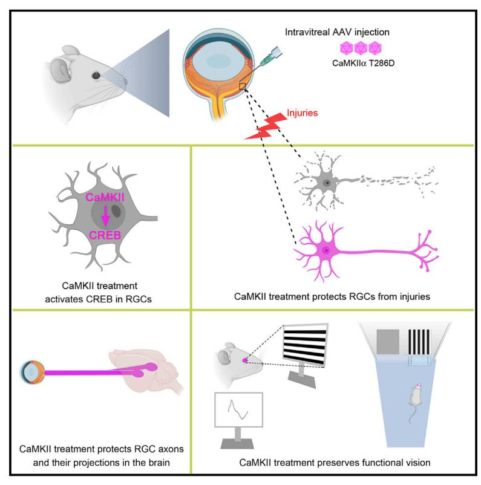

# Highlights

- Excitotoxic and axonal injuries lead to loss of CaMKII activity in RGCs

- Reactivation of CaMKII protects RGCs in multiple injury/ disease models

- CREB acts downstream of CaMKII in protecting RGCs

- Reactivation of CaMKII protects visual pathway and preserves functional vision

# Authors

Xinzheng Guo, Jing Zhou, Christopher Starr, ..., Jonathan B. Demb, Michael C. Crair, Bo Chen

# Correspondence

bo.chen@mssm.edu

# In brief

CaMKII-CREB signaling plays a major role in maintenance of retinal ganglion cells (RGCs), and reactivation of CaMKII activity via AAV gene therapy in injury and disease models in mice protects RGCs and preserves visual function and visually guided behavior.

Guo et al., 2021, Cell 184, 4299–4314

August 5, 2021 ª 2021 Elsevier Inc.

https://doi.org/10.1016/j.cell.2021.06.031

CelPress

Cell

CelPress

Article

# Preservation of vision after CaMKII-mediated protection of retinal ganglion cells

Xinzheng Guo,1 Jing Zhou,1,12 Christopher Starr,1,12 Ethan J. Mohns,4 Yidong Li,4 Earnest P. Chen,5 Yonejung Yoon,6 Christopher P. Kellner,6 Kohichi Tanaka,10 Hongbing Wang,7 Wei Liu,11 Louis R. Pasquale,1 Jonathan B. Demb,4,8,9 Michael C. Crair,4,8 and Bo Chen1,2,3,13,\*

1Department of Ophthalmology, Icahn School of Medicine at Mount Sinai, New York, NY 10029, USA

2Department of Neuroscience, Icahn School of Medicine at Mount Sinai, New York, NY 10029, USA

3Department of Cell, Developmental and Regenerative Biology, Icahn School of Medicine at Mount Sinai, New York, NY 10029, USA

4Department of Neuroscience, Yale University School of Medicine, New Haven, CT 06511, USA

5Yale College, New Haven, CT 06520, USA

6Department of Neurosurgery, Icahn School of Medicine at Mount Sinai, New York, NY 10029, USA

7Department of Physiology, Michigan State University, East Lansing, MI 48824, USA

8Department of Ophthalmology and Visual Science, Yale University School of Medicine, New Haven, CT 06511, USA

9Department of Cellular and Molecular Physiology, Yale University School of Medicine, New Haven, CT 06511, USA

10Laboratory of Molecular Neuroscience, School of Biomedical Sciences and Medical Research Institute, Tokyo Medical and Dental University, Tokyo, Japan

11Department of Ophthalmology and Visual Sciences, Albert Einstein College of Medicine, Bronx, NY 10461, USA

12These authors contributed equally

13Lead contact

\*Correspondence: bo.chen@mssm.edu

https://doi.org/10.1016/j.cell.2021.06.031

# SUMMARY

Retinal ganglion cells (RGCs) are the sole output neurons that transmit visual information from the retina to the brain. Diverse insults and pathological states cause degeneration of RGC somas and axons leading to irreversible vision loss. A fundamental question is whether manipulation of a key regulator of RGC survival can protect RGCs from diverse insults and pathological states, and ultimately preserve vision. Here, we report that CaMKII-CREB signaling is compromised after excitotoxic injury to RGC somas or optic nerve injury to RGC axons, and reactivation of this pathway robustly protects RGCs from both injuries. CaMKII activity also promotes RGC survival in the normal retina. Further, reactivation of CaMKII protects RGCs in two glaucoma models where RGCs degenerate from elevated intraocular pressure or genetic deficiency. Last, CaMKII reactivation protects long-distance RGC axon projections *in vivo* and preserves visual function, from the retina to the visual cortex, and visually quided behavior.

# INTRODUCTION

Visual information is transmitted from the eye to higher processing centers in the brain via the optic nerve, a bundle of axons emerging from the retina's output neurons: the retinal ganglion cells (RGCs) (Dhande et al., 2015). The loss of RGCs is a leading cause of visual impairment and blindness in a variety of pathological states. Some conditions injure the RGC soma, including excitotoxicity and retinal ischemia, whereas others injure the RGC axon, including optic nerve transection, compression, intracranial hypertension, and glaucoma (Levin and Gordon, 2002). Indeed, glaucoma is the leading cause of irreversible visual impairment worldwide, estimated to affect 76 million people in 2020 and 112 million in 2040 (Tham et al., 2014).

The major barrier to restoring vision following RGC injury is that the axons do not regenerate (He and Jin, 2016). In fact, an unmet clinical need is the lack of effective neuroprotective approaches to preserve RGCs and their function (Khatib and 

Martin, 2017). Early neuroprotective treatment is required to prevent acute and massive RGC loss for high-risk individuals of retinal ischemia and excitotoxicity (Lafuente et al., 2002; Lucas and Newhouse, 1957). RGC neuroprotective intervention is also required for a significant proportion of glaucoma patients who still progress to blindness despite treatment to reduce intraocular pressure (Malihi et al., 2014). Importantly, for patients with traumatic optic nerve injury, promoting RGC survival is a prerequisite for potential efforts to regenerate retina-brain connections (Benowitz et al., 2017; Berry et al., 2019; Laha et al., 2017). An ideal therapeutic approach would be to identify a universal target that effectively protects RGC somas and axons from diverse insults in a broad spectrum of pathological conditions if one exists.

Calcium ( $Ca^{2+}$ ) is a highly versatile intracellular signal responsible for regulating an array of cellular processes (Berridge et al., 2000). Loss of Ca2+ homeostasis, often in the form of cytoplasmic increases, leads to cell injuries (Dong et al., 2006).

Cell 184, 4299–4314, August 5, 2021 ª 2021 Elsevier Inc. 4299

CelPress

Cell Article

Indeed, aberrant Ca2+ activation is involved in RGC death following insults such as excitotoxicity and optic nerve injury (Hartwick et al., 2008; Prilloff et al., 2007). Ca2+/calmodulindependent protein kinase II (CaMKII) is a central coordinator and executor of Ca2+ signal transduction (Hudmon and Schulman, 2002a). Previous studies, which primarily relied on chemical inhibition of CaMKII, generated conflicting results about the role of CaMKII in cell survival. For example, under some conditions, CaMKII inhibition protects RGCs from excitotoxic cell death (Goebel, 2009; Laabich and Cooper, 2000), whereas under other conditions, it may induce neuronal hyperexcitability and apoptosis (Ashpole and Hudmon, 2011; Ashpole et al., 2012). The precise role of CaMKII in regulating RGC survival under physiological and pathological conditions is far from understood. Importantly, the fundamental question remains whether CaMKII could be a therapeutic target to protect RGCs from diverse insults, and ultimately preserve vision.

In this study, we examined the role of CaMKII and its signaling in regulating the survival of RGCs using multiple injury/disease models. We further tested whether targeted manipulation of CaMKII in RGCs preserves functional vision in vivo. We found that excitotoxic insults to RGC somas or optic nerve injury to RGC axons led to inactivation of CaMKII and its downstream target CREB (cAMP response element binding protein) in RGCs. Intriguingly, reactivation of CaMKII or CREB robustly protected RGCs from both injuries. Furthermore, CaMKII-mediated RGC protection slowed down the disease progression in induced and genetic animal models of glaucoma. Finally, we chose the excitotoxicity model to test CaMKII-mediated functional recovery as excitotoxicity is involved in several ocular pathologies, including ischemia induced by retinal or choroidal blood vessel occlusion, glaucoma, and diabetic retinopathy (Lucas and Newhouse, 1957; Massey and Miller, 1987, 1990; Olney, 1982; Sisk and Kuwabara, 1985; Thoreson and Witkovsky, 1999; Vorwerk et al., 1996). CaMKII reactivation not only saves RGC somas but also protects long-distance RGC axon projections from the retina to visual relay centers in the brain. Importantly, CaMKIImediated protection of RGCs preserves functional vision in the entire visual pathway, evidenced by significantly improved visual responses in the retina and the primary visual cortex in the brain as well as visually guided behavior. Our results for the first time provide in vivo evidence that CaMKII is a key regulator of RGC survival in normal and diseased retinas and could be a promising therapeutic target for vision preservation in a variety of pathological conditions typically characterized by degeneration of RGCs.

# RESULTS

## **Excitotoxic and axonal injuries lead to loss of CaMKII** activity in RGCs

CaMKII has four isoforms  $(\alpha, \beta, \gamma, \text{and } \delta)$  in mammals, with each isoform expressed from a different gene (Hudmon and Schulman, 2002b). CaMKII $\alpha$  and CaMKII $\beta$  are the two major isoforms highly expressed in the rodent retina (Terashima et al., 1994). Activation of CaMKII is initiated by Ca2+ influx through NMDARs (NMDA receptors) and subsequent Ca2+/calmodulin binding; the resultant conformation change of CaMKII allows its autophos-

phorylation at either Threonine 286 (T286) for CaMKIIa or Threonine 287 (T287) for CaMKII $\beta$ , which is crucial for the persistent activation of both isoforms (Miller et al., 1988; Schworer et al., 1988; Thiel et al., 1988). If autophosphorylation occurs, CaMKII remains active even after Ca2+ concentration falls (Lisman et al., 2002).

Using an antibody specifically recognizing CaMKII $\alpha$ / $\beta$  autophosphorylation (Figures S1A-S1F), we examined CaMKII phosphorylation in RGCs after retinal injuries. First, we used an NMDA-induced excitotoxicity model. We injected toxic levels of NMDA (20 mM, 1.5  $\mu$ L) into the vitreous chamber of 8-weekold C57BL/6 mice to injure RGC somas (Manabe and Lipton, 2003; Seitz and Tamm, 2013). In the control retina with PBS injection, CaMKII was highly phosphorylated in RGCs labeled by Tuj1 immunoreactivity in retinal flat-mount preparations (Figures 1A-1C); whereas in the retina with NMDA injection, CaMKII became massively de-phosphorylated in Tuj1+ RGCs 2 h after injection (Figures 1D-1H). Immunoblotting using purified RGCs corroborated the significant decrease in CaMKII phosphorylation after NMDA-induced excitotoxicity (Figures S1G and S1H). The loss of CaMKII activity correlated with more than 80% RGC loss at 1 week after NMDA injection.

Next, we used the optic nerve crush (ONC) model to examine whether CaMKII activity changes after RGC axonal damage. Axotomy caused by ONC results in delayed death of RGCs, with a nearly 80% loss of RGCs 2 weeks after injury (Berkelaar et al., 1994; Hu et al., 2012). We performed ONC in 8-week-old C57BL/6 mice and analyzed CaMKII phosphorylation at 5, 7, and 9 days post-crush (dpc) during the course of RGC degeneration. In comparison to the uniform phosphorylation of CaMKII in all RGCs in the uninjured retina (Figures 1I-1K), at each time point after injury, a portion of RGCs ( $\sim$ 10%) lost CaMKII activity, consistent with the gradual loss of RGCs after axotomy (Figures 1L-1V). Overall, these results show that excitotoxicity to RGC somas or optic nerve injury to RGC axons resulted in a loss of CaMKII activity prior to the loss of RGCs.

As CaMKII activity is highly detectable in all RGCs in uninjured retinas (Figures 1B and 1J), we investigated whether CaMKII activity is required for normal RGC survival. CaMKII activity was inhibited by daily intravitreal injection (7 injections over 7 days) of myristoylated Autocamtide-2-related inhibitory peptide (AIP, 1 mM, 1.5  $\mu$ L), a highly potent and specific substrate competitive inhibitor of CaMKII (Goebel, 2009; Laabich and Cooper, 2000). One week after AIP injection, about half of RGCs were lost compared to the vehicle control (Figures 1W-1Y). These results indicate that CaMKII activity is essential for the survival of RGCs in the normal retina.

## Reactivation of CaMKII protects RGCs from excitotoxic or axonal injuries

To investigate whether enhancing the activity of CaMKII is sufficient to protect RGCs from excitotoxic or axonal injuries, we performed intravitreal injection for AAV2-mediated gene transfer of CaMKII variants into RGCs in 8-week-old C57BL/6 mice at 2 weeks before injury onset through NMDA injection or ONC. AAV2 was effective in transducing more than 95% of RGCs (Figures S2A-S2D; Park et al., 2008). The expression level of CaMKII variants in RGCs was  $\sim$ 60% of the endogenous CaMKII based

4300 Cell 184, 4299–4314, August 5, 2021

Cell Article

CelPress 

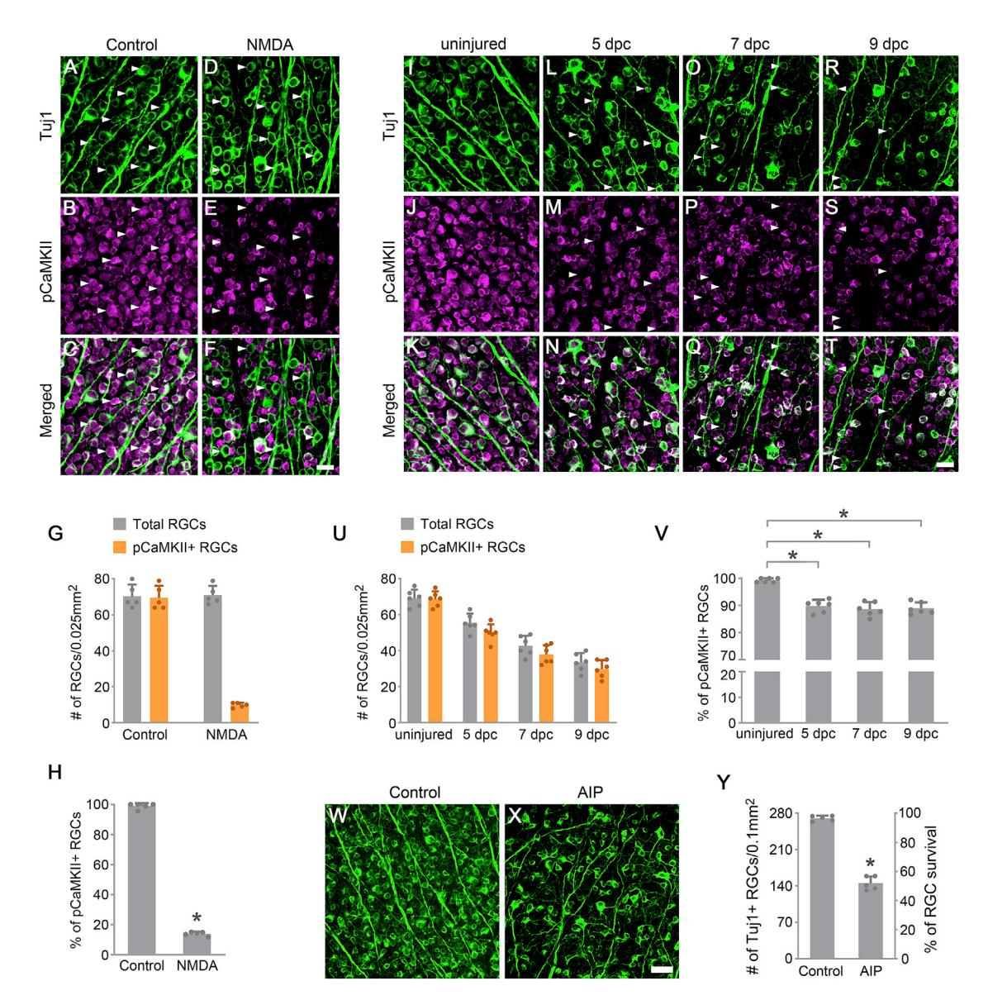

Figure 1. Excitotoxic and optic nerve injuries lead to loss of CaMKII activity in RGCs

(A-F) Confocal images of retinal whole mounts showing CaMKII phosphorylation in Tuj1-labeled RGCs at 2 h after PBS (A-C) or NMDA (D-F) injection. Arrowheads, Tuj1+ RGCs maintaining (A–C) or losing (D–F) CaMKII activity. Scale bar, 20 µm.

(G and H) Quantification of CaMKII phosphorylation in RGCs after excitotoxic injury. (G) The number of total Tuj1+ RGCs and pCaMKII+/Tuj1+ RGCs 2 h after PBS control or NMDA injection. Data are presented as mean  $\pm$  SD, n = 5 retinas per group. (H) Percentage of pCaMKII+/Tuj1+ RGCs 2 h after PBS control or NMDA injection. Data are presented as mean  $\pm$  SD, n = 5 retinas per group. Unpaired t test, \*p < 0.0001.

(I-T) Confocal images of retinal whole mounts showing CaMKII phosphorylation in Tuj1-labeled RGCs, without injury (I-K) or 5 (L-N), 7 (O-Q), and 9 days (R-T) after ONC (dpc). Arrowheads, Tuj1+ RGCs losing CaMKII activity (L-T). Scale bar, 20 μm.

(U to V) Quantification of CaMKII phosphorylation in RGCs after optic nerve injury. (U) The number of total Tuj1+ RGCs and pCaMKII+/Tuj1+ RGCs in uninjured retinas and retinas 5, 7, and 9 days after crush. Data are presented as mean  $\pm$  SD, n = 6 retinas per group. (V) Percentage of pCaMKII+/Tuj1+ RGCs in uninjured retinas and retinas 5, 7, and 9 days after crush. Data are presented as mean  $\pm$  SD, n = 6 retinas per group. One-way ANOVA with Tukey's multiple comparisons test, F:36.22, R2:0.8445, \*p < 0.0001.

(W to X) Confocal images of retinal whole mounts showing surviving RGCs labeled by Tuj1 immunoreactivity at 7 days after daily injection of PBS (W) or AIP (X). Scale bar. 40 um.

(Y) Quantification of RGC survival, expressed as numbers of RGCs (left y axis), and percentages of RGCs relative to that in the uninjured retina (right y axis). Data are presented as mean  $\pm$  SD, n = 5 retinas per group. Unpaired t test, \*p < 0.0001.

See also Figure S1.

Cell 184, 4299–4314, August 5, 2021 4301

CelPress

Cell

Article

on relative pan-CaMKII immunofluorescence intensity 2 weeks after AAV injection (Figures S2E–S2K).

First, we examined the protective effects of  $CaMKII\alpha$  variants when RGC somas were damaged by NMDA-induced excitotoxicity. One week after NMDA administration, the number of Tuj $1^+$ RGCs nearly doubled ( $\sim$ 34%) in the wild-type CaMKII $\alpha$ -treated retinas compared to the control group injected with AAV-EBFP, in which case only  $\sim$ 15% of RGCs remained (Figures 2A, 2B, and 2E). To examine whether the kinase activity is essential for CaMKIIa-mediated RGC protection, we tested CaMKIIa K42R and CaMKIIa K42D, two kinase-dead mutants by replacing the conserved Lysine residue with Arginine or Aspartic acid within the catalytic core of the enzyme to prevent ATP-binding necessary for its kinase activity (Hanson et al., 1994). We observed no improvement of RGC survival with either CaMKIIa K42R (Figures 2A, 2C, and 2E) or CaMKIIa K42D treatment (Figures S3A, S3B, and S3F), indicating that CaMKII kinase activity is required for protecting RGCs from NMDA-induced excitotoxic RGC death.

To examine whether further enhancement of CaMKII activity could be more effective in countering excitotoxic injury, we tested CaMKIIα T286D, a constitutively active mutant of CaM- $KII\alpha$  simulating its autophosphorylated state (Fong et al., 1989). Remarkably, CaMKII $\alpha$  T286D robustly protected the vast majority of RGCs ( $\sim$ 90%) at 1 week after NMDA injection compared to a small proportion of surviving RGCs ( $\sim$ 15%) in the control group (Figures 2A, 2D, and 2E). However, the autophosphorylationdefective mutant CaMKIIa T286A (Fong et al., 1989) was far less effective than CaMKIIa T286D in protecting RGCs (Figures S3C and S3F).

In addition to autophosphorylation of CaMKIIa at T286, phosphorvlation at T305 and T306 within the calmodulin-binding domain also regulates its kinase activity. Following T286 phosphorylation and Ca2+/calmodulin dissociation, autophosphorylation of CaMKIIa at T305 and T306 abolishes its sensitivity to calmodulin binding and thus prevents its further activation (Coultrap et al., 2010; Patton et al., 1990). In hippocampal neurons, phosphorylation at T305 and T306 participates in CaMKIIα T286D-mediated control of the spine size and synaptic strength, as well as long-term potentiation (LTP) or long-term depression (LTD) induction (Pi et al., 2010a; Pi et al., 2010b). To examine whether further phosphorylation of CaMKII $\alpha$  at T305 and T306 affects RGC survival, we tested the treatment effects of CaMKII $\alpha$ T286D/T305A/T306A (a non-phosphorylated form of T305/T306) and CaMKIIa T286D/T305D/T306D (a pseudophosphorylated form of T305/T306) after excitotoxic injury to RGC somas. CaM-KIIα T286D/T305A/T306A protected ~90% of RGCs at 1 week after NMDA injection (Figures S3D and S3F); whereas  $CaMKII\alpha$ T286D/T305D/T306D protected  $\sim$ 80% of RGCs, slightly less effective in protecting RGCs compared to T286D/T305A/ T306A (Figures S3E and S3F). These results suggest that phosphorylation at T305 and T306 may interfere modestly with the maximum effects of CaMKIIa T286D in protecting RGCs.

The ubiquitous CAG promoter in our AAV2 expression system drives transgene expression in more than 95% of RGCs as well as a few other non-RGC cells (Park et al., 2008). To examine whether CaMKII-mediated RGC protection was indeed due to transgene expression in a cell-autonomous manner, we used the mouse  $\gamma$ -synuclein promoter (mSncg), a recently developed

 RGC-specific promoter that drives AAV2-mediated transgene expression in mouse RGCs (Wang et al., 2020), to restrict CaMKII expression to RGCs. One week after NMDA injection, AAV2mSncg-mediated expression of CaMKIIα T286D protected RGCs as effectively as that mediated by AAV2-CAG (Figures S3G-S3I), indicating that cell-autonomous expression of CaM-KIIα T286D in RGCs is essential for protecting them from NMDA-induced excitotoxicity.

As  $CaMKII\beta$  is the other major isoform expressed in the mouse retina, we examined the protective effects of  $CaMKII\beta$ variants after NMDA-induced excitotoxicity. Similar to the protective effects obtained from CaMKIIa treatment, the wild-type  $CaMKII\beta$  showed a moderate protective effect, while the constitutively active mutant  $CaMKII\beta$  T287D was far more potent in protecting RGCs a week after NMDA injection (Figures 2F, 2G, 2I, and 2J). As expected, the autophosphorylation-defective mutant CaMKIIB T287A protected many fewer RGCs relative to CaMKIIβ T287D (Figures S3L and S3O). Phosphorylation at T306 and T307 within the calmodulin-binding domain also slightly reduced the protective effects of CaMKIIB T287D, evidenced by treatment effects with the triple mutants CaMKIIB T287D/T306A/T307A or CaMKIIβ T287D/T306D/T307D (Figures S3M–S3O). CaMKII $\beta$ -mediated protection of RGCs apparently also relied on its kinase activity as the kinase-dead mutant CaMKIIB K43R (Figures 2H and 2J) or CaMKIIB K43D (Figures S3K and S3O) failed to protect RGCs under the same experimental conditions.

Next, we examined the protective effects of  $CaMKII\alpha$  variants when RGC axons were damaged by ONC. Two weeks after ONC, the number of surviving RGCs ( $\sim$ 49%) was more than doubled with the wild-type  $CaMKII\alpha$  treatment compared to surviving RGCs (~22%) in the control group injected with AAV-EBFP (Figures 2K, 2L, and 2O). However, the kinase-dead mutant CaMKII 20), indicating that the kinase activity of CaMKII is also required to protect RGCs from axotomy-induced cell death. Remarkably, the constitutively active mutant CaMKIIα T286D exhibited the most effective protective effect, with  $\sim$ 90% of RGCs surviving 2 weeks after injury (Figures 2N and 2O). As expected, CaMKIIB variants exhibited similar protective effects as their CaMKIIa counterparts, confirming the necessity for its kinase activity and the remarkable protective effect when  $CaMKII\beta$  activity was further enhanced with the constitutively active mutant CaM-KIIβ T287D (Figures 2P-2T).

Using two injury models, our results demonstrate that excitotoxic damage to RGC somas or ONC damage to RGC axons inevitably leads to CaMKII inactivation prior to RGC death. Reactivation of CaMKII via gene transfer of constitutively active CaM-KII mutants robustly protects RGCs from both injuries. Since CaMKIIa T286D manifested the most robust protection for RGCs, it became the focus of our subsequent studies.

## CaMKII reactivation provides post-injury and long-term protection of RGCs

To mimic a clinically relevant setting, we tested whether CaMKII could protect RGCs when reactivated following the injury. While RGC degeneration in the excitotoxicity model is too fast for AAVmediated gene expression to take effect, the relatively slower

4302 Cell 184, 4299–4314, August 5, 2021

Cell 

Article

CelPress

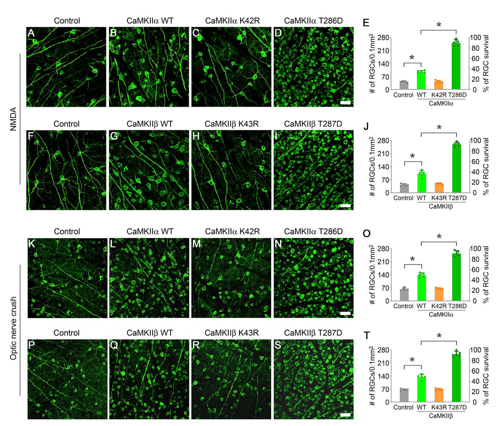

Figure 2. Reactivation of CaMKII protects RGCs from excitotoxic and optic nerve injuries

(A–D) Confocal images of retinal whole mounts showing surviving RGCs labeled by Tuj1 immunoreactivity at 7 days after NMDA injection in control (AAV-EBFP), or AAV-CaMKIIα WT, AAV-CaMKIIα K42R, and AAV-CaMKIIα T286D-treated eyes. Scale bar, 40 μm.

(E) Quantification of RGC survival after treatment with CaMKIIα variants at 7 days post-NMDA injection, expressed as numbers of RGCs (left y axis), and percentages of RGCs relative to those in the uninjured retina (right y axis). Data are presented as mean  $\pm$  SD, n = 5 retinas per group. One-way ANOVA with Tukey's multiple comparisons test, F:515.5, R2:0.9898, \*p < 0.0001.

(F-I) Confocal images of retinal whole mounts showing surviving RGCs labeled by Tuj1 immunoreactivity at 7 days after NMDA injection in control (AAV-EBFP), or AAV-CaMKIIβ WT, AAV-CaMKIIβ K43R, and AAV-CaMKIIβ T287D-treated eyes. Scale bar, 40 μm.

(J) Quantification of RGC survival after treatment with CaMKII $\beta$  variants at 7 days post-NMDA injection. Data are presented as mean  $\pm$  SD, n = 5 retinas per group. One-way ANOVA with Tukey's multiple comparisons test, F:423.3, R2:0.9876, \*p < 0.0001.

(K-N) Confocal images of retinal whole mounts showing surviving RGCs labeled by Tuj1 immunoreactivity at 2 weeks after ONC in control (AAV-EBFP), or AAV-CaMKIIα WT, AAV-CaMKIIα K42R, and AAV-CaMKIIα T286D-treated eyes. Scale bar, 40 μm.

(0) Quantification of RGC survival after treatment with CaMKII $\alpha$  variants at 2 weeks post-ONC. Data are presented as mean  $\pm$  SD, n = 5 retinas per group. One-way ANOVA with Tukey's multiple comparisons test, F:379.0, R2:0.9861, \*p < 0.0001.

(P-S) Confocal images of retinal whole mounts showing surviving RGCs labeled by Tuj1 immunoreactivity at 2 weeks after ONC in control (AAV-EBFP), or AAV-CaMKIIβ WT, AAV-CaMKIIβ K43R, and AAV-CaMKIIβ T287D-treated eyes. Scale bar, 40 μm.

(T) Quantification of RGC survival after treatment with CaMKII $\beta$  variants at 2 weeks post-ONC. Data are presented as mean  $\pm$  SD, n = 5 retinas per group. One-way ANOVA with Tukey's multiple comparisons test, F:361.3,  $R^2$ :0.9855, \*p < 0.0001.

See also Figures S2 and S3.

Cell 184, 4299–4314, August 5, 2021 4303

CelPress

Cell 

Article

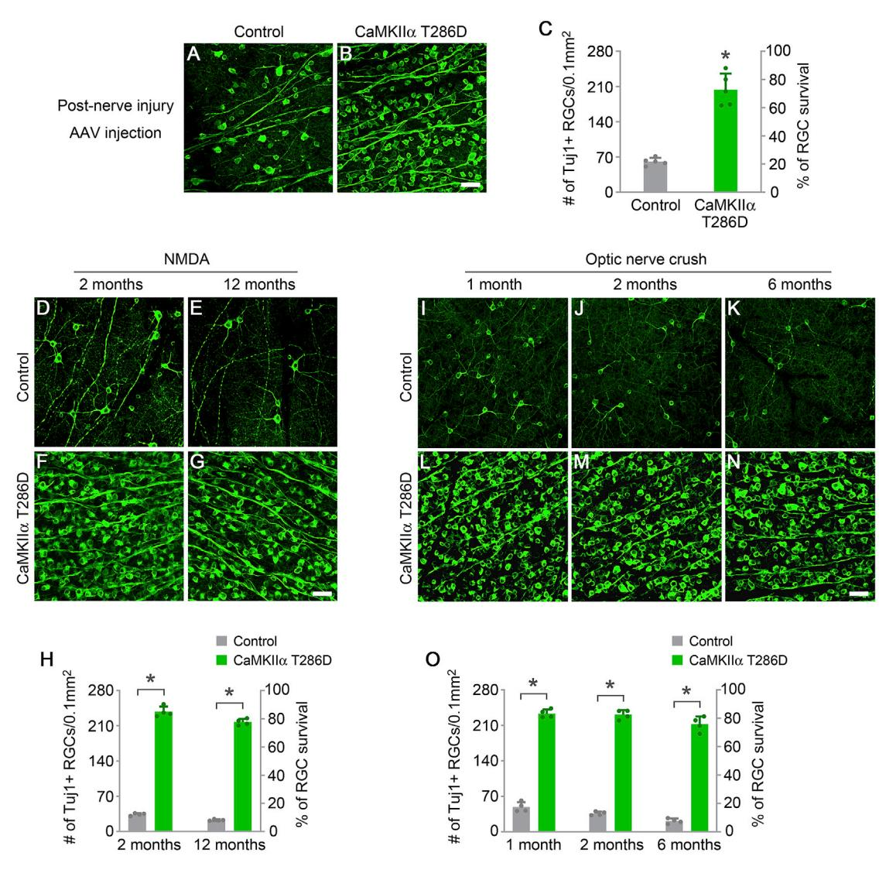

Figure 3. Reactivation of CaMKII provides post-injury and long-term RGC protection after excitotoxic or axonal injuries

(A and B) Confocal images of retinal whole mounts showing surviving RGCs labeled by Tuj1 immunoreactivity at 2 weeks after ONC in control (AAV-EBFP) or AAV-CaMKIIa T286D post-injury treatment. Scale bar, 40 um.

(C) Quantification of RGC survival 2 weeks after ONC, expressed as numbers of RGCs (left y axis), and percentages of RGCs relative to those in the uninjured retina (right y axis). Data are presented as mean  $\pm$  SD, n = 5 retinas per group. Unpaired t test, \*p < 0.0001.

(D-G) Confocal images of retinal whole mounts showing surviving RGCs labeled by Tuj1 immunoreactivity at 2 and 12 months post-NMDA injection in control (AAV-EBFP) and AAV-CaMKIIα T286D-treated eyes. Scale bar, 40 μm.

(H) Quantification of RGC survival 2 and 12 months post-NMDA injection. Data are presented as mean  $\pm$  SD, n = 4 retinas per group. One-way ANOVA with Tukey's multiple comparisons test, F:1370,  $R^2$ :0.9971, \*p < 0.0001.

(I–N) Confocal images of retinal whole mounts showing surviving RGCs labeled by Tuj1 immunoreactivity at 1, 2, and 6 months post-ONC in control (AAV-EBFP) or AAV-CaMKIIα T286D-treated eyes. Scale bar, 40 μm.

(O) Quantification of RGC survival 1, 2, and 6 months post-optic nerve injury. Data are presented as mean  $\pm$  SD, n = 4 retinas per group. One-way ANOVA with Tukey's multiple comparisons test, F:523.2, R2:0.9932, \*p < 0.0001.

degeneration of RGCs in the ONC model may allow a time window necessary for AAV-mediated gene therapy (Sun et al., 2011). Therefore, we performed intravitreal AAV injections immediately after ONC. Two weeks later, ~70% of RGCs remained in the CaMKIIα T286D treatment group, tripling the survival rate relative to the control group receiving AAV-mediated gene transfer of EBFP (Figures 3A-3C). These results indicate that delayed

 reactivation of CaMKII may robustly protect RGCs after injury onset.

CaMKII reactivation protected the vast majority of RGCs 1 week after NMDA-induced excitotoxicity or 2 weeks after ONC. To evaluate the long-term protective effects of CaMKIIa T286D treatment, we assayed RGC survival at a much later time after excitotoxic or axonal injuries. After the excitotoxic

4304 Cell 184, 4299–4314, August 5, 2021

Cell 

Article

CelPress

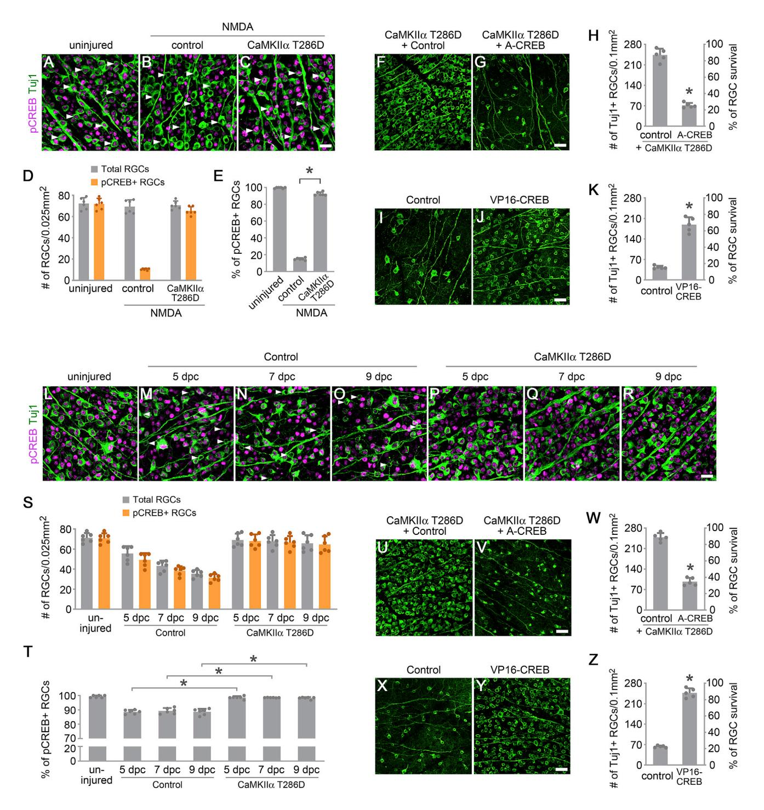

Figure 4. CREB acts downstream of CaMKII to protect RGCs from excitotoxic and optic nerve injuries

(A-C) Confocal images of retinal whole mounts showing CREB phosphorylation in RGCs, from uninjured eyes (A), and 2 h after NMDA injection in control (AAV-EBFP) (B) or AAV-CaMKII∞ T286D (C)-treated eyes. Arrowheads, Tuj1+ RGCs maintaining (A) or losing (B) CREB activity, which was restored after treatment with CaMKIIα T286D (C). Scale bar, 20 μm.

(D and E) Quantification of CREB phosphorylation in RGCs 2 h after NMDA-induced excitotoxic injury. (D) The number of total Tuj1+ RGCs and pCREB+/Tuj1+ RGCs in uninjured or NMDA-damaged eyes. Data are presented as mean  $\pm$  SD, n = 6 retinas per group. (E) Percentage of pCREB+/Tuj1+ RGCs in uninjured or NMDA damaged eyes. Data are presented as mean  $\pm$  SD, n = 6 retinas per group. One-way ANOVA with Tukey's multiple comparisons test, F:6139,  $R^2$ :0.9988,  $p < 0.0001$ .

(legend continued on next page)

Cell 184, 4299–4314, August 5, 2021 4305

CelPress

Cell 

Article

injury to RGC somas, RGC numbers in the control group receiving AAV-EBFP continued to decline from ~12% at 2 months (Figure 3D) to  $\sim$ 8% RGCs remaining at 12 months (Figure 3E). Remarkably, CaMKIIa T286D treatment resulted in  $\sim$ 84% and  $\sim$ 77% of RGCs surviving 2 and 12 months after injury, respectively (Figures 3F-3H). Next, we examined the long-term RGC survival after ONC to injure RGC axons. While only  $\sim$ 17%,  $\sim$ 12%, and  $\sim$ 7% of RGCs remained from the control group receiving AAV-EBFP at 1, 2, and 6 months after ONC (Figures 3I-3K and 3O), CaMKIIa T286D treatment protected  $\sim$ 82%,  $\sim$ 81%, and  $\sim$ 77% of RGCs (Figures 3L-30) at the same time points. Taken together, these results demonstrate that CaMKII reactivation may provide long-term protection of RGCs from excitotoxic or axonal injuries.

## CREB acts downstream of CaMKII in protecting RGCs

To delineate the downstream signaling of CaMKII-mediated RGC protection, CREB (cAMP response element binding protein), a stimulus-induced transcription factor, was of particular interest because CREB plays an important role downstream of CaMKII in regulating synaptic plasticity and long-term memory formation (Deisseroth et al., 1996; Ma et al., 2014). CREB is also known to regulate the survival of brain neurons (Lonze and Ginty, 2002). However, the role of CREB in regulating the survival of retinal neurons remains to be determined. CREB is phosphorvlated at Ser133 by CaMKII and other kinases, and the phosphorylation event is required for the transcriptional activity of CREB (Sheng et al., 1991).

First, we examined whether CREB acts downstream of CaM-KII to protect RGCs in the NMDA-induced excitotoxicity model. Using an antibody recognizing phosphorylated CREB at Ser133, we found that CREB was highly phosphorylated in nearly all Tuj1+ RGCs in uninjured retinas (Figures 4A, 4D, and 4E). However, a massive loss of CREB phosphorylation occurred in RGCs 2 h after NMDA injection (Figures 4B, 4D, and 4E), indicating that compromised CREB activity may be downstream of CaMKII inactivation in RGCs after excitotoxic injury. Then we examined whether CaMKII reactivation could restore CREB activity following NMDA injection. Indeed, AAV-mediated gene transfer

 of CaMKIIa T286D was sufficient to maintain CREB phosphorylation in nearly all RGCs exposed to NMDA insults (Figures 4C, 4D. and 4E).

To further investigate the role of CREB in protecting RGCs downstream of CaMKII, we performed AAV-mediated gene transfer of CaMKIIa T286D together with A-CREB, a dominantnegative variant of CREB that binds to endogenous CREB protein and prevents CREB from binding to DNA (Ahn et al., 1998). AAV delivery was performed in 8-week-old C57BL/6 mice at 2 weeks before NMDA injection, and we analyzed RGC survival 1 week after excitotoxic injury. CaMKIIa T286D-mediated RGC protection was nearly neutralized with A-CREB co-treatment (Figures 4F-4H), indicating that CREB activation is required for CaMKII-mediated RGC protection from excitotoxic damage. Indeed, A-CREB co-treatment significantly compromised CREB phosphorylation by CaMKIIa T286D in RGCs 2 h after NMDA injection (Figures S4A-S4D). To test whether activation of CREB alone, independent of CaMKII activation, is sufficient to protect RGCs from excitotoxicity, we performed AAV-mediated gene transfer of VP16-CREB, a constitutively active variant of CREB (Barco et al., 2002) at 2 weeks before NMDA injection, and analyzed RGC survival 1 week after injury. Evidently, VP16-CREB treatment alone protected a majority of RGCs ( $\sim$ 65%) (Figures 4I-4K). Consistent with a similar role in the hippocampus (Zhang et al., 2016), VP16-CREB maintained CREB phosphorylation in RGCs 2 h after NMDA injection (Figures S4E–S4H). The protective effect of VP16-CREB (189  $\pm$  25 RGCs/0.1mm2) was weaker than that of CaMKII $\alpha$  T286D (251  $\pm$ 17 RGCs/0.1 mm2), suggesting that there might be other unidentified factors downstream of CaMKII in protecting RGCs from excitotoxicity.

BDNF (Brain-derived neurotrophic factor) /TrkB (tropomyosinrelated kinase receptor type B) signaling contributes to neuroprotection of RGCs, and excitotoxicity downregulates this pathway (Chitranshi et al., 2019; Gomes et al., 2012). To investigate whether CaMKIIa T286D treatment affects BDNF/TrkB signaling, we examined TrkB phosphorylation, which is essential for the downstream signal transduction initiated by BDNF binding (Nagahara and Tuszynski, 2011). Phosphorylation of TrkB

(F and G) Confocal images of retinal whole mounts showing surviving RGCs labeled by Tuj1 immunoreactivity at 7 days after NMDA injection in AAV-CaMKIIz. T286D + Control (AAV-EBFP), or AAV-CaMKIIα T286D + AAV-A-CREB-treated eyes. Scale bar, 40 μm. (H) Quantification of RGC survival, expressed as numbers of RGCs (left y axis), and percentages of RGCs relative to those in the uninjured retina (right y axis). Data are presented as mean  $\pm$  SD, n = 5 retinas per group. Unpaired t test, \*p < 0.0001.

(I and J) Confocal images of retinal whole mounts showing surviving RGCs labeled by Tuj1 immunoreactivity at 7 days after NMDA injection in control (AAV-EBFP) or AAV-VP16-CREB-treated eyes. Scale bar, 40  $\mu$ m. (K) Quantification of RGC survival. Data are presented as mean  $\pm$  SD, n = 5 retinas per group. Unpaired t test,  $p < 0.0001$ .

(L-R) Confocal images of retinal whole mounts showing CREB phosphorylation in RGCs, from uninjured eyes (L), and 5, 7, and 9 days after ONC in control (AAV-EBFP) (M-O) or AAV-CaMKII

(S and T) Quantification of CREB phosphorylation in RGCs after optic nerve injury. (S) The number of total Tuj1+ RGCs and pCREB+/Tuj1+ RGCs in uninjured and injured retinas 5, 7, and 9 days after crush. Data are presented as mean ± SD, n = 6 retinas per group. (T) Percentage of pCREB+/Tuj1+ RGCs in uninjured and injured retinas 5, 7, and 9 days after crush. Data are presented as mean ± SD, n = 6 retinas per group. One-way ANOVA with Tukey's multiple comparisons test, F:89.58, R2:0.9389, \*p < 0.0001.

(U and V) Confocal images of retinal whole mounts showing surviving RGCs labeled by Tuj1 immunoreactivity at 2 weeks after ONC in AAV-CaMKIIa T286D + Control (AAV-EBFP), or AAV-CaMKIIα T286D + AAV-A-CREB-treated eyes. Scale bar, 40 μm.

(W) Quantification of RGC survival. Data are presented as mean  $\pm$  SD, n = 5 retinas per group. Unpaired t test, \*p < 0.0001.

(X and Y) Confocal images of retinal whole mounts showing surviving RGCs labeled by Tuj1 immunoreactivity at 2 weeks after ONC in control (AAV-EBFP) or AAV-VP16-CREB-treated eyes. Scale bar, 40 µm.

(Z) Quantification of RGC survival. Data are presented as mean  $\pm$  SD, n = 5 retinas per group. Unpaired t test, \*p < 0.0001.

See also Figure S4.

4306 Cell 184, 4299–4314, August 5, 2021

Cell 

Article

CelPress

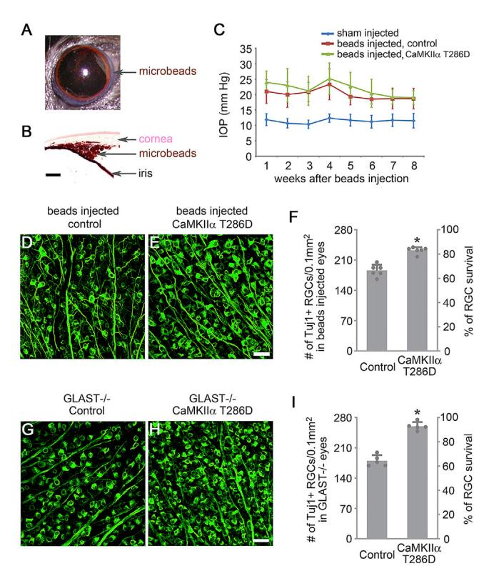

Figure 5. CaMKII-mediated protection of RGCs in induced and genetic models of alaucoma

(A) Image of magnetic microbeads distributed evenly around the circumference of the anterior chamber using magnets after injection.

(B) Image of the eye section after H&E staining shows microbeads accumulation at the iridocorneal angle. Scale bar, 100 µm.

(C) Quantification of intraocular pressure (IOP) after injection of PBS (sham) or microbeads. Data are presented as mean  $\pm$  SD, n = 6 eyes per group.

(D and E) Confocal images of retinal whole mounts showing surviving RGCs labeled by Tuj1 immunoreactivity at 2 months after induction of elevated IOP in Control (AAV-EBFP) or AAV-CaMKIIa T286D-treated eyes. Scale bar, 40 µm. 

(F) Quantification of RGC survival, expressed as numbers of RGCs (left y axis), and percentages of RGCs relative to those in the uninjured retina (right y axis). Data are presented as mean  $\pm$  SD, n = 6 retinas per group. Unpaired t test,  $p < 0.0001$ .

(G and H) Confocal images of retinal whole mounts from 2-month-old  $GLAST^{-/-}$  mice showing surviving RGCs labeled by Tuj1 immunoreactivity in control (AAV-EBFP) or AAV-CaMKIIα T286D-treated eyes. Scale bar, 40 μm.

(I) Quantification of RGC survival in  $GLAST^{-/-}$  retinas, expressed as numbers of RGCs (left y axis), and percentages of RGCs relative to those in the uninjured wild-type retina (right y axis). Data are presented as mean  $\pm$  SD, n = 5 retinas per group. Unpaired t test, \*p < 0.0001.

See also Figure S5.

at Tyr817 was readily detectable in RGCs of the uninjured retina; NMDA insult resulted in a significant reduction of phospho-TrkB in RGCs, which was rescued by CaMKII $\alpha$  T286D treatment (Figures S4I and S4J). These results indicate that, in addition to CREB, CaMKII reactivation may affect other pathways such as BDNF/TrkB signaling in promoting RGC survival after excitotoxic injury.

Next, we examined whether CREB acts downstream of CaM-KII to protect RGCs in the ONC-induced axonal injury model. We

analyzed CREB activity using the antibody recognizing CREB phosphorylation at Ser133 at 5, 7, and 9 days after ONC. In comparison to uniform CREB phosphorylation in RGCs of the uninjured retina (Figure 4L), a proportion ( $\sim$ 10%) of RGCs lost CREB phosphorylation at each time point examined (Figures 4M-4O, 4S, and 4T). The progressive loss of CREB activity is consistent with the gradual loss of CaMKII activity after ONC (Figures 1L-1V), indicating that compromised CREB activity may be downstream of CaMKII inactivation after RGC axonal injury. Next, we examined whether CaMKII reactivation could rescue CREB phosphorylation after ONC. Indeed, AAV-mediated gene transfer of CaMKIIa T286D maintained CREB phosphorylation in nearly all Tuj1+ RGCs after injury (Figures 4P-4T). Similar to the observation in the excitotoxicity model, CREB transcriptional activity was necessary for CaMKII-mediated RGC protection 2 weeks after RGC axonal injury, as the dominant-negative variant A-CREB neutralized the protective effects mediated by CaMKIIa T286D (Figures 4U-4W). As expected, A-CREB co-treatment significantly compromised CaM-KIIα T286D-mediated CREB phosphorylation in RGCs 5 days after ONC (Figures S4K-S4N). Conversely, enhancing CREB activity alone by gene transfer of the constitutively active variant VP16-CREB maintained CREB phosphorylation in RGCs 5 days after ONC (Figures S40-S4R) and efficiently protected RGCs from axonal injury (Figures 4X-4Z).

The DLK (dual leucine zipper kinase)/c-Jun pathway is a prominent mediator of RGC cell death after optic nerve injury (Watkins et al., 2013; Welsbie et al., 2013). To investigate whether CaM-KIIα T286D treatment modulates the DLK/c-Jun pathway, we examined DLK expression and c-Jun phosphorylation at Serine 63. As previously reported, DLK and c-Jun phosphorylation levels were very low in uninjured retinas and dramatically upregulated 3 days after ONC. However, CaMKIIα T286D treatment did not affect these changes (Figures S4S-S4V), indicating that CaMKIIa-mediated RGC protection from optic nerve injury may not act by suppressing the DLK/c-Jun pathway.

Taken together, our results demonstrate that CREB is a key downstream effector of CaMKII as it is both necessary and sufficient in protecting RGCs from excitotoxicity to their somas or a crush injury to their axons.

## CaMKII-mediated protection of RGCs in induced and genetic models of glaucoma

Glaucoma, characterized by the progressive degeneration of RGC axons with subsequent loss of the respective somas, is a leading cause of irreversible blindness worldwide. The pathogenesis of glaucoma is not well understood, but it is typically associated with elevated intraocular pressure (IOP), which leads to RGC axonal damage and the resultant death of RGCs (Calkins, 2012; Nickells et al., 2012; Weinreb et al., 2016).

We first tested whether gene transfer of CaMKIIa T286D protects RGCs in a mouse model of hypertension-dependent glaucoma. To induce ocular hypertension, we injected magnetic microbeads into the anterior chamber to occlude aqueous outflow (Figures 5A and 5B; Ito et al., 2016). As a result, IOP showed a sustained elevation for the subsequent 8 weeks (Figure 5C). We performed intravitreal injection of AAV for either the treatment of CaMKIIa T286D or EBFP as a control 2 weeks prior to

Cell 184, 4299–4314, August 5, 2021 4307

CelPress

Cell 

Article

microbeads injection and analyzed RGC survival 8 weeks following the induction of ocular hypertension. CaMKII expression levels increased ~60% based on relative pan-CaMKII immunofluorescence intensity at 2 weeks after microbeads injection (Figures S5A–S5E). In comparison to  $\sim$ 66% of surviving RGCs in the control group, CaMKIIa T286D treatment protected  $\sim$ 82% of RGCs (Figures 5D–5F), indicating that CaMKII augmentation is effective at protecting RGCs when they sustain ongoing damage from elevated IOP. We also examined axon survival in optic nerve sections collected at 1 mm behind the eyeball (Yang et al., 2016) and found that CaMKIIa T286D treatment provided significant protection of RGC axons (Figures S5F-S5I).

Although elevated IOP is the best-known risk factor for glaucoma, a significant number of patients develop the disease despite normal pressure. Mice deficient in the glutamate transporter Glast (GLAST $^{-/-}$ ), a model of normal tension glaucoma (Harada et al., 2007), show characteristic degeneration of RGCs due to accumulation of glutamate in the extracellular fluid, as well as increased oxidative stress. We tested whether gene transfer of CaMKIIa T286D protects RGCs in the normal tension glaucoma model of  $GLAST^{-/-}$  mice. The onset of RGC death in GLAST-deficient mice starts at approximately postnatal day 7. Thus, we performed intravitreal AAV injection for  $CaMKII\alpha$ T286D treatment at postnatal day 1 and analyzed the animals at 2 months of age when the degeneration of RGCs has stabilized (Harada et al., 2007). CaMKII expression levels increased  $\sim$ 50% based on relative pan-CaMKII immunofluorescence intensity at 3 weeks after AAV injection (Figures S5J-S5N). Significantly, CaMKIIα T286D treatment protected greater than 90% of RGCs compared to ~65% remaining in the control group (Figures 5G-5l). Consistent with RGC loss, optic nerve degeneration and cupping became apparent in 8-month-old  $\text{GLAST}^{-/-}$  mice (Harada et al., 2007). CaMKIIa T286D treatment also alleviated the optic nerve cupping phenotype in these mice (Figures S5O and S5P).

Taken together, our results show that CaMKII could be a valuable therapeutic target to slow down the disease progression of glaucoma.

## CaMKII reactivation protects RGC axons and their projections in the brain

RGC axons are the sole pathway transmitting visual information from the retina to the brain. As RGC axons are rarely able to regenerate after damage, degeneration of RGC axons results in permanent vision loss (Tran et al., 2019). Therefore, protecting the integrity of RGC axons is critical for vision preservation. Although we did not expect that CaMKII reactivation would make RGC axons resistant against severe mechanical damages such as those inflicted by ONC, it is pivotal to examine whether CaMKII treatment protects RGC axons from pathophysiological insults such as excitotoxicity. Indeed, in addition to damaging RGC somas, excitotoxic insults lead to Wallerian-like degeneration of RGC axons in the optic nerve and loss of target innervation in the brain (Saggu et al., 2010).

To investigate whether reactivation of CaMKII protects RGC axons and their axonal projections to the brain, we injected Alexa Fluor 488-conjugated Cholera Toxin Subunit B (CTB) into the vitreous to anterogradely trace RGC axons to the lateral geniculate

nucleus (LGN) and superior colliculus (SC), two main projection targets of RGC axons in the brain (Figure 6A). One week after NMDA injection, RGC axons were severely damaged, and the CTB labeling intensity decreased to  $\sim$ 17% in the optic nerve compared to the uninjured control (Figures 6B, 6C, and 6E). By contrast, a significant majority of axons were protected from excitotoxicity after CaMKIIa T286D treatment with the CTB labeling intensity recovered to  $\sim$ 84% (Figures 6D and 6E).

In mice, RGC axons predominantly project to the contralateral hemisphere (Herrera and Mason, 2007). Severe loss of RGC axonal projections in their brain targets was observed 1 week after NMDA injection, with only  $\sim\!\!24\%$  and  $\sim\!\!9\%$  of the CTB labeling intensity remaining in the contralateral LGN (Figures 6F, 6G, and 6l) and SC (Figures 6J, 6K, and 6M), respectively. By contrast, CaMKIIa T286D treatment protected the majority of RGC axonal projections to the contralateral LGN ( $\sim$ 73%, Figures 6H and 6I) and SC ( $\sim$ 85%, Figures 6L and 6M). There was a similar protection of RGC axonal projections to the ipsilateral LGN (Figures S6A-S6D) and SC (Figures S6E-S6H). Collectively, our results demonstrate that CaMKII reactivation not only protects RGC somas but also robustly preserves the integrity of RGC axons in the optic nerve and their distal target projections in the brain, a necessity for ultimately preserving functional vision.

## **CaMKII reactivation preserves visual function**

To evaluate whether CaMKII-mediated protection of RGCs from excitotoxicity can preserve vision, we first tested whether treatment of CaMKIIα T286D maintains RGC function using pattern electroretinogram (PERG), which measures RGC activity in response to contrast modulation of patterned visual stimuli (Porciatti, 2007). PERG responses (21.4  $\mu$ V) were readily detectable in uninjured retinas (Figure 7A), which were significantly reduced 7 days after NMDA injection (4.0  $\mu$ V) (Figures 7B and 7D), reflecting a severe loss of RGC functionality after NMDA-induced excitotoxicity. Significantly, CaMKII reactivation via gene transfer of CaMKIIa T286D preserved PERG responses to levels similar to those recorded in the uninjured retina (Figures 7C and 7D).

After leaving the eye, visual information travels through several relay centers of the brain such as LGN and SC and ultimately reaches the primary visual cortex. We next tested whether preserved RGC responses could be transmitted to the primary visual cortex in vivo. We recorded pattern visually evoked potentials (PVEPs) in primary visual cortices (Porciatti et al., 1999) from the uninjured, NMDA injured, and CaMKIIa T286D treatment groups. Patterned visual stimuli elicited prominent responses  $(104.8 \mu V)$  in the uninjured animals (Figure 7E), which were markedly reduced (20.9  $\mu$ V) after NMDA damage (Figure 7F). Remarkably, CaMKIIa T286D treatment preserved PVEP responses to levels that were comparable to the uninjured condition (Figures 7G and 7H). Our results demonstrate that CaMKII reactivation preserves functionality from excitotoxic damages for the entire visual pathway, from the retina to the primary visual cortex in the brain.

To test whether CaMKII-mediated protection of the visual pathway truly preserves vision, we carried out multiple visionbased behavioral tests. First, we used the visual water task to quantitatively measure visual acuity of mice after treatment with CaMKII $\alpha$  T286D. The visual water task, a two alternative

4308 Cell 184, 4299–4314, August 5, 2021

Cell

Article

CelPress

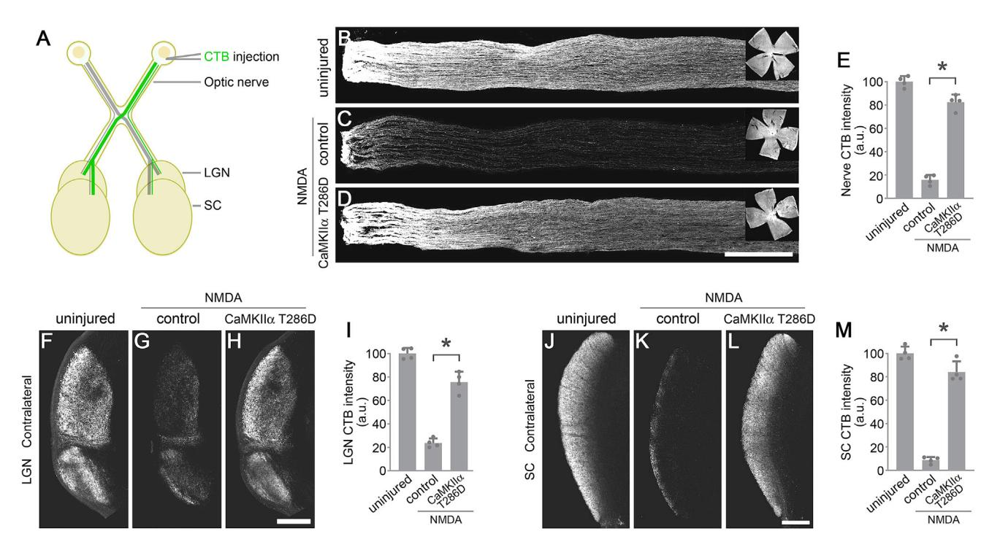

Figure 6. CaMKII reactivation protects RGC axons and their target projections to the brain

(A) Schematic illustration of anterograde Cholera Toxin Subunit B (CTB) tracing of the optic nerve, lateral geniculate nucleus (LGN), and superior colliculus (SC).

(B-D) Confocal images of anterograde CTB tracing of RGC axons in the optic nerve, from uninjured eyes, and 7 days after NMDA injection in control (PBS) or AAV-CaMKIIα T286D-treated eyes. Scale bar, 300 μm. Insets: whole-mount retinal images showing CTB filling in the retina.

(E) Quantification of CTB intensity in the optic nerve. Data are presented as mean ± SD, n = 4 nerves per group. One-way ANOVA with Tukey's multiple comparisons test, F:281.7, R2:0.9843, \*p < 0.0001.

(F-H) Confocal images of anterograde CTB tracing of RGC axons projecting to the contralateral LGN from uninjured eyes, and 7 days after NMDA injection in control (PBS) or AAV-CaMKIIα T286D-treated eyes. Scale bar, 300 μm.

(I) Quantification of CTB intensity in the contralateral LGN. Data are presented as mean  $\pm$  SD, n = 4 brains per group. One-way ANOVA with Tukey's multiple comparisons test, F:155.8, R2:0.9719, \*p < 0.0001.

(J-L) Confocal images of anterograde CTB tracing of RGC axons projecting to the contralateral SC, from uninjured eyes, and 7 days after NMDA injection in control (PBS) or AAV-CaMKIIa T286D-treated eyes. Scale bar, 300 µm.

(M) Quantification of CTB intensity in the contralateral LGN. Data are presented as mean ± SD, n = 4 brains per group. One-way ANOVA with Tukey's multiple comparisons test, F:226.9,  $R^2$ :0.9805, \*p < 0.0001.

See also Figure S6.

forced-choice visual behavioral test (Ecker et al., 2010; Prusky et al., 2000), takes advantage of rodents' trained ability to swim to a submerged hidden platform, the location of which is associated with visual stimuli displayed on a computer monitor (Figure 7I). Mice were trained to swim toward a low spatial frequency (0.05 cycle/degree) grating. Subsequently, the spatial frequency was gradually increased. The visual acuity (i.e., the spatial frequency threshold) is determined when animals make fewer than 70% correct choices. The visual acuity was measured at  $\sim\!0.515$  c/d in the uninjured mice (Figures 7J and 7M), which dropped to  $\sim$ 0.128 c/d following NMDA damage (Figures 7K and 7M). Importantly, CaMKIIa T286D treatment significantly improved the acuity to  $\sim$ 0.388 c/d (Figures 7L and 7M).

Next, we performed the visual cliff test to assess the maintained ability to discriminate visual depth after CaMKIIa T286D treatment. This test is based on a mouse's innate tendency to avoid the deep side and step on to the shallow side of a visual cliff (Fox, 1965; Gu et al., 2018). Mice were placed on the center

platform between the deep side and the shallow side of the cliff, and their choices to step toward either side were recorded (Figure 7N). In the uninjured group, 11 out of 12 mice chose the shallow (safe) side, consistent with previous reports (Fox, 1965; Gu et al., 2018). Significantly worse performance was recorded after NMDA damage, with 7 out of 12 mice choosing the shallow side. By contrast, all 12 CaMKIIa T286D-treated mice chose the shallow side (Figure 7O).

Last, we evaluated innate defensive responses of mice to looming visual stimuli representing environmental threats. The looming experiment was conducted in an enclosure with an overhead monitor to display looming stimuli, a shelter for the mouse to hide and a camera to record the mouse behavior (Figure 7P; Koehler et al., 2019; Lim et al., 2016; Yilmaz and Meister, 2013). In response to looming stimuli, mice with normal vision consistently displayed one or more of the following behaviors: freezing, fleeing to the shelter, and tail rattling, consistent with previous studies (Koehler et al., 2019; Lim et al., 2016; Salay et al., 2018; Yilmaz and Meister, 2013). As a result, we recorded

Cell 184, 4299–4314, August 5, 2021 4309

CelPress

Cell 

Article

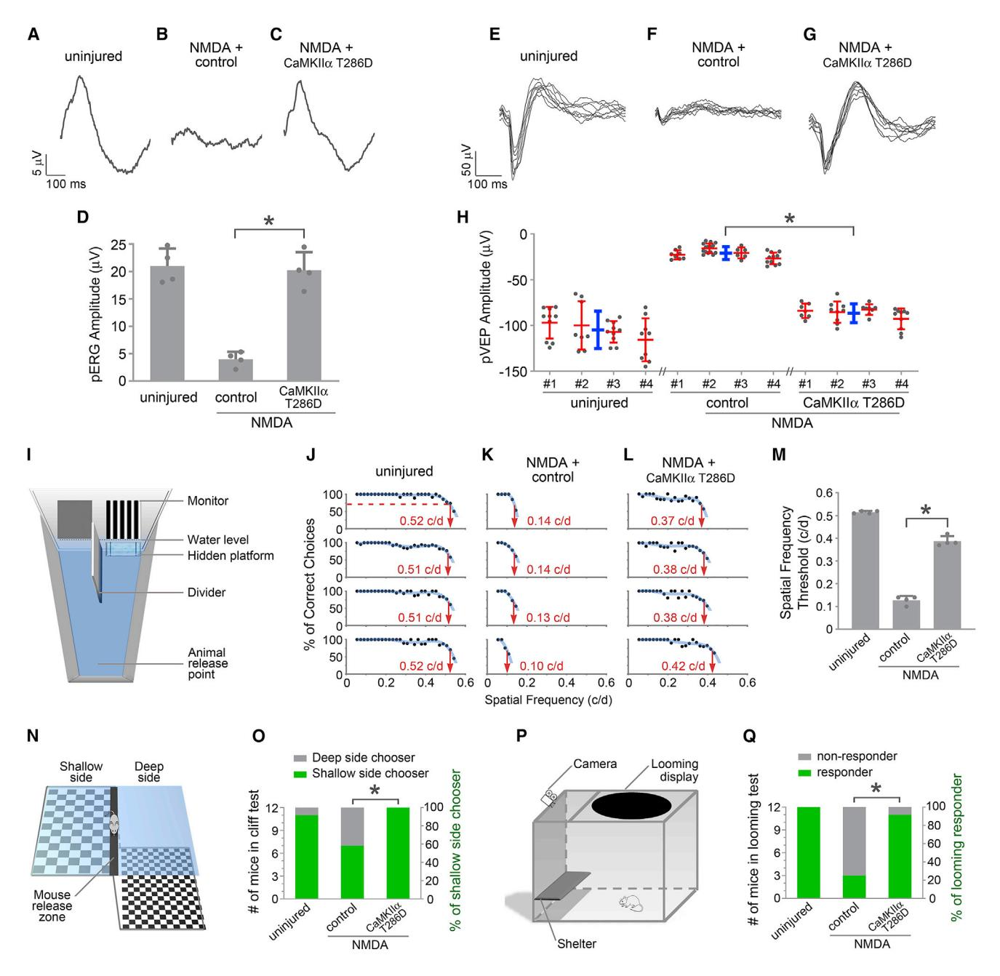

Figure 7. CaMKII reactivation preserves functional vision

(A-C) Representative responses of PERG recordings, from uninjured eyes, and 7 days after NMDA injection, in control (PBS) or AAV-CaMKIIa T286Dtreated eves.

(D) Quantification of PERG amplitudes. Data are presented as mean  $\pm$  SD, n = 4 mice per group. One-way ANOVA with Tukey's multiple comparisons test, F:47.95,  $R^2$ :0.9142, \*p < 0.0001.

(E-G) Representative responses of PVEP recordings from uninjured eyes, and 10 days after NMDA injection, in control (PBS) or AAV-CaMKII z T286Dtreated eves.

(H) Quantification of PVEP amplitudes. PVEP amplitudes are shown for each animal (red) and averaged across the group (blue). Data are presented as mean  $\pm$  SD,  $n = 4$  mice per group. One-way ANOVA with Tukey's multiple comparisons test, F:40.67,  $R^2$ :0.9004, \*p = 0.0002.

(I) Schematic diagram of the visual water task.

(J-L) Visual water-task performance as a function of spatial frequencies, from uninjured mice, and 4-14 days after NMDA injection, in control (PBS) or AAV-CaMKII@ T286D-treated (both eyes) mice. For each column, each row shows the results from a single mouse. For each animal, a trendline of best fit was generated, and the point on the curve that intersected with 70% correct choices was adopted as the threshold for acuity.

(M) Acuity (spatial frequency thresholds) measured in the visual water task. Data are presented as mean  $\pm$  SD, n = 4 mice per group. One-way ANOVA with Tukey's multiple comparisons test, F:529.8, R2:0.9916, \*p < 0.0001.

(legend continued on next page)

4310 Cell 184, 4299–4314, August 5, 2021

Cell 

Article

CelPress

the mouse as a responder to looming stimuli if it reacted with one or more of these behaviors. In the uninjured group, all 12 mice were responders. After NMDA damage, only 3 out of 12 mice responded to looming stimuli. Remarkably, 11 out of 12 CaMKII $\alpha$ T286D-treated mice responded to looming stimuli (Figure 7Q).

Taken together, our results for the first time provide in vivo evidence that CaMKII-mediated RGC protection is capable of preserving functional vision.

# DISCUSSION

RGCs are the output neurons that transmit visual information from the retina to the brain. Unfortunately, RGCs are particularly vulnerable to diverse insults in many pathological conditions leading to vision loss (Levin and Gordon, 2002). Neuroprotective strategies to save RGCs are highly desirable for vision preservation in a diseased retina. However, no such treatment is currently available (Almasieh and Levin, 2017; Khatib and Martin, 2017).

CaMKII regulates a broad array of cellular functions, including homeostatic regulation of the cell and activity-dependent neuronal plasticity (Hudmon and Schulman, 2002a). Previous studies (Laabich and Cooper, 2000; Laabich et al., 2000) reported an increase of CaMKII activity after NMDA-induced excitotoxicity. However, it is unclear whether the change in CaMKII activity was from RGCs or other retinal cell types as whole retinal homogenates were used to measure CaMKII activity in biochemical assays in vitro. We found otherwise that CaMKII was highly phosphorylated in RGCs of the uninjured retina, suggesting that they play a key role in maintaining RGCs in a normal retina. Indeed, we found that inhibition of CaMKII in vivo leads to RGC death. Then we analyzed CaMKII activity in pathological conditions using classic experimental paradigms of NMDA-induced excitotoxicity and ONC and found that CaMKII activity in RGCs precipitously dropped in both injury models. Importantly, reactivation of CaMKII via AAV2-mediated gene transfer of CaMKIIα T286D robustly protects RGCs in multiple injury/disease models, including excitotoxicity, optic nerve injury, and two models of glaucoma mimicking the pathophysiology of the human disease with either high intraocular pressure or normal pressure (Glastdeficient mice). Intriguingly, reactivation of CaMKII may also provide post-injury and long-term protection of RGCs, a highly desirable treatment outcome in a clinical setting. It would be of great interest to test whether CaMKII reactivation protects RGCs during normal aging in DBA/2J mice, an inherited model of glaucoma manifesting mitochondria abnormalities as an early driver of neuronal dysfunction (Williams et al., 2017). The fact that CaMKII reactivation protects RGCs from diverse insults and glaucoma disease models is especially encouraging because RGC degeneration is multifactorial and usually caused by primary and secondary damages in retinal degenerative diseases (Levin and Gordon, 2002).

At the molecular level, we have identified CREB as a key downstream effector of CaMKII to mediate the protective effects for RGCs in both excitotoxicity and optic nerve injury models. The transcriptional activity of CREB sharply declined when RGCs were injured by excitotoxicity or ONC, and the compromised CREB activity can be rescued by CaMKII reactivation. We further showed that CREB activity is both necessary and sufficient for CaMKII-mediated RGC protection as co-treatment with the dominant-negative A-CREB negated the protective effects of CaMKII, and gene transfer of the constitutively active VP16-CREB delivered potent protection of RGCs from both injuries.

Last, we chose the excitotoxicity model to test whether CaM-KII-mediated RGC protection preserves visual function because excitotoxic cell death is involved in a spectrum of retinal diseases affecting RGCs (see Introduction). We showed that reactivation of CaMKII can protect RGC axons in the optic nerve and their long axonal projections to the brain. Intriguingly, CaMKII-mediated RGC protection preserves vision, evidenced by remarkably improved functionality in the entire visual pathway from PERG responses in the retina to PVEP responses in the brain, ultimately leading to preserved visually guided behaviors assessed by the visual water task, visual depth perception, and defensive responses to looming stimuli. Overall, our results demonstrate that CaMKII is a key regulator of RGC survival in normal and diseased retinas and could be a general therapeutic target for RGC protection and vision preservation in a spectrum of pathological conditions.

# Limitations of the study

We show CaMKII-mediated protection of RGCs using microbead occlusion to induce high IOP glaucoma and Glast-deficient mice to mimic normal tension glaucoma. Further studies are needed to examine whether CaMKII-mediated RGC protection preserves visual function in induced and genetic models of glaucoma.

# **STAR**★**METHODS**

Detailed methods are provided in the online version of this paper and include the following:

- KEY RESOURCES TARLE
- RESOURCE AVAILABILITY
  - Lead contact
  - Materials availability
  - Data and code availability statement
- EXPERIMENTAL MODEL AND SUBJECT DETAILS
  - Animals
- METHOD DETAILS
  - AAV plasmids construction and AAV preparation

(N) Schematic diagram of the visual cliff test.

(O) Visual cliff performance, from uninjured mice, and 7 days after NMDA injection in control (PBS) or AAV-CaMKIIα T286D-treated mice. Data show the number (left y axis) and percentage (right y axis) of shallow/deep side choosers. Fisher's exact test,  $*p = 0.0373$ .

(P) Schematic diagram of the looming response test.

(Q) Performance in response to looming stimuli, from uninjured mice, and 7 days after NMDA injection in control (PBS) or AAV-CaMKIIα T286D-treated mice. Data show the number (left y axis) and percentage (right y axis) of responders and non-responders. Fisher's exact test,  $*p = 0.0028$ .

Cell 184, 4299–4314, August 5, 2021 4311

CelPress

Cell 

Article

  - Intravitreal injection and optic nerve crush
  - Induction of IOP elevation in mice
  - Histology and microscopy
  - RGC purification and immunoblotting
  - Pattern electroretinography (PERG)
  - Pattern visually evoked potentials
  - Acuity measurement in the visual water task
  - Visual cliff test
  - Looming visual stimulus response test
- QUANTIFICATION AND STATISTICAL ANALYSIS

# ACKNOWI FDGMENTS

We thank Dr. Yang Hu (Stanford University) for providing AAV-mSncg-GFP plasmid and technical advice, Drs. Adriana Di Polo and Nicolas Belforte (University of Montreal) for technical help with the magnetic microbeads occlusion model, and the flow cytometry CoRE (Icahn School of Medicine at Mount Sinai) for technical help with RGC purification. This work was supported by National Institutes of Health grants R01 EY028921, R01 EY024986, R01 MH124992, R01 EY015788, P30 EY026878, R01 EY022645, R21 EY029806, and R01 EY014454; an unrestricted challenge grant from Research to Prevent Blindness; and the McGraw Family Foundation for Vision Research.

# AUTHOR CONTRIBUTIONS

X.G. conceived the project, designed and performed experiments, analyzed data, and wrote the paper. J.Z. designed and performed experiments. C.S. designed and performed experiments. E.J.M., Y.L., E.P.C., and Y.Y. performed experiments. C.K., K.T., H.W., W.L., L.R.P., J.B.D., and M.C.C. provided materials and expertise. B.C. conceived the project, designed experiments, analyzed data, supervised the project, and wrote the paper with instrumental input from J.B.D. All authors have read and approved the paper.

# DECLARATION OF INTERESTS

B.C. and X.G. have filed a US patent application, 63/154,432, 63/177,230, based on the work in this paper.

Received: January 14, 2021

Revised: April 22, 2021

Accepted: June 24, 2021

Published: July 22, 2021

# RFFFRFNCFS

Ahn, S., Olive, M., Aggarwal, S., Krylov, D., Ginty, D.D., and Vinson, C. (1998). A dominant-negative inhibitor of CREB reveals that it is a general mediator of stimulus-dependent transcription of c-fos. Mol. Cell. Biol. 18, 967-977.

Almasieh, M., and Levin, L.A. (2017). Neuroprotection in Glaucoma: Animal Models and Clinical Trials. Annu. Rev. Vis. Sci. 3, 91-120.

Ashpole, N.M., and Hudmon, A. (2011). Excitotoxic neuroprotection and vulnerability with CaMKII inhibition. Mol. Cell. Neurosci. 46, 720-730.

Ashpole, N.M., Song, W., Brustovetsky, T., Engleman, E.A., Brustovetsky, N., Cummins, T.R., and Hudmon, A. (2012). Calcium/calmodulin-dependent protein kinase II (CaMKII) inhibition induces neurotoxicity via dysregulation of glutamate/calcium signaling and hyperexcitability. J. Biol. Chem. 287, 8495-8506

Barco, A., Alarcon, J.M., and Kandel, E.R. (2002). Expression of constitutively active CREB protein facilitates the late phase of long-term potentiation by enhancing synaptic capture. Cell 108, 689-703.

Benowitz, L.I., He, Z., and Goldberg, J.L. (2017). Reaching the brain: Advances in optic nerve regeneration. Exp. Neurol. 287, 365-373.

Berkelaar, M., Clarke, D.B., Wang, Y.C., Bray, G.M., and Aguayo, A.J. (1994). Axotomy results in delayed death and apoptosis of retinal ganglion cells in adult rats. J. Neurosci. 14, 4368-4374.

Berridge, M.J., Lipp, P., and Bootman, M.D. (2000). The versatility and universality of calcium signalling. Nat. Rev. Mol. Cell Biol. 1. 11-21.

Berry, M., Ahmed, Z., and Logan, A. (2019). Return of function after CNS axon regeneration: Lessons from injury-responsive intrinsically photosensitive and alpha retinal ganglion cells. Prog. Retin. Eye Res. 71, 57-67.

Calkins, D.J. (2012). Critical pathogenic events underlying progression of neurodegeneration in glaucoma. Prog. Retin. Eye Res. 31, 702-719.

Chitranshi, N., Dheer, Y., Mirzaei, M., Wu, Y., Salekdeh, G.H., Abbasi, M., Gupta, V., Vander Wall, R., You, Y., Graham, S.L., and Gupta, V. (2019). Loss of Shp2 Rescues BDNF/TrkB Signaling and Contributes to Improved Retinal Ganglion Cell Neuroprotection. Mol. Ther. 27, 424–441.

Chou, T.H., Bohorquez, J., Toft-Nielsen, J., Ozdamar, O., and Porciatti, V. (2014). Robust mouse pattern electroretinograms derived simultaneously from each eye using a common snout electrode. Invest. Ophthalmol. Vis. Sci. 55, 2469–2475.

Coultrap, S.J., Buard, I., Kulbe, J.R., Dell'Acqua, M.L., and Bayer, K.U. (2010). CaMKII autonomy is substrate-dependent and further stimulated by Ca2+/ calmodulin. J. Biol. Chem. 285, 17930-17937.

Deisseroth, K., Bito, H., and Tsien, R.W. (1996). Signaling from synapse to nucleus: postsynaptic CREB phosphorylation during multiple forms of hippocampal synaptic plasticity. Neuron 16, 89-101.

Dhande, O.S., Stafford, B.K., Lim, J.A., and Huberman, A.D. (2015). Contributions of Retinal Ganglion Cells to Subcortical Visual Processing and Behaviors. Annu. Rev. Vis. Sci. 1, 291-328.

Dong, Z., Saikumar, P., Weinberg, J.M., and Venkatachalam, M.A. (2006). Calcium in cell injury and death. Annu. Rev. Pathol. 1, 405-434.

Ecker, J.L., Dumitrescu, O.N., Wong, K.Y., Alam, N.M., Chen, S.K., LeGates, T., Renna, J.M., Prusky, G.T., Berson, D.M., and Hattar, S. (2010). Melanopsin-expressing retinal ganglion-cell photoreceptors: cellular diversity and role in pattern vision. Neuron 67, 49-60.

Fong, Y.L., Taylor, W.L., Means, A.R., and Soderling, T.R. (1989). Studies of the regulatory mechanism of Ca2+/calmodulin-dependent protein kinase II. Mutation of threonine 286 to alanine and aspartate. J. Biol. Chem. 264, 16759-16763.

Fox, M.W. (1965). The visual cliff test for the study of visual depth perception in the mouse. Anim. Behav. 13, 232-233.

Goebel, D.J. (2009). Selective blockade of CaMKII-alpha inhibits NMDAinduced caspase-3-dependent cell death but does not arrest PARP-1 activation or loss of plasma membrane selectivity in rat retinal neurons. Brain Res. 1256. 190-204.

Gomes, J.R., Costa, J.T., Melo, C.V., Felizzi, F., Monteiro, P., Pinto, M.J., Inácio, A.R., Wieloch, T., Almeida, R.D., Grãos, M., and Duarte, C.B. (2012). Excitotoxicity downregulates TrkB.FL signaling and upregulates the neuroprotective truncated TrkB receptors in cultured hippocampal and striatal neurons. J. Neurosci. 32. 4610-4622.

Gu, L., Bok, D., Yu, F., Caprioli, J., and Piri, N. (2018). Downregulation of splicing regulator RBFOX1 compromises visual depth perception. PLoS ONE 13. e0200417.

Hanson, P.I., Meyer, T., Stryer, L., and Schulman, H. (1994). Dual role of calmodulin in autophosphorylation of multifunctional CaM kinase may underlie decoding of calcium signals. Neuron 12, 943-956.

Harada, T., Harada, C., Nakamura, K., Quah, H.M., Okumura, A., Namekata, K., Saeki, T., Aihara, M., Yoshida, H., Mitani, A., and Tanaka, K. (2007). The potential role of glutamate transporters in the pathogenesis of normal tension glaucoma. J. Clin. Invest. 117, 1763-1770.

Hartwick, A.T.E., Hamilton, C.M., and Baldridge, W.H. (2008). Glutamatergic calcium dynamics and deregulation of rat retinal ganglion cells. J. Physiol. 586. 3425-3446.

He, Z., and Jin, Y. (2016). Intrinsic Control of Axon Regeneration. Neuron 90, 437-451.

4312 Cell 184, 4299–4314, August 5, 2021

Cell 

Article

CelPress

Herrera, E., and Mason, C.A. (2007). 3.23 - The evolution of crossed and uncrossed retinal pathways in mammals. In Evolution of Nervous Systems, J.H. Kaas, ed. (Academic Press), pp. 307-317.

Hu, Y., Park, K.K., Yang, L., Wei, X., Yang, Q., Cho, K.S., Thielen, P., Lee, A.H., Cartoni, R., Glimcher, L.H., et al. (2012). Differential effects of unfolded protein response pathways on axon injury-induced death of retinal ganglion cells. Neuron 73. 445-452.

Hudmon, A., and Schulman, H. (2002a). Neuronal CA2+/calmodulin-dependent protein kinase II: the role of structure and autoregulation in cellular function Annu Rev Biochem 71, 473-510.

Hudmon, A., and Schulman, H. (2002b). Structure-function of the multifunctional Ca2+/calmodulin-dependent protein kinase II. Biochem. J. 364, 593-611

Ito, Y.A., Belforte, N., Cueva Vargas, J.L., and Di Polo, A. (2016). A Magnetic Microbead Occlusion Model to Induce Ocular Hypertension-Dependent Glaucoma in Mice. J. Vis. Exp. Published online March 23, 2016. https://doi.org/10. 3791/53731

Khatib, T.Z., and Martin, K.R. (2017). Protecting retinal ganglion cells. Eye (Lond.) 31, 218-224.

Koehler, C.C., Hall, J. M., Hellmer, C.B., and Ichinose, T. (2019). Using Looming Visual Stimuli to Evaluate Mouse Vision. J. Vis. Exp. Published online June 13, 2019. https://doi.org/10.3791/59766.

Laabich, A., and Cooper, N.G. (2000). Neuroprotective effect of AIP on Nmethyl-D-aspartate-induced cell death in retinal neurons. Brain Res. Mol. Brain Res. 85. 32-40.

Laabich, A., Li, G., and Cooper, N.G. (2000). Calcium/calmodulin-dependent protein kinase II containing a nuclear localizing signal is altered in retinal neurons exposed to N-methyl-D-aspartate. Brain Res. Mol. Brain Res. 76, 253-265.

Lafuente, M.P., Villegas-Pérez, M.P., Sellés-Navarro, I., Mayor-Torroglosa, S., Miralles de Imperial, J., and Vidal-Sanz, M. (2002). Retinal ganglion cell death after acute retinal ischemia is an ongoing process whose severity and duration depends on the duration of the insult. Neuroscience *109*, 157–168.

Laha, B., Stafford, B.K., and Huberman, A.D. (2017). Regenerating optic pathways from the eye to the brain. Science 356, 1031-1034.

Levin, L.A., and Gordon, L.K. (2002). Retinal ganglion cell disorders: types and treatments. Prog. Retin. Eye Res. 21, 465-484.

Lim, J.H., Stafford, B.K., Nguyen, P.L., Lien, B.V., Wang, C., Zukor, K., He, Z., and Huberman, A.D. (2016). Neural activity promotes long-distance, targetspecific regeneration of adult retinal axons. Nat. Neurosci. 19, 1073–1084.

Lisman, J., Schulman, H., and Cline, H. (2002). The molecular basis of CaMKII function in synaptic and behavioural memory. Nat. Rev. Neurosci. 3, 175-190. Lonze, B.E., and Ginty, D.D. (2002). Function and regulation of CREB family transcription factors in the nervous system. Neuron 35, 605-623.

Lu, Y., Brommer, B., Tian, X., Krishnan, A., Meer, M., Wang, C., Vera, D.L., Zeng, Q., Yu, D., Bonkowski, M.S., et al. (2020). Reprogramming to recover youthful epigenetic information and restore vision. Nature 588, 124-129.

Lucas, D.R., and Newhouse, J.P. (1957). The toxic effect of sodium L-glutamate on the inner layers of the retina. AMA Arch. Opthalmol. 58, 193-201.

Ma, H., Groth, R.D., Cohen, S.M., Emery, J.F., Li, B., Hoedt, E., Zhang, G., Neubert, T.A., and Tsien, R.W. (2014).  $\gamma$ CaMKII shuttles Ca2+/CaM to the nucleus to trigger CREB phosphorylation and gene expression. Cell 159, 281-294

Malihi, M., Moura Filho, E.R., Hodge, D.O., and Sit, A.J. (2014). Long-term trends in glaucoma-related blindness in Olmsted County, Minnesota. Ophthalmology 121, 134-141.

Manabe, S., and Lipton, S.A. (2003). Divergent NMDA signals leading to proapoptotic and antiapoptotic pathways in the rat retina. Invest. Ophthalmol. Vis. Sci. 44, 385–392.

Massey, S.C., and Miller, R.F. (1987). Excitatory amino acid receptors of rodand cone-driven horizontal cells in the rabbit retina. J. Neurophysiol. 57, 645-659.

Massey, S.C., and Miller, R.F. (1990). N-methyl-D-aspartate receptors of ganglion cells in rabbit retina. J. Neurophysiol. 63, 16-30.

Miller, S.G., Patton, B.L., and Kennedy, M.B. (1988), Sequences of autophosphorylation sites in neuronal type II CaM kinase that control Ca2(+)-independent activity. Neuron 1, 593-604.

Nagahara, A.H., and Tuszynski, M.H. (2011). Potential therapeutic uses of BDNF in neurological and psychiatric disorders. Nat. Rev. Drug Discov. 10, 209-219

Nickells, R.W., Howell, G.R., Soto, I., and John, S.W. (2012). Under pressure: cellular and molecular responses during glaucoma, a common neurodegeneration with axonopathy. Annu. Rev. Neurosci. 35, 153-179.

Olney, J.W. (1982). The toxic effects of glutamate and related compounds in the retina and the brain. Retina 2, 341-359.

Park, K.K., Liu, K., Hu, Y., Smith, P.D., Wang, C., Cai, B., Xu, B., Connolly, L., Kramvis, I., Sahin, M., and He, Z. (2008). Promoting axon regeneration in the adult CNS by modulation of the PTEN/mTOR pathway. Science 322, 963–966.

Patton, B.L., Miller, S.G., and Kennedy, M.B. (1990). Activation of type II calcium/calmodulin-dependent protein kinase by Ca2+/calmodulin is inhibited by autophosphorylation of threonine within the calmodulin-binding domain. J. Biol. Chem. 265, 11204–11212.

Pi, H.J., Otmakhov, N., El Gaamouch, F., Lemelin, D., De Koninck, P., and Lisman, J. (2010a). CaMKII control of spine size and synaptic strength: role of phosphorylation states and nonenzymatic action. Proc. Natl. Acad. Sci. USA 107. 14437-14442.

Pi, H.J., Otmakhov, N., Lemelin, D., De Koninck, P., and Lisman, J. (2010b). Autonomous CaMKII can promote either long-term potentiation or long-term depression, depending on the state of T305/T306 phosphorylation. J. Neurosci. 30, 8704-8709.

Porciatti, V. (2007). The mouse pattern electroretinogram. Doc. Ophthalmol. 115, 145-153.

Porciatti, V., Pizzorusso, T., and Maffei, L. (1999). The visual physiology of the wild type mouse determined with pattern VEPs. Vision Res. 39, 3071–3081.

Prilloff, S., Noblejas, M.I., Chedhomme, V., and Sabel, B.A. (2007). Two faces of calcium activation after optic nerve trauma: life or death of retinal ganglion cells in vivo depends on calcium dynamics. Eur. J. Neurosci. 25, 3339–3346.

Prusky, G.T., West, P.W.R., and Douglas, R.M. (2000). Behavioral assessment of visual acuity in mice and rats. Vision Res. 40, 2201-2209.

Saggu, S.K., Chotaliya, H.P., Blumbergs, P.C., and Casson, R.J. (2010). Wallerian-like axonal degeneration in the optic nerve after excitotoxic retinal insult: an ultrastructural study. BMC Neurosci. 11, 97.

Salay, L.D., Ishiko, N., and Huberman, A.D. (2018). A midline thalamic circuit determines reactions to visual threat. Nature 557, 183-189.

Schindelin, J., Arganda-Carreras, I., Frise, E., Kaynig, V., Longair, M., Pietzsch, T., Preibisch, S., Rueden, C., Saalfeld, S., Schmid, B., et al. (2012). Fiji: an open-source platform for biological-image analysis. Nat. Methods 9, 676–682.

Schworer, C.M., Colbran, R.J., Keefer, J.R., and Soderling, T.R. (1988). Ca2+/ calmodulin-dependent protein kinase II. Identification of a regulatory autophosphorylation site adjacent to the inhibitory and calmodulin-binding domains. J. Biol. Chem. 263, 13486-13489.

Seitz, R., and Tamm, E.R. (2013). N-methyl-D-aspartate (NMDA)-mediated excitotoxic damage: a mouse model of acute retinal ganglion cell damage. Methods Mol. Biol. 935, 99-109.

Sheng, M., Thompson, M.A., and Greenberg, M.E. (1991). CREB: a Ca(2+)regulated transcription factor phosphorylated by calmodulin-dependent kinases. Science 252, 1427-1430.

Sisk, D.R., and Kuwabara, T. (1985). Histologic changes in the inner retina of albino rats following intravitreal injection of monosodium L-glutamate. Graefes Arch. Clin. Exp. Ophthalmol. 223, 250-258.

Sun, F., Park, K.K., Belin, S., Wang, D., Lu, T., Chen, G., Zhang, K., Yeung, C., Feng, G., Yankner, B.A., and He, Z. (2011). Sustained axon regeneration induced by co-deletion of PTEN and SOCS3. Nature 480, 372-375.

Cell 184, 4299–4314, August 5, 2021 4313

CelPress

Cell 

Article

Terashima, T., Ochiishi, T., and Yamauchi, T. (1994). Immunocytochemical localization of calcium/calmodulin-dependent protein kinase II isoforms in the ganglion cells of the rat retina: immunofluorescence histochemistry combined with a fluorescent retrograde tracer. Brain Res. 650, 133-139.

Tham, Y.C., Li, X., Wong, T.Y., Quigley, H.A., Aung, T., and Cheng, C.Y. (2014). Global prevalence of glaucoma and projections of glaucoma burden through 2040: a systematic review and meta-analysis. Ophthalmology 121, 2081–2090.

Thiel, G., Czernik, A.J., Gorelick, F., Nairn, A.C., and Greengard, P. (1988). Ca2+/calmodulin-dependent protein kinase II: identification of threonine-286 as the autophosphorylation site in the alpha subunit associated with the generation of Ca2+-independent activity. Proc. Natl. Acad. Sci. USA 85, 6337-6341

Thoreson, W.B., and Witkovsky, P. (1999). Glutamate receptors and circuits in the vertebrate retina. Prog. Retin. Eye Res. 18, 765-810.

Tran, N.M., Shekhar, K., Whitney, I.E., Jacobi, A., Benhar, I., Hong, G., Yan, W., Adiconis, X., Arnold, M.E., Lee, J.M., et al. (2019). Single-Cell Profiles of Retinal Ganglion Cells Differing in Resilience to Injury Reveal Neuroprotective Genes. Neuron 104, 1039-1055.

Vorwerk, C.K., Lipton, S.A., Zurakowski, D., Hyman, B.T., Sabel, B.A., and Dreyer, E.B. (1996). Chronic low-dose glutamate is toxic to retinal ganglion cells. Toxicity blocked by memantine. Invest. Ophthalmol. Vis. Sci. 37, 1618-1624

Wang, Q., Zhuang, P., Huang, H., Li, L., Liu, L., Webber, H.C., Dalal, R., Siew, L., Fligor, C.M., Chang, K.C., et al. (2020). Mouse  $\gamma$ -Synuclein Promoter-Mediated Gene Expression and Editing in Mammalian Retinal Ganglion Cells. J. Neurosci. 40, 3896–3914.

Watkins, T.A., Wang, B., Huntwork-Rodriguez, S., Yang, J., Jiang, Z., Eastham-Anderson, J., Modrusan, Z., Kaminker, J.S., Tessier-Lavigne, M., and Lewcock, J.W. (2013). DLK initiates a transcriptional program that couples apoptotic and regenerative responses to axonal injury. Proc. Natl. Acad. Sci. USA 110, 4039-4044.

Weinreb, R.N., Leung, C.K., Crowston, J.G., Medeiros, F.A., Friedman, D.S., Wiggs, J.L., and Martin, K.R. (2016). Primary open-angle glaucoma. Nat. Rev. Dis. Primers 2, 16067.

Welsbie, D.S., Yang, Z., Ge, Y., Mitchell, K.L., Zhou, X., Martin, S.E., Berlinicke, C.A., Hackler, L., Jr., Fuller, J., Fu, J., et al. (2013). Functional genomic screening identifies dual leucine zipper kinase as a key mediator of retinal ganglion cell death. Proc. Natl. Acad. Sci. USA 110, 4045-4050.

Williams, P.A., Harder, J.M., Foxworth, N.E., Cochran, K.E., Philip, V.M., Porciatti, V., Smithies, O., and John, S.W. (2017). Vitamin B3 modulates mitochondrial vulnerability and prevents glaucoma in aged mice. Science 355, 756-760.

Yang, L., Li, S., Miao, L., Huang, H., Liang, F., Teng, X., Xu, L., Wang, Q., Xiao, W., Ridder, W.H., 3rd., et al. (2016). Rescue of Glaucomatous Neurodegeneration by Differentially Modulating Neuronal Endoplasmic Reticulum Stress Molecules. J. Neurosci. 36, 5891-5903.

Yilmaz, M., and Meister, M. (2013). Rapid innate defensive responses of mice to looming visual stimuli. Curr. Biol. 23, 2011-2015.

Zhang, J., Ackman, J.B., Xu, H.P., and Crair, M.C. (2011). Visual map development depends on the temporal pattern of binocular activity in mice. Nat. Neurosci. 15. 298–307.

Zhang, J., Cai, C.Y., Wu, H.Y., Zhu, L.J., Luo, C.X., and Zhu, D.Y. (2016). CREB-mediated synaptogenesis and neurogenesis is crucial for the role of 5-HT1a receptors in modulating anxiety behaviors. Sci. Rep. 6, 29551.

4314 Cell 184, 4299–4314, August 5, 2021

Cell

Article

CelPress

# **STAR**★**METHODS**

## **KEY RESOURCES TABLE**

| REAGENT or RESOURCE                                              | SOURCE                           | IDENTIFIER                                              |
|------------------------------------------------------------------|----------------------------------|---------------------------------------------------------|
| Antibodies                                                       |                                  |                                                         |
| Mouse anti-Tubulin $β$ 3 (Tuj1)                                 | Biolegend                        | Cat# ab801202; RRID: AB_10063408                        |
| Rabbit anti-CaMKII (phospho T286)                                | Abcam                            | Cat# ab32678; RRID: AB_725893                           |
| Rabbit anti-CaMKII                                               | Abcam                            | Cat# ab52476; RRID:AB_868641                            |
| Rabbit anti-CREB (phospho S133)                                  | Abcam                            | Cat# ab32096; RRID:AB_731734                            |
| Rabbit anti-TrkB (phospho T817)                                  | Thermo Fisher Scientific         | Cat# MA5-32207; RRID:AB_2809494                         |
| Rabbit anti-ZPK/DLK                                              | Thermo Fisher Scientific         | Cat# PA5-32173; RRID:AB_2549646                         |
| Rabbit anti-c-Jun (phosphor S63)                                 | Cell Signaling Technology        | Cat# 2361; RRID:AB_490908                               |
| Alexa Fluor 488 AffiniPure Donkey Anti-Mouse $\lg G$ (H+L)    | Jackson ImmunoResearch Labs      | Cat# 715-545-151; RRID:AB_2341099                       |
| Alexa Fluor 594 AffiniPure Donkey Anti-Mouse $\lg G$ (H+L)    | Jackson ImmunoResearch Labs      | Cat# 715-585-151; RRID:AB_2340855                       |
| Cy3 AffiniPure Donkey Anti-Rabbit $\lg G (H+L)$               | Jackson ImmunoResearch Labs      | Cat# 711-165-152; RRID:AB_2307443                       |
| Alexa Fluor 594 AffiniPure Donkey Anti-Rabbit $\lg G$ (H+L)   | Jackson ImmunoResearch Labs      | Cat# 711-585-152; RRID:AB_2340621                       |
| Alexa Fluor 647 AffiniPure Donkey Anti-Rabbit $\lg G$ (H+L)   | Jackson ImmunoResearch Labs      | Cat# 711-605-152; RRID:AB_2492288                       |
| CD90.2 (Thy-1.2) Monoclonal Antibody (53-2.1), PE-Cyanine7    | Thermo Fisher Scientific         | Cat# 25-0902-82; RRID:AB_469642                         |
| Recombinant HRP Anti-GAPDH antibody                              | Abcam                            | Cat# ab201822                                           |
| WesternSure Goat anti-Rabbit HRP                                 | LI-COR Biosciences               | Cat# 926-80011; RRID:AB_2721264                         |
| Chemicals, peptides, and recombinant proteins                    |                                  |                                                         |
| CaMKII alpha (phospho T286) peptide                              | Abcam                            | Cat# ab115237                                           |
| CTB, Alexa Fluor 488 Conjugate                                   | Thermo Fisher Scientific         | Cat# C22841                                             |
| Dynabeads® M-450 Epoxy                                           | Thermo Fisher Scientific         | Cat# 14011                                              |
| DAPI                                                             | Thermo Fisher Scientific         | Cat# 62248                                              |
| SuperSignal West Atto Ultimate Sensitivity Substrate          | Thermo Fisher Scientific         | Cat# A38555                                             |
| N-Methyl-D-aspartic Acid (NMDA)                                  | Millipore Sigma                  | Cat# 454575                                             |
| Autocamtide-2 Related Inhibitory Peptide, Myristoylated (AIP) | Millipore Sigma                  | Cat# 189482                                             |
| Experimental models: Cell lines                                  |                                  |                                                         |
| AAVpro 293T Cell Line                                            | Takara Bio                       | Cat# 632273                                             |
| Experimental models: Organisms/strains                           |                                  |                                                         |
| C57BL/6J                                                         | The Jackson Laboratory           | Cat# JAX:000664, RRID:IMSR_JAX:000664                   |
| $GLAST_{-/-} mice$                                               | Obtained from Dr. Kohichi Tanaka | N/A                                                     |
| Recombinant DNA                                                  |                                  |                                                         |
| pAAV-GFP                                                         | Obtained from Dr. Kevin Park     | N/A                                                     |
| pAAV-mSncg-GFP                                                   | Obtained from Dr. Yang Hu        | N/A                                                     |
| pcDNA3-A-CREB                                                    | Obtained from Dr. Hongbing Wang  | N/A                                                     |
| pcDNA3-VP16-CREB                                                 | Obtained from Dr. Hongbing Wang  | N/A                                                     |
| pAAV-EBFP                                                        | This study                       | N/A                                                     |
| pAAV-mSncg-EBFP                                                  | This study                       | N/A                                                     |
| pAAV-mSncg-CaMKIIa T286D                                         | This study                       | N/A                                                     |

(Continued on next page)

Cell 184, 4299–4314.e1–e5, August 5, 2021 e1

CelPress

Cell 

Article

| Continued                                                        |                                  |                                                         |
| REAGENT or RESOURCE                                              | SOURCE                           | IDENTIFIER                                              |
| pAAV-CaMKIIα WT                                                  | This study                       | N/A                                                     |
| pAAV-CaMKIIα K42R                                                | This study                       | N/A                                                     |
| pAAV-CaMKIIα K42D                                                | This study                       | N/A                                                     |
| pAAV-CaMKIIα T286D                                               | This study                       | N/A                                                     |
| pAAV-CaMKIIα T286A                                               | This study                       | N/A                                                     |
| pAAV-CaMKIIα T286D/T305A/T306A                                   | This study                       | N/A                                                     |
| pAAV-CaMKIIα T286D/T305D/T306D                                   | This study                       | N/A                                                     |
| pAAV-CaMKIIβ WT                                                  | This study                       | N/A                                                     |
| pAAV-CaMKIIβ K43R                                                | This study                       | N/A                                                     |
| pAAV-CaMKIIβ K43D                                                | This study                       | N/A                                                     |
| pAAV-CaMKIIβ T287D                                               | This study                       | N/A                                                     |
| pAAV-CaMKIIβ T287A                                               | This study                       | N/A                                                     |
| pAAV-CaMKIIβ T287D/T306A/T307A                                   | This study                       | N/A                                                     |
| pAAV-CaMKIIβ T287D/T306D/T307D                                   | This study                       | N/A                                                     |
| Software and algorithms                                          |                                  |                                                         |
| GraphPad Prism 9                                                 | GraphPad                         | https://www.graphpad.com/ scientific-software/prism/ |
| ImageJ                                                           | Schindelin et al., 2012          | https://imagej.net/software/fiji                        |
| Blender 2.9                                                      | Blender                          | https://www.blender.org                                 |

# RESOURCE AVAILABILITY

## Lead contact

Further information and requests for resources and reagents should be directed to and will be fulfilled by the lead contact, Bo Chen (bo.chen@mssm.edu)

## **Materials availability**

Reagents generated in this study are available upon reasonable request from the lead contact.

## **Data and code availability statement**

This study did not generate datasets or code.

# EXPERIMENTAL MODEL AND SUBJECT DETAILS

## Animals

C57BL/6 mice were purchased from The Jackson Laboratory (Bar Harbor, Maine). GLAST-/- mice were provided by Dr. Kohichi Tanaka, Tokyo Medical & Dental University (TMDU). All studies adhered to the procedures consistent with animal protocols approved by the IACUC at the Icahn School of Medicine at Mount Sinai. Male mice were used for the magnetic microbeads occlusion model; mice of either sex were randomly assigned to different groups for other experiments. 8-week-old C57BL/6 mice were used for excitotoxicity and optic nerve crush experiments. Induction of IOP elevation was performed in 3-month-old C57BL/6 mice. Intravitreal injection of AAV in  $GLAST-/-$  mice was performed at postnatal day 1.

# METHOD DETAILS

## AAV plasmids construction and AAV preparation

pAAV-GFP plasmids were kindly provided by Dr. Kevin Park (University of Miami). For AAV plasmid construction, the protein-coding region of pAAV-GFP was replaced by cDNAs of the following plasmids: CaMKIIa WT (Addgene #21226), CaMKIIa K42R (Addgene #21221), CaMKIIα T286D (Addgene #16736), CaMKIIβ WT (Addgene #21227), CaMKIIβ K43R (Addgene #21225), CaMKIIβ T287D (Addgene #21223) and VP16-CREB and A-CREB (both from Dr. Hongbing Wang, Michigan State University). GenScript (Piscataway, NJ) generated CaMKIIα K42D and CaMKIIα T286A from CaMKIIα WT, CaMKIIα T286D/T305A/T306A and CaMKIIα T286D/T305D/ T306D from CaMKIIα T286D, CaMKIIβ K43D and CaMKIIβ T287A from CaMKIIβ WT, CaMKIIβ T287D/T306A/T307A and CaMKIIβ T287D/T306D/T307D from CaMKII® T287D. AAV-mSncg-GFP was kindly provided by Dr. Yang Hu (Stanford University) and used

e2 Cell 184, 4299–4314.e1–e5, August 5, 2021

Cell 

Article

CelPress

to generate AAV-mSncg-EBFP and AAV-mSncg-CaMKIIa T286D. AAV Rap-Cap and Helper plasmids were used for co-transfection in AAVpro 293T Cell Line (Takara Bio, 632273). Discontinuous iodixanol gradient ultracentrifugation was used to purify AAV. AAV titers, determined by real-time PCR, were in the range of  $1-4 \times 10^{13}$  genome copies per milliliter.

## Intravitreal injection and optic nerve crush

Adult mice were anesthetized with a mixture of ketamine (100 mg/kg) and xylazine (10 mg/kg) by intraperitoneal injection. GLAST-/mouse pups were anesthetized by chilling on ice, and a small incision was made in the eyelid with a 30-gauge needle to expose the eyeball. For intravitreal injection, the micropipette was inserted just behind the ora serrata, and AAV or other solution was injected into the vitreous body. N-Methyl-D-aspartic Acid (Millipore Sigma, 454575) and Myristoylated Autocamtide-2-Related Inhibitory Peptide (Millipore Sigma, 189482) was prepared in PBS. For optic nerve crush, the optic nerve was exposed and crushed intraorbitally with jeweler's forceps for 5 s approximately 1 mm behind the globe. Ophthalmic ointment was applied to protect the cornea after surgery.

## Induction of IOP elevation in mice

To elevate IOP, 3-month-old mice were anesthetized by a mixture of ketamine and xylazine. Proparacaine Hydrochloride eye drops were used before surgery. Magnetic microbeads (Dynabeads® M-450 Epoxy, Thermo Fisher Scientific) were injected unilaterally into the anterior chamber and distributed evenly around the circumference of the anterior chamber using magnets, as described recently (Ito et al., 2016). A second injection of microbeads was performed at 4 weeks after the first injection. The IOP of both eyes was monitored using the TonoLab tonometer according to manufacturer's instructions.

## **Histology and microscopy**

For immunohistochemistry, eyes with the attached optic nerve segment, surgically removed from perfused mice, were post-fixed in 4% PFA. Retinas were dissected out for whole-mount staining. Retinal whole-mounts were blocked in the staining buffer containing 5% normal donkey serum and 0.1% Triton X-100 in PBS for 1 hr. Retinas were incubated with primary antibodies overnight and washed 3x 15 minutes with PBS before 2 hours of incubation with secondary antibodies at room temperature. Retinas were again washed 3x 15 minutes with PBS and then mounted with Fluoromount-G. Primary antibodies used: Tuj1 (1:250, Biolegend, 801202), pCaMKII (1:100, Abcam, ab32678), pan-CaMKII (1:100, Abcam, ab52476), pCREB (1:100, Abcam, ab32096), pTrkB (1:100, Thermo Fisher Scientific, MA5-32207), DLK (1:100, Thermo Fisher Scientific, PA5-32173), p-c-Jun (1:100, Cell Signaling Technology, 2361). The peptide used: CaMKII alpha (phospho T286) peptide (12.5 μg/ml, Abcam, ab115237). Secondary antibodies used: Alexa Fluor® 488 AffiniPure Donkey Anti-Mouse IgG (1:500, Jackson ImmunoResearch Labs, 715-545-151), Alexa Fluor® 594 AffiniPure Donkey Anti-Mouse IqG (1:500, Jackson ImmunoResearch Labs, 715-585-151), Cy3 AffiniPure Donkey Anti-Rabbit IqG (1:500, Jackson ImmunoResearch Labs, 711-165-152), Alexa Fluor® 594 AffiniPure Donkey Anti-Rabbit IgG (1:500, Jackson ImmunoResearch Labs, 711-585-152), Alexa Fluor® 647 AffiniPure Donkey Anti-Rabbit IgG (1:500, Jackson ImmunoResearch Labs, 711-605-152). Confocal images were acquired using a Zeiss LSM 800 microscope. For RGC counting and signaling pathway studies, squares (320  $\times$  320  $\mu$ m) were sampled around the peripheral region of each retina whole-mount ( $\sim$ 500  $\mu$ m from square center to retina edge) for analysis.

For visual pathway CTB tracing, 1.5 µl of Cholera Toxin Subunit B (CTB, Alexa Fluor 488 Conjugate, Thermo Fisher Scientific, C22841) (2  $\mu$ g/ $\mu$ l in PBS) was injected into the vitreous. Three days after CTB injection, animals were perfused with 4% PFA. Optic nerves were dissected, fixed, and mounted for imaging. Brains were dissected, fixed and mounted in 3% agarose. Brain slices (150 µm thickness) were sectioned coronally for LGN or sagittally for superior colliculus using a vibratome (1000VT, Leica) and mounted for imaging as previously reported (Zhang et al., 2011). Confocal images were acquired using a Zeiss LSM 800 microscope.

For visualization of microbeads accumulation at the iridocorneal angle, eyes from perfused mice were collected and post-fixed in 4% PFA. The anterior part of each eye was dissected out, embedded in OCT compound, sectioned using a cryostat, stained with H&E, and imaged with Zeiss LSM 800 microscope equipped with a color camera.

For axon survival examination of microbeads-injected eyes, optic nerves were fixed in 2.5% glutaraldehyde and 2% paraformaldehyde in 0.1M sodium cacodylate buffer for 0.5 hours at room temperature and then 2 hours at 4°C. Optic nerve regions 1 mm distal to the eyeball were embedded in resin. Semithin sections of the optic nerve were stained with toluidine blue and imaged with Zeiss LSM 800 microscope equipped with a color camera through a 100X lens. Square areas (22  $\times$  22  $\mu$ m) were sampled around the peripheral region of each nerve section ( $\sim$ 50  $\mu$ m from square center to nerve edge) for analysis.

For optic nerve head analysis, eyes with the attached optic nerve segment, surgically removed from perfused mice, were postfixed in 4% PFA. After removal of cornea, iris, and lens, eyes were embedded in OCT compound for cryosection. Sections through the optic nerve were collected, stained with DAPI (Thermo Fisher Scientific, 62248), and imaged with Zeiss LSM 800 microscope.

Images were analyzed and organized using ImageJ (Schindelin et al., 2012) and Photoshop.

## RGC purification and immunoblotting

For RGC purification, dissected retinas were digested in papain, and dissociated to single cells by gentle pipetting. Retinal cell suspensions were washed in HBSS once, resuspended in HBSS+4% BSA and incubated with PE-Cyanine7 conjugated CD90.2 (Thy-1.2) Antibody (1:2,000, Thermo Fisher Scientific, 25-0902-81) for 15 min to label RGCs for cell sorting (Lu et al., 2020). After another wash with excess HBSS and resuspension in HBSS+4% BSA, DAPI (1mg/ml, 1:1000, Thermo Fisher Scientific, 62248) was added

Cell 184, 4299–4314.e1–e5, August 5, 2021 e3

CelPress

Cell

Article

before filtering to label dead cells. Fluorescence-activated cell sorting (FACS) was performed with a BD FACSAria II sorter (BD Biosciences) to collect RGCs.

For immunoblotting, purified RGCs were lysed by heating at 95°C in Laemmli Sample Buffer. Proteins were separated by SDS-PAGE and electro-transferred onto PVDF membranes. Antibodies: pCaMKII (1:1000, Abcam, ab32678), WesternSure Goat anti-Rabbit HRP (1:50000, LI-COR Biosciences, 926-80011), Recombinant HRP Anti-GAPDH (1:400000, Abcam, ab201822). SuperSignal West Atto Ultimate Sensitivity Substrate (Thermo Fisher Scientific, A38555) and ChemiDoc Touch Imaging System (Bio-Rad) were used for chemiluminescence detection. The pooled lysate of purified RGCs was used to run 3 independent blots. Images were analyzed using ImageJ (Schindelin et al., 2012) and Photoshop.

## Pattern electroretinography (PERG)

PERG was recorded as previously reported using the JÖRVEC PERG system (Chou et al., 2014; Williams et al., 2017). Mice were anesthetized using a mixture of ketamine/xylazine. The body temperature of the animal was maintained at 37°C with a feedbackcontrolled heating stage and monitored using a rectal probe. A small drop of balanced saline was applied topically as necessary to prevent corneal desiccation. The PERG signals were recorded from a subcutaneous stainless steel needle placed in the snout in response to contrast-reversal of gratings (0.05 cycles/degree, 100% contrast) generated on two LED tablets alternating at slightly different frequencies. The reference and ground electrodes were similar needles placed medially on the back of the head and at the root of the tail, respectively. Electrical signals were amplified 10,000 times and band-pass filtered (1-300 Hz). Independent PERG responses were retrieved using an asynchronous averaging method. AAV injection and NMDA treatment was performed unilaterally on one eye for each mouse.

## Pattern visually evoked potentials

For PVEP recordings, stainless-steel microscrews (0.8 mm OD,120 threads per inch, NAS721CE80-120, Antrin Miniature Specialties) were implanted in the mouse skull at 2 mm rostral to bregma for reference electrode) and 2 mm horizontal to lambda (overlying the contralateral primary visual cortex, for the active electrodes) 3 days after intravitreal NMDA injection. Microscrew advancement was set to 400 µm cortical depth, since at this depth PVEP has the maximal amplitude (Porciatti et al., 1999). PVEPs were recorded one week after the embedding surgery. Mice were anesthetized and kept warm during the recording process. A small drop of balanced saline was applied topically as necessary to prevent corneal desiccation. Electrodes with an alligator clip (ETL-36RSAF, The Electrode Store) were used to connect screws in the skull. The ground electrode was placed at the root of the tail. The JÖRVEC system was used to display patterned stimuli (gratings of 0.05 cycles/degree, 100% contrast) and collect PVEP signals. Electrical signals were amplified 10,000 times and band-pass filtered (1-100 Hz). Typical PVEP response displays a major negative wave peaking at about 100 ms (Porciatti et al., 1999). AAV injection and NMDA treatment was performed unilaterally on one eye for each mouse. The contralateral eye was light-blocked, and its display screen was turned off to eliminate any possible contribution.

## Acuity measurement in the visual water task

Visual acuity was measured using the Acumen system (Cerebral Mechanics) as previously reported (Ecker et al., 2010; Prusky et al., 2000). The task was performed in a trapezoidal-shaped tank containing shallow water. There are two display screens on either side of the wide end of the tank. A stationary, vertically oriented sinusoidal grating was displayed randomly on one of two screens, while a homogeneous gray image of the same mean luminance was displayed on the other screen. Animals are trained to swim from the narrow end toward the wide end screens, and at a fixed distance, choose the screen displaying the grating and escape to a submerged platform hidden below it. The training grating was set at the spatial frequency of 0.054 cycles/degree. During testing, the spatial frequency of the grating was increased slowly at the interval of 0.018 cycles/degree until a break, where the animal made fewer than 7 correct choices in 10 trials. At least 4 breaks close together are required to determine that the animal has reached its visual acuity (spatial frequency threshold). The cumulative percentage of correct choices at each spatial frequency was calculated for a scatterplot. Trendline of best fit was generated and the point on the curve that intersected with 70% correct was adopted as the acuity threshold. Mice were trained and their visual acuity was measured before NMDA injection to induce damage. From day 1 to day 3 after NMDA injection, mice were tested daily at low (training) spatial frequency to maintain their training activity. From day 4 to day 14 after NMDA injection, we changed the spatial frequency until the threshold (acuity) was determined for each mouse.

## Visual cliff test

The visual cliff apparatus was purchased from Conduct Science (Boston, MA). The Visual cliff test apparatus consists of a clear plexiglass box, in a dimension of  $62 \times 62 \times 19$  cm, separated by a center platform (1.5 inches high and 2 inches wide) into two regions, the shallow side with a checkered pattern immediately under it, and the deep side with a same checkered pattern placed 2 feet under it to create the illusion of depth (Fox, 1965; Gu et al., 2018). Mice were placed onto the center platform, and their choices to step down were recorded. Each mouse was subjected to the test once. The box and central platform were thoroughly cleaned after each test.

## Looming visual stimulus response test

The test for looming visual stimulus response was conducted in an enclosure with dimensions of 17 inches x 20 inches x 12 inches, built with materials purchased from 80/20 Inc. (Columbia City, IN) as described (Koehler et al., 2019). A 5-inch wide board was placed

e4 Cell 184, 4299–4314.e1–e5, August 5, 2021

Cell

Article

CelPress

at one end of the enclosure at the height of 3 inches to act as a hideout. Food pieces were placed at the side opposite the hideout to encourage mice to explore their environment and remain outside of the hideout. A monitor was placed on top of the enclosure to display the looming stimulus, a video of an expanding black disk on a gray background made using Blender software. The stimulus parameters were adapted from a previous study (Yilmaz and Meister, 2013), consisting of a circle expanding from a radius of 2-degrees to 20-degrees in 250 ms, where it remained for 250 ms. The stimulus was displayed 15 times, with a 500-ms interval between presentations. An overhead camera recorded mouse behavior. Mice were placed in the enclosure for 10 minutes prior to stimulus onset to allow time to acclimate. Three responses were assessed during the looming stimulus: freezing, fleeing, and tail rattling (Koehler et al., 2019; Lim et al., 2016; Salay et al., 2018; Yilmaz and Meister, 2013). If a mouse demonstrated at least one of these behaviors over the course of the stimulus, it was tallied as a positive looming responder. Each mouse was subjected to the test once. The enclosure was thoroughly cleaned after each test.

# QUANTIFICATION AND STATISTICAL ANALYSIS

Excel and GraphPad Prism 9 were used for statistical analysis. All of the statistical details for each experiment were described in the figure legends.

For behavioral tests where injection and injury treatment was performed bilaterally on both eyes for each mouse, the indicated "n" represents individual mice; for other tests where injection and injury treatment was performed unilaterally on one eye for each mouse, the indicated "n" represents individual eyes and thus only one eye per mouse was used for statistical analysis.

An unpaired t test was used to compare two groups. One-way ANOVA with Tukey's multiple comparisons test, with follow-up tests to compare each group with every other group, was used to compare multiple groups. Fisher's exact test was used to compare groups in visual cliff test and looming visual stimulus response test. A *P*-value  $\leq$  0.05 was considered statistically significant.

Cell 184, 4299–4314.e1–e5, August 5, 2021 e5

Cell 

Article

CelPress

# **Supplemental figures**

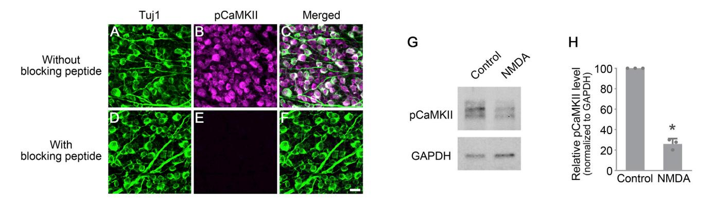

Figure S1. Excitotoxic injury leads to loss of CaMKII activity in RGCs, related to Figure 1

(A-F) Confocal images of retinal whole-mounts showing pCaMKII immunoreactivity in Tuj1-labeled RGCs without (B) or with (E) blocking peptide phosphorylated at Thr286 for CaMKIIα (Thr287 for CaMKIIβ). Scale bar, 20 μm. (G) western blot showing pCaMKII and GAPDH in purified RGCs from uninjured and injured retinas 2 hours after NMDA damage. (H) Relative pCaMKII levels in purified RGCs from uninjured and injured retinas 2 hours after NMDA damage. Data are presented as mean  $\pm$  s.d., n = 3 blots. Unpaired t test, \*p < 0.0001.

CelPress

Cell

Article

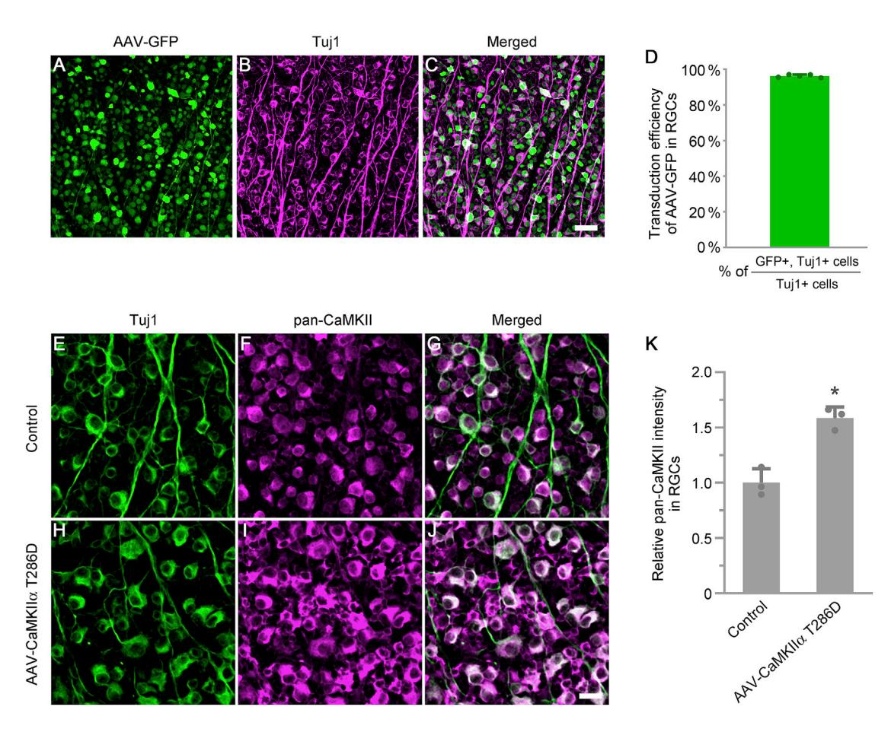

Figure S2. AAV-mediated gene transfer in RGCs, related to Figure 2

(A-C) Confocal images of retinal whole-mounts showing GFP expression in Tuj1+ RGCs two weeks after intravitreal injection of AAV-GFP. Scale bar, 40 µm. (D) Transduction efficiency is expressed as a percentage of GFP+ RGCs in total RGCs. Data are presented as mean  $\pm$  s.d., n = 5 retinas.

(E-J) Confocal images of retinal whole-mounts showing pan-CaMKII levels in RGCs two weeks after injection in control (AAV-EBFP) or AAV-CaMKIIa T286D treated eyes. Scale bar, 20 μm. (K) Quantification of pan-CaMKII intensity in RGCs, normalized to the average intensity in the control condition. Data are presented as mean  $\pm$  s.d., n = 3 retinas per group. Unpaired t test, \*p = 0.0033.

Cell 

Article

CelPress

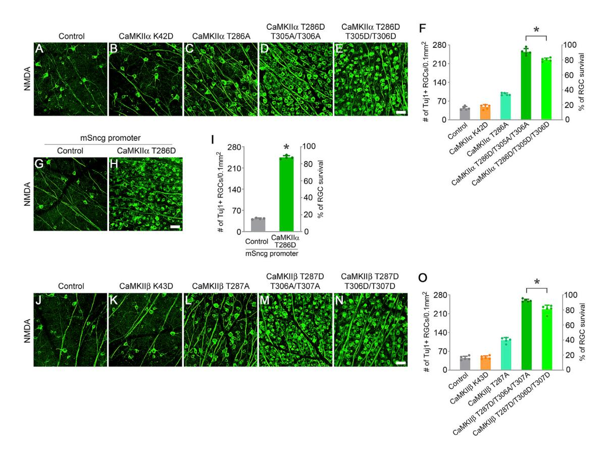

Figure S3. Performance of additional CaMKII variants as well as the RGC-specific promoter mSncg in RGC protection, related to Figure 2

(A-E) Confocal images of retinal whole-mounts showing surviving RGCs labeled by Tuj1 immunoreactivity at 7 days after NMDA injection in control (AAV-EBFP), or AAV-CaMKIIa K42D, AAV-CaMKIIa T286A, AAV-CaMKIIa T286D/T305A/T306A, and AAV-CaMKIIa T286D/T305D/T306D treated eyes. Scale bar, 40 µm.

(F) Quantification of RGC survival after treatment with CaMKII $\alpha$  variants at 7 days post NMDA injection. Data are presented as mean  $\pm$  s.d., n = 5 retinas per group. One-way ANOVA with Tukey's multiple comparisons test, F:761.4,  $R^2$ :0.9935, \*p = 0.0001.

(G-H) Confocal images of retinal whole-mounts showing surviving RGCs labeled by Tuj1 immunoreactivity at 7 days post NMDA injection in control (AAV-mSncg-EBFP) or AAV-mSncg-CaMKII $\alpha$  T286D treated eyes. Scale bar, 40  $\mu$ m.

(I) Quantification of RGC survival at 7 days post NMDA injection. Data are presented as mean  $\pm$  s.d., n = 4 retinas per group. Unpaired t test, \*p < 0.0001.

(J-N) Confocal images of retinal whole-mounts showing surviving RGCs labeled by Tuj1 immunoreactivity at 7 days after NMDA injection in control (AAV-EBFP), or AAV-CaMKIIβ K43D, AAV-CaMKIIβ T287A, AAV-CaMKIIβ T287D/T306A/T307A, and AAV-CaMKIIβ T287D/T306D/T307D treated eyes. Scale bar, 40 μm.

(O) Quantification of RGC survival after treatment with CaMKII $\beta$  variants at 7 days post NMDA injection. Data are presented as mean  $\pm$  s.d., n = 5 retinas per group. One-way ANOVA with Tukey's multiple comparisons test, F:579.0,  $R^2$ :0.9914, \*p = 0.0002.

CelPress

Cell

Article

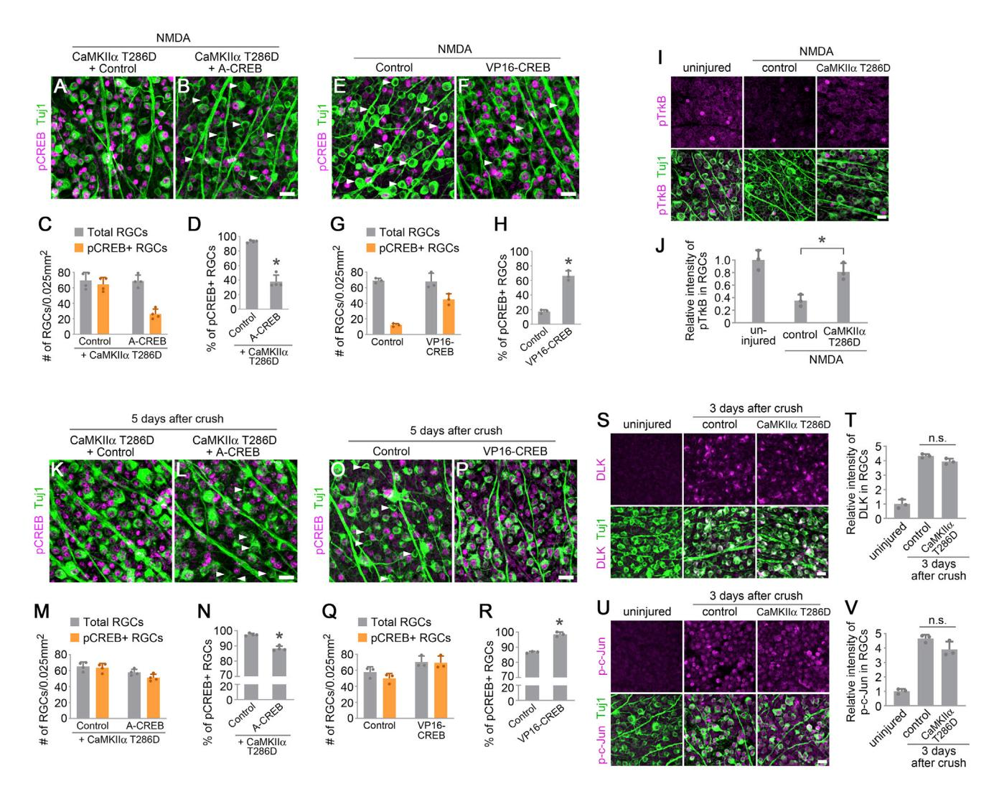

Figure S4. Signaling mechanisms downstream of CaMKII in RGC protection, related to Figure 4

(A-B) Confocal images of retinal whole-mounts showing CREB phosphorylation in RGCs 2 hours after NMDA injection in AAV-CaMKIIa T286D + control (AAV-EBFP), or AAV-CaMKIIα T286D + AAV-A-CREB treated eyes. Arrowheads, Tuj1+ RGCs losing CREB activity. Scale bar, 20 μm.

(C-D) Quantification of CREB phosphorylation in RGCs after excitotoxic injury. (C) The number of total Tuj1+ RGCs and pCREB+/Tuj1+ RGCs 2 hours after NMDA injection. Data are presented as mean ± s.d., n = 4 retinas per group. (D) Percentage of pCREB+/Tuj1+ RGCs 2 hours NMDA injection. Data are presented as mean  $\pm$  s.d., n = 4 retinas per group. Unpaired t test, \*p < 0.0001.

(E-F) Confocal images of retinal whole-mounts showing CREB phosphorylation in RGCs 2 hours after NMDA injection in control (AAV-EBFP) or AAV-VP16-CREB treated eyes. Arrowheads, Tuj1+ RGCs losing CREB activity. Scale bar, 20 µm.

(G-H) Quantification of CREB phosphorylation in RGCs after excitotoxic injury. (G) The number of total Tuj1+ RGCs and pCREB+/Tuj1+ RGCs 2 hours after NMDA injection. Data are presented as mean  $\pm$  s.d., n = 3 retinas per group. (H) Percentage of pCREB+/Tuj1+ RGCs 2 hours NMDA injection. Data are presented as mean  $\pm$  s.d., n = 3 retinas per group. Unpaired t test, \*p = 0.0003.

(I) Confocal images of retinal whole-mounts showing TrkB phosphorylation in RGCs, from uninjured eyes, and 2 hours after NMDA injection in control (AAV-EBFP) or AAV-CaMKII $\alpha$  T286D treated eyes. Scale bar, 20  $\mu$ m. (J) Quantification of pTrkB intensity in RGCs. Data are presented as mean  $\pm$  s.d., n = 3 retinas per group. One-way ANOVA with Tukey's multiple comparisons test, F:19.26,  $R^2$ :0.8652, \*p = 0.0124.

(K-L) Confocal images of retinal whole-mounts showing CREB phosphorylation in RGCs 5 days after optic nerve crush in AAV-CaMKII∞ T286D + control (AAV-EBFP), or AAV-CaMKII∞ T286D + AAV-A-CREB treated eyes. Arrowheads, Tuj1+ RGCs losing CREB activity. Scale bar, 20 µm.

(M-N) Quantification of CREB phosphorylation in RGCs 5 days after nerve injury. (M) The number of total Tuj1+ RGCs and pCREB+/Tuj1+ RGCs 5 days after optic nerve crush. Data are presented as mean  $\pm$  s.d., n = 4 retinas per group. (N) Percentage of pCREB+/Tuj1+ RGCs 5 days after optic nerve crush. Data are presented as mean  $\pm$  s.d., n = 4 retinas per group. Unpaired t test, \*p < 0.0001.

(O-P) Confocal images of retinal whole-mounts showing CREB phosphorylation in RGCs 5 days after optic nerve crush in control (AAV-EBFP) or AAV-VP16-CREB treated eyes. Arrowheads, Tuj1+ RGCs losing CREB activity. Scale bar, 20 µm.

(Q-R) Quantification of CREB phosphorylation in RGCs 5 days after nerve injury. (Q) The number of total Tuj1+ RGCs and pCREB+/Tuj1+ RGCs 5 days after optic nerve crush. Data are presented as mean  $\pm$  s.d., n = 3 retinas per group. (R) Percentage of pCREB+/Tuj1+ RGCs 5 days after optic nerve crush. Data are presented as mean  $\pm$  s.d., n = 3 retinas per group. Unpaired t test, \*p = 0.0002.

(legend continued on next page)

Cell

Article

CelPress

(S) Confocal images of retinal whole-mounts showing DLK staining in RGCs, from uninjured eyes, and 3 days after optic nerve crush in control (AAV-EBFP) or AAV-CaMKII $\alpha$  T286D treated eyes. Scale bar, 20  $\mu$ m. (T) Quantification of DLK intensity in RGCs. Data are presented as mean  $\pm$  s.d., n = 3 retinas per group. Oneway ANOVA with Tukey's multiple comparisons test, F:192.3,  $R^2$ :0.9846, n.s. (not significant, p = 0.18).

(U) Confocal images of retinal whole-mounts showing c-Jun phosphorylation in RGCs, from uninjured eyes, and 3 days after optic nerve crush in control (AAV-EBFP) or AAV-CaMKII $\alpha$  T286D treated eyes. Scale bar, 20  $\mu$ m. (V) Quantification of p-c-Jun intensity in RGCs. Data are presented as mean  $\pm$  s.d., n = 3 retinas per group. One-way ANOVA with Tukey's multiple comparisons test, F:87.73,  $R^2$ :0.9669, n.s. (not significant, p = 0.09).

CelPress

Cell 

Article

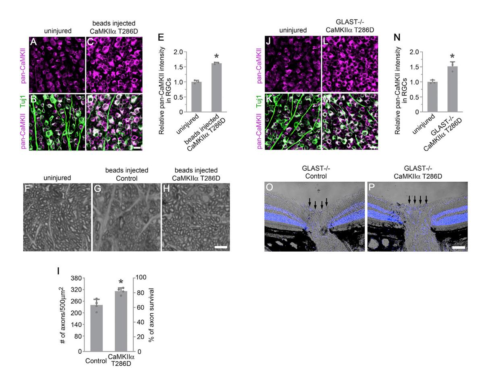

Figure S5. CaMKII-mediated protection of RGC axons in induced and genetic models of glaucoma, related to Figure 5

(A-D) Confocal images of retinal whole-mounts showing pan-CaMKII levels in RGCs of uninjured retinas or 2 weeks after microbeads injection in AAV-CaMKII & T286D treated retinas. Scale bar, 20  $\mu$ m. (E) Quantification of pan-CaMKII intensity in RGCs. Data are presented as mean  $\pm$  s.d., n = 3 retinas per group. Unpaired t test,  $p < 0.0001$ .

(F-H) Light microscope images of semithin sections of optic nerve stained with toluidine blue, from uninjured eyes, and at 2 months after induction of elevated IOP in Control (AAV-EBFP) or AAV-CaMKIIa T286D treated eyes. Scale bar, 4 µm. (I) Quantification of axon survival, expressed as numbers of axons (left y axis), and percentages of axons relative to those in the uninjured eyes (right y axis). Data are presented as mean  $\pm$  s.d., n = 4 nerves per group. Unpaired t test, \*p = 0.0056.

(J-M) Confocal images of retinal whole-mounts showing pan-CaMKII levels in RGCs of uninjured retinas or AAV-CaMKIIα T286D treated retinas of GLAST-/mice at 3 weeks after AAV injection. Scale bar, 20  $\mu$ m. (N) Quantification of pan-CaMKII intensity in RGCs. Data are presented as mean  $\pm$  s.d., n = 3 retinas per group. Unpaired t test,  $*p = 0.0055$ .

(O-P) Sections from 8-month-old GLAST-/- mice showing optic nerve head morphology (bright-field image; grayscale) and nuclear layers stained with DAPI (fluorescence image; blue) in Control (AAV-EBFP) or AAV-CaMKIIa T286D treated eyes. Arrows, Scale bar, 80 µm.

Cell 

Article

CelPress

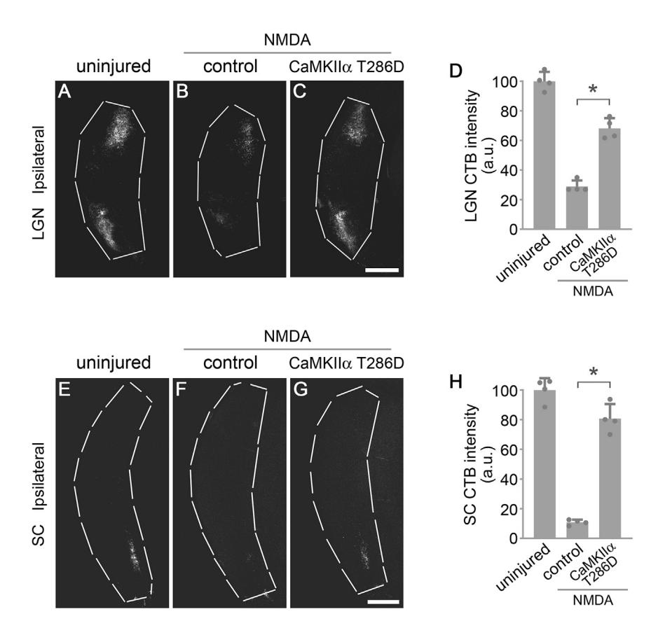

Figure S6. CaMKII reactivation protects RGC axonal projections to the ipsilateral hemisphere, related to Figure 6

(A-C) Confocal images of anterograde CTB tracing of RGC axons projecting to the ipsilateral LGN, from uninjured eyes, and 7 days after NMDA injection in control (PBS) or AAV-CaMKII $\alpha$  T286D treated eyes. Scale bar, 300 μm. (D) Quantification of CTB intensity in the ipsilateral LGN. Data are presented as mean  $\pm$  s.d., n = 4 brains per group. One-way ANOVA with Tukey's multiple comparisons test, F:145.0,  $R^2$ :0.9699, \*p < 0.0001.

(E-G) Confocal images of anterograde CTB tracing of RGC axons projecting to the ipsilateral SC from uninjured eyes, and 7 days after NMDA injection in control (PBS) or AAV-CaMKII $\alpha$  T286D treated eyes. Scale bar, 300 μm. (H) Quantification of CTB intensity in the ipsilateral SC. Data are presented as mean  $\pm$  s.d., n = 4 brains per group. One-way ANOVA with Tukey's multiple comparisons test, F:162.2, R2:0.9730, \*p < 0.0001.