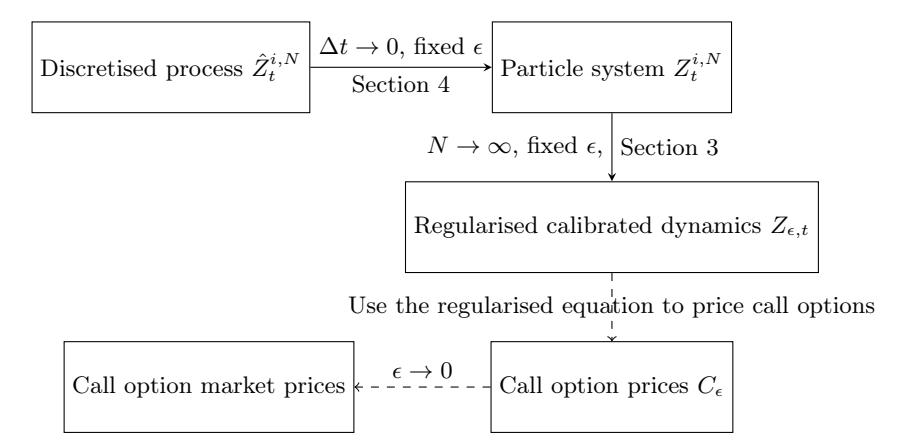

arXiv:2302.00434v1 [q-fin.CP] 1 Feb 2023

# Convergence of the Euler–Maruyama particle scheme for a regularised McKean–Vlasov equation arising from the calibration of local-stochastic volatility models

Christoph Reisinger\* and Maria Olympia Tsianni†

February 2, 2023

Abstract

In this paper, we study the Euler-Maruyama scheme for a particle method to approximate the McKean–Vlasov dynamics of calibrated local-stochastic volatility (LSV) models. Given the open question of well-posedness of the original problem, we work with regularised coefficients and prove that under certain assumptions on the inputs, the regularised model is well-posed. Using this result, we prove the strong convergence of the Euler-Maruyama scheme to the particle system with rate  $1/2$  in the step-size and obtain an explicit dependence of the error on the regularisation parameters. Finally, we implement the particle method for the calibration of a Heston-type LSV model to illustrate the convergence in practice and to investigate how the choice of regularisation parameters affects the accuracy of the calibration.

# 1 Introduction

Since the Black-Scholes (BS) model was first introduced, extensive research in quantitative finance has taken place for the development of more sophisticated models that successfully price and hedge financial instruments. An extension to the BS model is the Local Volatility (LV) model introduced by B. Dupire in [9]. The LV model exactly reproduces any arbitrage free volatility surface, however it has unrealistic dynamics. Another class of more enhanced models are the Stochastic Volatility (SV) models, which generate an implied volatility smile and better describe the market dynamics. However, as parametric models, they only have a finite number of parameters and are therefore unable to capture the entire implied volatility surface. Local-stochastic volatility models (LSV) combine the strengths of both LV and SV models and are the *state-of-the-art* in the finance industry.

For a given time horizon  $[0, T]$ , a general LSV model is of the form

$$
dS_t = S_t \, g(Y_t) \, \sigma(t, S_t) \, dW_t, 
$$

(1)

where  $S_t$  is the current value of the one-dimensional process  $S = (S_t)_{t \in [0,T]}$ , the spot price of the underlying asset, and  $Y_t$  is the current value of the stochastic volatility process  $Y = (Y_t)_{t\in[0,T]}$ . Popular choices for  $(Y_t)_{t\in[0,T]}$  are the exponential Ornstein-Uhlenbeck and the Cox-Ingersoll-Ross processes. Through the stochastic volatility component,  $g(Y_t)$ , the model better captures stylised features of the market dynamics such as volatility clustering and negative correlation between asset price and volatility. Embedding the local volatility  $\sigma(t, S_t)$ brings accuracy to the model as it can exactly calibrate any market observed volatility surface. Indeed, an LSV model is able to better price and hedge options, as studied by several practitioners in the field throughout the years including Guyon and Labordère [\[14\]](#page-9-1) and Ren et al. [\[21\]](#page-9-1).

\*Mathematical Institute, Oxford University, christoph.reisinger@maths.ox.ac.uk

†Mathematical Institute, Oxford University, maria.tsianni@maths.ox.ac.uk

1

In our work, we consider the SDE (1) describing the process  $(S_t)_{t\geq 0}$  under the risk-
neutral measure  $(\mathbb{Q}_t)_{t\geq 0}$ , which supports a two-dimensional Brownian motion  $(W^s, W^y)$  with $dW_t^s dW_t^y = \rho_{S,Y} dt$ , and where  $(Y_t)_{t\geq 0}$  is given by

$$
dY_t = m(\theta - Y_t) dt + \gamma dW_t^y, 
$$

(2)

with parameters  $m > 0, \theta, \gamma$ .

Dupire in [10] uses Gyöngy's result [12] to give a condition for exact calibration of such  $models.$ 

$$
\sigma^2(t, S) = \frac{\sigma_{\text{Dup}}^2(t, S)}{\mathbb{E}^{\mathbb{Q}}[g^2(Y_t)|S_t = S]}, 
$$

(3)

where  $\sigma_{\text{Dup}}(t, S)$  denotes the local volatility and is given by the Dupire formula

$$
\sigma_{\text{Dup}}^2(T,S) = \frac{\frac{\partial C(T,S)}{\partial T}}{\frac{S^2}{2}\frac{\partial^2 C(T,S)}{\partial K^2}},
$$

for given call option prices with maturity  $T$  and strike  $K$  observed in the market, assuming zero interest and dividend rates for simplicity.

The conditional expectation  $\mathbb{E}^{\mathbb{Q}}[g^2(Y_t)|S_t=S]$  creates a dependence of the diffusion coefficient of  $(S_t)_{t\geq0}$  on the underlying joint distribution of  $(S_t, Y_t)$  and therefore leads to a McKean-Vlasov SDE (see H. McKean's seminal work [\[19\]](#page-9-1)). This nonlinear law dependence, and the presence of a conditional expectation in particular, renders the SDE challenging and has led to the development of sophisticated calibration techniques, mainly in two different directions. One is the particle method, introduced for this problem by J. Guyon and P. Henry-Labordère in [\[14\]](#page-9-1), Chapter 11, and the other is the PDE approach, which is based on the solution of the Fokker-Planck equation as in [\[21\]](#page-9-1). Both of these methods require a priori knowledge of the local volatility surface which can be calculated using the Dupire formula. Since there is only a finite number of options available in the market, then ad hoc interpolation of the option prices or the volatility surface is necessary, which can however lead to instabilities and inaccuracies, as explained in [\[11\]](#page-9-1). In a more recent study, C. Cuchiero et al. in [\[5\]](#page-9-1) calibrate LSV models using deep learning. Specifically, the authors use a set of feed-forward neural networks to parameterise the leverage function and calibrate the model using a generative adversarial network approach so that they avoid any kind of interpolation. In this paper, we focus on the Monte Carlo particle method as in [\[14\]](#page-9-1).

Although LSV models are very powerful in pricing and risk-management, the existence and uniqueness of a solution to the calibrated LSV model have not been established to date. The main challenge arises from the leverage function that appears in the diffusion coefficient of the calibrated dynamics, which involves the conditional expectation of a function of the volatility given the value of the process  $S$  and therefore makes the equation nonlinear and nonlocal. The problem has been attempted by several researchers in the field however only partial results so far exist. F. Abergel and R. Tachet in [1] extend the work of Y. Ren et al. in [21] who propose solving the Fokker-Planck equation that the joint probability density of the pair  $(S_t, Y_t)$  satisfies. Specifically, the authors in [1] prove that under certain assumptions and regularisation of the initial condition, and for small enough volatility of volatility  $g(\cdot)$ , a related initial-boundary value problem is well-posed up to a finite maturity  $T^* \leq T$ . Lacker et al., in [18] proved existence and uniqueness to solutions of the type  $(1)$  in the stationary case. Another result from B. Jourdain and A. Zhou in [15] proves existence in the case when the stochastic volatility component is a jump process with a finite number of states. In the more recent study [6], Djete uses Sobolev estimates to prove existence (and a propagation of chaos result) in a class of McKean-Vlasov equations with weak continuity assumptions in the measure variable and deduces the existence of a calibrated LSV model.

In this paper, we work with a regularised formulation of the calibrated dynamics  $(1)$ and prove that under certain assumptions the regularised equation is well-posed. We recently became aware of a related regularisation approach by C. Bayer et al. in [2], employing reproducing kernel Hilbert space (RKHS) techniques, which also gives well-posedness (and propagation of chaos, as in our work).

Equivalently to our initial problem formulation (1), one may consider the dynamics of the process  $(X_t)_{t\in[0,T]} = (\log(S_t))_{t\in[0,T]}$ . By Itô's lemma, we get the SDE describing the

2

dynamics of  $X_t$  under the risk neutral measure  $\mathbb{Q}_t$ :

$$
\mathrm{d}X_t = -\frac{1}{2}g^2(Y_t)\frac{\sigma_{\mathrm{Dup}}^2(t, e^{X_t})}{\mathbb{E}^{\mathbb{Q}}[g^2(Y_t)|X_t]}\,\mathrm{d}t + g(Y_t)\frac{\sigma_{\mathrm{Dup}}(t, e^{X_t})}{\sqrt{\mathbb{E}^{\mathbb{Q}}[g^2(Y_t)|X_t]}}\,\mathrm{d}W_t^x, 
$$

(4)

and  $(W^x, W^y)$  a two-dimensional Brownian motion with  $dW_t^x dW_t^y = \rho_{x,y} dt$ .

In Section 2, we prove the well-posedness of a regularised equation. In Section 3, we present and analyse a particle method, as introduced by Guyon and Henry-Labordére in [\[14\]](#page-1-1). Thereafter, in Section 4 we apply the standard Euler-Maruyama scheme to the particle system, and prove its strong convergence using the results of the Lipschitz-continuity of the drift and diffusion coefficients of the regularised SDE from Section 2. We note that with the regularity results from Section 2, we could deduce the convergence of the time-stepping scheme from results in the literature (see, e.g., [\[17\]](#page-1-1)), however, our direct proof allows us to obtain the dependence of the error on the regularisation parameters explicitly. Finally, in Section 5, we implement the particle method for the calibration of a Heston-type local volatility model and illustrate our results. The diagram below shows the different steps of convergence that we show in our work. The final convergence as  $\epsilon \to 0$  is not analysed in this paper but is currently being explored.

# 2 Existence and uniqueness for a regularised equation

For a given  $T > 0$ , let  $(\Omega, \mathcal{F}, \mathbb{F} = (\mathcal{F}_t)_{t \in [0,T]}, \mathbb{P})$  denote a complete filtered probability space where  $\mathcal{F}$  is the augmented filtration of a standard multidimensional Brownian motion  $(W_t)_{t\in[0,T]}$ . Additionally, let  $(\mathbb{R}^d,\langle\cdot,\cdot\rangle,|\cdot|)$  denote the *d*-dimensional Euclidean space  and  $|\cdot|$  the Hilbert-Schmidt norm,  $\mathcal{P}(\mathbb{R}^d)$  denote the set of all probability measures on the  measurable space  $(\mathbb{R}^d, \mathcal{B}(\mathbb{R}^d))$ , where  $\mathcal{B}(\mathbb{R}^d)$ represents the Borel  $\sigma$ -field over  $\mathbb{R}^d$ , and  $\mathcal{P}_2(\mathbb{R}^d)$  denote the subset of  $\mathcal{P}(\mathbb{R}^d)$  with probability measures with finite second moment so that

$$
\mathcal{P}_2(\mathbb{R}^d) := \{ \mu \in \mathcal{P}(\mathbb{R}^d) \big| \int_{\mathbb{R}^d} |x|^2 \mu(\mathrm{d}x) < \infty \}.
$$

Also, by  $L_0^2(\mathbb{R})$  we denote the space of real-valued,  $\mathcal{F}_0$ -measurable random variables with finite second moments and by  $S^2([0,T])$  the space of  $\mathbb{R}$ -valued,  $\mathbb{F}$ -adapted continuous processes on  $[0, T]$ . The Wasserstein distance  $W_2(\mu,\nu)$  on  $\mathcal{P}_2(\mathbb{R}^d)$  is

$$
\mathcal{W}_2(\mu,\nu) := \inf_{\gamma \in \Gamma(\mu,\nu)} \left( \int_{\mathbb{R}^d \times \mathbb{R}^d} |x-y|^2 \gamma(\mathrm{d}\mu,\mathrm{d}\nu) \right)^{1/2}, 
$$

(5)

where  $\Gamma(\mu,\nu)$  is the set of all couplings between  $\mu$  and  $\nu$ , for  $\mu,\nu \in \mathcal{P}(\mathbb{R}^d)$ , such that  $\gamma \in$  $\Gamma(\mu,\nu)$  has marginals  $\mu$  and  $\nu$ .We introduce a mollifier of the form

$$
\Phi_{\epsilon}(x) = \epsilon^{-1} K\left(\epsilon^{-1}x\right), 
$$

(6)

3

where  $K(\cdot)$  is a real-valued, non-negative kernel function with the normalization and symmetry properties  $\int_{-\infty}^{+\infty} K(u) du = 1$  and  $K(u) = K(-u) \,\forall u$ . To approximate the conditional expectation and avoid potential singularities of the diffusion coefficient at  $0$ , we apply a mollification and add a constant parameter  $\delta$ , as follows:

$$
\tilde{\sigma}_{\epsilon}(t,(x,y),\mu) = g(y)\sigma_{\mathrm{Dup}}(t,e^x) \frac{\sqrt{\mathbb{E}^{\mu}[K(\frac{X_{\epsilon}-x}{\epsilon})] + \delta}}{\sqrt{\mathbb{E}^{\mu}[g^2(Y_{\epsilon})K(\frac{X_{\epsilon}-x}{\epsilon})] + \delta}}, \quad \tilde{b}_{\epsilon} = -\tilde{\sigma}_{\epsilon}^2/2.
$$

The system of processes that approximate the original SDE  $(4)$  is therefore

$$
dX_{\epsilon,t} = \tilde{b}_{\epsilon}(t,(X_{\epsilon,t},Y_{\epsilon,t}),\mu_t) dt + \tilde{\sigma}_{\epsilon}(t,(X_{\epsilon,t},Y_{\epsilon,t}),\mu_t) dW_t^x,
$$

$$
dY_{\epsilon,t} = m(\theta - Y_{\epsilon,t}) dt + \gamma dW_t^y.
$$

(7)

## Assumptions A

**A1.** The function  $g(\cdot)$  is bounded, continuous and differentiable with bounded first derivative, i.e. for all  $y \in \mathbb{R}$ ,  $|g(y)| \leq A_1$  and  $|g'(y)| \leq \tilde{A}_1$  for constants  $A_1, \tilde{A}_1$ .

**A2.**  $|\sigma_{\text{Dup}}(t,\cdot)| \leq A_2$  for  $A_2$  constant, for all  $t \in [0,T]$ .

**A3.** The kernel function  $K(.)$  is bounded, continuous and differentiable with bounded derivative, i.e., for all  $x \in \mathbb{R}$ ,  $|K(x)| \leq A_3$  and  $|K'(x)| \leq \tilde{A}_3$ , for constants  $A_3, \tilde{A}_3$ .

**A4.** The local volatility  $(t,x) \to \sigma_{\text{Dup}}(t,e^x)$  is Lipschitz in  $x$  and  $\frac{1}{2}$ -Hölder in  $t$  so that for  $L_{\text{Dup}}$  a constant and for all  $x_1, x_2 \in \mathbb{R}$  and  $t_1, t_2 \in [0, T]$ ,

$$
\left|\sigma_{\text{Dup}}(t_1,e^{x_1}) - \sigma_{\text{Dup}}(t_2,e^{x_2})\right| \leq L_{\text{Dup}}\big(|t_1 - t_2|^{1/2} + |x_1 - x_2|\big).
$$

We keep  $\epsilon$  and  $\delta$  fixed and only show that Lipschitz-continuity and linear growth conditions hold for  $\tilde{\sigma}_{\epsilon}$ , as the proof for  $\tilde{b}_{\epsilon}$  follows from similar arguments.

**Lemma 1.** There exists  $M_1 > 0$  such that for any  $\mu, \nu \in \mathcal{P}_2(\mathbb{R}^2)$ , $\epsilon > 0$ , and  $x_1 \in \mathbb{R}$ ,

$$
\left| \mathbb{E}^{\mu}[g^2(Y)K(\frac{X-x_1}{\epsilon})] - \mathbb{E}^{\nu}[g^2(Y)K(\frac{X-x_1}{\epsilon})] \right| \leq \frac{M_1}{\epsilon} \mathcal{W}_2(\mu,\nu).
$$

*Proof.* Let  $\Gamma(\cdot,\cdot)$  denote an arbitrary coupling between  $\mu(\cdot)$  and  $\nu(\cdot)$  with  $\Gamma(\mu,\nu)$  the set of all such couplings. Also, let  $z := (x_z, y_z), w := (x_w, y_w) \in \mathbb{R}^2$ . Then

$$
\begin{split} & \left| \mathbb{E}^{\mu} [g^{2}(Y) K(\frac{X - x_{1}}{\epsilon})] - \mathbb{E}^{\nu} [g^{2}(Y) K(\frac{X - x_{1}}{\epsilon})] \right| \\ &= \left| \iint_{\mathbb{R} \times \mathbb{R}} g^{2}(y) K(\frac{x - x_{1}}{\epsilon}) \mu(\mathrm{d}x, \mathrm{d}y) - \iint_{\mathbb{R} \times \mathbb{R}} g^{2}(y) K(\frac{x - x_{1}}{\epsilon}) \nu(\mathrm{d}x, \mathrm{d}y) \right| \\ & \leq \iint_{\mathbb{R}^{2} \times \mathbb{R}^{2}} \left| g^{2}(y_{z}) K(\frac{x_{z} - x_{1}}{\epsilon}) - g^{2}(y_{w}) K(\frac{x_{w} - x_{1}}{\epsilon}) \right| \Gamma(\mathrm{d}z, \mathrm{d}w). \end{split}
$$
 
(8)

Let  $f(x, y) := g^2(y)K(\frac{x-x_1}{\epsilon})$ , then by **A1.** and **A3.** there exists  $M_1$  such that  $|f(z) - f(w)| \leq M_1/\epsilon |z-w|$ . Substituting into (8), by Cauchy–Schwarz,

$$
\left| \mathbb{E}^{\mu}[g^{2}(Y)K(\frac{X-x_{1}}{\epsilon})] - \mathbb{E}^{\nu}[g^{2}(Y)K(\frac{X-x_{1}}{\epsilon})] \right| \leq \frac{M_{1}}{\epsilon} \bigg( \iint_{\mathbb{R}^{2}\times\mathbb{R}^{2}} \left|z-w\right|^{2} \Gamma(\mathrm{d}z,\mathrm{d}w) \bigg)^{1/2}.
$$

Since the last bound holds for every coupling  $\Gamma \in \Gamma(\mu, \nu)$ ,

$$
\left| \mathbb{E}^{\mu} \left[g^{2}(Y) K\left(\frac{X - x_{1}}{\epsilon}\right)\right] - \mathbb{E}^{\nu} \left[g^{2}(Y) K\left(\frac{X - x_{1}}{\epsilon}\right)\right] \right| \leq \frac{M_{1}}{\epsilon} \left( \inf_{\Gamma \in \Gamma_{\mu,\nu}} \iint_{\mathbb{R}^{2} \times \mathbb{R}^{2}} |z - w|^{2} \Gamma(\mathrm{d}z, \mathrm{d}w) \right)^{1/2} = \frac{M_{1}}{\epsilon} W_{2}(\mu,\nu),
$$

by the definition of the Wasserstein metric.  $$\Box$$

The proof of Proposition 1, which requires a lot of elementary, lengthy calculus, is found in the appendix.

4

**Proposition 1.** Let  $\tilde{b}_{\epsilon}: [0,T] \times \mathbb{R}^2 \times \mathcal{P}(\mathbb{R}^2) \to \mathbb{R}$  and  $\tilde{\sigma}_{\epsilon}: [0,T] \times \mathbb{R}^2 \times \mathcal{P}(\mathbb{R}^2) \to \mathbb{R}$  be the drift and diffusion coefficients of process  $X_{\epsilon}$  of equation (7). Under assumptions A1.-A4., there exists a positive constant L such that  $\forall t, t_1, t_2 \in [0,T], \ \forall (x,y), (x_1,y_1), (x_2,y_2) \in \mathbb{R}^2$ , and  $\forall \mu, \nu \in \mathcal{P}_2(\mathbb{R}^2)$ , we have that

(i) 
$$
|\tilde{b}_{\epsilon}(t_1, (x_1, y_1), \mu) - \tilde{b}_{\epsilon}(t_2, (x_2, y_2), \nu)| + |\tilde{\sigma}_{\epsilon}(t_1, (x_1, y_1), \mu) - \tilde{\sigma}_{\epsilon}(t_2, (x_2, y_2), \nu)| \leq L \left( |t_1 - t_2|^{1/2} + |x_1 - x_2| + |y_1 - y_2| + W_2(\mu, \nu) \right)
$$

(ii) 
$$
|\tilde{b}_{\epsilon}(t, (x, y), \mu)| + |\tilde{\sigma}_{\epsilon}(t, (x, y), \mu)| \leq L(1 + |x| + |y|).
$$

**Corollary 1.** In the setting of Proposition 1, there exist  $C_1$ ,  $C_2$ ,  $C_3$  and  $C_4$  such that

$$
\left|\tilde{\sigma}_{\epsilon}(t_{1},(x_{1},y_{1}),\mu)-\tilde{\sigma}_{\epsilon}(t_{2},(x_{2},y_{2}),\nu)\right| \leq C_{1}\mathcal{W}_{2}(\mu,\nu)+C_{2}|x_{1}-x_{2}|+C_{3}|y_{1}-y_{2}|+C_{4}|t_{1}-t_{2}|^{1/2},
$$

where  $C_1 = O(\frac{1}{\epsilon}), C_2 = O(\frac{1}{\epsilon\delta^2}), C_3 = O(\frac{1}{\sqrt{\delta}}), \text{ and } C_4 = O(\frac{1}{\sqrt{\delta}}).$ 

## Assumptions B

**B1.**  $(X_{\epsilon,0}, Y_{\epsilon,0}) \in L^p(\mathcal{F}_0; \mathbb{R}^2; \mathbb{P}), \ p \ge 2$ , is independent of the Brownian motion.  

**B2.**  $\mathbb{E}\left[\left(\int_0^T |b_{\epsilon}(t,0,\mu_0)| \,\mathrm{d}t\right)^2\right] + \mathbb{E}\left[\left(\int_0^T |\sigma_{\epsilon}(t,0,\mu_0)| \,\mathrm{d}t\right)^2\right] < \infty.$ 

**Theorem 1.** Under assumptions  $A1$ – $A4$ ,  $B1$  and  $B2$ , there exists a unique solution  $(X_{\epsilon}, Y_{\epsilon}) \in \mathcal{S}^2([0, T])$  to (7).

*Proof.* It is clear that the drift and diffusion coefficients of process  $Y$  in (7) are Lipschitz continuous with respect to the state variable, satisfy the linear growth condition and are  $\frac{1}{2}$ -Hölder in time. Then the result follows from Theorem 3.1 in [\[8\]](#page-8-1), and the Lipschitz-continuity proved in Proposition 1.  $\Box$ 

# 3 Particle method and propagation of chaos

To simulate the McKean-Vlasov SDE (4) that describes the dynamics of the log process  $X$ , we approximate the conditional expectation term  $\mathbb{E}[g^2(Y)|X = x]$  using the particle method as introduced in [\[14\]](#page-9-1). We refer to [\[3\]](#page-9-1) for the particle method and a time stepping scheme for generic McKean-Vlasov equations.generic McKean–Vlasov equations.

Let  $(\mathbf{X}_{t}^{N})_{t\in[0,T]} := (X_{t}^{1,N}, X_{t}^{2,N}, ..., X_{t}^{N,N})^{\mathsf{T}}$  denote the interacting particle system,and  $(\mathbf{Y}_{t}^{N})_{t\in[0,T]} := (Y_{t}^{1,N}, Y_{t}^{2,N}, ..., Y_{t}^{N,N})^{\mathsf{T}}$  independent Monte Carlo samples. We follow [\[14\]](#page-9-1) to use the Nadaraya–Watson estimator

$$
\mathbb{E}[g^{2}(Y)|X=x] \approx \frac{\frac{1}{N}\sum_{i=1}^{N}g^{2}(Y^{i,N})\Phi_{\epsilon}(X^{i,N}-x)}{\frac{1}{N}\sum_{i=1}^{N}\Phi_{\epsilon}(X^{i,N}-x)}, 
$$

(9)

where  $\Phi_{\epsilon}(\cdot)$  is a regularizing kernel function of the form (6). Here, the true measure  $\mu_t$  of the joint law of  $(X_t, Y_t)$  is approximated by  $\mu_t^{(\mathbf{X}_t^N, \mathbf{Y}_t^N)}$ , where

$$
\begin{aligned} dX^{i,N}_{t} &= b_{N}(t,(X^{i,N}_{t},Y^{i,N}_{t}),\boldsymbol{\mu}^{(\mathbf{X}^{N}_{t},\mathbf{Y}^{N}_{t})}_{t})dt + \sigma_{N}(t,(X^{i,N}_{t},Y^{i,N}_{t}),\boldsymbol{\mu}^{(\mathbf{X}^{N}_{t},\mathbf{Y}^{N}_{t})}_{t})dW^{x,i}_{t}, \\ dY^{i,N}_{t} &= m(\theta-Y^{i,N}_{t})dt + \gamma dW^{y,i}_{t}, \end{aligned} (10)
$$

(10)

with

$$
\sigma_N(t, (X_t^{i,N}, Y_t^{i,N}), \mu_t^{(\mathbf{X}_t^N, \mathbf{Y}_t^N)}) = g(Y_t^{i,N}) \,\sigma_{\text{Dup}}(t, X_t^{i,N}) \frac{\sqrt{\sum_{j=1}^N \Phi_\epsilon(X_t^{j,N} - X_t^{i,N})}}{\sqrt{\sum_{j=1}^N g^2(Y_t^{j,N}) \Phi_\epsilon(X_t^{j,N} - X_t^{i,N})}},
$$

$b_N = -\sigma_N^2/2$ , with  $dW_t^{x,i} dW_t^{y,i} = \rho_{X,Y} dt$  and withv independent  $(X_0^{i,N}, Y_0^{i,N})$ .  

The interaction term  $\mu_t^{(\mathbf{X}_t^N, \mathbf{Y}_t^N)}$  distinguishes the particle method from the classical MonteThe interaction term  $\mu_t^{(H_t, T_t)}$  distinguishes the particle method from the classical Monte Carlo method, since the paths in the former are no longer independent. The particle method

5

is only useful if it converges to the McKean-Vlasov SDE describing the dynamics of the regularised calibrated LSV model. We will study strong propagation of chaos below.Using the general assumptions and the regularity of the coefficients proved in Proposition 1, the following is a direct consequence of [\[7\]](#page-n-0), Proposition 3.1.

**Proposition 2.** Let  $(X_t^{i,N})$  be the solution to equation (10) and  $X_{\epsilon,t}^i$  be solutions to (7) driven by the respective Brownian motions  $(W^{x,i}, W^{y,i})$ . Then under assumptions **A1-A4**, **B1** with  $p \ge 4$  and **B2**,

 $\sup_{i\in\{1,\ldots,N\}} \mathbb{E} \Bigg[\sup_{t\in[0,\ldots,T]}|X^{i,N}_t-X^i_{\epsilon,t}|^2\Bigg] \leq CN^{-\frac{1}{2}}.$ 

# 4 Convergence of an Euler–Maruyama scheme

To simulate (10), we use the classical Euler-Maruyama scheme with  $M$  uniform time-steps of width  $\Delta t = T/M$ . Specifically, let  $\{t_0 = 0, t_1, t_2, ..., t_M = T\}$  denote the time discretisation of [0, T] so that  $t_m = m\Delta t$  and for  $m \in \{0, 1, ..., M - 1\}$ ,

$$
X_{t_{m+1}}^{i,N,M} = X_{t_{m}}^{i,N,M} + b_{N}(t_{m}, (X_{t_{m}}^{i,N,M}, Y_{t_{m}}^{i,N,M}), \mu_{t}^{(\mathbf{X}_{t}^{N}, \mathbf{Y}_{t}^{N})}) \Delta t +
$$
  
$$
+ \sigma_{N}(t_{m}, (X_{t_{m}}^{i,N,M}, Y_{t_{m}}^{i,N,M}), \mu_{t}^{(\mathbf{X}_{t}^{N}, \mathbf{Y}_{t}^{N})}) \Delta W_{t_{m}}^{x,i}, \quad X_{0}^{i,N,M} = X_{0}^{i} \in \mathbb{R}, 
$$

$$
Y_{t_{m+1}}^{i,N,M} = Y_{t_{m}}^{i,N,M} + m(\theta - Y_{t_{m}}^{i,N,M}) \Delta t + \gamma \Delta W_{t_{m}}^{y,i}, \qquad Y_{0}^{i,N,M} = Y_{0}^{i} \in \mathbb{R},
$$

(11)

where  $\Delta W_{t_m}^{i} = W_{t_{m+1}}^{i} - W_{t_m}^{i}$ , that is  $\Delta W_{t_m}^{i} \sim N(0,\Delta t)$ , and increments  $\Delta W_{t_m}^{x,i}, \Delta W_{t_m}^{y,i}$  have correlation  $\rho_{x,y}$ .

It is well-established (see, e.g., [\[17\]](#page-1-1)) that for a classical SDE with Lipschitz-regular drift and diffusion coefficients, the standard explicit Euler-Maruyama scheme converges strongly with order  $1/2$  in the step-size. For particle approximations to McKean–Vlasov equations, the exchangeability and assumed regularity in the measure component allows for error bounds of order  $1/2$  that are independent of N, as shown, e.g., in [\[7\]](#page-1-1).

We now revisit this result and prove the strong convergence of the explicit Euler-Maruyama scheme for the particle system dynamics (10) to find the exact relationship between the rate of convergence and the regularisation parameters  $\epsilon$  and  $\delta$ . To prove the results below, we use the Lipschitz-regularity of the drift and diffusion coefficients in the state and measure variables that we proved for equation (7).

We first introduce the continuous-time version of the discretised process defined in (11). Let  $m_t := \max\{m \in \{0, ..., M-1\} : t_m \leq t\}$ ,  $t' := \max\{t_m, m \in \{0, ..., M-1\} : t_m \leq t\}$ :  $Z_t := (X_t, Y_t), W_t := (W^x, W^y), \text{ and } \mu_t^{\hat{\mathbf{Z}}^N} \text{ denote the law of } \hat{\mathbf{Z}}^N. \text{ For } t \in [0, T], \text{ we define the }$ continuous-time process by

$$
\mathrm{d}\hat{Z}^{i,N}_t = b_N(t', \tilde{Z}^{i,N}_t, \mu^{\tilde{\mathbf{Z}}^N}_t) \,\mathrm{d}t + \sigma_N(t', \tilde{Z}^{i,N}_t, \mu^{\tilde{\mathbf{Z}}^N}_t) \,\mathrm{d}W^i_t, 
$$

(12)

where  $\tilde{Z}^{i,N}_{t}$  :=  $\hat{Z}^{i,N}_{t'}$  is a piecewise constant process, and  $\mu^{\tilde{Z}^{N}}_{t}$  :=  $\mu^{\hat{Z}^{N}}_{t'}$  is the associated approximation to the true measure.

The proofs of Theorem 2, Proposition 3 and Proposition 4 follow the procedure from [\[20\]](#page-2-2) and [\[7\]](#page-2-1), but keep track of the dependence of all bounds on the Lipschitz constant from Proposition 1 and hence on the regularisation parameters  $\epsilon$  and  $\delta$ .

The proofs of Propositions  $3$  and  $4$  are found in the appendix.

**Proposition 3** (One-step estimate). Let  $\hat{Z}^{i,N}_t$  be the solution to (12) and  $Z_0 \in L_0^2(\mathbb{R}^2)$ . Under assumptions **A1.-A4.**, **B1.** and **B2.**, there exist positive constants  $C_L = O(L^4e^{L^2}), L = O(\frac{1}{\epsilon \delta^2})$ , such that

$$
\mathbb{E}\bigg[\sup_{s\in[0,t]}|\hat{Z}_s^{i,N}-\hat{Z}_{s'}^{i,N}|^2\bigg] \leq C_L\Delta t.  
$$

(13)

6

**Proposition 4** (Moment stability). Let  $\hat{Z}^{i,N}_t$  be the solution to (12) and  $Z_0 \in L^2_0(\mathbb{R}^2)$ . Under assumptions **A1.-A4.**, **B1.** and **B2.**, there exist positive constants  $\tilde{C} = O(L^2 e^{L^2})$ ,  $L = O(\frac{1}{\epsilon \delta^2})$ , such that

$$
\max_{i \in \{1, \dots, N\}} \mathbb{E} \Bigg[ \sup_{t \in [0,T]} |\hat{Z}_t^{i,N}|^2 \Bigg] \le \tilde{C}.
$$

**Theorem 2** (Strong convergence of Euler–Maruyama scheme). Let  $Z^{i,N} = (X^{i,N}, Y^{i,N})$  be the solution to (10) and  $\hat{Z}^{i,N}$  the solution to (12). Also, let  $Z_0 \in L_0^2(\mathbb{R}^2)$ . Under assumptions  A1.-A4., B1. and B2., there exists positive constants  $C = O(L^6e^{2L^2})$ ,  $L = O(\frac{1}{\epsilon \delta^2})$  such that

$$
\max_{i \in \{1, \dots, N\}} \mathbb{E} \left[ \sup_{t \in [0,T]} \left| \hat{Z}_t^{i,N} - Z_t^{i,N} \right|^2 \right] \le C \Delta t.
$$

*Proof.* Let  $E_t^i := \hat{Z}_t^{i,N} - Z_t^{i,N}$  so that it satisfies the SDE:

$$
\begin{split} \mathrm{d}E^{i}_{t} &= \big(b_{N}(t', \tilde{Z}^{i,N}_{t}, \mu^{\tilde{\mathbf{Z}}^{N}}_{t}) - b_{N}(t, Z^{i,N}_{t}, \mu^{\mathbf{Z}^{N}}_{t})\big) \,\mathrm{d}t + \\ &+ \big(\sigma_{N}(t', \tilde{Z}^{i,N}_{t}, \mu^{\tilde{\mathbf{Z}}^{N}}_{t}) - \sigma_{N}(t, Z^{i,N}_{t}, \mu^{\mathbf{Z}^{N}}_{t})\big) \,\mathrm{d}W^{i}_{t}. \end{split}
$$

By Itô's lemma we have that

$$
\begin{split} |E^i_t|^2 &= 2 \int_0^t \langle E^i_s, (b_N(s', \tilde{Z}^{i,N}_s, \mu^{\tilde{\mathbf{Z}}^N}_s) - b_N(s, Z^{i,N}_s, \mu^{\mathbf{Z}^N}_s)) \rangle \,\mathrm{d}s \\ &+ 2 \int_0^t \langle E^i_s, \left( \sigma_N(s', \tilde{Z}^{i,N}_s, \mu^{\tilde{\mathbf{Z}}^N}_s) - \sigma_N(s, Z^{i,N}_s, \mu^{\mathbf{Z}^N}_s) \right) \mathrm{d}W^i_s \rangle \\ &+ \int_0^t |\sigma_N(s', \tilde{Z}^{i,N}_s, \mu^{\tilde{\mathbf{Z}}^N}_s) - \sigma_N(s, Z^{i,N}_s, \mu^{\mathbf{Z}^N}_s)|^2 \,\mathrm{d}s. \end{split}  
$$

(14)

Using the inequality  $(a+b)^2 \le 2a^2 + 2b^2$  and Proposition 1, we have that

$$
|\sigma_{N}(s',\tilde{Z}_{s}^{i,N},\mu_{s}^{\tilde{Z}^{N}}) - \sigma_{N}(s,Z_{s}^{i,N},\mu_{s}^{Z^{N}})|^{2}
$$

$$
\leq 2|\sigma(s',\tilde{Z}_{s}^{i,N},\mu_{s}^{\tilde{Z}^{N}}) - \sigma_{N}(s,\tilde{Z}_{s}^{i,N},\mu_{s}^{\tilde{Z}^{N}})|^{2} + 2|\sigma_{N}(s,\tilde{Z}_{s}^{i,N},\mu_{s}^{\tilde{Z}^{N}}) - \sigma_{N}(s,Z_{s}^{i,N},\mu_{s}^{Z^{N}})|^{2}
$$

$$
\leq 2L^{2}|s'-s| + 2L^{2}(|\tilde{Z}_{s}^{i,N} - Z_{s}^{i,N}| + W_{2}(\mu_{s}^{\tilde{Z}^{N}},\mu_{s}^{Z^{N}}))^{2}
$$

$$
\leq 2L^{2}\Delta t + 8L^{2}(|\tilde{Z}_{s}^{i,N} - \hat{Z}_{s}^{i,N}|^{2} + |E_{s}^{i}|^{2} + \frac{1}{N}\sum_{j=1}^{N}|\tilde{Z}_{s}^{j,N} - \hat{Z}_{s}^{j,N}|^{2} + \frac{1}{N}\sum_{j=1}^{N}|E_{s}^{j}|^{2}),  
$$

(15)

where we used the triangle inequality for  $W_2(\mu,\nu)$  (see, e.g., [\[23\]](#page-9-1)) and its standard bound $W_2(\mu_s^{\tilde{\mathbf{Z}}^N}, \mu_s^{\hat{\mathbf{Z}}^N}) \leq \left(\frac{1}{N} \sum_{j=1}^N |\tilde{Z}_s^{j,N} - \hat{Z}_s^{j,N}|^2\right)^{1/2}$ . Using the one-step estimate from Proposition3, we get that for a constant  $A > 0$ 

$$
\mathbb{E}\Bigg[\sup_{s\in[0,t]} |\sigma_N(s', \tilde{Z}_s^{i,N}, \mu_s^{\tilde{\mathbf{Z}}^N}) - \sigma_N(s, Z_s^{i,N}, \mu_s^{\mathbf{Z}^N})|^2\Bigg] \leq
$$

$$
\leq AL^2 \Delta t + 8L^2 \mathbb{E}\Big[\sup_{s\in[0,t]} |E_s^i|^2\Big] + 8L^2 \mathbb{E}\Big[\sup_{s\in[0,t]} \frac{1}{N} \sum_{j=1}^N |E_s^j|^2\Big]
$$

(16)

Returning to (14), by the Burkholder-Davis-Gundy inequality, for a constant  $C_L > 0$ ,  $C_L =

7
 
$$
O(L^{2}),
$$

$$
\mathbb{E}\bigg[\sup_{s\in[0,t]}\bigg|\int_{0}^{s}\langle E_{u}^{i},(\sigma_{N}(u',\tilde{Z}_{u}^{i,N},\mu_{u}^{\tilde{Z}^{N}})-\sigma_{N}(u,Z_{u}^{i,N},\mu_{u}^{Z^{N}}))dW_{u}^{i}\rangle\bigg|\bigg]\leq
$$

$$
C_{L}\mathbb{E}\bigg[\int_{0}^{t}E_{s}^{i}\cdot\bigg(|s'-s|^{1/2}+|\tilde{Z}_{s}^{i,N}-Z_{s}^{i,N}|+W_{2}(\mu_{s}^{\tilde{Z}^{N}},\mu_{s}^{Z^{N}})\bigg)ds\bigg]
$$

$$
\leq C_{L}\mathbb{E}\bigg[\int_{0}^{t}\bigg(\frac{1}{2}|E_{s}^{i}|^{2}+\frac{1}{2}\bigg(|s'-s|^{1/2}+|\tilde{Z}_{s}^{i,N}-Z_{s}^{i,N}|+W_{2}(\mu_{s}^{\tilde{Z}^{N}},\mu_{s}^{Z^{N}})\bigg)^{2}\bigg)ds\bigg]
$$

$$
\leq C_{L}\mathbb{E}\bigg[\int_{0}^{t}\bigg(\frac{1}{2}|E_{s}^{i}|^{2}+\frac{3}{2}|s'-s|+\frac{3}{2}|\tilde{Z}_{s}^{i,N}-Z_{s}^{i,N}|^{2}+\frac{3}{2}W_{2}(\mu_{s}^{\tilde{Z}^{N}},\mu_{s}^{Z^{N}})^{2}\bigg)ds\bigg]
$$

$$
\leq C_{L}\mathbb{E}\bigg[\int_{0}^{t}\bigg(\frac{1}{2}|E_{s}^{i}|^{2}+\frac{3}{2}\Delta t+3|\tilde{Z}_{s}^{i,N}-\hat{Z}_{s}^{i,N}|^{2}+3|\hat{Z}_{s}^{i,N}-Z_{s}^{i,N}|^{2}+ \frac{3}{2}W_{2}(\mu_{s}^{\tilde{Z}^{N}},\mu_{s}^{Z^{N}})^{2}\bigg)ds\bigg]
$$

$$
\leq C_{L}\mathbb{E}\bigg[\frac{3}{2}t\Delta t+\int_{0}^{t}\bigg(\frac{7}{2}|E_{s}^{i}|^{2}+3|\tilde{Z}_{s}^{i,N}-\hat{Z}_{s}^{i,N}|^{2}+\frac{3}{N}\sum_{j=1}^{N}|\tilde{Z}_{s}^{j,N}-\hat{Z}_{s}^{j,N}|^{2}+\frac{3}{N}\sum_{j=1}^{N}|E_{s}^{j}|^{2}\bigg)ds\bigg]
$$

Noting that processes  $Z^j$  are identically distributed and  $\mathbb{E}[|\tilde{Z}_s^{j,N} - \hat{Z}_s^{j,N}|^2]$  are of order  $\Delta t$ , by the linearity of expectation, there exists a positive constant  $C = O(L^2)$  such that

$$
\max_{i \in \{1,..,N\}} \mathbb{E} \Bigg[ \sup_{s \in [0,t]} \Big| \int_0^s \langle E_u^i, (\sigma(u', \tilde{Z}_u^{i, N}, \mu_u^{\tilde{\mathbf{Z}}^N}) - \sigma_N(u, Z_u^{i, N}, \mu_u^{\mathbf{Z}^N})) \, dW_u^i \rangle \Big| \Bigg]
$$
  
$$
\leq Ct\Delta t + C \max_{i \in \{1,..,N\}} \mathbb{E} \Bigg[ \int_0^t (|E_s^i|^2) \, ds \Bigg].
$$

We now consider the first term of equation (14). For the Lipschitz constant  $L$ ,

$$
\langle E_s^i, (b_N(s', \tilde{Z}_s^{i,N}, \mu_u^{\tilde{Z}^N}) - b_N(s, Z_s^{i,N}, \mu_u^{Z^N})) \rangle \leq L E_s^i |\tilde{Z}_s^{i,N} - \hat{Z}_s^{i,N}| + L E_s^i |\hat{Z}_s^{i,N} - Z_s^{i,N}| + L E_s^i |s' - s|^{1/2} + L E_s^i \mathcal{W}_2(\mu_s^{\tilde{Z}^N}, \mu_s^{\hat{Z}^N}) + L E_s^i \mathcal{W}_2(\mu_s^{\hat{Z}^N}, \mu_s^{Z^N})
$$

$$
\leq \frac{L}{2} \bigg( 6 |E_s^i|^2 + |\tilde{Z}_s^{i,N} - \hat{Z}_s^{i,N}|^2 + |s' - s| + \frac{1}{N} \sum_{j=1}^N |\tilde{Z}_s^{i,N} - \hat{Z}_s^{i,N}|^2 + \frac{1}{N} \sum_{j=1}^N |E_s^j|^2 \bigg),
$$

which follows by  $|s'-s| \leq \Delta t$ . Now using the one-step estimate of  $|\tilde{Z}^{i,N}_s - \hat{Z}^{i,N}_s|^2$  proved in Proposition 3, we have that for constants  $\tilde{C}_1, \tilde{C}_2 > 0$ ,

$$
\max_{i \in \{1, \dots, N\}} \mathbb{E} \bigg[ \sup_{s \in [0, t]} 2 \int_0^t \langle E_s^i, (b_N(s', \tilde{Z}_s^{i, N}) - b_N(s, Z_s^{i, N})) \rangle \, \mathrm{d}s \bigg]$$
$$\leq \tilde{C}_1 t \Delta t + \tilde{C}_2 \max_{i \in \{1, \dots, N\}} \mathbb{E} \bigg[ \sup_{s \in [0, t]} \int_0^t |E_s^i|^2 \, \mathrm{d}s \bigg].
$$

Substituting the above bounds back into equation  $(14)$ ,

$$
\begin{split} & \max_{i \in \{1,..,N\}} \mathbb{E} \bigg[ \sup_{s \in [0,t]} |E_s^i|^2 \bigg] \leq \tilde{C}_1 t \Delta t + \tilde{C}_2 \max_i \mathbb{E} \bigg[ \int_0^t \sup_{u \in [0,s]} |E_u^i|^2 \, \mathrm{d}s \bigg] + Ct \Delta t + \\ & + C \max_i \mathbb{E} \bigg[ \int_0^t \sup_{u \in [0,s]} |E_u^i|^2 \, \mathrm{d}s \bigg] + \int_0^t \left( A L^2 \Delta t + 16 L^2 \max_i \mathbb{E} \bigg[ \sup_{u \in [0,s]} |E_u^i|^2 \bigg] \right) \mathrm{d}s \\ & \leq \tilde{K}_1 t \Delta t + \tilde{K}_2 \int_0^t \max_{i \in \{1,..,N\}} \mathbb{E} \bigg[ \sup_{u \in [0,s]} |E_u^i|^2 \bigg] \, \mathrm{d}s, \end{split}
$$

where  $\tilde{K}_1$  and  $\tilde{K}_2$  are positive constants of order  $L^6 e^{L^2}$  and  $L^2$  respectively. Therefore, by a direct application of Grönwall's inequality, since  $\tilde{K}_2$  is non-negative and  $\tilde{K}_1 t \Delta t$  is non-decreasing, then for  $t \in [0, T]$ ,

$$
\max_{i \in \{1, \dots, N\}} \mathbb{E} \bigg[ \sup_{s \in [0, t]} |E_t^i|^2 \bigg] \le \tilde{K}_1 t \Delta t e^{\int_0^t \tilde{K}_2 ds} \le C \Delta t,  
$$

(17)

8

where  $C = O(L^6 e^{2L^2})$  and  $L$  denotes the Lipschitz constant such that  $L = \max\{C_1, C_2, C_3, C_4\} = O(\frac{1}{\epsilon \delta^2})$ , for constants  $C_1, C_2, C_3, C_4$  as in Corollary (1).  $\Box$ 

**Remark 1.** The dependence of  $C = O(L^6 e^{2L^2})$  in the error bound on  $\epsilon$  and  $\delta$  (through  $L = O(\frac{1}{\epsilon \delta^2})$ ) as predicted in Theorem 2 will be found to be pessimistic in our numerical tests. As regards  $\epsilon$ , this is because we made no assumptions on the regularity of the distribution of  $(X_t, Y_t)$ ; for a smooth density, it seems plausible that the estimator for conditional expectations is better behaved for small  $\epsilon$ . A positive  $\delta$  was included to prevent a singularity if the denominator in the coefficient approaches 0, but this is not necessary of there is a positive density in the region where it is used.

# 5 Implementation and numerical results

We now consider a Heston-type local volatility model to numerically test the particle method and investigate how different values of the regularisation parameters affect the calibration. We note that this model differs from the one studied in the previous sections, however, we expect the same results to hold for this setting as well. The risk-neutral dynamics of a Heston-type local volatility model are

$$
\begin{aligned} \mathrm{d}S_t &= r \, S_t \, \mathrm{d}t + \sqrt{V_t} \, S_t \, \alpha(t, S_t) \, \mathrm{d}W_t^s, \\ \mathrm{d}V_t &= k(\theta - V_t) \, \mathrm{d}t + \xi \sqrt{V_t} \, \mathrm{d}W_t^v, \end{aligned}  
$$

(18)

with  $dW_t^s dW_t^v = \rho_{S,V} dt$ .

The procedure to calibrate is two-fold. Firstly, having a set of call option prices observed in the market, we calibrate a pure Heston process to get the parameters that best match the market prices according to a chosen optimization technique. Secondly, in each time-step of our discretisation, we calibrate the leverage function  $\alpha(t, S)$ . Recall the condition for exact calibration, as given in [\[10\]](#) and adapted for the above Heston-type local volatility model (18), is  $\alpha^2(t, S) = \sigma_{\text{Dup}}^2(t, S)/\mathbb{E}^{\mathbb{Q}}[V_t|S_t = S]$ . This requires a priori knowledge of the local volatility surface and since there is no knowledge of the option prices for all possible strikes and maturities, then it is necessary to interpolate and extrapolate the local volatility. The authors in [\[14\]](#) propose cubic spline interpolation and flat extrapolation. To approximate the conditional expectation appearing in the leverage function, we use the particle method as in [\[14\]](#), and revised in Section 3 above. For the discretisation, we use the Euler-Maruyama scheme as presented in Section 4 and repeated below for the Heston-type LSV model (18).

Finally, having calibrated the model, we are able to estimate European option prices by the average discounted payoff  $\frac{1}{N} \sum_{i=1}^{N} e^{-rT} (S_T^{i,N} - K)^{+}$ , where r denotes the interest rate and  $K$  the strike price of the option.

*Calibration.* We fix  $\delta$  and the bandwidth  $\epsilon$ . We set the time-discretisation  $\{t_m : m = 0, ..., M\} = \{t_0 = 0, t_1, ..., t_M = T\}$  of  $[0, T]$  with uniform time-steps of length  $\Delta t = T/M$  so that  $t_m = m \cdot \Delta t$ . Moreover, below, we use  $\Delta W^i_{t_m} = W^i_{t_{m+1}} - W^i_{t_m}$  so that  $\Delta W^i_{t_m} \sim \mathcal{N}(0, \Delta t)$  and  $\Delta W_{t_m}^{v,i} = \rho \Delta W_{t_m}^{s,i} + \sqrt{1-\rho^2} Z_{t_m}^i$ , where  $Z_{t_m}^i$  are independent Brownian motions. We then follow the following algorithm:

1:  $S_0^{i,N}, V_0^{i,N} \leftarrow s_0, v_0$  for all i  
2:  $\alpha^2(0, S_0^{i,N}) \leftarrow \sigma_{\text{Dup}}^2(0, S_0^{i,N}) \frac{\sqrt{N+\delta}}{\sqrt{NV_0^{i,N} + \delta}}$   
3: **while**  $m \in \{0, ..., M-1\}$  **do** for all i  
4:  $S_{t_{m+1}}^{i,N} \leftarrow S_{t_m}^{i,N} + rS_{t_m}^{i,N} \Delta t + \sqrt{V_{t_m}^{i,N}} S_{t_m}^{i,N} \alpha(t_m, S_{t_m}^{i,N}) \Delta W_{t_m}^{s,i}$   
5:  $V_{t_{m+1}}^{i,N} \leftarrow V_{t_m}^{i,N} + k(\theta - V_{t_m}^{i,N})\Delta t + \xi \sqrt{V_{t_m}^{i,N}} \Delta W_{t_m}^{v,i}$   
6:  $\alpha(t_{m+1}, S_{t_{m+1}}^{i,N}) \leftarrow \sigma_{\text{Dup}}(t_{m}, S_{t_{m}}^{i,N}) \frac{\sqrt{\sum_{j=1}^{N} \Phi_{\epsilon}(S_{t_m}^{j,N} - S_{t_m}^{i,N}) + \delta}}{\sqrt{\sum_{j=1}^{N} V_{t_m}^{j,N} \Phi_{\epsilon}(S_{t_m}^{j,N} - S_{t_m}^{i,N}) + \delta}}$   
7:  $m \leftarrow m + 1$   
8: **end while**

Our implementation uses QuantLib, an open-source library for quantitative finance. For testing purposes, instead of using real-market call option prices, we generate a volatility surface using the Heston model with parameters  $v_0 = 0.0094$ ,  $\kappa = 1.4124$ ,  $\theta = 0.0137$ ,  $\xi = 0.2988$ ,  $\rho = -0.1194$ , which were calibrated to an FX market in [\[4\]](#page-9-1), and treat this as the market implied surface. We then alter the initial parameters to  $v_0 = 0.014$ ,  $\kappa = 1.4$ ,  $\theta = 0.01$ ,  $\xi = 0.3$ ,  $\rho = -0.2$ .

In Figure 1, we plot the artificial "market" implied volatility surface and the one coming from the pure Heston model with the above modified parameters. We then calibrate the Heston-type local volatility model with the dynamics described in (18) using the particle method and expect that the leverage function will "correct" the difference in the surfaces.

Figure 1: Artificial "market" (in blue) and pure Heston (in orange) implied volatility surfaces.

Figure 2: Leverage function for  $T=1Y$ .

To illustrate our results, in Figure 2 we plot the leverage function for European option prices for a range of maturities from  $T = 0$  to 1Y and strikes ranging from 80 to 120. We also fix  $\epsilon_1 = S_0 N^{-1/5}$ , where  $S_0$  is the initial value of process  $(S_t)_{t \in [0,T]}$ , and  $\delta = 0.00001$ . We choose the bandwidth parameter  $\epsilon$  according to the asymptotic mean integrated squared error (AMISE) optimality criterion. It is well-established, see [\[16\]](#page-9-1), that the optimal  $\epsilon$  that minimises the AMISE of the Nadaraya–Watson kernel density estimator is  $c N^{-1/5}$ , for  $c$  a constant.

We now investigate how the choice of the bandwidth  $\epsilon$  and parameter  $\delta$  affect the convergence and accuracy of the particle method. To do so, we first compute the Root Mean Square Error (RMSE) as a measure for the difference between the artificial “market” prices and the prices coming from the calibrated LSV model for European call options with  $T = 1Y$  maturity for strikes ranging between 80 and 120, for different values of the regularisation parameters. To price the European call options we follow the above calibration procedure using  $M = 100$  time-steps and to save computational time, only  $N = 10^3$  particles. The running time for the calibration is then at around 7.0 seconds. We acknowledge that this is only a small number of particles and certain acceleration techniques, as discussed in [\[14\]](#page-9-1), could improve the performance of our computations.

Firstly, we fix  $\delta = 0.00001$  and alter  $\epsilon$ . As shown in Table 1 and Figures 3 and 4, more accurate pricing occurs as  $\epsilon$  gets smaller, which is promising in terms of the convergence of the approximation as  $\epsilon \to 0$ . On the other hand, our results do not agree with the initial choice of bandwidth by the AMISE criterion.

| $       \delta     $ fixed. | $       \epsilon_1 = S_0 N^{-1/5}     $ | $       \epsilon_2 = \epsilon_1/10     $ | $       \epsilon_3 = \epsilon_1/100     $ | $       \epsilon_4 = 10 \cdot \epsilon_1     $ |
|-----------------------------|-----------------------------------------|------------------------------------------|-------------------------------------------|------------------------------------------------|
| RMSE                        | 0.302                                   | 0.231                                    | 0.068                                     | 1.34                                           |

Table 1: RMSE for fixed  $\delta$  and varying  $\epsilon$ .

10

Figure 3: Prices comparison,  $\epsilon_1 = S_0 N^{-1/5}$ 

Figure 4: Prices comparison,  $\epsilon_3 = \epsilon_1/100$ 

We now fix  $\epsilon = S_0 N^{-1/5}/100$ , which is the bandwidth that gave the most accurate result above, and alter  $\delta$ . As shown in Table 2, Figures 5 and 6, the calibration becomes more accurate as  $\delta$  gets smaller, which verifies the convergence of the regularisation as  $\delta \to 0$ .

| $       \epsilon     $ fixed. | $       \delta_1 = 0.01     $ | $       \delta_2 = 0.001     $ | $       \delta_3 = 0.0001     $ | $       \delta_4 = 0.00001     $ |
|-------------------------------|-------------------------------|--------------------------------|---------------------------------|----------------------------------|
| RMSE                          | 0.287                         | 0.196                          | 0.069                           | 0.068                            |

Table 2: RMSE for fixed  $\epsilon$  and varying  $\delta$ .

Figure 5: Prices comparison,  $\delta_1$ 

Figure 6: Prices comparison, δ4 = 0.001 · δ

Finally, we investigate how the choice of  $\epsilon$  affects the convergence of the Euler-Maruyama scheme and the pathwise strong propagation of chaos. Specifically, we test the convergence results for the bandwidths:  $\epsilon_1 = 10, \epsilon_2 = 0.1, \epsilon_3 = 0.001$ .In Figure 7, we observe the strong convergence of the discretised scheme with a rate of order  $1/2$  in the time-step as expected by theory and proved in Section 4 above. We notice that all  $bandwidths$  give an accurate result.

11

Figure 7: Strong convergence of  $\mathcal{F}$ discretised scheme

Figure 8: Pathwise strong convergence of particle system

To illustrate the propagation of chaos result, in Figure 8 we plot the following RMSE error across increasing  $N$ :

error := 
$$
\sqrt{\frac{1}{2N} \sum_{i=1}^{2N} (S_T^{i,2N} - \tilde{S}_T^{i,2N})^2},
$$

where both particle systems  $\{S^{i,2N}_T\}_{i\in\{1,\ldots,2N\}}$  and  $\{\tilde{S}^{i,2N}_T\}_{i\in\{1,\ldots,2N\}}$  consist of  $2N$  particles and use the same Brownian motions while for the particles  $\tilde{S}^{i,2N}_T$ , the leverage function is computed using only the first N particles. Using  $\epsilon = c * S_0 N^{-1/5}$ , we observe a strong convergence rate roughly of order 0.4 in  $N$  uniformly in  $c$ . The theoretical result in [\[7\]](#page-7-0), Proposition 3.1, gives an order of  $1/4$  in the regular setting.

We conclude that a careful and well-studied choice of the regularisation parameters  $\epsilon$  and  $\delta$  is crucial since it significantly affects the accuracy of the calibration.

# References

- [1] F. Abergel and R. Tachet, A nonlinear partial integrodifferential equation from mathematical finance, Discrete and Continuous Dynamical Systems, 27 (3): 907–917, 2010.
- [2] C. Bayer, D. Belomestny, O. Butkovsky, and J. Schoenmakers, RKHS regularization of singular local stochastic volatility McKean–Vlasov models, arXiv:2203.01160, 2022.
- $[3]$ M. Bossy and D. Talay, A stochastic particle method for the McKean-Vlasov and the Burgers equation, *Mathematics of Computation*, 66 (217), 157–192, 1997.
- [4] A. Cozma, M. Mariapragassam, and C. Reisinger, Calibration of a hybrid local-stochastic volatility stochastic rates model with a control variate particle method, SIAM Journal on Financial Mathematics,  $10(1)$ , 2019.
- [5] C. Cuchiero, W. Khosrawi, and J. Teichmann, A generative adversarial network approach to calibration of local stochastic volatility models,  $Risks$  8(4), 2020.
- [6] M. F. Djete, Non-regular McKean-Vlasov equations and calibration problem in local stochastic volatility models,  $arXiv:2208.09986$ , 2022.
- [7] G. dos Reis, S. Engelhardt, and G. Smith, Simulation of McKean–Vlasov SDEs with super-linear growth, IMA Journal of Numerical Analysis, 42(1), 874–922, 2022.
- [8] G. dos Reis, W. Salkeld, and J. Tugaut, Freidlin-Wentzell LDPs in path space for McKean-Vlasov equations and the functional iterated logarithm law, Annals of Applied Probability, 29(3), 2017.
- [9] B. Dupire, Pricing with a smile, *Risk*, 7, 18–20,1994.
- [10] B. Dupire, A Unified theory of volatility, In *Derivatives Pricing: The Classic Collection*, edited by Peter Carr, Risk publications, 1996.
- [11] I. Guo, G. Loeper, and S. Wang, Calibration of local-stochastic volatility models by optimal transport, Mathematical Finance, 23(1), 2022.

12

- [12] I. Gyöngy, Mimicking the one-dimensional marginal distributions of processes having an Itô differential, Probability Theory and Related Fields, 71, 501-516, 1986.
- [13] J. Guyon and P. Henry-Labordére, The smile calibration problem solved, SSRN, 2011, doi: $10.2139/\text{ssrn}.1885032.$
- [14] J. Guyon and P. Henry-Labordére, Nonlinear Option Pricing, Chapman and Hall/CRC,  $2013.$
- [15] B. Jourdain and A. Zhou, Existence of a calibrated regime switching local volatility model, Mathematical Finance,  $30(2)$ ,  $501-546$ ,  $2020$ .
- [16] H. J. Kim, S. N. MacEachern, and Y. Jung, Bandwidth selection for kernel density estimation with a Markov Chain Monte Carlo sample, arXiv:1607.08274, 2016.
- [17] P. E. Kloeden and E. Platen, Numerical Solution of Stochastic Differential Equations, Springer Berlin, Stochastic Modelling and Applied Probability, Vol. 23, 1992.
- [18] D. Lacker, M. Shkolnikov, and J. Zhang. Inverting the Markovian projection, with an application to local stochastic volatility models. Annals of Probability, 48(5), 2189–2211,  $2020.$
- [19] H. P. McKean, A class of Markov processes associated with nonlinear parabolic equations, Proceedings of the National Academy of Sciences of the USA,  $56(6):1907-1911$ , 1996.
- [20] C. Reisinger and W. Stockinger, An adaptive Euler-Maruyama scheme for McKean-Vlasov SDEs with super-linear growth and application to the mean-field FitzHugh-Nagumo model, Journal of Computational and Applied Mathematics, 400, 2022.
- [21] Y. Ren, D. Madan, and M. Qian Qian, Calibrating and pricing with embedded local volatility models, Risk Magazine, 20, 138-143, 2007.
- [22] A. S. Sznitman, Topics in propagation of chaos, Ecole d'Eté de probabilités de Saint-Flour XIX - 1989, Lecture Notes in Mathematics, Vol. 1464, Springer, Berlin, 1991.
- [23] C. Villani, Optimal transport, Grundlehren der Mathematischen Wissenschaften, Volume 338, Springer Berlin, 2009.

# Proofs of main results and intermediate steps A

## Existence and Uniqueness $\mathbf{A.1}$

Recall Assumptions  $A1.-A4$ . The following remarks are then immediate. 

Remark 2.

$$
\left| \sqrt{\mathbb{E}^{\mu}[g^{2}(Y)K(\frac{X-x_{1}}{\epsilon})]} + \delta \cdot \sqrt{\mathbb{E}^{\nu}[g^{2}(Y)K(\frac{X-x_{1}}{\epsilon})]} + \delta \right| \geq \delta
$$

(19)

Remark 3. Using A3.,

$$
(i) \left| \mathbb{E}^{\mu} [K(\frac{X - x_1}{\epsilon})] + \delta \right| = \left| \int_{\mathbb{R}^2} K(\frac{x - x_1}{\epsilon}) \mu(\mathrm{d}x, \mathrm{d}y) + \delta \right| \le A_3 \int_{\mathbb{R}^2} \mu(\mathrm{d}x, \mathrm{d}y) + \delta = A_3 + \delta.
$$

(ii) Similarly, by  $A1.$  and  $A3.$ ,

$$
\begin{split} \left| \mathbb{E}^{\nu} [g^2(Y) K(\frac{X - x_1}{\epsilon})] + \delta \right| &\leq \big| \int \!\!\! \int_{\mathbb{R}^2} g^2(y) K(\frac{x - x_1}{\epsilon}) \nu(\mathrm{d}x, \mathrm{d}y) \big| + \delta \leq \int \!\!\! \int_{\mathbb{R}^2} \big| g^2(y) K(\frac{x - x_1}{\epsilon}) p(x, y) \big| \,\mathrm{d}x \,\mathrm{d}y + \delta \\ &\leq A_1^2 A_3 \int \!\!\! \int_{\mathbb{R}^2} |p(x, y)| \,\mathrm{d}x \,\mathrm{d}y + \delta = A_1^2 A_3 + \delta. \end{split}
$$

(20)

We are now well-equipped to prove Proposition 1 on the Lipschitz continuity of the coefficients of equation  $(7)$ , which we repeat here for the convenience of the reader.

13

**Proposition 2.** Let  $\tilde{b}_{\epsilon}: [0,T] \times \mathbb{R}^2 \times \mathcal{P}(\mathbb{R}^2) \to \mathbb{R}$  and  $\tilde{\sigma}_{\epsilon}: [0,T] \times \mathbb{R}^2 \times \mathcal{P}(\mathbb{R}^2) \to \mathbb{R}$  be the drift and diffusion coefficients of process  $X_{\epsilon}$  of equation (7). Under assumptions **A1.-A4.**, there exists a positive constant L such that  $\forall t \in [0,T], \forall (x_1,y_1), (x_2,y_2) \in \mathbb{R}^2$  and  $\forall \mu, \nu \in \mathcal{P}_2(\mathbb{R}^2)$ , we have that

$$
(i) \ |\tilde{b}_{\epsilon}(t_1,(x_1,y_1),\mu) - \tilde{b}_{\epsilon}(t_2,(x_2,y_2),\nu)| + |\tilde{\sigma}_{\epsilon}(t_1,(x_1,y_1),\mu) - \tilde{\sigma}_{\epsilon}(t_2,(x_2,y_2),\nu)| \\ \leq L \left( |t_1 - t_2|^{1/2} + |x_1 - x_2| + |y_1 - y_2| + \mathcal{W}_2(\mu,\nu) \right),
$$
  
$$
(ii) \ |\tilde{b}_{\epsilon}(t_1,(x_1,y_1),\mu)| + |\tilde{\sigma}_{\epsilon}(t,(x,y),\mu)| \leq L(1+|x|+|y|).
$$

Proof. In our work, we only include the detailed proof for the diffusion coefficient, since the drift coefficient is a simpler case, followed by similar arguments and is therefore left to the reader. We have

$$
\left| \tilde{\sigma}_{\epsilon}(t_{1},(x_{1},y_{1}),\mu) - \tilde{\sigma}_{\epsilon}(t_{2},(x_{2},y_{2}),\nu) \right| =
$$

$$
\left| g(y_{1}) \sigma_{\mathrm{Dup}}(t_{1},e^{x_{1}}) \frac{\sqrt{\mathbb{E}_{\mu}[K(\frac{X-x_{1}}{\epsilon})] + \delta}}{\sqrt{\mathbb{E}_{\mu}[g^{2}(Y)K(\frac{X-x_{1}}{\epsilon})] + \delta}} - g(y_{2}) \sigma_{\mathrm{Dup}}(t_{2},e^{x_{2}}) \frac{\sqrt{\mathbb{E}_{\nu}[K(\frac{X-x_{2}}{\epsilon})] + \delta}}{\sqrt{\mathbb{E}_{\nu}[g^{2}(Y)K(\frac{X-x_{2}}{\epsilon})] + \delta}} \right| =
$$

$$
\leq \left| g(y_{1}) \sigma_{\mathrm{Dup}}(t_{1},e^{x_{1}}) \right| \left| \frac{\sqrt{\mathbb{E}_{\mu}[K(\frac{X-x_{1}}{\epsilon})] + \delta}}{\sqrt{\mathbb{E}_{\mu}[g^{2}(Y)K(\frac{X-x_{1}}{\epsilon})] + \delta}} - \frac{\sqrt{\mathbb{E}_{\nu}[K(\frac{X-x_{1}}{\epsilon})] + \delta}}{\sqrt{\mathbb{E}_{\nu}[g^{2}(Y)K(\frac{X-x_{1}}{\epsilon})] + \delta}} \right|
$$

$$
+ \left| g(y_{1}) \sigma_{\mathrm{Dup}}(t_{1},e^{x_{1}}) \right| \left| \frac{\sqrt{\mathbb{E}_{\nu}[K(\frac{X-x_{1}}{\epsilon})] + \delta}}{\sqrt{\mathbb{E}_{\nu}[g^{2}(Y)K(\frac{X-x_{1}}{\epsilon})] + \delta}} - \frac{\sqrt{\mathbb{E}_{\nu}[K(\frac{X-x_{2}}{\epsilon})] + \delta}}{\sqrt{\mathbb{E}_{\nu}[g^{2}(Y)K(\frac{X-x_{2}}{\epsilon})] + \delta}} \right|
$$

$$
+ \left| \sigma_{\mathrm{Dup}}(t_{1},e^{x_{1}}) \frac{\sqrt{\mathbb{E}_{\nu}[K(\frac{X-x_{2}}{\epsilon})] + \delta}}{\sqrt{\mathbb{E}_{\nu}[g^{2}(Y)K(\frac{X-x_{2}}{\epsilon})] + \delta}} \right| \left| g(y_{1}) - g(y_{2}) \right|
$$

$$
+ \left| g(y_{2}) \frac{\sqrt{\mathbb{E}_{\nu}[K(\frac{X-x_{2}}{\epsilon})] + \delta}}{\sqrt{\mathbb{E}_{\nu}[g^{2}(Y)K(\frac{X-x_{2}}{\epsilon})] + \delta}} \right| \left| \sigma_{\mathrm{Dup}}(t_{1},e^{x_{1}}) - \sigma_{\mathrm{Dup}}(t_{2},e^{x_{2}}) \right|.  
$$

(21)

To show Lipschitz continuity in  $(x, y)$  and the measure  $\mu$ , it remains to show that:
- 1. The first part of (21) is bounded by  $C_1W_2(\mu,\nu)$ .
- 2. The second part of (21) is bounded by  $C_2|x_1 x_2|$ .
- 3. The third part of (21) is bounded by  $C_3|y_1 y_2|$ .
- 4. The fourth part of (21) is bounded by  $C_4(|x_1 x_2| + |t_1 t_2|^{1/2}),$

where  $C_1, C_2, C_3$  and  $C_4$  are constants. Their dependence on  $\delta$  and  $\epsilon$  will be studied.

**First Term:** We show that for  $C_1$  a constant,

$$
\left|g(y_{1})\sigma_{\mathrm{Dup}}(t_{1},e^{x_{1}})\right|\frac{\sqrt{\mathbb{E}^{\mu}\left[K(\frac{X-x_{1}}{\epsilon})\right]+\delta}}{\sqrt{\mathbb{E}^{\mu}\left[g^{2}(Y)K(\frac{X-x_{1}}{\epsilon})\right]+\delta}}=\frac{\sqrt{\mathbb{E}^{\nu}\left[K(\frac{X-x_{1}}{\epsilon})\right]+\delta}}{\sqrt{\mathbb{E}^{\nu}\left[g^{2}(Y)K(\frac{X-x_{1}}{\epsilon})\right]+\delta}}\leq C_{1}W_{2}(\mu,\nu).
$$

$$
\text{Let }T_{1}:=\left|\frac{\sqrt{\mathbb{E}^{\mu}\left[K(\frac{X-x_{1}}{\epsilon})\right]+\delta}}{\sqrt{\mathbb{E}^{\mu}\left[g^{2}(Y)K(\frac{X-x_{1}}{\epsilon})\right]+\delta}}-\frac{\sqrt{\mathbb{E}^{\nu}\left[K(\frac{X-x_{1}}{\epsilon})\right]+\delta}}{\sqrt{\mathbb{E}^{\nu}\left[g^{2}(Y)K(\frac{X-x_{1}}{\epsilon})\right]+\delta}}\right|
$$

$$
=\left|\frac{\sqrt{\mathbb{E}^{\mu}\left[K(\frac{X-x_{1}}{\epsilon})\right]+\delta}}{\sqrt{\mathbb{E}^{\mu}\left[g^{2}(Y)K(\frac{X-x_{1}}{\epsilon})\right]+\delta}}-\frac{\sqrt{\mathbb{E}^{\nu}\left[K(\frac{X-x_{1}}{\epsilon})\right]+\delta}}{\sqrt{\mathbb{E}^{\nu}\left[g^{2}(Y)K(\frac{X-x_{1}}{\epsilon})\right]+\delta}}\right|
$$

$$
=\left|\frac{\sqrt{\mathbb{E}^{\mu}\left[K(\frac{X-x_{1}}{\epsilon})\right]+\delta}\sqrt{\mathbb{E}^{\nu}\left[g^{2}(Y)K(\frac{X-x_{1}}{\epsilon})\right]+\delta}-\sqrt{\mathbb{E}^{\nu}\left[K(\frac{X-x_{1}}{\epsilon})\right]+\delta}\sqrt{\mathbb{E}^{\mu}\left[g^{2}(Y)K(\frac{X-x_{1}}{\epsilon})\right]+\delta}}{\sqrt{\mathbb{E}^{\mu}\left[g^{2}(Y)K(\frac{X-x_{1}}{\epsilon})\right]+\delta}}\cdot\sqrt{\mathbb{E}^{\nu}\left[g^{2}(Y)K(\frac{X-x_{1}}{\epsilon})\right]+\delta} \right|
$$

$$
\leq\frac{1}{\delta}\left|\sqrt{\mathbb{E}^{\mu}\left[K(\frac{X-x_{1}}{\epsilon})\right]+\delta}\sqrt{\mathbb{E}^{\nu}\left[g^{2}(Y)K(\frac{X-x_{1}}{\epsilon})\right]+\delta}-\sqrt{\mathbb{E}^{\nu}\left[K(\frac{X-x_{1}}{\epsilon})\right]+\delta}\sqrt{\mathbb{E}^{\mu}\left[g^{2}(Y)K(\frac{X-x_{1}}{\epsilon})\right]+\delta}\right |,
$$

14

which follows from  $(19)$ .

Let  $D_1 :=$ 

$$
\sqrt{\mathbb{E}^{\mu}\left[K\left(\frac{X-x_1}{\epsilon}\right)\right] + \delta} + \delta \cdot \sqrt{\mathbb{E}^{\nu}\left[g^2(Y)K\left(\frac{X-x_1}{\epsilon}\right)\right] + \delta} + \sqrt{\mathbb{E}^{\nu}\left[K\left(\frac{X-x_1}{\epsilon}\right)\right]} + \delta \cdot \sqrt{\mathbb{E}^{\mu}\left[g^2(Y)K\left(\frac{X-x_1}{\epsilon}\right)\right]} + \delta,
$$

so that:

$$
T_{1} \leq \frac{1}{\delta} \left| \frac{(\mathbb{E}^{\mu}[K(\frac{X-x_{1}}{\epsilon})] + \delta)(\mathbb{E}^{\nu}[g^{2}(Y)K(\frac{X-x_{1}}{\epsilon})] + \delta) - (\mathbb{E}^{\nu}[K(\frac{X-x_{1}}{\epsilon})] + \delta)(\mathbb{E}^{\mu}[g^{2}(Y)K(\frac{X-x_{1}}{\epsilon})] + \delta)}{D_{1}} \right|
$$

$$
\leq \frac{1}{2\delta^{2}} \left| (\mathbb{E}^{\mu}[K(\frac{X-x_{1}}{\epsilon})] + \delta)(\mathbb{E}^{\nu}[g^{2}(Y)K(\frac{X-x_{1}}{\epsilon})] + \delta) - (\mathbb{E}^{\nu}[K(\frac{X-x_{1}}{\epsilon})] + \delta)(\mathbb{E}^{\mu}[g^{2}(Y)K(\frac{X-x_{1}}{\epsilon})] + \delta) \right|,
$$

which again follows from  $(19)$ . Now, by triangle inequality we have that:

$$
T_{1} \leq \frac{1}{2\delta^{2}} \left| \mathbb{E}^{\nu} [g^{2}(Y)K(\frac{X-x_{1}}{\epsilon})] + \delta \right| \left| \mathbb{E}^{\mu} [K(\frac{X-x_{1}}{\epsilon})] + \delta - \mathbb{E}^{\nu} [K(\frac{X-x_{1}}{\epsilon})] - \delta \right| +
$$
  
$$
+ \frac{1}{2\delta^{2}} \left| \mathbb{E}^{\nu} [K(\frac{X-x_{1}}{\epsilon})] + \delta \right| \left| \mathbb{E}^{\nu} [g^{2}(Y)K(\frac{X-x_{1}}{\epsilon})] + \delta - \mathbb{E}^{\mu} [g^{2}(Y)K(\frac{X-x_{1}}{\epsilon})] - \delta \right|
$$
  
$$
\leq \frac{1}{2\delta^{2}} (A_{1}^{2}A_{3} + \delta) \left| \mathbb{E}^{\mu} [K(\frac{X-x_{1}}{\epsilon})] - \mathbb{E}^{\nu} [K(\frac{X-x_{1}}{\epsilon})] \right| +
$$
  
$$
+ \frac{1}{2\delta^{2}} (A_{3} + \delta) \left| \mathbb{E}^{\mu} [g^{2}(Y)K(\frac{X-x_{1}}{\epsilon})] - \mathbb{E}^{\nu} [g^{2}(Y)K(\frac{X-x_{1}}{\epsilon})] \right|
$$

$$
\leq \frac{1}{2\delta^2} \left[ (A_1^2 A_3 + \delta) \frac{M_1}{\epsilon} W_2(\mu, \nu) + (A_3 + \delta) \frac{M_1}{\epsilon} W_2(\mu, \nu) \right] = \frac{\left( (A_1^2 A_3 + \delta) M_1 + (A_3 + \delta) M_1 \right)}{2\epsilon \delta^2} W_2(\mu, \nu).
$$

Finally, by assumptions  $\mathbf{A1.}$  and  $\mathbf{A2.}$ , we conclude that:

$$
\left|g(y_1)\sigma_{\mathrm{Dup}}(t_1,e^{x_1})\right| \left| \frac{\sqrt{\mathbb{E}_{\mu}\left[K(\frac{X-x_1}{\epsilon})\right] + \delta}}{\sqrt{\mathbb{E}_{\mu}\left[g^2(Y)K(\frac{X-x_1}{\epsilon})\right] + \delta}} - \frac{\sqrt{\mathbb{E}_{\nu}\left[K(\frac{X-x_1}{\epsilon})\right] + \delta}}{\sqrt{\mathbb{E}_{\nu}\left[g^2(Y)K(\frac{X-x_1}{\epsilon})\right] + \delta}} \right| \le A_1 A_2 \cdot T_1
$$

$$
\le A_1 A_2 \cdot \frac{\left((A_1^2 A_3 + \delta)M_1 + (A_3 + \delta)M_1\right)}{2\epsilon\delta^2} W_2(\mu,\nu) := C_1 W_2(\mu,\nu),
$$

for  $C_1 = A_1 A_2 \frac{\left((A_1^2 A_3 + \delta)M_1 + (A_3 + \delta)M_1\right)}{2\epsilon\delta^2} = O(\frac{1}{\epsilon\delta^2}).$ 

**Second term:**

We now show that for  $C_2$  a constant, the second term of (21) admits the following bound:

$$
|g(y_1)\sigma_{\text{Dup}}(t_1,e^{x_1})| \left| \frac{\sqrt{\mathbb{E}^{\nu}[K(\frac{X-x_1}{\epsilon})] + \delta}}{\sqrt{\mathbb{E}^{\nu}[g^2(Y)K(\frac{X-x_1}{\epsilon})] + \delta}} - \frac{\sqrt{\mathbb{E}^{\nu}[K(\frac{X-x_2}{\epsilon})] + \delta}}{\sqrt{\mathbb{E}^{\nu}[g^2(Y)K(\frac{X-x_2}{\epsilon})] + \delta}} \right| \leq C_2|x_1 - x_2|.
$$

(22)

Using assumptions (A1.) and (A2.) for the bound of functions  $|g(\cdot)|$  and  $|\sigma_{\text{Dup}}(\cdot,\cdot)|$ ,

$$
T_{2} := |g(y_{1})\sigma_{\mathrm{Dup}}(t_{1}, e^{x_{1}})| \left| \frac{\sqrt{\mathbb{E}^{\nu}[K(\frac{X-x_{1}}{\epsilon})] + \delta}}{\sqrt{\mathbb{E}^{\nu}[g^{2}(Y)K(\frac{X-x_{1}}{\epsilon})] + \delta}} - \frac{\sqrt{\mathbb{E}^{\nu}[K(\frac{X-x_{2}}{\epsilon})] + \delta}}{\sqrt{\mathbb{E}^{\nu}[g^{2}(Y)K(\frac{X-x_{2}}{\epsilon})] + \delta}} \right|
$$

$$
\leq A_{1}A_{2} \left| \frac{\sqrt{\mathbb{E}^{\nu}[K(\frac{X-x_{1}}{\epsilon})] + \delta}}{\sqrt{\mathbb{E}^{\nu}[g^{2}(Y)K(\frac{X-x_{1}}{\epsilon})] + \delta}} - \frac{\sqrt{\mathbb{E}^{\nu}[K(\frac{X-x_{2}}{\epsilon})] + \delta}}{\sqrt{\mathbb{E}^{\nu}[g^{2}(Y)K(\frac{X-x_{2}}{\epsilon})] + \delta}} \right|
$$

$$
\leq \frac{A_{1}A_{2}}{\delta} \left| \sqrt{\mathbb{E}^{\nu}[K(\frac{X-x_{1}}{\epsilon})] + \delta} \sqrt{\mathbb{E}^{\nu}[g^{2}(Y)K(\frac{X-x_{2}}{\epsilon})] + \delta} - \sqrt{\mathbb{E}^{\nu}[K(\frac{X-x_{2}}{\epsilon})] + \delta} \sqrt{\mathbb{E}^{\nu}[g^{2}(Y)K(\frac{X-x_{1}}{\epsilon})] + \delta} \right|,
$$

where we used Remark  $2$ .

Let 
$$
D_2 := \sqrt{\mathbb{E}^{\nu}[K(\frac{X-x_1}{\epsilon})] + \delta} \cdot \sqrt{\mathbb{E}^{\nu}[g^2(Y)K(\frac{X-x_2}{\epsilon})] + \delta} + \sqrt{\mathbb{E}^{\nu}[K(\frac{X-x_2}{\epsilon})] + \delta} \cdot \sqrt{\mathbb{E}^{\nu}[g^2(Y)K(\frac{X-x_1}{\epsilon})] + \delta}
$$

Now following similar steps as in the proof of the first term, we have:

$$
T_{2} \leq \left| \frac{A_{1}A_{2}}{\delta D_{2}} \right| \Biggl| \left( \mathbb{E}^{\nu} \left[K\left(\frac{X-x_{1}}{\epsilon}\right)\right] + \delta \right) \left( \mathbb{E}^{\nu} \left[g^{2}(Y)K\left(\frac{X-x_{2}}{\epsilon}\right)\right] + \delta \right) - \left( \mathbb{E}^{\nu} \left[K\left(\frac{X-x_{2}}{\epsilon}\right)\right] + \delta \right) \left( \mathbb{E}^{\nu} \left[g^{2}(Y)K\left(\frac{X-x_{1}}{\epsilon}\right)\right] + \delta \right) \Biggr|
$$

$$
\leq \frac{A_{1}A_{2}}{2\delta^{2}} \Biggl| \left( \mathbb{E}^{\nu} \left[K\left(\frac{X-x_{1}}{\epsilon}\right)\right] + \delta \right) \left( \mathbb{E}^{\nu} \left[g^{2}(Y)K\left(\frac{X-x_{2}}{\epsilon}\right)\right] + \delta \right) - \left( \mathbb{E}^{\nu} \left[K\left(\frac{X-x_{2}}{\epsilon}\right)\right] + \delta \right) \left( \mathbb{E}^{\nu} \left[g^{2}(Y)K\left(\frac{X-x_{1}}{\epsilon}\right)\right] + \delta \right) \Biggr|.
$$

Again using triangle inequality we have that:

$$
T_{2} \leq \frac{A_{1}A_{2}}{2\delta^{2}} \left| \mathbb{E}^{\nu} \left[K(\frac{X-x_{1}}{\epsilon})\right] + \delta \right| + \frac{A_{1}A_{2}}{2\delta^{2}} \left| \mathbb{E}^{\nu} \left[g^{2}(Y)K(\frac{X-x_{2}}{\epsilon})\right] + \delta - \mathbb{E}^{\nu} \left[g^{2}(Y)K(\frac{X-x_{1}}{\epsilon})\right] - \delta \right| + \frac{A_{1}A_{2}}{2\delta^{2}} \left| \mathbb{E}^{\nu} \left[g^{2}(Y)K(\frac{X-x_{1}}{\epsilon})\right] + \delta \right| \left| \mathbb{E}^{\nu} \left[K(\frac{X-x_{1}}{\epsilon})\right] + \delta - \mathbb{E}^{\nu} \left[K(\frac{X-x_{2}}{\epsilon})\right] - \delta \right|
$$

$$
\leq \frac{A_1 A_2 (A_3 + \delta)}{2\delta^2} \left| \mathbb{E}^{\nu} \left[g^2(Y) K\left(\frac{X - x_2}{\epsilon}\right)\right] - \mathbb{E}^{\nu} \left[g^2(Y) K\left(\frac{X - x_1}{\epsilon}\right)\right] \right| + \frac{A_1 A_2 (A_1^2 A_3 + \delta)}{2\delta^2} \left| \mathbb{E}^{\nu} \left[K\left(\frac{X - x_1}{\epsilon}\right)\right] - \mathbb{E}^{\nu} \left[K\left(\frac{X - x_2}{\epsilon}\right)\right] \right|
$$

$$
\leq \frac{A_1 A_2 (A_3 + \delta)}{2\delta^2} \iint_{\mathbb{R}^2} \left| g^2(y) \left( K(\frac{x - x_2}{\epsilon}) - K(\frac{x - x_1}{\epsilon}) \right) p(x, y) \right| dx dy + \frac{A_1 A_2 (A_1^2 A_3 + \delta)}{2\delta^2} \iint_{\mathbb{R}^2} \left| \left( K(\frac{x - x_1}{\epsilon}) - K(\frac{x - x_2}{\epsilon}) \right) p(x, y) \right| dx dy,
$$

(23)

where  $p(\cdot, \cdot)$  denotes the probability density function of the law  $\nu$ .  

Consider function  $\phi : \mathbb{R} \to \mathbb{R}$ ,  $\phi(x_1) := K(\frac{x-x_1}{\epsilon})$ . Recall from **A3.**,  $\phi(\cdot)$  is continuous on  $[x_1,x_2]$  and differentiable on  $(x_1,x_2)$  (except from the triangular kernel function), so that applying the Mean Value Theorem gives a point  $\tilde{x}$  in  $(x_1, x_2), \tilde{x} \in \mathbb{R}$ , such that:

$$
\left|\phi(x_{2})-\phi(x_{1})\right| = \left|\phi'(\tilde{x})\right||x_{2}-x_{1}| = \left|K'(\frac{x-\tilde{x}}{\epsilon})\right||x_{2}-x_{1}| \leq \sup_{\tilde{x}\in\mathbb{R}}\left|K'(\frac{x-\tilde{x}}{\epsilon})\right||x_{2}-x_{1}| = \frac{L_{x}}{\epsilon}|x_{2}-x_{1}|,
$$

where  $L_x := \epsilon \cdot \sup_{\tilde{x} \in \mathbb{R}} |K'(\frac{x-\tilde{x}}{\epsilon})|$  and  $K'(\cdot)$  denotes the derivative of  $K(\cdot)$  with respect to  $\tilde{x}$ . 

Since  $\sup_{\tilde{x} \in \mathbb{R}} |K'(\frac{x-\tilde{x}}{\epsilon})| = O(\frac{1}{\epsilon})$ , then  $L_x$  is a constant independent of  $\epsilon$ , that is  $L_x = O(1)$ . We now have the following bounds:

$$
\iint_{\mathbb{R}^{2}} |g^{2}(y) (K(\frac{x - x_{2}}{\epsilon}) - K(\frac{x - x_{1}}{\epsilon}))p(x, y)| dx dy
$$

$$
\leq A_{1}^{2} \iint_{\mathbb{R}^{2}} |K(\frac{x - x_{2}}{\epsilon}) - K(\frac{x - x_{1}}{\epsilon})||p(x, y)| dx dy \leq A_{1}^{2} \frac{L_{x}}{\epsilon} |x_{2} - x_{1}| \iint_{\mathbb{R}^{2}} |p(x, y)| dx dy = A_{1}^{2} \frac{L_{x}}{\epsilon} |x_{2} - x_{1}|.  
$$

(24)

Similarly, for the second integral,

$$
\iint_{\mathbb{R}^2} \left| K(\frac{x - x_2}{\epsilon}) - K(\frac{x - x_1}{\epsilon}) p(x, y) \right| \mathrm{d}x \, \mathrm{d}y \le \frac{L_x}{\epsilon} |x_2 - x_1|.  
$$

(25)

16

Plugging bounds  $(24)$  and  $(25)$  into  $(23)$ , we finally get that:

$$
|g(y_{1})\sigma_{\text{Dup}}(t_{1},e^{x_{1}})| \left| \frac{\sqrt{\mathbb{E}^{\nu}[K(\frac{X-x_{1}}{\epsilon})] + \delta}}{\sqrt{\mathbb{E}^{\nu}[g^{2}(Y)K(\frac{X-x_{1}}{\epsilon})] + \delta}} - \frac{\sqrt{\mathbb{E}^{\nu}[K(\frac{X-x_{2}}{\epsilon})] + \delta}}{\sqrt{\mathbb{E}^{\nu}[g^{2}(Y)K(\frac{X-x_{2}}{\epsilon})] + \delta}} \right| \leq \left( \frac{L_{x}A_{1}^{3}A_{2}(A_{3}+\delta)}{2\epsilon\delta^{2}} + \frac{L_{x}A_{1}A_{2}(A_{1}^{2}A_{3}+\delta)}{2\epsilon\delta^{2}} \right) |x_{2} - x_{1}| := C_{2}|x_{2} - x_{1}|, \quad (26)
$$

proving the Lipschitz condition as in (22) for  $C_2 = \left(\frac{L_x A_1^3 A_2(A_3+\delta)}{2\epsilon\delta^2} + \frac{L_x A_1 A_2(A_1^2 A_3+\delta)}{2\epsilon\delta^2}\right)$ , concluding that  $C_2 = O\left(\frac{1}{\epsilon\delta^2}\right)$ .

**Third Term:**

The third bound in  $(21)$  follows by a direct application of the Mean Value Theorem: Assuming that  $g(\cdot)$  is continuous on  $(y_1, y_2)$  and differentiable on  $[y_1, y_2]$  with bounded first order derivative, we have:

$$
|g(y_1) - g(y_2)| \leq \sup_{\tilde{y} \in \mathbb{R}} |g'(\tilde{y})||y_1 - y_2| := L_y|y_1 - y_2|,
$$

where  $L_y = \sup_{\tilde{y} \in \mathbb{R}} |g'(\tilde{y})|$  is a constant independent of  $\varepsilon$  and  $\delta$ .

Therefore, by assumption  $A2$ ., Remark 2 and Remark 3 we have,

$$
\left|\sigma_{\text{Dup}}(t_{1}, e^{x_{1}}) \frac{\sqrt{\mathbb{E}^{\nu}[K(\frac{X - x_{2}}{\epsilon})] + \delta}}{\sqrt{\mathbb{E}^{\nu}[g^{2}(Y)K(\frac{X - x_{2}}{\epsilon})] + \delta}} \right| |g(y_{1}) - g(y_{2})| \leq \frac{A_{2}\sqrt{A_{3} + \delta L_{y}}}{\sqrt{\delta}} |y_{1} - y_{2}| := C_{3}|y_{1} - y_{2}|,
$$

where  $C_3 = \frac{A_2\sqrt{A_3 + \delta L_y}}{\sqrt{\delta}}$  is a constant.

**Fourth Term:**

Similarly, the last bound in  $(21)$  follows directly from  $A4$ . so that together with  $A2$ ., Remark  $2$  and Remark  $3$  we have,

$$
\left| g(y_2) \frac{\sqrt{\mathbb{E}^{\nu} [K(\frac{X - x_2}{\epsilon})] + \delta}}{\sqrt{\mathbb{E}^{\nu} [g^2(Y)K(\frac{X - x_2}{\epsilon})] + \delta}} \right| \left| \sigma_{\text{Dup}}(t_1, e^{x_1}) - \sigma_{\text{Dup}}(t_2, e^{x_2}) \right| \leq
$$

$$
\leq \frac{A_1 \sqrt{A_3} + \delta L_{\text{Dup}}}{\sqrt{\delta}} \left( |t_1 - t_2|^{1/2} + |x_1 - x_2| \right) := C_4 \left( |t_1 - t_2|^{1/2} + |x_1 - x_2| \right),
$$

where  $L_{\text{Dup}}$  is a constant independent of  $\epsilon$  and  $\delta$  and  $C_4 = \frac{A_1 \sqrt{A_3 + \delta L_{\text{Dup}}}}{\sqrt{\delta}}$ .

Putting everything together, 

$|\tilde{\sigma}_{\epsilon}(t_1,(x_1,y_1),\mu) - \tilde{\sigma}_{\epsilon}(t_2,(x_2,y_2),\nu)| \leq L_{\sigma}(|t_1 - t_2|^{1/2} + |x_1 - x_2| + |y_1 - y_2| + \mathcal{W}_2(\mu,\nu))$  where  $L_{\sigma} := \max\{C_1, C_2, C_3, C_4\}$ , and therefore is a constant dependent only on  $\delta$  and  $\epsilon$ .

## Drift coefficient

The proof for the Lipschitz regularity of the drift coefficient follows by similar arguments as above and is left to the reader. We show, however, the following crude bound:

$$
\begin{split} &|\tilde{b}_{\epsilon}(t_{1},(x_{1},y_{1}),\mu)-\tilde{b}_{\epsilon}(t_{2},(x_{2},y_{2}),\nu)|\\ &=\left|-\frac{1}{2}\,g^{2}(y_{1})\,\sigma_{\mathrm{Dup}}^{2}(t,e^{x_{1}})\frac{\mathbb{E}^{\mu}[K(\frac{X-x_{1}}{\epsilon})]+\delta}{\mathbb{E}^{\mu}[g^{2}(Y)K(\frac{X-x_{1}}{\epsilon})]+\delta}+\frac{1}{2}\,g^{2}(y_{2})\,\sigma_{\mathrm{Dup}}^{2}(t,e^{x_{2}})\frac{\mathbb{E}^{\nu}[K(\frac{X-x_{2}}{\epsilon})]+\delta}{\mathbb{E}^{\nu}[g^{2}(Y)K(\frac{X-x_{1}}{\epsilon})]+\delta}\right|\\ &=\frac{1}{2}\left|g(y_{1})\sigma_{\mathrm{Dup}}(t,e^{x_{1}})\sqrt{\frac{\mathbb{E}^{\mu}[K(\frac{X-x_{1}}{\epsilon})]+\delta}{\mathbb{E}^{\mu}[g^{2}(Y)K(\frac{X-x_{1}}{\epsilon})]+\delta}}-g(y_{2})\sigma_{\mathrm{Dup}}(t,e^{x_{2}})\sqrt{\frac{\mathbb{E}^{\nu}[K(\frac{X-x_{2}}{\epsilon})]+\delta}{\mathbb{E}^{\nu}[g^{2}(Y)K(\frac{X-x_{2}}{\epsilon})]+\delta}}\right|\\ &\cdot\left|g(y_{1})\sigma_{\mathrm{Dup}}(t,e^{x_{1}})\sqrt{\frac{\mathbb{E}^{\mu}[K(\frac{X-x_{1}}{\epsilon})]+\delta}{\mathbb{E}^{\mu}[g^{2}(Y)K(\frac{X-x_{1}}{\epsilon})]+\delta}}+g(y_{2})\sigma_{\mathrm{Dup}}(t,e^{x_{2}})\sqrt{\frac{\mathbb{E}^{\nu}[K(\frac{X-x_{2}}{\epsilon})]+\delta}{\mathbb{E}^{\nu}[g^{2}(Y)K(\frac{X-x_{2}}{\epsilon})]+\delta}}\right|\end{split}
$$

$$
\leq \frac{1}{2} |\tilde{\sigma}_{\epsilon}(t_{1}, (x_{1}, y_{1}), \mu) - \tilde{\sigma}_{\epsilon}(t_{2}, (x_{2}, y_{2}), \nu)|.
$$

$$
\cdot \left( \left| g(y_{1}) \sigma_{\text{Dup}}(t, e^{x_{1}}) \sqrt{\frac{\mathbb{E}^{\mu}[K(\frac{X - x_{1}}{\epsilon})] + \delta}{\mathbb{E}^{\mu}[g^{2}(Y)K(\frac{X - x_{1}}{\epsilon})] + \delta}} \right| + \left| g(y_{2}) \sigma_{\text{Dup}}(t, e^{x_{2}}) \sqrt{\frac{\mathbb{E}^{\mu}[K(\frac{X - x_{2}}{\epsilon})] + \delta}{\mathbb{E}^{\mu}[g^{2}(Y)K(\frac{X - x_{2}}{\epsilon})] + \delta}} \right| \right)
$$

By Assumptions **A1. - A3.**, Remark 2 and Remark 3,

$$
\left| g(y_1) \sigma_{\text{Dup}}(t, e^{x_1}) \sqrt{\frac{\mathbb{E}^{\mu} [K(\frac{X - x_1}{\epsilon})] + \delta}{\mathbb{E}^{\mu} [g^2(Y) K(\frac{X - x_1}{\epsilon})] + \delta}} \right| \le \frac{A_1 \, A_2 \sqrt{A_3 + \delta}}{\sqrt{\delta}}
$$

Using the Lipschitz regularity of the diffusion coefficient, we therefore conclude that

$$
|\tilde{b}_{\epsilon}(t_1,(x_1,y_1),\mu) - \tilde{b}_{\epsilon}(t_2,(x_2,y_2),\nu)| \leq \frac{A_1 A_2 \sqrt{A_3 + \delta}}{2\sqrt{\delta}} L_{\sigma}(|t_1 - t_2|^{1/2} + |x_1 - x_2| + |y_1 - y_2| + W_2(\mu,\nu)).
$$

Therefore,

$$
|\tilde{b}_{\epsilon}(t_1,(x_1,y_1),\mu) - \tilde{b}_{\epsilon}(t_2,(x_2,y_2),\nu)| \le L_b\big(|t_1 - t_2|^{1/2} + |x_1 - x_2| + |y_1 - y_2| + \mathcal{W}_2(\mu,\nu)\big),\newline \text{where}
$$

where

$$
L_b := \frac{2A_1 A_2 \sqrt{A_3 + \delta}}{2\sqrt{\delta}} \quad L_{\sigma} := CL_{\sigma}, \text{ and } C = O(\frac{1}{\sqrt{\delta}}). \tag{27}
$$

This completes the proof of condition (i), with  $L := \max\{L_b, L_\sigma\}.$ 

The proof of the linear growth condition (ii) in  $(1)$  is a straightforward application of the Lipschitz regularity of the drift and diffusion coefficients:

Let  $L_b$  be the Lipschitz constant of the drift coefficient and  $L_\sigma$  the one of the diffusion coefficient, as determined above. Fixing the time and measure variables and applying triangle inequality we get that

$$
|\tilde{b}_{\epsilon}(t, (x, y), \mu)| + |\tilde{\sigma}_{\epsilon}(t, (x, y), \mu)| \leq |\tilde{b}_{\epsilon}(t, (x, y), \mu) - \tilde{b}_{\epsilon}(t, (0, 0), \mu)| + |\tilde{b}_{\epsilon}(t, (0, 0), \mu)| + \newline + |\tilde{\sigma}_{\epsilon}(t, (x, y), \mu) - \tilde{\sigma}_{\epsilon}(t, (0, 0), \mu)| + |\tilde{\sigma}_{\epsilon}(t, (0, 0), \mu)| \newline \leq L_b(|x| + |y|) + L_{\sigma}(|x| + |y|) + A \newline \leq L(1 + |x| + |y|),
$$

where  $L := \max\{L_b, L_\sigma\}$  and we assume that for  $A \leq L$  a constant,  $|\tilde{b}_\epsilon(t,(0,0),\mu)| +$  $|\tilde{\sigma}_{\epsilon}(t,(0,0),\mu)| \leq A.$ 

This completes the proof of Proposition 1.  $\Box$ This completes the proof of Proposition  $1$ .

**Remark 4.** We note that the Lipschitz constant  $L_b$  we obtained in (27) for the drift coefficient is pessimistic and one can consider a tamed scheme to improve its dependence on  $\delta$ . In the following analysis we therefore keep the order of the Lipschitz constant of the diffusion coefficient so that  $L = L_{\sigma} = O(\frac{1}{\epsilon \delta^2})$ .

We now recall and prove  $Corollary 1$ .

## Corollary 1.

Let  $\tilde{\sigma}_{\epsilon} : [0, T] \times \mathbb{R} \times \mathcal{P}(\mathbb{R}^2) \to \mathbb{R}$  be the diffusion coefficient of (7). Under assumptions **A1.-A4.**, there exist positive constants  $C_1$ ,  $C_2$ ,  $C_3$  and  $C_4$  such that

$$
|\tilde{\sigma}_{\epsilon}(t_1, (x_1, y_1), \mu) - \tilde{\sigma}_{\epsilon}(t_2, (x_2, y_2), \nu)| \leq C_1 W_2(\mu, \nu) + C_2|x_1 - x_2| + C_3|y_1 - y_2| + C_4|t_1 - t_2|^{1/2},
$$

where  $C_1 = O(\frac{1}{\epsilon}), C_2 = O(\frac{1}{\epsilon\delta^2}), C_3 = O(\frac{1}{\sqrt{\delta}})$ and  $C_4 = O(\frac{1}{\sqrt{\delta}}).$ 

*Proof.* Collecting the bounds of the four terms of equation (21) from the proof of Proposition 1 above, it is straightforward that,

$$
\left|\tilde{\sigma}_{\epsilon}(t_{1},(x_{1},y_{1}),\mu) - \tilde{\sigma}_{\epsilon}(t_{2},(x_{2},y_{2}),\nu)\right| \leq A_{1}A_{2}\left((A_{3}+\delta)\frac{M_{1}}{\epsilon} + (A_{1}^{2}A_{3}+\delta)\frac{M_{1}}{\epsilon}\right)W_{2}(\mu,\nu) + \\ + \left(\frac{L_{x}A_{1}^{3}A_{2}(A_{3}+\delta)}{2\epsilon\delta^{2}} + \frac{L_{x}A_{1}A_{2}(A_{1}^{2}A_{3}+\delta)}{2\epsilon\delta^{2}}\right)|x_{1} - x_{2}| + \\ + \frac{A_{2}\sqrt{A_{3}+\delta}L_{y}}{\sqrt{\delta}}|y_{1} - y_{2}| + \frac{A_{1}\sqrt{A_{3}+\delta}L_{\text{Dup}}}{\sqrt{\delta}}\left(|t_{1} - t_{2}|^{1/2} + |x_{1} - x_{2}|\right) \\ := C_{1}W_{2}(\mu,\nu) + C_{2}|x_{1} - x_{2}| + C_{3}|y_{1} - y_{2}| + C_{4}|t_{1} - t_{2}|^{1/2}
$$

(28)

18

where

$$
C_{1} = A_{1}A_{2}\left((A_{3}+\delta)\frac{M_{1}}{\epsilon} + (A_{1}^{2}A_{3}+\delta)\frac{M_{1}}{\epsilon}\right) = O(\frac{1}{\epsilon}),
$$

$$
C_{2} = \left(\frac{L_{x}A_{1}^{3}A_{2}(A_{3}+\delta)}{2\epsilon\delta^{2}} + \frac{L_{x}A_{1}A_{2}(A_{1}^{2}A_{3}+\delta)}{2\epsilon\delta^{2}}\right) + \frac{A_{1}(A_{3}+\delta)L_{\text{Dup}}}{\delta} = O(\frac{1}{\epsilon\delta^{2}}),
$$

$$
C_{3} = \frac{A_{2}\sqrt{A_{3}+\delta}L_{y}}{\sqrt{\delta}} = O(\frac{1}{\sqrt{\delta}}), \text{ and}
$$

$$
C_{4} = \frac{A_{1}\sqrt{A_{3}+\delta}L_{\text{Dup}}}{\sqrt{\delta}} = O(\frac{1}{\sqrt{\delta}}).
$$

(29) 

One can therefore conclude that the Lipschitz constant  $L = \max\{C_1, C_2, C_3, C_4\} = O(\frac{1}{\epsilon \delta^2})$ . (29)

## **Proof of Proposition 3**

*Proof.* From equation  $(12)$  it is straightforward that

$$
|\hat{Z}_{s}^{i,N} - \hat{Z}_{s'}^{i,N}|^{2} = |b_{N}(s', \hat{Z}_{s'}^{i,N}, \mu_{s'}^{\hat{Z}^{N}})(s - s') + \sigma_{N}(s', \hat{Z}_{s'}^{i,N}, \mu_{s'}^{\hat{Z}^{N}})(W_{s}^{i} - W_{s'}^{i})|^{2}
$$

$$
\leq 2|b_{N}(s', \hat{Z}_{s'}^{i,N}, \mu_{s'}^{\hat{Z}^{N}})(s - s')|^{2} + 2|\sigma_{N}(s', \hat{Z}_{s'}^{i,N}, \mu_{s'}^{\hat{Z}^{N}})(W_{s}^{i} - W_{s'}^{i})|^{2}.
$$

Hence, applying Chebyshev's integral inequality and Itô's isometry,

$$
\mathbb{E}\bigg[\big|\hat{Z}^{i,N}_{s} - \hat{Z}^{i,N}_{s'}\big|^2\bigg] \leq 2\mathbb{E}\bigg[\bigg(\int_{s'}^{s} \big|b_N(r',\tilde{Z}^{i,N}_{r},\mu^{\tilde{\mathbf{Z}}^{N}}_{r})\big|\,\mathrm{d}r\bigg)^2\bigg] + 2\mathbb{E}\bigg[\bigg|\int_{s'}^{s} \sigma(r',\tilde{Z}^{i,N}_{r},\mu^{\tilde{\mathbf{Z}}^{N}}_{r})\,\mathrm{d}W^{i}_{r}\bigg|^2\bigg] \\
\leq 2(s-s')\mathbb{E}\bigg[\int_{s'}^{s} \big|b_N(r',\tilde{Z}^{i,N}_{r},\mu^{\tilde{\mathbf{Z}}^{N}}_{r})\big|^2\,\mathrm{d}r\bigg] + 2\mathbb{E}\bigg[\int_{s'}^{s} \big|\sigma(r',\tilde{Z}^{i,N}_{r},\mu^{\tilde{\mathbf{Z}}^{N}}_{r})\big|^2\,\mathrm{d}r\bigg]
$$

By the linear growth of  $b_N$  and  $\sigma_N$  and the moment stability of  $\tilde{Z}_r^{i,N}$ , which we prove in Proposition 4, we also have that for the Lipschitz constant  $L > 0$ ,

$$
\mathbb{E}\bigg[\sup_{r\in[0,s]}|b_N(r',\tilde{Z}_r^{i,N},\mu_r^{\tilde{\mathbf{Z}}^N})|^2\bigg] \leq \mathbb{E}\bigg[2L^2(1+\sup_{r\in[0,s]}|\tilde{Z}_r^{i,N}|^2)\bigg] = 2L^2(1+\mathbb{E}\big[\sup_{r\in[0,s]}|\tilde{Z}_r^{i,N}|^2\big]) \leq C_L, \text{ and}$$
$$\mathbb{E}\bigg[\sup_{r\in[0,s]}|\sigma_N(r',\tilde{Z}_r^{i,N},\mu_r^{\tilde{\mathbf{Z}}^N})|^2\bigg] \leq \mathbb{E}\bigg[2L^2(1+\sup_{r\in[0,s]}|\tilde{Z}_r^{i,N}|^2)\bigg] = 2L^2(1+\mathbb{E}\big[\sup_{r\in[0,s]}|\tilde{Z}_r^{i,N}|^2\big]) \leq C_L,
$$

where  $C_L = O(L^4 e^{L^2})$  is a positive constant. Therefore, for all  $t \in [0, T]$ ,

$$
\mathbb{E}\bigg[\sup_{s\in[0,t]} |\hat{Z}^{i,N}_s - \hat{Z}^{i,N}_{s'}|^2\bigg] \le C_L |s - s'| \le C_L \Delta t.
$$

This completes the proof with  $C_L = O(L^4 e^{L^2}), L = O(\frac{1}{\epsilon \delta^2}).$ 
$$\square$$

## **Proof of Proposition 4**

*Proof.* Applying Itô's lemma to  $|\hat{Z}^{i,N}_t|^2$ ,  

$d|\hat{Z}^{i,N}_{t}|^{2} = 2\left\langle \hat{Z}^{i,N}_{t}, b_{N}(t', \tilde{Z}^{i,N}_{t}, \mu_{t}^{\tilde{\mathbf{Z}}^N}) \right\rangle dt + 2\left\langle \hat{Z}^{i,N}_{t}, \sigma_{N}(t', \tilde{Z}^{i,N}_{t}, \mu_{t}^{\tilde{\mathbf{Z}}^N}) dW^{i}_{t} \right\rangle + |\sigma_{N}(t', \tilde{Z}^{i,N}_{t}, \mu_{t}^{\tilde{\mathbf{Z}}^N})|^{2} dt.$   

Integrating over time gives

$$
\begin{split} |\hat{Z}^{i,N}_{t}|^{2} = |\hat{Z}^{i,N}_{0}|^{2} + \int_{0}^{t} 2\langle |\hat{Z}^{i,N}_{s}|, b_{N}(s', \tilde{Z}^{i,N}_{s}, \mu^{\tilde{\mathbf{Z}}^{N}}_{s}) \rangle \,\mathrm{d}s + \int_{0}^{t} 2\langle |\hat{Z}^{i,N}_{s}|, |\sigma_{N}(s', \tilde{Z}^{i,N}_{s}, \mu^{\tilde{\mathbf{Z}}^{N}}_{s})| \,\mathrm{d}W^{i}_{s} \rangle \\ + \int_{0}^{t} |\sigma_{N}(s', \tilde{Z}^{i,N}_{s}, \mu^{\tilde{\mathbf{Z}}^{N}}_{s})|^{2} \,\mathrm{d}s, \end{split}
$$

so that  $\forall t \in [0, T]$ ,

$$
\mathbb{E}\left[\sup_{s\in[0,t]}|\hat{Z}^{i,N}_{s}|^{2}\right] \leq \mathbb{E}\left[|\hat{Z}^{i,N}_{0}|^{2}\right] + 2\int_{0}^{t} \mathbb{E}\left[\sup_{u\in[0,s]} \langle|\hat{Z}^{i,N}_{u}|, b_{N}(u',\tilde{Z}^{i,N}_{u},\mu_{u}^{\tilde{\mathbf{Z}}^{N}})\rangle\right] ds
$$

$$
+ 2\mathbb{E}\left[\sup_{s\in[0,t]} \int_{0}^{s} \langle|\hat{Z}^{i,N}_{u}|, |\sigma_{N}(u',\tilde{Z}^{i,N}_{u},\mu_{u}^{\tilde{\mathbf{Z}}^{N}})| dW^{i}_{u}\rangle\right] + \int_{0}^{t} \mathbb{E}\left[\sup_{u\in[0,s]} |\sigma_{N}(u',\tilde{Z}^{i,N}_{u},\mu_{u}^{\tilde{\mathbf{Z}}^{N}})|^{2}\right] ds.
$$

(30)

19

By the linear growth and Lipschitz regularity of  $b$  with Lipschitz constant  $L$ ,

$$
\begin{split} & \langle |\hat{Z}_{u}^{i,N}|, |b_{N}(u',\tilde{Z}_{u}^{i,N},\mu_{u}^{\tilde{\mathbf{Z}}^{N}})| \rangle \leq \langle |\hat{Z}_{u}^{i,N}|, (b_{N}(u',\tilde{Z}_{u}^{i,N},\mu_{u}^{\tilde{\mathbf{Z}}^{N}}) - b_{N}(u',0,\nu_{u}^{0})\rangle + \langle |\hat{Z}_{u}^{i,N}|, b_{N}(u',0,\nu_{u}^{0})\rangle \\ & \leq \frac{1}{2} \bigg( 2|\hat{Z}_{u}^{i,N}|^{2} + L^{2}|\tilde{Z}_{u}^{i,N}|^{2} + \frac{L^{2}}{N} \sum_{j=1}^{N} |\tilde{Z}_{u}^{j,N}|^{2} + L^{2} \bigg), \end{split}
$$

where  $\nu_u^0$  denotes the approximation to the true measure corresponding to state 0. Therefore, for a positive constant  $A_L = O(L^2)$ ,

$$
\mathbb{E}\bigg[\sup_{u\in[0,s]} \langle |\hat{Z}_u^{i,N}|, |b_N(u', \tilde{Z}_u^{i,N}, \mu_u^{\tilde{\mathbf{Z}}^N})| \rangle \bigg] \le A_L \bigg(1 + \mathbb{E}\bigg[\sup_{u\in[0,s]} |\hat{Z}_u^{i,N}|^2\bigg]\bigg).  
$$

(31)

Also, by similar arguments as in the proof of the strong convergence above, we get the following bound which we will use shortly to apply the Burkholder-Davis-Gundy inequality. By the linear growth and Lipschitz regularity of  $\sigma$  with respect to the state and measure variables with Lipschitz constant  $L$ , we get

$$
\begin{aligned}
|\sigma(u', \tilde{Z}_{u}^{i,N}, \mu_{u}^{\tilde{Z}^{N}})| &\leq |\sigma(u', \tilde{Z}_{u}^{i,N}, \mu_{u}^{\tilde{Z}^{N}}) - \sigma(u', 0, \nu_{u}^{0})| + |\sigma(u', 0, \nu_{u}^{0})| \\
&\leq L(|\tilde{Z}_{u}^{i,N}| + \mathcal{W}_{2}(\mu_{u}^{\tilde{Z}^{N}}, \nu_{u}^{0}) + 1) \leq L\bigg(|\tilde{Z}_{u}^{i,N}| + (\frac{1}{N} \sum_{j=1}^{N} |\tilde{Z}_{u}^{j,N}|^{2})^{1/2} + 1\bigg),
\end{aligned}
$$

where we use the standard bound of the Wasserstein metric as before.We therefore conclude that for  $\tilde{A} = O(L)$  a positive constant,

$$
\mathbb{E}\bigg[\sup_{u\in[0,s]}|\sigma(u',\tilde{Z}_u^{i,N},\mu_u^{\tilde{\mathbf{Z}}^N})|\bigg] \leq \tilde{A}\,\mathbb{E}\bigg[\sup_{u\in[0,s]}\bigg(1+|\hat{Z}_u^{i,N}|+\bigg(\frac{1}{N}\sum_{j=1}^N|\hat{Z}_u^{j,N}|^2\bigg)^{1/2}\bigg)\bigg].
$$

By similar arguments it is straightforward also that for a positive constant  $\tilde{B} = O(L^2)$ ,

$$
\mathbb{E}\bigg[\sup_{u\in[0,s]}|\sigma(u',\tilde{Z}_{u}^{i,N},\mu_{u}^{\tilde{\mathbf{Z}}^{N}})|^{2}\bigg] \leq \tilde{B}\,\mathbb{E}\bigg[\sup_{u\in[0,s]}\bigg(1+|\hat{Z}_{u}^{i,N}|^{2}+\frac{1}{N}\sum_{j=1}^{N}|\hat{Z}_{u}^{j,N}|^{2}\bigg)\bigg].
$$

Returning to (30), to remove the stochastic integral in its second term, one can then apply the Burkholder-Davis-Gundy inequality, to show that for a positive constant  $C_L = O(L)$ ,

$$
2\mathbb{E}\bigg[\sup_{s\in[0,t]}\int_{0}^{s}\langle|\hat{Z}_{u}^{i,N}|,|\sigma(u',\tilde{Z}_{u}^{i,N},\mu_{u}^{\tilde{Z}^{N}})|\,\mathrm{d}W_{u}^{i}\rangle\bigg] \leq
$$

$$
\leq C_{L}\mathbb{E}\bigg[\int_{0}^{t}|\hat{Z}_{s}^{i,N}|\cdot\bigg(1+|\hat{Z}_{s}^{i,N}|+\bigg(\frac{1}{N}\sum_{j=1}^{N}|\hat{Z}_{s}^{j,N}|^{2}\bigg)^{1/2}\bigg)\,\mathrm{d}s\bigg]
$$

$$
\leq C_{L}\mathbb{E}\bigg[\int_{0}^{t}\frac{1}{2}|\hat{Z}_{s}^{i,N}|^{2}+\frac{1}{2}\bigg(1+|\hat{Z}_{s}^{i,N}|+\bigg(\frac{1}{N}\sum_{j=1}^{N}|\hat{Z}_{s}^{j,N}|^{2}\bigg)^{1/2}\bigg)^{2}\,\mathrm{d}s\bigg], 
$$

(32)

which follows from Young's inequality. By the linearity of the expectation and since processes  $\hat{Z}_{s}^{j,N}$  are identically distributed, one concludes that for a positive constant  $\tilde{C}_{L} = O(L)$ ,

$$
\max_{i \in \{1, \dots, N\}} 2\operatorname{\mathbb{E}}\bigg[\sup_{s \in [0, t]} \int_0^s \langle |\hat{Z}_u^{i, N}|, |\sigma(u', \tilde{Z}_u^{i, N}, \mu_u^{\tilde{Z}^N})| \,\mathrm{d}W_u^i \rangle\bigg] \le \tilde{C}_L \operatorname{\mathbb{E}}\bigg[\int_0^t \left(1 + \max_{i \in \{1, \dots, N\}} \operatorname{\mathbb{E}}\bigg[|\hat{Z}_s^{i, N}|^2\bigg]\right) \,\mathrm{d}s\bigg]
$$

Taking the maximum over the index  $i$  in equation (30) and employed with the above bounds, we have that for a positive constant  $\tilde{C} = O(L^2)$ ,

$$
\max_{\in\{1,\dots,N\}} \mathbb{E}[\sup_{s\in[0,t]} |\hat{Z}^{i,N}_s|^2] \leq \tilde{C} \,\mathbb{E}\Bigg[\int_0^t \left(1 + \max_{i\in\{1,\dots,N\}} \mathbb{E}\bigg[\sup_{u\in[0,s]} |\hat{Z}^{i,N}_u|^2\bigg]\right) \mathrm{d}s\Bigg]. 
$$

(33)

Therefore, directly applying Grönwall's inequality we get the bound

$$
\max_{i \in \{1, \dots, N\}} \mathbb{E} \bigg[ \sup_{s \in [0, t]} |\hat{Z}_s^{i, N}|^2 \bigg] \le \tilde{C},  
$$

(34)

where  $\tilde{C} = O(L^2 e^{L^2})$  is a positive constant and  $L = O(\frac{1}{\epsilon \delta^2})$ . This completes the proof of the proposition.  $\Box$

20
