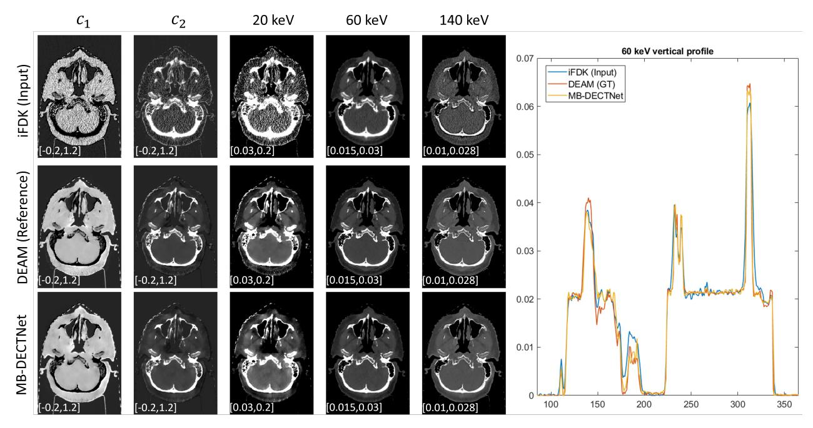

arXiv:2302.00577v1 [eess.IV] 1 Feb 2023

# MB-DECTNet: A Model-Based Unrolled Network for Accurate 3D DECT Reconstruction

Tao Gea, Maria Medranoa, Rui Liaoa, David G. Politteb, Jeffrey F. Williamsonc, Bruce R. 

Whitingd, and Joseph A. O'Sullivana

aWashington University in St. Louis, Department of Electrical & Systems Engineering 

bWashington University in St. Louis, Mallinckrodt Institute of Radiology  $^{\text{c}}$ Washington University in St. Louis, Radiation Oncology, St. Louis, MO 63110 

dUniversity of Pittsburgh, Department of Radiology, Pittsburgh, PA 15213

ABSTRACT

Numerous dual-energy CT (DECT) techniques have been developed in the past few decades. Dual-energy CT (DECT) statistical iterative reconstruction (SIR) has demonstrated its potential for reducing noise and increasing accuracy. Our lab proposed a joint statistical DECT algorithm for stopping power estimation and showed that it outperforms competing image-based material-decomposition methods. However, due to its slow convergence and the high computational cost of projections, the elapsed time of 3D DECT SIR is often not clinically acceptable. Therefore, to improve its convergence, we have embedded DECT SIR into a deep learning model-based unrolled network for 3D DECT reconstruction (MB-DECTNet) that can be trained in an end-toend fashion. This deep learning-based method is trained to learn the shortcuts between the initial conditions and the stationary points of iterative algorithms while preserving the unbiased estimation property of modelbased algorithms. MB-DECTNet is formed by stacking multiple update blocks, each of which consists of a data consistency layer  $(DC)$  and a spatial mixer layer, where the spatial mixer layer is the shrunken U-Net, and the DC layer is a one-step update of an arbitrary traditional iterative method. Although the proposed network can be combined with numerous iterative DECT algorithms, we demonstrate its performance with the dual-energy alternating minimization (DEAM). The qualitative result shows that MB-DECTNet with DEAM significantly reduces noise while increasing the resolution of the test image. The quantitative result shows that MB-DECTNet has the potential to estimate attenuation coefficients accurately as traditional statistical algorithms but with a much lower computational cost.

**Keywords:** dual-energy computed tomography, deep learning, model-based learning

# 1. INTRODUCTION

Dual-energy computed tomography (DECT) has been widely investigated to generate informative and accurate images.1,2 Dual-energy CT (DECT) statistical iterative reconstructions (SIR) have demonstrated their potential to reduce noise and increase accuracy. $^{3-6}$  For instance, our lab proposed a joint statistical DECT algorithm, dual-energy alternating minimization (DEAM), which outperforms competing methods and achieves sub-percentage uncertainty in estimating proton stopping power. $^{7-10}$ 

However, 3D DECT SIRs are usually time-consuming, even with multiple acceleration techniques, including multi-GPU acceleration11 and ordered-subsets method.12 Compared to single-energy CT (SECT), DECT algorithms reconstruct two measured sinograms scanned at two different spectra, which at least doubles the system operations per iteration. Moreover, since approximations are usually used in DECT SIRs to evaluate the gradient of the polychromatic forward models, DECT SIRs always converge much slower than single-energy algorithms. The low convergence rate and high computational cost of projections make it difficult to get an accurate DECT result within a clinically acceptable time.

Further author information:

 $Tao Ge: getao@wustl.edu$ 

Joseph A. O'Sullivan: jao@wustl.edu

Figure 1. Flowchart of the proposed pipeline. Each blue dashed box denotes an update block, which mimics an iteration in DECT SIR. DC is the data consistency layer, and the orange boxes evaluate the loss functions for training.

To reduce the elapsed time while retaining the estimation accuracy, we incorporate DECT SIR into a deep learning model-based unrolled network for DECT reconstruction (MB-DECTNet). This work is based on deep unfolding,13 which simulates iterative algorithms using a series of convolutional neural networks  $(CNN)$ .14,15 We substitute the data consistency layer in deep unfolding with DECT gradients. Then, in MBDECTNet, each individual block can be considered an iteration of JSIDECT, while the step size and the image prior are determined by the CNN.

# 2. METHODS

## 2.1 Problem Description

In contrast to single-energy CT, DECT estimates various types of images from two sinograms measured at different spectra. According to Beer's law, the transmission data can be modeled as a Poisson random vector with the entry

$$
d_j(y) \sim \text{Poisson}\Big\{ \int I_{0,j}(y,E) \exp\Big(-\int_X h(x,y)\mu(x,E)dx\Big) dE\Big\}, 
$$

(1)

where  $x \in X$  denotes spatial location or voxel index in the image domain,  $y \in Y$  denotes the index (fan angle, gantry angle, and bed position) of the measurement,  $j = L, H$  denotes the spectrum, E denotes the energy,  $I_0$  is the photon counts in the absence of an object, which contains information about the bowtie filter and spectrum, etc.,  $h(x,y)$  denotes the system operator, and  $\mu(x,E) \in \mathbb{R}^{+}$  denotes the linear attenuation coefficient (LAC) of the object at location  $x$  and energy  $E$ . Traditional SIR algorithms solve the DECT material-decomposition problem by iteratively minimizing the objective function[3-5,7](#page-9-1)

$$
\arg\min_{\mathbf{c}} \sum_{j} \sum_{y} \mathscr{D}\{d_{j}(y), g_{j}(y:\mathbf{c})\} + \mathscr{R}(\mathbf{c}), 
$$

(2)

where  $\mathscr{D}: (Y, Y) \to \mathbb{R}$  and  $\mathscr{R}: X \to \mathbb{R}$  denote the data fidelity and penalty term, respectively;  $\boldsymbol{c} = \{c_i\}$  denotes image of basis weights, and *i* indexes over basis materials,  $g_j(y: c)$  is the sinogram predicted by the discretized forward model operating on the current basis-material-decomposition,  $c$

$$
g_j(y:\mathbf{c}) = \sum_E I_{0,j}(y,E) \exp\Big(-\sum_x h(x,y) \sum_i c_i(x) \mu_i(E)\Big), 
$$

(3)

where  $\mu_i(E)$  is the LAC of the *i*-th basis material at energy E.

Prior work from our lab shows that DECT SIR algorithms can reconstruct images with subpercentage accuracy from uncorrected transmission data. $^{8-10}$  However, the elapsed time of statistical algorithms for 3D DECT is usually time-consuming because of the high computational cost of the system operator as well as the low convergence rate. To address this issue, we introduce the unrolled network for 3D DECT reconstruction in the  $next$  subsection.

Figure 2. Structure of a single update block

## 2.2 Model-Based Unrolled Network

The basic idea of MB-DECTNet is using a set of stacked neural networks to simulate the iterative update process of the traditional SIR algorithms. Figure 1 shows the flowchart of the proposed pipeline. The data is firstly reconstructed by an analytical algorithm combined with material decomposition to generate the initial condition for the network. The unrolled network consists of several update blocks, and each update block mimics a single iteration of the traditional statistical algorithm.

The structure of the update block is shown in Figure 2. The data consistency  $(DC)$  layer takes the image from the previous block and the transmission data as the inputs, and outputs the reference gradient, defined as the difference between and the minimizer of the surrogate data fidelity term and the previous iterate  $c^{k-1}$ :

$$
\mathcal{DC}(\boldsymbol{c}_{k-1}, d) = \left\{ \arg\min_{\boldsymbol{c}} \sum_{j} \sum_{y} \tilde{\mathscr{D}}\{d_{j}(y), g_{j}(y:\boldsymbol{c})\} \right\} - \boldsymbol{c}^{k-1} 
$$

(4)

where k denotes the index of the current block, and  $\tilde{\mathcal{D}}$  denotes the surrogate function of the data fidelity term at  $c = c^{k-1}$ .

Then, the DECT image and DC output are stacked along the channel dimension as the input to the truncated U-Net. We also employ residual learning[16](#page-4-16) and group normalization[17](#page-4-17) to make training more efficient. The output of the k-th update block  $\Gamma_k$  can be written as

$$
\Gamma_{\theta_k}(\boldsymbol{c}^{k-1}) = \text{UNET}_k(\text{stack}(\mathcal{DC}(\boldsymbol{c}_{k-1}, d), \boldsymbol{c}^{k-1})) + \boldsymbol{c}^{k-1}.
$$

(5)

Since the training process with intermediate loss functions has been observed to converge much faster than training with only the final loss, our network is trained under the supervision of the weighted sum of a set of intermediate loss functions as

$$
\arg\min_{\theta} \sum_{n=0}^{N-1} w_{e,n} \cdot ||\Gamma_{\theta_n} \circ \Gamma_{\theta_{n-1}} \cdots \circ \Gamma_{\theta_0}(\boldsymbol{c}_{init}) - \boldsymbol{c}_{truth}||, 
$$

(6)

where  $w_{e,n} \in [0, 1]$  denotes the scalar that controls the backpropagation weight,  $N$  denotes the number of stacked blocks,  $e$  denotes the index of the current training epoch,  $\theta = {\theta_0, \theta_1, \dots}$  denotes the set of trainable parameters in all update blocks,  $|| \cdot ||$  denotes the L2 norm, and  $\circ$  denotes the function composition.

The GPU memory footprint is a critical design issue for 3D unrolled networks since the training process stores all feature maps for backpropagation, and 3D unrolled networks generate more and larger latent maps. This work mainly uses two techniques to reduce the GPU memory footprint.

1) We partition the image volume into multiple small stacks consisting of  $8$  slices. The transmission data corresponding to each image stack is also truncated accordingly. Prior to passing to the DC layer, each stack is padded by 10 slices on each side to address the margin effect of helical CT reconstruction.

Figure 3. Images and middle vertical profiles for a selected slice in the test dataset.

2) The double 3D convolutional layer with  $3 \times 3 \times 3$  kernels is substituted with a single 3D convolutional layer with  $5 \times 5 \times 5$  kernels. Compared to the original U-Net, the number of starting feature maps is also reduced from  $64 \text{ to } 40.$ 

These two modifications reduce the GPU memory footprint of the network by approximately  $70\%$ .

# 3. RESULTS

## 3.1 Data Acquisition

In this work, model-based reconstructed images were taken as the reference. Five helical scans at 90 and 140 kVp of a head-and-neck cancer patient were sequentially acquired by a Philips Brilliance Big Bore CT scanner at  $a\ 0.75\ \text{mm}\times16$  collimation. These helical scans were then reconstructed by a joint statistical DECT algorithm,  $\text{DEAM}$ 8, with the motion-compensation technique18 and a sufficient number of iterations. We selected four patient data as the training set and one as the test set. The dimension of the sinogram was  $16 \times 816 \times 52800$  with 40 rotations. The image size was  $610 \times 610 \times 340$ , and the image resolution was  $1 \times 1 \times 1.034$  mm3. The training set had 168 samples in total. Each SIR takes 45 hours on  $4 \times$  NVIDIA V100 32 GB GPUs (400 iterations with 33 ordered subsets, plus 1000 iterations without ordered subset).

## 3.2 Results

We used a pretraining strategy to reduce the training time. Firstly, the first block of MB-DECTNet was trained individually for 2000 iterations. In this step, the reference update from the DC layer can be precomputed to save time. Then, the weights of the pretrained block were broadcasted to other blocks, and the entire network was trained end-to-end. The MB-DECTNet consisted of four updating blocks.

In the inference mode, MB-DECTNet generates a  $610 \times 610 \times 340$  image in approximately 350 seconds, which is 462-fold times shorter than the DEAM. Figure 3 shows the image of a slice as an example of the inference result from MB-DECTNet, compared to iFDK (input) and DEAM (ground truth) images. iFDK refers to the 3D analytical DECT reconstruction that combines the FDK algorithm and the iterative filtered back-projection. $19$  MB-DECTNet image is much less noisy that the initial FDK estimate while preserving contrast and image

Figure 4. Plots of relative mean absolute error (RMAE) versus energy for selected regions of interest.

sharpness. Indeed, the vertical profile suggests that MB-DECTNet improves the spatial resolution compared to  $\text{the } i \text{FDK image.}$ 

More quantitatively, figure 4 shows the relative mean absolute error (RMAE) for three different tissue ROIs relative to the LAC derived from their expected ICRU compositions, $^{20}$  defined as

$$
\text{RMAE}(E) = \frac{\frac{1}{N} \sum_{x} |c_1(x)\mu_1(E) + c_2(x)\mu_2(E) - \mu(x, E)|}{\mu(x, E)}.
$$

(7)

MB-DECTNet shows its potential to estimate accurate LACs for energies at  $20{\text -}150 \text{ keV}$ , and the performance of MB-DECTNet is close to the performance of the selected DECT SIR, with a much lower computational cost.

# 4. CONCLUSIONS

To the best of our knowledge, it is the first time that a model-based unrolled network is proposed and trained end-to-end to estimate accurate basis components from dual-energy CT sinograms. Our proposed MB-DECTNet is capable of reducing noise and increasing resolution, and can be combined with numerous joint statistical DECT algorithms. The quantitative result shows that MB-DECTNet has the potential to estimate LAC accurately for energies from 20 to  $150 \text{ keV}$  as the selected traditional statistical algorithm with a much lower computational  $cost.$ 

# ACKNOWLEDGMENTS

This project is supported by R01 CA212638 from the United States National Institutes of Health. We thank the Siteman Cancer Center for their help in the acquisition of clinical data.

# REFERENCES

- [1] McCollough, C. H., Leng, S., Yu, L., and Fletcher, J. G., "Dual- and multi-energy ct: Principles, technical approaches, and clinical applications," Radiology 276(3), 637–653 (2015). PMID: 26302388.
- [2] Goo, H. W. and Goo, J. M., "Dual-energy ct: New horizon in medical imaging," *Korean J Radiol*  $18(4)$ ,  $555-569$  (2017).
- [3] Zhang, R., Thibault, J.-B., Bouman, C. A., Sauer, K. D., and Hsieh, J., "Model-based iterative reconstruction for dual-energy x-ray ct using a joint quadratic likelihood model," *IEEE Transactions on Medical Imaging*  $33(1)$ , 117–134 (2014).
- [4] Jin, P., Bouman, C. A., and Sauer, K. D., "A model-based image reconstruction algorithm with simultaneous beam hardening correction for x-ray ct," *IEEE Transactions on Computational Imaging*  $1(3)$ , 200–216  $(2015).$
- [5] Long, Y. and Fessler, J. A., "Multi-material decomposition using statistical image reconstruction for spectral ct," IEEE Transactions on Medical Imaging  $33(8)$ ,  $1614-1626$  (2014).
- [6] Zhang, H., Zeng, D., Lin, J., Zhang, H., Bian, Z., Huang, J., Gao, Y., Zhang, S., Zhang, H., Feng, Q., Liang, Z., Chen, W., and Ma, J., "Iterative reconstruction for dual energy ct with an average image-induced nonlocal means regularization," *Physics in Medicine & Biology* **62**, 5556 (jun 2017).

- [7] O'Sullivan, J. A. and Benac, J., "Alternating minimization algorithms for transmission tomography," *IEEE* Transactions on Medical Imaging  $26(3)$ , 283–297 (2007).
- [8] Zhang, S., Han, D., Politte, D. G., Williamson, J. F., and O'Sullivan, J. A., "Impact of joint statistical dual-energy ct reconstruction of proton stopping power images: Comparison to image- and sinogram-domain material decomposition approaches," *Medical Physics*  $45(5)$ , 2129–2142 (2018).
- [9] Zhang, S., Han, D., Williamson, J. F., Zhao, T., Politte, D. G., Whiting, B. R., and O'Sullivan, J. A., "Experimental implementation of a joint statistical image reconstruction method for proton stopping power mapping from dual-energy ct data," *Medical Physics*  $46(1)$ , 273–285 (2019).
- [10] Medrano, M., Liu, R., Zhao, T., Webb, T., Politte, D. G., Whiting, B. R., Liao, R., Ge, T., Porras-Chaverri, M. A., O'Sullivan, J. A., and Williamson, J. F., "Towards subpercentage uncertainty proton stopping-power mapping via dual-energy ct: Direct experimental validation and uncertainty analysis of a statistical iterative image reconstruction method," *Medical Physics*  $49(3)$ , 1599–1618 (2022).
- [11] Mitra, A., Politte, D., Whiting, B., Williamson, J., and O'Sullivan, J., "Multi-gpu acceleration of branchless distance driven projection and backprojection for clinical helical ct," Journal of Imaging Science and Technology **61**,  $104051-1040513$  (01 2017).
- [12] Hudson, H. and Larkin, R., "Accelerated image reconstruction using ordered subsets of projection data," *IEEE Transactions on Medical Imaging*  $13(4)$ , 601–609 (1994).
- [13] Liu, J., Sun, Y., Gan, W., Xu, X., Wohlberg, B., and Kamilov, U. S., "Sgd-net: Efficient model-based deep learning with theoretical guarantees," IEEE Transactions on Computational Imaging 7, 598–610 (2021).
- [14] Hauptmann, A., Lucka, F., Betcke, M., Huynh, N., Adler, J., Cox, B., Beard, P., Ourselin, S., and Arridge, S., "Model-based learning for accelerated, limited-view 3-d photoacoustic tomography," *IEEE Transactions* on Medical Imaging  $37(6)$ ,  $1382-1393$  (2018).
- [15] Aggarwal, H. K., Mani, M. P., and Jacob, M., "Modl: Model-based deep learning architecture for inverse problems," *IEEE Transactions on Medical Imaging*  $38(2)$ , 394–405 (2019).
- [16] He, K., Zhang, X., Ren, S., and Sun, J., "Deep residual learning for image recognition," in [2016 IEEE Conference on Computer Vision and Pattern Recognition (CVPR)], 770–778 (2016).
- [17] Wu, Y. and He, K., "Group normalization," (2018).
- [18] Ge, T., Liao, R., Politte, D., Medrano, M., Williamson, J., Whiting, B., Zhao, T., and O'Sullivan, J., "Reducing motion artifact in sequential-scan dual-energy ct imaging by incorporating deformable registration within joint statistical image reconstruction," *Electronic Imaging* **2021**, 293–1 (01 2021).
- [19] Yan, C. H., Whalen, R., Beaupre, G., Yen, S., and Napel, S., "Reconstruction algorithm for polychromatic ct imaging: application to beam hardening correction," *IEEE Transactions on Medical Imaging*  $19(1)$ , 1–11  $(2000).$
- [20] White, D. R., Woodard, H. Q., and Hammond, S. M., "Average soft-tissue and bone models for use in radiation dosimetry," The British Journal of Radiology 60(717), 907-913 (1987). PMID: 3664185.