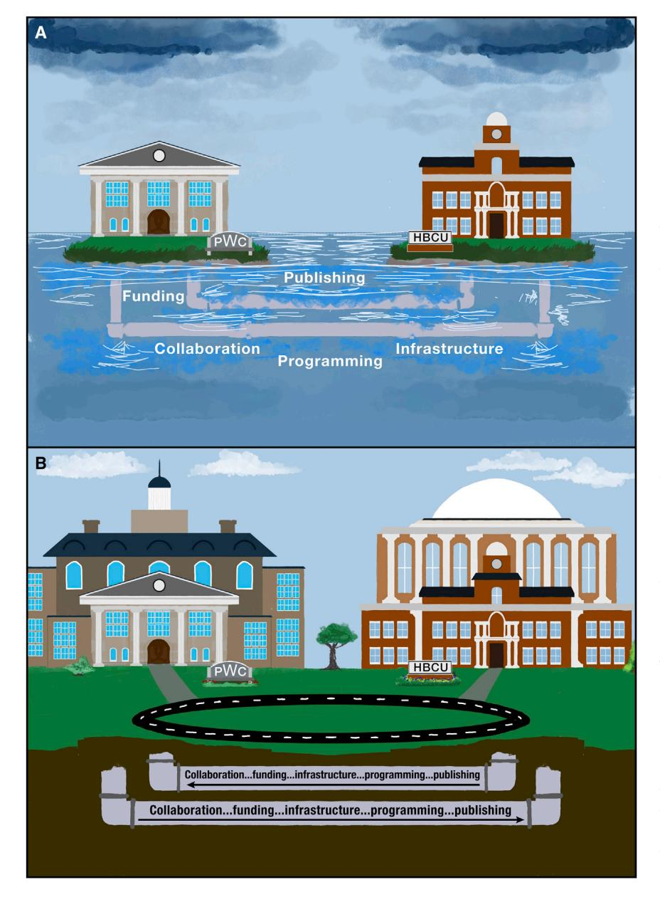

Cell

Leading Edge

CelPress

Commentary

# **Learning from HBCUs:** How to produce Black professionals in STEMM

Haysetta D. Shuler,1,2,11 Elsie C. Spencer,3,4,11 Jamaine S. Davis,5,7,11 Steven Damo,6,7 Teresa I. Shakespeare,8 Sandra A. Murray,9 Dexter L. Lee,10,\* and Antentor Hinton Jr.4,\*

1Department of Biological Sciences, Winston-Salem State University, Winston-Salem, NC 27110, USA

2Shuler Consulting, Winston-Salem State University, Winston-Salem, NC 27110, USA

3Teachers College, Columbia University, New York, NY 10027, USA

4Department of Molecular Physiology and Biophysics, Vanderbilt University, Nashville, TN 37232, USA

5Department of Biochemistry, Cancer Biology, Neuroscience and Pharmacology, Meharry Medical College, Nashville, TN 37208, USA

6Department of Life and Physical Sciences, Fisk University, Nashville, TN 37208, USA

7Center for Structural Biology and Department of Biochemistry, Vanderbilt University, Nashville, TN 37232, USA

8Department of Biology, Savannah State University, Savannah, GA 31404, USA

9Department of Cell Biology, University of Pittsburgh, Pittsburgh, PA 15261, USA

10Department of Physiology and Biophysics, Howard University College of Medicine, Washington, D.C. 20059, USA

11These authors contributed equally

\*Correspondence: dllee@howard.edu (D.L.L.), antentor.o.hinton.jr@vanderbilt.edu (A.H.)

https://doi.org/10.1016/j.cell.2022.06.013

Historically Black colleges and universities (HBCUs) offer high-quality education and produce leaders from various backgrounds, mainly being African American. Predominately White institutions can utilize practices that make HBCUs successful to mentor and graduate students of all backgrounds. We also suggest ways to bolster HBCUs so they can train more students.

# **HBCUs: A powerhouse**

Historically Black colleges and universities (HBCUs) have a long history of success in training African Americans (Crewe, 2017). One in six African Americans who receive a bachelor's degree has graduated from an HBCU, including such notable people as US Vice President Kamala Harris (Howard), political leader Stacey Abrams (Spelman), Winston Anderson (Howard), George Langford (Fayetteville State), and Louis Sullivan (Morehouse). Additionally, the supportive environment provided in an HBCU has produced world leaders and serves as a pathway to diversify the science, technology, engineering, math, and medicine (STEMM) field and helps accelerate upward Black socioeconomic mobility.

The track record of HBCUs reveals that one out of every ten African American college students attended an HBCU as of 2022, along with increasing numbers of White and Latinx students (United Negro College Fund, 2019). Furthermore, 25% of all African American graduates earn their degree at HBCUs (United Negro College Fund, 2019). This number is noteworthy given that HBCUs represent only 3% of all 3,567 degree-granting postsecondary institutions in the United States

(United Negro College Fund, 2019). Additionally, HBCUs have a well-established record of attracting and training disadvantaged students, some of whom may not have completed an undergraduate degree without the supportive, individual attention afforded to them at an HBCU. HBCUs are a powerhouse in educating African Americans who continue on to earn doctoral degrees in the STEMM fields (Crewe, 2017).

All of the co-authors of this paper have either graduated from, attended, taught, and/or been heavily mentored by faculty at an HBCU. These institutions remain a valuable training resource for the current workforce in STEMM and other fields. HBCUs were initially defined by the Higher Education Act of 1965 as those that are historically Black, were established prior to 1964, are accredited by the Department of Education, and possess a primary purpose of educating African Americans who qualified but were not allowed to attend the major institutions at that time. (Crewe, 2017). To be included in the U.S. News rankings of colleges and universities, HBCUs must also be undergraduate-degree-granting institutions, although primarily graduate-level institutions do exist in separate rankings.

The purpose of founding HBCUs was to create equitable institutions that could improve the quality of life of, and ensure proper and affordable education for, African Americans (Crewe, 2017). This purpose remains true today, with private HBCUs costing nearly half as much as private predominantly White institutions (PWIs) and public HBCUs being more than 20% percent less expensive than public PWIs (Johnson et al., 2019). The number of HBCUs has fluctuated over the years, with 101 currently existing in 2022 (United Negro College Fund, 2019). Although they represent only a small fraction of all universities. HBCUs have a considerable impact on training and diversifying the STEMM workforce.

African Americans who enroll at HBCUs are more successful in completing their degrees than at other higher education institutions within 4 years (Snyder and Dillow, 2011; National Center for Education Statistics, 2019). Among African American students attending public and private 4-year HBCUs, 62% and 67% complete their degrees within 4 years, respectively. This compares to only 21% completion rate for African American students enrolled at all institutions, while White students have a 44% completion rate. The

Cell 185, August 4, 2022 ª 2022 Elsevier Inc. 2841

CelPress

Cell 

Commentary

percentages of students who graduate after 6 years is more favorable: specifically, 40% of African American students and 64% of White students graduate from all institutions within 6 years of beginning their undergraduate studies (Snyder and Dillow, 2011; National Center for Education Statistics, 2019) There is clearly a need to increase the graduation rate for all students, and this need is critical for African American students who matriculate at non-HBCUs given their particularly low graduation rates. However, graduation rates are not the only metric for determining an institution's success in training students. Other relevant indicators of success include the number of students who go on to earn advanced degrees, the number of students who enter the workforce in their desired fields, and students' overall satisfaction with the institution, a metric at which HBCUs also excel.

Notably, HBCUs have a history of successfully training and graduating STEMM students who go on to earn advanced dearees and enter their chosen fields (United Negro College Fund), but what stands out when reviewing data collected from students at HBCUs is their level of satisfaction with their college experience. Students who attend HBCUs express greater satisfaction with their educational experience than those at PWIs and feel that faculty members are caring, providing students with direction, emotional support, encouragement, and shared wisdom (Johnson, 2017). Students who attended PWIs after studying at HBCUs reported feeling that the mentorship they once enjoyed at the HBCUs was unavailable or subpar at the PWIs.

Students at HBCUs claim to feel included, valued, believed in, and welcomed (Johnson, 2017). These feelings contribute to a sense of well-being and what Jay Kumar calls a "happy brain" (Kumar, 2019), a state in which students are capable of deep thinking, innovation, and learning (Kumar, 2019). This well-being and capacity to dream bigger are reinforced by the faculty and staff of HBCUs, who communicate their belief in their students' success (Johnson, 2017), which further contributes to raising student self-esteem, resilience, and levels of satisfaction.

Many African American students find HBCUs to be culturally relevant and safe

environments, free from the racial hostility they perceive at PWIs (Johnson, 2017). This is particularly understandable in recent years, given that U.S. news and social media are constantly filled with reminders of the nation's systemic racism.It is no surprise then that individuals who begin their training at an HBCU are more likely to complete their programs and achieve advanced or terminal degrees (Snyder and Dillow, 2011; National Center for Education Statistics, 2019). The safe environment of an HBCU inspires greater self-confidence, making it easier for students to lean into discomfort in order to survive in a harsher environment (Hinton et al., 2020). In other words. the blanket provided by the faculty and experience at an HBCU gives them the warmth needed to survive in less friendly and sometimes cold environments, where they may encounter benign neglect. Students become capable of surviving in environments where no one else looks like them because they gained strength surrounded by HBCU peers and faculty who cheered them on to reach new heights.

# The problems

Despite the successes of HBCUs in contributing impressively to graduating STEMM students, the STEMM workforce remains predominantly White. For example, the physician workforce in 2019 was approximately 56% White and only 5% African American, 6% Hispanic, and 17% Asian (Association of American Medical Colleges). Similarly, most faculty members conducting research at medical schools are White (63.9%) or Asian (19.2%); only 3.6% of their full-time faculty in 2018 were African American, and 5.5% were Hispanic, Latino, or of Spanish origin (Association of American Medical Colleges). In the STEMM workforce more broadly, only 9% were African American, and 8% were Hispanic in 2019 (Fry et al., 2021). By comparison, African Americans and Hispanics made up 12% and 17% of the US workforce in the same year, respectively. However, these proportions were the same as those in 2016, suggesting that there has been little progress, despite efforts to increase these numbers (Fry et al., 2021).

Despite fewer resources, higher teaching loads, and several other problems

 that burden HBCUs, they still produce high-caliber graduates and offer valuable academic jobs. At the same time, non-HBCU institutions fail to graduate African American students at the same rates as HBCUs, even with their more substantial funding and resources. What then can be learned from the faculty and structure of HBCUs that can improve the experiences of African American students while, importantly, helping to launch their successful careers in STEMM? Can the formula used by HBCUs be deciphered and adopted by PWIs so all schools may be equipped to enroll students from all backarounds and levels of mentoring and provide them with the necessary support and guidance to achieve their goals? There is a need for PWIs to join in the mission of preparing students for careers in STEMM, and one way this can be accomplished is by following the strategies used by HBCUs, namely creating safe environments; increasing students' feelings of self-worth, value, and importance; and nurturing their sense of belonging. Although HBCUs create safe spaces, there needs to be more investment in these institutions to have a bigger educational impact, which will increase their funding and, ultimately, rankings. Many rankings of HBCUs currently exist, the most popular of which is determined by U.S. News and World Report. Their 2022 ranking lists Spelman, Howard, Xavier, Hampton, and Morehouse as the top colleges (https://www.usnews.com/bestcolleges/rankings/hbcu). Many other websites have presented similar rankings, such that these universities, among others, are considered Black Ivy League institutions (https://collegegazette.com/ black-ivy-league-schools/and https:// collegerealitycheck.com/best-hbcucolleges/). The list of universities that comprise the Black Ivy League is informal and subjective, but it typically includes the most prestigious, selective, and highly ranked HBCUs. These have historically been Fisk, Dillard, Morehouse, Tuskegee, Spelman, Hampton, and Howard. More recently, Florida Agricultural and Mechanical University, North Carolina Agricultural and Technical State University, and Xavier University of Louisiana have ranked highly among the HBCUs. These universities, established more recently than those previously

 2842 Cell 185, August 4, 2022

Cell

Commentary

CelPress

listed, offer competitive programs and have necessitated reevaluation of which HBCUs are considered the most prestigious. However, the guestion remains: why do the rankings of HBCUs and PWIs continue to be determined separately, despite the impressive track record of HBCUs producing many successful scientists and politicians? Proponents of separating rankings may argue that they give HBCUs a chance to be recognized without being overshadowed by larger, more prestigious universities like the official Ivy Leagues (Harvard, Columbia, etc.). However, this raises an important point: a primary reason HBCUs may be overshadowed by such institutions in rankings is their unequal endowments.

Importantly, HBCUs continue to prepare them to enter the workforce, but they do so with limited resources and funding (Weissman, 2021). Although their efforts should be expanded, a frightening number of HBCUs that have played a pivotal role in educating African American students have closed instead. Those colleges that have closed include Bishop in 1988, Mary Holmes in 2005, Natchez in 1993, Saint Paulin 2013, and Saints in 2006, though this list is not exhaustive. Several others HBCUs remain open in name only (e.g., Knoxville College and Barber-Scotia College). Only 101 HBCUs remain from the 130 that once existed (United Nearo College Fund, 2019; Bracey, 2017). Another major problem is their lack of funding. HBCUs have been underfunded for decades and struggle to find continuous funding streams to support their institutions and students (Weissman, 2021). Across the board, HBCUs have much smaller endowments; this is especially pertinent for private HBCUs, which have an average per student endowment of about \$25,000, much less than the average per student endowment of \$184,000 at private PWIs (Weissman, 2021). Compounding this issue, grant applications from HBCUs are less likely to be chosen for funding; indeed, some HBCUs have closed due to a lack of grant funding (Weissman, 2021; Bracey, 2017).

In brief, endowments are the total assets, typically donated, that a university can spend for educational purposes. There is a considerable difference between the average endowments of

HBCUs and PWIs. Howard University has the largest endowment of the HBCUs at approximately \$700 million as of 2020 (NACUBO, 2021). However, this is an outlier, as the next highest HBCU endowments are approximately \$390 million and \$280 million at Spelman and Hampton, respectively (NACUBO, 2021). The 15th largest endowment of the 101 HBCUs, that of Fayetteville State University, is only \$24 million (NACUBO, 2021). In contrast, the median endowment for all private nonprofit institutions in 2018 was \$37 million, and that of public nonprofit universities was slightly lower at \$35 million. Thus, of the 101 HBCUs, only 13 have an endowment higher than the median of all institutions. This is especially relevant when it comes to PWIs, for which the largest endowment, that of Harvard, is over \$40 billion (NACUBO, 2021). The next highest endowments, those of Yale and Stanford, are similarly high at approximately \$31 and \$29 billion, respectively (NACUBO, 2021).

Though some may argue the reason for this difference is student enrollment, HBCUs are drastically underfunded even after adjusting for this factor. Across all public universities, the average endowment per student is approximately \$25,000, compared with only \$7,000 for public HBCUs (Weissman, 2021). This difference is further amplified among private universities, where the average endowment per student is \$185,000 and only \$25,000 for private HBCUs (Weissman, 2021). This vast difference creates an uneven playing field between HBCUs and non-HBCUs. In many ways, endowment sizes contribute to a positive feedback loop. Large endowments allow universities to fund more research, hire more staff, and expand programs, which ultimately makes them more competitive for grants, allowing for even more spending. Conversely, lower endowments can lead to fewer opportunities, put universities at a disadvantage, and create the threat of potential closings.

Recently, US President Joe Biden's Build Back Better framework has included provisions for HBCUs and other minority serving institutions (MSIs) (United Negro College Fund, 2021). Though this amount is larger than what previous bills have provided, it does not adequately address the issues HBCUs face. First, it is still possible

that these provisions will not pass, leaving HBCUs in the same position with a lack of funding. Second, the total amount allocated to HBCUs by the bill is, at most, \$4 billion, which does not represent even 10% of Harvard's endowment (NACUBO. 2021), and this would be split across all HBCUs. Despite HBCUs training over 25% of the African Americans who successfully obtain an undergraduate dearee, they still receive less than 1% of available federal funding, and the Build Back Better plan would not increase their funding enough to approach the average endowment of all institutions (United Negro College Fund, 2019; Weissman, 2021; NACUBO, 2021). President Biden has also recently signed an executive order to recognize National HBCU Week, which includes several provisions to help HBCUs recover from the impacts of COVID-19, including expanding the funding sources available to HBCUs, increasing the ease of implementing federal programs, and partnering with HBCU leaders to strengthen pipelines to HBCUs (United Negro College Fund, 2021). This is certainly a good first step, but ultimately, it amounts to using a Band-Aid to patch a flood (Figure 1). A maior issue with this legislation stems from the short-sightedness of its solutions and the lack of spread-out funding for HBCUs. Future legislation must incorporate longer-term solutions that include endowments from billionaires. more opportunities for grants, and more substantial support for HBCUs that are successfully graduating STEMM trainees.

# **HBCU** practices that lead to success

Establishing a safe and nurturing environ*ment.* Faculty at HBCU's tend to be more diverse than at PWIs. The diversity of faculty at HBCUs serves as inspiration and representation in meaningful numbers does matter to students. If you can see it, you can attain it. Students are nurtured and mentored by positive and caring faculty at HBCUs, often on an individual basis. The faculty at HBCUs tend to give sound advice, listen to their mentees, contribute to their success, and provide a safe environment that promotes growth (Box 1). HBCU faculty know when to provide a push, lift, or shoulder, and they know who and where to send mentees

Cell 185, August 4, 2022 2843

CelPress

Cell 

Commentary

Figure 1. Working together to patch the leaky pipeline between historically Black colleges and universities and predominantly White institutions

(A) When historically Black colleges and universities (HBCUs) and predominantly White institutions/colleges (PWIs/PWCs) do not work together, this can result in a leaky pipeline for students and poor outcomes.

(B) When barriers are removed between HBCUs and PWIs/PWCs, an exchange of ideas and information is opened, facilitating a STEMM pipeline for students from all backgrounds

for help. Furthermore, they expend their energy to create a near-family-like environment where the student feels safe.

Instilling self-worth. Many faculty members at HBCUs develop supportive relationships with their students. Faculty share their personal stories and experiences in STEMM, which helps to build

connections and provides students with a feeling of belonging in STEMM fields. Communication between students and faculty helps students develop their identity in science. It is rare for an HBCU fac-

ulty member to not know the names of all their students and something about their background. Moreover, HBCU fac-

ulty work to develop strong teaching and mentoring philosophies. For example, similar to the thoughts of Goethe, faculty at HBCUs treat students as if they were what they ought to be until they become what they are capable of being. The Harvard Business Review promotes using a model similar to that developed by Madam C.J. Walker, that everyone involved in the process has ownership in the product (Freeman and Milway, 2020). Students at HBCUs are made to feel like they are important members of the team, whether doing lab work or attending and presenting data at conferences. This gives them a sense of belonging and self-worth and empowers them to develop their leadership skills and their capacity to work in teams.

Scientific identity. Nearly all STEMM students at HBCUs have presented their data at scientific meetings. The preparation needed for students to present at conferences is given considerable amounts of effort by the faculty. The faculty at HBCUs use class assignments. scientific meeting presentations, and other tasks to provide experiences that result in "little wins," and perhaps even setbacks, that are turned into big achievements with effort and perseverance. Thus, students learn while increasing their resilience and sense of scientific identity.

In summary, students leave HBCUs empowered to serve their community and STEMM fields and to become leaders. There's a need for HBCU's to train more students and a need for PWIs to consider adopting the HBCU practices if they want to be successful in increasing their capacity to train students from diverse backgrounds and achieve their stated diversity goals (Box 1).

# Conclusion

Future research institutions will require not only ingenuity, hard work, and a commitment to training the next generation of scientists but also a commitment to bolstering their cultural environment with African American scientists. There is a critical need for PWIs to increase the diversity, retention, and promotion of their faculty. Furthermore, the funding situation and the dire need for increased funding need to be addressed by policymakers by implementing policies that will improve HBCU funding and equity

2844 Cell 185, August 4, 2022

Cell

Commentary

CelPress

Box 1. Summary of common HBCU best practices that PWIs can implement for African **American students** 

- Intentionally care and go beyond the scope of their jobs in order to set students up for success
- Have a willingness to give up their time to mentor, advise, motivate, and educate students
- Take pride in their student's accomplishments and bolstering their self-confidence
- Cultivate a nurturing learning environment founded on comradery that gives a student a feeling of belonging and self-worth
- Foster collaborative efforts and opportunities for networking that they will use for future professional advancement
- Have mentoring philosophies that impact a student's learning
- Communicate to produce life-long learners, high achievers, and a growth mindset
- Work to eliminate negative stereotypes and what we have termed "broke mindset," which results in a student's belief that they can't achieve, that they're not good enough, or that they don't belong in STEMM
- Create a supportive community to give their students a sense of belonging and increase their retention in STEMM
- Practice holistic mentoring that supports all aspects of student education and wellness
- Advocate for their students
- Meet students where they are, sometimes seeing a diamond in the rough that needs to be polished or a star whose light needs to be made to shine brighter
- Diversify, retain, and promote their STEMM faculty

opportunities and disbursement of funds. With increased funding, HBCUs can continue to serve a vital role in retaining African American students in the STEMM pipeline and offering valuable opportunities for students, all while supporting their infrastructure (Hinton et al., 2020). However, despite having fewer resources, HBCUs show more promising results than their PWI counterparts (United Negro College Fund, 2019; United Negro College Fund). Solving this imbalance will help to avoid future HBCU closures

# ACKNOWLEDGMENTS

We would like to thank Dr. Neng Vue for helping make the figure in Procreate. We also would like to thank Kit Neikirk at Vanderbilt University for his edits and scribing for this manuscript. This work was supported by the Burroughs Wellcome Fund Career Awards at the Scientific Interface Award. Burroughs Wellcome Fund Ad-hoc Award, National Institutes of Health Small Research Pilot Subaward to #5R25HL106365-12 from the National Institutes of Health Programs to Increase Diversity among Individuals Engaged in Health-Related Research (PRIDE) Program, DK020593, Vanderbilt Diabetes and Research Training Center for DRTC Alzheimer's Disease Pilot & Feasibility Program, United Negro College Fund/Bristol Myers Squibb Ernest E. Just Faculty Fund Grant awarded to A.H.J.. National Science Foundation grant HRD#2112556 to S.D., and National Science Foundation grant MCB #2011577I and National Institutes of Health T32 5T32GM133353 to S.A.M.

# DECLARATION OF INTERESTS

The authors declare no competing interests.

# WEB RESOURCES

"Best HBCU Colleges By Major, Program, Campus, Teachers, etc.," College Reality Check (blog), https://collegerealitycheck.com/ best-hbcu-colleges/

"The Black Ivy League: 10 Amazing Schools," College Gazette, https://collegegazette.com/ black-ivy-league-schools/

"Historically Black Colleges and Universities." U.S. News and World Report, https://www. usnews.com/best-colleges/rankings/hbcu

# REFERENCES

Association of American Medical Colleges. Diversity in Medicine: Facts and Figures 2019. https:// www.aamc.org/data-reports/workforce/report/ diversity-medicine-facts-and-figures-2019.

Bracey, E.N. (2017). The Significance of Historically Black Colleges and Universities (HBCUs) in the 21st Century: Will Such Institutions of Higher Learning Survive? Am. J. Econ. Sociol. 76, 670-696. https://doi.org/10.1111/ajes.12191.

Johnson, M.T., Bruch, J., and Gill, B. (2019). Changes in HBCU Financial Aid and Student Enrollment After the Tightening of PLUS Credit Standards. J. Stud. Financ. Aid 48. https://doi. org/10.55504/0884-9153.1627.

Crewe, S.E. (2017). Education with Intent-The HBCU Experience. J. Hum. Behav. Soc. Environ. 27, 360-366. https://doi.org/10.1080/10911359. 2017.1318622.

Freeman, T.M., and Milway, K.S. (2020). How Madam C.J. Walker Built Racial Equity into Her Business. Harv. Bus. Rev. https://hbr.org/2020/ 12/how-madam-c-j-walker-built-racial-equityinto-her-business.

Fry, R., Kennedy, B., and Funk, C. (2021). STEM Jobs See Uneven Progress in Increasing Gender, Racial and Ethnic Diversity (Pew Research Center Science & Society). https://www.pewresearch. ora/science/2021/04/01/stem-iobs-see-unevenprogress-in-increasing-gender-racial-and-ethnicdiversity/.

Hinton, A.O., Jr., Termini, C.M., Spencer, E.C., Rutaganira, F.U., Chery, D., Roby, R., Vue, Z., Pack, A.D., Brady, L.J., Garza-Lopez, E., et al. (2020). Patching the Leaks: Revitalizing and Reimagining the STEM Pipeline. Cell 183, 568-575. https://doi. org/10.1016/j.cell.2020.09.029.

Johnson, J.M. (2017). Choosing HBCUs: Why African Americans Choose HBCUs in the Twenty-first Century. In Black Colleges Across the Diaspora: Global Perspectives on Race and Stratification in Postsecondary Education, M. Christopher Brown and T. Elon Dancy, eds. (Emerald Publishing Limited) 978-1-78635-522-5, pp. 151-169.

Kumar, J. (2019). Science of a Happy Brain: Thriving in the Age of Anger, Anxiety, and Addiction (Page Publishing) 978-1-64462-801-0.

NACUBO (2021). NACUBO-TIAA Study of Endowments. https://www.nacubo.org/research/2021/ nacubo-tiaa-study-of-endowments.

National Center for Education Statistics. (2019). Indicator 23: Postsecondary Graduation Rates. https:// nces.ed.gov/programs/raceindicators/indicator red.asp.

Snyder, T.D., and Dillow, S.A. (2011). Digest of Education Statistics (National Center for Education Statistics, Institute of Education Sciences, U.S. Department of Education).

United Negro College Fund (2021). House Passes Build Back Better, HBCU Improvements Included.https://www.alobenewswire.com/news-release/ 2021/11/19/2338437/0/en/House-Passes-Build-Back-Better-HBCU-Improvements-Included.html.

United Negro College Fund (2019). By the Numbers: How HBCUs Stack Up. https://uncf. org/the-latest/by-the-numbers-how-hbcus-stackup.

United Negro College Fund. HBCUs Make America Strong: The Positive Economic Impact of Historically Black Colleges and Universities. https://cdn. uncf.org/wp-content/uploads/HBCU Consumer Brochure\_FINAL\_APPROVED.pdf? qa=2.140965 943.403634606.1654562629-436531540.165456 2629

Weissman, S. (2021). Report: Funding Gaps for HBCUs. Inside Higher Ed. https://www.insidehig hered.com/quicktakes/2021/09/15/report-fundingaaps-hbcus.

Cell 185, August 4, 2022 2845