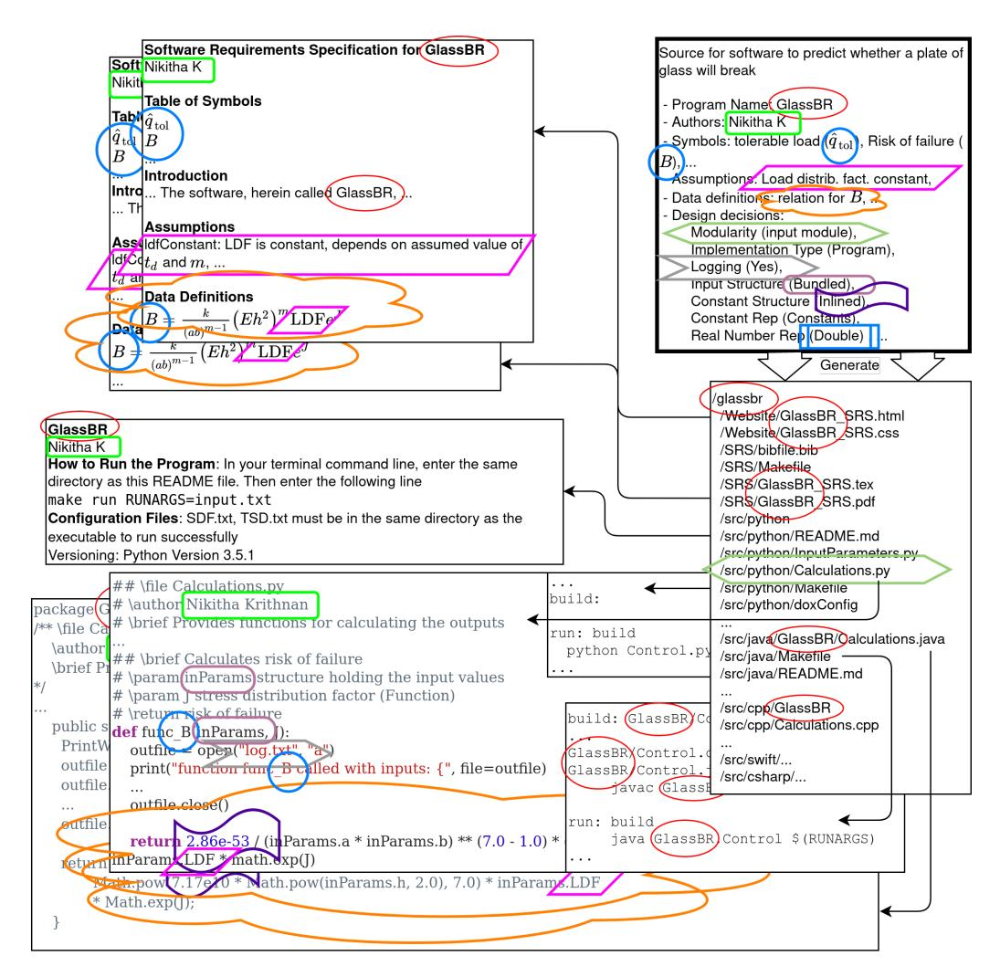

# **Generating Software for Well-Understood** Domains

**jacques Carette $\boxtimes \mathring{\mathbf{A}}$**

Department of Computing and Software, McMaster University, 1280 Main Street West, Hamilton, Ontario, L8S 4L8, Canada

**spencer Smith $\boxtimes \bigotimes \mathbf{0}$**

Department of Computing and Software, McMaster University, 1280 Main Street West, Hamilton, Ontario, L8S 4L8, Canada

**Jason Balaci $\boxtimes$**

Department of Computing and Software, McMaster University, 1280 Main Street West, Hamilton, Ontario, L8S 4L8, Canada

Abstract

Current software development is often quite code-centric and aimed at short-term deliverables, due to various contextual forces (such as the need for new revenue streams from many individual buyers). We're interested in software where different forces drive the development. Well understood domains and long-lived software provide one such context.

A crucial observation is that software artifacts that are currently handwritten contain considerable duplication. By using domain-specific languages and generative techniques, we can capture the contents of many of the artifacts of such software. Assuming an appropriate codification of domain knowledge, we find that the resulting de-duplicated sources are shorter and closer to the domain. Our prototype, Drasil, indicates improvements to traceability and change management. We're also hopeful that this could lead to long-term productivity improvements for software where these forces are at play.

2012 ACM Subject Classification Software and its engineering  $\rightarrow$  Application specific development environments; Software and its engineering  $\rightarrow$  Requirements analysis; Software and its engineering  $\rightarrow$  Specification languages; Software and its engineering  $\rightarrow$  Automatic programming

**Keywords and phrases** code generation, document generation, knowledge capture, software engineering

Digital Object Identifier 10.4230/OASIcs.EVCS.2023.1

Category Research

# 1 The Context

Not all software is the same. In fact, there is enough variation in the context in which developers create various software products to warrant exploring and using different processes, depending on the forces [1] at play. Here we explore two such forces: "well understood" and "long lived".

We need to be precise about what we mean by "well understood" and "long lived". and thus will start by defining these terms. The definition of "well understood" has three components, which will be successively refined throughout this paper. As the codification of what is understood tends to be reliably communicated via *documentation*, we review that as well, before discussing which aspects of software products, aka software artifacts, we are considering. Then we give concrete examples of software domains where these ideas come together.

This work can be seen as resurrecting many of the goals of projects like Draco  $[21, 22]$ , DMS  $[5, 6]$ , GLisp  $[23, 24]$  and SpecWare  $[32, 30]$ . All are variants on *automatic programming*.

© Jacques Carette, Spencer Smith, and Jason Balaci; ල 🛈 licensed under Creative Commons License  $CC\text{-}BY$  4.0

Eelco Visser Commemorative Symposium (EVCS 2023)

Editors: Ralf Lämmel, Peter D. Mosses, and Friedrich Steimann; Article No. 1; pp. 1:1-1:12

OpenAccess Series in Informatics

OASICS Schloss Dagstuhl – Leibniz-Zentrum für Informatik, Dagstuhl Publishing, Germany

**$1:2$ **Generating Software for Well-Understood Domains**

Unlike many of these projects, our primary aim is not automation, but rather a combination of raising the level of abstraction and knowledge capture. And indeed *domain engineering*, as coined by Draco's creator James Neighbors, is core to our work. Where we differ is our emphasis on all software artifacts, not just code, and being able to leverage several decades of theoretical and technological advances. See 4 for more details on these and other related projects and ideas.

## $1.1$ "Well-understood" software?

 $\blacktriangleright$  

 Definition 1. A software domain is well understood if
- 1. its Domain Knowledge  $(DK)$  [8] is codified,
- **2.** the computational interpretation of the  $DK$  is clear, and
- **3.** writing code to perform said computations is well understood.

By *codified*, we mean that the knowledge exists in standard form in a variety of textbooks. For example, many engineering domains use ordinary differential equations as models, the quantities of interest are known, given standard names and standard units. In other words, standard vocabulary has been established over time and the body of knowledge is uncontroversial.

We can refine these high level ideas, using the same numbering, although the refinement should be understood more holistically.

- 1. Models in the DK  $can$  be written formally.
- 2. Models in the DK  $can$  be turned into functional relations by existing mathematical steps.
- 3. Turning these functional relations into code is an understood transformation.

Most importantly, the last two parts deeply involve *choices*: What quantities are considered inputs, outputs and parameters to make the model functional? What programming language? What software architecture, data-structures, algorithms, etc.?

In other words, well understood does not imply choice free. Writing a small script to move files could just as easily be done in Bash, Python or Haskell. In all cases, assuming fluency, the author's job is straightforward because the domain is well understood.

## $1.2$ Long-lived software?

For us, long-lived software  $[18]$  is software that is expected to be in continuous use and evolution for 20 or more years. The main characteristic of such software is the *expected turnover* of key staff. This means that all tacit knowledge about the software will be lost over time if it is not captured. Relying on oral tradition and word-of-mouth becomes untenable for the viability of long-lived projects, and documentation becomes a core asset of value comparable, if not greater than, the actual code.

## $1.3$ Documentation

Well understood also applies to **documentation** aimed at humans  $[26]$ . The same three items of Definition 1 can be retargeted to apply to documentation as follows:  $(1)$  The meaning of the models is understood at a human-pedagogical level, i.e., it is explainable. (2) Combining models is explainable. Thus, the act of combining models must simultaneously operate on mathematical representations and on explanations. This requires that English descriptions also be captured in the same manner as the formal-mathematical knowledge. (3) The refinement steps that are performed due to making software-oriented decisions should be captured with a similar mechanism, and also include English explanations.

J. Carette, S. Smith, and J. Balaci 1:3

Coupling together well-understood domains and its documentation, we obtain what we call triform theories.

▶ **Definition 2.** Triform theories, as a nod to biform theories  $[11]$ , are the coupling of three concepts:

- 1. an axiomatic description,
- 2. \ a \ computational \ description, and$
- 3. an English description.
These will form the heart of our approach to domain engineering.

EVCS 2023

## $1.4$ Software artifacts

Software currently consists of a whole host of artifacts: requirements, specifications, user manual, unit tests, system tests, usability tests, build scripts, READMEs, license documents, process documents, as well as code. Our aim is to understand the "information content" of each artifact sufficiently to construct a Domain Specific Language (DSL) that describes how to weave information gleaned from triform theories with instance specific choices that are sufficient to enable the generation of each artifact.

## $1.5$ Instances

When are these well understood and long lived conditions fulfilled? One example is *research software* in science and engineering. While the results of running various simulations is entirely new, the underlying models and how to simulate them are indeed well known. One particularly long-lived example is embedded software for space probes (like Pioneer 10). Another would be ocean models, such as NEMO [12], which can trace its origins to OPA 8 [20]. In fact, most subdomains of science and engineering harbour their own niche long-lived software. The domain of control systems is particularly rich in examples.

Note that some better-known long-lived software, such as financial systems, do not fall within our purview, as the implemented business processes are not well understood. This is why most large rewrites of financial systems fail as the functionality actually implemented in the source system is not documented.

# 2 An Example

We have built infrastructure, which we also call Drasil<sup>1</sup> to carry out these ideas. It consists of 60KLoc of Haskell implementing a series of interacting Domain Specific Languages (DSLs) for knowledge encodings, mathematical expressions, theories, English fragments, code generation and document generation.

Drasil consists of a "database" of information about certain domains of interest (parts of physics, some mathematics, software engineering, documentation and computing), encoded in a home-grown ontology somewhat resembling the work of Novak  $[16, 24]$ . It has also a number of internal DSLs for representing the contents of various kinds of documents (specifications, programs, simple build scripts, READMEs), coupled with DSLs for rendering in various formats ( $\LaTeX$ , HTML and plain text, used for specifications, and GOOL [19] for representing Object-Oriented programs that can be rendered in six different languages). There are also DSLs for triform theories, mathematical expressions, English fragments,

 $^{1}$  https://github.com/JacquesCarette/Drasil

**$1:4$ **Generating Software for Well-Understood Domains**



**Figure 1** Colors and shapes mapping from captured domain knowledge to generated artifacts. Red oval: program name; green rectangle: author name; blue circle: symbols for real-valued variables; pink lozenge: assumptions used (load distribution factor is constant); orange cloud: mathematical definition of  $B$ ; gray arrow: option to turn on logging; light brown rounded-corners rectangle: how inputs should be "bundled"; purple wavy rectangle: how constants are handled (here: inlined).

citations, authors, some software choices, and so on. Lastly another DSL weaves together all the previous information to render the artifacts that together make a piece of software. A longer article describing all of these in detail is being written.

We provide a bit of the overall flavour of Drasil through what we hope to be an illustrative example.

## $2.1$ GlassBR

We will focus on information capture and the artifacts we can generate. For concreteness, we'll use a single example from our suite: GlassBR, used to assess the risk for glass facades subject to blast loading. The requirements are based on an American Standard Test Method (ASTM) standard  $[3, 4, 7]$ . GlassBR was originally a Visual Basic code/spreadsheet created by colleagues in a civil engineering research lab. We added their domain knowledge

**J. Carette, S. Smith, and J. Balaci 1:5**

to our framework, along with recipes to generate relevant artifacts. Not only can we generate code for the necessary calculations (in  $C^{++}$ ,  $C^{\#}$ , Java, Python and Swift), we also generated documentation that was absent in the original (Software Requirements Specification, doxygen, README.md and a Makefile). Moreover, our implementation is actually a family of implementations, since some design decisions are explicitly exposed as changeable variabilities, as described below.

Figure 1 illustrates the transformation of captured domain knowledge. Reading this figure starts from the upper right box. Each piece of information has its own shape and colour (orange cloud, pink lozenge, etc). It should be immediately clear that all pieces of information reappear in multiple places in the generated artifacts. For example, the name of the software (GlassBR) ends up appearing more than 80 times in the generated artifacts (in the folder structure, requirements, README, Makefile and source code). Changing this name would traditionally be extremely difficult; we can achieve this by modifying a single place, and regenerating.

The first box shows the directory structure of the currently generated artifacts; continuing clockwise, we see examples of Makefiles for the Java and Python versions, parts of the fully documented, generated code for the main computation in those languages, user instructions for running the code, and the processed  $\LaTeX$  for the requirements.

The name GlassBR is probably the simplest example of what we mean by *duplication*: here, the concept "program name" is internally defined, and its *value* is used throughout.

In general, we capture more complex knowledge. An example is the assumption that the "Load Distribution Factor" (LDF) is constant (pink lozenge). If this needs to be modified to instead be an input, the generated software will now have LDF as an input variable.

We also capture design decisions, such as whether to log all calculations, whether to inline constants rather than show them symbolically, etc. These different pieces of knowledge can also be reused in different projects.

## 2.2 The Steps

We describe an "idealized process" that we could have used to produce GlassBR, following Parnas' idea of faking a rational design process  $[27]$ .

**Understand the Program's Task** Compute the probability that a particular pane of (special) glass will break if an explosive is detonated at a given distance. This could be in the context of the glass facade for a building.

**Is it well understood?** The details are extensively documented in  $[3, 4, 7]$ .

| Concept      | Term (Name)       | Abbrev. | Domain  |
|--------------|-------------------|---------|---------|
| fullyT       | Fully Tempered    | FT      | [Glass] |
| heatS        | Heat Strengthened | HS      | [Glass] |
| iGlass       | Insulating Glass  | IG      | [Glass] |
| lGlass       | Laminated Glass   | LG      | [Glass] |
| glassTypeFac | Glass Type Factor | GTF     | [Glass] |

**Record Base Domain Knowledge** A recurring idea is the different types of Glass:

The "Risk of Failure" is definable:

EVCS 2023

**$1:6$ **Generating Software for Well-Understood Domains**

| Label       | Risk of Failure                                                       |
|-------------|-----------------------------------------------------------------------|
| Symbol      | $B$                                                                   |
| Units       | Unitless                                                              |
| Equation    | $B = \frac{k}{(ab)^{m-1}} (Eh^2)^m LDF e^J$                           |
|             | $B$ is the Risk of Failure (Unitless)                                 |
|             | $k$ is the surface flaw parameter $\left(\frac{m^{12}}{N^7}\right)$   |
|             | $a \& b$ are the plate length & width $(m)$                           |
|             | $m$ is the surface flaw parameter $\left(\frac{m^{12}}{N^{7}}\right)$ |
|             | $E$ is the modulus of elasticity of glass $(Pa)$                      |
|             | $h$ is the minimum thickness $(m)$                                    |
|             | $LDF$ is the load duration factor (Unitless)                          |
| Description | $J$ is the stress distribution factor (Unitless)                      |
| Source      | [3], [7]                                                              |

Some concepts, such as those of explosion, glass slab, and degree do not need to be defined  $\text{mathematically}$  — an English description is sufficient.

The descriptions in GlassBR are produced using an experimental language using specialized markup for describing relations between knowledge. For example, the goal of GlassBR ("Predict-Glass-Withstands-Explosion") is to "Analyze and predict whether the glass slab under consideration will be able to withstand the **explosion** of a certain **degree** that is calculated based on *user input.*", where italicized names are "named ideas", and bold faced names are "concept chunks" (named ideas with a domain of related ideas). We call this goal a "concept instance" (a concept chunk applied in some way). This language lets us perform various static analyses on our artifacts.

This doesn't build a complete ontology of concepts, as we have not found that to be necessary to generate our artifacts. In other words, we define a  $good \ enough$  fraction of the domain ontology.

The most important results of this phase are descriptions of *theories* that link all the important concepts together. For example, the description of all the elements that comprise Newton's Law  $F = ma$ , i.e., what is a force, a mass, acceleration (and how is it related to velocity, position and time), what are the units involved, etc.

**Define the characteristics of a good solution** For example, one of our outputs is a probability, which means that the output should be checked to be between  $0$  and  $1$ . This can result in assertion code in the end program, or tests, or both. We do not yet support full  $properties [9], but that is indeed the logical next step.$ 

**Record basic examples** For the purposes of testing, it is always good to have very simple examples, especially ones where the correct answer is known a priori, even though the simple examples are considered "toy problems". They provide a useful extra check that the narrative is coherent with our expectations.

**Specialization of theories** In general, the theories involved will be much more general than what is needed in any given example. For example, Newton's Laws are encoded in their vector form in  $n$  dimensions, and thus specialization is necessary.

In the GlassBR example, the thickness parameter is not free to vary, but must take one of a specific set of values. The rationale for this specialization is that manufacturers have standardized the glass thickness they will provide. (This rationale is also something we capture.)

**J. Carette, S. Smith, and J. Balaci 1:7**

Most research software examples involve significant specialization, such as converting partial differential equations to ordinary, elimination of variables, use of closed forms instead of implicit equations, and so on. Often specialization, driven by underlying assumptions, enable further specializations, so that this step is really one of *iterative refinement*.

**Create a coherent narrative** Given the outputs we wish to produce, such as the probability that a glass slab will withstand an explosion, we need to ensure that we can go from all the given inputs to the desired output, by stringing together various definitions given in a computational manner. In other words, we need to ensure that there exists a deterministic path from the inputs we are given, through the equations we have, to all of the outputs we've declared we are interested in.

For this example, the computations are all quite simple. The reasons why GlassBR's few lines of code are correct is what is interesting, and that description, which is part of the specification, spans a few pages. That information is generic about the properties of glass and the effects of explosions, and could be reused in other applications. In general, research software tends to involve solving ordinary differential equations, computing a solution to an optimization problem, etc. Again the reason why a particular differential equation is an adequate model of the problem at hand is part of the important information we wish to capture.

In other words, the main narrative of a piece of software is its high level design. What are the techniques used to derive the outputs from the inputs, obtained in a reasoned manner by successive refinements of the underlying theory into an actual program. While the code itself is akin to the actual words used to tell a story, the narrative is the story, its themes and topics, and so on.

**Make code level choices** From a *deterministic model of the solution*, it should be possible to output code in a programming language. To get there, we still need to make a series of choices.

Drasil lets you choose output programming language(s) (see Figure 2), but also how "modular" the generated code is, whether we want programs or libraries, the level of logging and comments, etc. Here we show the actual code we use for this, as it is reasonably direct.

```
code :: CodeSpeccode = codeSpec fullSI choices allMods
choices :: Choices
<pre>choices = defaultChoices {
lang = [Python, Cpp, CSharp, Java, Swift],
modularity = Modular Separated,
impType = Program, logFile = "log.txt",
logging = [LogVar, LogFunc],</pre>
  \text{comments} = [\text{CommentFunc}, \text{CommentClass}, \text{CommentMod}],\text{doxVerbosity} = \text{Quiet},
  \text{dates} = \text{Hide}.
 \text{onSfwrConstraint} = \text{Exception}, \text{onPhysConstraint} = \text{Exception},
  inputStructure = Bundled,
  constStructure = Inline, constRepr = Const
```

**Figure 2** Code level choices for GlassBR (corresponds to much of the material in the bold box in top right of Figure  $1$ ).

EVCS 2023

**$1:8$ **Generating Software for Well-Understood Domains**

**Create recipes to generate artifacts** The information collected in the previous steps form the core of the various software artifacts normally written. To perform this assembly, we write programs that we dub *recipes*. We have DSLs for creating requirements specifications  $[31]$ , code [19], dependency diagrams, Makefiles, READMEs and a log of all choices used.

Finally, we can put the contents created via the previous steps together and **generate** everything, here the SRS, the code, traceability graphs and a log of the design choices.

# 3 An Idealized Process

The above used what we refer to as an *idealized process* for the development of software that is both well-understood and long-lived. Drasil is meant to facilitate this process. In other words, as we ourselves better understand this idealized process, we modify Drasil to follow suit, rather than the other way around. We can summarize the process as follows.

- 1. Have a task to achieve where *software* can play a central part in the solution.
- 2. Verify that the underlying problem domain is well understood.
- 3. Describe the problem:
  - a. Find the base knowledge (theories) in the pre-existing library or, failing that, write it if it does not yet exist, for instance the naturally occurring known quantities and associated constraints.
  - **b.** Describe the characteristics of a good solution.
  - c. Come up with basic examples (to test correctness, intuitions, etc).
- 4. Describe, by successive refinement transformations, how the problem description can be turned into a deterministic<sup> $2$ </sup> input-output process.
  - **a.** Some refinements will involve *specialization* (e.g., from  $n$ -dimensional to 2-dimensional, assuming no friction, etc). These *choices* and their *rationale* need to be documented, as a crucial part of the solution. Whether these choices are (un)likely to change in the future should also be recorded.
  - **b.** Choices tend to be dependent, and thus (partially) ordered. *Decisions* frequently enable or reveal downstream choices.
- 5. Assemble the ingredients into a coherent narrative.
- 6. Describe how the process from step 5 can be turned into code. Many choices can occur here as well.
- 7. Turn the steps (i.e., from items 4 and 6) into a *recipe*, aka program, that weaves together all the information into a variety of artifacts (documentation, code, build scripts, test cases, etc). These can be read, or executed, or  $\ldots$  as appropriate.

The fundamental reason for focusing on *well-understood* software is to make the various steps in this process feasible. Another enabler is a *suitable* knowledge encoding. Rather than define this a priori, we have used a *bottom*  $up$  process to capture "good enough" ontologies to get the job done.

What is missing in the above description is an explicit *information architecture* of each of the necessary artifact. In other words, what information is necessary to enable the mechanized generation of each artifact? It turns out that many of them are quite straightforward.

Note that in many software projects, steps 1 and 3 are skipped; this is part of the **tacit knowledge** of a lot of software. Our process requires that we make this knowledge explicit, a fundamental step in  $Knowledge\ Management\ [10]$ .

 $2$  A current meta-design choice.

**J. Carette, S. Smith, and J. Balaci 1:9**

#### 4 Related Work

As one referee put it, our work is "old fashioned", in that its goals indeed repeat that of work from decades ago. What we see, however, is that only a small slice of those goals has made it into today's practices. Thus, we think it is worthwhile to revisit these goals.

Draco [21, 22], one of the oldest such projects, is also one of the closest to Drasil, goal-wise. Many of its ideas have percolated through the literature on DSLs and product lines (see the wonderful textbook [2] for a modern exposition), and we used them without a proper appreciation for their source. While DMS  $[5, 6]$ , and GLisp  $[23, 25]$  are different in their aims, they also contain some of the same ideas (knowledge capture, using various ontologies, refinement and reuse). The examples that drove GLisp (see  $[24, 16]$ ) are very close to many of ours, namely applications of physics. SpecWare  $[32, 30]$  goes much further along the formality spectrum, incorporating correctness proofs as part of its refinement process, as well as being based on a solid theoretical framework.

Unfortunately a lot of the above work was very code-centric. None of the systems generate all software artifacts, especially not documentation. Furthermore, quite a lot of the work uses fairly coarse-grained chunks of information ("components") which, in our experience, reduces the potential for reuse. Many of the projects were extremely ambitious regarding what aspects of software production they aimed to automate. We do not aim to automate any activity that can reasonably be called *design*.

We have borrowed ideas from product families  $[28]$  and software product lines  $[2]$ . We have also borrowed ideas from literate programming [15], namely the idea of *chunks* of knowledge that can be written in a different order than what the underlying programming language may want, as well as the idea of tightly coupling explanation with its language encoding. The weaving of multiple languages together, as available via org-mode's babel-mode [29] to achieve "reproducible research" is a more modern take on literate software development. Jupyter notebooks  $[14]$  is a GUI-driven approach that is more beginner-friendly but has scaling drawbacks. We have explicitly decided that it is too early to provide this kind of GUI for Drasil.

Thinking of doing large scale work has been strongly influenced by Eelco Visser's grand projects. His work on the Spoofax language workbench  $[13]$  made it clear that many different artifacts can be generated. He was braver than us: his WebDSL [34], at the heart of researchr [33], is indeed expected to be long lived, but certainly was not created for a wellunderstood domain! The domain analysis of web applications is a non-trivial contribution of WebDSL, and may well have moved that domain into the "well understood" column. Whether it is product lines or program families, weaving them from DSLs is also something he preached  $[35]$ . We never got a chance to present Drasil to Eelco, but we hope that it would have resonated with him.

# 5 Concluding Remarks

Dines [8] has already remarked that for most software, the *domain knowledge* is the slowest moving part of the requirements. We add to this the ideas that for certain kinds of software, there is significant knowledge duplication amongst the artifacts, much of which is traceable to domain knowledge. Thus, in well-understood domains, it should be feasible to record the domain knowledge "once", and then write recipes to generate instances based on refinements. For long-lived software, this kind of up-front investment should be worthwhile.

In other words, if we capture the fundamental domain knowledge of specific domains (such as mechanics of rigid body motion, dynamics of soil, trains, etc), most later development

EVCS 2023

**$1:10$ **Generating Software for Well-Understood Domains**

time can be spent on the *specifics* of the requirements of a specialized application that may well contain novel ideas at the refinement or recipe level.

In Drasil, as a side effect of organizing things as we have, we obtain traceability and consistency, by construction. Tracking where we use each concept, i.e. traceability, is illustrated in Figure 1. We obtain consistency in our documentation by generating items such as the table of symbols from those symbols actually used in the document, and whose definition is automatically extracted from the base knowledge.

There are further ideas that co-exist smoothly with our framework, most notably software families, software product lines and correctness, particularly correctness of documentation. As we generate the documentation in tandem with, and using the same information as, the source code, these will necessarily be synchronized. Errors will co-occur in both. This is a feature, as they are more likely to be caught that way.

We've also noticed that we can more easily experiment with "what if" scenarios, which make it easy to understand the ramifications of proposed changes.

We expect to use formal ontologies as we implement more coherence checks on the domain knowledge itself. For example, it should not be possible to associate a *weight* attribute to the concept *program name*, but only to concepts that are somehow "physical". Perhaps a large ontology in the style of  $Cyc$  [17] would help. We also hope to develop a language of design to embody patterns of choices. Many projects already mentioned have such a language that we are eager to borrow from.

More people should resurrect older ideas that were too ambitious for their time, and apply modern understanding and tooling to them.

# References -

- Christopher Alexander. A pattern language: towns, buildings, construction. Oxford university 1 press. 1977.
- 2 Sven Apel, Don Batory, Christian Kästner, and Gunter Saake. Feature-oriented software product lines. Springer, 2016.
- 3 ASTM. Standard practice for determining load resistance of glass in buildings, 2009.
- 4 ASTM. Standard practice for specifying an equivalent 3-second duration design loading for blast resistant glazing fabricated with laminated glass, 2015.
- 5 Ira D Baxter. Design maintenance systems. Communications of the ACM,  $35(4):73-89$ , 1992.
- 6Ira D Baxter. Dms: Program transformations for practical scalable software evolution. In 6 Proceedings of the International Workshop on Principles of Software Evolution, pages 48-51,  $2002.$
- 7 W. Lynn Beason, Terry L. Kohutek, and Joseph M. Bracci. Basis for ASTME E 1300 annealed glass thickness selection charts. Journal of Structural Engineering,  $124(2):215-221$ , February 1998.
- 8 Dines Bjørner. Domain Science and Engineering. Monographs in Theoretical Computer 8 Science. An EATCS Series. Springer International Publishing, New York, 2021. doi:10.1007/ 978-3-030-73484-8.
- 9 Koen Claessen and John Hughes. Quickcheck: a lightweight tool for random testing of haskell  programs. In Proceedings of the fifth ACM SIGPLAN international conference on Functional programming, pages 268–279, 2000.
- 10 Kimiz Dalkir. *Knowledge Management in Theory and Practice*. The MIT Press, Cambridge, Massachusetts, USA, 2nd edition, 2011.
- 11 William M. Farmer. Biform theories in chiron. In Manuel Kauers, Manfred Kerber, Robert  $11$ Miner, and Wolfgang Windsteiger, editors, Towards Mechanized Mathematical Assistants, pages 66-79, Berlin, Heidelberg, 2007. Springer Berlin Heidelberg.

**J. Carette, S. Smith, and J. Balaci 1:11**

- 12 Madec Gurvan, Romain Bourdallé-Badie, Jérôme Chanut, Emanuela Clementi, Andrew 12 Coward, Christian Ethé, Doroteaciro Iovino, Dan Lea, Claire Lévy, Tomas Lovato, Nicolas Martin, Sébastien Masson, Silvia Mocavero, Clément Rousset, Dave Storkey, Simon Müeller, George Nurser, Mike Bell, Guillaume Samson, Pierre Mathiot, Francesca Mele, and Aimie Moulin. Nemo ocean engine, March 2022. doi:10.5281/zenodo.6334656.
-13 Lennart C. L. Kats and Eelco Visser. The Spoofax language workbench: Rules for declarative  specification of languages and IDEs.  $ACM$  SIGPLAN Notices,  $45(10):444-463$ , October 2010.  $OOPSLA$  2010.
-14 Thomas Kluyver, Benjamin Ragan-Kelley, Fernando Pérez, Brian E Granger, Matthias Bussonnier, Jonathan Frederic, Kyle Kelley, Jessica B Hamrick, Jason Grout, Sylvain Corlay, et al. Jupyter Notebooks-a publishing format for reproducible computational workflows., volume 2016. 2016.
- 15 Donald E. Knuth. Literate programming. *The Computer Journal*, 27(2):97–111, 1984. URL: http://comjnl.oxfordjournals.org/content/27/2/97.abstract, arXiv:http://comjnl. oxfordjournals.org/content/27/2/97.full.pdf+html, doi:10.1093/comjnl/27.2.97.
- 16 Hyung Joon Kook and Gordon S. Novak. Representation of models for expert problem solving in physics. *IEEE Transactions on Knowledge and Data Engineering*,  $3(1):48-54$ , 1991.
- 17 Douglas B Lenat. Cyc: A large-scale investment in knowledge infrastructure. *Communications* of the ACM,  $38(11):33-38$ , 1995.
- 18 Robyn Lutz, David Weiss, Sandeep Krishnan, and Jingwei Yang. Software product line engineering for long-lived, sustainable systems. In Jan Bosch and Jaejoon Lee, editors, Software Product Lines: Going Beyond, pages 430–434, Berlin, Heidelberg, 2010. Springer Berlin Heidelberg.
- 19 Brooks MacLachlan, Jacques Carette, and Spencer S. Smith. Gool: Generic object-oriented language. In Proceedings of 2020 SIGPLAM Workskop on Partial Evaluation and Program Manipulation (PEPM 2020). ACM, 2020. doi:https://doi.org/10.1145/3372884.3373159.
- 20 G. Madec, P. Delecluse, M. Imbard, and C. Levy. Opa 8 ocean general circulation model reference manual. Technical report, LODYC/IPSL Note 11, 1998.
- 21 James M. Neighbors. The draco approach to constructing software from reusable components. IEEE Transactions on Software Engineering, SE-10(5):564-574, 1984. doi:10.1109/TSE.1984. 5010280.
- 22 James M Neighbors. Draco: A method for engineering reusable software systems. Software reusability, 1:295-319, 1989.
- 23 Gordon S Novak. Glisp: A lisp-based programming system with data abstraction. AI Magazine,  $4(3):37-37, 1983.$
- 24 Gordon S Novak. Generating programs from connections of physical models. In Proceedings of the Tenth Conference on Artificial Intelligence for Applications, pages 224–230. IEEE, 1994.
- Gordon S. Novak. Creation of views for reuse of software with different data representations. 25 IEEE Trans. Software Eng., 21(12):993-1005, 1995. doi:10.1109/32.489074.
- 26 David Lorge Parnas. Precise documentation: The key to better software. In The Future of Software Engineering, pages 125–148. Springer, New York, 2011.
- David Lorge Parnas and Paul C Clements. A rational design process: How and why to fake it. 27  $IEEE$  transactions on software engineering,  $(2):251-257, 1986.$
- 28 D.L. Parnas. On the design and development of program families. *IEEE Transactions on* Software Engineering, SE-2(1):1–9, 1976. doi:10.1109/TSE.1976.233797.
- 29 Eric Schulte, Dan Davison, Thomas Dye, and Carsten Dominik. A multi-language computing environment for literate programming and reproducible research. Journal of Statistical Software,  $46:1-24, 2012.$
- 30 Douglas Smith. *Mechanizing the Development of Software*, pages 251–292. IOS Press, 08 1999.
- 31 W. Spencer Smith, Lei Lai, and Ridha Khedri. Requirements analysis for engineering computation: A systematic approach for improving software reliability. Reliable Com-

EVCS 2023

**$1:12$ **Generating Software for Well-Understood Domains**

puting, Special Issue on Reliable Engineering Computation, 13(1):83-107, February 2007. doi:10.1007/s11155-006-9020-7.

- 32 Y. V. Srinivas and R. Jullig. Specware: Formal support for composing software. In *Mathematics* of Program Construction, pages 399–422, 1995.
- 33 Elmer van Chastelet, Eelco Visser, and Craig Anslow. Conf.researchr.org: Towards a domainspecific content management system for managing large conference websites. In Jonathan Aldrich and Patrick Eugster, editors, Companion Proceedings of the 2015 ACM SIGPLAN International Conference on Systems, Programming, Languages and Applications (SPLASH): Software for Humanity, pages 50–51. ACM, 2015.
- 34 Eelco Visser. WebDSL: A case study in domain-specific language engineering. In Ralf Lämmel, Joost Visser, and João Saraiva, editors, Generative and Transformational Techniques in Software Engineering II, LNCS 5235. Springer, July 2008. GTTSE 2007.
- 35 Markus Voelter and Eelco Visser. Product line engineering using domain-specific languages. In 2011 15th International Software Product Line Conference, pages 70-79. IEEE, 2011.