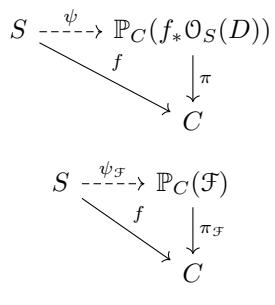
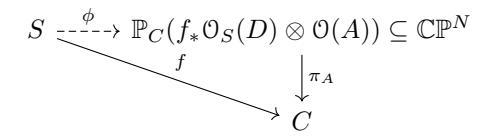
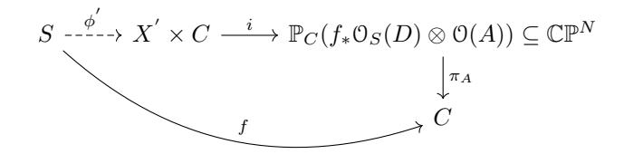
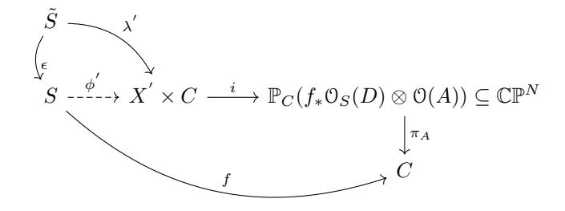
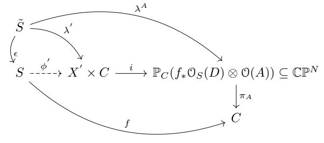
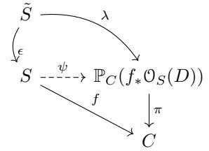
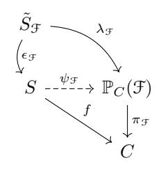

# Slope inequality for an arbitrary divisor

Houari Benammar AmmarFebruary 3,  $2023$ 

**Abstract**

Let  $f: S \longrightarrow C$  be a surjective morphism with connected fibers from a smooth complex projective surface *S* to a smooth complex projective curve *C*. Let  $D$  be an arbitrary divisor on *S* such that  $\text{rk}(f_\ast\mathcal{O}_S(D)) > 1$ . We make sense to the notion of slope inequality for *D* case by case. As a consequence, we prove: if  $f: S \to C$  is a relatively minimal fibration with  $g = g(F) \geq 2$  where *F* is the general fiber of  $f, D = K_{S/C}$  and  $N_1|_F$  (the Miyaoka divisor for the maximal destabilizing sub-vector bundle restricted to *F*) is nonspecial,  $h^0(F, N_1|_F) > 1$ , then:

$$
K_{S/C}^{2} \ge 4 \frac{(g-1)(2g-1)}{(g-1)(2g-1)+g} \deg f_* \omega_{S/C}.
$$

# 1 Introduction

Let  $f: S \to C$  be a surjective morphism from a smooth complex projective surface S to a smooth complex projective curve C with connected fibers. We call the morphism  $f$  a fibration. Let D be a divisor on S. We consider the sheaf  $\mathscr{E} = f_* \mathscr{O}_S(D)$ , which is torsion free because C is a curve. Since a torsion free sheaf on curve is always locally free sheaf,  $\mathscr{E}$  is locally free and its rank is  $h^0(F, D|_F)$  where F is a general fiber of f of genus  $g(F) = g$ .

The fibration  $f$  is called smooth if all its fibers are smooth, isotrivial if all its smooth fibers are isomorphic to each other and locally trivial if it is both smooth and isotrivial. Let  $\omega_S$  (resp  $K_S$ ) be the canonical sheaf (resp. the canonical divisor) of  $S$ ,  $\omega_{S/C} = \omega_S \otimes f^* \omega_C^{\vee}$  (resp.  $K_{S/C} = K_S - f^* K_C$ ) the relative canonical sheaf (resp. the relative canonical divisor) where  $\omega_C$  (resp.  $K_C$ ) is the canonical sheaf of  $C$  (resp. the canonical divisor). In particular, if  $D = K_{S/C}$ , then  $\mathcal{E}$  is nef vector bundle, [\[8\]](#page-9-1), its rank is g and its degree is:

$$
\begin{aligned} \deg(\mathcal{E}) &:= \deg(f_*\omega_{S/C}) = \chi(\mathcal{O}_S) - \chi(\mathcal{O}_F).\chi(\mathcal{O}_C) \\ &= \chi(\mathcal{O}_S) - (g-1)(b-1), \end{aligned}
$$

for  $b = g(C)$ . By Leray spectral sequence, we remark that:

$h^0(C, (f_\ast \omega_{S/C})^\vee) = h^0(C, \mathcal{R}^1 f_\ast \mathcal{O}_S) = q(S) - b,$ 
 
where  $q(S) = h^1(S, \mathcal{O}_S)$  is the irregularity of the surface S.

In [\[7\]](#page-9-1), Severi stated that if: S is a minimal smooth complex projective surface of maximal Albanese dimension, then  $K_S^2 \ge 4\chi(\mathcal{O}_S)$ . But the proof was not complete, the inequality was posed as a conjecture by

1

Reid, [22], and proved by Manetti, [16], under the assumption that the surface has ample canonical divisor. Finally, the conjecture is completely proved by Pardini, [21]. Xiao Gang, in [24], wrote a fundamental paper on fibred surfaces over curves. He discussed the geometry of the fibration where  $S$  is relatively minimal and  $g(F) \geq 2$ . He proved that if  $f$  is relatively minimal and not locally trivial i.e., deg  $f_\ast \omega_{S/C} \neq 0$  then:

$$
K_{S/C}^{2} \ge 4\frac{g-1}{g} \deg f_{*}\omega_{S/C}.
$$

Recall in this setting that  $K_{S/C}$  is nef divisor [20, Theorem 1.4].

Independently, Cornalba and Harris, see [\[6\]](#page-6-1), proved the above inequality for semistable fibrations (i.e., fibrations where all the fibers are semistable curves in the sense of Deligne and Mumford). Recently Yuan Xinyi and Zhang Tong, [\[25\]](#page-6-1), gave a new approach to prove the slope inequality by giving a sense to the relative Noether inequality and using Frobenius iteration techniques. Motivated by these, [\[24\]](#page-6-1), [\[6\]](#page-6-1), in addition to Fujita's fundamental papers, [\[8\]](#page-6-1), [\[9\]](#page-6-1), there has been interest in giving a sharp bound using the first and the second Fujita decomposition combined with a study of linear stability of the general fiber  $F$  of  $f$ .

Let us recall the first and second Fujita decomposition.

**Theorem 1.1** (First Fujita decomposition for fibred surface, [\[8\]](#page-8-1)). Let  $f: S \to C$  be a fibration from a smooth complex projective surface  $S$  to a smooth projective curve  $C$ . Then:

$$
f_*\omega_{S/C} = \mathcal{O}_C^{q(S)-b} \oplus \mathcal{N},
$$

where N is a nef sub-vector bundle and  $h^0(C, N^{\vee}) = 0$ .We remark that in conclusion of Theorem 1.1, the trivial part comes from a nonzero global section of the dual of  $f_\ast \omega_{S/C}$  i.e., from  $H^0(C, \mathcal{R}^1 f_\ast \mathcal{O}_S)$ .

**Theorem 1.2** (Second Fujita decomposition for fibred surface, [\[9\]](#page-9-1), [\[3\]](#page-3-1), [\[4\]](#page-4-1), [\[5\]](#page-5-1)). Let  $f : S \to C$  be a fibration as above. Then:

$$
f_*\omega_{S/C} = \mathcal{A} \oplus \mathcal{U},
$$

where  $\mathcal{A}$  is ample sub-vector bundle and  $\mathcal{U}$  is unitary flat sub-vector bundle.

In the situation of Theorem 1.2, we denote by  $u_f$  the rank of  $\mathcal{U}$ , and call it the *unitary rank* of the fibred surface  $f: S \to C$ .

A proof of the second Fujita decomposition is given by Catanese and Dettweiler, [\[3\]](#page-3-1), [\[4\]](#page-4-1), [\[5\]](#page-5-1). A more recent paper using these type of arguments is due to Riva and Stoppino [\[23\]](#page-23-1), they proved the following inequalities:

$$
K_{S/C}^2 \ge 2\frac{2g-2-m}{g-m} \deg(f_*\omega_{S/C}).
$$

Here  $m := min(q_f, c_f), q_f := q(s) - b$  is the relative irregularity of  $f$ ,  $c_f$  is the Clifford index of  $f$ .

More precisely, we recall, [\[1\]](#page-1-1), that the Clifford index for a curve B of genus  $g(B) \geq 4$  as:

$$
\text{Cliff}(B) := \min\{\deg(D) - 2(\dim|D|) \mid h^0(B,D) \ge 2, \ h^1(B,D) \ge 2\}.
$$

In the cases  $g = 2, 3$  the Clifford index is defined to be:

2

- If  $g = 2$ ,  $\text{Cliff}(B) := 0$ .
- If  $g = 3$ ,  $\text{Cliff}(B) := 0$  (resp. 1) if B is hyperelleptic (resp. trigonal).

Given a fibred surface  $f: S \to C$ , we define  $c_f$  as the Clifford index of the general fiber F. Riva and Stoppino [23] proved also this second inequality:

$$
K_{S/C}^2 \ge \begin{cases} 2^{\frac{2g-2-u_f}{g-u_f}}, & \text{if } u_f \le c_f. \\ 2^{\frac{(2g-2-c_f)(g-1-u_f)}{(g-u_f)(g-1-c_f)}}, & \text{else.} \end{cases}
$$

Konno, in [14], described directly  $K_{S/C}^2$  as a sum of two parts under some strict conditions on the fibration  $f$ . More precisely, the first part is related to deg  $f_\ast \omega_{S/C}$  and the second one is described by the Horikawa index [\[12\]](#page-9-1).

Now, we introduce the following notations:

•  $N_1$  is the Miyaoka divisor [Definition 3.3] of the maximal destabilising sub-vector bundle in the Harder-Narasimhan filtration [Proposition  $3.1$ ] and:

$$
\alpha = \begin{cases} \frac{g(F)}{h^0(D,D|_F)-1}, & \text{if } N_1|_F \text{ is nonspecial and } h^0(F,N_1|_F) > 1. \\ 2 & \text{else.} \end{cases}
$$

- $\mu_f$  is the final slope of the filtration.

- $F$  is the general fiber of  $f$ .

- $\epsilon$  is a suitable birational morphism.

- $Z_f$  is the fixed part of  $f_*\mathcal{O}_S(D)$ .

• $$N_D := \frac{2\epsilon^* D.Z_f - Z_f^2}{\deg f_* \mathcal{O}_S(D)}$$
, describes the negativity of  $D$  and  $f_* \mathcal{O}_S(D)$  when  $\deg f_* \mathcal{O}_S(D) \neq 0$ .

- $N_D^{\mathfrak{g}} := \frac{2\epsilon^* D.Z_f Z_f^2}{\deg \mathfrak{g}}, \text{ for a locally free sub-sheaf } \mathfrak{g} \subseteq \mathcal{E} := f_*\mathfrak{O}_S(D) \text{ and } \deg \mathfrak{g} \neq 0.$

- $d_f := N_f.F$  and  $d_f^{\mathcal{G}} := N_f^{\mathcal{G}}.F$ , where  $N_f$  (resp.  $N_f^{\mathcal{G}}$ ) is the last Miyaoka divisor for  $\mathcal{E}$  (resp.  $\mathcal{G}$ )  $[Definition 3.3].$

We state our main result:

**Theorem 1.3.** Let  $f : S \to C$  be a fibration from a smooth complex projective surface to a smooth complex projective curve, let D be an arbitrary divisor on S such that  $\operatorname{rk} \mathcal{\varepsilon} = \operatorname{rk}(f_*\mathcal{O}_S(D)) > 1$  Then:• If D is nef and  $\mu_f \geq 0$  we have:

$$
D^2 \ge \frac{2\alpha d_f}{d_f + \alpha} \deg f_* \mathcal{O}_S(D).
$$

3

• If D is nef,  $\mu_f < 0$  and  $\exists \mathcal{G} \subsetneq \mathcal{E}$  nef locally free sub-sheaf, we have:

$$
D^{2} \geq \frac{2\alpha d_{f}^{g}}{d_{f}^{g} + \alpha} \deg g.
$$

• If  $(\mu_f < 0 \text{ and there is no nef locally free sub-sheaf of } \mathcal{E})$  or  $(D \text{ is not nef and } (\mu_f > 0 \text{ or } (\mu_f = 0 \text{ and } \mu_f > 0 \text{ or } \mu_f = 0 \text{ and } \mu_f > 0 \text{ or } \mu_f = 0 \text{ and } \mu_f > 0 \text{ or } \mu_f = 0 \text{ and } \mu_f > 0 \text{ or } \mu_f = 0 \text{ and } \mu_f > 0 \text{ or } \mu_f = 0 \text{ and } \mu_f > 0 \text{ or } \mu_f = 0 \text{ and } \mu_f > 0 \text{ or } \mu_f = 0 \$  $\mathcal{E}$  is not semi-stable)), we have:

$$
D^{2} \geq \left(\frac{2\alpha d_{f}}{d_{f} + \alpha} + N_{D}\right) \deg f_{*}\mathcal{O}_{S}(D).
$$

• If D is not nef,  $\mu_f < 0$  and  $\exists \mathcal{G} \subsetneq \mathcal{E}$  nef locally free sheaf such that  $\mu_f^{\mathcal{G}} > 0$  or  $(\mu_f^{\mathcal{G}} = 0$  and  $\mathcal{G}$  is not  $sem-stable)$  then:

$$
D^{2} \geq \left(\frac{2\alpha d_{f}^{\mathcal{G}}}{d_{f}^{\mathcal{G}} + \alpha} + N_{D}^{\mathcal{G}}\right) \deg \mathcal{G}.
$$

• Otherwise, if  $D^2 < 0$  and  $\forall \mathcal{G} \subseteq \mathcal{E}$  nef  $\Longrightarrow \deg \mathcal{G} = 0$ . There is no sense to the slope inequality.

For the particular case that f is relatively minimal and  $D = K_{S/C}, N_1|_F$  is nonspecial and  $h^0(F, N_1|_F) > 1$ . The Theorem  $1.3$  takes the following form:

**Corollary 1.4.** Let  $f: S \to C$  be a relatively minimal fibration with  $g(F) \geq 2$  and  $D = K_{S/C}$ , if  $N_1|_F$  is nonspecial and  $h^0(F, N_1|_F) > 1$ . Then:
$$K_{S/C}^2 \ge 4 \frac{(g-1)(2g-1)}{(g-1)(2g-1)+g} \deg f_* \omega_{S/C}.$$

Acknowledgements. I am very grateful to my advisors Steven Lu and Nathan Grieve for their constant help, invaluable advice and financial support. I would like to thank Ruiran Sun for his interest in the paper.

In the next sections, we let  $f: S \to C$  be a fibration, from a smooth projective surface  $S$  to a smooth projective curve  $C$ , and we let  $D$  be a divisor on  $S$ .

# 2 Rational map to a projective bundle

Let  $\mathcal{F} \subseteq f_*\mathcal{O}_S(D)$  be a locally free sub-sheaf of rank  $r_{\mathcal{F}}$ . There exist always the following commutative  $\text{diagrams:}$ 

In the above,  $\mathbb{P}_C(f_*\mathcal{O}_S(D))$  (resp  $\mathbb{P}_C(\mathcal{F})$ ) is the projective bundle of one dimensional quotients (Grothendieck's notations) of  $f_*\mathcal{O}_S(D)$  (resp of  $\mathcal{F}$ ), the morphism  $\pi$  (resp  $\pi_{\mathcal{F}}$ ) is the projective morphism from  $\mathbb{P}_C(f_*\mathcal{O}_S(D))$  to  $C$  (resp from  $\mathbb{P}_C(\mathcal{F})$  to  $C$ ). The maps  $\psi$  and  $\psi_{\mathcal{F}}$  are rational and defined by the following evaluation maps:

$$
f^*f_*\mathcal{O}_S(D) \longrightarrow \mathcal{O}_S(D)
$$

 $resp:$ 

$$
f^*\mathcal{F} \longrightarrow \mathcal{O}_S(D).
$$

**Remark 2.1. ** • If  $D$  is  $f$ -globally generated. Then:

$$
f^*f_*\mathcal{O}_S(D) \longrightarrow \mathcal{O}_S(D)
$$

is surjective and  $\psi$  is a morphism.• If the map

$$
f^*\mathcal{F} \longrightarrow \mathcal{O}_S(D)
$$

is surjective, then  $\psi_{\mathcal{F}}$  is a morphism.

Take A, a sufficiently very ample divisor such that  $f_\ast\mathcal{O}_S(D)\otimes\mathcal{O}(A)$  is a very ample vector bundle. Then the rank of  $f_\ast\mathcal{O}_S(D)\otimes\mathcal{O}(A)$  is

$$
r = H^0(F, D|_F).
$$

 $\text{And}$ 

$$
\deg(f_\ast \mathcal{O}_S(D) \otimes \mathcal{O}(A)) = \deg f_\ast \mathcal{O}_S(D) + r \cdot \deg(A).
$$

**Remark 2.2.** Since  $f_\ast \mathcal{O}_S(D) \otimes \mathcal{O}(A)$  is globally generated, i.e.,  $\exists n > 0$  such that we have a surjective map

$$
\mathcal{O}_C^{\oplus n} \longrightarrow f_*\mathcal{O}_S(D) \otimes \mathcal{O}(A),
$$

or, equivalently, for any  $y \in C$  we have a surjective map giving by evaluation of section:

$$
H^{0}(C, f_{*}\mathcal{O}_{S}(D) \otimes \mathcal{O}(A)) \longrightarrow f_{*}\mathcal{O}_{S}(D) \otimes \mathcal{O}(A)|_{y},
$$

we remark that each section in  $H^0(F, D|F)$  comes from some section of  $H^0(C, f_*
\mathcal{O}_S(D) \otimes \mathcal{O}(A))$ . In other words, the following map is surjective

$$
H^0(C, f_*\mathcal{O}_S(D) \otimes \mathcal{O}(A)) \simeq H^0(S, D + f^*A) \longrightarrow H^0(F, D|F).
$$

Now,  $\mathbb{P}_C(f_\ast\mathcal{O}_S(D)\otimes\mathcal{O}(A))$  and  $\mathbb{P}_C(f_\ast\mathcal{O}_S(D))$  are isomorphic by an isomorphism s, see [11, Lemma 7.9]. Since

$$
\mathbb{P}_{C}(f_{*}\mathcal{O}_{S}(D) \otimes \mathcal{O}(A)) \subseteq \mathbb{P}(\mathcal{O}_{C}^{\oplus n}) = \mathbb{C}\mathbb{P}^{n} \times C,
$$

we can identify  $\mathbb{P}_C(f_*\mathcal{O}_S(D)\otimes\mathcal{O}(A))$  with  $X\times C$  such that X is a projective variety in  $\mathbb{CP}^n$ .

The rational map

$$
\phi: S \dashrightarrow \mathbb{P}_C(f_*\mathbb{O}_S(D) \otimes \mathbb{O}(A)),
$$

 $\text{defined by:}$ 

$$
f^*(f_*\mathcal{O}_S(D)\otimes\mathcal{O}(A))\longrightarrow \mathcal{O}_S(D)\otimes f^*\mathcal{O}(A)
$$

5

is the rational map given by the linear system  $|D + f^*A|$ , and for a general fibre  $F$  of  $f$ ,  $\phi|_F$  is the map defined by  $|D|_F|$ .

The line bundle  $\mathcal{O}_{\mathbb{P}_C(f_*\mathcal{O}_S(D)\otimes\mathcal{O}(A))}(1)$  on  $\mathbb{P}_C(f_*\mathcal{O}_S(D)\otimes\mathcal{O}(A))$  is very ample. Then it gives an embedding of this last projective bundle to a projective space  $\mathbb{CP}^N$ . We have the following commutative diagram:

Where  $\pi_A$  is the projection map, again we have  $\psi = s \circ \phi$ , the rational map  $\phi$  is defined by the complete linear system  $|D + f^*A|$ , if it has no nontrivial fixed part then its image is contained in no hyperplane.

We assume that there is a fixed part Z of  $|D + f^*A|$ , so the linear system  $|D - Z + f^*A|$  factorizes the map defined by  $|D + f^*A|$  and it defines a rational map  $\phi'$  such that the following diagram is commutative:

Where  $X'$  is a closed sub-variety of  $X$ ,  $i$  is an injection from  $X' \times C$  to  $\mathbb{C}P^{N}$  and  $i \circ \phi' = \phi$ .

- The fixed part Z of  $|D+f^*A|$  restricted in F is just the fixed part of the complete linear system  $|D|_F$ .
- The system  $|D Z + f^*A|$  has no fixed part, so it has only a finite number of base points.
- The fixed part  $Z$  is a divisor such that the homomorphism:

$$
f^{*}(f_{*}\mathcal{O}_{S}(D)\otimes \mathcal{O}(A))\longrightarrow \mathcal{O}_{S}(D-Z)\otimes f^{*}\mathcal{O}(A),
$$

is surjective in codimension  $1$ .

• If  $D = K_{S/C}$  and  $g(F) \geq 2$ , then the fixed part Z has no horizontal components.

**Theorem 2.3.** There exist a surface  $\tilde{S}$  birational to  $S$  (i.e  $\exists \epsilon : \tilde{S} \to S$  which is birational) and a morphism

$$
\lambda^{'}: \tilde{S} \longrightarrow X^{'} \times C
$$

such that the following diagram is commutative:

6

 $\phi' \circ \epsilon = \lambda'$  and:

$$
(\lambda')^* \mathcal{O}_{X' \times C}(1) = \epsilon^* (\mathcal{O}(D - Z) \otimes f^* \mathcal{O}(A)) \otimes \mathcal{O}(-E).
$$

Where  $E$  is the exceptional divisor of  $\epsilon$ .

**Remark 2.4.**  $\epsilon^* (\mathcal{O}(D - Z) \otimes f^* \mathcal{O}(A)) \otimes \mathcal{O}(-E)$  is globally generated.

Proof of Theorem 2.3. If  $|D - Z + f^*A|$  has no base point, then  $\phi'$  is a morphism and there is nothing to prove. We suppose that there is a base point  $x$  in  $|D - Z + f^*A|$ . We take the blow-up in  $x$  defined by  $\epsilon^1$ , so  $|(\epsilon^1)^*(D - Z + f^*A)|$  has a fixed part  $k_1E_1$  with  $k_1 \in \mathbb{Z}, k_1 \ge 1$  and  $|D_1| = |(\epsilon^1)^*(D - Z + f^*A) - k_1E_1|$  has no fixed part. Hence it defines a rational map:  $\lambda^1 : S_1 \dashrightarrow X' \times C$  which is identical to  $\phi' \circ \epsilon^1$ . If  $\lambda^1$  is a morphism, then we are done; if not, we repeat the process. Thus, we get by induction a sequence  $\epsilon^i: S_i \longrightarrow S_{i-1}$  of blow-ups and a linear system  $|D_i|$  with no fixed part, where  $D_i = (\epsilon^i)^* D_{i-1} - k_i E_i$  for  $i \geq 1$ . But we have:

$$
D_i^2 = D_{i-1}^2 - k_i^2 < D_{i-1}^2.
$$

Since  $D_i$  has no fixed part,  $D_i^2 ">= 0$  and so this process must terminate. In other words, we arrive at a system  $D_n$  with no base points, which defines a morphism:

$$
\epsilon = \epsilon^1 \circ \dots \circ \epsilon^n : \tilde{S} \longrightarrow S.
$$

We conclude that  $|\epsilon^*(D - Z + f^*A) - E|$  define a morphism  $\tilde{S} \xrightarrow{\lambda'} X' \times C$  such that:

$$
\mathfrak{C}^*(\mathfrak{O}(D-Z)\otimes f^*\mathfrak{O}(A))\otimes \mathfrak{O}(-E)=(\lambda^{'})^*\mathfrak{O}_{X'\times C}(1).
$$

Where  $E = \sum_{i=1}^{i=n} K_i E_i$  is the exceptional divisor.

The last proof is inspired by the proof of  $[2, Theorem 2.7].$ 

**Corollary 2.5.** There exist a morphism  $\lambda^A : \tilde{S} \to \mathbb{P}_C(f_*\mathcal{O}_S(D) \otimes \mathcal{O}_S(A))$  such that the following diagram is commutative:

*Proof.* We take  $\lambda^A = i \circ \lambda'$  and it is a well-defined morphism defined from  $\tilde{S}$  to  $\mathbb{P}_C(f_*\mathcal{O}_S(D) \otimes \mathcal{O}(A))$  and clearly verifies the property that:

$$
(\lambda^A)^* \mathcal{O}_{\mathbb{P}_C(f_*\mathcal{O}_S(D)\otimes \mathcal{O}(A))}(1) = \epsilon^*(\mathcal{O}(D-Z)\otimes f^*\mathcal{O}(A))\otimes \mathcal{O}(-E),
$$

 $also:$ 

$$
\pi_A \circ \lambda^A = f \circ \epsilon.
$$

 $\Box$ 

7

**Corollary 2.6.** There exist a morphism  $\lambda : \tilde{S} \to \mathbb{P}_C(f_*\mathbb{O}_S(D))$  such that the following diagram is  $commutative.$ 

and we have:

$$
(\lambda)^*(\mathcal{O}_{\mathbb{P}_C(f_*\mathcal{O}_S(D))}(1)) = \epsilon^*(\mathcal{O}(D-Z)) \otimes \mathcal{O}(-E).
$$

*Proof.* By Theorem 2.3 and Corollary 2.5, there exist a morphism  $\lambda^A : \tilde{S} \longrightarrow \mathbb{P}_C(f_*\mathcal{O}_S(D) \otimes \mathcal{O}(A))$  which has the property that:

$$
(\lambda^A)^*\mathcal{O}_{\mathbb{P}_C(f_*\mathcal{O}_S(D)\otimes\mathcal{O}(A))}(1) = \epsilon^*(\mathcal{O}(D-Z)\otimes f^*\mathcal{O}(A))\otimes\mathcal{O}(-E).
$$

But  $\exists s : \mathbb{P}_C(f_* \mathcal{O}_S(D) \otimes \mathcal{O}(A)) \longrightarrow \mathbb{P}_C(f_* \mathcal{O}_S(D))$  which is an isomorphism such that:

$$
\mathcal{O}_{\mathbb{P}_C(f_*\mathcal{O}_S(D)\otimes\mathcal{O}(A))}(1) = s^*\mathcal{O}_{\mathbb{P}_C(f_*\mathcal{O}_S(D))}(1) \otimes \pi_A^*\mathcal{O}(A)
$$

$$
\implies (s \circ \lambda^A)^*\mathcal{O}_{\mathbb{P}_C(f_*\mathcal{O}_S(D))}(1) \otimes (\pi_A \circ \lambda^A)^*\mathcal{O}(A)
$$

$$
= \epsilon^*(\mathcal{O}(D-Z)) \otimes (f \circ \epsilon)^*\mathcal{O}(A) \otimes \mathcal{O}(-E)
$$

$$
\implies (s \circ \lambda^A)^*\mathcal{O}_{\mathbb{P}_C(f_*\mathcal{O}_S(D))}(1) = \epsilon^*(\mathcal{O}(D-Z)) \otimes \mathcal{O}(-E).
$$

We take  $\lambda = s \circ \lambda^A$ .

 $\Box$

**Remark 2.7.** More generally, for  $\mathcal{F} \subseteq f_*\mathcal{O}_S(D)$  a locally free sub-sheaf, we take  $A$  a sufficiently very ample divisor such that  $\mathcal{F}\otimes\mathcal{O}(A)$  is very ample. Let  $L_{\mathcal{F}}$  be a sub-linear system of  $|D+f^*A|$  which corresponds to sections of  $H^0(\mathcal{F}\otimes\mathcal{O}(A))$ . Let  $Z_{\mathcal{F}}$  be a fixed part of  $L_{\mathcal{F}}$ , so  $L_{\mathcal{F}}-Z_{\mathcal{F}}$  has no fixed part and it corresponds to a rational map from  $S$  to a projective sub-variety of  $\mathbb{P}_C(\mathcal{F}\otimes\mathcal{O}(A))$ . By the same arguments above  $\exists \ \tilde{S}_{\mathcal{F}} \xrightarrow{\epsilon_{\mathcal{F}}} S$  which is birational and  $\exists \lambda_{\mathcal{F}} : \tilde{S}_{\mathcal{F}} \longrightarrow \mathbb{P}_{C}(\mathcal{F})$  such that the following diagram is commutative:

and

$$
(\lambda_{\mathcal{F}})^*(\mathcal{O}_{\mathbb{P}_C(\mathcal{F})}(1)) = \epsilon_{\mathcal{F}}^*(\mathcal{O}(D - Z_{\mathcal{F}})) \otimes \mathcal{O}(-E_{\mathcal{F}}),
$$

where  $E_{\mathcal{F}}$  is the exceptional divisor of  $\epsilon_{\mathcal{F}}$ .

8

# Harder-Narasimhan filtration 3

In this section, we study Harder-Narasimhan filtration within the context of fibred surfaces.

**Proposition 3.1** ([10]). Let  $\mathcal{E}$  a vector bundle over a smooth projective curve B. There exists a unique sequence of vector sub-bundles of  $\mathcal{E}$ :

$$
0 = \mathcal{F}_0 \subsetneq \mathcal{F}_1 \subsetneq \dots \subsetneq \mathcal{F}_{k-1} \subsetneq \mathcal{F}_k = \mathcal{E},
$$

that satisfy the following conditions:

- for  $i = 1, ..., k$ ,  $\mathfrak{F}_i/\mathfrak{F}_{i-1}$  is a semi-stable vector bundles.

- for any  $i = 1, ..., k$ , setting  $\mu_i := \mu(\mathcal{F}_i/\mathcal{F}_{i-1}) = \frac{\deg(\mathcal{F}_i/\mathcal{F}_{i-1})}{\operatorname{rk}(\mathcal{F}_i/\mathcal{F}_{i-1})}$ , we have that:  $\mu_1 > \mu_2 > \ldots > \mu_k.$

In the context of Proposition 3.1 above, the filtration is called the *Harder-Narasimhan filtration* of  $\mathcal{E}$ . We set  $\mu_f = \mu_k$  and call it the *final slope* of  $\mathcal{E}$ .

The following elementary lemma is important in what follows.

**Lemma 3.2.** Let  $r_i$  be the rank of  $\mathcal{F}_i$ . Then:

$$
\deg \mathcal{E} = \sum_{i=1}^{k-1} r_{i}(\mu_{i} - \mu_{i+1}) + r_{k}\mu_{k}.
$$

$Proof.$  Indeed, we consider the exact sequence:

$$
0 \longrightarrow \mathcal{F}_{k-1} \longrightarrow \mathcal{F}_k \longrightarrow \mathcal{F}_k/\mathcal{F}_{k-1} \longrightarrow 0.
$$

From the additivity of degree, we have that:

$$
\deg \mathcal{F}_k = \deg \mathcal{F}_{k-1} + \deg \mathcal{F}_k / \mathcal{F}_{k-1}.
$$

Similarly, we have that

$$
\deg \mathcal{F}_{k-1} = \deg \mathcal{F}_{k-2} + \deg \mathcal{F}_{k-1} / \mathcal{F}_{k-2}.
$$

And so, by induction, we can conclude that:

$$
\deg \mathcal{F}_k = \sum_{i=1}^k \deg \mathcal{F}_i / \mathcal{F}_{i-1}.
$$

From the definition of slope, for every  $i = 1, ..., k$  we have:  $\deg \mathcal{F}_i/\mathcal{F}_{i-1} = \mu_i(r_i - r_{i-1})$  and we obtain the desired formula. 

 $\Box$ 
 
 9
 
 Consider now a fibred surface  $f: S \to C$  and let  $(\mathcal{F}_i)$  be the Harder-Narasimhan filtration of  $\mathcal{E} = f_* \mathcal{O}_S(D)$ . By Corollary 2.6 and Remark 2.7, there exists a suitable smooth projective surface  $\tilde{S}$  and a birational morphism  $\epsilon : \tilde{S} \to S$  such that:

$$
\lambda^*(\mathcal{O}_{\mathbb{P}_C(f_*\mathcal{O}_S(D))}(1)) = \epsilon^*(\mathcal{O}(D-Z)) \otimes \mathcal{O}(-E)
$$

moreover, for any  $\mathcal{F}_i$  in the filtration, we have:

$$
\lambda_i^*(\mathcal{O}_{\mathbb{P}_C(\mathcal{F}_i)}(1)) = \epsilon^*(\mathcal{O}(D - Z_{\mathcal{F}_i})) \otimes \mathcal{O}(-E)
$$

Where  $\lambda_i := \lambda_{\mathcal{F}_i}$ ,  $Z$  (resp.  $Z_{\mathcal{F}_i}$ ) is a fixed part of  $|D + f^*A|$  (resp. of  $L_{\mathcal{F}_i} \subseteq |D + f^*A|$ ) which correspond to a sections of  $H^0(\mathcal{F}_i \otimes \mathcal{O}(A))$ ). Here  $E$  is the exceptional divisor of  $\epsilon$ .

**Definition 3.3** (See [\[23, Definition 3.11\]](#page-2-2)). In this setting, just described above, we define:

- $Z(D, \mathcal{F}_i) = \epsilon^* Z_{\mathcal{F}_i} + E$  the *fixed part* of the vector sub-bundle  $\mathcal{F}_i$ .

- $M(D, \mathcal{F}_i) = \lambda_i^* (\mathcal{O}_{\mathbb{P}_C(\mathcal{F}_i)}(1))$  the *moving part* of the vector sub-bundle  $\mathcal{F}_i$ .

- Set  $N(D, \mathcal{F}_i) := M(D, \mathcal{F}_i) \mu_i F$ . We call it the *Miyaoka divisor*.

Applying,  $[17]$ ,  $[19]$  and  $[15,$  Proposition 6.4.11] we prove the following result:

**Lemma 3.4.**  $N(D, \mathcal{F}_i)$  are nef divisors on  $\mathcal{S}$ .

*Proof.* Let's see that  $\mathcal{E}\langle -\frac{c_1(\mathcal{E}/\mathcal{F}_{k-1})}{rk(\mathcal{E}/\mathcal{F}_{k-1})}\rangle$  is nef vector bundle. Note:

$$
\mathfrak{G}_{i} = \mathfrak{F}_{i} / \mathfrak{F}_{i-1}.
$$

$$
\delta_{i} = \frac{c_{1}(G_{i})}{\operatorname{rk}(G_{i})}.
$$

$\mathcal{G}_i \langle -\delta_i \rangle$  is nef vector bundle, [15, Proposition 6.4.11], and deg  $\delta_i = \mu_i$ . So: $-\deg \delta_1 < -\deg \delta_2 < \dots < -\deg \delta_k$ .

This implies that  $\mathcal{G}_i(-\delta_k)$  is nef vector bundle. We have:

$$
0 \longrightarrow \mathcal{F}_{k-1}\langle -\delta_k \rangle \longrightarrow \mathcal{E}\langle -\delta_k \rangle \longrightarrow \mathcal{G}_k\langle -\delta_k \rangle \longrightarrow 0.
$$

$\mathcal{G}_k\langle -\delta_k\rangle$  is nef vector bundle and  $\mathcal{F}_{k-1}\langle -\delta_k\rangle$  is nef by induction.  $\Longrightarrow \mathcal{E}\langle -\delta_k\rangle$  is nef.  $\Longrightarrow N(D,\mathcal{E})$  is nef. The proof is the same for  $N(D, \mathcal{F}_i)$ .    $\Box$ 

**Lemma 3.5.** $r_i = \operatorname{rk} \mathcal{F}_i \leq h^0(F, N(D, \mathcal{F}_i)|_F)$ .

*Proof.* Let  $\pi_i$  be the projection from  $\mathbb{P}_C(\mathcal{F}_i)$  to  $C$ , we have:

$$
(\pi_i \circ \lambda_i)_*(M(D, \mathcal{F}_i)) = (\pi_i)_*((\lambda_i)_*M(D, \mathcal{F}_i))
$$
  
$$
= (\pi_i)_*(\mathcal{O}_{\mathbb{P}_C(\mathcal{F}_i)}(1) \otimes \lambda_{i*}\mathcal{O}_{\tilde{S}}) \supseteq (\pi_i)_*(\mathcal{O}_{\mathbb{P}_C(\mathcal{F}_i)}(1)) = \mathcal{F}_i
$$
  
$$
\implies r_i \leq h^0(F, M(D, \mathcal{F}_i)|_F)
$$
  
$$
\implies r_i \leq h^0(F, N(D, \mathcal{F}_i)|_F).
$$

10

For simplification, set  $N_i = N(D, \mathcal{F}_i)$  and  $M_i = M(D, \mathcal{F}_i)$ ,  $Z_i = Z(D, \mathcal{F}_i)$ .**Proposition 3.6.** Let  $d_i = \deg(N_i|F) = N_i.F$ , we have:

$$
d_k \ge d_{k-1} \ge \dots \ge d_1 \ge 0.
$$

*Proof.* Since F is a fibre,  $F^2 = 0$ . Thus:

$$
d_i = N_i.F = (M_i - \mu_i F).F = M_i.F
$$

$$
= \lambda_i^* (\mathcal{O}_{\mathbb{P}_C(\mathcal{F}_i)}(1)).F = (\epsilon^* (D - Z_{\mathcal{F}_i}) - E).F
$$

$$
= \epsilon^* (D - Z_{\mathcal{F}_i}).F = (D - Z_{\mathcal{F}_i}).F \ge 0.
$$

Thus,

$$
D - Z_{\mathcal{F}_{i+1}} = D - Z_{\mathcal{F}_i} + (Z_{\mathcal{F}_i} - Z_{\mathcal{F}_{i+1}})
$$

But :  $Z_{\mathcal{F}_i} \geq Z_{\mathcal{F}_{i+1}}$ . Thus,  $D - Z_{\mathcal{F}_{i+1}} = D - Z_{\mathcal{F}_i} + (Z_{\mathcal{F}_i} - Z_{\mathcal{F}_{i+1}})$ $\Longrightarrow d_{i+1} \geq d_i$ .
 
**Proposition 3.7.** If N1|F is nonspecial divisor on F. Then Nj|F is nonspecial divisor on F for any j ≥ 1.Or more generally: if ∃ i ≥ 1 such that Ni|F is nonspecial. Then Nj|F is nonspecial divisor on F for j ≥ i.

**Proof.** Recall that

$$
Z_{\mathcal{F}_1} \geq \ldots \geq Z_{\mathcal{F}_k}
$$

Thus

$$
N_1|_F = \epsilon^*(D - Z_{\mathcal{F}_1})|_F = (D - Z_{\mathcal{F}_1})|_F \le (D - Z_{\mathcal{F}_i})|_F
$$

So, if  $h^1(F, D - Z_{\mathcal{F}_1}|_F) = 0$ . Then  $h^1(F, D - Z_{\mathcal{F}_i}|_F) = 0$ .

Now, it is natural to ask about the sequence  $(\frac{d_i}{h^0(F, N_i|_F)-1})_{i \in \{1, ..., k\}}$ . For instance, is it increasing finite sequence? Is it decreasing? Is it bounded from below by strictly positive number? So we have the following results:

**Lemma 3.8.** If  $\exists t \in \{1, ..., k\}$  such that  $h^0(F, N_t|_F) = 1$ . Then  $t = 1$ .*Proof.* We have  $h^0(F, N_t|_F) \ge \operatorname{rk}(\mathcal{F}_t)$ . So, if  $h^0(F, N_t|_F) = 1$  the only possibility is  $t = 1$  and more than that the degree:  $d_1 = g(F) - h^1(F, N_1|_F)$ .

**Theorem 3.9.** Let  $f: S \to C$  be a fibration as above,  $D$  be a divisor on  $S$  such that  $rk(\mathcal{E}) = rk(f_*\mathcal{O}_S(D)) > 1$  and  $h^0(F, N_1|_F) > 1$ . Consider the Harder-Narasimhan filtration  $(\mathfrak{F}_i)$  of  $\mathcal{E}$ . Then, we have the following result:

• If  $N_1|_F$  is nonspecial divisor and if:-  

$g(F) = 0$ . Then:

$$
\frac{d_k}{h^0(N_k|F) - 1} = \dots = \frac{d_{i+1}}{h^0(N_{i+1}|F) - 1} = \frac{d_i}{h^0(N_i|F) - 1}
$$

$$
= \dots = \frac{d_1}{h^0(N_1|F) - 1} = 1.
$$

 $\Box$ 

11

 $-g(F) \ge 1$ . Then:

$$
1 + \frac{g(F)}{h^0(D, D|_F) - 1} \le \frac{d_k}{h^0(N_k|_F) - 1} \le \dots \le \frac{d_{i+1}}{h^0(N_{i+1}|_F) - 1}
$$

$$
\le \frac{d_i}{h^0(N_i|_F) - 1} \le \dots \le \frac{d_1}{h^0(N_1|_F) - 1}.
$$

• if  $\exists t \in \{1, ..., k\}$  such that  $N_t|_F$  is special and  $N_{t+1}|_F$  is nonspecial and if:

-  $g(F) = 0$ . *Then:*

$$
\frac{d_k}{h^0(N_k|_F) - 1} = \dots = \frac{d_{t+1}}{h^0(N_{t+1}|_F) - 1} = 1.
$$

$- g(F) \ge 1$ . Then:

$$
1 + \frac{g(F)}{h^0(D, D|F) - 1} \le \frac{d_k}{h^0(N_k|F) - 1} \le \dots \le \frac{d_{t+1}}{h^0(N_{t+1}|F) - 1}.
$$

And we have:  $\frac{d_i}{h^0(N_i|_F)-1} \ge 2$ ,  $\forall i \le t$ .

*Proof.* If  $N_1|_F$  is nonspecial. Then by Riemann-Roch:

$$
h^{0}(N_{i}|F) = d_{i} + 1 - g(F).
$$

• If  $g(F) = 0$ , then:

$$
h^0(N_i|_F) = d_i + 1,
$$

and so evidently:

$$
\frac{d_{i+1}}{h^0(N_{i+1}\mid F) - 1} = \frac{d_i}{h^0(N_i \mid F) - 1} = 1.
$$

• If  $g(F) \ge 1$ , since:

$$
h^{0}(N_{i+1}|F) = h^{0}(N_{i}|F) + d_{i+1} - d_{i}, \quad \forall i \in \{1, 2, ...k\}.
$$

It follows that:

$$
\frac{d_{i+1}}{h^0(N_{i+1}|F) - 1} = \frac{d_i + d_{i+1} - d_i}{h^0(N_i|F) + d_{i+1} - d_i - 1} \le \frac{d_i}{h^0(N_i|F) - 1}.
$$

Now we have  $\forall i \in \{1,\dots,k\}, h^0(F, N_i|_F) \leq h^0(F, D|_F)$  because  $N_i|_F = (D - Z_{\mathcal{F}_i})|_F$  and  $Z_{\mathcal{F}_i}$  is an effective divisor. Using Riemann-Roch, we have:

$$
\frac{d_i}{h^0(N_i|_F)-1} \ge 1 + \frac{g(F)}{h^0(D,D|_F)-1}.
$$

Now, suppose that  $\exists t \in \{1, ..., k\}$  such that  $N_t|_F$  is special and  $N_{t+1}|_F$  is nonspecial. So  $N_i|_F$  is special for  $i \leq t$  and  $N_i|_F$  is nonspecial for  $i \geq t+1$  and as above:

12

• If  $g(F) = 0$  then:

$$
\frac{d_k}{h^0(N_k|_F)-1} = \dots = \frac{d_{t+1}}{h^0(N_{t+1}|_F)-1} = 1.
$$

• If  $g(F) \ge 1$  then:

$$
1 + \frac{g(F)}{h^0(D, D|_F) - 1} \le \frac{d_k}{h^0(N_k|_F) - 1} \le \dots \le \frac{d_{t+1}}{h^0(N_{t+1}|_F) - 1}.
$$

For  $i \leq t$ , by Clifford theorem, [\[1\]](#page-0-1), we have:

$$
d_i \ge 2(h^0(N_i|_F) - 1)
$$

$$
\Longrightarrow \frac{d_i}{h^0(N_i|_F) - 1} \ge 2.
$$

$$\square$$

# 4 Slope inequality.

Now, we are ready to present the technical lemma to our method, we called it the **Modified Xiao Lemma**. Note that it is a more general form of Xiao  $[24, \text{Lemma } 2]$ .

**Lemma 4.1** (Modified Xiao Lemma). Let  $f: S \to C$  be a fibration, D be a divisor on S and suppose that there exist a sequence of effective divisors:

$$
Z_1 \ge Z_2 \ge \dots \ge Z_k,
$$

and a sequence of rational numbers:

$$
\mu_1 > \mu_2 > \ldots > \mu_k,
$$

such that for every  $i \in \{1, ..., k\}$  we have:

$$
\mathcal{N}_i := D - Z_i - \mu_i F
$$

are nef  $\mathbb{Q}$ -divisors. Then:

$$
D^{2} \geq \sum_{i=1}^{k-1} (d_{i} + d_{i+1})(\mu_{i} - \mu_{i+1}) + 2D.Z_{k} - Z_{k}^{2} + 2\mu_{k}d_{k},
$$

where  $d_i = \mathcal{N}_i.F.$ 

*Proof.* First observe that  $\mathcal{N}_1^2 \geq 0$  by nefness. And we have:

$$
\mathcal{N}_{i}^{2} = \mathcal{N}_{i}(\mathcal{N}_{i-1} + (Z_{i-1} - Z_{i}) + (\mu_{i-1} - \mu_{i})F)
$$
  
$$
\geq \mathcal{N}_{i}(\mathcal{N}_{i-1} + (\mu_{i-1} - \mu_{i})F)
$$
  
$$
\geq (\mathcal{N}_{i-1} + (Z_{i-1} - Z_{i}) + (\mu_{i-1} - \mu_{i})F)(\mathcal{N}_{i-1} + (\mu_{i-1} - \mu_{i})F)
$$

13

$$
\geq \mathcal{N}_{i-1}^2 + (\mu_{i-1} - \mu_i)(2\mathcal{N}_{i-1}F + (Z_{i-1} - Z_i)F)
$$

$$
= \mathcal{N}_{i-1}^2 + (\mu_{i-1} - \mu_i)(d_{i-1} + d_i).
$$

So, by induction, we have:

$$
\mathcal{N}_k^2 \ge \sum_{i=1}^{k-1} (d_i + d_{i+1})(\mu_i - \mu_{i+1}).
$$

Hence

$$
(D - Z_k - \mu_k F)^2 \ge \sum_{i=1}^{k-1} (d_i + d_{i+1})(\mu_i - \mu_{i+1}).
$$

But

$$
(D - Z_k - \mu_k F)^2 = (D - Z_k)^2 - 2\mu_k (D - Z_k)F
$$
  
= 

$$
D^2 - 2D.Z_k + Z_k^2 - 2\mu_k \mu_k F.
$$

So we have:

$$
D^{2} \geq \sum_{i=1}^{k-1} (d_{i} + d_{i+1})(\mu_{i} - \mu_{i+1}) + 2D.Z_{k} - Z_{k}^{2} + 2\mu_{k}d_{k}.
$$

 $\Box$ 

Remark 4.2. • When  $\mu_k \geq 0$  and  $D$  is nef, we set  $Z_{k+1} = 0$  and  $\mu_{k+1} = 0$ ,  $d_{k+1} = D.F$ . With the techniques of the previous Lemma  $4.1$ , we have:

$$
D^{2} \geq \sum_{i=1}^{k} (d_{i} + d_{i+1})(\mu_{i} - \mu_{i+1}).
$$

This is the original result of Xiao Gang  $[24, \text{Lemma } 2]$ .

• The part:  $2D.Z_k - Z_k^2 + 2\mu_k d_k$  describes the negativity of  $f_*(\mathcal{O}_S(D))$  and  $D$ .

**Example 4.3.** If  $D = K_{S/C} + L$  with L is nef and f-big (resp. trivial), then we have by [18], [13] (resp.[8])  $f_*(\omega_{S/C} \otimes L)$  is nef vector bundle. if f is relatively minimal fibration then  $K_{S/C}$  is nef. So  $K_{S/C} + L$  is also nef. By the discussion above  $K_{S/C} + L$  is big if  $f_*\mathcal{O}_S(D)$  is not semi stable.

Prior to stating our main result, we recall the following notation:

•  $N_1$  is the Miyaoka divisor of the maximal destabilising sub-vector bundle in the Harder-Narasimhan  $\text{filtration and}:$ 

$$
\alpha = \begin{cases} \frac{g(F)}{h^0(D,D|_F)-1} & \text{if } N_1|_F \text{ is non special and } h^0(F, N_1|_F) > 1\\ 2 & \text{else.} \end{cases}
$$

- $F$  is the general fiber of  $f$ .

- $\epsilon$  is a suitable birational morphism.

- $Z_f$ : is the fixed part of  $f_*\mathcal{O}_S(D)$ .

14

- $N_D := \frac{2\epsilon^* D.Z_f Z_f^2}{\deg f_* \mathcal{O}_S(D)}$  describes the negativity of  $D$  and  $\mathcal{E}$  when  $\deg f_* \mathcal{O}_S(D) \neq 0$ .

- $N_D^{\mathcal{G}} := \frac{2\epsilon^* D.Z_f Z_f^2}{\deg \mathcal{G}}$  for  $\mathcal{G} \subseteq \mathcal{E}$  and  $\deg \mathcal{G} \neq 0$ .

- $d_f = N_f.F$  and  $d_f^{\mathfrak{g}} = N_f^{\mathfrak{g}}.F$  where  $N_f$  (resp.  $N_f^{\mathfrak{g}}$ ) is the last Miyaoka divisor for  $\mathcal{E}$  (resp.  $\mathcal{G}$ ).

Now, we are ready to prove our main results:

**Theorem 4.4.** Let  $f: S \to C$  be a fibration from a smooth complex projective surface to a smooth complex projective curve, let D be an arbitrary divisor on S such that  $\operatorname{rk} \mathcal{E} = \operatorname{rk}(f_*\mathcal{O}_S(D)) > 1$  Then:

1. If D is nef and  $\mu_f \geq 0$ . Then:

$$
D^2 \ge \frac{2\alpha d_f}{d_f + \alpha} \deg f_* \mathcal{O}_S(D).
$$

2. If D is nef,  $\mu_f < 0$  and  $\exists \mathcal{G} \subsetneq \mathcal{E}$  nef locally free sub-sheaf, we have:

$$
D^2 \ge \frac{2\alpha d_f^{\mathfrak{g}}}{d_f^{\mathfrak{g}} + \alpha} \deg \mathfrak{g}.
$$

3. If  $(\mu_f < 0 \text{ and there is no nef locally free sub-sheaf of } \mathcal{E})$  or  $(D \text{ is not nef and } (\mu_f > 0 \text{ or } (\mu_f = 0 \text{ and } \mu_f > 0 \text{ or } \mu_f = 0 \text{ and } \mu_f > 0 \text{ or } \mu_f = 0 \text{ and } \mu_f > 0 \text{ or } \mu_f = 0 \text{ and } \mu_f > 0 \text{ or } \mu_f = 0 \text{ and } \mu_f > 0 \text{ or } \mu_f = 0 \text{ and } \mu_f > 0 \text{ or } \mu_f = 0 \text{ and } \mu_f > 0 \text{ or } \mu_f = 0$  $\mathcal{E}$  is not semi-stable))), we have:

$$
D^{2} \geq \left(\frac{2\alpha d_{f}}{d_{f} + \alpha} + N_{D}\right) \deg f_{*}\mathcal{O}_{S}(D).
$$

4. If D is not nef,  $\mu_f < 0$  and  $\exists \mathcal{G} \subsetneq \mathcal{E}$  nef locally free sub-sheaf such that:  $\mu_f^{\mathcal{G}} > 0$  or  $(\mu_f^{\mathcal{G}} = 0$  and  $\mathcal{G}$  is  $not\ semi-stable$ ). Then:

$$
D^2 \ge \left(\frac{2\alpha d_f^{\mathcal{G}}}{d_f^{\mathcal{G}} + \alpha} + N_D^{\mathcal{G}}\right) \deg \mathcal{G}
$$

5. Otherwise, if  $D^2 < 0$  and  $\forall \mathcal{G} \subseteq \mathcal{E}$  nef locally free sub-sheaf  $\Longrightarrow \deg \mathcal{G} = 0$ . There is no sense to the slope inequality.

*Proof.* For 1., Let D is nef and  $\mu_f \geq 0$  such that:

$$
0 = \mathcal{F}_0 \subsetneq \mathcal{F}_1 \subsetneq \dots \subsetneq \mathcal{F}_{k-1} \subsetneq \mathcal{F}_k = \mathcal{E}
$$

be the Harder-Narasimhan filtration of  $\mathcal{E}$ . Following the previous discussion in section 2, we consider a suitable blow up  $\epsilon: \widetilde{S} \to S$  and over  $\widetilde{S}$ , we define the fixed part  $Z_i = Z(D, \mathcal{F}_i)$  and the moving part  $M_i = M(D, \mathcal{F}_i)$  of  $\mathcal{F}_i$ . By (Lemma 4.1, see Remark 4.2) we have:

$$
D^{2} = (\epsilon^{*}D)^{2} \geq \sum_{i=1}^{k} (d_{i} + d_{i+1})(\mu_{i} - \mu_{i+1}).
$$

15

By the Theorem 3.9, if  $N_1|_F$  is non special and  $h^0(F, N_1|_F) > 1$ . Then we take:

$$
\alpha = 1 + \frac{g}{h^0(D, D|_F) - 1},
$$

and else  $\alpha = 2$  such that:

$$
D^{2} \geq \sum_{i=1}^{k-1} (\alpha(r_{i} - 1) + \alpha(r_{i+1} - 1))(\mu_{i} - \mu_{i+1}) + 2d_{k}\mu_{k}.
$$

Because  $d_i \geq \alpha(r_i - 1)$  and  $d_{k+1} \geq d_k$ . Since  $r_{i+1} \geq r_i + 1$ . Thus:

$$
D^{2} \geq 2\alpha \sum_{i=1}^{k-1} r_{i}(\mu_{i} - \mu_{i+1}) - \alpha(\mu_{1} - \mu_{k}) + 2d_{k}\mu_{k}.
$$

Hence

$$
D^{2} \geq 2\alpha \left( \sum_{i=1}^{k-1} r_{i}(\mu_{i} - \mu_{i+1}) + r_{k}\mu_{k} \right) - 2\alpha r_{k}\mu_{k} - \alpha(\mu_{1} - \mu_{k}) + 2d_{k}\mu_{k}$$
$$= 2\alpha \deg(f_{*}(\mathcal{O}_{S}(D))) - \alpha\mu_{1} + (\alpha - 2\alpha r_{k} + 2d_{k})\mu_{k}
$$

$$
\implies D^{2} \geq 2\alpha \deg(f_{*}(\mathcal{O}_{S}(D))) - \alpha(\mu_{1} + \mu_{k}).
$$

Now, if:

$$
\frac{d_k + \alpha}{2\alpha}(\mu_1 + \mu_k) \le \deg f_* \mathcal{O}_S(D).
$$

Then:

$$
D^2 \ge \frac{2\alpha d_k}{d_k + \alpha} \deg f_* \mathcal{O}_S(D).
$$

 $Z_1 \geq Z_k,$ 

Else, we apply [24, Lemma 2] for:

and

$$
\mu_1 > \mu_k.
$$

 $\text{So:}$ 

$$
D^{2} \geq (\mu_{1} - \mu_{k})(d_{1} + d_{k}) + \mu_{k}(d_{k} + d_{k+1})
$$

$$
\implies D^{2} \geq d_{k}(\mu_{1} + \mu_{k})
$$

$$
D^{2} > \frac{2\alpha d_{k}}{d_{k} + \alpha} \deg f_{*}\mathcal{O}_{S}(D).
$$

For 2., if *D* is nef,  $\mu_k < 0$  and if  $\exists \mathcal{G} \subsetneq \mathcal{E}$  nef sub-vector bundle, using the same method for the first point with  $\mathcal{G}$ , we deduce: G,

$$
D^2 \ge \frac{2\alpha d_k^{\mathcal{G}}}{d_k^{\mathcal{G}} + \alpha} \deg \mathcal{G}.
$$

16

For 3., if  $(\mu_f < 0 \text{ and there is no nef locally free sub-sheaf of } \mathcal{E})$  or  $(D \text{ is not nef and } (\mu_f > 0 \text{ or } (\mu_f = 0 \text{ as } \mu_f < 0 \text{ and } \mu_f > 0 \text{ or } \mu_f = 0 \text{ as } \mu_f < 0 \text{ and } \mu_f > 0 \text{ or } \mu_f = 0 \text{ as } \mu_f < 0 \text{ and } \mu_f < 0 \text{ and } \mu_f < 0 \text{ as } \mu_f < 0 \text{ and } \mu_f < 0 \text{ as } \mu_f < 0 \text{ and } \mu_f < 0 \text{ as } \$ and  $\mathcal{E}$  is not semi-stable))). By the Lemma 4.1 we have:

$$
D^{2} \geq \sum_{i=1}^{k-1} (d_{i} + d_{i+1})(\mu_{i} - \mu_{i+1}) + 2\epsilon^{*}D.Z_{k} - Z_{k}^{2} + 2\mu_{k}d_{k}
$$
  
$$
\implies D^{2} \geq \sum_{i=1}^{k-1} (\alpha(r_{i} - 1) + \alpha(r_{i+1} - 1))(\mu_{i} - \mu_{i+1}) + 2d_{k}\mu_{k} + 2\epsilon^{*}D.Z_{k} - Z_{k}^{2}
$$
  
$$
\implies D^{2} \geq 2\alpha \sum_{i=1}^{k-1} r_{i}(\mu_{i} - \mu_{i+1}) - \alpha(\mu_{1} - \mu_{k}) + 2d_{k}\mu_{k} + 2\epsilon^{*}D.Z_{k} - Z_{k}^{2}
$$
  
$$
\implies D^{2} \geq 2\alpha \left(\sum_{i=1}^{k-1} r_{i}(\mu_{i} - \mu_{i+1}) + r_{k}\mu_{k}\right) - 2\alpha r_{k}\mu_{k} - \alpha(\mu_{1} - \mu_{k}) + 2d_{k}\mu_{k} + 2\epsilon^{*}D.Z_{k} - Z_{k}^{2}
$$
  
$$
\implies D^{2} \geq 2\alpha \deg(f_{*}(\mathcal{O}_{S}(D))) - \alpha(\mu_{1} + \mu_{k}) + 2\epsilon^{*}D.Z_{k} - Z_{k}^{2}.
$$

 $\text{If}$ 

$$
\frac{d_k + \alpha}{2\alpha}(\mu_1 + \mu_k) \le \deg f_* \mathcal{O}_S(D).
$$

Then:

$$
D^{2} \geq \frac{2\alpha d_{k}}{d_{k} + \alpha} \deg f_{*}\mathcal{O}_{S}(D) + 2\epsilon^{*} D.Z_{k} - Z_{k}^{2}.
$$

Else, we apply the Lemma  $4.1$  for:

$$
Z_1 \geq Z_K,
$$

and

 $\mu_1 > \mu_k.$ 

 $\text{So:}$ 

$$
D^{2} > \frac{2\alpha d_{k}}{d_{k} + \alpha} \operatorname{deg} f_{*}\mathcal{O}_{S}(D) + 2\epsilon^{*} D.Z_{k} - Z_{k}^{2}.
$$

 $Put$ 

$$
N_D := \frac{2\epsilon^* D.Z_k - Z_k^2}{\deg f_* \mathcal{O}_S(D)}
$$

$$\implies D^2 \geq \left(\frac{2\alpha d_k}{d_k + \alpha} + N_D\right) \deg f_* \mathcal{O}_S(D).
$$

For 4., if *D* is not nef,  $\mu_k < 0$  and  $\exists \mathcal{G} \subsetneq \mathcal{E}$  nef sub-vector bundle such that  $\mu_k^{\mathcal{G}} > 0$  or  $(\mu_k^{\mathcal{G}} \ge 0$  and  $\mathcal{G}$  is not semi stable). Then using the same arguments above, we deduce:

$$
D^{2} \geq \left(\frac{2\alpha d_{k}^{\mathcal{G}}}{d_{k}^{\mathcal{G}} + \alpha} + N_{D}^{\mathcal{G}}\right) \deg \mathcal{G}.
$$

**Remark 4.5.** The result in the first point of the Theorem  $4.4$  is the same in [23, Theorem  $3.20$ ].

17

For the special case that  $D = K_{S/C}$ , Theorem 4.4 yields:**Corollary 4.6.** Let  $f: S \to C$  be a relatively minimal fibration with  $g(F) \geq 2$  and  $D = K_{S/C}$ . Then:

$$
K_{S/C}^2 \ge 4\frac{g-1}{g} \deg f_* \omega_{S/C}.
$$

*Proof.*  $K_{S/C}$  is a nef divisor and by [\[8\]](#page-9-1),  $f_\ast \omega_{S/C}$  is nef vector bundle so  $\mu_k \geq 0$ . Then by the first point of the Theorem  $4.4$  we have:

$$
K_{S/C}^2 \ge \frac{2\alpha d_f}{d_f + \alpha} \deg f_* \omega_{S/C}.
$$

Such that:  $\alpha = \min\{2, 1 + \frac{g}{g-1}\}= 2$  and  $d_f = 2g - 2 - Z.F$ . But by construction Z is contained in the fiber. Thus:  $Z.F = 0$  and we deduce the original result of Xiao [\[24\]](#page-9-1)

$$
K_{S/C}^2 \ge 4\frac{g-1}{g} \deg f_* \omega_{S/C}.
$$

As a final observation, in the setting of Corollary 4.6, when the Miyaoka divisor  $N_1$  restricted to the general fiber F is nonspecial and  $h^0(F, N_1|_F) > 1$ , then Corollary 4.6 takes the following more refined form.

**Corollary 4.7.** Let  $f : S \to C$  be a relatively minimal fibration with  $g(F) \geq 2$  and  $D = K_{S/C}$ , if  $N_1|_F$  is nonspecial and  $h^0(F, N_1|_F) > 1$ . Then:

$$
K_{S/C}^2 \ge 4 \frac{(g-1)(2g-1)}{(g-1)(2g-1)+g} \deg f_* \omega_{S/C}.
$$

*Proof.* In this case  $\alpha = 1 + \frac{g}{g-1}$ , so we deduce the result.

**Remark 4.8.** The inequality in the Corollary  $4.7$  is more sharp than from the Corollary  $4.6$ .

**Remark 4.9.** If  $rk(\mathcal{F}_1) > 1$  where  $\mathcal{F}_1$  is the maximal destabilizing sub-vector bundle of  $f_\ast \mathcal{O}_{S}(D)$ . Then the condition  $h^0(F, N_1|_F) > 1$  is verified by the Lemma 3.5.

# References

- [1] E. Arbarello, M. Cornalba, P. A. Griffiths, and J. Harris. *Geometry of algebraic curves. Vol. I*, volume 267 of Grundlehren der mathematischen Wissenschaften [Fundamental Principles of Mathematical *Sciences*. Springer-Verlag, New York, 1985.

- [2] Arnaud Beauville. Complex algebraic surfaces, volume 68 of London Mathematical Society Lecture Note Series. Cambridge University Press, Cambridge, 1983. Translated from the French by R. Barlow, N. I. Shepherd-Barron and M. Reid.

- [3] Fabrizio Catanese and Michael Dettweiler. The direct image of the relative dualizing sheaf needs not be semiample. C. R. Math. Acad. Sci. Paris, 352(3):241–244, 2014.

18

- [4] Fabrizio Catanese and Michael Dettweiler. Vector bundles on curves coming from variation of Hodge structures. Internat. J. Math., 27(7):1640001, 25, 2016.

- [5] Fabrizio Catanese and Michael Dettweiler. Answer to a question by Fujita on variation of Hodge structures. In Higher dimensional algebraic geometry—in honour of Professor Yujiro Kawamata's sixtieth birthday, volume 74 of Adv. Stud. Pure Math., pages 73–102. Math. Soc. Japan, Tokyo, 2017.

- [6] Maurizio Cornalba and Joe Harris. Divisor classes associated to families of stable varieties, with applications to the moduli space of curves. Ann. Sci. Ecole Norm. Sup.  $(4), 21(3):455-475, 1988.$

- [7] Francesco di Severi. La serie canonica e la teoria delle serie principali di gruppi di punti sopra una superficie algebrica. Comment. Math. Helv.,  $4(1):268-326$ , 1932.

- [8] Takao Fujita. On Kähler fiber spaces over curves. J. Math. Soc. Japan, 30(4):779–794, 1978.

- [9] Takao Fujita. The sheaf of relative canonical forms of a Kähler fiber space over a curve. *Proc. Japan* Acad. Ser. A Math. Sci.,  $54(7):183-184$ ,  $1978$ .

- [10] G. Harder and M. S. Narasimhan. On the cohomology groups of moduli spaces of vector bundles on curves. Math. Ann.,  $212:215-248$ ,  $1974/75$ .

- [11] Robin Hartshorne. Algebraic geometry. Graduate Texts in Mathematics, No. 52. Springer-Verlag, New York-Heidelberg, 1977.

- [12] E. Horikawa. On algebraic surfaces with pencils of curves of genus 2. In *Complex analysis and algebraic* geometry, pages 79–90. Iwanami Shoten, Tokyo, 1977.

- [13] Andreas Höring. Positivity of direct image sheaves—a geometric point of view. *Enseign. Math.* (2),  $56(1-2):87-142, 2010.$

- [14] Kazuhiro Konno. Clifford index and the slope of fibered surfaces. J. Algebraic Geom.,  $8(2):207-220$ , 1999.

- [15] Robert Lazarsfeld. Positivity in algebraic geometry. II, volume 49 of Ergebnisse der Mathematik und ihrer Grenzgebiete. 3. Folge. A Series of Modern Surveys in Mathematics [Results in Mathematics and Related Areas. 3rd Series. A Series of Modern Surveys in Mathematics. Springer-Verlag, Berlin, 2004. Positivity for vector bundles, and multiplier ideals.

- [16] Marco Manetti. Surfaces of Albanese general type and the Severi conjecture. *Math. Nachr.*,  $261/262:105$ -122, 2003.

- [17] Yoichi Miyaoka. The Chern classes and Kodaira dimension of a minimal variety. In *Algebraic geometry*, Sendai, 1985, volume 10 of Adv. Stud. Pure Math., pages 449–476. North-Holland, Amsterdam, 1987.

- [18] Christophe Mourougane. Théorèmes d'annulation générique pour les fibrés vectoriels semi-négatifs. Bull. Soc. Math. France,  $127(1):115-133, 1999.$

- [19] Noboru Nakayama. Zariski-decomposition and abundance, volume 14 of MSJ Memoirs. Mathematical Society of Japan, Tokyo,  $2004$ .

- [20] Koji Ohno. Some inequalities for minimal fibrations of surfaces of general type over curves. J. Math. Soc. Japan,  $44(4):643-666$ , 1992.

19

- [21] Rita Pardini. The Severi inequality  $K^2 \geq 4\chi$  for surfaces of maximal Albanese dimension. *Invent.*  $Math., 159(3):669–672, 2005.$

- [22] Miles Reid.  $\pi_1$  for surfaces with small  $K^2$ . In Algebraic geometry (Proc. Summer Meeting, Univ. Copenhagen, Copenhagen, 1978), volume 732 of Lecture Notes in Math., pages 534-544. Springer, Berlin, 1979.

- [23] Enea Riva and Lidia Stoppino. The slope of fibred surfaces: unitary rank and Clifford index. Proc. Lond. Math. Soc. (3), 124(1):83–105, 2022.

- [24] Gang Xiao. Fibered algebraic surfaces with low slope. *Math. Ann.*, 276(3):449–466, 1987.

- [25] Xinyi Yuan and Tong Zhang. Relative Noether inequality on fibered surfaces. Adv. Math., 259:89–115,  $2014.$

DÉPARTEMENT DE MATHÉMATIQUES, UQAM, C.P. 8888, SUCCURSALE CENTRE-VILLE, MONTRÉAL, QUÉBEC, H3C 3P8,  $\text{Canada}$ 

 $E\text{-}mail\ address: \texttt{benammar\_ammar.houari@courrier.uqam.ca}$

 20