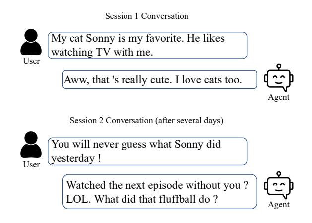
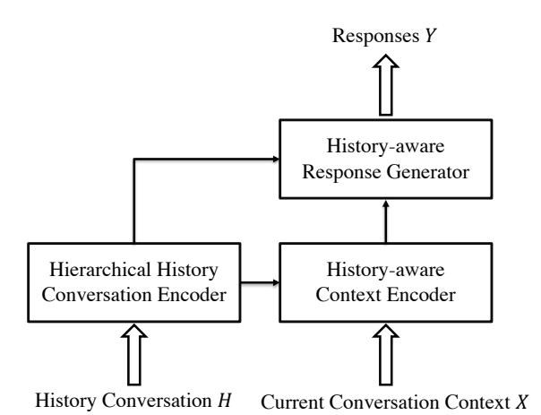
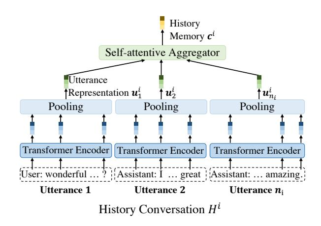
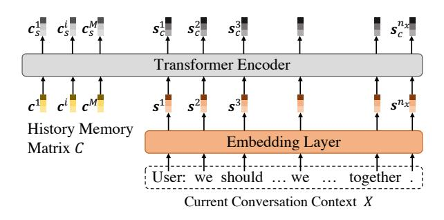
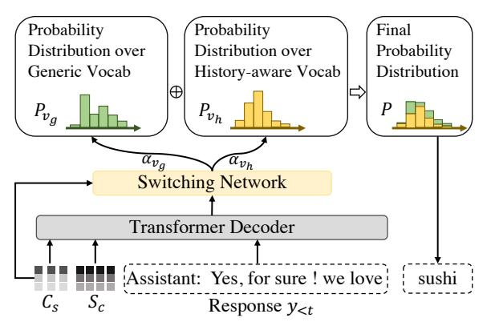

arXiv:2302.00907v1 [cs.CL] 2 Feb 2023

# **History-Aware Hierarchical Transformer for Multi-session Open-domain Dialogue System**

Tong Zhang1, Yong Liu2,3, Boyang Li1, Zhiwei Zeng3, Pengwei Wang4, Yuan You4

Chunvan Miao1,2,3, Lizhen Cui5

1School of Computer Science and Engineering, Nanyang Technological University, Singapore 

2Alibaba-NTU Singapore Joint Research Institute, Nanyang Technological University, Singapore 

3Joint NTU-UBC LILY Research Centre, Nanyang Technological University, Singapore

4Alibaba Group, China

5School of Software, Shandong University, China

# Abstract

With the evolution of pre-trained language models, current open-domain dialogue systems have achieved great progress in conducting one-session conversations. In contrast, Multi-Session Conversation (MSC), which consists of multiple sessions over a long term with the same user, is under-investigated. In this paper, we propose History-Aware Hierarchical Transformer (HAHT) for multi-session open-domain dialogue. HAHT maintains a long-term memory of history conversations and utilizes history information to understand current conversation context and generate well-informed and context-relevant responses. Specifically, HAHT first encodes history conversation sessions hierarchically into a history memory. Then, HAHT leverages historical information to facilitate the understanding of the current conversation context by encoding the history memory together with the current context with attention-based mechanisms. Finally, to explicitly utilize historical information, HAHT uses a history-aware response generator that switches between a generic vocabulary and a history-aware vocabulary. Experimental results on a large-scale MSC dataset suggest that the proposed HAHT model consistently outperforms baseline models. Human evaluation results support that HAHT generates more human-like, contextrelevant and history-relevant responses than baseline models.

# 1 Introduction

Open-domain dialogue systems, also known as chatbots, are designed to converse with and engage users on any topic with the aim of establishing, maintaining, and strengthening long-term relationships (Clark et al., 2019; Roller et al., 2020). Recently, open-domain dialogue systems built based on large-scale generative pre-trained models (Adiwardana et al., 2020; Roller et al., 2021; Zhang et al., 2020) have substantially improved the performance of chatbots.

Figure 1: An illustrated example of a two-session conversation between a user and an agent.

However, most existing chatbots are designed to interact with users in a single conversation session. When the current session ends, the chatbot forgets its contents and will commence a new independent session with the same user next time. When previously discussed topics reemerge, such chatbots often appear ignorant and fail to reengage users appropriately. The apparent forgetfulness limits the chatbots' ability to establish and maintain long-term relationships with users.

We argue that, to better engage users in multisession conversations (MSCs), a chatbot should maintain a long-term memory of historical contexts, which allows the chatbot to reengage the user appropriately when similar contexts reemerge. By learning from historical conversations, the chatbot should gradually refine its understanding of and deepen its relationship with the user. Figure 1 shows an example of a two-session conversation between a user and a chatbot. In the second session, the chatbot infers that Sonny is a cat and generates the response based on the history information that Sonny likes watching TV with the user.

History-aware chatbots will be able to generate more well-informed and context-relevant re-

sponses, which can help to elicit long-term commitments and develop emotional attachments from users to sustain close relationships over time. To this end, we propose the History-Aware Hierarchical Transformer (HAHT) for multi-session opendomain dialogue systems, which can effectively leverage history conversations to conduct more engaging MSCs. HAHT maintains a long-term memory to store historical conversational contexts, which is updated when a new session is conducted. Based on the long-term memory and the context in the current session, relevant tokens in historical contexts are selected to adapt the current response.

Specifically, as the number of tokens in a conversation utterance and the number of turns in a conversation are usually not very  $\text{long}^1$ , we first encode the history conversation hierarchically into the history memory using Transformer (Vaswani et al., 2017). The history memory serves as a high-level representation of history conversations. Secondly, as history conversations usually can facilitate the understanding of the current conversation context, we design a history-aware context encoder. The context encoder encodes conversation context, considering both history conversations and the current conversation, by adopting the transformer attention over the history memory and current conversation context. Then, the context encoder also updates the history memory based on the current conversation context. Finally, we design a history-aware decoder to fuse learned history information into the response generation process. The history-aware decoder can switch between two strategies, i.e., generating a word from the generic vocabulary or directly copying a word from history conversations.

Experimental results on the large-scale Facebook MSC dataset show that the proposed HAHT model outperforms previous multi-session opendomain dialogue systems in various evaluation metrics. Human evaluation results support that HAHT generates more readable, context-relevant, and history-relevant responses than baseline models. In addition, the ablation study confirms that both the hierarchical encoding of history conversations and the history-aware decoder contribute greatly to HAHT's performance on MSCs and help it leverage historical information more effectively.

1On average, conversations have 13 turns and conversation utterances have 16 tokens in Facebook MSC dataset.

# 2 **Related Work**

Open-domain dialogue systems aim to perform chit-chat without task and domain restrictions (Ritter et al., 2011) and establish long-term relationships with users (Clark et al., 2019; Roller et al., 2020). They are generally divided into two groups: generation-based systems and retrieval-based systems. Retrieval-based systems seek to find a suitable response from a large response candidate set (Zhou et al., 2016; Yuan et al., 2019; Zhong et al., 2020; Zhu et al., 2021; Qian et al., 2021), whereas, generation-based systems focus on generating responses from scratch based on the dialogue history (Serban et al., 2016; Shum et al., 2018; Adiwardana et al., 2020; Roller et al., 2020; Xu et al., 2022). In this paper, we focus on generation-based systems.

Early approaches to response generation include template-based generation methods (Higashinaka et al., 2014) and statistical machine translation (SMT) methods (Ritter et al., 2011). With the development of deep learning, sequence-to-sequence (Seq2seq) models have been applied to generationbased dialogue systems and achieved great performance (Li et al., 2016; Vinyals and Le, 2015; Serban et al., 2017). Recently, with the increasing availability of large-scale dialogue datasets (Li et al., 2017; Zhang et al., 2018; Dinan et al., 2019; Huang et al., 2020), Transformer-based language models pretrained with large-scale corpora, such as Meena (Adiwardana et al., 2020), Blender-Bot (Roller et al., 2021), DialogueGPT (Zhang et al., 2020), and PLATO (Platonov et al., 2020), have made significant progress in the area of opendomain dialogues.

Despite the advancements in the field, current state-of-the-art generative pre-trained models are designed for and trained on large datasets of singlesession conversations with a small number of turns. As a result, most existing models employ short token truncation lengths, such as 128 tokens for Meena (Adiwardana et al., 2020), and are unable to encode and utilize historical contexts in MSCs effectively. In addition, there is also a lack of public MSC datasets. Xu et al. released the first multi-session conversation dataset, *i.e.*, *Facebook* MULTI-SESSION CHAT (Facebook MSC), and explored different retrieval-augmented generative models on the dataset (Lewis et al., 2020; Shuster et al., 2021), which achieved better results than the standard Transformer (Vaswani et al., 2017). However, the experimental results demonstrate that

Figure 2: The overall structure of the proposed HAHT model, which contains 1) hierarchical history conversation encoder, 2) history-aware context encoder, and 3) history-aware response generator. The details of each component are shown in Figure  $3, 4, 5$ , respectively.

their methods need to retrieve a very large portion of history conversations to achieve better results than the standard Transformer. In addition, these models still need to concatenate the retrieved raw history conversation text with the current conversation context, yielding concatenations that are still much longer than the 128 token truncation lengths. Therefore, the incorporation of historical contexts in these methods is still limited by the short token truncation lengths of pre-trained models.

# **3 The Proposed Method**

In general, a Multi-Session Conversation (MSC) consists of a current conversation session and several history conversation sessions that happen before the current one, all between the same two interlocutors. A multi-session open-domain dialogue system aims to generate natural, well-informed, and context-relevant responses to the user's utterances based on all history conversation sessions and the current conversation context.

Formally, we denote the MSC dataset  $D$  by a list of N conversations in the format of  $(H, X, y)$ . Here,  $X = \{x_1, x_2, \cdots, x_{n_x}\}$  denotes  $n_x$  context utterances of the current conversation session.  $H = \{H^1, H^2, \cdots, H^M\}$  denotes M history conversation sessions, where  $H^i = \{h^i_1, h^i_2, \cdots, h^i_{n_i}\}$  denotes  $n_i$  chronologically ordered utterances of the *i*-th history conversation session.  $y$  is the ground truth response to  $X$  under the background of  $H$ . The MSC task can be formulated as learning a function  $f(H, X)$  to predict the next utterance  $x_{n_x+1}$  based on  $H$  and  $X$ .

Figure 3: The structure of the hierarchical history conversation encoder in HAHT.

In this work, we propose a novel model, namely HAHT. for the MSC task. Figure 2 shows the overall structure of HAHT, which consists of three main components: 1) hierarchical history conversation encoder, 2) history-aware context encoder, and 3) history-aware response generator. We present the details of each component of HAHT as follows.

## 3.1 **Hierarchical History Conversation Encoder**

The main challenge in encoding history conversation sessions is the limited maximum input length imposed by pre-trained dialogue systems. If all history conversations are simply concatenated and fed into the pre-trained dialogue system, the length of the concatenation will exceed the maximum input length. Thus, most parts of the input will be truncated. To preserve more information in the history conversation, we encode each history conversation session separately in a hierarchical fashion.

Specifically, for a history conversation session  $H^i = \{h_1^i, h_2^i, \cdots, h_{n_i}^i\}$ , we first prepend a special token "User:" or "Assistant:" to each utterance  $h_j^i$  in  $H^i$  depending on the role of the utterance speaker, and then pad all utterances to the same length  $l_{utter}$ . For each utterance  $h_j^i$ , we apply an embedding layer  $E_m$ ,  $n_{enc}$  Transformer encoder layers, and a Max-pooling layer to obtain its dense representation as follows,

$$
\mathbf{u}_{j}^{i} = \text{Max-pooling} (\text{Transformer}_{n_{enc}}(E_{m}(h_{j}^{i}))),
$$

(1)

where  $\mathbf{u}_j^i \in \mathbb{R}^d$ . Moreover, we denote all the utterance representations in the history conversation  $H^i$  by  $\mathbf{U}^i = {\mathbf{u}_1^i, \mathbf{u}_2^i, \cdots, \mathbf{u}_{n_i}^i} \in \mathbb{R}^{n_i \times d}$ , where  $n_i$  is the turn number of  $H^i$ . Next, we apply a

Figure 4: The structure of the history-aware context encoder in HAHT.

conversation aggregator  $F_c$  to aggregate all utterance representations  $\mathbf{U}^i$  into the condensed history memory  $\mathbf{c}^i$ ,

$$
\mathbf{c}^i = F_c(\mathbf{U}^i).
$$

(2)

The conversation aggregator is developed based on the following self-attentive mechanism (Lin et al., 2017),

$$
F_c(\mathbf{U}^i) = \alpha \mathbf{U}^i,
$$

$$
\alpha = \text{softmax}\big(\mathbf{W}_k \text{tanh}(\mathbf{W}_q \mathbf{U}^{i\top})\big),
$$

(3)

where  $W_q$  and  $W_k$  are learnable parameters.  $\alpha \in \mathbb{R}^{n_i}$  is the importance vector of the history conversation utterances in  $H^i$ .

After applying previous steps to all history conversations  $H$ , we will finally obtain a history memory matrix  $C \in \mathbb{R}^{M \times d}$  containing a history memory for each history conversation, where  $M$  is the number of history conversation sessions.

## 3.2 History-aware Context Encoder

History conversation sessions usually contain the background stories (e.g., interlocutors' profiles or previous discussions between them) that bring out the current conversation session. Leveraging the history conversations will help the model to better understand the current conversation context and respond properly. On the other hand, the current conversation context can help the model update the history memories. Thus, we encode the history memory  $\mathbf{C}$  together with the current conversation context by adopting the transformer attention between them.

For the current conversation context  $X$ , we also prepend a special token “User:” or “Assistant:” to each utterance depending on the role of the utterance speaker and concatenate all utterances into a single sentence. Then, we adopt the embedding

Figure 5: The structure of the history-aware response generator in HAHT.

layer  $E_m$  to obtain a sequence of context token embeddings  $\mathbf{S} = {\mathbf{s}^1, \mathbf{s}^2, \cdots, \mathbf{s}^{n_x}}$ , where  $n_x$  is the length of the context sequence. Next, we concatenate the history memory matrix  $\mathbf{C} \in \mathbb{R}^{M \times d}$  with  $\mathbf{S} \in \mathbb{R}^{n_x \times d}$  over the first dimension and apply  $n_{enc}$  Transformer encoder layers.

By employing attention in the transformer encoder layers, our model can understand the conversation context by attending to all context token embeddings and history conversation memories. We denote this history-aware context encoding by  $S_c \in \mathbb{R}^{n \times d}$ . After context encoding, history conversation memories are updated based on the latest information from the current conversation context. We denote this context-updated history memory as  $C_s \in \mathbb{R}^{M \times d}$ . The concatenation of  $C_s$  and  $S_c$  over the first dimension will become the input of the response generator.

## **3.3 History-aware Response Generator**

Inspired by CopyNet (Gu et al., 2016), we construct two vocabularies, *i.e.*, generic vocabulary  $V_g$  and history-aware vocabulary  $V_h$ , to better generate history-aware responses. The generic vocabulary  $V_g$  contains the words that appear in all the training dataset, and the history-aware vocabulary  $V_h$  only contain the words that appear in the history conversations  $H$ . To generate a word of the response, the response generator will choose to generate a generic word from  $V_g$  or directly copy a word from  $V_h$  based on the switching mechanism (Gulcehre et al., 2016).

Specifically, at each decoding time step  $t$ , we feed  $C_s$ ,  $S_c$  and the ground truth word sequence before  $t$  into  $n_{dec}$  Transformer decoder layers and obtain a hidden representation vector  $o_t \in \mathbb{R}^d$ . The

probability distribution over the generic vocabulary  $V_g$  at the decoding time step t is computed as,

$$
P_{v_q} = \text{softmax}\big(\text{FC}_1(\mathbf{o}_t)\big),
$$

(4)

where  $FC_1$  is a fully connected layer.

To calculate the probability distribution over the history-aware vocabulary  $V_h$ , we adopt a maxpooling layer over the context-updated history memory  $C_s$ , a fully connected layer, and a softmax function as follows,

$$
P_{v_h} = \text{softmax}\big(\text{FC}_2(\text{max-pooling}(\mathbf{C}_s))\big),
$$

(5)

where  $FC_2$  is a fully connected layer.

The final word probability distribution at time step  $t$  is computed by using a switching mechanism between  $P_{v_g}$  and  $P_{v_h}$  as follows,

$$
P = \alpha_{v_g} \ast P_{v_g} + \alpha_{v_h} \ast P_{v_h},
$$

(6)

where  $\alpha_{v_g}$  and  $\alpha_{v_h}$  is the switching probability of generating from generic vocabulary or copying from history conversations.  $\alpha_{v_g}$  and  $\alpha_{v_h}$  is calculated as follows,

$$
[\alpha_{v_g}, \alpha_{v_h}] = \text{softmax}\big(\text{FC}_3([o_j; \text{max-pooling}(\mathbf{C}_s)])\big),
$$

(7)

where  $FC_3$  is a fully connected layer, and [;] is a concatenation operation over the last dimension.

## 3.4 Model Training

We train the model to maximize the generation probability of the target response, given the current conversation context and history conversations in an end-to-end manner. The loss function of HAHT is defined as,

$$
\mathcal{L} = -\sum_{t=1}^{n_y} \log \left( P(y_j | X, H, y_{\leq t}) \right),
$$

(8)

where  $X$  denotes the current conversation context,  
 $H$  denotes all history conversations,  $y_{ denotes  
tokens before time step  $t$ , and  $n_y$  denotes the length  
of the ground truth response.$ 

# 4 **Experimental Settings**

In this section, we introduce the experimental dataset, evaluation metrics, baseline methods, and model settings.

| Session number | Train |         | Valid |        | Test  |        |
|-------------------|-------|---------|-------|--------|-------|--------|
|                   | Conv. | Utter.  | Conv. | Utter. | Conv. | Utter. |
| 1*                | 8939  | 131,438 | 1000  | 7,801  | 1015  | 6,634  |
| 2                 | 4000  | 46,420  | 500   | 5,897  | 501   | 5,939  |
| 3                 | 4000  | 47,259  | 500   | 5,890  | 501   | 5,924  |
| 4                 | 1001  | 11,870  | 500   | 5,904  | 501   | 5,940  |
| 5                 | -     | -       | 500   | 5,964  | 501   | 5,945  |
| Total             | -     | 236,987 | -     | 31,456 | -     | 30,382 |

Table 1: The statistics of Facebook Multi-Session Chat (Facebook MSC) Dataset. Session number  $i$  indicates there are  $i$ -1 history conversation sessions that happen before the last conversation session.  $\star$ : Session 1 does not contain history conversation sessions.

## 4.1 **Experimental Dataset**

The experiments are performed on a large dataset, *i.e.*, Facebook MULTI-SESSION CHAT (Facebook MSC) (Xu et al., 2022). It is a crowdsourced dataset consisting of multi-session conversations, where the interlocutors learn about each other's interests and discuss the things they have understood from past sessions. The number of history conversations in Facebook MSC varies from 1 to 4. Session number  $i$  indicates there are  $i$ -1 history conversations happening before the last conversation session. The statistics of the Facebook MSC dataset are summarized in Table 1. As session 1 does not have history conversations, we evaluate our model on session 2-5.

## 4.2 Evaluation Metrics

We conduct both automatic and human evaluations to demonstrate the effectiveness of the proposed model. For automatic evaluations, we leverage BLEU-2, BLEU-3 (Papineni et al., 2002), and ROUGE-L (Lin and Och, 2004) to measure word overlaps between the generated response text and ground truth text.

Moreover, we also randomly sample 50 MSCs from the test set to conduct human evaluations. We present all the history conversation sessions, current conversation context, and the generated responses to three well-educated annotators. The annotators will evaluate the quality of the generated responses from the following three aspects:

- **Readability**: measures whether the generated responses are natural and fluent.
- **Context Relevancy**: measures whether the generated responses are correlated with the current conversation context.
- **History Relevancy**: measures whether the generated responses are correlated with history con-

| Model         | Session 2   |             |              | Session 3   |             |              | Session 4   |             |              | Session 5   |             |              |
|---------------|-------------|-------------|--------------|-------------|-------------|--------------|-------------|-------------|--------------|-------------|-------------|--------------|
|               | B-2         | B-3         | R-L          | B-2         | B-3         | R-L          | B-2         | B-3         | R-L          | B-2         | B-3         | R-L          |
| BlenderBot    | 2.79        | 0.65        | 13.73        | 2.41        | 0.45        | 13.06        | 2.14        | 0.39        | 12.76        | 2.26        | 0.45        | 12.75        |
| BlenderBotmsc | 4.76        | 1.51        | 16.18        | 5.03        | 1.61        | 16.39        | 4.78        | 1.49        | 15.56        | 4.98        | 1.48        | 16.10        |
| FID-RAG       | 4.82        | 1.54        | 16.53        | 5.04        | 1.61        | 16.42        | 4.84        | 1.48        | 15.89        | 5.06        | 1.57        | 16.01        |
| HAHT (ours)   | <b>5.07</b> | <b>1.57</b> | <b>16.90</b> | <b>5.27</b> | <b>1.67</b> | <b>16.72</b> | <b>5.00</b> | <b>1.55</b> | <b>15.97</b> | <b>5.16</b> | <b>1.60</b> | <b>16.42</b> |

Table 2: Automatic evaluation results of different models on all session data. Session  $i$  indicates there are  $i$ -1 history conversation sessions. B-2, B-3, and R-L denote BLEU-2, BLEU-3, and Rouge-L respectively. The best results are in **boldface**.

| Model         | Readability | Context Relevancy | History Relevancy |
|---------------|-------------|----------------------|----------------------|
| BlenderBot    | 1.78        | 1.13                 | 0.09                 |
| BlenderBotmsc | 1.82        | 1.56                 | 0.13                 |
| RAG-FID       | 1.89        | 1.84                 | 0.21                 |
| HAHT (ours)   | <b>2.05</b> | <b>2.03</b>          | <b>0.33</b>          |

Table 3: Human evaluation of the response generation by different methods. All scores are rated in four levels  $0/1/2/3$ . The best results are in **boldface**. We measure the inter-rater reliability with Fleiss' Kappa (Fleiss and Cohen, 1973). Our annotations obtain "good agreement" for Readability (0.614) and "moderate agreement" for Context Relevancy (0.526) and History Relevancy  $(0.573)$ .

versations. Only responses that are consistent with history conversations are considered relevant to history.

Each aspect is rated in four different levels  $0/1/2/3$ , and the final score of each aspect is the average of the scores given by all annotators. We measure the inter-annotator reliability with Fleiss' Kappa (Fleiss and Cohen, 1973). For all evaluation metrics, the higher value indicates better performance.

## 4.3 **Baseline Methods**

We compare the proposed HAHT model with the following baseline methods.

- **BlenderBot** (Roller et al., 2021): This is a largescale open-domain dialogue model pre-trained on the dialogue data scraped from social discussions on the web.
- **BlenderBot**msc: This is the BlenderBot model finetuned on the MSC dataset.
- **FID-RAG** (Shuster et al., 2021): In this method, RAG-trained retriever (Lewis et al., 2020) is used to retrieve top- $N$  history conversations, and Fusion-Decoder (FiD) (Izacard and Grave,  $2021$ ) is adopted to generate a final response

considering the retrieved history conversations and current conversations. Following (Xu et al.,  $2022$ ), N is empirically set to 5.

## 4.4 Model Settings

In this work, all the evaluated methods are trained following the same settings. Due to the limitation of computation resources, we use the Blender-Bot model with 90M parameters as the initial pretrained model and finetune it on the Facebook MSC dataset. The input length truncation is set to 256. The number of Transformer encoder layers  $n_{enc}$  and decoder layers  $n_{dec}$  are both set to 12. For model training, we use the Adamax optimizer (Kingma and Ba, 2014) with a learning rate of  $1 \times 10^{-6}$ , batch size of 16, dropout ratio of 0.1, and early stopping patience of 10. All the finetuned models are trained with a maximum of two 32GB GPUs (NVIDIA V100).

# 5 **Experimental Results**

This section presents the experimental results of the automatic evaluation, human evaluation, evaluation on session openings, ablation study, and case study.

## 5.1 Automatic Evaluation

The automatic evaluation results of different models are shown in Table 2. It can be observed that  $\text{BlenderBot}_{\text{msc}}$  performs much better when finetuned on the MSC dataset. FID-RAG performs better than  $\text{BlenderBot}_{\text{msc}}$ . The potential reason is that RAG can retrieve important history conversations, and FID can combine the retrieved conversations with current conversations to generate better responses. Moreover, the proposed HAHT model consistently outperforms baseline methods in terms of all the evaluation metrics. This indicates that HAHT can better encode the history conversations, leverage history conversations to understand the current conversation context and generate more human-like responses.

| Model         | Session 2 |      |       | Session 3 |      |       | Session 4 |      |       | Session 5 |      |       |
|---------------|-----------|------|-------|-----------|------|-------|-----------|------|-------|-----------|------|-------|
|               | B-2       | B-3  | R-L   | B-2       | B-3  | R-L   | B-2       | B-3  | R-L   | B-2       | B-3  | R-L   |
| BlenderBot    | 4.71      | 1.47 | 18.20 | 3.85      | 0.93 | 17.10 | 3.69      | 0.83 | 16.78 | 4.00      | 1.19 | 17.19 |
| BlenderBotmsc | 6.39      | 2.56 | 19.30 | 5.82      | 1.93 | 18.67 | 5.30      | 1.76 | 17.9  | 6.10      | 2.30 | 18.65 |
| FID-RAG       | 6.41      | 2.51 | 19.82 | 5.83      | 1.95 | 18.38 | 5.81      | 1.85 | 18.44 | 6.02      | 2.27 | 18.52 |
| HAHT (ours)   | 6.69      | 2.73 | 20.02 | 6.03      | 2.20 | 18.70 | 5.48      | 1.95 | 18.00 | 6.38      | 2.51 | 19.18 |

Table 4: Automatic evaluation results of different models on session-opening data. Session  $i$  indicates there are  $i-1$ history conversation sessions. B-2, B-3, and R-L denote BLEU-2, BLEU-3, and Rouge-L respectively. The best results are in **boldface**.

| Model        | Session 2   |             |              | Session 3   |             |              | Session 4   |             |              | Session 5   |             |              |
|--------------|-------------|-------------|--------------|-------------|-------------|--------------|-------------|-------------|--------------|-------------|-------------|--------------|
|              | B-2         | B-3         | R-L          | B-2         | B-3         | R-L          | B-2         | B-3         | R-L          | B-2         | B-3         | R-L          |
| HAHT         | <b>5.07</b> | <b>1.57</b> | <b>16.90</b> | <b>5.27</b> | <b>1.67</b> | <b>16.72</b> | <b>5.00</b> | <b>1.55</b> | <b>15.97</b> | <b>5.16</b> | <b>1.60</b> | <b>16.42</b> |
| HAHTw/o HIER | 5.00        | 1.57        | 16.72        | 5.19        | 1.63        | 16.61        | 4.86        | 1.49        | 15.90        | 5.10        | 1.57        | 16.21        |
| HAHTw/o HIST | 4.98        | 1.50        | 16.81        | 5.09        | 1.58        | 16.51        | 4.75        | 1.45        | 15.51        | 5.10        | 1.49        | 16.24        |
| HAHTw/o SW   | 5.01        | 1.56        | 16.86        | 5.19        | 1.61        | 16.46        | 4.87        | 1.55        | 15.88        | 5.07        | 1.55        | 16.17        |

Table 5: The performance achieved by HAHT and different HAHT variants. Session  $i$  indicates there are  $i$ -1 history conversation sessions. B-2, B-3, and R-L denote BLEU-2, BLEU-3, and Rouge-L respectively. The best results are in **boldface**.

## 5.2 Human Evaluation

Table 3 summarizes the human evaluation results on the Facebook MSC dataset. Generally, HAHT outperforms all the baseline methods in terms of all perspectives. This observation is consistent with the automatic evaluation results shown in Table 2. In particular, we find that HAHT performs much better than other baselines in terms of history relevancy. This demonstrates that HAHT can better leverage the history conversation sessions and engage the user more in the on-going session with the history memory. HAHT also performs better than other baselines in terms of readability and context relevancy. This indicates that HAHT can better understand the current conversation context with the help of the history memory.

## 5.3 Evaluation on Session Openings

In the MSC task, the session opening is the first conversation turn of the current conversation. According to our observation and the similar observation in (Xu et al.,  $2022$ ), the opening conversation turn is categorically different from other conversation turns. It typically involves a statement or question that aims to reengage the other speaker based on the known information that has been exchanged in history conversations. Therefore, the performance on the session opening data can further demonstrate the model's capability in understanding and leveraging history conversations.

We compare all models on these opening re-

sponses and show the results in Table 4. We observe that the proposed HAHT model achieves the best performance in terms of most metrics. Especially, when there are 4 history conversations, HAHT outperforms FID-RAG and BlenderBotmsc by  $10.6\%$  and  $9.1\%$  in terms of BLUE-3. This indicates that the proposed HAHT can better leverage conversation history to reengage the user into a new conversation session.

## 5.4 Ablation study

To better understand the effectiveness of each main component of HAHT, we conduct ablation study for HAHT. Specifically, we consider the following variants of HAHT.

- $HAHT_{w/o \ HIER}$ : In this variant, we do not encode the history conversations hierarchically. Instead, we concatenate all the utterances of history conversations into a long sentence and directly encode it using the transformer encoder.
- $HAHT_{w/o\text{ HIST}}$ : In this variant, we remove the history encoder from HAHT.
- $HAHT_{w/o\ SW}$ : In this variant, we remove the switching mechanism from the response generator of HAHT.

Table 5 summarizes the results achieved by different HAHT variants, in terms of BLEU-2, BLEU-3, and Rouge-L. We note that HAHT outperforms HAHTw/o HIER, which indicates that hierarchically

encoding the history conversations can help the model reserve more history memory to generate more human-like responses. Moreover, HAHT achieves better performance than HAHTHIST. This observation indicates that removing the history encoder causes the most decline in all metrics. This result confirms the necessity to leverage history conversations to understand the current conversation and generate the response. In addition, the performance degradation caused by removing the switching mechanism shows that directly copying words from the history conversation can help the model generate more history-aware responses.

## 5.5 **Case Study**

Table 6 shows a case study of the multi-session conversations generated by different models. Compared to baseline models, the proposed HAHT model can better leverage history conversations to understand the current conversation context and generate more history-aware responses. When the user discusses preparing sandwiches and lemonade with the agent, "I can make sandwiches for us! I also have a very good recipe for homemade lemonade! Do you like lemonade?", HAHT can remember information mentioned in the history conversations, such as the user likes reading and outdoor activities and it has adopted a book-lover persona before. HAHT can leverage these historical contexts and generate more human-like, context-relevant, and history-aware responses: "I love lemonade! I'm sure we can find a lot of good recipes for sandwiches too. Sandwiches and lemonade are perfect for going outdoors and reading books.".

# 6 Conclusion

In this work, we propose the History-Aware Hierarchical Transformer (HAHT) model for multisession open-domain dialogue systems. The proposed HAHT model maintains a history memory by hierarchically encoding the history conversation sessions. After that, HAHT uses attention-based encoding to encode the current conversation context together with the history memory and updates the history memory with the current context. In order to explicitly leverage historical information in the responses, HAHT is designed with a history-aware response generator which can switch between a generic vocabulary and a history-aware vocabulary. Experimental results obtained under both normal and session opening MSC settings demonstrate that

| <b>History Conversation Sessions</b>      |                                                                                                                                                           |
|-------------------------------------------|-----------------------------------------------------------------------------------------------------------------------------------------------------------|
| [Session 1]                               |                                                                                                                                                           |
| User:                                     | ... My dad is a truck driver.                                                                                                                             |
| Agent:                                    | ... I am a <b>big reader</b> myself.                                                                                                                      |
| User:                                     | ... I like working outdoors.                                                                                                                              |
| [Session 2]                               |                                                                                                                                                           |
| User:                                     | What book are you currently reading?                                                                                                                      |
| Agent:                                    | I'm reading a Stephen King novel. ...                                                                                                                     |
| User:                                     | I used to sit in the truck on long trips with my dad, and had nothing to do other than <b>read</b> .                                                      |
| Agent:                                    | Ah, that makes sense. I started reading when my parents were at work. ...                                                                                 |
| Current Conversations                     |                                                                                                                                                           |
| Agent:                                    | ... What kinds of picnic foods do you like?                                                                                                               |
| User:                                     | I can make sandwiches for us! I also have a very good recipe for homemade lemonade! Do you like lemonade?                                                 |
| Responses from Different Dialogue Systems |                                                                                                                                                           |
| BlenderBot:                               | I love lemonades ! I'm not sure if I could make a picnic for you though. I'd have to make a lot more than just a picnic.                                  |
| BlenderBotmsc:                            | I love lemonade! I'm not a huge fan of lemonade, but I love lemonade.                                                                                     |
| FID-RAG:                                  | I love lemonade! I'm sure we can find a good picnic for you.                                                                                              |
| HAHT (ours):                              | I love lemonade! I'm sure we can find a lot of good recipes for sandwiches too. Sandwiches and lemonade are perfect for going outdoors and reading books. |

Table 6: A case study of an MSC with two history conversations. Only important utterances in the history and current conversations are presented. Complete conversations sessions are provided in Appendix  $A.1$ 

HAHT performs better in conducting MSC and generates more human-like, context-relevant, and history-aware responses than state-of-the-art models

# 7 Limitations 

One limitation of this work is that HAHT has only been evaluated on one dataset. However, to the best of our knowledge, Facebook MSC is, by far, the only large-scale multi-session conversation dataset available. Nevertheless, our proposed model consistently outperforms baseline models on conversations with different numbers of history sessions in Facebook MSC.

A potential solution to this limitation is to construct more MSC datasets in open-domain or in specific-domain that may benefit from the awareness of history conversations, e.g., conversational recommendation or automatic medical assistants.

# 8 Acknowledgments

This research is supported, in part, by Alibaba Group through the Alibaba Innovative Research (AIR) Program and the Alibaba-NTU Singapore Joint Research Institute (AN-GC-2021-04), by the National Research Foundation (NRF) Investigatorship Programme (NRF-NRFI05-2019-0002), and by the NRF Fellowship (NRF-NRFF13-2021- $0006$ ). Any opinions, findings and conclusions or recommendations expressed in this material are those of the authors and do not reflect the views of the funding agencies.

# References

- Daniel Adiwardana, Minh-Thang Luong, David R So, Jamie Hall, Noah Fiedel, Romal Thoppilan, Zi Yang, Apoorv Kulshreshtha, Gaurav Nemade, Yifeng Lu, and Quoc V. Le. 2020. Towards a human-like opendomain chatbot. *arXiv* preprint *arXiv*:2001.09977.
- Leigh Clark, Nadia Pantidi, Orla Cooney, Philip Doyle, Diego Garaialde, Justin Edwards, Brendan Spillane, Emer Gilmartin, Christine Murad, Cosmin Munteanu, Vincent Wade, and Benjamin R. Cowan. 2019. What makes a good conversation? Challenges in designing truly conversational agents. In Proceedings of the 2019 CHI Conference on Human Factors in Computing Systems, pages 1-12, New York, NY, USA. Association for Computing Machinery.
- Emily Dinan, Stephen Roller, Kurt Shuster, Angela Fan, Michael Auli, and Jason Weston. 2019. Wizard of Wikipedia: Knowledge-powered conversational agents. In Proceedings of 7th International Conference on Learning Representations.

- Joseph L. Fleiss and Jacob Cohen. 1973. The equivalence of weighted kappa and the intraclass correlation coefficient as measures of reliability. Educational and Psychological Measurement, 33(3):613– 619.
- Jiatao Gu, Zhengdong Lu, Hang Li, and Victor O.K. Li. 2016. Incorporating copying mechanism in sequence-to-sequence learning. In *Proceedings of* the 54th Annual Meeting of the Association for Computational Linguistics (Volume 1: Long Papers), pages 1631–1640, Berlin, Germany. Association for Computational Linguistics.
- Caglar Gulcehre, Sungjin Ahn, Ramesh Nallapati, Bowen Zhou, and Yoshua Bengio. 2016. Pointing the unknown words. In Proceedings of the 54th Annual Meeting of the Association for Computational Linguistics (Volume 1: Long Papers), pages 140-149, Berlin, Germany. Association for Computational Linguistics.
- Ryuichiro Higashinaka, Kenji Imamura, Toyomi Meguro, Chiaki Miyazaki, Nozomi Kobayashi, Hiroaki Sugiyama, Toru Hirano, Toshiro Makino, and Yoshihiro Matsuo. 2014. Towards an open-domain conversational system fully based on natural language processing. In Proceedings of COLING 2014, the 25th International Conference on Computational Linguistics: Technical Papers, pages 928-939, Dublin, Ireland. Dublin City University and Association for Computational Linguistics.
- Minlie Huang, Xiaoyan Zhu, and Jianfeng Gao. 2020. Challenges in building intelligent open-domain dialog systems. ACM Transactions on Information Systems (TOIS), 38(3):1-32.
- Gautier Izacard and Edouard Grave. 2021. Leveraging passage retrieval with generative models for open domain question answering. In Proceedings of the 16th Conference of the European Chapter of the Association for Computational Linguistics: Main Volume, pages 874-880, Online. Association for Computational Linguistics.
- Diederik P Kingma and Jimmy Ba. 2014. Adam: A method for stochastic optimization. arXiv preprint arXiv:1412.6980.
- Patrick Lewis, Ethan Perez, Aleksandra Piktus, Fabio Petroni, Vladimir Karpukhin, Naman Goyal, Heinrich Küttler, Mike Lewis, Wen-tau Yih, Tim Rocktäschel, Sebastian Riedel, and Douwe Kiela. 2020. Retrieval-augmented generation for knowledgeintensive nlp tasks. In Advances in Neural Information Processing Systems, volume 33, pages 9459-9474. Curran Associates, Inc.
- Jiwei Li, Michel Galley, Chris Brockett, Jianfeng Gao, and Bill Dolan. 2016. A diversity-promoting objective function for neural conversation models. In Proceedings of the 2016 Conference of the North American Chapter of the Association for Computational Linguistics: Human Language Technologies,

pages 110-119, San Diego, California. Association for Computational Linguistics.

- Yanran Li, Hui Su, Xiaoyu Shen, Wenjie Li, Ziqiang Cao, and Shuzi Niu. 2017. DailyDialog: A manually labelled multi-turn dialogue dataset. In *Proceed*ings of the Eighth International Joint Conference on Natural Language Processing (Volume 1: Long Papers), pages 986–995, Taipei, Taiwan. Asian Federation of Natural Language Processing.
- Chin-Yew Lin and Franz Josef Och. 2004. Automatic evaluation of machine translation quality using longest common subsequence and skip-bigram statistics. In Proceedings of the 42nd Annual Meeting of the Association for Computational Linguistics (ACL-04), pages 605-612, Barcelona, Spain.
- Zhouhan Lin, Minwei Feng, Cicero Nogueira dos Santos, Mo Yu, Bing Xiang, Bowen Zhou, and Yoshua Bengio. 2017. A structured self-attentive sentence embedding. In Proceedings of 5th International Conference on Learning Representations.
- Kishore Papineni, Salim Roukos, Todd Ward, and Wei-Jing Zhu. 2002. Bleu: a method for automatic evaluation of machine translation. In Proceedings of the 40th Annual Meeting of the Association for Computational Linguistics, pages 311–318, Philadelphia, Pennsylvania, USA. Association for Computational Linguistics.
- Georgiy Platonov, Lenhart Schubert, Benjamin Kane, and Aaron Gindi. 2020. A spoken dialogue system for spatial question answering in a physical blocks world. In Proceedings of the 21th Annual Meeting of the Special Interest Group on Discourse and Dia*logue*, pages 128–131, 1st virtual meeting. Association for Computational Linguistics.
- Hongjin Qian, Zhicheng Dou, Yutao Zhu, Yueyuan Ma, and Ji-Rong Wen. 2021. Learning implicit user profile for personalized retrieval-based chatbot. In Proceedings of the 30th ACM International Conference on Information and Knowledge Management, page 1467-1477, New York, NY, USA. Association for Computing Machinery.
- Alan Ritter, Colin Cherry, and William B. Dolan. 2011. Data-driven response generation in social media. In Proceedings of the 2011 Conference on Empirical Methods in Natural Language Processing, pages 583-593, Edinburgh, Scotland, UK. Association for Computational Linguistics.
- Stephen Roller, Y-Lan Boureau, Jason Weston, Antoine Bordes, Emily Dinan, Angela Fan, David Gunning, Da Ju, Margaret Li, Spencer Poff, Pratik Ringshia, Kurt Shuster, Eric Michael Smith, Arthur Szlam, Jack Urbanek, and Mary Williamson. 2020. Open-domain conversational agents: Current progress, open problems, and future directions. arXiv preprint arXiv:2006.12442.

- Stephen Roller, Emily Dinan, Naman Goyal, Da Ju, Mary Williamson, Yinhan Liu, Jing Xu, Myle Ott, Eric Michael Smith, Y-Lan Boureau, and Jason Weston. 2021. Recipes for building an open-domain chatbot. In *Proceedings of the 16th Conference of* the European Chapter of the Association for Computational Linguistics: Main Volume, pages 300-325, Online. Association for Computational Linguistics.
- Iulian V. Serban, Alessandro Sordoni, Yoshua Bengio, Aaron Courville, and Joelle Pineau. 2016. Building end-to-end dialogue systems using generative hierarchical neural network models. In *Proceedings of the* Thirtieth AAAI Conference on Artificial Intelligence, page 3776-3783. AAAI Press.
- Iulian Vlad Serban, Alessandro Sordoni, Ryan Lowe, Laurent Charlin, Joelle Pineau, Aaron Courville, and Yoshua Bengio. 2017. A hierarchical latent variable encoder-decoder model for generating dialogues. In Proceedings of the Thirty-First AAAI Conference on Artificial Intelligence, pages 3295-3301. AAAI Press.
- Heung-Yeung Shum, Xiaodong He, and Di Li. 2018. From Eliza to XiaoIce: Challenges and opportunities with social chatbots. arXiv preprint arXiv:1801.01957.
- Kurt Shuster, Spencer Poff, Moya Chen, Douwe Kiela. and Jason Weston. 2021. Retrieval augmentation reduces hallucination in conversation. In Findings of the Association for Computational Linguistics: EMNLP 2021, pages 3784-3803, Punta Cana, Dominican Republic. Association for Computational Linguistics.
- Ashish Vaswani, Noam Shazeer, Niki Parmar, Jakob Uszkoreit, Llion Jones, Aidan N Gomez, Łukasz Kaiser, and Illia Polosukhin. 2017. Attention is all you need. In Advances in Neural Information Processing Systems, volume 30, pages 5998-6008. Curran Associates, Inc.
- Oriol Vinyals and Quoc Le. 2015. A neural conversational model. *arXiv* preprint arXiv:1506.05869.
- Jing Xu, Arthur Szlam, and Jason Weston. 2022. Beyond goldfish memory: Long-term open-domain conversation. In Proceedings of the 60th Annual Meeting of the Association for Computational Linguistics (Volume 1: Long Papers), pages 5180–5197, Dublin, Ireland. Association for Computational Linguistics.
- Chunyuan Yuan, Wei Zhou, Mingming Li, Shangwen Lv, Fuqing Zhu, Jizhong Han, and Songlin Hu. 2019. Multi-hop selector network for multi-turn response selection in retrieval-based chatbots. In *Proceedings* of the 2019 Conference on Empirical Methods in Natural Language Processing and the 9th International Joint Conference on Natural Language Processing (EMNLP-IJCNLP), pages 111–120, Hong Kong, China. Association for Computational Linguistics.

- Saizheng Zhang, Emily Dinan, Jack Urbanek, Arthur Szlam, Douwe Kiela, and Jason Weston. 2018. Personalizing dialogue agents: I have a dog, do you have pets too? In Proceedings of the 56th Annual Meeting of the Association for Computational Linguistics (Volume 1: Long Papers), pages 2204-2213, Melbourne, Australia. Association for Computational Linguistics.
- Yizhe Zhang, Siqi Sun, Michel Galley, Yen-Chun Chen, Chris Brockett, Xiang Gao, Jianfeng Gao, Jingjing Liu, and Bill Dolan. 2020. DIALOGPT : Largescale generative pre-training for conversational response generation. In Proceedings of the 58th Annual Meeting of the Association for Computational Linguistics: System Demonstrations, pages 270– 278, Online. Association for Computational Linguistics.
- Peixiang Zhong, Chen Zhang, Hao Wang, Yong Liu, and Chunyan Miao. 2020. Towards persona-based empathetic conversational models. In Proceedings of the 2020 Conference on Empirical Methods in Natural Language Processing (EMNLP), pages 6556–6566, Online. Association for Computational Linguistics.
- Xiangyang Zhou, Daxiang Dong, Hua Wu, Shiqi Zhao, Dianhai Yu, Hao Tian, Xuan Liu, and Rui Yan. 2016. Multi-view response selection for human-computer conversation. In Proceedings of the 2016 Conference on Empirical Methods in Natural Language Processing, pages 372-381, Austin, Texas. Association for Computational Linguistics.
- Yutao Zhu, Jian-Yun Nie, Kun Zhou, Pan Du, and Zhicheng Dou. 2021. Content selection network for document-grounded retrieval-based chatbots. In Advances in Information Retrieval: 43rd European Conference on IR Research, ECIR, page 755-769, Berlin, Heidelberg. Springer-Verlag.

# Α Appendix

## A.1 Complete Case Study

Table 7 shows the complete content of the case study in section  $5.5$ . The conversations were conducted by two crowd workers. For training purposes, the utterances from the first crowd worker are denoted as user utterances, whereas those from the second crowd worker are denoted as agent utterances. An MSC model aims to generate responses that are as close as possible to the second crowd worker's utterances.

In history session 1, the user and the agent briefly talk about themselves, such as, their hobbies, and the job of their parents. In history session 2, they talk about the book that they are reading and some memories about reading books. In the current conversation, their discussions vary from the book

1984 to the plan of hiking and picnic. When the user discusses preparing sandwiches and lemonade with the agent, "I can make sandwiches for us! I also have a very good recipe for homemade lemonade! Do you like lemonade?", HAHT can remember information mentioned in the history conversations, such as the user likes reading and outdoor activities and it has adopted a book-lover persona before. HAHT can leverage these historical contexts and generate more human-like, context-relevant, and history-aware responses: "I love lemonade! I'm sure we can find a lot of good recipes for sandwiches too. Sandwiches and lemonade are perfect for going outdoors and reading books.".

| History Conversation Sessions |                                                                                                                                                                                                                                   |
|-------------------------------|-----------------------------------------------------------------------------------------------------------------------------------------------------------------------------------------------------------------------------------|
| [Session 1]                   |                                                                                                                                                                                                                                   |
| User:                         | Hello! Tell me something about yourself!                                                                                                                                                                                          |
| Agent:                        | I like animals and have a kind heart.                                                                                                                                                                                             |
| User:                         | That's really nice :) it's cool to find someone with a nice heart.                                                                                                                                                                |
| Agent:                        | Yes, having a doctor mom and fireman dad has made me very kind in general.                                                                                                                                                        |
| User:                         | That's great! My parents are a bit different, my dad is a truck driver.                                                                                                                                                           |
| Agent:                        | Does he ever read while driving? I am a big reader myself.                                                                                                                                                                        |
| User:                         | That's dangerous. We're more of an active family though, I like working outdoors.                                                                                                                                                 |
| Agent:                        | I prefer to sit on the couch with my animal friends and read.                                                                                                                                                                     |
| User:                         | Nice! I also play basketball often. My outdoor genes come from my canadian mother.                                                                                                                                                |
| Agent:                        | I sometimes like to go hiking with my animal friends as well.                                                                                                                                                                     |
| User:                         | Oh nice :) hiking is tough because it takes me longer to walk, since I'm short.                                                                                                                                                   |
| Agent:                        | I'm really kind, so I wouldn't make fun of you if you went hiking with me.                                                                                                                                                        |
| [Session 2]                   |                                                                                                                                                                                                                                   |
| User:                         | What book are you currently reading?                                                                                                                                                                                              |
| Agent:                        | I'm reading a Stephen King novel. Are you reading anything? What's your favorite genre of book?                                                                                                                                |
| User:                         | Oh nice, I like Stephen King too. Which of his novels are you reading? I like dystopian fiction, currently reading Margaret Atwood, supporting Canadian authors lol                                                            |
| Agent:                        | I'm reading his newest novel, Later. Oh, I've seen a TV adaptation of one of Margaret Atwood's books!                                                                                                                          |
| User:                         | Is it Handmaid's tale? I love that show                                                                                                                                                                                           |
| Agent:                        | Yes, me too. It was dark, but thought provoking. Do you recommend anything else like it?                                                                                                                                       |
| User:                         | After I read Handmaid's Tale I read 1984, which was similar. I read it in highschool, but couldn't truly appreciate it back then.                                                                                              |
| Agent:                        | 1984. That's written by George Orwell?                                                                                                                                                                                            |
| User:                         | Yup, he also wrote Animal Farm, which is also very dark and thought provoking, and you might like it since it's about animals!                                                                                                 |
| Agent:                        | Yeah, I do like dark and thought provoking movies. Bonus that it's about animals. I'll try giving it a shot. You seem to know a lot of literature.                                                                             |
| User:                         | I used to sit in the truck on long trips with my dad, and had nothing to do other than read.                                                                                                                                   |
| Agent:                        | Ah, that makes sense. I started reading when my parents were at work. My mom was working a lot, and sometimes she brought me to the hospital where I'd read at her desk. What does your mom do for work?                    |
| Current Conversations         |                                                                                                                                                                                                                                   |
| User:                         | I looked into the 1984 book we were speaking about before.                                                                                                                                                                        |
| Agent:                        | oh ya? did you start reading it yet?                                                                                                                                                                                              |
| User:                         | Yeah! It was much better this time around I definitely understood all of the nuances now that I am older!                                                                                                                      |
| Agent:                        | I always thought it was a little bit weird to have us read it in high school. definitely more to appreciate to read as an adult i think. have you picked out the next book that you want to read yet?                       |
| User:                         | I'm not sure what I want to read next! I can be very indecisive. Do you have a good book to recommend?                                                                                                                         |
| Agent:                        | hmm.....i read a book once call 1984 which is a very surreal type book, which sounds like what you like! warning though, it is very long. i really think it might be up your alley if you can commit to that long of a book |

| Agent:      | then that is perfect! it should keep you busy for quite a long time. we should schedule a hike together sometime to balance out all the reading with some exercise too. would you be interested? |  |  |  |  |
|-------------|--------------------------------------------------------------------------------------------------------------------------------------------------------------------------------------------------------|--|--|--|--|
| User:       | As long as we go slow so I can keep up! Where do you usually hike?                                                                                                                                     |  |  |  |  |
| Agent:      | we can go as fast or slow as you like. it's not as much about the speed for me anyway.                                                                                                                 |  |  |  |  |
|             | i really like to enjoy and take in the sights and the fresh air. then great, i will find a                                                                                                             |  |  |  |  |
|             | good hike for us, and maybe we could plan a picnic too. what kinds of picnic foods do                                                                                                                  |  |  |  |  |
|             | you like?                                                                                                                                                                                              |  |  |  |  |
| User:       | I can make sandwiches for us! I also have a very good recipe for homemade lemonade!                                                                                                                    |  |  |  |  |
|             | Do you like lemonade?                                                                                                                                                                                  |  |  |  |  |
|             | Responses from Different Dialogue Systems                                                                                                                                                              |  |  |  |  |
| BlenderBot: | I love lemonades ! I'm not sure if I could make a picnic for you though. I'd have to                                                                                                                   |  |  |  |  |
|             | make a lot more than just a picnic.                                                                                                                                                                    |  |  |  |  |
|             | BlenderBotmsc: I love lemonade! I'm not a huge fan of lemonade, but I love lemonade.                                                                                                                   |  |  |  |  |
| FID-RAG:    | I love lemonade! I'm sure we can find a good picnic for you.                                                                                                                                           |  |  |  |  |
| HAHT        | I love lemonade! I'm sure we can find a lot of good recipes for sandwiches too.                                                                                                                        |  |  |  |  |
| (ours):     | Sandwiches and lemonade are perfect for going outdoors and reading books.                                                                                                                              |  |  |  |  |

Table 7: Case study of different model replies on a two-session conversations.