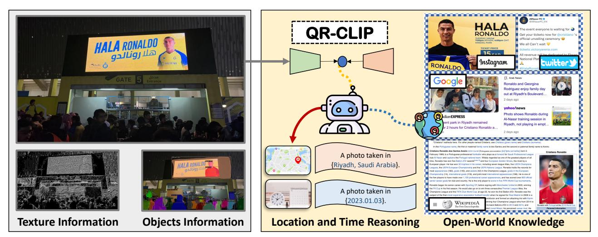
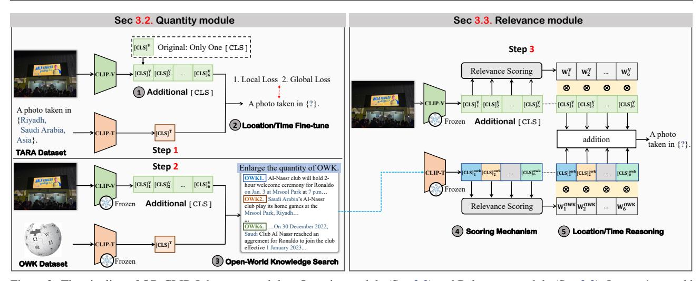
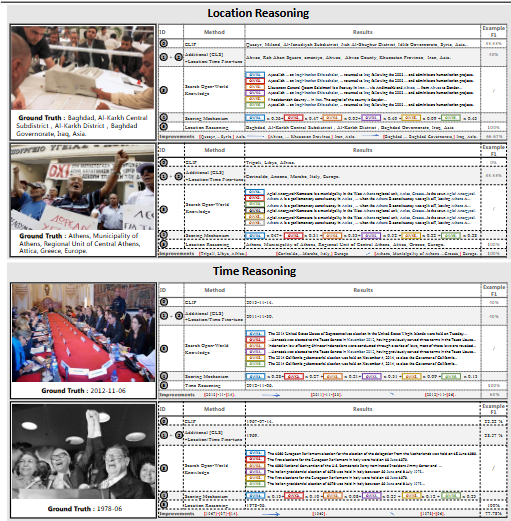

arXiv:2302.00952v1 [cs.CV] 2 Feb 2023

# QR-CLIP: Introducing Explicit Open-World Knowledge for Location and Time Reasoning

Weimin Shi1 Mingchen Zhuge†2 Zhong Zhou1 Dehong Gao3 Deng-Ping Fan4

Abstract

Daily images may convey abstract meanings that require us to memorize and infer profound information from them. To encourage such humanlike reasoning, in this work, we teach machines to predict where and when it was taken rather than performing basic tasks like traditional segmentation or classification. Inspired by Horn's OR theory (Horn, 1984), we designed a novel  $\mathbf{QR}$ -**CLIP** model consisting of two components: 1) the **Quantity** module first retrospects more openworld knowledge as the candidate language inputs; 2) the **Relevance** module carefully estimates vision and language cues and infers the location and time. Experiments show our QR-CLIP's effectiveness, and it outperforms the previous SOTA on each task by an average of about 10% and 130% relative lift in terms of location and time reasoning. This study lays a technical foundation for location and time reasoning and suggests that effectively introducing open-world knowledge is one of the panaceas for the tasks.

# 1. Introduction

Many deep computer vision models have outstanding perception abilities and can solve regular tasks by extracting simple visual contexts ( $i.e.,$  color, texture, and objects), following the principle: "what you see is what you get". However, they cannot engage with a scene in the same insightful ways humans can (Crowder & Friess, 2012). It seems difficult for them to think deeper (or *learning to think*) based on their observations (Schmidhuber, 2015).

There are two reasons to explain the abovementioned problem: 1) until recently, many fundamental computer vision problems remained unsolved, so the community focused

Equal Contributions: †Mingchen Zhuge designed and advised the project since March 2022. 1State Key Laboratory of Virtual Reality Technology and System, BUAA 2AI Initiative, KAUST 3Northwestern Polytechnical University 4CV Lab, ETH Zürich. Correspondence to: Zhong Zhou zzhou@buaa.edu.cn.

more on basic vision learning (Srivastava et al., 2015; He et al., 2016); and 2) previous models were unable to absorb more human knowledge due to limited hardware resources and data (Bommasani et al., 2021).

This paper aims to delve into the location and time reasoning behind the images (Fu et al., 2022). The procedure can be summarized as: input an image; the goal is to have the model guess where and when the image was taken. It is pretty different from the others ( $e.g.$ , basic classification (Wang et al., 2022), summarization (Fabbri et al., 2019), or retrieval tasks (Conforti et al., 2020)) since it requires the model explore more in-depth information and truly comprehend the event behind the images.

These days, industries afford millions of dollars to train foundation models (Reed et al.), and advanced parallel techniques (Rasley et al., 2020; Ott et al., 2019) enable the model to scale up the amounts of parameters and data. Some companies like OpenAI and DeepMind have developed a series of models, including GPT-3 (Brown et al., 2020), CLIP (Radford et al., 2021), and ChatGPT (Ouyang et al., 2022), etc. Most of those foundation models learn on their own from large amounts of online data made by people in a self-supervised fashion. This gives the models a certain amount of "open-world knowledge" (OWK). This motivates us to use CLIP (Radford et al., 2021) as our basic architecture to solve the proposed task since it shows effective performance in a number of multimodal tasks.

Compared with traditional image models (He et al., 2016; Liu et al., 2021), CLIP initially contains a certain amount of OWK. However, this knowledge is more encapsulated within the model. It can only be used implicitly through incontext learning (Min et al., 2022), preventing OWK from playing a larger role in our tasks. To solve this problem, we design a model named **QR-CLIP** with the capability to infer the location-and-time-related meta-information about the image. It is inspired by Horn's QR theory (Horn, 1984): Q-principle (quantity) requires maximization of the information content, which means "ask speaker to present as *much information as possible*". In contrast, the R-principle (relevance) requires minimization of form, which means "should focus more on the relevant content".

QR-CLIP:Introducing Explicit Open-World Knowledge for Location and Time Reasoning

Figure 1. Comparisons of traditional computer vision tasks (*left*) with location and time reasoning ( $right$ ). It is clear that—instead of simple image color, texture, and object information—location and time reasoning requires more human experiences and knowledge  $(a.k.a.$ open-world knowledge).

Regarding the Q-principle, we design the **Quantity** module: we utilize two techniques to improve the model to provide as much information as possible. For traditional transformerbased models (Kenton & Toutanova, 2019; Dosovitskiy et al., 2020), they use a single [CLS] to represent the input. Initially, we design additional [CLS] tokens that mimic different human perspectives on the same image. Since everyone has unique knowledge and experience, it is possible to gain a more comprehensive understanding of a given item by combining the knowledge of different individuals. This also inspires us to use each  $[CLS]_i$  to retrieve various useful open-world knowledge to aid predictions. Furthermore, motivated by current contrastive learning methods (Zhang et al.,  $2022$ ), we design the local and global loss for finetuning the CLIP model, ensuring our QR-CLIP is suitable for the tasks.

For the **Relevance** module, we design a scoring mechanism that weights the fusion of image and open-world knowledge embeddings. Like ordinary society, not all of the knowledge from individuals are correct. Thus our scoring mechanism is like an error correction tool to help the model select the most valuable information. It adaptively balances the different information and encourages the model to provide pertinent ones for location and time reasoning. Furthermore, the scoring mechanism balances vision and language knowledge, which means that when the quality of explicit OWK is poor, our scoring mechanism can focus more on original image features, greatly improving robustness.

The experiments indicate the strong abilities of our QR-CLIP model. Considering the accuracy (or Rank@1) achieves 19.31% (17.3% relative improvement compared to previous SOTA) on location reasoning, and 3.53% (253% relative improvement) on time reasoning.

Overall, our contributions can be categorized as:

- We design the **QR-CLIP**, which first investigates utilizing explicit open-world knowledge to help location and time reasoning.
- Our method achieves an average of 17.3% / 253% relative lifts on location and time reasoning tasks compared to the previous SOTA.
- In addition, the comprehensive experimental record will inspire the related field.

# 2. Related Work

## 2.1. Foundation Models

The emergence of foundation models is a relatively recent phenomenon (Bommasani et al., 2021), and has fundamentally altered the game rules of AI communities. They are commonly trained on a massive amount of unlabeled data at scale (typically via self-supervised learning (Radford et al., 2021)), making them adaptable to various downstream applications. Among these are popular models include GPT-3 (Brown et al., 2020) and PaLM (Chowdhery et al., 2022) as large language model, CLIP (Radford et al., 2021) and Flamingo (Alayrac et al., 2022) as vision-language model, Dall-E (Ramesh et al., 2021) and Stable Diffusion (Rombach et al., 2022) for text-to-image generation, GaTo (Reed et al.) as a generalist model, and ChatGPT (Ouyang et al., 2022) as human-like conversation agent, *etc.* This paper uses CLIP pre-trained with 400 million image-text pairs as baseline architecture. It learns excellent open-world knowledge and multi-modal representation by learning with such a large-scale corpus, making it ideal as the basic solution. Based on it, we made OR-CLIP to fit the location and time reasoning task.

QR-CLIP:Introducing Explicit Open-World Knowledge for Location and Time Reasoning

Figure 2. The pipeline of QR-CLIP. It has two modules: Quantity module (Sec 3.2) and Relevance module (Sec 3.3). In step 1, we add additional [CLS] to mimic different perspectives of different individuals and design the local and global loss to guide the location/time fine-tuning. Then, we freeze the fine-tuned CLIP-V and CLIP-T and use them to search for open-world knowledge from our OWK dataset (Sec 4.1). In the Relevance module, we use a scoring mechanism to weights the most valuable information from CLIP-T and CLIP-V. After multiplying the scoring weights for vision and language separately, we add them for final similarity calculation.

## 2.2. Location and Time Reasoning

Existing language models achieved significant success on a wide range of tasks that require an understanding of language (Kenton & Toutanova, 2019; Lewis et al., 2020). Also, the vision models (He et al., 2016; Dosovitskiy et al., 2020; Liu et al., 2021) can predict the correct class label of an image from thousands of options. But they still struggle with many reasoning tasks, such as discerning the abstractive meanings (e.g., time, location, event) of images (Yang et al., 2020; Tahmasebzadeh et al., 2021) or performing mathematical calculations (Lewkowycz et al., 2022) and science deduction (Degrave et al., 2022). However, humans can do these things well because real brains are more powerful than artificial neural networks in many ways and actively learn to conduct abstract reasoning (Schmidhuber, 2015). We focus on location and time reasoning (Fu et al.,  $2022$ ), which needs a model to think and reason beyond the actual content of an image. Compared to other reasoning tasks, it differs in that most of the time there aren't enough visual cues to make inferences, so auxiliary knowledge is required.

# 3. Approach

## 3.1. Preliminary

Task Background. Current AI methods are comparably weak in deducing the abstract information hidden behind an image. The goal of this paper is to let the model reason the location and time based on image input (Fu et al.,  $2022$ ): Given an image I, we need the model  $(M(I))$  to predict the location ( $Pred_l$ ) and time ( $Pred_t$ ).

Horn's QR Theory. In cognitive research (Allott, 2013), it is believed that human reasoning is the process of obtaining the best correlations. The OR theory (Horn, 1984) builds a more clear definition of the above correlations, where  $Q$ stands for the quantity principle, which requires the maximization of valuable content, and R means the relevance principle that requires the minimization of form and extracts most related information:

$$
Correlation  \uparrow \leftrightarrow Q \uparrow \times R \uparrow . 
$$

(1)

Therefore, we should simultaneously consider the quantity and relevance of information to achieve a higher correlation.

Our Pipeline. Following the human reasoning process, this paper proposes QR-CLIP. It is based on the contrastive language-image pretraining (CLIP) model (Radford et al., 2021), which was pre-trained with 400M internet data. The QR-CLIP is made up of the quantity module (Sec  $3.2$ ) and the relevance module (Sec  $3.3$ ). The quantity module aims to add diversity to the model's outputs. Here, we introduce the additional [CLS] method, which aims to generate multiple distinct  $[CLS]_i$  to imitate different perspectives of a single image. The relevance module uses a scoring mechanism to weigh the retrieved open-world knowledge and image features to ensure the most relevant information and combine them for final prediction.

## 3.2. Quantity Module

Additional [CLS]. We employ CLIP (Radford et al., 2021) as our basic architecture. In vanilla CLIP, [CLS] is used to distinguish the input token that represents the whole input features which is a common practice in other trans-

QR-CLIP:Introducing Explicit Open-World Knowledge for Location and Time Reasoning

former models (Kenton & Toutanova, 2019; Dosovitskiy et al., 2020).

To simplify the illustration and better represent our model in the following sections:

$$
[\mathtt{CLS}]_i^{\nu} \leftarrow \mathtt{Enc}_{\nu}([\widehat{\mathtt{CLS}}]_i^{\nu}) \text{ and } [\mathtt{CLS}]^t \leftarrow \mathtt{Enc}_{t}([\widehat{\mathtt{CLS}}]^t), 
$$

(2)

by default, when talking about  $[CLS]$  ( $[CLS]$ *i**v* and  $[CLS]$ *t**i*), they are the CLIP's output embeddings rather than the input token ( $[CLS]$ ), the same as shown in Fig. 2.

However, the output embedding [CLS] cannot adequately represent an image as the single embedding provides limited cues to the location and time reasoning. Therefore, we consider enlarging the representations for an image. It is evident that in real life, we would get different ideas about what an image means from different individuals. Following in this vein, we propose a simple yet effective methods: in our technical implementation, we are inspired by MVR (Zhang et al., 2022) and introduce additional [CLS]*y**i*  $(i = 1,...,n)$  to replace the original single [CLS] representation. Through the observation of ablations, we finally use 6 different [CLS]*y* at the beginning of the image patch token embeddings ( $\hat{I} = \hat{I}^{patch}_1, ..., \hat{I}^{patch}_7$ ), like ([CLS]*y*1...[CLS]*y*6  $\hat{I}$ ), and after going through the encoder Enc*v*, we get a list of embeddings ([CLS]*y*1...[CLS]*y*6  $I$ ). Using this design, the pre-trained model can investigate an image from multiple perspectives and dimensions. It follows the Q-principle and increases the quantity of information from multiple perspectives.

Since the text contains explicit semantic information and most language inputs carry clear messages, we only use the original  $[CLS]'$  at the beginning of the text token embedding (T), like ( $[CLS]' T$ ). Hence, we search for corresponding information through the image from the CLIP model by conducting:

$$
([\text{\texttt{CLS}}]^t) \cdot ([\text{\texttt{CLS}}]_i^v). 
$$

(3)

In the following fine-tuning or searching for open-world knowledge, each  $[CLS]_{i}^{v}$  of the Encv calculates the similarity with  $[CLS]^{v}$  of the candidate information by inner-product.

Location/Time Fine-tune. We first initialize and positionencode each  $[CLS]_{i}^{v}$  individually, aiming to extend the distance between each  $[CLS]_{i}^{v}$ . Then, we fine-tune CLIP with local and global losses (He et al., 2020; Zhang et al., 2022) to ensure each  $[CLS]_{i}^{v}$  is aligned with the location and time linguistic features  $[CLS]^{t}$ .

For the local loss, the correspondence between each  $[CLS]_{i}^{v}$  and  $[CLS]_{i}^{t}$  is achieved by a contrastive learning loss:

$$
L_{local} = -\frac{1}{i+1} \sum_{0}^{i} \log \frac{e^{J_{i}(q_{v}, k_{t+})}}{\sum_{1}^{n} [e^{f_{i}(q_{v}, k_{t+})} + e^{f_{i}(q_{v}, k_{t-})}]}, 
$$

(4)

here,  $q_v$  denote the query image embedding ( $[CLS]_i^v$ );  $k_{t+}$  and  $k_{t-}$  are the positive and negative key text embeddings (a

batch of  $[CLS]^t$ ). We calculate the correlation score between them by inner product  $f_i(x, y)$ .

Then, the global loss further constrains the correspondence between image features and location/time features, and the calculation method is as follows:

$$
L_{global} = -\log \frac{e^{f_{max}(q_v, k_{t+})}}{\sum_{1}^{n} [e^{f_{max}(q_v, k_{t+})} + e^{f_{max}(q_v, k_{t-})}]}, 
$$

(5)

where  $f_{max}(q_v, k_t) = \max_{i} \{f_i(q_v, k_t)\}\$ ,  $\max_{i} \{\}\$  represents the maximum value. The entire training loss is defined as a linear combination of two losses as  $L_{total} = L_{local} + L_{global}$ .

Open-World Knowledge Search. After fine-tuning, each  $[CLS]_{i}^{v}$  output by CLIP-V can represent image location/time information from various perspectives. We use these different representations to retrieve more valuable open-world knowledge from the OWK dataset (Sec 4.1) to increase the quantity of knowledge.

Given an image  $I$  and the corresponding Open-World Knowledge ( $O = T_1^{owk}, T_2^{owk}, ..., T_k^{owk}, k = 122,408$ ), the process of searching follows Eq. 3: each [CLS]*v**i* calculates the similarity with 122,408 candidate Wikipedia corpus (OWK). Here, we select the candidate Wikipedia with the top-1 similarity for each [CLS]*v**i*, yielding a total of 6 OWKs. After that, the Quantity module (sec 3.2) finished its job by collecting a list of highly-related OWKs items that the next Relevance module (sec 3.3) would use as input for CLIP-T.

# 3.3. Relevance Module

Scoring Mechanism. The amount of useful information varies for each  $[CLS]_{i}^{v}$  of an image and the corresponding embeddings of open-world knowledge. As a result, it is critical to weigh the importance of different features dynamically. Based on the above motivation, we propose a scoring mechanism to further highlight the relevant features.

We adopt two layers of MLP ( $\text{MLP}_{2-layer}$ ) as our relevance scoring component and find it helpful:

$$
W^{x} = \text{MLP}_{2-layer}([\texttt{CLS}]_{i}^{x}), 
$$

(6)

Here,  $[CLS]_{i}^{x}$  is the input embedding, and  $W^{x}$  is the calculated weight. We use contrastive learning to optimize the model. To facilitate implementation, we directly adopt the loss functions from the first step of the Quantity module (sec 3.2). In this case, we keep the CLIP-T and CLIP-V frozen and only update the parameters of the relevance scoring component.

In the local loss, the information of two features is integrated to optimize the scoring mechanism jointly:

$$
f_i(q, k_+) = (W_i^{owk} \times [\mathtt{CLS}]_i^{owk} + W_i^{\nu} \times [\mathtt{CLS}]_i^{\nu}), \cdot F^{gt}, 
$$

(7)

QR-CLIP: Introducing Explicit Open-World Knowledge for Location and Time Reasoning

| ID                                 | Method                            | Training Mode | Accuracy (~ Rank@1) | Rank@5  | Example-F1 | F1-Score |
|------------------------------------|-----------------------------------|---------------|---------------------|---------|------------|----------|
| Location Reasoning                 |                                   |               |                     |         |            |          |
| 1                                  | ResNet-50 (He et al., 2016)       | Supervised    | 3.18%               | 9.82%   | 22.19%     | 2.27%    |
| 2                                  | Swin-T (Liu et al., 2021)         | Supervised    | 6.70%               | 17.07%  | 33.56%     | 5.02%    |
| 3                                  | CLIP (Radford et al., 2021)       | Zero-Shot     | 11.11%              | 27.85%  | 44.96%     | 9.74%    |
| 4                                  | CLIP† (Fu et al., 2022)           | Fine-tune     | 15.72%              | 37.13%  | 49.74%     | 13.82%   |
| 5                                  | CLIP+Seg (Fu et al., 2022)        | Fine-tune     | 16.46%              | 37.48%  | 50.52%     | 14.63%   |
| 6                                  | QR-CLIP (Ours)                    | Fine-tune     | 19.31%              | 38.78%  | 50.96%     | 17.70%   |
|                                    | <i>Improvements (AVG: 10.66%)</i> |               | +17.31%             | +3.47%  | +0.87%     | +20.98%  |
| Time Reasoning                     |                                   |               |                     |         |            |          |
| 7                                  | ResNet-50 (He et al., 2016)       | Supervised    | 0.84%               | 5.14%   | 39.99%     | 0.46%    |
| 8                                  | Swin-T (Liu et al., 2021)         | Supervised    | 0.97%               | 5.53%   | 43.95%     | 0.72%    |
| 9                                  | CLIP (Radford et al., 2021)       | Zero-Shot     | 0.46%               | 2.42%   | 39.90%     | 0.25%    |
| 10                                 | CLIP† (Fu et al., 2022)           | Fine-tune     | 1.00%               | 3.07%   | 43.09%     | 0.54%    |
| 11                                 | CLIP+Seg (Fu et al., 2022)        | Fine-tune     | 0.92%               | 3.15%   | 42.89%     | 0.71%    |
| 12                                 | QR-CLIP (Ours)                    | Fine-tune     | 3.53%               | 10.90%  | 47.89%     | 2.01%    |
| <i>Improvements (AVG: 134.38%)</i> |                                   |               | +253%               | +97.11% | +8.23%     | +179.17% |

 $Table 1.$  Summary of the performance for different baselines on the image location and time prediction.  $\dagger$  means fine-tune the original CLIP (Radford et al., 2021). 'AVG': average relative lift.

 $W_i^{owk}$  and  $W_i^v$  are the weights of the [CLS] $_i^{owk}$  and [CLS] $_i^v$ ;  $q$  in this place is the addition of weight vision-language features  $W_i^{owk} \times [\text{CLS}]_i^{owk} + W_i^v \times [\text{CLS}]_i^v$ ; q is the ground-  
truth features generated by  $F^{GT} = \text{Enc}_t(GT)$ .

Location and Time Reasoning. We use the fused features  $F^{fused} = \sum_{i=1}^{6} (W_i^{owk} \times [\text{CLS}]_i^{owk} + W_i^{v} \times [\text{CLS}]_i^{v})$  as our final features to predict the location and time. The prediction is completed by calculating the similarity between  $F^{fused}$  and the candidate location/time embeddings.

We believe that by using the CLIP pre-trained 400M openworld corpus and then fine-tuning it by adding additional [CLS] with location-and-time-specific data, it can basically reason about meta information. QR-CLIP will then improve its performance by retrieving valuable open-world knowledge and using it as auxiliary cues. Finally, the model balances vision and language embeddings, and by incorporating them into prediction, the model achieves its peak performance. The process is related to Horn's QR rule (Horn, 1984). Also, it mimics a procedure of information spreading (Wang et al.,  $2011$ ): diverse individuals have diverse perspectives and attitudes regarding the same thing (sec  $3.2$ ), but combining them effectively fosters a more profound comprehension (sec  $3.3$ ).

# 4. Experiments

## 4.1. Training Settings

Dataset. We used two datasets: TARA dataset (Fu et al., 2022) and our collected OWK dataset. TARA dataset includes 15,429 samples. Each sample contains a news picture and the corresponding location, time description. Following the original setup, we train QR-CLIP on a train set contain-

ing 12,306 instances and evaluate our method using a test set containing 1,644 instances. The **OWK dataset** is derived from the WIT dataset (Srinivasan et al., 2021). Considering the limited computation resource, we only use  $122,408$ texts from the 37.5 million entity-rich image-text examples in English Wikipedia that correspond to the countries and years as our open-world knowledge.

**Evaluation Metrics.** For a fair comparison, we first follow the same evaluation metrics on the TARA benchmark (Fu et al., 2022): Accuracy and Example-F1. Accuracy is calculated by comparing the predicted results with the entire labels. Example-F1 is calculated by comparing predictions with hierarchical labels:

$$
Example-F1 = \frac{1}{N} \sum_{i=1}^{N} \frac{2|\text{GT}_i \cap \text{Pred}_i|}{|\text{GT}_i| + |\text{Pred}_i|},
$$

(8)

where  $GT_i$  represents the hierarchical label, and Predi represents the hierarchical prediction. If the entire label is {'Zurich, Switzerland, Europe'}, the progressive hierarchical labels are the three combinations of true label as {'Zurich, Switzerland, Europe'}, {'Switzerland, Europe'5948} and {'Europe'}. In addition, Rank@5 and F1-Score are utilized to evaluate the performance of the proposed method.

Implementation Details. QR-CLIP is based on CLIP+VIT-B/32 model with an input size of  $224 \times 224$ , and it is implemented on the PyTorch 1.10.1 platform with the Adam optimizer to update the neural network's weights and biases. The training batch size is 32, and the initial learning rate is  $1e - 6$ . Our model utilizes a pre-trained model and takes hours in the fine-tune process on an NVIDIA RTX 3090 GPU running CUDA 11.7.1.

QR-CLIP:Introducing Explicit Open-World Knowledge for Location and Time Reasoning

## 4.2. Comparative Results

Location Reasoning. We compare the results of our QR-CLIP with other methods for location reasoning in Tab. 1. QR-CLIP, achieves accuracy of 19.31% Accuracy (R@1). Meanwhile, its Example-F1 score for the hierarchical labels is  $50.96\%$ . All the results clearly show that our method outperforms other methods.

(1) Compared with ResNet-50 (He et al., 2016) and Swin-T (Liu et al., 2021), vanilla CLIP achieves 7.93% and 4.41% absolute improvement in location prediction accuracy ( $ID$ :  $1,2,3$ ). It indicates that compared with the vision model only trained on ImageNet (Deng et al., 2009), CLIP already possesses some knowledge for reasoning. Meanwhile, our QR-CLIP achieves a more significant advantage with 16.13% and 12.61% absolute improvements in terms of accuracy (ID:  $1,2,6$ ). These results show that traditional image classification methods cannot accomplish inference of the abstract information behind the images. While the CLIP model trained on large-scale internet data have the ability to identify locations based on image data, and QR-CLIP significantly enhances this capability.

(2) Besides, compared to CLIP† and the state-of-the-art method CLIP+Seg, QR-CLIP improves the accuracy by 3.59% and 2.85% absolute improvement, the F1-Score has increased by  $3.88\%$  and  $3.07\%$ , respectively (ID: 4,5,6). Other evaluation metrics also improved. The results show that QR-CLIP can effectively utilize open-world knowledge to establish a closer connection between image and location information through fine-tuning CLIP. However, we also find that the improvement in Example-F1 is not as obvious. We argue that this is because the mechanism of Example-F1: take the image of Fig. 1 as an example—the picture show many Arabia elements (turban and Arabic). It is not difficult for many models to recognize that this image was captured in the Middle East and to predict its hierarchical label as  $\{`Asia'\}$ . However, they failed when asked to predict the entire label {'Riyadh, Saudi Arabia, Asia"}. Therefore, the discrepancy in other metrics may be more noticeable.

**Time Reasoning.** Tab. 1 also presents the performance of our method and existing techniques for time reasoning. The Accuracy (R@1) of QR-CLIP is 3.53%, and Example-F1 is 47.89%; compared to the CLIP model, the two metrics have been absolutely improved by 3.07% and 7.99%, respectively (ID:  $9.12$ ). Compared with CLIP $\dagger$  and CLIP+Seg, which are also based on CLIP fine-tuning, our method obtains 2.53% and 2.61% improvement in the accuracy of prediction time, respectively. Compared with traditional image classification methods, QR-CLIP has achieved absolute advantages in all metrics (ID:  $7,8,12$ ). In addition, due to the lack of timerelated information in the image, the prediction accuracy of fine-tuning CLIP methods for image time can only reach about 1%, which is significantly lower than the accuracy of

| ID                 | Method                         | Accuracy (~ Rank@1) | Rank@5 | Example-F1 |
|--------------------|--------------------------------|---------------------|--------|------------|
| Location Reasoning |                                |                     |        |            |
| 13                 | CLIP+[CLS*] $_{i}^{\nu}$ (n=2) | 9.69%               | 27.17% | 44.37%     |
| 14                 | CLIP+[CLS*] $_{i}^{\nu}$ (n=4) | 9.53%               | 26.25% | 43.23%     |
| 15                 | CLIP+[CLS*] $_{i}^{\nu}$ (n=6) | 9.21%               | 27.05% | 43.69%     |
| 16                 | CLIP+[CLS] $_{i}^{\nu}$ (n=2)  | 16.84%              | 37.47% | 49.22%     |
| 17                 | CLIP+[CLS] $_{i}^{\nu}$ (n=4)  | 17.11%              | 37.60% | 49.51%     |
| 18                 | CLIP+[CLS] $_{i}^{\nu}$ (n=6)  | 17.25%              | 37.80% | 49.98%     |
| 19                 | CLIP+[CLS] $_{i}^{\nu}$ (n=8)  | 17.03%              | 37.62% | 48.93%     |
| Time Reasoning     |                                |                     |        |            |
| 20                 | CLIP+[CLS*] $_{i}^{\nu}$ (n=2) | 0.98%               | 3.03%  | 42.18%     |
| 21                 | CLIP+[CLS*] $_{i}^{\nu}$ (n=4) | 1.03%               | 2.99%  | 43.98%     |
| 22                 | CLIP+[CLS*] $_{i}^{\nu}$ (n=6) | 1.08%               | 3.15%  | 43.62%     |
| 23                 | CLIP+[CLS] $_{i}^{\nu}$ (n=2)  | 1.84%               | 5.14%  | 45.57%     |
| 24                 | CLIP+[CLS] $_{i}^{\nu}$ (n=4)  | 1.92%               | 5.21%  | 45.63%     |
| 25                 | CLIP+[CLS] $_{i}^{\nu}$ (n=6)  | 2.00%               | 5.37%  | 45.60%     |
| 26                 | CLIP+[CLS] $_{i}^{\nu}$ (n=8)  | 1.53%               | 5.06%  | 45.15%     |

Table 2. Performance of additional [CLS] in QR-CLIP with different number and prediction methods. Whereas  $[CLS^*]_i^v$  refers to fusing all additional [CLS] by MLPs and then calculating the similarity with location and time labels,  $[CLS]_{i}^{v}$  refers to calculating the similarity between each additional  $[CLS]$  with labels separately, and then using the ( $[CLS]_{i}^{\nu}$ -label) pair with the greatest similarity as the prediction.  $n$  represents the number of [CLS].

location prediction (ID:  $10,11$ ). This is not surprising, also take the image on Fig. 1 as sample: even for humans, it is difficult to determine that {'03-01-2023'} is the time when this photograph was taken, if they are unfamiliar with Cristiano Ronaldo or some specific knowledge. Nevertheless, the method proposed in this paper is still effective (that our model achieves  $+253.00\%$  relative lift) for predicting time and significantly closes the gap with location prediction.

## 4.3. Ablation Study

Analysis on Additional [CLS]. Following the network design process, all experiments of this part were conducted on the setting with only the step  $1$  in Quantity module (Sec 3.2).

As shown in Tab. 2, both of different [CLS] aggregation methods and different numbers of [CLS] can affect network performance. Comparing  $[CLS_i^*]$  and  $[CLS_i^\prime]$  with the same number (*i.e.*,  $n = 2$ ) of [CLS], the latter has 7.15% and 0.86% higher location and time prediction accuracy (ID: 13,16,20,23). Besides, the performance of  $[CLS_i^*]$  is not significantly affected by the number of [CLS] (ID: 13-15,20-22). We argue that using MLP to aggregate the embeddings may destroy CLIP's original representation. It is better to separately calculate the similarities across each  $[CLS_i^\prime]$  with the location and time labels and then select the one with the most significant value as the prediction. Then we analyze how different numbers of [CLS] affect the model performance. When  $n$  was increased to 8, no significant performance difference was observed, so we finally chose  $n = 6$  in the following experiments (ID: 17-19, 24-26). The results indicate that the additional [CLS] effectively

QR-CLIP:Introducing Explicit Open-World Knowledge for Location and Time Reasoning

| ID Method                           | Accuracy (~ Rank@1) | Rank@5 | Example-F1 |
|-------------------------------------|---------------------|--------|------------|
| Location Reasoning (Only QM)        |                     |        |            |
| CLIP+[CLS]v(n=6)+LL                 | 16.77%              | 36.89% | 49.63%     |
| CLIP+[CLS]v(n=6)+GL                 | 17.13%              | 37.75% | 49.87%     |
| CLIP+[CLS]v(n=6)+LL+GL              | 17.25%              | 37.80% | 49.98%     |
| Time Reasoning (Only QM)            |                     |        |            |
| CLIP+[CLS]v(n=6)+LL                 | 1.23%               | 5.33%  | 43.59%     |
| CLIP+[CLS]v(n=6)+GL                 | 1.92%               | 5.60%  | 44.62%     |
| CLIP+[CLS]v(n=6)+LL+GL              | 2.00%               | 5.37%  | 45.60%     |
| Location Reasoning (QR-CLIP: QM+RM) |                     |        |            |
| CLIP+[CLS]v(n=6)+LL                 | 19.11%              | 37.74% | 50.51%     |
| CLIP+[CLS]v(n=6)+GL                 | 18.36%              | 37.87% | 50.03%     |
| CLIP+[CLS]v(n=6)+LL+GL              | 19.31%              | 38.78% | 50.96%     |
| Time Reasoning (QR-CLIP: QM+RM)     |                     |        |            |
| CLIP+[CLS]v(n=6)+LL                 | 3.22%               | 11.57% | 47.80%     |
| CLIP+[CLS]v(n=6)+GL                 | 2.98%               | 9.60%  | 46.32%     |
| CLIP+[CLS]v(n=6)+LL+GL              | 3.53%               | 10.90% | 47.89%     |

Table 3. The impact of various loss functions and components on performance. LL, GL indicate the local loss and global loss, respectively. QR-CLIP means the model contains entirely Quantity module (QM: Sec. 3.2) and Relevance module (RM: Sec. 3.3).

| $ID$               | Candidate OWKs | Accuracy (~ Rank@1) | Rank@5 | Example-F1 |
|--------------------|----------------|---------------------|--------|------------|
| Location Reasoning |                |                     |        |            |
| 39                 | 29,243         | 17.75%              | 37.75% | 50.32%     |
| 40                 | 52,159         | 18.90%              | 37.94% | 50.84%     |
| 41                 | 122,408        | 19.31%              | 38.78% | 50.96%     |
| Time Reasoning     |                |                     |        |            |
| 42                 | 29,243         | 1.59%               | 5.87%  | 45.64%     |
| 43                 | 52,159         | 2.96%               | 10.65% | 47.77%     |
| 44                 | 122,408        | 3.53%               | 10.90% | 47.89%     |

Table 4. The results of the effect of increasing the candidate numbers of Open-World Knowledge (OWK).

| ID                 | Method   | Accuracy (~ Rank@1) | Rank@5 | Example-F1 |
|--------------------|----------|---------------------|--------|------------|
| Location Reasoning |          |                     |        |            |
| 45                 | Scorev   | 16.43%              | 36.74% | 49.97%     |
| 46                 | Scoret   | 18.38%              | 37.53% | 50.19%     |
| 47                 | Proposed | 19.31%              | 38.78% | 50.96%     |
| Time Reasoning     |          |                     |        |            |
| 48                 | Scorev   | 2.76%               | 10.59% | 47.53%     |
| 49                 | Scoret   | 2.92%               | 10.37% | 47.60%     |
| 50                 | Proposed | 3.53%               | 10.90% | 47.89%     |

Table 5. The effect of different scoring mechanisms on network performance, where  $Score_v$  indicates that only images are scored and Score $t$  means scoring open-world knowledge only.

increases image cues by constructing multiple perspectives and has a promising benefit.

**Effectiveness of Losses and Modules.** We further analyze the impact of losses, the Quantity Module (Sec 3.2) and Relevance Module (Sec 3.3). As shown in Tab. 3, adding both the local and global losses will increase model performance, which first indicates the effectiveness of these two losses (ID: 27-38). When we compare the Quantity module to the entire QR-CLIP, we can see that the Relevance module significantly improved the reasoning abilities (ID: 29,32,35,38), which verifies that the whole designs of the two modules are reasonable.

Impact of Open-World Knowledge. To validate the performance of different amounts of open-world knowledge, we conduct an experiment to vilify whether increasing the number of OWKs is beneficial. As shown in Tab. 4, when 122,408 OWKs were added, compared to the method without open-world knowledge, the network was able to make more accurate predictions (absolute lift by 2.06% and  $1.53\%$ ) about location and time (ID:  $18,25,41,44$ ). These results show that our method can effectively use open-world knowledge to improve the model's accuracy for image location and time. Besides, the performance gradually improves as the number of OWKs increases (ID: 39-44). It also shows that our method can further explore a more extensive range of open-world knowledge. Nonetheless, comparing each  $[CLS]_{i}^{v}$  with 122,408 OWKs is already time-consuming and limits our ability to increase the amount; in the future, we will find a more efficient way to overcome this challenge.

**Performance of Scoring Mechanism.** This part analyzes the performance of different scoring mechanisms in the Relevance module (Sec 3.3), and the experimental results are shown in Tab. 5. When we used the Score $\nu$ , some image features were even weakened, and the time and location prediction accuracy decreased after fusing open-world knowledge (ID:  $45,47,48,50$ ). When use the scoring mechanism on text  $(Score_t)$ —only the open world knowledge was weighted during the fusion process—the accuracy of location and time prediction was improved by  $1.13\%$  and  $0.92\%$ , respectively (ID:  $45,46,48,49$ ). This indicates that the weights have a significant influence on the final predictions. When both image and open-world knowledge embeddings are scored, the accuracy of location and time predictions increases by  $2.06\%$ and 1.50%, respectively (ID: 45,47,48,50). This implies that providing only the information required for the final prediction helps our QR-CLIP better understand abstract information and caters to the idea of the QR rule.

## 4.4. Visualization

We provide a visual demonstration for QR-CLIP in Fig. 3. Taking the fourth picture as an example, when we use vanilla CLIP (Radford et al., 2021) as the baseline, as can be seen, it performs worse in this case, achieving lower Example-F1 scores (22.22%). After using additional [CLS] and finetuned them using global and local losses, our QR-CLIP detects an image from different perspectives and get higher scores (28.57%). After that, QR-model retrieves six OWKs used as language input; the six OWKs all describe the abstract information expressed in the image content: an election meeting. In addition, each piece of knowledge contains much information about the time associated with the meeting. The scoring mechanism then assigns different weights to each OWK, with the OWK that lacks valuable time information receiving a lower weight, guiding the model to pay attention to the correct time information.

QR-CLIP:Introducing Explicit Open-World Knowledge for Location and Time Reasoning

 **Location Reasoning**

Figure 3. We show the visualizations of 5 procedures of QR-CLIP. For each process, the reader can refer to Fig. 2

## 4.5. Limitation and Future Work

We are still in the early stages of investigating how to best use CLIP and the QR principle to explore open-world knowledge to support location and time reasoning. And the modules and techniques developed are simple but effective. In the future: 1) we will investigate more efficient and elegant implementations; 2) while addressing the limited computational resources, collect a larger OWK dataset as input candidates; 3) using multimodal OWKs to see if images from Instagram, Twitter, etc. could help with this task.

# 5. Conclusion

We designed a novel **QR-CLIP** model. It consists of two modules: 1) the **Quantity** module and 2) the **Relevance** module. Experiments show that it outperforms all previous SOTA on location and time reasoning by a wide margin. To show how our designed components affect the model, we conduct comprehensive ablation studies and verify that open-world knowledge is beneficial for solving our problem. We hope this paper will serve as a technical foundation for this study area and inspire more fascinating research.

QR-CLIP:Introducing Explicit Open-World Knowledge for Location and Time Reasoning

# References

- Alayrac, J.-B., Donahue, J., Luc, P., Miech, A., Barr, I., Hasson, Y., Lenc, K., Mensch, A., Millican, K., Reynolds, M., et al. Flamingo: a visual language model for few-shot learning. In NeurIPS, 2022.
- Allott, N. Relevance theory. In Perspectives on linguistic pragmatics, pp. 57–98. 2013.
- Bommasani, R., Hudson, D. A., Adeli, E., Altman, R., Arora, S., von Arx, S., Bernstein, M. S., Bohg, J., Bosselut, A., Brunskill, E., et al. On the opportunities and risks of foundation models. *arXiv* preprint arXiv:2108.07258, 2021.
- Brown, T., Mann, B., Ryder, N., Subbiah, M., Kaplan, J. D., Dhariwal, P., Neelakantan, A., Shyam, P., Sastry, G., Askell, A., et al. Language models are few-shot learners. In NeurIPS, 2020.
- Chowdhery, A., Narang, S., Devlin, J., Bosma, M., Mishra, G., Roberts, A., Barham, P., Chung, H. W., Sutton, C., Gehrmann, S., et al. Palm: Scaling language modeling with pathways. *arXiv* preprint *arXiv*:2204.02311, 2022.
- Conforti, C., Berndt, J., Pilehvar, M. T., Giannitsarou, C., Toxvaerd, F., and Collier, N. Stander: An expertannotated dataset for news stance detection and evidence retrieval. In ACL, 2020.
- Crowder, J. A. and Friess, S. Artificial psychology: The psychology of ai. *People*, 2(3):4–5, 2012.
- Degrave, J., Felici, F., Buchli, J., Neunert, M., Tracey, B., Carpanese, F., Ewalds, T., Hafner, R., Abdolmaleki, A., de Las Casas, D., et al. Magnetic control of tokamak plasmas through deep reinforcement learning. *Nature*, 602(7897):414–419, 2022.
- Deng, J., Dong, W., Socher, R., Li, L.-J., Li, K., and Fei-Fei, L. Imagenet: A large-scale hierarchical image database. In CVPR, 2009.
- Dosovitskiy, A., Beyer, L., Kolesnikov, A., Weissenborn, D., Zhai, X., Unterthiner, T., Dehghani, M., Minderer, M., Heigold, G., Gelly, S., et al. An image is worth 16x16 words: Transformers for image recognition at scale. In ICLR, 2020.
- Fabbri, A. R., Li, I., She, T., Li, S., and Radev, D. Multi-news: A large-scale multi-document summarization dataset and abstractive hierarchical model. In ACL, 2019.
- Fu, X., Zhou, B., Chandratreya, I., Vondrick, C., and Roth, D. There's a time and place for reasoning beyond the image. In ACL, 2022.

- He, K., Zhang, X., Ren, S., and Sun, J. Deep residual learning for image recognition. In *CVPR*, 2016.
- He, K., Fan, H., Wu, Y., Xie, S., and Girshick, R. Momentum contrast for unsupervised visual representation learning. In *CVPR*, 2020.
- Horn, L. Towards a new taxonomy for pragmatic inference: Q-and r-based implicature. Meaning, Form, and Use in Context: Linguistic Applications, 1984.
- Kenton, J. D. M.-W. C. and Toutanova, L. K. Bert: Pretraining of deep bidirectional transformers for language understanding. In NACCL, 2019.
- Lewis, M., Liu, Y., Goyal, N., Ghazvininejad, M., Mohamed, A., Levy, O., Stoyanov, V., and Zettlemoyer, L. Bart: Denoising sequence-to-sequence pre-training for natural language generation, translation, and comprehension. In ACL, 2020.
- Lewkowycz, A., Andreassen, A. J., Dohan, D., Dyer, E., Michalewski, H., Ramasesh, V. V., Slone, A., Anil, C., Schlag, I., Gutman-Solo, T., et al. Solving quantitative reasoning problems with language models. In *NeurIPS*, 2022.
- Liu, Z., Lin, Y., Cao, Y., Hu, H., Wei, Y., Zhang, Z., Lin, S., and Guo, B. Swin transformer: Hierarchical vision transformer using shifted windows. In *ICCV*, 2021.
- Min, S., Lyu, X., Holtzman, A., Artetxe, M., Lewis, M., Hajishirzi, H., and Zettlemoyer, L. Rethinking the role of demonstrations: What makes in-context learning work? arXiv preprint arXiv:2202.12837, 2022.
- Ott, M., Edunov, S., Baevski, A., Fan, A., Gross, S., Ng, N., Grangier, D., and Auli, M. fairseq: A fast, extensible toolkit for sequence modeling. In *ACL*, 2019.
- Ouyang, L., Wu, J., Jiang, X., Almeida, D., Wainwright, C. L., Mishkin, P., Zhang, C., Agarwal, S., Slama, K., Ray, A., et al. Training language models to follow instructions with human feedback. *arXiv* preprint arXiv:2203.02155, 2022.
- Radford, A., Kim, J. W., Hallacy, C., Ramesh, A., Goh, G., Agarwal, S., Sastry, G., Askell, A., Mishkin, P., Clark, J., et al. Learning transferable visual models from natural language supervision. In *ICML*, 2021.
- Ramesh, A., Pavlov, M., Goh, G., Gray, S., Voss, C., Radford, A., Chen, M., and Sutskever, I. Zero-shot text-toimage generation. In *ICML*, 2021.
- Rasley, J., Rajbhandari, S., Ruwase, O., and He, Y. Deepspeed: System optimizations enable training deep learning models with over 100 billion parameters. In SIGKDD, 2020.

QR-CLIP:Introducing Explicit Open-World Knowledge for Location and Time Reasoning

- Reed, S., Zolna, K., Parisotto, E., Colmenarejo, S. G., Novikov, A., Barth-maron, G., Giménez, M., Sulsky, Y., Kay, J., Springenberg, J. T., et al. A generalist agent. TMLR.
- Rombach, R., Blattmann, A., Lorenz, D., Esser, P., and Ommer, B. High-resolution image synthesis with latent diffusion models. In CVPR, 2022.
- Schmidhuber, J. On learning to think: Algorithmic information theory for novel combinations of reinforcement learning controllers and recurrent neural world models. arXiv preprint arXiv:1511.09249, 2015.
- Srinivasan, K., Raman, K., Chen, J., Bendersky, M., and Najork, M. Wit: Wikipedia-based image text dataset for multimodal multilingual machine learning. In SIGIR, 2021.
- Srivastava, R. K., Greff, K., and Schmidhuber, J. Highway networks. arXiv preprint arXiv:1505.00387, 2015.
- Tahmasebzadeh, G., Kacupaj, E., Müller-Budack, E., Hakimov, S., Lehmann, J., and Ewerth, R. Geowine: Geolocation based wiki, image, news and event retrieval. In SIGIR, 2021.
- Wang, D., Wen, Z., Tong, H., Lin, C.-Y., Song, C., and Barabási, A.-L. Information spreading in context. In WWW, 2011.
- Wang, Z., Shan, X., Zhang, X., and Yang, J. N24news: A new dataset for multimodal news classification. In LREC, 2022.
- Yang, Z., Lin, Z., Kang, P., Lv, J., Li, Q., and Liu, W. Learning shared semantic space with correlation alignment for cross-modal event retrieval. ACM TOMM, 16(1):1-22, 2020.
- Zhang, S., Liang, Y., Gong, M., Jiang, D., and Duan, N. Multi-view document representation learning for opendomain dense retrieval. In ACL, 2022.