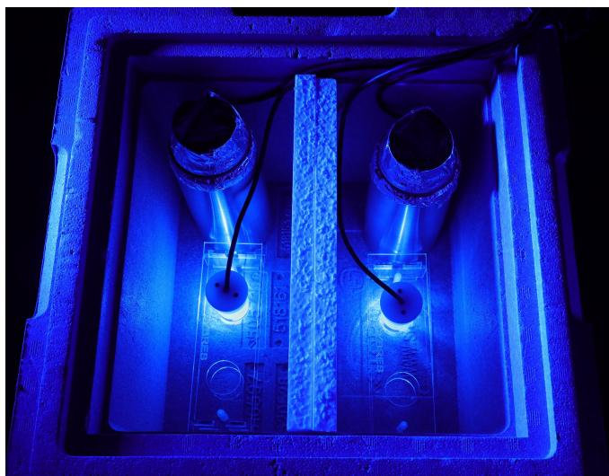

arXiv:2302.01019v1 [q-bio.NC] 2 Feb 2023

# Biophysical aspects of neurocognitive modeling with long-term sustained temperature variations

S. Kernbach, O. Kernbach, A. Kernbach

CYBRES GmbH, Research Center of Advanced Robotics and Environmental Science, Melunerstr. 40, 70569 Stuttgart, Germany, contact author: serge.kernbach@cybertronica.de.com

Abstract-Long-term focused attention with visualization and breathing exercises is at the core of various Eastern traditions. Neurocognitive and psychosomatic phenomena demonstrated during such exercises were instrumentally explored with EEG and other sensors. Neurocognitive modeling in the form of meditative visualization produced persistent temperature effects in the body long after the exercise finished; this raises the question about their psychosomatic or biophysical origin. The work explores this question by comparing experiments with focusing attention inside and outside the body. EEG, temperature, heart and breathing sensors monitor internal body conditions, high resolution differential calorimetric sensors are used to detect thermal effects outside the body. Experiments with 159 attempts (2427 operator-sensor sessions) were carried over five months, control measurements run in the same conditions in parallel to experimental series. Increase of body temperature up to moderate fever zone 38.5  $^{\circ}$ C and intentional control of up and down trend of core temperature by 1.6  $^{\circ}$ C are demonstrated. Persistent temperature variations last  $>60$  min. Experiments also demonstrated induced thermal fluctuations at  $10^{-3}$  °C level in external calorimetric systems with  $15\ \text{ml}$  of water for 60-90 min. Repeatability of these attempts is over 90%, statistical Chi-square and Mann-Whitney tests reject the null hypotheses about random character of outcomes. Thus, the obtained data confirm the persistent thermal effects reported in previous publications and indicate their biophysical dimension. To explain these results we refer to a new model in neuroscience that involves spin phenomena in biochemical and physical systems. These experiments demonstrate complex biophysical mechanisms of altered states of consciousness; their function in the body's neurohumoral regulation and non-classical brain functions is discussed.

Keywords-Biophysics, psychosomatic phenomena, neurohumoral regulation, non-classical brain functions.

# I. INTRODUCTION

Neurocognitive and psychosomatic mechanisms of altered states of consciousness (ASC) in several Eastern traditions, such as Reiki [1], Tai chi [2], Oigong [3], Johrei [4] and others have been studied in academic publications. For instance, the focused attention on the body (abdominal region near the navel) in yoga Tummo has been shown to increase core temperature up to  $38.3^{\circ}$ C [5]. Authors demonstrated that a neurocognitive modeling in the form of meditative visualization in ASC is responsible for two effects: (a) increasing temperature far beyond the range of normal body temperature; (b) persistent, step-wise temperature increase long after the exercises finished. Similar effects were described in other publications [6], [7].

Persistent effects were also reported for techniques targeting environmental objects and processes, such as exposure of external Qi [8]–[10] and focused attention [11], [12] to aqueous solutions and properties of materials [13], bacterial cultures and laboratory animals [14]. The practice of these techniquescauses instrumentally recorded persistent changes in both the internal metabolism of human meditator and the properties of materials and processes. Comparing both results, the question arises about only psychosomatic or also biophysical origin of such phenomena. The work explorers this question in relation to long-term sustained temperature variations in two cases, when the attention is focused inside and outside the body.

This experimental study replicates and extends the methodologies of previous works  $[5]$ ,  $[6]$ ,  $[13]$  with practitioners of the six yogas of Naropa [15], [16] and the Dhammakaya meditation [17]. Skin surface and core temperature are measured with IR camera (wavelength 8-14 $\mu$ m) and contact sensors. External effects are measured by high resolution differential calorimeters with 6 temperature sensors and  $2x15$  ml of water. Such calorimeters are able to measure extremely small  $t$  changes as a symmetry breaking effect. A separate laboratory was prepared for measurements, three calorimetric setups served as control systems and three others used in experiments, all systems running in parallel. Additionally, the power supply, electromagnetic emissions, magnetic fields, air pressure and mechanical impacts are recorded by corresponding sensors. Meditators use the real-time biofeedback with sensors of EEG, heart and respiratory rate, and muscle activity.

The obtained results confirm the persistent effects reported in [\[5\]](#page-5-1), [\[6\]](#page-5-1), [\[13\]](#page-5-1). In particular, increase of body temperature up to moderate fever zone 38.5 °C and intentional control of up and down trend of core temperature by 1.6 °C are demonstrated for >60 min. Experiments have also shown the induced thermal fluctuations in external calorimetric systems at  $10^{-3}$  °C level for 60-90 min, which point to biophysical dimension of such phenomena. To explain these results, the biophysical hypothesis consists in the spin conversion of water isomers [\[18\]](#page-5-1). The spin configuration affects chemical reactivity [\[19\]](#page-5-1), [\[20\]](#page-5-1), behavior in electric field [\[21\]](#page-5-1), magnetic moment [\[22\]](#page-5-1), evaporation [\[23\]](#page-5-1), surface tension [\[24\]](#page-5-1) and other properties, in particular, the heat capacity of water isomers [\[25\]](#page-5-1). As a hypothesis, it is assumed that such a spin conversion induced through ASC, as recently proposed in neuroscience [\[26\]](#page-5-1), [\[27\]](#page-5-1) e.g. via non-classical brain functions [\[28\]](#page-5-1), can cause the observed thermal effects.

# II. SETUP AND METHODOLOGY OF EXPERIMENTS

## A. Description of the setup

The experimental setup includes biofeedback equipment for monitoring body-internal conditions and differential calorimeters for experiments with external thermal phenomena. Meditators use the Muse-2 EEG, heart and breathing sensor, see Fig. 1, for real-time auditory control of ASC. Experiments in

2

(a)

(b)

(c)

Figure 1. (a) The EEG, heart and breathing rate sensor for a real-time biofeedback and auditory control of ASC during meditation; (b) the LM35 precision temperature sensor fixed on the skin; (c). IR thermal image, wavelength 8-14 $\mu$ m, NEDT  $\leq$  60mK (shown is the LM35 sensor measuring the skin surface temperature).

[29] showed that the use of real-time biofeedback in ASC has a positive effect on 'active meditation' practices with long-term focused attention. Body temperature is measured in two ways: skin and core temperature by contact LM35 precision sensor, connected to a high resolution logger and thermal emission in 8-14 $\mu m$  area by IR imaging sensor (NEDT  $\leq$  60mK). Both methods deliver the same temperature data, but differ significantly in terms of thermal dynamics: IR method requires open-skin regions that quickly cool down, while the contact method is best suited for measuring internal body dynamics.

Figure 2. Passive differential calorimeter. (a) Scheme of the setup; (b) Image of the system with two Dewar vacuum flasks with NTC thermistor immersed in 15ml of water and two air temperature sensors.

Setup with differential calorimeter is shown in Fig.  $2$  and extends the earlier work [6]. One channel is used for experiments, the second channel represents a control sensor. Each channel has 15 ml of water in Dewar vacuum flask with NTC thermistor immersed in the fluid. Additionally, the air temperature is monitored in each section of the calorimeter inside and outside of the thermo-insulating box. Stabilized power supply is also measured by a separate sensor, the delta-sigma ADC with 24 bit sampling is used. In this work we utilize a passive scheme for the calorimeter, where a slow temperature variation is provided by a circadian rhythm in the laboratory (about  $1-1.5$  $^{\circ}$ C for 24 hours) and guaranties a high degree of homogeneity in temperature distribution. Differences caused by changes in the heat capacity of water samples are measured as symmetry breaks between channels, small fluctuations about  $10^{-5}$  °C of relative temperature can be detected. This system is used to explore the heat capacity of para- and ortho- isomers of water [25]. In several experiments we use electrochemical impedance spectrometers [30] to detect effects on environmental sensors, see Fig. 7.

3

Two separated rooms have been prepared for such experiments, see Fig.  $4(c)$ : all PCs and heat producing elements were removed from measurement laboratory; thermo-insulating screens have been installed in windows and doors; the room was closed and operated without human intervention.

## B. Methodology of experiments

Experiments are divided into two phases, with attention focused inside (the phase 1) and outside (the phase 2) the body. Experiments in the phase 1 are separated into three subgroups 1a, 1b, 1c and are also aimed at studying the effect of a meditator in ASC on closely spaced sensors. Since the human person irradiates heat, produces electrostatic fields, mechanical impacts and other 'classical interactions', measures were taken to isolate 'classical' from 'non-classical' factors. For example, a heat-insulating container with 3-5 liters of water delays the penetration of heat inside for 20-25 minutes, see Fig.  $4(a)$ ; this enables conducting short-term meditative experiments. In other cases, the meditators were separated from the measurement systems by a reinforced concrete wall, see Fig.  $4(b)$ .

Experiments in the phase 2 are conducted with meditators in the operator room and differential calorimeters installed in measurement room (the distance is about 7-10 meters), separated by two concrete walls, see Fig.  $4(c)$ . A heat transfer between rooms takes about 3-4 hours. Thus, we can exclude a direct thermal influence of meditators on calorimetric sensors during experiments in the phase  $2$ .

The meditative visualization during all experimental phases follows the tantric Tibetan techniques [15], [16] and Dhammakaya meditation [17]. The key parameters are long-term focused attention in ASC on a physical object (or internal organs in the body) and the state of consciousness (its cognitive and behavioral patterns in ASC). Example of EEG data in test experiments is shown in Fig. 3.

Figure 3. Example of EEG data in test experiments without biofeedback. The ASC area is shown as a gray bar.

As in other ASC experiments  $[5]$ ,  $[31]$ , two-stage EEG dynamics with different microstates is observed. It should be noted that the initial stage of ASC takes about 10-15 minutes, when cognitive functions are restructuring from processing of external signals to internal visualizations. The depth of ASC depends on external distorting stimuli, mental efforts in maintaining the focus of attention, psychic and muscle relaxation.

Evaluation of results follows the single factor methodology from other studies of Buddhist techniques [5], [17], [32]. The

Figure 4. (a,b) The phase 1 of experiments on studying the impact of a meditator in ASC on close surrounding objects at a distance of 1-3 meters with and without obstacles. (c) Scheme of two laboratories for the phase 2 of experiments,  $W1$ ,  $W2$  – water sensors, i.air, e.air – internal and external air sensors, totally 3 experimental and 3 control differential calorimeters are used experiments.

4

results are anonymized and randomized as much as possible for a small group (5 practitioners in age from 25 to 50 years with meditation experience ranged from 5 to 10 years) to remove bias.

## III. EXPERIMENTS

An overview of all attempts and their parameters is given in Table I. Experiments in the phase 1a and 1b are fully reproducible in the selected group of meditators, we observe only a variation in intensity of temperature responses. We also observed a non-temperature response of surrounding electrochemical sensors on presence of meditators in all cases, however, detecting the exact begin and end of exercises, as shown in Fig. 7, was possible only in several attempts. Since this topic represents the focus of other works [29], [33], [34], it was not pursued further here. Control measurements were carried out a) in parallel to experimental sessions on separate calorimeters (as non-targeted sensors); b) during so-called 'empty sessions' (meditators were present but no sessions were conducted), several examples of control attempts are shown in Figs.  $10(a)$ -10(c).

Table I PARAMETERS OF PERFORMED EXPERIMENTS, 'N OF SENSORS' -DIFFERENT SENSORS USED IN ONE ATTEMPT.

| phase | N attempts | N sensors                | N positive | description                                               |
|-------|------------|--------------------------|------------|-----------------------------------------------------------|
| 1a    | 12         | 1                        | 12         | body temperature                                          |
| 1b    | 10         | 4                        | 10         | hand temperature                                          |
| 1c    | 7          | 5                        | -          | surrounding objects                                       |
| 2     | 63         | 18(3x6)                  | 57         | external calorimeters                                     |
| 2     | 67         | 18(3x6)                  | 11         | control (most positive responses in non-targeted sensors) |
|       |            |                          | 0.00012    | Chi-square test, p value                                  |
|       |            |                          | 0.0008     | $U$ test, p value                                         |
| total | 159        | independent experiments  |            |                                                           |
|       | 2427       | operator-sensor sessions |            |                                                           |

## A. The phase 1 experiments

1a. Body temperature effects have been measured with three methods (IR, skin surface, core temperature). The temperature data depends essentially on behavior of a meditator, even small changes in position (during a 2-3 hour experiment) disturb a thermodynamic equilibrium of the body and are reflected in an increasing or decreasing trend of  $t$ . Temperature dynamics depends on a fat content of tissues, clothing, room temperature and other factors that affect thermodynamic conditions. Therefore, experiments have been performed in a fixed position of a meditator, providing enough time for stabilizing body temperature before and after attempts. Fig. 5 demonstrates several experiments with raising or lowering body temperature through meditative visualization in ASC. We observe an almost immediate response of body temperature to the visualization, the area of persistent changes after the session is clearly visible; its duration is longer than the session itself. Inclination of 

(a)

(b)

(C)

Figure 5. Examples of typical temperature effects for meditative visualization in ASC: (a) Tummo session with increasing the body temperature (measured by contact skin surface method in abdominal region near the navel); (b) Using meditative visualization for lowering body temperature (measured by contact skin surface method in abdominal region near the navel); (c) Variation of core temperature during meditative visualization without breading exercises. Regions of persistent changes after the sessions is well visible in all cases.

temperature dynamics during the sessions is higher for regions of 'natural' warm-up and cool-down phases, this indicates their more intensive thermodynamic mechanisms. Experiments on lowering body temperature does not include breading exercises.

1b. Additional attempts with heating up 15 ml water in small containers have been undertaken to measure the heat produced by hands if focusing attention on one of the hands. Each container has one  $t$  sensor immersed in the fluid and one  $t$  sensor measuring air temperature outside the container. Without attention, hands produce almost equal amount of heat that results in a stable differential temperature of water and air sensors. Focusing attention on one hand increases its skin

5

(b)

(c)

Figure 6. Calorimetric measurement (heating up 15 ml water in small containers) with focusing attention on one hand, each container has one  $t$  sensor immersed in the fluid and one  $t$  sensor measuring air temperature outside the container: (a) Setup; (b) Persistent temperature dynamics after removing the water containers from the hands lasts about 12 minutes, the gray area indicates the time the containers were held in hands.

surface temperature up to  $1.5\text{-}2\text{ }^{\circ}\text{C}$  and increase the differential temperature of water. We also observe persistent changes after the water containers are removed from hands for about 12 minutes – increasing temperature of one fluid but equal temperature of air outside, see Fig. 6. Such a dynamics is difficult to explain by heating only, and motivated a development of external differential calorimeters and methodology of experiments in the phase 2.

1c. Effects on surrounding electrochemical sensors have been investigated multiple times in different laboratories [6],

 $[12]$ ,  $[29]$ , where cases of focused and unfocused attention are separated. Even in the unfocused case (e.g. only with specific expectations), the experimenter demonstrated evident bias in experimental data  $[11]$ ; the focused attention produces more significant changes. The results of the phase 1c are similar to such studies, regardless of separating barriers.

Figure 7. Effects on surrounding electrochemical sensors in the phase 1c: the point ' $a$ ' – enter in the ASC (begin and end of ASC is clearly visible), the point 'b' - thermal effects, generated by a body heat of meditator. The point 'a' is about 20 minutes before the point 'b'.

Example of electrochemical and thermal dynamics is shown in Fig. 7. Enter in ASC is indicated by a rapid increase of ionic dynamics, see the point 'a'. Electrochemical dynamics follows the begin and end of meditation. As the meditator approaches the sensors, we observe a slow increase of temperature in the container. However, it starts to affect the electrochemical dynamics about 30-40 minutes later, see point 'b' in Fig. 7. Thus, the dynamics between 'a' and 'b' points provides information about 'non-classing' effects of focused attention on the environment before 'classical' factors start affecting the sensor.

## B. The phase 2 experiments

The meditative visualization in this phase is similar to 'exteriorization of self', which is a basic technique of Vajrayana and other Buddhist (e.g. from Dzogchen lineage [35]) and Taoist [36] traditions, and also explored in academic publications [37]. The meditator in the operator room attempts to visualize a predetermined channel of differential calorimeter placed in the measurement laboratory. During experiment, the meditator receives a real-time biofeedback (mostly acoustic signals based on EEG and breading rate) to control ASC and also real-time data from temperature sensors in the remote setup.

Typical dynamics of calorimeter data is shown in Fig.  $8$ . The targeted channel demonstrates a temperature deviation that results in symmetry breaking dynamics of fluid sensors, air sensors do not demonstrate any similar effects (i.e. this points to internal mechanisms in aqueous solutions that cause such thermal fluctuations). This dynamics is similar to the measurement in Fig. 6, but in this case a direct heat transfer from the mediator is excluded.

Fig. 9 demonstrates differential temperature of fluidic and air sensors, temperature dynamics in laboratory before, during and after the experiment (about  $0.05^\circ\mathrm{C}$  for 8 hours, convectionbased fluctuations  $0.001 ^\circ\mathrm{C}$ ), and dynamics of power supply

6

(a)

(b)

Figure 8. Example of experiments in the phase 2: (a) symmetry breaking of temperature in fluid sensors; (b) air sensors demonstrate a similar temperature of both channels. Grey bar shows an experimental session. These two graphs can be represented as differential temperatures in one plot, see Fig.  $10(g)$ .

for all sensors. It is clearly evident that external and systeminternal factors do not provide any reasons for a change of temperature trend inside the calorimeter (especially for only one channel of the calorimeter). Experimental sessions take 20-30 minutes, temperature changes extend far beyond the sessions, typically 60-90 minutes after, until the differential temperature again balances in the calorimeters. To exclude computational artifacts caused by nonlinear regression, Figs.  $10(h)$  and  $10(i)$ demonstrate the same experiment in linear (without a priory knowledge about the session time) and nonlinear regression (with a priory knowledge about the session time): typically nonlinear approximation provides better fitting of background region and more clear separation of different trends, however it should not be used for long post-experimental regions due to accumulation of errors.

Several examples of experimental data from the phase 2 are shown in Fig. 10. Since experiments involved several calorimeters working in parallel (served also as control devices), mediators attempted to affect several of them during one session. We noticed two atypical behaviors of calorimeters installed in the same measurement room. First, if at the beginning of experiments only one targeted sensor/channel responded, as shown in Fig.  $8(a)$ , towards the end of all experiments several fluidic sensors may have responded (however, still with a difference between targeted and not targeted channels). Second, as the experiments progressed, the water used in calorimeters exhibited increasing thermal fluctuations and therefore required

Figure 9. Example of experiments in the phase 2: (a) differential temperature of fluidic and air sensors; (b) temperature dynamics in measurement laboratory;  $(c)$  convection-based fluctuations of temperature in measurement laboratory (regression analysis) measured by external air sensors; (d) dynamics of power supply for fluidic and air sensors. Grey bar shows an experimental session. Other examples of fluidic and environmental data are shown in Figs.  $10(d)$ - $10(f)$ .

7

Figure 10. Examples of experimental data from the phase 2:  $(a,b)$  control measurements as 'empty sessions';  $(c)$  control measurements as 'non-targeted sensors' running in parallel to experiments;  $(d,e,f)$  another example for but in differential form; (h,i) the same experiment in linear and nonlinear regression; (j-m) examples of multiple sensor responses; (n-r) other examples.

8

more frequent water changes in the calorimeter.

In such conditions, from 63 independent sessions conducted during three months in the phase 2, 57 attempts are positive, thus the success rate is about 90.4%. From 67 control attempts, performed as 'empty sessions' (meditators were present but no sessions were conducted, see Figs.  $10(a)$ ,  $10(b)$ ) and in parallel to experimental sessions (as non-targeted sensors, see Fig.  $10(c)$ , we recorded 11 positive responses mostly from non-targeted sensors running in parallel to experiments, which represent 16.4%. The non-parametric Chi-square and Mann-Whitney U tests are used for statistical analysis against two different null-hypotheses, see also [38]. For Chi-square test the positive/negative results in experimental attempts are represented by  $'1''0'$  and we consider the null hypothesis about a random character of obtained data ( $50\%$  of success under the experimental channel). The Mann-Whitney U test analyzes two groups of reactions from experimental and control attempts, where the null hypothesis is an identical distribution function of these groups. Results are shown in Table I; based on obtained values we reject the null hypotheses for Chi-square and Mann-Whitney U tests (significance level  $\alpha = 0.005$ , two tailed).

# IV. DISCUSSIONS

1. Explanation of results. Main discussion is related to explanation of long-term sustained temperature variations. While heating or cooling of body regions during experiments are primarily generated by somatic factors (e.g. the blood circulation intensively impacts the heat distribution in the body), it is doubtful that prolonged continued heating or cooling in postexperimental period can also be explained by these factors. Experiments with external calorimetric measurements clearly demonstrate the same long-term sustained temperature variations where somatic factors are fully excluded.

Publications with spin isomers of water suggest that temperature variations in aqueous solutions can be explained by different heat capacity of para- and ortho- isomers [25]. The spin conversion changes the equilibrium 3:1 rate of spin isomers and thus changes the heat capacity. This in turn results in a symmetry breaking dynamics of temperature in differential calorimeters. The spin conversion can be triggered by different weak interactions (with minimal energy about  $10^{-27}$ J), e.g. by long-range spin-spin interactions [39], [40] or environmental factors [41]. Taking into account recent publications on non-classical brain functions, in particular on entanglementmediated consciousness [28], as a hypothesis, it is assumed that such a spin conversion induced through ASC, can cause the observed thermal effects.

We note that meditative visualization exhibits different phenomena (not only thermal effects), as shown in Fig. 7. We see electrochemical changes (variable electrochemical reactivity caused by spin conversion [20]) indicating begin and end of sessions, where thermal changes from body heat follow 20 minutes after electrochemical responses. It is also related to different reaction patterns in the begin (only targeted sensors) and end of experiments (several sensors at the same time). It seems that non-classical functions of the brain have different appearances, some of them are still not fully explored. For instance, positive

reactions from non-targeted control experiments are described in the community [\[42\]](#page-10-0); various authors have linked them to entanglement phenomena in macroscopic systems [\[43\]](#page-10-0)–[\[45\]](#page-10-0).Involvement of spin phenomena in quantum biology [46],  $[47]$  is intensively discussed in the community; they are proposed as possible candidates for consciousness-based mechanisms. Spin effects were found in biochemical reactions and cognitive processes of the brain involving phosphorus and xenon [27], [48], in various processes of animate and inanimate nature [49], [50]. Natural materials (e.g., molecules) are capable of performing certain calculations at the molecular or spin levels, which is studied in natural computing  $[51]$ – $[53]$ . Due to long-range spin-spin interactions [39], [40], internal and external thermal phenomena can be considered as manifestations of one common process. This new understanding allows for comprehensive exploration of ASC with modern neurocognitive and spin-based instrumentation.

Figure 11. Training of meditative visualization: EEG dynamics of a meditator from 2019 and 2022 with the same exercise.

2. Training of operators is already discussed in [29]. For instance, Fig.11 compares EEG of the same meditator from 2019 and 2022 during a similar active meditation exercise. It confirms the already expressed idea that periodical EEG and EIS feedback-based training positively influences the depth and duration of ASC as well as effects of related 'internal' and 'external' techniques.

# V. CONCLUSION

These attempts confirm the persistent effects reported in  $[5]$ . The observed variations of core and skin temperature can be interpreted as a combination of psychosomatic or biophysical mechanisms. Long-term sustained temperature effects point to biophysical processes in aqueous solutions, since they have the same appearance in water systems outside the body, 

9

differential calorimeters. Whereas the external thermal fluctuations can be explained by a variable heat capacity caused by spin conversion of para- and ortho- isomers of water, thermal changes in organic tissues can involve more complex spinbased processes, known in quantum biology.

The exact mechanisms of non-classical brain functions are currently under exploration in scientific community. However, on the experimental level we see a clear dependency between neurocognitive modeling in the form of meditative visualization and thermal effects at least in three different types of experimental setups. The largest series of experiments were carried out with high-resolution differential calorimeters and replicate results of three other laboratories [6], [7], [13] with similar outcomes. From our point of view, the most important factor in these attempts represents a systematic training – corresponding changes are well visible on EEG as more deeper ASC of trained meditators and their better results.

To some extent focusing attention on neurohumoral regulative centers of body can be viewed as supporting (or affecting) their functionality by consciousness-based mechanisms in ASC. Such an interpretation requires further biological and medical research, but it can explain various cases of healing and demonstration of unusual abilities of the body (for example, pouring water on the body in severe frost in the Himalayas in Tummo yoga [5]).

# VI. ACKNOWLEDGMENT

We thank Phra Pisit Suksuthipunth and Phra Puttipong Eakwong for multiple discussions about the Dhammakaya meditation. Special thanks to the Buddhist Meditation Center in Heilbronn for providing meeting and meditation opportunities.

# REFERENCES

- [1] A. L. Baldwin, C. Wagers, G. E. Schwartz, Reiki improves heart rate homeostasis in laboratory rats, The journal of alternative and complementary medicine 14 (4) (2008) 417-422. doi:10.1089/acm.2007.
- [2] D. A. Chu, Tai chi, Qi gong and Reiki, Physical Medicine and Rehabilitation Clinics 15 (4) (2004) 773-781. doi:10.1016/j.pmr.2004. 02.001.
- [3] B. Pierce, The use of biofield therapies in cancer care, Clinical journal of oncology nursing 11 (2) (2007) 253. doi:10.1188/07.CJON. 253-258.
- [4] A. Gasiorowska, T. Navarro-Rodriguez, R. Dickman, C. Wendel, B. Moty, J. Powers, M. Willis, K. Koenig, Y. Ibuki, H. Thai, et al., Clinical trial: the effect of Johrei on symptoms of patients with functional chest pain, Alimentary pharmacology & therapeutics 29 (1) (2009) 126–134. doi: 10.1111/j.1365-2036.2008.03859.x.
- [5] M. Kozhevnikov, J. Elliott, J. Shephard, K. Gramann, Neurocognitive and somatic components of temperature increases during g-tummo meditation: Legend and reality, PloS one 8 (2013) e58244. doi:10.1371/ journal.pone.0058244.
- [6] G.K.Gurtovoj, A.G.Parchomov, Experimental investigation of distant influence of human person on physical and biological systems (rus), Parapsychology and paraphysics 4 (1992) 31-51.
- [7] E. Godik, The riddle of psychics: what physicists saw: a man in his own light (rus), Moscow, ACT-Press, 2010.
- [8] X. Yan, F. Li, I. Dozmorov, M. Frank, M. Dao, M. Centola, W. Cao, [8] D. Hu, External qi of yan xin qigong induces cell death and gene expression alterations promoting apoptosis and inhibiting proliferation, migration and glucose metabolism in small-cell lung cancer cells, Molecular and cellular biochemistry 363 (2011) 245-55. doi:10.1007/ s11010-011-1176-8.
- [9] K. Chen, An analytic review of studies on measuring effects of external qi in china, Alternative therapies in health and medicine 10 (2004) 38-50.

- [10] M. Fukushima, T. Kataoka, C. Hamada, M. Matsumoto, Evidence of qigong energy and its biological effect on the enhancement of the phagocytic activity of human polymorphonuclear leukocytes, The American Journal of Chinese Medicine 29 (01) (2001) 1-16. doi:10.1142 S0192415X01000022.
- [11] V. Korenbaum, T. Chernysheva, V. Galay, R. Galay, A. Ustinov, S. Zakharkov, N. Bunkin, Possible effect of human-experimenter on homeopathic-like aqueous preparations, Water 13 (11) (2021). doi: 10.3390/w13111475
- [12] L. Matos, S. Santos, J. Anderson, J. Machado, H. Greten, F. Monteiro, Instrumental measurements of water and the surrounding space during a randomized blinded controlled trial of focused intention, J Evid Based Complementary Altern Med. 22 (4) (2017) 675-686. doi:10.1177/ 2156587217707117
- [13] X. Yan, H. Lin, H. Li, A. Traynor-Kaplan, Z.-Q. Xia, F. L. Y. Fang, M. Dao, Structure and property changes in certain materials influenced by the external qi of qigong, Mat Res Innovat (2) (1999) 349-359. doi:10.1007/s100190050113.
- [14] B. Rubik, A. J. Brooks, G. E. Schwartz, In vitro effect of reiki treatment on bacterial cultures: Role of experimental context and practitioner wellbeing, Journal of Alternative & Complementary Medicine 12 (1) (2006) 7-13. doi:10.1089/acm.2006.12.7.
- [15] Tsong-kha-pa, The Great Treatise on the Stages of the Path to Enlightenment (Volume 1), The Great Treatise on the Stages of the Path, the Lamrim Chenmo, Shambhala, 2014. URL https://books.google.com.vc/books?id=o7xvDwAAQBAJ
- [16] G. Mullin, Readings on Six Yogas of Naropa, Snow Lion Publication, Ithaca, NY, 1997.
- [17] R. Sudsuang, V. Chentanez, K. Veluvan, Effect of buddhist meditation on serum cortisol and total protein levels, blood pressure, pulse rate, lung volume and reaction time, Physiology & Behavior 50 (3) (1991) 543-548. doi:10.1016/0031-9384(91)90543-W.
- [18] S. Pershin, Ortho-para spin conversion of H2O in aqueous solutions as a quantum factor of the Konovalov paradox, Biophysics 59 (2015) 986-994. doi:10.1134/S0006350914060165
- [19] A. Kilaj, H. Gao, D. Rösch, U. Rivero, J. Küpper, S. Willitsch, Observation of different reactivities of para-and ortho-water towards cold diazenylium ions, Nat Commun. 9 (1) (2018) 2096. doi:10.1038/ s41467-018-04483-3
- [20] S. Kernbach, Electrochemical characterisation of ionic dynamics resulting from spin conversion of water isomers, Journal of The Electrochemical Society 169 (6) (2022) 067504. doi:10.1149/1945-7111/ ac6f8a.
- [21] D. Horke, Y.-P. Chang, K. Dlugolecki, J. Kupper, Trennung von paraund ortho-Wasser, Angewandte Chemie 126 (44) (2014) 12159 - 12162. doi:10.1002/ange.201405986.
- [22] T. Kravchuk, M. Reznikov, P. Tichonov, N. Avidor, Y. Meir, A. Bekkerman, G. Alexandrowicz, A magnetically focused molecular beam of ortho-water, Science 331 (6015) (2011) 319-321. doi:10.1126/ science.1200433.
- [23] S. Poulose, M. Venkatesan, M. Mobius, J. Coey, Evaporation of water and urea solution in a magnetic field; the role of nuclear isomers, Journal of Colloid and Interface Science 629 (2023) 814-824. doi:10.1016/j. cis.2022.09.021
- [24] S. Kernbach, S. Pershin, Dynamics of capillary effects in spin conversion of water isomers, pre-print (2023). doi:10.13140/RG.2.2. 14303.12967.
- [25] S. Kernbach, On mesoscale thermal dynamics of para- and ortho- isomers of water, pre-print (2023). doi:10.13140/RG.2.2.28563. 76324
- [26] H. Hu, M. Wu, Spin-mediated consciousness theory: possible roles of neural membrane nuclear spin ensembles and paramagnetic oxygen, Medical Hypotheses 63 (4) (2004) 633-646. doi:10.1016/j.mehy. 2004.04.002
- [27] R. Chen, N. Li, H. Qian, R.-H. Zhao, S. Zhang, Experimental evidence refuting the assumption of phosphorus-31 nuclear-spin entanglementmediated consciousness, Journal of Integrative Neuroscience 19 (2020) 595. doi:10.31083/j.jin.2020.04.250.
- [28] C. M. Kerskens, D. L. Pérez, Experimental indications of non-classical brain functions, Journal of Physics Communications 6 (10) (2022) 105001. doi:10.1088/2399-6528/ac94be.
- [29] S. Kernbach, V. Zhigalov, A. Fedorenko, J. Pfeiffer, G. Peng, O. Kernbach, A. Kernbach, Operator training for distant interactions with EEG and EIS based feedback (rus), IJUS 23-24 (7) (2019) 90-102.
- [30] S. Kernbach, I. Kuksin, O. Kernbach, On accurate differential measurements with electrochemical impedance spectroscopy, WATER 8 (2017) 136-155. doi:10.14294/WATER.2016.8.

10

- [31] L. Brechet, C. M. Michel, EEG microstates in altered states of consciousness, Frontiers in Psychology 13 (2022). doi:10.3389/fpsyg. 2022.856697.
- [32] I. Amihai, M. Kozhevnikov, Arousal vs. relaxation: A comparison of the neurophysiological and cognitive correlates of vajrayana and theravada meditative practices, PLOS ONE 9 (7) (2014) 1-16. doi:10.1371/ journal.pone.0102990.
- [33] S. Kernbach, G. Peng, G. Rein, A. Kernbach, X. Bai, B. Tang, O. Kernbach, Biophysical effects of complementary therapies on electrochemical and thermochemical processes, preprint (2023).
- [34] S. Kernbach, A. Fedorenko, J. Pfeiffer, L. Fox, Focusing collective attention: The targeted maharishi effect, IJUS 27 (8) (2020) 11–27.
- [35] A. Rinpoche, A. Graboski, The Union of Dzogchen and Bodhichitta, Shambhala, 2006. URL https://books.google.de/books?id=apoepTp6uS8C
- [36] P. Chao, C. Luk, K. Lu, Taoist Yoga: Alchemy & Immortality, Weiser classics series, Weiser Books, 1973.
- URL https://books.google.com.cu/books?id=a\_olqazEVvMC
- [37] S. Menon, The 'outer self' and the 'inner body': Exteriorization of the self in cognitive sciences, Journal of Human Values 22 (1) (2016) 39-45. doi:10.1177/0971685815608062.
- [38] S. Kernbach, Replication attempt: Measuring water conductivity with polarized electrodes, Journal of Scientific Exploration 27 (1) (2013) 69-105.
- [39] M. Trukhanova, S. Gennady, Geometrical interpretation of the pilot wave theory and manifestation of spinor fields, Progress of Theoretical and Experimental Physics 2020 (2020) 093A01. doi:10.1093/ptep/  $\text{pt} \text{ a} \text{ a} 106$
- [40] L. Hunter, J. Gordon, S. Peck, D. Ang, J. F. Lin, Using the Earth as a Polarized Electron Source to Search for Long-Range Spin-Spin Interactions, Science 339 (6122) (2013) 928-932. doi:10.1126/ science.1227460.
- [41] S. Kernbach, O. Kernbach, Environment-dependent fluctuations of potentiometric ph dynamics in geomagnetic field, Electromagnetic Biology and Medicine 41 (4) (2022) 409-418, pMID: 36200513. doi:10.1080/ 15368378.2022.2125527.
- [42] B. Tang, T. Li, X. Bai, M. Zhao, B. Wang, G. Rein, Y. Yang, P. Gao, X. Zhang, Y. Zhao, Q. Feng, Z. Cai, Y. Chen, Rate limiting factors for dna transduction induced by weak electromagnetic field, Electromagnetic Biology and Medicine 38 (2018) 1-11. doi:10.1080/15368378. 2018.1558064.

- [43] J. Sperling, I. A. Walmsley, Entanglement in macroscopic systems, Phys. Rev. A 95 (2017) 062116. doi:10.1103/PhysRevA.95.062116.
- [44] M. Wang, X.-Y. Lü, Y.-D. Wang, J. Q. You, Y. Wu, Macroscopic quantum entanglement in modulated optomechanics, Phys. Rev. A 94 (2016) 053807. doi:10.1103/PhysRevA.94.053807 URL https://link.aps.org/doi/10.1103/PhysRevA.94.053807
- [45] R. A. Thomas, M. Parniak, C. Østfeldt, C. B. Møller, C. Bærentsen,
- Y. Tsaturyan, A. Schliesser, J. Appel, E. Zeuthen, E. S. Polzik, Entanglement between distant macroscopic mechanical and spin systems, Nature Physics 17 (2) (2021) 228-233.
- [46] P. Jedlicka, Revisiting the quantum brain hypothesis: Toward quantum (neuro)biology?, Frontiers in Molecular Neuroscience 10 (2017) 366. <pre>doi:10.3389/fnmo1.2017.00366.</pre>
- [47] J. Cao, R. Cogdell, D. Coker, H.-G. Duan, J. Hauer, U. Kleinekathöfer, T. Jansen, T. Mancal, R. J. D. Miller, J. Ogilvie, V. Prokhorenko, T. Renger, H.-S. Tan, R. Tempelaar, M. Thorwart, E. Thyrhaug, S. Westenhoff, D. Zigmantas, Quantum biology revisited, Science Advances 6 (14) (2020) eaaz4888. doi:10.1126/sciadv.aaz4888.
- [48] N. Li, D. Lu, L. Yang, H. Tao, Y. Xu, C. Wang, L. Fu, H. Liu, Y. Chummum, S. Zhang, Nuclear Spin Attenuates the Anesthetic Potency of Xenon Isotopes in Mice: Implications for the Mechanisms of Anesthesia and Consciousness, Anesthesiology 129 (2) (2018) 271-277. doi:10.1097/ALN.000000000002226.
- [49] R. Pishchalnikov, S. Pershin, A. Bunkin, Quantum differences of ortho/para H2O2 spin-isomers as a factor of the femtosecond charge separation kinetics modulation in reaction centers of purple bacteria, Biophysics 57 (2013) 1000-7. doi:10.1134/S0006350912060140.
- [50] Y. Kim, F. Bertagna, E. D'Souza, D. Heyes, L. Johannissen, E. Nery, A. Pantelias, A. Sanchez-Pedreco J., L. Slocombe, M. Spencer, J. Al-Khalili, G. Engel, S. Hay, S. Hingley-Wilson, K. Jeevaratnam, A. Jones, D. Kattnig, R. Lewis, M. Sacchi, N. Scrutton, S. Silva, J. McFadden, Quantum biology: An update and perspective, Quantum Reports 3 (1) (2021) 80-126. doi:10.3390/quantum3010006.
- [51] A. Brabazon, M. O'Neill, S. McGarraghy, Natural Computing Algorithms, Springer Verlag, 2015.
- [52] S. Lloyd, Programming the Universe: A Quantum Computer Scientist Takes on the Cosmos, Knopf, 2006.
- [53] V.Vedral, Decoding Reality: The Universe as Quantum Information, Oxford  $2010$