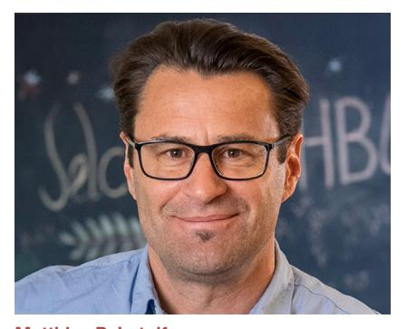
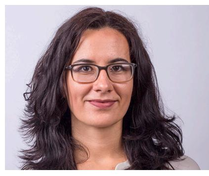
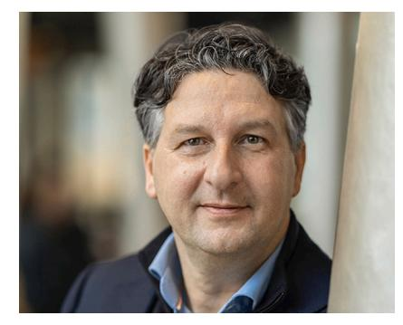
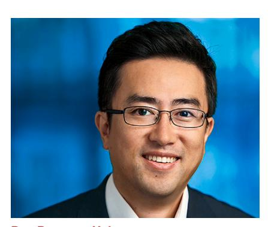
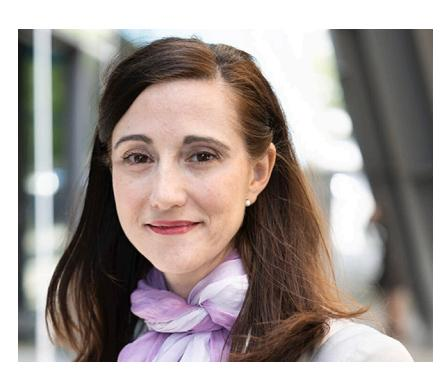
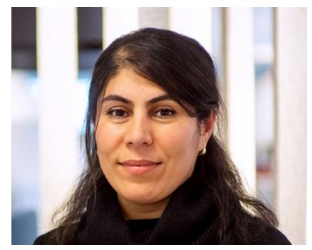
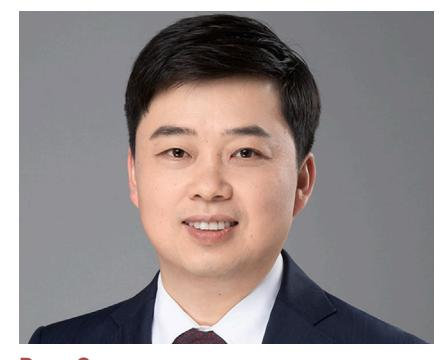
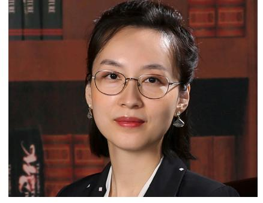
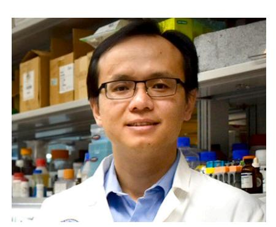
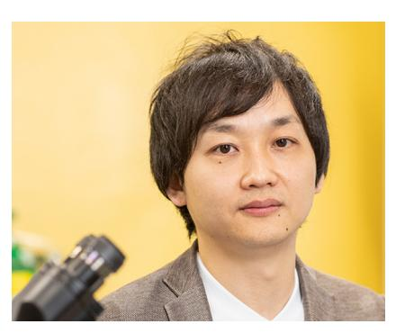

Сell 

Leading Edge

5 CelPress

Voices

# In vitro human cell-based models: What can they do and what are their limitations?

It is said that all models are wrong, but some are useful. In vitro human cell-based models are a prime example of this maxim. We asked researchers: when is your model system useful? How can it be made more useful? What are its limitations?

**Matthias P. Lutolf**

Institute of Human Biology (IHB), Roche Innovation Center Basel, Basel, Switzerland; École Polytechnique Fédérale de Lausanne (EPFL), Lausanne Switzerland

**Milica Radisic**

University of Toronto, Toronto, Canada

# Organoids reimagined: Engineering a path to translation

Translating organoid technology to real-world applications presents challenges due to poor control over stem cell morphogenesis, resulting in diverse phenotypes and large heterogeneity. In addition, their short lifespan and the absence of important tissue compartments such as the vascular or immune system makes it difficult to reproduce organlevel functions and disease pathophysiology *in vitro*.

To solve these problems, we and others have introduced "bioengineered organoids" in which morphogenesis is controlled to guide self-organization toward desired shapes and sizes, and in which other tissue compartments can be rationally integrated. This approach has led to the creation of microdevices with open-access organoid tubes and surfaces with crypts or glands that better mimic the architecture of natural tissue, extending lifespan and improving experimental tractability. These "organoids-on-achip" represent a key step toward quantitative assays for modeling complex biological processes at high resolution. Bioengineered organoids are therefore a valuable addition to the repertoire of in vitro models and open exciting prospects for translation, particularly in pharmaceutical R&D.

Despite these advances, bioengineered organoids still have shortcomings and remain only an approximation of reality. As engineers, we should avoid creating complex systems "just because we can." The focus should be on the purpose of the model, i.e., the biological process it is meant to capture and the questions we want to answer. This purpose should guide the choice of model in terms of its complexity and throughput.

# **Heart-on-a-chip for disease modeling**

Human induced pluripotent stem cells and advanced differentiation protocols have enabled production of human 3D cardiac tissue models within organ-on-a-chip devices. They typically produce cylindrical or ring-shaped tissues measuring several millimeters in length and hundreds of micrometers in diameter. These devices facilitate the measurement of contractile force and help mature otherwise immature cardiomyocytes by provision of electrical, mechanical, or metabolic cues.

Physiological features such as positive force-frequency relationships, positive forcelength relationships, post-rest potentiation, and Ik1 and hERG currents have been demonstrated, leading to widespread adoption of these heart-on-a-chip models. Their power has been demonstrated in capturing hypertrophic or dilated phenotypes resulting from sarcomeric mutations, with more complex models, such as fibrosis, requiring a prolonged drug treatment.

Although these models have been validated with known drug panels and routinely incorporate cardiac fibroblasts, challenges remain in achieving stable, perfusable vasculature over extended periods and incorporating immune cells to better mimic inflammatory (myocarditis), autoimmune (lupus), and regenerative (treatments for myocardial infarction) conditions.

More work is needed to explore the interactions between neurons and cardiac muscle, better mimic the effects of the autonomous nervous system, capture circadian rhythm and heart rate variability, and understand metabolic impacts. Further work is necessary to develop sex-specific models with hormonal treatment and models of aging myocardium.

Cell 187, August 22, 2024 ª 2024 Elsevier Inc. 4439

All rights are reserved, including those for text and data mining, AI training, and similar technologies.

CelPress

Cell

Voices

**Jeffrey Beekman**

University Medical Center, Utrecht University, Utrecht, the Netherlands

**Dan Dongeun Huh**

University of Pennsylvania, Philadelphia, PA, USA

**Meritxell Huch**

Max Planck Institute of Molecular Cell Biology and Genetics, Dresden, Germany

# Patient-derived intestinal organoids for treating cystic fibrosis

We explore how patient-derived, adult stem-cell-based intestinal organoids can be applied for precision medicine of cystic fibrosis, a rare and progressive multi-organ disease caused by pathological variants of the CFTR gene. We study how novel drugs called CFTR modulators could restore CFTR protein function in a patient-specific manner.

After generating more than 1,000 patient-derived intestinal organoids, the robustness of culturing intestinal organoids remains remarkable. In general, any patient can have their tissue used to create personalized intestinal organoids, despite some variation in growth rates among samples. Cells can be biobanked and propagated in culture for very long times and retain patient-specific phenotypes. This robustness is essential for standardization and applications in clinical settings.

While we hardly see the high numbers of goblet cells in culture that are present *in vivo* in rectal tissue epithelium, whether a model exactly recapitulates the in vivo tissue composition is not too important for clinical applications. The validity of these models comes from directly showing that organoid phenotypes in vitro associate with and predict patient phenotypes in vivo.

I am very grateful that our studies with intestinal organoids could help to get CFTR modulator access for people with cystic fibrosis based on their organoid drug response. Current work focuses on further standardization and clinical validation to ensure that these living technologies can eventually be implemented as certified diagnostic tests.

# Preparing for extraordinary challenges with human lung models

Studying the human lung is a daunting task, but simplified in vitro representations created using human cells in culture can be instrumental for advancing our understanding of respiratory health and disease. Living in an era of unprecedented challenges ranging from the COVID-19 pandemic to accelerated climate change to colonization of our planetary neighbors, I often try to wrap my head around how our lungs might behave in those extraordinary situations. How would the weightlessness of space during prolonged missions affect the ability of human lungs to fight off infection? Are we prepared for the next pandemic to rapidly assess and mitigate human-specific adverse respiratory effects of coronavirus and other emerging pathogens? Attempting to answer questions like these makes in vitro analogs of human lungs uniquely attractive and powerful. What I have witnessed over the last two decades gives me confidence that today's cell culture technologies offer control, design flexibility, and scalability that make it possible to simulate what the essential units of human lungs may experience in those extraordinary situations. I believe that the biggest gain will come from human-relevant data and insights produced by these experiments that could be used to make accurate assessments and reliable predictions. I find this to be an exciting opportunity to explore off the beaten path and contribute to developing human resilience against emerging extraordinary challenges!

# **Organoids: From impossible to key**

The Hayflick limit postulated that adult human cells, unless cancerous, have limited expansion in culture. My work challenged this dogma by showing that human liver and pancreas cells, grown as organoids, could be multiplied for months while maintaining their genetic stability over time. The current debate focuses on what we can recapitulate, what we can learn, and what these cultures are not well suited to model. Their resemblance to native tissue makes them crucial for modeling human disease and investigating the principles of tissue regeneration, self-organization, and robustness. My lab has used organoids to identify one of the mechanisms behind the activation of the tissue repair response to damage. We have also generated organoids from patient tissues to model cancer. Because these organoids provide an almost unlimited supply of patient material, they are excellent tools for drug screening and precise medical intervention.

Their main limitation is that they are only epithelial, which prevents modeling of complex diseases such as fibrosis or inflammation. In my lab, we have recapitulated

4440 Cell 187, August 22, 2024

Cell

Voices

CelPress

Margherita Yayoi Turco

Friedrich Miescher Institute for Biomedical Research, Basel, Switzerland

Zeinab Niloofar Tahmasebi Birgani

MERLN Institute for Technology-Inspired Regenerative Medicine, Maastricht University, Maastricht, the Netherlands

epithelial-mesenchymal interactions and tissue architecture in organoid co-cultures. Using this system, we have learned about the paradoxical behavior of the liver mesenchyme, which controls the epithelial rheostat by regulating the number of epithelial-mesenchymal contacts. Improving the diversity of cellular composition while maintaining tissue architecture is currently the biggest challenge if we are to use organoids to study aspects of human biology that were previously thought impossible.

# Modeling the maternal-fetal dialogue

The dialogue between maternal decidual cells (stromal, glandular, vascular, and immune cells) and fetal trophoblasts is critical to human reproductive outcomes with common (and human-specific) disorders like pre-eclampsia resulting from disordered placentation. Organoid models of both these tissues are proving transformative in studying this hidden period of human development.

Human trophoblast organoids derived from first-trimester placentas differentiate into the two major trophoblast pathways, syncytiotrophoblast and extravillous trophoblast (EVT). They are an invaluable tool to study trophoblast biology, cell lineage decisions, and the influence of the maternal decidual environment on placental development and function. With these organoids, we have demonstrated the effect of uterine natural killer (uNK) cells on EVT differentiation. Hormone-responsive endometrial organoids will allow insight into the influence of maternal glands and their secretions on EVT. By using trophoblast organoids with reversed polarity, interactions with pathogens and how they cross the placenta into the fetus, as well as the effect of drugs on the placenta, can be studied.

Efforts are now focusing on developing placental and endometrial models that more closely mimic the *in vivo* situation. These include integrating non-epithelial cell types, recapitulating the normal tissue architecture, and combining both decidua and placental tissues. Exciting times lie ahead as we begin to unravel this critical aspect of our existence: how a healthy pregnancy is achieved and what goes awry in pregnancy disorders.

# Unlocking next levels of regenerative medicine with mini-bones

Miniaturized bone in vitro models (mini-bones), such as bone-on-chips and bone-like cell aggregates, have emerged in regenerative medicine to complement conventional in vitro and in vivo models. They aim to capture the intricacy of the bone functional unit, stemmed from its multiple specialized cell types; hierarchically organized, dynamic extracellular matrix; and highly vascularized and innervated nature. This has steered research toward delineating the essential biophysicochemical components that define the bone unit, developing technologies to integrate them into *in vitro* model systems, and understanding their complex interactions. While developing more complex in vitro models is encouraged to achieve better biomimicry, the model's complexity should also be tailored to the application requirements.

Mini-bones are particularly useful for screening biomaterials, such as microparticles, to identify candidates for regenerative therapies or implants. Further, mini-bones give insight into cellular and molecular interactions and disease mechanisms. An intriguing research avenue involves studying phenomena like osteoinduction and the inflammation, regeneration, and remodeling stages of bone healing following trauma or fracture. Personalizing mini-bones for patients suffering from co-morbidities, such as fractures in osteoporotic or diabetic patients, encompasses an essential step for developing advanced bone regenerative therapies. Finally, using mini-bones to model pathological tissue calcification like atherosclerosis or fibrodysplasia ossificans progressiva extends their use beyond bone research.

Cell 187, August 22, 2024 4441

CelPress

Cell

Voices

**Dong Gao**

Center for Excellence in Molecular Cell Science, Chinese Academy of Sciences, Shanghai, China

Rui Yao

Institute of Zoology, Chinese Academy of Sciences, Beijing, China

Hang Lin

University of Pittsburgh, Pittsburgh, PA, USA

# Personalized cancer organoid models

Functional precision oncology is revolutionizing cancer treatment with *in vitro* modeling of individual tumors, capitalizing on advancements in 3D culture technologies such as organoids. These innovations facilitate the development of more physiological human cancer models, essential for transforming basic research into effective therapeutic regimens. Central to this approach are patient-derived cancer organoids, which retain crucial tumor characteristics that are not detectable by genomic methods. This feature allows for personalized analysis of tumor vulnerabilities, rendering organoids extremely useful for evaluating drug responses and exploring tumor heterogeneity. They serve as a powerful platform for personalized medicine, accurately reflecting the cellular structure of human tumors.

Cancer organoids also hold potential for immunological research and complex disease modeling. Incorporating components of the immune system into organoid cultures, especially for examining immune responses, is a promising area of research. Nonetheless, challenges remain. Organoids typically come from biopsies that might not represent the full complexity of the tumor and are grown under conditions that differ from the *in vivo* environment, missing critical factors like immune-selection pressures and hypoxia. These conditions can alter tumor behavior and response to treatments. Standardizing organoid-based assays for clinical trials and developing co-culture systems that include tumor cells, immune cells, stromal cells, and microbial components are crucial for advancing cancer immunotherapy.

# Large-scale bioprinting of tissues

The promise of creating human tissues on a large scale is closer than ever. Bioprinting offers assembly of biologically relevant building blocks, such as stem cells, organoids, and extracellular matrix-like biomaterials. We are moving toward large-scale fabrication of functional human tissues/organs for drug testing, preclinical experimentations of therapy development, and regeneration. However, the complex, time-dependent deformation of biomaterials poses a challenge for a reproducible bioprinting process, calling for non-destructive monitoring and regulating parameters to ensure consistent printing results, including geometrical structure, mechanical state, and cell phenotype. Further, geometric-mechanical-biochemical coupling is vital for organ morphogenesis. Little is known about such complex processes. Understanding multimodal signaling coregulation is essential for creating functional bioprinting tissues.

I have formed a multidisciplinary team to tackle biology questions from an engineering viewpoint. Working with Regenovo, we devised the Intelligent Creator of Utility Regenerate Element (iCURE). This AI-assisted automated system can monitor and manipulate cell culturing and bioprinting processes 24/7 without human intervention. We identified a mechanical-biochemical coupling effect for bile duct morphogenesis to generate complex liver models, useful for high-content screening. I recently joined the Human Organ Physiopathology Emulation System (HOPE), a National Key Science and Technology Infrastructure, to pursue large-scale organ fabrication. Although widespread, reproducible, large-scale fabrication of functional tissues is still far, I remain optimistic about the future.

# **Emerging microphysiological systems**

Human cell-based microphysiological systems (MPSs), including organ-on-a-chip and organoids, have emerged as new test platforms in drug development. Compared to monolayer cultures of single cell types, multi-component MPSs better simulate the complexity of human tissues/organs and allow investigation of tissue crosstalk in disease onset and progression. MPSs have been used to repurpose FDA-approved drugs, reducing the cost and time of bringing medicines to market. Patient-derived MPSs also enable the development of personalized medicine. They are advantageous when using live animals is cost inhibitive or technically challenging. For instance, MPSs have been sent to space to assess the influence of microgravity and radiation on human tissues. However, before MPSs are accepted by pharmaceutical companies and regulatory bodies, their physiological/clinical relevance must be validated. First, omics-based methods can be employed to characterize "healthy" and "diseased" MPSs, which should recapitulate characteristics of corresponding native human tissues (phenotype

4442 Cell 187, August 22, 2024

Cell 

Voices

CelPress

Takanori Takebe

Cincinnati Children's Hospital, Cincinnati, OH, USA; Osaka University, Osaka, Japan

validation). Second, when exposed to known insults or drugs, MPSs should display responses similar to those observed in humans (known function validation). Lastly, a critical step is to test drug(s) in MPSs and humans in parallel and compare drug toxicities/ efficacies (prediction validation). An inherent limitation of the current MPSs is that they can only include finite cell types. Therefore, global toxicity or side effects of drugs in the context of systemic crosstalk cannot be precisely predicted until human-on-a-chip is created.

# 重々帝網 (Ju-Ju-Tai-Mo): Interconnectedness biology

As a child, I was captivated by the Buddhist concept "Ju-Ju-Tai-Mo" taught by Kōbō Daishi-the profound interconnectedness inherent across all life forms. This reverence for interdependence has guided my quest in hepatology to decipher how the living system forges interconnected networks spanning biological strata. How do these connections orchestrate tissue development and maturation? How do disruptions in interconnectivity impact human health?

We now stand at an exciting frontier to tackle such questions, armed with powerful synthetic self-organizing tissue models like organoids. Complemented by advances in bioengineering, functional genomics, and single-cell technologies, organoids offer an unprecedented opportunity for controlled manipulation and multiscale tracing of emergent biological phenomena. While current stem cell efforts largely focus on early embryogenesis governed by local rules, recapitulating later developmental stages requires holistically modeling the expanded intersystem crosstalk between blood, immunity, metabolism, and even neural inputs. One reductionist approach deploys isolated key crosstalk signals in cultures. Conversely, a systems-level approach embeds organoids in living animals to leverage endogenous systemic interactions.

As a physician-scientist focused on regenerative transplantation, I am driven to harness in vitro and in vivo models in synergy, bridging complex multiscale biology to longitudinal phenotypes. Unraveling life's profound interconnectivity at a deeper level is both the challenge and immense opportunity awaiting us in the coming decades.

# DECLARATION OF INTERESTS

M.R. is an inventor in multiple patents covering Biowire heart-on-a-chip technology that are licensed to Valo Health. She receives royalty from these inventions. M.R. holds equity in and receives consulting fees from Quthero, Inc. She is an inventor on patents and patent applications describing regenerative peptides and biomaterials that have been licensed to Quthero, Inc.

D.D.H. is a founder of Vivodyne, Inc., and holds equity in Vivodyne, Inc., and Emulate Bio, Inc. D.D.H. has a number of patent applications and issued patents related to in vitro models of human tissue.

M.H. is an inventor on several patents related to organoid work.

J.B. is an inventor on a patent related to organoid technology, has received consultation fees, and is principal investigator on an industry-sponsored project related to the work (Proteostasis, Eloxx Pharmaceuticals). He cofounded and has shares <5% in FAIR Therapeutics. Full disclosures can be found at https://www.umcutrecht.nl/en/research/researchers/beekman-jeffrey-jm.

Cell 187, August 22, 2024 4443