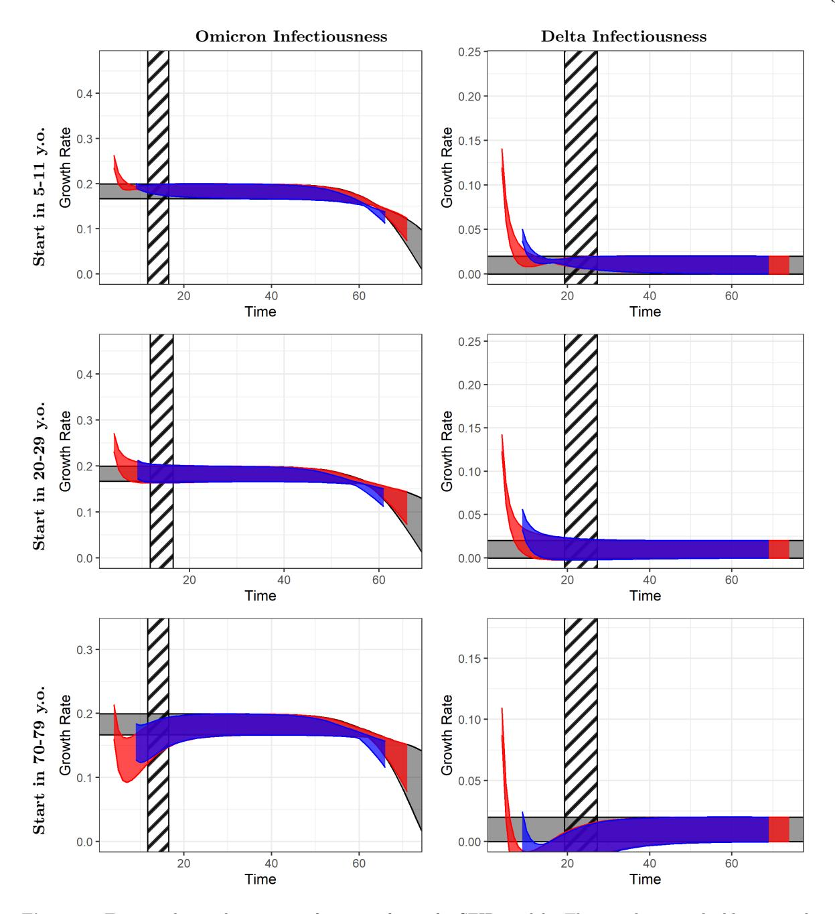

arXiv:2302.01076v1 [q-bio.PE] 2 Feb 2023

# Convergence to the Equilibrium State in an Outbreak: When Can Growth Rates Accurately be Measured?

 $Adam \ Mielke^*$ 

Dynamical Systems, Technical University of Denmark, Asmussens Allé, 303B, 2800 Kgs. Lyngby, Denmark

Lasse Engbo Christiansen $\dagger$  Statens Serum Institut, Artillerivej 5, 2300 Copenhagen S, Denmark (Dated: February 3,  $2023$ )

We investigate sub-leading orders of the classic SEIR-model using contact matrices from modeling of the Omicron and Delta variants of COVID-19 in Denmark. The goal of this is to illustrate when the growth rate, and by extension the infectiousness, can be accurately measured in a new outbreak, e.g. after introduction of a new variant of a virus. We find that as long as susceptible depletion is a minor effect, the transients are gone within around 4 generations.

# I. INTRODUCTION

The exponential growth regime of a stratified SEIR-model is well-described  $[1-3]$  where the growth rate is equal to the largest eigenvalue of the generator matrix. However, this requires the system to be in the corresponding eigenstate, which is rarely the case, as the introduction of a disease often comes from a few single individuals.

The non-exponential growth has significant consequences for estimate of infectiousness at the introduction of a new disease or variant, because the growth rate is commonly used here. It is therefore essential to understand when an outbreak actually follows the largest eigenvalue, and, by extension, when the Corrections to the exponential growth from other effects such as spatial spread have already been investigated  $[4, 14]$ , whereas this paper will focus on the convergence to the eigenstate. This is of particular interest when comparing the relative infectiousness of a emerging new variant versus existing variants, see for instance  $[15]$ .

We will be working in a stratified SEIR-model framework, which has been the basis of multiple efforts to predict the real-world spread of disease, especially in recent years  $[4-13]$ . That is, we start with

$*$ admi@dtu.dk

$\dagger$ lsec@ssi.dk

the following system of differential equations

$$
\dot{S} = -\text{diag}(S)\beta I
$$

$$
\dot{E} = \text{diag}(S)\beta I - \eta E
$$

$$
\dot{I} = \eta E - \gamma I
$$

$$
\dot{R} = \gamma I + \sigma H
$$

(1)

The states  $S$ ,  $E$ ,  $I$ , and  $R$  represent the fraction of the population that are susceptible, exposed, infectious, and recovered respectively, and the parameters  $\eta$  and  $\gamma$  are rates for the incubation and infection states respectively. The matrix  $\beta$  contains the contacts between each group, e.g. between age groups.

We will start with some theoretical observations about time scales, and then we will illustrate the convergence with numerical solution of Equation  $(1)$ while comparing to the theoretical time scale.

# II. TIME SCALE OF SOLUTION CONVERGENCE

Given some initial condition  $\phi(0)$ , where  $\phi(t) = \begin{pmatrix} E(t) \\ I(t) \end{pmatrix}$ , we make the decomposition

$$
\phi(t) = \sum_{j} \alpha_j \hat{e}_j e^{r_j t} 
$$

(2)

for small t, where  $\hat{e}_j$  is the  $j'th$  eigenvector of the  $\text{generator matrix}$ 

$$
G = \begin{pmatrix} -\eta \mathbf{1} & \operatorname{diag}(S)\beta \\ \eta \mathbf{1} & -\gamma \mathbf{1} \end{pmatrix} \ . 
$$

(3)

2

and  $r_j$  is the corresponding eigenvalue. We assume  that  $S$  varies very slowly compared to the exponen-  tial growth of  $\phi$ . This is true when the number of  susceptibles is much larger than the number of in-  fected. The coefficients

$$
\alpha_j = \left[ \begin{pmatrix} | & | & | \\ \hat{e}_1 & \dots & \hat{e}_N \\ | & | & | \end{pmatrix}^{-1} I(0) \right]_j 
$$

(4)

are determined by the initial condition and the con-tact matrix. Note that because the generator matrixis non-Hermitian, the coefficients are not simply theoverlap between the corresponding eigenvector andthe state. The theoretical growth rate becomes

$$
r_{\text{theo}} = \frac{d}{dt} \ln \left( \sum_{k} I_{k}(t) \right) = \frac{\sum_{j} \sum_{k} \alpha_{j} r_{j}(\hat{e}_{j})_{k} e^{r_{j}t}}{\sum_{j} \sum_{k} \alpha_{j}(\hat{e}_{j})_{k} e^{r_{j}t}} .
$$

(5)

Let us arrange the eigenvalues such that  $r_1$  is the largest real eigenvalue and rewrite this as

$$
r_{\text{theo}} = \frac{\alpha_1 r_1 \sum_k (\hat{e}_1)_k + \sum_{j>1} \sum_k \alpha_j r_j (\hat{e}_j)_k e^{(r_j - r_1)t}}{\alpha_1 \sum_k (\hat{e}_1)_k + \sum_{j>1} \sum_k \alpha_j (\hat{e}_j)_k e^{(r_j - r_1)t}}
$$

(6)

Clearly, the components  $r_j$ ,  $j > 1$  are exponentially suppressed for large enough separation between the eigenvalues, but as long as the time is on the same scale as the inverse of this separation, non-equilibrium effects are visible. The time scale  $\tau = \frac{1}{\max_{j>1}(\text{Re}\,(r_j) - r_1)}$  thus sets the upper bound of the convergence time, where convergence occurs at time  $t \gg \tau$ . Note that this is an upper bound as faster decaying contributions may be the largest ones in the beginning. That is, the balance between  $\alpha_j$  and  $r_j$  in Equation (6) may be such that the convergence is faster than this scale  $\tau$ .

# III. NUMERICAL ILLUSTRATION OF SOLUTION CONVERGENCE

For the  $\beta$ -matrices we use the contact matrices used by the Danish expert group, where different societal structures under different lockdown conditions are used individually as an ensemble of contact matrices [\[13\]](#page-13-0). For each matrix, the largest eigenvalue is normalized to the infectiousness of either the Delta

or the BA.1 Omicron variant at seasonal strength equivalent to the start of December. The parameters  $\eta = 1/4.3$  and  $\gamma = 1/3.3$  are used, consistent with [\[13\]](#page-9-1). The population is divided into 10 age groups, namely ages 0-4, 5-11, 12-19, 20-29,..., 70-79, 80+, according to the age distribution of the population of Denmark. We initialize with  $10^{-5}$  of the age group population in the respective *E*-state in three different age groups, one at a time, and follow the progression of the observed growth rate over time. That is, a fit on log scale to the 10 surrounding days. The younger age groups are usually more active, and we therefore expect the growth rate of outbreaks starting in those groups to converge to the dominant eigenvalue faster. This turns out to be the case, and the convergence consistently happens within the first three weeks, see Figure 1 for an illustration. It is clear that an outbreak starting in a less active group will take longer to find the equilibrium state than one starting in the more active group. It is also clear that a higher growth rate leads to faster convergence. Neither of these facts are surprising, but the scale that it happens on is significant. It shows that waiting three weeks before measuring the growth rate is enough to negate this non-equilibrium effect, and it is therefore safe to estimate the growth rate at this point. This effect does not depend on the infectiousness, only the spacing between the eigenvalues as illustrated in Equation (6). Note also that the difference between 10 and 20 points is only a slight shift in the estimated growth rate.

Interestingly, the growth rate starts above the expected irrespective of which age group is infected first. This is not possible in Equation  $(6)$ , as it is a weighted average of the different eigenvalues, but the larger growth rate comes from the finite-size effect of measuring only at certain times (i.e. once a day).

# IV. DISCUSSION

We see that  $10 \text{ days fit interval gives the fastest}$ convergence, but in reality there are weekly testing patterns which means that at least  $14$  or  $21$  days of data are needed to get robust estimates of the growth rates. Furthermore, some groups are more likely to be tested than others so the observed incidences may misrepresent in which group the disease

Figure 1: Estimated growth rates as a function of time for SEIR-models. The gray horizontal ribbons are the largest eigenvalue of the different generator matrices, see Equation (3), and the red and blue ribbons converging to them are the observed growth rates, i.e. a linear least squares fit to  $\sum_{j} I_{j}$  on log scale to either the 10 ( $[-4, 5]$ , red) or 20 ( $[-9, 10]$ , blue) surrounding days. The growth rate is associated with the middle of the interval rather than the end to align with theoretical values. The striped vertical band indicates the 10%-point of  $\max_{j>1} \exp\left[ (\text{Re}(r_j) - r_1)t \right]$  corresponding to  $\ln(10)\tau$  to illustrate the time scale set by Equation (6). The rows are initialization of the outbreak in different age groups, and the columns are normalization of the largest eigenvalue to match the infectiousness of either the Omicron variant in December 2021 or Delta variant in June 2021 in Denmark [13].

4

is most prevalent.  $\mathbf{v}$ 

For a single point of introduction, the time scale that convergence happens on is of the same order as that of the spatial effects, compare Figure 1 left column in this paper to Figure 1 in  $[14]$ . This means that both contributions have to be considered simultaneously. However, spatial dynamics and network models also include local outbreaks that have a brief, but fierce growth, even on a population level if the prevalence is low  $[16]$ .

While the time scale  $\tau$  is used here for the mixing of groups, the same mechanism also applies to the competition between variants with different growth rate, or a combination of the two. The latter can be achieved with a block-diagonal contact matrix.

# V. CONCLUSION

In the above we have investigated the transient effects of SEIR-models when initializing the system away from the dominant eigenvector and the consequences for the observed growth rate.

As expected, an outbreak starting in the more active groups converges faster, and the same is true for a more infectious disease. The significant part is the time scale on which the convergence occurs. It turns out that, using realistic parameters, the growth rate has converged within three weeks, which also means that it is safe to estimate it at this point.

# ACKNOWLEDGMENTS

Funding and data provided by Statens Serum Institut, Denmark.

# VI. BIBLIOGRAPHY

- [1] R. Ross, An application of the theory of probabilities to the study of a priori pathometry -  $Part\ I, \ Proc.$ R. Soc. Lond. A92204–230 (1916).
- [2] G. Bastin, Lectures on Mathematical Modelling of Biological Systems, (2012).
- [3] H. Weiss, The SIR model and the Foundations of *Public Health*, Materials Matemàtics 0 (2013).

- [4] Q.-H. Liu, M. Ajelli, A. Aleta, S. Merler, Y. Moreno, and A. Vespignani, Measurability of the epidemic reproduction number in data-driven contact networks, PNAS  $115(50)12680-12685$ , (2018).
- [5] A. Nava, A. Papa, M. Rossi, and D. Giuliano,  $Analytical$  and cellular automaton approach to a generalized SEIR model for infection spread in an open crowded space Phys. Rev. Research 2, 043379  $(2020).$
- [6] G. Bertaglia and L. Pareschi, *Hyperbolic models for* the spread of epidemics on networks: kinetic description and numerical methods, ESAIM: M2AN 55, 2, 381-407 (2021).
- [7] Q. Zhuang and J. Wang, A spatial epidemic model with a moving boundary Infectious Disease Modelling, 6,  $1046-1060$  (2021).
- [8] O. Toledano, B. Mula, S. N. Santalla, Javier Rodríguez-Laguna, and Ó. Gálvez, Effects of confinement and vaccination on an epidemic outburst: a statistical mechanics approach, Phys. Rev.  $E$  104, 034310 (2021).
- [9] A. Triska, A. Y. Gunawan, N. Nuraini, *Outbreak* spatial pattern formation based on an SI model with the infected cross-diffusion term, J. Math. Computer Sci.,  $27 \ 1\text{--}17 \ (2022)$ .
- [10] P. A. Werner, M. Ksik-Brodacka, K. Nowak, R. Olszewski, M. Kaleta, and D. T. Liebers, *Modeling* the Spatial and Temporal Spread of COVID-19 in Poland Based on a Spatial Interaction Model, IS-PRS Int. J. Geo-Inf., 11, 195 (2022).
- [11] M. Cabrera, F. Córdova-Lepe, J. P. Gutiérrez-Jara et al., An SIR-type epidemiological model that integrates social distancing as a dynamic law based on point prevalence and socio-behavioral factors, Sci Rep 11, 10170 (2021).
- [12] M. Bisiacco and G. Pillonetto, COVID-19 epidemic control using short-term lockdowns for collective gain, Annual Reviews in Control, 52, 573-586  $(2021).$
- [13] https://covid19.ssi.dk/analyser-ogprognoser/modelberegninger (In Danish, visited  $2022-12-21$ ).
- [14] A. Mielke, On the Role of Spatial Effects in Early Estimates of Disease Infectiousness: A Second Quantization Approach,  $arXiv:2205.15718$  [qbio.PE]  $(2022)$ .
- [15] F. P. Lyngse et al., Household transmission of the  $SARS\text{-}CoV\text{-}2$  Omicron variant in Denmark, Nat. Commun. 13  $(1)$ , 5573  $(2022)$ .
- [16] T. Y. Michaelsen et al., Introduction and transmission of SARS-CoV-2 lineage B.1.1.7, Alpha variant, in Denmark, Genome Medicine 14 (47) (2022).