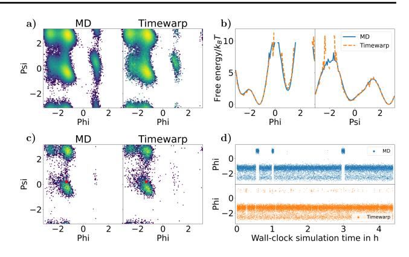

arXiv:2302.01170v1 [stat.ML] 2 Feb 2023

# **Timewarp: Transferable Acceleration of Molecular Dynamics by Learning Time-Coarsened Dynamics**

 $\textbf{Leon Klein} \text{ } ^{\ast\dagger\,1\,2}\text{ } \textbf{ Andrew Y. K. Foong} \text{ } ^{\ast\,1}\text{ } \textbf{ Tor Erlend Fjelde} \text{ } ^{\ast\dagger\,3}\text{ } \textbf{ Bruno Mlodozeniec} \text{ } ^{\ast\dagger\,3}\text{ } \textbf{ Marc Brockschmidt} \text{ } ^{\dag}$ Sebastian Nowozin† Frank Noé124 Ryota Tomioka1

Abstract

*Molecular dynamics* (MD) simulation is a widely used technique to simulate molecular systems, most commonly at the all-atom resolution where the equations of motion are integrated with timesteps on the order of femtoseconds ( $1fs =$  $10^{-15}$ s). MD is often used to compute equilibrium properties, which requires sampling from an equilibrium distribution such as the Boltzmann distribution. However, many important processes, such as binding and folding, occur over timescales of milliseconds or beyond, and cannot be efficiently sampled with conventional MD. Furthermore, new MD simulations need to be performed from scratch for each molecular system studied. We present *Timewarp*, an enhanced sampling method which uses a normalising flow as a proposal distribution in a Markov chain Monte Carlo method targeting the Boltzmann distribution. The flow is trained offline on MD trajectories and learns to make large steps in time, simulating the molecular dynamics of  $10^5 - 10^6$  fs. Crucially, Timewarp is *transferable* between molecular systems: once trained, we show that it generalises to unseen small peptides (2-4 amino acids), exploring their metastable states and providing wallclock acceleration when sampling compared to standard MD. Our method constitutes an important step towards developing general, transferable algorithms for accelerating MD.

# 1. Introduction

Molecular dynamics (MD) is a well-established technique for simulating physical systems at the atomic level. When performed accurately, it provides unrivalled insight into

$*$ Equal contribution $^{\dagger}$ Work done while at Microsoft Research 1Microsoft Research AI4Science 2Freie Universität Berlin 3University of Cambridge 4Rice University. Correspondence to: Ryota Tomioka ryoto@microsoft.com.

Preprint.

Figure 1. Initial state  $x(t)$  (Left) and accepted proposal state  $x(t + t)$  $\tau \sim p_{\theta}(x(t+\tau)|x(t))$  (Right) sampled from Timewarp for the tetrapeptide LAKS (not in trainset). The proposed state undergoes a large conformational change relative to the initial state, traversing from one metastable state to another.

the detailed mechanics of molecular motion, without the need for wet lab experiments. MD simulations have been used to understand processes of central interest in molecular biophysics, such as protein folding (Noé et al., 2009; Lindorff-Larsen et al., 2011), protein-ligand binding (Buch et al., 2011), and protein-protein association (Plattner et al., 2017). Many crucial applications of MD boil down to efficiently sampling from the *Boltzmann distribution*, *i.e.*, the equilibrium distribution of a molecular system at a temperature  $T$ . Let  $(x^p(t), x^v(t)) := x(t) \in \mathbb{R}^{6N}$  be the state of the molecule at time t, consisting of the positions  $x^p(t) \in \mathbb{R}^{3N}$  and velocities  $x^v(t) \in \mathbb{R}^{3N}$  of the  $N$  atoms in Cartesian coordinates. The Boltzmann distribution is given by:

$$
\mu(x^p, x^v) \propto \exp\left(-\frac{1}{k_B T} (U(x^p) + K(x^v))\right),
$$

(1)

where  $U(x^p)$  is the potential energy,  $K(x^p)$  is the kinetic energy, and  $k_B$  is Boltzmann's constant. In practice we are interested in the marginal distribution of the positions,  $\mu(x^p)$ . Many important quantities, such as the free energies associated with protein folding and protein-ligand binding, can be computed as expectations under  $\mu(x^p)$ .

A popular method in MD to sample from the Boltzmann distribution is *Langevin dynamics* (Langevin, 1908), which obeys the following stochastic differential equation (SDE):

$$
m_i \mathrm{d}x_i^v = -\nabla_i U \mathrm{d}t - \gamma m_i x_i^v \mathrm{d}t + \sqrt{2m_i \gamma k_B T} \mathrm{d}B_t.
$$

(2)

Timewarp: Transferable Acceleration of Molecular Dynamics by Learning Time-Coarsened Dynamics

Here *i* indexes the atoms,  $m_i$  is the mass of atom *i*,  $U(x^p)$  is the potential energy,  $\gamma$  is a friction parameter, and  $dB_t$  is a standard Brownian motion process. Starting from an initial state  $x(0)$ , simulating Equation (2), along with the relationship  $dx^p = x^v dt$ , yields values of  $x(t)$  that are distributed according to the Boltzmann distribution as  $t \to \infty$ . Standard MD libraries discretise this SDE with a timestep  $\Delta t$ , which must be chosen to be  $\sim 1 \text{fs} = 10^{-15} \text{s}$  for stability. Unfortunately, many biomolecules contain metastable states separated by energy barriers that can take milliseconds of MD simulation time ( $\sim 10^{12}$  sequential integration steps) to cross, rendering this approach infeasible. To overcome this, prior work has produced an array of enhanced sampling *methods*, such as coarse graining (Clementi, 2008; Kmiecik et al., 2016) and metadynamics (Laio & Parrinello, 2002). However, these methods require domain knowledge specific to each molecular system to implement effectively.

Furthermore, standard MD simulations do not transfer information between molecular systems: for each system studied, a new MD simulation must be peformed. This represents a wasted opportunity: many molecular systems exhibit closely related dynamics, and simulating one system should yield information relevant to similar systems. In particular, proteins, being comprised of linear sequences of 20 kinds of amino acids, are prime candidates to study this kind of transferability. We propose Timewarp, a general, transferable enhanced sampling method which uses a *normalising flow* (Rezende & Mohamed, 2015) as a proposal distribution for a Markov chain Monte Carlo (MCMC) method targeting the Boltzmann distribution. Our main contributions are:

- 1. We define an asymptoically unbiased MCMC algorithm targeting the Boltzmann distribution using a conditional normalising flow as a proposal distribution with a Metropolis-Hastings (MH) correction step.
- 2. We implement a transformer-based flow which acts on all-atom Cartesian coordinates. As it does not use predefined collective variables, it can be applied to general molecules without additional domain knowledge.
- 3. We produce a dataset of MD trajectories of hundreds of small peptides to train the flow model.
- 4. We demonstrate *transferability* by showing wall-clock acceleration of MD sampling on small peptides (2-4 amino acids) unseen during training.
- 5. We show that when deployed *without* the MH correction, Timewarp can be used to explore metastable states of new peptides much faster than MD.

# 2. Related work

There has recently been a surge of interest in deep learning on molecules. *Boltzmann generators* (Noé et al., 2019; Köhler et al.,  $2021$ ) use flows to sample from the Boltzmann distribution. There are two ways to generate samples with

Boltzmann Generators: (i) Produce i.i.d. samples from the flow and use statistical reweighting to debias expectation values. (ii) Use the Boltzmann generator in an MCMC framework (Dibak et al., 2022), as in Timewarp. As Boltzmann generators rely on internal coordinates, they do not generalise to multiple proteins, unlike Timewarp. Recently, Xu et al. (2022) proposed  $GeoDiff$ , a diffusion model that predicts molecular conformations from a molecular graph. Like Timewarp, GeoDiff works in Cartesian coordinates and generalises to unseen molecules. However, GeoDiff was not applied to proteins, but small molecules, and does not target the Boltzmann distribution.

*Markov state models* (MSMs) (Prinz et al., 2011; Swope et al., 2004; Husic & Pande, 2018) are another related technique. MSMs work by running many short MD simulations, which are used to define a discrete state space, along with an estimated transition probability matrix. Similarly to Timewarp, MSMs estimate the transition probability between the state at a time t and the time  $t + \tau$ , where  $\tau \gg \Delta t$ . Recent work has applied deep learning to MSMs, leading to *VAMPnets* (Mardt et al., 2018) and *deep generative MSMs* (Wu et al., 2018), which replace the MSM data-processing pipeline with deep networks. In contrast to Timewarp, these models are not transferable: new MD simulations have to be performed, and new networks trained, for each molecular system. Furthermore, MSMs model the dynamics in a coarse-grained, discrete state space, rather than in the all-atom coordinate representation as with Timewarp.

There has been much previous work on *neural adaptive* samplers (Song et al., 2017; Levy et al., 2018; Li et al., 2021), which use deep generative models as proposal distributions. A-NICE-MC (Song et al., 2017) uses a volumepreserving flow trained using a likelihood-free adversarial method. Other methods use objective functions designed to encourage exploration. The entropy term in our objective function is inspired by Titsias & Dellaportas (2019). In contrast to these methods, Timewarp focuses on *generalising* to new molecular systems without retraining the network.

# 3. Method

Consider the distribution of  $x(t+\tau)$  induced by an MD simulation of Equation (2) for a time  $\tau \gg \Delta t$ , starting from  $x(t)$ . We denote this conditional distribution by  $\mu(x(t + \tau)|x(t))$ . Timewarp uses a deep probabilistic model to approximate  $\mu(x(t + \tau)|x(t))$  (see Figure 1). Once trained, the model is used in an MCMC method to sample from the Boltzmann distribution.

## 3.1. Conditional normalising flows

We fit a *conditional normalising flow*,  $p_{\theta}(x(t+\tau)|x(t))$ , to  $\mu(x(t+\tau)|x(t))$ , where  $\theta$  are learnable parameters. Nor-

Timewarp: Transferable Acceleration of Molecular Dynamics by Learning Time-Coarsened Dynamics

normalising flows are a family of distributions defined by a base distribution (usually a standard Gaussian), and a *diffeomorphism*  $f$ , *i.e.* a differentiable bijection with a differentiable inverse. Specifically, we set  $p_{\theta}(x(t+\tau)|x(t))$  as the density of the distribution defined by the following generative process:

$$
z^{p}, z^{v} \sim \mathcal{N}(0, I)
$$

$$
x^{p}(t+\tau), x^{v}(t+\tau) := f_{\theta}(z^{p}, z^{v}; x^{p}(t), x^{v}(t)).
$$

(3)

Here  $z^p \in \mathbb{R}^{3N}$  and  $z^v \in \mathbb{R}^{3N}$ . For all settings of  $\theta$  and   $x(t)$ ,  $f_{\theta}(\cdot; x(t))$  is a diffeomorphism that takes the latent  variables  $(z^p, z^v) \in \mathbb{R}^{6N}$  to  $(x^p(t+\tau), x^v(t+\tau)) \in \mathbb{R}^{6N}$ .  The conditioning state  $x(t)$  parameterises a family of diffeo-  morphisms, defining a *conditional* normalising flow (Winkler et al., 2019). Note that there are no invertibility con-  straints on the mapping from the conditioning state  $x(t)$  to  the output  $x(t + \tau)$ , only the map from  $z$  to  $x(t + \tau)$  must  be invertible. Using the change of variables formula, we can  evaluate  $p_{\theta}(x(t+\tau)|x(t))$  analytically as:

$$
\mathcal{N}\left(f_{\theta}^{-1}(x(t+\tau);x(t));0,I\right)\left|\det \mathcal{J}_{f_{\theta}^{-1}(\cdot;x(t))}(x(t+\tau))\right|
$$

where  $f_{\theta}^{-1}(\cdot;x(t)) : \mathbb{R}^{6N} \to \mathbb{R}^{6N}$  is the inverse of the diffeomorphism  $f_{\theta}(\cdot;x(t))$ , and  $\mathcal{J}_{f_{\theta}^{-1}(\cdot;x(t))}(x(t+\tau))$  denotes the Jacobian of  $f_{\theta}^{-1}(\cdot ; x(t))$  evaluated at  $x(t + \tau)$ .

## 3.2. Dataset generation

We now describe the dataset used to train the flow. We generate MD trajectories by integrating Equation (2) using the *OpenMM* library (Eastman et al., 2017). We simulate small proteins (peptides) in implicit water, *i.e.*, without explicitly modelling the degrees of freedom of the water molecules. Specifically, we generate a dataset of trajectories  $D = {\mathcal{T}_i}_{i=1}^P$ , where  $P$  is the number of peptides. For each peptide  $i$ , we generate an MD trajectory that is temporally sampled with a spacing of  $\tau$ , so that  $\mathcal{T}_i = (x(0), x(\tau), x(2\tau), ...)$ . During training, we randomly sample pairs  $x(t), x(t+\tau)$  from  $D$ . Each pair represents a sample from the conditional distribution  $\mu(x(t+\tau)|x(t))$ . These samples are used as examples to train the parameters  $\theta$  of the flow. Additional details are provided in Appendix D. Since the flow is trained on trajectory data from *multiple* peptides, we can deploy it at test time to generalise to *new* peptides not seen in the training data.

## 3.3. Augmented normalising flows

Typically in molecular simulations, we are primarily interested in the distribution of the *positions*  $x^p$ , rather than the velocities  $x^v$ . Thus, it is not necessary for  $x^v(t), x^v(t+\tau)$  to represent the actual velocities of the atoms in Equation (3). We hence simplify the learning problem by treating  $x^v$  as

non-physical auxiliary variables within the augmented nor*malising flow* framework (Huang et al., 2020). For each datapoint  $x(t) = x^p(t), x^v(t)$  in  $\mathcal{D}$ , instead of obtaining  $x^v(t)$  by recording the velocities in the MD trajectory, we *discard* the MD velocity and independently draw  $x^v(t) \sim \mathcal{N}(0, I)$ . The auxiliary variables  $x^v(t)$  now contain no information about the future state  $x^p(t+\tau), x^v(t+\tau)$ , since  $x^v(t)$  and  $x^{v}(t+\tau)$  are drawn independently. Hence we can simplify  $f_{\theta}$  to depend only on  $x^p(t)$ , with  $x^p(t+\tau), x^v(t+\tau) :=$   $f_{\theta}(z^p, z^v; x^p(t))$ . This raises the question of why auxiliary variables are necessary: we could instead directly model  $p_{\theta}(x^p(t+\tau)|x^p(t))$ , without the need for  $x^v$ . We include auxiliary variables for two reasons: First, they increase the expressivity of the distribution for  $x^p$  without a prohibitive increase in computational cost (Huang et al., 2020; Chen et al., 2020). Second, constructing a conditional flow that respects *permutation equivariance* is simplified with auxiliary variables — we discuss this in more detail in Section  $4.1$ .

## 3.4. Targeting the Boltzmann distribution with MCMC

Once the flow  $p_{\theta}(x(t+\tau)|x(t))$  has been trained, we use it as a proposal distribution in an MCMC method to target the joint distribution of the positions  $x^p$  and the auxiliary variables  $x^v$ , which has density:

$$
\mu_{\text{aug}}(x^p, x^v) \propto \exp\left(-\frac{U(x^p)}{k_B T}\right) \mathcal{N}(x^v; 0, I). 
$$

(4)

Let  $m$  index the states in the Markov chain. Starting from an initial state  $X_0 = (X_0^p, X_0^v) \in \mathbb{R}^{6N}$  at  $m = 0$ , we iterate:

$$
\tilde{X}_m \sim p_\theta(\,\cdot\,|X_m^p)
$$

(5)

$$
X_{m+1} := \begin{cases} \tilde{X}_m & \text{with probability } \alpha(X_m, \tilde{X}_m) \\ X_m & \text{with probability } 1 - \alpha(X_m, \tilde{X}_m) \end{cases} 
$$

(6)

where  $\alpha(X_m, \tilde{X}_m)$  is the *Metropolis-Hastings (MH)* acceptance ratio (Metropolis et al., 1953) targeting Equation (4):

$$
\alpha(X,\tilde{X}) = \min\left(1, \frac{\mu_{\text{aug}}(\tilde{X})p_{\theta}(X | \tilde{X}^{p})}{\mu_{\text{aug}}(X)p_{\theta}(\tilde{X} | X^{p})}\right) 
$$

(7)

The flow used for  $p_{\theta}$  must allow for efficient sampling *and* exact likelihood evaluation, which is crucial for fast implementation of Equations [\(5\)](#Equations-5) and [\(7\)](#Equations-7). Additionally, after each MH step, we resample the auxiliary variables  $X^v$  using a Gibbs sampling update:

$$
(X_m^p, X_m^v) \leftarrow (X_m^p, \epsilon), \quad \epsilon \sim \mathcal{N}(0, I).
$$

(8)

Iterating these updates yields a sample  $X_m^p, X_m^v \sim \mu_{aug}$  as  $m \to \infty$ . To obtain a Boltzmann-distributed sample of the positions  $X_m^p \sim \mu$ , we simply discard the auxiliary variables  $X_m^v$ . In practice, sending  $m \to \infty$  is infeasible. Instead, we fix a computational budget and simulate the chain until the budget is reached. Algorithm 1 shows pseudocode for the MCMC procedure, using a *batch sampling* procedure for the proposals which significantly speeds up sampling.

Timewarp: Transferable Acceleration of Molecular Dynamics by Learning Time-Coarsened Dynamics

Algorithm 1 Timewarp MCMC with batched proposals  

**Require:** Initial state  $X_0 = (X_0^p, X_0^v)$ , chain length  $M$ , proposal batch size  $B$ .  
 $m \leftarrow 0$   
**while**  $m < M$  **do**  
Sample  $\tilde{X}_1, \ldots, \tilde{X}_B \sim p_{\theta}(\cdot | X_m^p)$  {Batch sample}  
**for**  $b = 1, \ldots, B$  **do**  
 $\epsilon \sim \mathcal{N}(0, I)$  {Resample auxiliary variables}  
 $X_b \leftarrow (X_m^p, \epsilon)$   
Sample  $I_b \sim \text{Bernoulli}(\alpha(X_b, \tilde{X}_b))$   
**end for**  
**if**  $S := \{b : I_b = 1, 1 \le b \le B\} \neq \emptyset$  **then**  
 $a = \min(S)$  {First accepted sample}  
 $(X_{m+1}^p,\ldots,X_{m+a-1}^p) \leftarrow (X_m^p,\ldots,X_m^p)$   
 $X_{m+a}^p \leftarrow \tilde{X}_a^p$   
 $m \leftarrow m + a$   
**else**  
 $(X_{m+1}^p,\ldots,X_{m+B}^p) \leftarrow (X_m^p,\ldots,X_m^p)$   
 $m \leftarrow m + B$   
**end if**  
**end while**  
**output**  $X_0^p, \ldots X_M^p$ 

## 3.5. Fast exploration of the state space without MH

Although the MH correction ensures that Timewarp provides asymptotically unbiased samples, it can lead to much slower exploration of the state space due to the rejected proposals. For some of the peptides we consider, the acceptance probabilities are too low to apply Algorithm 1 effectively. Instead, we can apply Timewarp in a simple exploration algorithm, where we ignore the MH correction and accept all proposals with an energy change lower than some cutoff. This allows much faster exploration of the state space, and in Section 6 we show that the algorithm, although technically biased, often leads to qualitatively accurate free energy estimates. It also succeeds in discovering all metastable states of a peptide orders of magnitude faster than Algorithm 1 and standard MD. Timewarp applied in exploration mode can be used to efficiently find the metastable states of a new molecule, which could be used,  $e.g.,$  to provide initialisation states for a subsequent MSM method, although we do not pursue this here. We provide pseudocode for the exploration algorithm in Algorithm 2 in Appendix C.

# 4. Model architecture

We now describe the architecture of our conditional normalizing flow  $f_{\theta}(z^p, z^v; x^p(t))$ , which is shown in Figure 2.

**RealNVP coupling flow** Our architecture is based on RealNVP (Dinh et al., 2017), which consists of a stack of *coupling layers* which affinely transform subsets of the di-

mensions of the latent variable based on the other dimensions. Specifically, we transform the position variables based on the auxiliary variables, and vice versa. In the  $\ell$ th coupling layer of the flow, the following transformations are implemented:

$$
z_{\ell+1}^p = s_{\ell,\theta}^p(z_{\ell}^v; x^p(t)) \odot z_{\ell}^p + t_{\ell,\theta}^p(z_{\ell}^v; x^p(t)), 
$$

(9)

$$
z_{\ell+1}^v = s_{\ell,\theta}^v(z_{\ell+1}^p; x^p(t)) \odot z_{\ell}^v + t_{\ell,\theta}^v(z_{\ell+1}^p; x^p(t)). 
$$

(10)

Going forward, we suppress the coupling layer index  $l$ . Here  $\odot$  is the element-wise product, and  $s^p_\theta: \mathbb{R}^{3N} \to \mathbb{R}^{3N}$  is our atom transformer, a neural network based on the transformer architecture (Vaswani et al., 2017) that takes the auxiliary latent variables  $z^v$  and the conditioning state  $x(t)$  and outputs scaling factors for the position latent variables  $z^p$ . The function  $t^p_\theta: \mathbb{R}^{3N} \to \mathbb{R}^{3N}$  is implemented as another atom transformer, which uses  $z^v$  and  $x(t)$  to output a translation of the position latent variables  $z^p$ . The affine transformations of the position variables (in Equation (9)) are interleaved with similar affine transformations for the auxiliary variables (in Equation (10)). Since the scale and translation factors for the positions depend only on the auxiliary variables, and vice versa, the Jacobian of the transformation is lower triangular, allowing for efficient computation of the density. The full flow  $f_{\theta}$  consists of  $N_{\text{coupling}}$  stacked coupling layers, beginning from  $z \sim \mathcal{N}(0, I)$  and ending with a sample from  $p_{\theta}(x(t+\tau)|x(t))$ . This is depicted in Figure 2, Left. Note that there is a skip connection such that the output of the flow predicts the *change*  $x(t + \tau) - x(t)$ , rather than outputting  $x(t + \tau)$  directly.

**Atom transformer** We now describe the atom transformer network. Let  $x_i^p(t), z_i^p, z_i^v$ , all elements of  $\\\mathbb{R}^3$ , denote respectively the position of atom  $i$  in the conditioning state, the position latent variable for atom  $i$ , and the auxiliary latent variable for atom  $i$ . To implement an atom transformer which takes  $z^v$  as input (such as  $s_\theta^p(z^v, x^p(t))$  and  $t_{\theta}^{p}(z^{v}, x^{p}(t))$  in Equation (9)), we first concatenate the variables associated with atom  $i$ . This leads to a vector  $a_i := [x_i^p(t), h_i, z_i^v]^\mathsf{T} \in \mathbb{R}^{H+6}$ , where  $z_i^p$  has been excluded since  $s_{\theta}^{p}, t_{\theta}^{p}$  are not allowed to depend on  $z^{p}$ . Here  $h_i \in \mathbb{R}^H$  is a learned embedding vector which depends only on the atom type. The vectors  $a_i$  are fed into an MLP  $\phi_{\text{in}}: \mathbb{R}^{H+6} \to \mathbb{R}^D$ , where D is the feature dimension of the transformer. The vectors  $\phi_{\text{in}}(a_1), \ldots, \phi_{\text{in}}(a_N)$  are then fed into  $N_{\text{transformer}}$  stacked transformer layers. After the transformer layers, they are passed through another atomwise MLP,  $\phi_{\text{out}} : \mathbb{R}^D \to \mathbb{R}^3$ . The final output is in  $\mathbb{R}^{3N}$  as required. This is depicted in Figure 2, Middle. When implementing  $s_{\theta}^{v}$  and  $t_{\theta}^{v}$  from Equation (10), a similar procedure is performed on the vector  $[x_i^p(t), h_i, z_i^p]^\mathsf{T}$ , but now including  $z_i^p$  and excluding  $z_i^v$ . There are two key differences between the atom transformer and the architecture in Vaswani et al.  $(2017)$ . First, to maintain permutation equivariance, we do

Timewarp: Transferable Acceleration of Molecular Dynamics by Learning Time-Coarsened Dynamics

Figure 2. Schematic illustration of the Timewarp conditional flow architecture, described in Section 4. *Left*: A single conditional RealNVP coupling layer. *Middle*: A single atom transformer module. *Right*: the multihead kernel self-attention module.

not use a positional encoding. Second, instead of dot product attention, we use a simple *kernel self-attention* module, which we describe next.**Kernel self-attention** We motivate the kernel selfattention module with the observation that physical forces acting on the atoms in a molecule are *local*: *i.e.*, they act more strongly on nearby atoms. Intuitively, for values of  $\tau$  that are not too large, the positions at time  $t + \tau$  will be more influenced by atoms that are nearby at time  $t$ , compared to atoms that are far away. Thus, we define the attention weight  $w_{ij}$  for atom *i* attending to atom *j* as follows:

$$
w_{ij} = \frac{\exp(-\|x_i^p - x_j^p\|_2^2/\ell^2)}{\sum_{j'=1}^N \exp(-\|x_i^p - x_{j'}^p\|_2^2/\ell^2)},
$$

(11)

where  $l$  is a lengthscale hyperparameter. The output vectors  $\{r_{\text{out},i}\}_{i=1}^N$ , given the input vectors  $\{r_{\text{in},i}\}_{i=1}^N$ , are then:

$$
r_{\text{out},i} = \sum_{j=1}^{N} w_{ij} V \cdot r_{\text{in},j},
$$

(12)

where  $V \in \mathbb{R}^{d_{\text{out}} \times d_{\text{in}}}$  is a learnable matrix. This kernel self-attention is an instance of the RBF kernel attention investigated in Tsai et al. (2019). Similarly to Vaswani et al. (2017), we introduce a *multihead* version of kernel self-attention, where each head has a different lengthscale. This is illustrated in Figure 2, Right. We found that kernel self-attention was significantly faster to compute than dot product attention, and produced similar or improved performance.

## 4.1. Symmetries

The MD dynamics respects certain physical *symmetries* that would be advantageous to incorporate. We now describe how each of these symmetries is incorporated in Timewarp.

**Permutation equivariance** Let  $\sigma$  be a permutation of the  $N$  atoms. Since the atoms have no intrinsic ordering, the only effect of a permutation of  $x(t)$  on the future state  $x(t + \tau)$  is to permute the atoms similarly, *i.e.*,

$$
\mu(\sigma x(t+\tau)|\sigma x(t)) = \mu(x(t+\tau)|x(t)).
$$

(13)

Our conditional flow satisfies permutation equivariance exactly. To show this, we use the following proposition proved in Appendix A.1, which is an extension of Köhler et al. (2020); Rezende et al. (2019) for conditional flows:

**Proposition 4.1.** Let  $\sigma$  be a symmetry action, and let  $f(\cdot;\cdot)$  *be an equivariant map such that*  $f(\sigma z; \sigma x) = \sigma f(z; x)$  *for* all  $\sigma, z, x$ . Further, let the base distribution  $p(z)$  satisfy  $p(\sigma z) = p(z)$  for all  $\sigma, z$ . Then the conditional flow defined by  $z \sim p(z)$ ,  $x(t + \tau) := f(z; x(t))$  satisfies  $p(\sigma x(t + \tau)| \sigma x(t)) = p(x(t+\tau)|x(t))$ .

Our flow satisfies  $f_{\theta}(\sigma z; \sigma x(t)) = \sigma f_{\theta}(z; x(t))$ , since the transformer is permutation equivariant, and permuting  $z$  and  $x(t)$  together permutes the inputs. Furthermore, the base distribution  $p(z) = \mathcal{N}(0, I)$  is permutation invariant. Note that the auxiliary variables allow us to easily construct a

Timewarp: Transferable Acceleration of Molecular Dynamics by Learning Time-Coarsened Dynamics

| Table 1. Dataset details          |             |             |             |
|-----------------------------------|-------------|-------------|-------------|
| Dataset name                      | AD          | 2AA         | 4AA         |
| Training set simulation time      | 100 ns      | 50 ns       | 50 ns       |
| Test set simulation time          | 100 ns      | 1 μs        | 1 μs        |
| MD integration step $\Delta t$    | 0.5 fs      | 0.5 fs      | 0.5 fs      |
| Timewarp prediction time $\tau$   | 0.5 × 106fs | 0.5 × 106fs | 0.5 × 105fs |
| No. of training peptides          | 1           | 200         | 1400        |
| No. of training pairs per peptide | 2 × 105     | 1 × 104     | 1 × 104     |
| No. of test peptides              | 1           | 100         | 30          |

permutation equivariant coupling layer. If the flow only took  $z^p$  as input without  $z^v$ , then to maintain permutation equivariance, each coupling layer would have to unnaturally split the Cartesian components of  $z_i^p$  into two disjoint sets.

Translation and rotation equivariance Consider a transformation  $T = (R, a)$  that acts on  $x^p$  as follows:

$$
Tx_i^p = Rx_i^p + a, \quad 1 \le i \le N,
$$

(14)

where R is a  $3 \times 3$  rotation matrix, and  $a \in \mathbb{R}^3$  is a translation vector. We would like the model to satisfy  $p_{\theta}(Tx(t+\tau)|Tx(t)) = p_{\theta}(x(t+\tau)|x(t)).$  We achieve translation equivariance by subtracting the average position of the atoms in the initial molecular state (Appendix  $A.2$ ). Rotation equivariance is not encoded in the architecture but is handled by data augmentation: each training pair  $(x(t), x(t+\tau))$  from  $\mathcal{D}$  is acted upon by a random rotation matrix R to form  $(Rx(t), Rx(t+\tau))$  in each iteration.

# 5. Training objective

The model is trained in two stages. During likelihood training, the model is trained via maximum likelihood on pairs of states from the trajectories in the dataset. During acceptance training, the model is fine-tuned to maximise the probability of MH acceptance. Let  $k$  index training pairs, such that  $\{(x^{(k)}(t),x^{(k)}(t+\tau))\}_{k=1}^K$  represents all pairs of states at times  $\tau$  apart in  $\mathcal{D}$ . During likelihood training, we optimise:

$$
\mathcal{L}_{\text{lik}}(\theta) := \frac{1}{K} \sum_{k=1}^{K} \log p_{\theta}(x^{(k)}(t+\tau)|x^{(k)}(t)).
$$

(15)

Once likelihood training is complete, we add a fine-tuning stage to optimise the MH acceptance probability. Let  $x^{(k)}(t)$  be sampled uniformly from  $\mathcal{D}$ . Then, we use the model to sample  $\tilde{x}_{\theta}^{(k)}(t+\tau) \sim p_{\theta}(\cdot | x^{(k)}(t))$  using Equation (3). Note that the sample value depends on  $\theta$  through  $f_{\theta}$ . We use this to optimise the acceptance probability in Equation (7) with respect to  $\theta$ . Let  $r_{\theta}(X, \tilde{X})$  denote the model-dependent term in the acceptance ratio in Equation (7):

$$
r_{\theta}(X,\tilde{X}) := \frac{\mu_{\text{aug}}(\tilde{X})p_{\theta}(X \mid \tilde{X}^p)}{\mu_{\text{aug}}(X)p_{\theta}(\tilde{X} \mid X^p)}.
$$

(16)

The acceptance objective is given by:

$$
\mathcal{L}_{\text{acc}}(\theta) := \frac{1}{K} \sum_{k=1}^{K} \log r_{\theta}(x^{(k)}(t), \tilde{x}_{\theta}^{(k)}(t+\tau)).
$$

(17)

Figure 3. Alanine dipeptide experiments. (a) Ramachandran plots for MD and Timewarp samples generated according to Algorithm 1. (b) Free energy comparison for the two dihedral angles  $\varphi$  and  $\psi$ . (c) Ramachandran plots for the conditional distribution of MD compared with the Timewarp model. Red cross denotes initial state. (d) Time dependence of the  $\varphi$  dihedral angle of MD and the Markov chain generated with the Timewarp model.

Training to maximise the acceptance probability can lead to the model proposing changes that are too small: if  $\tilde{x}_{\theta}^{(k)}(t+\tau) = x^{(k)}(t)$ , then all proposals will be accepted.  To mitigate this, during acceptance training, we use an objective which is a weighted average of  $\mathcal{L}_{acc}(\theta)$ ,  $\mathcal{L}_{lik}(\theta)$  and a Monte Carlo estimate of the average differential entropy,

$$
\mathcal{L}_{\text{ent}}(\theta) := -\frac{1}{K} \sum_{k=1}^{K} \log p_{\theta}(\tilde{x}_{\theta}^{(k)}(t+\tau)|x^{(k)}(t)).
$$

(18)

The weighting factors for each term are hyperparameters.

# **6. Experiments**

We evaluate Timewarp on small peptide systems. To compare with MD, we focus on the slowest transitions between metastable states, as these are the most difficult to traverse. To find these, we use *time-lagged independent component* analysis (TICA) (Pérez-Hernández et al., 2013), a linear dimensionality reduction technique that maximises the autocorrelation of the transformed coordinates. The slowest components, TIC 0 and TIC 1, are of particular interest. To measure the speed-up achieved by Timewarp, we compute the *effective sample size* per second of wall-clock time (ESS/s) for the TICA components. The ESS/s is given by:

$$
\text{ESS/s} = \frac{M_{\text{eff}}}{t_{\text{sampling}}} = \frac{M}{t_{\text{sampling}} \left(1 + 2\sum_{\tau=1}^{\infty} \rho_{\tau}\right)},
$$

(19)

where  $M$  is the chain length,  $M_{eff}$  is the effective number of samples,  $t_{sampling}$  is the sampling wall-clock time, and  $\rho_{\tau}$  is the autocorrelation for the lag time  $\tau$  (Neal, 1993). The speed-up factor is defined as the ESS/s achieved by Timewarp divided by the ESS/s achieved by MD. Additional

Timewarp: Transferable Acceleration of Molecular Dynamics by Learning Time-Coarsened Dynamics

Figure 4. Experiments on 2AA test dipeptides QW (top row) and HT (bottom row). (a) TICA plots for a long MD chain and samples generated with the Timewarp MCMC algorithm (Algorithm 1). (b) Free energy comparison for the MD trajectory, Timewarp MCMC (Algorithm 1), and Timewarp exploration (Algorithm 2).

experiments and results can be found in Appendix B. We train three flow models on three datasets: (i)  $AD$ , consisting of simulations of alanine dipeptide, (ii)  $2AA$ , with peptides with 2 amino acids, and (iii) 4AA, with peptides with 4 amino acids. All datasets are created with MD simulations performed with the same parameters (see Table 1 and Appendix D). For AD, we do not test transferability as there is only a single molecule. For 2AA and 4AA, we train on a randomly selected trainset of peptides, and evaluate on unseen test peptides. The relative frequencies of the amino acids in 2AA and 4AA are similar across the splits. For 4AA, the training set consists of about  $1\%$  of the total number of possible tetrapeptides  $(20^4)$ , making the generalisation task significantly more difficult than for 2AA.

Alanine dipeptide (AD) We first investigate alanine dipeptide, a small (22 atoms) single peptide molecule commonly used to benchmark MD software. We train Timewarp on AD as described in Section 5 and sample new states using Algorithm 1 for a chain length of 10 million, accepting roughly  $2\%$  of the proposals. In Figure 3a we visualise the samples using a Ramachandran plot (Ramachandran et al., 1963), which shows the distribution of the backbone dihedral angles  $\varphi$  and  $\psi$ . Each mode in the plot represents a metastable state. We see that the Timewarp samples closely match MD, visiting all the metastable states with the correct relative weights. In Figure 3b we plot the free energy (*i.e.*, the relative log probability) of the  $\varphi$  and  $\psi$ angles, again showing close agreement. The roughness in the plot is due to some regions of state space having very few samples. In Figure 3c we show, for an initial state  $x(t)$ , the conditional distribution of MD obtained by integrating Equation (2),  $\mu(x(t+\tau)|x(t))$ , compared with the model  $p_{\theta}(x(t+\tau)|x(t))$ , demonstrating close agreement. Finally, Figure 3d shows the time-evolution of the  $\varphi$  angle for MD and Timewarp. Timewarp exhibits significantly more tran-

Figure 5. Speed-up factors in terms of ESS/s ratios for the slowest TICA component for the Timewarp MCMC and exploration algorithms, compared to MD. The dashed red line shows a speed-up factor of one. Gray areas depict peptides where Timewarp fails to explore all meta-stable states within 20 million steps, but MD does. Green areas depict peptides where MD fails to find all metastable states, but Timewarp does. (a), (b) Speed-up for the Timewarp MCMC algorithm (Algorithm 1) on test dipeptides (2AA) and tetrapeptides (4AA), respectively. (c), (d) Speed-up for the Timewarp exploration algorithm (Algorithm 2) on test dipeptides  $(2AA)$ and tetrapeptides  $(4AA)$ , respectively.

sitions between the metastable states than MD. As a result, the autocorrelation along the  $\varphi$  angle decays much faster in terms of wall-clock time, resulting in a  $\approx 7 \times$  speed-up in terms of ESS/s compared to MD (see Appendix  $B.4$ ).

**Dipeptides (2AA)** Next, we demonstrate transferability on dipeptides in 2AA. After training on the train dipeptides, we deploy Timewarp with Algorithm 1 on the test dipeptides for a chain length of 20 million. Timewarp achieves acceptance probabilities between  $0.03\%$  and  $2\%$  and explores all metastable states (Appendix [B.1](#B.1)). The results are shown for the dipeptides QW and HT in Figure 4, showing close agreement between Timewarp and long MD chains (1  $\mu$ s =  $2 \times 10^9$  timesteps). For these dipeptides, Timewarp achieves ESS/s speed-up factors over MD of 5 and 33 respectively (Appendix [B.4](#B.4)). In Figure 5, Left, we show the speed-up factors for Timewarp *versus* MD for each of the 100 test dipeptides. Timewarp provides a median speed-up factor of about five across these peptides. In addition, we generate samples with the Timewarp model without the MH correction as detailed in Section 3.5. We sample 100 parallel chains for only 10000 steps starting from the same initial state for each test peptide. For each peptide we select *only one* of these chains that finds all meta-stable states for evaluations. As before, we compute the ESS/s to compare with MD, showing a median speedup factor of  $\approx 600$  (Figure 5c). Note that the actual speedup when using all the chains sampled in parallel will be much larger. Timewarp exploration leads to free energy estimates that are qualitatively similar to MD, but less accurate than Timewarp MCMC (Figure 4b).

Timewarp: Transferable Acceleration of Molecular Dynamics by Learning Time-Coarsened Dynamics

Figure 6. Experiments on 4AA test tetrapeptides SAEL, CTSA and LPEM (top, middle and bottom rows respectively). Samples were generated via MD, Timewarp exploration (Algorithm 2), and Timewarp MCMC (Algorithm 1). (a) TICA plots of samples. (b) Free energies along the first two TICA components. (c) Potential energy distribution. For SAEL all metastable states are found by all methods, for CTSA the MD trajectory misses one state, and for LPEM Timewarp MCMC misses the slowest transition. In all cases Timewarp exploration discovers all metastable states.

**Tetrapeptides (4AA)** Finally, we study the more challenging 4AA dataset. After training on the trainset, we sample 20 million Markov chain states for each test tetrapeptide using Algorithm 1 and compare with long MD trajectories  $(1 \mu s = 2 \times 10^9 \text{ timesteps})$ . In contrast to the simpler dipeptides, both Timewarp MCMC and the long MD trajectories miss some metastable states. However, Timewarp in exploration mode (Algorithm 2) can be used as a validation tool to quickly verify exploration of the whole state space. Figure 6a shows that metastable states unexplored by MD and Timewarp MCMC can be found by the Timewarp exploration algorithm. We confirm the physical validity of these discovered states by running shorter MD trajectories in their vicinity (see Appendix B.5). As with 2AA, we again report the speedup factors for Timewarp relative to MD in Figure 5b,d. Although Timewarp MCMC fails to speed up sampling for most tetrapeptides due to an insufficiently high acceptance rate and a lower  $\tau$  value than for the 2AA model, Timewarp *exploration* shows a median speedup factor of  $\approx 50$ . For 8 test tetrapeptides, MD fails to explore all metastable states, whereas Timewarp succeeds — these are marked in green. For 10 tetrapeptides, Timewarp MCMC fails to find all metastable states found by MD — these are marked in grey. We report numerical values for the ESS/s speed-up factor only if both methods explore the same metastable states. Figure 6b shows that when Timewarp MCMC discovers all metastable states, its free energy estimates match those of MD very well. However, it some-

times misses metastable states leading to poor free energy estimates in those regions. Figure 6c shows that Timewarp MCMC also leads to a potential energy distribution that matches MD very closely. In contrast, Timewarp exploration discovers all metastable states (even ones that MD misses), but has less accurate free energy plots. It also has a potential energy distribution that is slightly too high relative to MD and Timewarp MCMC.

# 7. Conclusion

We presented Timewarp, a transferable enhanced sampling method which uses deep networks to propose large conformational changes when simulating molecular systems. We showed that Timewarp used with an MH correction can accelerate asymptotically unbiased sampling on many unseen dipeptides, allowing faster computation of equilibrium expectation values. Although this acceleration was only possible for a minority of the *tetrapeptides* we considered, we showed that Timewarp used without the MH correction explores the metastable states of both dipeptides and tetrapeptides much faster than standard MD. This provides a promising method to quickly validate if MD simulations have visited all metastable states. Although further work needs to be done to scale Timewarp to larger, more interesting biomolecules, this work clearly demonstrates the ability of deep learning algorithms to leverage transferability to accelerate the MD sampling problem.

Timewarp: Transferable Acceleration of Molecular Dynamics by Learning Time-Coarsened Dynamics

# Acknowledgments

We thank Bas Veeling, Claudio Zeni, Andrew Fowler, Chris Bishop, Rianne van den Berg, Hannes Schulz, Max Welling and the entire Microsoft AI4Science team for insightful discussions and computing help.

# References

- Buch, I., Giorgino, T., and De Fabritiis, G. Complete reconstruction of an enzyme-inhibitor binding process by molecular dynamics simulations. Proceedings of the National Academy of Sciences, 108(25):10184-10189, 2011.
- Chen, J., Lu, C., Chenli, B., Zhu, J., and Tian, T. Vflow: More expressive generative flows with variational data augmentation. In International Conference on Machine Learning, pp. 1660-1669. PMLR, 2020.
- Clementi, C. Coarse-grained models of protein folding: toy models or predictive tools? Current opinion in structural biology,  $18(1):10-15$ , 2008.
- Dibak, M., Klein, L., Krämer, A., and Noé, F. Temperature steerable flows and Boltzmann generators. Phys. Rev. Res., 4:L042005, Oct 2022. doi: 10.1103/ PhysRevResearch.4.L042005.
- Dinh, L., Sohl-Dickstein, J., and Bengio, S. Density estimation using real NVP. In International Conference on Learning Representations, 2017. URL https: //openreview.net/forum?id=HkpbnH9lx.
- Eastman, P., Swails, J., Chodera, J. D., McGibbon, R. T., Zhao, Y., Beauchamp, K. A., Wang, L.-P., Simmonett, A. C., Harrigan, M. P., Stern, C. D., et al. Openmm 7: Rapid development of high performance algorithms for molecular dynamics. *PLoS computational biology*, 13(7): e1005659, 2017.
- Huang, C., Dinh, L., and Courville, A. C. Augmented normalizing flows: Bridging the gap between generative flows and latent variable models. ArXiv, abs/2002.07101, 2020.
- Husic, B. E. and Pande, V. S. Markov state models: From an art to a science. Journal of the American Chemical Society, 140(7):2386–2396, 2018.
- Kelvin, W. T. B. The molecular tactics of a crystal. Clarendon Press, 1894.
- Kmiecik, S., Gront, D., Kolinski, M., Wieteska, L., Dawid, A. E., and Kolinski, A. Coarse-grained protein models and their applications. *Chemical reviews*, 116(14):7898– 7936, 2016.

- Köhler, J., Klein, L., and Noé, F. Equivariant flows: exact likelihood generative learning for symmetric densities. In International Conference on Machine Learning, pp. 5361-5370. PMLR, 2020.
- Köhler, J., Krämer, A., and Noé, F. Smooth normalizing flows. In Ranzato, M., Beygelzimer, A., Dauphin, Y., Liang, P., and Vaughan, J. W. (eds.), Advances in Neural Information Processing Systems, volume 34, pp. 2796–2809. Curran Associates, Inc., 2021. URL https://proceedings. <pre>neurips.cc/paper/2021/file/</pre> 167434fa6219316417cd4160c0c5e7d2-Paper. pdf.
- Laio, A. and Parrinello, M. Escaping free-energy minima. *Proceedings of the National Academy of Sciences*, 99(20): 12562–12566, 2002.
- Langevin, P. Sur la théorie du mouvement brownien. *Compt.* Rendus, 146:530-533, 1908.
- Levy, D., Hoffman, M. D., and Sohl-Dickstein, J. Generalizing Hamiltonian Monte Carlo with neural networks. In International Conference on Learning Representations, 2018. URL https://openreview.net/forum? id=B1n8LexRZ.
- Li, Z., Chen, Y., and Sommer, F. T. A neural network MCMC sampler that maximizes proposal entropy. Entropy, 23(3), 2021. ISSN 1099-4300. doi: 10. 3390/e23030269. URL https://www.mdpi.com/ 1099-4300/23/3/269.
- Lindorff-Larsen, K., Piana, S., Dror, R. O., and Shaw, D. E. How fast-folding proteins fold. *Science*, 334(6055):517– 520, 2011.
- Mardt, A., Pasquali, L., Wu, H., and Noé, F. VAMPnets for deep learning of molecular kinetics. Nature communications,  $9(1):1-11$ , 2018.
- Metropolis, N., Rosenbluth, A. W., Rosenbluth, M. N., Teller, A. H., and Teller, E. Equation of state calculations by fast computing machines. The Journal of Chemical Physics, 21(6):1087-1092, 1953.
- Neal, R. M. *Probabilistic inference using Markov chain Monte Carlo methods.* Department of Computer Science, University of Toronto Toronto, ON, Canada, 1993.
- Noé, F., Schütte, C., Vanden-Eijnden, E., Reich, L., and Weikl, T. R. Constructing the equilibrium ensemble of folding pathways from short off-equilibrium simulations. Proceedings of the National Academy of Sciences, 106 (45):19011–19016, 2009.

Timewarp: Transferable Acceleration of Molecular Dynamics by Learning Time-Coarsened Dynamics

- Noé, F., Olsson, S., Köhler, J., and Wu, H. Boltzmann generators — sampling equilibrium states of many-body systems with deep learning. *Science*, 365:eaaw1147, 2019.
- Pérez-Hernández, G., Paul, F., Giorgino, T., De Fabritiis, G., and Noé, F. Identification of slow molecular order parameters for Markov model construction. The Journal of chemical physics, 139(1):07B604\_1, 2013.
- Plattner, N., Doerr, S., De Fabritiis, G., and Noé, F. Complete protein-protein association kinetics in atomic detail revealed by molecular dynamics simulations and Markov modelling. *Nature chemistry*, 9(10):1005–1011, 2017.
- Prinz, J.-H., Wu, H., Sarich, M., Keller, B., Senne, M., Held, M., Chodera, J. D., Schütte, C., and Noé, F. Markov models of molecular kinetics: Generation and validation. The Journal of chemical physics, 134(17):174105, 2011.
- Ramachandran, G. N., Ramakrishnan, C., and Sasisekharan, V. Stereochemistry of polypeptide chain configurations. Journal of Molecular Biology, pp. 95–99, 1963.
- Rasley, J., Rajbhandari, S., Ruwase, O., and He, Y. Deepspeed: System optimizations enable training deep learning models with over 100 billion parameters. In Proceedings of the 26th ACM SIGKDD International Conference on Knowledge Discovery & Data Mining, KDD '20, pp. 3505-3506, New York, NY, USA, 2020. Association for Computing Machinery. ISBN 9781450379984. doi: 10.1145/3394486.3406703. URL https://doi. org/10.1145/3394486.3406703.
- Rezende, D. and Mohamed, S. Variational inference with normalizing flows. In International conference on machine learning, pp. 1530–1538. PMLR, 2015.
- Rezende, D. J., Racanière, S., Higgins, I., and Toth, P. Equivariant Hamiltonian flows. *arXiv* preprint arXiv:1909.13739, 2019.
- Song, J., Zhao, S., and Ermon, S. A-NICE-MC: Adversarial training for MCMC. Advances in Neural Information Processing Systems, 30, 2017.
- Swope, W. C., Pitera, J. W., and Suits, F. Describing protein folding kinetics by molecular dynamics simulations. 1. theory. The Journal of Physical Chemistry B, 108(21): 6571–6581, 2004.
- Titsias, M. and Dellaportas, P. Gradient-based adaptive Markov chain Monte Carlo. Advances in Neural Information Processing Systems, 32, 2019.
- Tsai, Y.-H. H., Bai, S., Yamada, M., Morency, L.-P., and Salakhutdinov, R. Transformer dissection: An unified understanding for transformer's attention via the lens of

kernel. In Proceedings of the 2019 Conference on Empirical Methods in Natural Language Processing and the 9th International Joint Conference on Natural Language Processing (EMNLP-IJCNLP), pp. 4344-4353, Hong Kong, China, November 2019. Association for Computational Linguistics. doi: 10.18653/v1/D19-1443. URL https://aclanthology.org/D19-1443.

- Vaswani, A., Shazeer, N., Parmar, N., Uszkoreit, J., Jones, L., Gomez, A. N., Kaiser, Ł., and Polosukhin, I. Attention is all you need. Advances in Neural Information Processing Systems, 30, 2017.
- Winkler, C., Worrall, D., Hoogeboom, E., and Welling, M. Learning likelihoods with conditional normalizing flows. *arXiv* preprint *arXiv*:1912.00042, 2019.
- Wu, H., Mardt, A., Pasquali, L., and Noé, F. Deep generative Markov state models. Advances in Neural Information Processing Systems, 31, 2018.
- Xu, M., Yu, L., Song, Y., Shi, C., Ermon, S., and Tang, J. Geodiff: A geometric diffusion model for molecular conformation generation. In *International Conference* on Learning Representations, 2022. URL https:// openreview.net/forum?id=PzcvxEMzvQC.

Timewarp: Transferable Acceleration of Molecular Dynamics by Learning Time-Coarsened Dynamics

# A. Symmetries of the architecture

## A.1. Proof of Proposition 4.1

In this appendix we provide more details on the equivariance of the Timewarp architecture. We first prove Proposition  $4.1$ from the main body:

*Proof.* Let  $X(t+\tau)_{x(t)}$  denote the random variable obtained by sampling  $Z \sim p(z)$  and computing  $X(t+\tau) := f(Z; x(t))$ . Here we subscript  $X(t+\tau)_{x(t)}$  by  $x(t)$  to emphasize that this is the random variable obtained when conditioning the flow on  $x(t)$ . We first note that the equivariance condition on the densities  $p(\sigma x(t+\tau)|\sigma x(t)) = p(x(t+\tau)|x(t))$  is equivalent to the following constraint on the random variables:

$$
X(t+\tau)_{\sigma x(t)} \stackrel{d}{=} \sigma X(t+\tau)_{x(t)}, 
$$

(20)

where  $\stackrel{d}{=}$  denotes equality in distribution. To see this, let  $p_X$  denote the density of the random variable X. Then, in terms of densities, Equation (20) is equivalent to stating that, for all  $x$ ,

$$
p_{X(t+\tau)_{\sigma x(t)}}(x) = p_{\sigma X(t+\tau)_{x(t)}}(x)
$$

(21)

$$
= p_{X(t+\tau)_{x(t)}}(\sigma^{-1}x), 
$$

(22)

where in Equation (22) we used the change-of-variables formula, along with the fact that the group actions we consider (rotations, translations, permutations) have unit absolute Jacobian determinant. Redefining  $x \leftarrow \sigma x$ , we get that for all x,

$$
p_{X(t+\tau)_{\sigma x(t)}}(\sigma x) = p_{X(t+\tau)_{x(t)}}(x).
$$

(23)

Recalling the notation that  $X(t+\tau)_{x(t)}$  is interpreted as the random variable obtained by conditioning the flow on  $x(t)$ , this can be written as

$$
p(\sigma x|\sigma x(t)) = p(x|x(t)) 
$$

(24)

which is exactly the equivariance condition stated in terms of densities above. Having rephrased the equivariance condition in terms of random variables in Equation  $(20)$ , the proof of Proposition 4.1 is straightforward.

$$
X(t + \tau)_{\sigma x(t)} := f(Z, \sigma x(t))
$$

(25)

$$
\stackrel{d}{=} f(\sigma Z, \sigma x(t))
$$

(26)

$$
= \sigma f(Z, x(t)) 
$$

(27)

$$
:= \sigma X(t+\tau)_{x(t)},
$$

(28)

where in Equation (26) we used the fact that the base distribution  $p(z)$  is  $\sigma$ -invariant.

## A.2. Translation equivariance via canonicalisation

We now describe the canonicalisation technique used to make our models translation equivariant. Let  $q(x^p(t+\tau), x^v(t+\tau)|x^p(t))$  be an arbitrary conditional density model, which is not necessarily translation equivariant. We can make it translation equivariant in the following way. Let  $\overline{x}^p$  denote the average position of the atoms,

$$
\overline{x^p} := \frac{1}{N} \sum_{i=1}^N x_i^p. 
$$

(29)

Then we define

$$
p(x^{p}(t+\tau), x^{v}(t+\tau)|x^{p}(t)) := q(x^{p}(t+\tau) - \overline{x^{p}(t)}, x^{v}(t+\tau)|x^{p}(t) - \overline{x^{p}(t)})
$$

(30)

where the subtraction of  $\overline{x^p(t)}$  is broadcasted over all atoms. We now consider the effect of translating both  $x^p(t)$  and  $x^p(t+\tau)$  by the same amount. Let a be a translation vector in  $\mathbb{R}^3$ . Then

$$
p(x^{p}(t+\tau) + a, x^{v}(t+\tau)|x^{p}(t) + a) = q(x^{p}(t+\tau) + a - \overline{(x^{p}(t) + a)}, x^{v}(t+\tau)|x^{p}(t) + a - \overline{(x^{p}(t) + a)})
$$

(31)

$$
q(x^{p}(t+\tau) + a - \overline{(x^{p}(t) + a)}, x^{v}(t+\tau)|x^{p}(t) + a - \overline{(x^{p}(t) + a)}) 
$$

(32)

$$
= q(x^{p}(t+\tau) + a - x^{p}(t) - a, x^{v}(t+\tau)|x^{p}(t) + a - x^{p}(t) - a) 
$$

(32)
  
$$
= q(x^{p}(t+\tau) - \overline{x^{p}(t)}, x^{v}(t+\tau)|x^{p}(t) - \overline{x^{p}(t)}) 
$$

(33)

$$
= q(x^{p}(t + \tau) - x^{p}(t), x^{v}(t + \tau) | x^{p}(t) - x^{p}(t))
$$

$$
= q(x^{p}(t + \tau), x^{v}(t + \tau) | x^{p}(t))
$$

(34)

$$
= p(x^{p}(t + \tau), x^{p}(t + \tau) | x^{p}(t)).
$$

(34)

Timewarp: Transferable Acceleration of Molecular Dynamics by Learning Time-Coarsened Dynamics

Figure 7. Acceptance probabilities for samples on unseen test peptides with the Timewarp MCMC algorithm. The red line is at  $0.01\%$ , below that efficient sampling becomes difficult.

Hence  $p$  is translation equivariant even if  $q$  is not.

## A.3. Chirality

In addition to the symmetries described in Section 4.1 the potential energy  $U(xp)$  of a molecular configuration is also invariant under mirroring. However, in the presence of *chirality* centers, a mirrored configuration is non-superposable to its original image (Kelvin, 1894). An example of a chirality center in an amino acid is a Carbon atom connected to four different groups, e.g. a  $C\alpha$  atom. In nature most amino acids come in one form, namely L-amino acids. Hence, all our datasets consist of peptides containing only L-amino acids. In rare cases, as the model proposes large steps, one step might change one L-amino acid of a peptide to a D-amino acid in a way that the resulting configuration has a low energy and the step would be accepted. We prevent this by checking all chirality centers for changes at each step and reject samples where such a change occurs. This does not add any significant computational overhead.

# **B. Additional results**

In this section we show additional results like the conditional distribution as well as more peptide examples for experiments discussed in Section 6.

## **B.1. 2AA additional results**

More examples from the 2AA test set are presented in Figures 8 and 9. We achieve the worst speed-up for the dipeptide GP (Figure 8 last row) as it does not show any slow transitions. The distribution of the acceptance probabilities for the Timewarp MCMC algorithm is shown in Figure 7

## **B.2. 4AA additional results**

More examples from the 4AA test set are presented in Figures 10 and 12. The distribution of the acceptance probabilities for the Timewarp MCMC algorithm is shown in Figure 7.

## **B.3. Conditional distributions**

The model was trained to generate samples from the conditional Boltzmann distribution  $\mu(x(t + \tau)|x(t))$ . Here we show some examples of the conditional distribution generated by the Timewarp model compared to the conditional distribution induced by MD. While we can generate 5,000 samples from the conditional distribution of the model in parallel, we require 5,000 distinct MD trajectories of simulation length  $\tau$  to sample the conditional distribution with MD. Hence, generating samples from the conditional distribution is several orders of magnitude faster with the model. In Figures 11 to 13 we show example conditional distributions for alanine dipeptide and peptides from the 2AA and 4AA datasets. For all peptides the model learns a conditional distribution that is close to the conditional MD distribution. Moreover, the relative weights in the TICA projections as well as the bondlength distributions match very well. Only the energies of the model samples are

Timewarp: Transferable Acceleration of Molecular Dynamics by Learning Time-Coarsened Dynamics

Figure 8. Experiments on 2AA test dipeptides QW (top row), HT (middle row) and GP (bottom row). Comparison of the long MD trajectory and Timewarp MCMC (Algorithm 1). (a) TICA plots. (b) Free energy comparison of the first two TICA components. (c) Autocorrelation for the TIC 0 component. (d) Time dependence of the TIC 0 component.

Figure 9. Experiments for the 2AA test dipeptides DH (first row), GT (second row), TK (third row), and CW (last row). Comparison of the long MD trajectory and Timewarp MCMC (Algorithm 1). (a) TICA plots. (b) Free energy comparison of the first two TICA components. (c) Autocorrelation for the TIC 0 component. (d) Time dependence of the TIC 0 component.

Timewarp: Transferable Acceleration of Molecular Dynamics by Learning Time-Coarsened Dynamics

Figure 10. Experiments on 4AA test tetrapeptides AWCK, LYVI and CSFQ (top, middle and bottom rows respectively). Samples were generated via MD, Timewarp exploration (Algorithm 2), and Timewarp MCMC (Algorithm 1). (a) TICA plots of samples. (b) Free energies along the first two TICA components. (c) Potential energy distribution. For AWCK all metastable states are found by all methods, for LYVI the MD trajectory misses one state, and for CSFQ Timewarp MCMC misses the slowest transition. In all cases Timewarp exploration discovers all metastable states.

higher, emphasising the importance of the Metropolis-Hastings correction to obtain unbiased samples from the Boltzmann distribution with the Timewarp model.

## **B.4. Autocorrelations**

In Section 6 we compute the speedup of the Timewarp model by comparing the effective sample sizes per second (Equation (19)) for the slowest transition with MD. As the ESS depends on the autocorrelation, it is also insightful to look at the autocorrelation decay in terms of wall-clock time. We show some example autocorrelations for the investigated peptides in Figures 8, 9 and 11. Note that the area under the autocorrelation curve is inversely proportional to the ESS.

Figure 11. Comparing the conditional Boltzmann distributions generated with MD trajectories and the Timewarp model for alanine dipeptide. (a) Ramachandran plots for the conditional distributions compared with the equilibrium Boltzmann distribution. The red cross indicates the conditioning state. This is similar to the plot shown in Figure 3c, but here showing a different conditioning state. The match between the conditional distributions is not as close here as it is for Figure 3c, which could be because here the conditioning state is chosen to be in the less likely metastable state. (b) Projections on the first two dihendral angles for the conditional distributions. (c) Potential energies of the conditional distributions. (d) Autocorrelations for samples generated according to the MCMC algorithm (Algorithm 1) compared with a long MD trajectory. Note that this autocorrelation plot is not for the conditional distribution, but corresponds to the results shown in Figure 3.

Timewarp: Transferable Acceleration of Molecular Dynamics by Learning Time-Coarsened Dynamics

Figure 12. Comparing the conditional distribution of the Timewarp model  $p_{\theta}(x(t+\tau)|x(t))$  with the conditional distribution generated with MD  $\mu(x(t+\tau)|x(t))$ . The rows correspond to the peptides TK, AAEW, EASS, respectively, where we show for each peptide two different conditioning states. (a) TICA plots. First column: samples from the Boltzmann distribution  $\mu(x)$  generated with MD. Second column: samples from  $\mu(x(t+\tau)|x(t))$  generated with MD. The conditioning state  $x(t)$  is indicated with the red cross. Third column: samples from  $p_{\theta}(x(t+\tau)|x(t))$  generated with the Timewarp conditional flow, without MH correction. The conditioning state  $x(t)$  is indicated with the red cross. (b) Projection of the conditional distributions from (a) onto the first two TICA components. (c) Potential energy distributions of the conditional distributions. (d) Conditional bondlength distribution, which for these values of  $\tau$  will be close to the equilibrium distribution. Each mode in the graph represents a different bond type, e.g., C-H.

Timewarp: Transferable Acceleration of Molecular Dynamics by Learning Time-Coarsened Dynamics

Figure 13. Validation of new metastable states found with Timewarp exploration. The red crosses indicate the different conditioning states. (a) TICA plots for (not conditional) samples generated via a long MD trajectory, Timewarp exploration (Algorithm 2), and Timewarp MCMC (Algorithm 1). Timewarp exploration discovers some metastable states unseen in the long MD trajectories (bottom of LYVI plot, bottom left of CTSA plot). (b) Conditional distributions generated with MD or with the Timewarp model, starting from states visited by the long MD trajectory shown in (a). Some short MD trajectories now discover the new metastable states, verifying that they are indeed valid states. Only the final state of each short MD trajectory is recorded. (c) Conditional distributions generated with MD or with the Timewarp model, starting from the new metastable states discovered by one of the *short* MD trajectories shown in (b).

## **B.5. Exploration of new metastable states**

For some tetrapetides in the test set even long MD trajectories  $(1\mu s)$  miss some metastable states, e.g. for LYVI and CSTA shown in Figure 13a. However, we can easily explore these with the Timewarp exploration algorithm (Algorithm 2). To confirm that these additional metastable states are in fact stable, we run several shorter MD trajectories  $(0.5 \times 10^6 \text{fs})$ , in the same way as in Appendix B.3, starting in a nearby metastable state already discovered with the long MD trajectory (Figure 13b). Once one of them hits the new, previously undiscovered state, we start new short MD trajectories  $(0.5 \times 10^6 \text{fs})$ from there as well (Figure 13c). These new short MD trajectories either sample within this previously undiscovered state, or transition to the other metastable states. This shows that this metastable state discovered by Timewarp exploration is indeed valid, and was simply undiscovered during the long MD trajectory. In addition, we compare in Figure 13 the conditional MD distributions with that of Timewarp, again showing close agreement.

# C. Exploration of metastable states using Timewarp without MH corrections

We describe the exploration algorithm for Timewarp, which accepts all proposed states unless the energy is above a certain cutoff value. As there is no MH correction, the generated samples will not asymptotically follow the Boltzmann distribution, but the exploration of the state space is much faster than with MD or Algorithm 1. The pseudocode is shown in Algorithm 2:

| <b>Algorithm 2</b> Fast exploration of the state space with Timewarp                                               |
|--------------------------------------------------------------------------------------------------------------------|
| <b>Require:</b> Initial state $X_0^p$ , number of steps M, maximum allowed energy increase $\Delta U_{\text{max}}$ |
| for $m = 0, \ldots, M$ do                                                                                          |
| Sample $X_m^p \sim p_\theta(\cdot \mid X_m^p)$ {Sample from conditional flow}                                      |
| if $U(X_m^p) - U(X_m^p) < \Delta U_{\text{max}}$ then                                                              |
| $X_{m+1}^p \leftarrow \tilde{X}_m^p$                                                                               |
| else                                                                                                               |
| $X_{m+1}^p \leftarrow X_m^p$ {Reject if energy change is too high}                                                 |
| end if                                                                                                             |
| end for                                                                                                            |
| output $X_0^p, \ldots X_M^p$                                                                                       |
|                                                                                                                    |

Note that unlike Algorithm 1, there is no need for the auxiliary variables, since the conditional flow only depends on the positions, and no MH acceptance ratio is computed here. The potential energy U includes here also a large penalty if the ordering of a chirality center changes as described in Appendix A.3. As sampling proposals from Timewarp 

Timewarp: Transferable Acceleration of Molecular Dynamics by Learning Time-Coarsened Dynamics

we can generate  $B$  chains in parallel, all starting from the same initial state. This batched sampling procedure leads to even further speedups. For all exploration experiments we use a batch size of 100, and run  $M = 10000$  exploration steps. The maximum allowed energy change cutoff is set at  $\Delta U_{\rm max} = 300 \rm{kJ/mol}.$ 

# **D. Dataset details**

We evaluate our model on three different datasets, AD, 2AA, and 4AA, as introduced in Section 6. All datasets are simulated in implicit solvent using the openMM library (Eastman et al., 2017). For all MD simulations we use the parameters shown in Table 2.

|                      | Table 2. OpenMM MD simulation parameters |
|----------------------|------------------------------------------|
| Force Field          | amber-14                                 |
| Time step            | 0.5fs                                    |
| Friction coefficient | $0.3\frac{1}{\text{ps}}$                 |
| Temperature          | $310\text{K}$                            |
| Integrator           | LangevinMiddleIntegrator                 |

# **E. Hyperparameters**

Depending on the dataset, different Timewarp model sizes were used, as shown in Table 3. For all datasets the Multihead kernel self-attention layer consists of 6 heads with lengthscales  $l_i = \{0.1, 0.2, 0.5, 0.7, 1.0, 1.2\}$ , given in nanometers.

*Table 3.* Timewarp model hyperparameters

| Dataset | RealNVP layers | Transformer layers | Parameters | Atom-embedding dim H | Transformer feature dimension D |
|---------|----------------|--------------------|------------|----------------------|---------------------------------|
| AD      | 12             | 6                  | 1 x 108    | 64                   | 128                             |
| 2AA     | 12             | 6                  | 1 x 108    | 64                   | 128                             |
| 4AA     | 16             | 16                 | 4 x 108    | 128                  | 128                             |

The  $\phi_{\text{in}}$  and  $\phi_{\text{out}}$  MLPs use SiLUs as activation functions, while the Transformer MLPs use ReLUs. Note the transformer MLP refers to the atom-wise MLP shown in Figure 2, Middle inside the transformer block. The shapes of these MLPs vary for the different datasets as shown in Table 4.

*Table 4.* Timewarp MLP layer sizes 

| Dataset                                  | $\phi_{\text{in}}$ MLP | $\phi_{\text{out}}$ MLP | Transformer MLP  |
|------------------------------------------|------------------------|-------------------------|------------------|
| AD                                       | [70, 256, 128]         | [128, 256, 3]           | [128, 256, 128]  |
| 2AA                                      | [70, 256, 128]         | [128, 256, 3]           | [128, 256, 128]  |
| 4AA                                      | [134, 2048, 128]       | [128, 2048, 3]          | [128, 2048, 128] |

The first linear layers in the kernel self-attention module always has the shape [128, 768] (in Section 4 denoted as  $V$ ), and the second (after concatenating the output of head head) has the shape  $[768, 128]$ .

After likelihood training, we fine-tune the model for the AD and 2AA dataset with a combination of all three losses discussed in Section 5. We did not perform fine tuning for the model trained on the 4AA dataset. We use a weighted sum of the losses with weights detailed in Table 5. We use the *FusedLamb* optimizer and the *DeepSpeed* library (Rasley et al., 2020) for all experiments. The batch size as well as the training times are reported in Table 6. All simulations are started with a learning rate of  $5 \times 10^{-4}$ , the learning rate is then consecutively decreased by a factor of 2 upon hitting training loss plateaus.

Timewarp: Transferable Acceleration of Molecular Dynamics by Learning Time-Coarsened Dynamics

*Table 5.* Timewarp loss weighting factors

| Dataset                                  | $\mathcal{L}_{lik}(\theta)$ | $\mathcal{L}_{acc}(\theta)$ | $\mathcal{L}_{ent}(\theta)$ |
|------------------------------------------|-----------------------------|-----------------------------|-----------------------------|
| AD                                       | 0.99                        | 0.01                        | 0.1                         |
| 2AA                                      | 0.9                         | 0.1                         | 0.1                         |
| 4AA                                      | 1                           | 0                           | 0                           |

 Table 6. Timewarp training parameters

| Dataset + training method | Batch size | No. of A-100s | Training time |
|---------------------------|------------|---------------|---------------|
| AD — likelihood           | 256        | 1             | 1 week        |
| AD — acceptance           | 64         | 1             | 2 days        |
| 2AA — likelihood          | 256        | 4             | 2 weeks       |
| 2AA — acceptance          | 256        | 4             | 4 days        |
| 4AA — likelihood          | 256        | 4             | 3 weeks       |

# **F. Computing infrastructure**

The training was performed on 4 NVIDIA A-100 GPUs for the 2AA and 4AA datasets and on a single NVIDIA A-100 GPU for the AD dataset. Inference with the model as well as all MD simulations were conducted on single NVIDIA V-100 GPUs for AD and 2AA, and on single NVIDIA A-100 GPUs for 4AA.