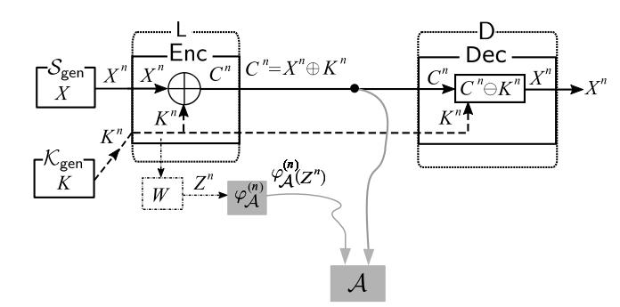
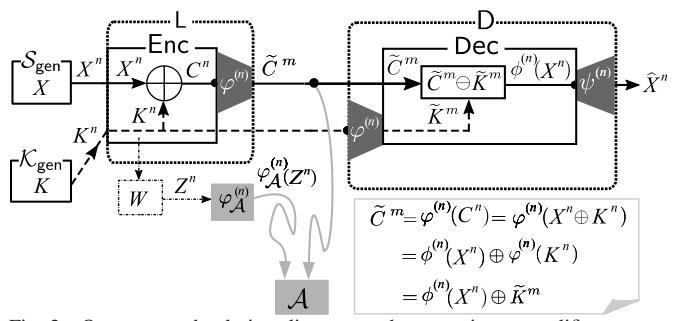
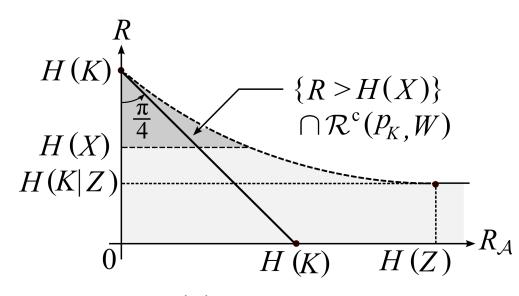

arXiv:2302.01314v2 [cs.IT] 7 Feb 2023

1

#Universal Coding for Shannon Ciphers underSide-Channel Attacks

Bagus Santoso and Yasutada Oohama University of Electro-Communications, Tokyo, Japan Email: {santoso.bagus,oohama}@uec.ac.jp

Abstract-We study the universal coding under side-channel attacks posed and investigated by Santoso and Oohama (2019). They proposed a theoretical security model for Shannon cipher system under side-channel attacks, where the adversary is not only allowed to collect ciphertexts by eavesdropping the public communication channel, but is also allowed to collect the physical information leaked by the devices where the cipher system is implemented on such as running time, power consumption, electromagnetic radiation, etc. For any distributions of the plain text, any noisy channels through which the adversary observe the corrupted version of the key, and any measurement device used for collecting the physical information, we can derive an achievable rate region for reliability and security such that if we compress the ciphertext using an affine encoder with rate within the achievable rate region, then: (1) anyone with secret key will be able to decrypt and decode the ciphertext correctly, but (2) any adversary who obtains the ciphertext and also the side physical information will not be able to obtain any information about the hidden source as long as the leaked physical information is encoded with a rate within the rate region.

# I. Introduction

In this paper, we consider the problem of strengthening the security of communication in the Shannon cipher system when we have side channel attacks to the cryptosystem. Especially, we are interested on practical solutions with minimum modifications which can be applied even on already running systems.

More precisely, we consider a cryptosystem described as follows: a source X is encrypted in a node to C using secret key  $K$ . The cipher text  $C$  is sent through a public communication channel to a sink node, where  $X$  is decrypted from  $C$  using  $K$ . We suppose that an already running system has a potential secrecy/privacy problem such that  $X$  might be leaked to an adversary which is eavesdropping the public communication channel and is also using a side-channel providing some side information on  $K$ .

To pose side channel-attacks to the Shannon cipher system, we regard them as a signal estimation via encoded data from two distributed sensors. This can be formulated as the one helper source coding problem posed and investigated by Ahlswede, Körner [1] and Wyner [2].

We further investigate the posed problem to derive new secrecy bounds. Our results are derived by two previous results. One is the coding theorem Watanabe and Oohama [3] obtained for the privacy amplification problem for bounded storage eavesdropper posed by them. The other is the exponential strong converse theorem Oohama [4] established for the one helper source coding problem.

# II. PROBLEM FORMULATION

## A. Preliminaries

In this subsection, we show the basic notations and related consensus used in this paper.

Random Source of Information and Key: Let  $X$  and  $K$  be two random variables from a finite set  $\mathcal{X}$ . The random variable  $X$  represents the source. The ramdom  $K$  represents the key used for encryption. Let  $\{X_t\}_{t=1}^{\infty}$  be a stationary discrete memoryless source(DMS) such that for each  $t = 1, 2, ...$ ,  $X_t$  takes values in finite set  $\mathcal{X}$  and has the same distribution as that of  $X$  denoted by  $p_X = \{p_X(x)\}_{x \in \mathcal{X}}$ . The stationary DMS  $\{X_t\}_{t=1}^{\infty}$  is specified with  $p_X$ . Similarly, let  $\{K_t\}_{t=1}^{\infty}$  be a stationary DMS specified with the distribution  $p_K$  of  $K$ . Random Variables and Sequences: We write the sequence ofrandom variables with length  $n$  from the information source as follows:  $X^n := X_1X_2 \cdots X_n$ . Similarly, the strings with length  $n$  of  $\mathcal{X}^n$  are written as  $x^n := x_1x_2 \cdots x_n \in \mathcal{X}^n$ . For  $x^n \in \mathcal{X}^n$ ,  $p_{X^n}(x^n)$  stands for the probability of the occurrence of  $x^n$ . When the information source is memoryless specified with  $p_X$ , we have the following equation holds:

$$
p_{X^n}(x^n) = \prod_{t=1}^n p_X(x_t).
$$

In this case we write  $p_{X^n}(x^n)$  as  $p_X^n(x^n)$ . Similar notations are used for other random variables and sequences.

Consensus and Notations: Without loss of generality, throughout this paper, we assume that  $\mathcal{X}$  is a finite field. The notation  $\oplus$  is used to denote the field addition operation, while the notation  $\ominus$  is used to denote the field subtraction operation, i.e.,  $a \ominus b = a \oplus (-b)$  for any elements  $a, b \in \mathcal{X}$ . Throughout this paper all logarithms are taken to the base natural.

## B. Basic System Description

In this subsection we explain the basic system setting and basic adversarial model we consider in this paper. First, let the information source and the key be generated independently by different parties  $S_{\text{gen}}$  and  $K_{\text{gen}}$  respectively. In our setting, we assume that the random key  $K^n$  is generated by  $K_{\text{gen}}$  from uniform distribution. We further assume that the source is generated by  $S_{\text{gen}}$  and independent of the key. Next, let the random source  $X^n$  from  $S_{\text{gen}}$  be sent to the node L. And let the random key  $K^n$  from  $K_{\text{gen}}$  be also sent to L. Further settings of our system are described as follows. Those are also shown in Fig. 1.

2

Fig. 1. Side-channel attacks to the Shannon cipher system.

- 1) Source Processing: At the node,  $X^n$  is encrypted with the key  $K^n$  using the encryption function Enc. The ciphertext  $C^n$  of  $X^n$  is given by  $C^n := \text{Enc}(X^n) =$  $X^n \oplus K^n$ .
- 2) Transmission: Next, the ciphertext  $C^n$  is sent to the information processing center D through a *public* communication channel. Meanwhile, the key  $K^n$  is sent to D through a *private* communication channel.
- 3) Sink Node Processing: In D, we decrypt the ciphertext  $C^n$  using the key  $K^n$  through the corresponding decryption procedure Dec defined by  $\mathsf{Dec}(C^n) = C^n \oplus K^n$ . It is obvious that we can correctly reproduce the source output  $X^n$  from  $C^n$  and  $K^n$  by the decryption function Dec.

 Side-Channel Attacks by Eavesdropper Adversary:

An *(eavesdropper)* adversary  $\mathcal{A}$  eavesdrops the public communication channel in the system. The adversary  $\mathcal{A}$  also uses a side information obtained by side-channel attacks. Let  $\mathcal{Z}$  be a finite set and let  $W : \mathcal{X} \to \mathcal{Z}$  be a noisy channel. Let  $Z$  be a channel output from  $W$  for the input random variable  $K$ . We consider the discrete memoryless channel specified with  $W$ . Let  $Z^n \in \mathcal{Z}^n$  be a random variable obtained as the channel output by connecting  $K^n \in \mathcal{X}^n$  to the input of channel. We write a conditional distribution on  $Z^n$  given  $K^n$  as

$$
W^{n} = \{W^{n}(z^{n}|k^{n})\}_{(k^{n}, z^{n}) \in \mathcal{K}^{n} \times \mathcal{Z}^{n}}.
$$

Since the channel is memoryless, we have

$$
W^n(z^n|k^n) = \prod_{t=1}^n W(z_t|k_t).
$$

(1)

On the above output  $Z^n$  of  $W^n$  for the input  $K^n$ , we assume the followings.

- The three random variables X, K and Z, satisfy  $X \perp$  $(K, Z)$ , which implies that  $X^n \perp (K^n, Z^n)$ .
- $W$  is given in the system and the adversary  $\mathcal A$  can not  $control\ W.$

• By side-channel attacks, the adversary  $\mathcal{A}$  can access  $\mathbb{Z}^n$ .
We next formulate side information the adversary  $\mathcal{A}$  obtains by side-channel attacks. For each  $n = 1, 2, \cdots$ , let  $\varphi_{\mathcal{A}}^{(n)} : \mathbb{Z}^n \to$ 
 $\mathcal{M}_{\mathcal{A}}^{(n)}$  be an encoder function. Set  $\varphi_{\mathcal{A}} := {\{\varphi_{\mathcal{A}}^{(n)}\}}_{n=1,2,\dots}$  Let

$$
R_{\mathcal{A}}^{(n)} := \frac{1}{n} \log ||\varphi_{\mathcal{A}}|| = \frac{1}{n} \log |\mathcal{M}_{\mathcal{A}}^{(n)}|
$$

be a rate of the encoder function  $\varphi_{\mathcal{A}}^{(n)}$ . For  $R_{\mathcal{A}} > 0$ , we set

$$
\mathcal{F}_{\mathcal{A}}^{(n)}(R_{\mathcal{A}}) := \{ \varphi_{\mathcal{A}}^{(n)} : R_{\mathcal{A}}^{(n)} \le R_{\mathcal{A}} \}.
$$

Fig. 2. Our proposed solution: linear encoders as privacy amplifiers.

On encoded side information the adversary  $\mathcal{A}$  obtains we assume the following.

- The adversary  $\mathcal{A}$ , having accessed  $Z^n$ , obtains the encoded additional information  $\varphi_{\mathcal{A}}^{(n)}(Z^n)$ . For each  $n=$  $1, 2, \cdots$ , the adversary  $\mathcal{A}$  can design  $\varphi_{\mathcal{A}}^{(n)}$ .
- The sequence  $\{R_{\mathcal{A}}^{(n)}\}_{n=1}^{\infty}$  must be upper bounded by a prescribed value. In other words, the adversary  $\mathcal A$  must use  $\varphi_{\mathcal{A}}^{(n)}$  such that for some  $R_{\mathcal{A}}$  and for any sufficiently large  $n, \varphi_{\mathcal{A}}^{(n)} \in \mathcal{F}_{\mathcal{A}}^{(n)}(R_{\mathcal{A}})$ .

## C. Proposed Idea: Affine Encoder as Privacy Amplifier

For each  $n = 1, 2, \dots$ , let  $\phi^{(n)} : \mathcal{X}^n \to \mathcal{X}^m$  be a linear mapping. We define the mapping  $\phi^{(n)}$  by

$$
\phi^{(n)}(x^n) = x^n A \text{ for } x^n \in \mathcal{X}^n,
$$

(2)

where A is a matrix with  $n$  rows and  $m$  columns. Entries of A are from  $\mathcal{X}$ . We fix  $b^m \in \mathcal{X}^m$ . Define the mapping  $\varphi^{(n)}: \mathcal{X}^n \to \mathcal{X}^m$  by

$$
\varphi^{(n)}(k^n) := \phi^{(n)}(k^n) \oplus b^m
$$

$$
= k^n A \oplus b^m, \text{ for } k^n \in \mathcal{X}^n.
$$

(3)

The mapping  $\varphi^{(n)}$  is called the affine mapping induced by the linear mapping  $\phi^{(n)}$  and constant vector  $b^m \in \mathcal{X}^m$ . By the definition (3) of  $\varphi^{(n)}$ , those satisfy the following affine structure:

$$
\varphi^{(n)}(y^{n} \oplus k^{n})(x^{n} \oplus k^{n})A \oplus b^{m} = x^{n} A \oplus (k^{n} A \oplus b^{m}) \\
= \varphi^{(n)}(x^{n}) \oplus \varphi^{(n)}(k^{n}), \text{ for } x^{n}, k^{n} \in \mathcal{X}^{n}.
$$

(4)

Next, let  $\psi^{(n)}$  be the corresponding decoder for  $\phi^{(n)}$  such that  $\psi^{(n)}: \mathcal{X}^m \to \mathcal{X}^n$ . Note that  $\psi^{(n)}$  does not have a linear structure in general.

Description of Proposed Procedure:
We describe the procedure of our privacy amplified system as follows.

1) *Encoding of Ciphertext:* First, we use  $\varphi^{(n)}$  to encode the ciphertext  $C^n = X^n \oplus K^n$ . Let  $\widetilde{C}^n = \varphi^{(n)}(C^n)$ . Then, instead of sending  $C^n$ , we send  $\widetilde{C}^n$  to the public communication channel. By the affine structure (4) of encoder we have that

$$
\widetilde{C}^{m} = \varphi^{(n)}(X^{n} \oplus K^{n}) \\
= \phi^{(n)}(X^{n}) \oplus \varphi^{(n)}(K^{n}) = \widetilde{X}^{m} \oplus \widetilde{K}^{m}, 
$$

(5)

where we set  $\widetilde{X}^m := \phi^{(n)}(X^n), \widetilde{K}^m := \varphi^{(n)}(K^n).$ 

3

2) Decoding at Sink Node D: First, using the linear encoder  $\varphi^{(n)}$ , D encodes the key  $K^n$  received through private channel into  $\widetilde{K}^m = (\varphi^{(n)}(K^n)$ . Receiving  $C^m$ from public communication channel, D computes  $X^m$ in the following way. From  $(5)$ , we have that the decoder D can obtain  $\widetilde{X}^m = \phi^{(n)}(X^n)$  by subtracting  $\widetilde{K}^m = \varphi^{(n)}(K^n)$  from  $\widetilde{C}^m$ . Finally, D outputs  $\widehat{X}^n$  by applying the decoder  $\psi^{(n)}$  to  $\widetilde{X}^m$  as follows:

$$
\widehat{X}^{n} = \psi^{(n)}(\widetilde{X}^{m}) = \psi^{(n)}(\phi^{(n)}(X^{n})). 
$$

(6)

Our privacy amplified system described above is illustrated in Fig. 2.

*On Reliability:*

From the description of our system in the previous section, the decoding process in our system above is successful if  $\hat{X}^n = X^n$  holds. Combining this and (6), it is clear that the decoding error probability  $p_e$  is as follows:

$$
p_{\mathbf{e}} = p_{\mathbf{e}}(\phi^{(n)}, \psi^{(n)}|p_X^n) := \Pr[\psi^{(n)}(\phi^{(n)}(X^n)) \neq X^n]
$$

Set  $M_{\mathcal{A}}^{(n)} = \varphi_{\mathcal{A}}^{(n)}(Z^n)$ . The adversary  $\mathcal{A}$  tries to estimate  $X^n \in \mathcal{X}^n$  from

$$
(\widetilde{C}^m, M_{\mathcal{A}}^{(n)}) = (\varphi^{(n)}(X^n \oplus K^n), M_{\mathcal{A}}^{(n)}) \in \mathcal{X}^m \times \mathcal{M}_{\mathcal{A}}^{(n)}.
$$

We assume that the adversary  $A$  knows  $(A, b^n)$  defining the affine encoder  $\varphi^{(n)}$ . The information leakage  $\Delta^{(n)}$  on  $X^n$  from  $(\widetilde{C}^m, M_{A}^{(n)})$  is measured by the mutual information between  $X^n$  and  $(\widetilde{C}^m, M_{A}^{(n)})$ . This quantity is formally defined by

$$
\Delta^{(n)} = \Delta^{(n)}(\varphi^{(n)}, \varphi_{\mathcal{A}}^{(n)}|p_X^n, p_K^n, W^n)
$$
  
:= 
$$
I(X^n; \widetilde{C}^m, M_{\mathcal{A}}^{(n)}) = I(X^n; \varphi^{(n)}(X^n \oplus K^n), M_{\mathcal{A}}^{(n)})
$$

Reliable and Secure Framework:

Definition 1: A quantity  $R$  is achievable under  $R_{\mathcal{A}} > 0$  for the system Sys if there exists a sequence  $\{(\varphi^{(n)}, \psi^{(n)})\}_{n\geq 1}$  such that  $\forall \epsilon > 0, \exists n_0 = n_0(\epsilon) \in \mathbb{N}_0, \forall n \geq n_0$ , we have

$$
\frac{1}{n}\log|\mathcal{X}^m| = \frac{m}{n}\log|\mathcal{X}| \in [R-\epsilon, R+\epsilon],
$$
  
$$
p_{\mathrm{e}}(\phi^{(n)}, \psi^{(n)}|p_X^n) \le \epsilon
$$

and for any eavesdropper  $\mathcal{A}$  with  $\varphi_{\mathcal{A}}$  satisfying  $\varphi_{\mathcal{A}}^{(n)} \in \mathcal{F}_{\mathcal{A}}^{(n)}(R_{\mathcal{A}}+\epsilon)$ , we have

$$
\Delta^{(n)}(\varphi^{(n)}, \varphi_{\mathcal{A}}^{(n)}|p_X^n, p_K^n, W^n) \le \epsilon.
$$

Definition 2: (**Reliable** and **Secure Rate Region**) Let  $\mathcal{R}_{\mathsf{Sys}}(p_X, p_K, W)$  denote the set of all  $(R_{\mathcal{A}}, R)$  such that  $R$  is achievable under  $R_{\mathcal{A}}$ . We call  $\mathcal{R}_{\mathsf{Sys}}(p_X, p_K, W)$  the **reliable** and **secure rate region**.

# III. PREVIOUS RESULT

In this section we state the previous result by Santoso and Oohama [\[5\]](#page-9-1). They obtained inner bounds of  $\mathcal{R}_{\mathsf{Sys}}(p_X, p_K, W)$  and  $\mathcal{D}_{\mathsf{Sys}}(p_X, p_K, W)$ . To describe their results we define several functions and sets. We first define several sets related to  $\mathcal{R}_{\mathsf{Sys}}(p_X, p_K, W)$ . Let  $U$  be an auxiliary random variable

taking values in a finite set  $\mathcal{U}$ . We assume that the joint distribution of  $(U, Z, K)$  is

$$
p_{UZK}(u,z,k) = p_U(u)p_{Z|U}(z|u)p_{K|Z}(k|z).
$$

The above condition is equivalent to  $U \leftrightarrow Z \leftrightarrow K$ . Define the set of probability distribution  $p = p_{UZK}$  by

$$
\mathcal{P}(p_K, W) := \{p_{UZK} : |\mathcal{U}| \leq |\mathcal{Z}| + 1, U \leftrightarrow Z \leftrightarrow K\}
$$

Set

$$
\mathcal{R}(p) := \{(R_{A}, R) : R_{A}, R \ge 0, R_{A} \ge I(Z; U), R \ge H(K|U) \},
$$

$$
\mathcal{R}(p_{K}, W) := \bigcup_{p \in \mathcal{P}(p_{K}, W)} \mathcal{R}(p).
$$

We can show that the region  $\mathcal{R}(p_K, W)$  satisfies the following property.
    Property 1:

- a) The region  $\mathcal{R}(p_K, W)$  is a closed convex subset of  $\mathbb{R}^2_+$  :=  $\{R_{\mathcal{A}} \ge 0, R \ge 0\}.$
- b) For any  $(p_K, W)$ , we have

$$
\mathcal{R}(p_K, W) \subseteq \{ (R_{\mathcal{A}}, R) : R_{\mathcal{A}} + R \ge H(K) \} \cap \mathbb{R}_+^2.
$$

Furthermore, the point  $(0, H(K))$  always belongs to  $\mathcal{R}(p_K, W)$ .Property 1 part a) is a well known property. Proof of  
Property 1 part b) is easy. Proofs of Property 1 parts a) and  
b) are omitted.

We next define a function related to an exponential upper bound of  $p_{\rm e}(\phi^{(n)},\psi^{(n)}|p_{X}^{n})$ . Let  $\overline{X}$  be an arbitrary random variable over  $\mathcal{X}$  and has a probability distribution  $p_{\overline{X}}$ . Let  $\mathcal{P}(\mathcal{X})$  denote the set of all probability distributions on  $\mathcal{X}$ . For  $R \geq 0$  and  $p_X \in \mathcal{P}(\mathcal{X})$ , we define the following function:

$$
E(R|p_X) := \min_{p_{\overline{X}} \in \mathcal{P}(\mathcal{X})} \{ [R - H(\overline{X})]^+ + D(p_{\overline{X}}||p_X) \}.
$$

We finally define a function related to an exponential upper bound of  $\Delta^{(n)}(\varphi^{(n)},\varphi_{\mathcal{A}}^{(n)}|p_X^n,p_K^n,W^n)$ . Set

$$
\mathcal{Q}(p_{K|Z}) := \{q = q_{UZK} : |U| \leq |Z|, U \leftrightarrow Z \leftrightarrow K, p_{K|Z} = q_{K|Z}\}.
$$

For  $(\mu, \alpha) \in [0, 1]^2$  and for  $q = q_{UZK} \in \mathcal{Q}(p_{K|Z})$ , define

$$
\begin{split} \omega_{q|pz}^{(\mu,\alpha)}(z,k|u) &:= \bar{\alpha} \log \frac{q_Z(z)}{p_Z(z)} \\ &+ \alpha \left[ \mu \log \frac{q_{Z|U}(z|u)}{p_Z(z)} + \bar{\mu} \log \frac{1}{q_{K|U}(k|u)} \right], \\ \Omega^{(\mu,\alpha)}(q|p_Z) &:= -\log \mathcal{E}_q \left[ \exp \left\{ -\omega_{q|p_Z}^{(\mu,\alpha)}(Z,K|U) \right\} \right], \\ \Omega^{(\mu,\alpha)}(p_K,W) &:= \min_{q \in \mathcal{Q}(p_{K|Z})} \Omega^{(\mu,\alpha)}(q|p_Z), \\ F^{(\mu,\alpha)}(\mu R_{\mathcal{A}} + \bar{\mu}R|p_K,W) \\ &:= \frac{\Omega^{(\mu,\alpha)}(p_K,W) - \alpha(\mu R_{\mathcal{A}} + \bar{\mu}R)}{2 + \alpha \bar{\mu}}, \\ F(R_{\mathcal{A}},R|p_K,W) &:= \sup_{\substack{(\mu,\alpha) \\ \in [0,1]^2}} F^{(\mu,\alpha)}(\mu R_{\mathcal{A}} + \bar{\mu}R|p_K,W). \end{split}
$$

4

We can show that the above functions satisfy the following property.
    Property 2:

- a) The cardinality bound  $|\mathcal{U}| \leq |\mathcal{Z}|$  in  $\mathcal{Q}(p_{K|\mathcal{Z}})$  is sufficient to describe the quantity  $\Omega^{(\mu,\alpha)}(p_K,W)$ .
- b) Fix any  $p = p_{UZK} \in \mathcal{P}_{sh}(p_K, W)$  and  $\mu \in [0, 1]$ . Define

$$
\tilde{\omega}_p^{(\mu)}(z,k|u) := \mu \log \frac{p_{Z|U}(z|u)}{p_Z(z)} + \log \frac{1}{p_{K|U}(K|U)}.
$$

For  $\lambda \in [0, 1/2]$ , we define a probability distribution  $p^{(\lambda)} = p_{UZK}^{(\lambda)}$  by

$$
p^{(\lambda)}(u,z,k) := \frac{p(u,z,k) \exp\left\{-\lambda \tilde{\omega}_p^{(\mu)}(z,k|u)\right\}}{\mathcal{E}_p\left[\exp\left\{-\lambda \tilde{\omega}_p^{(\mu)}(Z,K|U)\right\}\right]}.
$$

For  $(\mu, \lambda) \in [0, 1] \times [0, 1/2]$ , define

$$
\rho^{(\mu,\lambda)}(p_K, W) \\
:= \max_{\substack{(\nu,p)\in[0,\lambda]\\\times\mathcal{P}_{\mathrm{sh}}(p_K,W):\\\tilde{\Omega}^{(\mu,\lambda)}(p)\\=\tilde{\Omega}^{(\mu,\lambda)}(p_K,W)}} \operatorname{Var}_{p^{(\nu)}}\left[\tilde{\omega}_p^{(\mu)}(Z,K|U)\right],
$$

and set

$$
\rho = \rho(p_K, W) := \max_{(\mu, \lambda) \in [0, 1] \times [0, 1/2]} \rho^{(\mu, \lambda)}(p_K, W).
$$

Then we have  $\rho(p_K, W) < \infty$ . Furthermore, for every  $\tau \in (0, (1/2)\rho(p_K, W))$ , the condition  $(R_{\mathcal{A}}, R + \tau) \notin$   $\mathcal{R}(p_K, W)$  implies

$$
F(R_{\mathcal{A}}, R|p_K, W) > \frac{\rho(p_K, W)}{4} \cdot g^2\left(\frac{\tau}{\rho(p_K, W)}\right) > 0,
$$

where  $g$  is the inverse function of  $\vartheta(a) := a + (3/2)a^2, a \ge 0$ .
Proof of this property is found in Oohama [6]. Define

$$
\mathcal{R}^{(\text{in})}(p_X, p_K, W) := \{R > H(X)\} \cap \mathcal{R}^{\text{c}}(p_K, W).
$$

The functions  $E(R|p_X)$  and  $F(R_A, R|p_K, W)$  take positive values if and only if  $(R_A, R)$  belongs to  $\mathcal{R}_{Sys}^{(in)}(p_X, p_K, W)$ . Define  $\delta_{i,n}, i = 1, 2$  by

$$
\delta_{1,n} := \frac{1}{n} \log \left[ e(n+1)^{2|\mathcal{X}|} \{ (n+1)^{|\mathcal{X}|} + 1 \} \right],
$$
  
$$
\delta_{2,n} := \frac{1}{n} \log \left[ 5nR \{ (n+1)^{|\mathcal{X}|} + 1 \} \right].
$$

Note that for  $i = 1, 2$ ,  $\delta_{i,n} \rightarrow 0$  as  $n \rightarrow \infty$ . Santoso and Oohama [\[5\]](#page-9-1) proved the following result.

Theorem 1: For any  $R_A, R > 0$ , and any  $(p_K, W)$  with
 $(R_A, R) \in \mathcal{R}^c(p_Z, W)$ , there exists a sequence of mappings
 $\{(\varphi^{(n)},\psi^{(n)})\}_{n=1}^{\infty}$  satisfying

$$
R - \frac{1}{n} \le \frac{1}{n} \log |\mathcal{X}^m| = \frac{m}{n} \log |\mathcal{X}| \le R
$$

such that for any  $p_X$  with  $R > H(X)$ , we have that

$$
p_{\mathbf{e}}(\phi^{(n)}, \psi^{(n)} | p_X^n) \le e^{-n[E(R|p_X) - \delta_{1,n}]}
$$

(7)

Fig. 3. The inner bound  $\mathcal{R}^{(\text{in})}(p_X, p_K, W)$  of the reliable and secure rate region  $\mathcal{R}_{\text{Sys}}(p_X, p_K, W)$ .

and that for any eavesdropper  $\mathcal{A}$  with  $\varphi_{\mathcal{A}}$  satisfying  $\varphi_{\mathcal{A}}^{(n)} \in \mathcal{F}^{(n)}_{\mathcal{A}}(R_{\mathcal{A}}),$ 

$$
\Delta^{(n)}(\varphi^{(n)}, \varphi_{\mathcal{A}}^{(n)}|p_X^n, p_K^n, W^n) \leq e^{-n[F(R_{\mathcal{A}}, R|p_K, W) - \delta_{2,n}]}.
$$

(8)

By Theorem 1, under  $(R_{A}, R) \in \mathscr{R}^{(\text{in})}(p_X, p_K, W)$ , we have the followings:

- On the reliability,  $p_{\rm e}(\phi^{(n)},\psi^{(n)}|p_X^n)$  goes to zero exponentially as  $n$  tends to infinity, and its exponent is lower bounded by the function  $E(R|p_X)$ .
- On the security, for any  $\varphi_{\mathcal{A}}^{(n)}$  belonging to  $\mathcal{F}_{\mathcal{A}}^{(n)}(R_{\mathcal{A}})$ , the information leakage  $\Delta^{(n)}(\varphi^{(n)}, \varphi_{\mathcal{A}}^{(n)}|p_{X}^{n}, p_{K}^{n}, W^{n})$  goes to zero exponentially as  $n$  tends to infinity, and its exponent is lower bounded by the function  $F(R_{\mathcal{A}}, R|p_K, W)$ .
- The code that attains the exponent functions  $E(R|p_X)$ is the universal code that depends only on  $R$  not on the value of the distribution  $p_X$ .

From Theorem 1, we have the following corollary. 
Corollary 1:

$$
\mathcal{R}^{(\text{in})}(p_X, p_K, W) \subseteq \mathcal{R}_{\text{Sys}}(p_X, p_K, W).
$$

A typical shape of the region  $\mathcal{R}^{(in)}(p_X, p_K, W)$  is shown in Fig. 3.

# IV. MAIN RESULT

To describe our main result we define several quantities. For  $p_{\overline{K}\overline{Z}} \in \mathcal{P}(\mathcal{X} \times \mathcal{Z})$ , define

$$
G^{(\mu,\alpha)}(\mu R_{A} + \bar{\mu}R|p_{\overline{K}\overline{Z}})
:= \frac{\Omega^{(\mu,\alpha)}(p_{\overline{K}\overline{Z}}) - \alpha(\mu R_{A} + \bar{\mu}R)}{2 + 3\alpha\bar{\mu}},
G(R_{A}, R|p_{\overline{K}\overline{Z}}) := \sup_{\substack{(\mu,\alpha) \\ \in [0,1]^{2}}} G^{(\mu,\alpha)}(\mu R_{A} + \bar{\mu}R|p_{\overline{K}\overline{Z}}).
$$

By simple computation we can show that

$$
G(R_{A}, R|p_{\overline{K}\overline{Z}}) \ge (1/3)F(R_{A}, R|p_{\overline{K}\overline{Z}}).
$$

Set

$$
G(R_{A}, R|p_{K}, W) := \min_{p_{\overline{K}\overline{Z}} \in \mathcal{P}(K \times Z)} \{G(R_{A}, R|p_{\overline{K}\overline{Z}}) + D(p_{\overline{K}\overline{Z}}||p_{X}, W) \}.
$$

5

Define  $\delta_{i,n}, i = 3, 4$  by 

$$
\delta_{3,n} := \frac{1}{n} \log \left[ e(n + 1)^{2|x|} \times \left\{ (n + 1)^{|x|} + (n + 1)^{|x||z|} \right\} \right],
$$ 

 $$
 \delta_{4,n} := \frac{1}{n} \log \left[ (7nR)(n + 1)^{3|x||z|} \times \left\{ (n + 1)^{|x|} + (n + 1)^{|x||z|} \right\} \right].
 $$ 

Note that for  $i = 3, 4, \delta_{i,n} \to 0$  as  $n \to \infty$ . Our main result is the following.

Theorem 2: For any  $R_A, R > 0$ , there exists a sequence of mappings  $\{(\varphi^{(n)}, \psi^{(n)})\}_{n=1}^{\infty}$  satisfying

$$
R - \frac{1}{n} \le \frac{1}{n} \log |\mathcal{X}^m| = \frac{m}{n} \log |\mathcal{X}| \le R
$$

such that for any  $(p_X, p_K, W)$  with  $(R_{\mathcal{A}}, R) \in \mathcal{R}^{(\text{in})}$ ( $p_X, p_K, W$ ), we have that

$$
p_{e}(\phi^{(n)}, \psi^{(n)}|p_{X}^{n}) \le e^{-n[E(R|p_{X}) - \delta_{3,n}]}
$$

(9)

and that for any eavesdropper  $\mathcal{A}$  with  $\varphi_{\mathcal{A}}$  satisfying  $\varphi_{\mathcal{A}}^{(n)} \in$  For  $p_{\overline{K}\overline{Z}} \in \mathcal{P}_n(\mathcal{X} \times \mathcal{Z})$ , set  $\mathcal{F}_{\mathcal{A}}^{(n)}(R_{\mathcal{A}}),$ 

$$
\Delta^{(n)}(\varphi^{(n)}, \varphi_{\mathcal{A}}^{(n)}|p_X^n, p_K^n, W^n) \leq e^{-n[G(R_{\mathcal{A}}, R|p_K, W) - \delta_{4,n}]}.
$$

(10)

By Theorem 2, under  $(R_{A}, R) \in \mathcal{R}^{(in)}(p_X, p_K, W)$ , we have the followings:

- On the reliability,  $p_{\rm e}(\phi^{(n)},\psi^{(n)}|p_{\rm X}^n)$  goes to zero exponentially as  $n$  tends to infinity, and its exponent is lower bounded by the function  $E(R|p_X)$ .
- On the security, for any  $\varphi_{\mathcal{A}}$  satisfying  $\varphi_{\mathcal{A}}^{(n)} \in \mathcal{F}_{\mathcal{A}}^{(n)}(R_{\mathcal{A}})$ ,  $\Delta^{(n)}(\varphi^{(n)},\varphi_{\mathcal{A}}^{(n)}|p_X^n,p_K^n,W^n)$  goes to zero exponentially as  $n$  tends to infinity, and its exponent is lower bounded by the function  $G(R_{\mathcal{A}}, R|p_K, W)$ .
- The code that attains the exponent functions  $E(R|p_X)$ and  $G(R_{\mathcal{A}}, R|p_K, W)$  is the universal code that depends only on  $(R_{\mathcal{A}}, R)$  not on the value of the distributions  $p_X$ ,  $p_Z$ , and  $W$ .

# V. PROOF OUTLINE OF THE MAIN RESULT

In this section we outline the proof of Theorem 2. We first present several definitions on the types. For any  $n$ -sequence   
  $k^n = k_1k_2 \cdots k_n \in \mathcal{X}^n$ ,  $n(k|k^n)$  denotes the number of  $t$  such that  $k_t = k$ . The relative frequency  $\{n(k|k^n)/n\}_{k \in \mathcal{X}}$  of the components of  $x^n$  is called the type of  $k^n$  denoted by  $P_{k^n}$ . The set that consists of all the types on  $\mathcal{X}$  is denoted by  $\mathcal{P}_n(\mathcal{X})$ . For  $p_{\overline{K}} \in \mathcal{P}_n(\mathcal{X})$ , set

$$
T_{\overline{K}}^n := \{k^n : P_{k^n} = p_{\overline{K}}\}.
$$

Similarly, for any two *n*-sequences  $k^n = k_1 k_2, \dots, k_n \in$   $\mathcal{X}^n$  and  $z^n = z_1 z_2, \dots, z_n \in \mathcal{Z}^n$ ,  $n(k, z|k^n, z^n)$  denotes the number of  $t$  such that  $(k_t, z_t) = (k, z)$ . The relative frequency  $\{n(k,z|k^n,z^n)/n\}_{(k,z)\in\mathcal{X}\times\mathcal{Z}}$  of the components of  $(k^n, z^n)$  is called the joint type of  $(k^n, z^n)$  denoted by  $P_{k^n,z^n}$ . Furthermore, the set of all the joint type of  $\mathcal{X} \times \mathcal{Z}$  is denoted by  $\mathcal{P}_n(\mathcal{X} \times \mathcal{Z})$ . For  $p_{\overline{KZ}} \in \mathcal{P}_n(\mathcal{X} \times \mathcal{Z})$ , set

$$
T_{\overline{K}\overline{Z}}^{n} := \{(k^{n}, z^{n}) : P_{k^{n}, z^{n}} = P_{\overline{K}\overline{Z}}\}
$$

Furthermore, for  $p_{\overline{K}} \in \mathcal{P}_n(\mathcal{X})$  and  $k^n \in T^n_{\overline{K}}$ , set

$$
T^n_{\overline{Z}|\overline{K}}(k^n) := \{z^n : P_{k^n, z^n} = p_{\overline{K}\,\overline{Z}}\}.
$$

We next discuss upper bounds of

$$
\Delta_n(\varphi^{(n)}, \varphi_{\mathcal{A}}^{(n)} | p_X^n, p_K^n, W^n) = I(\widetilde{C}^m, M_{\mathcal{A}}^{(n)}; X^n).
$$

According to [5], on an upper bound of  $I(\widetilde{C}^m, M_A^{(n)}; X^n)$ , we have the following lemma.Lemma 1: [\[5\]](#page-5-1)

$$
I(\widetilde{C}^m, M_{\mathcal{A}}^{(n)}; X^n) \le D\left(p_{\widetilde{K}^m | M_{\mathcal{A}}^{(n)}} \middle\| p_{V^m} \middle\| p_{M_{\mathcal{A}}^{(n)}}\right), 
$$

(11)

where  $p_{V^m}$  is the uniform distribution over  $\mathcal{X}^m$ . 
Set  $M^{(n)} := P_{K^n, Z^n}$ . Then we have the following:

$$
D\left(p_{\widetilde{K}^{m}|M_{\mathcal{A}}^{(n)}}\middle\|p_{V^{m}}\middle|p_{M_{\mathcal{A}}^{(n)}}\right) \leq D\left(p_{\widetilde{K}^{m}|M_{\mathcal{A}}^{(n)}M^{(n)}}\middle\|p_{V^{m}}\middle|p_{M_{\mathcal{A}}^{(n)}M^{(n)}}\right).
$$

(12)

For  $p_{\overline{KZ}} \in \mathcal{P}_n(\mathcal{X} \times \mathcal{Z})$ , set

$$
D\left(p_{\widetilde{K}^{m}|M_{\mathcal{A}}^{(n)}M^{(n)}=p_{\overline{K}\,\overline{Z}}}\middle|\middle|p_{V^{m}}\middle|p_{M_{\mathcal{A}}^{(n)}M^{(n)}=p_{\overline{K}\,\overline{Z}}}\right)
$$

$$
:=\zeta(\varphi^{(n)},\varphi_{\mathcal{A}}^{(n)}|p_{\overline{K}\,\overline{Z}}).
$$

(13)
 
From  (11),(12) , and  (13) , we have

$$
\Delta_{n}(\varphi^{(n)}, \varphi_{\mathcal{A}}^{(n)} | p_{X}^{n}, p_{K}^{n}, W^{n}) \leq \sum_{\substack{p_{\overline{K}\overline{Z}} \in \mathcal{P}_{n}(\mathcal{X} \times \mathcal{Z})}} 1
$$

$$
\times \Pr\{M^{(n)} = p_{\overline{K}\overline{Z}}\} \zeta(\varphi^{(n)}, \varphi_{\mathcal{A}}^{(n)} | p_{\overline{K}\overline{Z}}).
$$

(14)

For  $p_{\overline{K}\overline{Z}} \in \mathcal{P}_n(\mathcal{X} \times \mathcal{Z})$ , define

$$
\Upsilon(R,\varphi_{\mathcal{A}}^{(n)}|p_{\overline{K}\overline{Z}}) := \sum_{\substack{(a,k^n) \\ \in \mathcal{M}_{\mathcal{A}}^{(n)} \times T_{\overline{K}}^n}} \frac{\left| \left(\varphi_{\mathcal{A}}^{(n)}\right)^{-1}(a) \cap T_{\overline{Z}|\overline{K}}^n(k^n) \right|}{|T_{\overline{K}\overline{Z}}^n|} \\
\times \log \left[ 1 + (e^{nR} - 1) \frac{\frac{\left| \left(\varphi_{\mathcal{A}}^{(n)}\right)^{-1}(a) \cap T_{\overline{Z}|\overline{K}}^n(k^n) \right|}{|T_{\overline{K}}^n|}}{\left| \left(\varphi_{\mathcal{A}}^{(n)}\right)^{-1}(a) \cap T_{\overline{Z}}^n \right| |T_{\overline{K}\overline{Z}}^n|} \right] .
$$

On  $\zeta(\varphi^{(n)}, \varphi_{\mathcal{A}}^{(n)}|p_{\overline{K}\overline{Z}})$  for  $p_{\overline{K}\overline{Z}} \in \mathcal{P}_n(\mathcal{X} \times \mathcal{Z})$ , we have the following lemma.*Lemma 2:* For any  $p_{\overline{K}\overline{Z}} \in \mathcal{P}_n(\mathcal{X} \times \mathcal{Z}),$ j

$$
\mathbf{E}\left[\zeta(\varphi^{(n)},\varphi_{\mathcal{A}}^{(n)}|p_{\overline{K}\,\overline{Z}})\right] \leq \Upsilon(R,\varphi_{\mathcal{A}}^{(n)}|p_{\overline{K}\,\overline{Z}}),
$$

(15)

where  $\mathbf{E}[\cdot]$  is an expectation based on the random choice of  $\varphi^{(n)}$ .

To prove the above lemma we use a technique quite similar to that of Hayashi [\[7\]](#page-9-1) used for an ensemble of universal2 functions. The following proposition is a key result for the proof of Theorem 1.

Proposition 1: For any  $R_{\mathcal{A}}, R > 0$ , there exists a sequence of mappings  $\{(\varphi^{(n)}, \psi^{(n)})\}_{n=1}^{\infty}$  satisfying

$$
R - \frac{1}{n} \le \frac{1}{n} \log |\mathcal{X}^m| = \frac{m}{n} \log |\mathcal{X}| \le R
$$

6

such that for any  $p_X \in \mathcal{P}(\mathcal{X})$ , and any  $(p_K, W) \in \mathcal{P}(\mathcal{X} \times \mathcal{Z})$ , we have

$$
p_{\mathbf{e}}(\phi^{(n)}, \psi^{(n)}|p_X^n) \le \mathbf{e}(n+1)^{2|\mathcal{X}|} \times \{(n+1)^{|\mathcal{X}|} + (n+1)^{|\mathcal{X}||\mathcal{Z}|}\} \mathbf{e}^{-n[E(R|p_X)]} 
$$

(16)

and for any eavesdropper  $\mathcal{A}$  with  $\varphi_{\mathcal{A}}$  satisfying  $\varphi_{\mathcal{A}}^{(n)} \in \mathcal{F}_{\mathcal{A}}^{(n)}(R_{\mathcal{A}}),$  we have

$$
\Delta^{(n)}(\varphi^{(n)}, \varphi_{\mathcal{A}}^{(n)}|p_{X}^{n}, p_{K}^{n}, W^{n})
$$

$$
\leq \{(n+1)^{|\mathcal{X}|} + (n+1)^{|\mathcal{X}||\mathcal{Z}|}\}
$$

$$
\times \sum_{\substack{p_{\overline{K}\overline{Z}} \in \mathcal{P}_{n}(\mathcal{X}\times\mathcal{Z})}} \Pr\{M^{(n)} = p_{\overline{K}\overline{Z}}\}\Upsilon(R, \varphi_{\mathcal{A}}^{(n)}|p_{\overline{K}\overline{Z}}).
$$

(17)

The above proposition can be proved by a standard argument of random coding with respect to the choice of  $(A, b^n)$ defining the affine encoder  $\varphi^{(n)}$ .We next derive upper bounds of  $\Upsilon(R,\varphi_{\mathcal{A}}^{(n)}|p_{\overline{K}\,\overline{Z}})$  for  $p_{\overline{K}\,\overline{Z}} \in \mathcal{P}_n(\mathcal{X} \times \mathcal{Z})$ . Fix any  $p_{\overline{K}\,\overline{Z}} \in \mathcal{P}_n(\mathcal{X} \times \mathcal{Z})$ . We assume that  $(K^n, Z^n) \sim p_{\overline{K}\,\overline{Z}}^n$ . Under this assumption, we define

$$
\Upsilon(R, \varphi_{\mathcal{A}}^{(n)}|p_{\overline{K}\overline{Z}}^{n})
$$

$$
:= \sum_{p_{\hat{K}\hat{Z}} \in \mathcal{P}_{n}(\mathcal{X}\times\mathcal{Z})} \Pr\{M^{(n)} = p_{\hat{K}\hat{Z}}\} \Upsilon(R, \varphi_{\mathcal{A}}^{(n)}|p_{\hat{K}\hat{Z}}).
$$

Then we have the following two lemmas.
*Lemma 3:* For any  $p_{\overline{K}\overline{Z}} \in \mathcal{P}_n(\mathcal{X} \times \mathcal{Z})$ , we have

$$
\frac{\Upsilon(R,\varphi_{\mathcal{A}}^{(n)}|p_{\overline{K}\,\overline{Z}})}{(n+1)^{|\mathcal{X}||\mathcal{Z}|}} \leq \Upsilon(R,\varphi_{\mathcal{A}}^{(n)}|p_{\overline{K}\,\overline{Z}}^{n}).
$$

(18)

*Lemma 4:* Fix any  $p_{\overline{KZ}} \in \mathcal{P}_n(\mathcal{X} \times \mathcal{Z})$ . Set  $\tau_n := (\vert \mathcal{X} \vert \vert \mathcal{Z} \vert /n) \log(n+1)$ . Suppose that  $(K^n, Z^n) \sim p_{\overline{KZ}}^n$ . Then, for any  $\eta > 0$ , any  $n \geq R^{-1}$ , and for any eavesdropper  $\mathcal{A}$   
with  $\varphi_{\mathcal{A}}$  satisfying  $\varphi_{\mathcal{A}}^{(n)} \in \mathcal{F}_{\mathcal{A}}^{(n)}(R_{\mathcal{A}})$ , we have

$$
(nR)^{-1} \Upsilon(R, \varphi_{\gamma}^{(n)} | P_{Z^n}) \leq P_{M_A^c M} \mathcal{Z}_n K^n \left\{
\begin{aligned}
& \eta \geq \frac{1}{n} \log \frac{p_{Z^n}(Z^n)}{p_{Z^n|K^n}(Z^n|K^n)}, \\
& \eta \geq \frac{1}{n} \log \frac{\hat{p}_{M_A^c M^n K^n Z^n}(M_A^c, Z^n, K^n)}{p_{M_A^c M^n K^n Z^n}(M_A^c, Z^n, K^n)}, \\
& \eta \geq \frac{1}{n} \log \frac{p_{Z^n|M_A^c M^n}(Z^n|M_A^c, M^n)}{p_{Z^n|K^n}(Z^n|K^n)}, \\
& \tau_n + \eta \geq \frac{1}{n} \log \frac{p_{K^n Z^n|M_A^c M^n}(K^n, Z^n|M_A^c, M^n)}{p_{K^n Z^n|M_A^c M^n}(K^n, Z^n|M_A^c, M^n)}, \\
& R_A + \eta \geq \frac{1}{n} \log \frac{p_{Z^n|M_A^c M^n}(Z^n|M_A^c, M^n)}{p_{Z^n}(Z^n)}, \\
& R + \eta \geq \frac{1}{n} \log \frac{1}{p_{K^n|M_A^c M^n}(K^n|M_A^c, M^n)} + 6e^{-n\eta},
\end{aligned}
\right\}
$$

implying that

$$
(nR)^{-1} \Upsilon(R, \varphi_{\gamma}^{(n)} | P_{Z^n}) \\
\leq P_{M_A^{(n)} Z^n K^n} 
\left\{
\begin{aligned}
\eta \geq \frac{1}{n} \log \frac{p_{Z^n}(Z^n)}{p_{Z^n|K^n}(Z^n|K^n)}, \\
\end{aligned}
\right.
$$

(19)

$$
\eta \geq \frac{1}{n} \log \frac{\hat{q}_{M_{\mathcal{A}}^{(n)} Z^{n} K^{n}}(M_{\mathcal{A}}^{(n)}, Z^{n}, K^{n})}{p_{M_{\mathcal{A}}^{(n)} Z^{n} K^{n}}(M_{\mathcal{A}}^{(n)}, Z^{n}, K^{n})},
$$

(20)

$$
R_{\mathcal{A}} + \eta \geq \frac{1}{n} \log \frac{p_{Z^{n} | M_{\mathcal{A}}^{(n)}}(Z^{n} | M_{\mathcal{A}}^{(n)})}{p_{Z^{n}}(Z^{n})},
$$

$$
R + \tau_{n} + 3\eta \geq \frac{1}{n} \log \frac{1}{p_{K^{n} | M_{\mathcal{A}}^{(n)}}(K^{n} | M_{\mathcal{A}}^{(n)})}
$$

$$
+6e^{-n\eta}.
$$

(21)

In (19), we can choose any distribution  $q_{Z^n}$  on  $\mathbb{Z}^n$ . In (20), we can choose any probability distribution  $\hat{q}_{M_A^{(n)}}\$  on  $\mathbb{Z}^n K^n$  on  $\mathcal{M}_A^{(n)} \times \mathbb{Z}^{n} \times \mathcal{X}^{n}$ .

The upper bound (21) of  $(nR)^{-1}\Upsilon(R, \varphi_{\mathcal{A}}^{(n)}|p_{\overline{K}\overline{Z}}^{n})$  in Lemma 4 is the similar to that of the correct probability of decoding for one helper source coding problem in Lemma 1 in Oohama [6]. In a manner quite similar to the derivation of the exponential upper bound of the correct probability of decoding for one helper source coding problem [6], we can derive an exponential upper bound of  $\Upsilon(R,\varphi_{\mathcal{A}}^{(n)}|p_{\overline{K}\overline{Z}}^n)$ . This result is shown in the following proposition.*Proposition 2:* For any  $p_{\overline{K}\overline{Z}} \in \mathcal{P}_n(\mathcal{X} \times \mathcal{Z})$  and for any  $\varphi_{\mathcal{A}}^{(n)} \in \mathcal{F}_{\mathcal{A}}^{(n)}(R_{\mathcal{A}})$ , we have

$$
\Upsilon(R,\varphi_{\mathcal{A}}^{(n)}|p_{\overline{K}\,\overline{Z}}^{n}) \le 7(nR)\mathrm{e}^{n\tau_{n}}\mathrm{e}^{-nG(R_{\mathcal{A}},R|p_{\overline{K}\,\overline{Z}})}.
$$

(22)

From Lemma 3, Propositions 1 and 2, we immediately obtain Theorem 2.

 # REFERENCES

- [1] R. Ahlswede and J. Körner, "Source coding with side information and a converse for the degraded broadcast channel," IEEE Trans. Inform. Theory, vol. 21, no. 6, pp. 629-637, November 1975.
- [2] A. D. Wyner, "On source coding with side information at the decoder," IEEE Trans. Inform. Theory, vol. 21, no. 3, pp. 294-300, May 1975.
- [3] S. Watanabe and Y. Oohama, "Privacy amplification theorem for bounded storage eavesdropper," in Proceedings of 2012 IEEE Information Theory Workshop (ITW), 2012, pp. 177-181.
- [4] Y. Oohama, "Exponent function for one helper source coding problem at rates outside the rate region," in Proceedings of 2015 IEEE International Symposium on Information Theory (ISIT), 2015, pp. 1575-1579, the extended version is available at https://arxiv.org/pdf/1504.05891.pdf.
- [5] B. Santoso and Y. Oohama, "Information theoretic security for Shannon cipher system under side-channel attacks," Entropy, vol. 21, no. 5, pp. 469 (1-33), May 2019.
- [6] Y. Oohama, "Exponential strong converse for one helper source coding problem," Entropy, vol. 21, no. 6, pp. 567 (1-36), June 2019.
- [7] M. Hayashi, "Exponential decreasing rate of leaked information in universal random privacy amplification," *IEEE Trans. Inform. Theory*, vol. 57, no. 6, pp. 3989-4001, June 2011, arXiv:0904.0308v4.