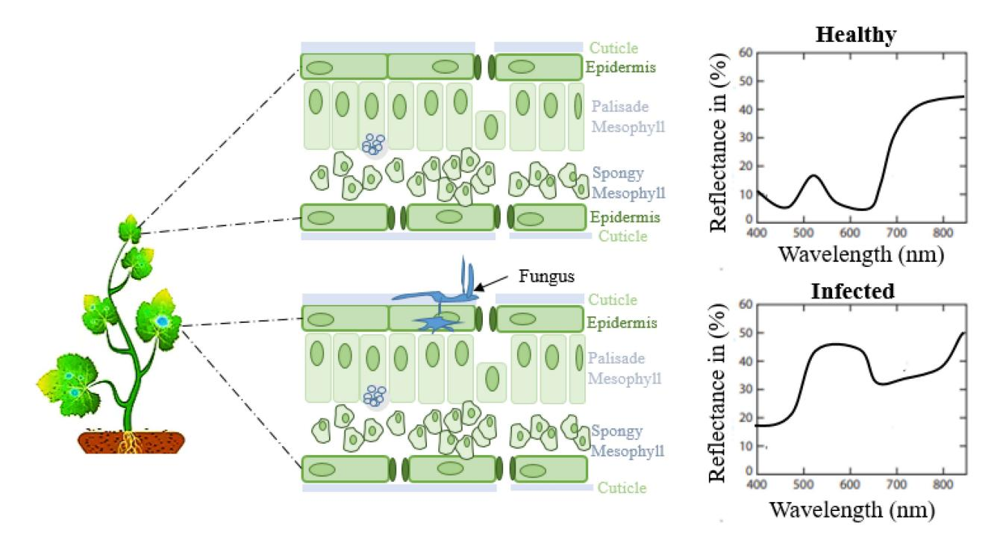

108      IEEE TRANSACTIONS ON AGRIFOOD ELECTRONICS, VOL. 1, NO. 2, DECEMBER 2023

# A Review on Plant Disease Detection Using **Hyperspectral Imaging**

Rakiba Rayhana,, *Student Member, IEEE*, Zhenyu Ma,, Zheng Liu,, *Senior Member, IEEE*, Gaozhi Xiao, *Fellow, IEEE*, Yuefeng Ruan, and Jatinder S. Sangha,

Abstract-Agriculture production is one of the fundamental contributors to a nation's economic development. Every year, plant diseases result in significant crop losses that threaten the global food supply chain. Early estimation of plant diseases could play an essential role in safeguarding crops and fostering economic growth. Recently, hyperspectral imaging techniques have emerged as powerful tools for early disease detection, as they have demonstrated capabilities to detect plant diseases from tissue to canopy levels. This article provides an extensive overview of the principles, types, and operating platforms of hyperspectral image sensors. Furthermore, this article delves into the specifics of these sensors' application in plant disease detection, including disease identification, classification, severity analysis, and understanding genetic resistance. In addition, this article addresses the current challenges in the field and suggests potential solutions to mitigate these pressing issues. Finally, this article outlines the promising future trends and directions of hyperspectral imaging in plant disease detection and analysis. With continuous improvement and application, these imaging techniques have great potential to revolutionize plant disease management, thereby enhancing agricultural productivity and ensuring food security.

Index Terms—Data analytics, hyperspectral imaging, sensors, smart agriculture, plant disease.

# I. INTRODUCTION

**P**LANT disease is one of the important factors for the reduction of global food supply [\[1\]](#page-1-0). An estimation shows that around  $10-16%$  [\[2\]](#page-1-1), [\[3\]](#page-1-2) of crops are lost due to plant disease and pathogens, which can cost 220 billion USD [\[3\]](#page-1-3). A recent report by the Food and Agricultural Organization shows that by the year  $2050$ , the global population will increase to  $9.73$  billion [\[4\]](#page-1-4), [\[5\]](#page-1-5), [\[6\]](#page-1-6). The traditional and existing disease detection methods often depend on visual inspection of signs and symptoms associated with the disease. However, this visual checking

Manuscript received 15 March 2023; revised 25 September 2023 and 26 October 2023; accepted 31 October 2023. Date of publication 29 November 2023; date of current version 19 December 2023. This work was supported in part by the National Research Council (NRC) Canada, Ottawa. This article was recommended by Associate Editor P. Motto Ros. (Corresponding author: Zheng Liu.)

Rakiba Rayhana, Zhenyu Ma, and Zheng Liu are with the School of Engineering, University of British Columbia, Kelowna, BC V1V 1V7, Canada (e-mail: rakibarayhana@ubc.ca; zhenyu.ma@ubc.ca; zheng.liu@ubc.ca).

Gaozhi Xiao is with the Advanced Electronics and Photonics Research Center, National Research Council Canada, Ottawa, ON K1A 0R6, Canada (e-mail: george.xiao@nrc-cnrc.gc.ca).

Yuefeng Ruan and Jatinder S. Sangha are with the Swift Current Research and Development Centre, Agriculture and Agri-Food Canada, Swift Current, SK S9H 3X2, Canada (e-mail: Yuefeng.Ruan@agr.gc.ca; jatinder.sangha2@agr.gc.ca).

Digital Object Identifier 10.1109/TAFE.2023.3329849

of plant health for disease identification is quite a tedious and time-consuming activity for commercial crops and large crop areas. Visual detection of plant disease also depends upon the expertise to identify the clear visibility/symptoms of the plants, which indicates that the plant has already been infected. Often plant diseases or infections usually outsets in a small region of leaves. The visual inspection process by farmers or plant pathologists is not sufficient as it is very hard to identify those smaller infected regions with the naked eye. Hence, identifying plant diseases at an early stage is crucial as it allows for early intercession to control and impede the spread of the infection to other parts/plants before the entire harvest is damaged. Early plant disease detection could also aid agronomists in using the specific application of chemicals, reducing excessive abuse of chemicals such as pesticides, herbicides, fungicides, and so on. This can directly benefit the plant ecosystem and environment and manage the expenditures for the plant pathologists [7]. Therefore, there is a growing demand in the agriculture industry for automating the manual inspection process with a sophisticated, efficient, and robust approach.

Over the past few years, image analysis techniques have become popular as they are noninvasive and can identify the adverse stresses in plants. The image analysis involves automatic processing of the captured plant images and generating desired measurements of the image dataset. The plant images/dataset can be collected by digital cameras [8], RGB, smartphone [7], hyperspectral, multispectral, fluorescence, and thermography cameras [9].

A digital camera captures digital images using a sophisticated lens, higher quality sensors, and a digital image processor. The digital cameras offer the option to change lenses and manual control to adjust the aperture/shutter speed to generate highresolution images. Digital cameras are generally larger and heavier, making them inconvenient to carry and quick image capturing [8]. Red-green-blue (RGB) cameras employ specific sensors that operate only at red, green, and blue spectrum regions to generate an image. For blue light, the wavelength is approximately between 400 and 499 nm; for green light, it is between 500 and 549 nm; and for red light, it is between 550 and 750 nm [7]. RGB cameras are smaller in size, portable, easy to use, and affordable. However, the resolution of RGB cameras depends upon illumination level, time of the day, and environmental conditions [10]. Nowadays, RGB cameras are integrated with smartphones, which aids in quick image capturing. The smartphone provides optical zoom, wide-angle lens view, and

2771-9529 © 2023 IEEE. Personal use is permitted, but republication/redistribution requires IEEE permission.

See https://www.ieee.org/publications/rights/index.html for more information.

Authorized licensed use limited to: FUDAN UNIVERSITY. Downloaded on August 28,2025 at 01:49:24 UTC from IEEE Xplore. Restrictions apply

RAYHANA et al.: REVIEW ON PLANT DISEASE DETECTION USING HYPERSPECTRAL IMAGING 109

advanced computational photography techniques such as high dynamic range and night mode. However, smartphone cameras tend to have lower image quality as they have smaller lenses, sensors, and image processors due to the size restrictions of the smartphones [7], [11].

Hyperspectral cameras employ imaging and spectroscopy techniques to generate multidimensional image data. Every pixel in an image is assigned to spectral data that span a broad range of individual wavelengths [\[12\]](#page-9-1). Hyperspectral cameras operate within 250-2500 nm, which covers ultraviolet (UV), visible, and near-infrared (NIR) spectrum [\[7\]](#page-9-1). The advantage of hyperspectral cameras is that they help to focus on a specific part of images or area of interest, which contains the anomalies (e.g., unhealthy/diseased parts of a plant leaf). This helps to establish special patterns or features to analyze the anomalies/diseases [\[10\]](#page-9-1). The multispectral camera operates differently than the hyperspectral cameras. Instead of using hundreds of individual wavelengths, the multispectral camera operates within ranges of wavelengths. Multispectral imaging uses a camera to create images in specific wavelength regions, while multispectral spectroscopy provides data about specific frequency bands. Multispectral cameras have the advantage of being more cost-effective compared to hyperspectral techniques. However, they capture less detailed information about the captured object (plant/leaf) because they use a wider frequency band [\[10\]](#page-9-1). Fluorescence cameras capture images of fluorescence. Fluorescence images have higher dimensions than other imaging techniques. It can easily isolate the area of interest from the area of noninterest. However, they are not suitable for detecting early-stage diseases as the images lack clear differences between healthy and diseased plant tissues [\[10\]](#page-9-1). Thermal cameras are devised to capture radiation within the infrared wavelength spectrum. The collected data are then translated into false-color images, where each image pixel indicates a temperature value. However, thermal images are often influenced by fluctuating environmental conditions [\[70\]](#page-9-1). This makes them more suitable to be used in controlled environment conditions [\[13\]](#page-9-1).

Among all the abovementioned image acquisition techniques, hyperspectral imaging exhibits better prospects for early disease detection in plants by identifying minute changes in spectral reflectance caused by absorption or reflection. With hundreds of spectral bands, hyperspectral images can generate a comprehensive spectral profile, enabling the detection of slight variations in soil, canopies, or individual leaves. Hence, hyperspectral images can tackle a broader range of issues related to accurate and timely assessment of agricultural crops' physiological state [14].

This article extensively reviews the principles, types, and operational platforms of hyperspectral image sensors, specifically as they apply to plant disease detection, including disease identification, classification, severity analysis, and understanding of genetic resistance. While there have been other reviews focusing on the general use of hyperspectral imaging in agriculture [3], [15], [16], [17], this review uniquely concentrates on its application in plant disease detection. It not only covers the basics but also dives deeper into how this technology can be effectively applied to different aspects of disease detection, classification, severity analysis, and genetic resistance—a topic not extensively

covered in other reviews. Furthermore, current challenges in this field and proposed potential solutions to advance the field are also highlighted. This review aims to aid the researchers in the field to know about the existing techniques already developed in the field at a glance. This review will serve as a baseline for researchers in the same field and aid in advancing the state of the art.

The rest of this article is organized as follows. Section II presents the fundamentals of hyperspectral image sensors. Section  $\mathbf{III}$  discusses the common plant diseases for different types of plants. Section IV presents the application of hyperspectral imaging for plant disease detection. This section also highlights the current challenges and potential solutions for hyperspectral imaging. Finally, Section  $V$  concludes this article with some potential future studies.

# II. FUNDAMENTALS OF HYPERSPECTRAL IMAGE SENSORS

Over the past few decades, hyperspectral imaging has been considered as a smart and beneficial tool for research analysis in various domains. The hyperspectral imaging system was mainly developed to merge the spectroscopic and image information so that the spatial distribution of different elements can be easily identified. The primary advantage of employing hyperspectral imaging over traditional RGB imaging is that hyperspectral imaging has the capability to capture detailed spectral information over multiple bands, which provides information for the spatial distribution of chemical components. Although hyperspectral and RGB imaging can be nondestructive, hyperspectral imaging provides the unique capability to visualize chemical compositions simultaneously. This section presents the principles of hyperspectral image sensors, types, and available platforms to conduct hyperspectral imaging for plant disease detection [\[14\]](#page-1-1), [\[18\]](#page-1-1).

## A. Principle of Hyperspectral Image Sensors

Generally, hyperspectral imaging is the simultaneous acquisition of spatial images from several spectral bands measured from a remote platform. The spatial images and the spectroscopy in the hyperspectral image sensors aid in providing the physical, geometrical (size, shape, and color), and chemical composition. Apart from hyperspectral imaging, there are multispectral and ultraspectral spectral imaging techniques. All these spectral imaging techniques capture spectral images at different wavebands or within specific portions of the electromagnetic spectrum. The only difference is that each spectral imaging operates in different electromagnetic spectrums and bands. Ultraspectral imaging operates in fine spectral resolution. Multispectral imaging operates in smaller bands, typically around 10–15 spectral bands. Depending upon a multispectral camera's specifications, it can sometimes capture even more than 15 spectral bands [19]. On the other hand, hyperspectral imaging can operate in the UV at 250–400 nm, visible and near-infrared (VNIR) at 400-1300 nm, and short-wave infrared (SWIR) at 1300–2500 nm. However, it cannot operate on other ranges of the electromagnetic spectrum, such as  $X$ -rays or microwaves [7].

Authorized licensed use limited to: FUDAN UNIVERSITY. Downloaded on August 28,2025 at 01:49:24 UTC from IEEE Xplore. Restrictions app

110 IEEE TRANSACTIONS ON AGRIFOOD ELECTRONICS, VOL. 1, NO. 2, DECEMBER 2023

Fig. 1. Hyperspectral data cube/hypercube and spectral signature [23].

The principle of hyperspectral sensors is similar to that of RGB camera sensors. The RGB camera sensors measure the light that reaches the sensor. The sensor then stores the information. Hyperspectral sensors operate similarly. The only difference between RGB and hyperspectral sensors is that RGB measures the electromagnetic spectrum of red, green, and blue (three bands). In contrast, hyperspectral sensors can measure hundreds of electromagnetic spectrum bands. Hyperspectral sensors measure a spectral band in nanometers of electromagnetic wavelength, providing high spectral resolution. Hence, each pixel in a hyperspectral image contains reflectance information of a diverse set of electromagnetic spectral bands. For plant disease detection, the reflectance information usually refers to the biochemical components that are found in the physical aspects of the leaves  $[20]$ . This reflectance information is added to each other and called spectral profile (spectral signature). The spectral profile of healthy and diseased plants exhibits variations due to the change in biochemical properties of plant tissues. This causes changes in the shape and color of the leaves, canopy morphology, and transpiration rate, eventually leading to alterations in the plant's spectral attributes [21]. Nonimaging hyperspectral sensors quantify this spectral profile without any spatial information. The hyperspectral imaging sensors measure through the spectral bands, and each image pixel is obtained through the combined spatial and spectral resolution information. Hence, each image pixel has its spectral profile and all the reflectance information of all electromagnetic spectral bands. The resulting image is a hyperspectral data cube/hypercube, which includes 2-D spatial and 1-D spectral information of the plants. Fig.  $1$  presents the data cube/hypercube. Each pixel in the data cube has its inimitable spectral features. In the data cube, images at the adjacent wavelength are similar, but images at the faraway are not very similar. The distant wavelength images may contain independent information. Therefore, hyperspectral imaging is very beneficial as each unique spectrum of different wavelengths can capture the details of the images [22].

In addition to the visible electromagnetic spectrum  $(400-$ 700 nm), hyperspectral image sensors can measure NIR (700– 1100 nm) spectrum and SWIR (1100–2500 nm) [15], [24]. Generally, the VNIR wavelength range is considered the most useful for plants and crops. In the visible spectrum, the changes in the pigments of the leaf can be captured as the plant surface exhibits low reflectivity due to the light absorption through the photosynthetic pigment such as anthocyanins, carotenoids, and chlorophylls [7], [25]. In the NIR waveband, changes in the mesophyll cell structure can be captured as light scattering in the intercellular space of the plant increases the reflectance value [7], [25]. Nevertheless, to observe the changes in the plant water content, SWIR wavelength is required [25]. The plant water content is an important factor in understanding leaf mesophyll structure. If a plant is severely dehydrated, the impact will be on the leaf mesophyll structure, and it should be detected in the NIR range [7].

However, hyperspectral image sensors collect a large amount of spectral data, which increases the difficulty of obtaining relevant and valuable spectral information. A large amount of high-dimensional data and complex information generated by hyperspectral image sensors require advanced data analytics to efficiently process, interpret, and apply the gathered information [15], [24]. These advanced data analytics are responsible for transforming high-dimensional spectral data into meaningful information, distilling it into practical, and providing useful insights for decision making. Some examples of application of advanced data analytics in hyperspectral imaging from the literature include machine learning techniques [26], [27], [28], deep learning techniques [29], [30], [31], and dimensionality reduction techniques [32], [33]. For instance, Nguyen et al. [26] proposed a 2-D convolutional neural network (CNN) that combines a support vector machine (SVM) to identify and classify the viral diseases of grapevine. Nagasubramanian et al. [29] employed a 3-D deep CNN to detect fungal diseases in soybean plants. Sahoo et al. [33] applied principal component analysis (PCA) to reduce the dimension of the hyperspectral data

Authorized licensed use limited to: FUDAN UNIVERSITY. Downloaded on August 28,2025 at 01:49:24 UTC from IEEE Xplore. Restrictions apply.

RAYHANA et al.: REVIEW ON PLANT DISEASE DETECTION USING HYPERSPECTRAL IMAGING 111

(a)

(b)

(c)

(d)

Fig. 2. Some illustrations of image acquisition techniques of hyperspectral image sensors (The arrows represent the scanning directions.) [17]. (a) Push broom. (b) Whisk broom. (c) Filter-based sensor. (d) Snapshot.

to detect genotypes of diseased plants. Therefore, advanced data analytics are required to process the hyperspectral image data effectively.

## B. Types and Platforms of Hyperspectral Image Sensors

The selection of sensor type and platform to capture the hyperspectral image strongly affects the applications. This is because sensor types and platforms define how the sensor system's spatial resolution, measurement scale, and throughput will be [15]. In this section, the state-of-the-art sensors and platforms that are used for plant disease detection will be reviewed.

1) Hyperspectral Sensors: Hyperspectral sensors can be mainly divided into nonimaging sensors and imaging sensors. Nonimaging sensors estimate the average reflectance spectrum values of a particular region without taking the spatial information into account. The average reflectance spectrum values depend upon the view angle, focal length, and distance of the sensors to the targeted objects. They are portable in nature, and the measurement techniques are straightforward. The spectral range for nonimaging sensors can range from 300 to 2500 nm with a resolution of  $1-3$  nm (high). Nonimaging sensors include spectrometers. These are devices that quantify the characteristics of light for a specific segment of the electromagnetic spectrum, resulting in the production of spectral data. Generally, the spectra indicate the intensity of the light relative to its wavelength. For hyperspectral application, comprehensive information about the area of interest (such as leaf) can be obtained by analyzing the spectra. The study of this interaction analysis process is widely referred to as spectroscopy. In other words, spectroscopy helps to comprehend spectral data information from the spectrometers  $[17]$ ,  $[34]$ . The spectroscopy technique provides higher spectral resolution but lacks the ability to capture spatial information. Similar to RGB imaging, nonimaging sensors such as spectrometers interact with light. Nevertheless, the RGB cameras can capture only three bands (red, blue, and green) information, whereas spectrometers can capture broad spectrum and detailed information [35]. The popular nonimaging sensors are ASD FieldSpec spectrometers (Analytical Spectral Devices Inc., Longmont, CO, USA), ImSpector (Spectral Imaging Ltd., Oulu, Finland), and SVC (Spectral Vista Corporation, Poughkeepsie, NY, USA) [17]. However, nonimaging hyperspectral sensors are not ideal for plant disease detection. This is because

plant disease symptoms often appear at sizes smaller than 1 mm. Therefore, point/area-based measurements might not be suitable for capturing the fine-grained details [15]. The hyperspectral image sensor acquires information across different wavelengths, and it represents both spatial and spectral resolutions. The spectral profile represents how an object reflects light across different wavelengths. This results in the 3-D data/hypercube [17]. There are four main ways to obtain the data/hypercube: 1) push broom; 2) whisk broom; 3) filter-based sensors; and 4) snapshot [15]. Fig. 2 presents the different types of sensors. The hyperspectral imaging sensors capture one dimension of spectral information and two dimensions of spatial data, and this information is highly dependent on the illumination sensor arrays of the cameras. However, the current illumination sensors can only capture the one-dimensional spectral and spatial information. To mitigate this issue, push broom and whisk broom image scanner sensors capture the required spectral and spatial information. A push broom imaging sensor is designed like a scanner to simultaneously capture an entire line of spatial information and hundreds of spectral bands, resulting in a 2-D image [36], [37], [38]. The spatial information is captured across the track, and the spectral information is captured along the direction of the platform motion, allowing a wide range of pixel information. The large spectral information aids the sensor in detecting slight changes in the absorption or reflectance characteristics of the plant's structures to detect stress or diseases. However, push broom imaging requires meticulous calibration to obtain accurate spectral information. Also, the imaging platform needs to be very stable as any tilt can deform the image  $[36]$ ,  $[39]$ . On the other hand, the whisk broom sensor is designed to simultaneously capture one-dimensional spatial and full spectral information. A rotating mirror is used to perform the scan perpendicular to the platform motion of the sensor. Compared to push broom imaging, whisk broom imaging allows for obtaining high spectral resolution, which allows for the detection of minute changes in plant tissues or structures [36], [37], [38]. However, the disadvantage of the whisk broom sensors is that it takes longer for data acquisition because they depend on the size of the measured object/area [15], [38].

Filter-based sensors, also known as spectral scanning, operate similarly to the push and whisk broom sensors. However, filter-based sensors can simultaneously measure the spatial image and corresponding spectral bands. The filters, which

Authorized licensed use limited to: FUDAN UNIVERSITY. Downloaded on August 28,2025 at 01:49:24 UTC from IEEE Xplore. Restrictions apply

112 IEEE TRANSACTIONS ON AGRIFOOD ELECTRONICS, VOL. 1, NO. 2, DECEMBER 2023

Fig. 3. Illustration of common hyperspectral imaging platforms. The illustration is inspired by [97].

permit a particular wavelength of light to pass, are swiftly changed, while images are obtained to retain hyperspectral image information. This type of sensor requires no movement of the sensor or the measured objects, primarily dependent upon the exposure time. Compared to the push and whisk broom sensors, filter-based sensors are fast for image acquisition and can be used to detect specific diseases (diseases that disrupt the chlorophyll content of leaves) [\[15\]](#page-9-1), [\[36\]](#page-9-1), [39]. However, the disadvantage of filter-based sensors is that the spectral resolution is often low as they can only obtain specific bands of the electromagnetic spectrum [\[15\]](#page-9-1) On the other hand, snapshot sensors do not need to scan an object to form a hypercube. They are developed based on the principle operation of traditional RGB cameras (mosaic principle). The advantage of a snapshot camera is that it can provide a higher number of image recordings than the aforementioned ones. They are compact in size, require less time to obtain images, and can be used for moving objects [with unmanned aerial vehicles (UAVs)]. The obtained information from snapshot sensors exhibits characteristics of plant diseases, as the difference in light absorption and reflectance aids the plant disease detection and classification [\[40\]](#page-9-1). However, the spatial resolution for this type of sensor is very low compared to the traditional sensors [17]. Within the context of plant disease detection, push broom and whisk broom imaging sensors are suitable to be used in aerial and satellite-based studies as they have higher spectral resolution and can capture information from large areas/open fields. For targeted disease detection, and if the spectral profile of the disease is known, then filter sensors are the best choice to be used. Similar to push broom and whisk broom sensors, snapshot sensors can also be used for large areas/fields, as they can capture important information from the

varying environmental conditions [17], [41]. In plant disease detection, future research opportunities for the aforementioned approaches can include integrating artificial intelligence tools, including machine learning and deep learning algorithms. The algorithms could be trained on diverse spectral profiles, which could yield earlier, more reliable, and precise disease detection compared to stand-alone methods. In addition to that, fusing data from multiple imaging techniques could further enhance the accuracy of detection results.

2) *Hyperspectral Imaging Platforms:* Hyperspectral image sensors are fitted on different types of platforms. UAVs, airplanes, satellites, and close-range platforms are the most commonly used platforms, which can acquire images at different temporal and spatial information  $[42]$ . Fig. 3 illustrates these platforms. A brief review of each of the platforms is presented in the following.

a) Close-range/laboratory-based hyperspectral imaging *platforms:* Close-range hyperspectral imaging platforms are also known as ground or laboratory-based hyperspectral imaging platforms [42]. They are capable of obtaining super-high-spatial resolution hyperspectral images. Hence, they are employed to analyze vegetation features such as leaf and canopy information, crop growth, early disease detection, nutrient deficiency, weeds, and so on. A linear stage, trucks, or scaffolds are used as the platform to mount the hyperspectral imaging sensors. The platforms are flexible and can be used in fields and greenhouses. For outdoors, the sun is considered the light source, while the images are captured, whereas halogen lamps are considered the light source for the indoors, such as greenhouse environment  $[42]$ . Besides, a hybrid version of light sources is used in greenhouses, which uses both halogen bulbs and natural sunlight to fall on the plants through roof glasses. Table I presents the specifications

Authorized licensed use limited to: FUDAN UNIVERSITY. Downloaded on August 28,2025 at 01:49:24 UTC from IEEE Xplore. Restrictions apply

RAYHANA et al.: REVIEW ON PLANT DISEASE DETECTION USING HYPERSPECTRAL IMAGING 113

| TABLE I                                                           |
|-------------------------------------------------------------------|
| CONFIGURATION OF SOME COMMON HYPERSPECTRAL IMAGING PLATFORMS [42] |

| Hyperspectral platforms               | Operating spectral range (nm)                                                               | Spatial resolution (m) | Spectral resolution (nm) | Temporal resolution (days) | Operating distance (km)            | Manufacturer |                                                      |
|------------------------------------------|------------------------------------------------------------------------------------------------------|------------------------------|--------------------------------|----------------------------------|------------------------------------------|--------------|------------------------------------------------------|
| Close- range Imaging Platforms  | American Society for Photogrammetry and Remote Sensing (ASPRS)                              |                              | $0.0001-0.01$                  |                                  | Depends upon operation/flight time | <10 m        |                                                      |
|                                          | All Seeing Eye OCITM                                                                              | $600-1000$                   | $0.10-0.5$                     | $3-15$                           | Depends upon operation/flight time | -            | BaySpec, Inc, USA                                 |
|                                          | SNAPSCAN                                                                                             | $1100-1700$                  | $0.16-0.3$                     | 100 bands                        | Depends upon operation/flight time | -            | imec, USA and the Netherlands                  |
| UAV based Imaging Platforms        | Headwall (VNIR)                                                                                   | $400-1000$                   | $0.01-0.5$                     | $6 nm-2.5 \mu m$                 | Depends upon operation/flight time | <0.15        | Headwall, Photonics, USA                          |
|                                          | UHD-185 Firefly                                                                                   | $450-950$                    | $0.01-0.5$                     | 4                                | Depends upon operation/flight time | <0.15        | Cubert, GmbH, Germany                             |
| Airplane - based Imaging Platforms | CASI                                                                                                 | $380-1500$                   | $1-20$                         | <3.5                             | Depends upon operation/flight time | $1-20$       | Itres, Canada                                        |
|                                          | AVIRIS                                                                                               | $400-2500$                   | 36                             | 17                               |                                          | -            | Jet Propulsion Laboratory, USA                 |
|                                          | Airborne Imaging Spectrometer for Applications (AISA)                                          | $400-970$ (Eagle)         | $1-20$                         | 3.3                              | Depends upon operation/flight time | $1-20$       | Specim, Finland                                      |
|                                          | Hyperspectral Mapper (HyMap)                                                                      | $440-2500$                   | -                              | 15                               | Depends upon operation/flight time | $1-20$       | Integrated Spectronics, Australia              |
| Satellite - based Imaging Platforms   | Hyperion                                                                                             | $357-2576$                   | 30                             | 10                               | 16-30                                    | 7.7          | NASA, USA                                         |
|                                          | Project for On-Board Autonomy-Compact High Resolution Imaging Spectrometer (PROBA-CHRIS) | $415-1050$                   | 17                             | 34                               | 8                                        | 14           | ESA, UK                                              |
|                                          | HJ-1 A                                                                                               | $0.43-0.90 \mu m$            | 100                            | 5                                | 2                                        | 360          | China Academy of Space Technology, China |
|                                          | PRecursore IperSpettrale della Missione Applicativa (PRISMA)                                | $420-2450$                   | 30                             | 12                               | <14                                      | 614          | ASI, Italy                                           |
|                                          | ENMAP                                                                                                | $420-2450$                   | 30                             | 6.5                              | 27                                       | 30           | OHB System AG, Germany                            |
|                                          | HyspIRI                                                                                              | $380-2500$                   | $30-60$                        | 10                               | 16                                       | -            | NASA, USA                                         |

of some common hyperspectral imaging platforms. Although close-range-based hyperspectral imaging platforms provide better precision agriculture analysis, some limitations must be mitigated. For instance, the enigmatic interaction between the target crops/plants, light sources, and nearby big trees (height) can affect the image acquisition process. In other words, the variation in illumination, the partial-shadowed or full-shadowed condition, can heavily influence the image quality and acquisition process [42], [43], [44], [45]. Based on the funding, time, and analysis requirements, researchers should choose the best platform to conduct the research in their respective fields.

b) UAV-based hyperspectral imaging: In recent years, UAVs emerged as one of the most popular hyperspectral imaging platforms for data acquisition. UAVs can obtain high-spatialresolution images through helicopters, drones, and multirotors 

with fixed wings. The UAVs are mounted with lightweight hyperspectral sensors. Some lightweight sensors are UHD 185-Firefly [\[46\]](#page-3-1), [\[47\]](#page-3-1), HySpex VNIR [\[48\]](#page-3-1), [\[49\]](#page-3-1), PIKA II sensor [\[50\]](#page-3-1), [\[51\]](#page-3-1), and Headwall Micro- and Nano-Hyperspec VNIR [\[52\]](#page-3-1), [\[53\]](#page-3-1), [\[54\]](#page-3-1). Most of these sensors operate within the VNIR range. They are also very lightweight and smaller, which can be mounted on UAV platforms. Literature studies show that multisensors and fixed-wing planes are used for data acquisitions [\[47\]](#page-3-1), [\[55\]](#page-3-1), [\[56\]](#page-3-1), [\[57\]](#page-3-1), [\[58\]](#page-3-1). Usually, low-altitude and slow flights are performed to obtain the high-spatial-resolution hyperspectral imaging [\[42\]](#page-3-1). Regarding flight operation, multirotors are preferred over fixed-rotor planes as they are more flexible and can be operated at low-flight altitudes. For fixed wings, the process requires a minimum flight altitude, a particular speed, and a launcher such as a parachute. Generally, 

Authorized licensed use limited to: FUDAN UNIVERSITY. Downloaded on August 28,2025 at 01:49:24 UTC from IEEE Xplore. Restrictions apply

114 IEEE TRANSACTIONS ON AGRIFOOD ELECTRONICS, VOL. 1, NO. 2, DECEMBER 2023

powered by high-performance batteries (LiPo), increasing endurance (approximately  $3-20 \text{ min}$ ) and flight operation capacity. On the other hand, fixed-wing planes operate with fuel and have a higher endurance capacity  $(1-10 \text{ h})$  [50], [57]. However, the weights of these types of planes increase up to 14 kg, which can induce challenges for flight operation [57]. The main difficulties of UAV are size and weight. In addition, UAVs require a clear or visible view to capture the hyperspectral images. Thus, UAVs are unsuitable for hilly areas, forest areas, or larger land areas [30], [42].

c) Airplane-based hyperspectral imaging: The airplanebased hyperspectral sensor, which was named airborne visible/infrared imaging spectrometer (AVIRIS), was first developed in 1987 [\[59\]](#page-9-1). AVIRIS obtained 224 bands of spectral signal in the visible-to-SWIR range. The AVIRIS image data were used to analyze the chlorophyll, water content, yield [\[60\]](#page-9-1), [\[61\]](#page-9-1), [\[62\]](#page-9-1), [\[63\]](#page-9-1), mapping crop areas [\[64\]](#page-9-1), [\[65\]](#page-9-1), pest infections [\[66\]](#page-9-1), and soil properties [\[67\]](#page-9-1). Besides AVIRIS, AISA Eagle, the hyperspectral mapper (HyMap), and compact airborne spectrographic imager (CASI) sensors are used for airplane-based hyperspectral imaging. AISA Eagle is well known to estimate the nitrogen content [\[68\]](#page-9-1) and biomass of the plants [\[69\]](#page-9-1). CASI and HyMap images are used to calculate chlorophyll content [\[70\]](#page-9-1), crop yield [\[71\]](#page-9-1), detecting plant stress [\[72\]](#page-9-1), and biochemical properties [\[73\]](#page-9-1). The disadvantage of airplane-based hyperspectral imaging is that the scheduling and flight operation are expensive. The airplanes should fly at  $1\text{--}20 \text{ km}$  to capture medium-to-high spatial resolution of the targets. In addition, the airplanes need to be very steady and stable so that the images are captured and the required resolution is obtained [\[42\]](#page-9-1), [\[74\]](#page-9-1), [\[75\]](#page-9-1). Some studies show that manned helicopters are used as a platform for hyperspectral imaging as the flight mission is more flexible than airplane-based ones. However, financial constraints for image acquisition with helicopters remain challenging to solve [\[42\]](#page-9-1), [\[76\]](#page-9-1).

d) Satellite-based hyperspectral imaging: Over the past few years, some spaceborne hyperspectral sensors, such as PROBA-CHRIS [77], EO-1 Hyperion [78], HJ-1A [79], PRISMA [80], Environmental Mapping and Analysis Program (ENMAP) [81], and HyspIRI [82], have been launched to carry out the satellite-based imaging [71]. PROBA-CHRIS operates in the VNIR region, with a spectral resolution of around 34 nm. EO-1 Hyperion is one of the popular spaceborne hyperspectral image sensors. EO-1 obtains the images in visible, NIR, and SWIR. The spatial resolution of the obtained images is 30 nm, and the spectral resolution is 10 nm. HJ-1A operates within the 0.43–0.90  $\mu$ m spectral range [83]. The spatial resolution of HJ-1A is 100 m, and the spectral resolution is 5 nm [79]. The temporal resolution for HJ-1A is two days, and the operating distance is 360 km [83]. The PRISMA platform operates in the VNIR region as well as the SWIR region. The spatial resolution is 30 m  $[84]$ , and the spectral resolution is reported as 12 nm [80]. The temporal resolution is less than 14 days, and the operating distance is  $614 \text{ km} [85]$ . Similar to PRISMA, the ENMAP operates with the same spectral region of  $420-2450 \text{ nm}$ . The spatial resolution for ENMAP is around 30 m, and the spectral resolution is  $6.5 \text{ nm}$  [86]. The temporal resolution for 

ENMAP is 27 days and the operating distance is 30 km  $[87]$ . The HyspIRI has 380–2500 nm of operating spectral region. The spatial resolution can vary from 30 to 60 m, and the spectral resolution is around 10 nm. The temporal resolution of HyspIRI is around  $5-16$  days [88]. The obtained images through these satellite platforms are used to assess the crop chlorophyll content [89], biomass [90], residues [91], crop disease [92], and soil features [93]. The literature shows that satellite-based hyperspectral image sensors perform satisfactorily for agriculturebased studies. However, the images' data quality and spatial and temporal resolution can affect disease detection in plants [94], [95]. The satellite-based images are also unsuitable for analysis of early pest infestation or disease detection due to their narrow spatial resolution range. The spatial resolution ranges from 17 to 36 m, which is insufficient for detecting minute details of plants for early diagnosis of the diseases. Therefore, this limits the application in precision agriculture  $[42]$ ,  $[96]$ .

# III. COMMON PLANT DISEASES

Plant disease and damage occur due to fungal, viral, and bacterial invasions. According to Pimentel et al. [98], around 50 000 parasitic and nonparasitic diseases are reported for plants. When the plants are infected with microbial diseases, the plants start to develop the signs in different areas of plants, which can be different in appearance based on the pathogen infecting the crop [99].

According to plant pathologists, plant disease detection methods include direct and indirect methods [100]. Direct methods are the methods where the pathogens such as bacteria, fungal, or viral diseases are directly identified [101] by using serological methods (such as enzyme-linked, flow cytometry, and immunofluorescence methods) and molecular methods (polymerase chain reaction method, DNA array detection, and fluorescence in situ method)  $[100]$ . These methods can provide accurate information about the pathogens causing the diseases [101]. On the contrary, the indirect method detects plant diseases through many other indirect parameters such as a change in transpiration rate, change in temperature, morphological change, or organic components released by the diseased plants [101]. Indirect methods include biomarker-based detection techniques, such as gaseous metabolite profiling, plant metabolite profiling, and plant-property-based disease detection techniques, including both imaging and spectroscopic techniques [100]. Among the imaging techniques, hyperspectral imaging is an emerging technique, as it can capture the spectral profile of plants, which presents the changes in plants' morphological and physiological characteristics. Consequently, hyperspectral imaging is categorized under indirect methods as it identifies the potential symptoms in plants rather than directly identifying the pathogens causing the disease. Hence, this article primarily addresses hyperspectral imaging techniques for plant disease detection, and other methods of plant disease detection are not reviewed.

Diseases commonly start over the small parts in the foliage [7]. Over time, the disease spreads locally and to other plant areas, causing complex symptoms on the plant parts that could be

Authorized licensed use limited to: FUDAN UNIVERSITY. Downloaded on August 28,2025 at 01:49:24 UTC from IEEE Xplore. Restrictions apply

RAYHANA et al.: REVIEW ON PLANT DISEASE DETECTION USING HYPERSPECTRAL IMAGING 115

| Types of crop | Name of crops | Name of diseases                | Types of diseases | Infected parts             | References   |
|---------------|---------------|---------------------------------|-------------------|----------------------------|--------------|
| Cereal crops  | Rice          | Rice sheath blight              | Fungal            | Leaves                     | [155] (2019) |
|               |               | Rice blast                      | Fungal            | Leaves, ears, and stems    | [156] (2015) |
| Cereal crops  | Wheat         | Wheat leaf rust                 | Fungal            | Leaves                     | [157] (2016) |
|               |               | Stripe rust                     | Fungal            | Leaves                     | [158] (2014) |
|               |               | Powdery mildew                  | Fungal            | Leaves                     | [159] (2018) |
|               |               | Fusarium head blight            | Fungal            | Ears and stalks            | [160] (2019) |
|               |               |                                 |                   |                            |              |
|               | Maize         | Leaf spot disease               | Fungal            | Leaves and bracts          | [161] (2017) |
|               |               | Gray Leaf spot                  | Fungal            | Leaves                     | [162] (2018) |
|               |               | Ear rot                         | Fungal            | Ears and kernels           | [163] (2019) |
|               | Barley        | Powdery mildew                  | Fungal            | Leaves                     | [164] (2012) |
| Tuber crops   | Potato        | Potato virus Y                  | Viral             | Leaves                     | [139] (2019) |
|               |               | Late blight disease             | Fungal            | Leaves and fruits          | [165] (2019) |
|               |               | Beet rust                       | Fungal            | Leaves                     | [166] (2012) |
| Tuber crops   | Sugar Beet    | Cercospora leaf spot            | Fungal            | Leaves                     | [167] (2010) |
|               |               | Powdery mildew                  | Fungal            | Leaves                     | [168] (2010) |
|               |               | Root rot                        | Fungal            | Leaves and roots           | [169] (2012) |
| Oil seed      | Canola        | Blackleg                        | Fungal            | Leaves, stems, and pods    | [170] (2016) |
|               |               | Sclerotinia stem rot            | Fungal            | Stems                      | [170] (2016) |
|               |               | White leaf spot                 | Fungal            | Leaves                     | [170] (2016) |
|               |               | Downy mildew                    | Fungal            | Leaves                     | [170] (2016) |
|               |               | Powdery mildew                  | Fungal            | Leaves                     | [170] (2016) |
|               |               | Alternaria leaf and pod spot    | Fungal            | Leaves or pods             | [170] (2016) |
| Legume crops  | Soybean       | Yellow mosaic virus             | Viral             | Leaves                     | [171] (2013) |
|               |               | Soybean anthracnose             | Fungal            | Stems, leaves, and pods    | [172] (2018) |
|               | Tomato        | Yellow leaf curl                | Viral             | Leaves                     | [173] (2018) |
|               |               | Gray mold                       | Fungal            | Leaves, stems, and fruits  | [174] (2017) |
|               | Vegetables    |                                 |                   |                            |              |
| Cucumber      |               | Angular spot disease            | Bacterial         | Leaves                     | [175] (2016) |
|               |               | Septoria leaf spot              | Fungal            | Leaves and fruits          | [41] (2021)  |
|               | Capsicum      | Verticillium wilt               | Fungal            | Leaves, stems, and roots   | [176] (2019) |
|               |               | Phytophthora blight             | Fungal            | Leaves, fruits, and roots  | [177] (2019) |
|               | Onion         | Cercospora leaf spot            | Fungal            | Leaves                     | [178] (2022) |
|               |               | Sour skin                       | Bacterial         | Decay in fruits            | [179] (2012) |
|               | Citrus        | Citrus greening (Huanglongbing) | Bacterial         | Leaves, fruits, and roots  | [53] (2012)  |
|               |               | Citrus canker                   | Bacterial         | Leaves and fruits          | [180] (2019) |
|               |               | Downy mildew                    | Fungal            | Leaves                     | [181] (2016) |
|               |               | Powdery mildew                  | Fungal            | Leaves                     | [181] (2016) |
| Fruits        | Grapevine     | Gray mold                       | Bacterial         | Leaves, stems, and fruits  | [182] (2015) |
|               |               | Black rot                       | Fungal            | Leaves, shoots, and fruits | [182] (2015) |
|               |               | Verticillium wilt               | Fungal            | Leaves, stems, and root    | [182] (2015) |
|               | Apple         | Powdery mildew                  | Fungal            | Leaves                     | [183] (2016) |
|               |               | Cedar apple rust                | Fungal            | Leaves                     | [183] (2016) |
|               | Pear          | Cercospora Leaf spot            | Fungal            | Leaves                     | [183] (2016) |
|               | Blueberries   | Leaf motel                      | Viral             | Leaves                     | [184] (2021) |

TABLE II COMMON PLANT DISEASES

hard to distinguish by the naked eye. The pathogens can also be spread with the aid of hosts, such as ornamental plants. This is because ornamental plants are massively sold before the infections are identified  $[100]$ . The host/pathogen interaction with healthy plants can be divided into three phases. The first phase is known as inoculation. During the inoculation process, the pathogen infects the host. The second stage is known as the incubation or latency period, where the pathogen becomes the

parasite on the plants, and the pathogens rapidly multiply and infect the plants. As a result, disease symptoms appear across the plants in the last stage.

Once the disease symptoms appear on the plants, the diseases are verified using different methods. Table  $\rm II$  presents some plants and diseases with significant economic importance. For instance, cereal plants such as rice, wheat, maize, and barley are the primary staple food for the global population  $[102]$ ,

Authorized licensed use limited to: FUDAN UNIVERSITY. Downloaded on August 28,2025 at 01:49:24 UTC from IEEE Xplore. Restrictions apply

116 IEEE TRANSACTIONS ON AGRIFOOD ELECTRONICS, VOL. 1, NO. 2, DECEMBER 2023

 [103] ,  [104] ,  [105]  and play a significant role in global trade. Potatoes are also one of the primary foods in many countries around the world [106], while sugar beets are also used in sugar production [107], [108]. Oilseed crops such as canola and soybeans are crucial for global oil production and play a great role in the global food industries [109], [110]. Vegetables such as tomatoes, cucumber, capsicum, and onion are important for daily nutrition and have a significant share in the horticulture industry [111], [112]. Fruits such as citrus, grapevine, apple, pears, and blueberries also contribute to the global fruit trade and consumption [113], [114]. Diseases such as rice sheath blight, rice blast, leaf rust, powdery mildew, fusarium head blight, leaf spot, potato virus Y, late blight disease, blackleg, downy mildew, yellow mosaic virus, soybean anthracnose, yellow leaf curl, gray mold, verticillium wilt, sour skin, citrus greening, citrus canker, and many more, can lead to significant crop losses, which threatens the food security and crunches the global economy [115]. A brief description of the globally common diseases is presented in the following.

Rice sheath blight is a fungal disease that occurs through a soilborne pathogen called *Rhizoctonia solani* [116]. When the plants are infected, the leaf blades become severely damaged as the fungi reduce the chlorophyll of the plant. This causes the green color to appear bleached and paper thin. From a distance, the leaves resemble a snake-like pattern [117]. It is considered one of the most destructive diseases. This is because if the plants are severely infected, the yield can reduce up to 50% [118]. Rice blast is another fungal type of disease, which is caused by *Magnaporthe oryzae*. It is also listed as a devastating disease as a severe infestation can even wipe out entire crops [116]. The rice blast symptoms appear as white to gray-green spots and dark borders on the shoot. The symptoms are observed in leaves, ears, and stems. Over the course of time, the spots turn gray, and the center appears to be like a straw color. The neck of the plant develops gray fluffy mycelium, which destroys the tissues of the plants  $[119]$ .

Leaf Rust is a fungal disease and is caused by *Puccinia* triticina Eriks. It is one of the most common rust diseases around the world. Plants that have large uredinia and small orange-brown colored flecks that appear as clustered/scattered germ pores are considered to have leaf rust. Another common type of rust in wheat plants is stripe rust, which appears in more stripe shapes. They can damage the leaf cells and gradually deteriorate the plant health  $[120]$ . Powdery mildew is also a common fungal disease that destroys cereals, tuber crops, oil seeds, and fruits  $[121]$ . They are easily recognized as the fungi form white to gray patches and appear in fine talcum powder forms. A research presented by Conner et al. [122] shows that powdery mildew diseases caused approximately 20% reduction in the grain yield. Powdery mildew fungi are host-specific and can only infest a plant with corresponding genomes of the fungi. The infestation depends entirely upon the nutrient and water supply of the host plant cells [123]. Fusarium head blight is one of the critical cereal crop diseases across the world  $[124]$ . A recent global survey shows that every year, almost 21.5% of crops are lost yearly due to fusarium head blight diseases [125].

Fusarium head blight is a fungal disease, and the fungi can develop other diseases such as ear/root rot and sheath/blight [126]. Some Fusarium species can even produce mycotoxins such as trichothecenes deoxynivalenol, HT2/T2, and oestrogenic  $\text{mycoto} \text{x}$  in zearalenone [124]. The fusarium mycotoxins are alarming as contaminated grains cannot be fed or used for other purposes, leading to massive economic loss. Leaf spot disease is caused by Cercospora arachidicola, and Cercosporidium personatum is one of the destructive leaf diseases. Spots may appear with different colors (white, gray, and brown) on the leaves as the fungi attack the photosynthetic tissues and reduce the photosynthesis rate  $[127]$ . It is identified as a significant yield-limiting disease affecting cereal, tuber, oil crops, vegetables, and fruits  $[128]$ .

Potato virus  $Y$  is a widespread disease that can significantly damage the cultivation of potato plants. The pathogen is viral in nature, and the pathogen is called genus *Potyvirus* (PVY). The virus belongs to the *Potyviridae* family, and it is known to be one of the top ten plant-destructive diseases around the globe. As the pathogen is viral in nature, different strains are available, and the symptoms can vary from mosaic leaf pattern with discoloration in the leaves (caused by the PVYO strain), leaf, and tuber spots that are necrotic (caused by PVYN and PVYTN strain) [129]. A survey from Polder et al.  $[129]$  showed that every year, Potato virus Y causes approximately 20 million euros to be lost for Dutch farmers [129]. Another fungal pathogen named late blight disease is also common in potatoes. The fungal pathogen is called *Phytophthora infestans*. The symptoms include the leaves appearing water-soaked and dark-colored lesions. With time, the lesions on the leaves become brown or black and eventually dry out. The lesions can also appear on the potatoes  $[130]$ .

Blackleg disease, which is also known as stem canker, is mainly caused by the fungi called *Leptosphaeria maculans*. This disease is also considered a widespread disease in the oil seed crops, which can substantially impact the yield  $[131]$ . The most common symptoms of blackleg are the lodging and premature death of the stem. Dark lesions with pale centers develop in the stem, branches, and pods. The crops/fruits appear black in color [132]. Downy mildew is also a popular oil seed disease. It is caused by a fungus called *Hyaloperonospora parasitica* (*Gaum.*) *Goker*. The symptoms include irregular development of leaves, where the upper surface appears to have yellow necrotic lesions and the bottom surface of the leaves has white-gray looking mycelium  $[133]$ .

Yellow mosaic virus is a viral disease, often identified as yellow spots on the leaf veins and then gradually spreading on the entire leaf, more like in a mosaic pattern. In some instances, severe infections can lead the leaf to turn chlorotic and then to necrotic  $[134]$ . The yellow mosaic diseases are transmitted through whiteflies and mostly affect the leguminous crops  $[135]$ . Soybean anthracnose is caused by a fungus called *Colletotrichum.* The symptoms appear as dark, irregular spots on the stems, pods, and cotyledons. The leaves appear to have necrotic laminar veins, which cause precocious defoliation. Soybean anthracose can also open the immature pods, germinate grains prematurely, and sometimes even rot the pods  $[136]$ .

Authorized licensed use limited to: FUDAN UNIVERSITY. Downloaded on August 28,2025 at 01:49:24 UTC from IEEE Xplore. Restrictions apply

RAYHANA et al.: REVIEW ON PLANT DISEASE DETECTION USING HYPERSPECTRAL IMAGING 117

Yellow leaf curl is caused by *Begomovirus*; tomato yellow leaf curl virus (TYLCV). TYLCV is a complex virus disease, and the common symptoms include yellowing of the plant leaf, curled leaves, and stunted plants. The disease is spread through the whiteflies, which carry the virus and infest tomato plants [137]. Gray mold in tomato plants is caused by a fungus named *Botrytis cinerea Pers.: Fr.* It is listed as one of the top plant diseases that can infest many plants. The pathogens develop gray molds and infect the leaves, flowers, stems, and fruit of the plants [138].

Verticillium wilt is a soilborne fungal-based disease. The fungi that is responsible for this disease is commonly known as Verticillium dahliae. The fungi attack the plants from the roots and spread through the stems. The vascular tissue of the plants appears brownish-black in color. Common symptoms include foliar chlorosis, stunting plant growth, epinasty, and leaf abscission. These symptoms compromise the food quality and reduce yield  $[139]$ . Sour skin is a common bacterial disease that occurs in onion through the bacterium *Burkholderia cepacia*. Sour skin infestation mostly occurs when the onions are stored. Humans can develop pulmonary infections if sour skin-infested onions are consumed [140]. The bacteria survive in the soil and are transferred to the leaves or necks of the onions during irrigation or rain splashing. The water-soaked tissue of the plants and the presence of any openings allows the bacteria to infect. The bacteria grow in warm and high-humidity atmospheres. The initial symptoms include a brown-water-soaked appearance in the first/second layer of onion bulbs. With time, the entire onion bulbs can be contaminated, which can result to the destruction of around 50% of the stored onions  $[141]$ .

Citrus greening is caused by a pathogen *Huanglongbing*, which is also known as gram-negative bacteria. The citrus greening has different names in different regions. In some places, it is known as yellow shoot, yellow dragon, yellow branch, dieback, decline, blotchy mottle, and greening. They are named according to the symptoms in different regions of the world. The greening occurs on the trees, which causes stunt growth, yellow foliage, dead twigs, and fruit drops. Mottling and chlorosis appear on the leaves. The fruits appear immature, have uneven shapes, and are poor in color. If the fruit is pressed with a finger, grayish–white waxy marks emerge on the surface [142]. Citrus canker is considered one of the dreadful citrus diseases as it can cause severe damage to the citrus fruit growth. The citrus canker is caused by the bacterial pathogen *Xanthomonas* campestris pv. citri. Multiple strains of this bacterial pathogen have been reported to severely destroy citrus plants and fruits. The symptoms include widespread lesions on the foliage, halo, and water-soaked appearance on the fruits [143], reducing the yield.

Hence, understanding and addressing these diseases is not only beneficial to agricultural science but also to global economic stability.

# IV. PLANT DISEASE DETECTION USING HYPERSPECTRAL IMAGE SENSORS

The hyperspectral imaging is a nondestructive and noncontact plant disease detection technique. The images comprise exorbitant information, and extracting the specific information can 

be quite challenging [\[24\]](#page-9-1). For instance, the information associated with the plant pathogens versus disease can be dispersed into several spectral areas [\[176\]](#page-9-1). The infected plants generate spectral characteristics dissimilar to healthy plants, as infected and healthy plants absorb light (in both the visible and NIR regions) differently. Generally, healthier plants contain a higher chlorophyll content to conduct photosynthesis. In the visible spectrum, chlorophyll absorbs the light in red and blue wave bands and reflects the green light [\[177\]](#page-9-1). Hence, the healthier plants appear green in color. Alternatively, anthocyanins, another plant pigment, absorb blue, blue-green, and green wavebands [\[178\]](#page-9-1). Thus, some specific parts of the plants appear red or purple [\[179\]](#page-9-1). However, anthocyanin concentration increases when a plant is infected or stressed, resulting in a decrease in chlorophyll concentration [\[180\]](#page-9-1). Consequently, healthier plants exhibit lower reflectance values in the visible spectrum due to the strong absorption abilities of chlorophyll and anthocyanin pigment. Healthy plants show higher reflectance values in the NIR spectrum [\[181\]](#page-9-1). This is because NIR light in the healthy leaf is scattered by the air pocket and cell structure, resulting in higher reflection values [\[182\]](#page-9-1). The damaged cell structures of infected or diseased plants often cause a decrease in reflectance and an increase in light scattering values [\[25\]](#page-9-1), [\[181\]](#page-9-1). Therefore, certain spectral bands in the hyperspectral images correspond to the diseases of the plants [\[183\]](#page-9-1). Many data analysis methods have been recently explored to obtain helpful information for plant disease detection using hyperspectral image sensors. Depending upon the data collection method, different sensors are chosen. For instance, with UAVs, push broom sensors seem better than all other sensors as they can acquire full spectral range in one flight times [\[184\]](#page-9-1). Therefore, this section reviews the most common image processing techniques and areas of application of hyperspectral imaging that are used for plant disease detection. This section also highlights the current limitations and provides potential solutions to overcome the current issues.

## A. Image Processing Techniques for Hyperspectral Imaging

The hyperspectral image analysis is not straightforward as it contains complicated information. The literature studies show that the most used/common software analysis tool that was employed for image analysis is MATLAB (The MathWorks Inc., Natick, MA, USA), ENVI (Research Systems Inc., Norwalk, CT, USA), R (R Software Foundation, Indianapolis, IN, USA), and Python (Python Software Foundation, Wilmington, DE, USA) [17]. The hyperspectral image analysis can be divided into three main steps. The first step is the data/image acquisition and preprocessing. The second step is the data extraction process, and the last step is data analysis with the extracted information from step 2. Each step is briefly described in the following.

1) Data/Image Acquisition and Preprocessing: In order to obtain a meaningful hyperspectral image analysis, it is very crucial to get high-quality hyperspectral images so that the objectives of the study can be met. The choice of sensors, platforms, resolution setting (spatial and spectral), illumination condition, scan speed, frame frequency, and exposure time is vital in obtaining quality images for analysis  $[45]$ . The right combinations of the parameters above depend on the inspection

Authorized licensed use limited to: FUDAN UNIVERSITY. Downloaded on August 28,2025 at 01:49:24 UTC from IEEE Xplore. Restrictions apply

118 IEEE TRANSACTIONS ON AGRIFOOD ELECTRONICS, VOL. 1, NO. 2, DECEMBER 2023

area and the research objectives. Once the correct options are chosen and images are obtained, the next step is to preprocess the images. The preprocessing of the hyperspectral images involves atmospheric compensation and calibration. The hyperspectral image data obtained from the airborne platforms can be distorted by the Earth's atmosphere due to the scattering of molecules and absorption of gases such as oxygen, carbon dioxide, and methane. Hence, it is paramount to adjust the raw hyperspectral images to avoid the impact of atmospheric compensation  $[185]$ . The empirical line method (ELM) is commonly employed to mitigate the atmospheric compensation method, which converts the measured radiance data to surface reflectance values to obtain more insights into the surface materials [186]. It requires the presence of calibrated panels and known spectral reflectance within the scene. However, ELM-based approaches are only suitable for airborne or UAV-based data acquisition platforms but not for satellite or large-scale remote sensing and monitoring [186]. Depending on the dataset, radiative transfer modeling and some hybrid approaches [186] can also correct atmospheric compensation.

On the other hand, calibration ensures the standardization of the spatial and spectral dimensions, eliminates the curvature effects, and adjusts the instrument errors so that the information remains intact under different working conditions [\[187\]](#page-18-1), [\[188\]](#page-18-1). One standard practice is to employ reflection calibration [\[17\]](#page-18-1). The reflection calibration employs one black and one white image as a reference. The black image is obtained by covering the camera lens with an opaque cap. The white image is obtained using high reflectance materials such as a Teflon white surface board or a Spectralon panel [\[189\]](#page-18-1) to acquire the highest intensity for each pixel corresponding to each wavelength. The black and white images are then used as references to calibrate the acquired hyperspectral images. Equation  $(1)$  shows a basic and simplified mathematical equation for the image calibration of hyperspectral images. However, this equation has a similarity to the ELM

$$
R = \frac{R_I - B_I}{W_I - B_I}
$$

(1)
 
where R is the calibrated/corrected image,  $R_I$  is the raw image,  $B_I$  is the black image, and  $W_I$  is the white image.

The surface curvature effects are adjusted through adaptive spherical transform [190], Lambert transform [191], or with image normalization techniques [192]. Spectrum adjustment is performed through smoothing algorithms such as median filter, moving average, Gaussian filters, wavelet, and Fourier transforms  $[17]$  to enhance the image quality and reduce the noise in spectral images. Apart from the abovementioned techniques, standard normal variate and multiplicative scattering correction are also employed to minimize the spectral variability due to the spectrum scattering  $[17]$ .

In recent years, computer vision techniques, especially machine learning and deep learning techniques, have revolutionized the traditional image preprocessing methods. A recent study in [193] developed an end-to-end deep learning technique using residual, parallel-scale, and multiscale networks to reconstruct RGB images from the raw hyperspectral images. The model reduced the cumulative errors and the computational involution. 

Another study proposed to use image stitching techniques [194] by using Pix4Dmapper [195] software to adjust the resolution of remote sensing images.

2) *Feature Extraction:* Once the calibration and adjustment of the images are completed, the next step is to extract useful information from the hyperspectral images. One of the most popular methods to extract information is using image segmentation. Image segmentation aims to extract the features of the target element (for instance, the disease types) from the background and assigns masks for each target for further processing [17]. The most popular segmentation techniques that are reported in the literature for plant disease detection through hyperspectral images are K-means [41], water-shed [196], edge detection [197], [198], and threshold-based algorithms [12]. K-means algorithms can isolate the healthy plant regions from the disease regions through their spectral profile. They are relatively simple to implement and can be used to process larger datasets [199], [200]. Watershed algorithms perform segmentation on the hyperspectral images by using the topographical gradient. This algorithm helps to segment the area of the interest (infected/diseased) region from the rest of the healthy images. Thus, they are suitable for analyzing complex images with multiple diseases present  $[201]$ . Edge detection algorithms estimate the edges of the defected region, which helps to differentiate between the diseased and healthy regions. This can help to detect the diseases early [202], [203]. Threshold-based algorithms classify the pixel based on the hyperspectral spectral intensity variations to distinguish between healthy and diseased plants [12], [204]. Besides image segmentation, PCA [205], [206], [207], wavelet transform [208], [209], [210], spectral indices [211], [212], partial least squares (PLS) [213], and neural network architectures are also used [214], [215], [216] for feature extraction. PCA is a well-known statistical method that reduces the dimensionality of the hyperspectral data into a new coordinate system so that the variances are preserved [205], [206], [207]. Wavelet transform helps to obtain a multiresolution analysis of the hyperspectral data, which provides the features from different scales [208],  $[209]$ ,  $[210]$ . Spectral indices combine the reflectance values measured at the different spectral wavebands of hyperspectral data. It helps to understand and extract contrast information of the image data [211], [212]. PLS is also a multivariate regression method, which reduces the dimensionality of the hyperspectral image dataset by extracting the latent variables [213]. Finally, neural networks are machine-learning-based algorithms. The neural network extracts features from hyperspectral image data using input information such as spectral band. Then, the information is processed through one or multiple layers of neurons. Each neuron extracts and learns the complex features, which allows us to know the spectral profile (features in the shallow layer) and disease profile (features in the deeper layer) [214], [215], [216].

In addition to the abovementioned feature extraction techniques, the gray-level co-occurrence matrix (GLCM), a commonly used spatial feature extraction technique in land cover classification, can be employed to detect plant diseases [217]. At first, spatial information direction/distance is chosen to build a co-occurrence matrix and symmetrized. Once the GLCM

Authorized licensed use limited to: FUDAN UNIVERSITY. Downloaded on August 28,2025 at 01:49:24 UTC from IEEE Xplore. Restrictions apply

RAYHANA et al.: REVIEW ON PLANT DISEASE DETECTION USING HYPERSPECTRAL IMAGING 119

TABLE III 
VEGETATION INDICES AND THE CORRESPONDING APPLICATION FOR PLANT DISEASE DETECTION

| Vegetation indices                                   | Equation                    | Application areas                                                 | References | References for disease detection using vegetation index |
|------------------------------------------------------|-----------------------------|-------------------------------------------------------------------|------------|---------------------------------------------------------|
| Photochemical Reflectance Index (PRI)             | $(R570-R531)/(R570 + R531)$ | Yellow rust of wheat due to photosynthesis and carotenoid content | [238]      | [239–241]                                               |
| Anthocyanin Reflectance Index (ARI)                  | $1/R510-1/R700$             | Yellow rust of wheat due to anthocyanin content                   | [192]      | [167, 242-244]                                          |
| Structure Intensive Pigment Index (SIPI)             | $(R800-R445)/(R800-R680)$   | Ratio of carotenoids and chlorophyll                              | [245]      | [243, 246]                                              |
| Water Index (WI)                                     | $R900/R970$                 | Evaluates the water stress                                        | [247]      | [248-250]                                               |
| Normalized Difference Vegetation Index (NDVI)        | $(R800-R670)/(R800 + R670)$ | Estimate vegetation coverage based on chlorophyll content         | [251]      | [252-254]                                               |
| Green Normalized Difference Vegetation Index (GNDVI) | $(NIR-GREEN)/(NIR + GREEN)$ | Withered/ aged crops, also measure nitrogen content in leaves     | [255]      | [253, 254, 256]                                         |
| Ratio Vegetation Index (RVI)                         | $R800/R670$                 | Estimates the plant biomass                                       | [257]      | [258, 259]                                              |
| Carotenoid Reflectance Index (CARI)                  | $1/R510-1/R550$             | Estimates carotenoid content                                      | [260]      | [261–263]                                               |

matrix is developed, several texture descriptors, such as contrast, energy, correlation, and homogeneity, can be evaluated. These features provide information on the gray-level spatial features for the images [218]. Besides, the Gabor filter, which is used in texture analysis in land cover classification, can detect texture variations in plants due to diseases [219], [220]. Also, the Fourier transform, which is used to identify recurring patterns in land cover classification tasks, can be used to obtain the patterns in spectral signatures and detect healthy and infected plants [221], [222]. Hence, exploring and integrating these techniques could provide better features to process the hyperspectral data.

Feature extraction is vital as it defines how well the model can classify the disease types. During the feature extraction process, new plant disease feature vectors are formed, which combine the spatial and spectral features and then feed into classification-based models. In some instances, vegetation indices can be considered the features to feed onto the models  $[17]$ . Vegetation indices are obtained by combining spectral features of multispectral satellite images at the VNIR range of the green plants [223]. However, for hyperspectral images, vegetation indices are defined at the plants' medium and NIR bands to detect the diseases. The vegetation indices simplify the processing of the hyperspectral images as they focus on particular bands where the conditions or changes are observed. This helps to reduce the processing cost of hyperspectral images as well [176].

There are more than 40 types of vegetation indices that can be used for changed environmental conditions [224], crop yield estimation  $[225]$ , vegetation classification  $[224]$ , and hostpathogen interactions  $[176]$ . A study in  $[226]$  analyzed the relationship between vegetation indices and early disease symptoms of grapevines. The study showed that vegetation indices could help detect grapevines' plant disease (tiger-stripe) and identify the possible reason for the fungal diseases. Another study  $[158]$  showed that using vegetation indices and an SVM classification model, the diseased leaves of sugar beets could be identified with an accuracy of 97%. Table III provides some of the vegetation indices used for different plant disease detection types.

Although vegetation indices provide good results, they take the hyperspectral images' full spectral information. Therefore, a combination of other techniques such as PCA, linear discriminant analysis (LDA), and minimum noise fraction techniques  $(MNF)$  [17] can be used to improve the feature extraction process. PCA can capture the important features in the spectral data and reduce the dimensionality of the data. The LDA can then be employed to improve the separability of the diseased and healthy datasets in the feature space. MNF can help to discard the redundant noisy spectral information and focus on the important spectral band information. The combination of feature extraction algorithms improves the overall performance of the models, as it can now focus on the most informative aspects of the data  $[227]$ .

3) *Modeling and Data Interpretation:* The final step of the hyperspectral image analysis is to choose a model based on the target/objective of the research. For instance, regression or classification models can be employed for plant disease diagnosis/detection. Regression models aim to predict the targeted variable (such as disease), and the classification models aim to distinguish target variables [17]. Generally, two types of models are used to perform the hyperspectral images: 1) machinelearning-based classification models, which include neural network [254], SVM [158], random forest (RF) [255], k-nearest neighbor (kNN) [256], spectral angle mapper (SAM) [257], and maximum likelihood algorithms [258]; and 2) regressionbased models, which include partial least squares regression (PLSR) [259], Dirichlet aggregation regression [7], logistic regression [260], and multiple linear regression [261]. Neural networks are machine-learning-based algorithms consisting of interconnected nodes that learn the pattern and perform the prediction. The neural network is trained on the labeled images/data of the plants. Once the training is completed, the neural network can be used for predicting the health condition of the plants in the new datasets or unlabeled datasets  $[3]$ ,  $[262]$ . SVM is a supervised machine learning algorithm that helps to find the best hyperplane that separates data points of different classes. For plant disease detection, it can be used to differentiate between healthy and diseased plant samples based on their

Authorized licensed use limited to: FUDAN UNIVERSITY. Downloaded on August 28,2025 at 01:49:24 UTC from IEEE Xplore. Restrictions apply.

120 IEEE TRANSACTIONS ON AGRIFOOD ELECTRONICS, VOL. 1, NO. 2, DECEMBER 2023

TABLE IV 
COMPARISON OF DIFFERENT TYPES OF MODELS [42]

| Model name                       | Input parameters                                                                                                                                                                              | Performance of the models                  | Model complexity | Scalability with respect to time and geographical location | Recommended applications                                                                                                                              | References          |
|----------------------------------|-----------------------------------------------------------------------------------------------------------------------------------------------------------------------------------------------|--------------------------------------------|------------------|------------------------------------------------------------|-------------------------------------------------------------------------------------------------------------------------------------------------------|---------------------|
| Linear Regression Model          | -One variable such as vegetation index or reflectance values -One response variable such as chlorophyll measurement                                                                        | Low-high (depends upon the input variable) | Low              | Low                                                        | -To choose the range of predictor variables and to identify the input which performs best -To remove noise in the training data                    | [289-291]           |
| Advanced Linear Regression Model | -Multiple inputs -Multiple response variable/output variable                                                                                                                               | Medium-high                                | Medium           | Low                                                        | -To include spectral and temporal information -Hyperparameter tuning can result in optimal performance                                             | [292-296]           |
| Machine Learning based Model     | -Multiple input/predictor variables -Multiple response variables -number of trees/loss function (depends upon the selected model)                                                       | Medium-high                                | Medium           | Low                                                        | -To include spectral and temporal information -Hyperparameter tuning can result in optimal performance                                             | [74, 161, 297, 298] |
| Deep Learning based Model        | -Multiple input variables -Based on the input of the size of the model is determined -Size refers to the number of layers and weights -Pre-trained models can be used (if available) | Medium-high                                | High             | High                                                       | -To employ a large number of training data/samples to prevent overfitting/underfitting issues -Optimize the model to obtain an optimal performance | [299-301]           |

spectral features [263], [264]. RF is an ensemble-based learning method that combines multiple decision trees to produce robust and accurate classification or regression results. RF can be employed for plant disease detection to classify hyperspectral data into healthy or diseased classes [265], [266]. kNN is a nonparametric-based algorithm for classification and regression tasks. For plant disease detection, it compares the plant sample with its neighboring features to identify whether the sample is infected or not [266], [267]. SAM is an algorithm that classifies hyperspectral imagery based on the angle between the spectra. Based on the spectral angle difference, pixels are classified into categories such as healthy or diseased plants [268]. Maximum likelihood classification is a probabilistic classifier that assigns a pixel to the class that has the maximum likelihood. It can be used for plant disease detection to classify hyperspectral data into categories like healthy or diseased [269]. On the other hand, PLSR is a statistical technique that can model the relationship between hyperspectral data and plant disease severity [270]. Dirichlet aggregation regression uses Dirichlet distributions for modeling compositional data, and it can also be used to model the relationship between hyperspectral data and plant disease severity [271]. Logistic regression is used for cases with binary classification, such as disease or no disease detection [272], whereas multiple linear regression can provide multiple classes classification  $[273]$ .

The machine-learning-based classification models can be broadly categorized into supervised and unsupervised learning techniques. Supervised learning techniques require labeled training images/samples to detect the pixel of the region of interest (ROI). A label is associated with each ROI to map the class categories. The labeling of the images is visually conducted and sent to the classification model for training. This aids in improving the detection accuracy of the models but at the

expense of high labor costs. On the other hand, unsupervised learning techniques require no prior knowledge and learning through clustering and distribution rules of the spectral features in the images. An example of unsupervised learning would be the K-means clustering algorithm. Rice sheath blight diseases were detected using the K-means clustering algorithm in [274]. A study by Yuan et al. [275] proposed an unsupervised learning technique to identify anthracnose diseases in tea leaves. The study could achieve around 96% of accuracies for disease detection [274].

Besides machine learning models, deep learning, a subset of machine learning algorithms, is now applied for hyperspectral image analysis. Over the past decades, deep learning algorithms have improved image classification performance, object detection, and so on. Recently, remote sensing image processing algorithms have also been developed to process complex images such as multispectral and hyperspectral images. Some popular algorithms are CNN [276], deep belief networks [277], stacked autoencoder [278], and so on. Table IV compares different models used in image processing techniques for hyperspectral imaging.

## B. Applications of Hyperspectral Imaging in Plant **Disease Detection**

Once the image acquisition is completed and the images are processed through objective-based selected models, the next step is to analyze the models. The term objective-based selected models refer to the analytical models chosen based on the specific goals or objectives such as disease detection and identification, classification, severity, and genetic resistance for the diseases [166], [292], [293]. The analyses are carried out in different levels and arrangements. For instance, to observe

Authorized licensed use limited to: FUDAN UNIVERSITY. Downloaded on August 28,2025 at 01:49:24 UTC from IEEE Xplore. Restrictions apply.

RAYHANA et al.: REVIEW ON PLANT DISEASE DETECTION USING HYPERSPECTRAL IMAGING 121

Fig. 4. Spectral reflectance characteristics with respect to the healthy or diseased status of a plant tissue [\[9\]](#page-9-1), [\[144\]](#page-9-1).

the pathogen-host interaction and the effect on plant tissues due to fungal diseases, genetic resistance of disease needs to be analyzed at the laboratories under hyperspectral microscopes [\[17\]](#page-17-1). However, the analyses of the individual organs such as root, stem, leaf, ear, and fruit need to be carried out in greenhouses, fields, and sometimes in laboratories to perform early disease detection. Canopy-level measurements are performed for severity assessment to translate the detected diseases into the severity ranks [\[17\]](#page-17-1). Canopy-level measurements indicate assessments at the plant canopy level, which includes all the leaves and stems above the ground [\[17\]](#page-17-1). The analysis of hyperspectral images of the entire canopy can aid the researchers in translating the detected disease symptoms into severity ranks and provides valuable insights into plant diseases [\[17\]](#page-17-1). The following case studies of selected plant diseases briefly discuss the application of hyperspectral images used for disease diagnosis.

1) Disease Detection: Early detection of plant diseases is essential in agronomy as necessary precautions can be taken to prevent the spread. The hyperspectral image analysis aims to detect the infected plants for the type of diseases, early symptoms, and kinetics. Fig. 4 shows the spectral characteristics of healthy and infected plants.

Canada is the second largest wheat exporter in the world. A recent report from 2020 shows that Canada has produced over 35 million metric tons of wheat in the year 2020 [\[294\]](#page-10-0). Fusarium head blight is a common fungal disease that reduces wheat yield as it directly affects the ears and the stalks of the wheat plant. A study in [\[295\]](#page-10-0) compared different imaging technologies such as chlorophyll fluorescence imaging, infrared thermography, and hyperspectral imaging using time-series measurement. The acquired hyperspectral images could aid in identifying the

Fusarium blight head infection and noninoculated spikes of the wheat head from the third day [\[295\]](#page-10-1) with 78% of disease detection accuracy. Yellow rust is also one of the diseases that can cause a drastic impact on the yield. Ashourloo et al. [\[148\]](#page-10-1) proposed multivariate methods, which involve partial linear regression, support vector regression, and gaussian process regression to identify the yellow rust diseases at the leaf and canopy level. The results showed promising performance in detecting diseases at an early stage. Bohnenkamp et al. [\[144\]](#page-10-1) conducted an experiment to detect yellow rust and brown rust on wheat plants from hyperspectral images of wheat leaves. The investigation was conducted in a laboratory at the leaf level and with controlled environmental conditions. The images are analyzed by using least-squares factorization so that the spectral information for yellow and brown rust can be identified. This study aided in understanding the pathogenic properties of the diseases by using an explicable disintegration of the spectral reflectance analysis [\[144\]](#page-10-1). Powdery mildew is another contagious disease in wheat plants that starts as light white pustules on wheat leaves. However, very few studies were conducted to detect powdery mildew diseases from the hyperspectral images. One such study was conducted at the Beijing Academy of Agriculture and Forestry Sciences Field. The study collected 114 plant leaf samples, including infected leaves (80 leaves) and healthy leaves (34 leaves), by remote sensing devices. The images were then analyzed using regression models, which could detect the leaf diseases very well [\[296\]](#page-10-1). One study regarding the leaf spot disease for maize was conducted in [\[151\]](#page-10-1). The experiment was carried out with an Analytical Spectral Device FieldSpec 3spec-trometer in a Cedara experimental field area of South Africa. Two spectral regions,  $350-1000$  nm and  $1000-2500$  nm spectral regions, were chosen for leaf sampling. A guided re

Authorized licensed use limited to: FUDAN UNIVERSITY. Downloaded on August 28,2025 at 01:49:24 UTC from IEEE Xplore. Restrictions apply.

122 IEEE TRANSACTIONS ON AGRIFOOD ELECTRONICS, VOL. 1, NO. 2, DECEMBER 2023

model then analyzed the diseases. Some more disease detection studies for maize can be found in  $[152]$  and  $[153]$ .

Potato is one of the major crops in many countries. A study in [297] detected the late blight disease of potatoes. A 512channel spectroradiometer captured the hyperspectral images (Fieldspec Pro 2000) with a wavelength range of  $325-1075$  nm from a field in India. The author proposed to combine the vegetation indices with the stepwise discriminant analysis to detect early blight diseases in potato plants. A study conducted in [211] proposed novel spectral disease indices for multiple disease detection. The experiment was conducted with three key diseases found in sugar beet. The diseases are beet rust, Cercospora leaf spot, and powdery mildew. The hyperspectral leaf images were captured in different stages of pathogen development, and a range of 450–950 nm wavelength was employed for the data acquisition. After that, the images were preprocessed through RELIEF-F and a classification algorithm, which could detect three diseases at very high accuracy  $(85-92\%)$ .

Some studies attempted to detect disease in tomato plants. Moghadam et al. [298] proposed a probabilistic model, which combined the vegetation indices of two ranges (VNIR and SWIR) to detect the Spotted Wilt Virus in the plants. The data were collected using two headwall brand push room cameras, namely the VNIR-A series and SWIR-M series [298]. The spectral range was 400-1000 nm (324 spectral bands) of the VNIR camera and 900–2500 nm (124 spectral bands) for SWIR. At first, the leaves with diseases were segmented, and then, a grid removal algorithm was applied to process the image. The preprocessed images were then fed to the probabilistic model to detect the diseases. The results indicate that the proposed algorithm could effectively detect the diseases [298]. Harvesters operating in commercial (large-scale) tomato fields need location-precise detection of the diseases so that the spread of the diseases can be controlled [299]. Zhang et al. [299] proposed a discrimination analysis using the hyperspectral data obtained through the AVIRIS imagery platform. The analysis was conducted through the data obtained from California, USA. The images were first preprocessed with a minimum noise fraction transformation (MNFT) algorithm and then classified using the acquired images' spectral bands. After that, the images are visualized to observe which spectral bands had higher MNFT values. Based on that, the diseases were detected.

Although the aforementioned studies achieved satisfactory performance for disease detection, some challenges still need to be considered. First, machine-learning- or deep-learning-based algorithms require large data. Insufficient data and class imbalances can significantly lower the performance of the models [300]. Therefore, it is essential to ensure the quality of the data before machine learning algorithms are used for disease detection.

2) *Disease Classification:* The main goal of disease classification is to classify the pathogens or disease types obtained from hyperspectral images. Classification of diseased and healthy plants by employing the nondestructive technique is relatively challenging to comprehend the early symptoms of diseases. This is because several disease symptoms may visually look similar to each other. Simultaneously, single pathogen-infected

plants may appear in different colors, shapes, and morphology in different areas of plants or fruits. Hence, to overcome this issue, a wide variety of images of leaves, stems, and fruits from different angles should be taken and annotated by experts in the fields. Once the annotated images are trained with computer-aided models, the models can also identify unidentified images. Generally, disease classification can be broadly divided into two categories: 1) classification based on selected wavelengths of hyperspectral images and 2) classification based on full-spectrum information of hyperspectral images. The classification based on selected wavelengths includes feature selection techniques, which involve the selection of specific wavelengths or bands to differentiate between healthy and diseased plants. This category often includes statistical analysis, vegetation indices [such as Normalized Difference Vegetation Index (NDVI)], and discriminant analysis. The selection of relevant wavelengths can improve the accuracy and provide more insights into classifications  $[301]$ . On the other hand, feature extraction is a technique that translates the original data into a new set of features to capture the essential information concisely. Feature extraction can combine multiple wavelengths of information to create new features representing important classification characteristics. The main aim is to reduce the dimensionality of the data and improve classification performance [302]. Hence, feature extraction techniques complement: 1) classification based on selected wavelengths of hyperspectral images and 2) classification based on full-spectrum information of hyperspectral image categories.

For classification based on selected wavelengths, a subsample of the spectral information is manually or automatically chosen for a specific range of wavelengths. An extensive literature study shows that vegetation indices are employed to estimate the discrete wavelength values located at different positions in the spectrum. An extensive literature study shows that vegetation indices are employed to estimate the discrete wavelength values located at different positions in the spectrum. A study shows that NDVI was employed using the statistical technique ANCOVA to select the wavelengths containing diseases. After that, quadratic discriminant analysis (QDA) is employed to classify spectra between wheat's diseased yellow rust leaves and healthy plants. The accuracy based on four spectral information (wavelength) reached 92% [\[303\]](#page-14-0). Moshou et al. [\[265\]](#page-14-0) employed multilayer perceptron (MLP) to detect yellow rust at the range 460–900 nm with a spectral resolution of 20 nm. The images were collected through a hand-held platform and selected four wavelength bands. The wavelengths were selected through discriminant analysis and vegetation indices (NDVI). Then, a ten-layered neural network is applied to classify diseased plants (yellow rust). The accuracy of disease plants was 99.4% and that of healthy plants was 98.9% [\[265\]](#page-14-0). Deep-learning-based algorithms are also applied for disease classification [\[304\]](#page-14-0). A CNN is employed to detect 26 types of disease for 14 different crops. The entire dataset consisted of 54 306 RGB images and then trained AlexNet and GoogleNet. For AlexNet, 97.82% accuracy was achieved, and for GoogleNet, 98.36% accuracy was achieved. Another popular model named CaffeNet is also used to detect 13 different plant diseases for pear, 

Authorized licensed use limited to: FUDAN UNIVERSITY. Downloaded on August 28,2025 at 01:49:24 UTC from IEEE Xplore. Restrictions apply

RAYHANA et al.: REVIEW ON PLANT DISEASE DETECTION USING HYPERSPECTRAL IMAGING 123

grapevine. For pear fruits, leaf spot disease, and for apple, powdery mildew, rust, and grapevine mites, wilt, downy mildew, and powdery mildew disease were detected. Around 30000 images were used for training, and the accuracy of disease detection reached 96.3% [173]. Jin et al. [305] employed a two-layered CNN with a bidirectional gated recurrent unit neural network to classify Fusarium blight head diseases of wheat at the pixel level. The model obtained the accuracy of 74.3% and the F1-score of 75% [305].

In addition to deep learning techniques, some statistical methods are employed to classify diseases. A study showed Fisher's linear discriminant analysis (FDA) was used to detect powdery mildew and yellow rust on wheat crops using remote sensing hyperspectral images. Different wavelengths, such as 531, 570-654, and 687–717 nm, were selected to classify the diseases. The accuracy of the disease classification reached 93% [306]. Another popular statistical algorithm PCA is sometimes also used for disease classification. One such study can be found in [307], where the labeled image of cucumber leaves with downy mildew disease is used to perform the analysis. PCA is used to reduce the complexity of the hyperspectral images. This study only used 20 leaves (ten infected and ten healthy) to train and obtained  $90\%$  detection accuracy [307]. However, this analysis might not be very suitable as the training with fewer hyperspectral images could result in biased results.

On the other hand, classification based on the full spectrum aims to divide the images into specific categories/classes. Abdul-ridha et al. [\[170\]](#page-9-1) compared two classification techniques, namely radial basis function (RBF) and kNN, to detect citrus canker diseases in citrus plants. The experiment was conducted using images from different disease development stages of plants using UAVs. Around 31 vegetation indices were included to be detected using the RBF and kNN algorithms. The results show that RBF could detect the citrus canker better than kNN. Also, among all the vegetation indices, only the photochemical reflectance index and the water index were accurately detected [\[170\]](#page-9-1). QDA analysis is one of the most popular techniques, which estimates a covariance matrix and correlates each class. QDA was employed to study avocado plants' Laurel wilt disease (fungal). The hyperspectral images were collected from the glasshouse and field, which resulted in an accuracy of  $94\%$  [\[308\]](#page-9-1). A study on celery crops was conducted by Huang and Apan [\[213\]](#page-9-1) to detect the Sclerotinia rot diseases. The author employed PLSR algorithms to perform the disease classification, resulting in an accuracy of 88.92%. A combination of FDA with Savitzky–Golay was performed to classify the yellow rust diseases in wheat. The classification accuracy reached 92% [\[7\]](#page-9-1), [\[309\]](#page-9-1), showing a promising statistical technique.

Despite the promising performances, classification algorithms may suffer from vanishing gradient and exploding gradient issues, which may cause the model to overfit or underfit. Overfitting of a model 

is defined as the instances when the model is trained with a large number of data, and instead of focusing on the essential features, it focuses on the noise. Thus, the correct classification of the data is not achieved due to the extensive information and noise. In short, the model obtains low bias and high variance values. On the other hand, underfitting of a model is defined as the instances when the model cannot learn the underlying information or trend in the dataset. This occurs due to high bias and low variance value and also due to the insufficient number of data. Sometimes, the underfitting may happen when nonlinear data are used to develop a linear model  $[300]$ . Hence, based on the quality of the dataset, a classification algorithm should be chosen.

3) Disease Severity Analysis: Once the plant diseases are detected and classified, the next step is to understand the severity of the conditions on the plants. Therefore, a quantitative plant disease assessment is critical for hyperspectral image analysis. Disease index is a function of disease incidence and disease severity. For example, for wheat Fusarium head blight, i.e.,  $FHB \ index = incidence \times severity$ . In addition, water content, pigment content, and pathogen types and symptoms are used as indirect evaluation indices [\[17\]](#page-17-1).

A comparative analysis of hyperspectral images' spectral and temporal information can estimate plants' pathological stress. A study was conducted by Muhammed [310] to evaluate the fungal disease severity in wheat leaves. The crop reflectance data and complementary diseased leaf vectors are first normalized through bandwise and spectralwise normalization techniques. Then, kNN algorithms are applied to classify the types of wheat diseases. After the classification step, the images are fed to a linear transformation model so that the correlation factor can be obtained to define the severity rank of the diseases [310]. Spectral assessment and interpretation are also used to determine the disease severity assessment index. One such study was found in [296], where the disease severity of powdery mildew in wheat plants was estimated. A spectroradiometer evaluated the hyperspectral reflectance of the healthy and infected leaves in a laboratory setting. Nine ranks of disease severity scales were defined by using the disease index. Multivariate linear regression (MLR) and PLSR assessed the disease severity. Once the models were run and validation of the model was completed, the images were evaluated through the relative root-mean-square error (RMSE) metric. Results show that the PLSR model had lower relative RMSE and a higher coefficient of determination score than MLR models [296].

Spectral reflectance ratio (SRR) models are also used to assess the disease severity in plants. One such study was conducted to assess the severity of rice blasts from the hyperspectral images [270]. At first, the average spectral reflectance of the hyperspectral images (healthy and diseased) was obtained. Then, by the SRR reconstruction method, the severity of the rice blast was ranked. Once the ranking is obtained, the images are fed to the SVM model to classify the diseases based on the development stages of rice (such as jointing, booting, and heading stages). The SRR reconstruction method proved effective for disease severity assessment during the later stage of the vegetative growth  $[270]$ .

The distribution of carotenoid and chlorophyll pigment distribution in leaves is a crucial factor in determining how healthy the plant leaves are. A study was conducted on cucumber leaves to understand the distribution of the carotenoid and chlorophyll content to assess the angular spot disease [165]. The chlorophyll content was measured through the biochemical analyzer. After that, a PLSR model was employed to establish a 

Authorized licensed use limited to: FUDAN UNIVERSITY. Downloaded on August 28,2025 at 01:49:24 UTC from IEEE Xplore. Restrictions apply.

124 IEEE TRANSACTIONS ON AGRIFOOD ELECTRONICS, VOL. 1, NO. 2, DECEMBER 2023

relationship between spectra information, chlorophyll content, and disease severity assessment. After that, the leaves with angular spot diseases were mapped with the healthy cucumber leaves to know the ratio of chlorophyll and carotenoid contents. The mapping was done by employing an optimal pixelwise model [165].

The limitations of the above studies include the image resolutions and illumination level. Image resolution plays an important factor in performing the disease severity analysis. This is because diseases may look very similar, and if a higher resolution camera is employed, the detection of details of tiny pores and lesions can be obtained. Also, the lighting level and weather conditions should be consistent, while data are collected for disease severity analysis. A variation in the light and weather conditions can capture a poor-quality image, which might result in a wrong disease severity analysis  $[300]$ .

4) Genetic Resistance of Diseases: Diagnosing pathogenhost interaction is very important to know the genotype's resistance to a particular disease. This assessment is critical for the breeder to establish a sound breeding system. Generally, the genotype phenotyping of plants is manually performed by experts by using costly visual examination techniques. Hyperspectral images can be used to automate the phenotyping process for the breeders [17] to reduce the burden on the human experts and the cost.

Downy mildew is one of the most common types of diseases in the grapevines. Spectral reflectance methods were used to identify the discoloration of the grape leaves. The leaves' color usually starts to change to brown before the downy mildew symptoms appear, and reflectance values of the hyperspectral images also change accordingly. The spectral indices provide much information, such as relative water content in tissue, chlorophyll pigments, and biochemical activity. The hyperspectral images captured at the 750–900 nm range could provide the phenotype to resist the diseases in grapevines  $[171]$ . A study regarding powdery mildew resistance in barley cultivars was conducted by Kuska et al. [311]. Every day, the reflection of healthy and infected leaves was recorded using the hyperspectral camera at  $400-700$  nm in the visible range and  $700-1000$  nm in the infrared range for two weeks. The study shows that resistant leaves increased the reflection level compared to the other healthy leaves in the visible wavelength range. However, no significant changes could be observed in the infrared spectrum of wavelengths  $[311]$ .

A study regarding the genotype resistance of Cercospora leaf spot disease for sugar beet was conducted by Leucker et al.  $[312]$  in a laboratory setting. Using the traditional quantitative and qualitative techniques, the lesions of Cercospora leaf spots were ranked. The spectral information of hyperspectral images shows that the spatial distribution of the pathogens in the leaf can estimate the intensity of the pathogen invasion on the leaves. Therefore, the resistant plants had a lower spatial distribution of pathogens in the leaves. The investigation of this study shows that lesion phenotyping can play an essential role in knowing the genotype of plants for disease resistant [312]. Table  $V$  presents the models used for the applications of hyperspectral imaging in plant disease detection.

The aforementioned studies mainly depended on spectral reflectance methods and their sensitivity to the slight changes in plant phenotypes and spectral reflectance patterns. However, the spectral reflectance methods may be highly sensitive to factors other than disease presence, such as water content, chlorophyll pigments, and biochemical activities. This sensitivity could affect the accuracy of disease detection  $[171]$ . Hence, it is essential to calibrate the hyperspectral imaging systems under consistent environmental/weather conditions and conduct extensive testing under various conditions to understand how factors like water content, chlorophyll pigments, and biochemical activities might affect the reflectance values. The studies above also show that they are limited to the effectiveness of the infrared spectrum [311]. To overcome this problem, multiple wavelength ranges in the visible and NIR spectra can be explored to know which wavelengths are most informative for disease detection.

## C. Limitations and Potential Solutions

Over the years, remarkable progress in monitoring plant diseases by hyperspectral images has been achieved. However, some pressing issues must be resolved to ensure a reliable application and interpretation. The challenges and the potential solutions can set future research trends. The current limitations and possible solutions are listed as follows.

- 1) Most hyperspectral image analyses are performed when the diseases are fully displayed on the plants/crops. Therefore, there is a need to develop reliable plant disease and pest monitoring remote sensing platforms so that the spread of the diseases can be prevented in the early stage [16], [17].
- 2) Accurate detection of different types of pathogens and stress (abiotic/biotic) levels remains one of the unresolved issues for plant disease detection [16]. This is because the biochemical analysis is not taken into account. The hyperspectral images can potentially find the active pathogen and stress components because they can operate within limited wavelength bands  $[313]$ . To combat these issues, higher spatial resolution can be used to detect pathogens more accurately. In addition, auxiliary data such as soil information, meteorological, and field management data can be used to detect the abiotic and biotic stress levels in the plants  $[16]$ .
- 3) Most of the experiments are conducted in laboratory-based settings. In other words, illumination levels are also controlled or manually positioned in controlled environmental conditions to ensure that the hyperspectral images can capture the leaves or plants. However, the illumination level can vary for a large field of crops/plants. Due to the variation in illumination level, the tissue colors can also appear different. Therefore, the results obtained through the laboratory setup cannot guarantee the same results in a large field as they are subjective to the angle of incidence. Hence, more studies should be conducted at the canopy level and the larger field areas [17], [314], [315].

Authorized licensed use limited to: FUDAN UNIVERSITY. Downloaded on August 28,2025 at 01:49:24 UTC from IEEE Xplore. Restrictions apply

RAYHANA et al.: REVIEW ON PLANT DISEASE DETECTION USING HYPERSPECTRAL IMAGING 125

TABLE V
SUMMARY OF METHODS USED IN HYPERSPECTRAL IMAGING FOR PLANT DISEASE DETECTION

| Method Type   | Specific Methods                                                                      | Advantages                                                                                                              | Disadvantages                                                                                                                                                  | Application Areas                            |
|---------------|---------------------------------------------------------------------------------------|-------------------------------------------------------------------------------------------------------------------------|----------------------------------------------------------------------------------------------------------------------------------------------------------------|----------------------------------------------|
| Deep Learning | CNN [264], CNN-SVM [335], DCNN [39], MLP [336], STDA [336], OR- AC-GAN [337] | The models are deep learning-based models, and they have high accuracy in image detection/recognition [338] | • The position and orientation of data is not encoded [338] • Large number of training data/annotated images are re- quired to obtain accurate re- | Disease detection, Disease classification |

|                     | [335], DCNN [39], MLP [336], STDA [336], OR- AC-GAN [337]                     |                                                                                                                                                                                                                                                                                   |                                                                                                                                                                                                                                                                                                                                                       |                                                                                                      |
|---------------------|-------------------------------------------------------------------------------------|-----------------------------------------------------------------------------------------------------------------------------------------------------------------------------------------------------------------------------------------------------------------------------------|-------------------------------------------------------------------------------------------------------------------------------------------------------------------------------------------------------------------------------------------------------------------------------------------------------------------------------------------------------|------------------------------------------------------------------------------------------------------|
| Machine Learning    | RBF [336], SVM [339], kNN [320], QDA [318]                                       | The models are deep learning-based models, and they have high accuracy in image detection/recognition [338] Requires minimum human interference to obtain the important features [338] automatically The weight of the models are shared [338]                                    | The position and orientation of data is not encoded [338] Large number of training data/annotated images are required to obtain accurate results [338]                                                                                                                                                                                                | Disease detection, Disease classification, Disease severity analysis                                 |
| Statistical Methods | Multivariate regression [158], PCA [317], PSLR [223], MLR [306], SRR [280] | The statistical models are less complicated and easy to interpret as it allows to model the mathematical relationships directly [342]. Dimension reductions and noisy data are can be processed easily [342]. A Large number of data can be processed in a definite method [342]. | Although certain models have the ability to perform automatic feature extraction, significant manual effort may still be required in the process of feature engineering to create the most relevant and useful features for training [341]. Accuracy of the model is greatly dependent upon the size and correct labels of the training dataset [341] | Disease detection, Disease classification, Disease severity analysis, Genetic Resistance of diseases |

- 4) Several researchers have attempted to use machine learning and deep learning algorithms to preprocess the hyperspectral images and then detect and classify the diseases. However, one common challenge for computer-aided algorithms is that it requires good quality and a large amount of data to process the hyperspectral images. If a smaller dataset is used, the results might be biased and unable to detect the diseases well. Therefore, during the data acquisition period, a good-quality camera and a large amount of data (approximately 10k above) should be collected so that the models do not face overfitting issues.
- 5) The data processing of hyperspectral imaging is also complex and computationally expensive, which can impede timely analysis [316], [317]. Methods such as PCA, used in the feature extraction part, can be computationally demanding to reduce the dimensionality of high-dimensional hyperspectral data  $[318]$ . In addition, machine learning techniques for regression and classification (such as SVM or RF) can increase the need for high computational power and time. This reduces the chance of being implemented in real-time/resource-limited settings, such as crop monitoring  $[319]$ ,  $[320]$ . One potential solution to overcome these issues could be employing parallel processing to manage computational load and reduce computational time by ensuring the data integrity and accuracy of the

results/analysis [\[321\]](#page-16-3). Besides, batch processing [\[322\]](#page-16-3), data sampling [\[323\]](#page-16-3), and hardware acceleration [\[324\]](#page-16-3) can be employed to enhance the hyperspectral data processing.

# V. CONCLUSION AND FUTURE PROSPECTS

This article extensively reviews plant disease detection using hyperspectral imaging techniques. Hyperspectral imaging is a nondestructive, fast, reliable technique. Hyperspectral imaging is a nondestructive, fast, reliable technique that can be employed to detect plant diseases. With the advent of such technologies, human perceptions are extending further to the visible spectrum  $[17]$ . This aids in classifying the infected plants, assessing and analyzing the disease severity, classifying the pathogens, and detecting the early symptoms of plant diseases before the human eyes can detect them.

One of the most pressing issues of the current hyperspectral imaging is the inability to detect plant diseases at their early stages. The current systems are capable of detecting diseases when they are visibly infested. Hence, developing remote sensing platforms that can monitor the disease growth at the emerging stages is crucial. The placement of sensors or the distance between the sensors and the diseased plants is one of the crucial factors for image analysis. This is because the distance of the sensor is directly related to the spatial resolution

Authorized licensed use limited to: FUDAN UNIVERSITY. Downloaded on August 28,2025 at 01:49:24 UTC from IEEE Xplore. Restrictions apply

126 IEEE TRANSACTIONS ON AGRIFOOD ELECTRONICS, VOL. 1, NO. 2, DECEMBER 2023

information of the hyperspectral cameras. For instance, the far-range platforms and airborne and spaceborne systems have deficient spatial resolution information compared to the closeranged systems. The sensors, which have a spatial resolution of 1 m [334], are not suitable for detecting infected/diseased plants. The higher the distance will be, the lower the sensitivity of the sensors will be. Although some studies have attempted to conduct transfer-learning-based studies at different scales, sufficient studies should be conducted to comprehend the scalability issue of close-range, greenhouse, commercial fields, and remote imaging. The camera calibration is also a vital parameter for mapping the spectral information [15], [335]. Therefore, with advanced sensor technologies, platforms, and algorithms for plant disease detection and diagnosis, it is anticipated that hyperspectral imaging could be an essential tool to analyze plant disease, phenotype, and genotypes. This will improve the applications for high-throughput studies.

Accurate detection of the infested pathogen remains unresolved as less attention is paid to biochemical analysis. Therefore, to obtain more insights about the plant pathogen, higher spatial resolution data and soil, climate, and field information could be helpful. Computer analysts must have knowledge of plant diseases, and plant pathologists must have knowledge of computer science, image analysis, machine learning, and so on. In short, a good team of researchers and thorough study can help develop disease detection methods.

Another current issue of the hyperspectral imaging technique is processing a large amount of information. Machine-learningand deep-learning-based algorithms are used to preprocess the data for disease detection and analysis. Employing parallel processing, batch processing, and hardware acceleration could solve these computational challenges and provide a real-time analysis as a viable solution. Currently, the price of hyperspectral cameras is very high, which limits the application for small-scale farmers. Hyperspectral data analysis can also be improved if optical sensors and 3-D structure measurement techniques can be combined  $[15]$ . This will help to obtain 3-D information on the plant organs and pathogens.

To conclude, hyperspectral imaging has advanced plant disease detection in a great way. However, the current challenges need to be addressed to advance in the field significantly. With the advancements in sensor technologies, computational methods, and real-time large-scale/real-world applications, hyperspectral imaging can transform the traditional approach to manage plant health and improve food security and environmental sustainability.

 # References

- [1] R. N. Strange and P. R. Scott, "Plant disease: A threat to global food security," Annu. Rev. Phytopathol., vol. 43, pp. 83-116, 2005.
- [2] S. F. Syed-Ab-Rahman, M. H. Hesamian, and M. Prasad, "Citrus disease detection and classification using end-to-end anchor-based deep learning model," Appl. Intell., vol. 52, no. 1, pp. 927-938, 2022.
- [3] K. Golhani, S. K. Balasundram, G. Vadamalai, and B. Pradhan, "A review of neural networks in plant disease detection using hyperspectral data," Inf. Process. Agriculture, vol. 5, no. 3, pp. 354-371, 2018.
- [4] *The Future of Food and Agriculture—Trends and Challenges*, vol. 296. Rome, Italy: Food and Agriculture Organization of the United Nations, 2017.

- [5] R. Rayhana, G. Xiao, and Z. Liu, "Internet of Things empowered smart greenhouse farming," IEEE J. Radio Freq. Identif., vol. 4, no. 3, pp. 195–211, Sep. 2020.
- [6] R. Rayhana, G. G. Xiao, and Z. Liu, "Printed sensor technologies for monitoring applications in smart farming: A review," IEEE Trans. Instrum. Meas., vol. 70, 2021, Art. no. 9513419.
- [7] A. Lowe, N. Harrison, and A. P. French, "Hyperspectral image analysis techniques for the detection and classification of the early onset of plant disease and stress," Plant Methods, vol. 13, no. 1, pp. 1-12, 2017.
- [8] J. Chen et al., "Digital camera imaging system simulation," *IEEE Trans.* Electron Devices, vol. 56, no. 11, pp. 2496-2505, Nov. 2009.
- [9] A.-K. Mahlein, "Plant disease detection by imaging sensors—Parallels and specific demands for precision agriculture and plant phenotyping," Plant Dis., vol. 100, no. 2, pp. 241-251, 2016.
- [10] A. V. Zubler and J.-Y. Yoon, "Proximal methods for plant stress detection using optical sensors and machine learning," Biosensors, vol. 10, no. 12, 2020, Art. no. 193.
- [11] D. Allen, "How do smartphone cameras work?" Android Police, 2023. Accessed: Aug. 4, 2023. [Online]. Available: https://www.androidpolice. com/
- [12] P. Pandey, Y. Ge, V. Stoerger, and J. C. Schnable, "High throughput in vivo analysis of plant leaf chemical properties using hyperspectral imaging," Front. Plant Sci., vol. 8, 2017, Art. no. 1348.
- [13] A. Khorsandi, A. Hemmat, S. A. Mireei, R. Amirfattahi, and P. Ehsanzadeh, "Plant temperature-based indices using infrared thermography for detecting water status in sesame under greenhouse conditions," Agricultural Water Manage., vol. 204, pp. 222-233, 2018.
- [14] A. Terentev, V. Dolzhenko, A. Fedotov, and D. Eremenko, "Current state of hyperspectral remote sensing for early plant disease detection: A review," Sensors, vol. 22, no. 3, 2022, Art. no. 757.
- [15] S. Thomas et al., "Benefits of hyperspectral imaging for plant disease detection and plant protection: A technical perspective," J. Plant Dis. Protection, vol. 125, no. 1, pp. 5-20, 2018.
- [16] N. Zhang, G. Yang, Y. Pan, X. Yang, L. Chen, and C. Zhao, "A review of advanced technologies and development for hyperspectral-based plant disease detection in the past three decades," *Remote Sens.*, vol. 12, no. 19, 2020, Art. no. 3188.
- [17] A. Cheshkova, "A review of hyperspectral image analysis techniques for plant disease detection and identification," Vavilov J. Genet. Breeding, vol. 26, no. 2, 2022, Art. no. 202.
- [18] G. ElMasry and D.-W. Sun, "Principles of hyperspectral imaging technology," in Hyperspectral Imaging for Food Quality Analysis and Control. Amsterdam, The Netherlands: Elsevier, 2010, pp. 3-43.
- [19] D. Mengu, A. Tabassum, M. Jarrahi, and A. Ozcan, "Snapshot multispectral imaging using a diffractive optical network," Light: Sci. Appl., vol. 12, no. 1, 2023, Art. no. 86.
- [20] P. Mishra, M. S. M. Asaari, A. Herrero-Langreo, S. Lohumi, B. Diezma, and P. Scheunders, "Close range hyperspectral imaging of plants: A review," Biosyst. Eng., vol. 164, pp. 49-67, 2017.
- [21] J. Zhang et al., "Monitoring plant diseases and pests through remote sensing technology: A review," Comput. Electron. Agriculture, vol. 165, 2019, Art. no. 104943.
- [22] G. Elmasry, M. Kamruzzaman, D.-W. Sun, and P. Allen, "Principles and applications of hyperspectral imaging in quality evaluation of agrofood products: A review," Crit. Rev. Food Sci. Nutr., vol. 52, no. 11, pp. 999-1023, 2012.
- [23] V. Sowmya, K. Soman, and M. Hassaballah, "Hyperspectral image: Fundamentals and advances," in Recent Advances in Computer Vision. New York, NY, USA: Springer, 2019, pp. 401-424.
- [24] J. Behmann, A.-K. Mahlein, T. Rumpf, C. Römer, and L. Plümer, "A review of advanced machine learning methods for the detection of biotic stress in precision crop protection," Precis. Agriculture, vol. 16, no. 3, рр. 239-260, 2015.
- [25] J. Penuelas and I. Filella, "Visible and near-infrared reflectance techniques for diagnosing plant physiological status," Trends Plant Sci., vol. 3, no. 4, pp. 151-156, 1998.
- [26] C. Nguyen, V. Sagan, M. Maimaitiyiming, M. Maimaitijiang, S. Bhadra, and M. T. Kwasniewski, "Early detection of plant viral disease using hyperspectral imaging and deep learning," Sensors, vol. 21, no. 3, 2021, Art. no. 742.
- [27] Q. Gu et al., "Early detection of tomato spotted wilt virus infection in tobacco using the hyperspectral imaging technique and machine learning algorithms," Comput. Electron. Agriculture, vol. 167, 2019, Art. no. 105066.

Authorized licensed use limited to: FUDAN UNIVERSITY. Downloaded on August 28,2025 at 01:49:24 UTC from IEEE Xplore. Restrictions apply

RAYHANA et al.: REVIEW ON PLANT DISEASE DETECTION USING HYPERSPECTRAL IMAGING 127

- [28] H. Zhu, H. Cen, C. Zhang, and Y. He, "Early detection and classification of tobacco leaves inoculated with tobacco mosaic virus based on hyperspectral imaging technique," in *Proc. ASABE Annu. Int. Meeting. Amer.* Soc. Agricultural Biol. Eng., 2016, p. 1.
- [29] K. Nagasubramanian, S. Jones, A. K. Singh, S. Sarkar, A. Singh, and B. Ganapathysubramanian, "Plant disease identification using explainable 3D deep learning on hyperspectral images," Plant Methods, vol. 15, no. 1, pp. 1–10, 2019.
- [30] L. W. Kuswidiyanto, H.-H. Noh, and X. Han, "Plant disease diagnosis using deep learning based on aerial hyperspectral images: A review." Remote Sens., vol. 14, no. 23, 2022, Art. no. 6031.
- [31] L. Li, S. Zhang, and B. Wang, "Plant disease detection and classification by deep learning—A review," *IEEE Access*, vol. 9, pp. 56683–56698, 2021.
- [32] A. Miglani, S. Ray, R. Pandey, and J. Parihar, "Evaluation of EO-1 Hyperion data for agricultural applications," J. Indian Soc. Remote Sens., vol. 36, pp. 255-266, 2008.
- [33] R. N. Sahoo, S. Ray, and K. Manjunath, "Hyperspectral remote sensing of agriculture," in Current Sci., vol. 108, pp. 848-859, 2015.
- [34] S. V. Zhelezova et al., "Hyperspectral non-imaging measurements and perceptron neural network for pre-harvesting assessment of damage degree caused by septoria/stagonospora blotch diseases of wheat," Agronomv. vol. 13. no. 4, 2023. Art. no. 1045.
- [35] W. Gardner, S. M. Cutts, D. R. Phillips, and P. J. Pigram, "Understanding mass spectrometry images: Complexity to clarity with machine learning, Biopolymers, vol. 112, no. 4, 2021, Art. no. e23400.
- [36] R. Pu, Hyperspectral Remote Sensing: Fundamentals and Practices. Boca Raton, FL, USA: CRC Press, 2017.
- [37] J. P. Kerekes and J. R. Schott, "Hyperspectral imaging systems," in Hyperspectral Data Exploitation: Theory and Applications. Hoboken, NJ, USA: Wiley, 2007, pp. 19-45.
- [38] J. E. Fowler, "Compressive pushbroom and whiskbroom sensing for hyperspectral remote-sensing imaging," in Proc. IEEE Int. Conf. Image Process., 2014, pp. 684-688.
- [39] C.-I. Chang, Hyperspectral Data Exploitation: Theory and Applications. Hoboken, NJ, USA: Wiley, 2007.
- [40] A. Bodkin, A. Sheinis, A. Norton, J. Daly, S. Beaven, and J. Weinheimer, "Snapshot hyperspectral imaging: The hyperpixel array camera," in *Proc.* SPIE, vol. 7334, 2009, Art. no. 73340H.
- [41] J. Behmann et al., "Specim IQ: Evaluation of a new, miniaturized handheld hyperspectral camera and its application for plant phenotyping and disease detection," Sensors, vol. 18, no. 2, 2018, Art. no. 441.
- [42] B. Lu, P. D. Dao, J. Liu, Y. He, and J. Shang, "Recent advances of hyperspectral imaging technology and applications in agriculture," Remote Sens., vol. 12, no. 16, 2020, Art. no. 2659.
- [43] X. Li et al., "Spectral difference analysis and airborne imaging classification for citrus greening infected trees," Comput. Electron. Agriculture, vol. 83, pp. 32-46, 2012.
- [44] J. Cao, K. Liu, L. Liu, Y. Zhu, J. Li, and Z. He, "Identifying mangrove species using field close-range snapshot hyperspectral imaging and machine-learning techniques," *Remote Sens.*, vol. 10, no. 12, 2018, Art. no. 2047.
- [45] D. Wu and D.-W. Sun, "Advanced applications of hyperspectral imaging technology for food quality and safety analysis and assessment: A review-Part I: Fundamentals," Innov. Food Sci. Emerg. Technol., vol. 19, эр. 1–14, 2013.
- [46] W. Ran, J. Jiang, X. Wang, and Z. Liu, "A multi-temporal method for detection of underground natural gas leakage using hyperspectral imaging," Int. J. Greenhouse Gas Control, vol. 117, 2022, Art. no. 103659.
- [47] J. Yue et al., "A comparison of crop parameters estimation using images from UAV-mounted snapshot hyperspectral sensor and high-definition digital camera," Remote Sens., vol. 10, no. 7, 2018, Art. no. 1138.
- [48] M. Dalponte, H. O. Ørka, T. Gobakken, D. Gianelle, and E. Næsset, "Tree species classification in boreal forests with hyperspectral data," IEEE Trans. Geosci. Remote Sens., vol. 51, no. 5, pp. 2632-2645, May 2013.
- [49] T. Skauli, P. E. Goa, I. Baarstad, and T. Løke, "A compact combined hyperspectral and polarimetric imager," in Proc. SPIE, vol. 6395, 2006, Art. no. 639505.
- [50] R. Hruska, J. Mitchell, M. Anderson, and N. F. Glenn, "Radiometric and geometric analysis of hyperspectral imagery acquired from an unmanned aerial vehicle," Remote Sens., vol. 4, no. 9, pp. 2736-2752, 2012.
- [51] J. J. Mitchell et al., "Unmanned aerial vehicle (UAV) hyperspectral remote sensing for dryland vegetation monitoring," in Proc. 4th Workshop Hyperspectral Image Signal Process.: Evol. Remote Sens., 2012, рр. 1-10.

- [52] A. Lucieer, Z. Malenovskỳ, T. Veness, and L. Wallace, "Hyperuas-Imaging spectroscopy from a multirotor unmanned aircraft system," J. Field Robot., vol. 31, no. 4, pp. 571-590, 2014.
- [53] V. Gonzalez-Dugo, P. Hernandez, I. Solis, and P. J. Zarco-Tejada, "Using high-resolution hyperspectral and thermal airborne imagery to assess physiological condition in the context of wheat phenotyping," Remote Sens., vol. 7, no. 10, pp. 13586-13605, 2015.
- [54] P. J. Zarco-Tejada, L. Suárez, and V. Gonzalez-Dugo, "Spatial resolution effects on chlorophyll fluorescence retrieval in a heterogeneous canopy using hyperspectral imagery and radiative transfer simulation," IEEE Geosci. Remote Sens. Lett., vol. 10, no. 4, pp. 937-941, Jul. 2013.
- [55] W. Zhu et al., "Improving field-scale wheat LAI retrieval based on UAV remote-sensing observations and optimized VI-LUTS," Remote Sens., vol. 11, 20, no. 2019, Art. no. 2456.
- [56] J. Zhao, Y. Zhong, X. Hu, L. Wei, and L. Zhang, "A robust spectral-spatial approach to identifying heterogeneous crops using remote sensing imagery with high spectral and spatial resolutions," Remote Sens. Environ., vol. 239, 2020, Art. no. 111605.
- [57] P. J. Zarco-Tejada, V. González-Dugo, and J. A. Berni, "Fluorescence, temperature and narrow-band indices acquired from a UAV platform for water stress detection using a micro-hyperspectral imager and a thermal camera," Remote Sens. Environ., vol. 117, pp. 322-337, 2012.
- [58] A. Habib, Y. Han, W. Xiong, F. He, Z. Zhang, and M. Crawford, "Automated ortho-rectification of UAV-based hyperspectral data over an agricultural field using frame RGB imagery," Remote Sens., vol. 8, no. 10, 2016, Art. no. 796.
- [59] D. J. Mulla, "Twenty five years of remote sensing in precision agriculture: Key advances and remaining knowledge gaps," Biosyst. Eng., vol. 114, no. 4, pp. 358-371, 2013.
- [60] S. Jacquemoud, F. Baret, B. Andrieu, F. Danson, and K. Jaggard, "Extraction of vegetation biophysical parameters by inversion of the PROSPECT + SAIL models on sugar beet canopy reflectance data. Application to TM and AVIRIS sensors," Remote Sens. Environ., vol. 52, no. 3, pp. 163-172, 1995.
- [61] N. Gat, H. Erives, G. J. Fitzgerald, S. R. Kaffka, and S. J. Maas, "Estimating sugar beet yield using AVIRIS-derived indices," in *Proc.* Summaries 9th JPL Airborne Earth Sci. Workshop, 2000, pp. 1–10.
- [62] L. Estep, G. Terrie, and B. Davis, "Technical Note: Crop stress detection using AVIRIS hyperspectral imagery and artificial neural networks," in Int. J. Remote Sens., vol. 25, pp. 4999-5004, 2004.
- [63] Y.-B. Cheng, S. L. Ustin, D. Riaño, and V. C. Vanderbilt, "Water content estimation from hyperspectral images and modis indexes in southeastern Arizona," Remote Sens. Environ., vol. 112, no. 2, pp. 363-374, 2008.
- [64] Q. Ran, W. Li, Q. Du, and C. Yang, "Hyperspectral image classification for mapping agricultural tillage practices," J. Appl. Remote Sens., vol. 9, no. 1, 2015, Art. no. 097298.
- [65] S. W. Shivers, D. A. Roberts, J. P. McFadden, and C. Tague, "Using imaging spectrometry to study changes in crop area in California's Central Valley during drought," Remote Sens., vol. 10, no. 10, 2018, Art. no. 1556.
- [66] R. Nigam et al., "Crop type discrimination and health assessment using hyperspectral imaging," Curr. Sci., vol. 116, no. 7, pp. 1108-1123, 2019.
- [67] A. Palacios-Orueta and S. L. Ustin, "Remote sensing of soil properties in the Santa Monica Mountains I. Spectral analysis," in Remote Sens. Environ., vol. 65, no. 2, pp. 170–183, 1998.
- [68] C. Cilia et al., "Nitrogen status assessment for variable rate fertilization in maize through hyperspectral imagery," Remote Sens., vol. 6, no. 7, pp. 6549-6565, 2014.
- [69] A. Ambrus, P. Burai, C. Lénárt, P. Enyedi, and Z. Kovács, "Estimating biomass of winter wheat using narrowband vegetation indices for precision agriculture," J. Central Eur. Green Innov., vol. 3, no. 2, pp. 1-9, 2015
- [70] D. Haboudane, J. R. Miller, N. Tremblay, P. J. Zarco-Tejada, and L. Dextraze, "Integrated narrow-band vegetation indices for prediction of crop chlorophyll content for application to precision agriculture," *Remote* Sens. Environ., vol. 81, nos. 2/3, pp. 416-426, 2002.
- [71] J. Liu, J. R. Miller, D. Haboudane, E. Pattey, and K. Hochheim, "Crop fraction estimation from CASI hyperspectral data using linear spectral unmixing and vegetation indices," Can. J. Remote Sens., vol. 34, pp. S124–S138, 2008.
- [72] K. Richter, T. Hank, and W. Mauser, "Preparatory analyses and development of algorithms for agricultural applications in the context of the EnMAP hyperspectral mission," in Proc. SPIE, vol. 7824, 2010, Art. no. 782407.

Authorized licensed use limited to: FUDAN UNIVERSITY. Downloaded on August 28,2025 at 01:49:24 UTC from IEEE Xplore. Restrictions apply

128 IEEE TRANSACTIONS ON AGRIFOOD ELECTRONICS, VOL. 1, NO. 2, DECEMBER 2023

- [73] T. Udelhoven et al., "Retrieving the bioenergy potential from maize crops using hyperspectral remote sensing," *Remote Sens.*, vol. 5, no. 1, pp. 254–273, 2013.
- [74] X. Kang, Z. Fei, P. Duan, and S. Li, "Fog model-based hyperspectral image defogging," IEEE Trans. Geosci. Remote Sens., vol. 60, 2022, Art. no. 5512512.
- [75] A. S. Laliberte, M. A. Goforth, C. M. Steele, and A. Rango, "Multispectral remote sensing from unmanned aircraft: Image processing workflows and applications for rangeland environments," Remote Sens., vol. 3, no. 11, pp. 2529–2551, 2011.
- [76] K. Whitehead and C. H. Hugenholtz, "Remote sensing of the environment with small unmanned aircraft systems (UASs), Part 1: A review of progress and challenges," J. Unmanned Veh. Syst., vol. 2, no. 3, pp. 69–85, 2014.
- [77] M. J. Barnsley, J. J. Settle, M. A. Cutter, D. R. Lobb, and F. Teston, "The PROBA/CHRIS mission: A low-cost smallsat for hyperspectral multiangle observations of the Earth surface and atmosphere," IEEE Trans. Geosci. Remote Sens., vol. 42, no. 7, pp. 1512-1520, Jul. 2004.
- [78] P. Jarecke and L. Liao, "Radiometric performance characterization of the Hyperion imaging spectrometer instrument," in Proc. Conf. Characterization Radiometric Calibration Remote Sens., 1999.
- [79] W. Zhang and S. Liu, "Applications of the small satellite constellation for environment and disaster monitoring and forecasting," Int. J. Disaster Risk Sci., vol. 1, pp. 9-16, 2010.
- [80] C. Galeazzi, A. Sacchetti, A. Cisbani, and G. Babini, "The PRISMA program," in Proc. IEEE Int. Geosci. Remote Sens. Symp., 2008, pp. IV-105-IV-108.
- [81] H. Kaufmann et al., "Environmental mapping and analysis program (EnMAP)-Recent advances and status," in Proc. IEEE Int. Geosci. Remote Sens. Symp., 2008, pp. IV-109-IV-112.
- [82] S. Chien, D. Silverman, A. G. Davies, and D. Mandl, "Onboard science processing concepts for the HyspIRI mission," IEEE Intell. Syst., vol. 24, no. 6, pp. 12–19, Nov./Dec. 2009.
- [83] S. Lu, B. Wu, N. Yan, and H. Wang, "Water body mapping method with HJ-1A/B satellite imagery," Int. J. Appl. Earth Observ. Geoinf., vol. 13, no. 3, pp. 428–434, 2011.
- [84] D. H. Pearlshtien, S. Pignatti, U. Greisman-Ran, and E. Ben-Dor, "PRISMA sensor evaluation: A case study of mineral mapping performance over Makhtesh Ramon, Israel," Int. J. Remote Sens., vol. 42, no. 15, рр. 5882-5914, 2021.
- [85] "PRISMA (hyperspectral)," eoPortal, 2012. Accessed: Sep. 7, 2023. [Online]. Available: https://www.eoportal.org/satellite-missions/prismahyperspectral
- [86] M. Teke, H. S. Deveci, O. Haliloğlu, S. Z. Gürbüz, and U. Sakarya, "A short survey of hyperspectral remote sensing applications in agriculture," in Proc. 6th Int. Conf. Recent Adv. Space Technol., 2013, pp. 171–176.
- [87] "EnMAP (Environmental Monitoring and Analysis Program)," eoPortal, 2012. Accessed: Sep. 7, 2023. [online]. Available: https://www.eoportal. org/satellite-missions/enmap
- [88] C. M. Lee et al., "An introduction to the nasa hyperspectral infrared imager (HyspIRI) mission and preparatory activities," Remote Sens. Environ., vol. 167, pp. 6-19, 2015.
- [89] S. Moharana and S. Dutta, "Spatial variability of chlorophyll and nitrogen content of rice from hyperspectral imagery," J. Photogrammetry Remote Sens., vol. 122, pp. 17-29, 2016.
- [90] P. S. Thenkabail, I. Mariotto, M. K. Gumma, E. M. Middleton, D. R. Landis, and K. F. Huemmrich, "Selection of hyperspectral narrowbands (HNBs) and composition of hyperspectral two-band vegetation indices (HVIs) for biophysical characterization and discrimination of crop types using field reflectance and Hyperion/EO-1 data," IEEE J. Sel. Topics Appl. Earth Observ. Remote Sens., vol. 6, no. 2, pp. 427-439, Apr. 2013.
- [91] A. Bannari, K. Staenz, C. Champagne, and K. S. Khurshid, "Spatial variability mapping of crop residue using Hyperion (EO-1) hyperspectral data," Remote Sens., vol. 7, no. 6, pp. 8107-8127, 2015.
- [92] A. Apan, A. Held, S. Phinn, and J. Markley, "Detecting sugarcane 'orange rust'disease using EO-1 Hyperion hyperspectral imagery," Int. J. Remote Sens., vol. 25, no. 2, pp. 489-498, 2004.
- [93] C. Gomez, R. A. V. Rossel, and A. B. McBratney, "Soil organic carbon prediction by hyperspectral remote sensing and field Vis-NIR spectroscopy: An Australian case study," Geoderma, vol. 146, nos. 3/4, pp. 403-411, 2008.
- [94] H. Liu, B. Bruning, T. Garnett, and B. Berger, "Hyperspectral imaging and 3D technologies for plant phenotyping: From satellite to close-range sensing," Comput. Electron. Agriculture, vol. 175, 2020, Art. no. 105621.

- [95] I. A. Huqqani and K. Khurshid, "Comparative study of supervised classification of urban area hyperspectral satellite imagery," J. Space Technol., vol. 4, no. 1, pp. 7–14, 2014.
- [96] C. Yang, J. H. Everitt, Q. Du, B. Luo, and J. Chanussot, "Using highresolution airborne and satellite imagery to assess crop growth and yield variability for precision agriculture," Proc. IEEE, vol. 101, no. 3, pp. 582-592, Mar. 2013.
- [97] S. Bandopadhyay, A. Rastogi, and R. Juszczak, "Review of top-of-canopy sun-induced fluorescence (SIF) studies from ground, UAV, airborne to spaceborne observations," Sensors, vol. 20, no. 4, 2020, Art. no. 1144.
- [98] D. Pimentel, R. Zuniga, and D. Morrison, "Update on the environmental and economic costs associated with alien-invasive species in the United States," *Ecol. Econ.*, vol. 52, no. 3, pp. 273–288, 2005.
- [99] M. M. López et al., "Innovative tools for detection of plant pathogenic viruses and bacteria," Int. Microbiol., vol. 6, no. 4, pp. 233-243, 2003.
- [100] S. Sankaran, A. Mishra, R. Ehsani, and C. Davis, "A review of advanced techniques for detecting plant diseases," Comput. Electron. Agriculture, vol. 72, no. 1, pp. 1-13, 2010.
- [101] Y. Fang and R. P. Ramasamy, "Current and prospective methods for plant disease detection," Biosensors, vol. 5, no. 3, pp. 537-561, 2015.
- [102] R. D. Graham, R. M. Welch, and H. E. Bouis, "Addressing micronutrient malnutrition through enhancing the nutritional quality of staple foods: Principles, perspectives and knowledge gaps," in Adv. Agronomy, vol. 70, рр. 77-142, 2001.
- [103] T. Fairhurst and A. Dobermann, "Rice in the global food supply," World, vol. 5, pp. 454-349, 2002.
- [104] M. Figueroa, K. E. Hammond-Kosack, and P. S. Solomon, "A review of wheat diseases—A field perspective," Mol. Plant Pathol., vol. 19, no. 6, pp. 1523-1536, 2018.
- [105] E. T. Nuss and S. A. Tanumihardjo, "Maize: A paramount staple crop in the context of global nutrition," Comprehensive Rev. Food Sci. Food Saf., vol. 9, no. 4, pp. 417-436, 2010.
- [106] F. Schneider et al., "A methodological approach for the on-site quantification of food losses in primary production: Austrian and German case studies using the example of potato harvest," Waste Manage., vol. 86, pp. 106-113, 2019.
- [107] A. Pathak, R. Kapur, S. Solomon, R. Kumar, S. Srivastava, and P. Singh, "Sugar beet: A historical perspective in Indian context," Sugar Tech, vol. 16, pp. 125-132, 2014.
- [108] R. Bro, "Exploratory study of sugar production using fluorescence spectroscopy and multi-way analysis," Chemometrics Intell. Lab. Syst., vol. 46, no. 2, pp. 133-147, 1999
- [109] C. Loganes, S. Ballali, and C. Minto, "Main properties of canola oil components: A descriptive review of current knowledge," Open Agriculture J., vol. 10, no. 1, pp. 69-74, 2016.
- [110] G. Brookes, T.-H. Yu, S. Tokgoz, and A. Elobeid, "The production and price impact of biotech corn, canola, and soybean crops," in AgBioForum, vol. 13, pp. 25-52, 2010.
- [111] N. Sabir and B. Singh, "Protected cultivation of vegetables in global arena: A review," Indian J. Agricultural Sci., vol. 83, no. 2, pp. 123-135, 2013.
- [112] J. Wijnands, "The international competitiveness of fresh tomatoes, peppers and cucumbers," in Proc. Int. Congr. Greenhouse Vegetables, Prod. Chain Fresh Tomatoes, Peppers, Cucumbers, 2001, pp. 79-90.
- [113] A. Hadidi, G. Vidalakis, and T. Sano, "Economic significance of fruit tree and grapevine viroids," in Viroids and Satellites. Amsterdam, The Netherlands: Elsevier, 2017, pp. 15-25.
- [114] R. Ahmad, B. Hussain, and T. Ahmad, "Fresh and dry fruit production in Himalayan Kashmir, sub-Himalayan Jammu and trans-Himalayan Ladakh, India," in Heliyon, vol. 7, no. 1, 2021, Art. no. e05835.
- [115] W. E. Nganje, D. A. Bangsund, F. L. Leistritz, W. W. Wilson, and N. M. Tiapo, "Estimating the economic impact of a crop disease: The case of fusarium head blight in us wheat and barley," in Proc. Nat. Fusarium Head Blight Forum, 2002, pp. 275-281.
- [116] A. P. Sathe et al., "Role of silicon in elevating resistance against sheath blight and blast diseases in rice (Oryza Sativa L.)," Plant Physiol. Biochem., vol. 166, pp. 128-139, 2021.
- [117] S. Ahuja and M. Payak, "Symptoms and signs of banded leaf and sheath blight of maize," Phytoparasitica, vol. 10, pp. 41-49, 1982
- [118] D. Mishra, R. S. Rajput, N. W. Zaidi, and H. Singh, "Sheath blight and drought stress management in rice (Oryza Sativa) through trichoderma SPP," Indian Phytopathol., vol. 73, pp. 71-77, 2020.
- [119] S. Devi and G. Sharma, "Blast disease of rice caused by Magnaporthe grisea: A review," Assam Univ. J. Sci. Technol., vol. 6, no. 1, pp. 144-154, 2010.

Authorized licensed use limited to: FUDAN UNIVERSITY. Downloaded on August 28,2025 at 01:49:24 UTC from IEEE Xplore. Restrictions apply

RAYHANA et al.: REVIEW ON PLANT DISEASE DETECTION USING HYPERSPECTRAL IMAGING 129

- [120] M. D. Bolton, J. A. Kolmer, and D. F. Garvin, "Wheat leaf rust caused by puccinia triticina," *Mol. Plant Pathol.*, vol. 9, no. 5, pp. 563–575, 2008.
- [121] A. Vielba-Fernández, A. Polonio, L. Ruiz-Jiménez, A. de Vicente, A. Pérez-García, and D. Fernández-Ortuño, "Fungicide resistance in powdery mildew fungi," *Microorganisms*, vol. 8, no. 9, 2020, Art. no. 1431.
- [122] R. Conner, A. Kuzyk, and H. Su, "Impact of powdery mildew on the yield of soft white spring wheat cultivars," Can. J. Plant Sci., vol. 83, no. 4, pp. 725–728, 2003.
- [123] S. Hacquard, "The genomics of powdery mildew fungi: Past achievements, present status and future prospects," Adv. Botanical Res., vol. 70, pp. 109-142, 2014.
- [124] I. Karlsson, P. Persson, and H. Friberg, "Fusarium head blight from a microbiome perspective," *Front. Microbiol.*, vol. 12, 2021, Art. no. 628373.
- [125] S. Savary, L. Willocquet, S. J. Pethybridge, P. Esker, N. McRoberts, and A. Nelson, "The global burden of pathogens and pests on major food crops," Nature Ecol. Evol., vol. 3, no. 3, pp. 430-439, 2019.
- [126] K. Kazan, D. M. Gardiner, and J. M. Manners, "On the trail of a cereal killer: Recent advances in Fusarium graminearum pathogenomics and host resistance," Mol. Plant Pathol., vol. 13, no. 4, pp. 399-413, 2012.
- [127] F. Kankam, I. B. Akpatsu, and T. K. Tengey, "Leaf spot disease of groundnut: A review of existing research on management strategies," Cogent Food Agriculture, vol. 8, no. 1, 2022, Art. no. 2118650.
- [128] J. M. Ward, E. L. Stromberg, D. C. Nowell, and F. W. Nutter Jr., "Gray leaf spot: A disease of global importance in maize production," Plant Dis., vol. 83, no. 10, pp. 884-895, 1999.
- [129] G. Polder, P. M. Blok, H. A. De Villiers, J. M. Van der Wolf, and J. Kamp, "Potato virus Y detection in seed potatoes using deep learning on hyperspectral images," Front. Plant Sci., vol. 10, 2019, Art. no. 209.
- [130] "Late blight of potatoes and tomatoes," Alberta. Accessed: Aug. 28, 2023. [Online]. Available: https://www.alberta.ca/late-blight-of-potatoes-andtomatoes
- [131] N. Lipková et al., "Growth promotion of rapeseed (Brassica napus l.) and blackleg disease (Leptosphaeria maculans) suppression mediated by endophytic bacteria," Agronomy, vol. 11, no. 10, 2021, Art. no. 1966.
- [132] "Diagnosing blackleg in canola," Government Western Aust., 2022. Accessed: Aug. 28, 2023. [Online]. Available: https://www.agric.wa.gov. au/mycrop/diagnosing-blackleg-canola
- [133] G. S. Saharan, N. Mehta, and P. D. Meena, *Downy Mildew Disease of* Crucifers: Biology, Ecology and Disease Management. New York, NY, USA: Springer, 2017.
- [134] J. Qazi, M. Ilyas, S. Mansoor, and R. W. Briddon, "Legume yellow mosaic viruses: Genetically isolated begomoviruses," Mol. Plant Pathol., vol. 8, no. 4, pp. 343-348, 2007.
- [135] G. P. Mishra et al., "Yellow mosaic disease (YMD) of mungbean (Vigna radiata (L.) Wilczek): Current status and management opportunities," Front. Plant Sci., vol. 11, 2020, Art. no. 918.
- [136] T. R. Boufleur et al., "Soybean anthracnose caused by colletotrichum species: Current status and future prospects," Mol. Plant Pathol., vol. 22, no. 4, pp. 393-409, 2021.
- [137] Z. Yan, A.-M. A. Wolters, J. Navas-Castillo, and Y. Bai, "The global dimension of tomato yellow leaf curl disease: Current status and breeding perspectives," Microorganisms, vol. 9, no. 4, 2021, Art. no. 740.
- [138] J. P. Lee et al., "Evaluation of formulations of bacillus licheniformis for the biological control of tomato gray mold caused by Botrytis cinerea," Biol. Control, vol. 37, no. 3, pp. 329-337, 2006.
- [139] S. Gurung, D. P. Short, X. Hu, G. V. Sandoya, R. J. Hayes, and K. V. Subbarao, "Screening of wild and cultivated capsicum germplasm reveals new sources of verticillium wilt resistance," *Plant Dis.*, vol. 99, no. 10, pp. 1404–1409, 2015.
- [140] W. Wang, C. Thai, C. Li, R. Gitaitis, E. Tollner, and S.-C. Yoon, "Detection of sour skin diseases in Vidalia sweet onions using near-infrared hyperspectral imaging," in Proc. Amer. Soc. Agricultural Biol. Eng., 2009, n 1
- [141] T. Konduru, G. C. Rains, and C. Li, "Detecting sour skin infected onions using a customized gas sensor array," J. Food Eng., vol. 160, pp. 19-27, 2015
- [142] A. Batool et al., "Citrus greening disease—A major cause of citrus decline in the world—A review," Horticulture Sci., vol. 34, no. 4, pp. 159-166, 2007
- [143] R. E. Stall and E. L. Civerolo, "Research relating to the recent outbreak of citrus canker in Florida," Annu. Rev. Phytopathol., vol. 29, no. 1, pp. 399-420, 1991.
- [144] D. Bohnenkamp, M. Kuska, A.-K. Mahlein, and J. Behmann, "Hyperspectral signal decomposition and symptom detection of wheat rust disease at the leaf scale using pure fungal spore spectra as reference," Plant Pathol., vol. 68, no. 6, pp. 1188-1195, 2019.

- [145] Z. Meng-Yuan, Y. Hong-Bing, and L. Zhi-Wei, "Early detection and identification of rice sheath blight disease based on hyperspectral image and chlorophyll content," Spectrosc. Spectral Anal., vol. 39, no. 6, рр. 1898-1904, 2019.
- [146] S. Huang, L. Qi, X. Ma, K. Xue, W. Wang, and X. Zhu, "Hyperspectral image analysis based on BoSW model for rice panicle blast grading," Comput. Electron. Agriculture, vol. 118, pp. 167-178, 2015.
- [147] D. Ashourloo, H. Aghighi, A. A. Matkan, M. R. Mobasheri, and A. M. Rad, "An investigation into machine learning regression techniques for the leaf rust disease detection using hyperspectral measurement," IEEE J. Sel. Topics Appl. Earth Observ. Remote Sens., vol. 9, no. 9, pp. 4344–4351, Sep. 2016.
- [148] D. Ashourloo, M. R. Mobasheri, and A. Huete, "Developing two spectral disease indices for detection of wheat leaf rust (pucciniatriticina)," Remote Sens., vol. 6, no. 6, pp. 4723-4740, 2014.
- [149] W. Huang, J. Lu, H. Ye, W. Kong, A. H. Mortimer, and Y. Shi, "Quantitative identification of crop disease and nitrogen-water stress in winter wheat using continuous wavelet analysis," Int. J. Agricultural Biol. Eng., vol. 11, no. 2, pp. 145-152, 2018.
- [150] A.-K. Mahlein, E. Alisaac, A. Al Masri, J. Behmann, H.-W. Dehne, and E.-C. Oerke, "Comparison and combination of thermal, fluorescence, and hyperspectral imaging for monitoring fusarium head blight of wheat on spikelet scale," Sensors, vol. 19, no. 10, 2019, Art. no. 2281.
- [151] E. Adam, H. Deng, J. Odindi, E. M. Abdel-Rahman, and O. Mutanga, "Detecting the early stage of phaeosphaeria leaf spot infestations in maize crop using in situ hyperspectral data and guided regularized random forest algorithm," J. Spectrosc., vol. 2017, 2017, Art. no. 6961387.
- [152] I. Dhau et al., "Testing the capability of spectral resolution of the new multispectral sensors on detecting the severity of grey leaf spot disease in maize crop," Geocarto Int., vol. 33, no. 11, pp. 1223-1236, 2018.
- [153] P. J. Williams, C. Bezuidenhout, and L. J. Rose, "Differentiation of maize ear rot pathogens, on growth media, with near infrared hyperspectral imaging," Food Anal. Methods, vol. 12, no. 7, pp. 1556–1570, 2019.
- [154] D. R. Walters et al., "Control of foliar diseases in barley: Towards an integrated approach," Eur. J. Plant Pathol., vol. 133, no. 1, pp. 33-73, 2012.
- [155] M. H. D. Franceschini, H. Bartholomeus, D. F. Van Apeldoorn, J. Suomalainen, and L. Kooistra, "Feasibility of unmanned aerial vehicle optical imagery for early detection and severity assessment of late blight in potato," Remote Sens., vol. 11, no. 3, 2019, Art. no. 224.
- [156] A.-K. Mahlein, U. Steiner, C. Hillnhütter, H.-W. Dehne, and E.-C. Oerke, "Hyperspectral imaging for small-scale analysis of symptoms caused by different sugar beet diseases," Plant Methods, vol. 8, no. 1, pp. 1-13, 2012.
- [157] A.-K. Mahlein, U. Steiner, H.-W. Dehne, and E.-C. Oerke, "Spectral signatures of sugar beet leaves for the detection and differentiation of diseases," in Precis. Agriculture, vol. 11, no. 4, pp. 413-431, 2010.
- [158] T. Rumpf, A.-K. Mahlein, U. Steiner, E.-C. Oerke, H.-W. Dehne, and L. Plümer, "Early detection and classification of plant diseases with support vector machines based on hyperspectral reflectance," Comput. Electron. Agriculture, vol. 74, no. 1, pp. 91-99, 2010.
- [159] G. J. Reynolds, C. E. Windels, I. V. MacRae, and S. Laguette, "Remote sensing for assessing rhizoctonia crown and root rot severity in sugar beet," Plant Dis., vol. 96, no. 4, pp. 497–505, 2012.
- [160] A. Van de Wouw et al., "Fungal diseases of canola in Australia: Identification of trends, threats and potential therapies," Australas. Plant Pathol., vol. 45, no. 4, pp. 415-423, 2016.
- [161] I. Gazala et al., "Spectral reflectance pattern in soybean for assessing yellow mosaic disease," Indian J. Virol., vol. 24, no. 2, pp. 242-249, 2013.
- [162] K. Nagasubramanian, S. Jones, S. Sarkar, A. K. Singh, A. Singh, and B. Ganapathysubramanian, "Hyperspectral band selection using genetic algorithm and support vector machines for early identification of charcoal rot disease in soybean stems," *Plant Methods*, vol. 14, no. 1, pp. 1–13, 2018.
- [163] J. Lu, M. Zhou, Y. Gao, and H. Jiang, "Using hyperspectral imaging to discriminate yellow leaf curl disease in tomato leaves," Precis. Agriculture, vol. 19, no. 3, pp. 379-394, 2018.
- [164] C. Xie, C. Yang, and Y. He, "Hyperspectral imaging for classification of healthy and gray mold diseased tomato leaves with different infection severities," Comput. Electron. Agriculture, vol. 135, pp. 154-162, 2017.
- [165] Y.-R. Zhao, X. Li, K.-Q. Yu, F. Cheng, and Y. He, "Hyperspectral imaging for determining pigment contents in cucumber leaves in response to angular leaf spot disease," Sci. Rep., vol. 6, no. 1, pp. 1-9, 2016.

Authorized licensed use limited to: FUDAN UNIVERSITY. Downloaded on August 28,2025 at 01:49:24 UTC from IEEE Xplore. Restrictions apply

130 IEEE TRANSACTIONS ON AGRIFOOD ELECTRONICS, VOL. 1, NO. 2, DECEMBER 2023

- [166] S. R. Delwiche, J. R. Stommel, M. S. Kim, B. T. Vinyard, and C. Esquerre, "Hyperspectral fluorescence imaging for shelf life evaluation of fresh-cut bell and jalapeno pepper," *Scientia Horticulturae*, vol. 246, pp. 749–758, 2019.
- [167] J. C. Díaz-Pérez and K. S. John, "Bell pepper (Capsicum annum L.) under colored shade nets: Plant growth and physiological responses,' HortScience, vol. 54, no. 10, pp. 1795-1801, 2019.
- [168] R. Delph, "Fungi associated with capsicum annum," *SFGATE*. Accessed: Jul. 20, 2022. [Online]. Available: https://homeguides.sfgate.com/fungiassociated-capsicum-annum-41604.html
- [169] W. Wang, C. Li, E. W. Tollner, R. D. Gitaitis, and G. C. Rains, "Shortwave infrared hyperspectral imaging for detecting sour skin (Burkholderia cepacia)-infected onions," J. Food Eng., vol. 109, no. 1, pp. 38–48, 2012.
- [170] J. Abdulridha, O. Batuman, and Y. Ampatzidis, "UAV-based remote sensing technique to detect citrus canker disease utilizing hyperspectral imaging and machine learning," Remote Sens., vol. 11, no. 11, 2019, Art. no. 1373.
- [171] E.-C. Oerke, K. Herzog, and R. Toepfer, "Hyperspectral phenotyping of the reaction of grapevine genotypes to plasmopara viticola," J. Exp. Botany, vol. 67, no. 18, pp. 5529-5543, 2016.
- [172] E. Doman, "7 most common grapevine diseases," Wine Cooler Direct, Oct. 2015. Accessed: Jul. 20, 2022. [Online]. Available: https://learn. winecoolerdirect.com/common-grapevine-diseases
- [173] S. Sladojevic, M. Arsenovic, A. Anderla, D. Culibrk, and D. Stefanovic, "Deep neural networks based recognition of plant diseases by leaf image classification," Comput. Intell. Neurosci., vol. 2016, 2016, Art. no. 3289801.
- [174] A. Mitra, S. Jarugula, G.-A. Hoheisel, and R. A. Naidu, "First report of tobacco ringspot virus in highbush blueberry in Washington state," Plant Dis., vol. 105, no. 9, 2021, Art. no. 2739.
- [175] M. Latha and S. Jaya, "Detection of septoria spot on blueberry leaf images using SVM classifier," ICTACT J. Image Video Process, vol. 9, no. 4, рр. 2015–2019, 2019.
- [176] L. Wan, H. Li, C. Li, A. Wang, Y. Yang, and P. Wang, "Hyperspectral sensing of plant diseases: Principle and methods," Agronomy, vol. 12, no. 6, 2022, Art. no. 1451.
- [177] L. Taiz, E. Zeiger, I. M. MØller, and A. Murphy, *Plant Physiology* and Development. Sunderland, MA, USA: Sinauer Assoc. Incorporated, 2015.
- [178] H. Lichtenthaler, "Chlorophylls end carotenoids: Pigments of photosynthetic bio membranes," Methods Enzimil., vol. 148, pp. 350-382, 1987
- [179] M. N. Merzlyak, A. A. Gitelson, S. I. Pogosyan, L. Lekhimena, and O. B. Chivkunova, "Light-induced pigment degradation in leaves and ripening fruits studied in situ with reflectance spectroscopy," *Physiologia* Plantarum, vol. 104, no. 4, pp. 661-667, 1998.
- [180] R. F. Carvalho, M. Takaki, and R. A. Azevedo, "Plant pigments: The many faces of light perception," Acta Physiologiae Plantarum, vol. 33, pp. 241-248, 2011.
- [181] M. Shuaibu, W. S. Lee, J. Schueller, P. Gader, Y. K. Hong, and S. Kim, "Unsupervised hyperspectral band selection for apple Marssonina blotch detection," Comput. Electron. Agriculture, vol. 148, pp. 45-53, 2018
- [182] A. A. Gitelson, M. N. Merzlyak, and O. B. Chivkunova, "Optical properties and nondestructive estimation of anthocyanin content in plant leaves," Photochem. Photobiol., vol. 74, no. 1, pp. 38–45, 2001.
- [183] A. Guo et al., "Identification of wheat yellow rust using spectral and texture features of hyperspectral images," Remote Sens., vol. 12, no. 9, 2020, Art. no. 1419.
- $[184] \hskip 3mm J. \hskip 3mm J. \hskip 3mm Sousa \hskip 4pt et \hskip 4.2pt al., \hbox{``UAV-based hyperspectral monitoring using push-broom}$ and snapshot sensors: A multisite assessment for precision viticulture applications," Sensors, vol. 22, no. 17, 2022, Art. no. 6574
- [185] M. K. Griffin and H.-h. K. Burke, "Compensation of hyperspectral data for atmospheric effects," *Lincoln Lab. J.*, vol. 14, no. 1, pp. 29–54, 2003.
- [186] B.-C. Gao, C. Davis, and A. Goetz, "A review of atmospheric correction techniques for hyperspectral remote sensing of land surfaces and ocean color," in Proc. IEEE Int. Symp. Geosci. Remote Sens., 2006, pp. 1979-1981.
- [187] Å. Rinnan, F. Van Den Berg, and S. B. Engelsen, "Review of the most common pre-processing techniques for near-infrared spectra," TrAC Trends Anal. Chem., vol. 28, no. 10, pp. 1201-1222, 2009.
- [188] M. Vidal and J. M. Amigo, "Pre-processing of hyperspectral images. Essential steps before image analysis," Chemometrics Intell. Lab. Syst., vol. 117, pp. 138-148, 2012.
- [189] K. C. Lawrence, B. Park, W. R. Windham, and C. Mao, "Calibration of a pushbroom hyperspectral imaging system for agricultural inspection," Trans. ASAE, vol. 46, no. 2, pp. 513-521, 2003.

- [190] Y. Tao and Z. Wen, "An adaptive spherical image transform for highspeed fruit defect detection," Trans. ASAE, vol. 42, no. 1, pp. 241–246, 1999
- [191] J. Gómez-Sanchís, E. Moltó, G. Camps-Valls, L. Gómez-Chova, N. Aleixos, and J. Blasco, "Automatic correction of the effects of the light source on spherical objects. an application to the analysis of hyperspectral images of citrus fruits," J. Food Eng., vol. 85, no. 2, pp. 191-200, 2008.
- [192] G. Polder, G. Van Der Heijden, H. Van der Voet, and I. Young, "Measuring surface distribution of carotenes and chlorophyll in ripening tomatoes using imaging spectrometry," Postharvest Biol. Technol., vol. 34, no. 2, рр. 117-129, 2004.
- [193] H. Fu, L. Bian, X. Cao, and J. Zhang, "Hyperspectral imaging from a raw mosaic image with end-to-end learning," Opt. Exp., vol. 28, no. 1, pp. 314-324, 2020.
- [194] S. Liu et al., "Extraction of maize seedling number information based on UAV imagery," Trans. Chin. Soc. Agricultural Eng., vol. 34, no. 22, рр. 69-77, 2018.
- [195] J. Zhang et al., "Crop classification and LAI estimation using original and resolution-reduced images from two consumer-grade cameras," Remote Sens., vol. 9, no. 10, 2017, Art. no. 1054.
- [196] J. Li et al., "Detection of early decayed oranges based on multispectral principal component image combining both bi-dimensional empirical mode decomposition and watershed segmentation method," *Postharvest* Biol. Technol., vol. 158, 2019, Art. no. 110986.
- [197] G. Sun et al., "Gravitation-based edge detection in hyperspectral images," Remote Sens., vol. 9, no. 6, 2017, Art. no. 592.
- [198] D. Al Williams et al., "A method for automatic segmentation and splitting of hyperspectral images of raspberry plants collected in field conditions,' Plant Methods, vol. 13, no. 1, pp. 1-12, 2017.
- [199] D. Bashish, M. Braik, and S. Bani-Ahmad, "Detection and classification of leaf diseases using K-means-based segmentation and neural-networksbased classification," Inf. Technol. J., vol. 10, no. 2, pp. 267-275, 2011.
- [200] A. H. B. A. Wahab, R. Zahari, and T. H. Lim, "Detecting diseases in chilli plants using K-means segmented support vector machine," in Proc. 3rd Int. Conf. Imag., Signal Process., Commun., 2019, pp. 57-61.
- [201] T. Hemalatha and S. P. Kailasam, "Study of Solanum Lycopersicum L. disease detection using watershed segmentation technique," UGC Care Group I J., vol. 12, no. 3, pp. 1-6, 2022. [Online]. Available: https://www.researchgate.net/profile/Piramu-Kailasam/publication/366 558691 STUDY OF SOLANUM LYCOPERSICUM L DISEASE DETECTION\_USING\_WATERSHED\_SEGMENTATION\_TECHNIQ UE/links/63a6c6d0c3c99660eb9e2d28/STUDY-OF-SOLANUM-LYCO PERSICUM-L-DISEASE-DETECTION-USING-WATERSHED-SEG MENTATION-TECHNIQUE.pdf
- [202] S. Bankar, A. Dube, P. Kadam, and S. Deokule, "Plant disease detection techniques using canny edge detection & color histogram in image processing," Int. J. Comput. Sci. Inf. Technol, vol. 5, no. 2, pp. 1165-1168, 2014.
- [203] P. Revathi and M. Hemalatha, "Advance computing enrichment evaluation of cotton leaf spot disease detection using image edge detection," in *Proc. 3rd Int. Conf. Comput., Commun. Netw. Technol.*, 2012, pp. 1–5.
- [204] T. N. Tete and S. Kamlu, "Detection of plant disease using threshold, K-mean cluster and ANN algorithm," in Proc. 2nd Int. Conf. Convergence Technol., 2017, pp. 523-526.
- [205] H. Pallathadka et al., "Application of machine learning techniques in rice leaf disease detection," *Mater. Today: Proc.*, vol. 51, pp. 2277–2280, 2022.
- [206] L. Feng et al., "Investigation on data fusion of multisource spectral data for rice leaf diseases identification using machine learning methods," Front. Plant Sci., vol. 11, 2020, Art. no. 577063.
- [207] P. K. Yadav, T. Burks, Q. Frederick, J. Qin, M. Kim, and M. A. Ritenour, "Citrus disease detection using convolution neural network generated features and softmax classifier on hyperspectral image data," Front. Plant Sci., vol. 13, 2022, Art. no. 1043712.
- [208] X. Zhao, J. Zhang, Y. Huang, Y. Tian, and L. Yuan, "Detection and discrimination of disease and insect stress of tea plants using hyperspectral imaging combined with wavelet analysis," Comput. Electron. Agriculture, vol. 193, 2022, Art. no. 106717.
- [209] R. A. Doshi, R. L. King, and G. W. Lawrence, "Wavelet-SOM in feature extraction of hyperspectral data for classification of nematode species," in Proc. IEEE Int. Geosci. Remote Sens. Symp., 2007, pp. 2818–2821.
- [210] X. Zhang et al., "Cucumber powdery mildew detection method based on hyperspectra-terahertz," Front. Plant Sci., vol. 13, 2022, Art. no. 1035731.
- [211] A.-K. Mahlein et al., "Development of spectral indices for detecting and identifying plant diseases," Remote Sens. Environ., vol. 128, pp. 21-30, 2013.

Authorized licensed use limited to: FUDAN UNIVERSITY. Downloaded on August 28,2025 at 01:49:24 UTC from IEEE Xplore. Restrictions apply.

RAYHANA et al.: REVIEW ON PLANT DISEASE DETECTION USING HYPERSPECTRAL IMAGING 131

- [212] V. Singh, N. Sharma, and S. Singh, "A review of imaging techniques for plant disease detection," Artif. Intell. Agriculture, vol. 4, pp. 229-242, 2020
- [213] J.-F. Huang and A. Apan, "Detection of sclerotinia rot disease on celery using hyperspectral data and partial least squares regression," J. Spatial Sci., vol. 51, no. 2, pp. 129-142, 2006.
- [214] W. Gao, Z. Xiao, and T. Bao, "Detection and identification of potatotypical diseases based on multidimensional fusion atrous-CNN and hyperspectral data," Appl. Sci., vol. 13, no. 8, 2023, Art. no. 5023.
- [215] M. Nagaraju and P. Chawla, "Systematic review of deep learning techniques in plant disease detection," Int. J. Syst. Assurance Eng. Manage., vol. 11, pp. 547-560, 2020.
- [216] F. G. Waldamichael, T. G. Debelee, F. Schwenker, Y. M. Ayano, and S. R. Kebede, "Machine learning in cereal crops disease detection: A review," Algorithms, vol. 15, no. 3, 2022, Art. no. 75.
- [217] P. Gong, D. J. Marceau, and P. J. Howarth, "A comparison of spatial feature extraction algorithms for land-use classification with spot HRV data," Remote Sens. Environ., vol. 40, no. 2, pp. 137-151, 1992.
- [218] Y. Zeng, J. Zhang, J. Van Genderen, and Y. Zhang, "Image fusion for  land cover change detection," Int. J. Image Data Fusion, vol. 1, no. 2, pp. 193-215, 2010.
- [219] F. Yang and R. Lishman, "Land cover change detection using Gabor filter texture," in *Proc. 3rd Int. Workshop Texture Anal. Synth.*, 2003, pp. 1–5.
- [220] C. Chen, L. Zhou, J. Guo, W. Li, H. Su, and F. Guo, "Gabor-filtering-based completed local binary patterns for land-use scene classification," in *Proc.* IEEE Int. Conf. Multimedia Big Data, 2015, pp. 324-329.
- [221] L. Andres, W. A. Salas, and D. Skole, "Fourier analysis of multi-temporal AVHRR data applied to a land cover classification," Int. J. Remote Sens., vol. 15, no. 5, pp. 1115-1121, 1994.
- [222] J. Yan, L. Wang, W. Song, Y. Chen, X. Chen, and Z. Deng, "A timeseries classification approach based on change detection for rapid land cover mapping," J. Photogrammetry Remote Sens., vol. 158, pp. 249–262, 2019
- [223] T. Ishiyama, S. Tanaka, K. Uchida, S. Fujikawa, Y. Yamashita, and M. Kato, "Relationship among vegetation variables and vegetation features of arid lands derived from satellite data," Adv. Space Res., vol. 28, no. 1, pp. 183–188, 2001.
- [224] Z. Sun et al., "Research status and prospect of deep learning," *Comput.* Sci., vol. 43, no. 2, pp. 1-8, 2016.
- [225] W. Szulczewski, A. Zyromski, W. Jakubowski, and M. Biniak-Pieróg, "A new method for the estimation of biomass yield of giant Miscanthus (Miscanthus Giganteus) in the course of vegetation," Renewable Sustain. Energy Rev., vol. 82, pp. 1787-1795, 2018.
- [226] F. Calzarano et al., "Factors involved on tiger-stripe foliar symptom expression of ESCA of grapevine," Plants, vol. 10, no. 6, 2021, Art. no. 1041.
- [227] P. Baranowski, W. Mazurek, J. Wozniak, and U. Majewska, "Detection of early bruises in apples using hyperspectral data and thermal imaging," J. Food Eng., vol. 110, no. 3, pp. 345-355, 2012.
- [228] J. Gamon, L. Serrano, and J. Surfus, "The photochemical reflectance index: An optical indicator of photosynthetic radiation use efficiency across species, functional types, and nutrient levels," Oecologia, vol. 112, ор. 492-501, 1997.
- [229] W. Huang, D. W. Lamb, Z. Niu, Y. Zhang, L. Liu, and J. Wang, "Identification of vellow rust in wheat using in-situ spectral reflectance measurements and airborne hyperspectral imaging," *Precis. Agriculture*, vol. 8, pp. 187-197, 2007.
- [230] S. N. Raji et al., "Detection and classification of mosaic virus disease in cassava plants by proximal sensing of photochemical reflectance index," J. Indian Soc. Remote Sens., vol. 44, pp. 875-883, 2016.
- [231] J. Abdulridha, Y. Ampatzidis, P. Roberts, and S. C. Kakarla, "Detecting powdery mildew disease in squash at different stages using UAV-based hyperspectral imaging and artificial intelligence," Biosyst. Eng., vol. 197, рр. 135-148, 2020.
- [232] Q. Zheng et al., "Identification of wheat yellow rust using optimal threeband spectral indices in different growth stages," Sensors, vol. 19, no. 1, 2018, Art. no. 35.
- [233] N. Bagheri, H. Mohamadi-Monavar, A. Azizi, and A. Ghasemi, "Detection of fire blight disease in pear trees by hyperspectral data," Eur. J. Remote Sens., vol. 51, no. 1, pp. 1-10, 2018.
- [234] H. Skoneczny, K. Kubiak, M. Spiralski, J. Kotlarz, A. Mikiciński, and J. Puławska, "Fire blight disease detection for apple trees: Hyperspectral analysis of healthy, infected and dry leaves," Remote Sens., vol. 12, no. 13, 2020, Art. no. 2101.

- [235] J. Penuelas, F. Baret, and I. Filella, "Semi-empirical indices to assess carotenoids/chlorophyll a ratio from leaf spectral reflectance," Photosynthetica, vol. 31, no. 2, pp. 221-230, 1995.
- [236] N. Bagheri, "Application of aerial remote sensing technology for detection of fire blight infected pear trees," Comput. Electron. Agriculture, vol. 168, 2020, Art. no. 105147.
- [237] J. Peñuelas, J. Pinol, R. Ogaya, and I. Filella, "Estimation of plant water concentration by the reflectance water index WI (R900/R970)," Int. J. Remote Sens., vol. 18, no. 13, pp. 2869-2875, 1997.
- [238] W. S. Lee, "Plant health detection and monitoring," in *Hyperspectral* Imag. Technol. in Food Agriculture. New York, NY, USA: Springer, 2015, pp. 275-288.
- [239] Z. Newby, R. Murphy, D. Guest, D. Ramp, and E. Liew, "Detecting symptoms of phytophthora cinnamomi infection in Australian native vegetation using reflectance spectrometry: Complex effects of water stress and species susceptibility," Australas. Plant Pathol., vol. 48, pp. 409-424, 2019.
- [240] R.G. Babu and C. Chellaswamy, "Different stages of disease detection in squash plant based on machine learning," J. Biosci., vol. 47, no. 1, 2022, Art. no. 9.
- [241] J. W. Rouse et al., "Monitoring vegetation systems in the great plains with ERTS," NASA Spec. Publ., vol. 351, no. 1, 1974, Art. no. 309.
- [242] J. Franke and G. Menz, "Multi-temporal wheat disease detection by multi-spectral remote sensing," Precis. Agriculture, vol. 8, pp. 161-172, 2007.
- [243] S. Phadikar and J. Goswami, "Vegetation indices based segmentation for automatic classification of brown spot and blast diseases of rice," in *Proc.* 3rd Int. Conf. Recent Adv. Inf. Technol., 2016, pp. 284-289.
- [244] S. Lei, J. Luo, X. Tao, and Z. Qiu, "Remote sensing detecting of yellow leaf disease of Arecanut based on UAV multisource sensors," Remote Sens., vol. 13, no. 22, 2021, Art. no. 4562.
- [245] J. F. Shanahan et al., "Use of remote-sensing imagery to estimate corn grain yield," Agronomy J., vol. 93, no. 3, pp. 583-589, 2001.
- [246] W. Feng et al., "Improved remote sensing detection of wheat powdery mildew using dual-green vegetation indices," Precis. Agriculture, vol. 17, pp. 608-627, 2016.
- [247] R. L. Pearson and L. D. Miller, "Remote mapping of standing crop biomass for estimation of the productivity of the shortgrass prairie," in Proc. Int. Symp. Remote Sens. Environ., 1972, Art. no. 1355.
- [248] B. J. Vigier, E. Pattey, and I. B. Strachan, "Narrowband vegetation indexes and detection of disease damage in soybeans," IEEE Geosci. Remote Sens. Lett., vol. 1, no. 4, pp. 255-259, Oct. 2004.
- [249] K. Gröll, S. Graeff, and W. Claupein, "Use of vegetation indices to detect plant diseases," Agrarinformatik im Spannungsfeld zwischen Regionalisierung und globalen Wertschöpfungsketten. Referate der 27. GIL Jahrestagung, 2007.
- [250] A. A. Gitelson, Y. Zur, O. B. Chivkunova, and M. N. Merzlyak, "Assessing carotenoid content in plant leaves with reflectance spectroscopy," Photochem. Photobiol., vol. 75, no. 3, pp. 272-281, 2002.
- [251] K. Steddom, G. Heidel, D. Jones, and C. Rush, "Remote detection of rhizomania in sugar beets," *Phytopathology*, vol. 93, no. 6, pp. 720–726, 2003.
- [252] M. López-López, R. Calderón, V. González-Dugo, P. J. Zarco-Tejada, and E. Fereres, "Early detection and quantification of almond red leaf blotch using high-resolution hyperspectral and thermal imagery," Remote Sens., vol. 8, no. 4, 2016, Art. no. 276.
- [253] S. Atanassova, P. Nikolov, N. Valchev, S. Masheva, and D. Yorgov, "Early detection of powdery mildew (Podosphaera xanthii) on cucumber leaves based on visible and near-infrared spectroscopy," Proc. AIP Conf. Proc., vol. 2075, 2019, Art. no. 160014.
- [254] W. Yang, C. Yang, Z. Hao, C. Xie, and M. Li, "Diagnosis of plant cold damage based on hyperspectral imaging and convolutional neural network," IEEE Access, vol. 7, pp. 118239-118248, 2019.
- [255] A. Sabat-Tomala, E. Raczko, and B. Zagajewski, "Comparison of support vector machine and random forest algorithms for invasive and expansive species classification using airborne hyperspectral data," Remote Sens., vol. 12, no. 3, 2020, Art. no. 516.
- [256] C. Bo, H. Lu, and D. Wang, "Spectral-spatial K-nearest neighbor approach for hyperspectral image classification," Multimedia Tools Appl., vol. 77, no. 9, pp. 10419-10436, 2018.
- [257] S. Narumalani, D. R. Mishra, J. Burkholder, P. B. Merani, and G. Willson, "A comparative evaluation of ISODATA and spectral angle mapping for the detection of saltcedar using airborne hyperspectral imagery, Geocarto Int., vol. 21, no. 2, pp. 59-66, 2006.

Authorized licensed use limited to: FUDAN UNIVERSITY. Downloaded on August 28,2025 at 01:49:24 UTC from IEEE Xplore. Restrictions apply

132 IEEE TRANSACTIONS ON AGRIFOOD ELECTRONICS, VOL. 1, NO. 2, DECEMBER 2023

- [258] E. Bauriegel and W. B. Herppich, "Hyperspectral and chlorophyll fluorescence imaging for early detection of plant diseases, with special reference to Fusarium spec. infections on wheat," Agriculture, vol. 4, no. 1, pp. 32-57, 2014.
- [259] A. C. Burnett et al., "A best-practice guide to predicting plant traits from leaf-level hyperspectral data using partial least squares regression," J. Exp. Botany, vol. 72, no. 18, pp. 6175-6189, 2021.
- [260] J. U. Fajardo et al., "Early detection of black Sigatoka in banana leaves using hyperspectral images," Appl. Plant Sci., vol. 8, no. 8, 2020, Art. no. e11383.
- [261] F. Wang, J. Gao, and Y. Zha, "Hyperspectral sensing of heavy metals in soil and vegetation: Feasibility and challenges," J. Photogrammetry Remote Sens., vol. 136, pp. 73–84, 2018.
- [262] B. Tugrul, E. Elfatimi, and R. Eryigit, "Convolutional neural networks in detection of plant leaf diseases: A review," Agriculture, vol. 12, no. 8, 2022, Art. no. 1192.
- [263] Z. Jian and Z. Wei, "Support vector machine for recognition of cucumber leaf diseases," in Proc. 2nd Int. Conf. Adv. Comput. Control, 2010, pp. 264-266.
- [264] M. R. Mia, S. Roy, S. K. Das, and M. A. Rahman, "Mango leaf disease recognition using neural network and support vector machine," Iran J. Comput. Sci., vol. 3, pp. 185-193, 2020.
- [265] D. Moshou, C. Bravo, J. West, S. Wahlen, A. McCartney, and H. Ramon, "Automatic detection of 'yellow rust' in wheat using reflectance measurements and neural networks," in Comput. Electron. Agriculture, vol. 44, no. 3, pp. 173-188, 2004.
- [266] B. K. Hatuwal, A. Shakya, and B. Joshi, "Plant leaf disease recognition using random forest, KNN, SVM and CNN," Polibits, vol. 62, pp. 13-19, 2020.
- [267] M. Suresha, K. Shreekanth, and B. Thirumalesh, "Recognition of diseases in paddy leaves using KNN classifier," in Proc. 2nd Int. Conf. Convergence Technol., 2017, pp. 663-666.
- [268] V. S. Sahithi, S. Subbiah, and S. Agrawal, "Comparison of support vector machine, artificial neural networks and spectral angle mapper classifiers on fused hyperspectral data for improved LULC classification," in *Proc.* 8th Int. Conf. Model. Simul. Appl. Optim., 2019, pp. 1-6.
- [269] K. P. Panigrahi, H. Das, A. K. Sahoo, and S. C. Moharana, "Maize leaf disease detection and classification using machine learning algorithms," in Proc. Prog. Comput., Analytics Netw., 2020, pp. 659-669.
- [270] G. Zhang, T. Xu, Y. Tian, H. Xu, J. Song, and Y. Lan, "Assessment of rice leaf blast severity using hyperspectral imaging during late vegetative growth," Australas. Plant Pathol., vol. 49, no. 5, pp. 571-578, 2020.
- [271] K. Kersting et al., "Pre-symptomatic prediction of plant drought stress using Dirichlet-aggregation regression on hyperspectral images," in *Proc.* AAAI Conf. Artif. Intell., 2012, pp. 302-308.
- [272] K. Ahmed, T. R. Shahidi, S. M. I. Alam, and S. Momen, "Rice leaf disease detection using machine learning techniques," in *Proc. Int. Conf. Sustain.* Technol. Ind. 4.0, 2019, pp. 1-5.
- [273] A. M. Roy and J. Bhaduri, "A deep learning enabled multi-class plant disease detection model based on computer vision," AI, vol. 2, no. 3, pp. 413-428, 2021.
- [274] J. Zhang et al., "Diagnosing the symptoms of sheath blight disease on rice stalk with an in-situ hyperspectral imaging technique," Biosyst. Eng., vol. 209, pp. 94-105, 2021.
- [275] L. Yuan et al., "Detection of anthracnose in tea plants based on hyperspectral imaging," Comput. Electron. Agriculture, vol. 167, 2019, Art. no. 105039.
- [276] A. Krizhevsky, I. Sutskever, and G. E. Hinton, "ImageNet classification with deep convolutional neural networks," in Proc. Int. Conf. Neural Inf. Process. Syst., 2012, pp. 1-9.
- [277] G. E. Hinton, S. Osindero, and Y.-W. Teh, "A fast learning algorithm for deep belief nets," Neural Computation, vol. 18, no. 7, pp. 1527-1554, 2006.
- [278] G. E. Hinton and R. R. Salakhutdinov, "Reducing the dimensionality of data with neural networks," Science, vol. 313, no. 5786, pp. 504-507, 2006.
- [279] M. P. Finn et al., "Remote sensing of soil moisture using airborne hyperspectral data," GISci. Remote Sens., vol. 48, no. 4, pp. 522-540, 2011.
- [280] B. Lu and Y. He, "Evaluating empirical regression, machine learning, and radiative transfer modelling for estimating vegetation chlorophyll content using bi-seasonal hyperspectral images," Remote Sens., vol. 11, no. 17, 2019, Art. no. 1979.

- [281] A. Tong and Y. He, "Estimating and mapping chlorophyll content for a heterogeneous grassland: Comparing prediction power of a suite of vegetation indices across scales between years," ISPRS J. Photogrammetry Remote Sens., vol. 126, pp. 146-167, 2017.
- [282] P. Hansen and J. Schjoerring, "Reflectance measurement of canopy biomass and nitrogen status in wheat crops using normalized difference vegetation indices and partial least squares regression," Remote Sens. Environ., vol. 86, no. 4, pp. 542-553, 2003.
- [283] H. T. Nguyen and B.-W. Lee, "Assessment of rice leaf growth and nitrogen status by hyperspectral canopy reflectance and partial least square regression," Eur. J. Agronomy, vol. 24, no. 4, pp. 349-356, 2006.
- [284] C. Ryu, M. Suguri, and M. Umeda, "Multivariate analysis of nitrogen content for rice at the heading stage using reflectance of airborne hyperspectral remote sensing," Field Crops Res., vol. 122, no. 3, pp. 214-224, 2011.
- [285] T. Jarmer, "Spectroscopy and hyperspectral imagery for monitoring summer barley," Int. J. Remote Sens., vol. 34, no. 17, pp. 6067-6078, 2013.
- [286] B. Siegmann, T. Jarmer, F. Beyer, and M. Ehlers, "The potential of pansharpened EnMAP data for the assessment of wheat LAI," Remote Sens., vol. 7, no. 10, pp. 12737-12762, 2015.
- [287] K. Were, D. T. Bui, Ø. B. Dick, and B. R. Singh, "A comparative assessment of support vector regression, artificial neural networks, and random forests for predicting and mapping soil organic carbon stocks across an afromontane landscape," Ecol. Indicators, vol. 52, pp. 394-403, 2015.
- [288] J. Gao, D. Nuyttens, P. Lootens, Y. He, and J. G. Pieters, "Recognising weeds in a maize crop using a random forest machine-learning algorithm and near-infrared snapshot mosaic hyperspectral imagery," Biosyst. Eng., vol. 170, pp. 39-50, 2018.
- [289] S. P. Mohanty, D. P. Hughes, and M. Salathé, "Using deep learning for image-based plant disease detection," Front. Plant Sci., vol. 7, 2016, Art. no. 1419.
- [290] A. Kamilaris and F. X. Prenafeta-Boldú, "Deep learning in agriculture: A survey," Comput. Electron. Agriculture, vol. 147, pp. 70-90, 2018.
- [291] A. K. Singh, B. Ganapathysubramanian, S. Sarkar, and A. Singh, "Deep learning for plant stress phenotyping: Trends and future perspectives," Trends Plant Sci., vol. 23, no. 10, pp. 883-898, 2018.
- [292] S. Azimi, R. Wadhawan, and T. K. Gandhi, "Intelligent monitoring of stress induced by water deficiency in plants using deep learning," IEEE Trans. Instrum. Meas., vol. 70, 2021, Art. no. 5017113.
- [293] S. Hazarika, R. Choudhury, B. Montazer, S. Medhi, M. P. Goswami, and U. Sarma, "Detection of citrus Tristeza virus in mandarin orange using a custom-developed electronic nose system," IEEE Trans. Instrum. Meas., vol. 69, no. 11, pp. 9010–9018, Nov. 2020.
- [294] M. Shahbandeh, "Wheat production volume in Canada 2010-2021)," Statista, Apr. 2022. Accessed: Jul. 17, 2022. [Online]. Available: https: //www.statista.com
- [295] A.-K. Mahlein et al., "Quantitative and qualitative phenotyping of disease resistance of crops by hyperspectral sensors: Seamless interlocking of phytopathology, sensors, and machine learning is needed!," Curr. Opin. Plant Biol., vol. 50, pp. 156-162, 2019.
- [296] J.-C. Zhang, R. Pu, J. Wang, W. Huang, L. Yuan, and J.-H. Luo, "Detecting powdery mildew of winter wheat using leaf level hyperspectral measurements," *Comput. Electron. Agriculture*, vol. 85, pp. 13–23, 2012.
- [297] S. S. Ray, N. Jain, R. Arora, S. Chavan, and S. Panigrahy, "Utility of hyperspectral data for potato late blight disease detection," J. Indian Soc. Remote Sens., vol. 39, no. 2, pp. 161-169, 2011.
- [298] P. Moghadam, D. Ward, E. Goan, S. Jayawardena, P. Sikka, and E. Hernandez, "Plant disease detection using hyperspectral imaging," in Proc. Int. Conf. Digit. Image Comput.: Techn. Appl., 2017, pp. 1-8.
- [299] M. Zhang, Z. Qin, X. Liu, and S. L. Ustin, "Detection of stress in tomatoes induced by late blight disease in California, USA, using hyperspectral remote sensing," Int. J. Appl. Earth Observ. Geoinf., vol. 4, no. 4, pp. 295-310, 2003.
- [300] H. Orchi, M. Sadik, and M. Khaldoun, "On using artificial intelligence and the Internet of Things for crop disease detection: A contemporary survey," Agriculture, vol. 12, no. 1, 2021, Art. no. 9.
- [301] A. Moghimi, C. Yang, and P. M. Marchetto, "Ensemble feature selection for plant phenotyping: A journey from hyperspectral to multispectral imaging," IEEE Access, vol. 6, pp. 56870-56884, 2018.

Authorized licensed use limited to: FUDAN UNIVERSITY. Downloaded on August 28,2025 at 01:49:24 UTC from IEEE Xplore. Restrictions apply

RAYHANA et al.: REVIEW ON PLANT DISEASE DETECTION USING HYPERSPECTRAL IMAGING 133

- [302] Y. Zhang et al., "Automated spectral feature extraction from hyperspectral images to differentiate weedy rice and barnyard grass from a rice crop," Comput. Electron. Agriculture, vol. 159, pp. 42-49, 2019.
- [303] C. Bravo, D. Moshou, J. West, A. McCartney, and H. Ramon, "Early disease detection in wheat fields using spectral reflectance," *Biosyst. Eng.*, vol. 84, no. 2, pp. 137-145, 2003.
- [304] D. S. Joseph, P. M. Pawar, and R. Pramanik, "Intelligent plant disease diagnosis using convolutional neural network: A review," Multimedia Tools Appl., vol. 82, no. 14, pp. 21415-21481, 2023.
- [305] X. Jin, L. Jie, S. Wang, H. J. Qi, and S. W. Li, "Classifying wheat hyperspectral pixels of healthy heads and fusarium head blight disease using a deep neural network in the wild field," Remote Sens., vol. 10, no. 3, 2018, Art. no. 395.
- [306] L. Yuan, J. Zhang, J. Zhao, S. Du, W. Huang, and J. Wang, "Discrimination of yellow rust and powdery mildew in wheat at leaf level using spectral signatures," in Proc. 1st Int. Conf. Agro-Geoinformat., 2012, рр. 1-5.
- [307] Y. Tian and L. Zhang, "Study on the methods of detecting cucumber downy mildew using hyperspectral imaging technology," Phys. Procedia, vol. 33, pp. 743-750, 2012.
- [308] S. Sankaran, R. Ehsani, S. A. Inch, and R. C. Ploetz, "Evaluation of visible-near infrared reflectance spectra of avocado leaves as a nondestructive sensing tool for detection of laurel wilt," Plant Dis., vol. 96, no. 11, pp. 1683-1689, 2012.
- [309] L. Yuan, Y. Huang, R. W. Loraamm, C. Nie, J. Wang, and J. Zhang, "Spectral analysis of winter wheat leaves for detection and differentiation of diseases and insects," Field Crops Res., vol. 156, pp. 199-207, 2014.
- [310] H. H. Muhammed, "Hyperspectral crop reflectance data for characterising and estimating fungal disease severity in wheat," Biosyst. Eng., vol. 91, no. 1, pp. 9-20, 2005.
- [311] M. Kuska et al., "Hyperspectral phenotyping on the microscopic scale: Towards automated characterization of plant-pathogen interactions," Plant Methods, vol. 11, no. 1, pp. 1-15, 2015.
- [312] M. Leucker, A.-K. Mahlein, U. Steiner, and E.-C. Oerke, "Improvement of lesion phenotyping in cercospora beticola–sugar beet interaction by hyperspectral imaging," Phytopathology, vol. 106, no. 2, pp. 177-184, 2016.
- [313] N. Susič et al., "Discrimination between abiotic and biotic drought stress in tomatoes using hyperspectral imaging," Sens. Actuators B: Chem., vol. 273, pp. 842-852, 2018.
- [314] W. Guo, U. K. Rage, and S. Ninomiya, "Illumination invariant segmentation of vegetation for time series wheat images based on decision tree model," Comput. Electron. Agriculture, vol. 96, pp. 58-66, 2013.
- [315] K. Yu, N. Kirchgessner, C. Grieder, A. Walter, and A. Hund, "An image analysis pipeline for automated classification of imaging light conditions and for quantification of wheat canopy cover time series in field phenotyping," Plant Methods, vol. 13, no. 1, pp. 1-13, 2017.
- [316] J. Im and J. R. Jensen, "Hyperspectral remote sensing of vegetation," Geography Compass, vol. 2, no. 6, pp. 1943-1961, 2008.
- [317] P. S. Thenkabail, J. G. Lyon, and A. Huete, "Advances in hyperspectral remote sensing of vegetation and agricultural crops," in *Fundamentals*, Sensor Systems, Spectral Libraries, and Data Mining for Vegetation. Boca Raton, FL, USA: CRC Press, 2018, pp. 3-37.
- [318] D. Groth, S. Hartmann, S. Klie, and J. Selbig, "Principal components analysis," in Computational Toxicology: Volume II. Totowa, NJ, USA: Humana Press, 2013, pp. 527–547.
- [319] J. Franklin, "The elements of statistical learning: Data mining, inference and prediction," Math. Intell., vol. 27, no. 2, pp. 83-85, 2005.
- [320] S. Sahoo, T. Russo, J. Elliott, and I. Foster, "Machine learning algorithms for modeling groundwater level changes in agricultural regions of the US," Water Resour. Res., vol. 53, no. 5, pp. 3878-3895, 2017.
- [321] F. Liu, F. J. Seinstra, and A. Plaza, "Parallel hyperspectral image processing on distributed multicluster systems," J. Appl. Remote Sens., vol. 5, no. 1, 2011, Art. no. 051501.
- [322] Y. LeCun, L. Bottou, Y. Bengio, and P. Haffner, "Gradient-based learning applied to document recognition," Proc. IEEE, vol. 86, no. 11, pp. 2278-2324, Nov. 1998.
- [323] A. S. Singh and M. B. Masuku, "Sampling techniques & determination of sample size in applied statistics research: An overview," Int. J. Econ., Commerce Manage., vol. 2, no. 11, pp. 1-22, 2014.
- [324] J. Cheng, M. Grossman, and T. McKercher, Professional CUDA C Programming. Hoboken, NJ, USA: Wiley, 2014.
- [325] J. Gui, J. Fei, Z. Wu, X. Fu, and A. Diakite, "Grading method of soybean mosaic disease based on hyperspectral imaging technology," Inf. Process. Agriculture, vol. 8, no. 3, pp. 380-385, 2021.

- [326] J. Abdulridha, Y. Ampatzidis, S. C. Kakarla, and P. Roberts, "Detection of target spot and bacterial spot diseases in tomato using UAV-based and benchtop-based hyperspectral imaging techniques," Precis. Agriculture, vol. 21, no. 5, pp. 955-978, 2020.
- [327] D. Wang et al., "Early detection of tomato spotted wilt virus by hyperspectral imaging and outlier removal auxiliary classifier generative adversarial nets (OR-AC-GAN)," Sci. Rep., vol. 9, no. 1, pp. 1-14, 2019.
- [328] R. N. Abirami, P. D. R. Vincent, K. Srinivasan, U. Tariq, and C.-Y. Chang, "Deep CNN and deep GAN in computational visual perception-driven image analysis," Complexity, vol. 2021, pp. 1-30, 2021.
- [329] P. B. Padol and A. A. Yadav, "SVM classifier based grape leaf disease detection," in Proc. Conf. Adv. Signal Process., 2016, pp. 175-179.
- [330] A. Dixit and S. Nema, "Wheat leaf disease detection using machine learning method—A review," Int. J. Comput. Sci. Mobile Comput., vol. 7, no. 5, pp. 124-129, 2018.
- [331] S. Ramesh et al., "Plant disease detection using machine learning," in Proc. Int. Conf. Des. Innov. 3Cs Compute Commun. Control, 2018, рр. 41-45.
- [332] A. Voulodimos, N. Doulamis, A. Doulamis, and E. Protopapadakis, "Deep learning for computer vision: A brief review," Comput. Intell. Neurosci., vol. 2018, 2018, Art. no. 7068349.
- [333] R. Rayhana, Y. Jiao, A. Zaji, and Z. Liu, "Automated vision systems for condition assessment of sewer and water pipelines," *IEEE Trans. Autom.* Sci. Eng., vol. 18, no. 4, pp. 1861-1878, Oct. 2021.
- [334] E.-C. Oerke, A.-K. Mahlein, and U. Steiner, "Proximal sensing of plant diseases," in Detection and Diagnostics of Plant Pathogens. New York, NY, USA: Springer, 2014, pp. 55-68.
- [335] J. Behmann, A.-K. Mahlein, S. Paulus, H. Kuhlmann, E.-C. Oerke, and L. Plümer, "Calibration of hyperspectral close-range pushbroom cameras for plant phenotyping," J. Photogrammetry Remote Sens., vol. 106, pp. 172–182, 2015.

Rakiba Rayhana (Student Member, IEEE) received the B.Sc. degree in electrical and electronic engineering from BRAC University, Dhaka, Bangladesh, in 2015, the M.Sc. degree in electronic and electrical engineering from the University of Strathclyde, Glasgow, U.K., in 2017, and the Ph.D. degree in electrical engineering from the University of British Columbia, Kelowna, BC, Canada, in 2023.

She is currently a Postdoctoral Research and Teaching Fellow with the University of British Columbia. Her research interests include precision

agriculture, Internet of Things, sensors, embedded and intelligent systems, automation, image processing, machine learning, and deep learning.

Zhenyu Ma received the B.Eng. degree in mechanical engineering from the Beijing University of Chemical Technology, Beijing, China, and the University of Detroit Mercy, Detroit, MI, USA, in 2020, and the M.A.Sc. degree in electrical engineering from the University of British Columbia, Kelowna, BC, Canada, in 2023.

Authorized licensed use limited to: FUDAN UNIVERSITY. Downloaded on August 28,2025 at 01:49:24 UTC from IEEE Xplore. Restrictions apply

134 IEEE TRANSACTIONS ON AGRIFOOD ELECTRONICS, VOL. 1, NO. 2, DECEMBER 2023

Zheng Liu (Senior Member, IEEE) received the Doctorate degree in engineering (earth resources) from Kyoto University, Kyoto, Japan, in 2000, and the Ph.D. degree in electrical engineering from the University of Ottawa, Ottawa, ON, Canada, in 2007.

From 2000 to 2001, he was a Research Fellow with Nanyang Technological University, Singapore. He then joined the National Research Council of Canada, Ottawa, as a Governmental Laboratory Visiting Fellow nominated by the Natural Sciences and Engineering Research Council in 2001. In 2002, he became a

Research Officer associated with two research institutes of the National Research Council Canada (Institute for Aerospace Research and Institute for Research in Construction). From 2012 to 2015, he was a Full Professor with the Toyota Technological Institute, Nagoya, Japan. He is currently a Professor with the Faculty of Applied Science, The University of British Columbia, Kelowna, BC, Canada. His research interests include predictive maintenance, data/information fusion, computer/machine vision, machine learning, smart sensor and industrial Internet of Things, and nondestructive inspection and evaluation.

Dr. Liu is the Co-Chair of the IEEE Instrumentation and Measurement Society Technical Committee (TC-1). He is on the Editorial Board for journals includ-Ing IEEE TRANSACTIONS ON INSTRUMENTATION AND MEASUREMENT, IEEE TRANSACTIONS ON MECHATRONICS, IEEE JOURNAL OF RADIO FREQUENCY IDENTIFICATION, Information Fusion, Machine Vision and Applications, and IET/CAAI Transactions on Intelligence Technology. He also serves the Standards & Interoperability Committee of the Research Data Canada. He is a Fellow of the International Society for Optical Engineers. He is a licensed Professional Engineer in both British Columbia and Ontario.

Gaozhi (George) Xiao (Fellow, IEEE) received the Ph.D. degree in materials engineering from Loughborough University, Loughborough, U.K., in 1995.

He has managed large R&D projects in industries, academics, and government labs covering areas including radio frequency identification/near-field communication, flexible/printable/wearable electronics, fiber-optic sensor systems, photonic sensing and measurement, structural health monitoring, indoor air quality monitoring, structural materials, and smart materials. He has brought several technologies

from concepts to products. He has authored or coauthored more than 100 papers in refereed journals and refereed conference proceedings, and one coedited book. He holds five U.S. patents.

Dr. Xiao received the 2014 Technical Award from the IEEE Instrumentation and Measurement Society. He is an IEEE Fellow, and a principle research officer of the National Research Council Canada. He is currently the editorin-chief of IEEE JOURNAL OF RADIO FREQUENCY IDENTIFICATION (RFID) and an associate editor-in-chief of IEEE TRANSACTIONS ON INSTRUMENTATION AND MEASUREMENT.

Yuefeng Ruan received the Ph.D. degree in agriculture (plant nutrition) from the Technical University of Munich, Munich, Germany, in 2007.

He is currently a Senior Research Scientist and Durum Wheat Breeder with the Swift Current Research and Development Centre, Agriculture and Agri-Food Canada, Swift Current, SK, Canada. His research and breeding program develops new high-quality and high-yielding durum wheat cultivars with wide adaptability and improved profitability. He has registered nine durum wheat cultivars including the first Inter-

mediate Fusarium Head Blight resistance cultivar, and the first wheat midge and wheat stem sawfly insect resistance cultivar in Canada. He has authored or coauthored hundreds of miscellaneous publications in wheat breeding and research. As an active member in numerous Government and non-Government committees in Canada and worldwide, he provides the leadership in durum wheat research and development.

Jatinder S. Sangha received the Ph.D. degree in plant science from the University of the Philippines, Los Baños, Philippines, and the International Rice Research Institute, Los Baños, in 2006.

He is currently a Research Scientist with the Swift Current Research and Development Centre, Agriculture and Agri-Food Canada, Swift Current, SK, Canada. His research statements are developing a top-ranked wheat physiology lab for fundamental and applied research for improving cereal quality and yield through efficient phenotyping and physiological

understanding of traits contributing to crop performance in diverse environments (photosynthetic efficiency, C-N partitioning to seed, and stress tolerance).

Authorized licensed use limited to: FUDAN UNIVERSITY. Downloaded on August 28,2025 at 01:49:24 UTC from IEEE Xplore. Restrictions apply.
