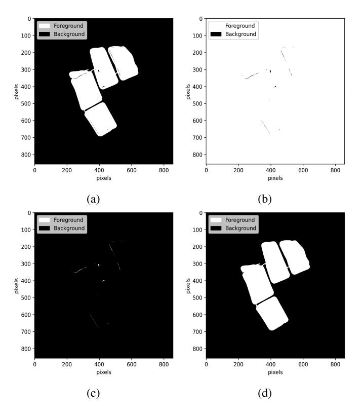

IEEE TRANSACTIONS ON AGRIFOOD ELECTRONICS, VOL. 2, NO. 1, MARCH/APRIL 2024     91

# Field-to-Field Coordinate-Based Segmentation Algorithm on Agricultural Harvest Implements

Sean J. Harkin (b), Tomás Crotty (b), John Warren (b), Conor Shanahan (b), Edward Jones (b), *Senior Member, IEEE*, Martin Glavin1, *Member, IEEE*, and Dallan Byrne1

Abstract-Establishing and maintaining farmland geometric boundaries is crucial to increasing agricultural productivity. Accurate field boundaries enable farm machinery contractors and other farm stakeholders to calculate charges, costs and to examine machinery performance. Field segmentation is the process by which agricultural field plots are geofenced into their individual field geometric boundaries. This paper presents a novel coordinate-based method to perform trajectory segmentation and field boundary detection from a tractor towing an implement. The main contribution of this research is a practical, robust algorithm which can solve for challenging field-to-field segmentation cases where the operator engages the towed implement continuously across several fields. The algorithm first isolates raw machinery trajectory data into unique job sites by using a coarse filter on geolocation data and implement power-take off activation. Next, the coordinate data is plotted and image processing techniques are applied to erode any pathway(s) that may present in job sites with adjacent working fields. Georeferenced time series tractor and implement data were aggregated from a five-month-long measurement campaign of a silage baling season in Galway, Ireland. The algorithm was validated against two unique machinery implement datasets, which combined, contain a mixture of 296 road-to-field and 31 field-tofield cases. The results demonstrate that the algorithm achieves an accuracy of 100% on a baler implement dataset and 98.84% on a mower implement dataset. The proposed algorithm is deterministic and does not require any additional labor, land traversal or aerial surveillance to produce results with accuracy metrics registering above 98%.

Index Terms-Agricultural machinery trajectory data, agricultural parcel delineation, field efficiency analysis, field segmentation, global navigation satellite system (GNSS), global positioning system (GPS), towed implement machinery.

# I. INTRODUCTION

FIELD boundary delineation is a necessary component of modernizing agricultural systems. In the European Union

Manuscript received 14 July 2023; revised 13 September 2023 and 22 December 2023; accepted 1 January 2024. Date of publication 28 February 2024; date of current version 11 April 2024. This work was supported in part by LERO, in part by McHale Engineering under the SFI Grant 13/RC/2094\_P2, and in part by the Enterprise Ireland Marie Skłodowska-Curie Career-FIT Fellowship under Grant MF-2018-0202. This article was recommended by Associate Editor S. Abd Aziz. (Corresponding author: Sean J. Harkin.)

Sean J. Harkin, Tomás Crotty, Edward Jones, Martin Glavin, and Dallan Byrne are with the Electrical and Electronic Engineering, School of Engineering, University of Galway, H91 TK33 Galway, Ireland (email: s.harkin5@universityofgalway.ie; t.crotty2@universityofgalway.ie; edward.jones@universityofgalway.ie; martin.glavin@universityofgalway.ie; dallan.byrne@universityofgalway.ie).

John Warren and Conor Shanahan are with McHale Engineering, F31 K138 Ballinrobe, Ireland (e-mail: jwarren@mchale.net; cshanahan@mchale.net).

Digital Object Identifier 10.1109/TAFE.2024.3352480

(EU), for example, all member states are signed up to a land parcel identification system (LPIS) database to record agricultural parcels [1]. An agricultural parcel is defined as a continuous area of land enclosed by a boundary that includes no more than one crop group [1]. The LPIS database is used as an administrative tool to aid in setting environmental policies and inform subsidy management bodies such as the Common Agricultural Policy (CAP) [2]. Field boundary databases, like LPIS, must be maintained to preserve their quality over time to ensure the correct distribution of annual agricultural subsidies to farmers [3]. Currently, there are three main regulatory paths to update models. 1) Farmers correct preprinted forms. 2) Farmland site visits (which are precise, but scale with cost). 3) Systematic updates by service providers to the state, e.g., *remote sensing* [3]. However, day-to-day changes in the landscape, misdeclaration of boundary areas, or obsolete orthophotos make an exact match for registered land boundaries to actual up-to-date field boundaries difficult to achieve  $[3]$ .

A significant proportion of precision agriculture (PA) systems, designed for farmland and crop management, depend on accurately maintained geofences to function  $[4]$ . These systems require that farm input data be segmented, to at least field level, as prior knowledge for information management [5] and data processing [6]. Commercial field boundary delineation services are available to farm stakeholders [7], [8]. These services generally use field boundary databases derived from satellite imagery. Alternatively, they require that customers upload geodata (such as. gis files) or delineate the field boundaries manually, using a sketching software tool.

Field boundaries may be integrated with machinery data for insight on crop and machine performance. Platforms such as ISOBlue 2.0 [9] and Cropinfra [10] provide methods to combine global navigation satellite system (GNSS) data with captured controller area network (CAN) data. Commercial operators may also provide their own in-house machinery tracking solution [11]. This facilitates access to spatio-temporal data in which the entire positional history (spatial locations with timestamps) of the moving object is recorded  $[12]$ . The spatiotemporal path of an object is also known as its *trajectory*. To analyze an object's trajectory, the trajectory data must be input as a structured recording of movement [13]. Trajectory analysis opportunities in agricultural machinery include obtaining detailed information on machinery performance, settings and errors  $[14]$ . Field efficiency for an episode of work  $[15]$ , [16], or activity at specific points within a field  $[17]$  can also

© 2024 The Authors. This work is licensed under a Creative Commons Attribution 4.0 License. For more information, see https://creativecommons.org/licenses/bv/4.0/

92 IEEE TRANSACTIONS ON AGRIFOOD ELECTRONICS, VOL. 2, NO. 1, MARCH/APRIL 2024

Fig. 1. Algorithm overview. In Stage I data preprocessing, machinery trajectory data are filtered into job sites; by speed and power take-off activity. The conjoined field site, highlighted in red, is passed to Stage II. In Stage II, the algorithm removes pathways between fields and isolates their geometric boundaries. First, the conjoined site is plotted as a sampled image; the pathway pixels are then removed by applying a series of morphological image operations. The segmented fields are shown in the Result and Analysis, where the algorithm has successfully differentiated between this conjoined field use case. A field efficiency analysis of machinery performance is then shown in the histogram plot, where the colors correspond to the detected field boundaries.

be determined when accurate field geometric boundaries are delineated.

Beyond the postprocessing of recorded data, field boundaries may also be applied in activity planning and predictive applications. Examples include farm machinery automation technologies, such as machinery guided navigation systems [18] and path planning algorithms [19]. Field boundaries may also be used to monitor in-field application rates of additive materials recorded from machinery  $[20]$ . This is relevant at a time when the EU aims to halve pesticide use by 2030 under the farm-tofork strategy [21]. Proximal sensing applications on agricultural machinery [14], [22], [23] may play a role in satisfying PA data requirements [5], but the data must first be spatially classified. The required resolution is application dependent, however, isolating machinery data to inside a field geometric boundary is an essential step prior to processing agricultural machinery data.

To segment machinery trajectory data into field boundaries, agricultural data mining algorithms may apply a coarse filter [timestamps, speed, power take-off activation (where present)]. However, the complexity will increase for field-to-field cases,

i.e., machinery moves between adjacent fields that share a common boundary. Manual methods may be used for difficult segmentation cases, incurring a significant labor and time cost. However, to make data analysis of agricultural machinery practical for industrial scale application, agricultural machinery trajectory segmentation must be automated  $[6]$ .

The authors of this article present a novel method to automatically segment machinery trajectory data from farming implements, namely, a silage baler and a mower, into individual field boundaries. Fig. 1 presents an overview of the algorithm's approach to solving for field geometric boundaries. The method is evaluated with geolocation and power take-off (PTO) digital event data obtained from a full harvesting season on machinery operated by a grass silage contractor. Contractors will often visit multiple adjacent fields in a single day, where they continue to activate the PTO, despite traversing into a new field. In the context of this article, a "job site" is a recorded work episode of the operating machinery performing a task in one or several fields of the same crop type. A work episode indicates that the machine is operating and that the PTO shaft is

HARKIN et al.: FIELD-TO-FIELD COORDINATE-BASED SEGMENTATION ALGORITHM 93

providing power, with all systems functioning while moving. A job site may contain a single field or a conjoined field work episode. An example of a conjoined field job site is shown in Fig.  $2(a)$ . The fields are conjoined by the operator moving between the adjacent fields via a short, off-road pathway. Segmentation is the process of detecting the individual field boundaries in a job site and labeling positional data as belonging to a particular field. The contributions of this article is as follows.

- 1) The proposed algorithm solves for field geometric boundaries from agricultural machinery data; requiring only GNSS data and a PTO-pulsed digital sensor to detect PTO activation.
- 2) The algorithm has been evaluated over 327 job site locations from a five-month-long measurement campaign with a machinery contractor. The algorithm is evaluated with data from two unique harvesting implements, highlighting how the method may be used with other types of implements.
- 3) The deterministic algorithm is designed to segment agricultural machinery trajectory data without the use of machine learning methods.
- 4) The results demonstrate that the algorithm can solve for both road-to-field and field-to-field segmentation cases.
- 5) No additional labor, land traversal, or aerial surveillance is necessary to produce the results shown, offering a costeffective, straightforward solution to existing mechanized practices.

The next section will review existing research related to tackling field segmentation, and illustrate why the solution offered in this article improves on the state of the art.

# II. RELATED WORK

Existing field segmentation techniques can be divided into two categories: remote sensing and coordinate-based methods.

## A. Remote Sensing Methods

Remote sensing field segmentation techniques are based on the use of image capture technology to detect field boundaries. Remote sensing imagery can be captured using satellites [\[24\]](#page-9-1), [\[25\]](#page-9-1), [\[26\]](#page-9-1), [\[27\]](#page-9-1) piloted aircraft [\[28\]](#page-9-1) or drones [\[29\]](#page-9-1). These methods rely on medium (4 and 2.8 m [\[26\]](#page-9-1)); to high ( $0.15 \text{ m }$  [\[28\]](#page-9-1)) resolution RGB capture, or on multispectral images [\[27\]](#page-9-1).

Field segmentation by remote sensing offers the opportunity to batch segment large areas of land. North et al. [27] demonstrate their method using time-series satellite images covering a study area of 4000 km2. Provided the images are updated frequently, or the field boundary is static, remote sensing enables for preemptive mapping before the machinery enters. A situation may arise where an operator decides to erect a temporary fence within a field, or decide to only fertilize a part of the field. In these scenarios, the job parameters have changed, and the historic remote sensing geofence may require alteration to fit the completed job. Furthermore, fine and transitory boundaries, such as an electric fence, would be imperceptible to low-resolution satellite cameras. Satellite images are available to the public through

Fig. 2. (a) Example of a conjoined field job site. The fields share a common boundary and are connected by an off-road path. Visually, the divide between fields is clear, but the divide is not apparent in the raw trajectory data. (b) Example of a hollow, single field job site. In round silage baling it is not uncommon for the machinery operator to only bale the field perimeter. The central region of the field may be left for hay.

the European Space Agency Sentinel-2 project. Sentinel-2 offers a resolution of up to  $10 \text{ m}$ , with a revisit frequency of five days at the Equator [30]. However, to obtain images of sufficient spatial resolution, frequent image acquisition from commercial satellites may be required.

Aerial methods are vulnerable to cloud cover [5], which can affect the segmentation accuracy. The trained model in  $[31]$ performed well when processing nonobscured images but performance degraded when tested with images containing cloud cover and delineating densely packed farmland of similar color. Aeroplanes and drones are subject to constraints such as flight regulations [32] and are limited by weather conditions and flight time [33]. Operators must conform to these constraints and obtain adequate training, which incurs an additional labor cost in addition to the operating expenses of the aircraft.

The limitations of remote sensing methods for field segmentation have been identified. The remainder of this section examines the literature on ground, coordinate-based methods for field segmentation and road vehicle trajectory segmentation problems.

## B. Coordinate-Based Methods

Coordinate-based techniques involve the use of geolocation and/or operational data from ground-based machinery in motion to detect field boundaries. Field segmentation may be performed using coordinate-based trajectory segmentation methods [34], [35], [36], [37], [38]. An advantage of segmentation by this method is that it offers a job-specific context to machinery operational data. Changes to field boundaries are accounted for based on the working pattern completed by the machinery operator.

Trajectory segmentation of vehicular data has been made possible by location-aware devices being able to connect to the Internet [39]. According to Spaccapietra et al. [13], the degree of segmentation for an object's trajectory should be driven by the semantics behind the object's goal in that trajectory. Thus, it is not necessary to know the exact goal, but it is enough to know that the object is motivated by such  $[13]$ .

94 IEEE TRANSACTIONS ON AGRIFOOD ELECTRONICS, VOL. 2, NO. 1, MARCH/APRIL 2024

Based on this, the general approach to segmenting a trajectory is to classify the data into trips and activities. The object will take a trip to some destination and may perform an activity there. E.g., The operator drives the machinery from the depot [trip], to a field [destination], and bales [activity], in that field. This example scenario illustrates that field segmentation could be observed as a vehicle trajectory segmentation problem. However, when the fields are adjacent, such as that illustrated in Fig.  $2(a)$ , the trip segment between activities is significantly reduced, which may complicate the segmentation process.

The current literature on road vehicle trajectory segmentation papers has limited potential for application in an agricultural setting. A significant proportion of methods are based on establishing policies and exploiting gaps in the raw data  $[40]$ ,  $[41]$ , [42], [43]. Policies may be based on speed, direction, start-end, stop-move, time intervals, and predefined geo-fenced regions to segment trajectories. Such policy concepts do not crossover to agricultural applications. Start-end locations may not be known a priori. Stop-move locations depend on assumptions about operator driving behavior and machine operation. In baling, for example, the operator must stop the vehicle to drop the formed bales and replace the bale net.

Road vehicle data may be segmented using map-matching techniques [44]. These methods rely on correlating trajectories to road network databases by using a similarity score, as defined by the author. This could be useful for cases of agricultural machinery traveling on roads between fields, however, not for cases of adjacent fields connected by short, off-road pathways as highlighted in Fig.  $2(a)$ . Moreira and Santos [45] devised an approach to obtain the convex or concave hull perimeter of a given set of points using a k-nearest neighbours approach. In a concave shape, a straight line can be drawn between two points within the shape, that goes out of bounds. The set of conjoined fields shown in Fig.  $2(a)$  delineate a concave shape. When applying the algorithm presented in [45], users must tune the  $k$  parameter to adapt the shape of polygons output by the algorithm. Adapting the algorithm presented for conjoined field segmentation may require manual intervention to adjust parameters per job site to account for unique shapes, sizes, and numbers of fields.

Yan et al. [43] annotated trajectory episodes using road networks and third-party knowledge sources points of interest  $(e.g.,$ home markers-based off social media data). These are layered on top of episodes to derive context from the trajectory. Elements of this approach could be useful, like establishing a home geo-fence for the machinery. Acquiring land use and road network data may not be practical in remote locations, however, and may require the acquisition of sensitive personal information. Guo et al. [46] offered an approach to segment on-road vehicle global positioning system (GPS) trajectory data using probabilistic logic on vehicle data and positional data. The method relies on vehicle CANbus and GPS data, in addition to historical business data (e.g., delivery service transportation), to group repetitive driving patterns. Agricultural machinery contractors usually have irregular schedules that are difficult to predict due to weather conditions and time constraints involved in harvesting.

Zhang et al. [34] presented a field segmentation expert system algorithm to classify on-road and in-field activities of machinery using GPS data. The algorithm is based on a set of if-then decision rules including: speed, density of points, and propagating straight line road points. Expert algorithms, such as this, depend on specialized rules defined by human experts that must be adapted for different machinery.

Coordinate-based field segmentation may also be approached as a clustering problem. Clustering using the density-based spatial clustering applications with noise (DBSCAN) algorithm  $[47]$  has been applied to GPS trajectories to identify stop points in road vehicles  $[48]$  and mobile phone applications  $[49]$ . The authors in  $[35]$  and  $[36]$  apply DBSCAN to segment tractor GPS trajectory data. DBSCAN operates on the assumption of point density  $[47]$ ; though it is not uncommon in round silage baling for an operator to only bale the field perimeter and leave the central region of the field for hay, such as that shown in Fig.  $2(b)$ . Despite this, the algorithm presented in [35] is capable of segmenting cases of hollow fields.

Chen et al. [35] state that DBSCAN alone is not sufficient, therefore, directional inference rules are used to correct false field points and false road points increasing the overall performance from 87.65% to 95.60%. Zhang et al. [36] paired DBSCAN along with sophisticated image object detection algorithms such as YOLOV4; Swin-S Mask R-CNN, and Dynamic RCNN. The best result is selected using a Davis Bouldin index. The authors conclude that the object detection algorithms must be manually selected for the given dataset.

Zhang et al. [37] trained two decision tree algorithms from European Geostationary Navigation Overlay Service (EGNOS) and real-time kinematic (RTK) trajectory datasets containing three field plots each. The authors conclude that the model trained using RTK data is most effective for field segmentation. Chen et al. [38] designed and trained a graph convolutional network (GCN). The developed method was validated by the harvesting trajectories of two crops, wheat and paddy. GCNbased road-to-field classification achieved 88.14% and 85.93% accuracy for the wheat data and the paddy data, respectively. Comparisons made by the authors demonstrated that the developed method consistently outperformed the current state-of-theart road-to-field classification methods by  $1.9\%$  for the wheat data and 5.7% for the paddy data.

However, test cases shown in all previous works  $[34]$ ,  $[35]$ , [36], [37], [38] do not include conjoined field segmentation conditions as illustrated in Fig.  $2(a)$ , only road-to-field cases. Instances of isolated fields, connected by a road in between, may be solved using a Hall effect sensor for cases of towed implements. These sensors can be purchased for under €5 [50]. This is sufficient to detect when the PTO is active and the implement is mechanically powered, which indicates, along with implement motion, that the machine is interacting with the crop. The inverse is true when the PTO is inactive and the implement is in motion, which allows for the detection of road travel. Thus, a significant challenge in coordinate-based field segmentation remains in solving for conjoined, field-tofield cases when the operator moves between adjacent fields connected by short, off-road pathways. This is one of the key

HARKIN et al.: FIELD-TO-FIELD COORDINATE-BASED SEGMENTATION ALGORITHM 95

contributions of this study to field segmentation using coordinate-based methods.

There are a limited number of examples in the literature where field segmentation is performed using machinery coordinate data. This is despite the fact that GPS is a proven, robust, and readily available technology. The review highlights how existing vehicular trajectory segmentation methods do not translate well to the field segmentation problem. Common trajectory segmentation policies either require a priori knowledge of machinery operator behavior and their driving patterns; geo-markers from third party sources; or rely on using established road networks. These concepts and methods do not crossover to an agricultural setting. To the best of the authors' knowledge, challenging conjoined field segmentation cases have not been addressed in the current literature. A cost-effective coordinate-based solution to automatically segment agricultural fields is required.

# III. MATERIALS AND METHOD

A coordinate-based method is presented to overcome the challenges highlighted in Section II. First, the data acquisition from two harvesting implements is outlined in Section III-A. Then, the proposed algorithm is presented in two stages. In Stage I, measurements are preprocessed to determine whether PTO activation has occurred and if road travel has taken place between activation periods, as described in Section III-B. In Stage II, pathways that may be present between adjacent fields in the sampled image are removed by applying a series of morphological image operations. The algorithm then detects the individual field boundaries from the processed image. Finally, the field boundaries are converted back to Cartesian and the machinery coordinate data are labeled as belonging to a particular field, with details given in Section III-C. The method is fully automated, deterministic, and segments all fields in a job site in one pass.

## A. Data Capture

Georeferenced time series implement data were collected on two implements; a 2013, 540 r/min, McHale Fusion 3 Plus baler-wrapper [51] and McHale Proglide R3100 mower [52]. A custom electronic control unit (ECU) was programmed to relay data from the implements across a J1939/CAN network  $[53]$  to a Deutz-Fahr Agrotron 6180 [54] and a John Deere 6150R [55]. The machinery was owned and operated by a machinery contractor based in Galway, Ireland, as detailed in [56]. For machinery coordinates, a NEO-M8 GNSS positioning receiver with a wideband GNSS antenna was fitted to the implements [57]. The acquisition frequency of the GNSS is 1 Hz. PTO speed was measured using an NPN digital hall-effect sensor [50] installed on the implement drivetrain sprocket with a protruding notch. Pulse counts were translated to frequency, which are represented as the PTO rotations per minute (rpm). Fuel usage measurements were obtained from the tractor J1939 interface. The data were stored locally in a document-based database operating on an 8th generation Intel Nuc (Intel i3 processor and 4 GB of RAM) running Ubuntu 16.

TABLE I 

RESULT FROM STAGE I ON THE BALER TRAJECTORY DATA SHOWING THE    
NUMBER OF SINGLE AND CONJOINED FIELD SITES IN THE BALER DATASET 

| <b>Fields per Site</b> | <b>Site Count</b> |
|------------------------|-------------------|
| 1                      | 134               |
| 2                      | 19                |
| 3                      | 2                 |
| 4                      | 0                 |
| Total                  | 155               |

TABLE II

RESULT FROM STAGE I ON THE MOWER TRAJECTORY DATA SHOWING THE
NUMBER OF SINGLE AND CONJOINED FIELD SITES IN THE MOWER DATASET

| <b>Fields per Site</b> | <b>Site Count</b> |
|------------------------|-------------------|
| 1                      | 162               |
| 2                      | 9                 |
| 3                      | 0                 |
| 4                      | 1                 |
| <b>Total</b>           | 172               |

## B. Stage I: Data Preprocessing

In preprocessing, unique job sites are determined from the measurement campaign by coarse filtering the raw machinery trajectory data. At this stage in the process, it is acceptable to label several fields from a single work episode as belonging to one site.

A site is determined by the filtering rules listed below.

- 1) Periods where the PTO remains active ( $\geq 400$  r/min).
  - a) In scenarios where normal machinery operation is interrupted and the operator must stop the PTO, the data are segmented if the Euclidean distance from the PTO stop location is greater than 40 m to the PTO restart location. (In the recorded datasets, operators may stop and restart the PTO during harvesting operations in a field. The most common example is to deal with blockages. This may not be representative of all implements).
- 2) Machinery operation continues without stoppages ( $\geq$  $120 \text{ min}$ ) between operations.
- 3) Machinery speeds do not exceed 8 m/s during in-field operation. (In the recorded datasets, operators do not exceed this speed during harvesting operations in a field, only on the road between job sites. This may not be representative of all implements).

The results of the filtered trajectories based on the policies listed above are shown in Tables  $I$  and  $II$ .

## C. Stage II: Path Removal

Once the raw machinery trajectory data have been filtered into job sites, the algorithm moves to Stage II, Path Removal. Fig.  $3$  describes the procedure; the process is divided into six steps. Each step is labeled alphabetically and will be referred to throughout this section. The goal of this stage is to remove pathways between fields and isolate field geometric boundaries

96 IEEE TRANSACTIONS ON AGRIFOOD ELECTRONICS, VOL. 2, NO. 1, MARCH/APRIL 2024

Fig. 3. Algorithm Stage II Path Removal, described in Section III-C shown as a visual. Steps are labeled alphabetically. The goal of this stage is to erode pixels representing the off-road connecting pathways between conjoined fields and isolate field geometric boundaries. (a) Sampled Coordinate Plot Image: Filled polygon of the job site coordinate data. Foreground pixels represent field objects. (b) Flood Fill: Holes inside the field objects are eliminated. Fig. 5 presents a detailed version of this step. (c) Erosion and Dilation: The erosion operation removes the pathway pixels segmenting the field objects. A dilation operation is then applied to restore field object boundary pixels that were eroded. The individual field objects are now isolated. (d) Find Field Contours: Field object pixel boundaries are detected and labeled. (e) Label Coordinate Data: Detected boundary pixels are converted to Cartesian and overlayed onto the original job site data.

in job sites output from Stage I. This is achieved by applying a series of morphological image operations to a sampled image of the coordinate data.

*a) Sampled Coordinate Plot Image:* The coordinate data of a site, output from Stage I, is sampled to create a binary, coordinate 

plot image as illustrated in Fig. 3(a). First, the GNSS data is mapped to a Cartesian plane using a coordinate reference system (CRS) transformation python library [58], specifically from latitude and longitude CRS ESPG:4326 to Cartesian CRS EPSG:27700. Coordinate data where the vehicle is not moving

HARKIN et al.: FIELD-TO-FIELD COORDINATE-BASED SEGMENTATION ALGORITHM 97

 $speed = 0$ ) are filtered out. This is a regular occurrence in the baler dataset where the baler stops to: tip wrapped bales; replace used wrap or net; deal with machine blockages, or remove obstacles from the path. Outlier coordinate points can also occur on a GNSS cold start [59]. This scenario could arise if power to the implement (which powered the custom ECU) was disrupted. These are removed if they are not within 800 m of the centroid coordinate of the site (empirically derived from the size of job sites in the baler and mower datasets). Next, the Euclidean distances between consecutive points (ordered by timestamp) are calculated and defined as follows:

$$
|p_{n+1} - p_n| \,\forall \, n \in \{0, 1, 2, \dots, N-1\} 
$$

(1)

where  $N$  denotes the number of coordinates measured at a site. Consecutive points must be within 10 m of each other. Points measured greater than 10 m from each other are classified as discontinuous; the data are separated into distinct lists at each discontinuity, to be processed separately for plotting. Partitioning the site data into separate lists at these discontinuities ensures that trajectory line plots are not drawn across fields. This accounts for gaps in the GNSS data capture and filtering errors that may arise from Stage I.

Each list is interpolated by a factor of two and are plotted as individual lines. Next, we create a filled polygon from each plotted line, using the matplotlib fill polygon function  $[60]$ . A filled polygon must be closed, signifying that the polygon edges are connected from beginning to end (i.e., edge lines start at one point, and finish at the same point).

All sites are plotted inside a constant boundary box of 450 by 450 m. These were the largest dimensions observed in the baler and mower datasets. The plot is saved as a. png image with dimensions  $857 \times 857$  pixels. The saved image includes a padding of 22 pixels on either side. Discounting the padding, there are 813 pixels to represent 450 m in each direction. Thus, the pixel per meter resolution is  $450/813 = 0.55$  m per pixel. 0.55 m per pixel was chosen as the GNSS receiver sampling rate was 1 Hz. This allowed the method to adequately capture the transitions of any vehicle traveling above 2 km/hr.

The result is a filled polygon of the site coordinate data, as illustrated in Fig.  $3(a)$ . The white pixels in the image represent field objects. The black pixels represent the background, nonfield regions. In the following steps, we wish to isolate these field objects from each other by removing the field pathway pixels connecting them.

A scenario where the operator starts a job in one field, and finishes in another field, is shown in Fig. 4. The line segment, necessary to close the filled polygon (from the job end point to the start point) can be observed along the dashed red line illustrated in Fig.  $4(a)$ . Consequently, the closing polygon edge is drawn across several fields and the pathways between field objects are obscured. To solve, the coordinate site data are redefined by forcing the end point to be the same as the start point. A solution is obtained by solving for a set of points that provide an *end-to-start path* from the end to start point; the path is then appended to the original sampled coordinate image plotting data.

Fig. 4. (a) Example job site where PTO activation starts in one field and ends in another field. The matplotlib fill polygon function will close the filled polygon across the fields, as represented by the Start to End Edge. (b) End to start path is calculated using only existing site coordinates. The path is appended to the sampled coordinate image plotting data. The start and end point are now the same, meaning that the closing polygon edge is not drawn across fields.

The end-to-start point path, as represented by the dashed red line in Fig.  $4(b)$ , is calculated by first obtaining the spatial distance matrix; a 2-D array of Euclidian distances between all possible pairwise combinations of job site coordinates. The distance matrix is subsequently used to create an adjacency matrix. Points within a four meter radius of each other are labeled adjacent. The adjacency matrix is converted into a set of nodes, adjacent nodes are connected by edges. A shortest path algorithm, using unweighted graph methods, is applied [61]. The calculated path is then appended to the sampled coordinate image plotting data. The start and end points are now the same, meaning that the closing polygon edge is not drawn across fields.

Once the sampled coordinate image is obtained, it must be further processed to remove holes inside the field objects as shown in Fig.  $3(b)$ .

b) Flood Fill: Flood fill [\[62\]](#page-6-1) is an image processing tool that assigns contiguous pixels with a new value. It can be used as a technique to eliminate holes in binary images. Holes are defined as black, background pixel regions enclosed by white, fore-ground pixel regions (field objects). Holes, as seen in Fig.  $3(a)$ , can present in field objects in two ways. Either in the data collection process when the machinery operator must navigate around obstacles in a field, or from the matplotlib fill polygon function. The flood fill operation, as illustrated in Fig.  $3(b)$ , is expanded in Fig. 5. It is necessary to fill these holes before solving for field boundaries. Otherwise, holes inside the field objects will be detected as field boundaries.

A designated starting pixel must be defined before starting the flood fill process. Pixel  $(0, 0)$  is selected as the starting pixel, its value is denoted by its color (black). The image padding added when creating the sampled coordinate image ensures pixel  $(0, 0)$  is part of the image background for every sampled coordinate image. All pixels, interconnected with the starting pixel by sharing the same value, are assigned a new value (white). By flooding the interconnected background pixels, this isolates the holes inside field objects.

Fig.  5(a)  shows the original image. Note the black holes inside the field objects. The image post flood fill is shown in Fig.  $5(b)$ , the only remaining background regions are the field object holes.

98 IEEE TRANSACTIONS ON AGRIFOOD ELECTRONICS, VOL. 2, NO. 1, MARCH/APRIL 2024

Fig. 5. Detailed illustration of the flood fill operation initially presented in Fig.  $3(b)$ . (a) Sampled plot coordinate image shows the field objects enclose several holes. (b) Flood fill of the background starting at pixel  $(0, 0)$ . The remaining background regions are the holes. (c) Perform a binary image inversion, the holes are now labeled as foreground regions. (d) Inverted image is combined with the original image eliminating all field object holes.

Next, the image output from the flood fill operation is inverted, as shown in Fig.  $5(c)$ . Finally, the inverted flood filled image is combined with the original image in Fig.  $5(a)$ . The resultant image is shown in Fig.  $5(d)$ . The erosion and dilation image operations, to remove field object connecting pathways, can now take place.

c) Erosion and Dilation: Erosion is a morphological image processing technique that can be used to segment connected image objects. Six iterations of a  $2 \times 2$  kernel (pixels) are applied to the flood fill output presented in Fig. [3\(b\)](#fig-3b). The operation segments the field objects by removing the pathway pixels in the sampled coordinate image. In addition, the boundary pixels of the field object are eroded. Therefore, a dilation operation (inversion of erosion), of the same kernel size and number of iterations, is applied to restore the field objects to their original size. The result is illustrated in Fig. [3\(c\)](#fig-3c). Note that the pathways between field objects are not restored. It may also occur that the dilation operation does not restore all field object boundary pixels that were previously eroded. This is likely to occur on fields which contain tight angled corners. The impact is that some coordinate points at the field perimeter may fall outside the field boundaries detected in the find field contours operation, and be mislabeled as path points.

The field objects are segmented, the algorithm can move onto the next stage to determine the field boundaries as shown in Fig.  $3(d)$ .

d) Find Field Contours: Contours are a curve that joins a set of continuous pixels along a boundary that have the same pixel value (color) [\[63\]](#page-6-1). Since the field objects are now disconnected, contours can be drawn around the field object edges to represent the field boundaries. To locate the field contours, a border following algorithm, presented in [\[64\]](#page-6-1), was used via OpenCV. The output of which is illustrated in Fig. 3(d).

The pixel area of each contour polygon is obtained. This allows the proposed algorithm to ensure that incorrectly iso-
lated regions are not designated as a false positive (over-segmentation). The lower limit for contour area is 1000 pix-
els squared. Converting this back to Cartesian equates to 0.3 Hectares or  $3000 \text{ m}^2$ . An assumption is made that a standalone
job is not taking place in a field of such a limited area. An isolated region can arise when, for example, performing a "bulb-pattern"
turn at the headland regions when the machine finishes an operation on a linear row. An example of a bulb turn is shown in
Section IV, in the left-hand corner of Figs.  $7(c)$ . The erosion and dilation operation performed in Stage II, isolates the bulb turn
from the main body of the field and is detected as a potentially different field. The contour area of the turn is, however, below
the 1000 pixels squared limit and thus, disregarded as path coordinates.

e) Label Coordinate Data: In the final step of Stage II, the detected field boundary pixels are converted to Cartesian. The converted field boundary coordinates are then used to create a set of polygons to check which machinery trajectory coordinates points they enclose. Fig.  $3(e)$  shows the algorithm result, the coordinates are colored with respect to the segmented field boundary by which they are enclosed. Coordinates not inside a field boundary are labeled as path points and are highlighted in black.

The next section will validate the presented method against two machinery implement datasets, the generation of which is described under Section III-A. To benchmark the algorithm, the field boundaries detected by the algorithm are compared to manually annotated field delineations.

# IV. EXPERIMENTAL RESULTS

The algorithm was validated against two implemented job site datasets. Tables I and II, discussed in Section III-B, show the baler and mower datasets contain 21 and ten cases of conjoined field sites, respectively. The remaining job sites contain singular fields. Job site measurements were uploaded to Google My Maps and the field geometric boundaries were manually delineated by the authors to verify the contained number of fields. These were then visually compared to the field boundaries output by the algorithm. Two examples of hand-drawn field boundaries for a single field and conjoined field job site are shown in Fig. 6.

Measurements from each site were treated as unique data; the baler and mower may have visited the same harvest site, however, both implements will traverse the same sites differently due to distinct implement widths and driving patterns. Historical knowledge of geofencing sites was not considered for this study.

HARKIN et al.: FIELD-TO-FIELD COORDINATE-BASED SEGMENTATION ALGORITHM 99

Fig. 6. (a) Baler job site 23 GNSS satellite map. (b) Hand-drawn annotation of the job site showing that there is one field. (c) Baler job site 39 site GNSS satellite map. (d) Hand-drawn annotation of the job site showing that there are two fields conjoined.

Any user-defined variables are set consistently throughout and are described in Section III.

The results are presented in the form of confusion matrices (CM). There are two CMs in total, one for each machinery implement dataset. Tables  $III$  and  $IV$  show the algorithm performance on the baler and mower implements, respectively.

- 1) True positive marks correct detection and segmentation of a conjoined field job site.
- 2) True negative marks correct detection and segmentation of a single field job site.
- 3) False positive marks incorrect detection and subsequent over-segmentation of a job site.
- 4) False negative marks incorrect detection of a single field job site, or under-segmentation of a conjoined field job site.

## A. Baler Field Segmentation Results

Table  $\text{III}$  shows that out of 21 conjoined field sites, all 21 are correctly detected and segmented into their individual field geometric boundaries. There are no cases of false positives or false negatives.

An example of the algorithm output on the baler dataset is shown in Fig. 7. Fig.  $7(b)$  and  $(d)$  shows the segmentation results for a single field and conjoined field job site; these are the same job sites presented with hand-drawn field boundaries in Fig 6. Fig. 7(h) illustrates a three-field conjoined case. Fig. 7(f) shows

TABLE III 

OVERALL SEGMENTATION CONFUSION MATRIX FOR THE BALER DATASET

|                  |               | Actual Site Layout       |          |
|------------------|---------------|--------------------------|----------|
|                  |               | Conjoined                | Singular |
| Algorithm Output | Segmented     | 21                       | 0        |
|                  | NOT Segmented | 0                        | 134      |

|                                             |               |          |
|---------------------------------------------|---------------|----------|
| Overall Accuracy |               | $(21 + 134/155) = 100\%$ |          |

TABLE IV 

OVERALL SEGMENTATION CONFUSION MATRIX FOR THE MOWER DATASET

|                                             |               | Actual Site Layout |          |
|---------------------------------------------|---------------|--------------------|----------|
|                                             |               | Conjoined          | Singular |
| Algorithm output                            | Segmented     | 10                 | 1        |
|                                             | NOT Segmented | 1                  | 160      |

|                                             |               |                    |          | 
|---------------------------------------------|---------------|--------------------|----------|
| Overall accuracy $(10 + 160/172) = 98.84\%$ |               |                    |          |

a case of a hollow conjoined field site, where the monitored baler only processed the swathes on the edges of the fields. The authors can only speculate that this was due to a decision to bale the inner swathes as hay (unwrapped drier fodder), with a separate baling implement. The algorithm can still appropriately label the coordinates of each hollow field from the detected field boundaries.

The minimum Euclidean distance measured between segmented fields was observed in baler site 97, shown in Fig.  $7(f)$ , at  $4.5 \text{ m}$ . This is the smallest distance between conjoined fields which the algorithm is tested against. Fig.  $7(c)$  shows a case where a headland bulb turn in a field is labeled as a path. This can be explained by the 

erosion and dilation operation in Stage II. The bulb turn pixels are isolated from the main field object body when the erosion operation is applied to the sampled coordinate image. The bulb turn area is deemed too small by the algorithm to be classified as a unique field, therefore, the in-field bulb turn coordinate points are labeled as a path.

The algorithm achieves  $100\%$  accuracy on the baler dataset. The machinery operator loops the outer perimeter for each field enclosing the coordinate space with a uniformly separated perimeter. Thus, valid sampled coordinate images are formed, as shown in Fig.  $3(a)$ . This enables the remaining steps of Stage II to function correctly. The next section reviews the performance of the algorithm on the mower dataset.

## B. Mower Field Segmentation Results

Table  IV  shows ten conjoined sites are correctly segmented into their individual field geometric boundaries. Table IV also shows there is one false negative case and one false positive case recorded.

An example of the algorithm output on the mower dataset is shown in Fig. 8. Fig.  $8(d)$  shows a case where the operator activates the PTO outside the single field site. The algorithm correctly identifies the path points. Fig.  $8(g)$  illustrates the performance of the four field conjoined site used to describe Stage II, Path Removal.

Fig. 9 illustrates the false negative case. It is labeled as such because the algorithm does not detect a valid field on the job

100 IEEE TRANSACTIONS ON AGRIFOOD ELECTRONICS, VOL. 2, NO. 1, MARCH/APRIL 2024

Fig. 7. Examples of the algorithm output on the Baler dataset. Segmented fields are denoted by their color. (a) Baler site 22. (b) Baler site 23. (c) Baler site 35. (d) Baler site 39. (e) Baler site 77. (f) Baler site 97. (g) Baler site 119. (h) Baler site 135.

Fig. 8. Examples of the algorithm output on the Mower dataset. Segmented fields are denoted by their color. (a) Mower site 3. (b) Mower site 38. (c) Mower site 75. (d) Mower site 78. (e) Mower site 110. (f) Mower site 135. (g) Mower site 153. (h) Mower site 165.

site. This occurs because the operator does not complete a loop of the outer perimeter as seen in Fig.  $9(a)$ . The product is a field object that is not fully formed. The remaining steps of Stage II cannot function correctly. The result is several foreground areas that do not meet the minimum area requirement to be considered valid fields, as seen in Fig.  $9(c)$ . Similarly, the operator does not loop the field perimeter for the single field site shown in Fig. 10. However, in this scenario, the job site is detected as a conjoined field site and over-segmented by the algorithm, and thus labeled as a false positive.

The algorithm can mislabel coordinates at the field corners as path points; examples can be seen in the bottom right-hand corners of Fig.  $7(c)$  and  $8(a)$ . This can occur at the field corners when the machinery operator takes a sharp turn. The points are mislabeled due to unrestored boundary pixels introduced by the

erosion and dilation operation in Stage II. This problem was identified but not pursued, as it did not affect the core objective of the article, which was to solve for conjoined field segmentation cases in machinery trajectory data.

Overall, the algorithm performs robustly on different machinery implementation datasets obtaining 100% and 98.84% on a baler and mower dataset, respectively. The results have demonstrated that the algorithm presented in this article is suitable to solve both road-to-field and field-to-field cases.

## C. Field Analysis

Baler and mower field efficiency histogram plots are shown in Fig. 11 to illustrate the opportunity, offered by the algorithm, to analyze job site machinery operating data at a field-level.

HARKIN et al.: FIELD-TO-FIELD COORDINATE-BASED SEGMENTATION ALGORITHM 101

Fig. 9. Algorithm false negative. (a) Mower job site coordinate measurement plot showing that the operator does not loop the field perimeter. (b) As a result, the matplotlib fill polygon function does not form a filled polygon of coordinate data. The field object is instead indented with background regions. (c) Field object is segmented into small foreground regions post erosion and dilation operation, Stage II. The detected field boundaries areas are too small and the result is a false negative.

Fig. 10. Algorithm false positive. (a) Mower job site coordinate measurement plot showing that the operator does not loop the outside field perimeter. (b) Two field objects are created post erosion and dilation operation, Stage II. (c) Algorithm detects two field boundaries.

The histogram plots compare field efficiency calculations for four job sites presegmentation, to the individual fields postsegmentation. Epochs were defined by extracting timestamps from the labeled fields coordinates output by the algorithm. The algorithm described in Moreira et al. [45] was then applied to obtain the area of the conjoined fields and of the segmented fields. Baler and mower operation variables were then averaged over area to examine field output and machinery performance. Each histogram measures: Area measured in hectares, bales per hectare (BPH), time per hectare (TPH) measured in minutes, and fuel per hectare (FPH) measured in litres. (1 hectare is equivalent to 10 000 square meters). The blue bars represent the original conjoined field data and the orange, green, and red bars represent each segmented field's data.

Fig.  11(a)  and (b) illustrates baler field efficiency analysis plots for job sites 39 and 119. The plots show that by segmenting sites into individual fields, a finer resolution of analysis is achieved highlighting that the number of bales produced is proportional to the fuel and time consumed. For example, in the field 1 of site 39, bales are made at a rate of 27 BPH, while in field 2, the machine produced 22 BPH. The differences productivity here may be due to crop quality or fertilizer applied in the field, etc.

In terms of the mower, Fig.  $11(c)$  and (d) presents analysis for sites 75 and 135. In general, these graphs show less variability

between field splits. This can be explained by mower operation which generally runs into fewer stoppages and does not require in-field changes of consumables, which frequently occur in combi-baling.

The histogram plots presented showcase the advantages of using the proposed algorithm. The plots can be used to inform the machinery operator and farmer which fields had higher yields; took more time; consumed more fuel. The land owner can also utilize this information to for example better prepare for the next harvest

# V. CONCLUSION

This article presents a field-to-field coordinate-based segmentation algorithm to delineate implement associated agricultural machinery trajectory data into farmland geometric boundaries. The algorithm was evaluated on two unique georeferenced time series implement datasets, containing a mixture of 296 road-tofield and 31 field-to-field segmentation cases. All measurements were obtained by monitoring a machinery contractor throughout the 2020 grass silage harvesting season. The results show that the proposed algorithm registers an accuracy of  $100\%$  and  $98.84\%$ on a baler and mower datasets, respectively. To the best of the authors' knowledge, examples of field-to-field conditions solved in this article have not been addressed in the current

102 IEEE TRANSACTIONS ON AGRIFOOD ELECTRONICS, VOL. 2, NO. 1, MARCH/APRIL 2024

Fig. 11. Baler and mower field efficiency histogram plots. Each histogram compares statistics based on the overall job site (conjoined fields) versus statistics based on the individual, segmented fields. The plots indicate that by segmenting machinery coordinate and sensor data from a conjoined site into individual fields, differences in productivity and inputs consumption across fields can be identified. (a) Baler site 39 field analysis. (b) Baler site 119 field analysis. (c) Mower site 75 field analysis. (d) Mower site 135 field analysis.

coordinate-based field segmentation literature. Within the literature, remote sensing methods offer similar delineation metrics, however, these techniques are neither cost-effective or accessible to farmers with small holdings. Coordinate-based solutions, like the one presented in this article, offer a practical solution to field boundary mapping on account of the technology and the cost of the equipment used; a negligible expense when compared to the price of implements or tractors.

The impact of this article is a novel coordinate-based solution, requiring only GNSS data and a machinery implement switch sensor, to provide a robust and accurate technique to boundary delineation of a field; without the use of machine learning methods. Future work will include testing this algorithm on data obtained from additional agricultural vehicle trajectory datasets, with a larger variety of implements and self-propelled machinery. Further performance-based analysis may be conducted, to investigate the unscheduled stoppages within segmented sites.

 # ACKNOWLEDGMENT

The authors would like to thank the following people who supported this work:

- 1) Dr. D. Mullins;
- 2) LERO;
- 3) M. Hanley;
- 4) Technical Staff at McHale Engineering.

 # REFERENCES

- [1] "The Land Parcel Identification System A useful tool to determine the eligibility of agricultural land-but its management could be further improved," Eur. Court Auditors, no. 25, 2016. Accessed: Feb. 9, 2022. [Online]. Available: https://eur-lex.europa.eu/legal-content/EN/ TXT/?uri=CELEX:52016SA0025(01)
- [2] European Commission, "Common agricultural policy-European Com-mission," Accessed: Feb. 9, 2022. [Online]. Available: https://ec.europa. eu/info/food-farming-fisheries/key-policies/common-agriculturalpolicy\_en

HARKIN et al.: FIELD-TO-FIELD COORDINATE-BASED SEGMENTATION ALGORITHM 103

- [3] R. Zielinski, D. Grandgirard, and Eur. Commission Joint Research Centre - Institute for the Protection and the Security of the Citizen, "Land Parcel Identification System (LPIS) anomalies' sampling and spatial pattern: Towards convergence of ecological methodologies and {GIS} technologies," Publications Office, 2008. Accessed: Feb. 9, 2022. [Online]. Available: https://data.europa.eu/doi/10.2788/91912
- [4] N. Zhang and R. K. Taylor, "Applications of a field-level geographic informationsystem (FIS) in precision agriculture," Appl. Eng. Agriculture, vol. 17, no. 6, pp. 885-892, 2001, doi: 10.13031/2013.6829
- [5] D. J. Mulla, "Twenty five years of remote sensing in precision agriculture: Key advances and remaining knowledge gaps," Biosyst. Eng., vol. 114, no. 4, pp. 358-371, 2013. [Online]. Available: http://dx.doi.org/10.1016/ j.biosystemseng.2012.08.009
- [6] M. Rothmund, M. Demmel, and H. Auernhammer, "Methods and services of data processing for data logged by automatic data acquisition systems," in Proc. 30th CIOSTA-CIGR Conf., 2003, pp. 713-721. [Online]. Available: https://mediatum.ub.tum.de/doc/1232084/file.pdf
- [7] Agrimetrics, "Field boundaries API," 2022. Accessed: Sep. 25, 2022. [Online]. Available: https://www.agrimetrics.co.uk
- [8] Gatekeeper, "Farmplan," 2022. Accessed: Sep. 25, 2022. [Online]. Available: https://farmplan.co.uk/solutions-cropping/gatekeeper/
- [9] Y. Wang et al., "An open-source infrastructure for real-time automatic agricultural machine data processing," in Proc. ASABE Annu. Int. Meeting Amer. Soc. Agricultural Biol. Eng., Spokane, Washington, 2017. [Online]. Available: https://www.researchgate.net/ USA. publication/320788925\_An\_Open-Source\_Infrastructure\_for\_Real-Time\_Automatic\_Agricultural\_Machine\_Data\_Processing
- [10] J. Backman et al., "Cropinfra research data collection platform for ISO 11783 compatible and retrofit farm equipment," Comput. Electron. Agriculture, vol. 166, Nov. 2019, Art. no. 105008.
- [11] "John Deere now offers JDLink connectivity service at no additional charge," 2021. Accessed: Dec. 22, 2022. [Online]. Available: https://www.deere.com/en/news/all-news/2021jul14-jdlink-serviceoffered-no-additional-charge/
- [12] S. Kisilevieh, F. Mansmann, M. Nanni, and S. Rinzivillo, *Spatio-Temporal* Clustering. Berlin, Germany: Springer, 2010, pp. 855-874.
- [13] S. Spaccapietra, C. Parent, M. L. Damiani, J. A. de Macedo, F. Porto, and C. Vangenot, "A conceptual view on trajectories," *Data Knowl. Eng.*, vol. 65, no. 1, pp. 126-146, 2008.
- [14] C. Amiama, J. Bueno, C. J. Álvarez, and J. M. Pereira, "Design and field test of an automatic data acquisition system in a self-propelled forage harvester," Comput. Electron. Agriculture, vol. 61, no. 2, pp. 192-200, 2008.
- [15] R. D. Grisso, P. J. Jasa, and D. E. Rolofson, "Analysis of traffic patterns and yield monitor data for field efficiency determination," J. Agricultural Saf. Health, vol. 18, no. 2, pp. 171-178, 2012.
- [16] T. Crotty, D. Byrne, E. Jones, M. Glavin, and J. Warren, "A season in data: Efficiency of a forage mower," VDI Berichte, vol. 2020, no. 2374, рр. 143-149, 2020.
- [17] R. Shamshiri and W. I. W. Ismail, "Exploring GPS data for operational analysis of farm machinery," Res. J. Appl. Sciences, Eng. Technol., vol. 5, no. 12, pp. 3281-3286, 2013.
- [18] Y. Hamada, M. Yosuke, and Y. Takashi, "Agricultural vehicle navigation system development of a guidance information display," Jpn. Agricultural Res. Quart., vol. 43, no. 3, pp. 187-192, 2009. [Online]. Available: https: //www.researchgate.net/publication/273996396\_Agricultural\_Vehicle\_ Navigation\_System\_Development\_of\_a\_Guidance\_Information\_ Display
- [19] J. Jin and L. Tang, "Optimal coverage path planning for arable farming on 2D surfaces," Trans. ASABE, vol. 53, no. 1, pp. 283-295, 2010. [Online]. Available: https://elibrary.asabe.org/azdez.asp?JID= 3&AID=29488&CID=t2010&v=53&i=1&T=1http://elibrary.asabe.org/ abstract.asp?aid=29488&confalias=&t=1&redir=&redirType=https: //doi.org/10.13031/2013.29488
- [20] E. Tola, T. Kataoka, M. Burce, H. Okamoto, and S. Hata, "Granular fertiliser application rate control system with integrated output volume measurement," Biosyst. Eng., vol. 101, pp. 411-416, 2008.
- [21] Eur. Commission, "Farm to fork strategy," 2022. Accessed: Dec. 22, 2022. [Online]. Available: https://food.ec.europa.eu/horizontal-topics/ farm-fork-strategy\_en
- [22] V. I. Adamchuk, J. W. Hummel, M. T. Morgan, and S. K. Upadhyaya, "On-the-go soil sensors for precision agriculture," Comput. Electron. Agriculture, vol. 44, no. 1, pp. 71-91, 2004.
- [23] D. S. Long, R. E. Engel, and M. C. Siemens, "Measuring grain protein concentration with in-line near infrared reflectance spectroscopy," Agronomy J., vol. 100, no. 2, pp. 247–252, 2008.

- [24] H. Zhang et al., "Automated delineation of agricultural field boundaries from Sentinel-2 images using recurrent residual U-net," Int. J. Appl. Earth Observation Geoinf., vol. 105, 2021, Art. no. 102557. [Online]. Available: http://dx.doi.org/10.1016/j.jag.2021.102557
- [25] A. García-Pedrero, C. Gonzalo-Martín, and M. Lillo-Saavedra, "A machine learning approach for agricultural parcel delineation through agglomerative segmentation," Int. J. Remote Sens., vol. 38, no. 7, pp. 1809–1819, 2017. [Online]. Available: http://dx.doi.org/10.1080/ 01431161.2016.1278312
- [26] L. Xu, D. Ming, W. Zhou, H. Bao, Y. Chen, and X. Ling, "Farmland extraction from high spatial resolution remote sensing images based on stratified scale pre-estimation," Remote Sens., vol. 11, no. 2, 2019, Art. no. 108, doi: https://doi.org/10.3390/rs11020108.
- [27] H. C. North, D. Pairman, and S. E. Belliss, "Boundary delineation of agricultural fields in multitemporal satellite imagery," IEEE J. Sel. Topics Appl. Earth Observ. Remote Sens., vol. 12, no. 1, pp. 237-251, Jan. 2019.
- [28] J. P. Da Costa, F. Michelet, C. Germain, O. Lavialle, and G. Grenier, "Delineation of vine parcels by segmentation of high resolution remote sensed images," Precis. Agriculture, vol. 8, no. 1/2, pp. 95-110, Apr. 2007.
- [29] V. Seinic, "Application of UAV technology (Drones) in forest cadastre," RevCAD J. Geodesy Cadastre, vol. 27, pp. 97-104, 2019.
- [30] Eur. Space Agency, "Sentinel-2 Overview Sentinel Online," 2022. Accessed: Apr. 15, 2022. [Online]. Available: https://sentinels.copernicus. eu/web/sentinel/missions/sentinel-2/overview
- [31] H. L. Aung, B. Uzkent, M. Burke, D. Lobell, and S. Ermon, "Farm parcel delineation using spatio-temporal convolutional networks," in Proc. IEEE Comput. Soc. Conf. Comput. Vis. Pattern Recognit. Workshops, 2020, pp. 340-349.
- [32] E. Bassi, "European drones regulation: Today's legal challenges," in *Proc.* Int. Conf. Unmanned Aircr. Syst., 2019, pp. 443-450.
- [33] A. Urbahs and I. Jonaite, "Features of the use of unmanned aerial vehi-cles for agriculture applications," Aviation, vol. 17, no. 4, pp. 170-175, Dec. 2013.
- [34] Y. Zhang, A. Balmos, J. V. Krogmeier, and D. Buckmaster, "Working zone identification for specialized micro transportation systems using GPS tracks," in *Proc. IEEE Conf. Intell. Transp. Syst.*, 2015, pp. 1779–1784.
- [35] Y. Chen, X. Zhang, C. Wu, and G. Li, "Field-road trajectory segmentation for agricultural machinery based on direction distribution," Comput. Electron. Agriculture, vol. 186, 2021. Art. no. 106180. [Online]. Available: https://doi.org/10.1016/j.compag.2021.106180
- [36] X. Zhang, Y. Chen, J. Jia, K. Kuang, Y. Lan, and C. Wu, "Multi-view density-based field-road classification for agricultural machinery: DB-SCAN and object detection," Comput. Electron. Agriculture, vol. 200, Art. no. 107263. [Online]. Available: https://linkinghub.elsevier.com/ retrieve/pii/S0168169922005762
- [37] J. Poteko, D. Eder, and P. O. Noack, "Identifying operation modes of agricultural vehicles based on GNSS measurements," Comput. Electron. Agriculture, vol. 185, Art. no. 106105. [Online]. Available: https: //linkinghub.elsevier.com/retrieve/pii/S016816992100123X
- [38] Y. Chen, G. Li, X. Zhang, J. Jia, K. Zhou, and C. Wu, "Identifying field and road modes of agricultural machinery based on GNSS recordings: A graph convolutional neural network approach," Comput. Electron. Agriculture, vol. 198, Art. no. 107082. [Online]. Available: https://linkinghub.elsevier. com/retrieve/pii/S0168169922003994
- [39] D. Mountain and J. Raper, "Modelling human spatio-temporal behaviour : A challenge for location-based services," in *Proc. 6th Int. Conf. Geocom*putation, 2001, pp. 24–26.
- [40] F. Biljecki, "Automatic segmentation and classification of movement trajectories for transportation modes," Delft Univ. Technol., Delft, The Netherlands, 2010. [Online]. Available: https://doi.org/10.4233/uuid: 654587d2-6e93-4619-ab9a-29d95f84
- [41] N. Schuessler and K. Axhausen, "Processing raw data from global positioning systems without additional information," Transp. Res. Rec., vol. 2105, pp. 28-36, 2009.
- [42] K. Waga, A. Tabarcea, M. Chen, and P. Franti, "Detecting movement type by route segmentation and classification," in Proc. 8th Int. Conf. Collaborative Comput. Netw., 2012, pp. 508-513.
- [43] Z. Yan, C. Parent, S. Spaccapietra, and D. Chakraborty, "A hybrid model and computing platform for spatio-semantic trajectories," Lecture Notes Comput. Sci. (Including Subseries Lecture Notes Artif. Intell. Lecture Notes Bioinformatics), vol. 6088, no. 1, pp. 60-75, 2010.
- [44] L. Zhu, J. R. Holden, and J. D. Gonder, "Trajectory segmentation mapmatching approach for large-scale, high-resolution GPS data," Transp. Res. Rec., vol. 2645, no. 1, pp. 67-75, 2017.

104 IEEE TRANSACTIONS ON AGRIFOOD ELECTRONICS, VOL. 2, NO. 1, MARCH/APRIL 2024

- [45] A. Moreira and M. Y. Santos, "Concave hull: A JT-nearest neighbours approach for the computation of the region occupied by a set of points, in Proc. 2nd Int. Conf. Comput. Graph. Theory Appl., 2007, vol. GM, pp. 61-68.
- [46] S. Guo, X. Li, W. K. Ching, R. Dan, W. K. Li, and Z. Zhang, "GPS trajectory data segmentation based on probabilistic logic," Int. J. Approx. *Reasoning*, vol. 103, pp. 227–247, 2018. [Online]. Available: https://doi. org/10.1016/j.ijar.2018.09.008
- [47] M. Ester, H.-P. Kriegel, J. Sander, and X. Xu, "A density-based algorithm for discovering clusters in large spatial databases with noise," in Proc. 2nd Int. Conf. Knowl. Discov. Data Mining, 1996, pp. 226-231.
- [48] S. Hwang, C. Evans, and T. Hanke, Detecting Stop Episodes From GPS *Trajectories With GAPS.* Berlin, Germany: Springer, 2017, pp. 427–439.
- [49] L. Gong, H. Sato, T. Yamamoto, T. Miwa, and T. Morikawa, "Identification of activity stop locations in GPS trajectories by density-based clustering method combined with support vector machines," J. Modern Transp., vol. 23, no. 3, pp. 202–213, 2015.
- [50] Radionics, "Ss443al honeywell through hole hall effect sensor, digital output, 3.8→30 v dc, 30v | rs," 2022. Accessed: Dec. 11, 2022. [Online]. Available: https://ie.rs-online.com/web/p/hall-effect-sensors/1697662
- [51] McHale Engineering, "McHale fusion 3 plus product page," 2022. Accessed: Feb. 11, 2022. [Online]. Available: https://www.mchale.net/  $fusion-3/$
- [52] McHale Engineering "McHale pro glide R3100 rear mower," 2022. Accessed: Feb. 11, 2022. [Online]. Available: https://www.mchale.net/ products/mchale-pro-glide-r3100-rear-mower/
- [53] D. S. Paraforos et al., "Multi-level automation of farm management information systems," Comput. Electron. Agriculture, vol. 142, pp. 504-514, 2017.
- [54] TractorData.com. "Tractordata.com deutz-fahr 6180 ttv tractor information," 2016. Accessed: Feb. 9, 2022. [Online]. Available: https://www. tractordata.com/farm-tractors/008/9/3/8935-deutz-fahr-6180-ttv.html
- [55] TractorData.com. "Tractordata.com john deere 6150r tractor information," 2017 Accessed: Feb. 9, 2022. [Online]. Available: https://www.tractordata. com/farm-tractors/007/1/5/7158-john-deere-6150r.html

- [56] S. J. Harkin et al., "Automated geometrical field boundary delineation algorithm for adjacent job sites," in Proc. 15th Int. Conf. Precis. Agriculture, Minneapolis, Minnesota, USA, 2022. [Online]. Available: https://www.ispag.org/proceedings/?action=abstract&id=9131&title= Automated+Geometrical+Field+Boundary+Delineation+Algorithm+ for+Adjacent+Job+Sites
- [57] Emlid, "Reach M2 and M+ - RTK GNSS/GPS modules for high precision mapping," 2022. Accessed: Feb. 11, 2022. [Online]. Available: https:// emlid.com/reach/
- [58] J. Whitaker, "GitHub pyproj4/pyproj: Python interface to PROJ," 2022. Accessed: Sep. 25, 2022. [Online]. Available: https://github.com/pyproj4/ pyproj
- [59] N. V. Nguyen, W. Cho, and K. Hayashi, "Performance evaluation of a typical low-cost multi-frequency multi-gnss device for positioning and navigation in agriculture-part 1: Static testing," Smart Agricultural Technol., vol. 1, 2021, Art. no. 100004.
- [60] J. Hunter, D. Dale, E. Firing, and M. Droettboom, "Matplotlib 3.6.2 documentation - matplotlib.pyplot.fill API," 2022. Accessed: Dec. 22, 2022. [Online]. Available: https://matplotlib.org/stable/api/\_as\_gen/matplotlib. pyplot.fill.html
- [61] A. A. Hagberg, D. A. Schult, and P. J. Swart, "Exploring network structure, dynamics, and function using networkx," in Proc. 7th Python Sci. Conf., Pasadena, CA, USA, 2008, pp. 11-15.
- [62] OpenCV, "OpenCV: Flood fill image transformations," 2022. Accessed: Jan. 26, 2022. [Online]. Available: https://docs.opencv.org/3.4/d7/d1b/ group\_imgproc\_misc.html#ga366aae45a6c1289b341d140839f18717
- [63] OpenCV, "Opencv: Contours," 2022. Accessed: Jan. 26, 2022. [Online]. https://docs.opencv.org/3.4/d4/d73/tutorial\_py\_contours\_ Available: begin.html
- [64] S. Suzuki and K. A. Be, "Topological structural analysis of digitized binary images by border following," Comput. Vis. Graph. Image Process., vol. 30, no. 1, pp. 32-46, Apr. 1985.