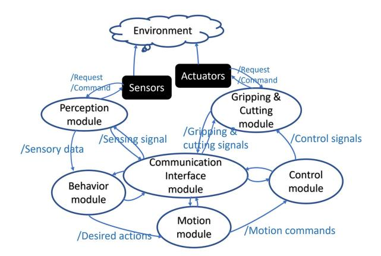
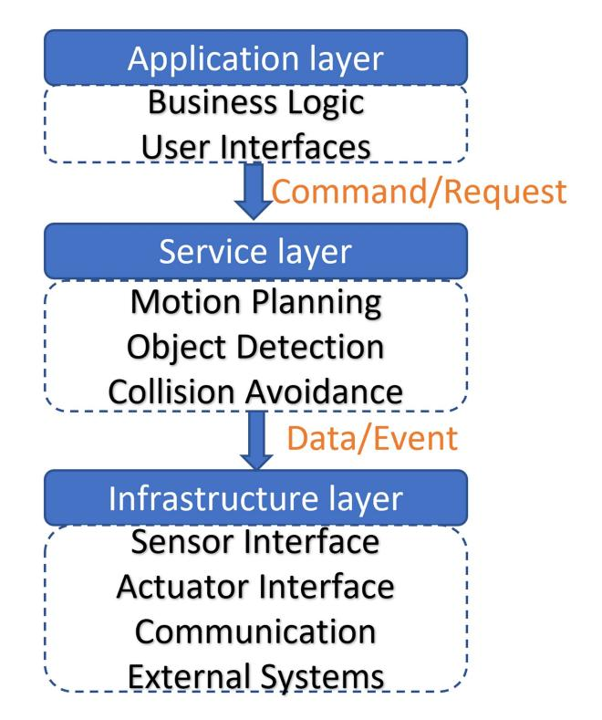
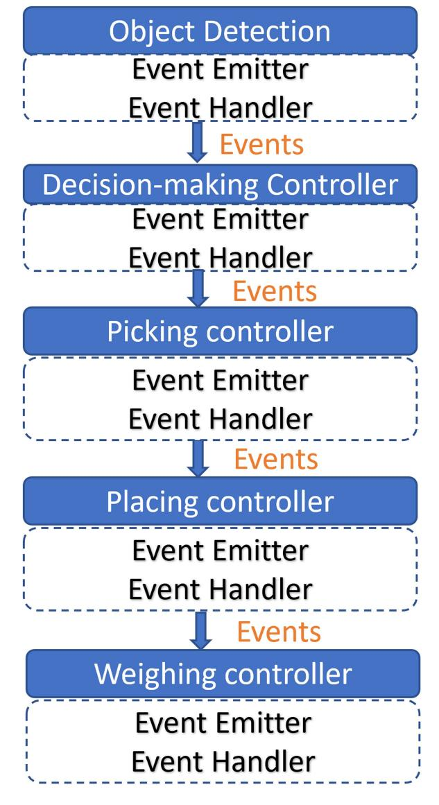

IEEE TRANSACTIONS ON AGRIFOOD ELECTRONICS, VOL. 2, NO. 1, MARCH/APRIL 2024 125

# Software Architecture for Agricultural Robots: Systems, Requirements, Challenges, Case Studies, and Future Perspectives

Rekha Raja

Abstract—Designing software architectures for autonomous robots for agricultural contexts is a demanding and difficult job due to the requirement to monitor numerous sensors and actuators, as well as autonomous decision-making in unpredictable, unexpected scenarios. Depending on the essential requirements of a robotic device for agricultural usage, robot software architecture is created differently. Since no single software architecture exists for all applications, extensive knowledge of the various software architectures for robots is needed when creating your own robotic architecture or selecting one from a number of existing architectures. As a result, this article provides a comprehensive history of software architecture and its application in the agricultural domain along with a chronology of how software design has evolved over time. We provide several case studies to understand the importance of application of software architecture in agriculture and food industry and how to choose the best architecture for agricultural tasks. Finally, this article discusses the open obstacles and difficulties that must be addressed in order to ensure more advancements in the development of robot architecture for agricultural applications.

Index Terms-Agricultural robot, food processing, food packaging, harvesting robot, robot programming, software architecture.

# I. INTRODUCTION

EVERY day, robots become more self-sufficient. Applications of robotics are no longer limited to industry; they are increasingly spreading into new areas, such as home care, military operations, and rescue operations  $( [1] )$ , driverless cars on roads, drones for inspection operations, underwater robots, robots for harvesting vegetables or fruits to space exploration. The agricultural sector, for example, has a huge demand for robots, which is expected to rise from USD 4.6 billion in 2020 to USD 20.3 billion by  $2025$  ([2]). The agricultural robots market is also growing due to a decline in the number of young farmers entering the agricultural sector and an increase in labor minimum wages  $[3]$ . Farmers are eagerly seeking a solution to this issue, with autonomous robots being one of the possibilities.

Manuscript received 25 September 2023; revised 20 December 2023; accepted 4 February 2024. Date of publication 5 March 2024; date of current version 11 April 2024. This article was recommended by Associate Editor D. Brunelli.

The author is with the Donders Centre for Cognition, Department of Artificial Intelligence, Radboud University, 6525 Nijmegen, The Netherlands (e-mail: rekha.raja@donders.ru.nl, rekha.cob@gmail.com).

Digital Object Identifier 10.1109/TAFE.2024.3366335

To construct autonomous robots that can be used in agricultural environments for a variety of tasks, such as harvest management (crops, vegetables, or fruits), field farming, crop management, higher levels of sophistication in perception, complex planning capacity, effective control mechanisms, and increased learning capability, are needed to adapt new environments with daunting challenges for the future. As a result, a thorough understanding of autonomous systems, their behavior, and the overall architecture of the system must be realized, and this remains an important research subject.

One of our research objectives is to devise a methodology for programming that seamlessly integrates complex high-tech tasks and to provide developers with appropriate models to develop their individual software modules which will be part of the large system integration so that the code can be reusable and extendable. It is crystal clear that to design a robot architecture that involves complex functionality is required a great effort to work the whole system smoothly. However, due to the nonavailability of uniform standards in robotics, there is no commonly accepted robot architecture, especially for AI applications ([4]). This has led to researchers being forced to develop their own robotic software architectures. For that purpose, there exists a large variety of robotic architecture. There are still scarce contributions regarding the global state of the art of different robot architectures suitable for agricultural applications. As the agricultural industry increasingly adopts automation and robotics to address its unique challenges, selecting the right software architectural pattern becomes a crucial decision that can significantly impact the success of projects.

This research article dives into the most popular software architectural patterns specifically tailored for agricultural robotics, exploring their benefits, drawbacks, selection criteria, and envisioning future perspectives. By critically analyzing the strengths and weaknesses of each pattern, we aim to guide researchers and practitioners in making informed decisions when selecting the most suitable architectural pattern for their agricultural robotics applications. Through real-world case studies and scenariobased discussions, we highlighted the architectural patterns that align with the unique requirements and challenges encountered in tasks, such as harvesting, food processing, and packaging. We summarize the contribution of this article as follows.

1) It provides a comprehensive exploration of various software architectural patterns and their applicability in the

2771-9529 © 2024 IEEE. Personal use is permitted, but republication/redistribution requires IEEE permission. See https://www.ieee.org/publications/rights/index.html for more information.

Authorized licensed use limited to: FUDAN UNIVERSITY. Downloaded on August 28,2025 at 01:50:40 UTC from IEEE Xplore. Restrictions apply

126 IEEE TRANSACTIONS ON AGRIFOOD ELECTRONICS, VOL. 2, NO. 1, MARCH/APRIL 2024

agricultural and food domain, offering insights into their benefits and drawbacks.

- 2) This article emphasizes the critical role of choosing the right architectural pattern in agricultural robotics projects, showcasing how it significantly influences project outcomes.
- 3) It explores the application of architectural patterns in agriculture, offering valuable guidance for selecting appropriate patterns in diverse scenarios.
- 4) Identifying unresolved problems in the field, this article addresses potential challenges and areas requiring further investigation. It opens avenues for future research aimed at enhancing the efficiency and effectiveness of future robot architectures in agricultural robotics.

Overall, this research article serves as a valuable resource in the field of agricultural robotics, offering an in-depth analysis of software architectural patterns.

# II. AGRICULTURAL ENVIRONMENT AND ROBOTIC SYSTEMS

The field of agricultural robotics has emerged as a promising area for the application of advanced robotic technologies to increase efficiency, reduce labor costs, and improve overall productivity in agriculture. This section will provide an overview of agricultural robot systems, including their applications, types, and components. It will also discuss the importance of software architecture in the development of effective agricultural robot systems.

## A. Agricultural Environment

It is essential to understand the agricultural environment in order to establish a robot architecture for agricultural applications. Agricultural application domain can be broadly categorized into three categories as follows.

- 1) Arable farming, horticulture, and animal husbandry are the three broad categories of agricultural production [5]. Arable farming is the large-scale cultivation of plants, such as wheat, potatoes, oilseeds, and fiber crops that are harvested at the same time.
- 2) Horticultural production on a small scale involves the production of fruits, vegetables, and ornamental plants, such as tomatoes, apples, cucumbers, and cabbage, which require selective harvesting.
- 3) Animal husbandry is the practice of breeding, feeding, and caring for animals, such as livestock, poultry, and fish. Examples of animal husbandry activities include watering, and milking of dairy animals, as well as shearing and processing wool.

The agricultural production cycle includes several stages, such as soil preparation, seeding, transplanting, transporting seeds, planting, fertilizing, pest control, weed control, irrigation, crop monitoring, harvesting, sorting, grading, packing, and cleaning.

Many of these activities have already implemented automated technologies, however, are engineering solutions. This is due to the inability to create a fully autonomous system due to limitations in sensing, vision, decision-making, learning, and safety capabilities to deal with uncertainty exist in 

the agriculture environment which would be included in the overall system architecture. Some key uncertainties are listed as follows.

- 1) *Environmental factors:* Agriculture is heavily influenced by environmental factors, such as weather, soil conditions, and other external factors. These uncertainties make it difficult for robots to predict and adapt to changes.
- 2) Crop variability: Each crop is unique and has different characteristics that can make it difficult for robots to handle them. Crop variability can include differences in size, shape, and texture, which can impact the robot's ability to identify and pick crops.
- 3) *Obstacles and terrain:* Agricultural fields can have various obstacles and terrains, such as rocks, trees, and uneven ground. These uncertainties make it difficult for robots to navigate and avoid obstacles.
- 4) *Sensor and hardware limitations:* Robotic systems require sensors and hardware to operate effectively. However, these components can have limitations in terms of accuracy, precision, and range. These uncertainties can impact the overall performance of the robot.
- 5) *Data quality and quantity:* Agricultural data can be difficult to collect and may vary in quality and quantity. This uncertainty can impact the robot's ability to make informed decisions.
- 6) Regulatory challenges: Agricultural robots must comply with various regulations and standards set by governments and other regulatory bodies. These regulations can vary by region and can create uncertainties for robot developers and manufacturers.

The design of architecture not only depends on environment but also depends on the type of robots used in the environment.

## B. Types of Agricultural Robots

Depending on the task and environment robots can be categorized into following classes.

- 1) Autonomous ground vehicle (AGV): These robots operate on the ground and are typically used in various applications, including planting, spraying, and harvesting crops.
- 2) Autonomous aerial vehicle (AAV): These robots operate in the air and are typically used for tasks, such as crop monitoring, spraying, mapping, and surveying. AAVs are equipped with advanced sensors and cameras that can capture high-resolution images and provide real-time data on crop health, growth, and yield. AAVs are particularly useful for large farms and fields where manual monitoring and inspection can be time-consuming and labor-intensive.
- 3) Autonomous underwater robot (AUR): These robots are a type of agricultural robot designed to operate underwater, performing tasks, such as monitoring water quality, inspecting aquaculture facilities, and conducting oceanographic research.
- 4) *Autonomous arm robot (AAR):* An AAR for agriculture is a type of robotic system used in agricultural operations, such as planting, harvesting, pruning, and spraying. The arm can be mounted on a ground vehicle or mobile base or ariel vehicle that can navigate across fields and orchards.

Authorized licensed use limited to: FUDAN UNIVERSITY. Downloaded on August 28,2025 at 01:50:40 UTC from IEEE Xplore. Restrictions apply

RAJA: SOFTWARE ARCHITECTURE FOR AGRICULTURAL ROBOTS 127

TABLE I
REQUIREMENTS OF SOFTWARE ARCHITECTURE FOR THE AGRICULTURAL APPLICATIONS

| Requirements            | Description                                                                                                                                                                                                                                                                                                                                                                                                                                         |
|-------------------------|-----------------------------------------------------------------------------------------------------------------------------------------------------------------------------------------------------------------------------------------------------------------------------------------------------------------------------------------------------------------------------------------------------------------------------------------------------|
| Agility                 | The ability to respond quickly to a constantly changing environment. This feature is extremely important as the agricultural environment is dynamic in nature, that is it frequently changes over time.                                                                                                                                                                                                                                          |
| Flexibility             | The ability to be flexible enough to accommodate changes and modifications to the system over time. Patterns such as MVC and microservices provide the flexibility to modify and add functionality.                                                                                                                                                                                                                                              |
| Complexity              | A good architectural pattern should not introduce unnecessary complexity into the system. Patterns such as monolithic architecture can be simple, but can become complex as the application grows. Patterns, such as Microservices can be more complex to manage, but provide greater flexibility.                                                                                                                                            |
| Real-time processing | The software architecture should be capable of processing data in real-time to enable quick decision-making and response to changing conditions.                                                                                                                                                                                                                                                                                                 |
| Deployment              | This can be a problem depending on how a pattern is implemented, especially for larger applications. A small change in a comp- onent can affect the application partially or completely, necessitating a partial or complete redeployment.                                                                                                                                                                                                       |
| Adaptability            | the ability to quickly adapt to complex, dynamic, and often chaotic environments.                                                                                                                                                                                                                                                                                                                                                                   |
| Maintainability         | It is the ability of a system to adapt to changes with ease.                                                                                                                                                                                                                                                                                                                                                                                        |
| Reusability             | It is the ability of components and subsystems to be reused in other applications.                                                                                                                                                                                                                                                                                                                                                                  |
| Testability             | It is the ability to easily test components belonging to specific layers in the architecture, other layers can be mocked or stubbed. To isolate testing within a business component, a developer can mock a presentation component or screen, as well as mock the business layer to test specific screen functionality. Patterns such as MVC and layered architecture provide clear separation of concerns, making it easier to test code. |
| Interoperability        | It is the ability of a system or systems to communicate with and exchange information with other external systems written and run by third parties.                                                                                                                                                                                                                                                                                              |
| Manageability           | It refers to how simple it is for system administrators to manage the application.                                                                                                                                                                                                                                                                                                                                                                  |
| Reliability             | It is the ability of a system to remain operational over time.                                                                                                                                                                                                                                                                                                                                                                                      |
| Performance             | It indicates the responsiveness of a system to execute any action within a given time interval.                                                                                                                                                                                                                                                                                                                                                     |
| Scalability             | It is a property of a system that allows it to handle an increasing amount of work by adding resources to the system, i.e. the ability to change the size or scale of the system.                                                                                                                                                                                                                                                                |
| Modularity              | The software architecture should be modular, allowing for easy integration of new components and functionalities as needed.                                                                                                                                                                                                                                                                                                                         |
| Cost                    | Cost of the system in terms of time to market, expected project lifetime, and legacy usage.                                                                                                                                                                                                                                                                                                                                                         |
| Security                | It refers to a system's ability to prevent malicious or unintentional actions that are not intended.                                                                                                                                                                                                                                                                                                                                                |
| Portability             | It is the ability of a system to run in a variety of computing environments.                                                                                                                                                                                                                                                                                                                                                                        |
| Fault tolerance         | It is the ability to continue operating after a fault has occurred.                                                                                                                                                                                                                                                                                                                                                                                 |
| Marketability           | It refers to how a system is used in relation to market competition.                                                                                                                                                                                                                                                                                                                                                                                |

The robot can be equipped with various end-effectors, such as grippers, cutting tools, and sprayers, to perform specific tasks.

# III. REQUIREMENTS AND CHALLENGES

The level of uncertainty in the agricultural environment is significantly higher than in other robotics applications. The agricultural climate is very complex in nature, meaning that it changes at all times. As a result, agricultural robots rely not only on advanced technology, but also on appropriate robot architecture, supported infrastructures, and services, such as communication between subsystems and data sharing and reuse. The unavailability of suitable robot architecture that can handle the existence of uncertainty in the agricultural environment may be one of the causes of this phenomenon.

## A. Requirements for Agricultural Robot Software Architecture

The overall requirements for the agricultural applications are listed in Table I below, which should be considered while making a robot architectural pattern.

## B. Challenges in Developing Agricultural Robot Software Architecture

There are some challenges listed in the Table  $\mathbf{II}$  in developing agricultural robot software architecture considering all the requirements are as follows.

# IV. CHARACTERIZATION OF CURRENT ROBOTIC ARCHITECTURES AND PRINCIPLES

Robot architectural patterns define the overall structure and organization of a software system within the robot(s), and provide a blueprint for the development team to follow. In general, each architectural pattern has its own tradeoffs, and the choice of pattern will depend on the specific requirements of the system being developed. It is necessary to look for specific characteristics in architectural patterns that are appropriate for agricultural applications. Because warehouse or manufacturing-related architectural patterns may not be appropriate for agricultural applications, as it is highly dependent on environmental conditions, specific tasks, and goals, and because the agricultural field's environment is highly dynamic, uncertain, and unpredictable in nature.

## A. Categorization Based on Functionality

There are several ways to categorize robotic software architectural patterns, depending on the criteria or characteristics that are being used. For example, it can be categories based on functionality of the robot and how it performs its tasks. Examples include:

1) Control Architecture Versus Cognitive Architecture: Control architecture focuses on the control of robotic systems, including low-level motor control and high-level planning and decision-making, while cognitive architecture focuses on the

Authorized licensed use limited to: FUDAN UNIVERSITY. Downloaded on August 28,2025 at 01:50:40 UTC from IEEE Xplore. Restrictions apply.

128 IEEE TRANSACTIONS ON AGRIFOOD ELECTRONICS, VOL. 2, NO. 1, MARCH/APRIL 2024

TABLE II 
CHALLENGES IN DEVELOPING ROBOT SOFTWARE ARCHITECTURE FOR THE AGRICULTURAL APPLICATIONS

| Challenges                           | Description                                                                                                                                                                                                                                                                                                                              |
|--------------------------------------|------------------------------------------------------------------------------------------------------------------------------------------------------------------------------------------------------------------------------------------------------------------------------------------------------------------------------------------|
| Sensor data pro- cessing          | Agricultural robots rely heavily on sensor data to make decisions. The data may also account for different time frames. However, the data can be noisy, incomplete, or even incorrect, leading to wrong decisions. Developing software architecture that can handle such uncertainties and still make accurate decisions is a challenge. |
| Heterogeneity                        | Agricultural robots are used for a wide range of tasks, and therefore, the software architecture must accommodate the heterogeneous nature of the tasks.                                                                                                                                                                                 |
| Resource constraints              | Agricultural robots often operate in remote areas and have limited resources, such as memory, processing power, and communication bandwidth. The software architecture must be designed to optimize the use of these resources.                                                                                                          |
| Real-time processing              | Agricultural robots need to be able to process data in real-time or near real-time in order to make decisions and take actions. This requires efficient and fast software architecture, which can be challenging to design.                                                                                                              |
| Unpredictable environments        | Agricultural environments can be unpredictable and change rapidly, which can make it difficult to design software architecture that can adapt quickly to changing conditions.                                                                                                                                                            |
| Energy efficiency                    | Agricultural robots often operate in remote areas, where access to power is limited. Developing software architecture that is energy-efficient and can operate for long periods on a limited power supply is a challenge.                                                                                                                |
| Data management                   | Agricultural robots generate large amounts of data, which must be managed and processed in real-time. This requires efficient data management and processing systems, which can be challenging to design and implement.                                                                                                                  |
| Integration with existing systems | Agricultural robots must be able to integrate with existing agricultural systems, such as irrigation and fertilization systems. This requires careful design of software architecture to ensure seamless integration and compatibility.                                                                                                  |
| Scalability                          | The software architecture must be scalable to accommodate the increasing demand for agricultural robots in the future.                                                                                                                                                                                                                   |
| Safety                               | Agricultural robots often work in close proximity to humans and livestock. Ensuring the safety of both humans and animals is a critical challenge in developing software architecture for agricultural robots.                                                                                                                           |
| Interoperability                     | Agricultural robots often work in collaboration with other robots and systems, and therefore, the software architecture must be designed to ensure interoperability.                                                                                                                                                                     |
| Robustness                           | Agricultural robots operate in harsh environments, where they may encounter physical obstacles or suffer from mechanical failures and the software architecture must be robust enough to withstand these conditions.                                                                                                                     |
| Adaptability                         | Agricultural robots operate in dynamic environments, and the software architecture must be adaptable to changing conditions and requirements.                                                                                                                                                                                            |
| Cost-effective                       | Agricultural robots must be cost-effective, and the software architecture must be designed to optimize the cost of development and maintenance                                                                                                                                                                                           |

development of robotic systems with human-like cognitive abilities, such as perception, reasoning, and learning. Examples, subsumption architecture  $[6]$  is a control architecture that emphasizes reactive behavior and task decomposition. It is composed of multiple layers, each of which is responsible for a different task or behavior. Higher layers can suppress the output of lower layers, allowing the robot to perform complex behaviors in a modular fashion; ACT-R architecture is a cognitive architecture that emphasizes decision-making, planning, and goal-directed behavior. It is based on the idea of production systems, which are rules that specify a condition-action pair. ACT-R models human cognition and is often used to predict human behavior in various tasks.

2) Reactive Architecture Versus Deliberative Architecture: Reactive architecture [7] focuses on the development of robotic systems that can quickly and appropriately respond to changes in the environment or stimuli, while deliberative architecture focuses on the development of robotic systems that can plan and reason about their actions and goals. Example, behavior Tree architecture is a reactive architecture that emphasizes task decomposition and decision-making. It is composed of a tree structure, where each node represents a task or behavior. The tree is executed in a top-down manner, allowing the robot to make decisions based on the current state of the environment; goal-oriented action planning is a deliberative architecture that emphasizes planning and goal-directed behavior. It is based on the idea of a plan library, which is a set of predefined plans that can be used to achieve specific goals. The robot selects the appropriate plan based on the current goal and the state of the environment.

3) Layered Architecture Versus Hybrid Architecture: Layered architecture [8] organizes the robotic system into distinct 

layers that provide different levels of abstraction and functionality, while hybrid architecture combines elements of different architectures to achieve specific goals or requirements. Example, model-view-controller (MVC) architecture  $[9]$ ,  $[10]$  is a layered architecture that separates the user interface (view), application logic (controller), and data (model) into separate components. This separation allows for greater modularity and flexibility, making it easier to modify or replace individual components; service-oriented architecture is a hybrid architecture that combines elements of both centralized and distributed architectures. It is based on the idea of services, which are self-contained, modular components that can be accessed remotely. Services can be combined in different ways to create complex systems, making it easier to adapt to changing requirements.

4) Sense–Plan–Act Architecture Versus Behavior-Based Ar*chitecture:* Sense–plan–act architecture [11] divides the robotic system into three stages: sensing the environment, planning a course of action, and executing the plan, while behavior-based architecture focuses on the development of autonomous agents that can perform tasks through the interaction of simple behaviors. Example, hybrid deliberative/reactive architecture is a sense-plan-act architecture that combines elements of both deliberative and reactive architectures. It is composed of multiple layers, each of which is responsible for a different task or behavior. Higher layers can suppress the output of lower layers, allowing the robot to perform complex behaviors in a modular fashion; subsumption architecture (behavior-based architecture) is a behavior-based architecture that emphasizes reactive behavior and task decomposition. It is composed of multiple layers, each of which is responsible for a different task or behavior. Higher layers can suppress the output of lower

Authorized licensed use limited to: FUDAN UNIVERSITY. Downloaded on August 28,2025 at 01:50:40 UTC from IEEE Xplore. Restrictions apply.

RAJA: SOFTWARE ARCHITECTURE FOR AGRICULTURAL ROBOTS 129

TABLE III
CATEGORIZATION OF ROBOT SOFTWARE ARCHITECTURE BASED ON COMMUNICATION PROTOCO

| Communication                                | Description                                                                                                                                                                        | Examples                                                                                                                   | Features                                                                                                            | Application examples                                                                             |
|----------------------------------------------|------------------------------------------------------------------------------------------------------------------------------------------------------------------------------------|----------------------------------------------------------------------------------------------------------------------------|---------------------------------------------------------------------------------------------------------------------|--------------------------------------------------------------------------------------------------|
| paradigm Client-server                    | In this paradigm, one component (the client) requests services or data from another component (the server). It is a one-to-one commu- nication model.                  | Robot operating systems (ROS), remote desktop protocol, file transfer protocol, simple mail transfer protocol. | Centralized control and data sharing, suitable for applications with a single point of control.            | Remote robotic control over a network, teleoper- ation systems.                            |
| Publisher- subscriber (Pub-Sub) ([13]) | This paradigm uses a publish- subscribe model where one or more publishers send messages or data to one or more subscribers. It is a one- to-many communication model. | ROS, MQTT, advanced message queuing protocol, Apache Kafka.                                                          | Decoupled communica- tion, scalable and efficient for broadcasting data, supports real-time updates. | Robot sensor data distribution, event-driven robotics systems.                             |
| Peer-to-peer (P2P) ([14])                 | In a peer-to-peer network, all com- ponents are equal and can com- municate directly with each other. There is no centralized server.                                     | BitTorrent, Skype, Bit- coin.                                                                                           | Distributed control and decision-making, robust and fault-tolerant, suitable for decentralized systems.    | Multirobot coordination and collaboration, swarm robotics.                                 |
| Master-slave ([15])                       | This paradigm involves a single master or coordinator component (the master) that controls and com- municates with multiple subordi- nate components (the slaves).     | SETI                                                                                                                       | Hierarchical control, efficient resource allocation, well-suited for coordinated tasks.                    | Multi-robot assembly lines, collaborative robots (cobots).                                 |
| Broadcast ([16])                             | In a broadcast communication model, a message or data is trans- mitted to all components in the network. It is a one-to-all commu- nication model.                     | UML-RT, address resolution protocol.                                                                                    | Simplicity and efficiency in data distribution, use- ful for broadcasting com- mands or status updates.    | Broadcasting control commands to multiple robots, notification systems in robot fleets. |
| Event-driven ([17])                       | This paradigm focuses on reacting to events or triggers. Components subscribe to specific events and re- spond when those events occur.                                   | Apache Kafka, AWS Lambda, Apache Storm.                                                                                 | Responsive and event- triggered behavior, supports asynchronous communication.                             | Robot behaviors triggered by environmental events, reactive control systems.               |
| Multicast ([18])                             | Multicast communication allows a message or data to be sent to a selected group of components, of- ten specified by an IP multicast address.                           | multiparty audio/video conferencing.                                                                                    | Efficient data distribution to specific groups, reduces network load compared to broadcasting.             | Coordinated behavior in subgroups of a robot team, networked robot simula- tions.       |
| Point-to-point ([19])                     | Data is exchanged directly between two specific components or robots.                                                                                                           | LAN cable, stovepipes.                                                                                                     | Direct communication, simplicity.                                                                                | Information exchange be- tween farm vehicles and sensors.                                  |
| Request- response $([20])$                | One component sends a request, and another component responds with the requested information or action.                                                                   | Sending a spreadsheet to the printer.                                                                                   | Simple request handling, suitable for remote control.                                                            | Remote monitoring and control of irrigation sys- tems.                                     |
| Message queues ([21])                     | Messages are sent to a queue, and other components can retrieve them, providing asynchronous and decoupled communication.                                                 | Apache Kafka, RabbitMQ, and LavinMQ.                                                                                    | Task scheduling, event handling.                                                                                 | Task management and coordination in precision agriculture.                                 |

layers, allowing the robot to perform complex behaviors in a modular fashion.

5) Centralized Architecture Versus Distributed Architecture: Centralized architecture organizes the robotic system around a central processing unit, while distributed architecture allows multiple processing units to work together to achieve a common goal. Example, client-server architecture (centralized architecture) is a centralized architecture where a single server provides resources or services to multiple clients. Clients request resources or services from the server, which then responds with the requested information. This architecture is often used in web applications or database systems; peer-to-peer architecture (distributed architecture) is a distributed architecture  $[12]$  where multiple nodes communicate directly with each other without the need for a central server. Each node can act as both a client and a server, making it more fault-tolerant and scalable than 

a centralized architecture. This architecture is often used in file-sharing or messaging systems.

## B. Categorization Based on Communication Strategies

Robotic software architectural paradigms can be categorized based on communication protocols that facilitate interactions between different components of a robotic system. Table III, categorizes some common robotic software paradigms based on communication protocols, accompanied by their descriptions, features, and examples of applications.

These communication paradigms play a crucial role in enhancing agricultural processes, from precision farming and crop monitoring to pest control and automation of various tasks. The choice of communication paradigm depends on the specific needs and challenges of agricultural robotics applications.

Authorized licensed use limited to: FUDAN UNIVERSITY. Downloaded on August 28,2025 at 01:50:40 UTC from IEEE Xplore. Restrictions apply.

130 IEEE TRANSACTIONS ON AGRIFOOD ELECTRONICS, VOL. 2, NO. 1, MARCH/APRIL 2024

TABLE IV 
CONCEPTUAL-LEVEL ROBOT SOFTWARE ARCHITECTURES THAT ARE STILL UNDER DEVELOPMENT OR IN THE EARLY STAGES OF IMPLEMENTATION

| Paradigm              | Description                                                                                                                                                                                                                                                                               | Features                                                                                                   | Application in agriculture                                   |
|-----------------------|-------------------------------------------------------------------------------------------------------------------------------------------------------------------------------------------------------------------------------------------------------------------------------------------|------------------------------------------------------------------------------------------------------------|--------------------------------------------------------------|
| Ethical ([22])        | It aims to incorporate ethical decision-making capabilities into robots, allowing them to make morally sound choices and interact responsibly with humans and the environment.                                                                                                            | Prioritizes well-being of plants and animals.                                                              | Harvesting, crop spraying, animal welfare.                   |
| Explainable ([23])    | It focuses on designing robots that can provide explanations for their actions and decisions, allowing humans to understand and trust the reasoning behind their behavior.                                                                                                                | Enables transparency and understanding.                                                                    | Task auditing, compliance, trust-building.                   |
| Cognitive ([24])      | It aims to develop robots with advanced cognitive capabilities, such as perception, learning, reasoning, and decision-making, enabling them to exhibit more human-like intelligence and adaptability.                                                                                     | Analyzes sensor data, intelligent decision-making.                                                         | Crop monitoring, disease detection, irrigation optimization. |
| Socially aware ([25]) | It focuses on designing robots that can understand and respond to social cues, norms, and context, allowing them to interact with humans in a socially acceptable and appropriate manner and recognizes human gestures, interacts gently with animals.                                    | Recognizes human gestures, interacts gently with animals.                                                  | Collaborative work with farm workers, livestock interaction. |
| Self-adaptive ([26])  | It aims to develop robots that can autonomously adapt and reconfigure their software and hardware components based on changes in their environment or task requirements, improving their flexibility and performance.                                                                     | Adjusts behavior, task allocation, physical configuration.                                                 | Handling dynamic environments, different crops or terrains.  |
| Human-in-loop ([27])  | It refers to a type of software architecture where a human operator plays an active role in the control and decision-making process alongside robots. It is designed to enable effective collaboration and synergy between humans and robots, leveraging the unique capabilities of both. | Combines the strengths of both humans and robots, leveraging skill augmentation, precision, and endurance. | Precision agriculture, target pesticide application.         |

While the field of robotic software architecture is continually evolving, there are several conceptual-level architectures that are still under development or in the early stages of implementation. Here are a few examples of architectural paradigm listed in Table IV.

These architectures are still in the conceptual stage, and their practical implementation and widespread adoption may vary. Socially aware paradigm enables robots to recognize and respond appropriately to human gestures, expressions, or vocal commands. They can work collaboratively with human workers, navigate crowded farm environments safely, and interact gently with animals, promoting efficient and harmonious interactions. The robots with self-adaptive paradigm can adapt their behavior, task allocation, or physical configuration to handle changing conditions or new farming requirements. This allows them to optimize their performance, adjust to different crops or terrains, and improve overall productivity and efficiency. Human-in-loop robot architectures allows for efficient collaboration between humans and robots, enabling them to work together effectively and achieve common goals.

# V. SOFTWARE ARCHITECTURE PATTERNS APPLIED FOR AGRICULTURAL ROBOTS

In the literature, several studies have investigated various software architectures that have been employed for agricultural robots, and these architectural choices often depend on the specific mission or purpose of the robot ([28], [29]). The Table V summarizes software architectures employed in various agricultural robot applications, including arable farming, horticulture, animal husbandry, food processing, and food packaging.1) *Arable farming:* multiple software architectures are used, including subsumption architecture that was used by Blackmore ([30]) to decompose human-controlled agricultural operations into an autonomous tractor. Hybrid architecture was introduced by Vougioukas  $(28)$  for mobile robots that combined deterministic and reactive behaviors. 

Distributed and hierarchical architecture, sense–plan–act architectures are applied to tasks, such as ploughing, seeding, navigation, and weed management. Notably, for wheat and maize weed management, the Future Internet WARE (FIWARE) and Apache Kafka-based architecture is employed. Agrobot, built by Durmuş et al. [33], proposed cloud-based architecture for robot that connects to farmers through a cloud service to mobile devices. However, they had not yet completed their implementation of this concept.

2) *Horticulture:* various architectures are used for tasks, such as greenhouse harvesting, image data collection, navigation in vineyards, and weed management. Kashiwazaki et al. [29] suggested a greenhouse mobile robot device that would work with humans to harvest and manage pests. They design architecture to allow the robot to navigate the greenhouse on its own, while the human partner operates the control panel to complete the necessary tasks. However, the architecture is only appropriate for use in a greenhouse and is not suitable for use in an open area. Adamides et al. [38] proposed a robot architecture for a semiautonomous agricultural teleoperated sprayer robot that focuses on human-robot interaction evaluation. The architecture, on the other hand, is not scalable to vast vineyards. Another VineRobot created by [39] is an agriculture mobile robot designed to roam the wine field autonomously and collect data to estimate vegetative production, water status, and grape composition, among other things. Emmi et al. [40] build a system architecture for both individual robots and fleets of robots that improves reliability, reduces complexity and costs, and allows applications from various developers to be integrated. Despite the fact that they recognized the need for agriculture robots to be smaller, more complex, and less expensive. Their architecture is anything but small, plain, or inexpensive. Recently, a few fully integrated autonomous robots have been registered, including cherry tomato harvesting

Authorized licensed use limited to: FUDAN UNIVERSITY. Downloaded on August 28,2025 at 01:50:40 UTC from IEEE Xplore. Restrictions apply

RAJA: SOFTWARE ARCHITECTURE FOR AGRICULTURAL ROBOTS 131

TABLE V
SOFTWARE ARCHITECTURES FOR AGRICULTURAL ROBOT FOR DIFFERENT APPLICATIONS

| Application areas | Type of robots               | Crops/animals       | Production cycle/task                 | References       | Architecture/Pattern                           |
|-------------------|------------------------------|---------------------|---------------------------------------|------------------|------------------------------------------------|
| Arable farming    | AGV                          | –                   | Ploughing, seeding, fertilizing, etc. | [30]             | Subsumption architecture                       |
|                   | AGV                          | –                   | Navigation in the crop field          | [28]             | Hybrid architecture                            |
|                   | Heterogeneous, AAV, and AGV  | –                   | Weed management                       | [31]             | Distributed and hierarchical architecture      |
|                   | AGV                          | –                   | Navigation for precision farming      | [32]             | Sense-plan-act                                 |
|                   | AGV                          | –                   | Processing and monitoring field       | [33]             | Cloud-based                                    |
|                   | AGV                          | –                   | monitoring and scheduling             | [34]             | Lambda architecture (LambdAgrIoT)              |
|                   | AGV                          | –                   | Big data processing                   | [35]             | cloud-based                                    |
|                   | AGV                          | Wheat/maize         | Weed management                       | [36]             | FIWARE and Apache Kafka-based                  |
| Horticulture      | AGV                          | –                   | Greenhouse harvesting                 | [29]             | Distributed architecture for mobile navigation |
|                   | AGV                          | Orange              | Orchard image data collection         | [37]             | Distributed high level architecture-based      |
|                   | AGV                          | Vineyards           | Navigation                            | [38]             | Deliberative architecture                      |
|                   | AGV                          | Vineyards           | Navigation                            | [39]             | Ethical architecture                           |
|                   | AGV                          | –                   | Navigation of fleet of mobile robots  | [40]             | Distribute and hybrid architecture             |
|                   | AGV                          | Lettuce and tomato  | Weed management                       | [41], [42]       | Sense–plan-act                                 |
|                   | AGV mounted AAR              | Cherry tomato       | Greenhouse harvesting                 | [43]             | Sense–plan-act                                 |
|                   | AGV mounted AAR              | Apple               | Orchard harvesting                    | [44], [45]       | Sense–plan-act                                 |
|                   | AGV mounted AAR              | Orange              | Orchard harvesting                    | [46], [47]       | Sense–plan-act                                 |
|                   | AGV mounted with manipulator | Pepper              | Greenhouse harvesting                 | [48], [49]       | Sense–plan-act                                 |
| Animal husbandry  | IoT-based AAVs               | Cow                 | Methane emissions                     | [50]             | Azure cloud platform                           |
|                   | AAVs                         | Cattle/sheep        | Monitoring                            | [51], [52], [53] | Layered architecture                           |
|                   | AAVs                         | Cattle/sheep        | Monitoring                            | [54]             | FANETs architecture                            |
|                   | Mobile robot                 | –                   | Service purpose                       | [55]             | Distributed architecture                       |
|                   | AAR                          | 3-D printed objects | Sorting                               | [56]             | Microservices architecture                     |
| Food processing   | AAR                          | Pork                | Pork cutting                          | [57]             | Physical human-robot architecture              |
|                   | AAR                          | Poultry             | Pick and place of meat pieces         | [58]             | Sense-plan-act architecture                    |
|                   | AAR                          | Fish                | Fish pick and place                   | [59]             | Sense-plan-act architecture                    |
|                   | AAR                          | Salmon fish         | Remove pin bones of the fillet        | [60]             | Sense-plan-act architecture                    |
|                   | AAR                          | Poultry             | Rehang whole bird                     | [61]             | hybrid distributed architecture                |
| Food packaging    | Delta robot                  | Fish                | Fish fillet packing                   | [60]             | Distributed architecture                       |
|                   | Delta robot                  | Poultry             | Poultry fillet packing                | [61]             | Distributed architecture                       |

robots ([\[43\]](#page-4-4)), apple harvesting robots ([\[44\]](#page-4-4), [\[45\]](#page-4-4)), orange harvesting robots ([\[46\]](#page-4-4), [\[47\]](#page-4-4)), and sweet peppers harvesting robots ([\[48\]](#page-4-4), [\[49\]](#page-4-4)), weed management robots ([\[41\]](#page-4-4), [\[62\]](#page-4-4)). However, the majority of previous research has been put to the test in either a simulation ([\[63\]](#page-4-4), [\[64\]](#page-4-4)) or in a laboratory environment ([\[46\]](#page-4-4)). Very few works have been tested in real-world field environment ([\[41\]](#page-4-4), [\[49\]](#page-4-4), [\[65\]](#page-4-4), [\[66\]](#page-4-4)). In addition, the architecture for these works follows the conventional sense–plan–act paradigm. There is a small amount of work that is focused on the learning model, which is to learn a new world on one's own and behave accordingly.

3) Animal husbandry: IoT-based architectures are used for tasks related to monitoring cow methane emissions. Layered architecture [\[52\]](#page-52-0) and flying ad hoc networks (FANETs) architecture [\[54\]](#page-52-2) are employed for cattle and sheep monitoring. The drone is envisioned as operating at the edge in the proposed design, and its built-in processing power may be utilized. [\[53\]](#page-52-1) also proposed a layered architecture for livestock management. FANET are frequently

created by connecting many UAVs [\[54\]](#page-5-1). High-speed (30 to 460 km/h) and 3-D movable nodes are characteristics of FANET. FANETs have particular design and protocol constraints because of the mobility and restricted resources of UAVs. Service robots are being used more and more in agriculture. They work in both agriculture and animal husbandry. Chikurtev [\[55\]](#page-5-1) presented a distributed software architecture for controlling a modular service robot for animal husbandry. The purpose of this design was to allow interinstalled module communication. Services and microservices are the foundation for the requests and replies that are exchanged between the various components.

4) Food processing: AARs are employed for various food processing tasks. Microservices architecture, physical human-robot architecture, sense-plan-act architecture, and hybrid distributed architecture are applied for tasks, such as sorting, pork cutting, meat piece pick-and-place, fish handling, and salmon fillet processing. The microservices architecture is utilized for the removal of pin bones from salmon fillets.

Authorized licensed use limited to: FUDAN UNIVERSITY. Downloaded on August 28,2025 at 01:50:40 UTC from IEEE Xplore. Restrictions apply

132 IEEE TRANSACTIONS ON AGRIFOOD ELECTRONICS, VOL. 2, NO. 1, MARCH/APRIL 2024

5) Food packaging: Delta robots are utilized for food packaging tasks involving fish fillets and poultry fillets. Distributed architecture is applied in both cases for efficient packaging.

## A. Key Observations and Findings:

The agricultural robotics domain exhibits a diverse range of software architectures to suit specific tasks and challenges as follows.

- 1) Sense-plan-act: The sense-plan-act architecture is frequently employed in various agricultural applications, indicating its adaptability and effectiveness in real-time decision-making.
- 2) Distributed architectures: Distributed architectures are prevalent, especially in horticulture and food processing applications, showcasing the importance of decentralized control and communication.
- 3) *Cloud-based architectures:* Cloud-based architectures are used for tasks that involve big data processing and monitoring, underscoring the role of cloud technology in modern agricultural robotics.
- 4) *IoT integration:* IoT-based architectures are utilized for monitoring and data collection in animal husbandry, highlighting the integration of IoT devices in agriculture.
- 5) Application-specific solutions: Different crops, animals, and tasks necessitate tailored software architectures, emphasizing the need for customization in agricultural robotics.

These findings illustrate the adaptability and versatility of software architectures in addressing the unique challenges posed by agricultural robotics, where specific mission requirements often dictate the choice of architecture.

# VI. CASE STUDIES

In order to examine the potential of appropriate software architecture, we will take into account three diverse use cases into our case studies in the agrofood sector, which takes into account most of the requirements and challenges across the domain. The three use cases chosen for the understanding and development of robotic architectures are harvesting robots, food processing robots, and food packaging. These use-case projects have some similar requirements in terms of functionality and performance as well as different requirements. In the subsequent sections, we are going to explore and exploit similarities in software and hardware architectures to be needed in all three use cases.

## A. Harvesting Robot

In this case study, a harvesting robot was considered to designed and developed to automate the process of picking tomatoes at the green house scenarios. The robot should be designed to satisfy the requirements, such as precision manipulation, sensing capabilities, real-time decision-making, adaptability to varying crop conditions and challenges. However, there 

are challenges, such as handling delicate fruits, varying crop conditions, efficient harvesting, with minimal crop damage.

Based on the requirements, the behavior-based architecture would be a suitable choice for the harvesting robot, which is a popular choice for robotic systems that require real-time responsiveness and complex behaviors. It emphasizes the organization of the system into individual behaviors or modules, each responsible for a specific task or behavior. These behaviors can operate concurrently and independently, allowing the robot to exhibit reactive and adaptive behavior in response to its environment. In the case of the harvesting robot, the behavior-based architecture can be designed to include specific modules or behaviors such as the following.

- 1) Perception module: This module is responsible for perceiving the environment using various sensors, such as cameras or proximity sensors. It collects sensory data related to tomato detection, ripeness estimation, etc. It may also be used for autonomous navigation and robot control.
- 2) Behavior modules: These modules process the sensory data and generate desired actions based on predefined behaviors. Each behavior module focuses on a specific task, such as locating ripe tomatoes, avoiding obstacles, or navigating through rows.
- 3) Motion module: This module receives the desired actions from the behavior modules and generates motion commands. It considers factors, such as robot kinematics, dynamics, and environmental constraints, to plan and execute the robot's movements.
- 4) Control module: The control module receives the motion commands from the motion module and generates control signals to actuate the robot's motors and actuators. It ensures precise and coordinated movement of the robot, controlling aspects, such as velocity, acceleration, and joint angles.
- 5) Gripping and cutting module: This module handles the gripping and cutting mechanisms of the robot using grippers, cutting tools, etc. It receives control signals from the control module to perform precise manipulation and cutting actions on the tomatoes.
- 6) Communication interface: This module provides a means of communication between the robot and external systems. It allows for remote monitoring, control, and coordination with a central control unit or user interface. It can use protocols, such as message queue telemetry transport (MQTT), robot operating system (ROS), or custom interfaces for exchanging data and commands.

In a behavior-based architecture, each module operates autonomously, focusing on specific tasks and behaviors shown in Fig. 1. They communicate with each other through well-defined interfaces, exchanging sensory data, desired actions, motion commands, and control signals. This modular and decentralized approach enables:

- 1) reactive and adaptive behavior;
- 2) quick response to environmental changes;
- 3) modular and decentralized approach for flexibility, allowing for efficient tomato harvesting while handling

Authorized licensed use limited to: FUDAN UNIVERSITY. Downloaded on August 28,2025 at 01:50:40 UTC from IEEE Xplore. Restrictions apply

RAJA: SOFTWARE ARCHITECTURE FOR AGRICULTURAL ROBOTS 133

Fig. 1. Proposed behavior-based software architectural pattern for greenhouse harvesting robot.

uncertainties and variations in the greenhouse environment.

However, it comes with drawbacks, such as: 1) potentially less effective in long-term planning, 2) might struggle with complex decision-making scenarios.

Hence, a deliberative architecture could also be chosen that excel in precision and long-term planning. They can potentially optimize harvesting routes, taking into account the varying ripeness of tomatoes and the layout of the greenhouse. However, the tradeoff could be a potentially slower response time to immediate environmental changes. Deliberative architectures might struggle with rapid, reactive responses needed for unexpected events, which behavior-based architectures are designed to handle.

## B. Food Processing Robots

The food-processing use-case addresses poultry processing and more specifically, the composition of product (chicken fillets, wings, thighs) placed densely in a bin and the robot should be able to pick products one-by-one at a time to place them on conveyor belt at right pose. This use-case addresses the challenge of how to deal with variation in shape and size of products, and deformability of objects.

In the case of pick and place of chicken pieces with a robot arm in the food processing industry, the software architecture must be designed to ensure efficient and accurate handling of the chicken pieces. The robot arm needs to have a reliable and accurate sensor system to detect the position and orientation of the chicken pieces. The software should be able to interpret the sensor data and plan the motion of the robot arm to pick up and place the chicken pieces in the desired location. The software must also take into account the safety of the workers around the robot and avoid collisions with other objects or machinery.

In this case study, the software architecture could be designed based on a layered architecture, with the application layer at the top, service layer at the middle and infrastructure layer at the bottom as explained in the following.

1) *Application layer:* This layer represents the topmost layer of the architecture and includes components related to application-specific business logic and user interfaces. It

Fig. 2. Proposed layered software architecture for pick and place robot to process food.

handles high-level tasks, such as user interaction, command execution, and overall coordination, of the pick and place operations.

- 2) Service layer: The service layer contains modules responsible for specific functionalities required for the pick and place task. This includes motion planning, object detection (to locate and recognize chicken pieces), and collision avoidance (to prevent collisions with objects or workers). These modules process data and events received from lower layers and generate relevant outputs.
- 3)Infrastructure layer: The infrastructure layer provides the necessary infrastructure components to support the functionality of higher layers. This includes sensor interfaces to communicate with sensors for precise detection of chicken pieces, actuator interfaces to control the robot arm's movements, communication modules for intermodule communication, and integration with external systems if required.

The layered architecture provides a clear separation of concerns and modularization of functionalities shown in Fig. 2. Each layer focuses on specific aspects of the system and can be developed, tested, and maintained independently. The layers communicate through well-defined interfaces, allowing for flexibility, modifiability, and reusability.

The application layer handles high-level tasks and user interactions, while the service layer incorporates the core functionalities related to motion planning, object detection, and collision avoidance. The infrastructure layer provides the necessary infrastructure components for sensor integration, actuator control, communication, and integration with external systems.

Authorized licensed use limited to: FUDAN UNIVERSITY. Downloaded on August 28,2025 at 01:50:40 UTC from IEEE Xplore. Restrictions apply

134 IEEE TRANSACTIONS ON AGRIFOOD ELECTRONICS, VOL. 2, NO. 1, MARCH/APRIL 2024

This layered architecture enables: 1) efficient and accurate handling during pick and place tasks, 2) reliable sensor data interpretation and collision avoidance. However, it might struggles with scalability and modularity. Hence, as an alternative microservices architecture could be explore. Microservices architectures are known for their scalability. In a food processing scenario where different aspects (e.g., motion planning, object detection) might have varying computational demands, microservices can be individually scaled to meet specific requirements. Microservices allow for more independent modification of components. If there are changes in the food processing requirements for specific tasks (e.g., new products with different shapes), the relevant microservices can be updated without affecting the entire system. However, it may also brings complexity in terms of service communication, coordination, and potential challenges in maintaining consistency across services.

## C. Food Packaging Robots

The food-packaging use-case addresses packaging of various food products, such as bags of chips. The task is to pick these products from a bin and place them in a variety of containers. The most suitable software architecture for a food packaging robot depends on various factors, including the specific requirements of the robot, the type of food being packaged, the production environment, and the available resources. However, some common architectural patterns that may be suitable for food packaging robots include client-server architecture, microservices architecture, and event-driven architecture. Even combining multiple architecture together could provide benefits, such as scalability, modularity, and flexibility, which can be crucial for ensuring the smooth and efficient operation of the robot in a complex production environment. In this study, we proposed event-driven architecture for packaging bags of chips by the robot, that allows for easy integration of new components, as well as efficient communication and coordination between subsystems, as shown in Fig. 3. Event-driven architecture is suitable for packaging bags of chips because it can handle a large number of events that occur during the packaging process. The software architecture can consists of the five high level modules having their specific tasks and responsibilities described as follows.

- 1) *Object detection module:* This module is responsible for detecting and identifying the bags of chips and their positions. It emits events related to the detection and sends them to the event bus.
- 2) *Decision making module:* This module receives the events from the object detection module through the event bus. It processes the events and makes decisions about the object to be picked. It emits events related to the picking or placing instructions.
- 3) *Picking controller module:* The picking controller module receives the events from the decision making module to pick object or not through the event bus. It emits events related to the object picked by the robot manipulator or not. It ensures that the bags of chips correctly picked by the robot manipulator or not.

Fig. 3. Proposed event-driven architectural pattern for packaging chips of bags in a box by robot manipulators.

- 4) Placing controller module: The placing controller module receives the events from the picking controller module on weather object to be placed or not through the event bus. It emits events related to the object packed in a box by the robot manipulator or not. It ensures that the bags of chips are correctly placed in the box by the robot manipulator or not.
- 5) Weighing controller module: The weighing controller module receives the events from the placing controller module on weather object to be placed or not through the event bus. It emits events related to the weight of the box. It ensures that the weight of the box within the desired range.

The software architecture can then respond to the event by adjusting the flow of bags of chips into the box or by stopping the packaging process if the weight is not within the desired range. In addition, if there are any issues with the packaging process,

Authorized licensed use limited to: FUDAN UNIVERSITY. Downloaded on August 28,2025 at 01:50:40 UTC from IEEE Xplore. Restrictions apply

RAJA: SOFTWARE ARCHITECTURE FOR AGRICULTURAL ROBOTS 135

such as a chips bag is broken on the conveyor belt, an event can be generated and the software architecture can take appropriate actions, such as stopping the packaging process and alerting the operator. Overall, event-driven architecture can provide a flexible and responsive software architecture for the packaging of bags of chips, allowing for efficient and reliable packaging operations.

Note: the role of hardware is crucial when designing robotic systems, and it significantly influences the performance and capabilities of the system. The same architecture using different hardware may have different results.

# VII. LIMITATIONS AND FUTURE PERSPECTIVES

## A. Limitations of Current Agricultural Robotic Architectures

Software architecture still remains an emerging discipline within the agricultural application domain. It has the following limitations.

- 1) Lack of implementation works: The majority of work efforts are still in the conceptual stage because the application of software patterns in agricultural robots is still in its early stages and is underresearched. Many proposed software architecture patterns are associated with theoretical analyses and design philosophy, but there is no proof of concept. Furthermore, applying those architectural solutions to commercial robots appears to be a long way off. Even the tools and standardized ways to represent architectural patterns are lacking.
- 2) Unsatisfactory performance: The performance of architectural patterns falls short of what is expected. Many pattern proposals claim to have powerful capabilities that aim to solve a variety of well-known problems, such as context awareness and interoperability.
- 3) Low context awareness: The architecture patterns for agricultural robots have a lack of context awareness. Given the ambiguity and ever-changing nature of agricultural environments, it is necessary to be aware of the surroundings in order to support the design of architectural patterns that can make appropriate adjustments. It will take some effort to incorporate the concept of context awareness into existing architectural patterns.
- 4) Lack of methods to analyze: There is a lack of suitable methods for analyzing and predicting whether a given architecture will result in an implementation that meets the needs of agricultural robot applications.
- 5) Poor understanding: A lack of understanding of the role of software architects has resulted in a communication breakdown among stakeholders in the agriculture industry.
- 6) Security: Security is always a hot topic that draws a lot of attention and necessitates extra effort. Security, on the other hand, is a feature that is missing from the majority of current architectural patterns. Considering the agricultural robotics, the issue of security can be divided into several aspects as follows. a) Data security. b) User access restrictions, and so on.
- 7) Lack of design understanding: There is a lack of knowledge about the design process, design experience, and

design evaluation. Experts who are well-versed in both software design and agricultural applications are hard to come by.

8) Lack of suitable environment: It is necessary to make the agricultural environment robot-friendly. That is, any robotic architecture must be more structured in order to be successfully implemented.

What happens if we do not use any architecture patterns when creating a system? Every class will eventually connect to all other classes, resulting in a "big ball of mud."

## B. Potential Future Directions

The field of agricultural robotics is constantly evolving and new advancements are being made every day. In order to keep up with these advancements, the software architecture of agricultural robots must also be updated and improved. Some potential future directions for software architecture in agricultural robots are as follows.

- 1) Integration of artificial intelligence (AI) and machine *learning (ML) techniques:* The integration of AI and ML techniques will help the agricultural robots to learn and adapt to new situations more quickly and efficiently. This will improve the overall performance and accuracy of the robots.
- 2) Cloud-based computing: The use of cloud-based computing can help to reduce the processing load on the robots, and make it easier to share data and collaborate with other robots and systems. This can also enable real-time monitoring and control of the robots from a remote location.
- 3) Edge computing: Edge computing involves processing data on the device itself, rather than sending it to the cloud for processing. This can be useful for agricultural robots that need to make real-time decisions in the field, as it reduces the latency associated with cloud-based systems.
- 4) Internet of Things (IoT): IoT technologies are becoming increasingly common in agriculture, as they allow farmers to collect and analyze data from a wide range of sources, including sensors, drones, and robots. These data can be used to optimize farming practices, improve crop yields, and reduce waste.
- 5) Increased modularity and flexibility: Modular and flexible software architectures can allow for easier customization and adaptation of the robots to different tasks and environments. This can improve the overall efficiency and effectiveness of the robots.
- 6) Interoperability: Interoperability between different types of agricultural robots and systems can facilitate collaboration and information sharing, leading to improved performance and productivity.
- 7) Security: The security of agricultural robots and their software architecture is becoming increasingly important, as these robots may contain sensitive information and be vulnerable to cyberattacks. Future directions may include the development of more secure and robust software architectures to protect against these threats.

Authorized licensed use limited to: FUDAN UNIVERSITY. Downloaded on August 28,2025 at 01:50:40 UTC from IEEE Xplore. Restrictions apply

136 IEEE TRANSACTIONS ON AGRIFOOD ELECTRONICS, VOL. 2, NO. 1, MARCH/APRIL 2024

- 8) Human-robot collaboration: The development of software architectures that enable human-robot collaboration can improve the safety and effectiveness of agricultural robots, as well as increase the acceptance and adoption of these robots in the industry.
- 9) Data management: With the increasing amount of data being generated by agricultural robots, effective data management strategies will be essential. This may include the development of data storage and retrieval systems, as well as data analytics and visualization tools to extract insights from the data.

Overall, the future directions for software architecture in agricultural robots will likely involve the integration of these emerging technologies and trends, enabling robots to become more intelligent, efficient, and effective in meeting the needs of farmers and other stakeholders in the agricultural industry.

# VIII. CONCLUSION

The development of agricultural robots is a promising and challenging field with immense potential to transform the agriculture industry. The design and implementation of software architecture for such robots are critical factors that determine their overall performance and success. The perception, world modeling subsystem, planning and control, and gripping and manipulation subsystems were identified as critical components of the software architecture for agricultural robots highlighting the need for robustness, adaptability, and real-time capabilities. This article begins by examining the unique characteristics of the agricultural environment, highlighting its complexity and the need for specialized robotic systems. It identifies different types of agricultural robots, ranging from harvesting robots to food processing and packaging robots. Several challenges in developing agricultural robot software architecture are identified, such as dealing with unpredictable environmental conditions, ensuring efficient data processing, and integrating multiple sensors and actuators. The application of software architecture patterns specifically tailored for agricultural robots is explored, aiming to address these challenges effectively.

This article presents case studies of harvesting robots, food processing robots, and food packaging robots, showcasing how software architecture plays a crucial role in their design and operation. Various software architecture patterns and principles are employed to enhance functionality, performance, and safety in these applications. Limitations of current agricultural robotic architectures are discussed, acknowledging areas where improvements can be made. This article concludes by outlining potential future directions for agricultural robot software architecture, including the integration of advanced AI and ML techniques, enhanced autonomy, improved human-robot interaction including ethical perspective. The ethical architecture for robots is a source of concern, since robots are expected to collaborate with humans. The software architecture must adapt to these technologies to meet the changing demands of the agriculture industry. Although bringing ethical intelligence into robot is still a concept, and much work is needed to integrate ethics into architectural patterns that would work in real life. 

Overall, this research article contributes to the understanding of software architecture's importance in agricultural robot development. By addressing the specific requirements and challenges of agricultural environments, it provides valuable insights into designing efficient and robust software systems for agricultural robotics. The case studies presented demonstrate the practical application of software architecture principles, while the identified limitations and future perspectives offer a roadmap for further advancements in the field.

# ACKNOWLEDGMENT

The author extends sincere thanks to all members of the FlexCRAFT project for engaging in discussions, which were instrumental in generating innovative ideas and shaping the direction of the work.

 # REFERENCES

- [1] F. Niroui, K. Zhang, Z. Kashino, and G. Nejat, "Deep reinforcement learning robot for search and rescue applications: Exploration in unknown cluttered environments," IEEE Robot. Automat. Lett., vol. 4, no. 2, pp. 610-617, Apr. 2019.
- [2] A. Mehra, "Agricultural robots market worth USD 20.3 billion by 2025," 2020. [Online]. Available: https://www.marketsandmarkets.com/Market-Reports/agricultural-robot-market-173601759.html
- [3] T. Martin et al., "Robots and transformations of work in farm: A systematic review of the literature and a research agenda," Agronomy Sustain. Develop., vol. 42, no. 4, 2022, Art. no. 66.
- [4] R. R. Murphy, Introduction to AI Robotics. Cambridge, MA, USA: MIT Press, 2019.
- [5] G. Kootstra, A. Bender, T. Perez, and E. J. van Henten, Robot. in Agriculture. Berlin, Germany: Springer, 2020, pp. 1-19, doi: 10.1007/978-3-642-41610-1\_43-1.
- [6] R. Brooks, "A robust layered control system for a mobile robot," *IEEE J.* Robot. Automat., vol. RA-2, no. 1, pp. 14-23, Mar. 1986.
- [7] L. P. Kaelbling et al., "An architecture for intelligent reactive systems," Reasoning About Actions Plans, California, CA, USA: Elsevier, 1987, рр. 395-410.
- [8] E. Gat et al., "On three-layer architectures," Artif. Intell. Mobile Robots, vol. 195, 1998. Art. no. 210.
- [9] J. Hunt, "The model-view-controller architecture," in Smalltalk and Object Orientation: An Introduction. London, U.K.: Springer, 1997, pp. 266–278.
- [10] S. Burbeck, "Applications programming in smalltalk-80 (TM): How to use model-view-controller (MVC)," Smalltalk-80 v2, vol. 5, pp. 1-11, 1992.
- [11] N. K. Booth, Basic Elements of Landscape Architectural Design. Long Grove, IL, USA: Waveland Press, 1989.
- [12] E. Cesario and D. Talia, "Distributed data mining patterns and services: An architecture and experiments," Concurrency Comput.: Pract. Experience, vol. 24, no. 15, pp. 1751-1774, 2012.
- [13] D. C. Schmidt and C. O'Ryan, "Patterns and performance of distributed real-time and embedded publisher/subscriber architectures," J. Syst. Softw., vol. 66, no. 3, pp. 213-223, 2003.
- [14] T. Fong et al., "The peer-to-peer human-robot interaction project," Space, Aug.-Sep. 2005, doi: 10.2514/6.2005-6750.
- [15] A. Anand, M. Nithya, and T. Sudarshan, "Coordination of mobile robots with master-slave architecture for a service application," in Proc. Int. Conf. Contemporary Comput. Informat., 2014, pp. 539-543.
- [16] I. Krüger, W. Prenninger, R. Sandner, and M. Broy, "From scenarios to hierarchical broadcasting software architectures using UML-RT," Int. J. Softw. Eng. Knowl. Eng., vol. 12, no. 2, pp. 155-174, 2002.
- [17] A. Theorin et al., "An event-driven manufacturing information system architecture for industry 4.0," Int. J. Prod. Res., vol. 55, no. 5, pp. 1297–1311, 2017.
- [18] A. Tiderko, T. Bachran, F. Hoeller, and D. Schulz, "Rose-A framework for multicast communication via unreliable networks in multi-robot systems." Robot. Auton. Syst., vol. 56, no. 12, pp. 1017-1026, 2008.
- [19] M. Doniec, C. Detweiler, I. Vasilescu, M. Chitre, M. Hoffmann-Kuhnt, and D. Rus, "Aquaoptical: A lightweight device for high-rate long-range underwater point-to-point communication," Mar. Technol. Soc. J., vol. 44, no. 4, pp. 55-65, 2010.

Authorized licensed use limited to: FUDAN UNIVERSITY. Downloaded on August 28,2025 at 01:50:40 UTC from IEEE Xplore. Restrictions apply.

RAJA: SOFTWARE ARCHITECTURE FOR AGRICULTURAL ROBOTS 137

- [20] A. Luoto and K. Systä, "Fighting network restrictions of request-response pattern with MQTT," IET Softw., vol. 12, no. 5, pp. 410-417, 2018.
- [21] G. Marsh, A. P. Sampat, S. Potluri, and D. K. Panda, "Scaling advanced message queuing protocol (AMQP) architecture with broker federation and infiniband," Ohio State Univ., Columbus, OH, USA, Tech. Rep. OSU-CISRC-5/09-TR17, vol. 38, 2008.
- [22] D. Vanderelst and A. Winfield, "An architecture for ethical robots inspired by the simulation theory of cognition," *Cogn. Syst. Res.*, vol. 48, pp. 56–66, 2018
- [23] M. Zolotas and Y. Demiris, "Towards explainable shared control using augmented reality," in Proc. IEEE/RSJ Int. Conf. Intell. Robots Syst., 2019, рр. 3020-3026.
- [24] M. Asada, K. F. MacDorman, H. Ishiguro, and Y. Kuniyoshi, "Cognitive developmental robotics as a new paradigm for the design of humanoid robots," *Robot. Auton. Syst.*, vol. 37, no. 2/3, pp. 185–193, 2001. [25] W. S. R. Can et al., ""Integrative social robotics"—A new method
- [25] W. S. R. Can et al., ““Integrative social robotics”—A new methodparadigm to solve the description problem and the regulation problem?" What Social Robots Can Should Do: Proc. Robophilosophy/TRANSOR, vol. 290, 2016, Art. no. 104.
- [26] E. Cioroaica, B. Buhnova, and E. Tomur, "A paradigm for safe adaptation of collaborating robots," in Proc. 17th Symp. Softw. Eng. Adaptive Self-Manag. Syst., 2022, pp. 113-119.
- [27] J. P. Vasconez, G. A. Kantor, and F. A. A. Cheein, "Human-robot interaction in agriculture: A survey and current challenges," Biosyst. Eng., vol. 179, pp. 35-48, 2019.
- [28] S. Vougioukas, S. Fountas, S. Blackmore, and L. Tang, "Combining reactive and deterministic behaviours for mobile agricultural robots," Oper. Res., vol. 5, no. 1, pp. 153-163, 2005.
- [29] K. Kashiwazaki, Y. Sugahara, J. Iwasaki, K. Kosuge, S. Kumazawa, and T. Yamashita, "Greenhouse partner robot system," in *Proc. 41st Int. Symp.* Robot., 6th German Conf. Robot., 2010, pp. 1-8.
- [30] B. Blackmore, S. Fountas, S. Vougioukas, L. Tang, C. Sørensen, and R. Jørgensen, "A method to define agricultural robot behaviours," in  $\mathit{Proc.}$ Automat. Technol. Off-Road Equip. Proc. Conf., Amer. Soc. Agricultural Biol. Eng., 2004, Art. no. 155.
- [31] A. Ribeiro and J. Conesa-Muñoz, "Multi-robot systems for precision agriculture," in Innovation in Agricultural Robotics for Precision Agriculture. Berlin, Germany: Springer, 2021, pp. 151–175.
- [32] R. F. Carpio et al., "A navigation architecture for Ackermann vehicles in precision farming," IEEE Robot. Automat. Lett., vol. 5, no. 2, pp. 1103-1110, Apr. 2020.
- [33] H. Durmuş, E. O. Güneş, M. Kırcı, and B. B. Üstündağ, "The design of general purpose autonomous agricultural mobile-robot: 'Agrobot'," in Proc. 4th Int. Conf. Agro-Geoinformat., 2015, pp. 49-53.
- [34] A. Belhassena et al., "Towards an architecture for agricultural autonomous robots' scheduling," in *Proc. IEEE 25th Int. Enterprise Distrib. Object* Comput. Workshop, 2021, pp. 194-203.
- [35] A. Roukh, F. N. Fote, S. A. Mahmoudi, and S. Mahmoudi, "Big data processing architecture for smart farming," Procedia Comput. Sci., vol. 177, pp. 78-85, 2020.
- [36] L. Emmi et al., "Exploiting the internet resources for autonomous robots in agriculture," Agriculture, vol. 13, no. 5, 2023, Art. no. 1005.
- [37] P. Nebot, J. Torres-Sospedra, and R. J. Martínez, "A new HLA-based distributed control architecture for agricultural teams of robots in hybrid applications with real and simulated devices or environments," Sensors, vol. 11, no. 4, pp. 4385–4400, 2011.
- [38] G. Adamides et al., "Design and development of a semi-autonomous agricultural vineyard sprayer: Human–robot interaction aspects," J. Field Robot., vol. 34, no. 8, pp. 1407-1426, 2017.
- [39] J. Tardaguila, "The VineRobot project," Accessed: Jun. 16, 2020. [Online]. Available: http://www.vinerobot.eu/
- [40] L. Emmi, M. Gonzalez-de Soto, G. Pajares, and P. Gonzalez-de Santos, "New trends in robotics for agriculture: Integration and assessment of a real fleet of robots," Sci. World J., vol. 2014, 2014, Art. no. 404059.
- [41] R. Raja, T. T. Nguyen, D. C. Slaughter, and S. A. Fennimore, "Real-time robotic weed knife control system for tomato and lettuce based on geometric appearance of plant labels," Biosyst. Eng., vol. 194, pp. 152-164, 2020.
- [42] R. Raja, D. C. Slaughter, S. A. Fennimore, and M. C. Siemens, "Real-time control of high-resolution micro-jet sprayer integrated with machine vision for precision weed control," Biosyst. Eng., vol. 228, pp. 31-48, 2023.
- [43] Q. Feng, W. Zou, P. Fan, C. Zhang, and X. Wang, "Design and test of robotic harvesting system for cherry tomato," Int. J. Agricultural Biol. Eng., vol. 11, no. 1, pp. 96-100, 2018.

- [44] A. Silwal, J. R. Davidson, M. Karkee, C. Mo, Q. Zhang, and K. Lewis, "Design, integration, and field evaluation of a robotic apple harvester,"  $J$ . Field Robot., vol. 34, no. 6, pp. 1140–1159, 2017.
- [45] S. Yuan, Y. Lei, S. Xin, and L. Bing, "Design and experiment of intelligent mobile apple picking robot," J. Agricultural Mechanization Res., vol. 1, 2016, Art. no. 035.
- [46] K. A. M. Almendral, R. M. G. Babaran, B. J. C. Carzon, K. P. K. Cu, J. M. Lalanto, and A. C. Abad, "Autonomous fruit harvester with machine vision," J. Telecommun., Electron. Comput. Eng., vol. 10, no. 1-6, pp. 79-86, 2018.
- [47] M. D. Ferreira, A. C. Sanchez, O. A. Braunbeck, and E. A. Santos, "Harvesting fruits using a mobile platform: A case study applied to citrus," Engenharia Agrícola, vol. 38, no. 2, pp. 293-299, 2018.
- [48] C. Lehnert, A. English, C. McCool, A. W. Tow, and T. Perez, "Autonomous sweet pepper harvesting for protected cropping systems," IEEE Robot. Automat. Lett., vol. 2, no. 2, pp. 872-879, Apr. 2017.
- [49] C. W. Bac, J. Hemming, B. Van Tuijl, R. Barth, E. Wais, and E. J. van Henten, "Performance evaluation of a harvesting robot for sweet pepper," J. Field Robot., vol. 34, no. 6, pp. 1123-1139, 2017.
- [50] I. Hulsegge, D. Schokker, G. Klandermans, and C. Kamphuis, "A data-architecture to monitor and collect cow-individual methane emissions real-time from commercial dairy farms," in Proc. 12th World Congr. Genet. Appl. Livestock Prod. Techn. Species Orientated Innov. Animal Breeding, Contribution Genet. Solving Soc. Challenges, 2022, рр. 3307-3310.
- [51] M. A. Alanezi, M. S. Shahriar, M. B. Hasan, S. Ahmed, A. Yusuf, and H. R. Bouchekara, "Livestock management with unmanned aerial vehicles: A review," IEEE Access, vol. 10, pp. 45001-45028, 2022.
- [52] F. de Lima et al., "Counting cattle in UAV images using convolutional neural network," Remote Sens. Appl.: Soc. Environ., vol. 29, 2023, Art. no. 100900.
- [53] S. Raja Gopal and V. Prabhakar, "Intelligent edge based smart farming with LoRa and IoT," Int. J. Syst. Assurance Eng. Manage., vol. 15, pp. 21-27, 2024.
- [54] G. A. Kakamoukas, P. G. Sarigiannidis, and A. A. Economides, "FANets in agriculture-A routing protocol survey," Internet Things, vol. 18, 2022, Art. no. 100183.
- [55] D. Chikurtev, "Service-oriented architecture for control of modular robots," in Proc. 26th Int. Conf. Circuits, Syst., Commun. Comput., 2022, рр. 304-309.
- [56] J. Zheng, L. Chen, Y. Li, Y. A. Khan, H. Lyu, and X. Wu, "An intelligent robot sorting system by deep learning on RGB-D image," in *Proc. 22nd* Int. Symp. INFOTEH-JAHORINA, 2023, pp. 1-8.
- [57] D. Romanov, O. Korostynska, O. I. Lekang, and A. Mason, "Towards human-robot collaboration in meat processing: Challenges and possibilities," J. Food Eng., vol. 331, 2022, Art. no. 111117.
- [58] R. Raja, A. K. Burusa, and G. Kootstra, "Advanced robotic system for efficient pick-and-place of deformable poultry in cluttered bin: A comprehensive evaluation approach," 2023, arXiv:23823117.v1.
- [59] K. Khodabandehloo, "Achieving robotic meat cutting," Animal Front., vol. 12, no. 2, pp. 7-17, 2022
- [60] H. Einarsdóttir, B. Gu dhmundsson, and V. Ómarsson, "Automation in the fish industry," Animal Front., vol. 12, no. 2, pp. 32-39, 2022
- [61] K. Ahlin, "The robotic workbench and poultry processing 2.0," Animal Front., vol. 12, no. 2, pp. 49-55, 2022.
- [62] H. Kennedy et al., "Crop signal markers facilitate crop detection and weed removal from lettuce and tomato by an intelligent cultivator," Weed Technol., vol. 34, no. 3, pp. 342-350, 2020.
- [63] R. R. Shamshiri et al., "Simulation software and virtual environments for acceleration of agricultural robotics: Features highlights and performance comparison," Int. J. Agricultural Biol. Eng., vol. 11, no. 4, pp. 15-31, 2018.
- [64] H. Wang, C. J. Hohimer, S. Bhusal, M. Karkee, C. Mo, and J. H. Miller, "Simulation as a tool in designing and evaluating a robotic apple harvesting system," IFAC-PapersOnLine, vol. 51, no. 17, pp. 135-140, 2018
- [65] J. Hemming et al., "A robot for harvesting sweet-pepper in greenhouses," in Proc. Int. Conf. Agricultural Eng., Zürich, Switzerland, 2014.
- [66] E. Van Henten, B. V. Van Tuijl, J. Hemming, J. Kornet, J. Bontsema, and E. Van Os, "Field test of an autonomous cucumber picking robot," *Biosyst.* Eng., vol. 86, no. 3, pp. 305-313, 2003.

Authorized licensed use limited to: FUDAN UNIVERSITY. Downloaded on August 28,2025 at 01:50:40 UTC from IEEE Xplore. Restrictions apply