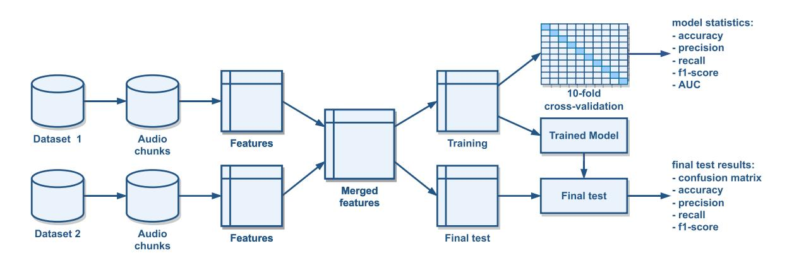
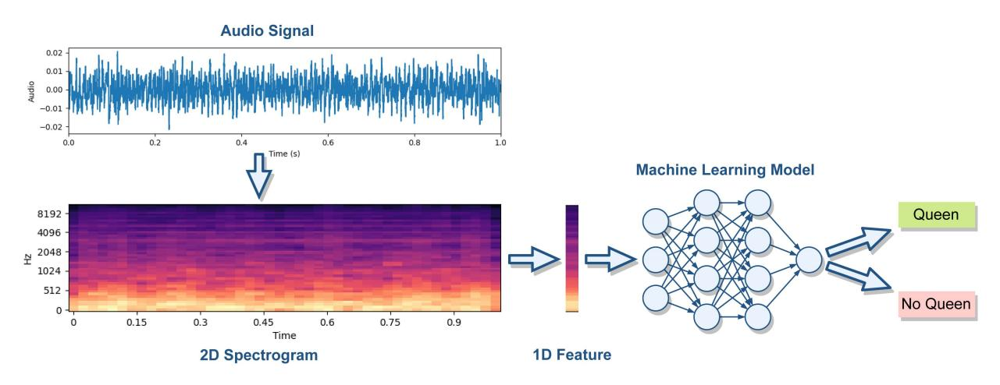
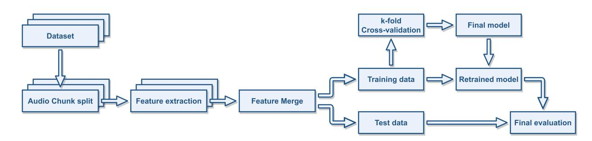
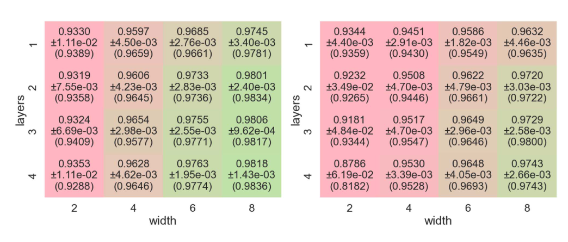
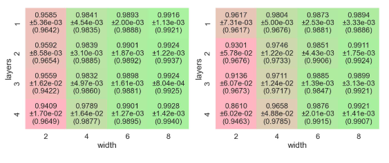
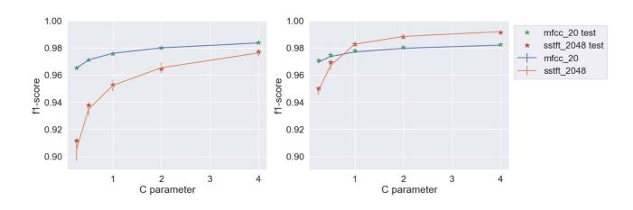
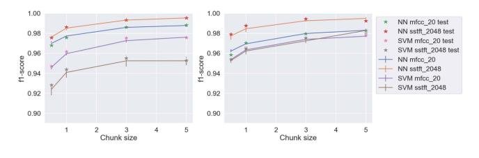
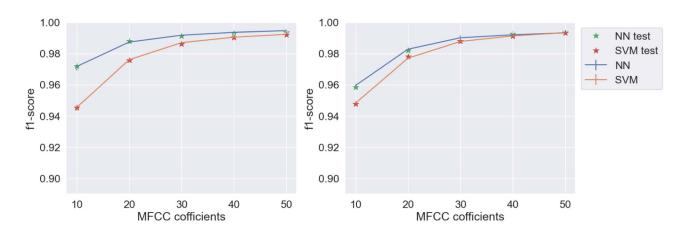
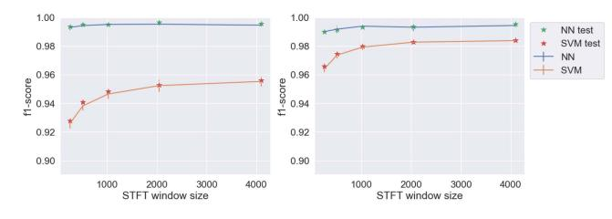
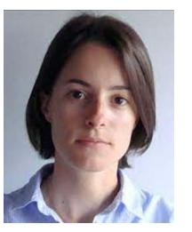

236 IEEE TRANSACTIONS ON AGRIFOOD ELECTRONICS, VOL. 2, NO. 2, SEPTEMBER/OCTOBER 2024

# A Machine Learning Approach for Queen Bee Detection Through Remote Audio Sensing to Safeguard Honeybee Colonies

Luca Barbisan, *Student Member, IEEE*, Giovanna Turvani, and Fabrizio Riente, *Member, IEEE* 

Abstract—Honeybees play a pivotal role in maintaining global ecosystems and agricultural productivity through their indispensable contribution to crop pollination. However, the alarming rise in honeybee mortality, attributed to various stress factors including climate change, has highlighted the urgency of implementing effective monitoring strategies. Remote sensing of beehives emerges as a promising solution, with a focus on understanding and mitigating the impacts of these stressors. Differently from other approaches proposed in the literature, this study specifically explores the potential of lightweight machine learning models and the extraction of compressed feature to enable future deployment on microcontroller devices. The experimentation involves the application of support vector machines and neural network classifiers, considering the influence of variable audio chunk durations, the utilization of different hyperparameters and combining the audio recorded in several hives and available in different datasets.

Index Terms—Bee monitoring, edge computing, environmental monitoring, machine learning.

# I. INTRODUCTION

PRESERVING global biodiversity is one of the current challenges of the current era. Several studies have highlighted a decline in insects on both local and global scales [\[1\]](#page-9-1), all of these are important for maintaining a balanced ecosystem. Among them, honeybees stand out as crucial contributors in global agricultural production, pollinating approximately 70 out of the nearly 100 crop species that contribute to 90% of the world's food supply.

Unfortunately, a significant increase in colony losses has been reported worldwide in recent years, mainly attributed to the phenomenon known as "colony collapse disorder' [2]. Factors, such as climate change, intensive agriculture, land-use alterations, pesticides, biodiversity decline, Varroa mites, and pollution, are identified as the primary causes of global bee mortality. This decline in honeybee health has prompted a growing demand among beekeepers and researchers for innovative methods to monitor colony health effectively.

Different factors can be monitored to detect possible problems that affect the health of a beehive [3]. Some studies focused

Manuscript received 5 February 2024; revised 4 May 2024; accepted 22 May 2024. Date of publication 14 June 2024; date of current version 10 October 2024. This work was supported by the project PNRR-NGEU under Grant MUR - DM 352/2022. This article was recommended by Associate Editor F. Rivet. (Corresponding author: Fabrizio Riente.)

The authors are with the Electronics and Telecommunications Department of Politecnico di Torino, 10129 Torino, Italy (e-mail: fabrizio.riente@polito.it).

Digital Object Identifier 10.1109/TAFE.2024.3406648

on the detection of swarm activities using a combination of weight sensors and microphones [4] or accelerometers [5], [6] and analyzing the signals by means of the short time Fourier transform (STFT) to extract different information. Qandour et al. [7] were able to identify the presence of the Varroa mite inside the hive using recorded sound from inside the colony and extracting different characteristics of the frequency domain, such as the peak frequency, the spectral centroid, the bandwidth, and the frequency of root variance.

Most of the proposed approaches are equipped with multiple sensors to collect hive parameters, such as temperature, humidity, carbon dioxide, and weight [8], [9], [10], [11], [12], but also methods that adopt computer vision for tracking bees at hive entrances demonstrate a good alternative for bee activity monitoring [13], [14]. However, the sound analysis alone has proven to be very effective in detecting various hive events, such as swarming  $[15]$ ,  $[16]$  or the presence and absence of a queen  $[17]$ . The presence of the queen bee is a fundamental condition for the survival of the hive  $[18]$ , the queen is the only fertile female, in the event she dies, the hive would not have any chance of survival. It is important to identify as soon as possible the absence of the queen bee and inform the beekeeper about this event, then he can act to add another queen bee into the hive.

The Internet of Things (IoTs) systems can be a viable solution, they are networks of interconnected devices that communicate and share data over the internet. In the context of audio signal collection, IoT technologies enable the deployment of smart sensor systems. These include wireless sensor networks (WSNs) that allows to cover wide areas, smart microphones for local audio processing, edge computing for latency reduction, cloud integration for data storage and analysis, and machine learning that enables advanced audio analytics. Together, these technologies enhance efficiency and enable various applications, such as remote monitoring and surveillance. Concerning the energy usage and the implications of deploying these systems within a beehive, it is crucial to deploy a device that does not introduce stressors to the hive's natural conditions and does not demand frequent human intervention, such as battery replacements. While certain studies investigate embedded systems with long range communication protocols, some of these approaches may demand considerable computational power and could necessitate modifications to the beehive [8], [13], [14], [19]. This renders them impractical for real-world applications. Recent studies highlight sound analysis as a promising and noninvasive

© 2024 The Authors. This work is licensed under a Creative Commons Attribution 4.0 License. For more information, see https://creativecommons.org/licenses/by/4.0/

BARBISAN et al.: MACHINE LEARNING APPROACH FOR QUEEN BEE DETECTION THROUGH REMOTE AUDIO SENSING 237

Fig. 1. Data flow diagram of the system used in this work to perform all the experiments, it includes the merge of two datasets. The results of the experiments are trained models and a text file that reports the model statistics and the final test results.

technique that incorporates environmental sensors and microphones, while remaining energy-efficient and capable of running AI models efficiently [20], considering the various sounds bees produce for communication through vibroacoustic signals [18] and using machine learning techniques to automatically identify the different beehive conditions  $[12]$ .

Previous solutions have employed convolutional neural networks (NNs) and support vector machines (SVMs) for classifying queen presence from audio recordings and using spectrograms extracted from the audio signals as input for these classifiers [21], [22]. Nevertheless, these networks typically exhibit high complexity, rendering them impractical for batterypowered devices.

This study extends existing research presented in  $[23]$  by examining the performance of NNs and SVMs classifiers, introducing variations in model complexity to enhance the detection of queen presence and extracting features with a reduced number of values. Notably, the focus is solely on utilizing audio information and features derived from it, a deliberate choice aimed at maintaining algorithmic simplicity. This strategy minimizes network input requirements, ultimately considering the computation resources of potential IoT systems based on a microcontroller unit.

In addition, this research combines the dataset introduced in  $[24]$  with the dataset from  $[4]$ . This combination results in a more comprehensive understanding of the study. This article not only enriches the capabilities of the framework presented in [25], but also offers the possibility of integrating multiple heterogeneous datasets. This innovative approach enhances the available data, providing a more accurate estimate of the trained models' performance and gives flexibility in the design space exploration for a future deployment of the model in IoT devices.

# II. METHODOLOGY

The proposed approach relies on using exclusively audio signals captured within the beehive. This noninvasive solution enables continuous monitoring of the beehive, without disturbing the bees or altering their natural behavior. It can provide valuable information for beekeepers, researchers, or conservationists, helping them make informed decisions about hive 

management, health assessments, or interventions if necessary. The sound level amplitude and frequency depend on the colony activity and health state. Flying bees produce a typical sound with an approximate frequency of 250 Hz, worker bees produce a characteristic frequency that lies between 225 and 285 Hz to cool the hive with ventilation, and the frequency can reach up to  $3000 \text{ Hz}$  as a defensive reaction to potential outside threats to the colony [26], [27]. However, if the queen is missing in the beehive the bees produce a sound that contains harmonics with lower frequencies  $[28]$ . Fig. 1 reports the schematic representation of the methodology adopted in this study, details of all steps will be given in the following sections.

## A. Datasets

In order to train and compare the different algorithms, the following two datasets are used. This allows to increase the overall amount of available data and provides additional insights into how well the models can adapt to various beehives. Having a larger dataset also has another advantage because it helps prevent the issue of overfitting while training complex machine learning models.

1) Dataset 1: This dataset [4] comprises 7100 audio and environmental data recordings from European honey bee hives in California. Each file represents a 60 s audio clip recorded at 22 050 Hz with a 32-bit floating-point depth for a single channel. Besides the audio data, each sample includes information about the internal condition of the beehive and the prevailing weather conditions. For our study, we specifically utilized the recorded audio (after removing saturation artifacts) and the label indicating the presence of the queen.

2) Dataset 2: This dataset was created as part of the work in [29]. The data made available in [24] is a selection of recordings acquired through the NU-Hive project  $[30]$  whose main objective is to develop a beenive monitoring system capable of identifying and predict certain events and states of the hive that are of interest to the beekeeper. The dataset consists of recordings from two hives, captured in two distinct states: a "Queen Missing" hive, where the queen bee is absent, and a "Normal" hive, where no abnormal activities are observed. Each hive has a recording for each state, with each audio clip

238 IEEE TRANSACTIONS ON AGRIFOOD ELECTRONICS, VOL. 2, NO. 2, SEPTEMBER/OCTOBER 2024

Fig. 2. Step for extracting the MFCC from the chunk audio file, and then compressed into a single dimension vector computing the average value. Finally the machine learning model will use them to predict the presence of the queen bee.

TABLE I 
DATASET AUGMENTED SIZES WITH HOP SIZE OF 5 S AND DIFFERENT CHUNK I.engths

| Chunk size | Dataset 1 [4] | Dataset 2 [24] | total   |
|------------|---------------|----------------|---------|
| 0.5 s      | 85 200        | 67 524         | 152 724 |
| 1 s        | 85 200        | 67 497         | 152 697 |
| 3 s        | 85 200        | 67 342         | 152 542 |
| 5 s        | 78 100        | 67 049         | 145 149 |

lasting approximately  $10 \text{ min.}$  In total, there are 576 audio files, half labeled as "Missing Queen" and the other half as "Normal Beehive." These recordings represent the activities of the two hives over two distinct days.

## B. Audio Chunk Split

Despite utilizing two datasets with a substantial amount of data, this study incorporates a data augmentation technique to expand the number of input samples. This involves breaking down audio files into smaller segments. Adjusting the hop size, which represents the space between the start of consecutive chunks within the original audio, it is possible to increase the number of chunks. This technique is described in  $[31]$  with the name "time slicing window" and can be found in other works [32] with similar names like "TimeShiftRange" and "RandXTranslation." We subsequently evaluate the impact on the results by exploring various chunk sizes: 0.5, 1, 3, and 5 s, while maintaining the same number of chunks and avoiding overlap. To attain this objective, a hop size of  $5 \text{ s}$  was utilized, leading to varying numbers of samples as detailed in Table I. The inconsistency in the count of resulting segments arises from the consideration of only complete chunks, with no employment of padding techniques to ensure uniform length across all audio files.

## C. Feature Extraction

Using raw audio data for sound classification is not convenient due to its high dimensionality, leading to computational challenges and increased processing costs. Raw waveforms may

not directly capture relevant features for classification, requiring sophisticated feature extraction techniques. In addition, raw audio is susceptible to environmental noise, making models sensitive and less robust. To address these issues, different preprocessing techniques are commonly employed to enhance model efficiency and performance by providing more compact and informative representations of the audio signals. In this study are compared two types of features: mel-frequency cepstral coefficients (MFCC) and the STFT spectrograms. These preprocessing techniques are used to produce the input vector used by the machine learning model as shown in Fig. 2.

Mel-Frequency cepstral coefficients: The first method is a widely-used technique for acoustic-applications [33], in particular, to capture relevant characteristics of the human auditory system by transforming the audio signal into a compact representation with a user-defined number, denoted as  $n$ , of coefficients. Results were compared across varying  $n$  values from 10 to 50. By extracting a relatively small number of coefficients, MFCCs reduce the dimensionality of the feature space while retaining essential information about the audio signal. This is crucial for efficient processing and classification. The MFCC extraction is done on each audio chunk of the dataset, this process is explained by the following sequence of steps necessary to obtain the MFCC coefficients vector.

- 1) Division of the audio into windows of 2048 audio samples with partial overlap, using a hop length of 512 samples.
- 2) Application of the Hann windowing function to smooth the signal at the window edges.
- 3) Use of discrete Fourier transform (DFT) to convert the signal to the frequency domain.
- 4) Application of the mel filterbank set of triangular filters, evenly spaced on the Mel scale.
- 5) Application of discrete cosine transform to obtain coefficients for each window.
- 6) Computation of the mean value for each coefficient across all windows, resulting in the  $n$  features that will be used as input for the classifiers.

*Short Time Fourier Transform*: The second method uses only the Fourier transform as explained in  $[34]$ , to obtain a reduced 

BARBISAN et al.: MACHINE LEARNING APPROACH FOR QUEEN BEE DETECTION THROUGH REMOTE AUDIO SENSING 239

amount of coefficients but reducing the necessary steps and computational complexity with respect to the MFCC as follows.

- 1) Division of the audio into windows ranging from 256 to 4096 audio samples without overlapping.
- 2) Application of the Hann windowing function for signal smoothing at the window edges.
- 3) Application of DFT to each window for signal frequency domain conversion.
- 4) Computation of the magnitude of the spectrogram.
- 5) Calculation of the mean value for each frequency bin across all chunk duration. This step results in a number of input values for the classifier that depends on the window size  $n_{\text{bins}} = \frac{m}{2} + 1$ , where m represents the window size.

## D. Classifiers

In this study, we conducted a comparison between two distinct classifiers for the binary classification task: one is a NN implemented through the Keras library  $[35]$ , and the other is a SVM implemented using the scikit-learn (sklearn) library [36]. We focused on these two algorithms without considering convolutional networks that are used in other works [21], [29] because our intention is to keep the complexity of these algorithms low, with the aim of deploying them in microcontroller systems with low hardware resources.

1) NN Classifier: Represents a powerful and adaptable machine learning model with the capability to identify intricate patterns in data. The presented approach involved constructing a multilayer perceptron architecture with fully connected layers. There are two hidden layers, the first with eight neurons and the second with four neurons. This architecture is used in all the experiments except for the one in which different NN sizes are compared (Section III-B). Each node is implemented with rectified linear unit (ReLU) activation function, while the output layers employ a sigmoid function. The final step involved converting the output to a binary value using a threshold of  $0.5$ . During the training process, we implemented early stopping with a patience of  $5$  to prevent overfitting and identify the optimal number of epochs necessary for the training.

2) SVM Classifier: It is a widely adopted and powerful supervised learning algorithm designed for classification tasks. Its functionality involves identifying an optimal hyperplane that maximizes the separation between data points associated with distinct classes. In our implementation of SVM, we employed the sklearn library [36], which offers a robust set of tools for machine learning in Python. During our experimentation, we specifically worked with the radial basis function kernel function and fine-tuned the  $C$  parameter for optimal performance.

These classifier parameters are chosen in order to replicate the architecture used in  $[29]$ , but reducing the complexity of the models removing the convolution layers and scaling down the architecture size and obtaining a lighter model.

## E. Evaluation Metrics

At the end of each experiment, obtaining a set of parameters is crucial to compare different characteristics and provide a good estimation of which model performs better in detecting 

the presence of the queen bee. In particular, this work adopts the technique of crossvalidation by dividing the training set into tenfolds. The metrics extracted include both the mean value and the standard deviation, which are extracted across ten models. These models are trained with nine folds and tested with the remaining fold, with a variation in the selected folders for each iteration. The metrics presented are the most common and widely used for binary classifiers considering true positive (TP) and true negative (TN) the correctly predicted values that can be positive (queen presence) or negative (queen absence), and the  $\text{false positive (FP)}$  and  $\text{false negative (FN)}$  the wrong predicted samples as follows.

1) *Precision [positive predicted value (PPV)]:* It is the ratio of correctly predicted positive observations to the total predicted positives. It provides insights into the accuracy of positive predictions

$$
PPV = \frac{TP}{TP + FP}.
$$

(1)

2) *Recall [true positive rate (TPR)]:* It is the ratio of correctly predicted positive observations to the total actual positives. It assesses the ability of the model to capture all the relevant instances

$$
TPR = \frac{TP}{TP + FN}
$$

(2)

3) Accuracy: Measures the overall correctness of the classification model. It is the ratio of correctly predicted instances to the total instances

$$
\text{ACC} = \frac{\text{TP} + \text{TN}}{\text{TP} + \text{FN} + \text{FP} + \text{TN}}.
$$
 
(3)

4) *F1 score:* The F1 score is the harmonic mean of precision and recall. It provides a balance between precision and recall, considering both FP and FN

$$
F_1 \text{score} = \frac{2 \cdot \text{TP}}{2 \cdot \text{TP} + \text{FP} + \text{FN}}.
$$

(4)

- 5) Receiver operating characteristic area under the curve (ROC AUC): ROC AUC represents the area under the ROC curve, which is a plot of the TRP against the FP rate. It evaluates the model's ability to distinguish between classes.
- 6) *Confusion matrix:* Provides a detailed breakdown of TP, TN, FP, and FN predictions. It is especially useful for understanding the model's performance on the final test.

By evaluating these metrics, it becomes possible to comprehensively assess the classification performance of different models, considering various aspects. The use of cross-validation ensures a robust evaluation, and reporting both mean values and standard deviations adds a measure of the stability of the model's performance across different folds.

## F. Framework Improvements

In this work, we enriched our Python framework introduced in  $[25]$ . Specifically, we integrated the possibility of managing additional datasets, and in particular the dataset presented

240 IEEE TRANSACTIONS ON AGRIFOOD ELECTRONICS, VOL. 2, NO. 2, SEPTEMBER/OCTOBER 2024

Fig. 3. Diagram with the step sequence followed during the experiments, each of these have different configuration parameters that can be set in a configuration file in order to automatize the process of producing the following results.

TABLE II 
NN ARCHITECTURE

| Layer   | Size                        |
|---------|-----------------------------|
| Input   | Depends on the feature size |
| Inner 1 | $16$ fully connected (ReLU) |
| Inner 2 | 8 fully connected (ReLU)    |
| Output  | Sigmoid function            |

in [29], named dataset 2. This dataset presents a different subfolders organization with respect to dataset  $1[4]$  that was already available. Subsequently, we have incorporated the ability to amalgamate extracted features from diverse datasets and store them in distinct folders. This facilitates the efficient reuse of data for conducting multiple experiments on audio chunks with identical settings, preventing the need to re-extract features that are already available. The complete dataflow is shown in Fig. 1, where it is visible that the features are merged only after the extraction from the relative dataset, and following operations are performed as they would be done for a single dataset.

# III. RESULTS

## A. Experiment Setup

All the experiments execute the complete sequences of steps described in Fig. 3. Starting from a base configuration, each group of experiments explored the effect of different settings on the classification performances of the model. The base configuration has the following settings.

- 1) Audio chunk split: Length of 5 s with a hop size of 5 s, so they are contiguous without overlapping.
- 2) Feature extraction: For each experiment two types of audio features are extracted: MFCC with 20 coefficients and STFT with a window size of 1024 samples.
- 3) Training/test data split: Training data are 80% and the remaining 20% are used for the final test.
- 4) K-fold cross-validation: It is performed dividing the training set into 10 folders.
- 5) Classifiers: The NN has two fully connected inner layers with an architecture resumed in Table  $\mathbf{II}$ , and the SVM is trained with the C parameter set to one.

## B. NN Size Influence

In the subsequent set of experiments, we explored the impact of varying the NN size by adjusting the number of layers from 1

Fig. 4. Cross-validation and final test results changing the number of layers and the number of nodes in the NN using the MFCC features. On the left the F1-score using only dataset 1 and on the right combining dataset 1 and dataset 2. In these figures is reported the mean value  $\pm$  the standard deviation and, between parenthesis, the final test.

Fig. 5. Cross-validation and final test results changing the number of layers and the number of nodes in the NN using the STFT features. On the left the F1-score using only dataset 1 and on the right combining dataset 1 and dataset 2. In these figures is reported the mean value  $\pm$  the standard deviation and, between parenthesis, the final test.

to 4 and modifying the number of neurons per layer within the range of  $2 \text{ to } 8$ . The experiments were conducted separately using MFCC features and STFT features. The findings, presented in Figs. 4 and 5, align with the trend observed in the prior study  $[23]$ , indicating that larger networks tend to achieve higher F1-score. It is important to note, however, that when utilizing combined datasets, a slightly lower accuracy is observed compared to the results obtained with individual datasets. The simplest network, with four layers and two neurons, shows a reduction of the F1score of about 8% and 5% with MFCC and STFT, respectively. However, the gap is reduced to  $1\%$  or lower values when at least six neurons per layer are present. Colors in Figs. 4 and  $5$  are scaled to the same range to make them comparable. It is possible to visually observe that STFT features better performed over MFCC features in almost all cases, with exceptions for the smallest networks.

BARBISAN et al.: MACHINE LEARNING APPROACH FOR QUEEN BEE DETECTION THROUGH REMOTE AUDIO SENSING 241

Fig. 6. Cross-validation and final test results changing the C parameter for the SVM classifier. On the left using only dataset 1 and on the right combining dataset 1 and dataset 2.

TABLE III 
ACCURACY AND F1-SCORE OF SVM WITH DIFFERENT REGULARIZATION FACTORS

| C    | Feature | Accuracy          | Accuracy test | F1-score          | F1-score test |
|------|---------|-------------------|---------------|-------------------|---------------|
| 0.25 | MFCC    | 0.9575 ± 1.41E-03 | 0.9598        | 0.9696 ± 1.00E-03 | 0.9710        |
| 0.5  | MFCC    | 0.9633 ± 1.33E-03 | 0.9651        | 0.9737 ± 9.61E-04 | 0.9748        |
| 1    | MFCC    | 0.9680 ± 1.42E-03 | 0.9698        | 0.9770 ± 1.05E-03 | 0.9781        |
| 2    | MFCC    | 0.9718 ± 1.35E-03 | 0.9733        | 0.9798 ± 1.00E-03 | 0.9807        |
| 4    | MFCC    | 0.9751 ± 1.39E-03 | <b>0.9762</b> | 0.9821 ± 1.05E-03 | <b>0.9827</b> |
| 0.25 | STFT    | 0.9290 ± 3.48E-03 | 0.9320        | 0.9484 ± 2.57E-03 | 0.9501        |
| 0.5  | stft    | 0.9544 ± 3.81E-03 | 0.9583        | 0.9670 ± 2.83E-03 | 0.9696        |
| 1    | stft    | 0.9760 ± 2.18E-03 | 0.9764        | 0.9828 ± 1.60E-03 | 0.9829        |
| 2    | stft    | 0.9840 ± 1.27E-03 | 0.9840        | 0.9885 ± 9.24E-04 | 0.9884        |
| 4    | stft    | 0.9889 ± 9.01E-04 | <b>0.9884</b> | 0.9920 ± 6.61E-04 | <b>0.9916</b> |

The bold values are the best results obtained for that experiment, and for the two metrics "accuracy" and "fl-score".

Fig. 7. Crossvalidation and final test results changing the size of the chunks but keeping the hop size constant. On the left using only dataset 1 and on the right combining dataset 1 and dataset 2.

## C. SVM Regularization Parameter Influence

The second set of experiments was conducted on the SVM by changing the parameter  $C$  and applying this classifier first to the MFCC features and then also to the STFT features. The use of the two combined datasets in this case allows for higher accuracy for the STFT features with larger values of C, as highlighted in Fig. 6 and in Table III. On the other hand, for the MFCC features, the accuracy remains very similar. One reason of the higher accuracy in STFT case can be related to the SVM sensitivity and its robustness to high-dimensional data [\[37\]](#page-9-1). The nature of the STFT features, capturing detailed frequency information, might align well with SVM's sensitivity to the input space, resulting in improved classification performance with increased C.

## D. Audio Chunks Length Influence

In these experiments, the size of the audio chunks was varied, from which both MFCC and STFT features were subsequently extracted. Then, both NN and SVM models were trained with the same inputs to generate the graphs in Fig.  $7$ , and the numerical results are reported in Tables  $IV$  and  $V$ . The observed trend in accuracy, as previously documented in  $[23]$ , regarding the influence of chunk size is reaffirmed. This trend indicates that

TABLE IV 
SVM ACCURACY AND F1-SCORE WITH DIFFERENT CHUNK SIZES

| Chunk size | Feature | Accuracy              | Accuracy test | F1-score              | F1-score test |
|------------|---------|-----------------------|---------------|-----------------------|---------------|
| 0.5        | mfcc    | $0.9352 \pm 2.85E-03$ | 0.9362        | $0.9537 \pm 2.10E-03$ | 0.9543        |
| 1          | mfcc    | $0.9486 \pm 1.76E-03$ | 0.9525        | $0.9634 \pm 1.18E-03$ | 0.9659        |
| 3          | mfcc    | $0.9633 \pm 1.49E-03$ | 0.9648        | $0.9739 \pm 1.25E-03$ | 0.9748        |
| 5          | mfcc    | $0.9680 \pm 1.42E-03$ | 0.9698        | $0.9770 \pm 1.05E-03$ | 0.9781        |
| 0.5        | stft    | $0.9337 \pm 2.85E-03$ | 0.9358        | $0.9526 \pm 2.05E-03$ | 0.9540        |
| 1          | stft    | $0.9471 \pm 4.89E-03$ | 0.9511        | $0.9622 \pm 3.47E-03$ | 0.9649        |
| 3          | stft    | $0.9614 \pm 3.15E-03$ | 0.9658        | $0.9724 \pm 2.28E-03$ | 0.9755        |
| 5          | stft    | $0.9760 \pm 2.18E-03$ | 0.9764        | $0.9828 \pm 1.60E-03$ | 0.9829        |

The bold values are the best results obtained for that experiment, and for the two metrics "accuracy" and "fl-score".

TABLE V 
NN ACCURACY AND F1-SCORE WITH DIFFERENT CHUNK SIZES

| Chunk size | Feature | Accuracy              | Accuracy test | F1-score              | F1-score test |
|------------|---------|-----------------------|---------------|-----------------------|---------------|
| 0.5        | mfcc    | $0.9462 \pm 2.55E-03$ | 0.9419        | $0.9622 \pm 1.78E-03$ | 0.9586        |
| 1          | mfcc    | $0.9566 \pm 4.39E-03$ | 0.9583        | $0.9694 \pm 3.09E-03$ | 0.9704        |
| 3          | mfcc    | $0.9713 \pm 2.20E-03$ | 0.9714        | $0.9797 \pm 1.59E-03$ | 0.9797        |
| 5          | mfcc    | $0.9761 \pm 2.16E-03$ | 0.9732        | $0.9830 \pm 1.51E-03$ | 0.9806        |
| 0.5        | stft    | $0.9679 \pm 5.09E-03$ | 0.9707        | $0.9774 \pm 3.55E-03$ | 0.9791        |
| 1          | stft    | $0.9781 \pm 5.03E-03$ | 0.9828        | $0.9845 \pm 3.38E-03$ | 0.9878        |
| 3          | stft    | $0.9894 \pm 1.48E-03$ | 0.9921        | $0.9925 \pm 1.01E-03$ | 0.9944        |
| 5          | stft    | $0.9927 \pm 1.69E-03$ | 0.9897        | $0.9948 \pm 1.22E-03$ | 0.9926        |

The bold values are the best results obtained for that experiment, and for the two metrics "accuracy" and "fl-score"

Fig. 8. Cross-validation and final test results changing the number of extracted MFCC. On the left using only dataset 1 and on the right combining dataset 1 and dataset 2.

longer audio segments contribute to improved results. How-  
ever, it is crucial to acknowledge that longer audio chunks also necessitate higher computational resources, a factor that may pose challenges in low-power IoT systems where such resources are not always readily available. It is noteworthy that the results from the experiment involving 1-s chunks (AUC =  $0.9876 \pm 8.08E-04$ ) surpass significantly the outcomes achieved in [\[29\]](#page-9-1), where MFCC\_20 features and an SVM classifier were employed, resulting in an AUC of approximately  $0.91$  using only the dataset 2 [\[24\]](#page-9-1).

## E. Feature Resolution Influence

In the last group of experiments, the audio feature parameters were modified affecting the size of the features extracted from the audio files. This determines the number of inputs required in the classifier model. The results obtained and represented in Figs.  $8$  and  $9$  confirm the trend demonstrated in the previous work  $[23]$ , where features with a greater number of coefficients benefit the classifier because they contain more details necessary for achieving higher accuracy. This is visible also in Tables  $VI$ and VII where the best accuracy is obtained with the higher resolution features. The downside is that higher number of features require more complex classifiers, for example the number of input nodes of the NN increases. This will require more memory to store the classifier model but also increases the complexity of

Fig. 9. Crossvalidation and final test results changing the window size of the STFT features. On the left using only dataset 1 and on the right combining dataset 1 and dataset 2.

TABLE VI 
ACCURACY AND F1-SCORE WITH NN AND DIFFERENT FEATURES

| Feature parameter | Accuracy              | Accuracy test | F1-score              | F1-score test |
|-------------------|-----------------------|---------------|-----------------------|---------------|
| mfcc 10           | $0.9429 \pm 1.94E-03$ | 0.9419        | $0.9596 \pm 1.51E-03$ | 0.9586        |
| mfcc 20           | $0.9758 \pm 2.73E-03$ | 0.9751        | $0.9828 \pm 1.87E-03$ | 0.9820        |
| mfcc 30           | $0.9862 \pm 1.89E-03$ | 0.9829        | $0.9901 \pm 1.35E-03$ | 0.9877        |
| mfcc 40           | $0.9889 \pm 1.48E-03$ | 0.9900        | $0.9920 \pm 1.09E-03$ | 0.9928        |
| mfcc 50           | $0.9906 \pm 1.75E-03$ | 0.9918        | $0.9933 \pm 1.27E-03$ | 0.9941        |
| stft 256          | $0.9862 \pm 1.72E-03$ | 0.9862        | $0.9902 \pm 1.25E-03$ | 0.9900        |
| stft 512          | $0.9885 \pm 3.88E-03$ | 0.9884        | $0.9918 \pm 2.74E-03$ | 0.9916        |
| stft 1024         | $0.9915 \pm 1.64E-03$ | 0.9910        | $0.9939 \pm 1.18E-03$ | 0.9935        |
| stft 2048         | $0.9904 \pm 3.59E-03$ | 0.9913        | $0.9932 \pm 2.55E-03$ | 0.9937        |
| stft 4096         | $0.9921 \pm 1.61E-03$ | 0.9935        | $0.9944 \pm 1.14E-03$ | 0.9953        |

The bold values are the best results obtained for that experiment, and for the two metrics "accuracy" and "f1-score".

TABLE VII 
ACCURACY AND F1-SCORE WITH SVM AND DIFFERENT FEATURES

| Feature param     | Accuracy                     | Accuracy test | F1-score                     | F1-score test |
|-------------------|------------------------------|---------------|------------------------------|---------------|
| $\text{mfcc } 10$ | $0.9280 \pm 1.79\text{E}-03$ | 0.9279        | $0.9483 \pm 1.25\text{E}-03$ | 0.9477        |
| $\text{mfcc } 20$ | $0.9680 \pm 1.42\text{E}-03$ | 0.9698        | $0.9770 \pm 1.05\text{E}-03$ | 0.9781        |
| $\text{mfcc } 30$ | $0.9830 \pm 1.13\text{E}-03$ | 0.9835        | $0.9878 \pm 8.32\text{E}-04$ | 0.9880        |
| $\text{mfcc } 40$ | $0.9879 \pm 1.14\text{E}-03$ | 0.9881        | $0.9913 \pm 8.15\text{E}-04$ | 0.9914        |
| $\text{mfcc } 50$ | $0.9908 \pm 1.19\text{E}-03$ | 0.9908        | $0.9934 \pm 8.46\text{E}-04$ | 0.9933        |
| fft 256           | $0.9502 \pm 3.17\text{E}-03$ | 0.9534        | $0.9641 \pm 2.38\text{E}-03$ | 0.9661        |
| fft 512           | $0.9635 \pm 3.26\text{E}-03$ | 0.9652        | $0.9737 \pm 2.43\text{E}-03$ | 0.9747        |
| fft 1024          | $0.9712 \pm 2.74\text{E}-03$ | 0.9723        | $0.9793 \pm 2.03\text{E}-03$ | 0.9799        |
| fft 2048          | $0.9760 \pm 2.18\text{E}-03$ | 0.9764        | $0.9828 \pm 1.60\text{E}-03$ | 0.9829        |
| fft 4096          | $0.9775 \pm 1.83\text{E}-03$ | 0.9783        | $0.9838 \pm 1.36\text{E}-03$ | 0.9843        |

The bold values are the best results obtained for that experiment, and for the two metrics "accuracy" and "fl-score".

the feature extraction that will require more time to be computed and also more memory to store them temporarily during the computation. So it is important to find a tradeoff between the required accuracy of the predictions and the hardware resources that can be very limited in case of IoT devices that in most of the cases are microcontrollers powered by a small battery that should last for months or years before the replacement.

# IV. CONCLUSION

The results indicate that larger classifier models exhibit greater accuracy in detecting the presence of the queen bee. However, it is noteworthy that these models also demand more computational resources making them less practical for IoT applications. In scenarios where edge computing on small batterypowered devices is essential for extended operational periods, smaller classifiers may be more suitable despite a potential decrease in accuracy.

We can notice also the importance of having an extensive number of datasets to generate models that are not specific to a particular beehive but can adapt to others as well. In this work, we observed that having data from different hives slightly reduces accuracy but enhances generalization capabilities of the classification models. The size of the audio files also has a significant effect on the accuracy of the machine learning 

models used. Here, it is necessary to find a compromise between prediction accuracy and the memory space used to record the audio, which also leads to an increased number of computations needed to process and extract features.

Lastly, information compression into a reduced number of values is essential. This allows for a reduction in the complexity of the classifier model without losing too much information and degrading performance excessively. Overall, the findings demonstrated superior performance when employing STFT compared to MFCC features. However, this improvement comes at the expense of increased memory demands for storing such data on a potential IoT device. This suggests the necessity for a trade-off, coupled with the implementation of effective feature selection techniques.

In summary, the research emphasizes the efficacy of audiobased methods for detecting the queen bee in beehives. While larger classifiers offer superior accuracy, their resource-intensive nature poses challenges for IoT applications. Achieving a balance between accuracy and resource efficiency is crucial in these contexts, making smaller classifiers more practical for prolonged operational periods without sacrificing essential detection capabilities.

 # REFERENCES

- [1] N. E. Duffus, A. Echeverri, L. Dempewolf, J. A. Noriega, P. R. Furumo, and J. Morimoto, "The present and future of insect biodiversity conservation in the neotropics: Policy gaps and recommendations," Neotropical Entomol., vol. 52, no. 3, pp. 407-421, 2023.
- [2] J.-P. Faucon et al., "Honey bee winter mortality in France in 1999 and 2000," Bee World, vol. 83, no. 1, pp. 14-23, 2002.
- [3] P. P. Danieli, N. F. Addeo, F. Lazzari, F. Manganello, and F. Bovera, "Precision beekeeping systems: State of the art, pros and cons, and their application as tools for advancing the beekeeping sector," Animals, vol. 14, no. 1, 2023, Art. no. 70.
- [4] T. A. Cecchi Stefania, S. Susanna, and O. Simone, "A smart sensor-based measurement system for advanced bee hive monitoring," Sensors, vol. 20, no. 9, 2020, Art. no. 2726.
- [5] M.-T. Ramsey et al., "The prediction of swarming in honeybee colonies using vibrational spectra," Sci. Rep., vol. 10, no. 1, 2020, Art. no. 9798.
- [6] C. Uthoff, M. N. Homsi, and M. von Bergen, "Acoustic and vibration monitoring of honeybee colonies for beekeeping-relevant aspects of presence of queen bee and swarming," Comput. Electron. Agriculture, vol. 205, 2023, Art. no. 107589.
- [7] A. Qandour, I. Ahmad, D. Habibi, and M. Leppard, "Remote beehive monitoring using acoustic signals," Acoustics Australia, vol. 42, no. 3, pp. 204-209, 2014.
- [8] C. Stefania, S. Spinsante, T. Alessandro, and O. Simone, "A smart sensorbased measurement system for advanced bee hive monitoring," *Sensors*, vol. 20, no. 9, p. 2726, 2020. [Online]. Available: https://www.mdpi.com/ 1424-8220/20/9/2726
- [9] F. Bellino, G. Turvani, U. Garlando, and F. Riente, "An integrated multisensor system for remote bee health monitoring," in Proc. IEEE Workshop Metrol. Agriculture Forestry, 2022, pp. 334-338.
- [10] P. Catania and M. Vallone, "Application of a precision apiculture system to monitor honey daily production," Sensors, vol. 20, no. 7, 2020, Art. no. 2012
- [11] A. R. Braga, D. G. Gomes, R. Rogers, E. E. Hassler, B. M. Freitas, and J. A. Cazier, "A method for mining combined data from in-hive sensors, weather and apiary inspections to forecast the health status of honey bee colonies," Comput. Electron. Agriculture, vol. 169, 2020, Art. no. 105161.
- [12] T. Zhang, S. Zmyslony, S. Nozdrenkov, M. Smith, and B. Hopkins, "Semisupervised audio representation learning for modeling beehive strengths," 2021. arXiv:2105.10536.
- [13] T. N. Ngo, K.-C. Wu, E.-C. Yang, and T.-T. Lin, "A real-time imaging system for multiple honey bee tracking and activity monitoring," *Comput. Electron. Agriculture*, vol. 163, 2019, Art. no. 104841.
- [14] C. Yang and J. Collins, "A model for honey bee tracking on 2 d video," in Proc. Int. Conf. Image Vis. Comput. New Zealand, 2015, pp. 1-6.

BARBISAN et al.: MACHINE LEARNING APPROACH FOR QUEEN BEE DETECTION THROUGH REMOTE AUDIO SENSING 243

- [15] D. G. Dietlein, "A method for remote monitoring of activity of honeybee colonies by sound analysis," J. Apicultural Res., vol. 24, no. 3, pp. 176–183, 1985.
- [16] A. Zgank, "Bee swarm activity acoustic classification for an IoT-based farm service," Sensors, vol. 20, no. 1, 2019, Art. no. 21.
- [17] H. Eren, L. Whiffler, and R. Manning, "Electronic sensing and identification of queen bees in honeybee colonies," in Proc. IEEE Instrum. Meas. Technol. Conf. Sens., Process., Network., vol. 2, 1997, vol. 2, pp. 1052-1055.
- [18] W. H. Kirchner, "Acoustical communication in honeybees," *Apidologie*, vol. 24, no. 3, pp. 297-307, 1993, doi: 10.1051/apido:19930309.
- [19] I. Rigakis, I. Potamitis, N.-A. Tatlas, G. Psirofonia, E. Tzagaraki, and E. Alissandrakis, "A low-cost, low-power, multisensory device, and multivariable time series prediction for beehive health monitoring," Sensors, vol. 23, no. 3, 2023, Art. no. 1407.
- [20] A. Robles-Guerrero, T. Saucedo-Anaya, C. A. Guerrero-Mendez, S. Gómez-Jiménez, and D. J. Navarro-Solís, "Comparative study of machine learning models for bee colony acoustic pattern classification on low computational resources," Sensors, vol. 23, no. 1, 2023, Art. no. 460.
- [21] A. Terenzi, N. Ortolani, I. Nolasco, E. Benetos, and S. Cecchi, "Comparison of feature extraction methods for sound-based classification of honey bee activity," IEEE/ACM Trans. Audio, Speech, Lang. Process., vol. 30, pp. 112–122, Dec. 2021.
- [22] A. Robles-Guerrero, T. Saucedo-Anaya, E. González-Ramírez, and J. I. De la Rosa-Vargas, "Analysis of a multiclass classification problem by lasso logistic regression and singular value decomposition to identify sound patterns in queenless bee colonies," Comput. Electron. Agriculture, vol. 159, pp. 69-74, 2019.
- [23] L. Barbisan, G. Turvani, and R. Fabrizio, "Audio-based identification of queen bee presence inside beehives," in Proc. IEEE Conf. AgriFood Electron., 2023, pp. 70-74.
- [24] I. Nolasco, A. Terenzi, S. Cecchi, S. Orcioni, H. L. Bear, and E. Benetos, "Audio-based identification of beehive states," in Proc. IEEE Int. Conf. Acoust, Speech Signal Process., Brighton, UK, 2019, pp. 8256-8260, doi: 10.1109/ICASSP.2019.8682981.
- [25] L. Barbisan and F. Riente, "Machine learning framework for the acoustic detection of the queen bee presence," in Proc. 10th Conv. Eur. Acoustics Ass., Turin, Italy, 2023, pp. 4347-4350, doi: 10.61782/fa.2023.1309.
- [26] A. Žgank, "Acoustic monitoring and classification of bee swarm activity using MFCC feature extraction and HMM acoustic modeling," in *Proc.* ELEKTRO, 2018, pp. 1-4.
- [27] W. Kirchner, "Acoustical communication in honeybees," Apidologie, vol. 24, no. 3, pp. 297-307, 1993.
- [28] A. Terenzi, S. Cecchi, S. Orcioni, and F. Piazza, "Features extraction applied to the analysis of the sounds emitted by honey bees in a beehive," in *Proc. IEEE 11th Int. Symp. Image Signal Process. Anal.*, 2019, pp. 03–08.
- [29] N. Inês, T. Alessandro, C. Stefania, O. Simone, B. H. L., and B. Emmanouil, "Audio-based identification of beehive states," in Proc. IEEE Int. Conf. Acoust., Speech Signal Process., 2019, pp. 8256-8260.
- [30] S. Cecchi, A. Terenzi, S. Orcioni, P. Riolo, S. Ruschioni, and N. Isidoro, "A preliminary study of sounds emitted by honey bees in a beehive," in Proc. Audio Eng. Soc. Conv., 2018, Art. no. 9981.
- [31] G. Iglesias, E. Talavera, Á. González-Prieto, A. Mozo, and S. Gómez-Canaval, "Data augmentation techniques in time series domain: A survey and taxonomy," Neural Comput. Appl., vol. 35, no. 14, pp. 10123-10145, 2023.
- [32] L. Nanni, G. Maguolo, and M. Paci, "Data augmentation approaches for improving animal audio classification," *Ecological Informat.*, vol. 57, 2020, Art. no. 101084.
- [33] Z. K. Abdul and A. K. Al-Talabani, "Mel frequency cepstral coefficient and its applications: A review," IEEE Access, vol. 10, pp. 122136-122158, 2022.

- [34] T. Baba, "Time-frequency analysis using short time Fourier transform," Open Acoust. J., vol. 5, no. 1, pp. 32-38, 2012.
- [35] F. Chollet et al., "Keras," 2015. [Online]. Available: https://keras.io
- [36] F. Pedregosa et al., "Scikit-learn: Machine learning in python," J. Mach. Learn. Res., vol. 12, pp. 2825-2830, 2011.
- [37] H. Xu, C. Caramanis, and S. Mannor, "Robustness and regularization of support vector machines," J. Mach. Learn. Res., vol. 10, pp. 1485–1510, Dec. 2009.

Luca Barbisan (Student Member, IEEE) received the bachelor's degree in electronics and telecommunication engineering from the University of Trento, Trento, Italy, in 2017, and the master's degree in electronics engineering in 2021 from Politecnico di Torino, Turin, Italy, where he is currently working toward the Ph.D. degree in electronics and telecommunications engineering.

His current research interests include digital signal processing and modern machine learning techniques, mainly applied to audio signals.

Giovanna Turvani received the master's degree (magna cum laude) in electronic and telecommunication engineering and the Ph.D. degree in electronics and telecommunications from the Politecnico di Torino, Turin, Italy, in 2016.

In 2015, she went to the Technical University of Munich, Munich, Germany, for research on nanocomputing. After that, she worked as a Postdoctoral Researcher with the Politecnico di Torino, focusing on microwave imaging systems for biomedical use and food safety. Currently, she is a Professor Assistant

with the Politecnico di Torino, researching low-power embedded systems for environmental monitoring, quantum computing, and digital architectures based on the logic-in-memory paradigm.

Fabrizio Riente (Member, IEEE) received the M.Sc. degree (magna cum laude) in electronic engineering and the Ph.D. degree in electronics and telecommunications from the Politecnico di Torino in 2012 and 2016, respectively.

He was a Postdoctoral Research Associate with the Technical University of Munich, Munich, Germany, in 2016. He is currently an Assistant Professor with the Department of Electronics and Telecommunications, Politecnico di Torino, Turin, Italy. His primary research interests include device modeling,

circuit design for nano-computing, with particular interest on field-coupled nanotechnologies, the development audio processing systems, and low-power IoT devices.

Open Access funding provided by 'Politecnico di Torino' within the CRUI CARE Agreement