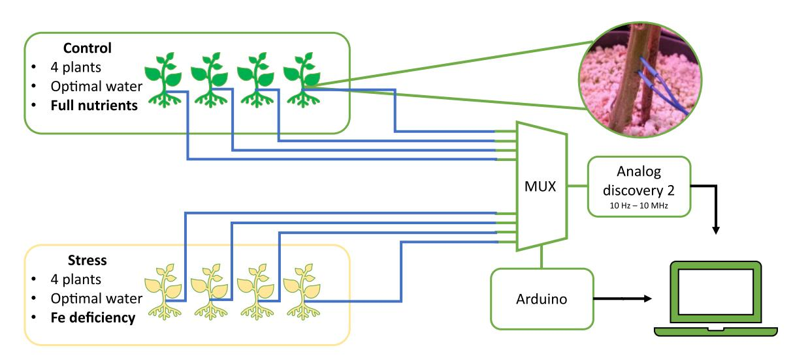
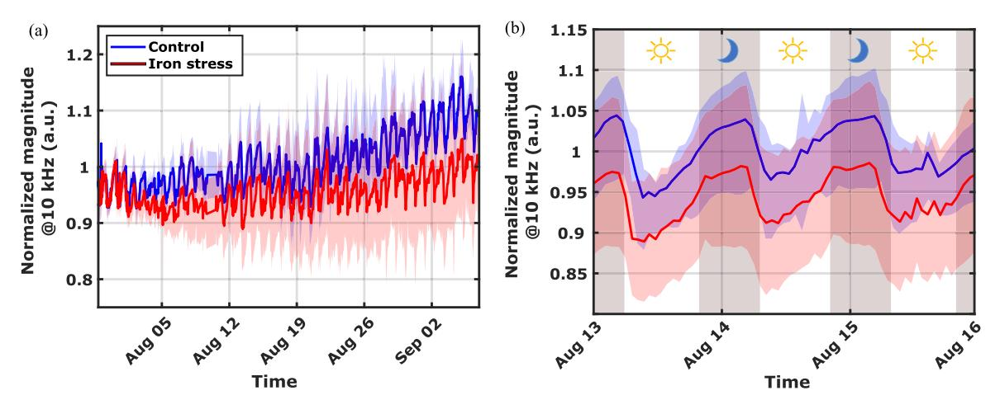
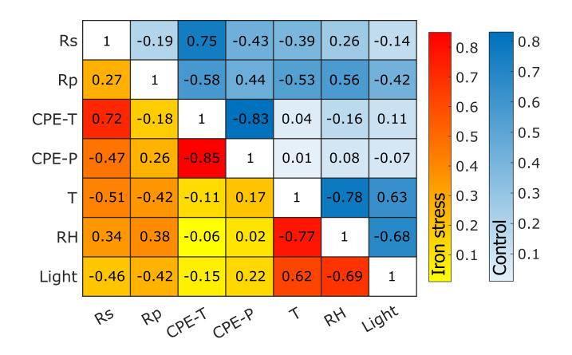
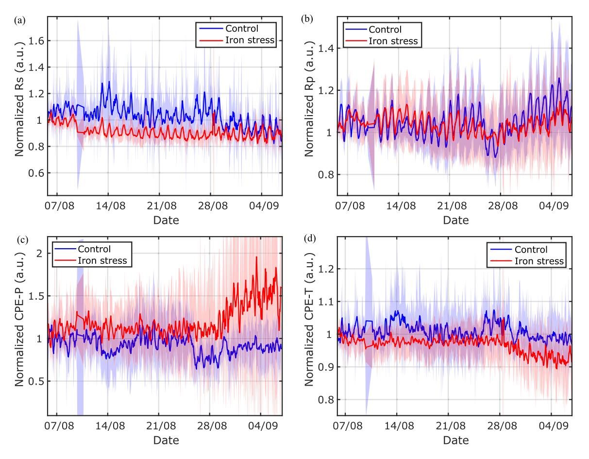
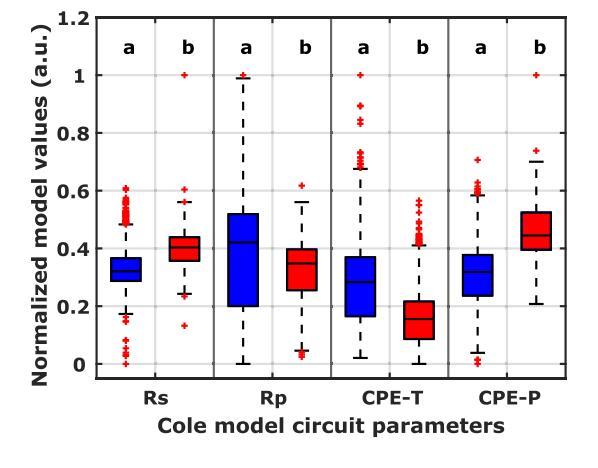

190 IEEE TRANSACTIONS ON AGRIFOOD ELECTRONICS, VOL. 2, NO. 2, SEPTEMBER/OCTOBER 2024

# Monitoring Iron Stress in Tomato Plants Through Bioimpedance and Machine-Learning-Enhanced Classification Based on Circuit Component Analysis

Antonio Altana,, Saleh Hamed, Paolo Lugli, *Fellow, IEEE*, Luisa Petti,, *Senior Member, IEEE*, and Pietro Ibba, *Member, IEEE* 

*Abstract*—Insufficient availability of essential nutrients, such as iron, can impede plant growth, decrease crop productivity, and even lead to plant death. This is why it is crucial to employ proximal monitoring techniques to detect early signs of nutrient stress and prevent yield loss. In this study, we continuously monitored the stem impedance of eight tomato plants every hour for 38 days. This was done to observe the effects of iron stress by comparing these plants with those not under stress. The normalized impedance magnitude at 10 kHz reveals a noticeable divergence in the trend of impedance magnitude shortly after the removal of iron from the nutrient solution, clearly indicating the effect of iron stress on plant bioimpedance. Additionally, the Cole equivalent circuit model was employed to evaluate the electrical parameters of the impedance spectra. The fitting results exhibit an average root-mean-square error of 466.3  $\Omega$ . Statistical analysis of the extracted circuit parameters shows significant differences between iron-stressed and control plants. Based on this hypothesis, the extracted circuit components have been used to train the machine learning classification model with several algorithms, to demonstrate that the multilayer perceptron is the best performing model, yielding 98% accuracy and 91% and 89% precision in identifying early and late stress, respectively. This research demonstrates the effectiveness of bioimpedance measurements in tracking iron stress in plants. Our findings highlight the usefulness of impedance measurements for monitoring iron stress in plants and provide insights into the physiological responses of tomato plants to nutrient deprivation by observing changes in bioimpedance circuit parameters over time.

Manuscript received 16 January 2024; revised 15 May 2024; accepted 30 May 2024. Date of publication 17 June 2024; date of current version 10 October 2024. This work was supported in part by the Open Access Publishing Fund of the Free University of Bozen-Bolzano, in part by the Istituto Italiano di Tecnologia (IIT), and in part by the European Union Next-GenerationEU (Piano Nazionale di Ripresa e Resilienza (PNRR)-Missione 4 Componente 2, Investimento 1.5-D.D. 1032) under Grant CN00000022 for carrying out research at the Agritech National Research Center. This article was recommended by Associate Editor Matias Miguez. An earlier version of this paper was presented in part at the 2023 IEEE Conference on AgriFood Electronics (CAFE). [DOI: 10.1109/CAFE58535.2023.10292001]. (Antonio Altana and Saleh Hamed contributed equally to this work.) (Corresponding author: Pietro Ibba.)

Antonio Altana and Paolo Lugli are with the Faculty of Engineering, Free University of Bozen-Bolzano, 39100 Bolzano, Italy, and also with the Competence Centre for Mountain Innovation Ecosystems, Free University of Bozen-Bolzano, 39100 Bolzano, Italy.

Saleh Hamed and Pietro Ibba are with the Faculty of Engineering, Free University of Bozen-Bolzano, 39100 Bolzano, Italy (e-mail: Pietro.Ibba@unibz.it).

Luisa Petti is with the Faculty of Engineering, Free University of Bozen-Bolzano, 39100 Bolzano, Italy, and also with the Competence Centre for Plant

Health, Free University of Bozen-Bolzano, 39100 Bolzano, Italy. 

This article has supplementary downloadable material available at
https://doi.org/10.1109/TAFE.2024.3411269, provided by the authors. 

Digital Object Identifier 10.1109/TAFE.2024.3411269

Index Terms—Electrical impedance spectroscopy, neural network, nutrient deficiency, smart agriculture.

# I. INTRODUCTION

TOMATO (*Solanum lycopersicum*) is a globally important crop, boasting a production surpassing 170 million tons, as reported by the Food and Agriculture Organization. Around 40% of harvested tomatoes are utilized in food processing, with Italy playing a major role in this industry [1]. Being a model organism, tomato plants are highly regarded in the scientific community for their well-known advantageous traits. These include a compact, fully sequenced genome, a relatively short life cycle with straightforward cultivation methods, the feasibility of horticultural interventions, as well as the availability of a wide range of mutant lines, advanced genomics tools, and established protocols for conducting controlled environmental experiments with tomato plants  $[2]$ .

Tomato plants are continuously interacting with their surrounding environment, which has both positive and negative influences, contributing to the plant stress with a wide spectrum of abiotic and biotic stressors. Here, one of the main causes of stress is nutrient starvation, to which the plants respond with a series of well-studied physiological changes such as reduced photosynthetic activity and inadequate chlorophyll production leading to a clear impact on leaf greenness  $[3]$ . Among the most important nutrients for the plants correct physiological functioning, iron (Fe) plays an important role. In fact, despite its abundance in the soil, it results in an already low availability for the plant due to its low solubility [4]. Iron is, indeed, an essential micronutrient for plants contributing to several vital processes, including chlorophyll development and function. When plants lack sufficient iron, they experience reduced photosynthetic activity, resulting in yellowing and interveinal chlorosis in young leaves  $[5]$ , leading to yield losses of up to 30%  $[6]$ . Such visible symptoms typically manifest several days or weeks after iron deprivation begins, varying with crop species, but typically when the plant is already in a late stress stage  $[5]$ . For this reason, tools allowing a precise characterization of the plant nutrient levels and needs assume a crucial importance to early detect any stress and allow thus a timely intervention thereby leading to higher yields. In this context, different proximal monitoring methods have been described in the literature  $[7]$ , with increasing

© 2024 The Authors. This work is licensed under a Creative Commons Attribution 4.0 License. For more information, see https://creativecommons.org/licenses/by/4.0/

© 2024 The Authors. This work is licensed under a Creative Commons Attribution 4.0 License. For more information, see
https://creativecommons.org/licenses/by/4.0/

ALTANA et al.: MONITORING IRON STRESS IN TOMATO PLANTS 191

use of techniques that rely on the measurement of changes in the electrical properties occurring in plants, such as field effect transistors [\[8\]](#page-9-1), [\[9\]](#page-9-1), resistive [\[10\]](#page-9-1), electrophysiological [\[11\]](#page-9-1), and impedimetric [\[12\]](#page-9-1) techniques. Such methods demonstrate the potential for cost-effective and continuous proximal plant monitoring, offering valuable insights into plant health conditions. Among these, bioimpedance is attracting an increasing interest in the field, especially for what concerns its application in measuring the electrical impedance of biological tissues when exposed to an alternating current (ac) stimulus, which can be in the form of either voltage or current [\[13\]](#page-9-1). The impedance of biological tissues is influenced by a variety of factors, such as their health status, structural attributes, and chemical composition. When an ac stimulus is applied, at lower frequencies, the current predominantly flows through the fluid surrounding the cells, whereas at higher frequencies, it tends to pass through the cells themselves [\[14\]](#page-9-1). The impedance properties of plant tissues are intimately linked to several passive electrical characteristics, including the ion content in the cells, the integrity of the cell membranes, and the viscosity of the tissue [\[15\]](#page-9-1). Although bioimpedance has been previously employed in plant monitoring [\[16\]](#page-9-1), [\[17\]](#page-9-1), [\[18\]](#page-9-1), [\[19\]](#page-9-1), to the best of our knowledge, the use of this technique for the continuous assessment of the effects of iron deficiency on plant health remains largely unexplored. This study focuses on the investigation of the impact of iron deficiency on 8 tomato plants by monitoring the impedance of their stems over a duration of 38 days. The experiment was carried out in a glasshouse, with controlled environmental conditions, reducing the effect of the environmental variability, thus increasing scientific rigor in comparison with alternative literature with a comparable, usually smaller population of plants [\[17\]](#page-9-1), [\[18\]](#page-9-1), [\[20\]](#page-9-1), [\[21\]](#page-9-1), [\[22\]](#page-9-1). The impedance data were collected using a semiportable impedance analyzer in the 100 Hz-10 MHz frequency range. As an initial assessment, the evolution of the bioimpedance magnitude at fixed frequency was analyzed over time showing a deviation between the control and iron-stressed plants. Subsequently, the entire bioimpedance data were fitted to the Cole model equivalent circuit [\[23\]](#page-9-1). Analysis of variance (ANOVA) proved the statistical difference between the equivalent circuit parameter extracted for control and stressed plant. Based on this, the equivalent circuit parameters were employed as features to successfully train a data classification model to discriminate between iron-deficient and control plants. The study emphasizes the potential of stem impedance measurements as indicators of plant response to iron deficiency, presenting a novel method for monitoring plant health and enhancing crop management.

# II. MATERIALS AND METHODS

## A. Plant Material

Eight tomato seedlings (Solanum lycopersicum cv. Pomodoro Tondo) were first transferred to soilless pots (diameter  $21 \text{ cm}/4 \text{ L}$ ) filled with an inert (i.e., free of nutrient components) perlite substrate (Karl Bachl Kunststoffverarbeitung GmbH & Co. KG) and subsequently grown for  $7-8$  weeks in a greenhouse with a controlled environment, as reported in Fig. S1 (day: 

14 h, 24 °C, 70% relative humidity, 250  $\mu$ mol photons m-2 s-1; night: 10 h, 19 °C, 70% relative humidity), maintaining these at approx. 60% water holding capacity, by watering them once a day with tap water. The necessary nutritional supply was provided by the addition of a Hoagland solution [\[24\]](#page-9-1) composed of main macronutrients and micronutrients with the following composition:  $\text{Ca(NO}_3)_2\cdot4\text{H}_2\text{O}$ ,  $\text{MgSO}_4\cdot7\text{H}_2\text{O}$ ,  $\text{K}_2\text{SO}_4$ , KCI, KH2PO4, H3BO3, MnSO4·H2O, CuSO4, ZnSO4·7H2O, (NH4)6Mo7O24·4H2O, and Fe-EDTA [\[25\]](#page-9-1), allowing complete control over the distribution of nutritional constituents. The control group, consisting of four plants, remained exposed to aout withing the optimal tomato growth window and lasting a total of 38 days. The first phase represented the optimal conditions, characterized by optimal nutrient availability, from 29th of July to 4th of August. This initial phase was designed to bring all the plants to comparable health conditions before the application of iron stress. The second phase, from 5th of August to 27th of August, represents the iron deficiency condition, wherein iron was deliberately removed from the nutrient solution. Finally, in the recovery phase, the iron was reintroduced into the nutrient solution until 5th September.

## B. Electrical Impedance Spectroscopy

Bioimpedance data for the tomato plant were collected using a semiportable impedance analyzer (the Digilent Analog Discovery 2), which allows capacitance between 50 pF and  $500 \mu F$ to be measured, with a 14-b resolution, for our purpose, it was equipped with the Impedance Analyzer add-on, setting a  $10 \text{ k}\Omega$  feedback resistor, representative for an expected biological samples magnitude between 1 and  $20 \text{ k}\Omega$ , within a frequency range of  $100-10$  MHz. This was done over  $200$  logarithmically spaced frequency points using a two-electrode configuration. Electrical contact with the plant stem was established using a pair of stainless steel subcutaneous needle electrodes (Technomed, Medical Accessories), each  $13 \text{ mm}$  long and  $0.4 \text{ mm}$  in diameter  $(27 \text{ g})$ . These electrodes were vertically inserted into the plant stem 5 cm above the substrate, maintaining a consistent 0.5 cm distance between them. All plants were connected to the impedance analyzer at the same time, as in the representation in Fig.  $1$ , and reducing the contribution of cables, by performing an open-/short-circuit compensation prior measurement. The switching between different plants was synchronized with data collection using a centralized Python script, which controlled the multiplexer channels via an Arduino setup. Measurements were continuously acquired for a period of 38 days with 1-h acquisition interval, resulting in a final dataset consisting in a total of 7557 impedance spectra, respectively, divided into 3881 spectra from the control and 3676 spectra from the iron-stressed plants.

## C. Equivalent Circuit Component Analysis

The bioimpedance data were organized, postprocessed, and analyzed using MATLAB R2022b (The MathWorks Inc.,

192 IEEE TRANSACTIONS ON AGRIFOOD ELECTRONICS, VOL. 2, NO. 2, SEPTEMBER/OCTOBER 2024

Fig. 1. Schematic representation of the experimental setup with plants of both groups monitored using bioimpedance measurement. The portable impedance analyzer Analog Discovery 2 is connected to each plant through a multiplexer, synchronized by a Python script controlling the channel opening by an Arduino board.

Natick, MA, USA). To reduce the dataset to a smaller set of interpretable variables, the bioimpedance data were fitted by the MATLAB Zfit script [\[26\]](#page-9-1) with the single dispersion Cole electrical model [\[23\]](#page-9-1) shown in Fig. s2 (see Supplementary material). Here, the best fitting was calculated using the real and the imaginary components of the bioimpedance spectra as input data and iterating different combinations of nine selected optimal initial conditions with a reasonable magnitude for the considered dataset ranges, evaluating the results in terms of root-mean-square error (RMSE). As result of the fitting, the equivalent circuit parameters (i.e., the series resistor  $R_s$ , parallel resistor  $R_p$ , magnitude component of the constant phase element  $CPE_t$ , and phase angle component of the constant phase element  $CPE_p$ ,) were extracted for each measurement. One-way ANOVA was performed to evaluate statistical differences among each circuit parameter for class discrimination (i.e., between control and iron-stressed plants). The Tukey's honestly significant difference (HSD) method was performed, and the differences were calculated for an appropriate level of interaction ( $p \le 0.05$ ). Results were reported as the mean and standard deviation (SD) of the mean. The possible linear dependency between the obtained equivalent circuit parameters and the greenhouse environmental conditions during the experiment was investigated by studying the correlation of each circuit component with respect to RH, T, and light, calculating Pearson's correlation coefficient for each relationship [\[27\]](#page-9-1).

## D. Data Processing and Classification

The dataset to train the models was composed of the equivalent circuit parameters extracted for the measurement acquired in the temporal interval between the 5th of August and the 27th of August, labeling the data according to the respective group of the plant, either control or stress. In addition, the measurements collected from the iron-stressed plants were further divided into two classes, with data from the 5th of August to the 16th of 

August labeled as in early stress while data referring to the measurements of the subsequent days (i.e., until 27th of August) indicated as late stress. Afterward, the obtained dataset was partitioned with an 80:20 ratio into train and test sets, to train and validate various machine learning classification models, including discriminant analysis (DA), kernel methods (KM),  $k$ -nearest neighbors (KNN), linear models (LM), naive Bayes classifier (NBC), multilayer perceptron (MLP), support vector machines (SVM), and decision trees (DT), using MATLAB's automatic toolbox *fitcauto* that allows the evaluation of the performance of different classification algorithms by automatically optimizing their hyperparameters. The different type of machine learning algorithms was employed due to their different characteristics, to evaluate the one with better performance in discriminating the fruit ripening. LR utilizes a logistic function to model a binary dependent variable, assuming a linear relationship between log-odds and predictors. DT are nonparametric, creating simple decision rules from data features, providing easily interpretable models but susceptible to overfitting. NBC assumes conditional independence of features given the class variable, offering speed and effectiveness in generating simple models. KNN assigns class membership based on similarity among samples, calculating distances to k nearest neighbors. SVM draw hyperplanes in feature space to maximize class separation. MLP is a simple feed-forward neural network capable of learning nonlinear models with at least three layers and nonlinear activation functions [28]. The robustness of the trained model was assessed by a subsequent 10 000-round bootstrapping validation phase together with a tenfold cross validation, evaluated on an equally distributed subset of data, and the accuracy of the obtained models was evaluated in terms of  $F_1$ -score.

# III. RESULTS AND DISCUSSION

The eight plants, divided between four plants exposed to the complete nutrient solution (i.e., control) and four plants with

ALTANA et al.: MONITORING IRON STRESS IN TOMATO PLANTS 193

Fig. 2. Time-series plot of normalized impedance at 10 kHz over a 1-month period. The shaded colored zones represent the range of magnitude changes over time for both groups (blue shadow for control plants and red shadow for iron-stressed plants). (a) The median magnitude values of the control plants represented by a blue line while the iron-stressed plants depicted by a red line. (b) Zoomed-in time-series plot showing stem impedance seasonal patterns between night conditions (indicated by the moon symbol and dark shading) and light conditions (represented by the sun symbol and absence of shading).

iron-deficient nutrient solution, were exposed to the same environmental conditions, monitored by sensors inside the greenhouse. The first symptoms of iron deficiency observed in this work, characterized by a reduction in photosynthetic activity and a tendency of the leaves to present a yellow coloration [\[5\]](#page-5-1), started toward the end of the experiment (i.e., on the 31st August) and were noted following a visual observation. Such timing and observation method is clearly not ideal, as it would not allow a prompt intervention to mitigate the stress-induced effects on the plant health and thus yield. For this reason, to experimentally prove such behavior, as well as to anticipate such diagnosis exploiting the potential use of the bioimpedance technique for early stress detection, the data were subjected to a comprehensive data analysis, comprising three subsequent steps. Here, the measurement has been analyzed to investigate the evolution overtime of first the raw impedance magnitude and second the extracted equivalent circuit parameters. Finally, based on the assumption of statistical difference among circuit parameters between the two main conditions (i.e., control and stress), different classification algorithms were used to identify the state of the plant, whether in control state, early or late stress, validating the potential employment of such technique within a decision support system.

## A. Time-Series Analysis

A first step in the exploration of the acquired dataset consisted in the evaluation of the raw impedance data, investigating approaches found in literature to monitor the plant behavior. The evolution over time of the normalized bioimpedance magnitude response at 10 kHz is depicted in Fig.  $2(a)$ . Such a point was chosen based on the study of Garlando et al. [\[20\]](#page-9-1), which successfully employed this approach to monitor the response to water stress of tobacco plants over a one-month time span. Analyzing the normalized impedance magnitudes over time sheds light on how iron stress affects the bioimpedance properties of tomato plant stems. The data reveals a noticeable

difference in impedance trends shortly after iron is removed from the nutrient solution, distinguishing the iron-deficient plants from the control group. The control plants show a shift in impedance magnitude (about 0.1 a.u. from the experiment's start), likely due to ionic changes during different growth stages of the tomato plants [\[29\]](#page-9-1). In contrast, the impedance response in iron-deprived plants can be attributed to an adaptation to iron shortage, involving complex molecular signaling. This includes variations in proteome profiles [30], metabolic changes [31], transcriptomic adjustments [32], and alterations in ionic composition and structure [33]. While a clear correlation with such changes appears to be challenging, such results highlight the potential of utilizing impedance measurements for monitoring iron stress in plants. Nevertheless, a deeper observation of the trends observed in the acquired data offers food for thought for further applications. In Fig.  $2(b)$ , a magnified view of a three-day period is shown to clarify the discernible seasonal variations in magnitude between the diurnal condition, represented by the sun symbol, and the nocturnal condition, represented by the moon symbol. This seasonality is consistently observed throughout the whole experiment in both iron-stressed and control plants and can be connected to the extensively documented circadian rhythms in plants [20], [34], [35]. Such phenomenon can be explained by plant transpiration, which involves the release of water vapor through stomatal openings, subsequently driving the uptake of water and nutrients from the roots to the shoots. The rate of transpiration varies between day and night in tomato plants due to the closure or partial closure of stomata during dark conditions, wherein photosynthesis is absent. Here, the flow of water and nutrients is opposite, going from the shoots to the roots [36]. Such results effectively prove that bioimpedance could be exploited as a potential alternative and low-cost tool to monitor the plant sap flow trends, an important plant health status indicator, which is commonly monitored using bulky and expensive equipment. In order to summarize the information collected through the bioimpedance measurements, the equivalent circuit components were calculated by fitting the measured spectra o

194 IEEE TRANSACTIONS ON AGRIFOOD ELECTRONICS, VOL. 2, NO. 2, SEPTEMBER/OCTOBER 2024

n

Fig. 3. Correlation matrix of the circuit parameters  $(R_{\rm p}, R_{\rm s}, \text{CPE-T}, \text{CPE-P})$ of the Cole model and the environmental monitoring parameters (temperature  $T$ , relative humidity RH, and light intensity). The correlation values for the control plants are in blue, whereas the corresponding values for iron-stressed plants are in red. The legend is presented in terms of absolute values for clarity.

the single dispersion Cole model. Such a model was chosen due to its wide employment as the simplest representation of the flow of current in biological tissues, allowing to reduce the dataset to a smaller set of interpretable variables (i.e., from 200 singlefrequency points to 4 circuit component values) while preserving the majority of the representative information about the flow current in the biological tissues. In this model, depicted in Fig. s2 (see Supplementary material), the bioimpedance resistive components (i.e.,  $R_s$  and  $R_p$ ) are used to describe the resistance of the extracellular and intracellular mediums, respectively, while the CPE-T element is primarily associated with the pseudocapacitance of the cell membrane and the CPE-P element is related to the heterogeneity originating from variations in the size and shape of the cells [37]. The study of such electrical parameters can consequently be correlated with the plant's physiological responses, thus allowing to monitor the impact of disruptive events such as iron deficiency on the plant structures. For this reason, the obtained electrical parameters were then employed in this study to determine the statistical difference between control and iron-deficient plants. The equivalent circuit model fitting resulted in an average RMSE, obtained by averaging the values of all the considered plant spectra, of  $466.3 \pm 68.6 \,\Omega$ and  $464.5 \pm 454.5 \,\Omega,$  in terms of impedance magnitude for the control and the iron stress conditions, respectively. Given the low error of the fitting results, it is possible to state that the Cole model is a good approximation of the impedance of the tomato plants, and that is thus possible to employ its resulting extracted parameters in the evaluation of the plants' response to iron stress.

The entire population of plants was exposed to the same environmental conditions, in terms of temperature, relative humidity, and light, as described in the previous section and whose trends are presented in Fig. S1 (see Supplementary material). To exclude the possibility that the evolution of the electrical parameters, commonly dependent on both T and RH, was solely representative of the changes occurring in the plants and not of the environmental conditions, the linear correlation coefficients between the circuit and the environmental parameters were calculated. Fig.  $3$  presents the correlation coefficient 

matrix between Cole's circuit parameters and the environmental parameters. Here, it is visible how the capacitive components (i.e., CPE-P and CPE-T) are found to be completely unrelated to environmental parameters, with correlation values close to zero. The correlation values are slightly higher in the case of the resistive components, which could be due to the fact that they are representative of the current flowing in the intra- and extra-cellular medium, which-being composed of ions-is affected by temperature changes. Nevertheless, such correlations are weak (less than 56%) and allow us to assume that the measurements are indicative of a change in the composition of the content within the plant stem, rather than to environmental changes.

Once the dependence on the environmental conditions was excluded, a characterization of the equivalent circuit components overall behavior over time was performed. The graphs in Fig. 4 depict the time-series evolution of the equivalent electrical components  $R_{\rm s}$ ,  $R_{\rm p}$ , CPE-T, and CPE-P during the stress time period for control and stressed plants. In addition to the larger variance visible as the plants pass between the two different conditions to which they are subjected, the analysis of the individual circuit parameters allows us to analyze the individual components that can be traced back to physiological phenomena taking place in the plant. A comparable behavior to the one observed in the time analysis of fixed-frequency impedance presented in Fig. 2 is noticeable in the CPE-P component, presented in Fig. 4(c), where a deviation over time between control and iron-stressed plants is clearly visible. Such behavior is potentially due to the metabolic variation of the plant to adapt to iron deficiency [\[38\]](#page-9-1), which affects the integrity of the cellular structures, and thus, their ability to act as capacitors for the current flowing during the bioimpedance measurement. In addition, from the graphs in Fig. 4(a) and (b), it is evident how the circadian cycle, as expected, is visible only in the trend of the resistive components  $R_{\rm s}$  and  $R_{\rm p}$ , and not on the pseudocapacitive components. This is due to the fact that the fluid in the plant vascular tissues (i.e., the sap flow) is rich in electrically charged ions, which in turn are the main contributors to the observed current flow. Here, from the analysis of the time course of the  $R_{\rm p}$  component, it can be seen that as time progresses and thus the concentration of  $\text{Fe}^{+}$  ions decreases, the variation in resistance amplitude between day and night presents a decreasing trend. This behavior could be traced to a decrease in photosynthetic activity caused by iron deficiency, as reported in other plants [\[39\]](#page-9-1).To assess the differences in circuit parameters between stressed and control plants, as well as their changes over time, we used the Cole model parameters and conducted an ANOVA. This approach helped to identify statistically significant variations in the parameters under the two conditions. As illustrated in Fig. 5, the average values of the Cole model electrical parameters for both stressed and control plants are presented, accompanied by the ANOVA findings. In the figure, average values marked with different letters indicate a statistical difference, as determined by the HSD test ( $p \le 0.05$ ). The statistical evaluation revealed that all the extracted circuit parameters showed significant differences, thus serving as important indicators in differentiating the health conditions of the plants.

ALTANA et al.: MONITORING IRON STRESS IN TOMATO PLANTS 195

Fig. 4. Time-series plot of normalized circuit parameters, namely Rs (a), Rp (b), CPE-P (c), and CPE-T (d), evolution over a 4-week period. The shaded colored zones represent the range of amplitude changes over time for both groups (blue shadow for control plants and red shadow for iron-stressed plants). The median magnitude values of the control plants represented by a blue line while the iron-stressed plants depicted by a red line.

## B. Plant Status Classification

The employed equivalent circuit model, implementing only few electrical components, represents an extreme simplification of the plant physiology and is, therefore, not ideal to accurately represent the complexity of the tissues of the stems. In fact, from the direct interpretation of the extracted parameters it is difficult to find indicators for the identification between a healthy plant and a plant under nutrient stress. Even more complicated would be to identify whether the plant is in early stress condition so that nutrient supply can be intervened before symptoms and consequent loss of yield arise. Nevertheless, the significant difference in circuit parameters observed between the considered classes demonstrates how such a model can be used as a general indicator of the plant status and support the employment of the circuit parameters as discriminant features in the training of classification models, where nonapparent and nonlinear relationships between bioimpedance data and plant health status could be found. For this reason, based on the previously extracted equivalent circuit components of the single dispersion Cole model, various supervised machine learning classification algorithms were trained, validated, and tested, for the discrimination of three distinct classes, respectively

TABLE I 
SUMMARY OF THE OPTIMIZED CLASSIFICATION MODELS  $F_1$ -SCORE 
ACCURACY ON THE TRAINING AND TEST SETS, WITH % DIFFERENCE AMONG THE TWO PHASES

| Model        | Optimized Hyperparameters                      | $F_1$ train | $F_1$ test | $%$ diff |
|--------------|------------------------------------------------|-------------|------------|----------|
| DA           | $\Delta = 9.577e^{-6}, \gamma = 0.013$         | 0.497       | 0.480      | $-1.65$  |
| KM           | $KS = 0.665, \lambda = 0.0014$                 | 0.868       | 0.818      | $-5.03$  |
| KNN          | $Distance = Mahalanobis, NN = 7$               | 0.942       | 0.894      | $-4.79$  |
| LM           | $\lambda = 1.386e^{-4}$ , Learner = SVM        | 0.543       | 0.529      | $-1.34$  |
| NBC          | Distribution Names = Kernel, Width = $0.0102$  | 0.767       | 0.639      | $-12.8$  |
| $\text{MLP}$ | Activation = Relu, Layer Size = $[18, 12, 39]$ | 0.984       | 0.935      | $-4.96$  |
| SVM          | $KS = 1.3312$ , Binary loss = Hinge            | 0.543       | 0.531      | $-1.16$  |
| DT           | Number of nodes $= 317$                        | 0.964       | 0.832      | $-13.2$  |

 $KS = \text{Kernel Scale}$ 
 
 representing the control, early stress, and late stress conditions of iron deficiency in tomato plants.

The accuracy of the seven models developed to classify the plant status is listed in Table I, in terms of  $F_1$ -score in training and test, as well as for what concerns the % difference among the two phases. Overall, the algorithms presenting the poorest performance are linear methods such as DA and LM, achieving an  $F_1$ -score of around 50%. Such results are expected since the association between bioimpedance data and biological behaviors commonly follows nonlinear patterns. NBC and DT algorithms, on the other hand, present the highest degree of

196 IEEE TRANSACTIONS ON AGRIFOOD ELECTRONICS, VOL. 2, NO. 2, SEPTEMBER/OCTOBER 2024

Fig. 5. Comparison of normalized model values between control and iron-stressed plants across various circuit parameters of the Cole model. The horizontal axis depicts the Cole model circuit parameters ( $R^p$ ,  $R^s$ , CPE-T, CPE-P) while the vertical axis indicates the normalized model values over time. Statistical analysis using ANOVA was performed, with significant statistical differences denoted by the letters "a" and "b" above the box plots. If conditions (control/stress) share the same letter, differences between groups are not statistically significant. Outliers are denoted by the marker  $("+")$ .

difference between training and testing phases, with a respective performance reduction of 12.6% and 13.2%, thus indicating a lack of generalization capability on unseen data. The algorithms that provide the best performance are KNN, as already demonstrated in the impedance measurement classification study [40] and MLP, with training accuracy above 94% and 98%, respectively, and a decrease of less than 5% in test accuracy. Overall, as observed in a previous study [41], the MLP has been considered to provide the best accuracy and stability, as depicted from the bootstrapping validation  $F_1$  scores in Fig. s3 (see Supplementary material). Fig. s4 (see Supplementary material) displays the confusion matrix related to the developed MLP classification algorithm. In the training phase, such a discrimination model achieves 100% precision for identifying control plants and an average of 97.6% for distinctly identifying early and late stress. The model is able to classify, with high precision, the control plants also in a test phase, with a precision above 99%, and as expected, the precision decreases for the early and late stress classification, decreasing to 91% and 89%, respectively. The observed high accuracy makes MLP networks the best candidate for an on-field application of this technique for tomato early stress identification.

Future developments would potentially include the analysis of plant response to different nutrient deficiency, as well as the identification of time-dependent patterns, to finely tune the developed stress prediction system. In addition, the integration of such models with stand-alone and low-power measurement systems  $[42]$ , which shows to have a great potential for a realtime and on-field plant health assessment and stress prediction, would allow us to develop custom-made decision support systems able to timely identify the insurgence of nutrient stress in plants. Such tools have the potential to greatly improve the crop efficiency, in terms of time, yield, and quality of the harvested products, as well as the profit margins of the producers and

the sustainability of the crops, finely tuning the application of nutrients to the specific needs of the plants.

# IV. CONCLUSION

This work focuses on the characterization of electrical changes in eight tomato plants under iron starvation carried out through continuous bioimpedance measurements over a period of 38 days. Although a larger sample size could enhance biological diversity capture, this study follows recent trends and considers the technique's early stage of development. In addition, unlike many prior studies, it was conducted in a controlled glasshouse environment, enabling precise environmental monitoring. From an initial examination, it can be seen that through the analysis of the seasonality of impedance measurements, a cyclic pattern can be traced following the circadian cycle of plants. Investigating further, results revealed a noticeable divergence in the trend of impedance magnitude at a magnitude of 10 kHz shortly after the elimination of iron from the nutrient solution applied to the plant, indicating an effect of iron stress on plant bioimpedance. In addition, this work proved how by employing the Cole model extracted parameters as a discriminating feature; it is possible to both monitor the evolution of the plant health status and to identify stress-induced patterns. First, this was proved by an ANOVA analysis, where the extracted circuit parameters resulted to be statistically different, between ironstressed and control plants. Second, based on this assumption, the equivalent circuit components were successfully employed for the training of various classification models to discriminate plants in control, early, and late stress conditions. Here, the MLP algorithm resulted to achieve the best training accuracy  $(98\%)$  and a precision to classify the early and late stress with a precision of 91% and 89%, respectively.

The reported results, supported by both the ANOVA and machine learning-based classification results, demonstrate the validity of impedance measurements carried out in the plant stem, as an indicator of the response of tomato plants to the application of iron deficiency. These findings contribute to the development of novel indicators for plant health status monitoring, resulting in benefits for both the optimization of crop nutrient management and the increase in crop yields.

#  ACKNOWLEDGMENT

The authors would like to thank Prof. Tanja Mimmo for her generous provision of the nutrient solutions and Dr. Maurizio Ventura for his technical support in the greenhouse. This article reflects only the author's views and opinions, neither the European Union nor the European Commission can be considered responsible for them. The data acquisition system has been developed, and it will remain available within the Programma Operativo Nazionale Ricerca e Innovazione and the PNRR research activities of the consortium iNEST (Interconnected North-Est Innovation Ecosystem) funded by the European Union Next-GenerationEU (Piano Nazionale di Ripresa e Resilienza (PNRR)—Missione 4 Componente 2, Investimento 1.5—D.D. 1058 23/06/2022, ECS 00000043).

ALTANA et al.: MONITORING IRON STRESS IN TOMATO PLANTS 197

#  REFERENCES

- [1] J. M. Costa and E. Heuvelink, "The global tomato industry," in *Tomatoes*. Wallingford, U.K.: CABI, 2018, pp. 1-26.
- [2] D. Schwarz, A. J. Thompson, and H.-P. Kläring, "Guidelines to use tomato in experiments with a controlled environment," Front. Plant Sci., vol. 5, 2014. Art. no. 625.
- [3] I. Murgia, F. Marzorati, G. Vigani, and P. Morandini, "Plant iron nutrition: The long road from soil to seeds," J. Exp. Botany, vol. 73, no. 6, pp. 1809–1824, 2022.
- [4] G. R. Rout and S. Sahoo, "Role of iron in plant growth and metabolism," Rev. Agricultural Sci., vol. 3, pp. 1-24, 2015.
- [5] B. Chakraborty, K. Chakraborty, and D. Bhaduri, "An insight of iron chlorosis in horticultural crops: Physiological and molecular basis, and possible management strategies," Plant Stress Tolerance Physiol. Mol. Strategies, vol. 239, pp. 239-268, 2016.
- [6] M. A. Khan and N. T. Nguyen, "Genome editing of staple crop plants to combat iron deficiency," in Transgenic Technology Based Value Addition in Plant Biotechnology. Amsterdam, The Netherlands: Elsevier, 2020, pp. 187–206.
- [7] D. L. Presti et al., "Current understanding, challenges and perspective on portable systems applied to plant monitoring and precision agriculture," Biosensors Bioelectron., vol. 222, 2022, Art. no. 115005.
- [8] G. Elli et al., "Field-effect transistor-based biosensors for environmental and agricultural monitoring," Sensors, vol. 22, no. 11, 2022, Art. no. 4178.
- [9] S. Hamed, P. Ibba, M. Petrelli, M. Ciocca, P. Lugli, and L. Petti, "Transistorbased plant sensors for Agriculture 4.0 measurements," in *Proc. IEEE Int.* Workshop Metrol. Agriculture Forestry (MetroAgriFor), 2021, pp. 69–74.
- [10] S. Ehosioke et al., "Sensing the electrical properties of roots: A review," Vadose Zone J., vol. 19, no. 1, 2020, Art. no. e20082.
- [11] F. Baluška, S. Mancuso, and E. Van Volkenburgh, "Barbara G. Pickard-Queen of plant electrophysiology," Plant Signaling Behav., vol. 16, no. 6, 2021, Art. no. 1911400.
- [12] S. Vasquez et al., "Based impedimetric sensor for on-plant humidity and transpiration monitoring," in *Proc. IEEE Conf. AgriFood Electron.*, 2023, pp. 182-186.
- [13] O. Kanoun et al., "Impedance spectroscopy: Applications, advances and future trends," IEEE Instrum. Meas. Mag., vol. 25, no. 3, pp. 11-21, May 2022
- [14] Y. Liu, D. Li, J. Qian, B. Di, G. Zhang, and Z. Ren, "Electrical impedance spectroscopy (EIS) in plant roots research: A review," Plant Methods, vol. 17, no. 1, pp. 1–25, 2021.
- [15] I. Jócsák, M. Droppa, G. Horváth, K. Bóka, and E. Vozáry, "Cadmiumand flood-induced anoxia stress in pea roots measured by electrical impedance," Zeitschrift für Naturforschung C., vol. 65, no. 1/2, pp. 95-102, 2010.
- [16] E. Serrano-Finetti, E. Castillo, S. Alejos, and L. L. Hilario, "Toward noninvasive monitoring of plant leaf water content by electrical impedance spectroscopy," Comput. Electron. Agriculture, vol. 210, 2023, Art. no. 107907.
- [17] S. Calvo, M. Barezzi, D. Demarchi, and U. Garlando, "In-vivo proximal monitoring system for plant water stress and biological activity based on stem electrical impedance," in Proc. 9th Int. Workshop Adv. Sensors Interfaces, 2023, pp. 80-85.
- [18] M. Barezzi, F. Cum, U. Garlando, M. Martina, and D. Demarchi, "On the impact of the stem electrical impedance in neural network algorithms for plant monitoring applications," in Proc. IEEE Workshop Metrol. Agriculture Forestry (MetroAgriFor), 2022, pp. 131-135.
- [19] U. Garlando, S. Calvo, M. Barezzi, A. Sanginario, P. M. Ros, and D. Demarchi, "A "plant-wearable system" for its health monitoring by intraand interplant communication," IEEE Trans. AgriFood Electron., vol. 1, no. 2, pp. 60-70, Dec. 2023.
- [20] U. Garlando, S. Calvo, M. Barezzi, A. Sanginario, P. M. Ros, and D. Demarchi, "Ask the plants directly: Understanding plant needs using electrical impedance measurements," Comput. Electron. Agriculture, vol. 193, 2022, Art. no. 106707.
- [21] U. Garlando et al., "Analysis of in vivo plant stem impedance variations in relation with external conditions daily cycle," in *Proc. IEEE Int. Symp.* Circuits Syst., 2021, pp. 1-5.

- [22] L. Bar-On and Y. Shacham-Diamand, "On the interpretation of four point impedance spectroscopy of plant dehydration monitoring," *IEEE Trans. Emerg. Sel. Topics Circuits Syst.*, vol. 11, no. 3, pp. 482–492, Sep. 2021.
- [23] K. S. Cole, "Permeability and impermeability of cell membranes for ions," in Cold Spring Harbor Symposia on Quantitative Biology, vol. 8, Cold Spring Harbor, NY, USA: Cold Spring Harbor Lab. Press, 1940, pp. 110-122.
- [24] D. R. Hoagland et al., The Water-Culture Method for Growing Plants Without Soil, Circular. California Agricultural Experiment Station 347, 2nd ed. Berkley, CA, USA: California Agricultural Experiment Station, 1950.
- [25] R. Tiziani, Y. Pii, S. Celletti, S. Cesco, and T. Mimmo, "Phosphorus deficiency changes carbon isotope fractionation and triggers exudate reacquisition in tomato plants," Sci. Rep., vol. 10, no. 1, pp. 1-12, 2020.
- [26] J.-L. Dellis, "MATLAB central file exchange," Accessed: Feb. 2022. Available: https://www.mathworks.com/matlabcentral/file [Online]. exchange/19460-zfit
- [27] D. Freedman, R. Pisani, and R. Purves, *Statistics (International Student* edition), 4th ed. New York, NY, USA: WW Norton & Company, 2007.
- [28] S. B. Kotsiantis et al., "Supervised machine learning: A review of classification techniques," Emerg. Artif. Intell. Appl. Comput. Eng., vol. 160, no. 1, pp. 3-24, 2007.
- [29] M. Alfosea-Simón et al., "García-Sánchez, ionomic, metabolic and hormonal characterization of the phenological phases of different tomato genotypes using omics tools," Scientia Horticulturae, vol. 293, 2022, Art. no. 110697.
- [30] L. Ceballos-Laita et al., "Effects of Fe and Mn deficiencies on the protein profiles of tomato (Solanum lycopersicum) xylem sap as revealed by shotgun analyses," J. Proteomic., vol. 170, pp. 117-129, 2018.
- [31] A. F. López-Millán, F. Morales, Y. Gogorcena, A. Abadía, and J. Abadía, "Metabolic responses in iron deficient tomato plants," J. Plant Physiol., vol. 166, no. 4, pp. 375-384, 2009.
- [32] W. W. Chen et al., "Comparative physiological and transcriptomic analyses reveal altered Fe-deficiency responses in tomato epimutant colorless nonripening," Front. Plant Sci., vol. 12, 2022, Art. no. 3382.
- [33] G. Singh et al., "Comparative transcriptomic and metabolite profiling reveals genotype-specific responses to Fe starvation in chickpea," Physiologia Plantarum, vol. 175, 2023, Art. no. e13897.
- [34] J. Reynolds, M. Taggart, E. Lobaton, M. Daniele, T. Rufty, and A. Bozkurt, "An environmental station with bioimpedance capabilities for agricultural deployment," Proc. IEEE SENSORS, 2020, pp. 1-4.
- [35] A. Bukhamsin et al., "Robust, long-term, and exceptionally sensitive microneedle-based bioimpedance sensor for precision farming," Adv. Sci., vol. 8, no. 16, 2021, Art. no. 2101261.
- [36] M. A. Caird, J. H. Richards, and T. C. Hsiao, "Significant transpirational water loss occurs throughout the night in field-grown tomato," Funct. Plant Biol., vol. 34, no. 3, pp. 172-177, 2007.
- [37] P. Ibba, G. Cantarella, B. D. Abera, L. Petti, A. Falco, and P. Lugli, "Selection of Cole model bio-impedance parameters for the estimation of the ageing evolution of apples," in Proc. 17th Int. Conf. Elect. Bioimpedance, 2019, pp. 25-32.
- [38] D. Tran and C. Camps, "Early diagnosis of iron deficiency in commercial tomato crop using electrical signals," Front. Sustain. Food Syst., vol. 5, 2021, Art. no. 631529.
- [39] S. Aouane et al., "Cole-cole parameter extraction from electrical impedance spectroscopy for real-time monitoring of vegetal tissue: Case study with a single celery stalk," in Proc. Int. Workshop Impedance Spectrosc., 2021, pp. 48-51.
- [40] M. Tiitta, V. Tiitta, J. Heikkinen, R. Lappalainen, and L. Tomppo, "Classification of wood chips using electrical impedance spectroscopy and machine learning," Sensors, vol. 20, no. 4, 2020, Art. no. 1076.
- [41] P. Ibba et al., "Supervised binary classification methods for strawberry ripeness discrimination from bioimpedance data," Sci. Rep., vol. 11, no. 1, 2021, Art. no. 11202.
- [42] P. Ibba, A. Falco, A. Rivadeneyra, and P. Lugli, "Low-cost bio-impedance analysis system for the evaluation of fruit ripeness," in Proc. IEEE SEN-SORS, 2018, pp. 1-4.

Open Access funding provided by 'Libera Università di Bolzano' within the CRUI CARE Agreement