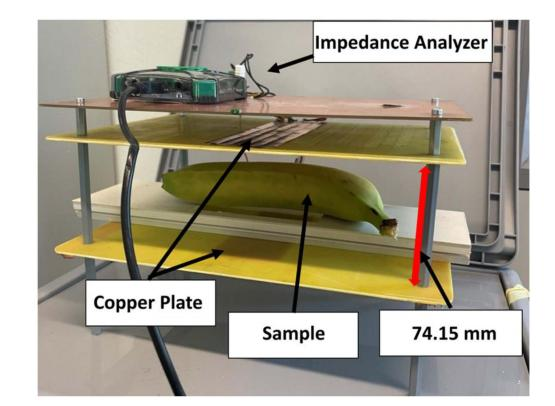
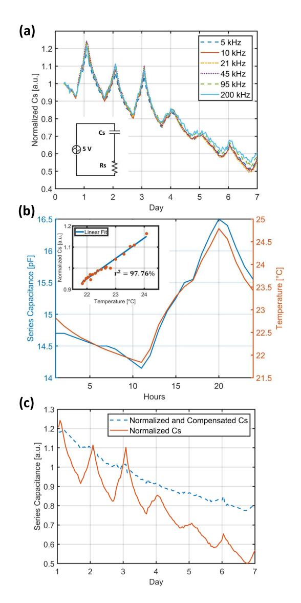
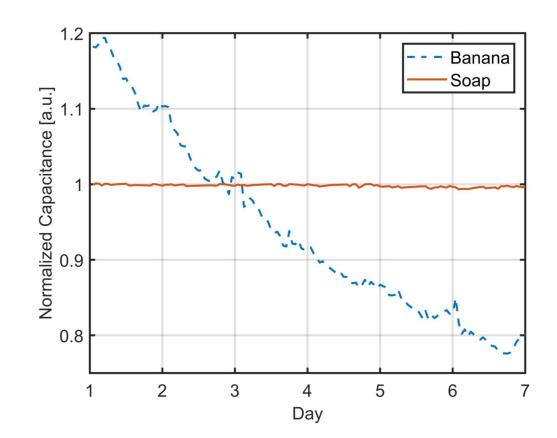
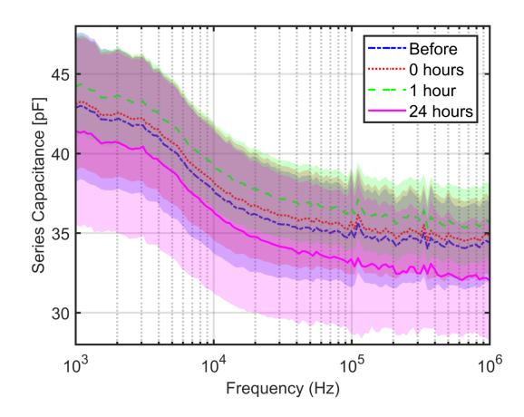
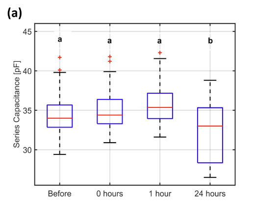
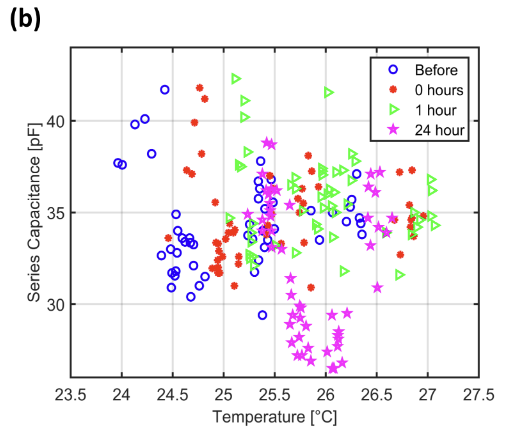

428 IEEE TRANSACTIONS ON AGRIFOOD ELECTRONICS, VOL. 2, NO. 2, SEPTEMBER/OCTOBER 2024

# Capacitive Impedance Analysis for Noncontact Assessment of Fruit Quality and Ripening

Fahimeh Masoumi,, Andrea Gottardo, Pietro Ibba,, *Member, IEEE*, Matteo Caffini,, Antonio Altana, Sundus Riaz1, Luisa Petti1, *Senior Member, IEEE*, and Paolo Lugli1, *Fellow, IEEE* 

Abstract—This article presents a comprehensive examination of the development of a non-contact measuring technique for determining fruit quality. Capacitance measurements were performed on soap (reference), banana, and nectarine samples across a frequency range of 5 Hz-200 kHz for banana and soap, and 10 Hz-1 MHz for nectarine. The data analysis revealed consistent trends in series capacitance  $(C_s)$ , indicating its suitability for future investigation. Additionally, temperature compensation improved data accuracy. Compensated capacitance data, obtained through linear fitting coefficients from the first 18 hours of data, showed distinct trends in banana samples, with a reduction of  $6.76\%$  on the first day and an additional  $3.38\%$  on the last day, illustrating the impact of aging. In contrast, the soap reference sample exhibited constant capacitance behavior over time. The response of the system to the presence and absence of the fruit sample and the effect of mass loss of the banana fruit on the Cs trends were also examined. The system's capacity to differentiate between undamaged and damaged samples was demonstrated after the investigation was expanded to include 51 nectarines. Following the impact damage,  $C_s$ significantly increased, particularly one hour later, aligning with biochemical changes associated with mechanical damage. ANOVA, a type of multivariate analysis, highlighted the system's efficacy. The system demonstrated preserved damage detection even 24 hours after impact, despite temperature variations. This study provides valuable insights into non-contact measurement methods for potential industrial use, considering the effect of temperature and sample-specific analysis in the accurate evaluation of fruit quality.

Manuscript received 13 February 2024; revised 22 April 2024 and 26 May 2024; accepted 26 May 2024. Date of publication 24 June 2024; date of current version 10 October 2024. This work was supported in part by the Free University of Bozen-Bolzano, in part by the European Union - ERDF or ESF, in part by PON Research and Innovation 2014–2020, in part by the Microtec S.R.L for providing the laboratory equipment and financial support for this research, and in part by the Open Access Publishing Fund of the Free University of Bozen-Bolzano. This article was recommended by Editor-in-Chief Danilo Demarchi. (Corresponding authors: Fahimeh Masoumi; Pietro Ibba.)

Fahimeh Masoumi and Sundus Riaz are with the Faculty of Agricultural, Environmental, and Food Sciences, Free University of Bozen-Bolzano, 39100 Bolzano, Italy, and also with the Faculty of Engineering, Free University of Bozen-Bolzano, 39100 Bolzano, Italy (e-mail: Fahimeh.masoumi@student. unibz.it).

Andrea Gottardo and Matteo Caffini are with the Microtec/Biometic S.R.L, 39042 Bressanone, Italy.

Pietro Ibba is with the Faculty of Engineering, Free University of Bozen-Bolzano, 39100 Bolzano, Italy (e-mail: Pietro.ibba@unibz.it).

Antonio Altana and Paolo Lugli are with the Faculty of Engineering, Free University of Bozen-Bolzano, 39100 Bolzano, Italy, and also with the Competence Centre for Mountain Innovation Ecosystems, Free University of Bozen-Bolzano, 39100 Bolzano, Italy.

Luisa Petti is with the Faculty of Engineering, Free University of Bozen-Bolzano, 39100 Bolzano, Italy, and also with the Competence Centre for Plant Health, Free University of Bozen-Bolzano, 39100 Bolzano, Italy.

This article has supplementary downloadable material available at https://doi.org/10.1109/TAFE.2024.3406848, provided by the authors.

Digital Object Identifier 10.1109/TAFE.2024.3406848

Index Terms-Aging, banana, bioimpedance, capacitance, fruit quality, mass loss, mechanical damage, nectarine, nondestructive techniques, temperature compensation.

# I. Introduction

FOOD quality is one of the most important aspects to be considered to protect human health. Among the various food items to be inspected, fruits play a key role. Furthermore, the reduction of fruit waste through its correct quality evaluation is especially relevant in the agri-food industry to reduce financial loss [1] and to improve food security and sustainability. Fruit sorting methods taking into consideration both internal and external qualities and flaws are essential throughout all postharvesting stages. In this context, significant challenges arise from mishandling, freezing, and transportation-related damages  $[2]$ ,  $[3]$ . To address this, the industry employs sorting techniques to identify unsuitable fruits for market or storage. To date, accurate determination of fruit quality is based on both destructive and nondestructive methods. While destructive methods typically require long times and are not appropriate for large-scale measurements, nondestructive procedures provide instantaneous outcomes and are more desirable.

Nondestructive quality detection technologies for postharvest products can utilize optical and electrical properties. Optical techniques, such as colorimetry [4], imaging [5], and spectroscopy, provide insights into the internal structure of fruit through interaction with light. Alternatively, the interaction of an electric field with the fruit presents a new approach to the measurement of fruit quality. Electrical impedance spectroscopy (EIS), also called bioimpedance, allows measuring the passive electrical properties of a sample in response to an applied electromagnetic field [6]. While both approaches offer fast and efficient measurements, bioimpedance represents a low-cost and promising approach compared to conventional optical methods. Such impedance measurement techniques can be classified as contact and noncontact. Extensive research has been conducted on non-destructive contact methods for fruits, such as bananas [7], apples [8], [9], strawberries [10], and mangoes [11]. However, with the increasing demand for real-time fruit quality detection in industrial settings, the development of fast, nondestructive, and noncontact detection systems has become crucial  $[12]$ .

While EIS is typically measured using electrodes in direct contact with the device under test (DUT), capacitive noncontact measurements can also be performed. In this approach, electrodes are not connected to the sample; instead, the changes

© 2024 The Authors. This work is licensed under a Creative Commons Attribution 4.0 License. For more information, see 
https://creativecommons.org/licenses/by/4.0/

MASOUMI et al.: CAPACITIVE IMPEDANCE ANALYSIS FOR NONCONTACT ASSESSMENT OF FRUIT QUALITY AND RIPENING 429

in capacitance between two capacitor plates are detected. Noncontact capacitive measurements are influenced by variables, such as plate size, distance, sample characteristics, and ambient temperature. The latter, in particular, alters the permittivity of materials between plates, greatly influencing the measured capacitance. Notably, impedance and capacitance in capacitors have an inverse relationship: at higher frequencies, capacitive impedance decreases, leading to increased current flow. It is essential to comprehend this connection to properly interpret the impedance measurements produced by noncontact capacitive methods  $[13]$ . In particular, several noncontact methods have been employed for fruit quality evaluation. For instance, the ripening of bananas has been assessed using a noncontact approach with parallel plates to measure the fruit's dielectric properties [14]. Another study used a noncontact approach to test the quality characteristics of bananas based on their dielectric properties, proving the method's effectiveness for determining ripeness and quality changes  $[15]$ . The firmness of apples was evaluated noncontact by utilizing a parallel plate capacitor [16]. In addition, the device is used to acquire conductivity spectra from different biological test specimens [17].

Noncontact detection systems offer several advantages allowing them to be suitable for industrial purposes, including the ability to measure multiple fruits simultaneously, noninvasively, and with real-time data acquisition. This study aims to develop a noncontact measurement technique to assess fruit quality. The proposed system design is presented in Section II, which includes the design requirements, system architecture, circuit design, measurement specifics, setups, and calibration. The measurement is performed in the frequency range of  $5 \text{ Hz}$ – $200 \text{ KHz}$ every hour for seven days consecutively on two samples, banana and soap (reference sample) to investigate the aging effect, as described in Section II-A. Furthermore, in this section, the response of the system to the presence and absence of the fruit is studied over four days of measurement on three bananas, to fully investigate the temperature effect. Here, the same samples were also employed to investigate the effect of the fruit mass loss on the recorded  $C_s$  values. In Section II-B, an extension of the investigation is provided by studying 51 nectarines in the frequency range of  $10 \text{ Hz}-1 \text{ MHz}$ , focusing on the ability of the system to detect mechanical damage. Outcomes in Section III-A demonstrate that  $C_s$  value of the banana declined by 6.76% on the first day and further decreased by 3.38% on the last day of measurement in contrast with the reference sample, soap whose  $C_s$  behavior was constant over time. Also, in this section, a comprehensive comparison with relevant studies is provided. The consequence of Section III-B reveals that even after 24 h, the system can effectively distinguish damaged samples. Moreover, multivariate analysis, in particular analysis of variance (ANOVA), demonstrates how effectively the system performs to distinguish samples that are undamaged from those that are damaged, especially 24 h later. These results support the suggested noncontact measuring method, demonstrating successful biological sample aging and damage assessment with the potential for sorting on production lines. Finally, Section IV concludes this article, summarizing findings and discussing future directions for improving the method and outlining potential future possibilities for the method's development and industrial use.

Fig. 1. Capacitive setup includes an impedance analyzer, two copper plates within a distance of 74.15 mm, and a sample under test (i.e., a banana in the figure).

# II. MATERIALS AND METHODS

Fig. 1 illustrates the measurement system setup, including all its components. The system is composed of two 300 mm  $\times$ 200 mm parallel copper plates, with an unplasticized polyvinyl chloride (UPVC) stage containing a hole to safely hold the sample under test in between the plates. The hole in the stage is precisely sized to match the width of the plates, ensuring that only the segment of the fruit directly interacts with the electric field. The selection of UPVC material was based on its observed lack of effect on the electric field during experiments. The upper plate is fixed at the same height as the UPVC stage to maintain consistency in the air gap on both sides of the sample, satisfying Gaussian law. Also, the setup was enclosed in a plastic box to reduce the influence of the surrounding environment on the measurements. The sample's shape is one of the many elements that determine capacitance. Because of the plates' small dimensions compared to the sample, shape-dependent variations in readings are minimized. This is because the electric field lines between the plates are more uniform when the plates are smaller than the sample, preventing the sample's shape from seriously distorting the electric field  $[18]$ .

For acquiring the bioimpedance data, a semiportable impedance analyzer (Digilent Analog Discovery 2) operating across different frequency ranges is used. To have a better signal generated by the impedance analyzer, the feedback resistor and the system voltage are considered to be the maximum values that can be selected on the software, 1 M $\Omega$ , and 5  $V_{P-P}$ , respectively. Since the capacitance also depends on temperature, after placing the samples between two plates, simultaneous measurements of the temperature inside the box and capacitance were carried out. The temperature data were acquired using a Pico TC-08 Data Logger. The system's capacitance in the first approximation can be estimated by fitting the impedance data to an equivalent circuit.

The samples that were studied in this experiment are four bananas, a bar of soap, and 51 nectarines that were obtained from a single vendor (Eurospar) at the neighborhood store. Two settings were employed for the two different experiments, according to the type of sample. The first setup was used to study the aging effect of bananas and soap, while the second setup was employed for damage detection. The height of the setup was 

430 IEEE TRANSACTIONS ON AGRIFOOD ELECTRONICS, VOL. 2, NO. 2, SEPTEMBER/OCTOBER 2024

adjusted based on the size and type of the sample, assuring a constant air gap between the plates in both setups. The presence of a fruit specimen in the middle of the plates forms a three-layer dielectric capacitor due to sample and air gaps. According to the rules of a capacitor with a multilayer dielectric, since the air gap is the same in both setups, the capacitance value varies due to different samples with varying heights and dielectric constants, despite the air gap being the same in both cases [18].

## A. Setup 1

To obtain a more comprehensive analysis, the first setup of the experiment is conducted using two different approaches. A preliminary experiment is carried out with a banana and a bar of soap to validate the setup in the frequency range  $5-200 \text{ kHz}$ , as suggested by previous studies  $[19]$ ,  $[20]$ . The measurements were performed over 75 logarithmically spaced frequency points in the two-electrode configuration. The soap, with its stable dielectric constant of  $3.5$  [21] and its resistance to aging effects, served as a reference. In this case, based on the average size of the samples and the height of the stage, the plates were distanced by  $74.15 \text{ mm}$ , to guarantee that the sample was placed in the center. Here, the aging effect of the biological sample was studied so that after placing a sample between two plates the simultaneous measurements of internal temperature and capacitance were carried out consistently every hour for seven days.

In this part, the influence of temperature on capacitance measurements was carefully investigated to minimize errors. By assessing and reducing the influence of ambient temperature on the collected data, this compensation approach improves the accuracy of the measurements. Analyzing the impedance response provided valuable insights into the system's electrical properties and behavior. For analyzing the collecting data out of the total 168 h of capacitive data gathered over seven days, the initial 6 h were excluded due to significant temperature fluctuations. The remaining 162 h were normalized based on the reference temperature  $(T_{ref})$  measured in the 1 h. Out of the total 162 h, the initial 18 h were used to calculate linear fitting coefficients for each frequency, resulting in 75 fittings. The calculated coefficients were applied to the remaining 144 data points (six days) to yield compensated capacitive data. By employing the following formula, the normalized and fitted capacitive (compensated) data was calculated

$$
C_{\text{compensated}} = C_{\text{measured}} + \left[ p_1 \times (T_{\text{ref}} - T_{\text{measured}}) \right] 
$$

(1)

where  $T_{measured}$  is the observed temperature in °C for 144 capacitive data points and  $p_1$  is the slope of the linear fit, as illustrated in the inset of Fig. 2(b). In this equation, to avoid the negative values in the normalized data, the intercept is neglected due to the exclusion of zero time. In this study, the series capacitance  $(C_s)$  and resistance  $(R_s)$  were considered to represent the electrical characteristics of the system, as both the parallel and series equivalent circuits yielded similar results, Fig. 2(a) and Fig. S2 of the Supplementary Material, respectively.

The second approach involved measurements of three bananas under the same setup and frequency range over four days. This part of the study focused on the relationship between mass loss

Fig. 2. (a) Variation of normalized  $C_s$  of a banana fruit over seven days of the experiment at selected frequencies (5–200 kHz). The schematic of equivalent circuits used to extract the  $C_s$  value is shown in the inset on the bottom-left sides. (b) Variation of raw  $C_s$  data (left y-axis) and measured temperature (right  $y$ -axis) over 24 h of banana. The inset on the up-left side shows the linear fit of the initial 18 h used to calculate linear fitting coefficients for each frequency. (c) Comparing the normalized and fitted  $C_s$  and normalized  $C_s$  over six days.

and capacitance in addition to the aging effect. The experiment is performed simultaneously with the presence and absence of bananas as a strategy to remove the role of temperature on the overall result without performing the compensation, considering the baseline results as a reference. To investigate the impact of mass loss on capacitance, the mass of the samples is measured daily before each capacitive measurement. As with the prior configuration, for consistent comparison, both the series capacitance  $(C_s)$  and resistance  $(R_s)$  are assessed to characterize the electrical properties of the system. Importantly, the results from each approach were analyzed separately, ensuring that they are distinct and reliable. Despite using different methods, the findings are consistently aligned, demonstrating the robustness of the experimental procedures.

MASOUMI et al.: CAPACITIVE IMPEDANCE ANALYSIS FOR NONCONTACT ASSESSMENT OF FRUIT QUALITY AND RIPENING 431

## B. Setup 2

For subsequent research, the focus shifts to a comprehensive mechanical damage study of 51 nectarines. The measurements are conducted over a wider frequency range of 10 Hz-1 MHz over 200 logarithmically spaced frequency points in the two-electrode configuration, in line with [22], [23]. According to the size of the nectarine sample (on average 66.7 mm), the distance between the plates is increased to 100.7 mm. To assess if the setup can distinguish the effect of mechanical damage on the nectarines a simple pendulum with a platform and a bob acting as a ball hammer was fabricated  $[24]$ ,  $[25]$ . The platform was constructed at the equilibrium position of the pendulum to hold the fruit sample. The bob was designed to replicate the bruising injury of fruit falling from a height of 30 cm, and it expresses its behavior as a partially elastic body Fig. S1 of the Supplementary Material. The weight of the bob was calculated according to the average weight of nectarines  $(152.25 \text{ g})$ . It is important to note that the weight of the bob was negligible compared to the average weight of the fruit  $(3.72 \text{ g})$ . The bob of the pendulum was let go at a height of 36 cm, mimicking the impact and bruising injury of a fruit falling. This collision is considered to be elastic which both kinetic energy and momentum are conserved. To calculate the impulse energy transferred from the pendulum to the sample, the changes in kinetic and potential energy before and after the collision need to be considered

$$
E_{\text{impulse}} = E_{\text{final}} - E_{\text{initial}}.
$$

(2)

Single measurements of impedance and temperature are taken before the impact, immediately following the impact (0 h), 1 h, and finally after 24 h had passed to study the time-dependent electrical property changes due to damage. Also, a one-way ANOVA was performed to evaluate statistical differences between damaged and undamaged fruits, utilizing Fisher's least significant difference method. The differences were calculated for an appropriate level of interaction ( $p \le 0.05$ ) [\[26\]](#page-9-1). Results were reported as the mean and standard deviation (SD) of the mean. Furthermore, this configuration allows the investigation of probable temperature effects on damage identification through the analysis of series capacitance values. This investigation improves our understanding of how the system responds to various circumstances and provides direction for further studies.

# III. RESULTS AND DISCUSSION

## A. Setup 1

Fig. 2(a) shows the variation of normalized  $C_s$  and  $C_p$  (see Fig. S2 of the Supplementary Material) with their equivalent circuit for a banana tested over seven days at frequencies from 5–200 kHz, in 15-point increments. For the specified samples and frequency range, the plot provides insights into the behavior of both  $C_s$  and  $C_p$ . As shown in Fig. 2(a) the capacitance decreases over time due to sample aging, as also observed in  $[27]$ . In addition, it is clear how the peak heights in the figure, reflect temperature fluctuations. Such behavior can be observed in more detail in Fig.  $2(b)$ , where the temperature fluctuation closely follows the daily  $C_s$  one. Higher peaks indicate greater temperature variations, particularly in the initial days. As

Fig. 3. Comparison between the normalized and fitted data of banana and soap for six days

temperature stabilizes, peak heights decrease. The decline in peak heights during the banana's last stage is likely due to a reduced permittivity of the sample under test [27]. Based on the observed similarity in the behavior of  $C_s$  and  $C_p$  across the six frequencies studied over multiple days, we concluded that a single frequency can provide equivalent outcomes. For this reason, the analysis presented in this study refers to the frequency  $f = 45 \text{ kHz}$  for  $C_s$ . The data analysis of both the fruit and soap samples is conducted using the same methodology.

Fig. 2(b) shows the relationship between temperature and raw Cs data over the initial 24 h, excluding the first six data points. This representative section indicates temperature impacts the dielectric constant of the materials (i.e., air and sample under test), which in turn affects capacitance. Such behavior can be explained by the fact that the mobility of polar molecules is increased at higher temperatures, which raises the dielectric constant of the measuring materials [\[28\]](#page-9-1). Compensation for the data based on temperature is needed to mitigate the effect of temperature on the samples. A linear regression model was fitted to the first 18 data points (excluding the first six data points), yielding an r-squared value of 97.76 % and 96.57 % in banana and soap, respectively.

As shown in Fig.  $2(c)$ , the impact of temperature on the normalized data can be successfully compensated. The series capacitance decreases over time, indicating the aging of the sample. The decrease in series capacitance over time in the fruit can be attributed to factors, such as water content. During the ripening process of fruits, the water content gradually decreases, leading to an increase in impedance  $[29]$ . This decrease in water content is one of the factors contributing to the decrease in capacitance. However, it is important to note that the value of capacitance is not solely determined by water content but is primarily influenced by the degradation of the cell membrane. From an electrical perspective, the decrease in capacitance over time can be attributed to the degradation of the capacitive behavior of the cell membrane of the biological sample. This degradation allows for easier passage of current through the intra and extracellular space of fruit  $[30]$ .

Fig. 3 compares the normalized and fitted data for banana and soap over six days. The behavior of the two samples diverges significantly. While the soap demonstrates consistent stability 

432 IEEE TRANSACTIONS ON AGRIFOOD ELECTRONICS, VOL. 2, NO. 2, SEPTEMBER/OCTOBER 2024

over time, the banana, being a living tissue sensitive to aging, displays a decrease in capacitance. The  $C_s$  value of the banana showed a relative change of 6.76 % (first day), 9.5 % (second day), 8.93 % (third day), 5.45 % (fourth day), 4.49 % (fifth day), and 3.38  $\%$  (sixth day). Initially, at the start of the measurement, the banana was in the green stage. The relative change in  $C_s$ gradually increased, with the most significant change observed on the second and third days as the banana entered the ripening stage. As subsequent days passed, the rate of change decreased, indicating the onset of aging. These findings align with the research conducted by  $[8]$ , although their study utilized a contact method instead. These various trends are accurately captured by the fitted data, which provides reliable representations of the respective samples.

The simultaneous measurements of baseline and sample capacitance of three bananas over four days are presented in Fig. S3 of the Supplementary Material, revealing the electrical characteristics of bananas during the ripening process. Initially, all three samples show a gradual increase in the  $C_s$  values and then reach a peak on the third day. This increase is correlated with the bananas transitioning from the green stage to ripe condition, during intracellular biochemical transformations that affect the dielectric properties of the fruit thus increasing the measured capacitance. Following this peak, there is a significant drop on the fourth day, likely indicative of aging and temperature reduction. Simultaneously, the baseline capacitance measurements for the corresponding days follow a similar trend, while consistently having lower values in comparison to the banana measurements. A similar trend suggests environmental factors, such as temperature and humidity, have an impact on the air's permittivity between the plates, which affects the capacitive measurement [\[18\]](#page-9-1). However, the measurements of bananas taken on the second and third days with the pronounced peaks and sharper slope changes on this day reveal the dominant effect of the biological charges on its capacitive properties. On day four, the slope of both banana and baseline measurements become more comparable, suggesting a stabilization in the rate of biological change within the banana and potential equilibrium between environmental influences on the capacitance values. Fig. S4 of the Supplementary Material demonstrates the direct influence of the bananas' changing mass on their electrical properties. Such mass loss is likely due to moisture loss, increase in total soluble solids [\[31\]](#page-9-1), and metabolic changes during ripening [\[32\]](#page-9-1). Here, an initial rise in capacitance when the bananas lose mass, mostly from water loss, can be observed. Also in the ripening stage, during intracellular biochemical transformations conversion of starches to sugar [\[33\]](#page-9-1) will increase the number of ions. This phenomenon enhances the polarization of the ions in the presence of the applied electric field, which allows to store more electrical charge and as a result, the capacitance increases. On the other hand, by the fourth day, ethylene production rises during ripening [\[34\]](#page-9-1), which leads to loss of structural integrity [\[35\]](#page-9-1) and as a result, the bananas' dielectric constant, and thus capacitance, decreased. This comprehensive representation highlights the complex relationship between the physical and electrical characteristics of bananas during their ripening cycle.

Fig. 4. Variation of raw  $C_s$  with SD for 51 nectarine fruit at selected frequencies (1 kHz–1 MHz) under four different conditions: before the mechanical damage (blue), 0 h (red), 1 h (green), and 24 h (magenta) after the mechanical damage.

## B. Setup 2

Fig. 4 represents the variation of  $C_s$  in the frequency range of  $1 \text{ kHz} - 1 \text{ MHz}$  for 51 nectarines under four different conditions: before the impact effect,  $0, 1,$  and  $24$  h after the damage. The frequency range of  $10 \text{ Hz}-1 \text{ kHz}$  has been excluded for plotting purposes due to significant noise, which affects the analysis's accuracy. According to Fig. 4, while each condition displayed different  $C_s$  values, the changing trend of damaged fruit was consistent with undamaged fruit. Immediately after the damage, at the so-called 0 h, the  $C_s$  increases for the whole frequency range. This effect becomes more pronounced after 1 h. The observed changes in  $C_s$  can be interpreted from the viewpoint of impedance spectroscopy. The increase in  $C_s$  can be attributed to several factors related to the mechanical damage sustained by cell membranes. Such damage likely ruptures cell walls, leading to leakage of cellular contents such as water, ions, and enzymes [36]. Ions are the primary current carriers in an electrolyte, contributing to the overall impedance of the tissues. In the tissues shocks or stress causes cytoplasmic electrolytes to leak into the apoplast, decreasing the structure's electrical resistance to subsequent physical injury and ultimately resulting in cell destruction  $[37]$ . This result aligns with  $[38]$ ,  $[39]$ ,  $[40]$ .

Furthermore, the lipid bilayer of the plasma membrane, acting as a capacitor and conductor, can be altered by mechanical stress, affecting the membrane's dielectric constant  $[41]$ . However, this variation, along with changes in internal chemical properties and physical structure, influences the tissue's electrical behavior postdamage  $[42]$ .

This dynamic influences the impedance by modifying both its resistive and capacitive components, making it essential to understand the electrical behavior of plant tissues after mechanical damage. Consequently, more detailed studies are required to characterize the actual cause of this increase in capacitance. Moreover, after 24 h, the evident reduction in series capacitance suggests a more stable cellular state with tissue that resembles amalgamated tissue, higher conductivity, and the absence of the electrical isolation that is characteristic of healthy cell membranes  $[43]$ .

MASOUMI et al.: CAPACITIVE IMPEDANCE ANALYSIS FOR NONCONTACT ASSESSMENT OF FRUIT QUALITY AND RIPENING 433

(a)

(b)

Fig. 5. (a)  $C_s$  value of for 51 nectarines for frequency 1 MHz. The x-axis represents four different conditions: before the mechanical damage, 0, 1, and 24 h after the mechanical damage. The y-axis represents the  $C_s$  value for each condition. An ANOVA test was conducted, revealing significant differences denoted by the letters "a" and "b" for the respective parameters. The marker ("+") represents outlier values. (b) Raw  $C_s$  data versus temperature of four different conditions: Before damage (blue,  $\circ$ ), 0 h (red, \*), 1 h (green,  $\triangleright$ ), and 24 h (magenta, \*) for frequency 1 MHz.

ANOVA test is performed for all frequencies to compare four conditions of nectarine, to evaluate the possibility of using such a capacitive approach to discriminate between damaged and undamaged fruit. Here, mean values with common letters are statistically similar, while values with no common letters are significantly different. A closer look at the ANOVA results for different frequencies in Table S1 of the Supplementary Material reveals that for low frequencies, there is no differentiation between the group's mean. While for mid- and high frequencies, it is more distinguishable. Consequently, for plotting Fig.  $5(a)$ , a frequency of 1 MHz is considered since it has the lowest p-value Table S1 of the Supplementary Material.

Fig.  $5(a)$  demonstrates that the setup effectively discriminates between the undamaged samples and samples observed 24 h after damage for a given frequency. Temperature variations and their impact on measurement results at a single frequency were systematically evaluated. Measurements for the initial three conditions (namely, before the damage, immediately after, and 1 h postdamage) were conducted within a temperature range of [23.96–26.35], [24.45–26.95], and [25.05–27.06] °C, respectively, mirroring the environment temperature in the laboratory. Similarly, for the condition of  $24 \text{ h}$  postdamage, the temperature variation remained within the [25.23–26.65]  $^{\circ}$ C range.

Our findings in Fig.  $5(b)$  suggest that the patterns of cell behavior and capacitance changes are influenced by temperature fluctuations. The capacitance value for each of the conditions, before impact,  $0$ ,  $1$ , and  $24$  h, is randomly distributed over an almost similar temperature range as the other conditions. However, the measurements taken 24 h after damage are partially distinct from those of the other three conditions, despite a similar temperature variation. This suggests that the system can discriminate between the original three circumstances and the state that exists 24 h after damage, suggesting an influence beyond the temperature effect. Biologically, several factors could be responsible for this distinction, such as cellular repair processes [44], response to the damage may continue to evolve after a few hours  $[45]$ , which leads to visible changes in the behavior and capacitance of the cell after 24 h. In addition, cellular remodeling, gene expression alterations, or variations in 

membrane integrity could contribute to the observed differences [46]. Considering these factors is crucial for understanding the complex connection between temperature, cellular responses, and the lasting impact of damage.

It is important to consider that the development of mechanical damage depends on various factors, including impact energy, the number of impacts, and fruit morphology, such as the shape and size of the sample, as well as factors like maturity and texture  $[47]$ ,  $[48]$ . Consequently, the response of different fruits to the damage could vary, influencing the measurement and subsequent results. Also, it is important to consider that, beyond the direct impact of damage, aging itself introduces additional intrinsic effects on the measurements [49].

To compare this work with similar state-of-the-art techniques, parameters were extracted from the literature and are presented in Table  $I$ . This study demonstrates a comparable frequency range,  $V_{P-P}$ , and plate size to analogous instruments in the literature. Capacitive measurement, reliant on factors, such as applied voltage, is directly proportional to the amplitude of the applied ac voltage. Increasing the voltage amplitude enhances sensitivity, enabling the detection of small variations in dielectric properties like fruit quality or moisture content. Except for  $[50]$ and [51], where the applied voltage is unspecified, all other works exhibit similar voltage magnitudes. Notably, O'Toole [17] employed higher voltages due to magnetic field utilization. Temperature can significantly affect data, necessitating controlled temperature measurements. Similar to the work in  $[17]$ , this work considers temperature effects, highlighting the importance of temperature in data analysis. Plate size directly influences capacitance, with larger plates offering greater sensitivity and resolution. This study employs sufficiently large plates compared to relevant literature, to ensure reliable results. In addition, larger plates can cover the entire sample, although this may complicate measurements. In some studies  $[14]$ ,  $[17]$ ,  $[51]$ , the volume of the sample is estimated, but in this work, to reduce the number of variables in the measurement, the sample is placed between the plates so that only the middle part of the fruit is covered. Regarding frequency, both single-frequency measurements and frequency sweeps can impact the information obtained and

434 IEEE TRANSACTIONS ON AGRIFOOD ELECTRONICS, VOL. 2, NO. 2, SEPTEMBER/OCTOBER 2024

TABLE I 
LIST OF CAPACITIVE MEASUREMENT-BASED STUDIES

| Reference | Application                 | Fruit                | $V_{P-P}$      | Temperature | Plate size / Volume dependence                         | Frequency                                          |
|-----------|-----------------------------|----------------------|----------------|-------------|--------------------------------------------------------|----------------------------------------------------|
| [14]      | Ripening                    | Banana               | $5 \text{ V}$  | Controlled  | $25 \times 10 \,\text{cm}$ / Yes (estimated)           | $10 \text{ kHz} - 10 \text{ MHz}$                  |
| [15]      | Ripening                    | Banana               | 2V             | N/A         | $20 \times 9 \text{ cm}$ / Yes (not estimated)         | $10 \text{ kHz} - 10 \text{ MHz}$                  |
| [16]      | Firmness                    | Apple                | $5 \text{ V}$  | N/A         | $8.5 \times 98.5 \,\mathrm{cm}$ / Yes (not estimated)  | 132, 640, 880 kHz                                  |
| [17]      | Conductivity spectra        | Various              | $32 \text{ V}$ | Yes         | $36 \times 49 \times 34 \text{ cm}$ / Yes (estimated)  | $156 \text{ kHz} - 2.5 \text{ MHz}$                |
| [50]      | Maturity grading            | Oil Palm Fresh Fruit | N/A            | Controlled  | $40 \times 40 \text{ cm}$ / Yes (not estimated)        | $100 \text{ kHz}$                                  |
| [51]      | Prediction of banana volume | Banana               | N/A            | Controlled  | $25 \times 10$ cm / Yes (estimated)                    | $1,10,100,450 \text{ kHz}$                         |
| [52]      | Predicting the sweetness    | Sapota Sapodilla     | $5 \text{ V}$  | Controlled  | $5.53 \times 11.35 \,\text{cm}$ / Yes (not estimated)  | 10, 15, 20, 25 MHz                                 |
| This work | Aging / Damage detection    | Banana / Nectarine   | 5 V            | Yes         | $20 \times 30 \,\text{cm}$ / No (not volume dependent) | $5-200 \text{ kHz}/10 \text{ Hz} - 10 \text{ MHz}$ |

 $N/A = Not Available.$ 

sensitivity to certain sample properties. While single-frequency measurements are quick and straightforward, frequency sweeps, as in this study and in [14], [15], and [17], detect small variations across frequencies, although requiring more time. The choice between frequency range and single-frequency measurement depends on specific measurement goals. Overall, this method presents a novel approach to fruit quality investigation.

# IV. CONCLUSION

In this work, EIS was employed as a noncontact method for assessing fruit quality. The investigation focused on two setups: first, a preliminary trial including four bananas and soap, and secondly, the examination of 51 nectarines. Both cases yielded promising results with the noncontact capacitive measurement method. During the initial setup, spanning seven days, the noncontact technique effectively observed the banana's aging process, showing a noticeable decline in series capacitance  $(C_s)$ with time. This sensitivity to biological changes allowed clear differentiation between the aging banana and the stable soap. Moreover, the correlation between capacitance and temperature underscored the necessity for temperature correction during data processing.

To explore temperature effects, simultaneous measurements of sample presence and absence were conducted, unveiling the impact of aging and environmental factors on system response. This innovative approach presents a means to mitigate temperature and other influences effectively. In addition, by analyzing  $C_s$ response to banana sample mass loss, the method acknowledges the role of biochemical changes over time in assessing fruit quality. In setup 2, the noncontact technique assessed mechanical damage in 51 nectarines, revealing an immediate increase in  $C_s$  postdamage, followed by a subsequent decrease after 24 h. This dynamic response reflects complex cellular alterations triggered by mechanical damage, including cell content leakage and membrane integrity changes. The method's ability to discern damaged fruit, even 24 h postdamage, suggests real-time quality evaluation feasibility in industrial settings.

Overall, these findings clear up the complex relationship between aging, mass loss, damage detection, capacitance reduction, and fruit properties, offering significant implications for industry and fruit quality assessment. The nondestructive, real-time nature of this technology presents an efficient means for fruit quality verification, enabling swift sorting, and minimizing financial losses. Future enhancements in measurement setup, calibration, and integration with automated sorting systems hold

promise for increased productivity and customer satisfaction. Ultimately, this method stands to revolutionize fruit processing, reducing waste, and enhancing produce quality and safety.

#  ACKNOWLEDGMENT

This study was carried out within Programma Operativo Nazionale Ricerca e Innovazione.

#  REFERENCES

- [1] S. R. Jaeger, L. Machín, J. Aschemann-Witzel, L. Antúnez, F. R. Harker, and G. Ares, "Buy, eat or discard? A case study with apples to explore fruit quality perception and food waste," Food Qual. Preference, vol. 69, pp. 10-20, 2018.
- [2] P. K. Jha, E. Xanthakis, S. Chevallier, V. Jury, and A. Le-Bail, "Assessment of freeze damage in fruits and vegetables," Food Res. Int., vol. 121, рр. 479-496, 2019.
- [3] N. K. Mahanti et al., "Emerging non-destructive imaging techniques for fruit damage detection: Image processing and analysis," Trends Food Sci. Technol., vol. 120, pp. 418-438, 2022.
- [4] M. S. Reid, "Maturation and maturity indices," 1992. [Online]. Available: https://irrec.ifas.ufl.edu/postharvest/HOS\_5085C/Reading% 20Assignments/Kader-6-Maturation%20and%20Maturity%20Indices. pdf
- [5] M. Vanoli and M. Buccheri, "Overview of the methods for assessing harvest maturity," Stewart Postharvest Rev., vol. 8, pp. 1-11, 2012.
- [6] O. G. Martinsen and S. Grimnes, *Bioimpedance and Bioelectricity Basics*. Cambridge, MA, USA: Academic, 2011.
- [7] P. Ibba, A. Falco, A. Rivadeneyra, and P. Lugli, "Low-cost bio-impedance analysis system for the evaluation of fruit ripeness," in Proc. IEEE SEN-SORS, 2018, pp. 1-4.
- [8] P. Ibba, A. Falco, B. D. Abera, G. Cantarella, L. Petti, and P. Lugli, "Bioimpedance and circuit parameters: An analysis for tracking fruit ripening," Postharvest Biol. Technol., vol. 159, 2020, Art. no. 110978.
- [9] P. Ibba, G. Cantarella, B. D. Abera, L. Petti, A. Falco, and P. Lugli, "Selection of cole model bio-impedance parameters for the estimation of the ageing evolution of apples," in Proc. Int. Conf. Elect. Bioimpedance, 2019, pp. 25-32.
- [10] P. Ibba et al., "Supervised binary classification methods for strawberry ripeness discrimination from bioimpedance data," Sci. Rep., vol. 11, no. 1, 2021, Art. no. 11202.
- [11] A. F. Neto, N. C. Olivier, E. R. Cordeiro, and H. P. de Oliveira, "Determination of mango ripening degree by electrical impedance spectroscopy," Comput. Electron. Agriculture, vol. 143, pp. 222-226, 2017.
- [12] S. Srivastava and S. Sadistap, "Non-destructive sensing methods for quality assessment of on-tree fruits: A review," J. Food Meas. Characterization, vol. 12, no. 1, pp. 497-526, 2018.
- [13] D. Halliday, R. Resnick, and J. Walker, Fundamentals of Physics. New York, NY, USA: Wiley, 2013.
- [14] M. Soltani, R. Alimardani, and M. Omid, "Evaluating banana ripening status from measuring dielectric properties," J. Food Eng., vol. 105, no. 4, pp. 625-631, 2011.
- [15] D. Sankhe, "Ripeness inspection system for banana," *Int. J. Comput. Appl.*, vol. 6, pp. 0975-8887, 2015.
- [16] A. Bhosale and K. Sundaram, "Firmness prediction of the apple using capacitance measurement," Procedia Technol., vol. 12, pp. 163-167, 2014.

MASOUMI et al.: CAPACITIVE IMPEDANCE ANALYSIS FOR NONCONTACT ASSESSMENT OF FRUIT QUALITY AND RIPENING 435

- [17] M. D. O'Toole, L. A. Marsh, J. L. Davidson, Y. M. Tan, D. W. Armitage, and A. J. Peyton, "Non-contact multi-frequency magnetic induction spectroscopy system for industrial-scale bio-impedance measurement," *Meas.* Sci. Technol., vol. 26, no. 3, 2015, Art. no. 035102.
- [18] J. R. Reitz, Foundations of Electromagnetic Theory. Noida, India: Pearson Education India, 2009.
- [19] M. Rehman, B. A. Abu Izneid, M. Z. Abdullah, and M. R. Arshad, "Assessment of quality of fruits using impedance spectroscopy," Int. J. Food Sci. Technol., vol. 46, no. 6, pp. 1303-1309, 2011.
- [20] D. El Khaled, N. Castellano, J. Gazquez, R. G. Salvador, and F. Manzano-Agugliaro, "Cleaner quality control system using bioimpedance methods: A review for fruits and vegetables," J. Cleaner Prod., vol. 140, pp. 1749–1762, 2017.
- [21] VEGA-Level, List of Dielectric Constants. Accessed: Jan. 29, 2024. [Online]. Available: http://www.appliedmc.com/content/images/Dielectric\_ Constants.pdf
- [22] F. Harker and J. Dunlop, "Electrical impedance studies of nectarines during coolstorage and fruit ripening," *Postharvest Biol. Technol.*, vol. 4, no. 1-2, рр. 125-134, 1994.
- [23] M. D. O'Toole, L. A. Marsh, J. L. Davidson, Y. M. Tan, D. W. Armitage, and A. J. Peyton, "Rapid non-contact relative permittivity measurement of fruits and vegetables using magnetic induction spectroscopy," in *Proc.* IEEE Sensors Appl. Symp., 2015, pp. 1–6.
- [24] M. D. Ferreira, S. A. Sargent, J. K. Brecht, and C. K. Chandler, "Strawberry fruit resistance to simulated handling," Scientia Agricola, vol. 65, pp. 490-495, 2008.
- [25] M. Al-Dairi, P. B. Pathare, R. Al-Yahyai, and A. Al-Mahdouri, "Effect on physiological properties of banana fruit based on pendulum impact test and storage," Curr. Res. Food Sci., vol. 7, 2023, Art. no. 100640.
- [26] D. C. Montgomery, Design and Analysis of Experiments. Hoboken, NJ, USA: Wiley, 2017.
- [27] M. Soltani, R. Alimardani, and M. Omid, "Prediction of banana quality during ripening stage using capacitance sensing system," Australian J. Crop Sci., vol. 4, no. 6, pp. 443-447, 2010.
- [28] J. Ilic, "Wood: Electrical properties," in Encyclopedia of Materials: Science and Technology. K. J. Buschow et al., (Eds.), Oxford, U.K.: Elsevier, 2001, pp. 9629–9633. [Online]. Available: https://www.sciencedirect. com/science/article/pii/B0080431526017447
- [29] A. Chowdhury, P. Singh, T. K. Bera, D. Ghoshal, and B. Chakraborty, "Electrical impedance spectroscopic study of mandarin orange during ripening," J. Food Meas. Characterization, vol. 11, pp. 1654-1664, 2017
- [30] P. Ibba, "Fruit quality evaluation using electrical impedance spectroscopy," Ph.D. dissertation, Free Univ. of Bozen-Bolzano, Bolzano, Italy, 2021.
- [31] V. Raja and S. Shanmugasundaram, "Development of capacitance based nondestructive ripening indices measurement system for sapota (Manilkara zapota)," J. Food Process Eng., vol. 43, no. 3, 2020, Art. no. e13307.
- [32] N. Siriboon and P. Banlusilp, "A study on the ripening process of 'Namwa'banana," AU J. Technol., vol. 7, no. 4, pp. 159-164, 2004.
- [33] J. Marriott, M. Robinson, and S. K. Karikari, "Starch and sugar transformation during the ripening of plantains and bananas," J. Sci. Food Agriculture, vol. 32, no. 10, pp. 1021-1026, 1981.
- [34] S. P. Burg and E. A. Burg, "Relationship between ethylene production and ripening in bananas," Botanical Gazette, vol. 126, no. 3, pp. 200-204, 1965.
- [35] G. Tucker et al., "Ethylene and fruit softening," Food Qual. Saf., vol. 1, no. 4, pp. 253–267, 2017.

- [36] L. F. Goulao and C. M. Oliveira, "Cell wall modifications during fruit ripening: When a fruit is not the fruit," Trends Food Sci. Technol., vol. 19, no. 1, pp. 4–25, 2008.
- [37] S. Matsumoto, N. Sugino, T. Watanabe, and H. Kitazawa, "Bioelectrochemical impedance analysis and the correlation with mechanical properties for evaluating bruise tolerance differences to drop shock in strawberry cultivars," Eur. Food Res. Technol., vol. 248, no. 3, pp. 807-813, 2022.
- [38] V. Demidchik, D. Straltsova, S. S. Medvedev, G. A. Pozhvanov, A. Sokolik, and V. Yurin, "Stress-induced electrolyte leakage: The role of k+-permeable channels and involvement in programmed cell death and metabolic adjustment," J. Exp. Botany, vol. 65, no. 5, pp. 1259-1270, 2014.
- [39] I. Ferguson and C. Watkins, "Ion relations of apple fruit tissue during fruit development and ripening. I. cation leakage," Funct. Plant Biol., vol. 8, no. 2, pp. 155-164, 1981.
- [40] T. Imaizumi, F. Tanaka, D. Hamanaka, Y. Sato, and T. Uchino, "Effects of hot water treatment on electrical properties, cell membrane structure and texture of potato tubers," J. Food Eng., vol. 162, pp. 56-62, 2015.
- [411 M. I. Hussain, A. El-Keblawy, N. Akhtar, and A. S. Elwakil, "Electrical impedance spectroscopy in plant biology," Sustain. Agriculture Rev., vol. 52, pp. 395-416, 2021.
- [42] E. Azzarello, E. Masi, and S. Mancuso, "Electrochemical impedance spectroscopy," in Plant Electrophysiology: Methods and Cell Electrophysiology. Berlin, Germany: Springer, 2012, pp. 205-223.
- [43] D. R. Fogué, R. M. Peris, J. I. Civera, L. C. Rodrigo, and N. Laguarda-Miro, "Monitoring freeze-damage in grapefruit by electric bioimpedance spectroscopy and electric equivalent models," *Horticulturae*, vol. 8, no. 3, 2022, Art. no. 218.
- [44] R. J. Romani, I. K. Yu, L. L. Ku, L. K. Fisher, and N. Dehgan, "Cellular senescence, radiation damage to mitochondria, and the compensatory response in ripening pear fruits," Plant Physiol., vol. 43, no. 7, pp. 1089-1096, 1968.
- [45] M. R. Jiménez, P. Rallo, H. F. Rapoport, and M. P. Suárez, "Distribution and timing of cell damage associated with olive fruit bruising and its use in analyzing susceptibility," Postharvest Biol. Technol., vol. 111, pp. 117-125, 2016.
- [46] Q. Xue, H. Li, J. Chen, and T. Du, "Fruit cracking in muskmelon: Fruit growth and biomechanical properties in different irrigation levels," Agricultural Water Manage., vol. 293, 2024, Art. no. 108672.
- [47] E. Ahmadi, H. R. Ghassemzadeh, M. Sadeghi, M. Moghaddam, and S. Z. Neshat, "The effect of impact and fruit properties on the bruising of peach," J. Food Eng., vol. 97, no. 1, pp. 110-117, 2010.
- [48] D. Martinez-Romero, M. Serrano, A. Carbonell, S. Castillo, F. Riquelme, and D. Valero, "Mechanical damage during fruit post-harvest handling: Technical and physiological implications," Production Practices and Quality Assessment of Food Crops: Quality Handling and Evaluation, R. Dris and S. M. Jain, Eds., Dordrecht, Netherlands: Springer, 2004, рр. 233-252.
- [49] D. Zheng et al., "Packaging design to protect hongmeiren orange fruit from mechanical damage during simulated and road transportation," Horticulturae, vol. 8, no. 3, 2022, Art. no. 258.
- [50] A. A. Aziz et al., "Design of a capacitive sensor for oil palm fresh fruit bunch maturity grading," in Proc. IEEE 2nd Int. Conf. Electron. Des., 2014, pp. 443–445.
- [51] J. Taghinezhad, R. Alimardani, and M. Soltani, "Prediction of banana volume using capacitive sensing method," Javad Taghinezhad et al./Elixir Agriculture, vol. 46, pp. 8418–842, 2012.
- [52] S. A. Tajuddin, H. Saad, and R. Rosman, "Sapota sapodilla smart capacitive sensing system," in Proc. IEEE Symp. Comput. Inform., 2021, pp. 13-18.

Open Access funding provided by 'Libera Università di Bolzano' within the CRUI CARE Agreement