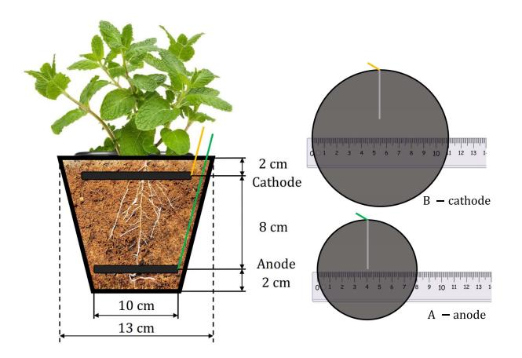
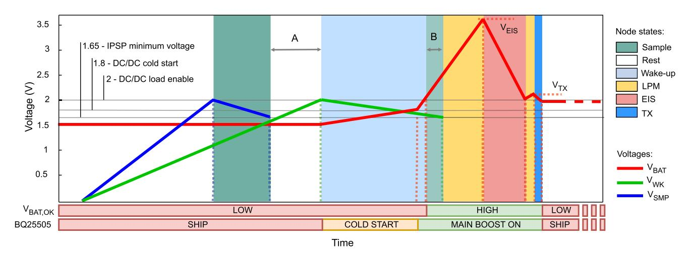
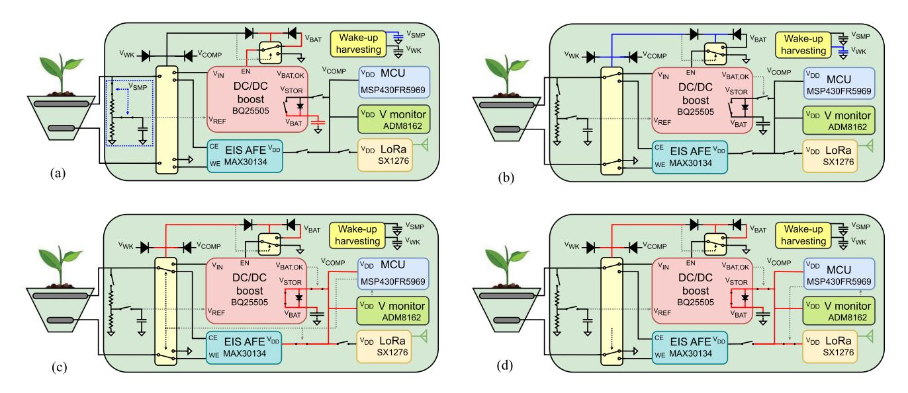
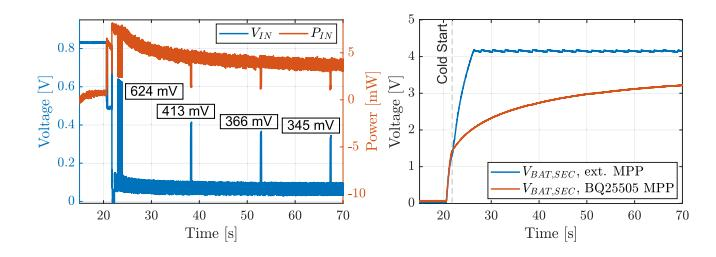
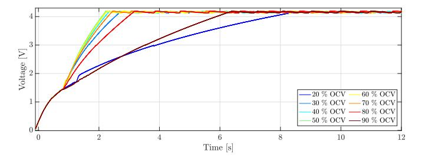
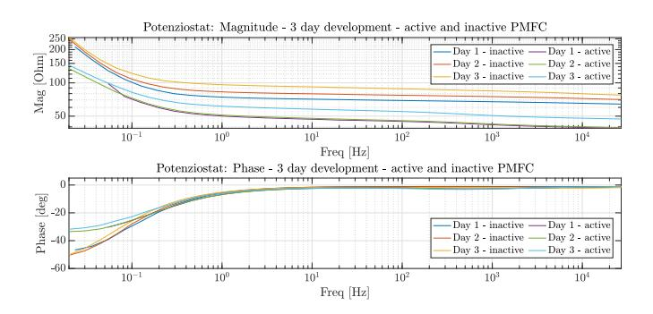
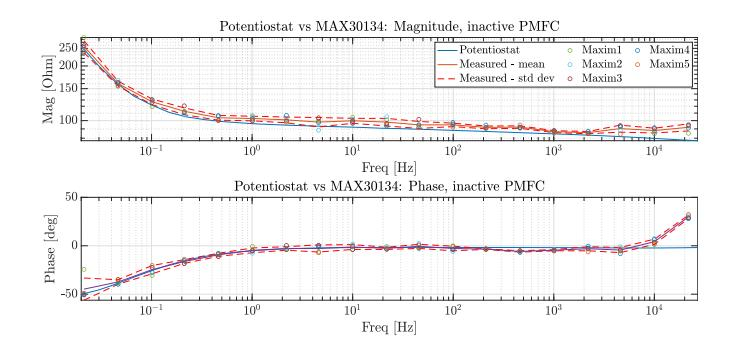
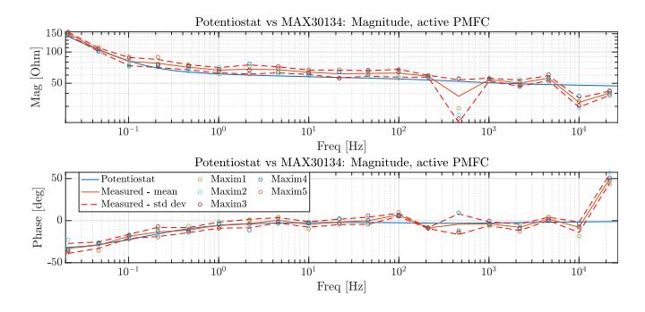
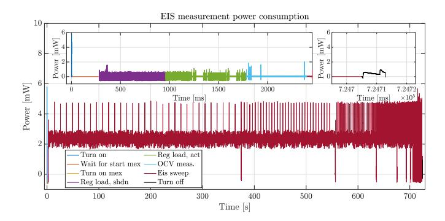

460 IEEE TRANSACTIONS ON AGRIFOOD ELECTRONICS, VOL. 2, NO. 2, SEPTEMBER/OCTOBER 2024

# Plant Microbial Fuel Cells: Energy Sources and Biosensors for battery-Free Smart Agriculture

Maria Doglioni®, *Student Member, IEEE*, Matteo Nardello®, *Member, IEEE*, and Davide Brunelli, *Senior Member, IEEE* 

Abstract-Smart sensors used for intensive crop monitoring require minimal maintenance and should prioritize ecological sustainability. Consequently, battery-free energy harvesting represents a key aspect of sustainable development in smart agriculture. Plant microbial fuel cells (PMFCs) introduce a cutting-edge renewable energy source that scavenges energy from the symbiotic relationship between a plant and electron-generating bacteria in the soil, potentially supplying power as long as the plant lives. Characterizing PMFCs' power production is challenging, as it depends on many factors, such as soil impedance and plant condition. Electrochemical impedance spectroscopy (EIS) is often used in laboratory tests, but it is inefficient to deploy in off-grid contexts. This article introduces an ultralow power EIS biosensor architecture that utilizes PMFCs as an energy source and for the EIS measure. We prove that ultralow-power EIS is compatible with PMFCs' mWlevel power production through an implementation that integrates an EIS analog frontend and PMFC-tailored harvesting electronics. The architecture also facilitates PMFC unloading periods, crucial for PMFC recovery and durability. Experimental results show that a full-range EIS sweep (21.3 mHz-21.8 kHz, 19 points) executed with the proposed architecture requires only 3.64 J. We highlight the potential of cost-effective, self-powered EIS in assisting PMFCs' development into reliable energy sources for battery-free nodes. We also demonstrate that plant state, as well as maximum power point could be monitored through ultralow power EIS measurements.

Index Terms-Biological systems, biosensors, electrochemical impedance spectroscopy, energy harvesting, power conditioning, system-level design.

# I. INTRODUCTION

PRECISION farming relies on environmental monitoring wireless sensor networks to collect data on the crops and soil and then to control and optimize the use of resources, such as water and pesticides. Thanks to the advancement of ultralow power computing paradigms and hardware [1], more environmentally friendly and maintenance-free supply solutions are gaining momentum, such as in *battery-free* electronics [2], [3]. Typically, battery-free devices [4] harvest energy from the environment and store it in a supercapacitor, sporadically executing tasks [5] whenever energy is sufficient, in an *intermittent* fashion  $[6]$ .

Manuscript received 15 November 2023; revised 13 March 2024 and 17 May 2024; accepted 10 June 2024. Date of publication 2 July 2024; date of current version 10 October 2024. This work was supported by the GEMINI ("Green Machine Learning for the IoT") national research project, funded by the Italian MUR under the PRIN 2022 programme under Grant 20223M4HZ4. This article was recommended by Associate Editor M. Sophocleous. (Corresponding *author: Maria Doglioni.*)

The authors are with the Department of Industrial Engineering, University of Trento, 38122 Trento, Italy (e-mail: maria.doglioni@unitn.it).

Digital Object Identifier 10.1109/TAFE.2024.3417644

Aside from common energy harvesting sources, such as wind and solar power, plant microbial fuel cells (PMFCs) [7], [8] are sources of particular interest to the agricultural world. The simplest form of a PMFC consists of two conductive electrodes placed in the soil at a distance from one another and of a suitable plant, placed right above the electrodes. PMFCs rely on the energy-producing metabolism of naturally present exoelectrogenic bacteria and their symbiotic relationship with plants. These microorganisms release electrons as they consume organic matter (e.g., glucose), which is continuously provided at the roots thanks to plant photosynthesis. The conductive electrodes placed in the soil support the formation of a microbial biofilm, which catalyzes naturally occurring redox reactions in the soil, enabling energy production from the bacterial cell as long as the plant lives.

Although incredibly promising for their low environmental impact and maintenance costs, PMFC technology is still under development. These biofuel cells have several dependability issues that limit their widespread use and industrialization. We can articulate the nature of their shortcomings into three main points as follows.

- (1) Low voltage, low power output: Single PMFCs output a voltage below  $1 \text{ V}$  and mW/cm3 power densities, meaning that efficient conversion electronics and/or output scaleup strategies are required for powering electronics from these sources.
- (2) Low stability and predictability: PMFCs are very sensible to the surrounding environment and have unpredictable power yields. They require a startup phase ranging from days to weeks before they can source power and have a highly variable lifetime. Their voltage polarity output can also switch suddenly and irreversibly in what is termed *voltage reversal* (VR) [9].
- (3) Indirect fuel cell state measurement: Bacteria, plant, and electrode state, which are the most important factors in determining future power outputs, cannot be measured *directly* and *nondestructively*, as collecting samples from the cell would heavily alter its state.

A promising strategy to obtain voltage and power scaleup consists in connecting cells together in series/parallel [\[10\]](#page-10-0). Unfortunately, the efficiency of this solution to ① is limited by ②, as stacking is linked to a higher probability of VR [\[9\]](#page-10-0). The cause of ② must be sought in the complex electrobiochemical nature of PMFCs, whose understanding in real deployment *scenarios* is limited by the difficulties posed by fuel cell state

© 2024 The Authors. This work is licensed under a Creative Commons Attribution 4.0 License. For more information, see 
https://creativecommons.org/licenses/by/4.0/

DOGLIONI et al.: PLANT MICROBIAL FUEL CELLS: ENERGY SOURCES AND BIOSENSORS FOR BATTERY-FREE SMART AGRICULTURE 461

measurements (3). Electrochemical impedance spectroscopy (EIS) is typically used in laboratory settings to gain insight indirectly on PMFCs' state through their impedance spectra. EIS consists of a nondestructive impedance measurement as a function of frequency in electrochemical cells and half-cells. Fitting EIS data to physical-based circuit models allows us to assess underlying electrobiochemical phenomena, find factors that limit power production, and track the MPP. Previous works have linked specific EIS features to the cell state and properties [11], particularly biofilm formation, anode and cathode electrochemical reactions, electrode coating, and material performance. EIS has also been used directly on plants to gather information on plant health, root growth, frost hardening, sensitivity to salinity, crop production, and plant stress [12]. Coupling these two ideas by factoring a cell's reactor plant into classical physical-based cell models, we believe that EIS measurements can provide information on plant health status and increase PMFC life expectancy, power production, cell stability, and reduced startup time. Previous literature has found a link between plant health and open circuit voltage (OCV)  $[13]$ , but has not attempted to tie PMFC plant health and EIS. Unfortunately, EIS workstations are hard to deploy in an outdoors, distributed sensor network due to their cost and power requirements, which are not compatible with battery-free sensor nodes.

This article presents a PMFC-powered battery-free IoT architecture for remote EIS measurement. The proposed architecture employs a PMFC both as an energy source and as an EIS biosensor for measuring cell state, using the same electrodes. To the best of our knowledge, no other work has coupled low-power EIS measurements to energy extraction on the same cell. Batteryfree, PMFC-powered EIS can close the control loop on cell state and provide valuable feedback on optimal PMFC operation, paving the way toward dependable PMFC power in wireless sensor networks. This can also lead to interesting developments in the plants residing in the PMFC, as cell/bacteria state is a promising indirect measurement of plant state. We executed EIS measurements with Maxim's ultralow-power EIS analog frontend (AFE), the MAX30134, and then validated them through a reference potentiostat. Preliminary results obtained through a bench implementation confirmed that the chosen AFE is sensible enough to track time and power yield capability variations across different PMFCs, and also that a full frequency range EIS sweep  $(19 \text{ points}, 21.3 \text{ mHz}-21.8 \text{ kHz}) \text{ consumes } 3.64 \text{ J}, \text{ which is an}$ energy level compatible with PMFC technology. This article also presents an energy-aware, intermittent computing application scheme based on *intermittent harvesting*, which makes room for periodic cell unloading periods needed to extend a PMFC's power production period [13], [14].

The rest of this article is organized as follows. Section  $\mathbf{II}$ presents relevant related works, while system implementation is explained in Section  $\text{III}$ . The methodology is addressed in Section IV, showcasing our experimental results. Finally, Section  $V$  concludes this article.

# II. RELATED WORKS

The technology at the base of microbial fuel cells has been investigated for several years, and MFCs have already been 

demonstrated as fundamental components for various applications. MFC reactors are commonly used for powering selfsustainable IoT systems [\[15\]](#page-15-0), bioremediation [\[16\]](#page-16-0), and biosensing, of which we will mention some notable examples.

*Green rooftops* consisting of large PMFCs are used both as power sources and biosensors, besides providing both increased thermal insulation and  $CO_2$ /urban heat reduction. PFMC-roofs achieve optimal output power in warm and humid environments, where round-the-clock power generation reaches hundreds of  $mW/m^2$  [\[17\]](#page-9-1). In arid environments, PMFCs yield lower power densities (e.g., Tapia et al. [\[18\]](#page-9-1) reported a mere 92  $\mu W/m^2$ ), therefore in these environments, they are better used as biosensors rather than power suppliers: for example, Tapia et al. [\[19\]](#page-9-1) were able to link PMFC power density to soil water content.

Several PMFC-enabled IoT monitoring applications have proven that these energy-harvesting sources can power remote sensor nodes successfully. For example, both Osorio-de-la-Rosa [10] and Brunelli et al. [15], [20], [21] developed monitoring applications powered by PMFCs. Osorio-de-la-Rosa used the power of multiple PMFCs to collect barometric and temperature data and transmit it with LoRa radios. Brunelli et al. used a single PMFC as an energy source and as a biosensor because the PMFC's OCV is correlated to the reactor plants' health.

Although particularly interesting for their sustainability and maintenance-free operation, PMFCs must face numerous technological challenges before being ready for industrialization. First, PMFCs's low voltage and power output needs to be optimized for efficient use of these energy sources. This can be done following two separate but parallel strategies. The first is to scaleup the cell's power output. This is typically done by increasing reactor size and/or stacking the cells together. While the former approach comes at the acceptable cost of reduced power density and higher internal impedance, the latter brings additional challenges, such as the harmful phenomena of voltage overshoots [\[22\]](#page-9-1) and VR [\[9\]](#page-9-1). Although scaling up is also possible through electrobiochemical optimization of cell materials and working conditions, these approaches are beyond the scope of this article. Another strategy to increase energy extraction does not focus on the cell itself, but on the energy harvesting and conversion systems (EHSs) used to boost the PMFC's low voltage up to operative levels. Self-powered EHS have a *cold-start* threshold, which is the power step needed to self-start the system and begin energy extraction. If a PMFC fails to provide sufficient power to complete the cold-start, energy cannot be extracted from the cell. The commercialization of low-threshold harvesters, such as the one presented in Yamashita et al.'s [\[23\]](#page-9-1) work, which starts from just 2  $\mu$ W, will enable harvesting from lower power levels.

Another challenge linked to PMFCs is that they require a startup phase, which can range from days to weeks. During this period, cells cannot provide power, as the microbial colony needs time to form a mature biofilm capable of sustaining current production. The startup also influences PMFC power production and its time evolution  $[24]$ ,  $[25]$ .

How energy is extracted from PMFCs is also a matter of study. Harvesting schemes specific to PMFCs will open new possibilities for the commercial use of these peculiar energy sources. Unlike other sources, such as solar panels, which 

462 IEEE TRANSACTIONS ON AGRIFOOD ELECTRONICS, VOL. 2, NO. 2, SEPTEMBER/OCTOBER 2024

respond quickly to change, MFCs have *slow dynamics* because of the redox reactions and the evolution of the biofilm. When PMFC operating conditions vary, transients must be settled before we can draw conclusions on steady-state characteristics, such as maximum power point (MPP). For example, many commonly used dc–dc converters integrate FOCV MPPT algorithms by periodically detaching the load for some milliseconds to measure the OCV, and then modulating the cell voltage to a preset fraction of that OCV value [26]. While this trivial OCV measurement works very well for fast energy sources, such as photovoltaic cells, PMFCs require tens of minutes to reach OCV after unloading. If this is not accounted for when coupling PM-FCs to commercial dc-dcs, it leads to incorrect OCV sampling, which sets the working point far from the actual MPP. To adapt common dc-dcs to the slow dynamics characterizing PMFCs, Alaraj et al. [27] developed an MFC-specific MPPT algorithm, which includes waiting a correct amount of time where the cell is unloaded to capture steady-state OCV. Similarly, in this article, we capture the steady-state OCV after a sufficient unloading time of the PMFC—which we term *cell rest*—and externally apply a fraction of the measured OCV as MPP reference to the dc-dc. This operation is executed through a simple sample-and-hold circuit, which is briefly powered after cell unloading periods to obtain a new MPP reference (see Section III-C2). The benefits of this method can be appreciated in Fig. 4. We do not rely on the OCV fraction found from the polarization curve (MPP at  $30\%$ ) but choose the OCV percentage that experimentally resulted in the fastest capacitor charging through the BQ25505, which we found to be  $50\%$  (see Fig. 5). The downside of unloading a cell for some time to measure OCV correctly is that we cannot extract power from that cell during its rest period. If this can initially be seen as a limitation of our method, allowing cells to rest actually benefits the longevity of PMFCs, as continuous current drainage was proven to reduce PMFC performance in the long run [13], [14], [20], [28]. Besides, if multiple PMFCs are available, one can switch between cells to ensure continuous power extraction and cell rest, as shown in Reyes et al.'s [28] work.

Finally, while high internal impedance is one of the major limiting factors in PMFC power output, it can be a key element in understanding electrobiochemical phenomena ruling the functioning of PMFCs. The development of cell impedance models can come in handy for MPPT, optimizing cell lifetime, and using the cell as a plant health biosensor. Cells are highly complex systems: although a favorite in literature has been the Randles cell, there is a lack of agreed-upon cell mathematical models. PMFC models can be obtained and used in different ways. For instance, Ma et al. [29] used a data-driven approach for modeling the relationship between temperature, pH, and OCV during startup. As mentioned, literature has often relied on EIS measurements to develop physical-based cell models [11].

In this study, our main interest in EIS measurements lies in enabling online estimation of cell state from electrochemical properties so that appropriate actions can be taken to reach or maintain the cell's desired power production rate for as long as possible. We are also interested in enabling further studies of the link between EIS measurements and plant state. Unfortunately, Carmalin et al. [30] stress the lack of studies on the subject but

Fig. 1. On the left, the construction details of the reactor are shown. Figure A and B, respectively, show the dimensions of the anode and cathode carbon brush electrodes, the titanium wire inserted into the electrodes.

hint that EIS fit parameters such as solution resistance could be influenced by plant factors, such as root exudate type, rate, and present bacterial community. Other projects such as [31] and [32] executed EIS on PMFCs, but most interpret results without considering plant interaction with the cell's electrobiochemical characteristics.

If the link between EIS and plant state is found, our monitoring system can be used as an inexpensive and portable plant biosensor, assisting researchers in large data collection campaigns.

# III. SYSTEM IMPLEMENTATION

This section outlines the sensor node's key building blocks and the application scenario. It begins with a review of the construction of our test PMFCs in Section III-A, followed by an analysis of the proposed application scenario in Section III-B and the sensor node's block diagram in Section III-C.

## A. PMFC Construction and Operation

We built our test reactors using carbon brush electrodes and soil from the campus ground. Fig. 1 showcases the construction details. We designed a single-chamber fuel cell without a polymer electrolyte membrane (PEM) separating anodic and cathodic regions, to keep deployment costs as low as possible, albeit the Coulomb efficiency slightly lower [33].

To compensate for the absence of a PEM, oxygen diffusion was limited by placing the two electrodes at a 10 cm depth difference. The anode was placed at the bottom of the vase, with no openings to maintain the anoxic environment required for the anodic reaction. The cathode was buried 2 cm below ground to ensure oxygen could reach its surface for the oxygen reduction reaction. The reactor volume was 1044 cm3. The cathode was slightly oversized than the anode (cathode diameter:  $11 \text{ cm}$ , anode diameter:  $8 \text{ cm}$ ) to compensate for slower cathodic reaction kinetics [34]. The plant in our MFC cells is common *Mentha Piperita:* it is a fast-growing, hardy, and easy-to-source plant, supposed to tolerate well a damp environment.

Newly built reactors require a startup time. Naturally present bacteria in the soil need to establish a thriving colony, which

DOGLIONI et al.: PLANT MICROBIAL FUEL CELLS: ENERGY SOURCES AND BIOSENSORS FOR BATTERY-FREE SMART AGRICULTURE 463

Fig. 2. Full battery-free, PMFC-powered EIS application cycle. The voltage levels of all supplies ( $V_{\text{WK}}$ ,  $V_{\text{SMP}}$ ,  $V_{\text{STOR}}$ ), sensor node, and component states (outlined in Section III-C). The current draw from the three supplies is reported in Table II. A refers to the time margin between OCV sampling and wakeup to ensure a correct OCV measurement, while B is where supply handoff happens.

TABLE I 
CAPACITOR MODELS TESTED IN PMFC-POWERED DC/DC COLD START

| Symbol | Capacitance [ $\mu$ F] | Nominal voltage [V] | Leakage [ $\mu$ A] | Producer and part number |
|--------|------------------------|---------------------|--------------------|--------------------------|
| $C_1$  | 47                     | 63                  | 3                  | Elna, RE3-63V47MF3       |
| $C_2$  | 470                    | 16                  | 3                  | Rubycon, 16YK470M8X11.5  |
| $C_3$  | 10000                  | 6.3                 | 3                  | Panasonics, EEUFC0J103S  |
| $C_4$  | 470000                 | 5.4                 | 13                 | Eaton, PHV-5R4V474-R     |
| $C_5$  | 1000000                | 3.9                 | 4                  | Eaton, PHVL-3R9H305-R    |

entails bacterial multiplication and biofilm formation on the cell's electrodes. Cell startup was done by flooding the PMFC reactor with water and leaving it undisturbed/unloaded until OCV stabilized above 0.6 V. Whenever OCV overcame this threshold, the PMFC was considered *active* and the colony sufficiently settled to source power, as the cell could comfortably cold start the dc-dc converter. During its active period, the reactor was provided with common plant fertilizer and a glass of water (137 ml) whenever soil dried up and OCV started dropping. If OCV stopped recovering above 0.6 V after watering, the cell was deemed *inactive*, as it failed to cold start the dc–dc converter.

## B. Application Context

Battery-free electronics relying solely on energy harvesting sources for their functioning often run out of stored energy and incur in power failures. While some tasks can quickly be interrupted, and their progress can be recovered through intermittent computing strategies, other tasks, such as message exchanges and measurements, require uninterrupted execution not to yield erroneous results. Energy-aware scheduling only triggers uninterruptible tasks when the stored energy is sufficient to ensure their continuous execution. This requires uninterruptible task energy profiling and state of charge estimation. When capacitors are used as energy storage for the sensor node, the state of charge can easily be determined through their voltage  $V_{\text{STOR}}$ . By previously knowing task energy requirements, we evaluate the  $V_{\text{STOR}}$  threshold that triggers the task and ensure completion.

TABLE II
SENSOR NODE CURRENT DRAW IN ITS DIFFERENT STATES

| Node state | SC draw from wakeup [nA] | SC draw from storage [nA] | Components avg current from storage | Duration [s]          | Notes                                                       |
|---------------|-----------------------------|------------------------------|----------------------------------------|-----------------------|-------------------------------------------------------------|
| Sample        | 0.8                         | 0 or 0.82a                   | –                                      | xb                    |                                                             |
| Wakeup        | 2.02                        | 0.02                         | 325 nA                                 | xb                    | BQ active (cold-start/output disabled)                      |
| LPM1          | –                           | 1.66                         | 705 nA                                 | xc                    | BQ active + voltage monitors MCU in LPM 4.5, SVS enabled |
| EIS           | –                           | 1.66                         | 1.75 mA                                | 722.2                 | BQ active + voltage monitors EIS + MCU active            |
| LPM2          | –                           | 1.66                         | 705 nA                                 | xc                    | BQ active + voltage monitors MCU in LPM 4.5, SVS enabled |
| TX            | –                           | 1.66                         | 23.54 mA                               | 0.112                 | BQ active + voltage monitors LoRa TX + MCU active        |
| Rest          | –                           | 0.82                         | 5 nA                                   | Until next wake-up | BQ in ship mode                                             |

"As rest mode (0.82 nA), if V\textsubscript{BAT}>1.65 V (IPSP supply voltage, Section III-C2), 0 nA if V\textsubscript{BAT} 1.0

"As rest mode (0.82 nA), if  $V_{\text{BAT}} > 1.65 \text{ V}$  (IPSP supply voltage, Section III-C2), 0 nA if  $V_{\text{BAT}} < 1.65 \text{ V}$  bDepends on harvested power input and  $C_{\text{Wk}}$ ,  $C_{\text{SMP}}$  dimensioning. 'Varies based on power inpu

The proposed sensor node is to be deployed on a large scale outdoors and indoors for a cost-effective, maintenance-free plant monitoring solution. This battery-free application is meant to be self-powered through the electrodes of the PMFC, which it also uses for EIS measurements. It has the potential to empower farmers to monitor plant-and-soil health down to the single plant, providing a dense map of the crop state and ensuring resources are used only when and where they are needed most.

The full application cycle of our sensor node, composed of the sequence of states listed in Table  $\text{II}$ , can be seen in Fig. 2. In further detail, this sensor node executes two subsequent uninterruptible tasks, an EIS sweep and then a LoRa transmission, in an *energy-aware* fashion. This is done by triggering EIS execution when the storage is charged to  $V_{\text{EIS}}$ , and transmission (TX) when storage grows to  $V_{\text{TX}}$ . These two thresholds (see Section IV-E for how we obtained them) ensure that the storage can complete the task before discharging down to  $V_{\text{MIN}}$ , where the node enters rest state.

In the rest state, no power is harvested from the PMFC, and the leftover storage energy, which enters rest charged at  $V_{\text{MIN}}$ , is safeguarded thanks to the node's ultralow power consumption in rest mode (see Table  $\text{II}$ ). Rest state was integrated as it was proven that periodically unloading PMFCs, in what we call *intermittent harvesting*, benefits both the length and the quality of PMFCs' power production (see Section II). As mentioned in

464 IEEE TRANSACTIONS ON AGRIFOOD ELECTRONICS, VOL. 2, NO. 2, SEPTEMBER/OCTOBER 2024

Fig. 3. Sensor node block diagram. Passive wakeup is achieved by harvesting from the wakeup signal. First,  $V_{SMP}$  triggers an OCV measurement (a), then  $V_{WK}$  powers the IPSP (b), allowing energy to flow into the supercap. This continues until  $V_{CAP}$  can power the IPSP on its own (that is, above its load-detach voltage of 2 V). Above this threshold, the MCU stays in ultralow power mode and executes EIS (c) and then LoRa transmission (d) when notified that energy is sufficient by the voltage monitors. After the transmission, the nearly empty storage is further depleted to trigger the BQ's internal load-detach mechanism and go back to cell rest.

Section  $\mathbf{II}$ , rest periods also ensure that a correct steady-state OCV measurement can be executed, allowing us to set a more accurate MPP (see Section IV-B).

To the best of our knowledge, no estimation of the optimal resting period of a PMFC is currently available. For this reason, we do not assume its maximum duration when designing the sensor node architecture. If we rely on sensor node components to generate the wakeup signal, there is an upper limit on rest time. If the PMFC were to require long resting periods, the storage could become fully discharged while powering the components required for wakeup signal generation (e.g., timers, voltage monitors), preventing the node from ever waking up again. Because of this reason, we bring the node out of rest state through an external wakeup signal, which we also harvest in a passive wakeup approach. The energy harvested from this external signal is used to bootstrap the *input power and sensing path* (IPSP— Section  $III-C2$ ), which is the section of the sensor node allowing power to flow from the PMFC to the harvesting circuitry  $[35]$ . In this way, the sensor node can still successfully wakeup even if its storage becomes fully depleted. This technique ensures no upper bound on rest time, although it requires the external infrastructure to generate the wakeup signal. Depending on the application, we can rely on self-powered IR sensors, PV panels, or passive wakeup radios for passive wakeup [36]. If optimal rest times are short enough and compatible with an onboard wakeup generation, passive wakeup could act as a fail-safe to revive nodes discharged during rest.

## C. Sensor Node Block Diagram and Application Cycle

We designed the proposed sensor node architecture shown in Fig.  $3$  by choosing cost-effective components needed to execute and transmit PMFC-powered, ultralow power EIS measurements and by building a *service circuitry*  $(SC)$  around them. The 

SC adapts the chosen components to the requirements of optimal PMFC use. First, we will discuss our choice of components, then we will analyze the role of the SC in the architecture.

1) *Core Components Selection:* Due to the low voltage, low power limitations of PMFCs  $(1)$ , the sensor node requires an energy conversion stage which boosts the PMFC's output voltage and buffers its energy into a supercapacitor for a duty-cycled operation of the sensor node. We selected the BQ25505 IC by Texas Instruments for this purpose.1 Besides featuring ultralow quiescent current (325 nA) and an efficient ship mode draining only 5 nA, this IC provides a  $V_{\text{BATOK}}$  signal useful to detach loads during cold-start (see Section IV-B).

The sensor node features two key components besides the  $dc$ dc converter: the AFE providing EIS functionality and the radio transceiver needed to transmit measurement results to a base station. We selected the MAX30134 EIS AFE and Semtech's SX1276 LoRa radio for their ultralow power consumption. While the latter is a staple in low-power, long-range communication, the MAX30134 still needs to be tested on PMFCs. The MAX30134 is a four-channel AFE providing biasing and full measurement path, ADC included, to be used on two or three terminal electrochemical sensors. This IC can execute voltage and temperature monitoring, dc measurements, and typical electrochemical measurements such as EIS and cyclic voltammetry. Finally, two factory-trimmed voltage monitors (Analog Devices, ADM8612) provide the signals triggering the measurement and transmission tasks at the appropriate storage voltages (see Section  $IV-E$ ).

For the first bench demonstrator, we opted for two-terminal EIS measurements, as this work's goal is not to obtain the

1[Datasheet] BQ25505 ultralow-power boost charger with battery management and autonomous power multiplexer for primary battery in energy harvester applications, Texas Instruments, 8 2013, rev. F-March 2019.

DOGLIONI et al.: PLANT MICROBIAL FUEL CELLS: ENERGY SOURCES AND BIOSENSORS FOR BATTERY-FREE SMART AGRICULTURE 465

highest possible accuracy but rather to design the most portable, practical, and inexpensive setup to execute self-powered EIS on the field. If a higher accuracy was ever to be required, printable reference electrodes  $[37]$  can easily be added to the sensor, without any additional energy expenditure. The two EIS terminals consist of two electrodes, which are also used for collecting the energy required to execute the EIS measurements. Our novel approach ensures that the PMFC acts both as an energy source and a biosensor for our application: in the first case, the PMFC electrodes are connected to the dc/dc, in the second to the EIS AFE.

2) Service Circuitry: We can distinguish two different sections of the SC: OCV sampling and the IPSP. The OCV sampling circuit is a high-impedance resistive divider that samples 50% of the steady-state (i.e., after cell rest) OCV into the dc/dc's MPP reference voltage capacitor. The resistive divider is briefly connected to the circuit thanks to the wakeup signal, and then it is unconnected through two switches. The IPSP acts as the interface between the PMFC and the sensor node and has a twofold purpose. First, it turns the power flow on/off from the PMFC to the dc/dc input, to either *harvest* energy from the cell or to *unload* it to ensure cell recovery. Second, the IPSP also controls whether the PMFC is being used as a power source (i.e., PMFC connected to the DC/DC), or if it is being used as  $\frac{1}{2}$ EIS biosensor (i.e., PMFC connected to the EIS AFE).

During wakeup, the power supplies of the IPSP and OCV sampling control and synchronize their activity. Fig. 2 shows the time development of the supply voltages of the IPSP, the sampling, and the storage capacitor during an entire application cycle. The OCV sampling section is powered only at the start of the wakeup period. On the other hand, the IPSP is activated only once OCV has been successfully sampled so as not to disrupt its measurement by loading the PMFC before time. To grant the synchronization between these two phases, the wakeup harvesting circuitry charges two separate capacitors, one responsible for OCV sampling ( $C_{SMP}$ ) and one for the IPSP's supply ( $C_{WK}$ ).  $C_{SMP}$  must activate and deactivate OCV sampling strictly before  $C_{WK}$  activates IPSP, so that sampling ends before harvesting begins [see Fig. 2(A)]. This can be done by properly sizing  $C_{SMP}$  and  $C_{WK}$ , with  $C_{WK} > C_{SMP}$ . The IPSP also taps into the storage capacitor when  $C_{WK}$  is depleted to sustain harvesting beyond the wakeup period. In particular, to ensure correct supply handoff,  $C_{WK}$  must be able to hold the IPSP's supply above its operative voltage (1.65 V) as the storage capacitor charges above its load-enable threshold,  $V_{MIN} = 2 V$  [see Fig. 2(B)]. If the PMFC cannot charge the storage capacitor above  $V_{MIN}$  in time, harvesting cannot continue as the IPSP is unpowered. The cell is deemed inactive, and a new wakeup tentative will be done at the next wakeup message reception.

Below  $V_{\text{MIN}}$ , the storage loads are detached through a digital signal generated by the BQ25505, the  $V_{\text{BAT,OK}}$  signal, to reduce the minimum power required for cold start (see Section IV-B). Right after wakeup, when the storage crosses  $V_{\text{MIN}}$ ,  $V_{\text{BAT,OK}}$  activates the loads on  $V_{\text{CAP}}$  (MCU, voltage monitors). The MCU boots up in ultralow power mode LPM 4.5, waiting for an interrupt. When  $V_{\text{STOR}}$  charges up to  $V_{\text{EIS}}$ , a voltage monitor interrupts the MCU, which then launches an EIS measurement

cycle by toggling the M signal, which powers the EIS AFE and controls the IPSP to connect the electrodes to the AFE. Once the measurement is finished, EIS circuitry is power-gated, and the MCU enters LPM 4.5 again, waiting until  $V_{TX}$  is reached. At that point, transmission is issued by powering the LoRa modem through the S signal. After the transmission, the MCU remains active until the storage element drops below  $V_{MIN}$ —5 mV. The BQ25505's internal PFET disconnects the storage element from the sensor node supply line at that voltage. This interrupts the power supply to the IPSP and all components, sending the node into rest mode until a new wakeup signal is received. To save precious leftover storage energy during cell rest, the BQ25505 is held in a reset state, only consuming 5 nA. If rest lasts a long time and the storage is discharged below the cold-start voltage ( $V_{CS} = 1.8$  V), we will incur in cold start of the DC/DC converter upon wakeup. Power distribution and component power-gating are done through SPST (Vishay Siliconix, SiP32431DN) and SPDT (Vishay Siliconix, DG4157E) switches.

# IV. EXPERIMENTAL RESULTS

The initial test phase concerned PMFC reactor characterization: first, we focused on their construction, startup, and operation, and then we assessed their performance in cold-starting storage capacitors through the BQ25505. After that, we moved on to analyzing the time development of the impedance spectra of active and inactive PMFCs: with this experiment, we confirm that the impedance spectrum of a PMFC varies significantly both from day to day and from active and inactive plants. These significant changes in EIS results can be tracked to more than just common MFC parameters, such as biofilm formation, but also to plant health and status. We executed this first set of EIS measurements with a reference potentiostat (Autolab PGSTAT302 N) for three consecutive days. These first EIS measurements also allowed us to set up the MAX30134's measurement range for PMFCs. We then validated the MAX30134's capabilities in measuring a PMFC's impedance spectrum by comparing its measurements to the reference potentiostat and in terms of low-power energy consumption by measuring its energy consumption during a prototype EIS sweep. As a last step, we estimated the energy consumption of the atomic tasks of the application scenario we considered: message transmission and EIS measurement. This allowed us to dimension the energy storage element required for this test case and confirm the feasibility of a simple monitoring application based on this node.

## A. Reactor Startup and Operation

As a preliminary study, we built an MFC and confirmed through experiments that the cell's durability and power production capabilities are comparable to the expected results in the literature  $[38]$ . We analyzed the PMFC's performance by adding the plant to a cell of the same volume. We verified that drawing current from the cell during startup or adding water to it delayed cell stabilization, as the bacteria colony still had to get acclimatized. This led us to start new cells up by waterlogging them and leaving them unloaded until OCV stabilized above 

466 IEEE TRANSACTIONS ON AGRIFOOD ELECTRONICS, VOL. 2, NO. 2, SEPTEMBER/OCTOBER 2024

0.6 V. After a startup time of around two weeks, OCV sharply increased at about 100 mV per day, indicating that the bacteria colony was starting to thrive. Our reactors produced power for about three weeks after the initial OCV spike. During this period, the maximum recorded OCV was 0.84 V. Water was added whenever OCV started decreasing; after about two days, OCV was recovered. It could be because wet soils favor ionic movement and thus reduce the cell's internal resistance. At the end of the three weeks, OCV dropped and stopped recovering after watering. We noticed the weakened mint plants had died, eventually leading to bacteria starvation. This confirmed the importance of selecting a plant that thrives in marshy soil for longer power production windows.

## B. Cold-Start Performance of Active PMFC and MPPT Policy

To operate from lower input voltages, dc/dc converters feature a low efficiency *cold start* circuit, which is responsible for charging the storage element at a voltage level needed to bootstrap a more efficient main converter. Because of the lower conversion efficiency of the cold start circuit (5% versus 90% for the BQ25505), the input power  $P_{\text{IN, MIN}}$  needed to balance out the leakage at the storage element is higher during the cold start with respect to normal operation. If a PMFC cannot supply  $P_{\text{PMFC}} \geq P_{\text{IN, MIN}}$ , cold start is not overcome, and the storage element cannot be charged.  $P_{\text{IN, MIN}}$  largely depends on capacitor self-discharge current, which increases with rated capacitance, and on loads connected to the dc/dc output during cold start. To ensure both cold start overcoming and node energetic autonomy, we find the largest capacitor  $C_{\text{MAX}}$  we can charge with the maximum  $P_{\text{PMFC}}$  we can extract, using low-leakage capacitor technology. The tested capacitors are reported in Table I. We also remove all unnecessary loads from the dc/dc output during cold start, as explained in Section III-C2.  $C_{\text{MAX}}$  poses a limit to the maximum energy we can draw during an *uninterruptible task*, which is something to keep in mind during system design.

For the purpose of correctly setting MPP to estimate  $C_{\text{MAX}}$ , we set out to first experimentally find the FOCV value corresponding to the PMFC's MPP, then to validate our OCV sampling strategy (see Sections II and III-C2) with the FOCV found in the previous step. To recover the PMFC's MPP, we imposed a varying fraction of the steady-state OCV as MPP set-point to the dc/dc, bypassing the dc/dc's OCV measurement, and considered as MPP the fraction of OCV which yielded fastest capacitor charging. We selected a small 47  $\mu$ F storage capacitor for this test  $(C_1, \text{ Table I})$  to reduce recovery times in between tests. To ensure a steady state was reached in between tests, we unloaded the cell for 15 min and verified that the OCV recovered to the initial value of 800 mV. We swept most of the PMFC's P/V curve by executing eight tests with varying FOCV as MPP set-point (20% OCV to 90% OCV). Results are shown in Fig. 5: fastest capacitor charging, and thus MPP, is provided by a FOCV of 50%. We then validated the need for an external OCV sampling circuit for efficient PMFC MPP set-point recovery. As shown in Fig. 4-left, we can see that the dc/dc's internal OCV sampling is not ideal for PMFCs. In fact, the OCV measurements, marked with black arrows, gradually

Fig. 4. On the left, we verify that the BQ's integrated OCV measurement for FOCV MPPT is too fast for PMFC dynamics, as the OCV does not recover to its true value during measurements. On the right, we verify that a 470  $\mu$ F capacitor  $(C_2 \text{ Table I})$  charges faster with our OCV sampling method with respect to the dc/dc's integrated OCV measurement method, given the same MPP FOCV fraction (MPP 50% OCV).

Fig. 5. 47  $\mu$ F C1 capacitor (see Table I) charging curve with varying FOCV settings. Setting OCV to be 50% of the measured OCV voltage yields the fastest charging.

stray away from the actual OCV (dotted line). Because of this, the operating point moves away from the intended set point, and the power input drops. Finally, we compared the dc/dc's charging speed when setting 50% FOCV MPP using the BQ's internal OCV sampling and then using the external OCV sampling. We charged an example 470  $\mu$ F capacitor ( $C_2$ , Table I) and considered the fastest charging method to be most efficient at setting the actual MPP. Fig. 4-right confirms that the proposed external OCV sampling method ensures much faster charging when the main boost is active and actively polarizing the PMFC at its set-point MPP.

We then moved on to retrieving the  $C_{MAX}$  value for our test reactor at its MPP. Our small-sized cells could fully charge a 30 mF capacitor (3 10 mF caps in parallel,  $C_3$ , Table I). Tests with  $C_4$ ,  $C_5$  failed, even though nominal leakage is comparable to  $C_3$ 's: this could be ascribed to dielectric absorption. This effect is more marked in electrostatic double-layer capacitors ( $C_4$ ,  $C_5$ ) than in electrolytic capacitors ( $C_1$ ,  $C_2$ ,  $C_3$ ), and it determines a leakage current that takes hours or even days to settle down to its datasheet value.2 Since the application requires the PMFC to overcome cold start with a 1 F capacitor, such as  $C_5$  (see Section IV), we will implement power output scaleup strategies, such as increasing reactor size and stacking multiple PMFCs together. The latter strategy has been proven to be effective, as a serial-parallel connection of three PMFCs was used to cold start an 8 F capacitor [10]. We leave these aspects for future work, as the scope of this article is to highlight the possibility of biosensing and energy harvesting on the same PMFC electrodes.

2White Paper: Testing Super-Capacitors, Gamry Instruments, rev. 2.1–5/31/2018. [Online]. Available: <https://www.gamry.com>

DOGLIONI et al.: PLANT MICROBIAL FUEL CELLS: ENERGY SOURCES AND BIOSENSORS FOR BATTERY-FREE SMART AGRICULTURE 467

Fig. 6. Bode plots of dead and alive PMFC over three days, obtained with the Autolab PGSTAT302 N.

## C. Three-Day Impedance Study

We conducted a three-day study of cell impedance to qualitatively observe the typical time development of these complex electrobiochemical systems. Throughout these three days, we collected measurements from a power-producing (i.e., active) and nonpower-producing (i.e., inactive) cell to identify similarities and differences between their impedance spectra. The EIS measurements were obtained at OCV with an Autolab PGSTAT302 N, a laboratory-graded potentiostat used as a reference. This instrument automatically measures OCV and triggers a measurement sweep whenever OCV is sufficiently stable. EIS measurements were executed with a setup matching the twoelectrode configuration of the MAX30134 upon deployment (see Section III-C). The spanned frequency range starts at  $0.014 \text{ Hz}$ and ends at 27 kHz, to match the full range of the MAX30134 IC. Results of the EIS measurements done with the reference potentiostat can be seen in Fig.  $6$ .

The impedance of the inactive PMFC is always greater than that of the active PMFC. Both their phase and their magnitude curves are similar in shape. In both cases, the impedance magnitude curve is shifted upward as time passes because the soil is gradually drying up, increasing the ohmic resistance component. The phase is shifted to the left as time progresses. Also, alive PMFC shows a higher phase at lower frequencies than inactive PMFC. Overall, time variations across the three days and differences between the active and inactive cells are appreciable.

Monitoring impedance response could enable researchers to link these variations in the spectrum to plant/soil health and cell state. For now, we show that these variations across time and across different activity levels of PMFCs are appreciable and thus could be taken advantage of to understand more about plants, soil, and bacteria state.

## D. EIS AFE Evaluation

Having noticed that variations in the spectrum of the monitored plants are observable through the electrochemical workstation, we move on to the characterization of the ultralow power integrated circuit with which we execute EIS measurements, the MAX30134. We evaluated this IC using its evaluation board, 

the MAX30134EVSYS, and the supplied graphical user interface (GUI), which allowed us to set measurement parameters and obtain results easily. The GUI software was running on a desktop computer, which powered the MCU present on the evaluation board and communicated measurement configuration parameters/received measurement results via a USB interface.

In the MAX30134EVSYS, a MAX32630FTHR Cortex-M4F MCU provides 1.8 or 3.3 V voltage supply to the MAX30134  $\mu$ IC. We powered the IC with the 3.3 V supply from the MCU: we tested the  $1.8 \text{ V}$  supply, but measurement results were inaccurate, probably due to noisy voltage regulators on the MAX32630FTHR. In our battery-free sensor node, the MAX32630FTHR MCU will be replaced by the MSP430FR5969, allowing us to operate the MAX30134 intermittently and with a more flexible system in terms of power consumption.

Preliminary tests on known loads showed the importance of calibrating the DACs, which are used to impose dc offset to the MAX30134 electrodes. Tests on known loads also show that this IC can successfully measure impedance magnitude across the 125  $\Omega$ –2 M $\Omega$  range. We used the reference potentiostat to evaluate the cell impedance across its test frequency range. MFC reactors' impedance measure is less than 250  $\Omega$  across the tested frequencies. We thus had to expand the measurement range toward values lower than 125  $\Omega$  by activating a  $R_{\rm SER} = 150 \ \Omega$ resistor in series with the tested load, later removing its effects in postprocessing.

Knowledge of the impedance magnitude swing across the tested frequencies was also important for full-scale range setup, as no autoscale mechanism was present during the EIS sweep. Large impedance magnitude swings could result in ADC converter saturation or low SNR at the edges, which was tricky to manage. Future developments will surely implement an autoscale mechanism to avoid this problem.

We executed a set of five repeated two-terminal measurements with the MAX30134. The measurement sweep consists of 20 logarithmically spaced frequency points (no settle sine cycles, eight measurement sine cycles) ranging from  $0.021 \text{ Hz}$  up to 21.8 kHz, covering most of the MAX30134 range. Besides showcasing the IC's frequency coverage potential, we highlight the importance of the low-end of the frequency spectrum in the study of slow mass transfer phenomena, which are relevant PMFC characterization [39]. OCV was measured manually before the sweep: cell electrodes were then biased to OCV to ensure no dc offset current was present during the measurement. We activate the  $R_{\rm{SER}}$  resistor, and we set EIS amplitude at its minimum value (5 mVpp), and FSR at its maximum value (40  $\mu$ A). The effect of the  $R_{SER}$  is removed from the measurement results, assuming it only influences the real part of the measured impedance.  $R_{\text{SER}}$  corrected Bode plots for the active and inactive PMFC are shown in Figs. 7 and 8. The Bode plots show that the mean of the MAX30134 measurements closely matches those of the reference potentiostat, confirming the reliability of the MAX30134 IC at executing ultralow power impedance measurements on PMFCs.

468 IEEE TRANSACTIONS ON AGRIFOOD ELECTRONICS, VOL. 2, NO. 2, SEPTEMBER/OCTOBER 2024

Fig. 7. Bode plots of the inactive PMFC obtained with the MAX30134 on the third day of tests, compared with the results obtained with the Autolab PGSTAT302 N.

Fig. 8. Bode plots of the active PMFC obtained with the MAX30134 on the third day of tests, compared with the results obtained with the Autolab PGSTAT302 N

Fig. 9. Complete EIS measurement power profile with removed static consumption. On the top left, initial operations are displayed: turn ON, register load, and OCV measurement consumption. On the top right, we can see a detail of the turn-OFF peak.

## E. Energy Consumption Estimation

The energy storage must be able to sustain node operation during its most energy-consuming, uninterruptible task. In this application, both EIS measurement sweep and data transmission/reception events are to be executed without interruption. We estimate the most energy-consuming task between the two and dimension the energy storage accordingly. The current draw for the sensor node SC and components in the different execution states (pictured in Fig.  $2$ ) are reported in Table II.

1) EIS Measurement Consumption: We evaluate the power consumption of the MAX30134 during a typical EIS measurement sweep, equal to the one used in the previous section. The sweep takes  $T_{\text{EIS,AFE}} = 722.2 \text{ s}$  and  $E_{\text{EIS,AFE}} = 1.53 \text{ J}$ . Moreover,

TABLE III 
CONTENTS OF THE LORA MESSAGE

| Field               | Message content                        | Bytes |
|---------------------|----------------------------------------|-------|
| Node ID             | "N" + node ID                          | 3     |
| Timestamp           | "T" + timestamp                        | 5     |
| 19 impedance values | "R" + real part + "I" + imaginary part | 114   |

the MSP430FR5959 consumes  $I_{\text{MCU,FRAM ON}} = 103 \ \mu\text{A/MHz}$  if FRAM is active,  $I_{\text{MCU,FRAM OFF}} = 65 \ \mu\text{A/MHz}$  if FRAM is inactive.[3](#page-1-1) The inactive mode can be used if FRAM access is not required for some time; short tasks can be executed from RAM. Assuming we can run EIS sweep task without accessing FRAM memory, that we run the MCU at 16 MHz (to produce the 8 MHz SPI clock needed to drive the MAX30134) and that we supply the MCU with an average  $V_{\text{DD,MCU}} = 2.8 \text{ V}$  (halfway between  $V_{\text{MIN}}$  and  $V_{\text{MAX}}$ ), the energy required to run the MCU with FRAM off for a time  $t_{\text{EIS,AFE}}$  at  $f_{\text{CLK}} = 16 \text{ MHz}$  is  $E_{\text{MCU}}^{\text{EIS}} = 2.11 \text{ J}$ . We also consider the energy consumption of the BQ, the voltage monitors and the other SC active during EIS, consuming a total of 1 mJ (see Table II). Moreover, snapshot and restore operations to/from FRAM needed for intermittent operation require an energy overhead of  $E_{\text{RST}} = 8.29 \ \mu\text{J}$  and  $E_{\text{SN}} = 7.83 \ \mu\text{J}$ , respectively.

Summing all the energy contributions, we obtain  $E_{\text{EIS}} =$  $3.64 \text{ J}$ . It is worth noting that most of this energy is consumed by the MCU, which must be kept active during all the SPI transactions. As the power consumption of an MCU is directly linked to the clock frequency, in order to minimize the energy demand, we lower the main clock frequency to the minimum acceptable frequency for the SPI to comply with the MAX30134. In this case, we set the MCLK to 16 MHz in order to generate a SPI clock of 8 MHz, the minimum frequency required by the MAX30134 SPI interface. EIS measurement consumption can mostly be reduced by increasing the minimum EIS frequency point to be studied, as sub-Hz frequency points take a long time to execute.

2) LoRa Message Consumption: We rely on the LoRa transceiver Semtech SX1276 to transmit EIS measurement data to a gateway. The information coming from each 19-point EIS sweep can be packed into a 122-byte LoRa message (see Table III). Transmitting EIS data packet at SF7 and 250 kHz, we obtain a minimum airtime of  $t_{\text{airtime}} = 112.8 \text{ ms}^4$ 

Transmitting at minimum power (2 dBm) draws  $I_{\text{TX}} =$  22.54 mA. This value leave us with  $E_{\text{LoRa}}^{\text{TX}} = 7.11 \text{ mJ}$ . The chosen radio chip requires to be piloted through 8 MHz SPI, such as the MAX30134 chip, thus it accounts for  $E_{\text{MCU}}^{\text{LoRa}} = 0.33 \text{ mJ}$ . We also add the consumption of the active BQ, the two voltage monitors and the SC active during the TX phase, amounting to 0.15 µJ (see Table II) Summing these contributions together, along with a snapshot, a restore event, we obtain  $E_{\text{TX}} = 7.4 \text{ mJ}$ .

We thus conclude that the EIS measurement is the most energy-consuming, uninterruptible operation foreseen by the

3[Datasheet] MSP430FR596x, MSP430FR594x Mixed-Signal Microcontrollers, Texas Instruments, 10 2012, rev August 2018.

4Lora airtime calculator. [Online]. Available: https://www.thethingsnetwork. org/airtime-calculator

DOGLIONI et al.: PLANT MICROBIAL FUEL CELLS: ENERGY SOURCES AND BIOSENSORS FOR BATTERY-FREE SMART AGRICULTURE 469

application. To dimension the storage element, we assume it must yield  $E_{EIS} = 3.64 \text{ J}$  when discharging from 3.6 to 2 V. We reach the value of  $C_{CAP} = \frac{2E_{EIS}}{3.6^2 - 2^2} = 0.81 \text{ F}$ . Due to commercial availability constraints, we round this value up to 1 F. We thus select Eaton's PHVL 3F, 3.9 V supercapacitors (Table I,  $C_5$ ) and place them in series to obtain a  $1 \text{ F}$  storage capacitance. Besides granting us a safety margin, the additional capacitance also allows us to safely account for storage leakage (4  $\mu$ A), which consumes an extra 8.08 mJ and 1.25  $\mu$ J during EIS and TX, respectively.

Finally, considering both the selected capacitor, its leakage, and the estimated task energy consumptions for EIS and TX, we compute the two task triggering thresholds to be  $V_{\text{EIS}} = 3.4 \text{ V}$  and  $V_{\text{TX}} = 2.1 \text{ V}$ .

# V. CONCLUSION

PMFCs are a promising technology in the field of energy harvesting, and EIS measurements have largely been used to characterize and improve MFCs. Unfortunately, costly EIS workstations limit impedance spectra monitoring upon deployment. This work has pioneered an innovative ultralow power EIS-monitoring technology powered by a PMFC. This breakthrough opens up exciting new possibilities for the use of PMFCs as biosensors. In a practical and novel self-powered sensing approach, the same reactor serves as both an energy source and an EIS biosensor. EIS measurements are triggered when energy levels are sufficient and then communicated to a base station through LoRa, demonstrating the potential for real-world application. We also propose to periodically detach the EHS from the cell to let it recover, in an intermittent harvesting approach apt to maximize PMFCs' power production window. We then assessed the ultralow power capabilities of the MAX30134, which successfully matched reference potentiostat results, and evaluated the consumption of a full-frequency range EIS sweep at  $E_{EIS} = 3.64 J$ , proving that ultralow-power EIS is compatible with PMFC power production. Our research has demonstrated the significant variations of the impedance spectra across time (three days) and different activity levels (active and inactive) of PMFCs. This finding underscores the potential relevance of EIS in assessing plant health.

Future work will explore this cost-effective infrastructure for collecting dense crop data upon deployment and developing a comprehensive link between plant health and EIS measurements.

 # REFERENCES

- [1] A. Albanese, M. Nardello, G. Fiacco, and D. Brunelli, "Tiny machine learning for high accuracy product quality inspection," IEEE Sensors J., vol. 23, no. 2, pp. 1575-1583, Jan. 2023.
- [2] D. Ayala-Ruiz, A. Castillo Atoche, E. Ruiz-Ibarra, E. Osorio, and J. Castillo, "A self-powered PMFC-based wireless sensor node for smart city applications," Wireless Commun. Mobile Comput., vol. 2019, pp. 1-10, Jun. 2019.
- [3] D. Sartori and D. Brunelli, "A smart sensor for precision agriculture powered by microbial fuel cells," in Proc. IEEE Sensors Appl. Symp., 2016, рр. 1-6.
- [4] M. Nardello, H. Desai, D. Brunelli, and B. Lucia, "Camaroptera: A batteryless long-range remote visual sensing system," in Proc. 7th Int. Workshop Energy Harvesting Energy-Neutral Sens. Syst., 2019, pp. 8–14.

- [5] L. Caronti, K. Akhunov, M. Nardello, K. S. Ylldlrlm, and D. Brunelli, "Fine-grained hardware acceleration for efficient batteryless intermittent inference on the edge," ACM Trans. Embedded Comput. Syst., vol. 22, no. 5, 2023, Art. no. 82.
- [6] D. Balsamo, A. S. Weddell, G. V. Merrett, B. M. Al-Hashimi, D. Brunelli, and L. Benini, "Hibernus: Sustaining computation during intermittent supply for energy-harvesting systems," IEEE Embedded Syst. Lett., vol. 7, no. 1, pp. 15–18, Mar. 2015.
- [7] F. T. Kabutey et al., "An overview of plant microbial fuel cells (PM-FCs): Configurations and applications," Renewable Sustain. Energy Rev., vol. 110, pp. 402–414, 2019.
- [8] A. Torrisi et al., "Batteryless soil EIS sensor powered by microbial fuel cell," in *Proc. Annu. Meeting Italian Electron. Soc.*, Cham, Switzerland: Springer Nature, 2023, pp. 277–282.
- [9] B. Kim, S. V. Mohan, D. Fapyane, and I. S. Chang, "Controlling voltage reversal in microbial fuel cells," Trends Biotechnol., vol. 38, no. 6, рр. 667-678, 2020.
- [10] E. Osorio-de-la Rosa et al., "Arrays of plant microbial fuel cells for implementing self-sustainable wireless sensor networks," IEEE Sensors J., vol. 21, no. 2, pp. 1965-1974, Jan. 2021.
- [11] M. Sindhuja, N. S. Kumar, V. Sudha, and S. Harinipriya, "Equivalent circuit modeling of microbial fuel cells using impedance spectroscopy," J. Energy Storage, vol. 7, pp. 136-146, 2016.
- [12] I. Jócsák, G. Végvári, and E. Vozary, "Electrical impedance measurement on plants: A review with some insights to other fields," Theor. Exp. Plant Physiol., vol. 31, pp. 1-17, Aug. 2019.
- [13] M. Rossi, A. Iannaci, P. Tosato, and D. Brunelli, "Let the microbes power your sensing display," in *Proc. IEEE Sensors*, 2017, pp. 1–3.
- [14] E. Gardel, M. Nielsen, P. Grisdela, and P. Girguis, "Duty cycling influences current generation in multi-anode environmental microbial fuel cells." Environ. Sci. Technol., vol. 46, pp. 5222-5229, Apr. 2012.
- [15] D. Brunelli, P. Tosato, and M. Rossi, "Flora health wireless monitoring with plant-microbial fuel cell," Procedia Eng., vol. 168, pp. 1646-1650, 2016.
- [16] G. Beretta et al., "Microbial assisted hexavalent chromium removal in bioelectrochemical systems," Water, vol. 12, no. 2, 2020, Art. no. 466.
- [17] M. Helder, D. P. Strik, R. A. Timmers, S. M. Raes, H. V. Hamelers, and C. J. Buisman, "Resilience of roof-top plant-microbial fuel cells during dutch winter," *Biomass Bioenergy*, vol. 51, pp. 1–7, 2013.
- [18] N. F. Tapia, C. Rojas, C. A. Bonilla, and I. T. Vargas, "Evaluation of sedum as driver for plant microbial fuel cells in a semi-arid green roof ecosystem," Ecological Eng., vol. 108, pp. 203-210, 2017.
- [19] N. F. Tapia, C. Rojas, C. A. Bonilla, and I. T. Vargas, "A new method for sensing soil water content in green roofs using plant microbial fuel cells," Sensors, vol. 18, no. 1, 2018, Art. no. 71.
- [20] D. Brunelli, P. Tosato, and M. Rossi, "Microbial fuel cell as a biosensor and a power source for flora health monitoring," in Proc. IEEE Sensors, 2016, pp. 1-3.
- [21] M. Rossi et al., "Long range wireless sensing powered by plantmicrobial fuel cell," in Proc. Des. Autom. Test Europe Conf. Exhib., 2017, pp. 1651–1654.
- [22] M. Alaraj, M. Radenkovic, and J.-D. Park, "Intelligent energy harvesting scheme for microbial fuel cells: Maximum power point tracking and voltage overshoot avoidance," J. Power Sources, vol. 342, pp. 726-732, Feb. 2017.
- [23] T. Yamashita, T. Hayashi, H. Iwasaki, M. Awatsu, and H. Yokoyama, "Ultra-low-power energy harvester for microbial fuel cells and its application to environmental sensing and long-range wireless data transmission," J. Power Sources, vol. 430, pp. 1-11, 2019.
- [24] Z. Ren et al., "Accelerated start-up and improved performance of wastewater microbial fuel cells in four circuit modes: Role of anodic potential," J. Power Sources, vol. 535, 2022, Art. no. 231403
- [25] H. C. Boghani, J. R. Kim, R. M. Dinsdale, A. J. Guwy, and G. C. Premier, "Control of power sourced from a microbial fuel cell reduces its startup time and increases bioelectrochemical activity," Bioresource Technol., vol. 140, pp. 277-285, 2013.
- [26] D. Brunelli, D. Dondi, A. Bertacchini, L. Larcher, P. Pavan, and L. Benini, "Photovoltaic scavenging systems: Modeling and optimization," Microelectronics J., vol. 40, no. 9, pp. 1337-1344, 2009.
- [27] M. Alaraj and J.-D. Park, "Net power positive maximum power point tracking energy harvesting system for microbial fuel cell," J. Power Sources, vol. 418, pp. 225-232, 2019.
- [28] A. Costilla Reyes, C. Erbay, S. Carreon-Bautista, A. Han, and E. Sánchez-Sinencio, "A time-interleave-based power management system with maximum power extraction and health protection algorithm for multiple microbial fuel cells for Internet of Things smart nodes," Appl. Sci., vol. 8, no. 12, 2018, Art. no. 2404.

470 IEEE TRANSACTIONS ON AGRIFOOD ELECTRONICS, VOL. 2, NO. 2, SEPTEMBER/OCTOBER 2024

- [29] F. Ma, Y. Yin, and M. Li, "Start-up process modelling of sediment microbial fuel cells based on data driven," Math. Problems Eng., vol. 2019, pp. 1–10, Jan. 2019.
- [30] A. C. Sophia and S. Sreeja, "Green energy generation from plant microbial fuel cells (PMFC) using compost and a novel clay separator," Sustain. Energy Technol. Assessments, vol. 21, pp. 59-66, 2017.
- [31] P. J. Sarma and K. Mohanty, "A novel three-chamber modular PMFC with bentonite/flyash based clay membrane and oxygen reducing biocathode for long term sustainable bioelectricity generation," Bioelectrochemistry, vol. 144, 2022, Art. no. 107996.
- [32] P. Si et al., "Enhanced degradation of metronidazole by the coupling of photocatalytic and microbial fuel cell: Mechanism and electrochemistry characteristic," J. Environ. Chem. Eng., vol. 11, no. 3, 2023, Art. no. 109707.
- [33] A. R. P. Hidayat et al., "Recent development of double chamber microbial fuel cell for hexavalent chromium waste removal," J. Environ. Chem. Eng., vol. 10, no. 3, 2022, Art. no. 107505.
- [34] N. Ueoka, N. Sese, M. Sue, A. Kouzuma, and K. Watanabe, "Sizes of anode and cathode affect electricity generation in rice paddy-field microbial fuel cells," J. Sustain. Bioenergy Syst., vol. 6, pp. 10-15, Jan. 2016.
- [35] L. Schulthess, P. Mayer, and M. Magno, "Poster abstract: Battery-free and passive wake-up receiver for underwater communication," in Proc. 8th ACM/IEEE Conf. Internet Things Des. Implementation, New York, NY, USA, 2023, pp. 479-480.
- [36] H. Bello, Z. Xiaoping, R. Nordin, and J. Xin, "Advances and opportunities in passive wake-up radios with wireless energy harvesting for the Internet of Things applications," Sensors, vol. 19, no. 14, 2019, Art. no. 3078.
- [37] N. Rohaizad, C. C. Mayorga-Martinez, F. Novotný, R. D. Webster, and M. Pumera, "3D-printed AG/AGCL pseudo-reference electrodes," Electrochemistry Commun., vol. 103, pp. 104-108, 2019.
- [38] P. N. Prasad and S. Kalla, "Plant-microbial fuel cells A bibliometric analysis," Process Biochem., vol. 111, pp. 250-260, 2021.
- [39] Z. He and F. Mansfeld, "Exploring the use of electrochemical impedance spectroscopy (EIS) in microbial fuel cell studies," Energy Environ. Sci., vol. 2, pp. 215–219, 2009.

Maria Doglioni (Student Member, IEEE) received the master's degree in electronics and robotics engineering in 2022 from the University of Trento, Trento, Italy, where she is currently working toward the Ph.D. degree in ultralow power circuit design and energy harvesting sources.

Her research interests include energy harvesting and ultralow power embedded systems, with a particular focus on conditioning electronics for plant microbial fuel cells.

Matteo Nardello (Member, IEEE) received the M.S. degree in electronics and telecommunications engineering and the Ph.D. degree in materials, mechatronics, and systems engineering from the University of Trento, Trento, Italy, in 2016 and 2020, respectively.

He is currently a Research Fellow at the Department of Industrial Engineering, University of Trento. His research interests include investigating machine learning techniques applied to resource-constrained embedded platforms (TinyML), with a special focus on autonomous smart IoT devices, evaluating printed

electronics solutions and applications, and studying new architectures for indoor localization services. His other research interests encompass modeling and hardware-software codesign of original solutions to reduce power requirements of distributed wireless sensor networks.

Dr. Nardello has served as Program Chair and Publication Chair at various ACM/IEEE conferences. He is a Member of ACM.

Davide Brunelli (Senior Member, IEEE) received the M.S. (cum laude) and Ph.D. degrees in electrical engineering from the University of Bologna, Bologna, Italy, in 2002 and 2007, respectively.

He is currently an Associate Professor of electronics with the Department of Industrial Engineering, University of Trento, Trento, Italy. He has authored or coauthored more than 280 research papers in international conferences and journals on ultralowpower embedded systems, energy harvesting, and power management of VLSI circuits. He holds several

patents and is annually ranked among the top 2% of scientists according to the "Stanford World Ranking of Scientists" from 2020. His research interests include new techniques of energy scavenging for IoT and embedded systems, the optimization of low-power and low-cost consumer electronics, and the interaction and design issues in embedded personal and wearable devices.

Dr. Brunelli is a Member of several TPC conferences on the Internet of Things (IoT) and is an Associate Editor for the journals, such as Sensors and IEEE TRANSACTIONS ON AGRIFOOD ELECTRONICS (TAFE).

Open Access provided by 'Università degli Studi di Trento' within the CRUI CARE Agreement