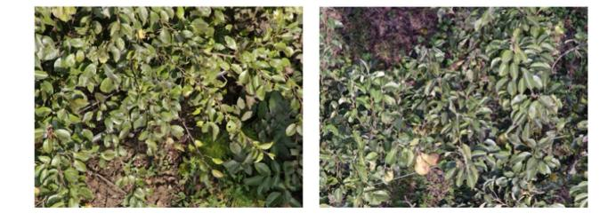
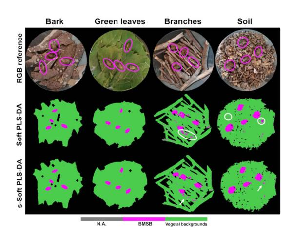
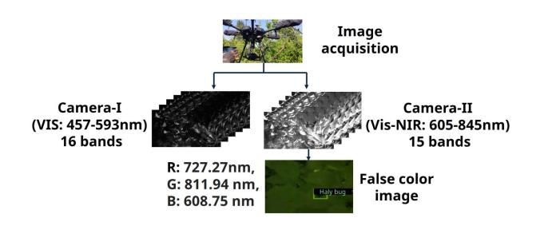
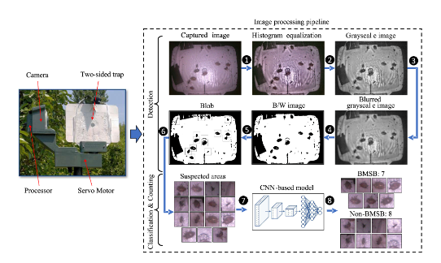
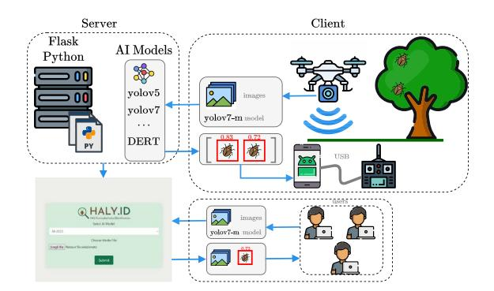
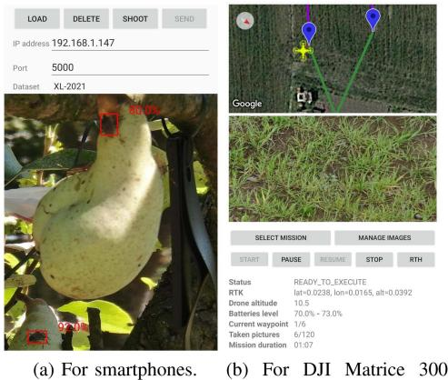
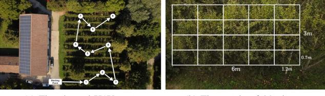
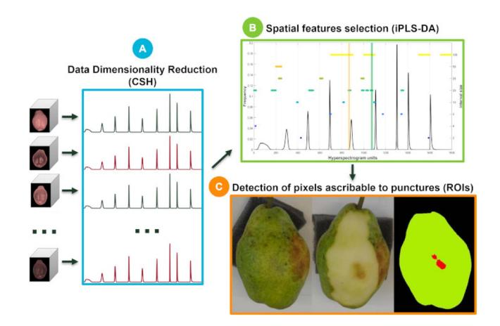

6 IEEE TRANSACTIONS ON AGRIFOOD ELECTRONICS, VOL. 3, NO. 1, MARCH/APRIL 2025

# Beyond the Naked Eye: Computer Vision for Detecting Brown Marmorated Stink Bug and Its Punctures

Lennart Almstedt1, Francesco Betti Sorbelli1, Bas Boom1, Rosalba Calvini1, Elena Costi1,

Alexandru Dinca,, Veronica Ferrari,, Daniele Giannetti,, Loretta Ichim,, *Member, IEEE*,

Amin Kargar®, *Graduate Student Member, IEEE*, Catalin Lazar®, Lara Maistrello®, Alfredo Navarra®,

David Niederprüm1, Peter Offermans1, Brendan O'Flynn1,

Lorenzo Palazzetti,, *Graduate Student Member, IEEE*, Niccolò Patelli,

Cristina M. Pinotti,, *Senior Member, IEEE*, Dan Popescu,, *Member, IEEE*, Aravind K. Rangarajan,

Liviu Serghei, Alessandro Ulrici, Lars Wolf, *Senior Member, IEEE*, Dimitrios Zorbas, *Member, IEEE*,

and Leonard Zurek

*Abstract*—In this article, we introduce machine learning (ML) techniques developed for the monitoring of the brown marmorated stink bug (BMSB), a significant agricultural pest responsible for considerable crop damage worldwide. The HALY.ID project, initiated in early 2021, aims to enhance BMSB monitoring through the utilization of information and communication technology methods. We employ computer vision techniques on RGB images captured by drones and investigate the performance of deep neural networks to evaluate the impact of this invasive species on crop yields in orchards around Europe. Specifically, we evaluate the single shot multibox detector, detection transformer, YOLOv5, YOLOv9, and YOLOv10 architectures for full-level and patch-level image analysis, respectively. To improve detection accuracy, we experiment with shortwave infrared hyperspectral imaging (SWIR-HSI) in laboratory settings. Given that pheromone baited traps are the most accepted tools for pest detection by field operators, we also propose an Internet of Things sticky trap with an integrated camera equipped with lightweight convolutional neural networks

Manuscript received 28 March 2024; revised 24 May 2024 and 9 July 2024; accepted 9 July 2024. Date of publication 6 August 2024; date of current version 11 April 2025. This work was supported by "HALY-ID" project funded by the European Union's Horizon 2020 through grant agreement ICT-AGRI-FOOD under Grant 862665 and Grant 862671, in part by MIPAAF, and in part by GNCS - INdAM. This article was recommended by Editor-in-Chief D. Demarchi. (*Corresponding author: Lorenzo Palazzetti.*)

Lennart Almstedt, David Niederprüm, Lars Wolf, and Leonard Zurek are with the Technical University of Braunschweig, 38106 Braunschweig, Germany.

Francesco Betti Sorbelli, Alfredo Navarra, and Cristina M. Pinotti are with the University of Perugia, 06123 Perugia, Italy.

Bas Boom, Peter Offermans, and Aravind K. Rangarajan are with IMEC OnePlanet Research Center, 6708 WH Wageningen, The Netherlands.

Rosalba Calvini, Elena Costi, Veronica Ferrari, Lara Maistrello, Niccolò Patelli, and Alessandro Ulrici are with the University of Modena and Reggio Emilia, 41121 Modena, Italy.

Alexandru Dinca, Loretta Ichim, Catalin Lazar, Dan Popescu, and Liviu Serghei are with the Politehnica University of Bucharest, 060042 Bucharest, Romania.

Daniele Giannetti is with the University of Parma, 43121 Parma, Italy.

Amin Kargar and Brendan O'Flynn are with Tyndall National Institute, T12 R5CP Cork, Ireland.

Lorenzo Palazzetti is with the University of Florence, 50134 Florence, Italy, and also with the University of Perugia, 06123 Perugia, Italy (e-mail: lorenzo.palazzetti@unifi.it, lorenzo.palazzetti@collaboratori.unipg.it).

Dimitrios Zorbas is with Nazarbayev University, Astana 010000, Kazakhstan. 

Digital Object Identifier 10.1109/TAFE.2024.3429537

models operating "on the edge" in this resource constrained system. In addition, we develop a client-server application for real-time bug detection, integrating the ML models to provide accessible results to farmers. Lastly, we explore effective postharvesting strategies using SWIR-HSI images to detect insect punctures invisible to the naked eye, thereby enhancing the quality of marketable fruit.

Index Terms—Brown marmorated stink bug (BMSB), computer vision algorithms, hyperspectral imaging, insect detection, RGB imaging, unmanned aerial vehicles (UAVs).

# I. INTRODUCTION

THE European project HALY.ID [1], started at the beginning of 2021, aimed at monitoring the *Halyomorpha halys*, also known as the brown marmorated stink bug (BMSB), a global agricultural pest causing significant damage to crops. The BMSB, originating from East Asia  $[2]$ , is a highly destructive and polyphagous pest, infesting various fruit trees, such as pears, peaches, and apricots, leading to substantial crop damage worldwide with significant economic impact. Its global spread is facilitated by human activities, such as international trade, and worsened by climate change, causing significant financial losses, notably in regions, such as Italy's Emilia Romagna [3], which is known for its fertile orchards. Current monitoring methods primarily rely on traps, which use lures with aggregation pheromones that attract bugs in the vicinity, increasing the local damages [3]. Unfortunately, once the BMSB specimens are discovered to be present in an orchard, there is no specific chemical defense except for the use of broad-spectrum systemic pesticides that disrupt integrated pest management strategies, and raise environmental and human health concerns for customers.

To address the challenges posed by BMSB, and in particular those related to computer vision, HALY.ID proposes to leverage machine learning  $(ML)$  technologies [4] in the following research activities.

 1) We worked with RGB images of insects "in the field" and generated diverse image datasets from various campaigns and imaging platforms, smartphones, drones, and open

© 2024 The Authors. This work is licensed under a Creative Commons Attribution 4.0 License. For more information, see 
https://creativecommons.org/licenses/by/4.0/

ALMSTEDT et al.: BEYOND THE NAKED EYE: COMPUTER VISION FOR DETECTING BROWN MARMORATED STINK BUG AND ITS PUNCTURES 7

a

ccess databases between 2022 and 2023. The largest dataset of insect images from the orchard was obtained through autonomous missions conducted by unmanned aerial vehicles (UAVs), commonly known as drones.

- 2) We evaluated the performance of different ML models to achieve accurate BMSB detection, with a focus on the single shot multibox detector (SSD), detection transformer (DETR), YOLOv5, YOLOv9, and YOLOv10 architectures.
- 3) We explored alternatives to RGB, such as shortwave infrared hyperspectral imaging (SWIR-HSI) and visiblenear infrared (Vis-NIR) multispectral imaging (MSI) systems, identifying spectral regions for affordable and rapid multispectral sensors to use with RGB cameras and drones. However, our research was limited to the lab due to the lack of commercially available solutions.
- 4) We developed an intelligent sticky trap with integrated cameras and edge-based convolutional neural networks (CNNs) for image classification on resource constrained Internet of Things (IoT) systems. Despite the drawbacks associated with traps using aggregation pheromones (attracting the insect of interest to the trap location), they are generally accepted by field operators as the primary source of data for insect population identification.
- 5) We developed a versatile client-server application with the primary goal of integrating any trained model and making it accessible to end-users. The ultimate aim of this application is to engage farmers in a decision support system. In addition, the application enables UAVs to plan their routes within orchards to capture images at specific waypoints for the RGB image dataset.
- 6) We proposed postharvest strategies crucial for maintaining fruit quality in the market. Fruits that are punctured at an early stage develop significant deformities, making them clearly unmarketable. On the other hand, fruits punctured just before harvesting may present internal damages not visible to the naked eye at the time of harvest and transfer to the marketplace. Besides compromising the safety of healthy fruit and facilitating the outbreak of other diseases, their presence in the market can undermine consumer confidence in fruit quality. Hence, we recommended integrating nondestructive techniques, such as SWIR, into the fruit sorting system to enhance the quality of marketable fruits by identifying previously undetectable damage at an early stage.

In this article, we delineate the methodologies, findings, and implications derived from our comprehensive endeavor aimed at advancing BMSB monitoring techniques, amalgamating cutting-edge technologies with practical surveillance strategies to mitigate agricultural threats effectively. So, our objective was to develop information and communication technology enabled strategies for implementing the most effective, most cost-efficient, autonomous and adaptable monitoring of the BMSB with minimal human intervention.

The rest of this article is organized as follows. Section II discusses related works. Sections III and IV present ML techniques that work with RGB and spectral imaging, respectively. 

Section  $V$  presents the sticky trap imaging system, which was developed. Sec

tion VI showcases the client–server application. Section VII proposes a technique for fruit puncture detection. Finally, Section VIII concludes this article and future research directions.

# II. RELATED WORK

In this section, we review the literature on computer vision, focusing on its applications in insect and puncture detection.

## A. Insect Detection

Nowadays, there has been a growing trend toward leveraging ML techniques for insect species monitoring. Traditional methods, such as support vector machines, adaptive boosting, and neural networks (NNs) [5], [6], [7], have been widely utilized alongside deep learning techniques based on CNNs [8], [9], [10] to achieve optimal results in insect monitoring. For instance, a novel approach for early detection and continuous monitoring of adult-stage whitefly and thrip in greenhouses has been proposed in [5]. Their approach, based on an image-processing algorithm and artificial NNs, yielded highly satisfactory results in whitefly and thrips identification [5]. Such approaches hold significant promise in enhancing integrated pest management strategies and in reducing the dependence on harmful chemicals in greenhouse agriculture. In addition, the use of pheromone loaded sticky traps is a common and effective method for autonomously detecting pest infestations  $[11]$ .

In the literature, apart from the results of HALY.ID, there are some results on the Pentatomidae family to which BMSB belongs [\[12\]](#page-1-1), [\[13\]](#page-1-1), [\[14\]](#page-1-1). However, all these results did not evaluate their models on datasets built from in-field images as we do. Trufelea et al. [\[12\]](#page-1-1) proposed training a CNN to classify four different kinds of Pentatomidae insects, including BMSB adult/nymph, *Pyrrhocoris apterus*, and *Nezara viridula*. Many images are from the Maryland Biodiversity database [\[15\]](#page-1-1), and others are from a custom dataset collected by professional cameras. Ichim et al. [\[13\]](#page-1-1) investigated the identification of BMSB insects with four CNNs, namely, GoogLeNet, ResNet101, DenseNet201, and VGG19. One dataset is built on two public datasets with many different insects, and a custom dataset is collected with a mini-drone containing images with adults and nymphs of BMSB. Transfer learning and data augmentation are used to reduce computational effort during the learning phase, and statistical indicators (such as precision and recall) derived from confusion matrices are employed to evaluate the performance of each CNN.

Very recently, the YOLO model [16], [17] has been used to detect harmful insects in ecological orchards by Sava et al. [14]. The authors evaluated YOLO with region-based CNNs, and several YOLO models have been trained, validated, and tested on the Maryland dataset [15], which contains professional macroimages of BMSB in different poses, from different short distances, and at different stages of evolution. Betti Sorbelli et al. [18], [19], [20] explored the use of RGB cameras, drones, and computer vision algorithms to monitor and detect the BMSB in orchards using a drone in first person view. While these

8 IEEE TRANSACTIONS ON AGRIFOOD ELECTRONICS, VOL. 3, NO. 1, MARCH/APRIL 2025

results were obtained in the first year of the HALY.ID project, we do not discuss them here. Instead, we focus on the computer vision algorithms used to detect BMSB in images collected autonomously by the drone. From this perspective, it is evident that the majority of achievements related to BMSB detection have been generated within the HALY.ID project. Furthermore, unlike others, we are currently exploring solutions that can accurately determine the BMSB's position directly from aerial or in-field images.

## B. Puncture Detection

In literature, efforts specifically concerning the detection of insect punctures on harvested fruits refer to visible superficial damage on the skin [21], generally detectable in the Vis-NIR range  $(400-1000 \text{ nm})$ . Typically, the main applications for detecting nonvisible damage, internal to the fruit pulp, using SWIR-HSI, refer to the presence of bruising [22], [23], [24]. Efficient techniques for rapid and effective quality assessment of fruits and vegetables are essential to meet the growing consumer demand for better, more consistent, and safer food products. Lu et al. [25] focused on three innovative HSI-based techniques or sensing platforms—spectral scattering, integrated reflectance and transmittance, and spatially resolved spectroscopy-that have been developed in the laboratory for property and quality evaluation of fruits, vegetables, and other food products. Similarly, Alamar et al.  $[26]$  focused on the detection of mechanical damages, including bruising. Interestingly, Zamljen et al. [27] examined the metabolic response of apples to BMSB punctures. Compared to healthy fruits, the sugar and phenolic compounds contents differ, suggesting that NIR-HSI imaging could be useful in detecting damages caused by the BMSB. To the best of the authors' knowledge, there are no previous works concerning BMSB puncture detection and its annotation, which followed a practical on-field protocol and involved numerous samples collected over several years.

# III. BMSB DETECTION USING RGB IMAGING

To develop an intelligent system for insect detection in orchards using images and CNNs, the first step is to collect a database of relevant images of insects in the trees, which need to be labeled and categorized to identify the type of insects encountered  $[28]$ . The next step is image preprocessing, which involves removing noise and distortion, resizing images, adjusting brightness and contrast, and data augmentation. From the preprocessed dataset, a representative subset of images needs to be selected for training CNNs to identify and classify insects in the images and adjust internal weights to improve accuracy. Then, the CNN must be validated and tested on separate image subsets to evaluate its performance.

Within HALY.ID, the following NNs were used to identify the BMSB insect: YOLOv5, YOLOv9, YOLOv10, SDD with VGG16 backbone, and DERT with ResNet-50 backbone.

Fig. 1. Examples of images from the dataset used in this article.

## A. Experimental Setup

Before starting, we created a dataset of RGB images obtained from several UAV flights in real conditions in the study orchard in Carpi (Modena, Italy). Obviously, the larger the database used for training and validating NNs, the higher the performance of the created models can be [\[29\]](#page-9-1). Therefore, we augmented the initial image set due to its limited size. The images acquired by the UAV are 24-bit RGB, with dimensions of  $5184 \times 3888$  pixels each (see Fig. 1). Since the BMSB occupies a minuscule fraction of the entire image, it is evident that directly inputting the raw image into the NN would yield unpromising results. This claim is enforced by Betti Sorbelli et al. [\[20\]](#page-9-1), who attributed the cause of performance degradation to the loss of information resulting from image scaling. Indeed, resizing the images to  $640 \times 640$  pixels from their original sizes ( $5184 \times 3888$  pixels) renders the BMSB practically invisible. Consequently, we processed the images by dividing them into nonoverlapping patches of size  $640 \times 640$  pixels. We divided then the dataset into 70%, 20%, and 10% for training, validation, and test sets, respectively, by automatically and randomly distributing the indexed dataset with a script created for this purpose. The dataset contains 402 images and, as a consequence of the slicing technique, is decomposed in 17 766 patches of which 423 are positive ones (with BMSB).

Due to the slicing procedure, the testing results of the proposed models are conducted on two test sets: ALL that means patches with and without BMSB (1920 patches), and ONLY that means patches with BMSB (71 patches).

## B. Experimental Results

To evaluate the network performance, we used metrics, such as precision  $(P)$ , recall  $(R)$ , mean average precision  $(mAP)$ , and intersection over union  $(IoU)$ , summarized in Table I, where TP, FP, and FN represent true positive, false positive, and false negative, respectively. We also include other indicators that will be used in subsequent evaluations.

The SSD is a single shot detector known for its efficiency and accuracy. Like YOLOv5, SSD performs object detection, namely, object localization and classification, in a single forward pass. Key to its success is the use of a series of convolutional layers that produce feature maps at multiple scales, enabling the SSD to detect objects of various sizes within the image. The implementation of SSD in our application was implemented using the PyTorch library. For the SSD backbone we leverage VGG16 [30]. Although SSD demonstrates a rapid detection

ALMSTEDT et al.: BEYOND THE NAKED EYE: COMPUTER VISION FOR DETECTING BROWN MARMORATED STINK BUG AND ITS PUNCTURES 9

TABLE I 
PERFORMANCE INDICATORS USED

| Indicator                       | Formula                                   | Section    |
|---------------------------------|-------------------------------------------|------------|
| Precision $(P)$                 | $\frac{\text{TP}}{\text{TP+FP}}$          | III, IV, V |
| Recall-sensitivity $(R)$        | $\frac{\text{TP}}{\text{TP+FN}}$          | III, IV, V |
| Specificity                     | $\frac{\text{TN}}{\text{TN+FP}}$          | IV         |
| Accuracy                        | $\frac{\text{TP+TN}}{\text{TP+TN+FP+FN}}$ | IV, VII    |
| $F1$ score                      | $\frac{2 \times P \times R}{P+R}$         | IV         |
| Mean average precision $(mAP)$  | $\frac{1}{N} \sum_{k=1}^{N} AP_k$         | III        |
| Intersection over union $(IoU)$ | $\frac{ A \cap B }{ A \cup B }$           | III        |

of objects in images and is more accurate than many other detectors [28], [31], it tends to lose specimens (i.e., high value of FN) and also to have a not negligible number of FP. When testing SSD on ALL and ONLY, its precision score remains stable. The number of FP slightly increases in the ALL experiment, but not dramatically.

The DETR leverages the transformer architecture, originally designed for natural language processing tasks. It has emerged as a novel NN for object detection, comprising four main components: backbone, encoder, decoder, and prediction heads [32]. In our experiments, we employed ResNet-50 as the backbone, using a CNN to learn a 2-D representation of the input image. The model flattens this representation and supplements it with positional encoding before feeding it into a transformer encoder. Subsequently, the encoded image data pass through an encoderdecoder structure and is then directed to the prediction heads. These prediction heads, based on feed-forward networks, predict either a detection class and bounding box, or a NOOBJECT class (i.e., background). We utilized the PyTorch implementation of DETR in our application, and the testing results are presented in Table  $\text{II}$ . As indicated, the recall is poor, resulting in a high number of FN. However, since it achieves the same  $P$  for ALL and ONLY, it follows model robust against empty patches.

YOLOV5 stands out for its lightweight and fast computation capabilities, demanding less computational power compared with other current state-of-the-art algorithms while maintaining comparable performance [16]. Although YOLOv5 is offered in several model sizes, in the following, we rely solely on the  $\text{eXtra-large model}(X)$  since it is the most powerful configuration to find fine-grain objects inside a frame due to its architecture.  $YOLOv5-X$  has been trained on our custom dataset by finetuning pretrained weights [33] on an NVIDIA RTX 3060 OC. The YOLOv5-X results are depicted in Table II. In principle, its precision on ONLY is considerably high, while it balances precision and recall on ALL.

YOLOv9 [34] introduces some innovation with respect to its predecessor. Specifically, to improve accuracy, it introduces programmable gradient information (PGI) and the generalized efficient layer aggregation network (GELAN). PGI prevents data loss and ensures accurate gradient updates, whereas GELAN optimizes lightweight models with gradient path planning. We trained YOLOv9-T and YOLOv9-E using transfer

TABLE II 
RESULTS FOR TESTING SSD, DETR, YOLOV5, YOLOV9, AND YOLOV10,  $\text{WITH IOU} = 0.5$ 

|                  | model       |              | Ρ        | R        | $\text{mAP}_{0.5}$ | $\text{mAP}_{0.5}^{0.95}$ |
|------------------|-------------|--------------|----------|----------|--------------------|---------------------------|
|                  | SSD         | ALL          | $65.5\%$ | $26.8\%$ | 57.4%              | $25.1\%$                  |
|                  |             | ONLY         | $73.1\%$ | $26.8\%$ | $59.8\%$           | $26.3\%$                  |
|                  | DETR        | ALL          | 81.8%    | $12.7\%$ | 50.9%              | $24.1\%$                  |
|                  |             | ONLY         | 81.8%    | $12.7\%$ | $54.4\%$           | $25.8\%$                  |
| 0.3              | $YOLOv5-X$  | ALL          | $53.5\%$ | $54.8\%$ | $44.4\%$           | $29.0\%$                  |
| $\mathbb{H}$     |             | ONLY         | 95.1%    | $54.8\%$ | $52.0\%$           | $34.3\%$                  |
| C                | YOLOV9-T    | ALL          | $71.0\%$ | $61.0\%$ | 67.0%              | 37.0%                     |
|                  |             | ONLY         | 95.0%    | 61.0%    | $78.0\%$           | $44.0\%$                  |
|                  | YOLOv9-E    | $\text{ALL}$ | 57.50%   | $52.0\%$ | $51.0\%$           | $27.0\%$                  |
|                  |             | ONLY         | 89.0%    | $52.0\%$ | $69.0\%$           | $37.0\%$                  |
|                  | YOLOv10-N   | ALL          | $74.0\%$ | $60.0\%$ | $50.0\%$           | $23.0\%$                  |
|                  |             | ONLY         | 90.0%    | $60.0\%$ | $71.0\%$           | $33.0\%$                  |
|                  | $YOLOv10-X$ | ALL          | $50.0\%$ | 64.0%    | 41.0%              | 19.0%                     |
|                  |             | ONLY         | 79.0%    | $64.0\%$ | $72.0\%$           | $32.0\%$                  |
|                  | SSD         | ALL          | 62.5%    | $28.2\%$ | $56.7\%$           | $24.0\%$                  |
|                  |             | ONLY         | $71.4\%$ | $28.2\%$ | $60.6\%$           | $25.9\%$                  |
|                  | DETR        | ALL          | 73.3%    | $14.1\%$ | $54.4\%$           | $25.8\%$                  |
|                  |             | ONLY         | 73.3%    | $14.1\%$ | 57.2%              | $26.8\%$                  |
| 0.1              | $YOLOv5-X$  | ALL          | $39.5\%$ | $62.0\%$ | $48.7\%$           | $31.0\%$                  |
| $\parallel$      |             | ONLY         | $92.4\%$ | $62.0\%$ | $60.6\%$           | $39.9\%$                  |
| $\left( \right)$ | YOLOv9-T    | ALL          | $71.0\%$ | $66.0\%$ | $67.0\%$           | 36.0%                     |
|                  |             | ONLY         | 94.0%    | 66.0%    | 81.0%              | $45.0\%$                  |
|                  | YOLOv9-E    | ALL          | $57.0\%$ | $62.0\%$ | $50.0\%$           | $26.0\%$                  |
|                  |             | ONLY         | 88.0%    | $62.0\%$ | $74.0\%$           | $38.0\%$                  |
|                  | YOLOv10-N   | ALL          | $74.0\%$ | 60.0%    | $50.0\%$           | $23.0\%$                  |
|                  |             | ONLY         | 90.0%    | $60.0\%$ | $71.0\%$           | $33.0\%$                  |
|                  | $YOLOv10-X$ | ALL          | $50.0\%$ | $64.0\%$ | $41.0\%$           | 19.0%                     |
|                  |             | ONLY         | $79.0\%$ | $64.0\%$ | $72.0\%$           | $32.0\%$                  |

learning. Table  $\mathbf{II}$  gives that both models achieve notable performance. YOLOv9-T demonstrates a solid robustness against background-only patches, overcoming YOLOv9-E in all the metrics. Despite the previous observation, YOLOv9-E depicts significant detection ability. Notably, YOLOv9-T showcases simultaneously a high mAP $_{0.5}$  and mAP $_{0.5}^{0.95}$ , setting interesting confidences and IoU values, respectively.

We extend our analysis to the latest release of YOLO family, namely, YOLOv10 [35]. The newest architecture offers a range of model scales, but we decided to rely on YOLOv10-N and  $YOLOv10$ -X. One of the main improvements is the introduction of consistent dual assignments, which replaces nonmaximum suppression. Moreover, the developers introduced partial selfattention to boost the detection ability without any burdening on inference speed. As reported in Table II, YOLOv10 confirms its ability to recognize objects also in challenging environments showcasing interesting performance for both the models. Once again, despite YOLOv10-N is the lightest version, it outperforms  $YOLOv10$ -X demonstrating also a fair robustness against background-only patches. On the other hand, YOLOv10-X gains limited knowledge on BMSB detection suggesting potential overfitting on training data.

Comparing all the NNs, SSD and DETR have performed almost the same obtaining a higher precision and a lower recall. SDD tends to miss fewer BMSB inside the frame than DETR, detecting at least the  $\approx 27\%$  of the total occurrences in contrast with the poor  $\approx 13\%$  reached by DETR. Both SSD and DETR revealed a significant robustness against background-only pixels because their performance is almost the same in the two sets, i.e., ALL and ONLY. Moreover, DETR raised less FP than SSD,

10 IEEE TRANSACTIONS ON AGRIFOOD ELECTRONICS, VOL. 3, NO. 1, MARCH/APRIL 2025

TABLE III 
COMPARISON OF MODEL'S COMPUTATION DEMANDS

|                 | DETR | SDD  | YOLOv5-X | YOLOv9-T | YOLOv9-E | YOLOv10-N | YOLOv10-2 |
|-----------------|------|------|----------|----------|----------|-----------|-----------|
| #parameters [M] | 46   | 35   | 86.7     | 2.0      | 57.3     | 2.3       | 29.5      |
| GFLOPs          | 127  | 34.5 | 205.7    | 7.7      | 189.0    | 6.7       | 160.4     |

characterizing a more precise detection overall. Conversely, the 
YOLOV5-X model was able to detect the largest number of 
BMSB reaching the highest recall. Despite achieving partic
ularly notable metrics scores in the ONLY set, the model has 
depicted the least robustness against background-only patches, 
namely, in the ALL set. So, YOLOV5-X was prone to recognize  
$\geq 55\%$  of BMSB instances with a particularly promising pre
cision when a BMSB appears inside the frame. However, this 
latter capability deteriorates dramatically  $(P = 53.5\%)$  when 
images without BMSB are considered. It is noteworthy that each 
network tends to achieve a larger  $P$  than  $R$ . This phenomenon is 
strictly related to the poses experienced during the acquisition, 
compounded by the noise surrounding the BMSB pixels, such as 
blur or overexposure. Despite the dataset comprising a diverse 
range of BMSB samples, certain poses and lighting/blurriness 
conditions are more frequent than others. Also, since the dataset 
consists of images captured by a drone operating according to an 
autonomous protocol, characterizing the entire range of possi
bilities is extremely challenging. As a result, the networks were 
able to detect BMSB instances that presented limited variation 
in pose and color appearance, thereby minimizing FP. How-
ever, instances significantly affected by noise were occasionally 
missed. Both YOLOv9 and YOLOv10-X achieve interesting 
performance representing a true step ahead of the predeces
sor, YOLOv5. Although YOLOv10-X obtained the largest  $R$ , 
YOLOv9-T achieves the best performance overall. Specifically, 
it reaches a satisfactorily  $R \approx 60\%$  and almost the largest P 
with both the thresholds,  $95.0\%$  and  $94.0\%$ , respectively.

Looking at mAP0.5, all the NNs have achieved  $\geq 45\%$  of
BMSB, establishing a satisfactory confidence level overall. On
the other hand, the NNs have developed limited abilities in
contouring the BMSB according to mAP0.950.5 because they are
less robust when the IoU increases. In other words, the ma-
jority of predictions overlap partially with the ground truth.
This represents a predictable outcome due to the limited size
of the BMSB with respect to the entire image. For monitor-
ing purposes, recognizing all instances inside the frame, i.e.,
achieving high recall, is more important than accurately con-
touring a bug, i.e., achieving high IoU. However, it noteworthy
that both YOLOV9 and YOLOv10 demonstrate improved IoU
values between prediction and ground truth, suggesting a clear
enhancement with previous releases. Moreover, in comparison
with the results in [\[20\]](#page-9-1) where entire images are simply resized
and fed to the model, the current implementation of the slicing
mechanism allows a boost in the performance, specifically in the
recall. Indeed, image slicing prevents information losses since
it retains every pixel of the original image.

Table III summarizes model's computation demands listing the number of parameters and the number of giga floating point operations per second (GFLOPs), respectively. We can observe

that YOLOv5-X, YOLOv9-E, YOLOv10-X, SSD, and DETR are more "desktop oriented" due to their requirements, rather than YOLOv9-T and YOLOv10-N that appear compatible with current state-of-the-art embedding system boards. According to the computation footprint, both YOLOv9-T and YOLOv10-N are, even more so, the best NNs overall.

# IV. BMSB DETECTION USING SPECTRAL IMAGING

In the HALY.ID project, alongside a comprehensive analysis of RGB images primarily captured by UAVs, we also conducted an assessment of spectral imaging as a potential method for field monitoring to detect the presence of BMSB. To this purpose, SWIR-HSI and Vis-NIR MSI systems were evaluated both in the laboratory and in the field, respectively. In fact, unlike cameras operating exclusively within the visible spectrum, they may mitigate misclassifications caused by BMSB's resemblance to vegetal backgrounds with similar colors, such as bark or brown leaves.

## A. Evaluation of SWIR-HSI

We captured 35 hyperspectral images of BMSB specimens positioned against various vegetal backgrounds (including bark, branches, grass, soil, green/brown leaves) within the 980–1660 nm spectral range, aiming to replicate real field conditions. We acquired the hyperspectral images using a HSI line-scan system equipped with a desktop NIR Spectral Scanner (DV Optic) incorporating a Specim N17E reflectance imaging spectrometer, coupled with a Xenics XEVA 1.7-320 camera ( $320 \times 256$  pixels) and a Specim Oles 31  $f/2.0$  optical lens. The acquisition software conducted an automatic calibration of the images based on the dark current signal and a high-reflectance standard signal. We excluded pixels unrelated to either bugs or vegetal backgrounds based on a reflectance threshold measured at  $1000 \text{ nm}$ . In addition, we preprocessed the images using standard normal variate (SNV) and mean center techniques. Subsequently, we applied principal component analysis (PCA) to each image to implement a masking procedure, thereby separating the pixels belonging to the bugs from those belonging to the vegetal backgrounds.1

To develop classification models capable of distinguishing between BSBM specimens and vegetal backgrounds based on spectral signatures, we assembled a library comprising 14 000 reference spectra from both classes. We employed the Kennard-Stone algorithm  $[37]$  on principal component (PC) scores to select these spectra. Then, we divided the images into training and test sets for model development and validation, respectively. Our classification approach focused on modeling the spectral information contained in the HSI images and identifying the relevant spectral regions to discriminate BMSB from vegetal backgrounds. To do this, we used the soft partial least squaresdiscriminant analysis (Soft PLS-DA) algorithm, coupled with sparse-based methods for spectral variable selection (s-Soft PLS-DA) [38]. This allowed us to build effective classification models tailored to our dataset.

 $^{1}$ A detailed description of the methodology used for acquiring and processing the hyperspectral images can be found in the work of Ferrari et al. [36].

ALMSTEDT et al.: BEYOND THE NAKED EYE: COMPUTER VISION FOR DETECTING BROWN MARMORATED STINK BUG AND ITS PUNCTURES 11

Fig. 2. Prediction images obtained by applying Soft PLS-DA and s-Soft PLS-DA models alongside the corresponding RGB images as references.

The application of Soft PLS-DA yielded promising results in both cross-validation and prediction of the external test set. It achieved sensitivity and specificity for the BMSB class exceeding  $90.0\%$  [36] (see Table I). Furthermore, employing sparse variable selection through the s-Soft PLS-DA algorithm maintained high classification performance while considering a reduced subset of 60 relevant spectral variables. The selected wavelengths can be grouped into five main spectral regions, corresponding to absorption bands associated with cellulose, hemicellulose, and lignin (1220–1295 and 1420–1480 nm). These are indicative of different background types. In addition, we selected absorption bands related to water, proteins, chitin, and lipids (980-1070, 1330-1350, and 1370-1400 nm), reflecting the biochemical structure of insects' exoskeleton [36]. Subsequently, we applied both Soft PLS-DA and s-Soft PLS-DA models to the test set images to generate prediction images, facilitating the evaluation of classification performance across the entire images. This assessment allowed an overall understanding of the models' effectiveness in accurately classifying BMSB specimens and vegetal backgrounds

Fig.  $2$  presents some representative prediction images alongside their corresponding RGB counterparts. It is evident that, in general, the pixels are accurately classified into their respective classes. This observation highlights the challenge of detecting BMSB specimens against dark brown vegetal backgrounds using only RGB images, whereas the bugs are distinctly identified using SWIR-HSI. The prediction images of tree branches and soil as background reveal that spectral variable selection slightly enhances the classification of background pixels. To enhance BMSB detection capabilities for field applications, we integrated spectral information modeling with CNN algorithms to leverage spatial relationships among pixels. U-Net, in particular, is well suited for implementation on UAVs due to its ability to achieve satisfactory model performance with minimal computational resources  $[39]$ .

To streamline network complexity in the spectral dimension, we effectively applied U-Net using only the spectral bands identified by s-Soft PLS-DA [\[36\]](#page-3-1). Notably, the spectral regions selected by s-Soft PLS-DA can serve as a basis for developing

Fig. 3. Utilization of deep learning object detection models for BMSB detection with the false-color image constructed using manually selected wavebands of the NIR range.

more affordable and rapid multispectral sensors, ideal for field monitoring using UAVs. When coupled with RGB cameras, these sensors can enable the deployment of efficient monitoring systems capable of autonomously detecting BMSB and providing real-time information on pest spread to farmers.

Furthermore, light and cost-efficient hyperspectral cameras covering the SWIR range are increasingly accessible in the market  $[40]$ . This trend enhances the practicality of developing advanced monitoring solutions for agricultural applications, facilitating timely and accurate pest management decisions.

## B. Evaluation of Vis-NIR MSI

We conducted a pilot study employing a snapshot Vis-NIR UAV camera in the field to detect BMSB. The camera consists of two distinct acquisition devices capturing in the ranges  $457 593 \,\mathrm{nm}$  (16 bands) and  $605\text{--}845 \,\mathrm{nm}$  (15 bands), respectively. For our experiments, we used the latter 15 bands of the images. In one approach (camera I, Fig. 3), we performed manual wavelength selection based on the visibility of BMSB to construct the false-color image. We identified the wavelengths 727.24, 811.24, and 608.75 as suitable for BMSB detection.

Then, we trained two object detection models, namely, Faster RCNN and RetinaNet, on these images [\[41\]](#page-4-1), [\[42\]](#page-4-1). The pretrained RetinaNet yielded the best results with an F1 score of 78.45%, precision of 74.61%, recall of 76.39%, and accuracy of 78.45% (see Table I). In the other approach, we utilized the entire Vis-NIR hypercube from camera II (see Fig. 3) to train the two object detection models. We customized the input layer of these models to accommodate the hyperspectral image with 15 channels. RetinaNet trained from scratch exhibited the best performance, achieving an F1 score of 70.74%, precision of 84.25%, recall of 60.96%, and accuracy of 54.73%.

# V. EDGE-BASED SMART STICKY TRAP IMAGING SYSTEM

As part of the HALY.ID project, we developed IoT imaging systems with integrated pheromone enhanced sticky traps to monitor the population of BMSB and to combat the spread of this invasive species. Sticky traps are widely used in orchards to attract and capture insects based on their color or pheromones. Agronomists can use these traps to estimate the insect populations by visiting their orchards regularly with manual trap inspection and insect counting. A preliminary version of the trap using mainly lab-based experiments and artificial insects to

12 IEEE TRANSACTIONS ON AGRIFOOD ELECTRONICS, VOL. 3, NO. 1, MARCH/APRIL 2025

Fig. 4. Smart sticky trap (upper) and the steps followed for the detection and classification approach (lower).

develop datasets has been described in  $[43]$  and  $[44]$ . Recent studies have proposed edge-based systems, such as  $[11]$  for precision agriculture, most of which suggested power-hungry hardware, such as Raspberry Pi for computation. This research utilized a microcontroller (MCU)-based system to minimize power consumption, which is a crucial factor for edge-based systems, particularly in agricultural settings where devices must operate on batteries due to the absence of power lines in orchards. The image processing solution is here compared to other commonly used approaches, this time using real image data captured in the field throughout the deployment of the IoT device in orchards for several months in 2023. In addition, the impact of considering past data on the system's accuracy is examined.

## A. Trap Architecture

We designed and developed an edge-based smart trap to make the identification and insect counting procedure automated and more accurate. The system is an ultra low-cost and low-power device able to detect and count insects on the device itself in the orchard without relying on expensive and power-hungry equipment. Fig. 4 depicts the second version of the proposed device. As described in [44] in detail, the camera unit is an OpenMV board based on an MCU with an embedded camera capable of running lightweight image processing and deep learning methods. In addition, this device supports two-sided traps and a servo motor is used to rotate the trap, so the camera can capture images of the trap on both sides. The purpose of the mechanism is to increase the probability of capturing insects (as the captured area is doubled) and, at the same time, make it more approachable to insects since the sticky area is not shadowed by the camera. The image processing pipeline is shown in Fig. 4. This is a modified version of the image processing pipeline proposed in  $[44]$ .

The analysis of real-world data captured in 2023 revealed that the detection phase was unable to properly detect insects. Consequently, we modified and enhanced this aspect by implementing a histogram equalization technique on the captured images to normalize the contrast and brightness. This adjustment, denoted as the first step in Fig. 4, resulted in a significant improvement in the output of the detection phase, reducing both the mean squared error (mse) from  $50.8$  to  $13.6$  and mean absolute error

TABLE IV 
COMPARISON OF DIFFERENT MODELS ON THE NEW DATASET COLLECTED FROM THE REAL WORLD FOR BMSBS COUNTING

| Model              | MAE  | MSE   | P     | R     | MCU Comp. |
|--------------------|------|-------|-------|-------|-----------|
| YOLOV8-N           | 0.71 | 1.33  | 86.6% | 98.5% | No        |
| YOLOv5-N           | 0.88 | 0.55  | 85.1% | 97.6% | No        |
| YOLOV3-N           | 0.5  | 0.40  | 88.9% | 98.8% | No        |
| Ours in [44]       | 5.07 | 50.79 | 88.5% | 36.7% | Yes       |
| This study         | 2.07 | 13.55 | 84.0% | 70.6% | Yes       |
| This study (7-day) | 1.05 | 1.81  | 83.0% | 80.2% | Yes       |

 $(MAE)$  from 5.1 to 2.1, indicating a reduction by a factor of approximately 3.7 in mse and approximately 2.5 in MAE. This highlights how important it is to incorporate a wide range of real-world images into the algorithm development and help the algorithm adapt to the complexities of real-world situations.

As shown in Fig. 4, in the detection phase, the process begins with the application of histogram equalization to the raw captured image  $(1)$ , followed by conversion to gray scale  $(2)$ . Then, a smoothing filter is applied to eliminate small objects, such as windblown dust, leaves, or tiny insects  $(3)$ . Then, the image is converted to black-and-white using Otsu's method  $((4))$  and finally the suspected area that might be filled by the target insect is detected using a blob detection algorithm  $(5)$ . It should be noted that the detected blobs are filtered based on their size and only those with a size approximating that of a BMSB are considered as suspected areas. So, these suspected areas are cropped and fed to the classification phase  $(6)$ , where a lightweight CNN-based image classification model is used to classify the images  $(7)$ ). Finally, the number of the target insects on the trap along with the cropped images (as an option) is sent to the growers  $((8))$ .

Our CNN-based model has a program size of only 80 kB, with a peak memory usage of  $75 \text{ kB}$  and an inference time of  $0.07 \text{ s}$  (on the OpenMV board), making it suitable for running on memory-constrained MCUs. In designing the model, as detailed in  $[44]$ , the main considerations are itemized as follows.

- 1) Utilizing depthwise separable convolution instead of standard convolution: This reduces computations by factorizing the process, significantly decreasing computational cost.
- 2) Using global average pooling instead of flatten layer: This decreases parameter numbers, leading to a substantial reduction in computation and model size.
- 3) *Quantizing:* The model weights were quantized to 8-bit integers from the original 32-bit float data, which is critical for deploying the model on memory-constrained MCUs.
- 4) Utilizing skip connections: Skip connections enhance performance by facilitating data flow, combining features from different layers, and addressing vanishing gradient issues during training.

## B. Experimental Results

Table IV reports the accuracy of the proposed BMSB identification and quantification based on images from the new dataset gathered from the real world as compared to that proposed in [44] using known YOLO methods that are widely used in

ALMSTEDT et al.: BEYOND THE NAKED EYE: COMPUTER VISION FOR DETECTING BROWN MARMORATED STINK BUG AND ITS PUNCTURES 13

insect detection systems [45], [46]. As described, compared to the algorithm described in [44], the new algorithm used in this study decreased mse from  $50.8$  to  $13.6$  and MAE from  $5.1$  to  $2.1$ , and also increased recall around 34%, indicating a reduction of about  $3.7\times$  in mse and  $2.5\times$  in MAE. In comparison with YOLO methods, although the accuracy of YOLO methods is better than the proposed one, they are too computationally intensive, too large in size, and unable to run on resource-constrained MCUs.

Moreover, our analysis revealed that the presence of a high level of overlap among the captured insects in the obtained images, which occurs when new insects are trapped physically stuck overlapping the existing ones trapped previously, increases the error of the detection phase. This is due to the fact that the detected blobs are filtered out if their size is much larger than that assigned to the presence of a BMSB (overlapping increases the blob size). Thus, considering previously captured data and detected insects plays a significant role that impacts the system performance. To evaluate the impact of insects overlapping each other, we made some alterations to the dataset by removing the images that exceeded seven days between trap replacement. This time interval was selected based on the frequency of new insects being captured on the trap. This led to a significant reduction in error by decreasing the MAE from 2.07 to 1.05 and mse from 13.55 to 1.81. It also increased the recall by almost 10%. These results prove the impact of envisaging overlapping on the performance and that the recent changes in the algorithmic process are in the right direction to improve the efficiency of the system.

In terms of running time, the added step in the detection phase of the image processing algorithm takes up to  $0.5 \text{ s per image}$ . Therefore, the total runtime for a complete system operation, including image capturing (from two sides of the trap), detection (on two captured images), classification, and results, is approximately  $17.5 \text{ s}$ . It is important to note that the running time varies depending on the number of detected areas identified during the detection phase, as the classification model runs separately for each detected area. The mentioned  $17.5 \text{ s}$  correspond to a trap with six insects on each side. Moreover, regarding power consumption, the device consumes up to  $320 \,\mathrm{mA}$  in operation mode. However, during nonoperation periods, the device enters deep sleep mode to reduce power consumption, consuming only  $7 \text{ mA}$ .

# VI. CLIENT–SERVER APPLICATION

In this section, we describe a client–server architecture designed for bug detection that also facilitates farmer involvement through a feedback loop: subscribed farmers can send their images for inspection. Any RGB trained model can be integrated into this client-server application (briefly, app). In addition, also the UAV can use this app to autonomously fly inside the orchard to collect picture in order to augment the dataset of images, and enhance the trained ML models.

This client-server app is primarily utilized by farmers and autonomous UAVs for collecting RGB images to augment the image dataset, and presently, there is no direct connection with edge-based sticky traps. Nevertheless, it is technically feasible

Fig. 5. Application architecture illustration. The server hosts a Python Flask service where AI YOLO models are stored. The models are accessible via exposed APIs, allowing any client device, such as smartphones or drones, to access and utilize them.

to enable the trap to trigger exposed application programming interfaces (APIs) from the server side and this will be considered in future work.

## A. Overview of the Architecture

The primary objective of the app is to create an *almost realtime* mechanism capable of detecting and counting BMSB in the field. We use the term "almost" because the detection does not occur in real time; it starts after the clients take pictures. A client can be any device equipped with a camera (such as smartphones, tablets, or drones) and network connectivity. The app consists of two main components: a *server* and a *client*. The server hosts the trained models discussed in Section III and listens to requests sent by one or more clients. The concept of request splits into two different manners: API request or GUI request. Upon receiving a request, the client sends the captured images to the server for evaluation using one of the various ML algorithms stored within. Once the server completes processing the request, it responds to the client by transmitting the potential bug detections in the form of bounding box coordinates, along with their associated confidence levels. At the client level, also autonomous UAVs can perform these requests. The architecture of the client–server app is depicted in Fig.  $5$ .

## B. Server Side

The server component is responsible for providing BMSB detection to clients that make requests. It remains passive until a client submits a request consisting of a set of captured images and specifies a particular model for querying. The server exposes a Flask service, which is a lightweight web framework written in Python. Flask falls into the category of microframeworks due to its minimalistic requirements and flexibility  $[47]$ . We opted for Flask due to its simplicity and lack of dependencies on specific tools or libraries.

Flask listens for incoming requests via HTTP POST requests. This allows clients to include captured images in the body of the request message, which is essential for our app. Clients can trigger a POST request using a specific URL format (url/model:port), with the enclosed images in

14 IEEE TRANSACTIONS ON AGRIFOOD ELECTRONICS, VOL. 3, NO. 1, MARCH/APRIL 2025

(a）For smartphones

(b) For DJI Matrice 300 UAV.

Fig. 6. Screenshots of the Android app interfaces. In (a) the user can take pictures (or upload other ones) and perform the detection, while in (b) the UAV operator can visualize the status of the autonomous mission.

the message body. The model string in the URL can refer to any of the models discussed in Section III, such as  $x$ -model or m-model. When a client invokes the exposed service, the server executes the image recognition procedure using the specified model, implemented with PyTorch [48]. If BMSBs are detected, the server returns a set of bounding box coordinates plus the confidence values to the requesting client.

Considering the GUI interaction, a web page is hosted in the Flask service at the root of the previous URL. The web page consists of a minimal interface that comprises a *list box*, a *file picker*, and a button. The list box allows the user to select the preferred model for the detection, whereas the file picker consents to upload the images to be processed. Once the user has made their selection, they can submit their choice using the button, which will then display the detection results, i.e., images with the BMSB outlined by a bounding box. While this GUI service is based on the same framework as the API, it serves as a user-friendly shortcut for nontech users to access the service and promotes wider project dissemination.

## C. Client Side

The client component is responsible for capturing pictures and sending requests to the server. As the server component is decoupled in this architecture, various devices with different technologies can make requests to the server, as long as they support HTTP POST requests. For us, clients can include smartphones, tablets, laptops, computers, as well as drones.

For smartphones and tablets, we developed an Android-based Java app [see Fig.  $6(a)$ ], whereas for laptops and computers, we created an HTTP-based web app. In both versions, users can capture or select pictures and choose a model for querying, either via HTTP POST requests or through the web page interface. The app's aim is to enable people, particularly farmers, to actively scout and monitor the presence of BMSB. Users can manually take pictures of trees with one or more BMSBs, upload previously captured images, select an appropriate ML model, and await the detection results. The server then sends the potential

(a) The planned UAV route.

(b) The matrix of 20 pictures.

Fig. 7. Autonomous UAV operations in an orchard: (a) Waypoints for image capturing performed with a photo mosaic as a  $4 \times 5$  matrix in (b).

BMSB detections back to the client, represented by bounding box coordinates and their corresponding confidence levels. In the current version of the app, the pictures sent by clients, along with the detections, are stored on the server. This step is crucial for augmenting the dataset and improving the ML models. We are considering adding an additional supervisory step to verify the accuracy of the detections, facilitating effective retraining of the models. Thereby, the more expert the models become, the more accurate they will be, saving a lot of time for annotations.

The client app running on our drone (a DJI Matrice 300) has been developed in Java using the DJI mobile software development kit (SDK) V4 [see Fig.  $6(b)$ ]. This SDK enables the creation of custom Android- or iOS-based apps for installation on mobile devices directly connected to the drone's remote controller. With this app, the drone can autonomously perform flights at designated waypoints, adjust the gimbal, and capture images with specific camera parameters, such as focal length. Communication between the app and the remote controller occurs via a USB cable, which communicates with the DJI Matrice 300 drone and its DJI Zenmuse H20 camera. Although primarily designed for autonomous flights and image capture, the app also allows users to manually select and send stored pictures to the server. So, the Android app prompts the user to specify waypoints [see Fig.  $7(a)$ ] within the orchard where the drone will capture images. At each waypoint, the drone halts and captures approximately 20 adjacent images from different angles, forming a grid pattern of four rows by five columns [see Fig.  $7(b)$ ]. The images are sent to the server to augment the dataset and to conduct analysis through predictions.

# VII. BMSB PUNCTURES DETECTION

Due to the high damage potential of BMSB [\[49\]](#page-10-1), it is crucial to adopt monitoring strategies both upstream, through field monitoring to prevent BMSB activity and to address crop infestations in a timely manner, and downstream along the food supply chain to manage the quality of the harvesting. To this aim, in the HALY.ID project, SWIR-HSI was also evaluated as a postharvest sorting system for the identification of BMSB late damages on pears, which consist in internal necrosis of the fruit pulp not visible to the naked eye.

## A. Experimental Setup and Data Collection

Pear fruits of cv. Williams and cv. Abate Fétel were collected in an organic orchard in Carpi during summer 2022 and 2023.

ALMSTEDT et al.: BEYOND THE NAKED EYE: COMPUTER VISION FOR DETECTING BROWN MARMORATED STINK BUG AND ITS PUNCTURES 15

TABLE V 
NUMBER OF ANALYZED IMAGES OF CONTROL AND PUNCTURED SAMPLES. 
GROUPED BY VARIETY AND VINTAGE

|      |                      | cv. Williams |     | cv. Abate Fétel |     |
|------|----------------------|--------------|-----|-----------------|-----|
| 2022 | Control Punctured | 250 54    | 304 | 403 221      | 624 |
| 2023 | Control Punctured | 353 298   | 651 | 251 101      | 352 |

As detailed in  $[50]$ , we covered tree branches with exclusion cages on fruit set to safeguard the flowers and ripening fruits from uncontrolled biotic and abiotic adversities. These exclusion cages consist of a semirigid black plastic mesh covered by a sleeve made of fabric mesh. Approximately one week prior to harvesting, we placed BMSB specimens inside half of the exclusion cages, while we used the fruits in the remaining exclusion cages as control samples.

The monitoring of fruit damages occurred at eight subsequent acquisition times, from harvesting (T1) until five weeks later (T2–T8). After harvesting, we stored the fruits at  $6-8^{\circ}$ C for  $1-2$  days to avoid chilling damages, then we gradually lowered the temperature to  $0\text{--}4\^{\circ}\text{C}$  to simulate postharvest refrigeration conditions. Then, we acquired hyperspectral images using a SNAPSCAN SWIR camera (IMEC, One Planet), covering the  $1156-1674$  nm spectral range. Before imaging each fruit, the acquisition software performed an automatic calibration based on the dark current signal and a high-reflectance standard. For each pear, we acquired four hyperspectral images to consider the whole fruit surface. Following the same procedure, we acquired RGB images of the pear as visual reference both before and after peeling the fruits.

Based on experimental conditions, the collected pear samples can be divided in two groups: samples exposed to BMSB and control samples. However, after peeling the fruits, we observed that not all the exposed samples had been punctured, and that some control fruits presented damages. In addition, some damages found on exposed fruits were not due to BSBM but to other adversities (e.g., moulds). For these reasons, we used the RGB images of unpeeled and peeled samples to visually classify the fruits based on damage type and intensity. This labeling process allowed a better identification of the actual sound and punctured samples, and thus we only considered the images belonging to these two classes for further elaborations. Table  $V$  reports the number of images belonging to sound control pears and damaged fruits exposed to BMSB, subdivided by fruit variety and harvest year.

We separately analyzed the hyperspectral images belonging to Abate Fétel and Williams varieties, and before their elaboration, we used SNV and linear detrend as spectra preprocessing methods, respectively. Then, we used an automated procedure based on PCA to mask the fruit area by removing pixels belonging to the background setting, fruit peduncle, and plastic label present in the image scene. Then, we improved the segmentation by applying an erosion morphological operator, using a disk structuring element with a 2-pixel radius.

Fig. 8. Schematic representation of the procedure followed for the supervised annotation of BMSB punctures: in (a), data dimensionality reduction of the hyperspectral images using the CSH method, in (b), application of iPLS-DA classification and variable selection algorithm to select the CSH features (i.e., image pixels) related to the punctures, and in (c), image reconstruction of the selected features ascribable to punctures.

## B. Supervised Annotation of Punctures

A preliminary exploratory analysis using PCA allowed to distinguish between sound and punctured areas based on slight spectral differences, but at the same time highlighted the difficulty of correctly identifying the regions of interest (ROIs) ascribable to the punctured areas, due to their irregular shapes and the blurred edges between sound and damaged regions. The identification of ROIs belonging to punctured areas is important to extract representative spectra to be used for the development of pixel-level classification models. To overcome this issue, we developed a supervised annotation method to automatically select pixels belonging to punctured areas. The proposed approach is based on data dimensionality reduction of the hyperspectral images using the common space hyperspectrograms (CSH) [51] followed by image-level classification, coupled with feature selection and visualization of the selected features back into the original image domain. More in detail, each image was converted into the corresponding CSH, a 1-D signal obtained by merging in sequence the frequency distribution curves of quantities obtained from a global PCA model $^{2}$  (i.e., PC score vectors, Q residuals, and Hotelling T2 values).

Starting from the CSH dataset, we applied the interval PLS-DA (iPLS-DA) algorithm [52] to calculate image-level classification models and select relevant spatial features ascribable to the presence of punctures. Then, we visualized back the selected features of interest into the original image domain, allowing to automatically select ROIs ascribable to punctured areas; this procedure will be referred to as image reconstruction. Fig.  $8$  shows a schematic representation of such a supervised annotation method.

For both pear varieties, we split the images acquired in 2022 into a training set, used to calculate the common PC space of CSH and calibrate the classification models, and a test set of images used for external validation. We randomly assigned about

 $^{2}$ A detailed description of the CSH method is in the work of Calvini et al. [51].

16 IEEE TRANSACTIONS ON AGRIFOOD ELECTRONICS, VOL. 3, NO. 1, MARCH/APRIL 2025

 $\frac{2}{3}$  of the sound and punctured fruits to the training set, while the rest  $\frac{1}{2}$  used for external validation. We calculated the imagelevel iPLS-DA models considering different interval sizes, and we performed an image reconstruction by evaluating the most frequently selected variables.

Finally, we applied the automated annotation procedure developed considering year images from 2022 to the hyperspectral images acquired in 2023 as an additional external validation. The proposed approach allowed to correctly select the pixels ascribable to BMSB related damages on 212 out of 322 images of punctured cv. Abate Fétel pears (65%) and on 273 out of 352 images of punctured cv. Williams pears (77%). Concerning the detection of different kind of damages, such as bruises, Lee et al. [53] reached 92% accuracy while Li et al. [54] reached 95% accuracy using near-infrared hyperspectral imaging on pear fruits. A similar annotation procedure was proposed on apples in Ferrari et al. [22], in which 92% and 94% efficiency values were obtained for "Golden Delicious" and "Pink Lady" apple varieties, respectively.

Starting from the ROIs of the annotated punctured areas, it will be possible to build a dataset of representative spectra belonging to both punctured and sound regions, which represents a crucial step for the development of more effective pixel-level classification models and the selection of relevant spectral regions ascribable to BMSB punctures. Indeed, the selection of spectral variables able to identify BMSB punctures is a key step in the implementation of MSI systems, which are more suitable for postharvest sorting lines in terms of computational time and lower costs of optical components.

# VIII. CONCLUSION

In this article, we highlighted the main steps taken in the HALY.ID project to implement a system aimed at automating the monitoring of BMSB pests in orchards. Specifically, we detailed computer vision techniques for effectively detecting the BMSB, primarily on RGB images captured by UAVs, as well as utilizing spectral imaging as a complementary strategy. We also proposed an edge-based smart IoT sticky trap with integrated cameras and running resource efficient algorithms to be used in conjunction with the entire monitoring system to estimate population of specific invasive insect species. Finally, we successfully applied computer vision algorithms to spectral imaging to detect punctures on harvested pears, which can be integrated into a fruit sorting system to optimize food quality on the shelves of supply to customers. In addition, we developed a client-server application to enrich the dataset and enhance the trained models within this system.

As next steps, it will be necessary to effectively counteract BMSB by leveraging the aforementioned techniques to monitor and control their population. A comprehensive monitoring system, coupled with a decision-process model to actively combat this pest, is essential for successful pest management.

 # REFERENCES

[1] HALY.ID, "Project," 2022. [Online]. Available: https://www.haly-id.eu

- [2] A. L. Nielsen et al., "Life history of the invasive species Halyomorpha halys (Hemiptera: Pentatomidae) in northeastern United States," Ann. Ent. Soc. America, vol. 102, no. 4, pp. 608–616, 2009.
- [3] M. Bariselli et al., "Distribution and damage caused by Halyomorpha halys in Italy," *Eppo Bull.*, vol. 46, no. 2, pp. 332-334, 2016.
- [4] L. Almstedt et al., "Technological innovations in agriculture for scouting Halyomorpha halys in orchards," in Proc. Int. Conf. Distrib. Comput. Smart Syst. Internet Things, 2023, pp. 702–709.
- [5] K. Espinoza et al., "Combination of image processing and artificial neural networks as a novel approach for the identification of Bemisia tabaci and Frankliniella occidentalis on sticky traps in greenhouse agriculture," Comput. Electron. Agriculture, vol. 127, pp. 495-505, 2016.
- [6] M. Valan et al., "Automated taxonomic identification of insects with expert-level accuracy using effective feature transfer from convolutional networks," Systematic Biol., vol. 68, no. 6, pp. 876-895, 2019.
- [7] C. Wen and D. Guyer, "Image-based orchard insect automated identification and classification method," Comput. Electron. Agriculture, vol. 89, рр. 110–115, 2012.
- [8] C.-J. Chen, Y.-Y. Huang, Y.-S. Li, C.-Y. Chang, and Y.-M. Huang, "An IoT based smart agricultural system for pests detection," IEEE Access, vol. 8, pp. 180750–180761, 2020.
- [9] Y. He, Z. Zhou, L. Tian, Y. Liu, and X. Luo, "Brown rice planthopper (Nilaparvata lugens (Stål)) detection based on deep learning," Precis. Agriculture, vol. 21, no. 6, pp. 1385-1402, 2020.
- [10] W. Li et al., "Field detection of tiny pests from sticky trap images using deep learning in agricultural greenhouse," Comput. Electron. Agriculture, vol. 183, 2021, Art. no. 106048.
- [11] A. Albanese, M. Nardello, and D. Brunelli, "Automated pest detection with DNN on the edge for precision agriculture," IEEE Trans. Emerg. Sel. Topics Circuits Syst., vol. 11, no. 3, pp. 458-467, Sep. 2021.
- [12] R. Trufelea, M. Dimoiu, L. Ichim, and D. Popescu, "Detection of harmful insects for orchard using convolutional neural networks," UPB Sci. Bull. Ser. C, vol. 83, no. 4, pp. 85–96, 2021.
- [13] L. Ichim, R. Ciciu, and D. Popescu, "Using drones and deep neural networks to detect Halyomorpha halys in ecological orchards," in *Proc.* IEEE Int. Geosci. Remote Sens. Symp., 2022, pp. 437-440.
- [14] A. Sava, L. Ichim, and D. Popescu, "Detection of Halyomorpha halys using neural networks," in Proc. 2022 8th Int. Conf. Control Decis. Inf. Technol. (CoDIT), 2022, pp. 437-442.
- [15] DJI, "Maryland biodiversity dataset," 2022. [Online]. Available: https: //www.marylandbiodiversity.com/
- [16] G. Jocher et al., "ultralytics/yolov5: V7.0 YOLOv5 sota realtime instance segmentation," 2022.
- [17] D. Giannetti, N. Patelli, L. Palazzetti, F. Betti Sorbelli, C. M. Pinotti, and L. Maistrello, "First use of unmanned aerial vehicles to monitor Halyomorpha halys and recognize it using artificial intelligence," Pest Manage. Sci., vol. 80, pp. 4074-4084, 2024.
- [18] F. Betti Sorbelli, L. Palazzetti, and C. M. Pinotti, "YOLO-based detection of Halyomorpha halys in orchards using RGB cameras and drones," Comput. Electron. Agriculture, vol. 213, 2023, Art. no. 108228.
- [19] F. Betti Sorbelli, L. Palazzetti, and C. M. Pinotti, "Preliminary results for Halyomorpha halys monitoring relying on a custom dataset," in Proc. Int. Workshop Metrol. Agr. For., 2023, pp. 363-368.
- [20] F. Betti Sorbelli, L. Palazzetti, and C. M. Pinotti, "A drone-based automated Halyomorpha halys scouting: A case study on orchard monitoring," in Proc. IEEE Int. Workshop Metrol. Agr. For., 2023, pp. 380–385.
- [21] J. Li et al., "Multispectral detection of skin defects of bi-colored peaches based on vis-NIR hyperspectral imaging," Postharvest Biol. Technol., vol. 112, pp. 121-133, 2016.
- [22] C. Ferrari, G. Foca, R. Calvini, and A. Ulrici, "Fast exploration and classification of large hyperspectral image datasets for early bruise detection on apples," Chemometrics Intell. Lab. Syst., vol. 146, pp. 108-119, 2015.
- [23] J. F. I. Nturambirwe, W. J. Perold, and U. L. Opara, "Classification learning of latent bruise damage to apples using shortwave infrared hyperspectral imaging," Sensors, vol. 21, no. 15, 2021, Art. no. 4990.
- [24] P. Baranowski et al., "Supervised classification of bruised apples with respect to the time after bruising on the basis of hyperspectral imaging data," Posth. Biol. Tech., vol. 86, pp. 249-258, 2013.
- [25] Y. Lu, Y. Huang, and R. Lu, "Innovative hyperspectral imaging-based techniques for quality evaluation of fruits and vegetables: A review," Appl. Sci., vol. 7, no. 2, 2017, Art. no. 189.
- [26] M. Alamar et al., "Hyperspectral imaging techniques for quality assessment in fresh horticultural produce and prospects for measurement of mechanical damage," in Mechanical Damage in Fresh Horticultural Produce: Measurement, Analysis and Control, Berlin, Germany: Springer, 2024, pp. 69–90.

ALMSTEDT et al.: BEYOND THE NAKED EYE: COMPUTER VISION FOR DETECTING BROWN MARMORATED STINK BUG AND ITS PUNCTURES 17

- [27] T. Zamljen et al., "Apple fruit (Malus domestica Borkh.) metabolic response to infestation by invasive brown marmorated stink bug (Halyomorpha halys Stal.)," Horticulturae, vol. 7, no. 8, 2021, Art. no. 212.
- [28] D. Popescu et al., "New trends in detection of harmful insects and pests in modern agriculture using artificial neural networks. A review," Front. Plant Sci., vol. 14, 2023, Art. no. 1268167.
- [29] L. Liu, R. Wang, C. Xie, R. Li, F. Wang, and L. Qi, "A global activated feature pyramid network for tiny pest detection in the wild," Mach. Vis. Appl., vol. 33, no. 5, 2022, Art. no. 76.
- [30] K. Simonyan and A. Zisserman, "Very deep convolutional networks for large-scale image recognition," 2014, arXiv:1409.1556.
- [31] S.-H. Kang and J.-S. Park, "Aligned matching: Improving small object detection in SSD," Sensors, vol. 23, no. 5, 2023, Art. no. 2589.
- [32] N. Carion et al., "End-to-end object detection with transformers," in *Proc.* Eur. Conf. Comput. Vis., 2020, pp. 213-229.
- [33] T. Lin et al., "Microsoft COCO: Common objects in context," Comput. Vis. ECCV 2014. Lecture Notes Comput. Sci., D. Fleet, T. Pajdla, B. Schiele, T. Tuytelaars, Eds., Springer, Cham, vol. 8693, 2014. [Online]. Available: https://doi.org/10.1007/978-3-319-10602-1 48
- [34] C.-Y. Wang, I-H. Yeh, and H.-Y. M. Liao, "YOLOv9: Learning what you want to learn using programmable gradient information," 2024, arXiv:2402.13616
- [35] A. Wang et al., "YOLOv10: Real-time end-to-end object detection," 2024, arXiv:2405.14458.
- [36] V. Ferrari et al., "Evaluation of the potential of near infrared hyperspectral imaging for monitoring the invasive brown marmorated stink bug," Chemometrics Intell. Lab. Sys., vol. 234, 2023, Art. no. 104751.
- [37] R. W. Kennard and L. A. Stone, "Computer aided design of experiments," Technometrics, vol. 11, no. 1, pp. 137-148, 1969.
- [38] R. Calvini et al., "Development of a classification algorithm for efficient handling of multiple classes in sorting systems based on hyperspectral imaging," J. Spectral Imag., vol. 7, pp. 1-15, 2018.
- [39] S. Liu, J. Cheng, L. Liang, H. Bai, and W. Dang, "Light-weight semantic segmentation network for UAV remote sensing images," IEEE J. Sel. Topics Appl. Earth Observ. Remote Sens., vol. 14, pp. 8287-8296, Aug. 2021.
- [40] P. Gonzalez et al., "An extremely compact and high-speed line-scan hyperspectral imager covering the SWIR range," in *Image Sensing Technologies:* Materials, Devices, Systems, and Applications V, vol. 10656. Bellingham, WA, USA: SPIE, 2018, pp. 118-126.

- [41] R. Faster, "Towards real-time object detection with region proposal networks," in Proc. Adv. Neural Inf. Process. Syst., 2015, pp. 2969239-2969250.
- [42] T.-Y. Ross and G. Dollár, "Focal loss for dense object detection," in *Proc.* IEEE Conf. Comput. Vis. Pattern Recognit., 2017, pp. 2980–2988.
- [43] A. Kargar, M. P. Wilk, D. Zorbas, M. T. Gaffney, and B. Q'Flynn, "A novel resource-constrained insect monitoring system based on machine vision with edge AI," in Proc. 5th Int. Conf. Image Process. Appl. Syst. (IPAS), 2022, рр. 1-6.
- [44] A. Kargar et al., "Detecting Halyomorpha halys using a low-power edgebased monitoring system," Comput. Electron. Agriculture, vol. 221, 2024, Art. no. 108935.
- [45] N. Mamdouh and A. Khattab, "YOLO-based deep learning frame-work for olive fruit fly detection and counting," IEEE Access, vol. 9, pp. 84252-84262, 2021.
- [46] Q. Guo, C. Wang, D. Xiao, and Q. Huang, "Automatic monitoring of flying vegetable insect pests using an RGB camera and YOLO-SIP detector, Precis. Agriculture, vol. 24, no. 2, pp. 436-457, 2023.
- [47] M. Grinberg, Flask Web Development: Developing Web Applications With *Python*. Sebastopol, CA, USA: O'Reilly Media, 2018.
- [48] S. Imambi, K. B. Prakash, and G. Kanagachidambaresan, "PyTorch," in Programming With TensorFlow: Solution for Edge Computing Applications, Berlin, Germany: Springer, 2021, pp. 87-104.
- [49] L. Maistrello et al., "Monitoring of the invasive Halyomorpha halys, a new key pest of fruit orchards in Northern Italy," J. Pest Sci., vol. 90, рр. 1231-1244, 2017.
- [50] J. C. Bergh et al., "Effect of pre-harvest exposures to adult Halyomorpha halys (Hemiptera: Pentatomidae) on feeding injury to apple cultivars at harvest and during post-harvest cold storage," Crop Protection, vol. 124, 2019. Art. no. 104872.
- [51] R. Calvini, G. Foca, and A. Ulrici, "Data dimensionality reduction and data fusion for fast characterization of green coffee samples using hyperspectral sensors," Anal. Bioanalytical Chem., vol. 408, pp. 7351-7366, 2016.
- [52] L. Nørgaard et al., "Interval partial least-squares regression (i PLS): A comparative chemometric study with an example from near-infrared spectroscopy," Appl. Spectrosc., vol. 54, no. 3, pp. 413-419, 2000.
- [53] W.-H. Lee et al., "Hyperspectral near-infrared imaging for the detection of physical damages of pear," J. Food Eng., vol. 130, pp. 1-7, 2014.
- [54] Y. Li et al., "Exploring the limit of detection on early implicit bruised 'Korla' fragrant pears using hyperspectral imaging features and spectral variables," Posth. Biol. Tech., vol. 208, 2024, Art. no. 112668.

Open Access funding provided by 'Università degli Studi di Firenze' within the CRUI CARE Agreement