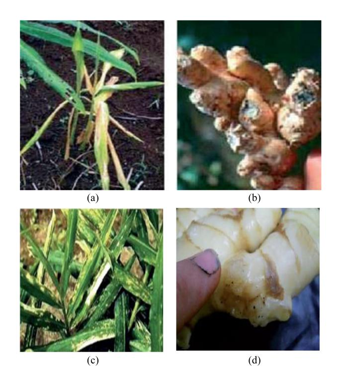
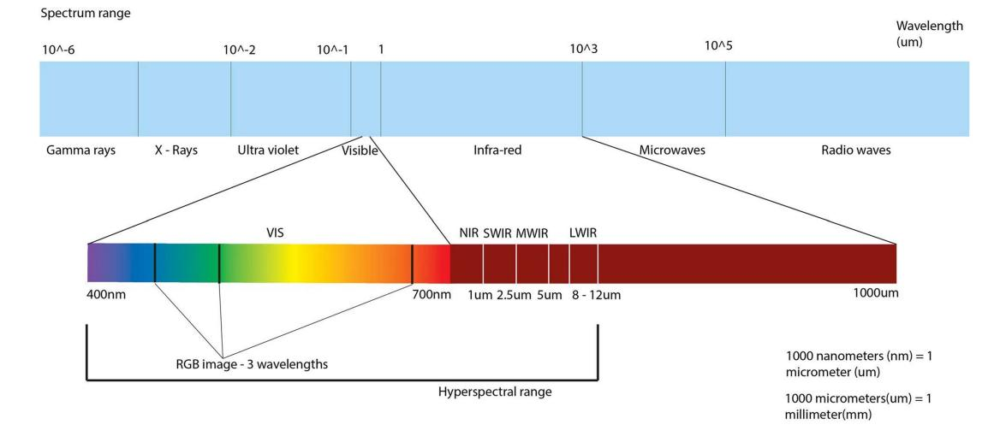
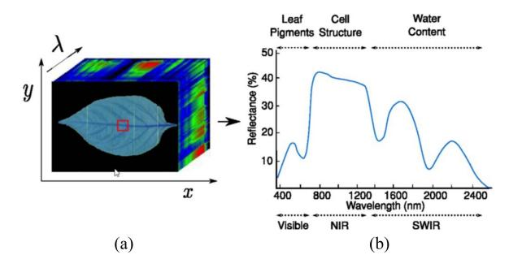
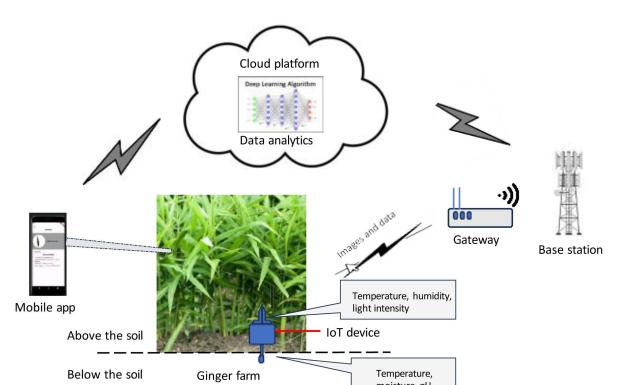

86 IEEE TRANSACTIONS ON AGRIFOOD ELECTRONICS, VOL. 3, NO. 1, MARCH/APRIL 2025

# Pest and Disease Management in Ginger Plants: Artificial Intelligence of Things (AIoT)

Olakunle Elijah, *Member, IEEE*, Abiodun Emmanuel Abioye, and Tawanda E. Maguvu

Abstract—Ginger (*Zingiber officinale*), a globally cultivated spice crop, is vital to numerous economies. However, its production faces significant challenges due to pests and diseases, which can lead to substantial yield losses. Traditional methods for detecting these threats often rely on visual inspection by human experts, a process that is time-consuming, labor-intensive, and prone to errors. This article examines the potential of artificial intelligence (AI) to address these limitations and transform ginger cultivation. It provides a comprehensive analysis of conventional pest and disease management strategies, identifying their short comings and exploring the potential of emerging AI technologies, including the AI of things' applications, for accurate, efficient, and timely detection and control. By pinpointing the challenges and outlining promising avenues for future research, this study aims to equip agriculturists and researchers with the knowledge necessary to optimize ginger production, enhance food security, and foster sustainable farming practices.

Index Terms—Artificial intelligence (AI), artificial intelligence of things (AIoT), disease detection, ginger, Internet of Things (IoT), machine learning (ML), precision agriculture, sustainable agriculture.

# I. INTRODUCTION

GINGER, a perennial herbaceous plant belonging to the *T* Zingiberaceae family, is cultivated globally for its versatile rhizomes, used in culinary, medicinal, and aromatic applications [1], [2]. The leading producers of ginger include India, China, Indonesia, Nigeria, Thailand, Jamaica, Bangladesh, Nepal, Cameron, and Japan [3], [4]. Despite its economic significance, ginger production faces numerous challenges, with diseases posing a substantial threat to yield and quality. These diseases, caused by fungi, bacteria, viruses, and nematodes, can significantly reduce yield and quality.

In August 2023, a devastating fungal epidemic ravaged ginger crops in Kaduna State, Nigeria, wiping out approximately 95%

Received 3 August 2024; revised 10 October 2024 and 3 November 2024; accepted 3 November 2024. Date of publication 21 November 2024; date of current version 11 April 2025. This work was supported by National Information Technology Development Agency (NITDA) under Nigeria Artificial Intelligence Research Scheme (NAIRS/01/24). This grant was managed by Lagos Business School. (*Corresponding author: Olakunle Elijah.*)

Olakunle Elijah is with the Department of Information Technology, School of Computing, Maryam Abacha American University of Nigeria, Kano State P.M.B 3424, Nigeria (e-mail: elij\_olak@yahoo.com).

Abiodun Emmanuel Abioye is with the Department of Viticulture and Enology, Fresno State University, Fresno, CA 93740 USA (e-mail: abiodun@mail .fresnostate.edu).

Tawanda E. Maguvu is with the Department of Plant Pathology, University of California, Davis, CA 95616 USA, and also with the Kearney Agricultural Research and Extension Center, Parlier, CA 93648 USA (e-mail: temaguvu@gmail.com).

Digital Object Identifier 10.1109/TAFE.2024.3492323

of the region's production. The disease, characterized by sudden yellowing and drying of leaves, ultimately led to the rotting of ginger rhizomes in the soil [5]. An assessment conducted by the Institute of Agricultural Research, Ahmadu Bello University, Zaria, identified the disease as a fungal infection, which is both air and soilborne. Similar disease outbreaks have been reported in other ginger-producing countries, including bacterial wilt in Kochi Prefecture, Japan [6], Ethiopia [7], Queensland, Australia [8], and China [8]. Early detection and prediction could have prevented this immense economic loss. These incidents highlight the global nature of ginger diseases and underscore the urgent need for effective disease management strategies to protect ginger crops worldwide. Unfortunately, traditional human-based methods for visually monitoring ginger plants can be inefficient due to factors, such as weather conditions, workload, fatigue, and human error [9], [10]. Furthermore, the use of human experts can be costly for small farmers, time-consuming, and a very tedious task  $[10]$ . Hence, the use of artificial intelligence (AI), the Internet of Things (IoT), and the use of artificial intelligence of things (AIoT) tools for plant disease detection have become an active research area.

The use of AI for disease detection, classification, and diagnosis in plants has been largely studied in the literature [11], [12], [13], [14], [15], [16], [17], [18], [19]. Some of the examples of plants in which AI has been applied for disease detection include  $\text{cassava}$  [18], groundnut (peanut) [20], apple, cherry, corn, grape, orange, peach, strawberry, tomato [19], chili [21], watermelon  $[22]$ , maize  $[23]$ , tomato and potato plants  $[24]$ , cotton plants [25], citrus plant [26], wheat [27], banana [28], almond [29], and ginger [9], [30]. By harnessing the power of AI, IoT, and AIoT, farmers and agricultural scientists can proactively identify and address potential disease outbreaks, ultimately improving crop yields and securing food supplies. Existing literature has provided insight into the diseases affecting ginger detection of diseases and pests in ginger, and prevention techniques [31], [32], [33], [34]. However, there is still a need for a comprehensive review of works on diseases, management, and the use of the latest technologies, such as IoT, AI, and AIoT for disease detection in ginger plants.

The article aims to provide an overview of the techniques and state-of-the-art technologies employed in detecting pests and plant diseases in ginger plants. Accordingly, the contributions of this article are as follows.

1) An overview of the basic pests and diseases that affect 
ginger plants, symptoms, and causes is discussed.

2771-9529 © 2024 IEEE. Personal use is permitted, but republication/redistribution requires IEEE permission. 
See https://www.ieee.org/publications/rights/index.html for more information.

Authorized licensed use limited to: FUDAN UNIVERSITY. Downloaded on August 28,2025 at 01:51:23 UTC from IEEE Xplore. Restrictions apply.

ELIJAH et al.: PEST AND DISEASE MANAGEMENT IN GINGER PLANTS: AIOT 87

- 2) An overview of ginger disease management has been discussed. This includes the conventional method and advanced techniques.
- 3) An overview of the technology involved in AIoT for prediction and forecast of ginger disease outbreak.

The rest of this article is organized as follows. Section II reviews related literature on the use of AI for ginger disease detection and management. Section III provides an overview of the common pests and diseases affecting ginger plants. Section IV presents the various methods of pest disease management under two categories: conventional methods and smart and precision methods. In Section  $V$ , the molecular methods and image processing techniques for pests and disease detection of ginger plants are presented. The use of AIoT for pests and disease management is discussed in Section VI. Section VII discusses the challenges in the adoption of AIoT and Section VIII points out the future directions. Finally, Section  $IX$  concludes this article.

# II. RELATED WORKS

Review of plant disease and classification techniques have been presented in [10], [11], [17], [35], [36], and [37]. The authors in  $[17]$  and  $[35]$  provided a review of various deep learning (DL) architectures and machine learning (ML) techniques for disease classification and detection in various plants. However, the review provided a limited discussion on disease detection and classification in ginger plants. The different imaging techniques for plant diseases were presented in  $[10]$ . While the different techniques for early detection and classification of different kinds of disease were discussed, it did not include the ginger plant. Ngugi et al. [37] provided a review of image processing techniques based on visible images for pest and disease recognition in infected plants. The image processing techniques were discussed under three categories: handcrafted, DL, and a hybrid combination of handcrafted and DL techniques. The handcrafted involves basic processes, such as image capture, preprocessing, segmentation, feature extraction, and classification using ML techniques. The DL technique involves the use of DL architectures, such as AlexNet, GoogLeNet, visual graphics group-16 (VGG-16), and several others, while the hybrid involves the combination of handcrafted feature extraction and DL techniques. A review of imaging techniques for several plants was presented but did not include the ginger plant. On the other hand, Yadav et al. [36] focused on ginger but the review was limited to soft rot (rhizome rot) disease and the use of various techniques, such as chemical, biological, and nanotechnology to manage the disease in ginger. The review did consider AI or IoT for the detection and classification of diseases in ginger plants. Similarly, the authors in [31], [32],  $[33]$ , and  $[34]$  have provided a review of diseases related to the ginger plant. For instance, Meenu et al. [32], [33] highlighted the symptoms, causative agents, epidemiology, and protection from these diseases affecting ginger plants as well as disease management. While these works have identified the various diseases affecting the ginger plant, there is still a need for a comprehensive review of works on diseases, management, and the use of the latest technologies, such as IoT, AI, and AIoT for disease detection in ginger plants.

# III. COMMON PESTS AND GINGER DISEASES

The diseases that affect ginger plants can be classified into biotic and abiotic diseases [32]. Biotic diseases are caused by living organisms, such as fungi, bacteria, viruses, nematodes, and pests. Abiotic diseases are caused by nonliving factors, such as nutrient deficiencies, environmental stresses, such as temperature extremes, and chemical toxicity. This section focuses on the biotic diseases and pests that can affect the quality and quantity of the produced gingers.

## A. Fungal Diseases

Some of the fungal diseases that have been identified in the literature include soft rot or rhizome rot, yellows, wet rot, leaf spot, and storage rots  $[33]$ .

- 1) Rhizome Rot: Rhizome rot also known as soft rot is a serious disease affecting ginger production and can affect the plant at any developmental stage  $[36]$ . The disease is predisposed to water-logged conditions and is caused by several species of *Pythium* [38]. Soft rot initially manifests as wet, brown blisters above the ground sections at the rhizome-stem junction, better known as collars. The blisters/lesions gradually grow larger and coalesce resulting in rot and collapsing of the collar regions. Foliar symptoms appear as yellowing of the tips of lower leaves, which gradually spreads to the leaf blades [36]. The yellowing can progress to all the leaves moving in an upward direction eventually resulting in drooping and withering of the pseudostem. The leaf symptoms could be easily confused with those of withering from  $R$ . solanacearum or Fusarium yellows [36]. However, experienced scouts could easily distinguish this.
- 2) *Fusarium Yellows:* Fusarium yellows of ginger, caused by Fusarium oxysporum f. spp. zingiberi (Foz), is a devastating disease that has significantly reduced the quality and crop yield of ginger worldwide [39]. Infected plants exhibit leaf yellowing, wilting, and a rotten rhizome. Infected plant also produces shriveled tubers and sometimes brown ground tissue. Some of the symptoms appear to overlap with soft rot; however, experienced pathologists can distinguish this by symptom visualization.
- 3) Leaf Spot: The leaf spot diseases caused by Phyllosticta *zingiberi* can be aggressive and destroy the chlorophyllous tissues causing a significant reduction in yield. The incidence of the disease is higher, and the yield of the rhizome is reduced when the ginger is cultivated continuously without the rotation of the crop  $[33]$ ,  $[40]$ . Symptoms include round, oval to elongated spots on the leaves, which are white at the center, thin and papery, and more often torn up. Sometimes pycnidia (black) can be observed at the center of the spots. As the disease progress, infected areas dry and fall out resulting in shotholes. Fig.  $1(c)$  shows infected ginger leaf spot disease.
- 4) Ginger Rust (Puccinia zingiberis): Ginger rust, caused by the fungus Puccinia zingiberis, manifests as yelloworange rust pustules on leaves, reducing photosynthetic activity and weakening the plant. Severe infections can lead to defoliation and reduced rhizome yield.

Authorized licensed use limited to: FUDAN UNIVERSITY. Downloaded on August 28,2025 at 01:51:23 UTC from IEEE Xplore. Restrictions apply

88 IEEE TRANSACTIONS ON AGRIFOOD ELECTRONICS, VOL. 3, NO. 1, MARCH/APRIL 2025

Fig. 1. Illustration of ginger diseases. (a) Yellowing leaves. (b) Oozing of rhizome (bacteria wilt disease). (c) Leaf spot (fungal disease). (d) Nematodeinfected rhizome [33].

5) Storage Rot: The postharvest of rhizomes, which are stored for seed and commercial purposes, can be affected by fungi and bacteria. Affected rhizomes are seen to be dry rotten and also decayed.

## B. Bacterial Diseases

Bacterial diseases in ginger can cause significant yield losses and affect the quality of the rhizomes [34]. Examples of bacterial diseases include bacterial wilt and bacteria soft rot.

- 1) Bacterial Wilt: Bacterial wilt, caused by Ralstonia solanacearum, is a devastating disease affecting ginger plants in tropical and subtropical regions [41], [42]. Symptoms include wilting, yellowing, and vascular discoloration, ultimately leading to plant death [6]. The pathogen survives in soil and water, making it difficult to manage. Fig.  $1(a)$  and  $(b)$ ) shows some of the infected ginger leaf and rhizome.
- 2) Bacterial Soft Rot: The bacteria soft rot is caused by *Erwinia chrysanthemi* and it is aided by high temperatures and saturated soils. A gradual softening of the rhizome tissue occurs with offensive odor.

## C. Viral Diseases

Understanding the symptoms, transmission, and management strategies for viral diseases in ginger is crucial for maintaining healthy crops and ensuring high yields and quality. Some of the viral diseases affecting ginger include cucumber mosaic and chlorotic fleck [43], [44], [45].

- 1) Ginger Mosaic: The ginger mosaic is yellowish and darkgreen mosaic that appears on the leaves in the early stage, which is caused by the cucumber mosaic virus [43], [44].
- 2) Ginger Chlorotic Fleck: The chlorotic fleck disease, which is characterized by light green to yellow interveinal chlorotic flecks, is caused by the ginger chlorotic fleck virus [45].

## D. Nematode Diseases (Meloidogyne spp.)

Root-knot nematodes, particularly Meloidogyne spp., infect ginger roots, causing gall formation, stunted growth, and reduced nutrient uptake. Nematode-infested plants often exhibit poor vigor and yield. The burrowing nematode caused by the Radopholus similis affects the leaves and makes them chlorotic with scorched tips. The infected plants exhibit stunting, reduced vigor, and tillering. Nematode infections weaken the plant, thereby making it easier for the establishment of bacterial and fungal phytopathogens. Fig.  $1(d)$  shows the nematode-infected rhizome.

## E. Ginger Pests

Ginger plants are vulnerable to several pests that can significantly impact their growth, yield, and quality. The study from [46] shows that temperature and rainfall have a significant impact on the pest population. Some of the identified pests affecting ginger are rhizome scale, shoot borer, root-knot nematodes, leaf roller, white grub, and rhizome fly [46], [47], [48]. The rhizome scale is a small, round, and brownish insect that feeds on the sap of ginger rhizomes. Affected plants show stunted growth, yellowing of leaves, and reduced vigor. The shoot borer is a moth whose larvae bore into the ginger shoots, causing significant damage. Affected plants show holes in the stems, and the central shoot often collapses. The root-knot nematodes are microscopic worms that infest the roots of ginger plants. Infested plants exhibit stunted growth, yellowing of leaves, and formation of characteristic galls on the roots. The leaf roller is a caterpillar that feeds on ginger leaves, causing them to roll up and form protective shelters. The caterpillars roll the leaves longitudinally and feed inside the rolled leaves, leading to reduced photosynthetic area and poor plant growth. Affected leaves show feeding damage and may become dry and brittle.

The leaf roller in the larva form constructs its leaf shelter and comes out to feed at night. The leaf becomes folded or rolled longitudinally and complete defoliation can take place in severe conditions. The white grub occasionally feeds on tender rhizomes, roots, and base of pseudostems, causing yellowing and wilting of shoots. The rhizome flies are fairly large with slender bodies and long legs. The body is black and the wings are transparent with ashy spots. The pests play significant roles in the dissemination of fungal and bacterial phytopathogens. Moreover, they create entry wounds, which facilitate easier entry for these pathogens. Table I provides a summary of the ginger diseases and pests.

Authorized licensed use limited to: FUDAN UNIVERSITY. Downloaded on August 28,2025 at 01:51:23 UTC from IEEE Xplore. Restrictions apply

ELIJAH et al.: PEST AND DISEASE MANAGEMENT IN GINGER PLANTS: AIOT 89

TABLE I 
SUMMARY OF GINGER DISEASES AND PESTS [48]

| Diseases                  | Causes                                                                                                                                          | Favorable Conditions                                                                                | Symptoms                                                                                                                            | Outcome                                                           |  |  |  |
|---------------------------|-------------------------------------------------------------------------------------------------------------------------------------------------|-----------------------------------------------------------------------------------------------------|-------------------------------------------------------------------------------------------------------------------------------------|-------------------------------------------------------------------|--|--|--|
| <b>Fungal Diseases</b>    |                                                                                                                                                 |                                                                                                     |                                                                                                                                     |                                                                   |  |  |  |
| Rhizome rots              | Pythium spp., Fusarium spp., and Rosellinia spp.                                                                                             | High soil moisture, high temperatures above 30 °C, poor drainage, and nematode infestation | Degeneration of rhizomes into a black, putrefying mass leaf tips, sheaths, margins, and gradually whole leaves turn yellow | Desiccation and death of ginger plant                          |  |  |  |
| Fusarium Yellows          | Fusarium oxysporum f. sp. zingiberi                                                                                                          | Warm and humid, poor drainage                                                                    | Leaf yellowing, wilting, and a rotten rhizome                                                                                    | Degeneration of plant health and reduced yield                 |  |  |  |
| Leaf spots                | <i>Phyllosticta</i> spp., <i>Colletotrichum</i> spp., <i>Helminthosporium</i> spp., <i>Cercospora</i> spp. and <i>Septoria</i> spp. | Overhead watering, poor air circulation, and high humidity                                    | Small, circular, brown to dark brown spots with yellow halos on the leaves. Spots may merge to form larger lesions.        | Degeneration of plant health and reduced yield                 |  |  |  |
| Storage rot               | Pythium spp., Fusarium spp., <i>Aspergillus</i> spp., and <i>Penicillium</i> spp.                                                      | High soil moisture, high temperatures above 30 °C, poor drainage, and nematode infestation | Colored, watery, mushy, and foul-smelling rhizomes                                                                               | Reduced shelf life of stored rhizomes                          |  |  |  |
| <b>Bacterial Diseases</b> |                                                                                                                                                 |                                                                                                     |                                                                                                                                     |                                                                   |  |  |  |
| Bacterial wilt            | Ralstonia solanacearum                                                                                                                          | High soil moisture, poor drainage and nematode infestation                                    | Progressive yellowing and wilting from the lower leaves to the whole plant                                                    | Milky exudate of the rhizomes when cut                         |  |  |  |
| Storage rot               | Ralstonia solanacearum, Erwinia spp.                                                                                                         | High temperatures above 30 °C, poor drainage, and nematode infestation                        | Colored, watery, mushy, and foul-smelling rhizomes                                                                               | Reduced shelf life of stored rhizomes                          |  |  |  |
| <b>Nematode Diseases</b>  |                                                                                                                                                 |                                                                                                     |                                                                                                                                     |                                                                   |  |  |  |
| Root-knot nematodes    | Meloidogyne spp.                                                                                                                                | Warm and moist soil, sandy soils                                                                 | Stunting, chlorosis, poor tillering ,and necrosis of leaves                                                                      | Rotting rhizomes and water soaked areas                        |  |  |  |
| <b>Viral Diseases</b>     |                                                                                                                                                 |                                                                                                     |                                                                                                                                     |                                                                   |  |  |  |
| Ginger mosaic             | Cucumber mosaic virus (CMV)                                                                                                                  | High humidity, warm temperatures                                                                 | Yellowish and dark-green mosaic on leaves, and stunted leaves and rhizomes at the late stage of infection                     | Severe reduction of rhizome yield                              |  |  |  |
| Chlorotic fleck           | Chlorotic fleck virus (CFV)                                                                                                                  | High humidity                                                                                       | Light green to bright yellow interveinal chlorotic flecks                                                                        | Stunted growth and yield reduction                             |  |  |  |
| <b>Ginger Pest</b>        |                                                                                                                                                 |                                                                                                     |                                                                                                                                     |                                                                   |  |  |  |
| Shoot borer               | Conogethes punctiferalis                                                                                                                        | 30–33 °C and relative humidity range 60%-90%, active from July to October                     | Yellowing and drying of leaves and bore hole of infested pseudo stems.                                                           | Damaged ginger plants.                                            |  |  |  |
| Rhizome scale             | Aspidiella hartii                                                                                                                               | Dry weather                                                                                         | Shriveled and desiccated rhizomes affecting.                                                                                     | Rhizomes dries and cannot germinate                            |  |  |  |
| Leaf roller               | Ancistroides folus larvae, and larvae of several other moths,                                                                             | Temperature 26-35 °C, relative humidity 41%-100 %                                                | Leaves become folded or rolled longitudinally.                                                                                   | Complete defoliation of ginger plants                          |  |  |  |
| Rhizome fly               | Calobata spp.                                                                                                                                   | Warm and humid weather                                                                              | Yellowing of plants and rotting of rhizomes.                                                                                     | Drying of aerial plants and rotting of rhizomes                |  |  |  |
| White grub                | <i>Phyllophaga</i> spp.                                                                                                                         | Warm and humid weather.                                                                             | Yellowing and wilting of shoots.                                                                                                    | Large holes in rhizomes and reduce market value of produce. |  |  |  |
| Thrips                    | Family <i>Thripdae</i>                                                                                                                          | Warm and humid weather.                                                                             | Leaves roll up.                                                                                                                     | Young leaves and shoot wilt and dry out                        |  |  |  |

# IV. DISEASE MANAGEMENT

Ginger disease management has been discussed in the literature [49], [50], [51], [52], [53], [54], [55], [56], [57]. Ginger disease management can be classified into the conventional methods and smart precision methods.

## A. Conventional Methods

Conventional methods of disease management in ginger involve practices that have been traditionally used and rely primarily on established agricultural techniques, chemical applications, and biological controls.

1) *Cultural Practices:* Cultural practices involve the use of crop rotation [58], [59], [60], sanitation [61], intercropping [62], [63], and soil management [64] methods. In crop rotation, ginger cultivation is done by rotating with nonhost crops that are not susceptible to ginger-specific diseases. For instance, a cycle of  $2-4$  years of rotation of ginger crops and other crops, such as paddy, potato,

and mustard, was reported in [59]. This helps in reducing pathogen load in the soil, thereby disrupting the life cycle of soilborne pathogens. This requires good management from the farmers. Aside from crop rotation, intercropping, which is the practice of growing two or more crops in proximity, offers several benefits to ginger cultivation  $[62]$ , [63]. This is due to some factors, such as improvement of soil structure, reduction in the spread of soilborne diseases, and reduction in light intensity  $[65]$ . The use of sanitation involves maintaining a high level of hygiene to prevent the spread of diseases  $[61]$ . The infected plants are destroyed, while tools and equipment are properly cleaned to avoid cross contamination. In the soil management method, good drainage systems are put in place to avoid water logging  $[64]$ . This helps prevent root and rhizome rot. Effective irrigation method, such as drip or furrow irrigation, which delivers water directly to the root zone, helps reduce the spread of fungal diseases. While these cultural practices have proved to be successful, ginger 

Authorized licensed use limited to: FUDAN UNIVERSITY. Downloaded on August 28,2025 at 01:51:23 UTC from IEEE Xplore. Restrictions apply

90 IEEE TRANSACTIONS ON AGRIFOOD ELECTRONICS, VOL. 3, NO. 1, MARCH/APRIL 2025

farmers are faced with the constraints of significant labor, cost, and time.

- 2) Chemical Control: Chemical control involves the use of fungicides either preventively or curatively to control fungal diseases [66]. Chemicals that contain mancozeb, chlorothalonil, thiophanate methyl, or copper-based compounds are sprayed on ginger plants to reduce the impact of fungal infections. Another chemical control is the use of pesticides to manage insect vectors that can transmit viral diseases. The use of chemical control can provide immediate relief from pest and disease pressures; however, this can harm the environment and soil health  $[52]$ .
- 3) Planting Resistant Varieties: Disease-resistant varieties are obtained from reputable sources to reduce the risk of introducing pathogens into the field. However, this is a long-term strategy. Finding disease-resistant rhizomes in ginger necessitates the use of an effective and trustworthy disease-screening technique. For instance, selection methods for locating resistance to bacterial wilt in ginger plants were investigated in [49]. This includes pseudostem inoculation, rhizome inoculation, soil inoculation, and an in vitro method. The result of the study shows that the soil inoculation method outperformed the other methods due to its simplicity and large-scale adoption in a short time for bacterial wilt resistance in ginger.
- 4) Biological Control: Some beneficial microorganisms, such as certain strains of *Trichoderma* spp. or *Bacillus* spp., can antagonize plant pathogens and help suppress disease development. These biocontrol agents can be applied to the soil or foliage as a part of an integrated disease management approach [45], [50], [51], [54]. This requires regular scouting of ginger plants for signs of fungal diseases, such as leaf spots or rhizome rot, and take prompt action if symptoms are observed.

## B. Smart and Precision Methods

The emergence of innovative technologies and the need to minimize the huge loss of ginger are paving the way for innovative approaches to disease detection and management of ginger [67]. These involve the integration of advanced technologies to optimize disease management practices in ginger cultivation. These methods focus on the use of technologies, such as AI, IoT, and robotics, for precision, efficiency, and sustainability by leveraging data and automation. By combining these advanced technologies, growers can potentially enhance the efficiency and effectiveness of disease management strategies for ginger crops, leading to improved yields, reduced input costs, and minimized environmental impact. The different smart and precision methods are discussed as follows.

1) *Precision Agriculture Technologies:* The use of technologies, such as drones, satellites, and IoT, for remote sensing enables the capturing of high-resolution images and data, allowing for early intervention and targeted treatments. The ginger fields can be monitored to ascertain the health of the ginger plants, detect early signs of diseases, and assess the overall condition of the plants. Furthermore, 

soil conditions can be monitored using IoT devices in real time. Various parameters, such as soil moisture, pH, temperature, and nutrient levels, can be analyzed to maintain the optimal condition of the soil. This helps to reduce the risk of diseases, such as root rot.

- 2) AI Modeling and Data Analytics: The use of collected soil data from sensors, weather data, and historical ginger crop performance can be used to predict disease outbreaks. This allows farmers to implement preventive measures before diseases become widespread. The adoption of ML models can be used to analyze the data to identify patterns and provide recommendations for disease management. These models can help optimize irrigation schedules, pesticide applications, and other management practices.
- 3) Automated and Robotic Systems: Smart irrigation and fertigation systems can be used to control the amount of water and fertilizers applied to the ginger plants. This involves the use of sensors to monitor the soil condition to prevent overwatering and also ensure ginger plants receive the right amount of resources. This helps reduce diseases, such as rhizome rots. In addition, robotics are used for precision spraying of fungicides, pesticides, weeding, planting, and even harvesting. They provide increased accuracy and efficiency of disease management operations while reducing labor costs. This promotes sustainable farming practices by minimizing the environmental impact of agriculture through precise application of inputs. The drawback is the initial investment, which can be a barrier for small-scale farmers

# V. GINGER DISEASE DETECTION

The detection of diseases can be classified into two categories, which are molecular methods and image processing methods. The two categories are discussed as follows.

## A. Molecular Method

Polymerase chain reaction (PCR) is a powerful molecular biology technique used to amplify and detect DNA sequences associated with pathogens. For ginger diseases, PCR-based methods are used for precise and specific detection of various pathogens (viruses, bacteria, and fungi). Some of the PCR techniques are conventional PCR, real-time PCR ( $qPCR$ ), reverse transcription PCR (RT-PCR), multiplex PCR, and nested PCR.

- 1) Conventional PCR: Fundamental for detecting specific DNA sequences, widely used due to its simplicity and cost-effectiveness.
- 2) Real-Time PCR: The qPCR provides real-time quantitative data, highly sensitive and specific, essential for assessing pathogen load and disease severity.
- 3) RT-PCR: The use of RT- PCR was employed in the detection of cucumber mosaic virus [43] and chlorotic fleck virus [45]. Targets RNA viruses by converting RNA to cDNA, crucial for detecting RNA-based pathogens, such as ginger mosaic virus (GMV) in ginger.

Authorized licensed use limited to: FUDAN UNIVERSITY. Downloaded on August 28,2025 at 01:51:23 UTC from IEEE Xplore. Restrictions apply.

ELIJAH et al.: PEST AND DISEASE MANAGEMENT IN GINGER PLANTS: AIOT 91

Fig. 2. Light spectrum [68].

- 4) Multiplex PCR: The multiplex PCR detects multiple pathogens simultaneously, is efficient and comprehensive, and ideal for complex or mixed infections.
- 5) *Nested PCR:* The nested PCR increases specificity and sensitivity through two rounds of amplification, excellent for detecting low-abundance or hard-to-detect pathogens. The use of nested PCR was explored in  $[6]$  to detect pathogens in soil infected with bacterial wilt.

## B. Image Processing Techniques

Image processing involves analyzing visual data (images) to detect and diagnose diseases based on visual symptoms and asymptomatic conditions. Various imaging techniques have evolved over the years for the detection of disease in plants, such as red, green, and blue (RGB), thermal imaging, multispectral imaging, fluorescence imaging, and hyperspectral imaging (HSI) [10]. Image processing techniques play a crucial role in preprocessing and analyzing ginger plant images for disease toward obtaining the spectral signature of the disease and detection. The processing methods, such as segmentation, feature extraction, and texture analysis, help identify disease symptoms and distinguish healthy from infected plants. Segmentation involves dividing the image into distinct regions or objects, facilitating the isolation of areas affected by disease. Feature extraction, on the other hand, focuses on identifying and quantifying characteristics, such as color, shape, and texture, that indicate disease symptoms. Texture analysis specifically assesses surface patterns and irregularities, which can signal disease presence [37]. Together, these methods enhance the accuracy of disease detection by providing a comprehensive analysis of the visual data.

1) RGB Image Processing: RGB image processing techniques can be highly effective for detecting and diagnosing visible disease symptoms, which are direct indicators of disease in ginger plants. However, its application is more limited when it comes to detecting nonvisible symptoms. This method utilizes the RGB color channels in digital

images to analyze and identify disease symptoms based on visual patterns and color changes in the leaves, stems, and other plant parts. The operations of the RGB are based on light wavelengths, as shown in Fig. 2 [\[68\]](#page-6-1). The RGB image processing has been largely explored for disease detection [\[69\]](#page-6-1), [\[70\]](#page-6-1), [\[71\]](#page-6-1), [\[72\]](#page-6-1). The RGB images of ginger plants can be captured using digital cameras or smartphones or drones equipped with RGB cameras. The images are further preprocessed using noise reduction techniques, followed by image enhancement and separating the ginger plants from the background via segmentation techniques, such as thresholding, edge detection, and clustering algorithms. The application of RGB processing includes the detection of visible symptoms in ginger, such as leaf spots, mosaic viruses, and chlorosis. This has helped in monitoring and accessing ginger plant health. However, for a more improved diagnosis that includes nonvisible symptoms, integrating RGB with other imaging techniques can offer a more detailed and accurate assessment of plant health [\[71\]](#page-6-1). To address these limitations, RGB image processing is often complemented by other imaging techniques, such as thermal, multispectral, or HSI [\[72\]](#page-6-1). Fig. 2 shows the different ranges of the light spectrum and their respective wavelengths.

2) *Multispectral Imaging:* Multispectral imaging provides a more nuanced approach to detecting and diagnosing visible symptoms of disease in ginger plants compared with RGB image processing. The multispectral imaging ininvolves capturing data in a few discrete bands, such as RGB, near-infrared (NIR), and sometimes additional bands, such as short-wave infrared [73], [74], [75], [76]. This method can detect subtle physiological changes and internal conditions by analyzing reflectance in specific spectral bands that correlate with biochemical and physiological processes not apparent in the visible spectrum, thus enabling detailed analysis of plant health by capturing variations in reflected light across a broader range of wavelengths [74]. By integrating multispectral imaging

Authorized licensed use limited to: FUDAN UNIVERSITY. Downloaded on August 28,2025 at 01:51:23 UTC from IEEE Xplore. Restrictions apply

92 IEEE TRANSACTIONS ON AGRIFOOD ELECTRONICS, VOL. 3, NO. 1, MARCH/APRIL 2025

TABLE II 
SUMMARY OF APPLICATION OF ML TECHNIQUES FOR DISEASE DETECTION IN GINGER PLANTS

| Ref  | ML Techniques                              | Application on Ginger                                                   | Sensors                                                                 | Outcome                                                                                                                                                               | Dataset                                                                   |
|------|--------------------------------------------|-------------------------------------------------------------------------|-------------------------------------------------------------------------|-----------------------------------------------------------------------------------------------------------------------------------------------------------------------|---------------------------------------------------------------------------|
| [30] | ANN, CNN, MobileNetV2, and VGG-16    | Pest pattern, nutrient deficiency, and soft rot disease detection | $720 \times 1600$ pixels resolution and 16 Megapixel camera       | * ANN (accuracy) - 95%, 97%, and 96% CNN (accuracy) - 92%, 96%, and 99% MobileNetV2 (accuracy) - 93%, 95%, and 97% VGG-16 (accuracy) - 96%, 95%, and 96%     | Orchard of PMAS-Arid Agriculture University Rawalpindi           |
| [69] | Improved YOLOv4 with MobileNetv2     | Ginger seed and shoot orientation detection                          | $3288 \times 3288$ pixel MV-EM1400C camera                           | Mean average precision - 98.73%                                                                                                                                       | ginger plantation from Anqiu, Shandong, China and data from [81] |
| [81] | YOLOv3 with Darknet-53                  | Ginger seed and shoot orientation detection                          | Hikvision MV-CE200-10GC camera                                       | Average precision - 98.2%, F1- measure - 94.9%                                                                                                                     | Anqiu City, Weifang City, Shandong Province.                        |
| [79] | CNN                                        | Ginger disease detection-bacteria wilt on leaf                    | $1440 \times 3040$ pixel Samsung galaxy S10 (16 Megapixel camera) | Accuracy - 95.2%                                                                                                                                                      | Boloso Bombe and Hadaro Tunto, Southern region of Ethiopia       |
| [80] | CNN, VGG-16, and MobileNetV2, YOLOv5 | Nutritional deficiency, soft rot disease, pest pattern detection  | Infinix Hot 9 mobile phone camera                                    | * CNN (accuracy) - 96%, 95%, and 98 % VGG-16 (accuracy) - 97%, 96%, and 99% MobileNetV2 (accuracy) - 90%, 93%, and 93% YOLOv5 (accuracy) - 80%, 80%, and 79% | Orchard of PMAS-Arid Agriculture University Rawalpindi           |
| [9]  | CNN, MobileNetV2                        | Ginger disease detection-bacteria wilt on leaf                    | $1440 \times 3040$ pixel Samsung galaxy S10 (16 Megapixel camera) | CNN (accuracy) - 91% MobileNetV2 (accuracy) - 97%                                                                                                                  | [79]                                                                      |

The figures represent the accuracy score for the pest pattern, nutrient deficiency, and soft rot disease, respectively.

Fig. 3. Example of HSI image for disease detection in plant [78]. (a) Hypercube and (b) spectral reflectance of a healthy plant.

with traditional RGB methods, researchers can obtain a comprehensive view of both visible and nonvisible symptoms, leading to more effective disease management and intervention strategies.

3) HSI: HSI involves capturing reflected light in contiguous narrow spectral bands across the electromagnetic spectrum as a hypercube. Hyperspectral cameras employ imaging and spectroscopy techniques to generate multidimensional image data. The operation of the HSI camera spans a broad range of 250–2500 nm wavelength and covers ultraviolet, visible, and NIR spectrum. The use of HSI is considered a powerful tool for early disease detection in plants [1], [11], [17], [77], [78]. The HSI helps to overcome the inability to detect diseases via visual inspection of signs and symptoms by focusing on specific parts of images or areas of interest, which contain anomalies. The HSI aids early plant disease detection [68] by employing imaging and spectroscopy techniques to generate multidimensional image data as a hypercube [see Fig.  $3(a)$ ]. This enables precision disease control. By generating high-resolution spectral data [see Fig.  $3(b)$ ], HSI enhances early disease detection by identifying subtle 

physiological changes and anomalies not visible through standard visual inspection [77]. This capability is particularly valuable for detecting diseases in ginger plants, as it enables precise identification of early stage conditions and abnormalities by focusing on specific spectral signatures associated with various diseases.

4) *ML Techniques:* ML algorithms have been widely used for disease detection in crops, including ginger [30]. Supervised learning algorithms, such as support vector machines, random forests, and k-nearest neighbors, have been applied to classify ginger plant images based on disease symptoms. These algorithms rely on labeled training data to learn patterns and make predictions, enabling the accurate disease diagnosis. DL, a subset of ML, has shown remarkable performance in various computer vision tasks, including image classification and object detection. Convolutional neural networks (CNNs), in particular, have been successfully applied to detect diseases in ginger plants from images [79]. Transfer learning, where pretrained CNN models are fine-tuned on ginger disease datasets, has proven effective in leveraging large-scale image datasets and achieving high classification accuracy [80], [81]. Waheed et al. [30] explored the CNN for the detection of soft rot diseases in the rhizomes, VGG-16 for the detection of nutrient deficiency and pest pattern in affected ginger leaves, and artificial neural network (ANN) for nutritional deficiency in the ginger leaves. While the use of the CNN, VGG-16, and ANN showed high accuracy of 99%, 96%, and 96%, respectively, on simulated results, there was no real-life deployment to verify the performance. The work from [30] was extended in  $[80]$  by evaluating the performance of object detection model YOLOv5 for disease detection and proposed a DL-enabled mobile-based system. Fang et al. [69], [81] focused on the use of the ML technique in the detection of the orientation of ginger seed buds for mechanized 

Authorized licensed use limited to: FUDAN UNIVERSITY. Downloaded on August 28,2025 at 01:51:23 UTC from IEEE Xplore. Restrictions apply.

ELIJAH et al.: PEST AND DISEASE MANAGEMENT IN GINGER PLANTS: AIOT 93

sowing of ginger in the same direction. To achieve this, an enhanced YOLOv4 and YOLOv3 with different backbone networks were explored, respectively. The results show that ML can enable the planting of ginger shoots in the same direction. Kolesnikova et al. [9] explored the use of a transfer learning approach in detecting bacterial wilt disease in ginger leaf. The finding shows that the use of the fine-tuning of the MobileNet V2 reduced the training time and achieved an improved accuracy of 97% compared with the CNN-based DL technique of 95% used in [79].

Advanced techniques, such as edge detection, threshold, and morphological operations, enhance the quality of input data for AI models, leading to improved disease detection performance. While the use of ML and DL has enabled the detection of plant diseases and classification, it involves several steps, such as noise reduction from the background, labeling, data augmentation, data splitting, feature extraction, and training. This may take considerable resources. To overcome the cost of using ML and DL, the use of transfer learning is now being employed. This involves the use of pretrained models on a large dataset for new datasets. Some of the pretrained models include AlexNet, VGG, and GoogleNet. The pretrained model comprises a large number of parameters that require fine-tuning. Table  $\mathbf{II}$  provides a summary of various ML techniques.

## C. Summary

Molecular methods for detecting ginger diseases, such as PCR and sequencing, offer high sensitivity and specificity but are costly, require expensive equipment and specialized training, and can be time-consuming. They are less accessible to small-scale farmers and regions with limited resources, and their accuracy depends on high-quality samples and stringent protocols. Moreover, they employ destructive sampling and cannot distinguish between viable and dead DNA, which will likely result in some false positives. In contrast, image processing is more cost-effective, noninvasive, nondestructive, and suitable for real-time field monitoring, making it accessible and practical for small-scale farmers. However, it may not match the accuracy and specificity of molecular methods, especially for early stage or visually indistinct diseases, and can be influenced by environmental factors. Combining both methods can provide a comprehensive solution for effective disease management in ginger.

# VI. AIOT TECHNIQUE

The AIoT, which involves the combination of ML, a subset of AI and IoT, provides the intelligence need for the sustain ability of ginger farming. The IoT has been largely explored in the area of agriculture for precision farming, smart irrigation, livestock monitoring, crop monitoring and management, environmental monitoring, automated machinery, and robotics. The use of IoT for disease prediction and forecasting is being advocated for disease prevention in agriculture [\[82\]](#page-10-1), [\[83\]](#page-10-1), [\[84\]](#page-10-1). This involves the use of IoT devices with incorporated sensors for data acquisition [\[85\]](#page-10-1). The acquired data are sent via a gateway to a cloud platform using preferred communication technologies. The use

Fig. 4. AIoT for ginger disease detection.

of IoT can enable the monitoring of weather conditions that make ginger susceptible to any of the diseases. Fig. 4 illustrates the application of IoT for ginger plants.

While IoT allows for data acquisition, ML is been combined to generate insight from the volume of data accumulated. Hence, the combination of ML and IoT for agricultural purposes has been explored in [86], [87], and [88]. The AIoT techniques can offer tremendous benefits to ginger farmers. Unlike the use of only ML techniques that rely on the use of historical datasets for disease detection, the application of AIoT can enable proactive monitoring based on environmental conditions. Early warning systems can be implemented to generate alerts or notifications when conditions conducive to the development of ginger diseases are detected. This involves the development of predictive models that leverage historical data on ginger diseases, environmental conditions, and crop management practices to forecast disease outbreaks with real-time data. By deploying AIoT technologies for ginger disease detection, farmers can proactively monitor their crops, identify disease outbreaks early, and implement timely interventions to mitigate crop losses and improve yield and quality.

# VII. CHALLENGES

The integration of AI techniques for ginger disease detection has the potential to revolutionize agricultural practices by providing fast, accurate, and nondestructive diagnostic tools. Automated disease detection systems can enable early intervention and targeted management strategies, ultimately improving crop health and productivity. However, several challenges need to be addressed to realize the full potential of AI in ginger cultivation. These include the need for large, annotated datasets, robust model generalization across different environmental conditions and disease severity, and user-friendly deployment of AI solutions for farmers in resource-limited settings. The challenges of deployment of emerging techniques for the detection of diseases in ginger farming are discussed as follows.

## A. Skills Set

There are diverse skills required for the successful deployment of AIoT in ginger production. It requires the services 

Authorized licensed use limited to: FUDAN UNIVERSITY. Downloaded on August 28,2025 at 01:51:23 UTC from IEEE Xplore. Restrictions apply

94 IEEE TRANSACTIONS ON AGRIFOOD ELECTRONICS, VOL. 3, NO. 1, MARCH/APRIL 2025

of agronomists and plant scientists to diagnose affected ginger plants and correct the labeling of datasets. Computer analysts need to work with plant pathologists using various skill sets, such as image analysis, data analysis, ML, programming, and software development. The shortage of these skill sets will pose a big challenge. To overcome this, effective collaboration between researchers and practitioners is required from different institutions and also different countries.

## B. Cost Implication

The cost of data collection in terms of manpower, the cost of data acquisition systems, and the need for high-end computers for data analysis remain a major challenge. Setup cost, which involves hardware and software systems, can range from hundreds to thousands of dollars. Other cost includes deployment cost, training of farmers on the use of the AIoT systems, maintenance costs, such as hardware replacement, and Internet costs. To overcome this challenge, there is a need to use AIoT to achieve a return on investment within a reasonable time. Also, collaboration between farmers and the government can help overcome the initial cost.

## C. Data Acquisition and Processing

The availability of adequate datasets that are taken from the field that encapsulate the various stages of growth of ginger and the real-life images of the diseases on the plant with different backgrounds and orientations remains a challenge. This can be time- and resource-consuming in monitoring and collection of data. The detection of leaf disease, as well as the collecting and labeling of a large number of disease photos, requires a huge amount of people, material resources, and financial resources. Some plant diseases have a shorter onset period and are more difficult to collect [9]. Furthermore, the storage and processing of datasets can be demanding. For instance, the use of high-resolution images and hyperspectral images involves the processing of a large amount of data. This poses some computational challenges. Hence, the need to employ parallel processing, batch processing, and hardware acceleration could solve these computational challenges and provide a real-time analysis as a viable solution.

## D. Deployment Challenges

While ML has been extensively studied in academia, many applications remain in the laboratory stage. This is largely due to the controlled environment that laboratories provide for data collection and annotation, which is essential for training and validating reliable AI models. However, several deployment challenges must be addressed to transition ML from the lab to the field. These include the need for reliable infrastructure, such as power, connectivity, and durable hardware suitable for agricultural conditions. In addition, successful deployment requires collaboration among agricultural researchers, extension services, and farmers. The choice of deployment methods, such as smart mobile phones, IoT devices, robots, or drones, has different technical requirements. A comprehensive framework is

also needed to govern data collection through online platforms, manage data collection via individual smartphones, facilitate data submission to a cloud platform, and process the collected data.

# VIII. FUTURE WORK

In this section, the potential areas that can revolutionize ginger farming are discussed as follows.

## A. AIoT Innovation

The application of AIoT for ginger production is expected to open up more research opportunities. More research work is expected in the use of IoT for real-time monitoring of soil moisture, pH, nutrients, and other farm-related variables in order to optimize ginger crop yield. More research work is needed to deploy IoT energy-efficient systems in ginger farms that take into consideration low-power wide area communication technology or energy harvesting systems. The adoption of AIoT will enable the prediction of weather patterns and disease outbreaks in ginger farms. The provision of real-time monitoring of farm variables using IoT and prediction using ML algorithm will enhance ginger farm management greatly [89].

## B. Smartphone Applications

The use of smartphones has been explored for disease detection of soft rot in ginger [80]. However, more research work is needed in the use of smartphone-assisted early diagnosis of other ginger diseases and pest infections, as mentioned in Section III. The development of a smartphone application that can guide farmers in planting, harvesting, processing, and marketing of ginger is needed. Features, such as integrated pest management, that cover preplanting, sowing, vegetative stage, and rhizome development stage would be useful for ginger farmers. Lightweight DL models that can be deployed on smartphones for online and offline [90], [91], [92], [93] disease and pest management for ginger plants is an open research area.

## C. Automation and Robots

The use of robots for planting, monitoring, and harvesting ginger, guided by IoT sensors and ML algorithms, is expected to attract more research interest. Labor-intensive activities, such as sorting good and bad ginger seedlings, sorting ginger seedlings according to sizes, and ginger shoot orientations in planting [69], [81], can be automated. More research into the use of robotics for remote plant disease diagnosis and precision plant protection for ginger using virtual reality and digital twins is expected [94]. Also, the use of drones equipped with HSI for disease detection in ginger-cultivated fields is a promising area.

## D. Explainable AI (XAI)

The concept of XAI enables the AI system to provide clear understandable insights into the decision-making process [95], [96]. Recently the XAI has been extended to the field of agriculture and, in particular, to predict the probability of disease occurrence in corn cultivation [97], [98]. XAI tools, such as

Authorized licensed use limited to: FUDAN UNIVERSITY. Downloaded on August 28,2025 at 01:51:23 UTC from IEEE Xplore. Restrictions apply

ELIJAH et al.: PEST AND DISEASE MANAGEMENT IN GINGER PLANTS: AIOT 95

LIME and Grad-CAM, help in crop disease detection by making AI model predictions more transparent, showing which features or image regions contribute to disease identification, thereby improving trust and decision making in ginger disease and pest management.

## E. Generative AI

Generative AI is currently being explored to overcome the limitations and scarcity faced in well-annotated datasets [99], [100]. The generative AI can generate new content, ideas, or solutions based on patterns learned from the existing data. The use of generative AI techniques, such as StyleGAN [101], a variation of generative adversarial networks [102], bidirectional encoder representations from transformers  $[103]$ , and DALL-E  $[104]$  can be leveraged for disease detection in ginger plants. The use of generative AI offers the potential to generate realistic ginger disease and pest image datasets for different scenarios, thus accelerating the deployment of AIoT for ginger production.

## F. Hyperspectral Imaging

The use of HSI for the early detection of nonvisible diseases in ginger plants opens up several research issues. This includes the design and development of field-portable hyperspectral technologies with minimum postprocessing, which is expected to attract several research interests. For instance, a smartphone HSI technique was presented in  $[105]$ , which offers a low-cost solution with portability and user-friendly. The research on identifying the exact bands related to different diseases will pave the way for the development of specific HSI cameras for ginger diseases. This will lead to lesser costs in the acquisition of the HSI cameras. The combination of HSI with XAI is expected to attract more research interest in disease detection in ginger plants. Similar to what has been explored in  $[106]$ . These innovative approaches to assessing the quality characteristics of the rhizomes can be developed.

## G. Data Collection

There is currently a lack of adequate real-world wellannotated datasets for ginger farming. Hence, more historical data are needed. This includes data related to soil conditions, environmental factors, crop health, growth patterns, field conditions, disease outbreaks, farming practices, and weather patterns. More research work is needed in the deployment of IoT devices, remote sensing, and deployment of farm management software for the collection of real-world data.

# IX. CONCLUSION

In this article, the common diseases that affect ginger plants have been presented. Early disease detection in ginger plants remains an important criterion for high-yield production among small- and large-scale ginger farmers. The conventional ways of preventing diseases in ginger plants have been discussed. The emergence of IoT and AI technology is providing more effective ways of preventing and detecting diseases in ginger plants. The application of AIoT can enable detection of the fungal, bacterial,

viral, and nematode diseases in the soil, air, and various parts of the plant. The use of smartphones, drones, and robots in combination with AI techniques, such as HSI, XAI, and IoT, is a promising solution for future ginger farmers for successful ginger production.

# REFERENCES

- [1] N. H. Samrat, J. B. Johnson, S. White, M. Naiker, and P. Brown, "A rapid non-destructive hyperspectral imaging data model for the prediction of pungent constituents in dried ginger," Foods, vol. 11, no. 5, 2022, Art. no. 649.
- [2] R.-H. Ma et al., "A recent update on the multifaceted health benefits associated with ginger and its bioactive components," Food Function, vol. 12, no. 2, pp. 519-542, 2021.
- [3] K. P. Nair and K. P. Nair, "Production, marketing, and economics of ginger," in Turmeric (Curcuma longa L.) and Ginger (Zingiber officinale Rosc.)- World's Invaluable Medicinal Spices: The Agronomy and Economy of Turmeric and Ginger. Cham, Switzerland: Springer, 2019, рр. 493-518.
- [4] P. Joshi and S. Khanal, "Production status, export analysis, and future prospects of ginger in Nepal," Arch. Agriculture Environ. Sci., vol. 6, no. 2, pp. 202-209, 2021.
- [5] This Day, "Devastating ginger disease outbreak wreaks economic havoc in Kaduna," Accessed: Mar. 17, 2024. [Online]. Available: https://www.thisdaylive.com/index.php/2023/09/25/devastatingginger-disease-outbreak-wreaks-economic-havoc-in-Kaduna/
- [6] M. Horita et al., "Comprehensive control system for ginger bacterial wilt disease based on anaerobic soil disinfestation," Agronomy, vol. 13, no. 7, 2023, Art. no. 1791.
- [7] M. J. Guji, H. T. Yetayew, and E. D. Kidanu, "Yield loss of ginger (zingiber officinale) due to bacterial wilt (ralstonia solanacearum) in different wilt management systems in Ethiopia," Agriculture Food Secur., vol. 8, 2019, Art. no. 5.
- [8] A. C. Hayward and K. G. Pegg, "Bacterial wilt of ginger in Queensland: Reappraisal of a disease outbreak," Australas. Plant Pathol., vol. 42, рр. 235-239, 2013.
- [9] O. Kolesnikova, M. G. Yigezu, A. L. Tonja, M. M. Woldeyohannis, G. Sidorov, and A. Gelbukh, "Ginger disease detection using a computer vision pre-trained model," in *Innovations in Machine and Deep Learning:* Case Studies and Applications. Cham, Switzerland: Springer, 2023, pp. 419-432.
- [10] V. Singh, N. Sharma, and S. Singh, "A review of imaging techniques for plant disease detection," Artif. Intell. Agriculture, vol. 4, pp. 229–242, 2020.
- [11] M. H. Saleem, J. Potgieter, and K. M. Arif, "Plant disease detection and classification by deep learning," Plants, vol. 8, no. 11, 2019, Art. no. 468.
- [12] M. Ray et al., "Fungal disease detection in plants: Traditional assays, novel diagnostic techniques and biosensors," Biosensors Bioelectron., vol. 87, pp. 708-723, 2017.
- [13] F. Martinelli et al., "Advanced methods of plant disease detection: A review," Agron. Sustain. Develop., vol. 35, pp. 1-25, 2015.
- [14] H. Durmus, E. O. Günes, and M. Kırcı, "Disease detection on the leaves of the tomato plants by using deep learning," in Proc. 6th Int. Conf. Agro-geoinform., 2017, pp. 1–5.
- [15] K. P. Ferentinos, "Deep learning models for plant disease detection and diagnosis," Comput. Electron. Agriculture, vol. 145, pp. 311-318, 2018
- [16] S. Thomas et al., "Benefits of hyperspectral imaging for plant disease detection and plant protection: A technical perspective," J. Plant Dis. Protection, vol. 125, pp. 5-20, 2018.
- [17] L. Li, S. Zhang, and B. Wang, "Plant disease detection and classification by deep learning-A review," IEEE Access, vol. 9, pp. 56683-56698, 2021.
- [18] A. Ramcharan, K. Baranowski, P. McCloskey, J. Legg, D. P. Hughes, and B. Ahmed, "Deep learning for image-based cassava disease detection," Front. Plant Sci., vol. 8, 2017, Art. no. 293051.
- [19] S. P. Mohanty, D. P. Hughes, and M. Salathé, "Using deep learning for image-based plant disease detection," Front. Plant Sci., vol. 7, 2016, Art. no. 215232.

Authorized licensed use limited to: FUDAN UNIVERSITY. Downloaded on August 28,2025 at 01:51:23 UTC from IEEE Xplore. Restrictions apply

96 IEEE TRANSACTIONS ON AGRIFOOD ELECTRONICS, VOL. 3, NO. 1, MARCH/APRIL 2025

- [20] Ramakrishnan M. and Sahaya Anselin Nisha A., "Groundnut leaf disease detection and classification by using backpropagation algorithm," in Proc. Int. Conf. Commun. Signal Process., 2015, pp. 0964–0968.
- [21] O. Elijah, S. K. A. Rahim, E. A. Abioye, Y. O. Salihu, A. A. Oremeyi, and M. J. Musa, "Decision support platform for production of chili using IoT, cloud computing, and machine learning approach," in Proc. IEEE Nigeria 4th Int. Conf. Disruptive Technol. Sustain. Develop., 2022, рр. 1-5.
- [22] S. B. Kutty et al., "Classification of watermelon leaf diseases using neural network analysis," in Proc. IEEE Bus. Eng. Ind. Appl. Colloq., 2013, pp. 459-464.
- [23] T. Wiesner-Hanks et al., "Image set for deep learning: Field images of maize annotated with disease symptoms," *BMC Res. Notes*, vol. 11, 2018, Art. no. 440.
- [24] S. V. Kulkarni, V. Hegde, M. Naik, and R. Bhavana, "Detection of plant leaf disease using image processing and automation of pesticide spraying," in Proc. Int. Conf. Emerg. Res. Comput., Inf., Commun. Appl., 2023, pp. 535-544.
- [25] S. Mude, D. Naik, and A. Patil, "Leaf disease detection using image processing for pesticide spraying," Int. J. Adv. Eng. Res. Develop., vol. 4, no. 4, pp. 1-5, 2017.
- [26] Z. Iqbal, M. A. Khan, M. Sharif, J. H. Shah, M. H. ur Rehman, and K. Javed, "An automated detection and classification of citrus plant diseases using image processing techniques: A review," Comput. Electron. Agriculture, vol. 153, pp. 12-32, 2018.
- [27] Z. Lin et al., "A unified matrix-based convolutional neural network for fine-grained image classification of wheat leaf diseases," IEEE Access, vol. 7, pp. 11570–11590, 2019.
- [28] J. Amara, B. Bouaziz, and A. Algergawy, "A deep learning-based approach for banana leaf diseases classification," pp. 79-88, 2017.
- [29] M. López-López, R. Calderón, V. González-Dugo, P. J. Zarco-Tejada, and E. Fereres, "Early detection and quantification of almond red leaf blotch using high-resolution hyperspectral and thermal imagery," Remote Sens., vol. 8, no. 4, 2016, Art. no. 276.
- [30] H. Waheed, N. Zafar, W. Akram, A. Manzoor, A. Gani, and S. ul Islam, "Deep learning based disease, pest pattern and nutritional deficiency detection system for 'zingiberaceae' crop," Agriculture, vol. 12, no. 6, 2022, Art. no. 742.
- [31] J. Dhanik, N. Arya, and V. Nand, "A review on zingiber officinale," J. Pharmacognosy Phytochem., vol. 6, no. 3, pp. 174–184, 2017.
- [32] G. Meenu and M. Kaushal, "Diseases infecting ginger (zingiber officinale roscoe): A review," Agricultural Rev., vol. 38, no. 1, pp. 15-28, 2017.
- [33] G. Meenu and T. Jebasingh, "Diseases of ginger," in *Ginger Cultivation* and Its Antimicrobial and Pharmacological Potentials. Rijeka, Croatia: IntechOpen, 2020, pp. 1–31.
- [34] A. Kumar and A. Hayward, "Bacterial diseases of ginger and their control," in Ginger. Boca Raton, FL, USA: CRC Press, 2016, pp. 361-386.
- [35] W. B. Demilie, "Plant disease detection and classification techniques: A comparative study of the performances," J. Big Data, vol. 11, no. 1, 2024, Art. no. 5.
- [36] D. Yadav, H. Gaurav, R. Yadav, R. Waris, K. Afzal, and A. C. Shukla, "A comprehensive review on soft rot disease management in ginger (zingiber officinale) for enhancing its pharmaceutical and industrial values," Heliyon, vol. 9, 2023, Art. no. e18337.
- [37] L. C. Ngugi, M. Abelwahab, and M. Abo-Zahhad, "Recent advances in image processing techniques for automated leaf pest and disease recognition-A review," Inf. Process. Agriculture, vol. 8, no. 1, рр. 27-51, 2021.
- [38] G. Stirling, U. Turaganivalu, A. Stirling, M. Lomavatu, and M. Smith, "Rhizome rot of ginger (zingiber officinale) caused by pythium myriotylum in Fiji and Australia," Australas. Plant Pathol., vol. 38, no. 5, pp. 453-460, 2009.
- [39] D. Prasath, A. Matthews, W. T. O. Neill, E. A. Aitken, and A. Chen, "Fusarium yellows of ginger (zingiber officinale roscoe) caused by fusarium oxysporum f. sp. zingiberi is associated with cultivar-specific expression of defense-responsive genes," Pathogens, vol. 12, no. 1, 2023, Art. no. 141.
- [40] H. Hu, Y. Gong, C. Cao, R. Zhou, C. Liu, and Z. Zhu, "First report of alternaria alternata causing leaf yellow spot on ginger (zingiber officinale roscoe) in Laifeng, China," Plant Dis., vol. 107, no. 5, 2023, Art. no. 1636. [Online]. Available: https://doi.org/10.1094/pdis-02-22-0363-pdn
- [41] S. Nelson, "Bacterial wilt of edible ginger in Hawaii," Plant Dis., vol. 99, рр. 1-8, 2013.

- [42] T. P. Prameela and R. S. Bhai, "Bacterial wilt of ginger (zingiber officinale rosc.) incited by ralstonia pseudosolanacearum—A review based on pathogen diversity, diagnostics and management," J. Plant Pathol., vol. 102, pp. 709-719, 2020.
- [43] B. Muhammad, K. L. Ling, L. W. Hong, and G. Vadamalai, "Detection and characterization of cucumber mosaic virus infecting ginger (zingiber officinale roscoe) in Malaysia," Int. J. Sci., Basic Appl. Res., vol. 57, no. 1, pp. 9-15, 2021.
- [44] B. Muhammad, G. Vadamalai, L. L. Kong, and W. H. Lau, "Cucumber mosaic virus (CMV) transmission through infected ginger (zingiber officinale roscoe) and turmeric (curcuma longa L.) rhizomes," Indian Phytopathol., vol. 76, no. 4, pp. 1127-1130, 2023.
- [45] A. I. Bhat, K. P. Naveen, N. S. Pamitha, and R. P. Pant, "Association of two novel viruses with chlorotic fleck disease of ginger," Ann. Appl. Biol., vol. 177, no. 2, pp. 232-242, 2020.
- [46] G. Momin, D. Firake, G. Behere, and P. Baiswar, "Pest complex, biology and population dynamics of insect pests of ginger in northeast India," Indian J. Entomol., vol. 80, no. 2, pp. 244-250, 2018.
- [47] S. Devasahayam and K. A. Koya, "Insect pests of ginger," in Ginger. Boca Raton, FL, USA: CRC Press, 2016, pp. 387–410.
- [48] NIPHM, "AESA based IPM-ginger," Accessed: Jun. 30, 2024. [Online]. Available: https://niphm.gov.in/IPMPackages/Ginger.pdf
- [49] A. Kumar, "Methods for screening ginger (zingiber officinale rosc.) for bacterial wilt resistance," Indian Phytopathol., vol. 59, no. 3, pp. 281-286, 2012.
- [50] K. Khatso and N. A. Tiameren, "Biocontrol of rhizome rot disease of ginger (zingiber officinale rosc.)," Int. J. Bio-Resource Stress Manage., vol. 4, pp. 317–321, 2013.
- [51] C. Lalfakawma, B. C. Nath, L. Bora, S. Srivastava, and J. Singh, "Integrated disease management of zingiber officinale rosc. rhizome rot," Bioscan, vol. 9, pp. 265-269, 2014.
- [52] N. Dohroo, S. Kansal, and N. Ahluwalia, "Studies on eco-farmer-friendly practices for management of soft rot of ginger (zingiber officinale)," Indian Phytopathol., vol. 68, pp. 93–96, 2015.
- [53] A. K. Pandey, L. P. Awasthi, J. P. Srivastva, and N. K. Sharma, "Management of rhizome rot disease of ginger (zingiber officinale rose L.)," J. *Phytol.*, vol. 2, no. 9, pp. 18–20, 2010.
- [54] M. Rai, A. P. Ingle, P. Paralikar, N. Anasane, R. Gade, and P. Ingle, "Effective management of soft rot of ginger caused by pythium spp. and fusarium spp.: Emerging role of nanotechnology," Appl. Microbiol. Biotechnol., vol. 102, pp. 6827-6839, 2018.
- [55] D. Debata, A. Sethy, D. Panda, and P. Sarangi, "Management of rhizome rot of ginger," Environ. Ecol., vol. 37, no. 1, pp. 97-100, 2019.
- [56] J. Merga, "Epidemiology and management strategies of ginger leaf spot disease (phyllosticta zingiberi)," *Plant Pathol. Quarantine*, vol. 11, no. 1, pp. 138-143, 2021.
- [57] S. Sharma, N. P. Dohroo, S. Veerubommu, S. Phurailatpam, N. Thakur, and A. N. Yadav, "Integrated disease management of storage rot of ginger (zingiber officinale) caused by fusarium sp. in Himachal Pradesh, India," Int. J. Curr. Microbiol. Appl. Sci., vol. 5, no. 12, pp. 3580–3592, 2017.
- [58] S. Ukaew, W. Weerachaipichasgul, N. Motong, P. Chantam, and W. Yaowarat, "Implication of soil carbon changes on the greenhouse gas emissions of pickled ginger: A case study of crop rotation cultivation in northern Thailand," Energy, Ecol. Environ., vol. 8, no. 4, pp. 370-387, 2023.
- [59] H. Rahman, K. Ramaiyan, K. Kishore, and R. Denzongpa, "Traditional practices of ginger cultivation in northeast India," Indian j. traditional knowl., vol. 8, pp. 23-28, 2009.
- [60] F. Wang, X. Zhang, M. Wei, Y. Wang, Z. Liang, and P. Xia, "Appropriate crop rotation alleviates continuous cropping barriers by changing rhizosphere microorganisms in panax notoginseng," Rhizosphere, vol. 23, 2022. Art. no. 100568.
- [61] Z. Wubshet, "Economic importance and management of ginger bacterial wilt caused by Ralstonia solanacearum," Int. J. Res. Stud. Agricultural Sci., vol. 4, no. 2, pp. 1-11, 2018.
- [62] H. Rymbai, A. Das, K. P. Mohapatra, H. D. Talang, B. Nongbri, and I. Law, "Ginger (zingiber officinale) based intercropping systems for enhancing productivity and income—A farmers participatory approach," Indian J. Agricultural Sci., vol. 91, no. 7, pp. 956-960, 2021.
- [63] J. K. Soni, B. Lalramhlimi, and I. Shakuntala, "Ginger cultivation in Mizoram: Status, constraints, sustainable approaches and prospects," in Advances in Agricultural, Animal and Fisheries Sciences, Kozhikode, India: ZNAN Publishers, Soc. Technol., Environ., Sci. People, 2022, рр. 47-58.

Authorized licensed use limited to: FUDAN UNIVERSITY. Downloaded on August 28,2025 at 01:51:23 UTC from IEEE Xplore. Restrictions apply

ELIJAH et al.: PEST AND DISEASE MANAGEMENT IN GINGER PLANTS: AIOT 97

- [64] G. Stirling, M. K. Smith, J. Smith, A. Stirling, and S. D. Hamill, "Organic inputs, tillage and rotation practices influence soil health and suppressiveness to soilborne pests and pathogens of ginger," Australas. Plant Pathol., vol. 41, no. 1, pp. 99-112, 2012.
- [65] J. Fani, "Effects of agronomic practices on the yield, composition and quality of ginger," Ph.D. dissertation, School of Health, Medical & Applied Sciences, Central Queensland University, Australia, Rockhampton, QLD, Australia, 2022.
- [66] D. P. Le, M. Smith, G. W. Hudler, and E. Aitken, "Pythium soft rot of ginger: Detection and identification of the causal pathogens, and their control," Crop Protection, vol. 65, pp. 153-167, 2014.
- [67] A. K. Singh, D. K. Choudhary, S. Sawargaonkar, and R. K. Singh, "Innovative approaches in diagnosis and management of diseases in ginger (zingiber officinale roscoe) and turmeric (curcuma longa L.)," in Innovative Approaches in Diagnosis and Management of Crop Diseases. Palm Bay, FL, USA: Apple Academic Press, 2021, рр. 297-323.
- [68] A. Lowe, N. Harrison, and A. P. French, "Hyperspectral image analysis techniques for the detection and classification of the early onset of plant disease and stress," Plant Methods, vol. 13, no. 1, 2017, Art. no. 80.
- [69] L. Fang et al., "Ginger seeding detection and shoot orientation discrimination using an improved yolov4-lite network," Agronomy, vol. 11, no. 11, 2021. Art. no. 2328.
- [70] F. Görlich, E. Marks, A.-K. Mahlein, K. König, P. Lottes, and C. Stachniss, "UAV-based classification of cercospora leaf spot using RGB images," Drones, vol. 5, no. 2, 2021, Art. no. 34.
- [71] C. Mattupalli, C. A. Moffet, K. N. Shah, and C. A. Young, "Supervised classification of RGB aerial imagery to evaluate the impact of a root rot disease," Remote Sens., vol. 10, no. 6, 2018, Art. no. 917.
- [72] Y. Kaya and E. Gürsoy, "A novel multi-head CNN design to identify plant diseases using the fusion of RGB images," Ecol. Inform., vol. 75, 2023, Art. no. 101998.
- [73] N. Giakoumoglou, E. M. Pechlivani, A. Sakelliou, C. Klaridopoulos, N. Frangakis, and D. Tzovaras, "Deep learning-based multi-spectral identification of grey mould," Smart Agricultural Technol., vol. 4, 2023, Art. no. 100174.
- [74] M. Zaman-Allah et al., "Unmanned aerial platform-based multi-spectral imaging for field phenotyping of maize," *Plant Methods*, vol. 11, 2015, Art. no. 35.
- [75] L. Liu et al., "A disease index for efficiently detecting wheat fusarium head blight using Sentinel-2 multispectral imagery," IEEE Access, vol. 8, pp. 52181-52191, 2020
- [76] Y. Peng et al., "Early detection of plant virus infection using multispectral imaging and spatial-spectral machine learning," Sci. Rep., vol. 12, no. 1, 2022, Art. no. 3113.
- [77] R. Rayhana, Z. Ma, Z. Liu, G. Xiao, Y. Ruan, and J. S. Sangha, "A review on plant disease detection using hyperspectral imaging," IEEE Trans. AgriFood Electron., vol. 1, no. 2, pp. 108-134, Dec. 2023.
- [78] P. Moghadam, D. Ward, E. Goan, S. Jayawardena, P. Sikka, and E. Hernandez, "Plant disease detection using hyperspectral imaging," in Proc. Int. Conf. Digit. Image Comput., Techn. Appl., 2017, pp. 1-8.
- [79] M. G. Yigezu, M. M. Woldeyohannis, and A. L. Tonja, "Early ginger disease detection using deep learning approach," in Proc. 9th EAI Int. Conf. Adv. Sci. Technol., 2022, pp. 480-488.
- [80] H. Waheed, W. Akram, S. U. Islam, A. Hadi, J. Boudjadar, and N. Zafar, "A mobile-based system for detecting ginger leaf disorders using deep learning," Future Internet, vol. 15, no. 3, 2023, Art. no. 86.
- [81] J. Hou, L. Fang, Y. Wu, Y. Li, and R. Xi, "Rapid recognition and orientation determination of ginger shoots with deep learning," Trans. Chin. Soc. Agricultural Eng, vol. 37, pp. 213-222, 2021.
- [82] A. Khattab, S. E. Habib, H. Ismail, S. Zayan, Y. Fahmy, and M. M. Khairy, "An IoT-based cognitive monitoring system for early plant disease forecast," Comput. Electron. Agriculture, vol. 166, 2019, Art. no. 105028.
- [83] Z. Liu, R. N. Bashir, S. Iqbal, M. M. A. Shahid, M. Tausif, and Q. Umer, "Internet of things (IoT) and machine learning model of plant disease prediction-blister blight for tea plant," IEEE Access, vol. 10, pp. 44934-44944, 2022.
- [84] S. Kim, M. Lee, and C. Shin, "IoT-based strawberry disease prediction system for smart farming," Sensors, vol. 18, no. 11, 2018, Art. no. 4051.
- [85] O. Elijah, T. A. Rahman, I. Orikumhi, C. Y. Leow, and M. N. Hindia, "An overview of Internet of Things (IoT) and data analytics in agriculture: Benefits and challenges," IEEE Internet Things J., vol. 5, no. 5, pp. 3758-3773, Oct. 2018.

- [86] M. Waleed, T.-W. Um, T. Kamal, and S. M. Usman, "Classification of agriculture farm machinery using machine learning and Internet of Things," Symmetry, vol. 13, no. 3, 2021, Art. no. 403.
- [87] R. Akhter and S. A. Sofi, "Precision agriculture using IoT data analytics and machine learning," J. King Saud Univ.-Comput. Inf. Sci., vol. 34, no. 8, pp. 5602-5618, 2022.
- [88] K. S. P. Reddy, Y. M. Roopa, K. R. LN, and N. S. Nandan, "IoT based smart agriculture using machine learning," in Proc. 2nd Int. Conf. Inventive Res. Comput. Appl., 2020, pp. 130-134.
- [89] K. K. Sarma, K. K. Das, V. Mishra, S. Bhuiya, and D. Kaplun, "Learning aided system for agriculture monitoring designed using image processing and IoT-CNN," IEEE Access, vol. 10, pp. 41525-41536, 2022.
- [90] H. Kaushik, A. Khanna, D. Singh, M. Kaur, and H.-N. Lee, "Tom-FusioNet: A tomato crop analysis framework for mobile applications using the multi-objective optimization based late fusion of deep models and background elimination," Appl. Soft Comput., vol. 133, 2023, Art. no. 109898.
- [91] O. Appiah et al., "PlanteSaine: An artificial intelligent empowered mobile application for pests and disease management for maize, tomato, and onion farmers in Burkina Faso," Agriculture, vol. 14, 2024, Art. no. 1252.
- [92] S. Janarthan, S. Thuseethan, S. Rajasegarar, and J. Yearwood, "P2OP-Plant pathology on palms: A deep learning-based mobile solution for in-field plant disease detection," Comput. Electron. Agriculture, vol. 202, 2022, Art. no. 107371.
- [93] R. S. Babatunde, A. N. Babatunde, R. O. Ogundokun, O. K. Yusuf, P. O. Sadiku, and M. A. Shah, "A novel smartphone application for early detection of habanero disease," Sci. Rep., vol. 14, no. 1, 2024, Art. no. 1423.
- [94] F. K. Ahmed, M. A. Alghuthaymi, K. A. Abd-Elsalam, M. Ravichandran, and A. Kalia, "Nano-based robotic technologies for plant disease diagnosis," in Nanorobotics and Nanodiagnostics in Integrative Biology and Biomedicine. Cham, Switzerland: Springer, 2022, pp. 327-359.
- [95] D. Gunning, M. Stefik, J. Choi, T. Miller, S. Stumpf, and G.-Z. Yang, "XAI explainable artificial intelligence," Sci. Robot., vol. 4, no. 37, 2019, Art. no. eaay7120.
- [96] A. B. Arrieta et al., "Explainable artificial intelligence (XAI): Concepts, taxonomies, opportunities and challenges toward responsible AI," Inf. Fusion, vol. 58, pp. 82–115, 2020.
- [97] S. Rakesh and M. Indiramma, "Explainable AI for crop disease detection," in Proc. 4th Int. Conf. Adv. Comput., Commun. Control Netw., 2022, pp. 1601-1608.
- [98] I. Laktionov, G. Diachenko, D. Rutkowska, and M. Kisiel-Dorohinicki, "An explainable AI approach to agrotechnical monitoring and crop diseases prediction in Dnipro region of Ukraine," J. Artif. Intell. Soft Comput. Res., vol. 13, no. 4, pp. 247-272, 2023.
- [99] J. Liu et al., "Exploring the integration of digital twin and generative AI in agriculture," in Proc. 15th Int. Conf. Intell. Human-Mach. Syst. Cybern., 2023, pp. 223–228.
- [100] Y. S. Klair, K. Agrawal, and A. Kumar, "Impact of generative AI in diagnosing diseases in agriculture," in Proc. 2nd Int. Conf. Disruptive Technol., 2024, pp. 870–875.
- [101] H. Madokoro et al., "Semantic segmentation of agricultural images based on style transfer using conditional and unconditional generative adversarial networks," Appl. Sci., vol. 12, no. 15, 2022, Art. no. 7785.
- [102] Y. Akkem, S. K. Biswas, and A. Varanasi, "A comprehensive review of synthetic data generation in smart farming by using variational autoencoder and generative adversarial network," Eng. Appl. Artif. Intell., vol. 131, 2024, Art. no. 107881.
- [103] W. Zhang et al., "Research on the Chinese named-entity-relationextraction method for crop diseases based on BERT," Agronomy, vol. 12, no. 9, 2022, Art. no. 2130.
- [104] R. Sapkota, D. Ahmed, and M. Karkee, "Creating image datasets in agricultural environments using DALL.E: Generative AI-powered large language model," 2024.
- [105] M. B. Stuart et al., "Low-cost hyperspectral imaging with a smartphone," J. Imag., vol. 7, no. 8, 2021, Art. no. 136.
- [106] T. Ahmed et al., "Advancing sweet-potato quality assessment with hyperspectral imaging and explainable artificial intelligence," Comput. Electron. Agriculture, vol. 220, 2024, Art. no. 108855.

Authorized licensed use limited to: FUDAN UNIVERSITY. Downloaded on August 28,2025 at 01:51:23 UTC from IEEE Xplore. Restrictions apply