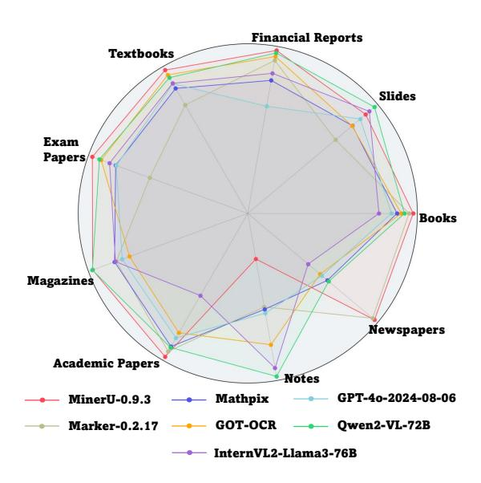
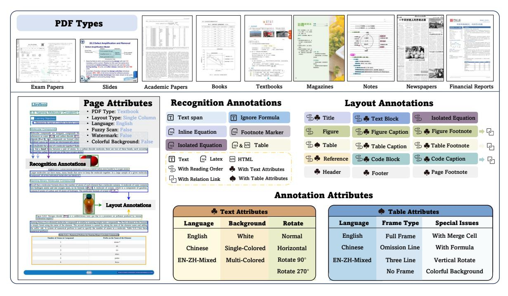
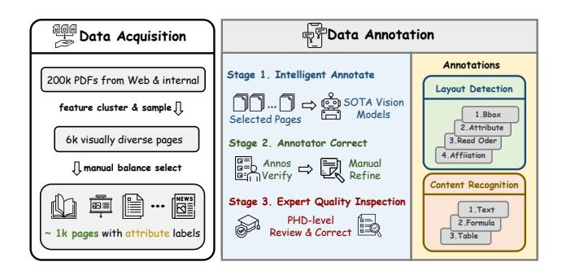
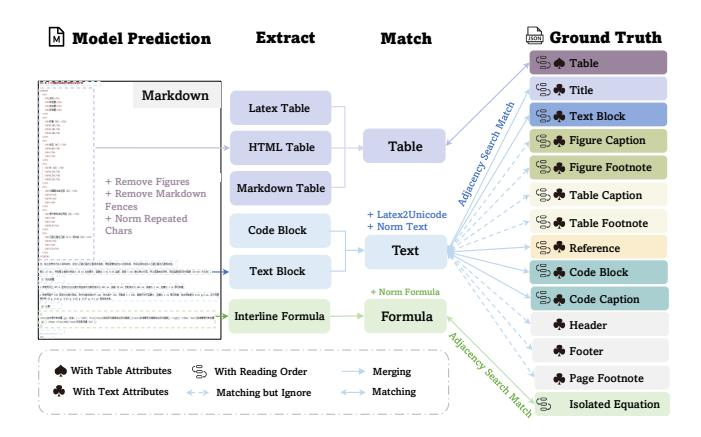

This CVPR paper is the Open Access version, provided by the Computer Vision Foundation. 
Except for this watermark, it is identical to the accepted version; 
the final published version of the proceedings is available on IEEE Xplore.

# OmniDocBench: Benchmarking Diverse PDF Document Parsing with Comprehensive Annotations

Linke Ouyang1\* Yuan Qu1\* Hongbin Zhou1\* Jiawei Zhu1\* Rui Zhang1\* Qunshu Lin2\* Bin Wang1\*† Zhiyuan Zhao1 Man Jiang1 Xiaomeng Zhao1 Jin Shi1 Fan Wu1 Pei Chu1 Minghao Liu3 Zhenxiang Li1 Chao Xu1 Bo Zhang1 Botian Shi1 Zhongying Tu1 Conghui He1‡

1Shanghai AI Laboratory 2Abaka AI 32077AI

Abstract

Document content extraction is a critical task in computer vision, underpinning the data needs of large language models (LLMs) and retrieval-augmented generation (RAG) systems. Despite recent progress, current document parsing methods have not been fairly and comprehensively evaluated due to the narrow coverage of document types and the simplified, unrealistic evaluation procedures in existing benchmarks. To address these gaps, we introduce OmniDocBench, a novel benchmark featuring high-quality annotations across nine document sources, including academic papers, textbooks, and more challenging cases such as handwritten notes and densely typeset newspapers. OmniDocBench supports flexible, multi-level evaluations—ranging from an end-to-end assessment to the task-specific and attribute-based analysis—using 19 layout categories and 15 attribute labels. We conduct a thorough evaluation of both pipeline-based methods and endto-end vision-language models, revealing their strengths and weaknesses across different document types. OmniDocBench sets a new standard for the fair, diverse, and fine-grained evaluation in document parsing. Dataset and code are available at https://github.com/ opendatalab/OmniDocBench.

# 1. Introduction

As large language models  $[1, 28, 39, 44]$  increasingly rely on high-quality, knowledge-rich data, the importance of accurate document parsing has grown substantially. Document parsing, a core task in computer vision and document intelligence, aims to extract structured, machine-readable content from unstructured documents such as PDFs. This task is particularly critical for ingesting academic papers, technical reports, textbooks, and other rich textual sources

\* The authors contributed equally.

† Project lead.

‡ Corresponding author (heconghui@pjlab.org.cn).

Figure 1. Results of End-to-End Text Recognition on OmniDocBench across 9 PDF page types.

into large language models, thereby enhancing their factual accuracy and knowledge grounding [19, 42, 45, 47, 52]. Moreover, with the emergence of retrieval-augmented generation (RAG) systems [12, 22], which retrieve and generate answers conditionally with external documents, the demand for precise document understanding has further intensified.

To address this challenging task, two main paradigms have emerged: 1) Pipeline-based approaches that decompose the task into layout analysis, OCR, formula/table recognition, and reading order estimation [34, 42]; and 2) End-to-end vision-language models (VLMs) that directly output structured representations (e.g., Markdown)  $[3, 7, 8,$ 29, 45, 46, 48]. Although both approaches have demonstrated promising results, conducting a broad comparison of their effectiveness remains challenging due to the absence of a comprehensive and unified evaluation benchmark.

As shown in Table 1, for pipeline-based document parsing systems, dedicated benchmarks [10, 26, 54] have been

24838

Figure 2. Overview of OmniDocBench Data Diversity. The benchmark includes 9 diverse PDF document types. It supports rich annotation types, including layout annotations (e.g., title, table, figure) and recognition annotations (e.g., text spans, equations, tables). Each page is annotated with 6 page-level attributes (e.g., PDF type, layout type), along with fine-grained 3 text attributes (e.g., language) and 6 tables attributes (Items under "*special issues*" are treated as individual binary attributes (yes/no)), enabling detailed and robust evaluation.

developed to target specific sub-tasks. For end-to-end evaluation, works like Nougat [7] and GOT-OCR [45] provide relatively small validation sets and assess predictions using page-level metrics such as Edit Distance [21].

However, these benchmarks present several key limitations: 1) Limited document diversity: Existing datasets primarily focus on academic papers, overlooking other realworld document types such as textbooks, exams, financial reports, and newspapers; 2) Inconsistent evaluation metrics: Current benchmarks rely heavily on generic text similarity metrics (e.g., Edit Distance [21] and BLEU [33]), which fail to fairly assess the accuracy of formulas and tables in LaTeX or HTML formats that allow for diverse syntactic expressions; and 3) **Lack of fine-grained evaluation:** Most evaluations report only an overall score, lacking insights into specific weaknesses, such as element-level score (e.g., text vs. formula) or per document-type performance (e.g., magazine or notes).

To address these limitations, we introduce **Om**niDocBench, a new benchmark designed to provide a rigorous and comprehensive evaluation for document parsing models across both pipeline-based and end-to-end paradigms. In summary, our benchmark introduces the following key contributions:

• **High-quality, diverse evaluation set:** We include pages from 9 distinct document types, ranging from textbooks

to newspapers, annotated using a combination of automated tools, manual verification, and expert review.

- **Flexible, multi-dimensional evaluation:** We support comprehensive evaluation at three levels—end-to-end, task-specific, and attribute-based. End-to-end evaluation measures the overall quality of full-page parsing results. Task-specific evaluation allows users to assess individual components such as layout detection, OCR, table recognition, or formula parsing. Attribute-based evaluation provides fine-grained analysis across 9 document types, 6 page-level attributes and 9 bbox-level attributes.
- Comprehensive benchmarking of state-of-the-art methods: We systematically evaluate a suite of representative document parsing systems, including both pipeline-based tools and VLMs, providing the most comprehensive comparison and identifying performance bottlenecks across document types and content structures.

# 2. Related Work

## 2.1. Pipeline-based Document Content Extraction

Pipeline-based methods treat the document content extraction task as a collection of single modules, such as document layout detection [13, 17, 36, 53], optical character recognition [15, 23, 30, 38, 43], formula recognition [6, 27, 40, 51], and table recognition [16, 18, 23]. In

24839

| Benchmark                                                  | Document Domain | BBox           | Text | Table | Formula | Attributes | Single-Task Eval |     |    |     | End-to-End Eval |    |     |     |
|------------------------------------------------------------|--------------------|----------------|------|-------|---------|------------|------------------|-----|----|-----|-----------------|----|-----|-----|
|                                                            |                    | Annotaion Type |      |       |         |            | OCR              | DLA | TR | MFR | OCR             | TR | MFR | ROD |
| Single-Task Eval Benchmark                                 |                    |                |      |       |         |            |                  |     |    |     |                 |    |     |     |
| Robust Reading [20]                                        | 1                  | ✓              | ✓    |       |         |            | ✓                |     |    |     |                 |    |     |     |
| PubLayNet [49], DocBank [26], DocLayNet [35], M6Doc [9] | 1, 1, 5, 6      | ✓              |      |       |         |            |                  | ✓   |    |     |                 |    |     |     |
| PubTabNet [54], TableX [11] TableBank [25]              | 1, 1               | ✓              | ✓    |       |         |            |                  |     | ✓  | ✓   |                 |    |     |     |
| Im2Latex-100K [10], UniMER-Test [40]                       | 1                  |                |      |       | ✓       |            |                  |     |    | ✓   |                 |    |     |     |
| End-to-end Eval Benchmarks                                 |                    |                |      |       |         |            |                  |     |    |     |                 |    |     |     |
| Fox [29]                                                   | 2                  | ✓              | ✓    | ✓     |         |            | ✓                |     |    |     | ✓               | ✓  | ✓   |     |
| Nougat [7]                                                 | 1                  | ✓              | ✓    | ✓     |         |            |                  |     |    |     | ✓               | ✓  | ✓   |     |
| GOT OCR 2.0 [45]                                           | 2                  | ✓              | ✓    | ✓     |         |            |                  |     |    |     | ✓               | ✓  | ✓   |     |
| OmniDocBench                                               | 9                  | ✓              | ✓    | ✓     | ✓       | ✓          | ✓                | ✓   | ✓  | ✓   | ✓               | ✓  | ✓   | ✓   |

Table 1. A Comparison between OmniDocBench and existing benchmarks. BBox: Bounding boxes. Text: Text in Unicode. Table: Table in LaTeX/HTML/Markdown. Formula: Formula in LaTeX. Attributes: Page- and BBox-Level Attributes. OCR: Optical Character Recognition; *DLA*: Document Layout Analysis; *TR*: Table Recognition; *MFR*: Math Formula Recognition; *ROD*: Reading Order Detection

this sense, such methods can utilize different expert models to address each specific task. Marker [34] integrates opensource models to parse documents into structured formats such as Markdown, JSON, and HTML. To get higher accuracy, an optional LLM-enabled version can also be integrated to merge tables across pages, handle inline math, and so on. Similarly, MinerU [42] first utilizes a layout detection model to segment the document page into different regions, then applies task-specific models for corresponding regions. Finally, it outputs the complete content in Markdown format with a reading order algorithm. By leveraging lightweight models and parallelized operations, pipelinebased methods can achieve efficient parsing speeds.

## 2.2. VLM-based Document Content Extraction

Document understanding and optical character recognition  $(OCR)$  are crucial tasks for evaluating the perception capabilities of vision-language models (VLMs). By incorporating extensive OCR corpus into the pretraining stage, VLMs like GPT4o [2] and Qwen2-VL [3] have demonstrated comparable performance in document content extraction tasks. Unlike pipeline-based methods, VLMs perform document parsing in an end-to-end manner. Furthermore, without requiring specialized data fine-tuning, these models are able to deal with diverse and even unseen document types for their generalization capabilities.

To integrate the efficiency of lightweight models and the generalizability of VLMs, many works [7, 14, 29, 32, 45, 46] have focus on training specialized end-to-end expert models for document parsing. These VLM-driven models excel at comprehending both visual layouts and textual contents, balancing a trade-off between accuracy and efficiency.

## 2.3. Benchmarks for Document Content Extraction

Document content extraction requires the ability to understand document layouts and recognize various types of con-

tent. However, current benchmarks fall short of a comprehensive page-level evaluation, as they focus solely on evaluating the model's performance on module-level recognition. PubLayNet [49] and concurrent benchmarks [9, 26, 35] specialize in evaluating a model's ability to detect document page layouts. OCRBench [31] proposes five OCR-related tasks with a greater emphasis on evaluating the model's visual understanding and reasoning capabilities. Only linelevel assessments are provided for text recognition and handwritten mathematical expression recognition (HMER). Similarly, single-module benchmarks  $[20, 26, 40, 54]$  disentangle the task into different dimensions and focus narrowly on specific parts. Such paradigm overlooks the importance of structural and semantic information like the reading order and fails to evaluate the model's overall ability when processing the full-page documents as a whole.

Page-level benchmarks have been proposed alongside some recent VLM-driven expert models  $[7, 29, 45]$ . However, the robustness of these benchmarks is compromised by limitations in data size, language, document type, and annotation. For example, Nougat [7] evaluates models using only printed English documents collected from arXiv while the page-level benchmark introduced by GOT-OCR [45] consists of only 90 pages of Chinese and English documents in total. Commonly-seen document types like handwritten notes, newspapers, and exam papers are further neglected. Lacking detailed annotations, the benchmarks can only conduct naive evaluation between the full-page results of Ground Truths and predictions without special handling for different output formats and specialized metrics for different content types. The evaluation of the model performance can be severely biased due to limited document domains, unaligned output format and mismatched metrics. Therefore, there is an urgent need for a more finely annotated, diverse, and reasonable page-level document content extraction benchmark.

24840

Figure 3. Overview of the OmniDocBench dataset construction.

# 3. OmniDocBench Dataset

Constructing a diverse and comprehensive document parsing benchmark with precise annotations is a significant challenge. As illustrated in Figure 3, we have designed a systematic and professional annotation framework for OmniDocBench, encompassing data acquisition, intelligent pre-annotation, and manual refinement. This ensures that OmniDocBench possesses the following key attributes:

- Page Diversity. We sourced document pages from a variety of origins to ensure a wide range of document types.
- Comprehensive Annotation. We meticulously annotated all elements on the pages, including bounding boxes, specific contents, and various potential attributes.
- Annotation Accuracy. By integrating semi-automated annotation processes, annotator corrections, and expert quality checks, we ensure the reliability of all annotations.

The following sections detail the data acquisition process, the annotation methodology, and a statistical analysis of the final annotated dataset.

## 3.1. Data Acquisition

During the data acquisition phase, we sourced document pages from diverse origins and used clustering algorithms to initially select visually diverse pages, followed by manual annotation of page attributes to finalize the OmniDocBench pages. Specifically, we collected over 200,000 initial PDF documents from Common Crawl, Google, Baidu search engines, and internal data. Subsequently, we extracted visual features from these document pages using ResNet-50 and performed clustering using Faiss  $^{1}$ , sampling 6,000 visually diverse pages from 10 cluster centers. Finally, annotators provided page-level attribute annotations, including page type, layout type, and language type, and further balanced the selection to 981 samples for the final dataset. The OmniDocBench dataset includes pages from nine distinct types, multiple layout categories, and various attribute annotations, covering a wide range of real-world scenarios.

1https://github.com/facebookresearch/faiss

## 3.2. Data Annotation

To ensure the comprehensiveness of OmniDocBench's annotations, we conducted detailed annotations for layout detection and content recognition.

### 3.2.1. Annotation Types

Layout Detection Annotations: Unlike typical layout detection tasks, OmniDocBench includes four comprehensive types of annotations: (1) Layout Bounding Box Annotations: Positioanl information for 19 distinct region categories such as titles, text paragraphs, tables, and images. (2) Layout Attribute Annotations: Detailed attribute annotations for detected boxes, including 3 text box attribute categories, 6 table attribute categories, 9 bbox-level attribute labels in total. (3) Reading Order Annotations: Annotating the reading sequence of detected boxes. (4) Affiliation Annotations: For images, tables, formulas, and code blocks, we annotate captions and titles to distinguish them from main text. Similarly, for cross-page paragraphs, we annotate affiliation relationships.

**Content Recognition Annotations:** Based on the content type within each region, we conduct the following three types of annotations: (1) Text Annotations: Pure text annotations for titles, text paragraphs, and other plain text content. (2) Formula Annotations: LaTeX format annotations for inline formulas, display formulas, and subscripts. (3) Table Annotations: Providing both HTML and LaTeX annotations for table data.

### 3.2.2. Annotation Process

For these annotation tasks on diverse pages, we design a standardized process to ensure quality and efficiency, comprising intelligent automatic annotation, annotator correction, and expert quality inspection.

**Automatic Annotation**. Manually annotating entire documents is time-consuming and costly. To enhance efficiency, we employ state-of-the-art detection and recognition models for pre-annotation of layout detection and content recognition. Specifically, we use fine-tuned LayoutLMv3 [\[17\]](#page-1-1) for layout detection annotations and PaddleOCR [\[23\]](#page-1-1), UniMERNet [\[40\]](#page-1-1), and GPT-4o [\[2\]](#page-1-1) for text, formula, and table annotations, respectively.**Annotator Correction**. After the layout detection phase, annotators refine the detection boxes and enhance annotations with reading order and affiliation details. Each character is verified to ensure accuracy in content recognition. For complex annotations of tables and formulas, requiring LaTeX and HTML formats, annotators use tools like Tables Generator  $^{2}$  and latexlive  $^{3}$  for verification and correction.

**Expert Quality Inspection.** Despite thorough annotator corrections, the complexity of formulas and tables may re-

2 https://www.tablesgenerator.com/

3https://www.latexlive.com/

24841

sult in residual issues. To address these, we use CDM's rendering techniques [41] to identify unrenderable elements. These elements are then reviewed and corrected by three researchers to ensure accuracy in the final annotations.

## 3.3. Dataset Statistics

Page Diversity. OmniDocBench comprises a total of 981 PDF pages across 9 distinct types. Each page is annotated with global attributes, including text language, column layout type, and indicators for blurred scans, watermarks, and colored backgrounds.

Annotation Diversity: OmniDocBench contains over  $100,000$  annotations for page detection and recognition: (1) More than 20,000 block-level annotations across 15 categories, including over 15,979 text paragraphs, 989 image boxes, 428 table boxes, and so on. All document components except headers, footers, and page notes are labeled with reading order information, totaling over  $16,000$  annotations.  $(2)$  The dataset also includes more than  $70,000$ span-level annotations across 4 categories, with  $4,009$  inline formulas and 357 footnote markers represented in LaTeX format, while the remaining annotations are in text format. Annotation Attribute Diversity: (1) Text Attributes: All block-level annotations, except for tables and images, include text attribute tags. In addition to standard Chinese and English text, there are over 2,000 blocks with complex backgrounds and 493 with rotated text. (2) *Table Attributes:* In addition to standard Chinese and English tables, there are 142 tables with complex backgrounds, 81 containing formulas, 150 with merged cells, and 7 vertical tables.

# 4. OmniDocBench Evaluation Methodology

To provide a fair and comprehensive evaluation for various models, we proposed an end-to-end evaluation pipeline consisting of several modules, including extraction, matching algorithm, and metric calculation, as shown in Figure 4. It ensures that OmniDocBench automatically performs unified evaluation on document parsing, thereby producing reliable and effective evaluation results.

## 4.1. Extraction

Preprocessing. The model-generated markdown text should be preprocessed, which includes removing images, eliminating markdown tags at the beginning of the document, and standardizing the number of repeated characters. **Elements Extraction.** Extraction is primarily carried out using regular expression matching. To ensure that the extraction of elements does not interfere with each other, it is necessary to follow a specific order. The extraction sequence is as follows: LaTeX tables, HTML tables, display formulas, markdown tables (which are then converted into HTML format), and code blocks.

Figure 4. OmniDocBench Evaluation Pipeline.

Pure Text Extraction. After extracting special components, the remaining content is considered pure text. Paragraphs are separated by double line breaks, allowing them to participate in subsequent matching processes, thus aligning with reading order annotation units in the GTs. If no double line break exists, single line breaks are used for paragraph separation. Additionally, previously extracted code blocks are merged into the text category for processing.

Inline Formula Format Converting. We standardized inline formulas within paragraphs to Unicode format. This was necessary because different models produce inconsistent outputs for inline formulas. For formulas originally written in Unicode, it is hard to extract them using regular expressions. Therefore, to ensure a fair comparison, we do not extract inline formulas for separate evaluation. Instead, we include them in their Unicode format alongside the text paragraphs for evaluation.

**Reading Order Extraction.** Upon completion of the extraction, the start and end positions of the extracted content in the original markdown are recorded for subsequent reading order calculation.

## 4.2. Matching Algorithm

Adjacency Search Match. To avoid the impact of paragraph splitting on the final results, we proposed Adjacency Search Match, that merges and splits paragraphs in both GTs and Preds to achieve the best possible match. The specific strategy involves: i) Calculate a metrix of Normalized Edit Distance between GTs and Preds. The Pred and GT pairs whose similarity exceeds a specific threshold are considered as successful match. ii) For the rest, we apply fuzzy matching to determine whether one string is a subset of another string. If so, we further apply the merging algorithm which would try to merge adjacent paragraph. This process would continue to merge more paragraph until the Normalized Edit Distance starts to decrease. After this process, the best match will be found for GTs and Preds.

4https://mathpix.com/

24842

| Method Type    | Methods           | $Text^{Edit} \downarrow$ |              | $Formula^{Edit} \downarrow$ |              | $Formula^{CDM} \uparrow$ |             | $Table^{TEDS} \uparrow$ |             | $Table^{Edit} \downarrow$ |             | $Read Order^{Edit} \downarrow$ |              | $Overall^{Edit} \downarrow$ |              |
|----------------|-------------------|--------------------------|--------------|-----------------------------|--------------|--------------------------|-------------|-------------------------|-------------|---------------------------|-------------|--------------------------------|--------------|-----------------------------|--------------|
|                |                   | EN                       | ZH           | EN                          | ZH           | EN                       | ZH          | EN                      | ZH          | EN                        | ZH          | EN                             | ZH           | EN                          | ZH           |
| Pipeline Tools | MinerU [42]       | <b>0.061</b>             | <b>0.215</b> | <b>0.278</b>                | 0.577        | 57.3                     | 42.9        | <b>78.6</b>             | 62.1        | <b>0.18</b>               | 0.344       | <b>0.079</b>                   | 0.292        | <b>0.15</b>                 | 0.357        |
|                | Marker [34]       | 0.08                     | 0.315        | 0.53                        | 0.883        | 17.6                     | 11.7        | 67.6                    | 49.2        | 0.619                     | 0.685       | 0.114                          | 0.34         | 0.336                       | 0.556        |
|                | Mathpix 4         | 0.105                    | 0.384        | 0.306                       | <b>0.454</b> | 62.7                     | <b>62.1</b> | 77.0                    | <b>67.1</b> | 0.243                     | <b>0.32</b> | 0.108                          | 0.304        | 0.191                       | 0.365        |
| Expert VLMs    | GOT-OCR [45]      | 0.189                    | 0.315        | 0.360                       | 0.528        | <b>74.3</b>              | 45.3        | 53.2                    | 47.2        | 0.459                     | 0.52        | 0.141                          | 0.28         | 0.287                       | 0.411        |
|                | Nougat [7]        | 0.365                    | 0.998        | 0.488                       | 0.941        | 15.1                     | 16.8        | 39.9                    | 0.0         | 0.572                     | 1.000       | 0.382                          | 0.954        | 0.452                       | 0.973        |
| General VLMs   | GPT4o [2]         | 0.144                    | 0.409        | 0.425                       | 0.606        | 72.8                     | 42.8        | 72.0                    | 62.9        | 0.234                     | 0.329       | 0.128                          | 0.251        | 0.233                       | 0.399        |
|                | Qwen2-VL-72B [44] | 0.096                    | 0.218        | 0.404                       | 0.487        | <b>82.2</b>              | 61.2        | 76.8                    | 76.4        | 0.387                     | 0.408       | 0.119                          | <b>0.193</b> | 0.252                       | <b>0.327</b> |
|                | InternVL2-76B [8] | 0.353                    | 0.290        | 0.543                       | 0.701        | 67.4                     | 44.1        | 63.0                    | 60.2        | 0.547                     | 0.555       | 0.317                          | 0.228        | 0.44                        | 0.443        |

Table 2. Comprehensive evaluation of document parsing algorithms on OmniDocBench: performance metrics for text, formula, table, and reading order extraction, with overall scores derived from ground truth comparisons.

| Model Type     | Models            | Book         | Slides       | Financial Report | Textbook     | Exam Paper | Magazine     | Academic Papers | Notes        | Newspaper    | Overall      |
|----------------|-------------------|--------------|--------------|---------------------|--------------|---------------|--------------|--------------------|--------------|--------------|--------------|
| Pipeline Tools | MinerU [42]       | <b>0.055</b> | 0.124        | <b>0.033</b>        | <b>0.102</b> | <b>0.159</b>  | <b>0.072</b> | <b>0.025</b>       | 0.984        | <b>0.171</b> | <b>0.206</b> |
| Pipeline Tools | Marker [34]       | 0.074        | 0.34         | 0.089               | 0.319        | 0.452         | 0.153        | 0.059              | 0.651        | 0.192        | 0.274        |
| Pipeline Tools | Mathpix4          | 0.131        | 0.22         | 0.202               | 0.216        | 0.278         | 0.147        | 0.091              | 0.634        | 0.69         | 0.3          |
| Expert VLMs    | GOT-OCR [45]      | 0.111        | 0.222        | 0.067               | <b>0.132</b> | 0.204         | 0.198        | 0.179              | 0.388        | 0.771        | 0.267        |
| Expert VLMs    | Nougat [7]        | 0.734        | 0.958        | 1.000               | 0.820        | 0.930         | 0.83         | 0.214              | 0.991        | 0.871        | 0.806        |
| General VLMs   | GPT4o [2]         | 0.157        | 0.163        | 0.348               | 0.187        | 0.281         | 0.173        | 0.146              | 0.607        | 0.751        | 0.316        |
| General VLMs   | Qwen2-VL-72B [44] | 0.096        | <b>0.061</b> | <b>0.047</b>        | 0.149        | 0.195         | <b>0.071</b> | 0.085              | <b>0.168</b> | 0.676        | <b>0.179</b> |
| General VLMs   | InternVL2-76B [8] | 0.216        | 0.098        | 0.162               | 0.184        | 0.247         | 0.150        | 0.419              | 0.226        | 0.903        | 0.3          |

Table 3. End-to-end text recognition performance on OmniDocBench: evaluation using edit distance across 9 PDF page types.

| Models            | Fuzzy             | Water              | Color             | None                |
|-------------------|-------------------|--------------------|-------------------|---------------------|
| MinerU [42]       | 0.15/0.048        | <b>0.151/0.031</b> | 0.107/0.052       | 0.079/0.035         |
| Marker [34]       | 0.333/0.092       | 0.484/0.126        | 0.319/0.127       | <b>0.062</b> /0.125 |
| Mathpix 4         | 0.294/0.064       | 0.290/0.059        | 0.216/0.09        | 0.135/0.043         |
| GOT-OCR [45]      | 0.175/0.05        | 0.190/0.056        | 0.186/0.097       | 0.177/0.081         |
| Nougat [7]        | 0.934/0.051       | 0.915/0.071        | 0.873/0.096       | 0.615/0.208         |
| GPT4o [2]         | 0.263/0.078       | 0.195/0.057        | 0.184/0.078       | 0.186/0.072         |
| Qwen2-VL-72B [44] | <b>0.082/0.01</b> | 0.172/0.078        | <b>0.104/0.05</b> | 0.084/0.042         |
| InternVL2-76B [8] | 0.120/0.013       | 0.197/0.042        | 0.155/0.059       | 0.261/0.082         |

Table 4. End-to-end text recognition on OmniDocBench: evaluation under various page attributes using the edit distance metric. The value is **Mean/Variance** of scores in the attribute group. Columns represent: Fuzzy (Fuzzy scan), Water (Watermark), Color (Colorful background). None (No special issue)

| Models            | Single      | Double      | Three       | Complex     |
|-------------------|-------------|-------------|-------------|-------------|
| MinerU [42]       | 0.311/0.187 | 0.101/0.013 | 0.117/0.046 | 0.385/0.057 |
| Marker [34]       | 0.299/0.143 | 0.299/0.299 | 0.149/0.063 | 0.363/0.086 |
| Mathpix4          | 0.207/0.123 | 0.188/0.07  | 0.225/0.029 | 0.452/0.177 |
| GOT-OCR [45]      | 0.163/0.106 | 0.145/0.059 | 0.257/0.072 | 0.468/0.185 |
| Nougat [7]        | 0.852/0.084 | 0.601/0.224 | 0.662/0.093 | 0.873/0.09  |
| GPT4o [2]         | 0.109/0.112 | 0.204/0.076 | 0.254/0.046 | 0.426/0.188 |
| Qwen2-VL-72B [44] | 0.066/0.048 | 0.145/0.049 | 0.204/0.055 | 0.394/0.203 |
| InternVL2-76B [8] | 0.082/0.052 | 0.312/0.069 | 0.682/0.098 | 0.444/0.174 |

Table 5. End-to-end reading order evaluation on OmniDocBench: results across different column layout types using Normalized Edit Distance. The value is Mean/Variance of scores in the attribute group.

Ignore Handling. We implement an ignore logic for certain components in PDF page content, meaning they participate in matching but are excluded from metric calculations. This is mainly because of inconsistent output standards among models, which should not affect the validation results. For fairness, we ignore: (1) Headers, footers, page numbers, and page footnotes, which are handled inconsistently by different models. (2) Captions for figures, tables, and footnotes often have uncertain placements, thus complicating the reading order. Additionally, some models embed table captions in HTML or LaTeX tables, while others treat them as plain text.

## 4.3. Metric Calculation

**Pure Text.** We calculate Normalized Edit Distance [21], averaging these metrics at the sample level to obtain the final scores.

Tables. All tables are converted to HTML format before calculating the Tree-Edit-Distance-based Similarity (TEDS) [54] metric and Normalized Edit Distance.

**Formulas.** Formulas are currently evaluated using the Character Detection Matching (CDM) metric [41], Normalized Edit Distance, and BLEU [33].

Reading Order. Reading order is evaluated using the Normalized Edit Distance as metric. It only involves text com-

5https://github.com/tesseract-ocr/tesseract

6https://github.com/VikParuchuri/surya

7https://github.com/lukas-blecher/LaTeX-OCR

24843

| Model                | Backbone  | Params | Book  | Slides | Research Report | Textbook | Exam Paper | Magazine | Academic Literature | Notes | Newspaper | Average |
|----------------------|-----------|--------|-------|--------|--------------------|----------|---------------|----------|------------------------|-------|-----------|---------|
| DiT-L [24]           | ViT-L     | 361.6M | 43.44 | 13.72  | 45.85              | 15.45    | 3.40          | 29.23    | 66.13                  | 0.21  | 23.65     | 26.90   |
| LayoutLMv3 [17]      | RoBERTa-B | 138.4M | 42.12 | 13.63  | 43.22              | 21.00    | 5.48          | 31.81    | 64.66                  | 0.80  | 30.84     | 28.84   |
| DocLayout-YOLO [53]  | v10m      | 19.6M  | 43.71 | 48.71  | 72.83              | 42.67    | 35.40         | 51.44    | 64.64                  | 9.54  | 57.54     | 47.38   |
| SwinDocSegmenter [4] | Swin-L    | 223M   | 42.91 | 28.20  | 47.29              | 32.44    | 20.81         | 52.35    | 48.54                  | 12.38 | 38.06     | 35.89   |
| GraphKD [5]          | R101      | 44.5M  | 39.03 | 16.18  | 39.92              | 22.82    | 14.31         | 37.61    | 44.43                  | 5.71  | 23.86     | 27.10   |
| DOCX-Chain [50]      | -         | -      | 30.86 | 11.71  | 39.62              | 19.23    | 10.67         | 23.00    | 41.60                  | 1.80  | 16.96     | 21.27   |

Table 6. Component-level layout detection evaluation on OmniDocBench layout subset: mAP results by PDF page type.

| Model Type       | Model             | Language |      |       | Table Frame Type |          |       |      | Special Situation |              |               |             | Overall |
|------------------|-------------------|----------|------|-------|------------------|----------|-------|------|-------------------|--------------|---------------|-------------|---------|
|                  |                   | EN       | ZH   | Mixed | Full             | Omission | Three | Zero | Merge Cell(+/-)   | Formula(+/-) | Colorful(+/-) | Rotate(+/-) |         |
| OCR-based Models | PaddleOCR[23]     | 76.8     | 71.8 | 80.1  | 67.9             | 74.3     | 81.1  | 74.5 | 70.6/75.2         | 71.3/74.1    | 72.7/74.0     | 23.3/74.6   | 73.6    |
|                  | RapidTable[37]    | 80.0     | 83.2 | 91.2  | 83.0             | 79.7     | 83.4  | 78.4 | 77.1/85.4         | 76.7/83.9    | 77.6/84.9     | 25.2/83.7   | 82.5    |
| Expert VLMs      | StructEqTable[55] | 72.8     | 75.9 | 83.4  | 72.9             | 76.2     | 76.9  | 88.0 | 64.5/81.0         | 69.2/76.6    | 72.8/76.4     | 30.5/76.2   | 75.8    |
|                  | GOT-OCR [45]      | 72.2     | 75.5 | 85.4  | 73.1             | 72.7     | 78.2  | 75.7 | 65.0/80.2         | 64.3/77.3    | 70.8/76.9     | 8.5/76.3    | 74.9    |
| General VLMs     | Qwen2-VL-7B [44]  | 70.2     | 70.7 | 82.4  | 70.2             | 62.8     | 74.5  | 80.3 | 60.8/76.5         | 63.8/72.6    | 71.4/70.8     | 20.0/72.1   | 71.0    |
|                  | InternVL2-8B [8]  | 70.9     | 71.5 | 77.4  | 69.5             | 69.2     | 74.8  | 75.8 | 58.7/78.4         | 62.4/73.6    | 68.2/73.1     | 20.4/72.6   | 71.5    |

Table 7. Component-level Table Recognition evaluation on OmniDocBench table subset. (+/-) means with/without special situation.

ponents, with tables, images, and ignored components excluded from the final reading order calculation.

# 5. Benchmarks

Based on the distinct characteristics of these algorithms, we categorize document content extraction methods into three main classes:

- **Pipeline Tools:** These methods integrate layout detection and various content recognition tasks (such as OCR, table recognition, and formula recognition) into a document parsing pipeline for content extraction. Prominent examples include MinerU [42] ( $v0.9.3$ ), Marker [34] ( $v1.2.3$ ), and Mathpi $x^4$ .
- Expert VLMs: These are large multimodal models specifically trained for document parsing tasks. Representative models include GOT-OCR2.0 [45] and Nougat [7].
- General VLMs: These are general-purpose large multimodal models inherently capable of document parsing. Leading models in this category include GPT-40 [2], Qwen2-VL-72B [44], and InternVL2-76B [8].

## 5.1. End-to-End Evaluation Results

Overall Evaluation Results. As illustrated in Table 2, pipeline tools such as MinerU and Mathpix, demonstrate superior performance across sub-tasks like text recognition, formula recognition, and table recognition. Moreover, the general Vision Language Models (VLMs), Qwen2-VL, and GPT40, also exhibit competitive performance. Almost all algorithms score higher on English than on Chinese pages. **Performance Across Diverse Page Types.** To gain deeper insights into model performance on diverse document types,

we evaluated text recognition tasks across different page types. Intriguingly, as shown in Table 3, pipeline tools perform well for commonly used data, such as academic papers and financial reports. Meanwhile, for more specialized data, such as slides and handwritten notes, general VLMs demonstrate stronger generalization. Notably, most VLMs fail to recognize when dealing with the Newspapers, while pipeline tools achieve significantly better performance.

Performance on Pages with Visual Degradations. In Table 4, we further analyze performance on pages containing common document-specific challenges, including fuzzy scans, watermarks, and colorful backgrounds. VLMs like InternVL2 and Qwen2-VL exhibit higher robustness in these scenarios despite visual noise. Among pipeline tools, MinerU remains competitive due to its strong layout segmentation and preprocessing capabilities.

**Performance on Different Layout Types.** Page layout is a critical factor in document understanding, especially for tasks involving reading order. OmniDocBench annotates layout attributes such as single-column, multi-column, and complex custom formats. Across all models, we observe a clear drop in accuracy on multi-column and complex layouts. MinerU shows the most consistent reading order prediction, though its performance dips on handwritten singlecolumn pages due to recognition noise.

Discussion on End-to-End Results. 1) While general VLMs often lag behind specialized pipelines and expert models on standard documents (e.g., academic papers), they generalize better to unconventional formats (e.g., notes) and perform more robustly under degraded conditions (e.g., fuzzy scans). This is largely due to their broader training data, enabling better handling of long-tail scenarios compared to models trained on narrow domains. 2) VLMs, how-

24844

| Model Type                | Model                | Language     |              |              | Text background |              |              | Text Rotate  |              |              |              |
|---------------------------|----------------------|--------------|--------------|--------------|-----------------|--------------|--------------|--------------|--------------|--------------|--------------|
|                           |                      | EN           | ZH           | Mixed        | White           | Single       | Multi        | Normal       | Rotate90     | Rotate270    | Horizontal   |
| Expert Vision Models   | PaddleOCR [23]       | 0.071        | <b>0.055</b> | <b>0.118</b> | <b>0.060</b>    | <b>0.038</b> | <b>0.085</b> | <b>0.060</b> | <b>0.015</b> | 0.285        | <b>0.021</b> |
|                           | Tesseract OCR $^{5}$ | 0.179        | 0.553        | 0.553        | 0.453           | 0.463        | 0.394        | 0.448        | 0.369        | 0.979        | 0.982        |
|                           | Surya $^{6}$         | 0.057        | 0.123        | 0.164        | 0.093           | 0.186        | 0.235        | 0.104        | 0.634        | 0.767        | 0.255        |
|                           | GOT-OCR [45]         | 0.041        | 0.112        | 0.135        | 0.092           | 0.052        | 0.155        | 0.091        | 0.562        | 0.966        | 0.097        |
|                           | Mathpix $^{4}$       | 0.033        | 0.240        | 0.261        | 0.185           | 0.121        | 0.166        | 0.180        | 0.038        | <b>0.185</b> | 0.638        |
| Vision Language Models | Qwen2-VL-72B [44]    | 0.072        | 0.274        | 0.286        | 0.234           | 0.155        | 0.148        | 0.223        | 0.273        | 0.721        | 0.067        |
|                           | Intern VL2-76B [8]   | 0.074        | 0.155        | 0.242        | 0.113           | 0.352        | 0.269        | 0.132        | 0.610        | 0.907        | 0.595        |
|                           | GPT4o [2]            | <b>0.020</b> | 0.224        | 0.125        | 0.167           | 0.140        | 0.220        | 0.168        | 0.115        | 0.718        | 0.132        |

Table 8. Component-level evaluation on OmniDocBench OCR subset: results grouped by text attributes using the edit distance metric.

| Models             | CDM         | ExpRate@CDM | BLEU         | Norm Edit    |
|--------------------|-------------|-------------|--------------|--------------|
| GOT-OCR [45]       | 74.1        | 28.0        | 55.07        | 0.290        |
| Mathpix $4$        | 86.6        | 2.8         | <b>66.56</b> | 0.322        |
| Pix2Tex $7$        | 73.9        | 39.5        | 46.00        | 0.337        |
| UniMERNet-B $[40]$ | 85.0        | 60.2        | 60.84        | <b>0.238</b> |
| GPT4o [2]          | <b>86.8</b> | <b>65.5</b> | 45.17        | 0.282        |
| InternVL2-76B [8]  | 67.4        | 54.5        | 47.63        | 0.308        |
| Qwen2-VL-72B [44]  | 83.8        | 55.4        | 53.71        | 0.285        |

Table 9. Component-level formula recognition evaluation on OmniDocBench formula subset.

ever, struggle with high-density documents like newspapers due to limitations in input resolution and token length. In contrast, pipeline tools leverage layout-based segmentation to process components individually, maintaining accuracy in complex layouts. Enhancing VLMs with layout-aware designs and domain-specific fine-tuning offers a promising path forward. OmniDocBench facilitates this by providing detailed annotations for layout, text, formulas, and tables, enabling comprehensive benchmarking and modular tool development for diverse document parsing tasks.

## **5.2. Single Task Evaluation Results**

**Layout Detection Results.** Layout detection is the first step in document parsing using pipeline tools. A robust layout detection algorithm should perform well across a variety of document types. Table 6 presents an evaluation of leading layout detection models. The DocLayout-YOLO method, which is pre-trained on diverse synthetic document data, significantly outperforms other approaches. This superiority is a key factor in MinerU's integration of DocLayout-YOLO, contributing to its outstanding overall performance. Other methods perform well on books and academic literature but struggle with more diverse formats due to limited training data.

Table Recognition Results. In Table 7, We evaluate table recognition models across three dimensions on our OmniDocBench table subset: language

 diversity, table frame types, and special situations. Among all models, OCRbased models demonstrate superior overall performance, with RapidTable achieving the highest scores in language diversity and maintaining stable performance across different frame types. Expert VLMs show competitive results in specific scenarios, with StructEqTable [55] excelling in noframe tables and showing better rotation robustness. General VLMs (Qwen2-VL-7B and InternVL2-8B) exhibit relatively lower but consistent performance, suggesting that while general-purpose VLMs have made progress in table understanding, they still lag behind specialized solutions.

Text Recognition Results. Table 8 compares OCR tools across languages, backgrounds, and rotations using Edit Distance. PaddleOCR outperforms all competitors, followed by GOT-OCR and Mathpix. General VLMs struggle to handle text rotation or mixed-language scenarios.

**Formula Recognition Results.** Table 9 presents results on formula parsing, using CDM, BLEU, and normalized Edit Distance. GPT-40, Mathpix, and UniMERNet achieve results of 86.8%, 86.6%, and 85.0%, respectively. Notably, GPT-40 excels with a recall rate of 65.5% under strict conditions requiring perfect character accuracy. Although Mathpix shows high character-level precision, it occasionally omits punctuation, such as commas, leading to a lower overall correctness rate. Nonetheless, all three models are strong candidates for formula recognition tasks.

# 6. Conclusion

This paper addresses the lack of diverse and realistic benchmarks in document parsing research by introducing OmniDocBench, a dataset featuring a variety of page types with comprehensive annotations, along with a flexible and reliable evaluation framework. OmniDocBench enables systematic and fair assessments of document parsing methods, providing crucial insights for advancing the field. Its task-specific and attribute-level evaluations facilitate targeted model optimization, promoting more robust and effective parsing solutions.

# 7.Acknowledgments

This project was supported by National Key R&D Program of China (NO.2022ZD0160102) and Shanghai Artificial Intelligence Laboratory.

24845

 References

- [1] Josh Achiam, Steven Adler, Sandhini Agarwal, Lama Ahmad, Ilge Akkaya, Florencia Leoni Aleman, Diogo Almeida, Janko Altenschmidt, Sam Altman, Shyamal Anadkat, et al. Gpt-4 technical report. arXiv:2303.08774, 2023. 1
- [2] Open AI. Hello gpt 40, 2024. Accessed July 24, 2024. 3, 4, 6, 7, 8
- [3] Jinze Bai, Shuai Bai, Shusheng Yang, Shijie Wang, Sinan Tan, Peng Wang, Junyang Lin, Chang Zhou, and Jingren Zhou. Qwen-vl: A versatile vision-language model for understanding, localization, text reading, and beyond. arXiv:2308.12966, 2024. 1, 3
- [4] Ayan Banerjee, Sanket Biswas, Josep Lladós, and Umapada Pal. Swindocsegmenter: An end-to-end unified domain adaptive transformer for document instance segmentation. In ICDAR, 2023. 7
- [5] Ayan Banerjee, Sanket Biswas, Josep Lladós, and Umapada Pal. Graphkd: Exploring knowledge distillation towards document object detection with structured graph creation. In IC-DAR, 2024. 7
- [6] Lukas Blecher. pix2tex latex ocr. https://github. <pre>com/lukas-blecher/LaTeX-OCR, 2022. Accessed:</pre> 2024-2-29. 2
- [7] Lukas Blecher, Guillem Cucurull, Thomas Scialom, and Robert Stojnic. Nougat: Neural optical understanding for academic documents. arXiv:2308.13418, 2024. 1, 2, 3, 6, 7
- [8] Zhe Chen, Jiannan Wu, Wenhai Wang, Weijie Su, Guo Chen, Sen Xing, Muyan Zhong, Qinglong Zhang, Xizhou Zhu, Lewei Lu, Bin Li, Ping Luo, Tong Lu, Yu Qiao, and Jifeng Dai. Internyl: Scaling up vision foundation models and aligning for generic visual-linguistic tasks. In *Proceedings* of the IEEE/CVF Conference on Computer Vision and Pattern Recognition, pages 24185–24198, 2024. 1, 6, 7, 8
- [9] Hiuyi Cheng, Peirong Zhang, Sihang Wu, Jiaxin Zhang, Qiyuan Zhu, Zecheng Xie, Jing Li, Kai Ding, and Lianwen Jin. M6doc: A large-scale multi-format, multi-type, multilayout, multi-language, multi-annotation category dataset for modern document layout analysis. In Proceedings of the IEEE/CVF Conference on Computer Vision and Pattern Recognition, pages 15138-15147, 2023. 3
- [10] Yuntian Deng, Anssi Kanervisto, Jeffrey Ling, and Alexander M Rush. Image-to-markup generation with coarse-tofine attention. In International Conference on Machine Learning, pages 980-989. PMLR, 2017. 1, 3
- [11] Harsh Desai, Pratik Kayal, and Mayank Singh. Tablex: a benchmark dataset for structure and content information extraction from scientific tables. In Document Analysis and Recognition–ICDAR 2021: 16th International Conference, pages 554-569, 2021. 3
- [12] Yunfan Gao, Yun Xiong, Xinyu Gao, Kangxiang Jia, Jinliu Pan, Yuxi Bi, Yi Dai, Jiawei Sun, Meng Wang, and Haofen Wang. Retrieval-augmented generation for large language models: A survey. arXiv:2312.10997, 2023. 1
- [13] Jiuxiang Gu, Jason Kuen, Vlad I Morariu, Handong Zhao, Rajiv Jain, Nikolaos Barmpalios, Ani Nenkova, and Tong Sun. Unidoc: Unified pretraining framework for document

understanding. Advances in Neural Information Processing Systems, 34:39-50, 2021. 2

- [14] Anwen Hu, Haiyang Xu, Liang Zhang, Jiabo Ye, Ming Yan, Ji Zhang, Qin Jin, Fei Huang, and Jingren Zhou. mplug-docowl2: High-resolution compressing for ocrfree multi-page document understanding. arXiv preprint arXiv:2409.03420, 2024. 3
- [15] Mingxin Huang, Yuliang Liu, Zhenghao Peng, Chongyu Liu, Dahua Lin, Shenggao Zhu, Nicholas Yuan, Kai Ding, and Lianwen Jin. Swintextspotter: Scene text spotting via better synergy between text detection and text recognition. In proceedings of the IEEE/CVF conference on computer vision and pattern recognition, pages 4593–4603, 2022. 2
- [16] Xin Huang, Ashish Khetan, Milan Cvitkovic, and Zohar Karnin. Tabtransformer: Tabular data modeling using contextual embeddings. arxiv 2020. arXiv preprint arXiv:2012.06678, 2012. 2
- [17] Yupan Huang, Tengchao Lv, Lei Cui, Yutong Lu, and Furu Wei. Layoutlmv3: Pre-training for document ai with unified text and image masking, 2022. 2, 4, 7
- [18] Yongshuai Huang, Ning Lu, Dapeng Chen, Yibo Li, Zecheng Xie, Shenggao Zhu, Liangcai Gao, and Wei Peng. Improving table structure recognition with visual-alignment sequential coordinate modeling. In Proceedings of the IEEE/CVF Conference on Computer Vision and Pattern Recognition, pages 11134–11143, 2023. 2
- [19] Wonseok Hwang, Jinyeong Yim, Seunghyun Park, Sohee Yang, and Minjoon Seo. Spatial dependency parsing for semi-structured document information extraction. In Findings of the Association for Computational Linguistics: ACL-IJCNLP, pages 330-343. Association for Computational Linguistics (ACL), 2021. 1
- [20] Dimosthenis Karatzas, Lluis Gomez-Bigorda, Anguelos Nicolaou, Suman Ghosh, Andrew Bagdanov, Masakazu Iwamura, Jiri Matas, Lukas Neumann, Vijay Ramaseshan Chandrasekhar, Shijian Lu, Faisal Shafait, Seiichi Uchida, and Ernest Valveny. Icdar 2015 competition on robust reading. In 2015 13th International Conference on Document Analysis and Recognition, pages 1156–1160, 2015. 3
- [21] Vladimir I Levenshtein et al. Binary codes capable of correcting deletions, insertions, and reversals. In Doklady *Physics*, pages 707–710. Soviet Union, 1966. 2, 6
- [22] Patrick Lewis, Ethan Perez, Aleksandra Piktus, Fabio Petroni, Vladimir Karpukhin, Naman Goyal, Heinrich Küttler, Mike Lewis, Wen-tau Yih, Tim Rocktäschel, et al. Retrieval-augmented generation for knowledge-intensive nlp tasks. Advances in Neural Information Processing Systems, 33:9459-9474, 2020. 1
- [23] Chenxia Li, Weiwei Liu, Ruoyu Guo, Xiaoting Yin, Kaitao Jiang, Yongkun Du, Yuning Du, Lingfeng Zhu, Baohua Lai, Xiaoguang Hu, Dianhai Yu, and Yanjun Ma. Pp-ocrv3: More attempts for the improvement of ultra lightweight ocr system, 2022. 2, 4, 7, 8
- [24] Junlong Li, Yiheng Xu, Tengchao Lv, Lei Cui, Cha Zhang, and Furu Wei. Dit: Self-supervised pre-training for document image transformer. In ACMMM, 2022. 7
- [25] Minghao Li, Lei Cui, Shaohan Huang, Furu Wei, Ming Zhou, and Zhoujun Li. Tablebank: Table benchmark for

24846

image-based table detection and recognition. In *Proceedings* of the Twelfth Language Resources and Evaluation Conference, pages 1918-1925, 2020. 3

- [26] Minghao Li, Yiheng Xu, Lei Cui, Shaohan Huang, Furu Wei, Zhoujun Li, and Ming Zhou. Docbank: A benchmark dataset for document layout analysis. arXiv:2006.01038, 2020. 1, 3
- [27] Zhe Li, Lianwen Jin, Songxuan Lai, and Yecheng Zhu. Improving attention-based handwritten mathematical expression recognition with scale augmentation and drop attention. In 2020 17th International Conference on Frontiers in Handwriting Recognition (ICFHR), pages 175-180. IEEE, 2020.
- [28] Aixin Liu, Bei Feng, Bing Xue, Bingxuan Wang, Bochao Wu, Chengda Lu, Chenggang Zhao, Chengqi Deng, Chenyu Zhang, Chong Ruan, et al. Deepseek-v3 technical report. arXiv preprint arXiv:2412.19437, 2024. 1
- [29] Chenglong Liu, Haoran Wei, Jinyue Chen, Lingyu Kong, Zheng Ge, Zining Zhu, Liang Zhao, Jianjian Sun, Chunrui Han, and Xiangyu Zhang. Focus anywhere for fine-grained multi-page document understanding. arXiv:2405.14295, 2024. 1, 3
- [30] Yuliang Liu, Hao Chen, Chunhua Shen, Tong He, Lianwen Jin, and Liangwei Wang. Abcnet: Real-time scene text spotting with adaptive bezier-curve network. In proceedings of the IEEE/CVF conference on computer vision and pattern recognition, pages 9809-9818, 2020. 2
- [31] Yuliang Liu, Zhang Li, Mingxin Huang, Biao Yang, Wenwen Yu, Chunyuan Li, Xu-Cheng Yin, Cheng-Lin Liu, Lianwen Jin, and Xiang Bai. Ocrbench: on the hidden mystery of ocr in large multimodal models. Science China Information Sciences, 67(12), 2024. 3
- [32] Tengchao Lv, Yupan Huang, Jingye Chen, Yuzhong Zhao, Yilin Jia, Lei Cui, Shuming Ma, Yaoyao Chang, Shaohan Huang, Wenhui Wang, Li Dong, Weiyao Luo, Shaoxiang Wu, Guoxin Wang, Cha Zhang, and Furu Wei. Kosmos-2.5: A multimodal literate model, 2024. 3
- [33] Kishore Papineni, Salim Roukos, Todd Ward, and Wei-Jing Zhu. Bleu: a method for automatic evaluation of machine translation. pages 311–318, 2002. 2, 6
- [34] Vik Paruchuri. Marker, 2024. 1, 3, 6, 7
- [35] Birgit Pfitzmann, Christoph Auer, Michele Dolfi, Ahmed S Nassar, and Peter Staar. Doclaynet: A large humanannotated dataset for document-layout segmentation. In Proceedings of the 28th ACM SIGKDD conference on knowledge discovery and data mining, pages 3743-3751, 2022. 3
- [36] Subhojeet Pramanik, Shashank Mujumdar, and Hima Patel. Towards a multi-modal, multi-task learning based pretraining framework for document representation learning. arXiv preprint arXiv:2009.14457, 2020. 2
- [37] RapidAI. Rapidtable. https://github.com/ RapidAI/RapidTable, 2023. 7
- [38] Ray Smith, Daria Antonova, and Dar-Shyang Lee. Adapting the tesseract open source ocr engine for multilingual ocr. In Proceedings of the International Workshop on Multilingual OCR, 2009. 2
- [39] Hugo Touvron, Thibaut Lavril, Gautier Izacard, Xavier Martinet, Marie-Anne Lachaux, Timothée Lacroix, Baptiste

Rozière, Naman Goyal, Eric Hambro, Faisal Azhar, et al. Llama: Open and efficient foundation language models. arXiv preprint arXiv:2302.13971, 2023. 1

- [40] Bin Wang, Zhuangcheng Gu, Guang Liang, Chao Xu, Bo Zhang, Botian Shi, and Conghui He. Unimernet: A universal network for real-world mathematical expression recognition, 2024. 2, 3, 4, 8
- [41] Bin Wang, Fan Wu, Linke Ouyang, Zhuangcheng Gu, Rui Zhang, Renqiu Xia, Bo Zhang, and Conghui He. Cdm: A reliable metric for fair and accurate formula recognition evaluation. arXiv:2409.03643, 2024. 5, 6
- [42] Bin Wang, Chao Xu, Xiaomeng Zhao, Linke Ouyang, Fan Wu, Zhiyuan Zhao, Rui Xu, Kaiwen Liu, Yuan Qu, Fukai Shang, Bo Zhang, Liqun Wei, Zhihao Sui, Wei Li, Botian Shi, Yu Qiao, Dahua Lin, and Conghui He. Mineru: An open-source solution for precise document content extraction. arXiv:2409.18839, 2024. 1, 3, 6, 7
- [43] Pengfei Wang, Chengquan Zhang, Fei Qi, Shanshan Liu, Xiaoqiang Zhang, Pengyuan Lyu, Junyu Han, Jingtuo Liu, Errui Ding, and Guangming Shi. Pgnet: Real-time arbitrarilyshaped text spotting with point gathering network. In Proceedings of the AAAI Conference on Artificial Intelligence, pages 2782–2790, 2021. 2
- [44] Peng Wang, Shuai Bai, Sinan Tan, Shijie Wang, Zhihao Fan, Jinze Bai, Keqin Chen, Xuejing Liu, Jialin Wang, Wenbin Ge, et al. Qwen2-vl: Enhancing vision-language model's perception of the world at any resolution. arXiv preprint arXiv:2409.12191, 2024. 1, 6, 7, 8
- [45] Haoran Wei, Chenglong Liu, Jinyue Chen, Jia Wang, Lingyu Kong, Yanming Xu, Zheng Ge, Liang Zhao, Jianjian Sun, Yuang Peng, et al. General ocr theory: Towards ocr-2.0 via a unified end-to-end model. arXiv:2409.01704, 2024. 1, 2, 3, 6, 7, 8
- [46] Haoran Wei, Lingyu Kong, Jinyue Chen, Liang Zhao, Zheng Ge, Jinrong Yang, Jianjian Sun, Chunrui Han, and Xiangyu Zhang. Vary: Scaling up the vision vocabulary for large vision-language model. In European Conference on Computer Vision, pages 408-424. Springer, 2025. 1, 3
- [47] Renqiu Xia, Song Mao, Xiangchao Yan, Hongbin Zhou, Bo Zhang, Haoyang Peng, Jiahao Pi, Daocheng Fu, Wenjie Wu, Hancheng Ye, et al. Docgenome: An open largescale scientific document benchmark for training and testing multi-modal large language models. arXiv preprint arXiv:2406.11633, 2024. 1
- [48] Renqiu Xia, Bo Zhang, Hancheng Ye, Xiangchao Yan, Qi Liu, Hongbin Zhou, Zijun Chen, Min Dou, Botian Shi, Junchi Yan, et al. Chartx & chartvlm: A versatile benchmark and foundation model for complicated chart reasoning. arXiv preprint arXiv:2402.12185, 2024. 1
- [49] Zhong Xu, Jianbin Tang, and Antonio Jimeno Yepes. Publaynet: largest dataset ever for document layout analysis. In 2019 International conference on document analysis and recognition, pages 1015–1022, 2019. 3
- [50] Cong Yao. DocXChain: A Powerful Open-Source Toolchain for Document Parsing and Beyond. ArXiv, 2023. 7
- [51] Jianshu Zhang, Jun Du, and Lirong Dai. Multi-scale attention with dense encoder for handwritten mathematical

24847

expression recognition. In 2018 24th international conference on pattern recognition (ICPR), pages 2245-2250. IEEE, 2018. 2

- [52] Qintong Zhang, Victor Shea-Jay Huang, Bin Wang, Junyuan Zhang, Zhengren Wang, Hao Liang, Shawn Wang, Matthieu Lin, Wentao Zhang, and Conghui He. Document parsing unveiled: Techniques, challenges, and prospects for structured information extraction. arXiv preprint arXiv:2410.21169, 2024. 1
- [53] Zhiyuan Zhao, Hengrui Kang, Bin Wang, and Conghui He. Doclayout-yolo: Enhancing document layout analysis through diverse synthetic data and global-to-local adaptive perception, 2024. 2, 7
- [54] Xu Zhong, Elaheh ShafieiBavani, and Antonio Jimeno Yepes. Image-based table recognition: data, model, and evaluation. In European conference on computer vision, pages 564–580, 2020. 1, 3, 6
- [55] Hongbin Zhou, Xiangchao Yan, and Bo Zhang. Structeqtable-deploy: A high-efficiency open-
- 
- 24848