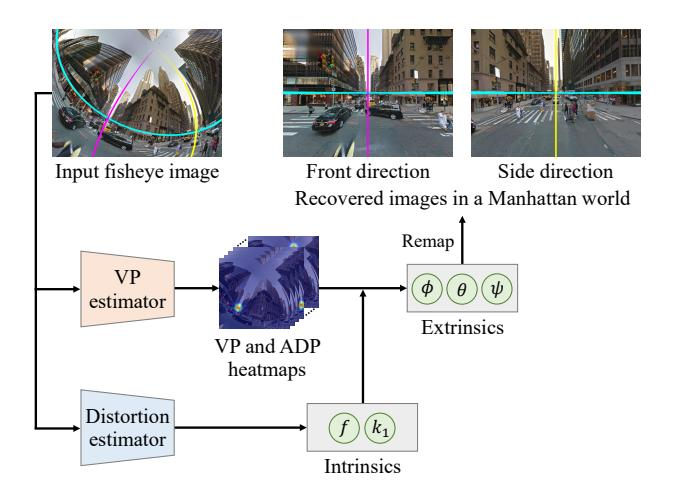
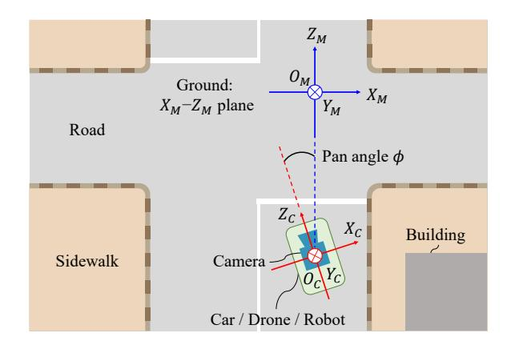
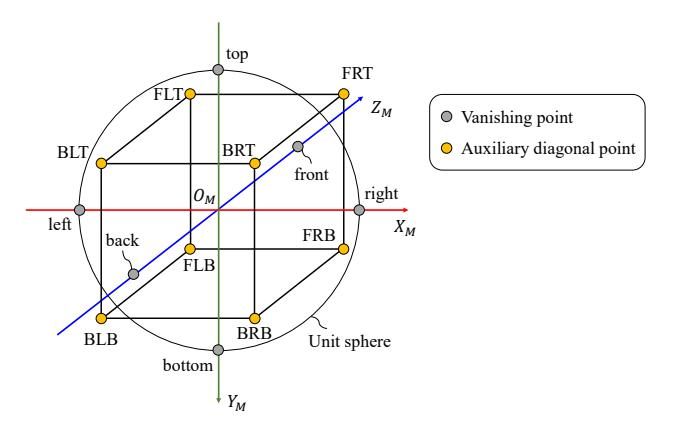
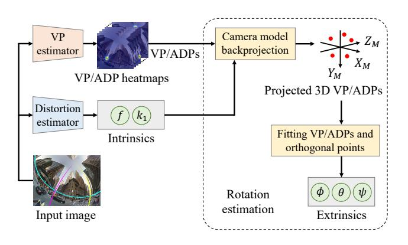
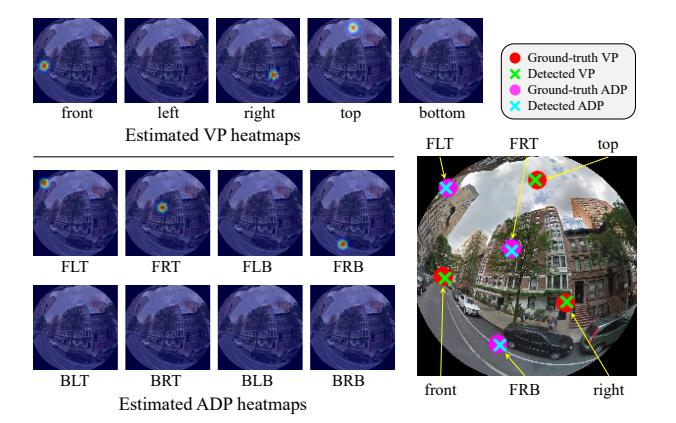
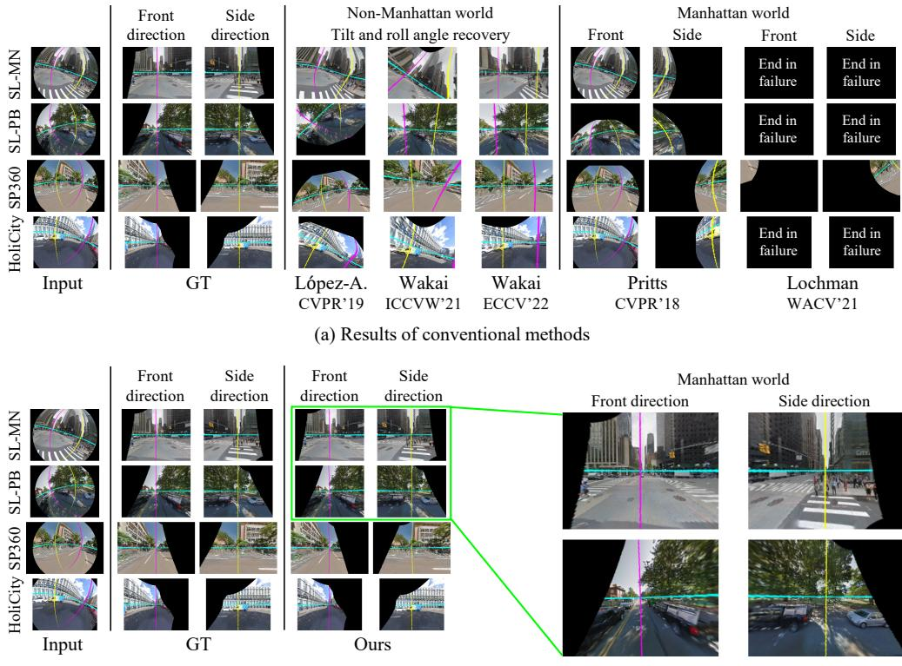
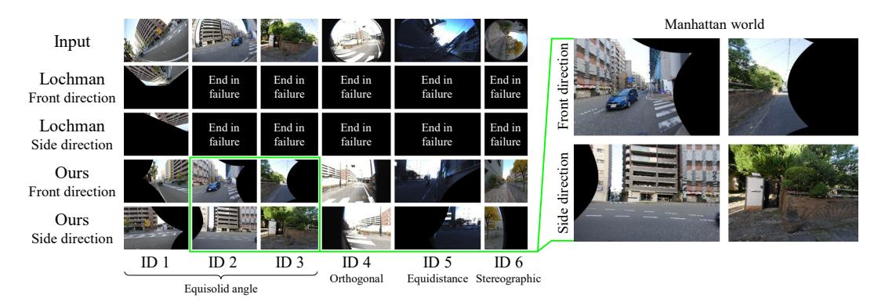

This CVPR paper is the Open Access version, provided by the Computer Vision Foundation. Except for this watermark, it is identical to the accepted version; the final published version of the proceedings is available on IEEE Xplore.

# **Deep Single Image Camera Calibration by Heatmap Regression to Recover Fisheye Images Under Manhattan World Assumption**

Nobuhiko Wakai1 Satoshi Sato $^1$ Yasunori Ishii1 Takayoshi Yamashita2 1 Panasonic Holdings Corporation 2 Chubu University

{wakai.nobuhiko,sato.satoshi,ishii.yasunori}@jp.panasonic.com takayoshi@isc.chubu.ac.jp

 Abstract

A Manhattan world lying along cuboid buildings is useful for camera angle estimation. However, accurate and robust angle estimation from fisheye images in the Manhattan world has remained an open challenge because general scene images tend to lack constraints such as lines, arcs, and vanishing points. To achieve higher accuracy and robustness, we propose a learning-based calibration method that uses heatmap regression, which is similar to pose estimation using keypoints, to detect the directions of labeled image coordinates. Simultaneously, our two estimators recover the rotation and remove fisheye distortion by remapping from a general scene image. Without considering vanishing-point constraints, we find that additional points for learning-based methods can be defined. To compensate for the lack of vanishing points in images, we introduce auxiliary diagonal points that have the optimal 3D arrangement of spatial uniformity. Extensive experiments demonstrated that our method outperforms conventional methods on large-scale datasets and with off-the-shelf cameras.

# 1. Introduction

In city scenes, image-based recognition methods are widely used for cars, drones, and robots. It is desirable to recognize the directions in which roads exist for navigation, selfdriving, and driver assistance. To avoid colliding with cars and pedestrians, it is more important to detect these objects in front of a vehicle rather than at the sides in Figure 1. We can obtain the travel direction from odometry, gyroscopes, or accelerator sensors using these specific devices. However, for cars, drones, and robots, image-based angle estimation of the travel direction without these devices is better for miniaturized and lightweight design. To determine the origin of angles, a Manhattan world  $[12]$  defines orthogonal world coordinates along cuboid buildings and a grid of streets. Although this image-based angle estimation is a long-studied topic in areas of geometric tasks [1, 4, 51],

Figure 1. Our network estimates extrinsics and intrinsics in a Manhattan world from a single image. Our estimated camera parameters are used to fully recover images by remapping them while distinguishing the front and side directions on the basis of the Manhattan world. Cyan, magenta, and yellow lines indicate the three orthogonal planes of the Manhattan frame in each of the images. The input image is generated from [38].

accurate and robust angle estimation has remained an open challenge because general scene images tend to lack constraints such as lines, arcs, and vanishing points (VPs).

To control cars, drones, and robots, images for recognition are needed that have a large field of view (FOV). Fish-eye cameras have a larger FOV than other cameras, but fish-eye images are highly distorted. After fisheye distortion has been removed, we can use various learning-based recognition methods, such as object detection [\[25, 27\]](#page-9-1), semantic segmentation [\[10, 26\]](#page-9-1), lane detection [\[15, 61\]](#page-9-1), action recognition [\[50, 59\]](#page-9-1), and action prediction [\[6, 20\]](#page-9-1). To recover fisheye images, performing camera calibration before the recognition tasks mentioned above is desirable.

Geometry-based calibration methods can estimate the camera rotation and distortion from a distorted image  $[3, 32,$ 41, 57]. However, it is difficult for geometry-based methods to calibrate cameras from images that contain few artificial

11884

**Table 1.** Comparison of the features of conventional methods and our proposed method

| Method                      |          | DL1 | Heatmap1 | Manhattan1 | Pan | Tilt & Roll | Distortion | Projection          |
|-----------------------------|----------|-----|----------|------------|-----|-------------|------------|---------------------|
| Non-Manhattan world         |          |     |          |            |     |             |            |                     |
| López-Antequera et al. [33] | CVPR'19  | ✓   |          |            |     | ✓           | ✓          | Perspective         |
| Wakai and Yamashita [52]    | ICCVW'21 | ✓   |          |            |     | ✓           | ✓          | Equisolid angle     |
| Wakai et al. [53]           | ECCV'22  | ✓   |          |            |     | ✓           | ✓          | Generic camera [53] |
| Manhattan world             |          |     |          |            |     |             |            |                     |
| Wildenauer et al. [57]      | BMVC'13  |     |          | ✓          | ✓   | ✓           | ✓          | Division model [14] |
| Antunes et al. [3]          | CVPR'17  |     |          | ✓          | ✓   | ✓           | ✓          | Division model [14] |
| Pritts et al. [41]          | CVPR'18  |     |          | ✓          | ✓   | ✓           | ✓          | Division model [14] |
| Lochman et al. [32]         | WACV'21  |     |          | ✓          | ✓   | ✓           | ✓          | Division model [14] |
| Ours                        |          | ✓   | ✓        | ✓          | ✓   | ✓           | ✓ [53]     | Generic camera [53] |

1 DL is learning-based methods; Heatmap is heatmap regression; Manhattan is based on the Manhattan world for world coordinates

objects because these methods need to detect many arcs to estimate the VPs. Therefore, city scenes in which sky or street trees dominate the images degrade the performance of geometry-based methods.

On the basis of the observations above, to achieve accurate and robust estimation, we propose a learning-based calibration method that estimates extrinsics (pan, tilt, and roll angles), focal length, and a distortion coefficient simultaneously from a single image in Figure 1. Our heatmap regression estimates each direction using labeled image coordinates to distinguish the four directions of a road intersection in a Manhattan world. Furthermore, we introduce additional geometric keypoints, called auxiliary diagonal points (ADPs), to compensate for the lack of VPs in each image.

To investigate the effectiveness of the proposed methods, we conducted extensive experiments on three large-scale datasets [9, 38, 64] as well as off-the-shelf cameras. This evaluation demonstrated that our method notably outperforms conventional geometry-based [32, 41] and learning-based [33, 52, 53] methods. The major contributions of our study are summarized as follows:

- We propose a heatmap-based VP estimator for recovering the rotation from a single image to achieve higher accuracy and robustness than geometry-based methods using arc detectors.
- We introduce auxiliary diagonal points with an optimal 3D arrangement based on the spatial uniformity of regular octahedron groups to address the lack of VPs in an image.

# **2. Related work**

Camera model. For geometric tasks, camera calibration estimates the parameters in a camera model. This model expresses a mapping from world coordinates  $\tilde{\mathbf{p}}$  to image coordinates  $\tilde{\mathbf{u}}$  in homogeneous coordinates. This mapping is conducted using extrinsic and intrinsic parameters. Extrinsic parameters  $[{\bf R} | {\bf t}]$  consist of a rotation matrix  ${\bf R}$ and a translation vector  $\mathbf{t}$  to represent the relation between the origins of the camera coordinates and Manhattan world coordinates (or other world coordinates). The intrinsic parameters are distortion  $\gamma$ , image sensor pitch  $(d_u, d_v)$ , and a

principal point  $(c_u, c_v)$ . The subscripts *u* and *v* indicate the horizontal and vertical directions, respectively. The mapping is formulated as

$$
\tilde{\mathbf{u}} = \begin{bmatrix} \gamma/d_u & 0 & c_u \\ 0 & \gamma/d_v & c_v \\ 0 & 0 & 1 \end{bmatrix} [\mathbf{R} \mid \mathbf{t}] \tilde{\mathbf{p}}. 
$$

(1)

Kannala and Brandt [\[16\]](#page-16-1) proposed the generic camera model, which includes fisheye lens cameras and is given by

$$
\gamma = \tilde{k}_1 \eta + \tilde{k}_2 \eta^3 + \cdots, 
$$

(2)

where  $\tilde{k}_1, \tilde{k}_2, ...$  are distortion coefficients and  $\eta$  is an incident angle. Wakai *et al.* [\[53\]](#page-6-1) proposed an alternative generic camera model for learning-based methods, expressed as

$$
\gamma = f \cdot (\eta + k_1 \eta^3), 
$$

(3)

where  f  is focal length and  $k_1$  is a distortion coefficient. Although Equation (3) is only a third-order polynomial with respect to  $\eta$ , the model can practically express fisheye projection with sub-pixel error [\[53\]](#page-9-1).

**Manhattan world.** Coughlan *et al.* [\[12\]](#page-9-1) proposed the Manhattan world for human navigation on the basis of the prior over edge models. The Manhattan world assumption regards the world as consisting of grid-shaped roads; that is, two of the three orthogonal coordinate axes lie along a crossroads, and the remaining axis is vertical. Given the Manhattan world  $O_{M}$ - $X_{M}Y_{M}Z_{M}$  in Figure 2, camera angles are defined as a rotation matrix  $\mathbf{R}$  that is compatible with pan, tilt, and roll angles. In this paper, we ignore the relations between the extrinsics of the camera and the body of cars, drones, or robots because these relations can be determined using designed values or calibration. Therefore, the task of camera calibration is to determine camera angles of a 3D-rotated camera in a Manhattan world.

Camera calibration. Perspective camera calibration methods in the Manhattan world have been proposed for Hough-transform-based methods [43, 44] and VP-based methods [8, 11, 18, 19, 22–24, 30, 35, 45, 46, 48, 49, 58, 63]. However, these methods address only narrow FOV cameras without distortion.

11885

Figure 2. Definition of world coordinates in a Manhattan world. The origins of the world coordinates of the Manhattan world and a camera are  $O_M$ - $X_M Y_M Z_M$  and  $O_C$ - $X_C Y_C Z_C$ , respectively. All walls of the cuboid buildings are parallel to the corresponding planes in  $O_M$ - $X_M Y_M Z_M$ .

In this paper, we focus on calibration methods that both recover rotation and remove distortion from a single image, as specified in Table 1. A pioneering learning-based method was proposed by López-Antequera *et al.* [\[33\]](#page-9-3) to address rotation and distortion based on Brown's quartic polynomial models [\[5\]](#page-9-3). Wakai and Yamashita [\[52\]](#page-9-3) proposed a learning-based method for fisheye cameras using equisolid angle projection. Wakai *et al.* [\[53\]](#page-9-3) also proposed a learning-based method using generic camera models. However, these methods cannot estimate pan angles because they use a non-Manhattan world.

For a Manhattan world, Wildenauer et al. [57] proposed a pioneering geometry-based calibration method from a single image using a constraint based on parallel scene lines. This method addressed distortion using a one-parameter division model [14]. A geometry-based calibration method has been proposed to improve calibration accuracy using the lines of circle centers [3]. Pritts et al. [41] proposed joint solvers for the affine rectification of an imaged scene plane and radial lens distortion from coplanar points. Considering distortion and focal length, Lochman et al. [32] proposed solvers based on combinations of imaged translational symmetries and parallel scene lines. Although these geometry-based methods can estimate camera angles in a Manhattan world, images with few arcs degrade the performance because of a lack of constraints.

Heatmap regression. Interest has grown in the use of heatmap regression for various tasks, such as human pose estimation [\[56\]](#page-5-1), object detection [\[21\]](#page-5-1), and face alignment [\[54\]](#page-5-1). In camera calibration, heatmap regression was used for distortion estimation [\[28, 29\]](#page-5-1). Although heatmap regression has the potential for accurate and robust estimation, the heatmap regression is not used for VP estimation because VPs are often located beyond the image borders.

Table 2. Labels of VPs and ADPs

| Label name               | Direction                                       | Image coordinate1 |
|--------------------------|-------------------------------------------------|-------------------|
| Vanishing point          |                                                 |                   |
| front                    | $\vec{Z}_M$                                     | (W/2, H/2)        |
| back                     | $-\vec{Z}_M$                                    | (0, H/2)          |
| left                     | $-\vec{X}_M$                                    | (W/4, H/2)        |
| right                    | $\vec{X}_M$                                     | (3W/4, H/2)       |
| top                      | $-\vec{Y}_M$                                    | (0,0)             |
| bottom                   | $\vec{Y}_M$                                     | (0, H)            |
| Auxiliary diagonal point |                                                 |                   |
| front-left-top (FLT)     | $(\vec{Z}_M - \vec{X}_M - \vec{Y}_M)/\sqrt{3}$  | (3W/8, H/4)       |
| front-right-top (FRT)    | $(\vec{Z}_M + \vec{X}_M - \vec{Y}_M)/\sqrt{3}$  | (5W/8, H/4)       |
| front-left-bottom (FLB)  | $(\vec{Z}_M - \vec{X}_M + \vec{Y}_M)/\sqrt{3}$  | (3W/8, 3H/4)      |
| front-right-bottom (FRB) | $(\vec{Z}_M + \vec{X}_M + \vec{Y}_M)/\sqrt{3}$  | (5W/8, 3H/4)      |
| back-left-top (BLT)      | $(-\vec{Z}_M - \vec{X}_M - \vec{Y}_M)/\sqrt{3}$ | (W/8, H/4)        |
| back-right-top (BRT)     | $(-\vec{Z}_M + \vec{X}_M - \vec{Y}_M)/\sqrt{3}$ | (7W/8, H/4)       |
| back-left-bottom (BLB)   | $(-\vec{Z}_M - \vec{X}_M + \vec{Y}_M)/\sqrt{3}$ | (W/8, 3H/4)       |
| back-right-bottom (BRB)  | $(-\vec{Z}_M + \vec{X}_M + \vec{Y}_M)/\sqrt{3}$ | (7W/8, 3H/4)      |

1 The  $W$  and  $H$  denote panoramic-image width and height, respectively.

Figure 3. Coordinates of VPs and ADPs in a Manhattan world. The labels of the VPs and ADPs correspond to the labels described in Table 2.

# 3. Proposed method

First, we introduce ADPs and describe how they are related to VPs. Second, we describe our learning-based calibration method using heatmap regression to recover fisheye images. Finally, we present our training and inference phases.

## 3.1. Auxiliary diagonal points

For estimating camera rotation, VPs are strong geometric cues. Images often have one or no VPs, although unique rotation requires at least two unique axes that consist of lines through 3D VPs and the origin of the world coordinates. Because learning-based methods can estimate tilt and roll angles from a fisheye image [33, 52, 53], we believe that deep neural networks can recognize not only the directions of the VPs but also other directions. Without considering the VP constraint that lines are concentrated at a VP, we can define various directions of points such as the vertexes

11886

of a polyhedron. We cannot escape the trade-off between the strength of constraints and the ease of training. This trade-off depends on the arrangement of the directions of points and the number of directions.

To solve this problem concerning the arrangement and number of points, we define additional VP-related points called ADPs based on the spatial symmetry as follows. We found that six 3D VPs form a regular octahedron that has the symmetry of regular octahedron groups (octahedral symmetry), see Figure 3. This symmetry means that a regular octahedron has three types of rotational symmetric axes. To estimate a unique camera rotation requiring two or more directions, the point arrangement prefers 3D spatial uniformity, such as the vertexes of regular polygons. Considering the wide spatial uniformity and small number of points, we use the ADPs, which are the eight diagonal points that indicate the directions of the cubic corners in Table 2. This arrangement of VPs and ADPs (VP/ADPs) also has the symmetry of regular octahedron groups and the greatest spatial uniformity in the case of eight points because of the diagonal directions, as shown in Figure 3. Therefore, 3D VP/ADP coordinates are the optimal arrangement given a practical number of points. The supplementary materials describe details of the symmetry and optimal arrangement.

## 3.2. Network architecture

Vanishing-point estimator. We found that VP estimation in images corresponds to single human pose estimation [2] in terms of labeled image-coordinate detection. These two tasks, VP detection and pose estimation, are similar because of the geometric relations of VPs and pose keypoints; that is, 3D VPs form a regular octahedron, and pose keypoints are based on a human skeleton. This similarity suggests that heatmap regression can achieve accurate and robust VP estimation as it does for single human pose estimation. Furthermore, using ADPs to increase the number of points, we can overcome the problem of the heatmap regression for VPs; that is, a unique camera rotation cannot be determined for images with few VPs.

Additionally, Wakai *et al.*  $[53]$  reported that mismatches in dataset domains degrade calibration accuracy. This degradation suggests that regressors consisting of fully connected layers extract domain-specific features without geometric cues such as VPs. In contrast to conventional regressors, heatmap regressors using 2D Gaussian kernels on labeled points have the potential for pixel-wise accuracy in pose estimation  $[37]$ . Therefore, we propose a heatmapregression network, called the "VP estimator," that detects image VP/ADPs and is likely to avoid such degradation.

Distortion estimator. To estimate camera rotation, we require intrinsic parameters that project image coordinates to 3D incident ray vectors because the rotation is calculated using these incident ray vectors in Manhattan world coor-

Figure 4. Calibration pipeline for inference. The intrinsics are estimated by the distortion estimator. Camera models project VP/ADPs onto the unit sphere using backprojection. The extrinsics are calculated from the fitting. The input fisheye image is generated from [38].

dinates. For the intrinsics in Equation  $(3)$ , we use Wakai *et al.*'s calibration network [53] without the tilt and roll angle regressors, which is called the "distortion estimator." Therefore, our network has two estimators in Figure  $1$ .

Implementation details. We use the HRNet [47] backbone, which has shown strong performance in various tasks, for our VP estimator. We found that the HRNet loss function evaluates only images that include detected keypoints; that is, detection failure does not affect the loss value. To tackle this problem, we modified this loss function to evaluate all images, including those with detection failure. This modification is suitable for deep single image camera calibration because, unlike human pose estimation, we always estimate camera rotation. To achieve sub-pixel precision, DARK [60] is applied to the heatmaps as postprocessing. Note that we do not employ DARK to generate heatmaps as a preprocessing step because such preprocessing leads to inconsistency between the heatmaps and camera parameters. Rectangular images are center cropped for the VP estimator.

## 3.3. Training and inference

**Training.** Using the generated fisheye images with ground-
truth camera parameters in Section  $4.1$  and VP/ADP labels
in Section  $4.2$ , we train our two estimators independently.
The VP estimator is trained using the modified HRNet loss
function described above. In addition, the distortion estima-
tor is trained using the harmonic non-grid bearing loss [\[53\]](#page-11-0).

**Inference.** Figure 4 shows our calibration pipeline for the inference. First, we obtain the VP/ADPs from the VP estimator and intrinsics from the distortion estimator. Second, these 2D VP/ADPs are projected onto a unit sphere in world coordinates using backprojection. Finally, we convert the 3D VP/ADPs to the extrinsics, as described below.

Here, we describe the estimation of camera rotation from the VP/ADPs. Note that this estimation, which is based on

11887

Table 3. Number of panoramic images and fisheye image patches

| Dataset  | Panorama |      | Fisheye |        |
|----------|----------|------|---------|--------|
|          | Train    | Test | Train   | Test   |
| SL-MH    | 55,599   | 161  | 555,990 | 16,100 |
| SL-PB    | 57,840   | 167  | 578,400 | 16,700 |
| SP360    | 19,038   | 55   | 571,140 | 16,500 |
| HoliCity | 6,235    | 18   | 561,150 | 16,200 |

**Table 4.** Distribution of the camera parameters for training sets

| Parameter                   | Distribution             | Range or value1                                                |
|-----------------------------|--------------------------|----------------------------------------------------------------|
| Pan $\phi$                  | Uniform                  | [0, 360)                                                       |
| Tilt $\theta$ , Roll $\psi$ | Mix Normal Uniform | Normal 70%, Uniform 30% $\mu = 0, \sigma = 15$ [-90, 90] |
| Aspect ratio                | Varying                  | {1/1 9%, 5/4 1%, 4/3 66%, 3/2 20%, 16/9 4%}                 |
| Focal length $f$            | Uniform                  | [6, 15]                                                        |
| Distortion $k_1$            | Uniform                  | $[-1/6, 1/3]$                                                  |
| Max angle $\eta_{max}$ 2    | Uniform                  | [84, 96]                                                       |

1 Units:  $\phi, \theta, \psi$ , and  $\eta_{\text{max}}$  [deg];  $f$  [mm];  $k_1$  [dimensionless]

2 Max angle  $\eta_{\rm max}$  is the maximum incident angle

geometric calculations, is irrelevant to training. The principle of the estimation is to fit two sets of world coordinates and is known as the absolute orientation problem [55]. One set of world coordinates consists of the 3D VP/ADPs projected by backprojection [53] using the camera parameters. The other set consists of the 3D points corresponding to these VP/ADPs along the orthogonal Manhattan world coordinates shown in Figure 3. In our case, we focus on rotation without translation and scaling because all 3D points are on a unit sphere. In this fitting, which has a lower computational cost than methods based on a singular value decomposition, we use the optimal linear attitude estimator [34, 39], which calculates the Rodrigues vector [13] expressing the principal axis and angle. This Rodrigues vector is compatible with a quaternion, and we can obtain pan, tilt, and roll angles from this quaternion. Note that we regard undeterminable angles as  $0^{\circ}$  when point detection fails or an image has one or no axes from the VP/ADPs. The supplementary presents details of the rotation estimation.

# 4. Experiments

To demonstrate the validity and effectiveness of our approach, we employed extensive experiments using largescale synthetic datasets and off-the-shelf fisheye cameras.

## 4.1. Datasets

Panoramic image datasets. We used three large-scale datasets of outdoor panoramas, the StreetLearn dataset [38], the SP360 dataset  $[9]$ , and the HoliCity dataset  $[64]$ , as listed in Table 3. In StreetLearn, we used the Manhattan

2019 subset (SL-MH) and the Pittsburgh 2019 subset (SL-PB). These panoramic images are the equirectangular projection using calibrated cameras. Assuming practical conditions following  $[33, 52, 53]$ , we regarded the vertical center of the panoramic images as the ground. Moreover, the tilt angle is  $0^{\circ}$  because the height of a camera mounted on a car is sufficiently small with respect to the distance between the camera and other objects. The horizontal center of the panoramic images corresponds with the travel direction of cars: the pan angle is  $0^{\circ}$ .

Fisheye-image and camera-parameter generation. For a fair comparison with the state-of-the-art method [53] in the estimation of tilt and roll angles, we used the generic camera model [53] to generate fisheye images. Following the procedure for dataset generation and capture [53], we generated fisheye images from panoramic images using the generic camera models with the ground-truth camera parameters in Table  $4$ , and we captured outdoor images in Kyoto, Japan, using six off-the-shelf fisheye cameras. To generate the test set, we replaced the mixed and varying distributions in the training sets with a uniform distribution. Therefore, our generated fisheye images and ground-truth camera parameters were used for training and evaluation.

## 4.2. Vanishing-point annotation

Vanishing-point label ambiguity. As shown in Table 2, we annotated the VP/ADPs of the image coordinates and labels on the basis of panoramic-image width and height. We found that some generated fisheve images had label ambiguity; that is, we cannot annotate unique VP/ADP labels for these images. For example, we cannot distinguish one image with a  $0^{\circ}$ -pan angle from another with a  $180^{\circ}$ -pan angle because we cannot determine the direction of travel of the cars from one image. In other words, we cannot distinguish front labels from back labels in Table 2. Similarly, we cannot distinguish left labels from right labels.

Removal of label ambiguity. Considering generalized cases of label ambiguity, we annotated the image coordinates of VP/ADPs as follows. We  $180^{\circ}$ -rotationally align all labels based on two conditions: 1) the images have back labels without front labels, and 2) the images have right labels without front and left labels. Details of the number of labels can be found in the supplementary materials.

Label ambiguity also affects conventional methods in a Manhattan world. For example, it is often the case that three orthogonal directions can be estimated using the Gaussian sphere representation of VPs [63]; however, the representation does not regard the difference between front and back directions. For a fair comparison in the evaluation, we selected the errors with the smallest angles from among the candidate ambiguous angles in both the conventional methods and our method. Therefore, the estimated pan-angle ranges from  $-90^{\circ}$  to  $90^{\circ}$ .

11888

**Table 5.** Distribution of the number of unique axes  $(\%)$ 

| Dataset1                                                              | 0   | 1   | 2    | 3    | 4    | 5    | 6    | 7   |
|-----------------------------------------------------------------------|-----|-----|------|------|------|------|------|-----|
| Train                                                                 | 0.0 | 1.3 | 13.5 | 25.7 | 24.8 | 18.8 | 10.9 | 5.1 |
| Test                                                                  | 0.0 | 1.4 | 12.8 | 25.7 | 25.6 | 19.6 | 10.2 | 4.6 |
| 1 SL-MH, SL-PB, SP360, and HoliCity all have the same distribution of |     |     |      |      |      |      |      |     |

the number of unique axes shown in this table

Ignoring back labels. After removing label ambiguity, we ignored back labels because the training and test sets had only  $0.1\%$  and  $0.3\%$  back labels, respectively. Therefore, the VP estimator detected 13 points, that is, the five VPs (front, left, right, top, and bottom) and eight ADPs in Table 2. If all VP/ADPs are successfully detected, our method can estimate a unique rotation for over 98% images with two or more unique axes from the VP/ADPs in Table 5.

## 4.3. Parameter settings

Following [\[53\]](#page-9-1), we fixed the image sensor height to 24 mm,  $d_u = d_v$ , used the principal points  $(c_u, c_v)$  as the image center, and the translation vectors  $\mathbf{t}$  as the zero vectors. Therefore, in our method, we focused on the estimation of five camera parameters, that is, focal length  $f$ , distortion coefficient  $k_1$ , pan angle  $\phi$ , tilt angle  $\theta$ , and roll angle  $\psi$  in a Manhattan world. We independently trained the VP estimator and distortion estimator using a mini-batch size of 32. We optimized the VP estimator, which was pretrained on ImageNet [\[42\]](#page-9-1), using the Adam optimizer [\[17\]](#page-9-1) and Random Erasing augmentation [\[62\]](#page-9-1) with  $(p, s_l, s_h, r_1, r_2) = (0.5, 0.02, 0.33, 0.3, 3.3)$ . The initial learning rate was set to  $1 \times 10^{-4}$  and was multiplied by 0.1 at the 100th epoch. We also trained the distortion estimator pretrained on Wakai *et al.*'s original network [\[53\]](#page-9-1) using the RAdam optimizer [\[31\]](#page-9-1) with a learning rate of  $1 \times 10^{-5}$ .

## 4.4. Experimental results

We implemented the comparison methods according to the corresponding papers but trained them on SL-MH, SL-PB, SP360, and HoliCity.

#### 4.4.1 Vanishing point estimation

To demonstrate the validity and effectiveness of the proposed VP estimator, we used pose estimation metrics and the distance error between the detected and ground-truth VP/ADPs. Following [7], we used the standard keypoint metrics of the average precision (AP) and average recall (AR) [47] with a 5.6-pixel  $sk_i$  object keypoint similarity [36] as well as the percentage of correct keypoints  $(PCK)$  [2] with a 5.6-pixel distance threshold, which corresponds to  $1/10$ th of the heatmap height.

Overall, the VP estimator detected the VP/ADPs, although the performance in the cross-domain evaluation de-

Figure 5. Qualitative results of VP/ADP detection using the proposed VP estimator on the SL-MH test set. The VP estimator estimated five VP and eight ADP heatmaps for each VP/ADP.

creased, as Table 6 reveals. The AP, AR, and PCK results suggest that VP/ADP estimation is an easier task than human pose estimation because the VP/ADPs have the implicit constraints of the geometric coordinates shown in Fig- $\frac{1}{2}$  ure 3. Table 6 also reveals that ADP detection is more difficult than VP detection because VPs generally have specific appearances at infinity. In terms of distance errors, the VP estimator addressed the various directions of VP/ADPs. In addition, considering the qualitative results in Figure 5, the VP estimator stably detected VP/ADPs in the entire image. Therefore, the VP estimator can precisely detect VP/ADPs from a fisheye image.

### 4.4.2 Parameter and reprojection errors

To validate the accuracy of the camera parameters, we compared our method with conventional methods that estimate both rotation and distortion. Following  $[53]$ , we evaluated the mean absolute error and reprojection error (REPE). Our method achieved the lowest mean absolute angle error and REPE of the methods listed in Table 7. The pan-angle errors in our method using HRNet-W32 for the VP estimator are substantially smaller than those of Lochman *et al.*'s method [32] by  $20.16^{\circ}$  on the SL-MH test set. Our method achieved  $3.15^{\circ}$  and  $3.00^{\circ}$  errors for the tilt and roll angles, respectively, outperforming the other methods. We evaluated our method using HRNet-W48 (a larger backbone) and obtained a slight RMSE improvement of 0.16 pixels with respect to the RMSE obtained using HRNet-W32.

The Pritts *et al.*'s [\[41\]](#page-10-0) and Lochman *et al.*'s [\[32\]](#page-10-0) methods could not perform calibration for some images because of a lack of arcs. In particular, Lochman et al.'s method [\[32\]](#page-10-0) had a  $59.1\%$  executable rate, that is, the number of successful executions divided by the number of all images. Note that we calculated errors using only these successful executions. By contrast, our learning-based method can ad-

11889

Table 6. Results of the cross-domain evaluation for our VP estimator using HRNet-W32

| Dataset |          | Keypoint metric $\uparrow$ |      |      |      |      |      | Mean distance error [pixel] $\downarrow$ |       |       |       |      |        |      |       |       |
|---------|----------|----------------------------|------|------|------|------|------|------------------------------------------|-------|-------|-------|------|--------|------|-------|-------|
| Train   | Test     | AP                         | AP50 | AP75 | AR   | AR50 | AR75 | PCK                                      | front | left  | right | top  | bottom | VP1  | ADP1  | All1  |
| SL-MH   | SL-MH    | 0.99                       | 0.99 | 0.99 | 0.97 | 0.98 | 0.98 | 0.99                                     | 2.67  | 2.90  | 2.52  | 1.90 | 1.72   | 2.39 | 3.64  | 3.10  |
|         | SL-PB    | 0.98                       | 0.99 | 0.99 | 0.96 | 0.97 | 0.97 | 0.98                                     | 3.51  | 3.50  | 3.11  | 2.34 | 2.02   | 2.97 | 4.52  | 3.85  |
| SL-MH   | SP360    | 0.85                       | 0.94 | 0.90 | 0.79 | 0.87 | 0.83 | 0.83                                     | 6.55  | 7.42  | 6.18  | 5.34 | 11.77  | 7.44 | 14.95 | 11.57 |
|         | HoliCity | 0.80                       | 0.92 | 0.86 | 0.72 | 0.83 | 0.78 | 0.77                                     | 9.73  | 12.27 | 9.75  | 8.54 | 6.60   | 9.47 | 17.92 | 14.11 |

1 VP denotes all 5 VPs; ADP denotes all 8 ADPs; All denotes all points consisting of 5 VPs and 8 ADPs

**Table 7.** Comparison of the absolute parameter errors and reprojection errors on the SL-MH test set

| Method                      | Backbone                | Mean absolute error1 ↓ |        |        |      |       | REPE1↓ | Executable rate1 ↑ | Mean fps2 ↑ | #Params | GFLOPS |
|-----------------------------|-------------------------|------------------------|--------|--------|------|-------|--------|-----------------------|-------------|---------|--------|
|                             |                         | Pan φ                  | Tilt θ | Roll ψ | $f$  | $k_1$ |        |                       |             |         |        |
| López-Antequera et al. [33] | CVPR'19 DenseNet-161    | -                      | 27.60  | 44.90  | 2.32 | -     | 81.99  | 100.0                 | 36.4        | 27.4M   | 7.2    |
| Wakai and Yamashita [52]    | ICCVW'21 DenseNet-161   | -                      | 10.70  | 14.97  | 2.73 | -     | 30.02  | 100.0                 | 33.0        | 26.9M   | 7.2    |
| Wakai et al. [53]           | ECCV'22 DenseNet-161    | -                      | 4.13   | 5.21   | 0.34 | 0.021 | 7.39   | 100.0                 | 25.4        | 27.4M   | 7.2    |
| Pritts et al. [41]          | CVPR'18 -               | 25.35                  | 42.52  | 18.54  | -    | -     | -      | 96.7                  | 0.044       | -       | -      |
| Lochman et al. [32]         | WACV'21 -               | 22.36                  | 44.42  | 33.20  | 6.09 | -     | -      | 59.1                  | 0.016       | -       | -      |
| Ours w/o ADPs               | ( 5 points)3 HRNet-W323 | 19.38                  | 13.54  | 21.65  | 0.34 | 0.020 | 28.90  | 100.0                 | 12.7        | 53.5M   | 14.53  |
| Ours w/o VPs                | ( 8 points) HRNet-W32   | 10.54                  | 11.01  | 8.11   | 0.34 | 0.020 | 19.70  | 100.0                 | 12.6        | 53.5M   | 14.5   |
| Ours                        | (13 points) HRNet-W32   | 2.20                   | 3.15   | 3.00   | 0.34 | 0.020 | 5.50   | 100.0                 | 12.3        | 53.5M   | 14.5   |
| Ours                        | (13 points) HRNet-W48   | 2.19                   | 3.10   | 2.88   | 0.34 | 0.020 | 5.34   | 100.0                 | 12.2        | 86.9M   | 22.1   |

1 Units: pan  $\phi$ , tilt  $\theta$ , and roll  $\psi$  [deg];  $f$  [mm];  $k_1$  [dimensionless]; REPE [pixel]; Executable rate [%]

2 Implementations: López-Antequera [33], Wakai [52], Wakai [53], and ours using PyTorch [40]; Pritts [41] and Lochman [32] using The MathWorks MATLAB

3 (· points) is the number of VP/ADPs for VP estimators; VP estimator backbones are indicated; Rotation estimation in Figure 4 is not included in GFLOPs

Table 8. Comparison of the mean absolute rotation errors in degrees on the test sets of each dataset

| Dataset  | Wakai et al. [53] |      |       | Lochman et al. [32] |       |       | Ours (HRNet-W32) |             |             |
|----------|-------------------|------|-------|---------------------|-------|-------|------------------|-------------|-------------|
|          | Pan               | Tilt | Roll  | Pan                 | Tilt  | Roll  | Pan              | Tilt        | Roll        |
| SL-MH    | -                 | 4.13 | 5.21  | 22.36               | 44.42 | 33.20 | <b>2.20</b>      | <b>3.15</b> | <b>3.00</b> |
| SL-PB    | -                 | 4.06 | 5.71  | 23.45               | 44.99 | 30.68 | <b>2.30</b>      | <b>3.13</b> | <b>3.09</b> |
| SP360    | -                 | 3.75 | 5.19  | 22.84               | 45.38 | 31.91 | <b>2.16</b>      | <b>2.92</b> | <b>2.79</b> |
| HoliCity | -                 | 6.55 | 16.05 | 22.63               | 45.11 | 32.58 | <b>3.48</b>      | <b>4.08</b> | <b>3.84</b> |

**Table 9.** Comparison on the cross-domain evaluation of the mean absolute rotation errors in degrees

| Dataset |          | Wakai et al. [53] |       |       | Ours (HRNet-W32) |              |             |
|---------|----------|-------------------|-------|-------|------------------|--------------|-------------|
| Train   | Test     | Pan               | Tilt  | Roll  | Pan              | Tilt         | Roll        |
|         | SL-PB    | -                 | 5.51  | 12.02 | 2.98             | <b>3.72</b>  | <b>3.63</b> |
| SL-MH   | SP360    | -                 | 9.11  | 37.54 | 8.06             | <b>8.34</b>  | <b>7.77</b> |
|         | HoliCity | -                 | 10.94 | 42.20 | 10.74            | <b>10.60</b> | <b>8.93</b> |

dress arbitrary images independent of the number of arcs; that is, it demonstrates scene robustness. Compared with methods [32, 41] estimating the pan angles, our method using HRNet-W32 achieved a mean frames per second (fps) that was at least 280 times higher. Note that our test platform was equipped with an Intel Core i7-6850K CPU and an NVIDIA GeForce RTX 3080Ti GPU.

We validated the effectiveness of the ADPs. Table 7 suggests that our method based on HRNet-W32 and VP/ADPs notably improved angle estimation compared with our method without the ADPs by  $15.4^{\circ}$  on average for pan, tilt, and roll angles. Therefore, the ADPs dramatically alleviated the problems caused by a lack of VPs.

Additionally, we tested our proposed method using var-

ious datasets to validate its robustness. Table 8 shows that our method outperforms both existing state-of-the-art learning-based [53] and geometry-based [32] methods on all datasets in terms of rotation errors. Table 9 also reports that our method is superior to Wakai *et al.*'s method [53], which tended to estimate the roll angle poorly in the crossdomain evaluation, especially on the HoliCity test set.

### 4.4.3 Qualitative evaluation

To evaluate the recovered image quality, we performed calibration on synthetic images and off-the-shelf cameras.

**Synthetic images.** Figure 6 shows the qualitative results obtained on synthetic images. Our results are the most similar to the ground-truth images. By contrast, the quality of the recovered images that contained a few arcs was considerably degraded when the geometry-based methods proposed by Pritts *et al.* [\[41\]](#page-9-1) and Lochman *et al.* [\[32\]](#page-9-1) were used. Furthermore, the learning-based methods proposed by López-Antequera et al. [\[33\]](#page-9-1), Wakai and Yamashita [\[52\]](#page-9-1), and Wakai *et al.* [ $53$ ] did not recover the pan angles. We note that our method can even calibrate images in which trees line a street.

Off-the-shelf cameras. Following [53], we also evaluated calibration methods using off-the-shelf cameras to validate the effectiveness of our method. Figure 7 shows the qualitative results using off-the-shelf fisheye cameras using SL-MH for training. Our method meaningfully outperformed Lochman *et al.*'s method [32] in terms of recovered images. These results indicate robustness in our method for various types of camera projection.

11890

(b) Results of our method

Figure 6. Qualitative results on the test sets. (a) Results of conventional methods. From left to right: input images, ground truth (GT), and results of López-Antequera et al. [33], Wakai and Yamashita [52], Wakai et al. [53], Pritts et al. [41], and Lochman et al. [32]. (b) Results of our method. From left to right: input images, GT, and the results of our method using HRNet-W32 in a Manhattan world.

Figure 7. Qualitative results for images from off-the-shelf cameras. From top to bottom: input images, the results of the compared method (front and side direction images obtained by Lochman et al. [32]), and our method using HRNet-W32 (front and side direction images). The identifiers (IDs) correspond to the camera IDs used in [53], and the projection names are shown below the IDs.

# 5. Conclusion

**Limitations.** It is difficult to recover images when an input image includes one or no unique axes that can be identified from the VP/ADPs. We believe that subsequent studies can extend this work to address this open challenge. Another promising direction for future work is to use several images

or videos for input. We consider one image because our focus is to develop deep single image camera calibration.

In a Manhattan world, we proposed a learning-based method to address rotation and distortion from an image. To recover the rotation, our heatmap-based VP estimator detects the VP/ADPs. Experiments demonstrated that our method substantially outperforms conventional methods.

11891

# References

- [1] Y. I. Abdel-Aziz and H. M. Karara. Direct linear transformation into object space coordinates. In *Proceedings of the ASP* Symposium on Close-Range Photogrammetry (CRP), pages 1-18, 1971. 1
- [2] M. Andriluka, L. Pishchulin, P. Gehler, and B. Schiele. 2D human pose estimation: New benchmark and state of the art analysis. In Proceedings of the IEEE Conference on Computer Vision and Pattern Recognition (CVPR), pages 3686-3693, 2014. 4, 6
- [3] M. Antunes, J. P. Barreto, D. Aouada, and B. Ottersten. Unsupervised vanishing point detection and camera calibration from a single Manhattan image with radial distortion. In Proceedings of the IEEE Conference on Computer Vision and Pattern Recognition (CVPR), pages 6691-6699, 2017. 1, 2,
- [4] S. T. Barnard. Interpreting perspective images. *Artificial* Intelligence (AIJ), 21(4):435–462, 1983. 1
- [5] D. C. Brown. Close-range camera calibration. *Photogram*metric Engineering, 37(8):855–866, 1971. 3
- [6] Y. Cai, H. Li, J.-F. Hu, and W.-S. Zheng. Action knowledge transfer for action prediction with partial videos. In Proceedings of the AAAI Conference on Artificial Intelligence, 2019.
- [7] Z. Cao, G. Hidalgo, T. Simon, S.-E. Wei, and Y. Sheikh. OpenPose: Realtime multi-person 2D pose estimation using part affinity fields. IEEE Transactions on Pattern Analysis and Machine Intelligence (PAMI), 43(1):172–186, 2021. 6
- [8] C.-K. Chang, J. Zhao, and L. Itti. DeepVP: Deep learning for vanishing point detection on 1 million street view images. In *Proceedings of the IEEE International Confer*ence on Robotics and Automation (ICRA), pages 4496–4503, 2018.2
- [9] S.-H. Chang, C.-Y. Chiu, C.-S. Chang, K.-W. Chen, C.-Y. Yao, R.-R. Lee, and H.-K. Chu. Generating 360 outdoor panorama dataset with reliable sun position estimation. In Proceedings of the ACM SIGGRAPH Asia, pages 1–2, 2018. 2, 5
- [10] B. Cheng, O. Parkhi, and A. Kirillov. Pointly-supervised instance segmentation. In Proceedings of the IEEE/CVF Conference on Computer Vision and Pattern Recognition (CVPR), pages 2607–2616, 2022. 1
- [11] H.-S. Choi, K. An, and M. Kang. Regression with residual neural network for vanishing point detection. Image and Vision Computing (IVC), 91:103797, 2019. 2
- [12] J. M. Coughlan and A. L. Yuille. Manhattan world: Compass direction from a single image by Bayesian inference. In Proceedings of the IEEE International Conference on Computer Vision (ICCV), pages 941-947, 1999. 1, 2
- [13] J. S. Dai. Euler-Rodrigues formula variations, quaternion conjugation and intrinsic connections. Mechanism and Machine Theory (MMT), 92:144-152, 2015. 5
- [14] A. W. Fitzgibbon. Simultaneous linear estimation of multiple view geometry and lens distortion. In Proceedings of the IEEE Conference on Computer Vision and Pattern Recognition (CVPR), pages I125-I132, 2001. 2, 3

- [15] S. Huang, Z. Shen, Z. Huang, Z. Ding, J. Dai, J. Han, N. Wang, and S. Liu. Anchor3DLane: Learning to regress 3D anchors for monocular 3D lane detection. In Proceedings of the IEEE/CVF Conference on Computer Vision and Pattern Recognition (CVPR), pages 17451–17460, 2023. 1
- [16] J. Kannala and S. S. Brandt. A generic camera model and calibration method for conventional, wide-angle, and fish-eye lenses. IEEE Transactions on Pattern Analysis and Machine Intelligence (PAMI), 28(8):1335-1340, 2006. 2
- [17] D. P. Kingma and J. L. Ba. ADAM: A method for stochastic optimization. In Proceedings of the International Conference on Learning Representations (ICLR), 2015. 6
- [18] F. Kluger, H. Ackermann, M. Y. Yang, and B. Rosenhahn. Deep learning for vanishing point detection using an inverse gnomonic projection. In *Proceedings of the German Con*ference on Pattern Recognition (GCPR), pages 17–28, 2017.
- [19] F. Kluger, E. Brachmann, H. Ackermann, C. Rother, M. Y. Yang, and B. Rosenhahn. CONSAC: Robust multi-model fitting by conditional sample consensus. In Proceedings of the IEEE/CVF Conference on Computer Vision and Pattern Recognition (CVPR), pages 4634-4643, 2020. 2
- [20] I. Kotseruba, A. Rasouli, and J. K. Tsotsos. Benchmark for evaluating pedestrian action prediction. In Proceedings of the IEEE/CVF Winter Conference on Applications of Computer Vision (WACV), pages 1257-1267, 2021. 1
- [21] H. Law and J. Deng. CornerNet: Detecting objects as paired keypoints. *International Journal of Computer Vision (IJCV)*, 128:642–656, 2020. 3
- [22] J. Lee, M. Sung, H. Lee, and J. Kim. Neural geometric parser for single image camera calibration. In Proceedings of the European Conference on Computer Vision (ECCV), pages 541-557, 2020. 2
- [23] J. Lee, H. Go, H. Lee, S. Cho, M. Sung, and J. Kim. CTRL-C: Camera calibration TRansformer with line-classification. In Proceedings of the IEEE/CVF International Conference on Computer Vision (ICCV), pages 16228-16237, 2021.
- [24] H. Li, J. Zhao, J.-C. Bazin, W. Chen, Z. Liu, and Y.-H. Liu. Quasi-globally optimal and efficient vanishing point estimation in Manhattan world. In Proceedings of the IEEE/CVF International Conference on Computer Vision (ICCV), pages 1646–1654, 2019. 2
- [25] K. Li, K. Chen, H. Wang, L. Hong, C. Ye, J. Han, Y. Chen, W. Zhang, C. Xu, D.-Y. Yeung, X. Liang, Z. Li, and H. Xu. CODA: A real-world road corner case dataset for object detection in autonomous driving. In Proceedings of the European Conference on Computer Vision (ECCV), pages 406-423, 2022. 1
- [26] L. Li, T. Zhou, W. Wang, J. Li, and Y. Yang. Deep hierarchical semantic segmentation. In Proceedings of the IEEE/CVF Conference on Computer Vision and Pattern Recognition (*CVPR*), pages 1236–1247, 2022. 1
- [27] Y.-L. Li and S. Wang. R(Det)2: Randomized decision routing for object detection. In Proceedings of the IEEE/CVF Conference on Computer Vision and Pattern Recognition (CVPR), pages 4815-4824, 2022. 1

11892

- [28] K. Liao, C. Lin, Y. Zhao, and M. Xu. Model-free distortion rectification framework bridged by distortion distribution map. IEEE Transactions on Image Processing (TIP), 29:3707–3718, 2020. 3
- [29] K. Liao, C. Lin, and Y. Zhao. A deep ordinal distortion estimation approach for distortion rectification. IEEE Transactions on Image Processing (TIP), 30:3362-3375, 2021. 3
- [30] Y. Lin, R. Wiersma, S. L. Pintea, K. Hildebrandt, E. Eisemann, and J. C. van Gemert. Deep vanishing point detection: Geometric priors make dataset variations vanish. In Proceedings of the IEEE/CVF Conference on Computer Vision and Pattern Recognition (CVPR), pages 6093–6103, 2022. 2
- [31] L. Liu, H. Jiang, P. He, W. Chen, X. Liu, J. Gao, and J. Han. On the variance of the adaptive learning rate and beyond. In Proceedings of the International Conference on Learning Representations (ICLR), pages 1-14, 2020. 6
- [32] Y. Lochman, O. Dobosevych, R. Hryniv, and J. Pritts. Minimal solvers for single-view lens-distorted camera autocalibration. In Proceedings of the IEEE Winter Conference on Applications of Computer Vision (WACV), pages 2886-2895, 2021. 1, 2, 3, 6, 7, 8
- [33] M. López-Antequera, R. Marí, P. Gargallo, Y. Kuang, J. Gonzalez-Jimenez, and G. Haro. Deep single image camera calibration with radial distortion. In Proceedings of the IEEE/CVF Conference on Computer Vision and Pattern Recognition (CVPR), pages 11809–11817, 2019. 2, 3, 5, 7,
- [34] M. Lourakis and G. Terzakis. Efficient absolute orientation revisited. In Proceedings of the IEEE/RSJ International Conference on Intelligent Robots and Systems (IROS), pages 5813-5818, 2018. 5
- [35] X. Lu, J. Yao, H. Li, Y. Liu, and X. Zhang. 2-Line exhaustive searching for real-time vanishing point estimation in Manhattan world. In Proceedings of the IEEE Winter Conference on Applications of Computer Vision (WACV), pages 345-353, 2017. 2
- [36] K. Ludwig, P. Harzig, and R. Lienhart. Detecting arbitrary intermediate keypoints for human pose estimation with Vision Transformers. In Proceedings of the IEEE/CVF Winter Conference on Applications of Computer Vision Workshops (WACVW), pages 663–671, 2022. 6
- [37] Z. Luo, Z. Wang, Y. Huang, L. Wang, T. Tan, and E. Zhou. Rethinking the heatmap regression for bottom-up human pose estimation. In Proceedings of the IEEE/CVF Conference on Computer Vision and Pattern Recognition (CVPR), pages 13259-13268, 2021. 4
- [38] P. Mirowski, A. Banki-Horvath, K. Anderson, D. Teplyashin, K. M. Hermann, M. Malinowski, M. K. Grimes, K. Simonyan, K. Kavukcuoglu, A. Zisserman, and R. Hadsell. The StreetLearn environment and dataset. arXiv preprint *arXiv:1903.01292*, 2019. 1, 2, 4, 5
- [39] D. Mortari, F. L. Markley, and P. Singla. Optimal linear attitude estimator. Journal of Guidance, Control, and Dynamics (*JGCD*), 3:1619–1627, 2007. 5
- [40] A. Paszke, S. Gross, F. Massa, A. Lerer, J. Bradbury, G. Chanan, T. Killeen, Z. Lin, N. Gimelshein, L. Antiga, A. Desmaison, A. Köpf, E. Yang, Z. DeVito, M. Raison, A.

Tejani, S. Chilamkurthy, B. Steiner, L. Fang, J. Bai, and S. Chintala. PvTorch: An imperative style, high-performance deep learning library. In Proceedings of the Advances in Neural Information Processing Systems (NeurIPS), pages 8024– 8035, 2019. 7

- [41] J. Pritts, Z. Kukelova, V. Larsson, and O. Chum. Radiallydistorted conjugate translations. In Proceedings of the IEEE/CVF Conference on Computer Vision and Pattern Recognition (CVPR), pages 1993-2001, 2018. 1, 2, 3, 6, 78
- [42] O. Russakovsky, J. Deng, H. Su, J. Krause, S. Satheesh, S. Ma, Z. Huang, A. Karpathy, A. Khosla, M. Bernstein, A. C. Berg, and L. Fei-Fei. ImageNet large scale visual recognition challenge. International Journal of Computer Vision (IJCV), 115(3):211–252, 2015. 6
- [43] A. Sheshkus, A. Ingacheva, and D. Nikolaev. Vanishing points detection using combination of fast Hough transform and deep learning. In *Proceedings of the International Con*ference on Machine Vision (ICMV), 2017. 2
- [44] A. Sheshkus, A. Ingacheva, V. Arlazarov, and D. Nikolaev. HoughNet: Neural network architecture for vanishing points detection. In Proceedings of the IEEE International Conference on Document Analysis and Recognition (ICDAR), pages 844-849, 2019. 2
- [45] Y. Shi, D. Zhang, J. Wen, X. Tong, H. Zhao, X. Ying, and H. Zha. Three orthogonal vanishing points estimation in structured scenes using convolutional neural networks. In Proceedings of the IEEE International Conference on Image Processing (ICIP), pages 3537–3541, 2019. 2
- [46] G. Simon, A. Fond, and M.-O. Berger. A-contrario horizonfirst vanishing point detection using second-order grouping laws. In Proceedings of the European Conference on Computer Vision (ECCV), pages 323-338, 2018. 2
- [47] K. Sun, B. Xiao, D. Liu, and J. Wang. Deep high-resolution representation learning for human pose estimation. In Proceedings of the IEEE/CVF Conference on Computer Vision and Pattern Recognition (CVPR), pages 5686–5696, 2019. 4, 6
- [48] J.-P. Tardif. Non-iterative approach for fast and accurate vanishing point detection. In Proceedings of the IEEE International Conference on Computer Vision (ICCV), pages 1250-1257, 2009. 2
- [49] X. Tong, X. Ying, Y. Shi, R. Wang, and J. Yang. Transformer based line segment classifier with image context for real-time vanishing point detection in Manhattan world. In Proceedings of the IEEE/CVF Conference on Computer Vision and Pattern Recognition (CVPR), pages 6083–6092, 2022. 2
- [50] T.-D. Truong, Q.-H. Bui, C. N. Duong, H.-S. Seo, S. L. Phung, X. Li, and K. Luu. DirecFormer: A directed attention in Transformer approach to robust action recognition. In Proceedings of the IEEE/CVF Conference on Computer Vision and Pattern Recognition (CVPR), pages 19998–20008, 2022. 1
- [51] R. Y. Tsai. A versatile camera calibration technique for highaccuracy 3D machine vision metrology using off-the-shelf TV cameras and lenses. IEEE Journal of Robotics and Automation (JRA), 3(4):323-344, 1987. 1

11893

- [52] N. Wakai and T. Yamashita. Deep single fisheye image camera calibration for over 180-degree projection of field of view. In Proceedings of the IEEE/CVF International Conference on Computer Vision Workshops (ICCVW), pages 1174-1183, 2021. 2, 3, 5, 7, 8
- [53] N. Wakai, S. Sato, Y. Ishii, and T. Yamashita. Rethinking generic camera models for deep single image camera calibration to recover rotation and fisheye distortion. In Proceedings of the European Conference on Computer Vision (*ECCV*), pages 679–698, 2022. 2, 3, 4, 5, 6, 7, 8
- [54] X. Wang, L. Bo, and L. Fuxin. Adaptive wing loss for robust face alignment via heatmap regression. In Proceedings of the IEEE/CVF International Conference on Computer Vision (*ICCV*), pages 6971–6981, 2019. 3
- [55] Z. Wang and Jepson. A new closed-form solution for absolute orientation. In Proceedings of the IEEE Conference on Computer Vision and Pattern Recognition (CVPR), pages 129–134, 1994. 5
- [56] S.-E. Wei, V. Ramakrishna, T. Kanade, and Y. Sheikh. Convolutional pose machines. In Proceedings of the IEEE Conference on Computer Vision and Pattern Recognition (*CVPR*), pages 4724–4732, 2016. 3
- [57] H. Wildenauer and B. Micusik. Closed form solution for radial distortion estimation from a single vanishing point. In Proceedings of the British Machine Vision Conference (*BMVC*), pages 106.1–106.11, 2013. 1, 2, 3
- [58] J. Wu, L. Zhang, Y. Liu, and L. Chen. Real-time vanishing point detector integrating under-parameterized RANSAC and Hough transform. In Proceedings of the IEEE/CVF International Conference on Computer Vision (ICCV), pages 3712–3721, 2021. 2
- [59] J. Yang, X. Dong, L. Liu, C. Zhang, J. Shen, and D. Yu. Recurring the Transformer for video action recognition. In Proceedings of the IEEE/CVF Conference on Computer Vision and Pattern Recognition (CVPR), pages 14043–14053, 2022. 1
- [60] F. Zhang, X. Zhu, H. Dai, M. Ye, and C. Zhu. Distributionaware coordinate representation for human pose estimation. In Proceedings of the IEEE/CVF Conference on Computer Vision and Pattern Recognition (CVPR), pages 7091–7100, 2020. 4
- [61] T. Zheng, Y. Huang, Y. Liu, W. Tang, Z. Yang D. Cai, and X. He. CLRNet: Cross layer refinement network for lane detection. In Proceedings of the IEEE/CVF Conference on Computer Vision and Pattern Recognition (CVPR), pages 888-897, 2022. 1
- [62] Z. Zhong, L. Zheng, G. Kang, S. Li, and Y. Yang. Random Erasing data augmentation. In Proceedings of the AAAI Conference on Artificial Intelligence, 2020. 6
- [63] Y. Zhou, H. Qi, J. Huang, and Y. Ma. NeurVPS: Neural vanishing point scanning via conic convolution. In Proceedings of the Advances in Neural Information Processing Systems (NeurIPS), 2019. 2, 5
- [64] Y. Zhou, J. Huang, X. Dai, L. Luo, Z. Chen, and Y. Ma. HoliCity: A city-scale data platform for learning holistic 3D structures. arXiv preprint arXiv:2008.03286, 2020. 2, 5
- 
- 11894