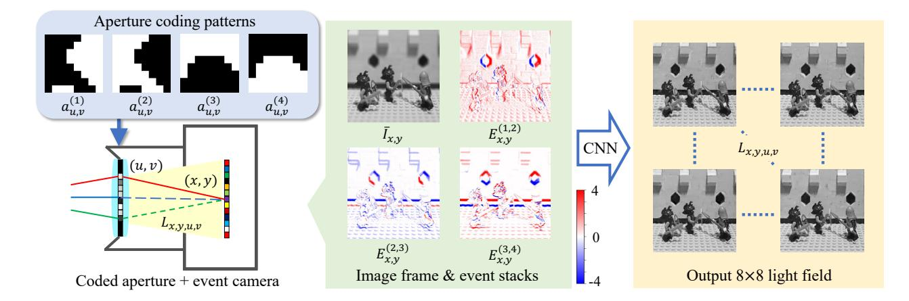
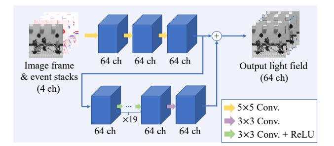
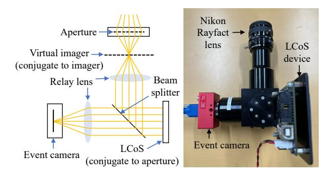
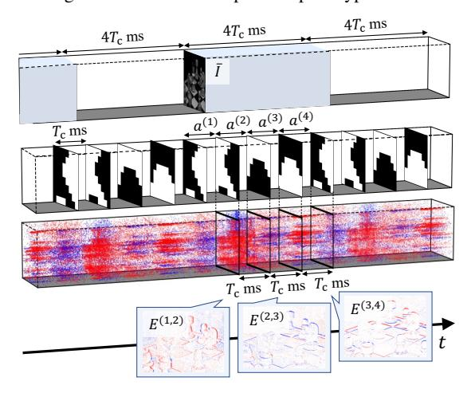
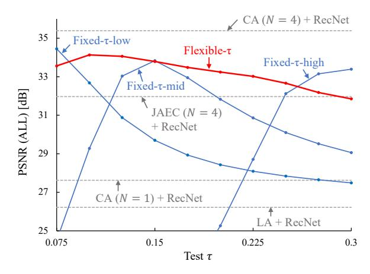
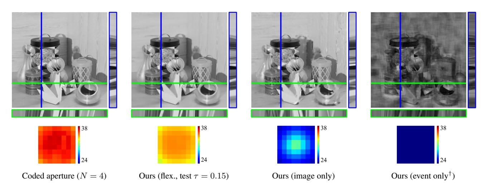
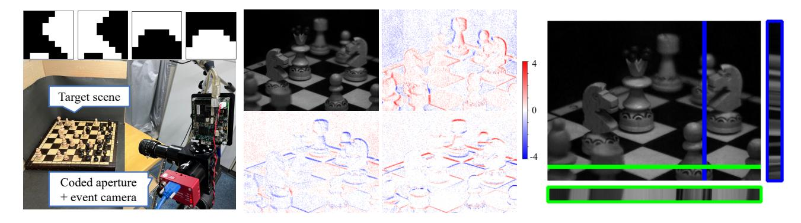

This CVPR paper is the Open Access version, provided by the Computer Vision Foundation. Except for this watermark, it is identical to the accepted version; the final published version of the proceedings is available on IEEE Xplore.

# Time-Efficient Light-Field Acquisition Using Coded Aperture and Events

Shuji Habuchi†

 $\text{Chihiro Tsutake}^{\dagger}$ Keita Takahashi† Toshiaki Fujii† Hajime Nagahara‡ † Nagoya University, Japan ‡ Osaka University, Japan

 Abstract

We propose a computational imaging method for timeefficient light-field acquisition that combines a coded aperture with an event-based camera. Different from the conventional coded-aperture imaging method, our method applies a sequence of coding patterns during a single exposure for an image frame. The parallax information, which is related to the differences in coding patterns, is recorded as events. The image frame and events, all of which are measured in a single exposure, are jointly used to computationally reconstruct a light field. We also designed an algorithm pipeline for our method that is end-to-end trainable on the basis of deep optics and compatible with real camera hardware. We experimentally showed that our method can achieve more accurate reconstruction than several other imaging methods with a single exposure. We also developed a hardware prototype with the potential to complete the measurement on the camera within 22 msec and demonstrated that light fields from real 3-D scenes can be obtained with convincing visual quality. Our software and supplementary video are available from our project website $1$ .

# 1. Introduction

A light field is usually represented as a set of multi-view images that captures a target 3-D scene from a dense  $2\text{-D}$ grid of viewpoints. Light fields have been used for various applications such as depth estimation  $[11, 16, 39]$ , object/material recognition [25, 49], view synthesis [4, 15, 27], and 3-D display [12, 18, 50]. In this paper, we consider light-field acquisition from static 3-D scenes.

Due to the large number of images contained in a light field (e.g.,  $8 \times 8$  views), how to acquire a light field has been a long-standing issue [8, 31, 40, 51]. Since views included in a light field are highly redundant with each other, viewby-view sampling seems to be a waste of resources. To achieve more efficient acquisition, researchers investigated coded-aperture imaging [10, 14, 22, 30, 38], with which semi-transparent coding patterns are placed at the aperture

1https://www.fujii.nuee.nagoya-u.ac.jp/Research/EventLF/

plane of a camera. With this method, the light field of a target scene is optically encoded before being recorded on the image sensor. Some images taken from a stationary camera with different coding patterns are used to computationally reconstruct the original light field. As indicated from several studies  $[10, 14, 42]$ , the number of images to acquire can be reduced to only a few (e.g.,  $2-4$ ).

An issue with coded-aperture imaging is the long measurement time, since two or more images should be acquired in sequence. As a solution for this issue, we propose a time-efficient light-field acquisition method that can complete the measurement in a single exposure. Our method combines a coded aperture [\[10, 14, 22, 30, 38\]](#page-9-1) and an event-based camera [\[3, 9\]](#page-9-1), as shown in Fig. 1, that can simultaneously capture image frames and events. Our method is based on the premise that the aperture coding can be controlled faster than the frame-rate of the image sensor.2 We apply several coding patterns in sequence during a single exposure for an image frame. Therefore, we do not directly observe individual coded-aperture images, but we have the sum of them as a single image frame. The camera also measures the events asynchronously during the exposure. Since the target scene is assumed static, the events are caused exclusively by the change in coding patterns. In other words, we actively induce the events by changing the coding patterns over time. These events include the information related to the parallax among different viewpoints, which is essential for light-field/3-D reconstruction. The image frame and events, all of which are measured in a single exposure, are jointly used to computationally reconstruct the light field.

We first formalize our imaging method and clarify the quasi-equivalence between our method and the baseline coded-aperture imaging method. We then discuss our design of an end-to-end trainable algorithm tailored for our imaging method while considering the compatibility with real camera hardware. To validate our method, we conducted quantitative evaluations, in which the imaging process was computationally simulated, and real-world experiments using our prototype camera. Experimental results

2Some electronic devices used for implementing a coded aperture can run much faster than standard image sensors.

24923

Figure 1. Overview of our method. Four coding patterns are applied to aperture plane during single exposure of image frame. Image and events are jointly used to reconstruct light field through convolutional neural network (CNN).

show that our method can reconstruct light fields more accurately than several other imaging methods with a single exposure, and our method works successfully with our prototype camera in capturing real 3-D scenes with convincing visual quality.

To the best of our knowledge, we are the first to investigate the combination of coded-aperture imaging and events in the context of computational light-field imaging. Our contribution is not limited to shortening the measurement time for a light field, but it enables us to go beyond the *limitation of the frame-rate* of image sensors; Our method can better utilize the time resource during a single exposure, and obtain more information per unit time (i.e., being timeefficient) than the baseline coded-aperture imaging method. Our method is also distinctive in the sense that events are induced actively by the camera's optics rather than the moving objects or ego-motion of the camera.

# 2. Related Works

The most straight-forward approach to light-field acquisition is to construct an array of cameras [\[8, 40, 51\]](#page-8-0), which involves costly and bulky hardware. Lens-array-based cameras [\[1, 2, 31, 32\]](#page-8-0) gained popularity because a light field can be captured in a single shot. However, this type of camera has an intrinsic trade-off between the number of views and the spatial resolution of each view. Mask-based coded-imaging methods [\[10, 14, 22, 26, 29, 30, 45, 47\]](#page-8-0) have been developed to increase the efficiency of light-field acquisition. With coded-aperture imaging, two to four images, taken from a stationary camera with different aperture-coding patterns, are sufficient to computationally reconstruct a light field with  $8 \times 8$  views in full-sensor resolution [\[10, 14, 42\]](#page-8-0). However, since several coded images need to be acquired in sequence, the lengthy measurement time remains an issue. Joint aperture-exposure

coding [28, 41, 42, 46] enables more flexible coding patterns during a single exposure but comes with complicated hardware implementation; as far as we know, only Mizuno et al. [28] reported a working prototype for this method but with awkward hardware restrictions for the noncommercialized image sensor. Our method also applies several aperture-coding patterns during a single exposure, but we combine them with an off-the-shelf event camera to achieve time-efficient and accurate light-field acquisition.

Event cameras  $[3, 9]$  are bio-inspired sensors that can record intensity changes asynchronously at each pixel with a very low latency. Compared with ordinary frame-based cameras, event cameras can capture more fine-grained temporal information in a higher dynamic range, which opens up many applications such as optical-flow estimation, deblurring, video interpolation, and camera pose estimation. Event cameras have also been used extensively for 3-D reconstruction [17, 24, 35, 37, 56, 57]. In these studies, however, the events were usually caused either by the moving objects or ego-motion of the camera. Our method can be regarded as a new application of an event camera; the events are induced actively by the camera's optics in the framework of computational imaging.

Single-view view synthesis (SVVS) [5–7, 19, 20, 34, 43, 44, 53, 55] is used to reconstruct a 3-D scene from a single image. Since this is geometrically an ill-posed problem, SVVS methods rely on implicit prior knowledge learned from the training dataset rather than physical cues. These methods are not necessarily designed to be physically accurate but to hallucinate a visually-plausible 3-D scene. Our method takes an orthogonal approach to SVVS; we use not only a single image but also a coded aperture and events to obtain solid physical cues from the target 3D scene.

Various computational imaging methods have been developed on the basis of deep-optics [13, 14, 21, 28, 33,

24924

48, 52, 54], with which the camera-side optical elements and the computational algorithm are jointly optimized in a deep-learning-based framework. Our work is pioneering in applying deep-optics to event cameras.

# 3. Proposed Method

## 3.1. Background and Basics

A schematic diagram of our camera is shown in Fig. 1 (left). All the light rays coming into the camera can be parameterized by  $(x, y, u, v)$ , where  $(u, v)$  and  $(x, y)$  denote the positions on the aperture and imaging planes, respectively. Therefore, a light field  $L$  is defined over  $(x, y, u, v)$ . We assume that each light ray has only a monochrome intensity; but the extension to RGB color is straight-forward in the-  
ory. We also assume that  $x, y, u, v$  take discretized integer values; thus,  $L$  is equivalent to a set of multi-view images, where  $(x, y)$  and  $(u, v)$  respectively denote the pixel position and viewpoint. The arrangement of the viewpoints is assumed to be  $8 \times 8$   $(u, v \in \{1, ..., 8\})$ . Each element of  $L$  is described using subscripts as  $L_{x,y,u,v}$ . The goal of our method is to reconstruct  $L$  of the target scene from the data measured on the camera in a single exposure.

Before describing our imaging method in Section 3.2, we mention two previous imaging methods that use a coded *aperture with a frame-based camera* (no events available).

**Coded-aperture imaging** [\[10, 14, 22, 30, 38\]](#page-1-1): To optically encode a light field  $L$  along the viewpoint dimension, a sequence of light-attenuating patterns,  $a^{(1)}, \ldots, a^{(N)}$ , where  $a_{u,v}^{(n)} \in [0,1]$  and  $u, v \in \{1,\ldots,8\}$ , is placed at the aperture plane. Each pixel under the  $n$ -th coding pattern is described as the weighted sum of the light rays over  $(u, v)$ :

$$
I_{x,y}^{(n)} = \sum_{u,v} a_{u,v}^{(n)} L_{x,y,u,v}.
$$

(1)

The light field  $L$  is computationally reconstructed from  $N$  images taken with different coding patterns,  $I^{(1)}, \ldots, I^{(N)}$ . The images under different coding patterns would have parallax with each other, which is essential for 3-D/light-field reconstruction. As demonstrated in previous studies [10, 14, 42], a relatively small  $N$  (e.g.  $N = 4$ ) is sufficient for accurate reconstruction. However, since  $N$  (more than one) images should be acquired in sequence, the lengthy measurement time remains an issue.

Joint aperture-exposure coding [\[28, 41, 42, 46\]](#page-1-1): This is an advanced form of coded-aperture imaging;  $N$  coding patterns are applied to both the aperture and imaging planes synchronously during a single exposure. The coding patterns for the imaging plane are described as  $p^{(1)}, \ldots, p^{(N)}$ , where  $p_{x,y}^{(n)} \in \{0,1\}$ . The imaging process is described as

$$
I_{x,y} = \sum_{n} \sum_{u,v} a_{u,v}^{(n)} p_{x,y}^{(n)} L_{x,y,u,v}.
$$

(2)

While the light field  $L$  can be reconstructed from a single observed image alone, the increased complexity of the coding scheme (Eq.  $(2)$ ) makes its hardware implementation very difficult.

## 3.2. Combining Coded Aperture and Events

As shown in Fig. 1, our method uses *a coded aperture with* an event camera that can obtain both the image frames and events simultaneously (e.g., DAVIS 346 camera). Similar to the baseline coded-aperture imaging method (Eq. (1)), we apply  $N$  aperture-coding patterns ( $a^{(1)}, \ldots, a^{(N)}$ ) in sequence. However, we do so in a single exposure for an image frame. Therefore, we do not directly observe individual coded-aperture images,  $I^{(1)}, \ldots, I^{(N)}$ , but we have their sum as the image frame:

$$
\bar{I}_{x,y} = \sum_{n} I_{x,y}^{(n)}.
$$

(3)

The camera also measures the events at each pixel  $(x, y)$  asynchronously during the exposure. We denote an event occurring at time  $t$  as  $e_{x,y,t} \in \{+1, -1\}$ , where the positive/negative signs correspond to the increase/decrease in the intensity at pixel  $(x, y)$ . Since the target scene is assumed static, the events are caused exclusively by the change in the coding patterns. Although the pattern changes instantly, the camera responds gradually in a very short but no-zero transient time. We denote the transient time between  $a^{(n)}$  and  $a^{(n+1)}$  as  $T^{(n,n+1)}$ . We sum the events during the transient time to obtain an event stack as

$$
E_{x,y}^{(n,n+1)} = \sum_{t \in T^{(n,n+1)}} e_{x,y,t}.
$$

(4)

As shown in Fig. 1,  $E^{(n,n+1)}$  includes the parallax information between  $I^{(n)}$  and  $I^{(n+1)}$ , which is essential for 3-D reconstruction. Our goal is to reconstruct the original light field  $L$  from a single image frame  $\bar{I}$  and  $(N-1)$  event stacks,  $E^{(1,2)}, \ldots, E^{(N-1,N)}$ , all of which are measured during a single exposure.

**Quasi-equivalence.** We theoretically relate our imaging method to the baseline coded-aperture imaging method. The camera records an event at time  $t$  when the intensity change (in log scale) exceeds a contrast threshold  $\tau$  as

$$
\left|\log(I_{x,y,t}) - \log(I_{x,y,t_0})\right| > \tau 
$$

(5)

where  $t_0$  is the time when the previous event was recorded. On the basis of Eq. (5), we derive an approximate relation

24925

between an event stack (Eq.  $(4)$ ) and the two consecutive coded-aperture images (Eq.  $(1)$ ) as

$$
E_{x,y}^{(n,n+1)} \approx \frac{\log\left(I_{x,y}^{(n+1)}\right) - \log\left(I_{x,y}^{(n)}\right)}{\tau}.
$$

(6)

Assuming that equality holds for Eq.  $(6)$  and combining it with Eq. (3), we can obtain  $I^{(1)}, \ldots, I^{(N)}$  as

$$
I_{x,y}^{(n)} = I_{x,y}^{(1)} \exp\left(\tau \sum_{2 \le k \le n} E_{x,y}^{(k-1,k)}\right) (n \ge 2) 
$$

(7)

$$
I_{x,y}^{(1)} = \frac{\overline{I}_{x,y}}{1 + \sum_{2 \le n \le N} \exp\left(\tau \sum_{2 \le k \le n} E_{x,y}^{(k-1,k)}\right)}.
$$

(8)

This means that under the equality assumption for Eq. (6),  $N$  coded-aperture images ( $I^{(1)}, \ldots, I^{(N)}$ ) can be derived analytically from the data observed with our imaging method ( $\bar{I}$  and  $E^{(1,2)}, \ldots, E^{(N-1,N)}$ ). Therefore, we can state that our imaging method is *quasi-equivalent* to the baseline coded-aperture imaging method.

Interestingly, this type of quasi-equivalence does not hold for joint aperture-exposure coding. By using Eq. (1), the imaging process of Eq. (2) is rewritten as

$$
I_{x,y} = \sum_{n} p_{x,y}^{(n)} I_{x,y}^{(n)}.
$$

(9)

Obviously, it is impossible to analytically obtain  $N$  coded-
aperture images ( $I^{(1)}, ..., I^{(N)}$ ) from a single observed image  $I$  alone. Therefore, our imaging method has a theoretical advantage over joint aperture-exposure coding. However, this theory alone is insufficient to ensure the practicality of our method. The actual event data are very noisy and harshly quantized (by the contrast threshold  $\tau$ ), which breaks the equality assumption for Eq. (6).

## 3.3. Algorithm

We developed an end-to-end trainable algorithm on the basis of deep-optics [13, 14, 21, 28, 33, 48, 52, 54], in which the camera-side optical-coding patterns and the light-field reconstruction algorithm were jointly optimized in a deeplearning-based framework. We carefully designed each part of our algorithm to ensure the compatibility with real camera hardware. Although we specifically mention the hardware setup that is available to us, the ideas behind our design would be useful for other possible hardware setups. We set  $N = 4$  unless otherwise mentioned.

Our algorithm consists of two parts: AcqNet and Rec-Net. AcqNet describes the data-acquisition process using a coded aperture and an event camera as

$$
\bar{I}, E^{(1,2)}, E^{(2,3)}, E^{(3,4)} = \text{AcqNet}(L).
$$

(10)

The trainable parameters of AcqNet are related to the aperture's coding patterns. RecNet receives the observed data as

| <b>Algorithm 1</b> Pseudo-code for AcqNet |                                                                   |
|-------------------------------------------|-------------------------------------------------------------------|
|                                           | 1: trainable tensors: $\alpha, \beta \in \mathbb{R}^{8 \times 8}$ |
|                                           | 2: $forward(L)$ :                                                 |
|                                           | 3: set $s$                                                        |
|                                           | 4: $a^{(1)}, a^{(3)} = sigmoid(s\alpha), sigmoid(s\beta)$         |
|                                           | 5: $a^{(2)}, a^{(4)} = 1 - a^{(1)}, 1 - a^{(3)}$                  |
|                                           | 6: <b>for</b> $n$ in [1, 2, 3, 4]:                                |
|                                           | 7: compute $I^{(n)}$ by Eq. (1)                                   |
|                                           | 8: <b>if</b> $n > 1$ :                                            |
|                                           | 9: compute $E^{(n-1,n)}$ by Eq. (12)                              |
|                                           | 10: <b>end</b>                                                    |
|                                           | 11: <b>end</b>                                                    |
|                                           | 12: compute $\bar{I}$ by Eq. (3)                                  |
|                                           | 13: return $\bar{I}, E^{(1,2)}, E^{(2,3)}, E^{(3,4)}$             |

the input and reconstructs the original light field as

$$
\hat{L} = \text{RecNet}(\bar{I}, E^{(1,2)}, E^{(2,3)}, E^{(3,4)}). 
$$

(11)

AcqNet and RecNet are jointly trained to minimize the reconstruction (MSE) loss between  $L$  and  $\hat{L}$ . Once the training is finished, AcqNet is replaced with the physical imaging process of the camera hardware, in which the coding patterns are adjusted to the learned parameters of AcqNet. The data acquired from the camera are fed to RecNet to reconstruct the light field of a real 3-D scene.

Hardware-driven constraints for coded aperture. Similar to some previous studies  $[14, 26, 30]$ , we used a liquid-crystal-on-silicon (LCoS) display (Forth Dimension Displays, SXGA-3DM) to implement a coded aperture. This display can output a sequence of semi-transparent coding patterns repeatedly. We need to consider the following two constraints. **Binary constraint**. Although our LCoS display can support both binary and grayscale patterns, a grayscale pattern is actually represented as a temporal series of multiple binary patterns; a grayscale transmittance is represented as the ratio of  $0/1$  periods. To avoid unintended 0/1 flips, we choose to use only binary patterns for aperture coding. Complementary constraint. Our LCoS display requires a "DC balance"; a certain pattern  $a$  and its complement  $a^* = 1 - a$  should be included in the sequence. Since the events are recorded continuously over time, we use both  $a$  and  $a^*$  as the coding patterns.

AcqNet. A pseudo-code of AcqNet is presented in Algorithm 1. In lines 4 and 5, we make the coding patterns compatible with the binary and complementary constraints. More specifically, we prepare two sets of trainable tensors, each with  $8 \times 8$  elements, denoted as  $\alpha$  and  $\beta$ . They are multiplied by the scale parameter  $s$  then fed to the sigmoid function to produce the coding patterns  $a^{(1)}$  and  $a^{(3)}$ . As the training proceeds,  $s$  gradually increases, which forces  $a^{(1)}$  and  $a^{(3)}$  to gradually converge to binary patterns. Moreover,  $a^{(2)}$  and  $a^{(4)}$  are made to be complementary to  $a^{(1)}$

24926

 
Figure 2. Network architecture of RecNet

and  $a^{(3)}$ , respectively. In line 9, we compute an event stack from the consecutive coded-aperture images as

$$
E_{x,y}^{(n,n+1)} = Q\left(\frac{\log(I_{x,y}^{(n+1)} + \epsilon) - \log(I_{x,y}^{(n)} + \epsilon)}{\tau + n_{x,y}}\right) 
$$

(12)

where  $Q(x) := \text{sign}(x) \text{floor}(|x|)$  is a quantization operator, and  $\epsilon = 0.01$  w.r.t. the intensity range of [0, 1] for  $I^{(n)}$  and  $I^{(n+1)}$ . To account for the randomness of the sensor, a zero-
means Gaussian noise n with  $\sigma = 0.021$  is added to the contrast threshold  $\tau$ . Equation (12) follows a widely used
event simulator [\[36\]](#page-9-1), but we implement it as being differentiable. Following previous studies [\[14, 28, 42\]](#page-9-1), we also add
a zero-means Gaussian noise ( $\sigma = 0.005$  w.r.t. the normalized intensity range [0, 1]) to the image frame  $\overline{I}$  to account
for the measurement noise.

A challenging issue with Eq.  $(12)$  is how to determine the contrast threshold  $\tau$ . When the imaging process is computationally simulated, a smaller  $\tau$  is better. This is because a smaller  $\tau$  leads to a more fine-grained observation (a larger number of events), which in turn results in more accurate light-field reconstruction. However, it is difficult to determine a specific  $\tau$  that is compatible with a real event camera (e.g., a DAVIS 346 camera) the  $\tau$  of which cannot be controlled in an explicit (direct) manner. With our experimental configuration, we empirically estimate  $\tau \simeq 0.15$ , but it depends on the configuration. To address this issue, we treat  $\tau$ as being variable, which makes the model of Eq.  $(12)$  more flexible. Specifically, we randomly draw  $\tau$  from  $[0.075, 0.3]$ for each batch during training, which enables the algorithm to be independent of a specific  $\tau$ .

**RecNet.** Since network architectures are not the main focus of this paper, we used a plain network architecture consisting of a sequence of 2-D convolutional layers. The data obtained from the camera ( $\bar{I}, E^{(1,2)}, E^{(2,3)}$ , and  $E^{(3,4)}$  stacked along the channel dimension) are fed to RecNet; the output from RecNet is a tensor with 64 channels corresponding to 64 views of the reconstructed light field (see Fig. 2 for more details). Similar architectures were used in previous works [\[14, 42\]](#page-9-1), achieving a good balance between the reconstruction quality and computational cost.

Our plain architecture can be used for other imaging methods with minimal modifications (only by changing the number of channels for the input layer), which makes the comparison easier. Exploration for better network architectures is left as future work.

Training and loss function. AcqNet and RecNet are implemented using PyTorch 2.0 and jointly trained on the BasicLFSR dataset [23]. We extract 29,327 training samples, each with  $64 \times 64$  pixels and  $8 \times 8$  views, from 144 light fields designated for training. The disparities among the neighboring viewpoints are mostly limited within  $[-3, 3]$ pixels. This is suitable for our method because the  $8 \times 8$ viewpoints are arranged on the small aperture plane of the camera, which results in limited disparities among the viewpoints. We use the built-in Adam optimizer with default parameters and train the entire network over 600 epochs with a batch size of 16. The scale parameter  $s$  is initialized as 1 and multiplied by  $1.02$  for each epoch.

As mentioned earlier, we use the reconstruction loss between the original and reconstructed light fields. However, this is insufficient in some cases. The learned patterns sometimes have significantly different brightness (the brightness of  $a^{(n)}$  is given as  $\sum_{u,v} a_{u,v}^{(n)}$ ), which causes too many events spreading over all the pixels. These coding patterns are useless with a real event camera because such a large number of events cannot be recorded correctly due to the limited throughput of the camera. To avoid this problem, we optionally add the second term to the loss function to suppress the number of events in each batch  $(N_{\text{event}})$  below a pre-defined threshold  $(\theta)$ .

$$
\text{Loss} = \text{MSE}(L, \hat{L}) + \lambda \cdot \text{max}(N_{\text{event}} - \theta, 0) 
$$

(13)

where  $\lambda$  is a non-negative weight. The threshold  $\theta$  can be computed from the camera's throughput (events per sec.).

## 3.4. Hardware

Our hardware setup is shown in Fig. 3. The optical system consists of a Nikon Rayfact lens (25 mm F1.4 SF2514MC), set of relay optics, beam splitter, and LCoS display (Forth Dimension Displays, SXGA-3DM,  $1280 \times 1024$  pixels). We use an iniVation DAVIS 346 monochrome camera that can acquire both events and image frames with  $346 \times 260$  pixels.

We use the central portion of the LCoS display ( $1024 \times 1024$  pixels) as the effective aperture area, and divide it into  $8 \times 8$  regions (each with  $128 \times 128$  pixels) to display the coding patterns (each with  $8 \times 8$  elements). Four coding patterns,  $a^{(1)}$ ,  $a^{(2)}$ ,  $a^{(3)}$ , and  $a^{(4)}$ , are repeatedly displayed, each with a 5.0 msec duration. According to the hardware's document, the total time for each coding pattern ( $T_c$ ) takes 5.434 msec including the overhead time. The exposure time for an image frame  $\bar{I}$  is set to  $4T_c \; (\simeq 22 \; {\rm msec}^3)$  to cover a 

$^{3}$ This is shorter than those in some previous studies; the exposure time of a coded-aperture camera was set to 40 msec [14, 38] and 68 msec [28].

24927

Figure 3. Hardware setup of our prototype camera.

Figure 4. Timing chart. From top to bottom, exposure for image frames, aperture-coding patterns, and event stream are shown.

single cycle of the four coding patterns; See Fig. 4 for a timing chart. Although the aperture coding is not electrically synchronized with the event camera, we can identify the event stacks in the event stream because the cyclic bursts of events correspond to the changes of the coding patterns.

# 4. Experiments

## 4.1. Quantitative Evaluation

The evaluation was conducted on the test data of the BasicLFSR dataset [23], which includes 23 light fields categorized into five groups, all of which were reserved for evaluation. For each light field, we computationally carried out image/event acquisition (AcqNet) and reconstruction (Rec-Net) processes, and quantitatively evaluated the reconstruction accuracy. Tables  $1$  and  $2$  summarize the quantitative scores (PSNR and SSIM, where larger is the better for both) averaged for each group and over all the groups.

As shown in Table  $1$ , we configured four models of our method that are different with respect to the contrast threshold  $\tau$ . During training,  $\tau$  was fixed to 0.075/0.15/0.3 for the fixed- $\tau$ -low/mid/high models, respectively, while it was randomly (uniformly) drawn from  $[0.075, 0.3]$  for the

Figure 5. Reconstruction quality of our method (flexible- $\tau$ , fixed- $\tau$ -low/mid/high) against test-time  $\tau$ .

flexible- $\tau$  model. At test time,  $\tau$  was set to 0.075/0.15/0.3. When a fixed- $\tau$  model was trained and tested with an identical  $\tau$ , a smaller  $\tau$  resulted in better reconstruction scores. This is reasonable because with a smaller  $\tau$ , a larger number of events were observed; thus, more abundant information was obtained from the target scenes. The flexible- $\tau$ model resulted in slightly inferior accuracy to the fixed- $\tau$  models tested with the corresponding  $\tau$ s. However, the flexible- $\tau$  model was adaptive to various  $\tau$ s. To make this point clearer, Fig.  $5$  shows the reconstruction quality of each model (the average PSNR over all the groups) against a wide range of the test-time  $\tau$ . The fixed- $\tau$  models were sensitive to the test time  $\tau$ ; each of them had a narrow peak around the  $\tau$  with which the model was trained. In contrast, the flexible- $\tau$  model maintained fine reconstruction quality over a wider range of  $\tau$ , which is important to ensure the compatibility with real event cameras.

Table 1 also includes ablation models with which the measurement was limited to either the image frame (imageonly) or the event stacks (event-only); for each ablation model, the same algorithm pipeline as ours was trained from scratch. The second term of the loss function (Eq.  $(13)$ , with  $\lambda = 0.00001$  and  $\theta = 131,130$ ) was enabled only for the event-only model, which is indicated as "†". Without this term, the learned coding patterns of the event-only model had significant brightness differences and caused too many events. The poor reconstruction quality obtained with the ablation models indicates that both the image frame and events are necessary for accurate light-field reconstruction.

As summarized in Table 2, we also tested other imaging methods for comparison. As the baseline of our method, **coded-aperture imaging (CA)** [\[10, 14, 22, 30, 38\]](#page-9-1) takes several  $(N)$  images following Eq. (1), which requires a longer measurement time than a single exposure. **Joint aperture-exposure coding (JAEC)** [28, 41, 42, 46] captures a single coded image following Eq. (2) with  $N = 4$ .

24928

Table 1. Quantitative evaluation of **our method** on BasicLFSR test dataset. Four different models w.r.t.  $\tau$  and ablation models are compared. Reported scores are PSNR/SSIM; larger is better for both. † indicates that model was trained with second loss term.

| Configuration         | train $\tau$ | test $\tau$ | EPFL         | HCI (new)    | HCI (old)    | INRIA        | Stanford     | ALL          |
|-----------------------|--------------|-------------|--------------|--------------|--------------|--------------|--------------|--------------|
| Fixed- $\tau$ -low    | 0.075        | 0.075       | 34.76/0.9534 | 32.04/0.8522 | 39.53/0.9612 | 36.11/0.9454 | 29.80/0.8973 | 34.45/0.9219 |
| Fixed- $\tau$ -mid    | 0.15         | 0.15        | 34.50/0.9503 | 31.22/0.8337 | 38.86/0.9548 | 35.81/0.9437 | 28.78/0.8762 | 33.83/0.9118 |
| Fixed- $\tau$ -high   | 0.3          | 0.3         | 34.04/0.9474 | 30.90/0.8287 | 38.41/0.9531 | 35.48/0.9421 | 28.13/0.8684 | 33.39/0.9080 |
| Flexible- $\tau$      | Random       | 0.075       | 34.01/0.9459 | 31.38/0.8434 | 38.41/0.9531 | 35.19/0.9358 | 28.80/0.8783 | 33.56/0.9113 |
|                       |              | 0.15        | 34.30/0.9502 | 31.26/0.8424 | 38.95/0.9570 | 35.68/0.9442 | 28.75/0.8806 | 33.79/0.9149 |
|                       |              | 0.3         | 32.98/0.9348 | 29.60/0.7839 | 35.35/0.9013 | 34.47/0.9358 | 26.87/0.8213 | 31.85/0.8754 |
| Image only            | -            | -           | 27.35/0.8639 | 25.43/0.7016 | 31.13/0.8462 | 29.08/0.8854 | 21.28/0.6841 | 26.85/0.7962 |
| Events only $\dagger$ | Random       | 0.15        | 16.29/0.5747 | 12.98/0.4669 | 18.99/0.5835 | 14.92/0.5997 | 10.88/0.4720 | 14.81/0.5394 |
| Events only           | Random       | 0.15        | 28.40/0.8447 | 27.17/0.7035 | 32.26/0.8300 | 29.43/0.8611 | 24.50/0.7403 | 28.35/0.7963 |

Table 2. Quantitative evaluation of other imaging methods on BasicLFSR test dataset. Second column ("#") shows number of acquired images. CA captures one or more images, while full 4-D, JAEC, and LA capture single image.

| Method                    | # | EPFL         | HCI (new)    | HCI (old)    | INRIA        | Stanford     | ALL          |
|---------------------------|---|--------------|--------------|--------------|--------------|--------------|--------------|
| CA ( $N = 4$ ) + RecNet   | 4 | 35.52/0.9556 | 33.06/0.8796 | 40.10/0.9654 | 36.89/0.9471 | 31.39/0.9254 | 35.39/0.9346 |
| CA ( $N = 2$ ) + RecNet   | 2 | 34.06/0.9455 | 31.98/0.8599 | 38.82/0.9546 | 35.84/0.9414 | 29.76/0.9037 | 34.09/0.9210 |
| CA ( $N = 1$ ) + RecNet   | 1 | 27.78/0.8654 | 26.61/0.7251 | 31.31/0.8352 | 29.40/0.8915 | 22.99/0.7522 | 27.62/0.8139 |
| Full-4D + RecNet          | 1 | 32.91/0.9336 | 31.26/0.8371 | 37.90/0.9434 | 34.88/0.9345 | 29.16/0.8895 | 33.22/0.9076 |
| JAEC ( $N = 4$ ) + RecNet | 1 | 31.84/0.9195 | 30.05/0.8078 | 36.28/0.9213 | 33.36/0.9256 | 27.80/0.8569 | 31.97/0.8862 |
| JAEC ( $N = 4$ ) [28]     | 1 | 30.38/0.9263 | 28.87/0.7732 | 34.96/0.8293 | 33.17/0.9685 | 26.14/0.8473 | 30.70/0.8689 |
| LA + RecNet               | 1 | 24.26/0.6843 | 26.17/0.6714 | 30.81/0.7978 | 25.85/0.7628 | 24.03/0.6926 | 26.22/0.7218 |
| LA (naive)                | 1 | 22.25/0.5820 | 24.75/0.6050 | 28.65/0.7157 | 23.71/0.6829 | 22.42/0.5934 | 24.36/0.6358 |

**Full-4D**  $[42]$  is an idealized hypothetical imaging model without physical hardware implementations, which enables arbitrary 4-D coding while capturing a single image:

$$
I_{x,y} = \sum_{u,v} m_{x,y,u,v} L_{x,y,u,v}
$$

(14)
 
where  $m_{x,y,u,v} \in [0,1]$ . With these three methods, we appended the same amount of noise as our method to the observed images ( $\sigma = 0.005$  w.r.t. the intensity range  $[0, 1]$ ). As indicated by "+RecNet", each method was combined with a light-field reconstruction network that had the same architecture as RecNet.4 The network was trained for each imaging method from scratch; the coding patterns and weights in RecNet were jointly optimized on the same dataset as ours.5 We also used the software of JAEC provided by Mizuno et al. [28], which had 12 times the parameters of our RecNet, and was retrained on the same dataset as ours. Finally, to simulate **lens-array based imaging** (LA) [1, 2, 31, 32], which can take a light field in a single shot, we down-sampled each view of a light field into the  $1/8 \times 1/8$  spatial resolution, and up-sampled it into 

$^{4}$ With CA, N observed images were stacked along the channel dimension and fed to RecNet. With JAEC and full4D, we lifted the observed image to a sparse tensor with 64 channels before feeding to RecNet, as was done in a previous study [42].

 $^{5}$ With JAEC, we fixed the coding patterns for the imaging plane,  $p^1,\ldots,p^4$ , to those provided by Mizuno et al.' [28] to ensure the compatibility with the hardware constraints.-
 
 inal resolution using bicubic interpolation ("naive"). We also used RecNet to enhance the quality of the up-sampled light field (" $+$ RecNet").6

CA  $(N = 4)$  can be regarded as the upper-bound reference for our method since our method can obtain a set of data that is *quasi-equivalent* to the four coded-aperture images (See 3.2). Aligned with this theory, the quantitative scores of our method (fixed- $\tau$ -low) were close to those of CA  $(N = 4)$ . Our method with a moderate configuration (flexible- $\tau$ , test  $\tau = 0.15$ ) still performed comparably to CA  $(N = 2)$  and outperformed CA  $(N = 1)$ , full-4D, JAEC, and LA. Our method (flexible- $\tau$ ) was also stable over a wide range of  $\tau$ . As shown in Fig. 5. our method (flexible- $\tau$ ) consistently ( $\tau \in [0.075, 0.275]$ ) outperformed the other imaging methods that can complete the measurement in a single exposure (CA  $(N = 1)$ , JAEC, and LA).

Several visual results are presented in Fig. 6. Our method obtained a visually-convincing result comparable to that of the reference (CA with  $N = 4$ ). The image-only model reconstructed the overall appearance but lost some details and the consistency among the viewpoints. The result obtained with the events-only $\dagger$  model seems somewhat consistent among the viewpoints but lacking correct intensity. Please refer to the supplementary video for more results with better visualization.

6The up-sampled 64 views were stacked along the channel dimension and fed to RecNet, and RecNet was trained on the same dataset as ours.

24929

Figure 6. Visual result tested on *Origami* light field. Top: reconstructed top-left views with epipolar plane images along blue/green lines. Bottom: view-by-view reconstruction quality in PSNR.

Figure 7. Experiment with our prototype camera. Coding patterns and experimental setup (left), image frame and event stacks obtained from camera (center), and reconstructed light field view (at top-left viewpoint) with epipolar plane images along blue/green lines (right).

## 4.2. Real-World Experiment

To capture real 3-D scenes, we used our prototype camera and flexible- $\tau$  model. The aperture-coding patterns were set to the corresponding parameters in the learned AcqNet model. Figure  $7$  shows the coding patterns and experimental setup (left), an image frame and event stacks obtained from the camera (center), and the light field reconstructed from them (right). Our method performed well with real 3-D scenes; the parallax information was successfully embedded into the events, and a light field was reconstructed with visually convincing quality. Please refer to the supplementary video for more results with better visualization.

# 5. Conclusion

We proposed a new light-field acquisition method that takes advantage of coded-aperture imaging and an event camera. Although the measurement on the camera can be completed in a single exposure, our method is theoretically quasiequivalent to the baseline coded-aperture imaging method. 

We carefully designed our algorithm pipeline to be end-toend trainable and compatible with real camera hardware, which enabled both accurate light-field reconstruction and successful development of our hardware prototype.

For our future work, we will explore the design space with respect to, e.g., the number of coding patterns during an exposure, while considering the hardware restrictions. Seeking better hardware implementation to achieve RGB color reconstruction and higher spatial resolutions is also an important avenue. We will also extend our method to moving scenes (light field videos), which would benefit from the time-efficiency of our method. Finally, our method would be extended to a more event-centered direction, where event streams over the continuous time (instead of discretized event stacks) could be fully utilized and light fields could be reconstructed from events alone.

Acknowledgement: This work was supported by JSPS Grant-in-Aid for Scientific Research (B) 22H03611 and NICT contract research JPJ012368C06801.

24930
 
# References

- [1] Edward H Adelson and John YA Wang. Single lens stereo with a plenoptic camera. *IEEE transactions on pattern analysis and machine intelligence*, 14(2):99–106, 1992. 2, 7
- [2] Jun Arai, Fumio Okano, Haruo Hoshino, and Ichiro Yuyama. Gradient-index lens-array method based on real-time integral photography for three-dimensional images. *Applied optics*, 37(11):2034–2045, 1998. 2, 7
- [3] Christian Brändli, Raphael Berner, Minhao Yang, Shih-Chii Liu, and Tobi Delbruck. A 240  $\times$  180 130 dB 3  $\mu$ s latency global shutter spatiotemporal vision sensor. IEEE Journal of Solid-State Circuits, 49:2333-2341, 2014. 1, 2
- [4] Michael Broxton, John Flynn, Ryan Overbeck, Daniel Erickson, Peter Hedman, Matthew DuVall, Jason Dourgarian, Jay Busch, Matt Whalen, and Paul Debevec. Immersive light field video with a layered mesh representation. In ACM Transactions on Graphics (Proc. SIGGRAPH), 2020. 1
- [5] Eric R. Chan, Marco Monteiro, Petr Kellnhofer, Jiajun Wu, and Gordon Wetzstein. Pi-GAN: Periodic implicit generative adversarial networks for 3D-Aware image synthesis. In Proceedings of the IEEE/CVF Conference on Computer Vision and Pattern Recognition (CVPR), 2021. 2
- [6] Eric R. Chan, Koki Nagano, Matthew A. Chan, Alexander W. Bergman, Jeong Joon Park, Axel Levy, Miika Aittala, Shalini De Mello, Tero Karras, and Gordon Wetzstein. Generative novel view synthesis with 3D-aware diffusion models. In Proceedings of the IEEE/CVF International Conference on Computer Vision (ICCV), pages 4217-4229, 2023.
- [7] Bin Chen, Lingyan Ruan, and Miu-Ling Lam. LFGAN: 4D light field synthesis from a single RGB image. *ACM Trans.* Multimedia Comput. Commun. Appl., 16(1), 2020. 2
- [8] Toshiaki Fujii, Kensaku Mori, Kazuya Takeda, Kenji Mase, Masayuki Tanimoto, and Yasuhito Suenaga. Multipoint measuring system for video and sound - 100-camera and microphone system. In *IEEE International Conference on Multi*media and Expo, pages 437-440, 2006. 1, 2
- [9] Guillermo Gallego, Tobi Delbrück, Garrick Orchard, Chiara Bartolozzi, Brian Taba, Andrea Censi, Stefan Leutenegger, Andrew J. Davison, Jürg Conradt, Kostas Daniilidis, and Davide Scaramuzza. Event-based vision: A survey. IEEE Transactions on Pattern Analysis and Machine Intelligence, 44(1):154–180, 2022. 1, 2
- [10] Mantang Guo, Junhui Hou, Jing Jin, Jie Chen, and Lap-Pui Chau. Deep spatial-angular regularization for light field imaging, denoising, and super-resolution. IEEE Transactions on Pattern Analysis and Machine Intelligence, 44(10): 6094–6110, 2022. 1, 2, 3, 6
- [11] Katrin Honauer, Ole Johannsen, Daniel Kondermann, and Bastian Goldluecke. A dataset and evaluation methodology for depth estimation on 4D light fields. In Asian Conference on Computer Vision, 2016. 1
- [12] Fu-Chung Huang, Kevin Chen, and Gordon Wetzstein. The light field stereoscope: immersive computer graphics via factored near-eye light field displays with focus cues. ACM Transactions on Graphics, 34(4):60, 2015. 1
- [13] Michael Iliadis, Leonidas Spinoulas, and Aggelos K. Kat-

saggelos. Deepbinarymask: Learning a binary mask for video compressive sensing, 2016. 2, 4

- [14] Yasutaka Inagaki, Yuto Kobayashi, Keita Takahashi, Toshiaki Fujii, and Hajime Nagahara. Learning to capture light fields through a coded aperture camera. In European Conference on Computer Vision, pages 418-434, 2018. 1, 2, 3, 4, 5, 6
- [15] Nima Khademi Kalantari, Ting-Chun Wang, and Ravi Ramamoorthi. Learning-based view synthesis for light field cameras. ACM Transactions on Graphics, 35(6), 2016.
- [16] Numair Khan, Min H. Kim, and James Tompkin. Edgeaware bidirectional diffusion for dense depth estimation from light fields. In British Machine Vision Conference (BMVC), 2021. 1
- [17] H Kim, S Leutenegger, and AJ Davison. Real-time 3D reconstruction and 6-DoF tracking with an event camera. In European Conference on Computer Vision (ECCV), pages 349-364, 2016. 2
- [18] Seungjae Lee, Changwon Jang, Seokil Moon, Jaebum Cho, and Byoungho Lee. Additive light field displays: realization of augmented reality with holographic optical elements. ACM Transactions on Graphics, 35(4):1–13, 2016. 1
- [19] Jiaxin Li, Zijian Feng, Qi She, Henghui Ding, Changhu Wang, and Gim Hee Lee. MINE: Towards continuous depth MPI with NeRF for novel view synthesis. In International Conference on Computer Vision, 2021. 2
- [20] Qinbo Li and Nima Khademi Kalantari. Synthesizing light field from a single image with variable MPI and two network fusion. ACM Transactions on Graphics, 2020. 2
- [21] Yuqi Li, Miao Qi, Rahul Gulve, Mian Wei, Roman Genov, Kiriakos N. Kutulakos, and Wolfgang Heidrich. End-to-end video compressive sensing using anderson-accelerated unrolled networks. In International Conference on Computational Photography, pages 137-148, 2020. 2, 4
- [22] Chia-Kai Liang, Tai-Hsu Lin, Bing-Yi Wong, Chi Liu, and Homer H Chen. Programmable aperture photography: multiplexed light field acquisition. ACM Transactions on Graphics, 27(3):1-10, 2008. 1, 2, 3, 6
- [23] Zhengyu Liang. BasicLFSR (open source light field toolbox for super-resolution). https://github.com/ ZhengyuLiang24/BasicLFSR, 2021. 5, 6
- [24] Qi Ma, Danda Pani Paudel, Ajad Chhatkuli, and Luc Van Gool. Deformable neural radiance fields using RGB and event cameras. In Proceedings of the IEEE/CVF International Conference on Computer Vision (ICCV), pages 3590-3600, 2023. 2
- [25] Kazuki Maeno, Hajime Nagahara, Atsushi Shimada, and Rin-Ichiro Taniguchi. Light field distortion feature for transparent object recognition. In IEEE Conference on Computer Vision and Pattern Recognition, pages 2786–2793, 2013. 1
- [26] Kshitij Marwah, Gordon Wetzstein, Yosuke Bando, and Ramesh Raskar. Compressive light field photography using overcomplete dictionaries and optimized projections. ACM Transactions on Graphics, 32(4):1-12, 2013. 2, 4
- [27] Ben Mildenhall, Pratul P. Srinivasan, Rodrigo Ortiz-Cayon, Nima Khademi Kalantari, Ravi Ramamoorthi, Ren Ng, and

24931

Abhishek Kar. Local light field fusion: Practical view synthesis with prescriptive sampling guidelines. ACM Transactions on Graphics, 38:1-14, 2019. 1

- [28] Ryoya Mizuno, Keita Takahashi, Michitaka Yoshida, Chihiro Tsutake, Toshiaki Fujii, and Hajime Nagahara. Acquiring a dynamic light field through a single-shot coded image. In Proceedings of the IEEE/CVF Conference on Computer Vision and Pattern Recognition (CVPR), 2022. 2, 3, 4, 5, 6,
- [29] Ofir Nabati, David Mendlovic, and Raja Giryes. Fast and accurate reconstruction of compressed color light field. In International Conference on Computational Photography, pages 1–11, 2018. 2
- [30] Hajime Nagahara, Changyin Zhou, Takuya Watanabe, Hiroshi Ishiguro, and Shree K Nayar. Programmable aperture camera using LCoS. In European Conference on Computer *Vision*, pages 337–350, 2010. 1, 2, 3, 4, 6
- [31] Ren Ng. *Digital light field photography*. PhD thesis, Stanford University, 2006. 1, 2, 7
- [32] Ren Ng, Marc Levoy, Mathieu Brédif, Gene Duval, Mark Horowitz, and Pat Hanrahan. Light field photography with a hand-held plenoptic camera. Computer Science Technical Report CSTR, 2(11):1–11, 2005. 2, 7
- [33] Shijie Nie, Lin Gu, Yinqiang Zheng, Antony Lam, Nobutaka Ono, and Imari Sato. Deeply learned filter response functions for hyperspectral reconstruction. In IEEE/CVF Conference on Computer Vision and Pattern Recognition, pages 4767– 4776, 2018. 2, 4
- [34] Simon Niklaus, Long Mai, Jimei Yang, and Feng Liu. 3D ken burns effect from a single image. ACM Transactions on Graphics, 38(6):184:1–184:15, 2019. 2
- [35] Henri Rebecq, Guillermo Gallego, Elias Muggler, and Davide Scaramuzza. EMVS: Event-based multi-view stereo -3D reconstruction with an event camera in real-time. International Journal of Computer Vision, 126(12):1394-1414, 2018.2
- [36] Henri Rebecq, Daniel Gehrig, and Davide Scaramuzza. ESIM: an open event camera simulator. Conf. on Robotics Learning (CoRL), 2018. 5
- [37] Viktor Rudney, Mohamed Elgharib, Christian Theobalt, and Vladislav Golyanik. EventNeRF: Neural radiance fields from a single colour event camera. In Computer Vision and Pattern Recognition (CVPR), 2023. 2
- [38] Kohei Sakai, Keita Takahashi, Toshiaki Fujii, and Hajime Nagahara. Acquiring dynamic light fields through coded aperture camera. In European Conference on Computer Vision, pages 368-385, 2020. 1, 3, 5, 6
- [39] Changha Shin, Hae-Gon Jeon, Youngjin Yoon, In So Kweon, and Seon Joo Kim. EPINET: A fully-convolutional neural network using epipolar geometry for depth from light field images. In *IEEE Conference on Computer Vision and Pattern* Recognition, pages 4748-4757, 2018. 1
- [40] Yuichi Taguchi, Takafumi Koike, Keita Takahashi, and Takeshi Naemura. TransCAIP: A live 3D TV system using a camera array and an integral photography display with interactive control of viewing parameters. *IEEE Transactions on* Visualization and Computer Graphics, 15(5):841-852, 2009.  $1, 2$

- [41] Kohei Tateishi, Kohei Sakai, Chihiro Tsutake, Keita Takahashi, and Toshiaki Fuiii. Factor modulation for single-shot light-field acquisition. In IEEE International Conference on Image Processing, pages 3253-3257, 2021. 2, 3, 6
- [42] Kohei Tateishi, Chihiro Tsutake, Keita Takahashi, and Toshiaki Fujii. Time-multiplexed coded aperture and coded focal stack -comparative study on snapshot compressive light field imaging. IEICE Transactions on Information and Systems, E105.D(10):1679-1690, 2022. 1, 2, 3, 5, 6, 7
- [43] Alex Trevithick and Bo Yang. GRF: Learning a general radiance field for 3D representation and rendering. In International Conference on Computer Vision, 2021. 2
- [44] Richard Tucker and Noah Snavely. Single-view view synthesis with multiplane images. In IEEE Conference on Computer Vision and Pattern Recognition, 2020. 2
- [45] Anil Kumar Vadathya, Sharath Girish, and Kaushik Mitra. A unified learning based framework for light field reconstruction from coded projections. *IEEE Transactions on Compu*tational Imaging, 6:304-316, 2019. 2
- [46] Edwin Vargas, Julien N. P. Martel, Gordon Wetzstein, and Henry Arguello. Time-multiplexed coded aperture imaging: Learned coded aperture and pixel exposures for compressive imaging systems. In International Conference on Computer Vision, 2021. 2, 3, 6
- [47] Ashok Veeraraghavan, Ramesh Raskar, Amit Agrawal, Ankit Mohan, and Jack Tumblin. Dappled photography: Mask enhanced cameras for heterodyned light fields and coded aperture refocusing. ACM Transactions on Graphics, 26(3):69, 2007. 2
- [48] Ping Wang, Lishun Wang, and Xin Yuan. Deep optics for video snapshot compressive imaging. In Proceedings of the IEEE/CVF International Conference on Computer Vision (*ICCV*), pages 10646–10656, 2023. 3, 4
- [49] Ting-Chun Wang, Jun-Yan Zhu, Ebi Hiroaki, Manmohan Chandraker, Alexei A Efros, and Ravi Ramamoorthi. A 4D light-field dataset and CNN architectures for material recognition. In European Conference on Computer Vision, 2016.
- [50] G. Wetzstein, D. Lanman, M. Hirsch, and R. Raskar. Tensor displays: Compressive light field synthesis using multilayer displays with directional backlighting. ACM Transactions on Graphics, 31(4):1-11, 2012. 1
- [51] Bennett Wilburn, Neel Joshi, Vaibhav Vaish, Eino-Ville Talvala, Emilio Antunez, Adam Barth, Andrew Adams, Mark Horowitz, and Marc Levoy. High performance imaging using large camera arrays. ACM Transactions on Graphics, 24 (3):765–776, 2005. 1, 2
- [52] Yicheng Wu, Vivek Boominathan, Huaijin Chen, Aswin Sankaranarayanan, and Ashok Veeraraghavan. Phasecam3D - learning phase masks for passive single view depth estimation. In International Conference on Computational Photography, pages 1–12, 2019. 3, 4
- [53] Dejia Xu, Yifan Jiang, Peihao Wang, Zhiwen Fan, Humphrey Shi, and Zhangyang Wang. SinNeRF: Training neural radiance fields on complex scenes from a single image. In European Conference on Computer Vision, 2022. 2
- [54] Michitaka Yoshida, Akihiko Torii, Masatoshi Okutomi, Kenta Endo, Yukinobu Sugiyama, Rin-ichiro Taniguchi, and

24932

Hajime Nagahara. Joint optimization for compressive video sensing and reconstruction under hardware constraints. In European Conference on Computer Vision, 2018. 3, 4

- [55] Alex Yu, Vickie Ye, Matthew Tancik, and Angjoo Kanazawa. pixelNeRF: Neural radiance fields from one or few images. In Proceedings of the IEEE/CVF Conference on Computer Vision and Pattern Recognition (CVPR), 2021. 2
- [56] Yi Zhou, Guillermo Gallego, Henri Rebecq, Laurent Kneip, Hongdong Li, and Davide Scaramuzza. Semi-dense 3D reconstruction with a stereo event camera. In European Conference on Computer Vision, pages 242–258, 2018. 2
- [57] Yi Zhou, Guillermo Gallego, and Shaojie Shen. Event-based stereo visual odometry. IEEE Transactions on Robotics, 37 (5):1433–1450, 2021. 2
- 
- 24933